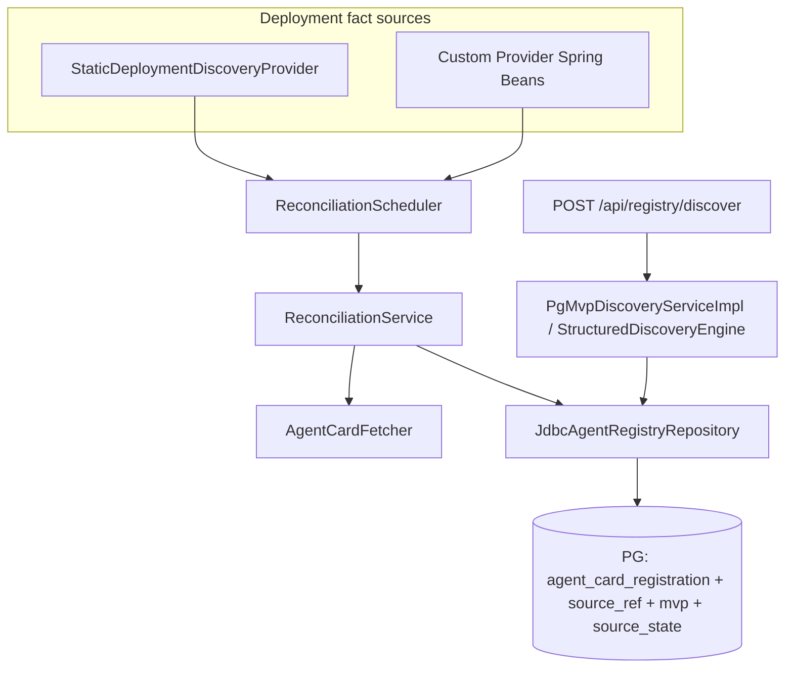
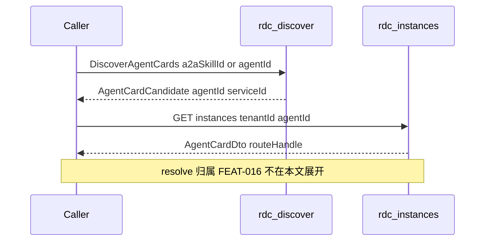
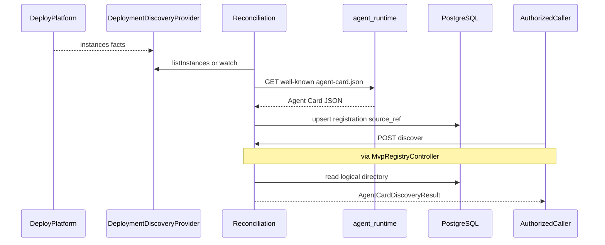

# Agent Card 注册与发现 — L2 低层设计

> 本文档把 `version-scope/Feat-015-agent-card-registration-and-discovery.md`（主动抓取 + 逻辑发现）落地为 `agent-bus` registry-discovery-center 单元的低层设计。
>
> **实现基线**：共享运行态技术细节（实例表 SQL / 探活 / RLS）见 [registry-discovery-runtime-design.cn.md](./registry-discovery-runtime-design.cn.md)；本文聚焦 Feat-015 特性视角下的部署事实接入、对账、逻辑目录、结构化发现、失败码与和 FEAT-016 的边界。
>
> **文档边界说明**：仓库根目录或外部 Downloads 中早期 `Feat-Func-015` 草稿混写了 **push 注册 + discover 携带 `routeHandle`**（更接近 FEAT-016）。本文以 **version-scope** 为准，**不**把实例路由查询当作 Feat-015 主契约。

## 1. 概述

### 1.1 特性定位

- **是什么**：registry-discovery-center 通过可替换的 `DeploymentDiscoveryProvider` 获取可信 Agent Service 发布事实，依据内部 `baseUrl` 主动抓取 `agent-runtime` 暴露的标准 A2A Agent Card（`/.well-known/agent-card.json`），经校验后维护租户隔离的逻辑 Agent Card 目录；授权调用方通过 `DiscoverAgentCards` 按结构化条件查询零个或多个**逻辑**候选。
- **解决什么**：before——平台无法持续掌握「有哪些标准 Card、声明了什么能力、何时更新/撤销」，调用方与部署事实脱节；after——部署扩缩容 / 滚动升级经对账收敛到可发现目录，查询返回去重后的逻辑候选（带 `registrationStatus` / `freshness`），**不含**物理 endpoint / `routeHandle` / 实例健康。
- **与 FEAT-016**：调用方在 015 确定逻辑 `agentId` / `serviceId` 后，再由 gateway 或 `agent-runtime` 按 FEAT-016 查询可路由实例。见 [FEAT-016-runtime-instance-route-query.md](../../../version-scope/FEAT-016-runtime-instance-route-query.md)。

### 1.2 核心设计原则

| 原则 | 理由 |
|------|------|
| **正式注册路径 = Provider + reconciliation，不是 HTTP push** | version-scope §5.1.3；`rdc.deployment-discovery.enabled=true` 时 `POST /register` → **410**。 |
| **逻辑候选，不按运行实例展开** | 同一 Card digest 的多发布来源合并为一个候选；实例路由属 FEAT-016。 |
| **`agentId` = 部署 `serviceId` 派生，不是 Card `name`** | `AgentIdCodec.derive(tenantId, serviceId)` → `serviceId.trim()`；`name` 仅展示。 |
| **租户强制 + caller 鉴权** | `tenantId` 贯穿发布事实与查询；`caller-allowlist` 可选收紧 `callerRef`。 |
| **最后有效快照** | 刷新失败 → `STALE_CARD` 仍可发现；provider 短时不可用 → `STALE_SOURCE`；首次从未成功 → `PENDING` / `NO_MATCH`。 |
| **Provider 可替换** | SPI 固定；内置 static-config；任意 Spring Bean 可插拔；**不强制内置 K8s**。 |

### 1.3 子特性全景

| 子特性 | 关键抽象 | 状态 |
|--------|---------|------|
| 部署发布事实接入 | `DeploymentDiscoveryProvider`、`StaticDeploymentDiscoveryProvider`、可插拔 Bean | ✅（K8s 适配器未内置） |
| 标准 A2A Card 主动抓取 | `AgentCardFetcher`、`AgentCardValidator` | ✅ |
| Card 安全抓取 | `allowed-cidrs`、可选 mTLS / 签名 | ✅（默认宽松关闭） |
| 事件监听 + 周期全量对账 | `ReconciliationScheduler` / `ReconciliationService` | ✅ |
| 逻辑目录维护 | `agent_card_registration`、`agent_card_source_ref` | ✅ |
| 多实例去重 / 多版本共存 | digest + `capabilityVersion` | ✅ |
| 最后有效快照 | `Freshness.STALE_CARD` / `STALE_SOURCE` | ✅ |
| 结构化逻辑发现 | `POST /api/registry/discover`、`discoverAgentCards` | ✅ |
| 租户与 caller 边界 | RLS + allowlist + `TENANT_SCOPE_DENIED` | ✅ |
| 内置 Kubernetes Provider | — | ⬜（接线已具备，见 §8） |
| 运行时实例路由 | FEAT-016 | ➡️ 范围外 |

## 2. 功能规格

### 2.1 能力清单

| 能力 | 状态 | 说明 |
|------|------|------|
| 部署事实全量快照 | ✅ | `listInstances()` → `ListDeploymentInstancesResult`（sourceId + revision + observations） |
| 部署事实增量 watch | ✅ | `watchInstances(consumer)`；静态实现为 snapshot diff「伪 watch」；动态 Bean 可推真事件 |
| 可插拔 Provider 接线 | ✅ | Scheduler 注入全部 `DeploymentDiscoveryProvider` Bean + 可选 yml static |
| 无 yml 绑定时的默认 runtime binding | ✅ | `rdc.deployment-discovery.binding-defaults` |
| Card 抓取与校验 | ✅ | scheme/超时/大小；`AgentCardValidator` 必填字段；失败不进有效目录 |
| 网络边界 | ✅ | `InternalNetworkPolicy` + `allowed-cidrs`（空 = 不限制） |
| 逻辑注册 upsert | ✅ | REGISTERED + digest；多 source_ref |
| 首次抓取失败 | ✅ | PENDING；discover → `NO_MATCH` |
| 刷新失败 | ✅ | STALE_CARD；discover 仍可 `SUCCESS` |
| 来源移除 | ✅ | 末来源 → REMOVED，退出发现 |
| 结构化 discover | ✅ | `agentId` / `serviceId` / `a2aSkillId` 至少一；约束过滤；分页 token |
| push 注册 | ⚠️ | 兼容遗留；deployment-discovery 开启时 **410** |
| pull-registration | ⚠️ | 遗留 bootstrap；主路径为 deployment-discovery |

### 2.2 显式排除

| 排除项 | 替代 |
|--------|------|
| discover 返回 `routeHandle` / `endpointUrl` / `instanceId` / 实例健康 | FEAT-016 `GET /instances...` + `POST /route-handle/resolve` |
| 内置 K8s/PaaS Provider 实现 | 集成方实现 SPI 并注册 Spring Bean |
| 语义检索 / 推荐排序 / 自由文本意图匹配 | 非本 version-scope MUST |
| Agent 业务定义源、Task 状态 | agent-runtime / 其他域 |

### 2.3 接口契约（Logical View）

#### 2.3.1 部署发现扩展 SPI

```java
public interface DeploymentDiscoveryProvider {
    String sourceId();
    ListDeploymentInstancesResult listInstances();
    default void watchInstances(DeploymentInstanceEventConsumer consumer) { /* optional */ }
}
```

| 类型 | 含义 |
|------|------|
| `DeploymentInstanceObservation` | tenantId, serviceId, instanceId, internalBaseUrl, deploymentVersion, readiness (READY/TERMINATING), sourceId, sourceRevision, observedAt |
| `ListDeploymentInstancesResult` | sourceId, sourceRevision, observations |
| `DeploymentInstanceEvent` | ADDED / MODIFIED / TERMINATING / DELETED 等 |
| `SourceRevisionGapException` | 增量不可恢复 → 强制全量 |

#### 2.3.2 逻辑发现 SPI / HTTP

```java
public interface AgentDiscoveryService {
    DiscoveryResult discover(DiscoveryQuery query);
    default AgentCardDiscoveryResult discoverAgentCards(AgentCardDiscoveryQuery query) { ... }
    // FEAT-016 实例查询与 resolveRouteHandle：同接口共存，契约归属 FEAT-016
}
```

| HTTP | 归属 |
|------|------|
| `POST /api/registry/discover` | **Feat-015** |
| `POST /api/registry/register` | 遗留；deployment-discovery on → **410** |
| `GET /api/registry/instances/...`、`POST /api/registry/route-handle/resolve` | **FEAT-016**（`InstanceRouteController`） |

#### 2.3.3 关键数据类型

##### AgentCardDiscoveryQuery（HTTP body 映射）

| 字段 | 要求 |
|------|------|
| `context.tenantId` / `callerRef` / `requestId` / `deadline` | context 必填；caller 可来自 `X-Caller-Ref` |
| `agentId` / `serviceId` / `a2aSkillId` | 至少一项；多项 AND |
| `constraints.*` | 可选硬约束（版本、skill tags、capabilities、modes、security） |
| `limit` / `continuationToken` | 可选分页 |

##### AgentCardCandidate（发现候选）

| 字段 | 说明 |
|------|------|
| `agentId` / `serviceId` | 逻辑身份 |
| `agentCardJson` | 标准 Card JSON 快照 |
| `contractVersion` / `capabilityVersion` | 版本 |
| `registrationStatus` | PENDING / REGISTERED / REMOVED（普通发现仅 REGISTERED） |
| `freshness` | FRESH / STALE_CARD / STALE_SOURCE |
| `lastValidatedAt` | 上次校验成功时间 |
| `matchedA2aSkillId` | 按 skill 查询时回填 |

**禁止字段**：`routeHandle`、`instanceId`、`endpointUrl`、实例 `health`。

##### DiscoveryOutcome

`SUCCESS` | `NO_MATCH` | `VERSION_UNAVAILABLE` | `CONSTRAINT_UNAVAILABLE`

##### 注册状态 / 新鲜度

与 version-scope §5.1.4 一致（见本文 §1.2）。

##### agentId 派生

```text
agentId = AgentIdCodec.derive(tenantId, deploymentServiceId)
        = deploymentServiceId.trim()
```

#### 2.3.4 行为承诺

- **必须**：正式注册走 Provider + reconcile；开启 deployment-discovery 时拒绝 push register（410）。
- **必须**：discover 结果不按实例展开、不携带路由/endpoint 明文。
- **必须**：观测实例无 yml `instances[]` 匹配时使用 `binding-defaults`（cardPath / routeKey / frameworkType 等）。
- **必须**：`STALE_CARD` / `STALE_SOURCE` 在受控语义下可继续被发现并携带 freshness / lastValidatedAt。
- **必须**：跨 tenant / 未授权 caller 以结构化失败返回，不泄露存在性。
- **禁止**：把 FEAT-016 实例列表语义写进 Feat-015 discover 契约。
- **允许**：不内置 K8s Provider（产品可选）。

## 3. 模块结构（Development View）

### 3.1 包结构（MVC 架构）

rdc 的 Development View 采用 **Spring Boot REST 风格的 MVC 分层**（无服务端 View；HTTP 边界返回 JSON）：

| MVC / 分层 | 包 | 职责 |
|---|---|---|
| **M — Model** | `model` / `model.deployment` | 纯 Java 契约与 DTO（DiscoveryQuery、AgentRegistryEntry、DeploymentDiscoveryProvider SPI 等）；无 Spring / JDBC |
| **C — Controller** | `controller` | HTTP 入口：`MvpRegistryController`（Feat-015 discover/register）、`InstanceRouteController`（FEAT-016） |
| **业务 / Service** | `service` | 发现编排、`StructuredDiscoveryEngine`、`RouteHandleCodec` |
| **数据访问** | `repository` | **唯一**允许 JDBC 的包（Port + `JdbcAgentRegistryRepository`） |

Feat-015 运行时专属包（仍受同一分层约束：不碰 JDBC，经 `repository` / `service` 协作）：

| 包 | 角色 |
|---|---|
| `card` | Agent Card 抓取 / 校验 / digest |
| `deployment` | 静态 Provider + `rdc.deployment-discovery` 配置 |
| `reconcile` | 对账调度与快照收敛 |
| `security` | caller allowlist、card-fetch 网络/mTLS 边界 |
| `config` | Bean / Flyway / Micrometer / OpenAPI 装配 |
| `health` / `pull` / `tenant` | 探活、遗留 pull 注册、租户 ThreadLocal |

> **实现基线**：`spi.registry` → `model`，`spi.deployment` → `model.deployment`，`registry.runtime.api` → `controller`，`registry.runtime.discovery` → `service`，`registry.runtime.persistence.jdbc` → `repository`，其余 `registry.runtime.*` 去掉前缀后落为同名顶层包，runtime 根配置 → `config`。

```
com.openjiuwen.rdc/
├── AgentRdcApplication.java
├── model/                 # M：契约/DTO（DiscoveryQuery/Result、AgentCard*、RegistryFailure、
│   │                      # AgentIdCodec、AgentRegistryEntry、RouteResolution…）
│   └── deployment/        # M：DeploymentDiscoveryProvider SPI、Observation、Events、Readiness…
├── controller/            # C：MvpRegistryController（discover/register/deregister）
│                          #    InstanceRouteController（FEAT-016）
│                          #    RegistryApiExceptionHandler、RegistryEntryValidator…
├── service/               # Service：AgentDiscoveryService、PgMvpDiscoveryServiceImpl、
│                          # StructuredDiscoveryEngine、RouteHandleCodec、ContinuationTokenCodec
├── repository/            # 数据访问：AgentRegistryRepository、Jdbc*（唯一 JDBC）
├── card/                  # AgentCardFetcher、Validator、签名、CardDigest、RouteTargetDeriver
├── deployment/            # StaticDeploymentDiscoveryProvider、DeploymentDiscoveryProperties
├── reconcile/             # ReconciliationScheduler、ReconciliationService、SnapshotFingerprint
├── security/              # CallerAuthorizationPolicy、InternalNetworkPolicy、card-fetch 配置
├── config/                # RegistryRuntimeBeanConfig、Observability、Scheduling、OpenAPI
├── health/                # MvpHealthProbeScheduler（实例侧，支撑 016/治理）
├── pull/                  # 遗留 PullRegistrationBootstrap
└── tenant/                # TenantContext、ThreadLocalTenantContext
resources/db/migration/
├── V2…V6                  # 实例表演进（含 FEAT-016 V6）
└── V7…V11                 # Feat-015 治理 / source state / 逻辑目录
```

### 3.2 核心关系



## 4. 核心设计（Logical + Process View）

### 4.1 Provider 接线与对账调度

```text
ApplicationReady + @Scheduled(reconcile-interval)
        │
        ▼
ReconciliationScheduler
  ├─ ObjectProvider<DeploymentDiscoveryProvider>  // 动态 Bean（跳过重复 Static 类型）
  └─ 若 instances[] 非空 → 构造 StaticDeploymentDiscoveryProvider
        │
        ├─ watchInstances(reconcileEvent)
        └─ reconcile(provider) 全量
```

- 两边都空：打 WARN，不对账。
- 自定义 Bean 无需为每个 Pod 写 yml；runtime 绑定走 `binding-defaults`。

### 4.2 Observation → Card → 逻辑目录

```text
listInstances() / event
        │
        ▼
对每个 READY observation：
  binding = yml instances 匹配 || binding-defaults
  fetchValidated(baseUrl, cardPath, headers)
        │
        ├─ 失败且无既有 digest → reconcilePending (PENDING)     // 2A / 11A
        ├─ 失败且有既有 digest → markRefreshDegraded (STALE_CARD) // 2B / 11B
        └─ 成功 → digest = sha256(card)
              ├─ 同 digest → 心跳/清 STALE_CARD / relink source_ref
              └─ 新 digest → upsert 实例行 + 逻辑 registration + source_ref
                            （旧 digest 失联来源 → REMOVED）
TERMINATING / snapshot 缺失实例 → DRAINING → grace 后 REMOVED（逻辑侧按末来源规则）
```

### 4.3 多实例去重与多版本

- 同 `(tenant, serviceId)` 下多 `instanceId` 发布相同 Card 内容 → **一个**逻辑候选，多个 `agent_card_source_ref`。
- 不同 `AgentCard.version`（映射 `capabilityVersion`）→ 可并存为不同候选；discover 按 `constraints.capabilityVersion` / `contractVersion` 过滤；无版本命中 → `VERSION_UNAVAILABLE`。

### 4.4 DiscoverAgentCards

```text
HTTP POST /discover
  → resolve callerRef (header > body > "http-client")
  → CallerAuthorizationPolicy
  → build AgentCardDiscoveryQuery
  → StructuredDiscoveryEngine / repository 读 agent_card_registration
  → 过滤：目标字段 AND 约束
  → outcome + candidates + nextToken
```

零候选是正常 `AgentCardDiscoveryResult`（非异常）。授权失败等抛 `RegistryFailureException` → `RegistryApiExceptionHandler`。

### 4.5 与 FEAT-016 衔接（边界）



## 5. 配置模型（Physical View）

### 5.1 示例（摘录）

```yaml
rdc:
  deployment-discovery:
    enabled: true
    reconcile-interval: 30s
    draining-grace-period: 30s
    binding-defaults:
      framework-type: JIUWEN
      route-key: /v1/query
      contract-version: "1.0.0"
      capability-version: "1.0.0"
      card-path: /.well-known/agent-card.json
      max-concurrency: 10
      weight: 100
    instances:
      - tenant-id: tenant-A
        service-id: billing-svc
        instance-id: billing-svc-pod-0
        base-url: http://localhost:8090
        readiness: READY
        framework-type: JIUWEN
        card-path: /.well-known/agent-card.json
        # ...
  registry:
    security:
      caller-allowlist: {}    # 例: tenant-A: [gateway]
    card-fetch:
      mtls-enabled: false
      signature-verification-enabled: false
      allowed-cidrs: []       # 例: ["10.0.0.0/8"] 拒绝 localhost
```

### 5.2 属性表

| 属性 | 默认 | 说明 |
|------|------|------|
| `rdc.deployment-discovery.enabled` | false（产物 yml 常为 true） | 开启调度；push register → 410 |
| `rdc.deployment-discovery.reconcile-interval` | 60s | 周期全量 |
| `rdc.deployment-discovery.draining-grace-period` | 30s | DRAINING → 移除宽限 |
| `rdc.deployment-discovery.binding-defaults.*` | 见上 | 动态源无 yml 条目时 |
| `rdc.deployment-discovery.instances[]` | `[]` | 静态事实清单 |
| `rdc.registry.security.caller-allowlist` | `{}` | 空 = 仅要求非空 callerRef |
| `rdc.registry.card-fetch.allowed-cidrs` | `[]` | 空 = 不限制抓取目标 IP |
| `server.port` | 8092 | HTTP |

### 5.3 持久化对象（Feat-015 相关）

| 对象 | Flyway | 职责 |
|------|--------|------|
| `agent_registry_mvp` | V2–V8+ | 实例级治理 / 抓取锚点（与 016 共用） |
| `registry_source_state` | V9–V10 | provider revision / fingerprint / stale |
| `agent_card_registration` | V11 | **逻辑发现目录** |
| `agent_card_source_ref` | V11 | 逻辑 Card ↔ 发布实例来源 |

细节 SQL 见 runtime-design 与 migration 文件；本文不重复列定义。

## 6. 对外呈现 / 用户场景（Scenario View）

### 6.1 外部接口

| 端点 / SPI | 说明 |
|------------|------|
| `POST /api/registry/discover` | 逻辑 Agent Card 发现 |
| `DeploymentDiscoveryProvider` Bean | 部署事实扩展点 |
| `POST /api/registry/register` | 开启 deployment-discovery 时 **410** `push_registration_disabled` |
| `DELETE /api/registry/deregister/...` | 运维删实例/目录辅助（与治理并存） |

Headers：`X-Caller-Ref`、`traceparent` / `X-Trace-Id`。

### 6.2 用户示例

#### 6.2.1 静态事实 → discover（场景 1）

前置：`instances[]` 指向 mock `8090`；重启对账成功。

```bash
curl -s -X POST "$RDC/api/registry/discover" \
  -H 'Content-Type: application/json' \
  -H 'X-Caller-Ref: gateway' \
  -d '{
    "context":{"tenantId":"tenant-A","callerRef":"gateway","requestId":"s1"},
    "agentId":"billing-svc",
    "limit":5
  }'
# 期望: outcome=SUCCESS, registrationStatus=REGISTERED, freshness=FRESH
# 候选无 routeHandle / instanceId
```

#### 6.2.2 仅 a2aSkillId（贴近「先能力后身份」）

```bash
curl -s -X POST "$RDC/api/registry/discover" \
  -H 'Content-Type: application/json' -H 'X-Caller-Ref: gateway' \
  -d '{
    "context":{"tenantId":"tenant-A","callerRef":"gateway","requestId":"disc-03"},
    "a2aSkillId":"place-order",
    "limit":10
  }'
# 期望: SUCCESS, matchedA2aSkillId=place-order, agentId=billing-svc
# 随后用候选 agentId 调 FEAT-016 实例接口
```

#### 6.2.3 可插拔自定义 Provider（场景 12）

实现 `@Component` `DeploymentDiscoveryProvider`（`sourceId=manual-dynamic`），可清空 `instances[]`，依赖 `binding-defaults`。日志：

```text
registered deployment discovery provider sourceId=manual-dynamic
reconciliation startup source=manual-dynamic ...
```

discover 报文与期望样例见测试计划「场景 12」；验完删除临时 Bean。

### 6.3 E2E 流程



## 7. 错误处理（Process View）

### 7.1 发现业务 outcome（非异常）

| outcome | 条件 |
|---------|------|
| `SUCCESS` | ≥1 逻辑候选 |
| `NO_MATCH` | 无匹配有效注册（含仅 PENDING） |
| `VERSION_UNAVAILABLE` | 逻辑命中但版本约束无满足 |
| `CONSTRAINT_UNAVAILABLE` | 版本过、声明约束无满足 |

### 7.2 RegistryFailure → HTTP

经 `RegistryApiExceptionHandler`：

| failureCode | HTTP | 典型触发 |
|-------------|------|----------|
| `INVALID_QUERY` | 400 | 缺 context / 非法查询 / 坏 token |
| `CALLER_NOT_AUTHORIZED` | 403 | allowlist 拒绝 |
| `TENANT_SCOPE_DENIED` | 403 | 租户交叉（如 resolve 错 tenant；归属 016 也走同一 handler） |
| `DEADLINE_EXCEEDED` | 503 | deadline 过期 |
| `REGISTRY_UNAVAILABLE` | 503 | 持久化故障包装 |
| `push_registration_disabled` | 410 | push 在 deployment-discovery on |

对账侧（通常不直接作为 discover 失败体，而影响 freshness / 目录）：

`AGENT_CARD_FETCH_FAILED` | `AGENT_CARD_SOURCE_REJECTED` | `AGENT_CARD_INVALID` | `AGENT_CARD_SIGNATURE_INVALID` | `DEPLOYMENT_SOURCE_UNAVAILABLE` | `SOURCE_REVISION_GAP`

### 7.3 scope §5.1.6 映射

| scope | L2 |
|-------|-----|
| 查询失败码五类 | 上表 discover 路径 ✅ |
| Card/部署失败进 freshness | ✅ STALE_* / PENDING |
| 零候选 | outcome，非失败 ✅ |

## 8. 限制与待补

| 限制 | 说明 | 规划 |
|------|------|------|
| 无内置 K8s Provider | SPI + Scheduler 可插拔 + binding-defaults 已具备 | 产品可选里程碑 |
| Static watch | snapshot diff，非集群 Informer | 动态 Bean 提供真 watch |
| pull-registration | 遗留；与 deployment-discovery 并存但非主路径 | 逐步退役 |
| push register | 开启 015 主路径时 410 | 保持兼容开关 |
| 实例路由 | 不在本文展开 | FEAT-016 L2 / version-scope |
| 语义检索 / 推荐 | 非本 MUST | 后续增强 |

## 9. 与 scope 文档的对齐矩阵

| version-scope | L2 落地 | 状态 |
|---------------|---------|------|
| §2 部署发布事实接入 MUST | §2.3.1 / §4.1 | ✅ 可替换；K8s 未内置 ⚠️ |
| §2 主动抓取 MUST | §4.2 / `AgentCardFetcher` | ✅ |
| §2 注册校验 MUST | `AgentCardValidator` | ✅ |
| §2 安全抓取 MUST | `allowed-cidrs` / 可选 mTLS 签名 | ✅ |
| §2 多实例去重 MUST | §4.3 / source_ref | ✅ |
| §2 多版本共存 MUST | §4.3 / VERSION_UNAVAILABLE | ✅ |
| §2 事件+周期对账 MUST | §4.1 Scheduler | ✅ |
| §2 更新撤销 MUST | §4.2 REMOVED / DRAINING | ✅ |
| §2 最后有效快照 MUST | §4.2 STALE_CARD | ✅ |
| §2 实现可替换 MUST | 可插拔 Bean + binding-defaults | ✅ |
| §2 租户与 caller MUST | allowlist + RLS | ✅ |
| §2 确定性查询 MUST | §4.4 discover | ✅ |
| §2 逻辑候选 MUST | AgentCardCandidate 无实例字段 | ✅ |
| §2 明确结果与失败 MUST | §7 | ✅ |
| §2 审计 SHOULD | `RegistryObservabilityConfig` / registry.audit | ✅ |
| §3.1 DiscoverAgentCards | `POST /discover` | ✅ |
| §3.2 DeploymentDiscoveryProvider | SPI + static + 可插拔 | ✅（具体动态适配器可选） |
| §5.1.1 身份 | AgentIdCodec | ✅ |
| §5.1.4 状态/新鲜度 | 枚举 + 可发现 STALE_* | ✅ |
| §5.1.5–5.1.6 查询/outcome | StructuredDiscovery | ✅ |
| §5.2 职责边界 → 016 | §1.1 / §4.5 | ✅ |

