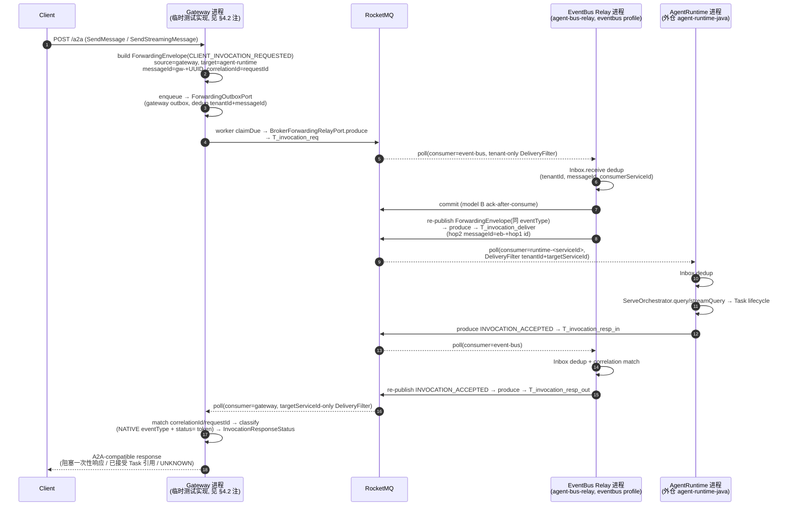
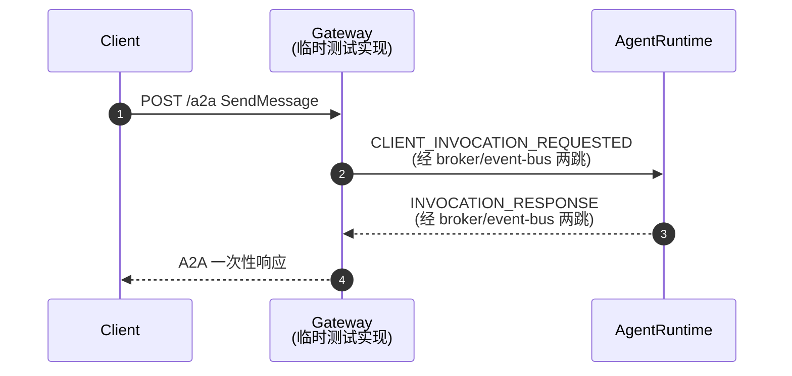
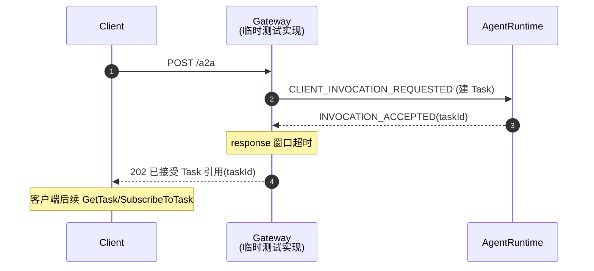
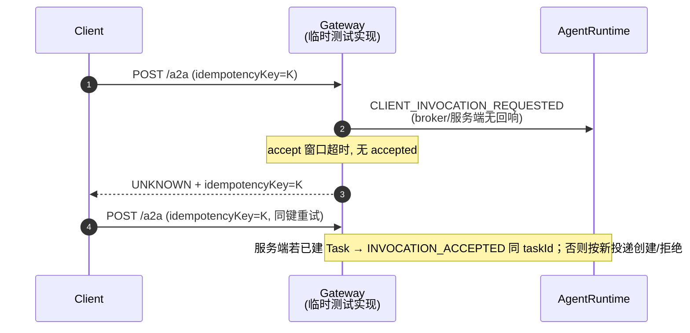
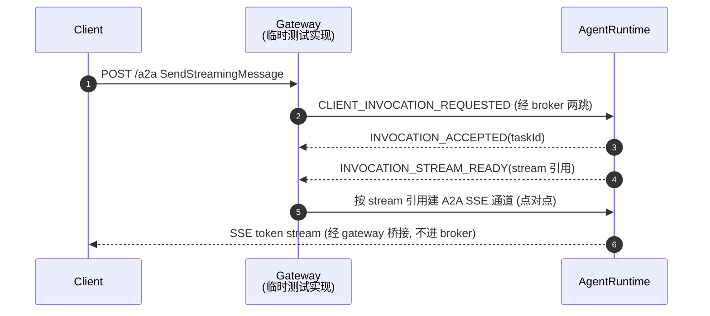

# FEAT-013 L2 技术设计：客户端调用事件转发（gateway ↔ event-bus，RocketMQ pub/sub 两跳）

> 命名说明：本文架构语义（所有权、参与者、状态归属）使用 L0 逻辑名 `agent-runtime` / `agent-core`。当前真实 `agent-runtime` 实现为外仓 `agent-runtime-java`（仓内 `agent-runtime/` 目录为废弃代码，不作为事实源）；本 L2 涉及 agent-runtime 处均指外仓真实实现。
>
> **代码仓迁移（2026-07-17，事实源切换）**：`agent-bus` 代码已从 `spring-ai-ascend/agent-bus` 迁移至 **agent-solution 仓 `common/agent-bus/`**（事实源；spring-ai-ascend 仓内 `agent-bus/` 目录已废弃，不作为事实源）。迁移要点：① 包名 `com.huawei.ascend.bus` → `com.openjiuwen.bus`；② 拆为 4 个 Maven 模块——`agent-bus-spi`（纯 Java 契约：`forwarding.spi`/`forwarding.spi.broker`/`forwarding.runtime` 状态机 + `forwarding.runtime.transport` 端点解析器 + `forwarding.runtime.transport.broker` broker 消息类型）/ `agent-bus-sdk`（adapter + JDBC + wiring + Flyway：`forwarding.common`/`forwarding.runtime.*`/`transport.broker.rocketmq`/`persistence.jdbc`）/ `agent-bus-relay`（独立 event-bus 进程：`forwarding.runtime.relay` + `EventBusRelayApplication`）/ `agent-bus-testkit`（InMemory 替身 + `TestAgentRuntime`）；③ 单一入口 `AgentBusApplication`（两 profile）→ `EventBusRelayApplication`（`@SpringBootApplication(scanBasePackages="com.openjiuwen.bus")`，`eventbus` profile 经 CLI `--spring.profiles.active=eventbus` 激活，仅 relay、无 gateway/registry 组件扫描）；④ gateway 运行时（`GatewayRuntimeService`/`GatewayRuntimeController`/`GatewayRuntimeConfiguration`）+ ingress SPI（`IngressEnvelope`/`IngressGateway`/`IngressResponse`）**临时**置于 `agent-bus-relay` **测试源码**（由 `TempClientMain` 在 `gateway` profile 内启动 Spring context，仅为独立 E2E 联调而设、**非正式 gateway**）；正式 gateway 为后续单独实现的 sibling 模块、未迁入本仓。**本 L2 凡 gateway 相关"已落地"实现说明均指该临时测试实现，最终以正式 gateway 生成代码实现为准。**⑤ registry-discovery-center 平面（`V2__create_agent_registry_mvp.sql`/`MvpRegistryController`/`PgMvpDiscoveryServiceImpl`/`RouteHandleCodec`/`AgentDiscoveryService`）**未迁移**，route handle 由 `MapEndpointResolver`（配置映射）+ `IngressEnvelope.requestAttributes` 解析，topic 由 `BrokerTopicResolver`（`ascend_bus_<routeHandle.value()>_<suffix>`）派生、不经配置项声明；⑥ Flyway 仅 `V1`+`V3`（无 `V2`/registry 表）。本文既有 `5193972e` as-built 注记（de-gateway-ification：`gw-`/`eb-` messageId 前缀、`originalCaller`、gateway 2 SPI-only bean、共享 outbox 等）在迁移后仍然成立——迁移为叠加层。下文包路径/类路径均按迁移后 `com.openjiuwen.bus` 表达。

## 1. 概述

### 1.1 特性定位

FEAT-013 把 `version-scope/FEAT-013` 在外部行为层定义的"客户端调用事件转发"投影为可落地的 L2 技术设计。它约束 `agent-bus` 逻辑域中 **gateway 单元** 与 **event-bus 单元** 之间的客户端调用与响应事件转发语义，并落地本期已确定的 4 条运行态决策：

1. 三单元（gateway / event-bus / registry-discovery-center）独立可替换部署——FEAT-013 §2 设计意图不变。as-built（agent-solution 仓 `common/agent-bus/`，见命名说明）：event-bus relay（`agent-bus-relay`，`@Profile("eventbus")`）为唯一生产 fat-jar 进程；gateway 运行时降级为 `agent-bus-relay` 测试源码（`TempClientMain` 驱动 `gateway` profile，生产 gateway 为 sibling 模块未迁入本仓）；registry-discovery-center 平面未迁移（route handle 由 `MapEndpointResolver` + `IngressEnvelope.requestAttributes` 解析）。三单元逻辑边界与可替换性仍是本 L2 约束对象。
2. gateway→event-bus 与 event-bus→agent-runtime **两跳均经 broker pub/sub**。
3. broker 选型 = **RocketMQ**。
4. event-bus→agent-runtime **不走 a2a push**（现有 `A2aForwardingDeliveryPort` 的 T1 HTTP 同步 push 路径在本特性范围内被 broker pub/sub 取代，T1 PoC 保留共存/灰度切换，见 §8）。

本 L2 解决的问题（before → after）：
- before：`version-scope/FEAT-013` 留空 broker 与部署（"不规定具体 broker、topic…"、"不承诺三单元同进程"）；代码侧 gateway 仅 SPI 无实现，event-bus→agent-runtime 为 T1 HTTP push，事件信封无 `eventType`，事件类型常量零落地。
- after：固定 RocketMQ pub/sub 两跳拓扑、三单元部署拆分、扩展后的 `AgentBusEventEnvelope`（= `ForwardingEnvelope` + eventType/source/target）、FEAT-013 事件类型枚举、调用响应状态机、gateway 生产实现落点、agent-runtime 侧 consumer/producer 落点。

### 1.2 核心设计原则

- **broker pub/sub 两跳，event-bus 为治理中继** — gateway→event-bus→agent-runtime 两跳均经 RocketMQ；event-bus 在两跳间做 inbox 去重 / 租户校验 / correlation / 审计，不是字节透传。理由：满足"两跳均经 broker"约束的同时保留 event-bus 治理责任（FEAT-013 §5.1.1 "event-bus 负责在生产方与消费方之间转发事件和维护投递治理语义"）。
- **A2A payload 兼容，bus 信封分离** — A2A JSON-RPC / Task / SSE 语义只作为 envelope 的 `payloadRef` 或 inline payload 出现；外层 `AgentBusEventEnvelope` 承载 tenant/trace/correlation/idempotency/deadline/route 治理字段。理由：FEAT-013 §3 "A2A JSON-RPC 只能作为 payload 或 payload 引用出现，不承担 bus 投递治理职责"。
- **bus 不拥有 Task** — `agent-bus` 不创建、不写入、不推进服务端 Task execution state；Task 生命周期仍归 `agent-runtime`。理由：FEAT-013 §5.2 + L0 boundaries。
- **三单元独立可替换** — gateway / event-bus / registry-discovery-center 作为可独立实现、独立部署、可由客户存量系统替换的运行时单元；本 L2 只约束它们之间的契约语义。理由：FEAT-013 §2 "三单元可替换部署 MUST"。
- **至少一次 + 幂等三层** — broker 模型 B ack-after-consume（至少一次）；bus 投递幂等（`tenantId+messageId`）、服务端创建幂等（`tenantId+idempotencyKey`，net-new in agent-runtime）、gateway 客户端重试幂等（复用 `idempotencyKey`）。理由：FEAT-013 §5.1.6。

### 1.3 子特性全景

| 子特性 | 职责 | 关键抽象 | 状态 |
|--------|------|---------|------|
| 客户端调用事件发布 | gateway 把客户端调用封装为事件投递到 event-bus | `AgentBusEventEnvelope`(eventType=`CLIENT_INVOCATION_REQUESTED`) + `BrokerForwardingRelayPort` | ✅ 已落地（`GatewayRuntimeService` 经 `forwardingOutbox`+`requestRelay` produce，de-gateway-ified；见 §3.1/§4.2） |
| 响应事件转发 | agent-runtime 把接受/拒绝/失败/响应/流准备/终态回传 gateway | `INVOCATION_*` 事件 + `BrokerForwardingConsumerPort` | ⬜ 外仓 agent-runtime producer（in-flight；落点见 feat-014 §3） |
| 接受等待窗口 UNKNOWN | gateway 在窗口内无法确认服务端是否建 Task 时返回 UNKNOWN | 调用响应状态机 `UNKNOWN` 分支 | ✅ 已落地（`GatewayRuntimeService.acceptWindow`；窗口超时判断移至 poll 前，见 §4.2/§4.3） |
| 流式 SSE 桥接 | gateway 在客户端连接存在时桥接 agent-runtime A2A SSE | stream 引用 + `SseEmitter`（复用 agent-runtime） | ⬜ net-new（gateway 桥接未落地；token chunk 不进 broker 不变） |
| 幂等与重试 | 三层幂等 + UNKNOWN 后同键重试 | outbox/inbox dedup + `idempotencyKey` | ✅ 复用 outbox/inbox（bus 投递，含 `eb-` hop2 messageId）/ ⬜ net-new（服务端创建，agent-runtime 侧） |
| 调用响应状态机 | gateway 侧观测态 COMPLETED_RESPONSE/ACCEPTED_WITH_TASK/STREAM_READY/REJECTED/FAILED/UNKNOWN | 新枚举 `InvocationResponseStatus` | ✅ 已落地（`InvocationResponseStatus` + `GatewayRuntimeService.classify`；cancelled→COMPLETED_RESPONSE，见 §4.3） |

---

## 2. 功能规格

### 2.1 能力清单

| 能力 | 级别 | 状态 | 说明 |
|---|---|---|---|
| 客户端调用事件发布 | MUST | ✅ | gateway 封装客户端调用为 `CLIENT_INVOCATION_REQUESTED` 经 RocketMQ 投递到 event-bus。`BrokerForwardingRelayPort` SPI 已落地；RocketMQ adapter 落地于 `transport.broker.rocketmq`（`RocketMqBrokerForwardingRelay`/`Consumer` + `RocketMqBrokerClientConfiguration` role-agnostic 客户端 bean，见 §3.1/§5）。 |
| 服务端响应事件转发 | MUST | ⬜ | agent-runtime 把 `INVOCATION_*` 经 RocketMQ 回传 event-bus→gateway。agent-runtime producer 外仓 in-flight（落点见 feat-014 §3）。 |
| 三单元可替换部署 | MUST | ✅ | 三单元（gateway / event-bus / registry-discovery-center）独立可替换——设计意图。as-built：event-bus relay（`agent-bus-relay`，`eventbus` profile）为唯一生产进程；gateway 运行时为 `agent-bus-relay` 测试源码（`TempClientMain` 驱动）；registry 平面未迁入本仓（见 §5）。 |
| 外层 bus 事件信封 | MUST | ✅ | 扩展 `ForwardingEnvelope` 为 `AgentBusEventEnvelope`（additive `eventType`/`sourceServiceId`/`targetServiceId`）；outbox record 镜像 `correlationId`/`eventType`（V3 migration，见 forwarding-persistence §3.1）。 |
| A2A payload 兼容 | MUST | ✅ | A2A JSON-RPC/Task/SSE 作为 `payloadRef` 或 inline payload；不承担治理职责。 |
| 同步阻塞调用转发 | MUST | ✅ | gateway 在等待窗口内返回最终响应 / 已接受 Task 引用 / 拒绝 / 失败 / UNKNOWN（`GatewayRuntimeService.acceptWindow`，窗口超时判断在 poll 前）。 |
| 流式调用请求转发 | MUST | ✅ | 流式请求事件同阻塞经 broker 投递（共用 produce 路径）；token chunk 不进 broker。 |
| A2A SSE 流桥接 | MUST | ⬜ | gateway 按 stream 引用与服务端建立 A2A SSE 并桥接客户端；复用 agent-runtime `SseEmitter`。未落地（响应侧 SSE 桥接 net-new）。 |
| INVOCATION_ACCEPTED 与 INVOCATION_STREAM_READY 分离 | MUST | ✅ | 接受建 Task 与流可订阅分离表达（`AgentBusEventType` 枚举 + `classify` 区分；SSE 桥接本身 ⬜）。 |
| UNKNOWN 响应状态 | MUST | ✅ | 接受窗口内无法确认建 Task 时返回 UNKNOWN，不误报成功/失败（`acceptWindow` accept-deadline 分支）。 |
| 服务端创建幂等 | MUST | ⬜ | `tenantId+idempotencyKey` 幂等键，net-new in agent-runtime（外仓 in-flight）。 |
| bus 投递幂等 | MUST | ✅ | 复用 outbox `(tenantId,messageId)` / inbox `(tenantId,messageId,consumerServiceId)` dedup；hop2 用 `eb-` 前缀 messageId 避免共享 outbox 表碰撞（见 §4.4）。 |
| gateway 客户端幂等 | MUST | ✅/⬜ | ✅ gateway 透传 `IngressEnvelope.idempotencyKey`；⬜ 服务端创建去重（agent-runtime 侧）。 |
| clientInvocationId 网关侧关联 | SHOULD | ⬜ | gateway 可暴露 `clientInvocationId`，不作 Task 生命周期状态、不替代 taskId。未落地。 |
| 标准 Task 查询/订阅 | MUST | ⬜ | GetTask/SubscribeToTask 基于服务端 `taskId`。依赖 FEAT-001 缺口（CancelTask/SubscribeToTask/ListTasks 路由，见 §8）。 |
| 大载荷引用 | MUST | ✅ | `payloadRef` data reference path；token 流/大正文不进 broker（复用 §6.2②）。 |
| 租户隔离 | MUST | ✅ | 复用三层（app WHERE / RLS / GUC `set_config`）+ broker 端 SQL92 `DeliveryFilter`（`tenantId`/`targetServiceId`，`supportsBrokerSidePropertyFilter()=true`）+ envelope routeHandle.tenantScope。 |
| 物理投递机制透明 | MUST | ✅ | 客户端/服务端不依赖具体 broker/topic/endpoint；routeHandle opaque 经 `ForwardingEndpointResolver` 解析。 |
| registry 支撑但不接管 | MUST | ⬜ | 设计上复用 registry-discovery-center 解析 route handle，不接管调用/响应事件或 Task。as-built（agent-solution）：registry 平面未迁移，route handle 由 `MapEndpointResolver`（配置映射）+ `IngressEnvelope.requestAttributes`（`routeHandle`/`targetServiceId`/`capability`）解析，topic 由 `BrokerTopicResolver` 派生（见命名说明/§3.1）。 |

### 2.2 显式排除

| 排除项 | 原因 | 替代 |
|---|---|---|
| token chunk 事件化 | 不把 token-by-token chunk / SSE frame / 大正文作 broker 消息体 | A2A SSE 承载实时流（§4.6） |
| bus 拥有 Task 状态 | `agent-bus` 不写 Task execution state | Task 归 agent-runtime |
| clientInvocationId 替代 taskId | 只是网关侧关联句柄 | GetTask/SubscribeToTask 基于 taskId |
| 隐式重建 Task | SubscribeToTask 找不到 Task 不自动重建 | UNKNOWN 后同 idempotencyKey 重试 |
| 私有流协议 | 不定义 A2A SSE 之外的私有流协议 | A2A SSE |
| 物理 endpoint 暴露 | 客户端不直连服务端物理 stream endpoint | gateway 内部解析 stream 引用并桥接 |
| 具体 broker 产品强绑 | 本 L2 选 RocketMQ 为本期接线，但治理语义不反向定义 broker 产品概念 | broker 概念圈 `transport.broker`（§6.2②精神） |
| 单体部署假设 | 不承诺三单元同制品/同部署单元 | 本期部署决策（§5） |
| 大载荷数据通道 | broker 不作大对象/敏感正文数据通道 | payloadRef 引用路径 |
| 非 A2A 查询扩展 | 不新增 ResolveInvocation 之类非 A2A 标准方法 | UNKNOWN 后同 idempotencyKey 重试 |

### 2.3 接口契约（Logical View）

#### 2.3.1 事件信封 `AgentBusEventEnvelope`

L2 固化命名：FEAT-013/014 规范命名的 `AgentBusEventEnvelope` 在代码实现上即**扩展后的 `ForwardingEnvelope`**（`common/agent-bus/agent-bus-spi/src/main/java/com/openjiuwen/bus/forwarding/spi/ForwardingEnvelope.java`），additive 增加三个字段，保留 `ForwardingEnvelope` 名以最小化对已落地转发底座（outbox/inbox/状态机/SqlCodec，443 green / 14 skip）的破坏。文档中两名称等价。

```java
public record ForwardingEnvelope(
        ForwardingMessageId messageId,
        AgentBusEventType  eventType,          // NEW（FEAT-013/014 事件类型判别）
        String             tenantId,          // 复用：强制 = routeHandle.tenantScope
        String             traceId,           // 复用：W3C 32-char hex
        String             correlationId,     // 复用：跨跳关联
        String             idempotencyKey,    // 复用：客户端重试幂等键（服务端创建幂等依据）
        ForwardingRouteHandle routeHandle,    // 复用：opaque，经 ForwardingEndpointResolver 解析为 broker topic
        String             capability,        // 复用
        String             sourceServiceId,   // NEW（提升自 ForwardingOutboxRecord / BrokerMessageHeaders）
        String             targetServiceId,   // NEW（同上）
        long               deadlineMillisEpoch,// 复用
        PayloadPolicy      payloadPolicy,     // 复用：CONTROL_ONLY / DATA_BEARING
        String             payloadRef         // 复用：DATA_BEARING 必填、CONTROL_ONLY 可选
) { /* compact constructor 增 eventType/source/target 非空非 blank 校验；tenantId==routeHandle.tenantScope 不变 */ }
```

> `sourceServiceId`/`targetServiceId` 已存在于 `ForwardingOutboxRecord` 与 `BrokerMessageHeaders`/`BrokerInboundMessage`；提升到 envelope 使信封自包含源/目标路由引用（对齐 FEAT-013 §3 `AgentBusEventEnvelope` "承载…源、目标路由引用"）。outbox record 在 enqueue 时镜像这两个字段（envelope 为权威）。

> **as-built 补充（5193972e）**：outbox record 额外镜像 `correlationId`/`eventType`（V3 migration `add_outbox_correlation_event_type`，nullable，见 forwarding-persistence §3.1）——hop1 produce 把它们 stamp 进 broker 消息 user-properties，forward relay 的 correlation-match 与 gateway `acceptWindow` 的 `classify`（按 NATIVE `eventType` 头）依赖之。控制描述符 codec `BrokerControlDescriptor`（payloadRef-carried routing descriptor，§2.3.4 "body 仅 routing descriptor"）已迁至 `forwarding.spi.broker`（gateway-assembly-purify，ADR-0164 follow-on），并新增 `originalCaller` 字段——gateway 把 `sourceServiceId` 作 `originalCaller` encode 进 payloadRef，端到端携带以支撑响应跨 relay 回路由（nullable 向后兼容，旧 descriptor 不携带时响应按 `targetServiceId` 路由）。

#### 2.3.2 事件类型枚举 `AgentBusEventType`（FEAT-013 族）

```java
public enum AgentBusEventType {
    // client → server（经 gateway → event-bus → agent-runtime）
    CLIENT_INVOCATION_REQUESTED,           // 发起 Agent 调用 / Task 创建
    CLIENT_INVOCATION_CANCEL_REQUESTED,    // 取消已有 Task（→ A2A CancelTask）
    CLIENT_INVOCATION_QUERY_REQUESTED,     // 查询 Task / ListTasks（→ A2A GetTask / ListTasks）
    CLIENT_STREAM_SUBSCRIBE_REQUESTED,     // 订阅已有 Task 的 A2A SSE（基于 taskId）
    // server(agent-runtime) → gateway（经 agent-runtime → event-bus → gateway）
    INVOCATION_ACCEPTED,                   // 已接受并创建/复用 Task（携带 taskId）
    INVOCATION_REJECTED,                   // 明确拒绝、未建 Task
    INVOCATION_FAILED,                     // 确定失败（携带错误码 + 可重试语义）
    INVOCATION_RESPONSE,                    // 阻塞窗口内一次性 A2A 响应
    INVOCATION_STREAM_READY,               // Task 的 A2A SSE 流已可订阅（携带 stream 引用）
    INVOCATION_TERMINAL;                    // Task 终态（完成/失败/取消），不载 token 流
    // FEAT-014 的 A2A_CALL_* / A2A_STREAM_* 族见 feat-014-a2a-call-event-forwarding.md
}
```

#### 2.3.3 调用响应状态枚举 `InvocationResponseStatus`

gateway 侧观测态（与 outbox 传输态 `ForwardingStatus` 区分；后者是 bus 投递层 PENDING/DISPATCHING/ACKED/...，前者是调用语义层）。

| 状态 | 事实语义 |
|---|---|
| `COMPLETED_RESPONSE` | 阻塞等待窗口内已获最终 A2A 响应 |
| `ACCEPTED_WITH_TASK` | 服务端已建/复用 Task 并返回 taskId，但最终响应未完成/不在窗口内 |
| `STREAM_READY` | 服务端 Task 的 A2A SSE 流已可订阅，gateway 可桥接 |
| `REJECTED` | 服务端明确拒绝、未建 Task |
| `FAILED` | 调用事件或服务端处理确定失败 |
| `UNKNOWN` | gateway 未能在接受等待窗口内确认服务端是否建 Task；不等同成功/失败 |

#### 2.3.4 行为承诺（RFC 2119）

- **必须**：gateway 在接受等待窗口超时且无法确认建 Task 时返回 `UNKNOWN`，并提供可重试的 `idempotencyKey`/`clientInvocationId`。
- **必须**：gateway 已观察到 `INVOCATION_ACCEPTED` 且获 taskId 后，若最终响应超时，返回 `ACCEPTED_WITH_TASK` 而非 `UNKNOWN`。
- **必须**：`INVOCATION_ACCEPTED` 与 `INVOCATION_STREAM_READY` 分离表达，不得互替。
- **禁止**：broker 消息体承载 token chunk / SSE frame / payload body / Task execution state（body 仅 routing descriptor，对齐 `BrokerOutboundMessage` §6.2②）。
- **禁止**：跨 tenant fallback（envelope `tenantId == routeHandle.tenantScope` + broker 端 SQL92 `DeliveryFilter` 过滤 `tenantId`/`targetServiceId`，`supportsBrokerSidePropertyFilter()=true`）。
- **允许**：小型 A2A JSON-RPC envelope 作为 inline payload 出现在 `payloadRef` 引用的数据中，但不承担治理字段职责。

---

## 3. 模块结构（Development View）

### 3.1 包结构

```
common/agent-bus/                       # agent-solution 仓事实源（4 Maven 模块，包名 com.openjiuwen.bus；spring-ai-ascend 仓 agent-bus/ 已废弃）
├── agent-bus-spi/                      # 纯 Java 契约模块（零生产依赖）
│   └── com.openjiuwen.bus.
│       ├── forwarding.spi.             #   ForwardingEnvelope(扩展) / ForwardingOutboxPort / ForwardingInboxPort /
│       │                               #   ForwardingDispatcher / ForwardingStatus(Outbox+Inbox) / ForwardingFailureCode(8 码) /
│       │                               #   ForwardingRouteHandle / ForwardingMessageId / ForwardingOutboxRecord(含 correlationId/eventType) /
│       │                               #   AgentBusEventType / InvocationResponseStatus
│       │   └── broker.                 #   broker 转发 SPI：BrokerForwardingRelayPort/ConsumerPort +
│       │                               #   BrokerInboundMessage/BrokerProduceOutcome/DeliveryFilter +
│       │                               #   BrokerControlDescriptor（payloadRef routing-descriptor codec，含 originalCaller；pure Java）
│       └── forwarding.runtime.
│           ├── (ForwardingStateMachine)
│           └── transport.              #   ForwardingEndpointResolver（端点解析端口）+ transport.broker：
│               └── broker.             #     BrokerClientProperties / BrokerOutboundMessage / BrokerMessageHeaders（broker 消息类型）
├── agent-bus-sdk/                      # adapter + JDBC + wiring 模块（生产依赖：spring-jdbc/flyway/postgresql/rocketmq-client/a2a-sdk）
│   └── com.openjiuwen.bus.
│       ├── forwarding.common.          #   AgentBusBrokerProperties(@ConfigurationProperties(prefix="agent-bus")，flat 12 字段：
│       │                               #   nameserver/namespace/producerGroup/pollWaitMillis/gatewayServiceId/eventBusServiceId/
│       │                               #   acceptTimeoutMs/responseTimeoutMs/leaseDurationMs/tenant/relayTickLimit/relayFixedDelayMs) +
│       │                               #   AgentBusInfrastructureConfiguration(@Configuration+@EnableConfigurationProperties，无 @Profile：
│       │                               #   brokerClientProperties / forwardingOutbox(JdbcForwardingOutbox) / forwardingInbox(JdbcForwardingInbox))
│       └── forwarding.runtime.         #   ForwardingDispatcherWorker / ForwardingDispatchLoop / ForwardingRetryPolicy /
│           ├── transport.              #   RouteCircuitBreaker / ForwardingCircuitBreaker / EpochClock
│           │   ├── BrokerTopicResolver（ascend_bus_<routeHandle.value()>_<suffix>）+ MapEndpointResolver（配置映射 route 解析，registry 未迁时的兜底）
│           │   ├── broker.rocketmq.     #   RocketMqBrokerForwardingConsumer / RocketMqBrokerForwardingRelay +
│           │   │                        #   RocketMqBrokerClientConfiguration（@Configuration，无 @Profile，role-agnostic 客户端 bean：
│           │   │                        #   defaultProducer / requestRelay("req") / responseConsumer("resp_out")——gateway 与任一 caller runtime 复用）
│           │   └── a2a.                 #   既有 A2aForwardingDeliveryPort（T1 push，本特性不用于 event-bus→agent-runtime，保留共存）
│           └── persistence.jdbc.        #   JdbcForwardingOutbox / JdbcForwardingInbox / ForwardingSqlCodec（V1+V3 migration）
│   + src/main/resources/db/migration/  #   V1__create_agent_bus_forwarding_outbox_inbox.sql + V3__add_outbox_correlation_event_type.sql（无 V2/registry）
├── agent-bus-relay/                    # 独立 event-bus 进程模块（Spring Boot fat-jar，唯一生产进程）
│   └── com.openjiuwen.bus.
│       ├── (EventBusRelayApplication)  #   @SpringBootApplication(scanBasePackages="com.openjiuwen.bus")；eventbus profile 经 CLI 激活（无 gateway/registry 组件扫描）
│       └── forwarding.runtime.relay.    #   EventBusRelayConfiguration(@Profile("eventbus"), 10 bean：relayProducer[共享, group=producerGroup()+"-relay"] +
│                                       #   forward/response × {RelayConsumer/RelayProducer/RelayWorker/RelayTick} + relaySubscriptions[SmartLifecycle subscribe-before-poll]) /
│                                       #   EventBusRelayWorker(consume→govern[softEventType/decode/correlation-match/inbox-dedup]→re-publish，hop2 messageId eb- 前缀) /
│                                       #   RelayScheduler(SmartLifecycle, 专用 ThreadPoolTaskScheduler, scheduleWithFixedDelay, subscribe-before-poll) /
│                                       #   RelayDispatchLoop / RelayTick / EventBusRelaySchedulingConfig
│   + src/main/resources/application.yml #   spring.datasource.* + spring.flyway.*(baseline-on-migrate=true, baseline-version=0) + agent-bus.* 默认值
│   + src/test/java/                    #   gateway 运行时【降级为测试源码】：
│       ├── gateway.runtime.            #     GatewayRuntimeConfiguration(@Profile("gateway"), 仅 2 SPI-only bean: gatewayRuntimeService +
│       │                               #     gatewayResponseSubscription[SmartLifecycle, targetServiceId-only DeliveryFilter]) /
│       │                               #     GatewayRuntimeService(envelope 封装+broker produce+acceptWindow+classify) /
│       │                               #     GatewayRuntimeController(@RestController @RequestMapping("/a2a") @Profile("gateway"))
│       ├── spi.ingress.                #     IngressGateway / IngressEnvelope / IngressResponse（既有 SPI，gateway 实现消费之）
│       └── test.                       #     TempClientMain（gateway+client 二合一 E2E 驱动）/ TempRuntimeMain（runtime 双，镜像外仓 agent-runtime-java）
│       （平面不变量：gateway.runtime.. ↛ forwarding.runtime.. literal-full，ADR-0164；broker/jdbc adapter bean 经 SPI 端口注入，非 gateway 构造）
└── agent-bus-testkit/                  # InMemory 替身（InMemoryBroker / InMemoryForwardingOutbox/Inbox/Dispatcher/Delivery）+ TestAgentRuntime（测试作用域消费）
```

> **de-gateway-ification（5193972e）**：gateway 的 5 个 concrete-adapter `@Bean`（原 `gatewayProducer`/`gatewayRelay`/`gatewayResponseConsumer`/`gatewayOutbox`/`brokerClientProperties`）从 `GatewayRuntimeConfiguration` 移出——client-side broker bean（重命名为 role-agnostic `defaultProducer`/`requestRelay`/`responseConsumer`）归 `RocketMqBrokerClientConfiguration`（无 `@Profile`，任一 caller 复用）；outbox/inbox/brokerClientProperties 归 `AgentBusInfrastructureConfiguration`（`forwarding.common`，无 `@Profile`，两进程共用）。`GatewayRuntimeConfiguration` 仅保留 2 个 SPI-only bean（`gatewayRuntimeService` + `gatewayResponseSubscription`），平面降为 SPI-only（ADR-0164 的 literal-full `gateway↛forwarding.runtime` GREEN）。event-bus 侧 `EventBusRelayConfiguration` 对称瘦身（共享 bean 移出，保留 `-relay` producer group + 角色专属 consumer/worker/tick）。

> agent-runtime 侧 net-new 落点（外仓 `agent-runtime-java/service/agent-service-app`，in-flight）：`com.openjiuwen.service.app.controller.broker`（consumer 解码信封→`ServeRequest`→`ServeOrchestrator.query/streamQuery`；producer tap `AgentEmitter` 回调发 `INVOCATION_*`）+ `BrokerAutoConfiguration`。详见 feat-014 §3（FEAT-014 的 agent-runtime 落点同源，事件族不同）。caller runtime 可复用 in-repo 的 `requestRelay`/`responseConsumer` role-agnostic bean（de-gateway-ification 的设计意图）。

### 3.2 核心类静态关系

```
«interface»                  «concrete»                       «interface»
IngressGateway               GatewayRuntimeController          BrokerForwardingRelayPort
  ↑  (既有 SPI)                 (net-new, gateway 进程)              ↑  (既有 SPI)
  └─ implements ───────────────┘                                   │ implements
                                  │                                │
                                  │── builds ──> ForwardingEnvelope(扩展) ── enqueue ──> ForwardingOutboxPort
                                  │                                                                    │
                                  │── produce ──> BrokerForwardingRelayPort ─────────────────────────┘
                                  │                                          │
                                  │── consume resp <── BrokerForwardingConsumerPort (gateway 侧)
                                  │
                                  └── bridges SSE <── (stream 引用 → agent-runtime A2A SSE) ──> SseEmitter(to client)
```

### 3.3 SDK 生产/消费接口（agent-bus-sdk + agent-bus-spi）

`agent-bus-sdk`（依赖 `agent-bus-spi`）作为生产者（gateway / caller runtime）与消费者（event-bus relay / agent-runtime）调用的 SDK：生产方/消费方**编程面向 spi 端口**，sdk 提供 JDBC/RocketMQ 实现与 Spring 装配 bean（按类型注入、无需自声明 broker client）。

#### 3.3.1 生产方接口（produce）

| 接口（spi 模块） | 关键方法 | 说明 |
|---|---|---|
| `ForwardingOutboxPort`（`forwarding.spi`） | `enqueue(ForwardingEnvelope, sourceServiceId, targetServiceId, nowMillisEpoch) → ForwardingReceipt` | 持久化入 outbox（`ON CONFLICT (tenantId, messageId) DO NOTHING` 去重）；envelope 为权威、record 镜像 correlationId/eventType/source/target |
| `ForwardingOutboxClaimPort`（`forwarding.spi`） | `claimDue(tenantId, now, limit, leaseOwner, leaseUntil) → List<ForwardingOutboxRecord>` | 领取到期记录（PENDING / RETRY_SCHEDULED 到期 / DISPATCHING 租约过期），`SKIP LOCKED` 原子抢占 |
| | `markAcked` / `scheduleRetry` / `moveToDlq` / `markExpired` / `renewLease` / `releaseLease` / `statusOf` | 投递生命周期推进（ack / 重试 / DLQ / 过期 / 续约 / 释放） |
| `BrokerForwardingRelayPort`（`forwarding.spi.broker`） | `produce(ForwardingOutboxRecord, nowMillisEpoch) → BrokerProduceOutcome` | broker 投递；`Outcome` = `ACCEPTED` / `UNAVAILABLE`(retryable) / `ROUTE_NOT_FOUND`(non-retryable) |
| `ForwardingEndpointResolver`（`forwarding.runtime.transport`） | `resolve(ForwardingRouteHandle) → Optional<String>` | route handle → broker topic（`BrokerTopicResolver`：`ascend_bus_<routeHandle.value()>_<suffix>`） |

> 生产方典型调用：build `ForwardingEnvelope` → `outbox.enqueue`（持久化）→ worker `claimDue` → `relay.produce` → `markAcked`（成功）/ `scheduleRetry`·`moveToDlq`（失败）。gateway / caller runtime 复用 sdk 的 `requestRelay`（`req` 后缀）role-agnostic bean，无需自声明 producer。

#### 3.3.2 消费方接口（consume）

| 接口（spi 模块） | 关键方法 | 说明 |
|---|---|---|
| `BrokerForwardingConsumerPort`（`forwarding.spi.broker`） | `subscribe(consumerServiceId, ForwardingRouteHandle, DeliveryFilter)` + `poll(nowMillisEpoch) → Optional<BrokerInboundMessage>` | 订阅固定 group/route/filter，`poll` 取一条；filter 经 broker 端 SQL92 过滤（`supportsBrokerSidePropertyFilter()=true`） |
| | `commit(BrokerInboundMessage)` / `reject(msg, ForwardingFailureCode)` / `close()` | 模型 B ack-after-consume：`commit`=ack（不重投）；`reject`=不 ack（broker 重投，至少一次） |
| `ForwardingInboxPort`（`forwarding.spi`） | `receive(ForwardingEnvelope, consumerServiceId, nowMillisEpoch) → ForwardingStatus.Inbox` | 接收去重（`ON CONFLICT (tenantId, messageId, consumerServiceId) DO NOTHING`）；`ARRIVE_NEW` / `ARRIVE_DUPLICATE` |
| | `markConsumed` / `markRejected` / `statusOf` | 消费生命周期（`CONSUMED` / `REJECTED`） |
| `DeliveryFilter`（`forwarding.spi.broker`） | `forRuntime(tenantId, myServiceId)` | stamp `tenantId` + `targetServiceId` 过滤条件；relay 用 tenant-only、runtime 用 tenant+targetServiceId |
| `BrokerInboundMessage`（`forwarding.spi.broker`） | （消费到的消息 record） | 承载 `tenantId`/`messageId`/`sourceServiceId`/`targetServiceId`/`consumerServiceId`/`payloadRef`/`correlationId`/`eventType` |

> 消费方典型调用：`subscribe(filter)` → 循环 `poll` → `inbox.receive`（去重）→ [业务处理] → `commit`（成功）/ `reject`（失败）。relay 复用 sdk 自声明的 forward/response consumer + worker；agent-runtime（外仓）可复用 in-repo `responseConsumer`（`resp_out`）role-agnostic bean 或自声明。

#### 3.3.3 共享 codec / 领域类型（spi）

| 类型（spi 模块） | 用途 |
|---|---|
| `ForwardingEnvelope`（`forwarding.spi`） | 事件信封（13 字段：messageId/eventType/tenantId/traceId/correlationId/idempotencyKey/routeHandle/capability/sourceServiceId/targetServiceId/deadline/payloadPolicy/payloadRef） |
| `BrokerControlDescriptor`（`forwarding.spi.broker`） | payloadRef 控制描述符 codec：`encode(...)`/`decode(payloadRef)`/`softEventType(payloadRef)`/`token(payloadRef, key)`；携带 `originalCaller` + `taskId`/`status`/`streamRef` 等 token |
| `AgentBusEventType` / `InvocationResponseStatus`（`forwarding.spi`） | 事件类型枚举（FEAT-013/014 族）/ 调用响应状态枚举 |
| `ForwardingStatus`（`forwarding.spi`） | `Outbox`（PENDING/DISPATCHING/ACKED/RETRY_SCHEDULED/DLQ/EXPIRED）+ `Inbox`（RECEIVED/DUPLICATE_SUPPRESSED/CONSUMED/REJECTED）状态机 |
| `ForwardingFailureCode`（`forwarding.spi`） | 8 个 wire 失败码（含 `REMOTE_TASK_FAILED` non-retryable） |
| `ForwardingOutboxRecord` / `ForwardingInboxRecord` / `ForwardingRouteHandle` / `ForwardingMessageId`（`forwarding.spi`） | record / route / id 值类型 |

#### 3.3.4 SDK 装配 bean（sdk `@Configuration`，按类型注入）

| @Configuration（模块 / 包） | bean | 说明 |
|---|---|---|
| `AgentBusInfrastructureConfiguration`（`agent-bus-sdk` `forwarding.common`，无 `@Profile`） | `brokerClientProperties`（`BrokerClientProperties`：nameserver/namespace） | broker 连接 |
| | `forwardingOutbox`（`JdbcForwardingOutbox`） | outbox + claim 端口实现（Postgres JDBC + RLS + `withTenant`） |
| | `forwardingInbox`（`JdbcForwardingInbox`） | inbox 端口实现 |
| `RocketMqBrokerClientConfiguration`（`agent-bus-sdk` `transport.broker.rocketmq`，无 `@Profile`，role-agnostic） | `defaultProducer`（`DefaultMQProducer`） | 共享 RocketMQ producer |
| | `requestRelay`（`BrokerForwardingRelayPort`，`BrokerTopicResolver("req")`） | hop1 请求 produce（gateway / 任一 caller 复用） |
| | `responseConsumer`（`BrokerForwardingConsumerPort`，`BrokerTopicResolver("resp_out")`） | 响应 consume（gateway / 任一 caller 复用） |

> relay 进程（`EventBusRelayConfiguration`，`@Profile("eventbus")`）自声明 `relayProducer` + forward/response × {consumer/producer/worker/tick} + `relaySubscriptions`，复用上述共享 infra bean。**生产方/消费方只需依赖 `agent-bus-sdk`（+ `agent-bus-spi`）、按类型注入所需端口即可**，broker client 由 sdk 装配、不经调用方构造（de-gateway-ification 的设计意图）。

---

## 4. 核心设计（Logical + Process View）

### 4.1 两跳 broker 时序（前向 + 响应）



> event-bus 在两跳间是**治理中继**：inbox 去重 + tenant 校验 + correlation 匹配 + 审计；非字节透传。响应路径对称（agent-runtime→event-bus→gateway）。

> **as-built 补充（5193972e）**：hop2 forward envelope 的 `messageId` 用 fresh relay-scoped id（前缀 `eb-` + hop1 broker id），**不**镜像 hop1 messageId——outbox 是 gateway 与 relay 共享表，复用 hop1 id 会让 `ON CONFLICT DO NOTHING` 静默吞掉 hop2 insert、`claimDue` 无可领。双重投递 replayed hop1 的防御由 inbox dedup 承担（键含 hop1 id 的尾段）。gateway 侧 `messageId` 前缀 `gw-`+UUID。`originalCaller`（gateway `sourceServiceId`）随 payloadRef 控制描述符端到端携带，支撑响应跨 relay 回路由（见 §2.3.1 as-built 补充）。

### 4.2 gateway 组件

> **gateway 实现定位（重要）**：本节及下文凡 gateway 相关"已落地"实现（`GatewayRuntimeController`/`GatewayRuntimeService`/`GatewayRuntimeConfiguration`、envelope 封装、接受窗口、`classify`、SSE 桥接等）均指 `agent-bus-relay` **测试源码**中的**临时实现**——仅为 FEAT-013/014 独立 E2E 联调而设（`TempClientMain` 在 `gateway` profile 内启动），**非正式 gateway**。正式 gateway 由后续单独实现的 sibling 模块（生成代码）承载；本文 gateway 相关实现说明**最终以正式 gateway 生成代码实现为准**，临时实现可在正式 gateway 落地后被替换/收编。

| 组件 | 职责 | 复用/net-new |
|---|---|---|
| `GatewayRuntimeController` | A2A 兼容 HTTP 入口（`@RestController @RequestMapping("/a2a") @Profile("gateway")`，单一 `@PostMapping` 返回 `IngressResponse`：202 `ACCEPTED` / 503 `DEFERRED`(=UNKNOWN) / 422 `REJECTED`）；`@RequestBody` 解析 `IngressEnvelope`（`requestId`/`tenantId`/`idempotencyKey`/`requestType`/`traceId`） | ✅ 已落地（测试源码，消费既有 `IngressGateway` SPI；`SendStreamingMessage` SSE 桥接 ⬜ deferred S4） |
| Envelope 封装 | `IngressEnvelope` → `ForwardingEnvelope`(eventType=按 `requestType`×`routeHandle.value()` 映射 `CLIENT_INVOCATION_REQUESTED`/`_CANCEL_`/`_QUERY_`/`CLIENT_STREAM_SUBSCRIBE_REQUESTED`，`a2a` 路由切 `A2A_CALL_*`/`A2A_STREAM_*` 族)；生成 `messageId`(`gw-`+UUID)；`correlationId`=`requestId.toString()`；`sourceServiceId`=gateway（同时作 `originalCaller` 经 `BrokerControlDescriptor.encode` stamp 进 `payloadRef`）；`routeHandle`/`targetServiceId`/`capability` 取自 `IngressEnvelope.requestAttributes`（registry 未迁，不经 registry 解析）；`payloadRef`=descriptor，`PayloadPolicy.DATA_BEARING` | ✅ 已落地 |
| 客户端幂等 | 客户端重试同一调用时复用同一 `idempotencyKey`（`IngressEnvelope.idempotencyKey` 透传；服务端创建去重属 agent-runtime，⬜） | ✅ 透传落地 / ⬜ 服务端去重 |
| broker produce | `ForwardingOutboxPort.enqueue` → worker `claimDue` → `BrokerForwardingRelayPort.produce` → RocketMQ | ✅ 已落地（`forwardingOutbox` + `requestRelay`；adapter `RocketMqBrokerForwardingRelay`，bean 由 `RocketMqBrokerClientConfiguration` 提供、gateway 经 SPI 注入，非 gateway 构造） |
| 接受等待窗口 | 窗口内消费 `INVOCATION_ACCEPTED`/`_REJECTED`/`_FAILED`/`_RESPONSE`；超时且无 accepted → `UNKNOWN`；已 accepted 后超时 → `ACCEPTED_WITH_TASK` | ✅ 已落地（`acceptWindow`；窗口超时判断移至 poll 前，因 poll 可能阻塞 `pollWaitMillis`） |
| 响应状态归并 | 按 `correlationId` 匹配响应事件 → `InvocationResponseStatus` | ✅ 已落地（`classify` 按 NATIVE `eventType` + `status=` token；cancelled→COMPLETED_RESPONSE，见 §4.3） |
| SSE 桥接 | 收到 `INVOCATION_STREAM_READY`(stream 引用) 后与 agent-runtime 建 A2A SSE 通道，桥接给客户端 `SseEmitter`；客户端断开则停止桥接，不后台缓存 token | ⬜ 未落地（复用 agent-runtime SSE 表面） |

### 4.3 调用响应状态机

| 当前观测态 | 收到事件 | 下一观测态 | 附加行为 |
|---|---|---|---|
| `PENDING`（已 produce 请求） | `INVOCATION_RESPONSE` | `COMPLETED_RESPONSE` | 返回客户端一次性 A2A 响应 |
| `PENDING` | `INVOCATION_ACCEPTED` | `ACCEPTED_WITH_TASK` | 返回 taskId 引用 |
| `PENDING` | `INVOCATION_REJECTED` | `REJECTED` | 返回可编程拒绝 |
| `PENDING` | `INVOCATION_FAILED` | `FAILED` | 返回错误码 + 可重试语义 |
| `PENDING` | （接受窗口超时，无 accepted/rejected/failed） | `UNKNOWN` | 返回 UNKNOWN + idempotencyKey 供重试 |
| `ACCEPTED_WITH_TASK` | `INVOCATION_RESPONSE` | `COMPLETED_RESPONSE` | 返回最终响应 |
| `ACCEPTED_WITH_TASK` | `INVOCATION_STREAM_READY` | `STREAM_READY` | 建 SSE 桥接 |
| `ACCEPTED_WITH_TASK` | `INVOCATION_TERMINAL`(失败) | `FAILED` | 收尾 |
| `ACCEPTED_WITH_TASK` | `INVOCATION_TERMINAL`(完成/取消) | `COMPLETED_RESPONSE` | 收尾（取消=用户发起的正常终态，非失败） |
| `STREAM_READY` | `INVOCATION_TERMINAL`(完成/取消) | `COMPLETED_RESPONSE` | 关闭 SSE，收尾 |
| `STREAM_READY` | `INVOCATION_TERMINAL`(失败) | `FAILED` | 关闭 SSE，收尾 |
| `UNKNOWN` | 客户端同 idempotencyKey 重试 | （服务端幂等返回同一 taskId 或按新投递创建/拒绝） | 不创建第二个逻辑调用 |

> 状态机是 gateway 侧**观测态**，与 outbox 传输态 `ForwardingStatus`（PENDING/DISPATCHING/ACKED/RETRY_SCHEDULED/DLQ/EXPIRED）正交：前者是调用语义，后者是 bus 投递层。

> **as-built 补充（5193972e）**：`INVOCATION_TERMINAL` 子态（completed/cancelled/failed）由 payloadRef 的 `status=` token 解码——`completed` 与 `cancelled` 映射 `COMPLETED_RESPONSE`（用户取消是正常终态，对齐 FEAT-013 §6.2.5 UC-05），其余映射 `FAILED`。`acceptWindow` 的窗口超时判断在 `poll` **前**（`poll` 阻塞 `pollWaitMillis`，循环重检窗口 expiry 以 bounded wait；poll 返回空 `continue` 而非 `break`）。

### 4.4 幂等三层

| 层次 | 幂等键 | owner | 复用/net-new |
|---|---|---|---|
| bus 投递 | `(tenantId, messageId)` outbox / `(tenantId, messageId, consumerServiceId)` inbox | agent-bus forwarding substrate | ✅ 复用 `JdbcForwardingOutbox`/`JdbcForwardingInbox`（`ON CONFLICT DO NOTHING` + `SKIP LOCKED` claim） |
| 服务端创建 | `(tenantId, idempotencyKey)` | agent-runtime | ⬜ net-new（agent-runtime 当前无此去重，Redis `a2a:task:<taskId>` 无 tenant 前缀） |
| gateway 客户端重试 | `idempotencyKey`（同调用复用） | gateway | ⬜ net-new（gateway 复用 `IngressEnvelope.idempotencyKey`） |

> `idempotencyKey` 在 envelope 上是**业务幂等键**（服务端创建去重依据）；`messageId` 是 bus 投递去重键。二者不得混同（对齐 forwarding-outbox-inbox §5 MI8-004 收口）。

> **as-built 补充（5193972e）**：outbox 表跨 gateway 与 relay 进程共享（同一 Postgres `agent_bus_forwarding_outbox` 表），故 hop1（gateway `gw-` id）与 hop2（relay `eb-` id）须用**不同 messageId**——否则 hop2 的 `ON CONFLICT DO NOTHING` 会静默吞掉与 hop1 同 id 的 insert、`claimDue` 无可领。双重投递 replayed hop1 的防御由 inbox dedup 承担（inbox dedup 键含 hop1 id 尾段识别重放，不以 outbox messageId 自居去重 hop2）。

### 4.5 租户隔离（复用 + broker 层）

| 层 | 机制 | 复用 |
|---|---|---|
| 应用层 | 所有 SQL `WHERE tenant_id = :tenantId`（R-C.c），跨 tenant 返回空/显式失败 | ✅ |
| DB 层 (RLS) | outbox/inbox 表 `ENABLE ROW LEVEL SECURITY` + policy `tenant_id = current_setting('app.tenant_id', true)`，fail-closed | ✅ |
| GUC 接线 | `JdbcForwardingOutbox.withTenant` / `JdbcForwardingInbox.withTenant` 事务内 `set_config('app.tenant_id', :tenantId, true)` ≡ SET LOCAL | ✅ |
| broker 层 | `BrokerForwardingConsumerPort.subscribe(consumerServiceId, route, DeliveryFilter)` 固定过滤条件 + `poll(nowMillisEpoch)`；RocketMQ adapter 用 broker 端 SQL92 表达式过滤 `DeliveryFilter.requiredProperties`（`tenantId`/`targetServiceId`），`supportsBrokerSidePropertyFilter()=true`，不投递不匹配消息 | ✅（SPI + RocketMQ adapter 已落） |
| envelope 层 | `ForwardingEnvelope` compact constructor 强制 `tenantId == routeHandle.tenantScope()` else `tenant_mismatch` | ✅ |

### 4.6 A2A SSE 流桥接

- gateway 收到 `INVOCATION_STREAM_READY`（携带 `taskId` + stream 引用）后，**仅在客户端与 gateway 的连接仍存在时**，按 stream 引用与 agent-runtime 建立 A2A SSE 通道，桥接给客户端 `SseEmitter`。
- 实时 token chunk **不进 broker**；broker 只传 `INVOCATION_STREAM_READY` 控制信号 + stream 引用。
- 客户端断开 → gateway 停止桥接，不长期后台消费/缓存 token 流（FEAT-013 §5.1.5）。
- 流重连：客户端持有 `taskId` 后可经 `CLIENT_STREAM_SUBSCRIBE_REQUESTED` 重新订阅；`SubscribeToTask` 不得隐式建新 Task。

---

## 5. 配置模型（Physical View）

### 5.1 部署拓扑（本期决策）

```
┌──────────────────┐       RocketMQ        ┌──────────────────────────────┐       RocketMQ        ┌────────────────────┐
│ Gateway（测试源码）│ ── T_invocation_req ─> │ EventBus Relay 进程           │ ─ T_invocation_deliver ─> │ AgentRuntime 进程   │
│ (agent-bus-relay  │ <─ T_invocation_resp_out│ (agent-bus-relay,            │ <─ T_invocation_resp_in ── │ (外仓 agent-runtime │
│  test, gateway    │                        │  eventbus profile,          │                          │  -java，net-new     │
│  profile + outbox)│                        │  唯一生产 fat-jar)          │                          │  broker consumer/   │
└──────────────────┘                        └──────────────────────────────┘                          │  producer)         │
                                                                                                       └────────────────────┘
```

- **EventBus Relay 进程**：`agent-bus-relay`（`eventbus` profile，`EventBusRelayApplication`）——**唯一生产 fat-jar**。转发底座（inbox 收 hop1 + outbox 发 hop2 + worker/relay + `RelayScheduler`）。**不含 registry 平面**（未迁移，route handle 由 `MapEndpointResolver` + `IngressEnvelope.requestAttributes` 解析）；不占 8080、不建 `agent_registry_mvp` 表。
- **Gateway（测试源码）**：`agent-bus-relay` 测试源码——`TempClientMain` 在 `gateway` profile 内启动 Spring context（含 producer/outbox/response-consumer/accept-window），即"方式 A：TempClientMain 就是 gateway"。生产 gateway 为 sibling 模块、未迁入本仓。
- **AgentRuntime 进程**：外仓 `agent-runtime-java`；net-new broker consumer（`BrokerForwardingConsumerPort` 契约）+ producer + inbox（E2E 以 `TempRuntimeMain` 双替身）。
- **RocketMQ**：独立 broker 基础设施，不在任一应用进程内。

> 三单元独立可替换（设计意图）：gateway / event-bus / registry 各为可独立构建/部署的运行时单元；客户可用存量 API 网关/消息平台/注册发现系统替换其中任一，前提是满足本文事件信封/租户/trace/幂等/路由引用/响应状态/A2A 兼容边界。as-built（agent-solution 仓）：仅 event-bus relay 为生产进程，gateway 为测试源码、registry 平面未迁移（见命名说明/§3.1）——三单元逻辑边界与可替换性仍是本 L2 约束对象，实现补齐为后续波次。

### 5.2 完整配置示例

```yaml
# agent-bus-relay/src/main/resources/application.yml（event-bus 进程，事实源；所有值支持 ${VAR:default} 环境变量覆盖）
spring:
  datasource:
    url: ${SPRING_DATASOURCE_URL:jdbc:postgresql://localhost:5432/agentbus}
    username: ${SPRING_DATASOURCE_USERNAME:agentbus}
    password: ${SPRING_DATASOURCE_PASSWORD:agentbus}
    driver-class-name: org.postgresql.Driver
    hikari: { maximum-pool-size: 10, minimum-idle: 2 }
  flyway:
    enabled: true
    locations: classpath:db/migration
    baseline-on-migrate: true       # 兼容已有库；baseline-version=0 后执行 V1+V3（本仓无 V2/registry）
    baseline-version: 0
    table: flyway_schema_history
  jackson:
    default-property-inclusion: non_null

agent-bus:                           # @ConfigurationProperties(prefix="agent-bus") → AgentBusBrokerProperties（flat 12 字段，无嵌套 topics）
  nameserver: ${AGENT_BUS_NAMESERVER:localhost:9876}
  namespace: ${AGENT_BUS_NAMESPACE:ascend-prod}            # tenant 隔离作用域（topic 前缀/namespace 分区）
  producer-group: ${AGENT_BUS_PRODUCER_GROUP:eventbus-producer}   # relay 用 eventbus-producer（子组 -relay）；gateway(TempClientMain) 用 gateway-producer 避免同组竞争
  tenant: ${AGENT_BUS_TENANT:tenant-a}                     # 单租户部署作用域（多租户 relay subscribe 为后续波次）
  gateway-service-id: ${AGENT_BUS_GATEWAY_SERVICE_ID:gateway-01}
  event-bus-service-id: ${AGENT_BUS_EVENT_BUS_SERVICE_ID:eventbus-01}
  poll-wait-millis: 3000            # consumer.poll 阻塞时长（acceptWindow 在 poll 前重检窗口 expiry）
  accept-timeout-ms: 30000          # 无 accepted/rejected/failed → UNKNOWN（deferred）
  response-timeout-ms: 60000         # 已 accepted 后等最终响应
  lease-duration-ms: 60000          # outbox claimDue 租约
  relay-tick-limit: 100             # 单 tick 最多 relay 多少条
  relay-fixed-delay-ms: 1000         # RelayScheduler scheduleWithFixedDelay 周期
# topic 不经配置项声明——由 BrokerTopicResolver 派生：ascend_bus_<routeHandle.value()>_<suffix>
#   invocation 路由 + req/deliver/resp_in/resp_out → ascend_bus_invocation_{req,deliver,resp_in,resp_out}
#   a2a 路由 + 同 suffix → ascend_bus_a2a_{req,deliver,resp_in,resp_out}
# retry 策略为代码默认 ForwardingRetryPolicy.DEFAULT（ExponentialBackoff base=100ms / cap=60000ms / maxAttempts=5），非配置项
```

### 5.3 配置属性表（节选 net-new / 关键项）

| 属性路径 | 类型 | 默认（code / application.yml） | 必填 | 说明 |
|---|---|---|---|---|
| `agent-bus.nameserver` | String | localhost:9876（yml） | 是 | RocketMQ nameserver（映射 `BrokerClientProperties.nameserverEndpoints`） |
| `agent-bus.namespace` | String | ascend-prod（yml） | 是 | tenant 隔离作用域（映射 `BrokerClientProperties.namespace`） |
| `agent-bus.producer-group` | String | eventbus-producer（yml） | 是 | `DefaultMQProducer` group；relay 用 `eventbus-producer`（子组 `-relay`），gateway 用 `gateway-producer` |
| `agent-bus.tenant` | String | default / tenant-a（yml） | 否 | 单租户部署作用域（relay subscribe tenant-only `DeliveryFilter`） |
| `agent-bus.gateway-service-id` | String | gateway / gateway-01（yml） | 否 | gateway serviceId（envelope `sourceServiceId` + descriptor `originalCaller`） |
| `agent-bus.event-bus-service-id` | String | event-bus / eventbus-01（yml） | 否 | relay serviceId（hop2 `sourceServiceId` + inbox `consumerServiceId`） |
| `agent-bus.poll-wait-millis` | long | 3000 | 否 | `consumer.poll` 阻塞时长 |
| `agent-bus.accept-timeout-ms` | long | 30000 | 否 | 接受窗口超时→UNKNOWN |
| `agent-bus.response-timeout-ms` | long | 60000 | 否 | 已 accepted 后等最终响应 |
| `agent-bus.lease-duration-ms` | long | 60000 | 否 | outbox `claimDue` 租约 |
| `agent-bus.relay-tick-limit` | int | 100 | 否 | 单 tick relay 上限 |
| `agent-bus.relay-fixed-delay-ms` | long | 1000 | 否 | `RelayScheduler` `scheduleWithFixedDelay` 周期 |

> topic 不经配置项声明——由 `BrokerTopicResolver`（`ForwardingEndpointResolver` 实现）按 `ascend_bus_<routeHandle.value()>_<suffix>` 派生（HD4 opaque，gateway/agent-runtime 不读 topic value）；`invocation`/`a2a` 路由 × `req`/`deliver`/`resp_in`/`resp_out` 后缀得 8 个 topic。`AgentBusBrokerProperties` 为 flat record（无 `topics`/`gateway.`/`broker.rocketmq.` 嵌套）。

> **as-built（配置/bean 归属）**：`AgentBusBrokerProperties`（`agent-bus-sdk` `forwarding.common`，`@ConfigurationProperties(prefix="agent-bus")`，flat 12 字段：`nameserver`/`namespace`/`producerGroup`/`pollWaitMillis`/`gatewayServiceId`/`eventBusServiceId`/`acceptTimeoutMs`/`responseTimeoutMs`/`leaseDurationMs`/`tenant`/`relayTickLimit`/`relayFixedDelayMs`），由 `AgentBusInfrastructureConfiguration` `@EnableConfigurationProperties`。共享 bean（`brokerClientProperties`/`forwardingOutbox`/`forwardingInbox`）在 `AgentBusInfrastructureConfiguration`（`@Configuration`+`@EnableConfigurationProperties`，无 `@Profile`，两进程共用）；client-side broker bean（`defaultProducer`/`requestRelay`("req")/`responseConsumer`("resp_out")）在 `RocketMqBrokerClientConfiguration`（`@Configuration`，无 `@Profile`，role-agnostic，任一 caller 复用、按类型注入无 `@Qualifier`）；`GatewayRuntimeConfiguration`（`@Profile("gateway")`，**测试源码**）仅 2 个 SPI-only bean（`gatewayRuntimeService`+`gatewayResponseSubscription`），经 `@Qualifier("requestRelay")`/`@Qualifier("responseConsumer")` 注入；`EventBusRelayConfiguration`（`@Profile("eventbus")`）声明 `relayProducer`（group `producerGroup()+"-relay"`，共享）+ forward/response × {consumer/producer/worker/tick} + `relaySubscriptions`（SmartLifecycle subscribe-before-poll）。`agent-bus-relay/src/main/resources/application.yml` 显式声明 `spring.datasource.*` + `spring.flyway.*`（`baseline-on-migrate: true`、`baseline-version: 0`），确保 Spring Boot 4 启动触发 Flyway 执行 `V1`+`V3` 建表（此前仅靠环境变量传 datasource 时 Flyway autoconfig 不触发，event-bus 启动报 "relation agent_bus_forwarding_outbox does not exist"）。

---

## 6. 对外呈现 / 用户场景（Scenario View）

### 6.1 外部接口（客户端视角，A2A 兼容）

| 端点 | 方法 | 说明 |
|---|---|---|
| `POST /a2a` | HTTP POST | A2A JSON-RPC 入口：`SendMessage`（阻塞）/ `SendStreamingMessage`（SSE）/ `GetTask` |
| `GET /.well-known/agent-card.json` | HTTP GET | Agent 能力发现（gateway 代理或直连 registry） |

> gateway 对客户端暴露 A2A 兼容表面；客户端不感知 broker/event-bus/topic/服务端实例。CancelTask/SubscribeToTask/ListTasks 依赖 FEAT-001 在 agent-runtime 侧补齐路由（见 §8）。
>
> as-built（agent-solution）：`GatewayRuntimeController`（测试源码）当前仅落地单一 `@PostMapping /a2a`——按 `IngressRequestType`（`RUN_CREATE`/`RUN_GET`/`RUN_CANCEL`/`RUN_RESUME`）映射事件族，返回 `IngressResponse`（202/503/422）；`SendStreamingMessage` SSE 桥接 ⬜ deferred S4，`GET /.well-known/agent-card.json` 归 registry-discovery-center（未迁入本仓）。

### 6.2 用户场景（对齐 FEAT-013 §4）

#### 6.2.1 阻塞调用返回最终响应


#### 6.2.2 阻塞退化为 Task 引用（窗口内未完成）


#### 6.2.3 接受窗口 UNKNOWN + 同键重试


#### 6.2.4 流式调用建立


#### 6.2.5 流重连 / 取消 / 查询 / 拒绝 / 终态
- 流重连：`CLIENT_STREAM_SUBSCRIBE_REQUESTED(taskId)` → `INVOCATION_STREAM_READY` → 重建 SSE。
- 取消：`CLIENT_INVOCATION_CANCEL_REQUESTED(taskId)` → 服务端按 A2A CancelTask 处理 → `INVOCATION_TERMINAL`。
- 查询：`CLIENT_INVOCATION_QUERY_REQUESTED(taskId)` → `INVOCATION_RESPONSE`(Task 快照)。
- 拒绝：服务端 `INVOCATION_REJECTED` → gateway 返回可编程拒绝，不伪造 taskId。
- 终态：`INVOCATION_TERMINAL` → gateway 收尾/审计；实时流以 A2A SSE/Task 查询为准。

---

## 7. 错误处理（Process View）

| 错误场景 | 触发 | bus 行为 | 对外结果 |
|---|---|---|---|
| 调用事件信封非法 | envelope 构造违反（tenant 空白/payloadRef 缺等） | gateway 拒绝发布 / event-bus 拒绝消费 | 客户端 400 可编程错误；不建 Task |
| tenant 不匹配 | `envelope.tenantId != routeHandle.tenantScope` 或 broker 端 SQL92 `DeliveryFilter` 过滤 | 拒绝（不入队 / inbox `REJECTED` / broker 不投递）→ `ForwardingFailureCode.TENANT_MISMATCH` | 400 + 审计；禁止跨 tenant fallback |
| route handle 不可解析 | `ForwardingEndpointResolver` 返回空 | `BrokerProduceOutcome.ROUTE_NOT_FOUND` → 非 retryable → DLQ | `route_not_found`；不暴露物理 endpoint 作恢复 |
| broker 不可达 | RocketMQ 瞬时不可达 | `BrokerProduceOutcome.UNAVAILABLE` → retryable → `ForwardingFailureCode.RECEIVER_UNAVAILABLE` / `DELIVERY_TIMEOUT` | retry policy 退避重投；窗口内未恢复→UNKNOWN |
| 服务端拒绝 | 鉴权/租户/能力/输入/策略 | `INVOCATION_REJECTED` | 可编程拒绝；不伪造 taskId |
| 服务端建 Task 后阻塞超时 | 已 `INVOCATION_ACCEPTED` 但最终响应超时 | 返回 `ACCEPTED_WITH_TASK`（不误报 UNKNOWN） | Task 引用 + 后续 GetTask/Subscribe |
| 接受阶段超时 | accept 窗口内无 accepted/rejected/failed | `UNKNOWN` | UNKNOWN + idempotencyKey 供重试 |
| 流准备超时 | 已有 taskId 但无 stream ready | 客户端可 `CLIENT_STREAM_SUBSCRIBE_REQUESTED(taskId)` 重连 | 无 taskId → UNKNOWN |
| 实时流中断 | SSE 断开 | 客户端经 taskId 重新订阅；bus 不重放 token chunk | `INVOCATION_TERMINAL` 收尾 |
| 服务端终态失败 | Task FAILED/CANCELED/REJECTED | `INVOCATION_TERMINAL`（映射 `ForwardingFailureCode.REMOTE_TASK_FAILED` non-retryable，不消耗 retry 预算） | A2A Task 失败语义；保留 correlation/trace |

---

## 8. 限制与待补

### 8.1 实现状态（as-built 5193972e de-gateway-ification + 2026-07-17 仓迁移至 agent-solution）

| 项 | 落点 | 状态 |
|---|---|---|
| 代码仓迁移（agent-solution 事实源） | `common/agent-bus/` 4 模块（`agent-bus-spi`/`agent-bus-sdk`/`agent-bus-relay`/`agent-bus-testkit`），包名 `com.openjiuwen.bus`，入口 `EventBusRelayApplication`，Flyway V1+V3 | ✅ 已落地（spring-ai-ascend 仓 `agent-bus/` 已废弃；见命名说明/§3.1） |
| gateway 运行时（HTTP 入口 + envelope 封装 + 接受窗口 + classify） | `com.openjiuwen.bus.gateway.runtime`（`GatewayRuntimeController`/`GatewayRuntimeService`/`GatewayRuntimeConfiguration`，`agent-bus-relay` **测试源码**） | ✅ 已落地（**临时测试实现**，仅为独立 E2E 联调；`@Profile("gateway")`，2 SPI-only bean；SSE 桥接 ⬜；正式 gateway 为后续 sibling 模块，**以正式 gateway 生成代码为准**） |
| `AgentBusEventType` 枚举 + `InvocationResponseStatus` | `forwarding.spi`（`AgentBusEventType` + `InvocationResponseStatus`） | ✅ 已落地（FEAT-013 族；FEAT-014 族见 feat-014） |
| `ForwardingEnvelope` 扩展（eventType/source/target） | `forwarding.spi/ForwardingEnvelope.java` | ✅ 已落地（additive + compact constructor 校验；SqlCodec/record 镜像 + V3 `correlation_id`/`event_type` 列） |
| `BrokerControlDescriptor`（payloadRef routing-descriptor codec） | `forwarding.spi.broker`（gateway-assembly-purify 从 `runtime.transport.broker` 迁入） | ✅ 已落地（含 `originalCaller` 字段） |
| RocketMQ 具体 adapter | `forwarding.runtime.transport.broker.rocketmq`（`RocketMqBrokerForwardingConsumer`/`Relay` + `RocketMqBrokerClientConfiguration`） | ✅ 已落地（ArchUnit rocketmq 圈 `transport.broker..`；role-agnostic client bean） |
| event-bus 治理中继 + scheduler | `forwarding.runtime.relay`（`EventBusRelayConfiguration`/`Worker`/`RelayScheduler`/`RelayDispatchLoop`/`RelayTick`） | ✅ 已落地（`@Profile("eventbus")`；`RelayScheduler` SmartLifecycle subscribe-before-poll） |
| agent-runtime 侧 broker consumer/producer | 外仓 `agent-runtime-java/service/agent-service-app`（`controller.broker` + `BrokerAutoConfiguration`） | ⬜ 外仓 in-flight（详见 feat-014 §3/§4） |
| 服务端创建幂等 `tenantId+idempotencyKey` | agent-runtime（`RedisTaskStore` 需加 tenant 前缀 + 幂等索引） | ⬜ 外仓 in-flight（`X-Tenant-Id` 仅 header 透传） |
| FEAT-001 缺口：CancelTask/SubscribeToTask/ListTasks 路由 | agent-runtime `A2aJsonRpcController` | ⬜ 当前仅路由 SendMessage/SendStreamingMessage/GetTask，其余 -32601 |

### 8.2 复用项（已落地，不改语义）

- 转发底座 outbox/inbox/worker/状态机/JDBC/RLS（`forwarding.spi`/`forwarding.runtime`/`persistence.jdbc`/`forwarding.common`/`forwarding.spi.broker`，443 green / 14 skip——含底座 + FEAT-013/014 接线 + E2E IT）。
- broker-agnostic SPI（`BrokerForwardingRelayPort`/`ConsumerPort`/`BrokerOutboundMessage`/`BrokerInboundMessage`/`BrokerMessageHeaders`/`BrokerProduceOutcome`/`BrokerClientProperties` + `InMemoryBroker` 契约测试）。
- registry-discovery 平面（`MvpRegistryController`/`PgMvpDiscoveryServiceImpl`/`RouteHandleCodec`/`AgentDiscoveryService`）——**未迁移至 agent-solution**；route handle 由 `MapEndpointResolver`（配置映射）+ `IngressEnvelope.requestAttributes` 解析、topic 由 `BrokerTopicResolver` 派生，registry 集成留待后续波次。
- `ForwardingFailureCode`（8 码，含 `REMOTE_TASK_FAILED`）/ `ForwardingStatus` / `ForwardingRetryPolicy` / `RouteCircuitBreaker`。
- tenant 隔离三层（app/RLS/GUC）。

### 8.3 与 Stage 叙事的关系

- 本 L2 为 FEAT-013 本期决定接线方向，**非推翻** Stage 1→26 叙事。Stage 25 已裁决投递模型 T4 hybrid（outbox + broker，`adopted-t4`）；Stage 26 已落 broker-agnostic SPI 骨架 + 锁定 RocketMQ（`transport.broker` 子包，217 tests green，真实实例 PoC deferred 部署环境）。
- 本 L2 推进的 Stage 27+ 事项（FEAT-013 范围内）**已落地（5193972e）**：relay adapter 接 worker（`EventBusRelayConfiguration`/`EventBusRelayWorker`）、模型 B 反向 ack（`RocketMqBrokerForwardingConsumer` poll/commit/reject ack-after-consume）、生产 TickSource（`RelayScheduler` on 专用 `ThreadPoolTaskScheduler`，`scheduleWithFixedDelay`，`SmartLifecycle` subscribe-before-poll）。`AWAITING_ACK` 第 7 态**未引入**——复用 `DISPATCHING` + 长 lease 表达「已 produce 待 ack」（对齐 forwarding-outbox-inbox §4.1 Stage 25 注记）。agent-runtime 侧 receiver consumer/producer 仍 ⬜ 外仓 in-flight（feat-014 §3）。
- **event-bus→agent-runtime 不走 a2a push**：现有 `A2aForwardingDeliveryPort`（T1 HTTP sync push）在本特性范围内被 broker pub/sub 取代；T1 PoC 保留共存/灰度切换（Stage 30 T1→T4 切换），但 FEAT-013/014 投产路径为 broker。

### 8.4 不承诺项（对齐 FEAT-013 §5.2）

不承诺 token chunk 事件化 / bus 拥有 Task 状态 / clientInvocationId 替代 taskId / 隐式重建 Task / 私有流协议 / 物理 endpoint 暴露 / 具体 broker 产品强绑 / 单体部署 / 大载荷数据通道 / 非 A2A 查询扩展（`ResolveInvocation`）。
