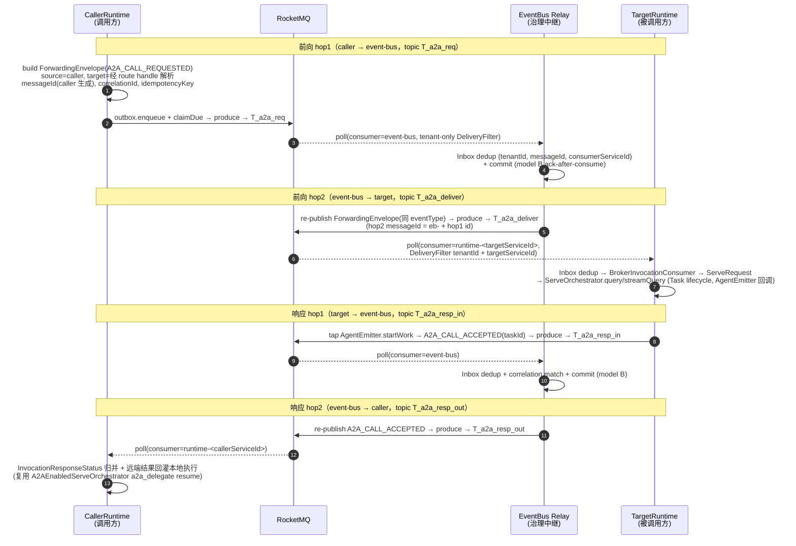
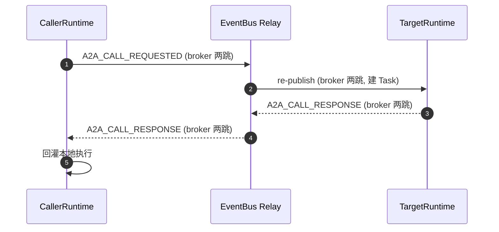
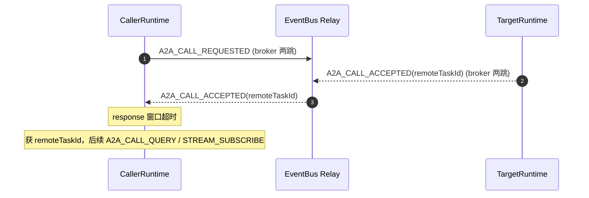
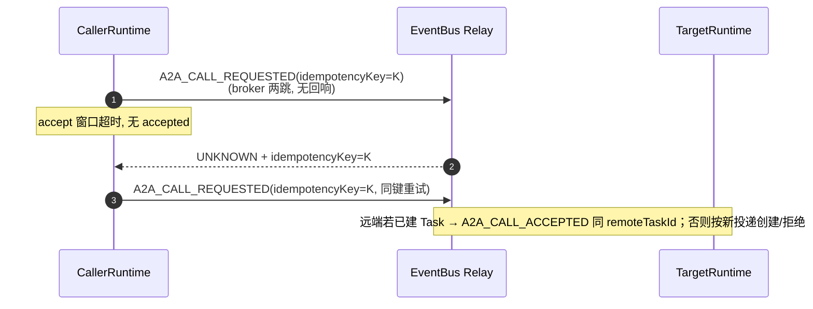
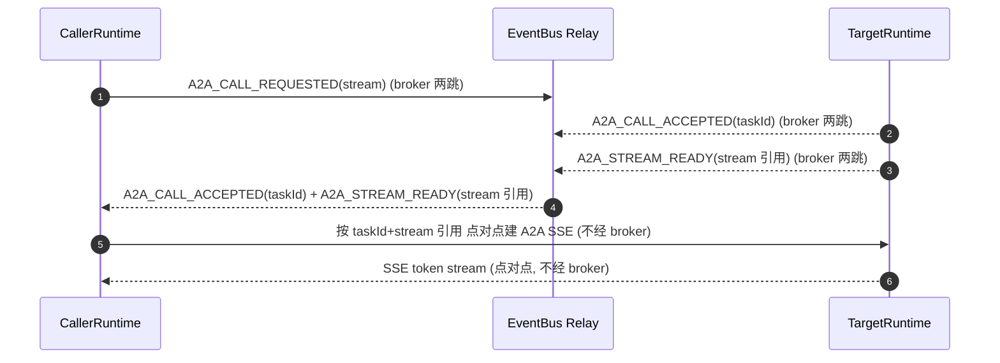

# FEAT-014 L2 技术设计：A2A 调用事件转发（event-bus ↔ agent-runtime，RocketMQ pub/sub 两跳）

> 命名说明：本文架构语义（所有权、参与者、状态归属）使用 L0 逻辑名 `agent-runtime` / `agent-core`。当前真实 `agent-runtime` 实现为外仓 `agent-runtime-java`（仓内 `agent-runtime/` 目录为废弃代码，不作为事实源）；本 L2 涉及 agent-runtime 处均指外仓真实实现。
>
> **P-06 更新（2026-07-22，控制面/数据面分离）**：`payloadRef` 不再承载控制描述符 token——控制面（`traceId`/`idempotencyKey`/`routeHandle`/`capability`/`deadlineMillisEpoch`）+ `originalCaller`（跨 relay 回路由）+ `inlinePayload`（小正文 2b）改为 **broker 一级字段 / envelope 一等字段**。`payloadRef` 回归纯 A2A 数据引用。响应内容（`taskId`/`status`/`streamRef`/`reason`）走 `inlinePayload`（FEAT-014:68），gateway 用 `responseToken` 解读。`BrokerControlDescriptor` 编解码器**已删除**。JDBC outbox 新增 **V4 迁移**持久化控制面。relay 治理改为 `msg.eventType()` 判别 + 控制面存在性 poison 守卫（替代旧 descriptor decode + corrId 匹配）。详见 feat-013 §2.3.1 P-06 更新。下文凡引用 `BrokerControlDescriptor`/payloadRef-descriptor 的既有描述均以此 P-06 更新为准。
>
> **代码仓迁移（2026-07-17，事实源切换）**：`agent-bus` 代码已从 `spring-ai-ascend/agent-bus` 迁移至 **agent-solution 仓 `common/agent-bus/`**（事实源；spring-ai-ascend 仓内 `agent-bus/` 已废弃）。包名 `com.huawei.ascend.bus` → `com.openjiuwen.bus`；拆为 4 模块 `agent-bus-spi`/`agent-bus-sdk`/`agent-bus-relay`/`agent-bus-testkit`；入口 `AgentBusApplication` → `EventBusRelayApplication`（`eventbus` profile）；gateway 运行时降级为 `agent-bus-relay` 测试源码；registry-discovery-center 平面未迁入 agent-bus 生产代码（**main 零依赖**；`AgentDiscoveryService` 仅 `GatewayRuntimeService` test 范围注入演示发现路径；topic 由 `DefaultBrokerTopicResolver` 按 `AgentBusEventType` 派生，opaque routeHandle T4 穿透不解封）；Flyway 仅 `V1`+`V3`。FEAT-014 与 FEAT-013 共享同一 event-bus 转发底座与 broker 拓扑（仅事件族 `A2A_CALL_*`/`A2A_STREAM_*` + topic `ascend_bus_a2a_*` 不同）。完整迁移要点见 [`feat-013 命名说明`](./feat-013-client-invocation-event-forwarding.md)；下文包路径均按 `com.openjiuwen.bus` 表达。

> 共享模型引用：事件信封 `AgentBusEventEnvelope`（= 扩展后 `ForwardingEnvelope`）、调用响应状态 `InvocationResponseStatus`、broker 拓扑（RocketMQ pub/sub 两跳 + event-bus 治理中继 + 模型 B ack-after-consume）、幂等三层、租户隔离三层、与 Stage 叙事关系——均见 [`feat-013`](./feat-013-client-invocation-event-forwarding.md) §2.3/§4/§5/§8。本文不重复，只定义 FEAT-014 特有部分。

## 1. 概述

### 1.1 特性定位

FEAT-014 把 `version-scope/FEAT-014` 在外部行为层定义的"A2A 调用事件转发"投影为可落地的 L2 技术设计。它约束 `agent-bus` 逻辑域中 **event-bus 单元** 与 **智能体服务端（agent-runtime）** 之间、服务到服务的 A2A 调用事件转发语义：调用方 agent-runtime 把面向远端 agent-runtime 的 A2A 调用封装为事件，经 event-bus（RocketMQ pub/sub 两跳）投递到目标 agent-runtime；目标 runtime 把接受/拒绝/失败/响应/流准备/终态回传调用方。

本期 4 条运行态决策（与 FEAT-013 同源，见 [`feat-013 §1.1`](./feat-013-client-invocation-event-forwarding.md)）：三单元（gateway / event-bus / registry-discovery-center）独立可替换——设计意图不变（as-built：event-bus relay 为唯一生产进程、gateway 测试源码、registry 未迁入 agent-bus 生产代码（main 零依赖），见命名说明）；两跳均经 RocketMQ pub/sub；broker 选型 RocketMQ；**event-bus→agent-runtime 不走 a2a push**（现有 `A2aForwardingDeliveryPort` T1 HTTP push 在本特性范围内被 broker 取代）。

本 L2 解决的问题（before → after）：
- before：`version-scope/FEAT-014` 留空 broker 与部署；agent-runtime（外仓）仅暴露 HTTP A2A，无 broker 集成（"MainEventBus" 是 A2A SDK 进程内管线），无 `tenantId+idempotencyKey` 去重，FEAT-005 远程编排走 A2A SDK HTTP client（非 broker）。
- after：固定 service-to-service 两跳 broker 拓扑、`A2A_CALL_*`/`A2A_STREAM_*` 事件族、agent-runtime 侧 consumer/producer 落点（复用 `ServeOrchestrator` SPI + tap `AgentEmitter` 回调 + 复用 FEAT-005 `A2AEnabledServeOrchestrator` 的 interrupt/resume + shadow task 回灌机制）、调用方 runtime 从 HTTP A2A client 改 broker produce 的改造面。

### 1.2 核心设计原则

- **event-bus 不拥有跨服务 Task tree** — 服务间 A2A 调用的决策/join/失败收敛/本地回灌由调用方 runtime（或未来编排智能体）拥有；event-bus 只转发事件 + 治理投递。理由：FEAT-014 §5.1.2。
- **A2A SSE 点对点桥接** — 流式响应内容仍用被调用方 agent-runtime 的 A2A SSE；event-bus 只转发 `A2A_STREAM_READY` 控制信号 + stream 引用，**不搬 token chunk**；调用方 runtime 按远端 taskId + stream 引用与被调用方点对点建 A2A SSE。理由：FEAT-014 §5.1.5。
- **route handle 不暴露物理 endpoint** — 调用方不直连被调用方物理 endpoint；opaque route handle 在 T4 pub/sub 路径上只穿透不解封，topic 由 `DefaultBrokerTopicResolver` 按 `AgentBusEventType` 派生（不经 routeHandle）；T1 物理端点解析（`ForwardingEndpointResolver`，gateway/caller 桥接用）为运行态内部行为。理由：FEAT-014 §5.2。
- **编排所有权不变** — 当前版本不引入 `agent-bus` 中心化编排 owner；未来中心化编排建模为特殊编排智能体服务（运行于 `agent-runtime + agent-core`，拥有自己的编排 Task），复用本文能力。理由：FEAT-014 §5.1.2。
- **本期取代 a2a push** — event-bus→agent-runtime 走 broker pub/sub，不走 `A2aForwardingDeliveryPort` 的 T1 HTTP sync push；T1 PoC 保留共存/灰度切换（Stage 30）。理由：用户决策 #4。

### 1.3 子特性全景

| 子特性 | 职责 | 关键抽象 | 状态 |
|---|---|---|---|
| 调用方 runtime 发起远端 A2A 调用 | 调用方把远端调用封装为事件投递 event-bus | `A2A_CALL_REQUESTED` + `BrokerForwardingRelayPort`（调用方 runtime 侧 producer） | ⬜ 外仓 caller producer（in-flight；可复用 in-repo `requestRelay` role-agnostic bean，见 §3.1/§5） |
| 被调用方 runtime 消费/建 Task | 目标 runtime 消费调用事件，按自身 Task 生命周期处理 | `BrokerForwardingConsumerPort` + `ServeOrchestrator.query/streamQuery` | ⬜ 外仓 agent-runtime consumer（in-flight；in-repo `RocketMqBrokerForwardingConsumer`/`responseConsumer` 可复用） |
| 响应事件回传 | 被调用方把接受/响应/流准备/终态回传调用方 | tap `AgentEmitter` 回调 → `A2A_CALL_*` 响应事件 | ⬜ 外仓 agent-runtime producer（in-flight） |
| 远端 taskId 返回 | 创建类调用被接受时返回远端 taskId | `A2A_CALL_ACCEPTED(taskId)` | ⬜ 依赖 agent-runtime producer（in-flight） |
| UNKNOWN + 同键重试 | 接受窗口未知态 + 幂等重试 | `InvocationResponseStatus.UNKNOWN` + `idempotencyKey`（共享 FEAT-013） | ✅ `InvocationResponseStatus` 已落地（共享 FEAT-013）/ ⬜ 调用方 accept window 外仓 |
| A2A SSE 点对点 | 调用方按远端 taskId + stream 引用直连被调用方 SSE | `A2A_STREAM_READY` + 点对点 SSE（不进 broker） | ⬜ net-new（依赖 agent-runtime 侧） |
| 远端结果本地回灌 | 调用方把远端结果回灌本地执行 | 复用 `A2AEnabledServeOrchestrator` a2a_delegate interrupt/resume + shadow task | ✅ 复用 FEAT-005 机制 / ⬜ transport 改 broker（外仓 in-flight） |
| event-bus 治理中继（service-to-service 两跳） | `A2A_CALL_*`/`A2A_STREAM_*` 族经 event-bus 两跳转发 + 治理 | `EventBusRelayConfiguration`/`Worker`（与 FEAT-013 共享 relay）+ `AgentBusEventType` FEAT-014 族 | ✅ 已落地（in-repo，与 FEAT-013 共享 relay/broker 平面，见 §3.1/§4.1） |

---

## 2. 功能规格

### 2.1 能力清单

| 能力 | 级别 | 状态 | 说明 |
|---|---|---|---|
| A2A 调用事件发布 | MUST | ⬜ | 调用方 runtime 把远端 A2A 调用封装为 `A2A_CALL_REQUESTED` 经 RocketMQ 投递 event-bus。producer net-new。 |
| A2A 响应事件回传 | MUST | ⬜ | 被调用方把 `A2A_CALL_ACCEPTED`/`_REJECTED`/`_FAILED`/`_RESPONSE`/`A2A_STREAM_READY`/`A2A_CALL_TERMINAL` 经 RocketMQ 回传。 |
| 调用方 runtime 主生产方 | MUST | ⬜ | 当前版本服务间 A2A 调用以调用方 `agent-runtime` 为主生产方；`agent-bus` 不作中心化编排 owner。 |
| 未来编排智能体复用 | SHOULD | ⬜ | 未来中心化编排建模为特殊编排智能体服务复用本文能力（运行于 runtime+core，拥有编排 Task）。 |
| 外层 bus 事件信封 | MUST | ✅ | 复用 FEAT-013 §2.3.1 扩展后 `ForwardingEnvelope`（`eventType` 取 `A2A_CALL_*`/`A2A_STREAM_*`）。 |
| A2A payload 兼容 | MUST | ✅ | 调用/查询/取消/订阅/响应 payload 保持 A2A JSON-RPC/Task/SSE 语义兼容。 |
| 创建类 A2A 调用转发 | MUST | ⬜ | event-bus 支持 `A2A_CALL_REQUESTED`（→ A2A `message/send` 或等价创建/推进远端 Task）转发。 |
| 流式 A2A 调用请求转发 | MUST | ⬜ | 流式请求事件同阻塞经 broker；实时 token chunk 不进 broker。 |
| A2A SSE 点对点桥接 | MUST | ⬜ | event-bus 只转发 `A2A_STREAM_READY` + stream 引用；调用方点对点订阅被调用方 A2A SSE。 |
| `A2A_CALL_ACCEPTED` 与 `A2A_STREAM_READY` 分离 | MUST | ⬜ | 接受建 Task 与流可订阅分离表达。 |
| 远端 taskId 返回 | MUST | ⬜ | 创建类调用被接受时响应事件携带远端 `taskId`。 |
| UNKNOWN 响应状态 | MUST | ⬜ | 接受窗口无法确认建 Task 时返回 `UNKNOWN`（共享 FEAT-013 状态机）。 |
| 远端创建幂等 | MUST | ⬜ | 被调用方 `tenantId+idempotencyKey` net-new。 |
| bus 投递幂等 | MUST | ✅ | 复用 outbox `(tenantId,messageId)` / inbox `(tenantId,messageId,consumerServiceId)`。 |
| 调用方重试幂等 | MUST | ⬜ | 调用方重试同一远端调用复用 `idempotencyKey`。 |
| 标准 Task 查询/取消/订阅 | MUST | ⬜ | `GetTask`/`CancelTask`/`SubscribeToTask` 基于远端 taskId；依赖 FEAT-001 缺口（agent-runtime controller 路由补齐）。 |
| A2A 查询/取消/订阅控制事件 | MUST | ⬜ | `A2A_CALL_QUERY_REQUESTED`/`_CANCEL_REQUESTED`/`A2A_STREAM_SUBSCRIBE_REQUESTED` 转发；不隐式建 Task。 |
| Agent Card 发现排除 | MUST | ✅ | 不定义 Agent Card/能力发现/版本选择/健康发现；归 registry-discovery-center。 |
| route handle 消费 | MUST | ⬜ | 设计上复用 registry-discovery-center 解析 route handle（T1 物理端点），不暴露物理 endpoint。as-built（agent-solution）：agent-bus T4 pub/sub 路径**不解封** routeHandle（opaque 穿透），topic 由 `DefaultBrokerTopicResolver` 按 `AgentBusEventType` 派生；T1 endpoint 解析端口 `ForwardingEndpointResolver`（impl `MapEndpointResolver` `@Deprecated` T1 PoC）已就位供 gateway/caller；`AgentDiscoveryService` 仅 `GatewayRuntimeService` test 范围注入演示；调用方 runtime（外仓）经 registry 解析 target 的 T1 路径仍 ⬜（见 feat-013 §3.1/命名说明）。 |
| 大载荷引用 | MUST | ✅ | `payloadRef` data reference path；复用 §6.2②。 |
| 小型 payload 内联 | MAY | ✅ | 小型 A2A JSON-RPC envelope 可 inline，不承担治理字段职责。 |
| 租户隔离 | MUST | ✅ | 复用三层 + broker 端 SQL92 `DeliveryFilter`（`tenantId`/`targetServiceId`）+ envelope routeHandle.tenantScope（见 feat-013 §4.5）。 |
| 物理投递机制透明 | MUST | ✅ | 调用方/被调用方不依赖具体 broker/topic/endpoint。 |
| Task 生命周期所有权不变 | MUST | ✅ | event-bus 不创建/不写入/不推进任一端 Task execution state。 |

### 2.2 显式排除

| 排除项 | 原因 | 替代 |
|---|---|---|
| token chunk 事件化 | 不把 token chunk / SSE frame / 大正文作 broker 消息体 | A2A SSE 点对点（§4.6） |
| bus 拥有 Task 状态 | event-bus 不写任一端 Task execution state | Task 归各 runtime |
| bus 拥有跨服务任务树 | 不由 agent-bus 维护 parent-child hierarchy / join / 编排状态 | 调用方 runtime 或未来编排智能体拥有 |
| 调用方本地 ID 标准化 | 不把调用方 parent Task ID / tool call ID / remote invocation ID 作跨 bus 标准字段 | 仅 tenant/correlation/idempotency/route/A2A payload |
| Agent Card 发现 | 不定义 Agent Card 获取/能力发现/版本选择/健康过滤 | registry-discovery-center 相关特性 |
| 隐式重建 Task | `A2A_STREAM_SUBSCRIBE_REQUESTED`/查询/取消找不到 Task 不自动重建 | UNKNOWN 后同 idempotencyKey 重试 |
| 私有流协议 | 不定义 A2A SSE 之外的私有流协议 | A2A SSE |
| 物理 endpoint 暴露 | 调用方不直连被调用方物理 endpoint | route handle / stream 引用运行态内部解析 |
| 具体 broker 产品强绑 | 本期选 RocketMQ，但不反向定义治理语义 | broker 概念圈 `transport.broker` |
| 默认实现强绑定 | 不要求客户必须用产品自带 event-bus/registry | 存量系统适配，满足本文契约即可 |
| 大载荷数据通道 | broker 不作大对象/敏感正文数据通道 | payloadRef 引用路径 |
| 本地执行回灌机制 | 不定义调用方 runtime 如何把远端结果回灌本地 handler/memory/trajectory | FEAT-005 `A2AEnabledServeOrchestrator` 已有机制（§4.2 复用） |
| 非 A2A 查询扩展 | 不新增 `ResolveRemoteInvocation` 之类非 A2A 标准方法 | UNKNOWN 后同 idempotencyKey 重试 |

### 2.3 接口契约（Logical View）

#### 2.3.1 事件类型枚举 `AgentBusEventType`（FEAT-014 族）

补充 FEAT-013 §2.3.2 的枚举（同一 `AgentBusEventType`，FEAT-014 族）：

```java
public enum AgentBusEventType {
    // ... FEAT-013 族（CLIENT_INVOCATION_* / INVOCATION_*）见 feat-013 §2.3.2 ...
    // source runtime → target runtime（经 调用方 runtime → event-bus → 被调用方 runtime）
    A2A_CALL_REQUESTED,                    // 发起远端 A2A 调用 / 推进远端 Task（→ A2A message/send）
    A2A_CALL_CANCEL_REQUESTED,              // 取消远端 Task（→ A2A CancelTask）
    A2A_CALL_QUERY_REQUESTED,               // 查询远端 Task（→ A2A GetTask）
    A2A_STREAM_SUBSCRIBE_REQUESTED,         // 订阅远端 Task 的 A2A SSE（基于远端 taskId）
    // target runtime → source runtime（经 被调用方 runtime → event-bus → 调用方 runtime）
    A2A_CALL_ACCEPTED,                      // 已接受并创建/复用远端 Task（携带远端 taskId）
    A2A_CALL_REJECTED,                      // 明确拒绝、未建远端 Task
    A2A_CALL_FAILED,                        // 确定失败（错误码 + 可重试语义）
    A2A_CALL_RESPONSE,                       // 等待窗口内一次性 A2A 响应
    A2A_CALL_INPUT_REQUIRED,                 // 远端 Task 进入等待输入状态（携带远端 taskId + 可恢复上下文引用）— FEAT-017 MUST
    A2A_STREAM_READY,                       // 远端 Task 的 A2A SSE 流已可订阅（携带 stream 引用）
    A2A_CALL_TERMINAL                       // 远端 Task 终态（完成/失败/取消），不载 token 流
}
```

#### 2.3.2 信封 / 响应状态 / 行为承诺

- **信封**：复用 [`feat-013 §2.3.1`](./feat-013-client-invocation-event-forwarding.md) 的 `AgentBusEventEnvelope`（扩展后 `ForwardingEnvelope`）。`sourceServiceId`=调用方 runtime，`targetServiceId`=被调用方 runtime（经 discovery 选中的 `AgentCardDto.serviceId` 写入；opaque `routeHandle` 穿透不解封）。
- **响应状态**：复用 [`feat-013 §2.3.3`](./feat-013-client-invocation-event-forwarding.md) 的 `InvocationResponseStatus`（`COMPLETED_RESPONSE`/`ACCEPTED_WITH_TASK`/`INPUT_REQUIRED`/`STREAM_READY`/`REJECTED`/`FAILED`/`UNKNOWN`），语义为**远端 Task 视角**（调用方侧观测；FEAT-017 增 `INPUT_REQUIRED`）。
- **行为承诺**（FEAT-014 特有，RFC 2119）：
  - **必须**：创建类 A2A 调用被接受时，`A2A_CALL_ACCEPTED` 必须携带远端 `taskId`，供调用方后续查询/取消/订阅/本地绑定。
  - **必须**：`GetTask`/`CancelTask`/`SubscribeToTask` 基于被调用方返回的远端 `taskId`；不定义基于调用方本地 Task ID / tool call ID / remote invocation ID 的跨 bus 查询。
  - **必须**：`A2A_CALL_QUERY_REQUESTED`/`_CANCEL_REQUESTED`/`A2A_STREAM_SUBSCRIBE_REQUESTED` 不隐式建新远端 Task。
  - **禁止**：调用方把本地 tool call ID / remote invocation ID / parent Task ID 作为被调用方必须理解的跨 bus 标准字段。
  - **禁止**：broker 消息体承载 token chunk / SSE frame / payload body / Task execution state / 物理端点。
  - **允许**：小型 A2A JSON-RPC envelope inline；未来编排智能体作为调用方复用本文能力。

---

## 3. 模块结构（Development View）

### 3.1 包结构

**agent-bus 侧（event-bus 进程，复用 + 治理中继）**：

```
com.openjiuwen.bus.forwarding.                  # 复用（agent-solution 仓 common/agent-bus/，4 模块；FEAT-014 与 FEAT-013 共享底座）
  spi.                                        #   ForwardingEnvelope(扩展) / AgentBusEventType(含 A2A_CALL_*/A2A_STREAM_* 族) /
                                              #   InvocationResponseStatus / ForwardingOutboxPort / InboxPort / Dispatcher / FailureCode / RouteHandle
    └── broker.                               #   broker 转发 SPI 端口（P-06：BrokerControlDescriptor 已删除，控制面走一级字段）
  common.                                     #   AgentBusInfrastructureConfiguration（共享 brokerClientProperties/outbox/inbox，无 @Profile）+ AgentBusBrokerProperties
  runtime.
    transport.broker.                         #   broker-common（BrokerClientProperties/BrokerOutboundMessage/BrokerMessageHeaders）+ rocketmq 子包
    │   └── rocketmq.                          #     RocketMqBrokerForwardingConsumer/Relay + RocketMqBrokerClientConfiguration
    │                                          #     （无 @Profile，role-agnostic：defaultProducer/requestRelay("req")/responseConsumer("resp_out")）
    transport.a2a.                             #   既有 A2aForwardingDeliveryPort（T1 push，本特性不用于 event-bus→agent-runtime）
    relay.                                    #   EventBusRelayConfiguration(@Profile("eventbus"))/Worker/RelayScheduler(SmartLifecycle)
    persistence.jdbc.                         #   JdbcForwardingOutbox/Inbox/SqlCodec（V1+V3+V4 migration）
  （registry.runtime 平面未迁入 agent-bus 生产代码（main 零依赖）：`AgentDiscoveryService` 仅 `GatewayRuntimeService` test 范围注入；`resolveRouteHandle`/`RouteHandleCodec` 属 registry 平面；topic 由 `DefaultBrokerTopicResolver` 按 `AgentBusEventType` 派生，opaque routeHandle T4 穿透不解封）
```

> **as-built（5193972e）**：FEAT-014 与 FEAT-013 共享同一 event-bus 转发底座与 broker 拓扑（`EventBusRelayConfiguration`/`Worker` + `RocketMqBrokerClientConfiguration` role-agnostic client bean），仅事件族（`A2A_CALL_*`/`A2A_STREAM_*`，由 `AgentBusEventType` 判别）+ topic（`ascend_bus_a2a_*`）不同。caller agent-runtime（外仓）可复用 in-repo 的 `requestRelay`/`responseConsumer` role-agnostic bean（de-gateway-ification 的设计意图——任一 caller 产生同一 `req` topic、消费同一 `resp_out` topic），无需自声明。

**agent-runtime 侧（外仓 `agent-runtime-java/service/agent-service-app`，net-new）**：

```
com.openjiuwen.service.app.
  controller.
    a2a.                                       # 既有：A2aJsonRpcController / A2AAgentExecutor / A2AProtocolAdapter
    broker.                                    # ⬜ net-new：BrokerInvocationConsumer（消费 A2A_CALL_* / CLIENT_INVOCATION_*）
                                               #            BrokerResponseProducer（tap AgentEmitter → 发 A2A_CALL_* / INVOCATION_*）
  orchestrator.                                # 既有：A2AEnabledServeOrchestrator（a2a_delegate interrupt/resume + shadow task，复用）
  autoconfigure.                               # 既有：A2AAutoConfiguration
    BrokerAutoConfiguration.                  # ⬜ net-new：consumer/producer bean + RocketMQ topic/consumer-group 配置
```

> `agent-runtime-ext-java`（FEAT-005 calling-side glue）：`JiuwenCoreAgentExtHandler` / `RemoteA2aToolInstaller` / `RemoteA2aInterruptRail` 现有把远端 A2A 注入为本地 tool/interrupt-rail；FEAT-014 改造其 transport：`RemoteA2aInterruptRail` 发起的远端调用从 `A2ARemoteAgentClient`（HTTP）改为 broker produce `A2A_CALL_REQUESTED`（详见 §4.2）。

### 3.2 核心类静态关系（agent-runtime 侧）

```
«interface»                    «concrete»                       «interface»
ServeOrchestrator              BrokerAutoConfiguration           BrokerForwardingConsumerPort
  ↑                              (net-new)                          ↑  (agent-bus SPI, 既有)
  └── A2AEnabledServeOrchestrator                                  │ implements (agent-runtime 侧)
        (既有, 复用 a2a_delegate)                                    │
            │  broker 消费路径                                       │
            │  BrokerInvocationConsumer ── poll(consumer=runtime-<serviceId>, tenant) ──> BrokerForwardingConsumerPort
            │       │
            │       └── decode ForwardingEnvelope(A2A_CALL_REQUESTED) → ServeRequest ──> ServeOrchestrator.query/streamQuery
            │                                                                                  │
            │                                                                       (Task lifecycle, AgentEmitter 回调)
            │                                                                                  │
            │  BrokerResponseProducer <── tap AgentEmitter(startWork/addArtifact/requiresInput/complete/fail/cancel)
            │       │
            │       └── produce(direct-tap 重载 produce(BrokerOutboundMessage,long)，不经 outbox) A2A_CALL_ACCEPTED / A2A_CALL_RESPONSE / A2A_STREAM_READY / A2A_CALL_TERMINAL ──> BrokerForwardingRelayPort
```

### 3.3 SDK 生产/消费接口（agent-bus-sdk + agent-bus-spi，与 FEAT-013 共享）

`agent-bus-sdk`（+ `agent-bus-spi`）作为生产者（caller runtime）与消费者（event-bus relay / target runtime）调用的 SDK，**与 FEAT-013 共享同一接口面**——仅事件族（`A2A_CALL_*`/`A2A_STREAM_*`）+ topic（`ascend_bus_a2a_*`）不同。完整接口/方法表见 [`feat-013 §3.3`](./feat-013-client-invocation-event-forwarding.md)；FEAT-014 角色映射如下：

| FEAT-014 角色 | SDK 角色 | 调用接口 | 事件族 |
|---|---|---|---|
| 调用方 runtime（caller） | 生产方 | `ForwardingOutboxPort.enqueue` → `ForwardingOutboxClaimPort.claimDue` → `BrokerForwardingRelayPort.produce`（复用 `requestRelay`，`req` 后缀） | `A2A_CALL_REQUESTED` / `_CANCEL_REQUESTED` / `_QUERY_REQUESTED` / `A2A_STREAM_SUBSCRIBE_REQUESTED` |
| 被调用方 runtime（target） | 消费方 | `BrokerForwardingConsumerPort.subscribe`+`poll`（`DeliveryFilter.forRuntime(tenant, targetServiceId)`）→ `ForwardingInboxPort.receive` → `commit`/`reject` | （消费 `A2A_CALL_*` 请求） |
| 被调用方 runtime（target） | 生产方（响应） | tap `AgentEmitter` → `BrokerForwardingRelayPort.produce`（**direct-tap 重载 `produce(BrokerOutboundMessage, long)`，不经 outbox**） → `T_a2a_resp_in` | `A2A_CALL_ACCEPTED` / `_REJECTED` / `_FAILED` / `_RESPONSE` / `A2A_STREAM_READY` / `A2A_CALL_TERMINAL` |
| 调用方 runtime（caller） | 消费方（响应） | `BrokerForwardingConsumerPort`（复用 `responseConsumer`，`resp_out` 后缀）→ `ForwardingInboxPort.receive` → `commit` | （消费 `A2A_CALL_*` 响应，按 `correlationId` 匹配回灌） |
| event-bus relay | 治理中继（消费+生产） | forward relay：消费 `T_a2a_req` → `inbox.receive`+correlation match → re-publish `T_a2a_deliver`；response relay：消费 `T_a2a_resp_in` → re-publish `T_a2a_resp_out` | （转发两族事件，不改 eventType） |

> 生产方/消费方只需依赖 `agent-bus-sdk`（+ `agent-bus-spi`）、按类型注入所需端口，broker client 由 sdk 装配（`AgentBusInfrastructureConfiguration` + `RocketMqBrokerClientConfiguration`，无 `@Profile`、role-agnostic）。caller runtime 可复用 in-repo `requestRelay`/`responseConsumer` role-agnostic bean（de-gateway-ification 设计意图），target runtime 可复用 `RocketMqBrokerForwardingConsumer` 或自声明。

---

## 4. 核心设计（Logical + Process View）

### 4.1 两跳 broker 时序（service-to-service，前向 + 响应）



> event-bus 在两跳间做 inbox 去重 + tenant 校验 + correlation 匹配 + 审计（治理中继，非字节透传），与 FEAT-013 同构。FEAT-013 与 FEAT-014 共享同一 event-bus 转发底座与 broker 拓扑，仅事件族 / 生产-消费方不同。

> **as-built 补充（5193972e）**：与 FEAT-013 同构——hop2 `messageId` 用 `eb-`+hop1 前缀（共享 outbox 表防 `ON CONFLICT DO NOTHING` 吞 hop2）；`originalCaller`（调用方 serviceId）作为一级字段端到端携带（P-06：不再随 payloadRef 控制描述符），响应跨 relay 回路由。详见 feat-013 §4.1/§4.4。

### 4.2 调用方 runtime 生产 / 消费（复用 FEAT-005 回灌）

**生产（发起远端调用）**：
- 调用方 runtime 在本地 Task 执行中遇到 `a2a_delegate` interrupt（FEAT-005 `RemoteA2aInterruptRail` 已有此点）→ **改造 transport**：从 `A2ARemoteAgentClient.callStreaming/callSync`（HTTP A2A SDK client）改为构造 `ForwardingEnvelope`(eventType=`A2A_CALL_REQUESTED`, source=callerServiceId, target=经 registry route handle 解析的 targetServiceId) → enqueue 调用方 runtime outbox → `BrokerForwardingRelayPort.produce` → RocketMQ。
- `idempotencyKey` 由调用方生成并复用于重试。

**消费（响应回灌）**：
- 调用方 runtime `BrokerResponseConsumer`（net-new，consumer group = `runtime-<callerServiceId>`）poll `T_a2a_resp_out`，按 `correlationId` 匹配到本地 `a2a_delegate` interrupt 上下文（`toolCallId`/`agentName`/`_stream_mode`，FEAT-005 `A2AEnabledServeOrchestrator` 已持有）。
- 复用 `A2AEnabledServeOrchestrator.buildResumeRequest` → 把远端结果作为 user message 重新驱动 `agentHandler.query/streamQuery`（FEAT-005 已有的回灌 rail `reject(resumeInput)`）。
- 远端 `INPUT_REQUIRED` → 复用 shadow task 机制（`shadow:<agentId>:<conversationId>`，state `TASK_STATE_INPUT_REQUIRED`，携带 `_remote_task_id`）；下次调用 `tryResumePending`/`syncResumePending` 恢复远端 Task（FEAT-005 已有，transport 改 broker）。

> 复用要点：FEAT-005 的 interrupt/resume + shadow task 回灌**机制不变**，只把 transport 从 HTTP A2A client 换成 broker pub/sub。`RemoteA2aInterruptRail` / `A2ARemoteAgentCardRegistry` / `A2AEnabledServeOrchestrator` 的本地编排逻辑保持。

### 4.3 被调用方 runtime 消费 / 生产

**消费**：
- `BrokerInvocationConsumer`（net-new）`subscribe(consumerServiceId=runtime-<targetServiceId>, AgentBusEventType, DeliveryFilter.forRuntime(tenant, targetServiceId))`（eventType 经 `DefaultBrokerTopicResolver` 派生 `T_a2a_deliver` topic）+ 过滤条件，`poll(nowMillisEpoch)`；broker 端 SQL92 过滤 `tenantId`/`targetServiceId`（`supportsBrokerSidePropertyFilter()=true`，不投递跨 tenant 消息）——复用 in-repo `RocketMqBrokerForwardingConsumer`。
- decode `ForwardingEnvelope` → 复用 `A2AProtocolAdapter.toServeRequest` 式映射为 `ServeRequest`（补 `idempotencyKey`/`tenantId`/`correlationId` 字段——当前 `ServeRequest` 无 `idempotencyKey`，需 additive 扩展）→ `ServeOrchestrator.query/streamQuery`。
- `commit`（model B ack-after-consume，至少一次）。

**生产**：
- `BrokerResponseProducer`（net-new）tap SDK `AgentEmitter` 回调（`A2AAgentExecutor` 已有这些 tap 点）：
  - `startWork`/`submit` → `A2A_CALL_ACCEPTED`（携带远端 taskId + correlation + idempotency 结果）。
  - `addArtifact`/chunk → **不进 broker**（token chunk 走 A2A SSE，§4.6）；首个可订阅时发 `A2A_STREAM_READY`。
  - `requiresInput`（`INPUT_REQUIRED`）→ 发布 `A2A_CALL_INPUT_REQUIRED`（携带远端 taskId + 可恢复上下文引用），不终态；调用方 runtime 经 FEAT-005 shadow-task 续接（事件负责及时通知，shadow task 负责回灌恢复）。FEAT-017 MUST：不得只藏在后续 Task 查询结果中。
  - `complete` → `A2A_CALL_RESPONSE` + `A2A_CALL_TERMINAL`（完成）。
  - `fail`/`cancel` → `A2A_CALL_TERMINAL`（失败/取消，映射 `ForwardingFailureCode.REMOTE_TASK_FAILED` non-retryable）。
- produce 经 `BrokerForwardingRelayPort` 的 **direct-tap 重载** `produce(BrokerOutboundMessage, long)`（不经 outbox 直投 `T_a2a_resp_in`；FEAT-017 §5.1.4：receive 边界 ack，发布失败由 TaskStore/状态投影/GetTask 恢复）——`default` 抛 `UnsupportedOperationException`，RocketMQ adapter 覆写之。

### 4.4 调用响应状态机

复用 [`feat-013 §4.3`](./feat-013-client-invocation-event-forwarding.md) 状态机，事件族替换为 `A2A_CALL_*`/`A2A_STREAM_*`，语义为**远端 Task 视角**（调用方侧观测）：

| 当前观测态 | 收到事件 | 下一观测态 | 附加行为 |
|---|---|---|---|
| `PENDING` | `A2A_CALL_RESPONSE` | `COMPLETED_RESPONSE` | 远端结果回灌本地执行 |
| `PENDING` | `A2A_CALL_ACCEPTED` | `ACCEPTED_WITH_TASK` | 获远端 taskId，可后续查询/取消/订阅 |
| `PENDING`/`ACCEPTED_WITH_TASK` | `A2A_CALL_INPUT_REQUIRED` | `INPUT_REQUIRED` | 及时返回 ACCEPTED(taskId) 通知等待输入，调用方 shadow-task 续接（FEAT-017 MUST；非终态，窗口内不再轮询） |
| `PENDING` | `A2A_CALL_REJECTED` | `REJECTED` | 可编程拒绝，不伪造 taskId |
| `PENDING` | `A2A_CALL_FAILED` | `FAILED` | 错误码 + 可重试语义 |
| `PENDING` | （接受窗口超时） | `UNKNOWN` | 同 idempotencyKey 重试，不创建第二个逻辑远端调用 |
| `ACCEPTED_WITH_TASK` | `A2A_STREAM_READY` | `STREAM_READY` | 点对点订阅远端 SSE |
| `ACCEPTED_WITH_TASK`/`STREAM_READY` | `A2A_CALL_TERMINAL`(完成/取消) | `COMPLETED_RESPONSE` | 回灌 + 收尾（取消=用户发起的正常终态，非失败，对齐 feat-013 §4.3） |
| `ACCEPTED_WITH_TASK`/`STREAM_READY` | `A2A_CALL_TERMINAL`(失败) | `FAILED` | 回灌失败 + 收尾 |

### 4.5 幂等

| 层次 | 幂等键 | owner | 复用/net-new |
|---|---|---|---|
| bus 投递 | `(tenantId, messageId)` outbox / `(tenantId, messageId, consumerServiceId)` inbox | event-bus forwarding substrate | ✅ 复用 |
| 远端创建 | `(tenantId, idempotencyKey)` | 被调用方 runtime | ⬜ net-new（agent-runtime 当前 `a2a:task:<taskId>` Redis key 无 tenant 前缀、无幂等索引） |
| 调用方重试 | `idempotencyKey`（同远端调用复用） | 调用方 runtime | ⬜ net-new |

> `messageId`/`eventId` 用于 bus 投递去重与审计；`idempotencyKey` 用于远端创建类调用幂等；二者不得混为同一唯一语义（对齐 FEAT-014 §5.1.6）。`A2A_STREAM_SUBSCRIBE_REQUESTED` 不得隐式建新远端 Task，只订阅已有远端 taskId 的 SSE。

> **as-built 补充（5193972e）**：与 FEAT-013 同构——outbox 表跨调用方 runtime 与 relay 进程共享，hop2 用 `eb-`+hop1 前缀 messageId 避免共享 outbox `ON CONFLICT DO NOTHING` 吞 hop2；双重投递 replayed hop1 防御由 inbox dedup 承担。详见 feat-013 §4.4。

### 4.6 A2A SSE 点对点桥接

- 被调用方 runtime 的实时流仍用其 A2A SSE（`SseEmitter` over HTTP，既有）；event-bus 只转发 `A2A_STREAM_READY` 控制信号 + stream 引用（携带远端 taskId + 调用方内部可解析的 stream 引用/订阅条件）。
- 调用方 runtime 收到 `A2A_STREAM_READY` 后，按远端 taskId + stream 引用与被调用方**点对点**建立 A2A SSE 通道（不经 event-bus 搬 token chunk）。
- 实时流中断 → 调用方经远端 taskId 重新 `A2A_STREAM_SUBSCRIBE_REQUESTED` 订阅；event-bus 不重放 token chunk。
- 远端 chunk 经 `A2AEnabledServeOrchestrator` 的 `a2a_delegate` 转发路径回灌本地 observer（FEAT-005 已有 chunk 透传机制，复用）。

---

## 5. 配置模型（Physical View）

### 5.1 部署拓扑（service-to-service，本期决策）

```
┌────────────────────┐     RocketMQ      ┌──────────────────────────────┐     RocketMQ      ┌────────────────────┐
│ CallerRuntime 进程  │ ── T_a2a_req ──> │ EventBus + Registry 进程      │ ── T_a2a_deliver ──> │ TargetRuntime 进程 │
│ (agent-runtime-java │ <─ T_a2a_resp_out│ (forwarding substrate         │ <─ T_a2a_resp_in ──── │ (agent-runtime-java│
│  caller side:       │                  │  inbox+outbox+relay + registry)│                     │  target side:      │
│  outbox+relay       │                  │                              │                     │  consumer+producer)│
│  +resp consumer)   │                  │                              │                     │                    │
└────────────────────┘                  └──────────────────────────────┘                     └────────────────────┘
```

> 同一 event-bus 进程同时承载 FEAT-013（client invocation）与 FEAT-014（service-to-service A2A）两族事件的治理中继；事件族由 `AgentBusEventType` 判别，topic 分离（`ascend_bus_invocation_*` vs `ascend_bus_a2a_*`）。caller 与 target 可以是同一 agent-runtime 部署的不同实例（demo: Agent A 18090 → Agent B 18091）。

### 5.2 完整配置示例

```yaml
# event-bus 侧（agent-bus-relay application.yml，flat 12 字段，@ConfigurationProperties(prefix="agent-bus")；无 broker.rocketmq 嵌套、无 topics 项）
agent-bus:
  nameserver: 10.0.0.10:9876;10.0.0.11:9876
  namespace: ascend-prod
  producer-group: eventbus-producer
  tenant: tenant-a
  gateway-service-id: gateway-01
  event-bus-service-id: eventbus-01
  poll-wait-millis: 3000
  accept-timeout-ms: 30000
  response-timeout-ms: 60000
# topic 不经配置项声明——DefaultBrokerTopicResolver 按 AgentBusEventType 派生：ascend_bus_<family>_<suffix>
#   a2a 族（A2A_*）× req/deliver/resp_in/resp_out → ascend_bus_a2a_{req,deliver,resp_in,resp_out}（与 invocation 族同构，仅 eventType 族不同）
# retry 策略为代码默认 ForwardingRetryPolicy.DEFAULT（base=100ms / cap=60000ms / maxAttempts=5）

openjiuwen:
  service:
    broker:
      rocketmq:
        nameserver-endpoints: 10.0.0.10:9876;10.0.0.11:9876
        namespace: ascend-prod
        consumer-group: runtime-${service-id}     # per-serviceId consumer group（T_a2a_deliver / T_a2a_resp_out）
        producer-group: runtime-producer
        topics:                                   # ⬜ agent-runtime 侧 net-new（设计目标，未实现）；topic 实际由 DefaultBrokerTopicResolver 派生，不经配置项
          a2a-deliver: ascend_bus_a2a_deliver     # 消费
          a2a-resp-out: ascend_bus_a2a_resp_out   # 消费（调用方侧）
          a2a-req: ascend_bus_a2a_req             # 生产（调用方侧）
          a2a-resp-in: ascend_bus_a2a_resp_in     # 生产（被调用方侧）
      invocation:
        accept-window:
          accept-timeout-ms: 30000                 # 无 accepted → UNKNOWN（对齐 event-bus 侧默认）
          response-timeout-ms: 60000
```

### 5.3 配置属性表（agent-runtime 侧 net-new 节选）

| 属性路径 | 类型 | 默认 | 必填 | 说明 |
|---|---|---|---|---|
| `openjiuwen.service.broker.rocketmq.nameserver-endpoints` | String | — | 是 | RocketMQ nameserver |
| `openjiuwen.service.broker.rocketmq.namespace` | String | — | 是 | tenant 隔离作用域 |
| `openjiuwen.service.broker.rocketmq.consumer-group` | String | runtime-${service-id} | 是 | per-serviceId 消费组（T_a2a_deliver / T_a2a_resp_out） |
| `openjiuwen.service.broker.invocation.accept-window.accept-timeout-ms` | long | 30000 | 否 | 接受窗口超时→UNKNOWN（对齐 event-bus 侧 `agent-bus.accept-timeout-ms`） |
| `openjiuwen.service.broker.invocation.accept-window.response-timeout-ms` | long | 60000 | 否 | 已 accepted 后等最终响应 |

> event-bus 侧配置复用 [`feat-013 §5.3`](./feat-013-client-invocation-event-forwarding.md)——flat `agent-bus.*`（`AgentBusBrokerProperties`，无 `broker.rocketmq.` 嵌套、无 `topics` 项）；FEAT-014 与 FEAT-013 共享同一 `application.yml`，仅 eventType 为 `A2A_*` 族时 `DefaultBrokerTopicResolver` 派生 `ascend_bus_a2a_*` topic（不经配置项声明）。上方 `openjiuwen.service.broker.*` 为 agent-runtime 侧 net-new 设计目标（外仓 in-flight）。

---

## 6. 对外呈现 / 用户场景（Scenario View）

### 6.1 编程入口（调用方 runtime 发起远端 A2A 调用）

调用方 runtime 发起远端 A2A 调用 = **工具 / interrupt rail**（复用 FEAT-005 `RemoteA2aInterruptRail` 形态），transport 从 HTTP A2A client 换 broker produce：

```java
// 复用 FEAT-005 RemoteA2aInterruptRail.emitInterruptRequest(context)
//   context = { agentName, _interrupt_kind:"a2a_delegate", _stream_mode:"sse" }
// FEAT-014 改造：rail.resume 不再调 A2ARemoteAgentClient.callStreaming，
//   而是构造 ForwardingEnvelope(A2A_CALL_REQUESTED, source=callerServiceId,
//   target=AgentCardDto.serviceId from A2ARemoteAgentCardRegistry（opaque routeHandle 穿透不解封；
//   T1 物理端点经 ForwardingEndpointResolver 解析，agent-bus main 零依赖、T1 解析为 caller/gateway 职责）
//   （as-built agent-solution：ForwardingEndpointResolver impl=MapEndpointResolver @Deprecated T1 PoC；registry 生产集成后由 registry-resolver 提供）
//   → enqueue caller outbox → BrokerForwardingRelayPort.produce（topic 由 DefaultBrokerTopicResolver 按 eventType 派生）
// 响应经 BrokerResponseConsumer poll T_a2a_resp_out → correlation 匹配 →
//   A2AEnabledServeOrchestrator.buildResumeRequest → reject(resumeInput) 回灌（FEAT-005 既有）
```

### 6.2 用户场景（对齐 FEAT-014 §4）

#### 6.2.1 服务间阻塞 A2A 调用并返回最终响应


#### 6.2.2 阻塞退化为远端 Task 引用


#### 6.2.3 接受阶段 UNKNOWN + 同键重试


#### 6.2.4 服务间流式 A2A 调用建立


#### 6.2.5 流重连 / 取消 / 查询 / 拒绝 / 终态 / 编排智能体复用
- 流重连：`A2A_STREAM_SUBSCRIBE_REQUESTED(remoteTaskId)` → `A2A_STREAM_READY` → 点对点重订。
- 取消：`A2A_CALL_CANCEL_REQUESTED(remoteTaskId)` → 被调用方按 A2A CancelTask 处理 → `A2A_CALL_TERMINAL`。
- 查询：`A2A_CALL_QUERY_REQUESTED(remoteTaskId)` → `A2A_CALL_RESPONSE`(Task 快照)。
- 拒绝：`A2A_CALL_REJECTED` → 调用方可编程拒绝，不伪造 remoteTaskId。
- 终态：`A2A_CALL_TERMINAL` → 调用方收尾/审计/回灌失败。
- 编排智能体复用：未来编排智能体作为调用方发布 `A2A_CALL_REQUESTED`，经自身 runtime 拥有编排 Task；event-bus 仍只转发，不拥有编排状态。

---

## 7. 错误处理（Process View）

| 错误场景 | 触发 | bus 行为 | 对外结果 |
|---|---|---|---|
| 调用事件信封非法 | envelope 构造违反 | 调用方拒绝发布 / event-bus 拒绝消费 | 不建远端 Task；可编程错误 |
| tenant 不匹配 | `envelope.tenantId != routeHandle.tenantScope` 或 broker 端 SQL92 `DeliveryFilter` 过滤 | 拒绝（不入队 / inbox `REJECTED` / broker 不投递）→ `TENANT_MISMATCH` | 禁止跨 tenant fallback |
| topic 不可派生 | outbox record `eventType` 为 null（JDBC back-compat 行无 V3 `event_type` 列）→ `DefaultBrokerTopicResolver` 无法按 eventType 派生 topic | `BrokerProduceOutcome.ROUTE_NOT_FOUND` → 非 retryable → DLQ | `route_not_found`；opaque routeHandle T4 穿透不解封，**不暴露物理 endpoint 作恢复路径** |
| broker 不可达 | RocketMQ 瞬时不可达 | `BrokerProduceOutcome.UNAVAILABLE` → retryable → `RECEIVER_UNAVAILABLE`/`DELIVERY_TIMEOUT` | retry policy 退避重投；窗口内未恢复→UNKNOWN |
| 被调用方拒绝 | 鉴权/租户/能力/输入/策略/版本 | `A2A_CALL_REJECTED` | 可编程拒绝，不伪造 remoteTaskId |
| 被调用方建 Task 后阻塞超时 | 已 `A2A_CALL_ACCEPTED` 但最终响应超时 | `ACCEPTED_WITH_TASK`（不误报 UNKNOWN） | 远端 Task 引用 + 后续查询/订阅 |
| 接受阶段超时 | accept 窗口无 accepted/rejected/failed | `UNKNOWN` | 同 idempotencyKey 重试 |
| 流准备超时 | 已有 remoteTaskId 但无 stream ready | 调用方可 `A2A_STREAM_SUBSCRIBE_REQUESTED` 重连 | 无 remoteTaskId → UNKNOWN |
| 实时流中断 | 点对点 SSE 断开 | 调用方经 remoteTaskId 重新订阅；event-bus 不重放 token chunk | `A2A_CALL_TERMINAL` 收尾 |
| 被调用方终态失败 | 远端 Task FAILED/CANCELED/REJECTED | `A2A_CALL_TERMINAL`（映射 `REMOTE_TASK_FAILED` non-retryable，不消耗 retry 预算） | A2A Task 失败语义；保留 correlation/trace；回灌本地失败 |

---

## 8. 限制与待补

### 8.1 实现状态（as-built 5193972e de-gateway-ification + 2026-07-17 仓迁移至 agent-solution）

| 项 | 落点 | 状态 |
|---|---|---|
| `AgentBusEventType` FEAT-014 族 | `forwarding.spi`（与 FEAT-013 同枚举） | ✅ 已落地（`A2A_CALL_*`/`A2A_STREAM_*`） |
| event-bus 治理中继（service-to-service 两跳） | `forwarding.runtime.relay`（`EventBusRelayConfiguration`/`Worker`/`RelayScheduler`，与 FEAT-013 共享） | ✅ 已落地（in-repo，见 §3.1/§4.1） |
| RocketMQ 具体 adapter | `forwarding.runtime.transport.broker.rocketmq`（`RocketMqBrokerForwardingConsumer`/`Relay` + `RocketMqBrokerClientConfiguration`，与 FEAT-013 共用） | ✅ 已落地 |
| `BrokerForwardingRelayPort` direct-tap 重载 `produce(BrokerOutboundMessage, long)` | `forwarding.spi.broker`（`default` UnsupportedOperationException；RocketMQ adapter + InMemoryBroker 覆写） | ✅ 已落地（FEAT-017/014 target runtime 响应 producer 不经 outbox 直投 `resp_in`；见 feat-013 §3.3.1） |
| registry-discovery-center 集成（Option B，与 FEAT-013 共享） | `BrokerTopicResolver` SPI + `DefaultBrokerTopicResolver`（`A2A_*` 族→`ascend_bus_a2a_*` topic）+ `subscribe(consumerServiceId, AgentBusEventType, DeliveryFilter)` + `GatewayRuntimeService` test 范围注入 `AgentDiscoveryService` | ✅ 已落地（agent-bus **main** 对 registry **零依赖**；FEAT-014 `A2A_*` 族经 eventType 派生 a2a topic、opaque routeHandle T4 穿透不解封）；⬜ agent-runtime caller 侧 T1 endpoint 解析 + gateway 生产模块（`RegistryEndpointResolver`/`SseBridgeService`）留待后续波次 |
| agent-runtime broker consumer/producer | 外仓 `agent-runtime-java/service/agent-service-app`：`controller.broker`（`BrokerInvocationConsumer`/`BrokerResponseProducer`）+ `autoconfigure.BrokerAutoConfiguration` | ⬜ 外仓 in-flight（tap `AgentEmitter`；复用 `ServeOrchestrator`/`A2AEnabledServeOrchestrator`；可复用 in-repo `responseConsumer`/`requestRelay`） |
| 调用方 runtime 从 HTTP A2A client 改 broker produce | `agent-runtime-ext-java` FEAT-005 `RemoteA2aInterruptRail`/`A2ARemoteAgentClient` 调用点 | ⬜ 外仓 in-flight（interrupt/resume + shadow task 机制不变，只换 transport） |
| `ServeRequest` additive `idempotencyKey`/`correlationId` | `agent-service-spec/dto/ServeRequest.java` | ⬜ 外仓 in-flight |
| 远端创建幂等 `tenantId+idempotencyKey` | agent-runtime `RedisTaskStore`/`WriteThrottlingTaskStore` | ⬜ 外仓 in-flight |
| agent-runtime 侧 tenant 隔离强化 | `X-Tenant-Id` header 透传 → broker 消费侧 enforce tenant | ⬜ 外仓 in-flight |
| FEAT-001 缺口：CancelTask/SubscribeToTask/ListTasks 路由 | agent-runtime `A2aJsonRpcController` | ⬜ 当前 -32601；FEAT-014 查询/取消/订阅控制事件依赖之 |

### 8.2 复用项

- event-bus 转发底座（outbox/inbox/worker/状态机/JDBC/RLS/relay/broker，443 green / 14 skip——含 FEAT-013/014 接线 + E2E IT）。
- broker-agnostic SPI（`BrokerForwardingRelayPort`/`ConsumerPort` + message types + `InMemoryBroker` 契约测试）。
- FEAT-005 `A2AEnabledServeOrchestrator` 的 `a2a_delegate` interrupt/resume + shadow task 回灌机制（`buildResumeRequest`/`tryResumePending`/`syncResumePending`）。
- FEAT-005 `RemoteA2aInterruptRail` / `A2ARemoteAgentCardRegistry` / `A2ARemoteAgentClient` 的调用点与 card 发现（transport 改 broker）。
- SDK `AgentEmitter` 回调（`startWork`/`addArtifact`/`requiresInput`/`complete`/`fail`/`cancel`）作为 producer tap 点。
- `ForwardingFailureCode`/`ForwardingStatus`/`ForwardingRetryPolicy`/`RouteCircuitBreaker`/`ForwardingEndpointResolver`（**T1 endpoint 解析端口**，impl `MapEndpointResolver` `@Deprecated` T1 PoC）/`BrokerTopicResolver` SPI（impl `DefaultBrokerTopicResolver`，eventType→topic，与 opaque routeHandle 解耦）；`AgentDiscoveryService`/`resolveRouteHandle`/`RouteHandleCodec` 属 registry 平面——agent-bus **main 零依赖**，仅 `GatewayRuntimeService` test 范围注入 `AgentDiscoveryService` 演示发现路径。
- tenant 隔离三层（app/RLS/GUC）+ broker 端 SQL92 `DeliveryFilter`。

### 8.3 与 Stage 叙事的关系 / a2a push 取代

- 本 L2 为 FEAT-014 本期决定接线方向，**非推翻** Stage 1→26 叙事。Stage 25 裁决 T4 hybrid（outbox + broker，`adopted-t4`）；Stage 26 落 broker-agnostic SPI 骨架 + 锁定 RocketMQ。
- **本期 event-bus→agent-runtime 取代 `A2aForwardingDeliveryPort` 的 a2a push**：T1 HTTP sync push 路径（Stage 15 落地、Stage 17/18 端到端验证）在本特性范围内被 broker pub/sub 取代；T1 PoC 保留共存/灰度切换（Stage 30 T1→T4 切换）。FEAT-014 投产路径 = broker。
- 本 L2 推进的 Stage 27+ 事项（FEAT-014 范围内）**已落地（5193972e，in-repo 部分）**：relay adapter 接 worker（`EventBusRelayConfiguration`/`EventBusRelayWorker`，与 FEAT-013 共享）、模型 B 反向 ack（`RocketMqBrokerForwardingConsumer` ack-after-consume）、生产 TickSource（`RelayScheduler` `SmartLifecycle` subscribe-before-poll）。`AWAITING_ACK` 第 7 态未引入（复用 `DISPATCHING`+长 lease）。agent-runtime 侧 receiver consumer/producer 仍 ⬜ 外仓 in-flight（见 §8.1）。

### 8.4 不承诺项（对齐 FEAT-014 §5.2）

不承诺 token chunk 事件化 / bus 拥有 Task 状态 / bus 拥有跨服务任务树 / 调用方本地 ID 标准化 / Agent Card 发现 / 隐式重建 Task / 私有流协议 / 物理 endpoint 暴露 / 具体 broker 产品强绑 / 默认实现强绑 / 大载荷数据通道 / 本地执行回灌机制（由 FEAT-005 承载）/ 非 A2A 查询扩展（`ResolveRemoteInvocation`）。
