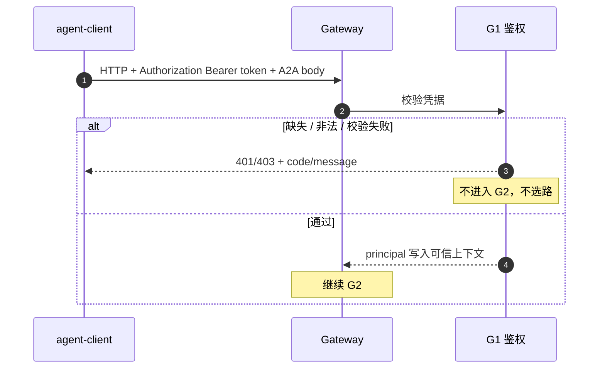
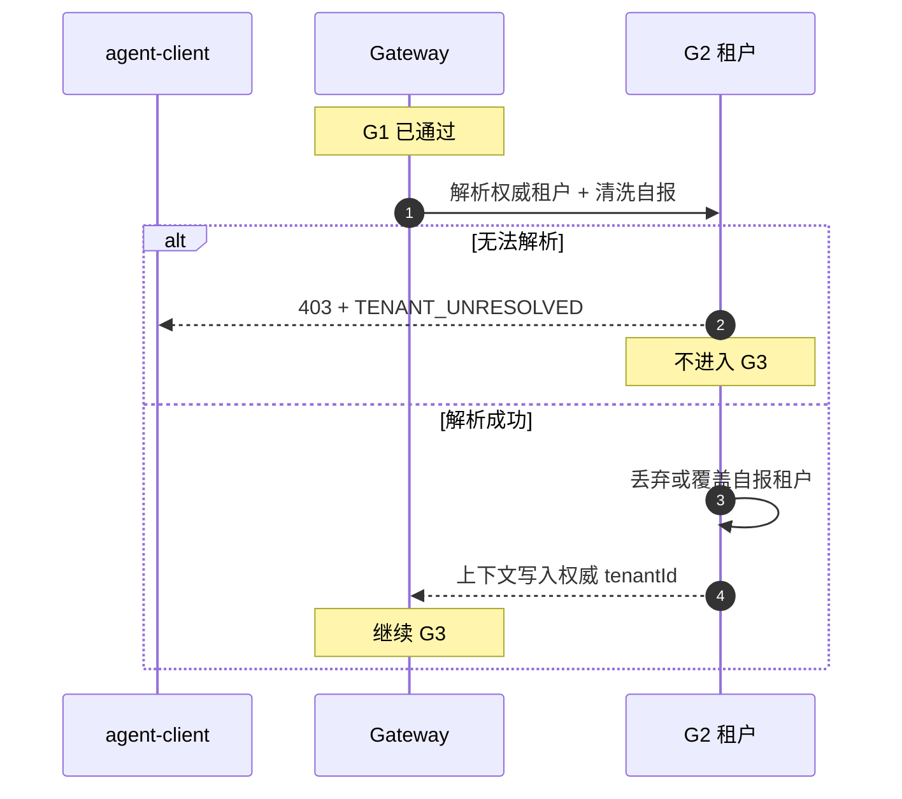
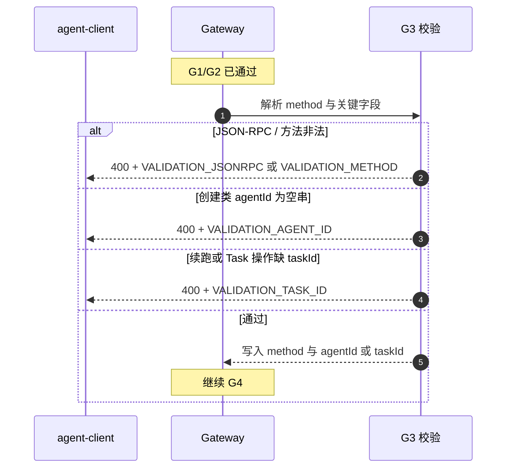
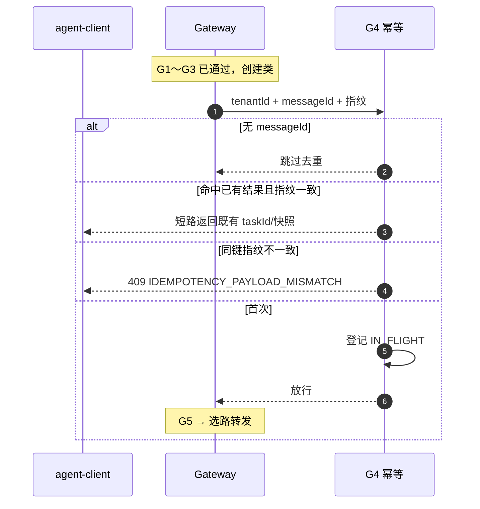
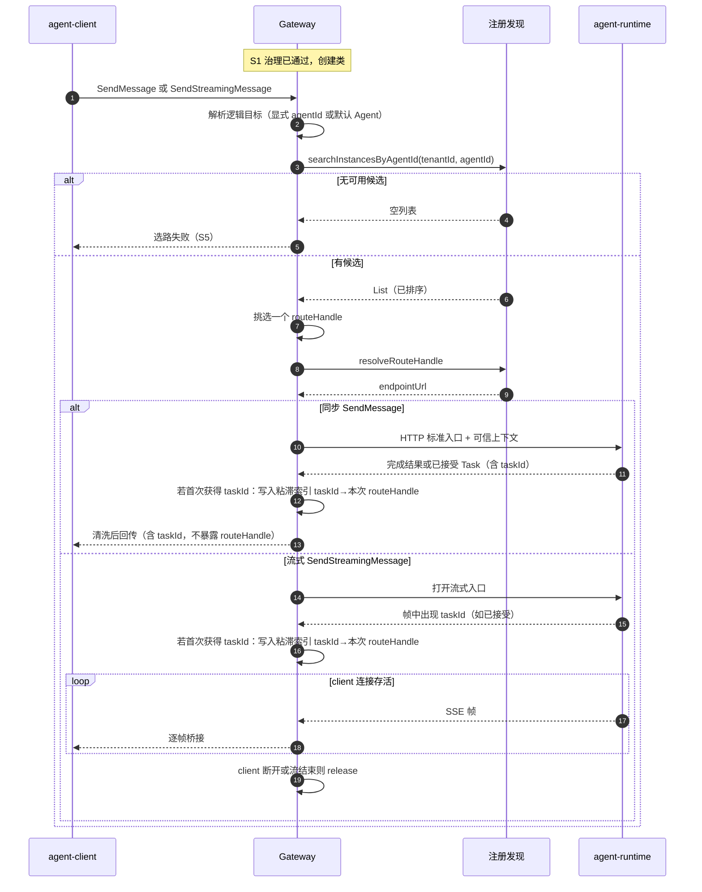
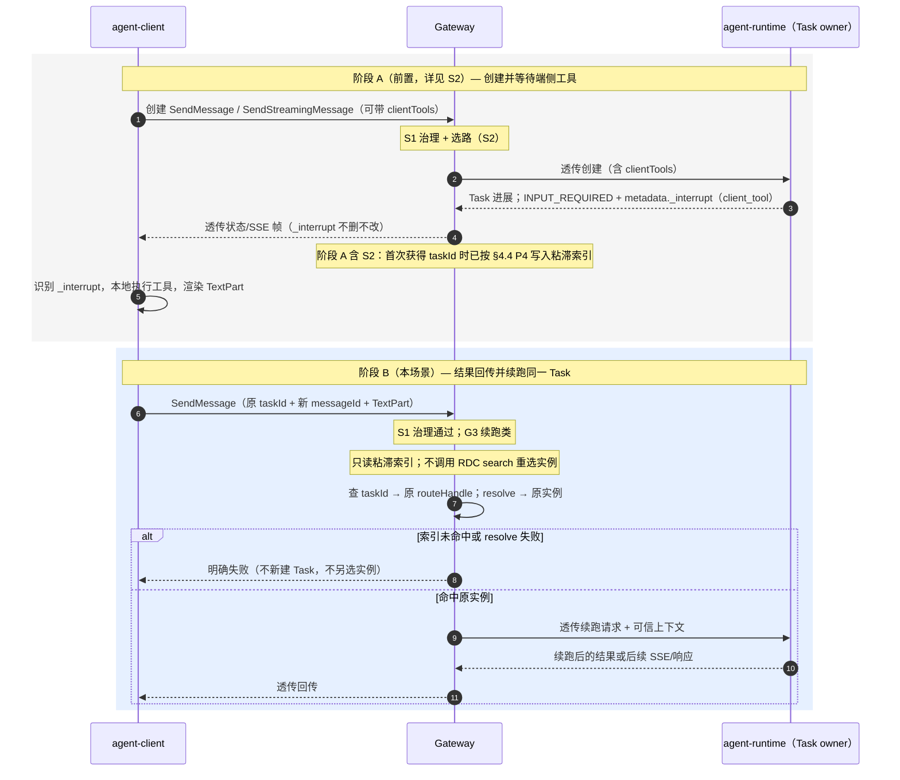
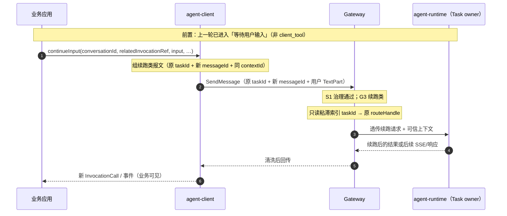
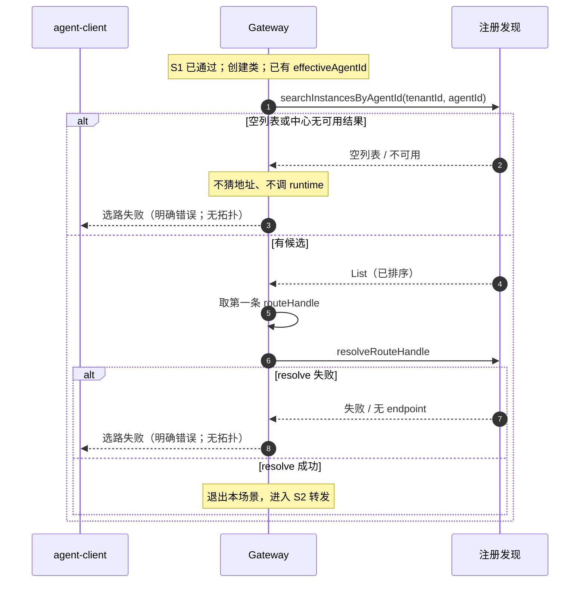

---

## level: L2
module: agent-gateway
feature: FEAT-011
status: in-review

# FEAT-011 L2：客户端调用直连路由转发

## 0. 范围与术语

### 0.1 问题与目标

业务应用通过 agent-client 调用智能体时，若直接访问 agent-runtime 的物理地址，会与部署拓扑强耦合，且鉴权、租户与审计难以统一落实。

平台以 **agent-gateway** 为统一入口：调用方只提交逻辑目标与业务报文，不感知 runtime 物理地址。Gateway 完成入口治理后，向注册发现中心选路，再经 **HTTP/SSE** 将请求直连转发到目标 agent-runtime。

本文定义 FEAT-011 的这条路径：

**入口治理 → 按逻辑目标选路 → HTTP/SSE 直连转发**（不经消息总线）。

Gateway 负责接入、治理、选路与转发/桥接；不执行 Agent，不拥有 Task 权威状态，不做注册上架主体。

### 0.2 范围

#### 0.2.1 做范围内（In Scope）


| 编号    | 能力                 | 730 交付  | 说明                                                                      |
| ----- | ------------------ | ------- | ----------------------------------------------------------------------- |
| IN-1  | 入口治理               | 是       | 认证鉴权、租户解析与清洗、基础参数校验、创建幂等、审计                                             |
| IN-2  | 按逻辑目标选路            | 是       | 有 `agentId` → 指定 Agent；无 `agentId` → 默认 Agent（见工作假设）                    |
| IN-3  | 同步 · 直连转发          | 是       | 治理与选路通过后，HTTP 调用 runtime 并回传                                            |
| IN-4  | 流式 · 直连转发（SSE 桥接）  | 是       | 与同步同一入口形态；token 由 runtime 产生，Gateway 不生成、不缓存                            |
| IN-5  | 选路失败时明确失败          | 是       | 无可用路由等场景返回确定失败，不伪造成功投递                                                  |
| IN-6  | 端侧工具结果续跑透传         | 是       | 同 Task 续跑报文透传；粘滞路由到原 Task owner；不在 Gateway 执行工具                         |
| IN-7  | continueInput 关联转发 | 是（可选承接） | 业务上新 invocation、同 conversation；**wire 走 S3 续跑**（原 `taskId`）；关联不可续接时明确失败 |
| IN-8  | 统一 A2A 入口形态        | 是       | 创建 / 续跑 / 补充输入共用同一 facade，不新开第二套客户端协议                                   |
| IN-9  | 查询 / 取消 / 重订阅转发    | **否**   | 能力属于本特性长期范围；**730 版本不交付**（不实现、不验收）                                      |
| IN-10 | UNKNOWN 后同键恢复      | **否**   | 同上；**730 版本不交付**                                                        |


#### 0.2.2 明确不做（Out of Scope）


| 编号    | 不做                                           | 说明                    |
| ----- | -------------------------------------------- | --------------------- |
| OUT-1 | 执行推理、工具、记忆、业务 Agent                          | 归属 runtime / 业务 Agent |
| OUT-2 | 写入 Task 存储或决定 Task 终态                        | Task owner 为 runtime  |
| OUT-3 | 在 Gateway 内拉起 agent 实例                       | —                     |
| OUT-4 | 维护注册目录 / 存量上架                                | 归属注册发现与服务提供方          |
| OUT-5 | 经消息总线入队或经总线传 token / 大正文                     | 归属 FEAT-012           |
| OUT-6 | 绕过 runtime 标准入口的私有执行协议                       | —                     |
| OUT-7 | 解析端侧工具业务语义并本地执行                              | 归属 client / runtime   |
| OUT-8 | 向 client 暴露物理 endpoint、`routeHandle` 或内部实例地址 | —                     |


#### 0.2.3 730 版本交付边界（摘要）


| 口径          | 内容                                                                      |
| ----------- | ----------------------------------------------------------------------- |
| **730 交付**  | IN-1～IN-8：治理、选路（含默认 Agent）、同步/流式直连、选路失败、工具续跑透传、continueInput（可选承接）、统一入口 |
| **730 不交付** | IN-9、IN-10：GetTask / CancelTask / SubscribeToTask / UNKNOWN 同键恢复        |
| **本文不展开**   | 总线路径（FEAT-012）；Agent 执行与 Task 权威语义                                      |


### 0.3 术语


| 术语                          | 含义                                                                    |
| --------------------------- | --------------------------------------------------------------------- |
| **Gateway / agent-gateway** | 客户端统一治理与转发入口；不执行智能体业务逻辑                                               |
| **直连转发**                    | 选路后经 HTTP/SSE 直接调用 runtime（本文主路径）                                     |
| **总线转发**                    | 控制事件入消息总线后再投递；不在本文展开                                                  |
| **agent-client**            | 端侧调用方；只访问 Gateway                                                     |
| **agent-runtime**           | 执行 Agent、拥有 Task 权威状态的服务                                              |
| **RDC / 注册发现中心**            | 按逻辑目标返回可路由引用；Gateway 不做注册上架主体                                         |
| **agentId**                 | 逻辑目标 Agent 标识；Gateway 据其向 RDC 选路                                      |
| **默认 Agent**                | 请求未带 `agentId` 时 Gateway 选用的目标 Agent；由 Gateway 本地默认配置给出，通常为意图识别 Agent |
| **routeHandle**             | Gateway 内部不透明路由引用；不向 client 返回                                        |
| **taskId**                  | runtime 创建 Task 后的正式句柄                                                |
| **clientInvocationId**      | client 侧弱关联标识；不得替代 `taskId`（730 不交付 UNKNOWN 恢复时，本文不依赖其作主路径）           |
| **SSE 桥接**                  | 将 runtime 的 SSE 流转发给 client；Gateway 不生成、不缓存 token                     |
| **粘滞路由**                    | 续跑等场景按已有 `taskId` 定位原 Task owner，避免误投新实例                              |


### 0.4 工作假设


| 项                 | 假设                                                                            |
| ----------------- | ----------------------------------------------------------------------------- |
| 首包 `agentId`      | **允许缺省**。缺省时 Gateway 使用默认 Agent；显式携带则按指定 Agent 选路                             |
| 默认 Agent          | Gateway 从本地默认配置解析默认 `agentId`（通常指向意图识别 Agent），再按该 ID 向 RDC 选路                 |
| 创建幂等键             | 同租户下稳定创建键；与 client 侧 `messageId`（或约定幂等字段）对应，细则在入口治理章                          |
| 直连 / 总线切换         | 对 client 不可见；本文只描述直连；总线另文                                                     |
| 同步与流式             | 同一 A2A facade 下的语义分支，不拆成两套入口协议                                                |
| Task owner 定位（续跑） | 创建成功后短时可据 `taskId` 定位原路由；找不到则确定失败，不新建 Task                                    |
| 730 不交付能力         | GetTask / CancelTask / SubscribeToTask / UNKNOWN 恢复：入口形态可保留拒绝或未实现语义，**禁止假成功** |


### 0.5 成功标准


| 编号   | 标准                                                      |
| ---- | ------------------------------------------------------- |
| SC-1 | 合法创建请求经治理与选路后到达目标 runtime，并返回可消费结果或已接受 Task 表面          |
| SC-2 | 流式创建完成 SSE 桥接；Gateway 不生成、不缓存 token；client 断开后释放桥接，**不**自动 Cancel/关闭 Task |
| SC-3 | 无 `agentId` 时落到默认 Agent；有 `agentId` 时落到指定 Agent         |
| SC-4 | 治理拒绝或选路失败时返回明确失败，不暴露内部 endpoint / `routeHandle`，不伪造成功投递 |
| SC-5 | 工具续跑在同 Task 语义下透传并粘滞到原 owner；continueInput 关联失败时明确报错    |
| SC-6 | Gateway 不写 Task 库、不执行 Agent、不做注册上架                      |
| SC-7 | 730 不交付的查询 / 取消 / 重订阅 / UNKNOWN 恢复：不作为本版本验收项            |


---

## 1. 共享设计

本章固定跨场景横切骨架。各场景章只写本场景差量，不重复本章已定内容。接口字段、HTTP 头等细节在对应场景章展开，场景定稿后可补充本节字段级细节。

### 1.1 统一入口形态


| 项          | 约定                                                                        |
| ---------- | ------------------------------------------------------------------------- |
| 对外入口       | 单一 A2A facade（JSON-RPC over HTTP；流式响应侧为 SSE）                              |
| 730 使用的方法  | `SendMessage`、`SendStreamingMessage`（创建 / 续跑 / 补充输入均经此 facade）            |
| 730 不交付的方法 | `GetTask`、`CancelTask`、`SubscribeToTask`：可不实现；若暴露则不得假成功                   |
| 调用方        | agent-client（及测试替身）；不向业务暴露「直连口 / 总线口」两套入口                                 |
| 同步与流式      | 由请求的 JSON-RPC `method` 区分（`SendMessage` / `SendStreamingMessage`），不是第二套协议 |
| 与 runtime  | 转发语义对齐 runtime 标准服务入口；不另开私有执行协议                                           |


client 不感知本次内部走直连还是总线；路径选择在 Gateway 内完成（§1.5）。

### 1.2 调用链顺序

所有成功投递共用：

```text
入站（I-01）
  → 入口治理（S1；失败则停）
  → 路径选择（DIRECT | BUS）
  → 解析逻辑目标（显式 agentId，或默认 Agent）
  → 选路（RDC → routeHandle；失败 → S5）
  → DIRECT：HTTP 直连转发 / SSE 桥接
     或 BUS：不在本文展开
```


| 规则             | 说明                                                                                      |
| -------------- | --------------------------------------------------------------------------------------- |
| 先治理后选路         | 未过治理不得查 RDC、不得调 runtime、不得发总线                                                           |
| 先选路后转发         | 无可用路由不得猜测地址或伪造成功 Task                                                                   |
| 拓扑不对 client 可见 | 响应与错误中不出现 endpoint / `routeHandle` 明文 / 实例地址                                            |
| 续跑粘滞           | 依赖创建时建立的短时索引 `taskId → routeHandle`（S2 写入、S3 只读）；续跑按索引定位原 Task owner，不再按 `agentId` 重选实例 |


### 1.3 逻辑模块

包名可按仓库惯例微调，**边界勿混**：

```text
agent-gateway/
├── facade/        # 解析 JSON-RPC、方法分发、响应 / SSE 写出
├── governance/    # 鉴权、租户、校验、幂等、审计
├── routing/       # 默认 Agent 解析、RDC 客户端、routeHandle、taskId 粘滞
├── direct/        # HTTP 同步转发、打开下游流
├── sse/           # SSE 桥接、release（client 断开必释放）
├── path/          # DIRECT vs BUS 选择
└── obs/           # 审计落点、route trace、与 traceId 关联
```


| 模块           | 主责                | 不负责                  |
| ------------ | ----------------- | -------------------- |
| facade       | 协议表面、分发           | 业务 Agent、Task 权威     |
| governance   | 可信上下文或拒绝          | 选路、转发                |
| routing      | 逻辑目标 → 可转发引用；粘滞定位 | 执行、写 Task            |
| direct / sse | 直连投递与桥接           | 总线入队、生成 token        |
| path         | 选 DIRECT / BUS    | 两路径的业务语义细节           |
| obs          | 可观测与审计落点          | 是否放行（放行在 governance） |


### 1.4 接口边总表

此处只固定边的存在与归属；入参 / 出参 / 禁止项在场景章展开。


| 边           | 对端                     | 目的          | 本特性        |
| ----------- | ---------------------- | ----------- | ---------- |
| **I-01**    | agent-client ↔ Gateway | 统一 A2A 入口   | 使用         |
| **I-02**    | Gateway → RDC          | 按逻辑目标选路     | 使用         |
| **I-03**    | Gateway → runtime      | HTTP 同步转发等  | 使用         |
| **I-06**    | Gateway ↔ runtime      | SSE 桥接      | 使用（流式创建）   |
| **I-07**    | 多轮工具相关报文               | 透传（不解析业务语义） | 使用（S3）     |
| Bus 发布 / 投影 | Gateway ↔ Event Bus    | 控制入队与状态投影   | **本特性不使用** |


| 场景               | 主要用到的边                                           |
| ---------------- | ------------------------------------------------ |
| S1 入口治理          | I-01（拒绝时仅此）                                      |
| S2 创建调用（同步）      | I-01, I-02, I-03                                 |
| S2 创建调用（流式）      | I-01, I-02, I-03, I-06                           |
| S3 工具续跑          | I-01, I-02 或粘滞定位, I-03, I-07                     |
| S4 continueInput | I-01（续跑类，复用 S3 粘滞）；runtime 亦支持流式续跑（I-06），**011 730 主路径用同步 SendMessage**（§4.10 AC-RT-5） |
| S5 选路失败          | I-01, I-02（失败）；无 I-03 / I-06                     |
| S6～S9            | 730 不交付；边保留叙述即可                                  |


### 1.5 路径选择（直连 vs 总线）


| 项        | 约定                                 |
| -------- | ---------------------------------- |
| 选择点      | 治理通过之后、选路 / 转发之前（`path/`）          |
| 对 client | **不可见**；无「用户选直连 / 总线」API           |
| 本文描述     | **DIRECT**：选路后 HTTP/SSE 直连 runtime |
| BUS      | 接线点保留在 `path/`；语义不在本文展开            |
| 730      | 可固定为 `DIRECT`                      |


### 1.6 配置与部署假设

**配置（语义级；键名实现期对齐）：**


| 配置意图      | 约束                                  |
| --------- | ----------------------------------- |
| 默认 Agent  | 提供本地默认可解析的 `agentId`（通常为意图识别 Agent） |
| path-mode | 730 可为固定 `direct`                   |
| 直连超时      | 同步转发超时、流式空闲超时可配                     |
| SSE       | client 断开时必须释放下游桥接；该语义不因配置关闭        |
| 治理        | 鉴权、幂等窗口等细则见 S1                      |


**部署假设：**


| 项 | 约定 |
| --- | --- |
| 单元边界 | Gateway 相对 Event Bus、RDC、runtime 为**可独立部署 / 可替换**的运行时单元（与 agent-bus「三单元可替换」语义对齐）。正式 Gateway **不**绑死在 Event Bus 进程制品内。 |
| 进程形态 | **按可独立部署设计**（独立模块 / 可单独构建的运行制品）。**允许**与其它单元同进程或分进程部署；**不**把「必须独占 OS 进程」写成 730 硬约束。 |
| 开发 vs 部署 | 开发阶段保证边界可拆、制品可单独运行；**实际起几个进程、几份副本由部署/运维决定**，不由业务报文或 client 选择。 |
| 网络 | 须能访问 RDC，以及目标 runtime 的标准 HTTP/SSE |
| 消息总线 | FEAT-011 **直连路径**运行不依赖 Broker / Event Bus 进程；总线路径见 FEAT-012 |


---

## 2. 场景总览

本章给出 FEAT-011 直连路径的场景清单与正文顺序。各场景细则从 §3 起展开；同步与流式合在创建场景中写差量；多实例候选挑选合在创建选路中写，粘滞合在续跑中写。

### 2.1 场景清单

下表按**正文分析顺序**排列。S1 为 S2～S4 成功路径的前置约束。


| 编号  | 场景                   | 交付口径                 | 说明                                                                                      |
| --- | -------------------- | -------------------- | --------------------------------------------------------------------------------------- |
| S1  | 入口治理                 | 730 交付（Gateway 自做）   | 鉴权、租户、校验、幂等、审计；S2～S4 成功路径均已通过本章                                                         |
| S2  | 创建调用                 | 730 交付（承接 client 创建） | 无 `agentId` → 默认 Agent；有则指定 Agent；含同步 / 流式；含多实例候选挑选与 resolve                            |
| S3  | 端侧工具结果续跑             | 730 交付（承接 client 续跑） | 同 Task；带 `taskId` + TextPart；粘滞路由到原 Task owner                                          |
| S4  | 用户补充输入 continueInput | 730 交付（与 agent-client continueInput 对齐） | 业务上新 invocation、同 conversation；**wire 走 S3 续跑**（原 `taskId` + 新 `messageId`）；关联不可续接时明确失败 |
| S5  | 选路失败                 | 730 交付（Gateway 自做）   | 治理已通过后无可用候选、resolve 失败等；明确失败、不伪造成功投递                                                    |
| S6  | 查询 Task              | **730 版本不交付**        | GetTask 转发；本版本不实现、不验收                                                                   |
| S7  | 取消 Task              | **730 版本不交付**        | CancelTask 转发；同上                                                                        |
| S8  | 重订阅流                 | **730 版本不交付**        | SubscribeToTask 转发；同上                                                                   |
| S9  | 创建结果不明时的恢复           | **730 版本不交付**        | UNKNOWN 同键恢复；同上                                                                         |


### 2.2 场景关系

```text
所有入站
  └─ S1 入口治理 ──拒绝──► 结束（不选路、不转发）
         │通过
         ▼
    ┌────┴────┐
    │         │
  创建类          续跑类（工具 / 用户补充）
  (S2)           (S3 / S4，同 wire：原 taskId)
    │              │
    ▼              ▼
  RDC 选路        粘滞（taskId→routeHandle）
    │              │
    ├─失败──► S5   ├─粘滞未命中──► §5.6（非 S5）
    └─成功──► 转发  └─成功──► 直连转发
```


| 关系          | 说明                                                                                           |
| ----------- | -------------------------------------------------------------------------------------------- |
| S1 → S2～S4  | 成功业务路径均以治理通过为前提；治理细则只在 S1 写一次                                                                |
| S2 内含       | 默认识别 / 指定 Agent、同步与流式回传差量、RDC 候选挑选与 resolve                                                  |
| S3 相对 S2    | 不重新「业务选 Agent」为主；按 `taskId` 粘滞到原实例                                                           |
| S4 相对 S2/S3 | 业务侧为新 invocation；**wire 与 S3 相同**（带原 `taskId` 续跑 + 粘滞），对齐 runtime `SendMessage(taskId)` 续接语义 |
| S5          | 专写选路失败；S2～S4 正文只保留失败出口，不重复失败专章                                                               |
| S6～S9       | 730 不交付；§8 仅作边界说明                                                                            |


### 2.3 阅读与实现顺序

1. S1：定入口约束（凭据、租户、参数、幂等、审计）。
2. S2：定创建主路径（含同步 / 流式、默认 Agent、实例挑选）。
3. S3、S4：定续跑与补充输入差量。
4. S5：定无路由等失败语义。
5. S6～S9：确认 730 不交付边界即可。

---

## 3. 场景 S1：入口治理

Gateway 是客户端进入平台的治理入口。任意调用在选路与转发之前，须先完成本章定义的入口治理：未通过则停在门口；全部通过后进入选路与投递（S2～S4 或总线路径）。

本章按子场景分节书写；**先定管道与总表，再逐节展开 G1～G5**。

### 3.1 要做什么


| 项    | 内容                                          |
| ---- | ------------------------------------------- |
| 目标   | 完成约定治理，产出可信上下文，或明确拒绝且不进入后续投递                |
| In   | G1～G5（见 §3.2）                               |
| Out  | 选路与转发；限流 / WAF / 插件链 / 灰度（非本版默认范围）          |
| 失败通则 | 治理层明确错误；不查 RDC、不调 runtime、不发总线事件；不伪装已建 Task |


### 3.2 治理子场景总表

同一入站请求上按固定顺序执行；任一步失败即停。


| 编号     | 子场景     | 730 | 一句话                                      |
| ------ | ------- | --- | ---------------------------------------- |
| **G1** | 认证鉴权    | 必须  | 确认「谁在调」；不过则拒绝                            |
| **G2** | 租户解析与清洗 | 必须  | 从认证主体解析租户；不信 client 自报                   |
| **G3** | 基础参数校验  | 必须  | 方法、幂等键等合法性；`agentId` 可缺省（缺省则后续用默认 Agent） |
| **G4** | 创建幂等    | 必须  | 同租户 + 同创建键去重，避免重复创建副作用                   |
| **G5** | 审计留痕    | 必须  | 记录通过 / 拒绝关键事实，不改业务语义                     |


```text
入站
  → G1 鉴权 → G2 租户 → G3 校验 → G4 幂等 → G5 审计
       │ 任一步失败 → 治理错误返回（结束）
       └ 全部通过 → 可信上下文 → 选路 / 转发（S2～S5 等）
```

**顺序约定：**


| 步骤       | 放在该位置的原因                                   |
| -------- | ------------------------------------------ |
| G1 最先    | 无合法身份不进入后续；没有 principal，租户无法可靠解析           |
| G2 紧接 G1 | 权威 `tenantId` 来自认证主体与网关策略；幂等空间是「同租户 + 创建键」 |
| G3 在身份之后 | 先区分认证失败与参数不合法；再进入可能改结果的幂等                  |
| G4 在校验之后 | 先拦脏请求再查重，避免残缺键污染去重表                        |
| G5 覆盖整段  | 通过与拒绝都要留痕；可在失败点立即记，成功在管道末尾补记               |


**对调用方的契约摘要（细节在各 Gx 节展开）：**


| 子场景 | 入站须满足                 | 不满足时             |
| --- | --------------------- | ---------------- |
| G1  | 携带合法认证凭据（不进 body）     | 认证失败，停在门口        |
| G2  | 不以自报头冒充权威租户           | 自报被清洗；无映射则拒绝     |
| G3  | 方法合法；创建键等字段符合约定       | 校验失败，不选路         |
| G4  | 创建重试用同一创建键且正文一致       | 可能重复建 Task，或冲突拒绝 |
| G5  | 宜带链路追踪标识；勿把密钥写入明文业务字段 | 审计关联困难或合规风险      |


### 3.3 G1 — 认证鉴权

确认调用方身份合法：有合法凭据才能进门；缺失、格式不对或校验失败 → **立即拒绝**，不进入 G2 及之后，也不选路。通过后在可信上下文留下 **认证主体（principal）**，供 G2 解析租户。

凭据走 **HTTP 头**；A2A JSON-RPC body **不承担认证**，不新增 A2A 身份字段。

本节按三层书写：**730 已定**（可交付验收）→ **已约束、待上游/联调**（边界钉死、细节不挡主路径）→ **Gateway 内部**（不对调用方 SDK 提交付要求）。

#### 3.3.0 原则（调用方如何理解「在哪鉴权」）


| #   | 原则                             | 说明                                                                                                                     |
| --- | ------------------------------ | ---------------------------------------------------------------------------------------------------------------------- |
| P1  | **按 HTTP 请求鉴权，不按业务流程鉴权一次**     | 创建 → 续跑 → 补充输入等业务有先后，但每一步若产生**新的**打到 Gateway 的 HTTP 请求，都必须重新携带凭据。730 **不**默认「首包鉴权成功后后续免头」。                             |
| P2  | **落点是 HTTP 入站，不是某一种 A2A 业务消息** | 与 JSON-RPC 的 `method`（`SendMessage` / `SendStreamingMessage` 等）无关；凡进入 A2A facade 的 HTTP 均适用。不在 A2A body 内增加鉴权字段或枚举。    |
| P3  | **每种业务步骤、每条出站 HTTP 都要带**       | 创建、流式建连、工具续跑、continueInput（若做）以及本特性后续开放的其他方法：只要发 HTTP，就带 `Authorization`。SDK 宜在 **transport 统一挂头**，不必在每个业务场景里重复实现鉴权逻辑。 |
| P4  | **流式：鉴权挂在建连请求上**               | `SendStreamingMessage` 建立 SSE 的那次 HTTP 必须带凭据；后续 SSE 事件帧不是新的鉴权点。连接断开后若再发起新的 HTTP（重连/新调用），须再次携带。                         |
| P5  | **身份由业务注入，挂头由 SDK 保证**         | token 从哪来属上游；调用方 SDK 须保证「有票则每次 HTTP 都挂上」。                                                                              |


```text
创建 HTTP          → G1 → … → 转发
续跑 HTTP          → G1 → … → 转发     （再走门禁，不是沿用创建请求的「已鉴权会话」）
补充输入 HTTP      → G1 → … → 转发
流式建连 HTTP      → G1 → … → SSE 桥接 （帧上不再鉴权）
```

#### 3.3.1 730 已定

**行为**


| 项                | 约定                                                                            |
| ---------------- | ----------------------------------------------------------------------------- |
| 适用范围             | 见 §3.3.0：每一个打到 Gateway A2A facade 的 HTTP 请求                                   |
| 凭据形态             | `Authorization: Bearer <token>`，`<token>` 非空                                  |
| 成功路径             | 校验通过 → 写入 `principalId`（或等价主体标识）→ 进入 G2                                       |
| 失败路径             | 治理层 **HTTP + 稳定 error body** 返回；不查 RDC、不调 runtime、不发总线；不返回「已接受 Task」或 UNKNOWN |
| HTTP 状态          | 缺失 / 格式非法 / 校验失败 → **401**；身份有效但无调用权限（若启用）→ **403**                           |
| error `code`（稳定） | `AUTH_MISSING` / `AUTH_INVALID` / `AUTH_FORBIDDEN`                            |
| error body 最小集   | `code`、`message`；可选 `traceId`                                                 |


**对调用方（agent-client）的最小契约——SDK/transport 须保证**


| #      | 约束                                                                     | 说明                                 |
| ------ | ---------------------------------------------------------------------- | ---------------------------------- |
| C-G1-1 | 每一次入站 HTTP 均携带 `Authorization`                                         | 见 §3.3.0：按请求不按业务流程；不能只在首包带、续跑省略    |
| C-G1-2 | 形态为 `Bearer <token>` 且 token 非空                                        | 不新造 A2A 字段；由 transport 设头          |
| C-G1-3 | **禁止**把 access token / 密码写入 JSON-RPC `params`、`message.parts`、metadata | Gateway 鉴权不读取 body 身份字段            |
| C-G1-4 | 收到 401/403 时按 **HTTP 治理错误**处理                                          | 不得解析为已接受 Task，不得走基于 `taskId` 的成功路径 |
| C-G1-5 | 生产 transport 真实发送该头                                                    | InProcess 等测试替身可另约定                |


**判断顺序**

1. 无 `Authorization` → 401 + `AUTH_MISSING`，结束。
2. 非 `Bearer <token>` 或 token 段为空 → 401 + `AUTH_INVALID`，结束。
3. 校验 token（实现可替换，对外错误码稳定）→ 失败则 401 + `AUTH_INVALID`，结束。
4. （可选）身份有效但无权限 → 403 + `AUTH_FORBIDDEN`，结束。
5. 通过 → 写 `principalId` 等；**不**在此步采信自报租户（交给 G2）。




**验收（G1 / 730，Gateway 自测为主）**


| #      | Given              | When | Then                                    |
| ------ | ------------------ | ---- | --------------------------------------- |
| T-G1-1 | 无 `Authorization`  | 任意入站 | 401 + `AUTH_MISSING`；无 RDC / runtime 调用 |
| T-G1-2 | 非 Bearer 或 token 空 | 任意入站 | 401 + `AUTH_INVALID`；无下游调用              |
| T-G1-3 | Bearer 校验失败        | 任意入站 | 401 + `AUTH_INVALID`；无下游调用              |
| T-G1-4 | 合法 Bearer          | 任意入站 | 进入 G2；上下文含 principal                    |
| T-G1-5 | 鉴权失败               | 任意入站 | 错误在 HTTP 治理层；不得表现为已建 Task               |


调用方 730 **不要求**交付鉴权失败用例；成功路径须满足 C-G1-1～C-G1-5。

#### 3.3.2 已约束、待上游 / 联调冻结

下列项**边界已约束**，具体取值不挡 730 主路径设计与联调；用双方约定的测试凭据即可跑通。


| 项              | 已约束（不可放开）                                      | 待冻结（不挡 730）                           |
| -------------- | ---------------------------------------------- | ------------------------------------- |
| token 签发与 IdP  | 必须是可被 Gateway 校验的 Bearer token；无合法 token 不得进门  | 生产 IdP、签发方、刷新协议由业务 / 平台定；联调可用测试 token |
| token 内 claims | 须能解析出供 G2 使用的主体信息（或 Gateway 侧映射表能落到 principal） | claim 名、映射表内容联调/配置期对齐                 |
| 过期与刷新          | 过期 token → `AUTH_INVALID`；调用方应刷新后再重试           | CredentialProvider / 业务侧如何取票、何时刷新     |
| 企业替代方案         | 若改为 mTLS 等，仍须保证「一种可校验凭据 + 同等错误分层」              | 方案选型与切换时间                             |
| 授权细度           | 若启用「有身份无权限」→ 403 + `AUTH_FORBIDDEN`            | 730 可先只做认证、授权规则后续加严                   |


#### 3.3.3 Gateway 内部（不对调用方提交付）


| 项     | 约定                                     |
| ----- | -------------------------------------- |
| 模块落点  | `governance/auth`（或等价过滤器），挂在 facade 最前 |
| 校验器   | 可替换（SPI）；对外 `code` 保持 §3.3.1 稳定        |
| 日志    | 可记 `principalId` 与结果码；**禁止**打印完整 token |
| 负例与探活 | 鉴权失败、缺头等由 Gateway 单测 / 自测覆盖            |


---

### 3.4 G2 — 租户解析与清洗

在 G1 已给出认证主体的前提下，确定本次调用的**权威租户** `tenantId`，写入可信上下文；**不采信**调用方自报租户。

730 做**简单版**：权威租户由 Gateway 从「已通过校验的凭据所绑定的租户」得到（配置绑定或固定联调租户即可），并清洗自报；不上生产租户中心、不做复杂多租户策略服务。

权威租户**不是**调用方在 A2A / header 里传来的业务字段。

本节同样分三层：**730 已定** → **已约束、待上游/联调** → **Gateway 内部**。

#### 3.4.0 原则


| #   | 原则                        | 说明                                                         |
| --- | ------------------------- | ---------------------------------------------------------- |
| P1  | **权威在 Gateway，不在 client** | `tenantId` 由 G1 通过后的凭据绑定 / 网关策略解析得出，不由调用方指定。               |
| P2  | **自报一律非权威**               | 请求中的 `X-Tenant-Id`、body/metadata 中「以我为准」的租户声明，不得进入下游可信上下文。 |
| P3  | **先解析，再清洗**               | 解析不出权威租户 → 直接拒绝；有权威后再丢弃或覆盖自报。                              |
| P4  | **换租户靠换凭据**               | 多租户切换应通过不同合法凭据（不同绑定），而不是改 header / body 重试。                |
| P5  | **730 实现从简，原则不简化**        | 联调可用固定租户或极小绑定表；「不采信自报」不可放开。                                |


```text
G1 通过（含 principal / 已校验凭据）
    → 解析权威 tenantId（凭据绑定 / 配置）
         ├─ 失败 → 403，结束
         └─ 成功 → 清洗自报 → 上下文写入 tenantId → G3
```

#### 3.4.1 730 已定

**行为**


| 项         | 约定                                                           |
| --------- | ------------------------------------------------------------ |
| 前置        | G1 已通过                                                       |
| 权威输入      | 已校验凭据所绑定的租户（见下方「730 解析方式」）；可含 G1 写入的 `principalId`           |
| 禁止作权威     | `X-Tenant-Id`；JSON-RPC / metadata 内 client 自填租户 / 用户身份覆盖字段   |
| 成功        | 可信上下文写入非空权威 `tenantId` → 进入 G3                               |
| 失败        | 无法得到唯一权威租户 → **403** + 稳定 error body；不进入 G3，不查 RDC / runtime |
| 建议 `code` | `TENANT_UNRESOLVED`（无绑定）；`TENANT_FORBIDDEN`（主体无权使用该租户，若区分）   |
| 清洗（V1）    | 存在自报且与权威不同或相同：均**丢弃/覆盖**，仍以权威继续；不因「多带了自报头」单独 403             |


**730 解析方式：凭据绑定租户**

合法 Bearer（通过 G1）在 Gateway 配置中绑定权威 `tenantId`；解析成功即写入可信上下文。无绑定或绑定为空 → 403 + `TENANT_UNRESOLVED`。


| 项        | 约定                                                              |
| -------- | --------------------------------------------------------------- |
| 输入       | G1 已接受的凭据标识（配置中的 token 逻辑名 / 指纹，或校验器返回的主体键）                     |
| 输出       | 该凭据绑定的唯一非空 `tenantId`                                           |
| 配置形态（示意） | `credentials.<id>.token` + `credentials.<id>.tenantId`（键名实现期对齐） |


**对调用方（agent-client）的最小契约**


| #      | 约束                                                    | 说明                               |
| ------ | ----------------------------------------------------- | -------------------------------- |
| C-G2-1 | **禁止**将 `X-Tenant-Id`（或等价自报租户头）当作正式能力                 | 误发时 Gateway 清洗，不保证按自报进入该租户       |
| C-G2-2 | SDK 本地配置中的 `tenantId`（若有）**仅用于本地**日志/调试，不得映射为 wire 权威 | 文档须标明非 wire 权威                   |
| C-G2-3 | **禁止**要求业务「为调通 Gateway 而填写租户 header」                  | 避免错误用法固化                         |
| C-G2-4 | 收到 403 + `TENANT_`* 时，按身份/租户不可用处理                     | **不要**建议加自报租户头重试；应换合法凭据或联系平台开通绑定 |
| C-G2-5 | client **入站**不要求 body 提交权威租户                              | 权威值由 Gateway 解析；**出站**到 runtime 注入 `params.metadata.tenantId`（§4.10 AC-RT-1），非 client 必填 |


**判断顺序**

1. 基于已校验凭据 / `principalId` / 配置，解析权威 `tenantId`。
2. 无唯一非空结果 → 403 + `TENANT_UNRESOLVED`（或 `TENANT_FORBIDDEN`），结束。
3. 扫描并清洗自报头/冲突身份字段（丢弃或覆盖为权威）。
4. 上下文写入权威 `tenantId`（及既有 `principalId`）→ 进入 G3。




**验收（G2 / 730，Gateway 自测为主）**


| #      | Given                       | When | Then                                              |
| ------ | --------------------------- | ---- | ------------------------------------------------- |
| T-G2-1 | G1 通过，凭据已绑定唯一租户             | 任意入站 | 进入 G3；上下文 `tenantId` 为权威值                         |
| T-G2-2 | G1 通过，凭据无租户绑定               | 任意入站 | 403 + `TENANT_UNRESOLVED`（或等价）；无 RDC / runtime 调用 |
| T-G2-3 | G1 通过，带与权威不同的 `X-Tenant-Id` | 入站   | 仍以权威继续；自报不生效                                      |
| T-G2-4 | G1 通过，自报与权威相同               | 入站   | 上下文仍只认权威解析结果，不视为「信任自报」                            |


调用方 730 **不要求**交付租户失败用例；成功路径须满足 C-G2-1～C-G2-5（不自报权威租户即可）。

#### 3.4.2 已约束、待上游 / 联调冻结


| 项     | 已约束（不可放开）                | 待冻结（不挡 730）                    |
| ----- | ------------------------ | ------------------------------ |
| 权威来源  | 只来自 Gateway 对已校验凭据的绑定/策略 | 生产 claim 名、正式映射数据、多租户开通流程      |
| 自报    | 永不作为权威；必须清洗              | 冲突时是否升级为「硬 403」（730 默认清洗后继续）   |
| 解析失败  | 必须 403，不得猜租户、不得用自报兜底     | 文案与是否区分 `TENANT_FORBIDDEN`     |
| 向下游注入 | 转发时注入权威 `tenantId` | **约定（§4.10 AC-RT-1）**：写出 `params.metadata.tenantId`（清洗 client 自报后覆盖）；缺失或空值按非法参数，不回退自报。runtime 本期可读该字段（实现可暂不消费、预留） |


#### 3.4.3 Gateway 内部（不对调用方提交付）


| 项      | 约定                                                             |
| ------ | -------------------------------------------------------------- |
| 模块落点   | `governance/tenant`（紧接 auth 之后）                                |
| 730 配置 | 合法凭据 → `tenantId` 绑定（或固定联调租户）；可另附极小 `principalId → tenantId` 表 |
| 日志     | 可记权威 `tenantId`、是否丢弃自报；不记完整 token                              |
| 负例     | 无绑定、自报被清洗等由 Gateway 自测覆盖                                       |


---

### 3.5 G3 — 基础参数校验

在身份与租户已确定的前提下，拦住**明显不合法、后续无法按约定选路或会误判创建/续跑**的请求。只做方法识别与关键键形态校验；不做完整 JSON Schema，不查 RDC「目标是否可路由」（归 S5）。

与 §0 一致：**创建类允许缺省 `agentId`**；缺省时后续由默认 Agent 解析，本步不因此失败。

本节分三层：**730 已定** → **已约束、待联调** → **Gateway 内部**。

#### 3.5.0 原则


| #   | 原则                     | 说明                                           |
| --- | ---------------------- | -------------------------------------------- |
| P1  | **先形态、后选路**            | G3 只判断「读不读得出、合不合法」；目标在不在注册中心由选路决定。           |
| P2  | **创建与续跑用 `taskId` 区分** | 同一 `SendMessage`：无非空 `taskId` → 创建类；有 → 续跑类。 |
| P3  | **创建 `agentId` 可缺省**   | 缺省合法；显式携带则须为非空字符串。空字符串按非法。                   |
| P4  | **续跑必须带原 `taskId`**    | 漏带会被当成创建，存在误建 Task 风险；G3 对续跑要求 `taskId`。     |
| P5  | **不新造 A2A 身份字段**       | 使用 JSON-RPC / A2A 已有结构；`agentId` 落点见下表约定路径。  |


#### 3.5.1 730 已定

**方法与分类**


| 类别    | 方法                                                   | 730 最少校验                                 |
| ----- | ---------------------------------------------------- | ---------------------------------------- |
| 创建类   | `SendMessage` / `SendStreamingMessage`，且无非空 `taskId` | JSON-RPC 合法；方法在白名单；若携带 `agentId` 则非空     |
| 续跑类   | 带非空 `taskId` 的 `SendMessage`（工具续跑等）                  | JSON-RPC 合法；`taskId` 非空；不强制本次带 `agentId` |
| 未交付方法 | `GetTask` / `CancelTask` / `SubscribeToTask`         | 730 不交付；若入口仍可达，须校验非空 `taskId`，禁止假成功      |


**字段约定**


| 字段                  | 约定                                                                                 |
| ------------------- | ---------------------------------------------------------------------------------- |
| JSON-RPC            | 可解析；含 `method`；`jsonrpc` 为 `"2.0"`                                                 |
| 方法白名单（730）          | `SendMessage`、`SendStreamingMessage`；（若暴露）`GetTask`、`CancelTask`、`SubscribeToTask` |
| `agentId` 读路径       | `params.metadata.agentId`                                                          |
| `taskId` 读路径        | 续跑：`params.message.taskId`；Get/Cancel/Subscribe：`params.taskId`（或该方法约定位置）          |
| `message.messageId` | 本步不因缺失失败；有则写入上下文供 G4                                                               |
| `message.contextId` | 本步不强制；透传                                                                           |


**失败与成功**


| 项      | 约定                                                                                        |
| ------ | ----------------------------------------------------------------------------------------- |
| 失败     | **400** + 稳定 error body；不进入 G4，不选路，不调 runtime                                             |
| `code` | `VALIDATION_JSONRPC` / `VALIDATION_METHOD` / `VALIDATION_AGENT_ID` / `VALIDATION_TASK_ID` |
| 成功     | 上下文写入 `method`；创建类若有 `agentId` 则写入；续跑/Task 类写入 `taskId` → 进入 G4                           |


**判断顺序**

1. body 不可解析为 JSON → `VALIDATION_JSONRPC`。
2. 缺 `method` 或 `jsonrpc` 非法 → `VALIDATION_JSONRPC`。
3. `method` 不在白名单 → `VALIDATION_METHOD`。
4. `GetTask` / `CancelTask` / `SubscribeToTask`：无非空 `taskId` → `VALIDATION_TASK_ID`。
5. `SendMessage` / `SendStreamingMessage`：
  - 有非空 `taskId` → 续跑，通过（写 `taskId`）。  
  - 否则为创建：若存在 `agentId` 键且值为空白 → `VALIDATION_AGENT_ID`；缺省键或非空值 → 通过（有值则写 `agentId`）。
6. 进入 G4。




**对调用方（agent-client）的最小契约**


| #      | 约束                                                | 说明                                  |
| ------ | ------------------------------------------------- | ----------------------------------- |
| C-G3-1 | 按 JSON-RPC 2.0 组包；`method` 使用白名单名称                | 别名须双方登记                             |
| C-G3-2 | 创建若携带 `agentId`，写入 `params.metadata.agentId` 且非空  | API 有值时 transport 必须写出；不得只留在 SDK 内存 |
| C-G3-3 | 创建允许不传 `agentId`                                  | 与默认 Agent 选路衔接；空字符串非法               |
| C-G3-4 | 续跑 `SendMessage` 必须带原 `params.message.taskId`     | 禁止用「再发一条无 taskId 的创建」代替续跑           |
| C-G3-5 | **禁止**用 `messageId` / 本地 invocation 句柄代替 `taskId` | `messageId` 供创建幂等（G4）               |
| C-G3-6 | 收到 400 + `VALIDATION_`* 时按参数/契约错误处理               | 修正组包后重发；不要当成 401 去刷 token           |


**验收（G3 / 730，Gateway 自测为主）**


| #      | Given                       | When                               | Then                                  |
| ------ | --------------------------- | ---------------------------------- | ------------------------------------- |
| T-G3-1 | G1/G2 通过，合法创建且带非空 `agentId` | SendMessage / SendStreamingMessage | 进入 G4；上下文含 `agentId`                  |
| T-G3-2 | 合法创建且不传 `agentId`           | 创建调用                               | 进入 G4；上下文无 `agentId`（交后续默认 Agent）     |
| T-G3-3 | 创建带空字符串 `agentId`           | 创建调用                               | 400 + `VALIDATION_AGENT_ID`；不选路       |
| T-G3-4 | 续跑带非空 `taskId`              | SendMessage                        | 进入 G4；上下文含 `taskId`                   |
| T-G3-5 | 续跑缺 `taskId`                | SendMessage                        | 按创建类处理；不因「本想续跑」而放行错误形态                |
| T-G3-6 | 方法不在白名单或 body 非法            | 入站                                 | 400 + 对应 `VALIDATION_`*；无选路 / runtime |


调用方 730 成功路径须满足 C-G3-1～C-G3-6；校验失败用例由 Gateway 自测。

#### 3.5.2 已约束、待联调


| 项            | 已约束         | 待联调确认                                           |
| ------------ | ----------- | ----------------------------------------------- |
| 创建 `agentId` | 可缺省；空串非法    | 调用方 SDK 是否同步放宽「API 层 agentId 非空」（与本节一致即可联调）     |
| 读路径          | 以 §3.5.1 为准 | 若 runtime/A2A 微调字段名，仅改 Gateway 可配置读路径，不改「可缺省」语义 |
| 方法名          | 白名单内字符串     | 是否接受个别别名（须登记）                                   |


#### 3.5.3 Gateway 内部


| 项    | 约定                                            |
| ---- | --------------------------------------------- |
| 模块落点 | `governance/validate`（tenant 之后、幂等之前）         |
| 读路径  | `agentId` / `taskId` 支持配置化 JSON 路径，默认见 §3.5.1 |
| 边界   | 本步不查 RDC、不解析工具业务语义                            |


---

### 3.6 G4 — 创建幂等

对**创建类**调用（G3 已判定为无既有 `taskId` 的 `SendMessage` / `SendStreamingMessage`），在去重窗口内保证：同一权威租户下，同一创建幂等键不会因客户端重试而错误地第二次创建。

创建幂等键读取 A2A 已有字段 `params.message.messageId`；去重键 = 权威 `tenantId`（G2）+ 该创建键。续跑（已有 `taskId`）不走本节创建去重。

本节分三层：**730 已定** → **已约束、待联调** → **Gateway 内部**。

#### 3.6.0 原则


| #   | 原则                     | 说明                                                          |
| --- | ---------------------- | ----------------------------------------------------------- |
| P1  | **只作用于创建类**            | 无非空 `taskId` 的创建才登记/命中创建去重表；续跑使用新的 `messageId` 且带 `taskId`。 |
| P2  | **同租户 + 同创建键 = 同一笔创建** | 重试须复用同一 `messageId` 与一致正文；换键即新创建。                           |
| P3  | **命中则不二次创建**           | 已有成功/`taskId` 则短路回放；进行中则不再开第二条投递。                           |
| P4  | **同键不同文 → 冲突**         | 返回 409，不覆盖原记录、不新开 Task。                                     |
| P5  | **无键则不去重**             | 缺失 `messageId` 时放行后续，Gateway 不做创建去重；调用方不得在无键时默认自动重试创建。      |


#### 3.6.1 730 已定

**行为**


| 情况                        | Gateway 行为                                       |
| ------------------------- | ------------------------------------------------ |
| 带创建键，窗口内首次                | 登记进行中记录后放行选路与转发；获得 `taskId`/成功表面后更新记录            |
| 带创建键，命中且已有 Task/成功表面，指纹一致 | **短路**返回既有 `taskId`/Task 表面；不再二次创建投递             |
| 带创建键，命中且仍为进行中             | 不再开第二条创建投递；返回进行中语义或与首次一致的等待策略（实现选定，须可测）          |
| 带创建键，指纹与首次不一致             | **409** + `IDEMPOTENCY_PAYLOAD_MISMATCH`；不覆盖、不新开 |
| 未带创建键                     | 跳过去重，进入后续；不做创建去重                                 |


**字段与键**


| 项        | 约定                                                                                   |
| -------- | ------------------------------------------------------------------------------------ |
| 创建幂等键    | `params.message.messageId`（非空才参与去重）                                                  |
| 去重键      | `tenantId` + 创建幂等键                                                                   |
| 请求指纹（V1） | 规范化创建正文摘要；若本次携带非空 `agentId` 则纳入指纹；创建缺省 `agentId` 时指纹按「无 agentId + 正文」计算，须与首次缺省一致方可命中 |
| 错误层      | 冲突为 HTTP **409** + 稳定 `code`/`message`；可选 `traceId`                                  |
| 短路面      | 与成功创建相同的可消费表面；不暴露 endpoint / `routeHandle`                                           |


**判断顺序**

1. 非创建类 → 跳过 G4。
2. 读取 `messageId`；缺失或空白 → 跳过去重，进入 G5。
3. 查去重表（`tenantId` + `messageId`）。
4. 无记录 → 写 `IN_FLIGHT` → 放行。
5. 有记录 → 比对指纹；不一致 → 409；一致且已有结果 → 短路；一致且进行中 → 不二次投递。
6. 首次放行后进入 G5 → 选路。




**对调用方（agent-client）的最小契约**


| #      | 约束                                            | 说明                                                       |
| ------ | --------------------------------------------- | -------------------------------------------------------- |
| C-G4-1 | 创建应携带稳定 `params.message.messageId`            | 同一逻辑创建全程复用；SDK 可将 `idempotencyKey`/`invocationId` 映射为该字段 |
| C-G4-2 | 未获得 `taskId` 时的重试：同一 `messageId` + 与首次一致的创建正文 | 换键=新创建；改正文=409                                           |
| C-G4-3 | 已获得 `taskId` 后，不再对该次创建做「未知结果」式的创建重试           | 后续用带 `taskId` 的续跑或查询类能力                                  |
| C-G4-4 | 未携带创建键时，禁止 SDK 默认自动再发一条创建                     | 避免无去重下双建                                                 |
| C-G4-5 | 续跑使用新的 `messageId`，且必须带 `taskId`              | 不占用创建去重语义                                                |
| C-G4-6 | 收到 409 时按重放不一致处理                              | 使用新创建键发起新调用，或停止重试                                        |
| C-G4-7 | 收到短路回放时按「同一 taskId 成功」处理                      | 进入正常投影，不当成新 Task 再初始化一遍                                  |


**验收（G4 / 730，Gateway 自测为主）**


| #      | Given                       | When        | Then                                 |
| ------ | --------------------------- | ----------- | ------------------------------------ |
| T-G4-1 | 合法创建带 `messageId`，首次        | 创建调用        | 放行选路；去重表有进行中/完成后记录                   |
| T-G4-2 | 同键同正文再次创建，首次已返回 `taskId`    | 再次创建        | 短路同一 `taskId`；无第二次创建投递               |
| T-G4-3 | 同键但正文或 `agentId` 与首次不一致     | 再次创建        | 409 + `IDEMPOTENCY_PAYLOAD_MISMATCH` |
| T-G4-4 | 创建无 `messageId`             | 创建调用        | 放行且不去重                               |
| T-G4-5 | 续跑带 `taskId` 与新 `messageId` | SendMessage | 不走创建去重冲突逻辑                           |


调用方成功路径须满足 C-G4-1～C-G4-7；无键双建等负例由 Gateway / 联调观察，不要求她交付失败专测。

#### 3.6.2 已约束、待联调


| 项           | 已约束                        | 待联调 / 实现选定                                   |
| ----------- | -------------------------- | -------------------------------------------- |
| 创建键路径       | `params.message.messageId` | SDK 侧 `idempotencyKey` 与 `messageId` 相等或稳定映射 |
| 冲突与短路       | 409 / 短路语义稳定               | 进行中命中时的具体等待/返回形态                             |
| 去重窗口        | 必须有限窗口                     | 默认时长（如 24h）与配置键名                             |
| 多实例 Gateway | 去重须在部署上正确                  | 730 可单机内存并标明限制；多实例需共享存储                      |


#### 3.6.3 Gateway 内部


| 项    | 约定                                                          |
| ---- | ----------------------------------------------------------- |
| 模块落点 | `governance/idempotency`（validate 之后）                       |
| 存储   | 记录状态、`taskId`/成功表面、指纹、过期时间                                  |
| 审计   | 可记命中短路 / 冲突 / 无键跳过；不记完整 token                               |
| 与 S9 | 本节提供创建侧重试的去重能力；UNKNOWN 专章恢复 730 不交付，不新增私有 ResolveInvocation |


---

### 3.7 G5 — 审计留痕

为每次进入治理管道的请求留下可追溯记录：谁、哪个租户、什么方法、治理通过或拒绝（含失败阶段与 `code`）。供运维 / 安全 / 排障使用；**不改变** Agent 业务语义，**不**向调用方提供业务侧「查审计」接口。

730：以结构化审计日志（或等价留痕）落实即可；通过与拒绝都记；不落完整 token、不落提示词/正文全文。

本节分三层：**730 已定** → **已约束、待运维** → **Gateway 内部**。对调用方几乎无硬性交付要求。

#### 3.7.0 原则


| #   | 原则                 | 说明                                                     |
| --- | ------------------ | ------------------------------------------------------ |
| P1  | **内部留痕，非业务 API**   | 审计给运维/安全；调用方只消费调用结果与错误中可选的 `traceId`。                  |
| P2  | **通过与拒绝都记**        | G1～G4 任一步失败须有拒绝记录；全部通过须有通过记录后再进入选路。                    |
| P3  | **最小必要字段**         | 记身份/租户/方法/结果/关联 ID；不记完整凭据与业务正文全文。                      |
| P4  | **默认不阻断主路径**       | 审计写入失败不得把已通过的治理结论改成失败（打错误日志即可）；除非平台另行启用「审计同步且失败则拒绝」。   |
| P5  | **可与调用方 trace 对齐** | 宜承接 `traceparent`；缺失时 Gateway 自生成 `traceId`，不因此单独拒绝请求。 |


#### 3.7.1 730 已定

**行为**


| 项   | 约定                              |
| --- | ------------------------------- |
| 覆盖  | 每次入站治理：拒绝（含阶段与 `code`）与通过均留痕    |
| 时机  | 失败点立即记拒绝；G1～G4 全部通过后记通过，再放行选路   |
| 载体  | 结构化日志或等价审计存储（实现选定）              |
| 对外  | 不提供面向业务的审计查询 API                |
| 与响应 | 治理错误 body **宜**含 `traceId`，便于对账 |


**最小字段集（通过 / 拒绝通用）**


| 字段                    | 说明                                                         |
| --------------------- | ---------------------------------------------------------- |
| `traceId` / `auditId` | 关联 ID；来自 `traceparent` 或自生成                                |
| `principalId`         | G1 通过后有值；拒绝在 G1 时可为空或「未解析」                                 |
| `tenantId`            | G2 通过后有值                                                   |
| `method`              | JSON-RPC 方法名（若已解析）                                         |
| `outcome`             | `PASSED` / `REJECTED`                                      |
| `rejectStage`         | 拒绝时：`G1` / `G2` / `G3` / `G4`                              |
| `code`                | 如 `AUTH_`* / `TENANT_*` / `VALIDATION_*` / `IDEMPOTENCY_*` |
| `timestamp`           | 事件时间                                                       |


选路成功后的 route trace 可在后续选路模块续写并关联同一 `traceId`；本步至少标记「治理通过、待选路」。

**对调用方（agent-client）**


| #      | 约束                                   | 说明                              |
| ------ | ------------------------------------ | ------------------------------- |
| C-G5-1 | **宜**携带 W3C `traceparent`            | 缺失不导致 400；Gateway 自生成 `traceId` |
| C-G5-2 | **禁止**把 access token / 密码写入会进日志的业务字段 | 与 G1 一致                         |
| C-G5-3 | 若错误 body 含 `traceId`，宜保留供排障          | 不依赖审计查询 API                     |
| C-G5-4 | 不实现、不依赖「查 Gateway 审计」作为业务闭环          | —                               |


**验收（G5 / 730，Gateway 自测）**


| #      | Given                   | When  | Then                                                    |
| ------ | ----------------------- | ----- | ------------------------------------------------------- |
| T-G5-1 | 合法请求通过 G1～G4            | 入站    | 存在 outcome=`PASSED` 的留痕，含 `tenantId`/`method`/`traceId` |
| T-G5-2 | G1 失败（如缺 Authorization） | 入站    | 存在拒绝留痕，`rejectStage=G1`，含对应 `code`                      |
| T-G5-3 | 留痕中                     | 任意    | 无完整 Bearer token；无提示词全文                                 |
| T-G5-4 | 无 `traceparent`         | 通过或拒绝 | 仍有自生成 `traceId`；主路径不因缺头失败                               |


#### 3.7.2 已约束、待运维


| 项    | 已约束                    | 待运维 / 平台             |
| ---- | ---------------------- | -------------------- |
| 内容边界 | 最小字段；禁落完整 token / 正文全文 | 保留周期、采集与检索方式         |
| 失败策略 | 默认审计失败不阻断已通过治理         | 是否升级为同步强制审计          |
| 与选路  | 同一 `traceId` 可关联       | route trace 字段细则在选路章 |


#### 3.7.3 Gateway 内部


| 项    | 约定                                       |
| ---- | ---------------------------------------- |
| 模块落点 | `obs/` 或 `governance/audit`；与 G1～G4 结果挂钩 |
| 实现   | 结构化日志即可满足 730；后续可接审计库而不改字段语义             |
| 采样   | 730 全量记治理通过/拒绝；高流量采样策略非本版必达              |


---

### 3.8 S1 验收收束

入口治理（S1）在 730 下验收 G1～G5 均具备且顺序为：鉴权 → 租户 → 校验 → 创建幂等 → 审计。任一步失败不得选路、不得调 runtime。


| 子场景 | 730 要点                     | 详见   |
| --- | -------------------------- | ---- |
| G1  | 每 HTTP 带 Bearer；失败 401/403 | §3.3 |
| G2  | 凭据绑定租户；清洗自报                | §3.4 |
| G3  | 方法与关键键；创建 `agentId` 可缺省    | §3.5 |
| G4  | 创建 `messageId` 去重；冲突 409   | §3.6 |
| G5  | 通过/拒绝留痕；不阻断主路径             | §3.7 |


调用方成功路径配合：凭据、不自报权威租户、组包与幂等键、续跑带 `taskId`。治理失败用例以 Gateway 自测为主。

全部通过后进入选路与转发（S2～S5）。

---

## 4. 场景 S2：创建调用

承接客户端创建类调用（无既有 `taskId` 的 `SendMessage` / `SendStreamingMessage`）：治理通过后解析逻辑目标（显式 `agentId` 或默认 Agent），向注册发现中心选路，经 HTTP/SSE **直连**转发到目标 agent-runtime，并将结果或流回传调用方。

同步与流式共用选路；差量仅在回传形态。多实例候选时完成实例挑选与 `resolve`。不经消息总线。

### 4.1 要做什么


| 项     | 内容                                                                            |
| ----- | ----------------------------------------------------------------------------- |
| 目标    | 创建请求到达正确 runtime；同步返回可消费结果或已接受 Task 表面；流式完成 SSE 桥接                            |
| In    | 逻辑目标解析；RDC 候选查询与实例挑选；resolve；HTTP 直连 / 开流；SSE 桥接与释放；拓扑隐藏                      |
| Out   | 入口治理细则（§3）；续跑（S3）；选路失败专章细节（S5，本章仅留出口）；总线（FEAT-012）；执行 Agent / 写 Task          |
| 成功可观察 | 请求到达目标 runtime；client 收到 A2A 兼容成功面或 SSE 帧；响应无 endpoint / `routeHandle` / 实例地址 |
| 失败可观察 | 无可用路由 → S5；runtime 确定错误透传或有限映射；不伪造成功 Task                                     |


### 4.2 前置与边界

**前置：**

1. S1（G1～G5）已通过；可信上下文至少含 `principalId`、`tenantId`、`method`（创建类）。
2. 路径为 **DIRECT**（§1.5）。
3. G3 已判定为创建类（无非空 `taskId`）；G4 已处理创建幂等（首次放行或短路——短路则不再进入本章选路）。

**边界：**

- 不重复展开治理。  
- 不把同步/流式拆成两套对外协议。  
- 730 不交付 GetTask / Cancel / Subscribe / UNKNOWN 专章；创建超时已有 `taskId` 时不得报 UNKNOWN。  
- 意图识别后再调目标 Agent 的**再入**（带目标 `agentId`）走同一套创建/转发能力，见 §4.4 P0 与 §4.5。

### 4.3 时序图




### 4.4 主路径阶段


| 阶段  | 名称   | 做什么                                                                    |
| --- | ---- | ---------------------------------------------------------------------- |
| P0  | 逻辑目标 | 有非空 `agentId` → 用之；缺省 → 本地默认配置解析默认 `agentId`（通常为意图识别 Agent）            |
| P1  | 选路   | `searchInstancesByAgentId`；空列表 → S5；非空取排序后**第一条**（信任 RDC 的 weight/心跳序） |
| P2  | 解析   | `resolveRouteHandle` → 转发层地址；失败 → 选路类明确失败                              |
| P3a | 同步转发 | HTTP 直连 runtime 标准入口；注入可信租户等上下文；阻塞窗口内回传完成 / 已接受 / 确定错误                 |
| P3b | 流式桥接 | 开下游流；SSE 逐帧桥接；不生成、不缓存 token；client 断开必须 release                        |
| P4  | 收尾   | **粘滞索引写入**（见下）；更新创建幂等记录（若适用）；route trace；响应清洗拓扑                        |


**P0 — 逻辑目标**


| 输入                      | 输出                       |
| ----------------------- | ------------------------ |
| G3 上下文中的 `agentId`（可缺省） | 非空 `effectiveAgentId`    |
| 缺省时                     | 读取 Gateway 本地默认 Agent 配置 |


**P1 — 实例挑选**


| 规则     | 约定                                                                             |
| ------ | ------------------------------------------------------------------------------ |
| 候选来源   | RDC `searchInstancesByAgentId` 返回的列表（已按 `weight DESC, last_heartbeat DESC` 排序） |
| 列表内状态  | 以 RDC 实现为准；当前上库实现含 `ONLINE` / `DEGRADED` / `DRAINING`（不含 `OFFLINE`）            |
| 730 挑选 | **取返回列表的第一条**；Gateway **不再按健康状态二次过滤**                                          |
| 空列表    | 进入 S5，不猜测地址                                                                    |


**为何这么定**

同一 `agentId` 下常有多个运行时实例，RDC 返回的是**候选集合**，不是已替 Gateway 选定的唯一目标。职责划分如下：


| 职责方     | 做什么                                            |
| ------- | ---------------------------------------------- |
| RDC     | 查出可路由实例、给出健康状态与排序、每实例独立 `routeHandle`          |
| Gateway | 从列表中**选定一条**再 `resolve` 并转发；对 client 隐藏候选与物理地址 |


730 选定「取排序后第一条、且不二次过滤状态」，依据是：

1. **最终路由 gate 在 Gateway**：必须由 Gateway 选定一条，不能把列表交给 client，也不能无候选时猜地址。
2. **健康集合由 RDC 负责**：谁进列表由注册发现实现决定；Gateway 730 不做探活、不做「是否空闲」调度，避免与 RDC 重复建设。
3. **排序即选择提示**：RDC 已按 weight、心跳新鲜度排序，取第一条即采纳其中心侧优先建议，行为稳定、便于联调。
4. **与续跑分离**：创建按上表挑选；有 `taskId` 后走粘滞（S3），不再按负载重选实例。

说明：早期部分 L2 曾写「DRAINING 不进候选」，与当前 RDC 上库 SQL（含 DRAINING）不一致。本特性 **730 以 RDC 实际返回为准**；若联调中首条常为 DRAINING 且转发失败，再增加「挑选时跳过 DRAINING、取下一条 ONLINE/DEGRADED」——属增强，非本版必达。

**同步与流式差量**


| 点    | SendMessage       | SendStreamingMessage |
| ---- | ----------------- | -------------------- |
| 下游   | HTTP 请求-响应        | 流式标准入口 + SSE         |
| 回传   | 单次折叠              | 存活期内逐帧桥接             |
| 生命周期 | 阻塞窗口结束            | client 断开必释放桥接；**不**因此自动 Cancel/关闭 Task（§4.10 AC-RT-2） |
| 判定   | JSON-RPC `method` | 同左                   |


**P4 — 粘滞索引写入（供 S3 只读）**

`taskId → routeHandle` **不是** RDC 按 taskId 查询的结果，而是 Gateway 在本次创建选路成功后自行建立的短时内部索引。


| 项        | 约定                                                            |
| -------- | ------------------------------------------------------------- |
| 触发       | 创建路径上**首次**从 runtime 响应（同步体或 SSE 帧）解析到非空 `taskId`             |
| 写入内容     | `taskId` → 本请求 P1 已选定的 `routeHandle`（宜附 `tenantId`）           |
| 不写       | 未获得 `taskId`（失败、未建 Task）则不建索引                                 |
| 对 client | 只回传 Task 表面中的 `taskId`；**不**返回 `routeHandle` / 物理地址           |
| 与 S3     | S3 续跑只查本索引定位 owner；正常路径**不再** `searchInstancesByAgentId` 重选实例 |
| 存储       | TTL、是否多实例共享见 §5.7；730 可单机并标明限制                                |


### 4.5 接口

#### 4.5.1 I-01（调用方 → Gateway）


| 项                         | 约定                                                   |
| ------------------------- | ---------------------------------------------------- |
| 方法                        | `SendMessage` / `SendStreamingMessage`（无非空 `taskId`） |
| 治理                        | 见 §3；每次 HTTP 带 `Authorization`                       |
| `messageId`               | 创建幂等键，见 G4                                           |
| `contextId`               | 透传（对应 conversation）                                  |
| `agentId`                 | 可选；路径 `params.metadata.agentId`；缺省走默认 Agent          |
| `parts` / `clientTools` 等 | 透传，不解析业务语义                                           |
| 同步出站                      | A2A 兼容结果或已接受 Task 表面；错误分层见治理/选路                      |
| 流式出站                      | SSE：`event: jsonrpc` + JSON-RPC `data`；语义透传          |


#### 4.5.2 I-02 / resolve（Gateway → RDC）


| 项        | 约定                                                                  |
| -------- | ------------------------------------------------------------------- |
| 查询       | `searchInstancesByAgentId(tenantId, effectiveAgentId)`              |
| 解析       | `resolveRouteHandle(routeHandle, tenantId)` → `endpointUrl` 等（仅转发层） |
| 对 client | 不暴露候选列表、handle、物理地址                                                 |


#### 4.5.3 I-03 / I-06（Gateway → runtime）


| 项   | 约定                                    |
| --- | ------------------------------------- |
| 语义  | 对齐 runtime 标准 Agent 服务入口；注入权威租户等可信上下文 |
| 同步  | HTTP 转发 A2A 请求                        |
| 流式  | 开流 + SSE 桥接（I-06）                     |
| 响应  | 透传业务语义；清洗内部拓扑后再回 I-01                 |
| 权威租户 | 转发前写入 `params.metadata.tenantId`（§4.10 AC-RT-1） |
| 契约  | Gateway→runtime（FEAT-001）见 **§4.10**；续跑 / continueInput 同样适用 |


Client→Gateway 契约见 §4.9 / §5.9 / §6.9；本节只定 Gateway→runtime 转发骨架。


#### 4.5.4 再入（带目标 agentId 的再次创建）

意图识别等上游在得出目标 `agentId` 后，再次经 Gateway 创建/转发时：


| 项   | 约定                                              |
| --- | ----------------------------------------------- |
| 入口  | 同一 A2A facade；`method` 为创建类且携带非空目标 `agentId`    |
| 选路  | 按显式 `agentId` 走 P1～P3，不再套默认 Agent               |
| 凭据  | 凡入站 HTTP 均适用 G1；调用方为 Agent/runtime 时凭据形态与联调约定对齐 |


Client 首包与再入在 Gateway 内复用同一套选路转发实现。

### 4.6 判断逻辑

1. 若 G4 已短路 → 不进入本章选路。
2. 计算 `effectiveAgentId`（显式或默认）；默认配置缺失 → 明确失败（配置错误，非 S5 空路由）。
3. RDC 查询为空或中心不可用且无可用结果 → S5。
4. 取首条候选 → resolve；失败 → 选路类失败。
5. 按 `method` 走同步或流式；下游确定错误透传或映射；成功表面清洗拓扑。
6. 首次获得非空 `taskId` → 按 P4 写入粘滞索引。
7. 流式：client 断开 → release 下游，不缓存 token 流。

### 4.7 实现要点


| 项        | 约定                                                            |
| -------- | ------------------------------------------------------------- |
| 模块       | `routing/`（目标解析、RDC、挑选、**粘滞索引写入**）、`direct/`、`sse/`           |
| 默认 Agent | 本地配置项给出默认 `agentId`                                           |
| 粘滞索引     | **必须**在首次获得 `taskId` 时按 §4.4 P4 写入；供 S3 **只读**；TTL/共享存储见 §5.7 |
| ASYNC    | 730 创建接口不展开第三种回传模式                                            |
| 契约附录    | Client↔Gateway：§4.9 / §5.9 / §6.9；Gateway→runtime：§4.10 |


### 4.8 验收


| #      | Given                                  | When        | Then                                                              |
| ------ | -------------------------------------- | ----------- | ----------------------------------------------------------------- |
| T-S2-1 | 治理通过，带非空 `agentId`，RDC 有候选             | SendMessage | 到达指定 Agent 对应 runtime；返回可消费成功面；无拓扑泄漏                              |
| T-S2-2 | 治理通过，不传 `agentId`，默认配置有效               | 创建          | 落到默认 Agent；其余同成功直连                                                |
| T-S2-3 | 同 T-S2-1，method 为 SendStreamingMessage | 流式创建        | SSE 桥接；断开后 release；Gateway 不生成 token                              |
| T-S2-4 | RDC 返回空列表                              | 创建          | S5 明确失败；不调 runtime                                                |
| T-S2-5 | RDC 返回多实例                              | 创建          | 使用排序后第一条；行为稳定可测                                                   |
| T-S2-6 | 带目标 `agentId` 的再入创建                    | 创建          | 按显式目标选路，不套默认 Agent                                                |
| T-S2-7 | 创建响应含非空 `taskId`                       | 同步或流式创建成功   | Gateway 内部存在 `taskId → 本次 routeHandle`；对 client 响应无 `routeHandle` |


### 4.9 Client ↔ Gateway 契约（创建路径）

> **用途**：约定 Client → Gateway 创建路径上的 wire 与治理行为（对照 agent-client Feat-Func-006/007）。  
> **范围**：创建/续跑成功路径上与 S2、S1 相关的契约；不含 IdP 生产签发、RDC、审计存储等 Gateway 内部事项。  
> **续跑增量**：工具续跑见 §5.9；continueInput 见 §6.9。

#### 4.9.1 Gateway 侧约定


| #     | 项               | 约定                                                                                                                                                             |
| ----- | --------------- | -------------------------------------------------------------------------------------------------------------------------------------------------------------- |
| GW-1  | 统一入口              | 单一 A2A JSON-RPC facade（`POST /a2a`）；创建用 `SendMessage` / `SendStreamingMessage`（无非空 `taskId`）；**method 名须与 runtime 一致**，不接受 `message/send`、`message/stream` 等别名 |
| GW-2  | 同步 / 流式           | 由 JSON-RPC `method` 区分；流式响应为 SSE（`event: jsonrpc` + 完整 JSON-RPC `data`），Gateway 逐帧透传                                                                           |
| GW-3  | 鉴权                | **每一个**打到 Gateway 的 HTTP 请求携带 `Authorization: Bearer <token>`；不进 A2A body；续跑/流式建连同样每次带                                                                         |
| GW-4  | 租户                | 权威租户由 Gateway 从凭据绑定解析；**不要**发 `X-Tenant-Id` 当权威；SDK 本地 tenant 配置不写上 wire                                                                                       |
| GW-5  | 创建 `agentId`      | **允许缺省**。缺省时 Gateway 使用本地默认 Agent。若携带，须为非空，路径见 GW-6                                                                                                            |
| GW-6  | `agentId` wire 路径 | `params.metadata.agentId`                                                                                                                                      |
| GW-7  | 创建幂等键             | `params.message.messageId`；同一逻辑创建重试复用同一键与一致正文；无键时不要默认自动再发创建                                                                                                    |
| GW-8  | 续跑（S3 相关）         | 带原 `params.message.taskId` + 新 `messageId`；工具结果用 TextPart 透传；**细则见 §5.9**                                                                                  |
| GW-9  | 错误分层              | 401/403/400/409 等治理/校验错误走 HTTP + `code`；勿当成「已接受 Task」                                                                                                          |
| GW-10 | 测试凭据              | 联调使用双方约定的测试 Bearer；生产 IdP 不在本节约定                                                                                                                                |


#### 4.9.2 agent-client 侧约定


| #        | 约定                                                                                                                                                                                                                                                      |
| -------- | ------------------------------------------------------------------------------------------------------------------------------------------------------------------------------------------------------------------------------------------------------- |
| **AC-1** | `InvocationRequest.agentId` 允许缺省；wire 缺省时**不写** `params.metadata.agentId`，由 Gateway 默认 Agent 选路。                                                                                                                           |
| **AC-2** | 有 `agentId` 时写 `params.metadata.agentId`（非空）；无 `agentId` 时**整段省略**该字段，**绝不发空串**（空串会触发 G3 `VALIDATION_AGENT_ID`）。                                                                                                                                 |
| **AC-3** | 每一次出站 HTTP（创建同步、流式建连、续跑、continueInput）均带 `Authorization: Bearer <token>`；InProcess fake 可另约定。                                                                                                                                                    |
| **AC-4** | `invocationId` / `idempotencyKey` → `params.message.messageId`；重试未获 `taskId` 时同键同正文。                                                                                                                                                             |
| **AC-5** | `conversationId` → `params.message.contextId`；创建与续跑（含 continueInput）均稳定带上。                                                                                                                                                                       |
| **AC-6** | 无第二套私有 stream URL；JSON-RPC `method` 使用 `SendMessage` / `SendStreamingMessage`（与 Gateway/runtime 一致）。请求头：`Content-Type: application/json`；流式 `Accept: text/event-stream`；同步 `Accept: application/json`。 |
| **AC-7** | 401/403/400/409 等治理/校验错误按 HTTP 层处理，不投影为成功 Task。                                                                                                                                                                                                  |
| **AC-8** | 联调使用双方约定的测试 Bearer 及绑定租户（具体字符串写入联调配置，不在本文硬编码）。                                                                                                                                                                                          |


#### 4.9.3 创建报文示例

创建请求检查清单：

- `Authorization: Bearer …`
- `method` = `SendStreamingMessage`（流式）或 `SendMessage`（同步）
- 创建类：**无**非空 `taskId`
- `message.messageId`、`message.contextId`
- 有 `agentId` 时写 `metadata.agentId`；无则省略
- 可选 `metadata.clientTools`

**缺省 `agentId`（流式）**

```http
POST /a2a HTTP/1.1
Authorization: Bearer <token>
Content-Type: application/json
Accept: text/event-stream

{"jsonrpc":"2.0","id":"req-1","method":"SendStreamingMessage","params":{"message":{"role":"ROLE_USER","messageId":"msg-1","contextId":"conv-1","parts":[{"text":"你好"}]}}}
```

**显式 `agentId`**：同上，增加 `params.metadata.agentId` = 非空字符串。

#### 4.9.4 本节不覆盖

- Gateway 默认 Agent 配置内容、RDC 多实例挑选、resolve、审计落库
- GetTask / Cancel / Subscribe / UNKNOWN（本期 Gateway 不交付）
- 生产 IdP、正式租户开通流程
- Gateway→runtime 契约（见 **§4.10** / FEAT-001）

---

### 4.10 Gateway ↔ agent-runtime 契约（直连路径）

> **用途**：约定 Gateway → runtime 直连路径行为（对照 FEAT-001 标准 Agent 服务入口）。  
> **范围**：仅 **I-03 / I-06**（创建同步/流式、工具续跑、continueInput 透传）；不含 FEAT-017、不含 client SDK、不含 RDC。  
> **前提**：Client↔Gateway 见 §4.9 / §5.9 / §6.9。

#### 4.10.1 Gateway 侧约定


| #        | 项              | 约定                                                                                                                                 | 主文档锚点              |
| -------- | -------------- | ---------------------------------------------------------------------------------------------------------------------------------- | ------------------ |
| GW-RT-1  | 入口               | Gateway 选路后 HTTP 打到 runtime **标准入口** `POST /a2a`；JSON-RPC `method` 为 PascalCase（`SendMessage` / `SendStreamingMessage`），不接受别名     | §4.5.3、§4.9 GW-1   |
| GW-RT-2  | 创建               | 无非空 `params.message.taskId` 的 `SendMessage` / `SendStreamingMessage`；业务正文原样转发                                                      | §4                 |
| GW-RT-3  | 流式               | SSE：`event: jsonrpc` + 完整 JSON-RPC `data`；Gateway **逐帧桥接**、不生成、不缓存 token；client 断开则 **release 流连接**，**不**自动 Cancel/关闭 Task         | §4、SC-2、AC-RT-2    |
| GW-RT-4  | 工具续跑             | `SendMessage` + 原 `params.message.taskId` + 新 `messageId` + TextPart；**本期主路径用同步单次 JSON**（runtime 亦支持流式续跑，见 AC-RT-5）           | §5、§5.9            |
| GW-RT-5  | continueInput    | **wire 与工具续跑相同**（带原 `taskId`）；业务差量在 client；Gateway 仍走 S3 粘滞透传                                                                       | §6、§6.9            |
| GW-RT-6  | 粘滞               | 多实例时 Gateway 用内部 `taskId → routeHandle` 打回原实例；runtime 按**同 Task** 续跑即可                                                              | §4.4 P4、§5         |
| GW-RT-7  | 拓扑清洗             | 对 client 的响应由 Gateway 清洗物理地址 / `routeHandle`                                                                                      | §0.2 OUT-8、§1      |
| GW-RT-8  | 透传边界             | Gateway **不解析** `clientTools` / `_interrupt` 业务语义；原样转发                                                                             | §5、OUT-7           |
| GW-RT-9  | GetTask 等        | 本期 **不对 client 交付** GetTask / CancelTask / SubscribeToTask 转发；runtime 能力可保留                                                     | §0.2 IN-9、AC-RT-7  |
| GW-RT-10 | 权威租户注入          | 转发前写入 **`params.metadata.tenantId`**（权威值）；清洗 client 自报；缺省/空值非法，不回退自报（AC-RT-1）                                                      | §3.4、§4.5.3        |


#### 4.10.2 agent-runtime 侧约定


| # | 约定 |
| --- | --- |
| **AC-RT-1** | 权威租户使用 **`params.metadata.tenantId`**。Gateway 清洗 client 自报后注入权威值；runtime 不重新解析凭据，只消费该可信字段。缺失或空值按非法参数处理，不回退到 client 自报租户。（runtime 接收该参数；**当前实现可暂不消费、预留**。） |
| **AC-RT-2** | 流式使用 `SendStreamingMessage`，HTTP 响应为 `text/event-stream`，SSE 为 `event: jsonrpc` + 完整 JSON-RPC `data`。除 `Content-Type`、`Accept` 和部署要求的认证信息外无额外协议头。连接断开只释放流连接，**不**自动取消或关闭 Task；Task 状态继续由 runtime 保存。 |
| **AC-RT-3** | 支持通过 **`params.message.taskId`** 续接原 Task，该字段是**唯一权威路径**。工具结果和 continueInput 均可按此恢复，不会创建新 Task。 |
| **AC-RT-4** | 初始请求通过 `params.metadata.clientTools` 声明端侧工具；模型选择端侧工具后，runtime 返回 `INPUT_REQUIRED`。同步路径：`result.task.status.message.metadata._interrupt`；流式路径：`result.statusUpdate.status.message.metadata._interrupt`。`_interrupt.context._interrupt_kind=client_tool`；`toolCallId`、`toolName` 提升到 `_interrupt` 顶层。Gateway **仍只透传**。 |
| **AC-RT-5** | 带原 `taskId` 的续跑既支持同步 `SendMessage`，也支持流式 `SendStreamingMessage`。FEAT-011 **本期主路径选用同步 `SendMessage`**。 |
| **AC-RT-6** | 关联失败须明确失败，不转成新建成功。Task 不存在或过期：HTTP **200** + JSON-RPC **-32001** / `Task not found`；Task 已终态：HTTP **200** + **-32004** / terminal state。Gateway **按 JSON-RPC error 判断失败，不能只看 HTTP 状态**。 |
| **AC-RT-7** | 本期创建和续跑不依赖 Gateway 转发 GetTask、CancelTask、SubscribeToTask；runtime 是否保留这些能力不影响 FEAT-011 主路径。 |


#### 4.10.3 Gateway 实现要点与报文示例

实现要点：

- 出站注入 `params.metadata.tenantId`（权威）
- 流式：`Accept: text/event-stream`；断开只 release 桥接
- 续跑权威键：`params.message.taskId`
- `_interrupt` 原样透传（同步/流式 JSON 路径见 AC-RT-4）
- 关联失败：识别 JSON-RPC `-32001` / `-32004`（勿仅看 HTTP）

**创建流式（示意）**

```http
POST /a2a HTTP/1.1
Content-Type: application/json
Accept: text/event-stream

{"jsonrpc":"2.0","id":"req-1","method":"SendStreamingMessage","params":{"message":{"role":"ROLE_USER","messageId":"msg-1","contextId":"conv-1","parts":[{"text":"你好"}]},"metadata":{"tenantId":"<权威租户>"}}}
```

**续跑（同步，示意）**：`method=SendMessage`，`params.message.taskId`=<原 Task>，新 `messageId`，`metadata.tenantId`=<权威租户>。

#### 4.10.4 本节不覆盖

- FEAT-017 / 总线消费
- Client SDK / IdP / 联调 Bearer（见 §4.9 AC-8）
- RDC 选路、粘滞索引存储、默认 Agent 配置
- 本期对 client 交付 GetTask / Cancel / Subscribe（已明确不交付）

---

## 5. 场景 S3：端侧工具结果续跑

端侧工具多轮在业务上分两段；**本场景主责阶段 B**，阶段 A 为前置衔接（创建与下行透传见 S2）。


| 阶段         | 名称        | 发生什么                                                                                                                                                                        | Gateway 要点                                                        |
| ---------- | --------- | --------------------------------------------------------------------------------------------------------------------------------------------------------------------------- | ----------------------------------------------------------------- |
| **A（前置）**  | 创建并等待端侧工具 | Client 创建（可带 `clientTools`）→ runtime 将 Task 置为 `INPUT_REQUIRED`，在 `_interrupt`（`client_tool`）中下达工具意图（同步/流式 JSON 路径见 §4.10 AC-RT-4）→ 经 Gateway **透传**到 client → client **本地执行**工具 | 选路/桥接按 S2；下行原样透传 `_interrupt`；创建成功后写入 `taskId → routeHandle` 粘滞索引 |
| **B（本场景）** | 结果回传并续跑   | Client 用原 `taskId` + TextPart 发 `SendMessage` → Gateway **粘滞**到原实例并透传 → runtime 续跑同一 Task                                                                                   | 治理后粘滞转发；不按创建重选实例；找不到 owner 明确失败                                   |


阶段 B 入站：带原 `taskId` 的 `SendMessage` + TextPart。不解析工具业务语义。

### 5.1 要做什么


| 项     | 内容                                                                 |
| ----- | ------------------------------------------------------------------ |
| 目标    | **阶段 B**：工具结果回到原 Task owner；runtime 能续跑 pending；client 收到后续事件/结果   |
| In    | 粘滞定位；原样透传 `taskId` + TextPart                                      |
| Out   | 本地执行工具（client）；解析 `_interrupt` 业务含义（client）；创建选路细节（S2）；创建幂等（G4）；总线 |
| 成功可观察 | 续跑请求到达持有该 `taskId` 的同一 runtime 实例；正文未被改写丢弃                         |
| 失败可观察 | 无粘滞/找不到 owner → 明确失败，不静默新建 Task、不随机另选实例                            |


### 5.2 前置与边界

**前置（阶段 A 已发生）：**

1. 已完成 S2 创建（同步或流式），且获得 `taskId`；Gateway 已建立粘滞索引。
2. Runtime 已下行 `INPUT_REQUIRED` + `_interrupt`（`_interrupt_kind=client_tool`），Gateway 已透传至 client。
3. Client 已在本地执行工具并准备好 TextPart 结果。
4. 阶段 B 入站时：S1（G1～G5）通过；G3 判定为**续跑类**（`taskId` 非空）；每次 HTTP 仍带凭据。

**边界：**

- 本场景设计与验收聚焦**阶段 B**；阶段 A 的选路/SSE 细则以 S2 为准，本章时序仅作衔接。  
- 不要求本次携带 `agentId`；若携带，730 不以其覆盖粘滞目标。  
- 使用**新的** `messageId`；不走 G4 创建去重表。  
- 730：工具结果为普通 TextPart；不要求结构化 DataPart / 回传 `toolCallId`。  
- 并行多工具、取消/重订阅不在本场景。

### 5.3 时序图

下图串起阶段 A（衔接）与阶段 B（本场景主路径）。




### 5.4 主路径阶段


| 阶段  | 名称   | 做什么                                                                                                           |
| --- | ---- | ------------------------------------------------------------------------------------------------------------- |
| P1  | 识别续跑 | G3：非空 `taskId` → 续跑类；提取 `taskId`、新 `messageId`、parts                                                          |
| P2  | 粘滞定位 | **只读**查 S2 §4.4 P4 写入的 `taskId → routeHandle`；再 `resolveRouteHandle`；**禁止**再 `searchInstancesByAgentId` 当成功路径 |
| P3  | 透传转发 | HTTP 直连原实例标准入口；TextPart 等业务字段原样转发；注入权威租户等可信上下文                                                                |
| P4  | 回传   | 同步或（若该续跑仍走流式表面）按约定桥接；清洗拓扑                                                                                     |


**粘滞规则（730）**


| 规则                | 约定                                                                            |
| ----------------- | ----------------------------------------------------------------------------- |
| 索引来源              | **仅** S2 创建路径按 §4.4 P4 写入；本场景**不创建**索引                                        |
| 索引语义              | Gateway 内部短时表；**不是**「用 taskId 问 RDC」                                          |
| 续跑命中              | 必须转发到该 handle 对应实例（resolve 后）                                                 |
| 未命中               | 明确失败（如 task owner 不可定位）；**不**新建 Task，**不** fallback 到「再按 agentId 选路 / search」 |
| 为何粘滞              | runtime 侧 pending / `_interrupt` 多为实例级；打到错误副本会导致续跑失败或 Task 挂起                 |
| **透传要求（与端侧工具相关）** |                                                                               |


| 方向             | 约定                                                                                |
| -------------- | --------------------------------------------------------------------------------- |
| 创建阶段下行（S2 已承责） | `params.metadata.clientTools` 原样到 runtime；`_interrupt` 原样到 client（同步：`result.task.status.message.metadata._interrupt`；流式：`result.statusUpdate.status.message.metadata._interrupt`；§4.10 AC-RT-4） |
| 本场景上行          | `SendMessage` + 原 `taskId` + TextPart **原样**到原实例；不丢弃、不改写成 Gateway 私有结构、不要求额外结构化字段 |
| 禁止             | 合并/拆分多个 `_interrupt`；伪造并行 pending                                                 |


### 5.5 接口

#### 5.5.1 I-01（client → Gateway）


| 项                          | 约定                         |
| -------------------------- | -------------------------- |
| 方法                         | `SendMessage`（730 工具续跑主路径） |
| `params.message.taskId`    | **必填**，为原 Task             |
| `params.message.messageId` | **必填**，本条续跑新键（≠ 创建键）       |
| `params.message.parts`     | 含工具结果 TextPart；原样透传        |
| `params.message.contextId` | 宜与会话一致；透传                  |
| 治理                         | 同 S1；每次 HTTP 带 Bearer      |


#### 5.5.2 Gateway → runtime


| 项     | 约定                           |
| ----- | ---------------------------- |
| 目标    | 粘滞得到的原实例 endpoint（resolve 后） |
| 正文    | 与入站 A2A 语义一致，字段不吞不改业务 parts  |
| 可信上下文 | 转发前写入 **`params.metadata.tenantId`**（权威值，G2；§4.10 AC-RT-1）；清洗 client 自报 |
| 联调    | 续跑权威键=`params.message.taskId`；730 同步 `SendMessage`（runtime 双开，见 §4.10 AC-RT-3～5） |


### 5.6 判断逻辑

1. 无非空 `taskId` → 不按本场景处理（G3 已按创建类分流）。
2. 治理失败 → 同 S1，不转发。
3. 粘滞索引无该 `taskId`（从未写入、已过期、或进程丢失）或 resolve 失败 → 明确失败，结束；**不得**改走 search 重选。
4. 转发下游确定错误 → 透传或有限映射；关联类常见 JSON-RPC **-32001** / **-32004**（§4.10 AC-RT-6）；**不**改为「当新创建」。
5. 成功 → 回传并保持拓扑隐藏。

### 5.7 实现要点


| 项    | 约定                                                       |
| ---- | -------------------------------------------------------- |
| 模块   | `routing/`：**续跑只读粘滞**，成功路径不走 search；`direct/` 转发         |
| 存储   | 索引由 S2 写入；本场景只读；TTL 与多实例 Gateway 共享需求实现期选定（730 可单机并标明限制） |
| 与 S2 | 写入约定见 §4.4 P4 / §4.7；续跑与创建共用同一索引实现                       |
| 配额   | `clientTools`/结果正文上限声明见配置；超限策略实现期与 client 对齐             |


### 5.8 验收


| #      | Given                       | When                            | Then                        |
| ------ | --------------------------- | ------------------------------- | --------------------------- |
| T-S3-1 | 已有 taskId 粘滞记录，合法续跑报文       | SendMessage + taskId + TextPart | 到达原实例；parts 未被改写            |
| T-S3-2 | 无粘滞记录 / owner 不可定位          | 同上                              | 明确失败；不新建 Task；不另选实例成功投递     |
| T-S3-3 | 续跑缺 taskId                  | SendMessage                     | 不按粘滞成功（走创建类或 G3 校验失败，取决于报文） |
| T-S3-4 | 同 taskId 两次续跑（不同 messageId） | 两次 SendMessage                  | 均粘滞同一 owner（在索引有效期内）        |


### 5.9 Client ↔ Gateway 契约（工具续跑 / S3）

> **用途**：约定 Client → Gateway **续跑（带 taskId）** 成功路径（对照 agent-client Feat-Func-007）。  
> **范围**：不含 Gateway 粘滞存储、RDC、runtime 内部 pending 实现。  
> **与 §4.9 关系**：鉴权每次带 Bearer、租户不自报等治理项以 §4.9 为准；本节只约定 **S3 增量**（含 continueInput 的 wire 续跑，见 §6）。

#### 5.9.1 Gateway 侧约定


| #        | 项                | 约定                                                                                                                          |
| -------- | ---------------- | --------------------------------------------------------------------------------------------------------------------------- |
| GW-S3-1  | 续跑入口               | 与创建同一 A2A facade；方法为 `SendMessage`（本期工具续跑主路径）；**不是**旁路直连 runtime                                                          |
| GW-S3-2  | 必带原 `taskId`       | `params.message.taskId` = 创建阶段从响应/SSE 拿到的同一值；缺省会被当成创建类或校验失败，存在误建 Task 风险                                                    |
| GW-S3-3  | 新 `messageId`      | 本条续跑使用**新的** `params.message.messageId`（≠ 创建键）；不走创建幂等语义                                                                     |
| GW-S3-4  | 工具结果形态             | 工具执行结果以 **TextPart**（及约定 parts）上送；原样透传，Gateway 不解析业务语义                                                                      |
| GW-S3-5  | 下行透传               | 创建阶段若带 `clientTools`，下行 `INPUT_REQUIRED` + `_interrupt`（`_interrupt_kind=client_tool`）Gateway **不删不改**；JSON 路径见 §4.10 AC-RT-4；client 本地执行后再发续跑 |
| GW-S3-6  | 鉴权                 | 续跑 HTTP **每次**带 `Authorization: Bearer …`（同 §4.9 GW-3 / AC-3）                                                               |
| GW-S3-7  | 不必带 `agentId`      | 续跑不强制 `agentId`；若携带，本期 **不以**其覆盖粘滞目标                                                                                       |
| GW-S3-8  | 粘滞由 Gateway 负责     | 打回原 Task owner 靠 Gateway 内部 `taskId → routeHandle`；client **不**接收、不回填 `routeHandle` / 物理地址                                  |
| GW-S3-9  | 失败面                | owner 不可定位等 → 明确失败；勿当成「已接受新 Task」；勿静默改成无 `taskId` 的新创建                                                                      |
| GW-S3-10 | continueInput wire | 用户补充输入（§6）与工具续跑 **同一 wire**：`SendMessage` + 原 `params.message.taskId` + 新 `messageId` + TextPart；Gateway 按本节粘滞转发 |


#### 5.9.2 agent-client 侧约定


| # | 约定 |
|---|------|
| **AC-S3-1** | 首帧/SSE 获得 `taskId` 后写入会话态（如 `InvocationState.taskRef`）；业务侧可通过诊断 API 可读；wire 来源 JSON Pointer：`result.task.id` 或等价 status 帧中的 `id`/`taskId`；保存至续跑完成或 Task 终态。 |
| **AC-S3-2** | 续跑写出 `params.message.taskId`；路径与 Gateway G3/S3 一致。 |
| **AC-S3-3** | 每次续跑生成新 `params.message.messageId`（如 `msg-{uuid}`），不复用创建 `messageId`；不走 G4 创建幂等。 |
| **AC-S3-4** | 解析 `status.message.metadata._interrupt`（`_interrupt_kind=client_tool`）；收到 `InputRequired`+`ToolCall` 后 SDK 自动本地执行；**时机**：SSE 下行 `INPUT_REQUIRED` 后（流可关闭），执行完毕再发续跑 HTTP。与 Feat-Func-007 一致。 |
| **AC-S3-5** | 工具结果渲染为 observation **TextPart** 上送（`parts[].text`）；本期主路径**不回传** `toolCallId`（仅 client 本地去重键）。无额外结构化 DataPart。 |
| **AC-S3-6** | 续跑 HTTP 每次带 `Authorization: Bearer <token>`（同 §4.9 AC-3）。 |
| **AC-S3-7** | 续跑不写 `metadata.agentId`（不依赖 agentId 寻路）；若业务层误带，不影响 Gateway 粘滞。 |
| **AC-S3-8** | 时序：步骤 1 `SendStreamingMessage` 创建 → 获得 `taskId` → `_interrupt(client_tool)` → 本地执行 → 步骤 2 `SendMessage`+原 `taskId` 续跑；禁止「续跑当无 taskId 新创建」。 |


#### 5.9.3 续跑报文示例

续跑请求检查清单：

- `Authorization: Bearer …`
- `method` = **`SendMessage`**（本期工具续跑主路径；创建流式用 `SendStreamingMessage`）
- `params.message.taskId` = 创建阶段获得的同一值（必填）
- `params.message.messageId` = 本条续跑新键
- `params.message.contextId` = 原 `conversationId`（宜带上，对齐 §4.9 AC-5）
- `params.message.parts[]` = TextPart（工具 observation 文本）
- **不写** `metadata.agentId`；本期不上 wire `toolCallId`

**创建阶段：`taskId` 出现位置（SSE 首帧或 status 更新，摘录）**

```json
{"jsonrpc":"2.0","id":"req-1","result":{"kind":"task","id":"task-123","contextId":"conv-1","status":{"state":"working"}}}
```

或 `INPUT_REQUIRED` 帧中 `result.id` / `result.taskId` 同上。

**工具续跑 `SendMessage`（阶段 B）**

```http
POST /a2a HTTP/1.1
Authorization: Bearer <token>
Content-Type: application/json
Accept: application/json

{"jsonrpc":"2.0","id":"req-2","method":"SendMessage","params":{"message":{"role":"ROLE_USER","messageId":"msg-resume-1","taskId":"task-123","contextId":"conv-1","parts":[{"text":"页面正文……（工具 observation 渲染文本）"}]}}}
```

**流式说明**：创建用 `SendStreamingMessage`（SSE 收 `_interrupt`，路径见 AC-RT-4 流式）；工具结果续跑用 **`SendMessage` 单次 JSON**（非 SSE 续传）。runtime **同步/流式续跑均支持**（§4.10 AC-RT-5）；**本期主路径选同步**，以 GW-S3-1 为准。

#### 5.9.4 本节不覆盖

- Gateway `taskId → routeHandle` 存储、TTL、多实例共享
- RDC search / 多实例挑选（续跑成功路径不走）
- runtime 如何挂起 pending / 如何消费工具结果（见 FEAT-001）
- 并行多工具、结构化工具结果上 wire（本期不做）
- 粘滞失败用例（Gateway 自测；client 成功路径勿误解析即可）

---

## 6. 场景 S4：用户补充输入 continueInput

业务侧在上一轮 Task 进入「需用户补充信息/确认」后，通过 SDK `continueInput` 发起**新的** invocation（业务可见），挂在同一 conversation 上，把用户输入送进平台。  
本场景与 S3（端侧工具内部恢复）的**差异在 client 业务语义**（谁发起、是否新业务可见 invocation），**不在 wire**：二者均对齐 runtime，使用带原 `taskId` 的续跑报文，经 Gateway **粘滞**到原 Task owner。


|                       | S3 工具续跑                                                   | S4 continueInput                            |
| --------------------- | --------------------------------------------------------- | ------------------------------------------- |
| 成因                    | `_interrupt` / `client_tool`                              | 需人工补充 / 确认（无 `client_tool`）                 |
| 调用方语义                 | 同一 invocation 内部恢复（SDK 自动）                                | **新** invocation，关联旧 invocation（业务发起）       |
| Wire（Gateway/runtime） | `SendMessage` + **原 `taskId`** + 新 `messageId` + TextPart | **同左**（对齐 runtime `SendMessage(taskId)` 续接） |
| Gateway 选路            | 粘滞原实例（§5）                                                 | **同左**（粘滞原实例，不走 S2 重选）                      |
| 730                   | 必做（端侧工具续跑，S3）                                             | **本期交付**（continueInput，S4；与 agent-client 对齐）        |


### 6.1 要做什么


| 项     | 内容                                                                                          |
| ----- | ------------------------------------------------------------------------------------------- |
| 目标    | 用户补充输入经统一入口到达**原 Task owner**；同 conversation 语义可延续；关联不可续接时**明确失败**，不静默当成「无关的新建 Task」成功面     |
| In    | 入口治理；**S3 粘滞续跑**（原 `taskId`）；透传用户输入 parts；关联失败时错误不吞并                                        |
| Out   | 业务侧何时调 `continueInput`（client）；关联合法性最终裁决（runtime / client 投影）；总线                            |
| 成功可观察 | 续跑请求到达持有原 `taskId` 的同一 runtime 实例；`contextId` 透传；client 收到新 invocation 的后续事件/结果（可映射同一 Task） |
| 失败可观察 | 粘滞未命中 / 关联过期/多义/旧 Task 已终态等 → 明确错误；**不得**把「本意续接原 Task」伪装成无关新建成功                             |


### 6.2 前置与边界

**前置：**

1. agent-client 本期交付 continueInput（S4）；Gateway 转发能力复用 S3 粘滞。
2. 业务侧已感知上一轮进入「等待用户输入」（**非** `client_tool` `_interrupt` 路径）。
3. 本请求入站：S1（G1～G5）通过；G3 判定为**续跑类**（非空 `taskId`）；**不走** G4 创建去重。
4. 路径为 **DIRECT**；粘滞失败或选路类失败出口见 S5 / §5.6。

**边界：**

- **wire 与 S3 相同**：`SendMessage` + 原 `params.message.taskId` + 新 `messageId` + 用户 TextPart；Gateway 按 §5 粘滞转发。  
- **与 S3 的业务差量**：`continueInput` 由业务发起、产生新业务可见 `invocationRef`；`relatedInvocationRef` 为 client 本地句柄，**不上 wire**。  
- **关联键（wire）**：`params.message.taskId`（续接原 Task）+ `params.message.contextId`（宜与旧 conversation 一致）。  
- **关联校验职责**：过期 / 多义 / 旧 Task 已终态等，以 **runtime（及 client 投影）** 为主；Gateway 不维护「旧 invocation → 是否可续接」权威表。Gateway 义务：原样转发、回传明确失败，**禁止**在已知关联失败时改写为「普通新建成功」。  
- 730 不对 GetTask / Cancel / Subscribe 专章；并行工具不在本场景。

### 6.3 时序图

> 本节只画 **happy path**。粘滞失败见 §5.6；关联不可续接等异常见 §6.5.3、§6.6（不画入主时序）。




### 6.4 主路径阶段


| 阶段  | 名称    | 做什么                                                         |
| --- | ----- | ----------------------------------------------------------- |
| P0  | 识别本场景 | 续跑类入站（非空 `taskId`）+ client/业务意图为 continueInput；**转发栈复用 S3** |
| P1  | 治理    | 同 S1；新 `messageId`；**跳过** G4 创建去重                           |
| P2  | 粘滞转发  | **完全复用 S3** P1～P3（只读粘滞、透传、注入可信上下文）                          |
| P3  | 回传收尾  | 同 S3：拓扑清洗；透传 runtime 关联失败或成功面                               |


异常（非主路径阶段）：粘滞未命中 → §5.6；关联不可续接 → §6.5.3 / §6.6。

**与普通 S2 创建的差量**


| 点           | 普通创建（S2）               | continueInput（S4）                       |
| ----------- | ---------------------- | --------------------------------------- |
| 业务动机        | 新开一轮对话调用               | 在旧等待输入上补用户内容                            |
| `taskId`    | 无（创建类）                 | **必填**（原 Task）                          |
| `contextId` | 按会话                    | **宜与旧轮同一** `conversationId`→`contextId` |
| Gateway 选路  | S2（agentId / 默认 Agent） | **S3 粘滞**（原 Task owner）                 |
| 关联失败        | 一般不涉及                  | 必须可观测为失败，禁止静默当无关新建成功                    |


### 6.5 接口

#### 6.5.1 I-01（client → Gateway）


| 项           | 约定                                                |
| ----------- | ------------------------------------------------- |
| 方法          | `SendMessage`（730 continueInput 主路径；与 runtime 对齐） |
| `taskId`    | **必填**，为原 Task（`params.message.taskId`）           |
| `messageId` | 本条续跑新键（≠ 创建键）；不走 G4 创建幂等                          |
| `contextId` | 与旧 conversation 一致（透传）                            |
| `parts`     | 用户补充内容 TextPart；原样转发                              |
| `agentId`   | 不必带；若携带，730 **不以**其覆盖粘滞目标                         |
| 治理          | 每次 HTTP 带 Bearer（同 G1）                            |


#### 6.5.2 Gateway → runtime

与 S3 相同：粘滞得到的原实例 endpoint；正文与入站 A2A 语义一致；注入权威 `params.metadata.tenantId`（§4.10 AC-RT-1）。

#### 6.5.3 出站错误（关联类）


| 情况                                   | Gateway 行为                            |
| ------------------------------------ | ------------------------------------- |
| 粘滞未命中 / owner 不可定位                   | 明确失败（同 §5）；不新建 Task                   |
| Task 不存在 / 过期（runtime）              | HTTP 常 **200** + JSON-RPC **-32001**（`Task not found`）；按 error 判失败，**不能只看 HTTP**（§4.10 AC-RT-6） |
| Task 已终态（runtime）                   | HTTP 常 **200** + JSON-RPC **-32004**（terminal state）；同上 |
| runtime/平台返回其它关联不可续接               | 透传或有限映射为明确失败；**不**改为「已接受无关新 Task」成功面 |
| 治理失败                                 | 同 S1                                  |


### 6.6 判断逻辑

1. 入站有非空 `taskId` 且为 continueInput 语义 → **按 S4/S3 续跑**：治理 → 粘滞 → 透传。
2. 粘滞未命中 → 明确失败，结束（§5.6）。
3. 下游关联失败 → 失败回传，结束。
4. 下游成功 → 回传清洗拓扑。
5. 关联失败路径：实现不得在「已识别的关联失败」上投影为新建成功。

### 6.7 实现要点


| 项       | 约定                                                             |
| ------- | -------------------------------------------------------------- |
| 模块      | **复用 S3** 续跑路径（`routing/` 粘滞只读 + `direct/` 转发）；不新开第二套转发栈       |
| 关联权威    | Gateway **不**实现 `relatedInvocationRef` 表；不把 client 本地 ref 当路由键 |
| 差量代码    | 主要在错误映射与观测：关联失败码/文案不被折叠成普通成功创建                                 |
| 与 S2/S3 | wire 与 S3 相同；**切勿**把 S4 做成「无 `taskId` 的 S2 创建」                 |
| 交付对齐    | 验收范围与 agent-client continueInput 交付一致（§6.9）                          |


### 6.8 验收


| #      | Given                            | When                                     | Then                                  |
| ------ | -------------------------------- | ---------------------------------------- | ------------------------------------- |
| T-S4-1 | agent-client 交付 S4；已有 taskId 粘滞；同 `contextId` | `SendMessage` + 原 `taskId` + 用户 TextPart | 到达原 Task owner；parts 未丢；无拓扑泄漏         |
| T-S4-2 | 下游返回关联不可续接                       | 同上                                       | client 侧为明确失败；非「已接受无关新 Task」成功面       |
| T-S4-3 | 报文**无**非空 `taskId`               | continueInput 语义请求                       | 不按 S4 成功路径验收（会走 S2 创建类或校验失败）          |
| T-S4-4 | 关联不可续接（过期/终态等）                 | 续跑报文                                   | 明确失败；不得投影为无关新建 Task 成功面                 |


### 6.9 Client ↔ Gateway 契约（continueInput / S4）

> **用途**：约定 Client → Gateway continueInput 路径（本期交付 S4）。  
> **范围**：成功/关联失败路径；创建缺省 `agentId` 等见 §4.9；工具续跑见 §5.9。  
> **wire 基线**：与 runtime / Feat-Func-006 一致——**带原 `taskId` 的 `SendMessage` 续跑**，Gateway 走 S3 粘滞。

#### 6.9.1 Gateway 侧约定


| #       | 项       | 约定                                                                                            |
| ------- | --------- | --------------------------------------------------------------------------------------------- |
| GW-S4-1 | 入口        | 与创建同一 facade（`POST /a2a`）；wire 为**续跑类**（非空原 `params.message.taskId`），`method` = `SendMessage` |
| GW-S4-2 | 与 S3 共用转发 | 用户补充输入与工具续跑 **同一 Gateway 转发路径**（§5 粘滞）；差异仅在 client 业务语义                                       |
| GW-S4-3 | 选路        | Gateway **粘滞**原 `taskId` owner；**不**按 S2 重选实例                                                 |
| GW-S4-4 | 会话        | `conversationId` → `message.contextId` 宜与旧轮一致并透传                                              |
| GW-S4-5 | 关联失败      | 下游明确失败须保持失败语义；识别 JSON-RPC **-32001** / **-32004**（勿仅看 HTTP）；不静默改成普通新建成功（§4.10 AC-RT-6） |
| GW-S4-6 | 鉴权        | 每次 HTTP 带 Bearer                                                                              |
| GW-S4-7 | 交付        | 本期与 agent-client continueInput 一并交付并验收                                                         |


#### 6.9.2 agent-client 侧约定


| #           | 约定                                                                                                                                            |
| ----------- | --------------------------------------------------------------------------------------------------------------------------------------------- |
| **AC-S4-1** | 本期交付 continueInput（S4）。                                                                                                                             |
| **AC-S4-2** | wire 为续跑类，**必须**写 `params.message.taskId`（原 Task）；与 Feat-Func-006、runtime 一致；`relatedInvocationRef` 不上 wire。                     |
| **AC-S4-3** | `continueInput` 稳定写出与旧轮相同的 `params.message.contextId`。                                                                                 |
| **AC-S4-4** | SDK 本地预检 `relatedInvocationRef` 须处于 `INPUT_REQUIRED` 且无 `client_tool`；不可续接 → 明确错误；打到 Gateway 后 runtime 失败按 JSON-RPC 错误投影（常见 **-32001** / **-32004**，§4.10 AC-RT-6），不伪装新 Task 成功。 |
| **AC-S4-5** | `_interrupt=client_tool` 只走 Feat-Func-007 / S3 自动续跑，业务不调用 `continueInput`。                                                                         |
| **AC-S4-6** | 每次 `continueInput` 使用新 `messageId` / `invocationId`，不复用创建 `messageId`；不走 G4 创建幂等。                                                      |


#### 6.9.3 continueInput 报文示例

```http
POST /a2a HTTP/1.1
Authorization: Bearer <token>
Content-Type: application/json
Accept: application/json

{"jsonrpc":"2.0","id":"req-3","method":"SendMessage","params":{"message":{"role":"ROLE_USER","messageId":"msg-3","taskId":"task-123","contextId":"conv-1","parts":[{"text":"补充：客户手机号 138xxxx"}]}}}
```

关联不可续接时 SDK 对外：明确失败 / 异常，**不**投影为无关新 Task 的成功面。

#### 6.9.4 本节不覆盖

- Gateway 粘滞索引实现细节（见 §5）
- runtime 如何把用户输入挂到旧等待点（见 FEAT-001）
- 业务何时调用 `continueInput`（应用层）

---

## 7. 场景 S5：选路失败

治理已通过之后，在 **RDC 选路 / resolve** 阶段无法得到可转发目标时，向调用方返回**确定失败**：不猜测地址、不调用 runtime、不伪造成功 Task，且不泄漏内部拓扑。

本场景是 **S2 创建选路**的失败专章；S3/S4 粘滞未命中不归本场景（见 §5.6）。S2 正文只保留出口引用。


| 归 S5                                 | 不归 S5                                                  |
| ------------------------------------ | ------------------------------------------------------ |
| `searchInstancesByAgentId` 返回**空列表** | S1 门禁拒绝（401/403/400/409 等）                             |
| `resolveRouteHandle` **失败**（无可用转发地址） | 默认 Agent **配置缺失**（配置错误，见 S2 §4.6）                      |
| RDC 不可用且得不到可用候选（选路类失败）               | 已到达 runtime 后的业务/执行错误（透传或有限映射）                         |
|                                      | S3/S4 **粘滞未命中**（有 `taskId` 但无 owner；见 §5，不走本场景 search） |


### 7.1 要做什么


| 项     | 内容                                                                         |
| ----- | -------------------------------------------------------------------------- |
| 目标    | 无可用路由时快速、明确失败；调用方能区分「选路失败」与治理失败、下游业务失败                                     |
| In    | 识别空候选 / resolve 失败 /（可选）RDC 不可用；构造对 client 安全的失败响应                         |
| Out   | 入口治理（S1）；粘滞失败（S3/S4）；runtime 错误语义；总线路径（FEAT-012）选路失败可同类复用原则                |
| 成功可观察 | （本场景无业务成功）失败响应可观测；**未**产生对 runtime 的调用；无 endpoint / `routeHandle` / 实例地址泄漏 |
| 失败可观察 | 同上——本场景的「主路径」即确定失败投递                                                       |


### 7.2 前置与边界

**前置：**

1. S1（G1～G5）已全部通过。
2. 请求为**创建类选路**路径：无非空 `taskId`（S2）；已得到 `effectiveAgentId`（显式或默认配置已解析成功）。
3. 已向 RDC 发起 `searchInstancesByAgentId`，或已持有候选并进入 `resolveRouteHandle`。

**边界：**

- 不重做治理细则。  
- 不在本场景做「跳过 DRAINING 取下一条」等增强挑选（属 S2 可选增强）。  
- 不把粘滞未命中、关联不可续接并入本场景。  
- 选路失败的 client 侧错误处理约束见 §4.9 AC-7。

### 7.3 时序图

> 本场景主路径 = **选路失败如何收口**（非业务成功 happy path）。




### 7.4 主路径阶段（失败收口）


| 阶段  | 名称     | 做什么                                                        |
| --- | ------ | ---------------------------------------------------------- |
| P1  | 确认已过治理 | 无可信上下文则不应进入本场景（应停在 S1）                                     |
| P2  | 查询候选   | `searchInstancesByAgentId`；空或无可用 → P4                      |
| P3  | 解析句柄   | 有候选则取首条并 `resolve`；失败 → P4                                 |
| P4  | 明确失败回传 | 选路类错误响应；**禁止**调用 runtime；清洗任何内部地址；可记审计/route trace（失败原因分类） |


**730 触发条件（已定）**


| 触发             | 行为                                                        |
| -------------- | --------------------------------------------------------- |
| 候选列表为空         | 立即 S5 失败，不 resolve、不转发                                    |
| resolve 失败     | 立即 S5 失败，不转发、不换猜其他未 resolve 成功的地址（730 不自动试下一条，除非后续增强明确开启） |
| RDC 调用失败且无可用结果 | 按选路类失败回传（可与「空路由」区分错误码，便于运维）                               |


### 7.5 接口

#### 7.5.1 入站（同创建）

与 S2 相同 facade；本场景不新增方法。

#### 7.5.2 Gateway → RDC（失败观察点）


| 调用                         | 失败表现                   |
| -------------------------- | ---------------------- |
| `searchInstancesByAgentId` | 空列表；或错误/超时导致无候选        |
| `resolveRouteHandle`       | 无 `endpointUrl` / 明确失败 |


#### 7.5.3 出站（client）


| 项             | 约定                                                                                           |
| ------------- | -------------------------------------------------------------------------------------------- |
| 语义            | **确定失败**（非「已接受 Task」、非 UNKNOWN）                                                              |
| HTTP / `code` | 选路类错误（实现期冻结具体 `code`，如 `ROUTE_`* / `NO_AVAILABLE_INSTANCE` 等）；与 `AUTH_*` / `VALIDATION_*` 区分 |
| 正文            | 可含稳定、可对客户展示的原因类别；**不得**含 endpoint、`routeHandle` 明文、实例 IP/主机名                                 |
| 副作用           | 无 I-03 / I-06 调用                                                                             |


### 7.6 判断逻辑

1. 未过 S1 → 不按本场景处理。
2. 有非空 `taskId` 且走粘滞 → 粘滞失败归 S3，不归本场景。
3. `effectiveAgentId` 无法从配置得到 → 配置错误（S2），不标成「空路由 S5」。
4. search 空 / RDC 无结果 → S5。
5. resolve 失败 → S5。
6. resolve 成功 → 离开本场景，继续 S2 转发。

### 7.7 实现要点


| 项     | 约定                                                             |
| ----- | -------------------------------------------------------------- |
| 模块    | `routing/` 在转发前统一收口；`direct/` / `sse/` **不得**在无 resolve 结果时被调用 |
| 错误分层  | 选路失败与治理失败、下游失败分码，便于 client/运维区分                                |
| 拓扑隐藏  | 日志可保留内部细节；对 client 响应必须清洗                                      |
| 观测    | 失败原因计入审计/指标（空候选 vs resolve 失败 vs RDC 不可用）                      |
| 与 012 | 总线路径若同样依赖 RDC 选路，失败原则可复用；本文只约束直连                               |


### 7.8 验收


| #      | Given                       | When                                  | Then                         |
| ------ | --------------------------- | ------------------------------------- | ---------------------------- |
| T-S5-1 | 治理通过；RDC 对某 `agentId` 返回空列表 | 创建 SendMessage / SendStreamingMessage | 明确选路失败；**未**调 runtime；响应无拓扑  |
| T-S5-2 | 治理通过；search 有候选但 resolve 失败 | 同上                                    | 明确选路失败；未调 runtime；无拓扑        |
| T-S5-3 | 治理未通过（如无 Bearer）            | 任意创建                                  | **不**进入 S5 口径（S1 拒绝）；可不查 RDC |
| T-S5-4 | 粘滞表无 `taskId`               | 带 taskId 续跑                           | 按 S3 失败，不按 T-S5-1 验收         |
| T-S5-5 | 默认 Agent 配置缺失               | 创建且无 agentId                          | 配置错误失败，不标为空路由成功用例            |


### 7.9 与 agent-client

调用方须将选路类错误按失败处理（见 §4.9 AC-7），不得投影为已接受 Task。

---

## 8. 场景 S6～S9：创建后操作与恢复（730 版本不交付）

> 本章只做**边界说明**：本期 **不实现、不验收**；后续版本再展开设计与交付。version-scope / FEAT-011 中相关 MUST 若存在，本期对 client **缓做**（与 §0.2 交付边界一致）。

### 8.1 不交付清单


| 编号  | 场景         | 方法/能力                           | 730 口径  | 后续归属提示                                               |
| --- | ---------- | ------------------------------- | ------- | ---------------------------------------------------- |
| S6  | 查询 Task    | `GetTask` 转发                    | 不实现、不验收 | 需粘滞或等价 owner 定位 + 透传                                 |
| S7  | 取消 Task    | `CancelTask` 转发                 | 不实现、不验收 | 同上；取消语义以 runtime 为准                                  |
| S8  | 重订阅流       | `SubscribeToTask` / resubscribe | 不实现、不验收 | 依赖 runtime/流契约；agent-client 本期不做主路径                    |
| S9  | 创建结果不明时的恢复 | UNKNOWN + 同键恢复                  | 不实现、不验收 | 与 G4 幂等、接受面语义联动；有 `taskId` 后不得报 UNKNOWN（成功路径约束仍在 S2） |


### 8.2～8.5 占位（不展开）

S6～S9 的时序、接口字段与验收用例 **本版不写**。若调用方误发上述方法：实现期可返回「不支持 / 未开放」类明确错误，或直接不注册路由——须避免静默当成 `SendMessage` 成功。

---

> FEAT-011 直连路径场景正文（S1～S5）与 S6～S9 边界已齐。后续可按需补附录（错误码表、配置项清单）或补充 §1 字段级细节。

