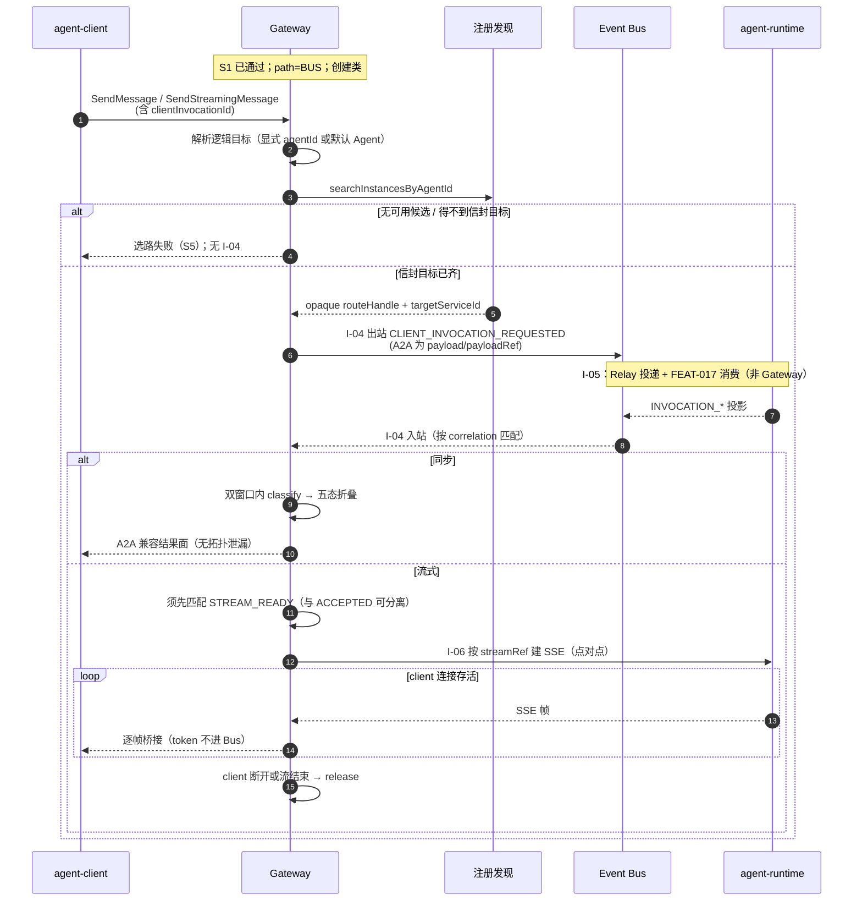
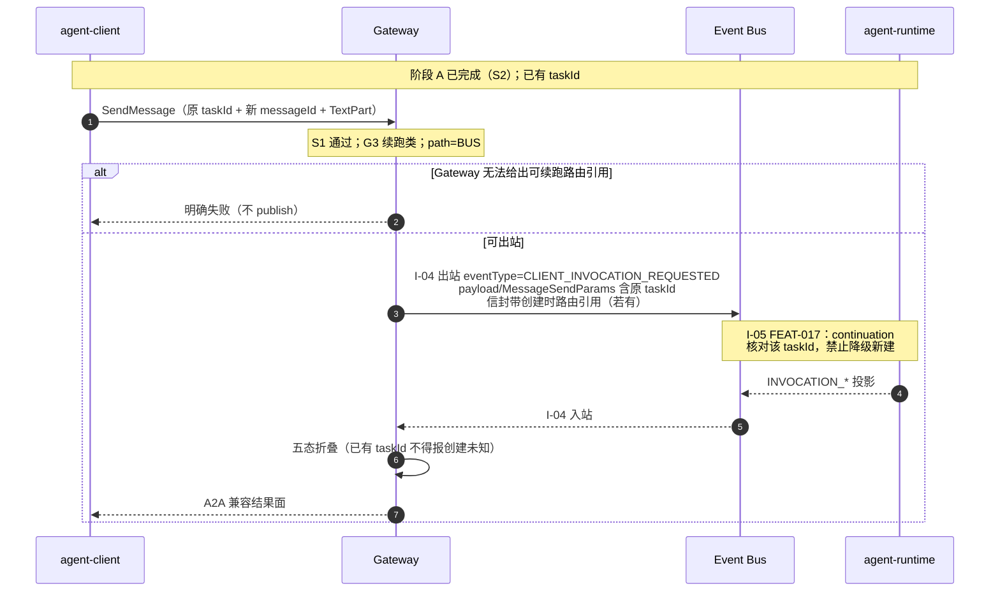
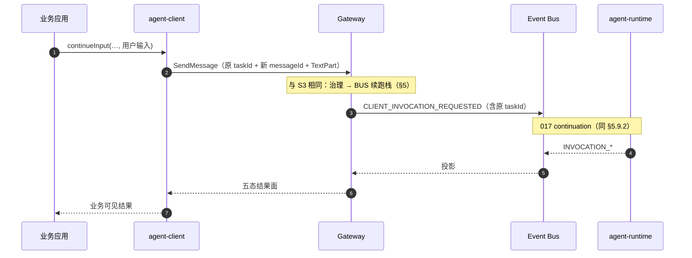
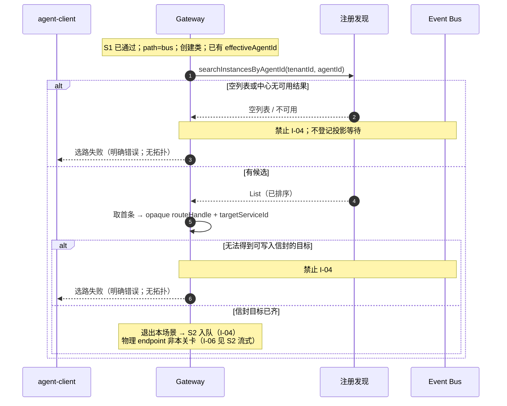

---

## level: L2
module: agent-gateway
feature: FEAT-012
status: in-review

# FEAT-012 L2：客户端调用总线转发

## 0. 范围与术语

### 0.1 问题与目标

部分部署希望客户端调用在统一入口治理之后，先进入 **Event Bus**：以**控制事件**送达下游，再由**投影**把接受、响应、流准备、等待输入与终态反馈给调用方。目标不是改写 client 的请求—响应语义，而是在**同一 A2A 入口**下提供控制面经总线的投递能力——client 不感知 broker、topic、worker 或 runtime 物理地址。

本文定义 FEAT-012 的 **BUS** 路径（相对 FEAT-011 直连的差量）：

**入口治理 → 按逻辑目标选路 → 控制事件入队 → 同步：投影折叠为五态 / 流式：`STREAM_READY` 后点对点 SSE**。

A2A 业务报文作为控制事件的 `payload` 或 `payloadRef`；**不**经总线传 token、SSE 帧或大正文。

Gateway 负责：接入、治理、选路、控制事件生产、投影消费与折叠、流式桥接。Gateway **不**执行 Agent，**不**拥有 Task 权威状态，**不**做注册上架，**不**实现 runtime 侧总线消费与回投影生产（FEAT-017）。直连 HTTP/SSE 主路径见 **FEAT-011**；对 client 与 011 共用同一 A2A facade。

### 0.2 路径定位（相对 FEAT-011）

BUS 是与 DIRECT 并行的**控制面支路**，用于控制事件分发、平台侧缓冲与协同扩展，**不**替代体验面主链（DIRECT）。对 client 仍是「一次请求、等一个结果」：Gateway 在同步等待窗口内等候匹配投影，再折叠为五态回传——**不是**「提交即返回」的纯异步 Job。

| 维度 | DIRECT（FEAT-011） | BUS（FEAT-012） |
| --- | --- | --- |
| 路径性质 | 体验面主链 | 控制面支路 |
| 客户端入口 | 统一 A2A HTTP | 同左（无感知） |
| 交互语义 | 同步 / 流式直达 | 窗口内等投影后回传；**非**提交即返回 Job |
| 数据面 | 点对点 HTTP / SSE | 控制事件走 Event Bus；流式仍点对点 SSE（须 `STREAM_READY`） |
| 实例落到谁 | RDC 选路 | 同左；与 path 选择正交 |
| 路径何时启用 | 部署级 `path-mode` | 同左；730 **不**做按调用动态择优 |

- **是**：控制事件入总线、分发与投影回收；窗口内收成五态返回 client  
- **是**：削峰缓冲与控制事件统一分发；为异构/存量接入及多消费者、服务间协同留口  
- **不是**：把用户请求改成纯异步 Job  
- **不是**：承载 token、SSE 帧或大正文的数据通道  
- **不是**：业务能力开关（创建/续跑等不因 path 有无而增减）

**与实例选路：** path 只改投递面（HTTP vs 控制事件入队）；落到哪个 Agent / runtime 仍由 `agentId` / 默认 Agent → RDC 决定（细则见 §1.1 / §1.2）。**先选路、后入队**；选路失败禁止 publish。path（通道）与 RDC（目标）正交，不可混为一谈。

#### path-mode 决策（730）

**约定：** FEAT-011（DIRECT）与 FEAT-012（BUS）共用同一 A2A 入口。730 以部署级配置 `path-mode=direct|bus` 选择投递通道；client 不可见、不可指定，也不按创建/续跑等业务场景切换。两条路径均先经 RDC 完成实例选路，path 只影响投递面（HTTP/SSE 直连 vs 控制事件入 Bus）。BUS 路径下 Gateway 仍同步等待投影并折叠结果，并非提交即返回；流式数据面仍走点对点 SSE。

**设计依据：**

1. **对外契约单一**  
   两条路径对外均为 `POST /a2a`。若由 client 或业务按调用选择 path，将同时暴露「直连口 / 总线口」两套心智，与「统一 facade、不向调用方暴露内部通道」冲突。path 由部署配置固定，差异留在 Gateway 内侧，对 client 保持契约一致。

2. **同一 Task 的投递面一致**  
   创建、续跑、流式控制面若在 DIRECT/BUS 间切换，粘滞索引、`routeHandle`、投影关联、`clientInvocationId` 易错位，失败语义与排障口径也会分裂。整环境固定一条 path，保证同一 Task 生命周期内投递规则一致。

3. **BUS 表示控制面部署形态，而非业务场景能力**  
   BUS 为控制面支路：同步仍等投影五态，流式 token 仍不进 Bus。按业务场景动态切换 path，易被误读为「该场景更异步 / 更快」，与真实语义不符。部署级 `path-mode` 标明 DIRECT/BUS 是体验面与控制面的能力组合，不是业务功能开关。

4. **通道选择归属部署面**  
   平台同时具备直连与总线两种可部署能力；具体环境启用哪一种，由削峰、控制事件统一、以及 FEAT-013/017 是否就绪等部署条件决定。选择落在部署配置，而不是运行时按调用择优的策略引擎；这与「先提供直连能力、再提供总线能力」的交付形态一致。

**部署建议：** 最低时延、最少依赖 → **DIRECT**；削峰、控制事件统一、异构/存量接入或协同留口 → **BUS**。两路径对 client 的 A2A / 创建 / 续跑语义应对齐；时延与失败形态可以不同，**不得**写成「BUS 才支持多 Agent / 续跑」。BUS 端到端另依赖 FEAT-013 / FEAT-017；流式仍须 `STREAM_READY` 后点对点 SSE。

### 0.3 与 FEAT-011 的关系

| 项 | 约定 |
| --- | --- |
| 对 client | **同一** A2A facade；不感知 DIRECT / BUS |
| 入口治理 G1～G5 | **复用** 011；差量：治理失败 → **禁止入队** |
| 选路 / 默认 Agent / resolve | **复用** 011；失败 → 不入队（见选路失败场景） |
| SSE 桥接纪律 | **复用** 011（不生成、不缓存 token；断开 release）；差量：须先 `STREAM_READY`（或等价）再建桥 |
| 直连 HTTP（I-03） | **OUT** → FEAT-011；本路径主边 **I-04**（Gateway ↔ Event Bus） |
| 差量原则 | 011 已定且总线无差的内容**不重复展开**；场景编号 S1～S9 与 011 对齐 |

路径定位与 `path-mode` 决策见 **§0.2**；本节只固定「相对 011 复用什么、差在哪」。

### 0.4 范围

#### 0.4.1 范围收口

730 按与 FEAT-011 **同一公式**收口：

1. **对齐 agent-client**：创建（S2）；端侧工具续跑（S3）；continueInput（S4，可选——client 不做则不对 client 联调必验）。  
2. **Gateway 自做**：入口治理、选路（含失败不入队）、控制事件生产与投影折叠 / `STREAM_READY` 后 SSE。  
3. **730 不交付**：GetTask / CancelTask / SubscribeToTask / UNKNOWN 同键恢复（与 011 一致；入口若可达则禁止假成功）。

对 client 联调主轴：S2/S3（及可选 S4）。端到端 Bus 另依赖 FEAT-013 / FEAT-017——**FEAT-017 未就绪前不得宣称「总线端到端联调完成」**。  
**730 交付** = IN-1～IN-9；**730 不交付** = IN-10、IN-11。本文不展开：Agent 执行与 Task 权威；013 底座实现细节；014 服务间 A2A。

#### 0.4.2 做范围内（In Scope）

| 编号 | 能力 | 730 交付 | 说明 |
| --- | --- | --- | --- |
| IN-1 | 入口治理（总线路径） | 是 | 复用 011 G1～G5；拒绝则不选路、**不入队** |
| IN-2 | 按逻辑目标选路 | 是 | 与 011 一致：有 `agentId` → 指定；无则默认 Agent |
| IN-3 | 同步 · 经总线（对齐 client 创建 / S2） | 是 | 控制入队 + 投影 → **五态**；主路径不经 I-03 |
| IN-4 | 流式 · 总线控制面 + 点对点 SSE（对齐 client 创建 / S2） | 是 | 控制面走 Bus；`STREAM_READY` 后桥接；**token 不进 Bus** |
| IN-5 | 选路失败时明确失败且不入队 | 是 | 不伪造成功投递、不 publish 创建类控制事件 |
| IN-6 | 端侧工具结果续跑（对齐 client / S3） | 是 | wire 仍带原 `taskId`；控制/投影经 Bus；Gateway 不执行工具 |
| IN-7 | continueInput（对齐 client / S4） | 是（可选承接） | wire 对齐续跑；client 不交付则不对 client 联调必验 |
| IN-8 | 统一 A2A 入口形态 | 是 | 与 011 同一 facade；路径切换对 client 不可见 |
| IN-9 | 控制事件生产与投影消费（Gateway 侧） | 是 | 信封对齐 FEAT-013；**回投影由 FEAT-017 生产，Gateway 消费** |
| IN-10 | 查询 / 取消 / 重订阅 · 经总线 | **否** | 长期可属本特性；**730 不实现、不验收** |
| IN-11 | UNKNOWN 同键恢复 | **否** | 当次五态之「未知」仍可为当次结果面；不交付「同键恢复」专场景 |

#### 0.4.3 明确不做（Out of Scope）

| 编号 | 不做 | 说明 |
| --- | --- | --- |
| OUT-1 | 执行推理、工具、记忆、业务 Agent | 归属 runtime / 业务 Agent |
| OUT-2 | 写入 Task 存储或决定 Task 终态 | Task owner 为 runtime |
| OUT-3 | 在 Gateway 内拉起 agent 实例 | — |
| OUT-4 | 维护注册目录 / 存量上架 | 归属注册发现与服务提供方 |
| OUT-5 | 经总线传 token / SSE 帧 / 大对象正文 | **禁止**；大正文用 payloadRef |
| OUT-6 | 实现 runtime 侧总线消费与回投影生产 | **FEAT-017**（对端） |
| OUT-7 | 事件转发底座 / broker 拓扑拍死为唯一实现 | 契约见 **FEAT-013**；Broker 可配置 |
| OUT-8 | 直连 HTTP 主路径 | **FEAT-011** |
| OUT-9 | 向 client 暴露 endpoint、`routeHandle`、topic、worker、私有执行口 | — |
| OUT-10 | 解析端侧工具业务语义并本地执行 | 归属 client / runtime |

### 0.5 术语

与 FEAT-011 共用：Gateway、client、runtime、RDC、`agentId`、默认 Agent、`routeHandle`、`taskId`、SSE 桥接等。本文增量：

| 术语 | 含义 |
| --- | --- |
| **总线转发** | 治理选路后经 Event Bus 控制事件送达；同步靠投影折叠；流式靠 `STREAM_READY` 后点对点 SSE |
| **控制事件** | Gateway → Bus 的意图消息（工作名如 `CLIENT_INVOCATION_*`）。**730 主路径**：创建 / 续跑；查询 / 取消 / 订阅流属长期事件族，**本版不交付** |
| **投影事件** | Bus → Gateway（由 runtime / FEAT-017 **生产**）：已接受、拒绝、失败、响应、流可订阅、等待输入、终态等 |
| **五态** | 同步等待窗口内对 client 的折叠结果：完成响应 / 已接受 Task / 拒绝 / 失败 / 未知 |
| **STREAM_READY** | 「流可订阅」投影（或等价）；与「已接受 Task」**必须可分离**；缺则不得建 SSE 桥 |
| **payloadRef** | 大正文不进总线事件体，只放引用 |
| **clientInvocationId** | BUS 投影关联键（策略见 §4.10）；**不得**替代 `taskId`，**不得**与 G4 `messageId` 混用 |
| **FEAT-013** | Event Bus 客户端调用事件转发契约与底座 |
| **FEAT-017** | runtime 嵌入式总线消费与回投影（对端） |

事件工作名以 FEAT-013 / 版本范围约定为准；改名不影响本文语义。

### 0.6 工作假设与软阻塞

路径定位与 `path-mode` 见 **§0.2**；S6～S9 / IN-10～11 见 **§0.4**。本节只列其余假设：

| 项 | 假设 / 状态 |
| --- | --- |
| 首包 `agentId` | **跟 011**：可缺省 → 默认 Agent；显式则指定（与 version-scope 字面冲突时，以 011 已冻口径 + 本文为准） |
| 创建关联键 | 总线路径须有 `correlationId` 来源（§4.10 策略 A/B）；非 011 直连所强依赖 |
| 事件名与信封 | 对齐 FEAT-013；正式实现不依赖临时 gateway 测具 |
| FEAT-017 | 回投影生产在对端；**未就绪前不得宣称总线端到端联调完成**（软阻塞） |
| Broker | 不拍死唯一 MQ；可配置；联调拓扑与 013 一致即可 |
| 已有 `taskId` 后 | **禁止**再向 client 报告创建类「未知」 |

### 0.7 成功标准

| 编号 | 标准 |
| --- | --- |
| SC-1 | 同步经总线：窗口内得到五态之一；响应无 topic / worker / endpoint / `routeHandle` 明文 |
| SC-2 | 流式：控制面成功且 `STREAM_READY` 后桥接；Bus 侧无 token；client 断开后 release |
| SC-3 | 无 `agentId` 时落到默认 Agent；有则落到指定 Agent（与 011 一致） |
| SC-4 | 治理拒绝或选路失败时**不入队**，返回明确失败，不伪造成功投递 |
| SC-5 | 工具续跑 / continueInput 在同 Task 语义下经总线透传；关联失败明确报错（不改成新建成功） |
| SC-6 | Gateway / Bus 不拥有 Task 权威终态；不执行 Agent；不做注册上架 |
| SC-7 | 对 client 仍为统一 A2A；不感知 DIRECT / BUS |
| SC-8 | 宣称「总线路径联调完成」前，FEAT-017 消费与投影路径须就绪（或书面豁免） |
| SC-9 | 730 不交付的 Get / Cancel / Subscribe / UNKNOWN 恢复：不作为本版本验收项；若入口可达则禁止假成功 |
| SC-10 | 配置与部署约束（§1.5）满足：path-mode 对 client 不可见；I-04 双窗口语义正确；入站必启；SSE release 不可关；正式 Gateway 不绑测具（详见 AC-CFG / **T-CFG-***） |

### 0.8 相关特性（只记编号，不挂路径）

| 特性 | 关系 |
| --- | --- |
| FEAT-011 | 直连姊妹路径；治理 / 选路 / SSE 纪律复用 |
| FEAT-012 | 本文（总线路径） |
| FEAT-013 | Event Bus 转发契约与底座（I-04） |
| FEAT-014 | 服务间 A2A 经总线；本文不展开 |
| FEAT-017 | runtime 总线消费与回投影（I-05） |
| FEAT-001 | runtime 标准入口语义（017 应对齐） |

---


## 1. 共享设计（相对 FEAT-011 的差量）

统一入口、治理管道（G1～G5）、选路 / 默认 Agent / resolve、SSE release 纪律、拓扑不对 client 可见：**复用 FEAT-011 §1 / §3～§4 已定内容**。本章只固定 **path = BUS** 时的增量。

### 1.1 统一入口、路径定位与路径选择

路径**定位**与 **`path-mode` 决策**见 **§0.2**。本节固定入口形态，并写清 **path 选择** 与 **RDC 实例选路** 的边界。

#### 1.1.1 路径定位（摘要）

| 路径 | 一句话 |
| --- | --- |
| DIRECT（011） | 体验面主链：低时延交互 + SSE |
| BUS（012） | 控制面支路：控制事件分发 + 投影回收；流式数据面仍 SSE |

本文只展开 **path = BUS**。完整对照、「是/不是」与 path-mode 决策见 **§0.2**。

#### 1.1.2 统一入口与路径选择

| 项 | 约定 |
| --- | --- |
| 对外入口 | 与 FEAT-011 **同一** A2A facade（`POST /a2a`；JSON-RPC；流式响应侧 SSE） |
| 730 方法 | `SendMessage` / `SendStreamingMessage`（创建 / 续跑 / continueInput） |
| 730 不交付方法 | GetTask / CancelTask / SubscribeToTask：可不实现；若暴露则禁止假成功 |
| 路径选择 | Gateway 内部 `path-mode`（或等价策略）选择 DIRECT / BUS；**对 client 不可见** |
| 730 选型口径 | **部署级**固定 `direct` / `bus`；**不**做按调用动态择优；**不**由 client / 业务报文指定 path |
| 对 client 应一致 | A2A 契约、创建/续跑语义、鉴权与结果面折叠口径（五态）；**不**因 path 增减业务能力 |
| 允许的非功能差 | 时延分布、失败形态（入队/投影超时 vs 直连链路失败）、对 FEAT-013/017 的依赖、流式须先 `STREAM_READY` |
| 与实例选路 | path 只改**投递面**（I-03 HTTP vs I-04 控制事件），**不**改 RDC 选路算法；落到谁仍由 `agentId` / 默认 Agent → RDC（§1.2） |
| 选路纪律（BUS） | **先选路、后入队**；失败 → S5，**禁止** publish；信封可带路由引用，不对 client 暴露；**禁止**消费侧二次选路导致与 DIRECT 语义分裂 |
| 本文前提 | 下文场景均在 **path = BUS** 下展开；DIRECT 见 FEAT-011 |
| 与 runtime | 总线路径：**不**把「同一份 HTTP A2A」原样换路；控制面经 I-04，执行语义仍应对齐 FEAT-001（由 FEAT-017 映射） |

### 1.2 调用链顺序（总线）

```text
入站（I-01）
  → 入口治理（S1；失败则停：不选路、不入队）
  → 路径选择 = BUS
  → 解析逻辑目标（显式 agentId，或默认 Agent）
  → 选路（I-02；RDC → routeHandle；失败 → S5：不入队）
  → I-04 出站：发布控制事件（A2A 为 payload / payloadRef）
  → I-04 入站：消费投影 → 同步五态回传
     或流式：投影含 STREAM_READY（或等价）→ 点对点 SSE 桥接（I-06；token 不进 Bus）
```

端到端时，控制事件经 Event Bus 送达 runtime、回投影经 Bus 回到 Gateway：对端边为 **I-05**（FEAT-017），**非** Gateway 实现。Gateway 不直接对接 runtime 的总线消费口；时序不得画成「Gateway 直连 runtime topic」。

| 规则 | 说明 |
| --- | --- |
| 先治理后选路 | 未过治理不得查 RDC、不得 publish |
| 先选路后入队 | 无可用路由不得猜测地址、不得 publish 创建类控制事件 |
| 拒绝 / 无路由 → **禁止入队** | 相对 011「禁止伪造成功投递」的总线特化 |
| I-04 双向 | 出站 publish 与入站消费投影同属 I-04；同步成功路径**必须**含入站半边，不得只画出站 |
| token / SSE 帧不进 Bus | 流式数据面只走 I-06 |
| 拓扑不对 client 可见 | 响应与错误中不出现 endpoint / `routeHandle` / topic / worker / 消费者组明文 |
| 续跑粘滞 | 创建成功拿到 `taskId` 后，续跑仍须落到原 Task owner；总线路径下关联键以控制/投影信封与 `taskId` 为准（相对 011 内部 `taskId → routeHandle` 的差量在 S3 展开） |

### 1.3 逻辑模块增量

在 FEAT-011 包切片上增加总线模块；**边界勿混**：

```text
agent-gateway/
├── facade/          # 同 011：JSON-RPC 分发、响应 / SSE 写出
├── governance/      # 同 011：G1～G5
├── routing/         # 同 011：默认 Agent、RDC、routeHandle；（续跑关联见 S3）
├── path/            # DIRECT | BUS
├── bus/
│   ├── control/     # 控制事件发布（I-04 出站）
│   ├── projection/  # 投影订阅与关联匹配（clientInvocationId / taskId）
│   └── wait/        # 同步等待窗口与五态折叠
├── sse/             # 同 011：桥接与 release；总线路径须先 STREAM_READY
├── direct/          # 本路径主流程不走；owner 定位或运维辅助可选
└── obs/             # 审计 / route·bus trace
```

| 模块 | 主责 | 不负责 |
| --- | --- | --- |
| bus/control | **I-04 出站**：组装并发布控制事件；写入信封可信字段与路由引用 | runtime 消费、Task 权威、I-05 |
| bus/projection | **I-04 入站**：接收投影、按关联键匹配等待中的调用 | 决定 Task 终态权威语义；不生产投影（017） |
| bus/wait | 窗口超时、五态折叠、超时→未知 | 执行 Agent、伪造 Task |
| sse | STREAM_READY 后的桥接与 client 断开 release | 经 Bus 传 token |
| path | 选择 DIRECT / BUS | 两路径业务语义细节 |

### 1.4 接口边总表

此处只固定边的存在与归属；字段级细节在场景章与 FEAT-013 / FEAT-017 对齐。  
**逻辑边**以 Gateway 为中心编号；Broker 两跳、Relay 中继等物理拓扑归 FEAT-013，本文不另增边号。

| 边 | 对端 | 目的 | FEAT-012 |
| --- | --- | --- | --- |
| **I-01** | agent-client ↔ Gateway | 统一 A2A 入口 | 使用（同 011） |
| **I-02** | Gateway → RDC | 按逻辑目标选路 | 使用（**I-04 出站之前**） |
| **I-03** | Gateway → runtime HTTP | 同步直连 | **主路径不用**（见 FEAT-011）；辅助定位可选 |
| **I-04** | Gateway ↔ Event Bus | **双向**：出站发布控制事件；入站消费投影 | **本特性主边**（契约对齐 FEAT-013） |
| **I-05** | Event Bus ↔ runtime | 对端：控制事件送达 runtime；runtime 回投影入 Bus | **FEAT-017**；非 Gateway 实现；端到端时序须出现 |
| **I-06** | Gateway ↔ runtime SSE | 流式数据面桥接（token 不进 Bus） | 使用（须先收到 `STREAM_READY` 投影） |
| **I-07** | 多轮工具相关报文 | 透传（不解析业务语义） | 使用（S3；控制面仍走 I-04 双向） |

**I-04 半边（仍属同一边号，场景验收须分开断言）：**

| 半边 | Gateway 动作 | 语义 |
| --- | --- | --- |
| I-04 出站 | 组装信封并 publish（经 FEAT-013 转发底座） | 控制请求进入 Bus；失败则明确失败，不得伪造成功 Task |
| I-04 入站 | subscribe / poll 投影并按关联键匹配 | 窗口内折叠为五态；流式须先匹配到 `STREAM_READY`（或等价）再开 I-06 |

**场景用边（Gateway 视角；括号内为端到端对端边）：**

| 场景 | Gateway 用边 | 说明 |
| --- | --- | --- |
| S1 治理拒绝 | 仅 I-01 | **无** I-04 出站 / 入站 |
| S2 创建（同步） | I-01, I-02, **I-04 出站+入站** | 端到端另含 **I-05**（017）；Gateway 不实现 I-05 |
| S2 创建（流式） | I-01, I-02, **I-04 出站+入站**, I-06 | 入站须含 `STREAM_READY`；再 I-06；端到端另含 I-05 |
| S3 / S4 续跑 | I-01, **I-04 出站+入站**（+ 关联 / 粘滞） | 流式续跑若启用再加 I-06；端到端另含 I-05 |
| S5 选路失败 | I-01, I-02 | **无** I-04（出站与入站皆无） |
| S6～S9 | — | 730 不交付 |

**与直连的报文差（心智模型）**

| 层级 | 直连（011） | 总线（012） |
| --- | --- | --- |
| Client→Gateway | 同一 A2A | 同一 A2A |
| Gateway→下游 | HTTP `/a2a` JSON-RPC（I-03） | **I-04 出站**：控制事件信封；A2A 为 payload / payloadRef |
| 回程（同步） | HTTP 响应清洗 | **I-04 入站**：投影 → 五态折叠（投影由 017 经 I-05 入 Bus） |
| 回程（流式数据面） | 选路后可桥接 SSE | 须 **STREAM_READY** 后再 **I-06** 点对点 SSE |
| Task 控制面语义 | FEAT-001 | 应对齐 FEAT-001（由 017 经 I-05 映射） |

### 1.5 配置与部署约束

本节固定 **Gateway 侧可交付、可验收**的配置语义与部署边界（不是「可改可不改的猜测」）。Broker / topic / outbox / Relay 进程键名以 **FEAT-013** 为准，本文不重复拍死；runtime 消费与回投影生产配置归 **FEAT-017**。

**不新增独立场景编号：** 与 FEAT-011 的 S1～S9 对齐；本节为**横切验收**——约束见下，用例为 **T-CFG-***，可在 S1～S5 联调中一并覆盖。行为细节仍落在各场景章。

#### 1.5.1 配置约束

```yaml
# 示意，非最终键名
openjiuwen.gateway:
  path-mode: bus                   # 部署级固定 direct|bus；client 不可见、不可按调用覆盖
  bus:
    publish-timeout: 3s            # I-04 出站：produce 失败须明确失败
    # 等待投影（I-04 入站）— 语义对齐 FEAT-013 双窗口，勿压成「单一超时=未知」
    accept-wait-window: 30s        # 无 ACCEPTED/REJECTED/FAILED/RESPONSE → 未知
    response-wait-window: 60s      # 已 ACCEPTED 后等终态/响应；超时 → 已接受(taskId)，不得再报未知
    # I-04 入站订阅由转发底座装配（如 responseConsumer）；Gateway 须启用，不得只配出站
  default-agent-id: …              # 同 011
  sse:
    release-on-client-disconnect: true   # 不得配置关闭
```

| 配置意图 | 约束（须实现） |
| --- | --- |
| path-mode | 部署级固定；对 client 不可见；与 §0.2 一致；本文场景均在 `bus` 下展开 |
| publish-timeout | **I-04 出站**：发布失败须明确失败，不得伪造成功 Task |
| accept-wait-window | **I-04 入站（接受阶段）**：窗口内无接受/拒绝/失败/一次性响应 → 映射五态之「未知」 |
| response-wait-window | **I-04 入站（已接受之后）**：等最终响应 / 终态 / `STREAM_READY`；超时且已有 `taskId` → 「已接受」，**禁止**再报创建「未知」 |
| I-04 入站订阅 | 必须启用投影消费（与 FEAT-013 响应消费口对齐）；仅配置出站不足以跑通同步/流式 |
| SSE release | client 断开必须释放 I-06 桥接；该语义不因配置关闭 |
| Broker / topic / Relay | **不**在本文拍死；联调拓扑与 FEAT-013 一致（含两跳转发）；Gateway 经 SDK produce/consume，**不**要求 Gateway→Relay 的 HTTP 边 |

#### 1.5.2 部署依赖与边界

| 项 | 约定（须满足） |
| --- | --- |
| 单元边界 | Gateway 相对 Event Bus、RDC、runtime **可独立部署 / 可替换**（与 agent-bus 三单元语义对齐）。正式 Gateway **不**绑死在 Event Bus 测具 / `gateway` profile 临时进程内 |
| 进程形态 | 按可独立部署设计；允许同进程或分进程；实际副本数由部署决定（非 client / 业务报文选择） |
| 网络（Gateway） | 须能访问 **RDC**（I-02）与 **Broker**（I-04 出站 produce + 入站 consume）；流式时尚须能访问目标 **runtime SSE**（I-06）。Event Bus Relay 为对端进程，不要求 Gateway 直连其管理口 |
| Event Bus / Broker | 本路径运行**依赖** Broker 与 Event Bus 转发能力（FEAT-013）；缺则 BUS 路径不可用 |
| FEAT-017（I-05） | 端到端联调依赖对端消费与回投影就绪（§0.6 软阻塞）；Gateway 配置不替代 017 |
| Task 权威 | 仍在 runtime；Gateway / Bus 不写 Task 权威库 |

#### 1.5.3 验收要点与用例（横切，非独立 S）

**意图表（AC-CFG）** — 对应 SC-10：

| 编号 | 验收项 | 通过准则 | 主要挂靠 |
| --- | --- | --- | --- |
| AC-CFG-1 | path-mode 对 client 不可见 | client 无法指定 / 感知 DIRECT vs BUS；同一 A2A 入口 | SC-7、§0.2 |
| AC-CFG-2 | I-04 出站失败不伪造成功 | produce / 入队失败 → 明确失败，无假 `taskId` | S2、SC-1 |
| AC-CFG-3 | 接受窗口 → 未知 | accept 窗口内无接受/拒绝/失败/一次性响应 → 五态「未知」 | S2 |
| AC-CFG-4 | 已接受后超时不报未知 | 已有 `taskId` 后 response 窗口超时 → 「已接受」，禁止创建「未知」 | S2、§0.6 |
| AC-CFG-5 | I-04 入站必启 | 仅出站、无投影消费时同步路径不可假成功；须能消费投影 | S2、§1.4 |
| AC-CFG-6 | SSE release 不可关 | client 断开后释放 I-06；配置不得关闭该语义 | S2 流式、SC-2 |
| AC-CFG-7 | 正式 Gateway 独立于测具 | 交付制品不绑死 Event Bus `gateway` profile 临时实现 | §1.5.2、SC-8 |
| AC-CFG-8 | 网络边界可达 | 联调环境 Gateway 可达 RDC、Broker；流式可达 runtime SSE | S2 流式 |

**验收用例（T-CFG）** — 与 T-S*-B* 同形；不新开 S 编号。S1 / S5 的「零 I-04」见 T-S1-B* / T-S5-B*，支撑 SC-4，不单列 T-CFG。

| 编号 | 前置 | 动作 | 期望 | 对应 |
| --- | --- | --- | --- | --- |
| T-CFG-1 | path=bus；client / SDK 按统一 A2A | 发起创建或续跑（不携带 path / 通道字段） | 走 BUS；契约无 path 感知；与 011 同入口 | AC-CFG-1 |
| T-CFG-2 | path=bus；Broker produce 失败或超时 | 创建 SendMessage | 明确失败；无假 `taskId`；不报已入队成功 | AC-CFG-2 |
| T-CFG-3 | path=bus；accept 窗口可短配；无 ACCEPTED/REJECTED/FAILED/RESPONSE | 创建并耗尽 accept 窗口 | 五态「未知」；可带重试关联 | AC-CFG-3 |
| T-CFG-4 | path=bus；已匹配 ACCEPTED 且有 `taskId`；response 窗口超时 | 同步等待终态 | 结果面为「已接受」；**禁止**改报创建「未知」 | AC-CFG-4 |
| T-CFG-5a | path=bus；仅配置出站、禁用投影消费 | 同步创建 | 不得假成功 Task；须失败或明确不可用 | AC-CFG-5 |
| T-CFG-5b | path=bus；出站+入站均启用；017 或投影桩可用 | 同步创建 | 可折叠为五态之一 | AC-CFG-5 |
| T-CFG-6 | path=bus；流式已建 I-06 | client 断开 SSE | 桥接 release；配置无法关闭该语义 | AC-CFG-6 |
| T-CFG-7 | 对照交付制品与 Event Bus 测具 | 检查模块边界 | 正式 Gateway **不**绑死 `gateway` profile 临时实现 | AC-CFG-7 |
| T-CFG-8 | 联调拓扑 | Gateway 访问 RDC、Broker；流式再访问 runtime SSE | 可达；不可达时失败明确，不伪造成功 | AC-CFG-8 |

**边界提醒：** Broker / topic / 两跳键名以 FEAT-013 为准；投影生产归 FEAT-017；S6～S9 事件若底座已有，**012 730 不验收**。端到端宣称完成前 FEAT-017（I-05）须就绪或书面豁免（SC-8）。

SC-10 = AC-CFG-1～8 / T-CFG-1～8 均满足（本环境不验流式时可豁免 T-CFG-6 并注明原因）。

---

## 2. 场景总览

本章给出 FEAT-012 总线路径的场景清单与正文顺序。场景编号与 FEAT-011 **对齐**，便于对照；各场景细则从 §3 起只写相对直连的**差量**。

### 2.1 场景清单

| 编号 | 场景 | 交付口径 | 说明（相对 011 的差量要点） |
| --- | --- | --- | --- |
| S1 | 入口治理 | 730 交付（Gateway 自做） | 细则回链 011 §3；**附加：拒绝则禁止 I-04 出站（及后续入站）** |
| S2 | 创建调用 | 730 交付（对齐 client 创建） | 同步：I-04 出站入队 + I-04 入站投影五态；流式：入站 `STREAM_READY` 后 I-06；**须带 `clientInvocationId`**；端到端依赖 I-05（017） |
| S3 | 端侧工具结果续跑 | 730 交付（对齐 client 续跑） | wire 仍带原 `taskId`；I-04 双向经 Bus；Gateway 不执行工具 |
| S4 | continueInput | 730 交付（可选承接） | wire 对齐续跑；业务差量在 client；client 不交付则不对 client 联调必验 |
| S5 | 选路失败 | 730 交付（Gateway 自做） | 明确失败且 **无 I-04**（出站与入站皆无） |
| S6 | 查询 Task | **730 不交付** | 经总线 GetTask；本版本不实现、不验收 |
| S7 | 取消 Task | **730 不交付** | 经总线 Cancel；同上 |
| S8 | 重订阅流 | **730 不交付** | 经总线 Subscribe；同上 |
| S9 | 创建结果不明时的恢复 | **730 不交付** | UNKNOWN 同键恢复；同上（当次五态之「未知」仍可为当次结果面） |
| — | 配置与部署约束 | **730 横切验收**（非独立 S） | 见 **§1.5.3** AC-CFG / **T-CFG-***；SC-10 |

### 2.2 场景关系

```text
所有入站
  └─ S1 入口治理 ──拒绝──► 结束（不选路、无 I-04）
         │通过
         ▼
    path = BUS
         │
    ┌────┴────┐
    │         │
  创建类          续跑类（工具 / 用户补充）
  (S2)           (S3 / S4)
    │              │
    ▼              ▼
  选路（I-02）成功？ ──否──► S5（明确失败；无 I-04）
    │是
    ▼
  I-04 出站：发布控制事件
    │                 （端到端：经 I-05 达 runtime / 017，非 Gateway）
    ▼
  I-04 入站：消费投影
    │
    ├─ 同步：折叠五态 → 回传 client（I-01）
    └─ 流式：匹配 STREAM_READY → I-06 SSE 桥接（token 不经 I-04）
```

### 2.3 阅读与实现顺序

1. FEAT-011 §0～§1、§3（治理）— 共享前提  
2. 本文 §0～§1 — 总线差量骨架  
3. §3（S1 附加）→ §4（S2 主路径）→ §5 / §6（续跑）→ §7（S5）→ §8（S6～S9 边界）  
4. §4.9～§4.12、§5.9 — 跨特性联调契约（含 S4）  
5. §1.5.3 — 横切 T-CFG-*（可与 S2 一并覆盖）  

**推荐实现依赖顺序：** S1 拒绝不入队 → S2 同步五态 → S2 流式 `STREAM_READY`+SSE → S5 → S3/S4。配置与部署按 **§1.5.3 T-CFG-*** 验收（SC-10）。宣称总线路径端到端完成前，FEAT-017（I-05）须就绪或书面豁免；Gateway 单侧可用 013 底座 + 投影桩先验 I-04 与五态。

---

## 3. 场景 S1：入口治理（总线附加）

G1～G5 的顺序、判定与错误码以 **FEAT-011 §3** 为准，本章**不重复**。BUS 路径下仅固定一条附加纪律：治理未全部通过时，**不得**进入选路，更**不得**触碰 I-04。

### 3.1 要做什么（差量）

| 项 | 内容 |
| --- | --- |
| 目标 | 复用 011 入口治理；拒绝时对 BUS 路径保证 **零 I-04**（无出站 publish、无入站投影匹配） |
| In（差量） | 「拒绝 → 禁止入队 / 禁止等投影」的断言与验收 |
| Out | G1～G5 细则；选路（S2/S5）；控制事件与投影语义（S2） |
| 失败通则 | 与 011 相同：治理层明确错误返回 client；**额外**：不查 RDC、不 `produce`、不订阅/匹配当次投影 |

```text
入站（I-01）
  → G1→G2→G3→G4→G5（细则见 FEAT-011 §3）
       │ 任一步失败 → 治理错误返回（结束）
       │              · 无 I-02
       │              · 无 I-04 出站 / 入站
       └ 全部通过 → 可信上下文 → path=BUS → 选路 / 投递（S2～S5）
```

### 3.2 附加约束：拒绝则不入队

| 编号 | 约束 | 说明 |
| --- | --- | --- |
| B-S1-1 | 治理失败不得选路 | 与 011 相同；BUS 下亦不得为「先入队再拒绝」留口 |
| B-S1-2 | 治理失败禁止 I-04 出站 | 不得 `ForwardingOutbox` enqueue / `BrokerForwardingRelayPort.produce`；不得发出 `CLIENT_*_REQUESTED`（或等价） |
| B-S1-3 | 治理失败禁止 I-04 入站关联 | 不得为当次调用登记等待窗口、不得按 `clientInvocationId` / `correlationId` 匹配投影并折成成功面 |
| B-S1-4 | 不得伪造成功投递 | 响应中不得出现已建 `taskId`、已接受、或「已入队」成功语义 |
| B-S1-5 | 审计仍记拒绝 | 复用 011 G5；可记 `rejectStage`；**不**要求因此产生 Bus 审计事件 |

相对 011「不得调 runtime」的特化：BUS 路径上「不得调 runtime」落实为 **不得经 I-04/I-05 间接触达**；直连 I-03 本路径主流程本就不走。

### 3.3 验收（总线附加）

G1～G5 行为验收回链 **FEAT-011 §3.8**。本章只验收 BUS 附加：

| 编号 | 前置 | 动作 | 期望 |
| --- | --- | --- | --- |
| T-S1-B1 | path=bus；缺 Bearer（或其它 G1 失败） | `POST /a2a` | 401/403 等治理错误；**I-04 出站 0 次**；无投影等待登记 |
| T-S1-B2 | path=bus；租户无法解析（G2） | 同上 | 403 等；**I-04 出站 0 次** |
| T-S1-B3 | path=bus；参数非法（G3） | 同上 | 400 等；**I-04 出站 0 次** |
| T-S1-B4 | path=bus；创建幂等冲突（G4） | 同上 | 409 等（与 011 一致）；**不**因冲突而 publish |
| T-S1-B5 | 治理失败任一例 | 检查观测/桩 | 无 `CLIENT_INVOCATION_REQUESTED`（或等价）produce；响应无拓扑 / topic / `routeHandle` 明文 |

实现期可用：Broker produce 桩计数、outbox 行数、或 `bus/control` 端口 mock 断言零调用。

全部通过后进入选路与总线投递（S2～S5）。选路失败见 **§7 S5**（亦无 I-04）。

---

## 4. 场景 S2：创建调用 · 总线（同步 + 流式）

承接客户端创建类调用（无既有 `taskId` 的 `SendMessage` / `SendStreamingMessage`）：S1 通过且 **path = BUS** 后，解析逻辑目标并经 RDC 选路，再经 **I-04** 发布控制事件、等待投影并折叠回传；流式须先得 `STREAM_READY`（或等价），再经 **I-06** 点对点 SSE 桥接。

默认 Agent、RDC 候选挑选与 `resolve` 规则**复用 FEAT-011 §4**（先选路、后入队）。本章只展开相对直连的投递与回程差量。端到端消费与回投影生产在 **FEAT-017（I-05）**，非 Gateway 实现。

### 4.1 要做什么

| 项 | 内容 |
| --- | --- |
| 目标 | 创建请求经总线到达正确 runtime；同步在窗口内得到可折叠结果面；流式在 `STREAM_READY` 后完成 SSE 桥接 |
| In | 逻辑目标与选路（同 011）；控制事件组装与 I-04 出站；投影消费与关联；双窗口五态折叠；流式 I-06；拓扑隐藏 |
| Out | 治理细则（§3）；续跑（S3/S4）；选路失败专章（S5）；Broker/Relay 实现（FEAT-013）；runtime 消费与投影生产（FEAT-017）；执行 Agent / Task 权威 |
| 成功可观察 | 出站事件已发布；client 收到 A2A 兼容成功面或 SSE；响应无 endpoint / `routeHandle` / topic / worker 明文 |
| 失败可观察 | 无可用路由 → S5（无 I-04）；入队/投影失败 → 明确失败或五态之「未知/拒绝/失败」；不伪造成功 Task |

### 4.2 前置与边界

**前置：**

1. S1（G1～G5）已通过；可信上下文至少含 `principalId`、`tenantId`、`method`（创建类）。
2. **path-mode = bus**（§0.2 / §1.5）。
3. G3 已判定为创建类（无非空 `taskId`）；G4 已处理创建幂等（短路则不再进入本章选路 / 入队）。
4. 总线关联键策略见 **§4.10**（策略 A：client 上送 `clientInvocationId`；策略 B：Gateway 自生成 `correlationId`）。**不得**用关联键替代 `taskId`；**不得**与 G4 `messageId` 混用。

**边界：**

- 不重复展开治理与 RDC 挑选算法（回链 011 §3 / §4.4 P0～P2）。
- 同步与流式共用选路与出站；差量在投影折叠与是否开 I-06。
- 730 不交付 GetTask / Cancel / Subscribe / UNKNOWN **同键恢复**（S6～S9）；**当次**接受窗口「未知」仍属本章结果面。
- 已观察到 `taskId`（已接受）后，**禁止**再向 client 报告创建类「未知」。
- A2A 业务报文只作信封 `payload` / `payloadRef`；**禁止**经 Bus 传 token / SSE 帧 / 大正文。

**关联键约定（联调冻结前推荐）：**

| 字段 | 约定 |
| --- | --- |
| `clientInvocationId` | §4.10 策略 A 时由 client 上送；与 `messageId` 消歧见该节 |
| `correlationId`（FEAT-013 信封） | Gateway 写入；策略 A 下与 client 关联键一致；策略 B 下 Gateway 自生成 |
| `messageId` | Bus 投递去重键（如 `gw-`+UUID）；**不得**与业务幂等键 / `clientInvocationId` 混用 |
| `idempotencyKey` / 创建 `messageId`（G4） | 仍按 011 创建幂等；与 Bus `messageId` 正交 |

### 4.3 时序图



逻辑视图可将 Event Bus 视为黑盒；物理两跳（req/deliver/resp_in/resp_out）见 FEAT-013，本文不另增边号。

### 4.4 主路径阶段

| 阶段 | 名称 | 做什么 |
| --- | --- | --- |
| P0 | 逻辑目标 | 同 011：显式 `agentId` 或默认 Agent → `effectiveAgentId` |
| P1 | 选路 | RDC 查询；空列表 → S5；取排序首条；得到 opaque `routeHandle` + `targetServiceId`（BUS 入队门槛，见 §7）；**不**因仅缺物理 endpoint 挡 I-04 |
| P2 | 登记等待 | 以 `clientInvocationId` / `correlationId` 登记 accept/response 窗口；**尚未** publish 成功前不得对 client 报已入队成功 |
| P3 | I-04 出站 | 组装 `ForwardingEnvelope`（`CLIENT_INVOCATION_REQUESTED`）；写入可信租户、路由引用、`correlationId`；A2A 入 `payload`/`payloadRef`；enqueue → produce |
| P4a | 同步折叠 | I-04 入站消费投影 → §4.6 五态；清洗后经 I-01 回传 |
| P4b | 流式桥接 | 已匹配 `INVOCATION_STREAM_READY`（含 `streamRef`）且 client 仍连接 → I-06；逐帧桥接；断开 release |
| P5 | 收尾 | 首次获得非空 `taskId` 时写入续跑所需关联（见下）；更新创建幂等（若适用）；route/bus trace；响应去拓扑 |

**粘滞 / 续跑预备（相对 011 差量）：**

| 项 | 约定 |
| --- | --- |
| 直连 011 | 内部 `taskId → routeHandle` 短时索引 |
| 总线 012 | 控制/投影侧以 **`taskId` + 信封关联** 为准；Gateway 仍可保留 `taskId → routeHandle`（或 stream 定位信息）供后续 S3 / I-06 解析，**不得**对 client 暴露 |
| 写入时机 | 首次从投影得到非空 `taskId`（通常 `INVOCATION_ACCEPTED`） |

**P3 出站失败：** produce / 入队明确失败 → 对 client 明确错误；**不得**伪造 `taskId`；可映射为失败或未知（不得假装已接受）。

### 4.5 接口

| 边 | 本场景用法 |
| --- | --- |
| I-01 | 入站 A2A；出站五态 / SSE 回 client |
| I-02 | 入队前选路；失败则无 I-04 |
| I-04 出站 | `CLIENT_INVOCATION_REQUESTED`；契约对齐 FEAT-013 |
| I-04 入站 | `INVOCATION_ACCEPTED` / `REJECTED` / `FAILED` / `RESPONSE` / `STREAM_READY` / `TERMINAL` /（若有）`INPUT_REQUIRED` 等 |
| I-05 | 端到端必现；**FEAT-017**；Gateway 不实现 |
| I-06 | 仅流式且已 `STREAM_READY`；token 不经 I-04 |
| I-03 | 本场景主路径**不用** |

信封必填语义（字段名以 FEAT-013 为准，联调冻结）：`tenantId`、`eventType`、`messageId`、`correlationId`、`sourceServiceId`、`targetServiceId` / 路由引用、`payload` 或 `payloadRef`。权威租户来自治理可信上下文，**不采信** client 自报。

### 4.6 判断逻辑

**选路（失败出口 → §7）：** 无 `effectiveAgentId`（配置错误）≠ S5；空候选 / 得不到可写入信封的目标 → **S5**，禁止 I-04。信封目标已齐则继续入队（物理 endpoint 非本关卡）。

**投影 → 对 client 五态折叠（观测态对齐 FEAT-013 `InvocationResponseStatus`）：**

| 观测 / 条件 | 对 client 结果面 | 约束 |
| --- | --- | --- |
| `INVOCATION_RESPONSE`（或终态已含可回传结果） | 响应完成 | 清洗拓扑后回传 |
| `INVOCATION_ACCEPTED` 且已有 `taskId`；response 窗口内无最终响应 | 已接受（Task 引用） | 不得报未知 |
| `INVOCATION_REJECTED` | 拒绝 | 不伪造 `taskId` |
| `INVOCATION_FAILED` / 确定失败终态 | 失败 | 可含错误码；不伪造成功 |
| accept 窗口超时，且从未 ACCEPTED/REJECTED/FAILED/RESPONSE | 未知 | 可携带重试关联（`clientInvocationId` / 幂等键）；**非** S9 同键恢复专章 |
| 已 ACCEPTED 后 response 窗口超时 | 已接受 | **禁止**改报未知 |
| `INVOCATION_STREAM_READY` | （流式）可桥接 | 与 ACCEPTED **可分离**；缺则不得开 I-06 |
| `INVOCATION_INPUT_REQUIRED`（若 017 产出） | 等待输入 | 须带 `taskId`；后续续跑见 S3/S4 |

**流式额外：**

1. 控制面出站与同步相同（同一 `CLIENT_INVOCATION_REQUESTED` 族，流式语义由 method / 标记区分，对齐 017）。
2. 仅当 client→Gateway 连接仍在，且已匹配 `STREAM_READY` + 可用 `streamRef` 时建立 I-06。
3. Gateway **不**生成、**不**缓存 token；client 断开必须 release（AC-CFG-6）。

### 4.7 实现要点

| 项 | 约定 |
| --- | --- |
| 模块 | `bus/control`（出站）、`bus/projection` + `bus/wait`（入站与窗口）、`sse/`（I-06）、`routing/`（同 011） |
| 依赖 | FEAT-013 SDK：`BrokerForwardingRelayPort` / `BrokerForwardingConsumerPort` / outbox；**不**嵌入 Event Bus 测具进程为正式制品 |
| 窗口 | `accept-wait-window` / `response-wait-window`（§1.5）；超时判断勿被 `poll` 阻塞「吃掉」整段窗口 |
| 幂等 | G4 创建幂等与 Bus `messageId` 去重分层；服务端创建幂等在 runtime / 017 |
| 拓扑 | 对 client 禁止泄漏 topic、worker、endpoint、`routeHandle`、消费者组 |

### 4.8 验收

| 编号 | 前置 | 动作 | 期望 |
| --- | --- | --- | --- |
| T-S2-B1 | path=bus；治理通过；带 `agentId`；RDC 有候选；017/投影桩可用 | SendMessage | I-04 出站 1 次；窗口内得五态之一；响应无拓扑明文 |
| T-S2-B2 | 同 T-S2-B1；不传 `agentId`；默认 Agent 有效 | 创建 | 落到默认 Agent；其余同成功总线创建 |
| T-S2-B3 | 同 T-S2-B1；SendStreamingMessage | 流式创建 | 先 `STREAM_READY` 再 I-06；Bus 侧无 token；断开 release |
| T-S2-B4 | RDC 空列表 | 创建 | **S5**；I-04 出站 **0** 次 |
| T-S2-B5 | 缺 `clientInvocationId`（默认策略 A） | 创建 | 校验失败（明确错误）；**不** publish；若 §4.10 采纳备选 B 则本条作废 |
| T-S2-B6 | 投影 `REJECTED` | 创建 | 拒绝面；无伪造 `taskId` |
| T-S2-B7 | accept 窗口内无接受类投影 | 创建 | 五态「未知」；非已接受 |
| T-S2-B8 | 已 ACCEPTED 后 response 超时 | 创建 | 「已接受」+ `taskId`；**不得**未知 |
| T-S2-B9 | produce 失败 / Broker 不可达（桩） | 创建 | 明确失败或未知；不伪造成功 Task |
| T-S2-B10 | 首次 ACCEPTED 含 `taskId` | 创建成功 | Gateway 侧具备续跑关联（内部）；client 响应无 `routeHandle` |

client 联调主路径配合：与 011 相同的 A2A 创建组包；总线关联键见 §4.10。端到端绿依赖 FEAT-017（或书面豁免 + 投影桩）。联调对象与回填优先级见下节。

### 4.9 联调对应人总表（三人）

> **用途**：S2 总线路径需确认的契约入口。  
> **主问卷**：王向刚（§4.12）。丁勇为已上库确认；晓娜为条件增量。  
> **范围外**：I-03 属 FEAT-011；I-06 SSE 纪律复用 FEAT-011 §4.10 AC-RT-2。若 `streamRef` 非标准 SSE 入口，由 **§4.12 AC-017-3** 写明专用入口。

| 对应人 | 优先级 | 本文 | 要做什么 | 发包时请附带 |
| --- | --- | --- | --- | --- |
| **王向刚** | **P0 必回填** | §4.12 | 投影 / 消费映射 / `streamRef` / 联调就绪 | 本文 §4.12 + **其 FEAT-017 L2（及代码若有）** |
| **丁勇** | **P1 契约确认** | §4.11 | 核对 012 用法与已合入 013 是否一致；**默认不新开开发** | 本文 §4.11 + **FEAT-013 合入 L2**（`agent-bus` as-built） |
| **晓娜** | **P2 条件回填** | §4.10 | 仅 BUS 关联键是否上送 | 本文 §4.10 + **FEAT-011 §4.9 已冻结论**（勿与幂等键混淆） |

**责任边界：** 投递层以 FEAT-013 已上库为准；投影生产以 FEAT-017 为准；对 client 入口以 FEAT-011 §4.9 + 本文 §4.10 为准；SSE 数据面纪律复用 FEAT-011 §4.10 AC-RT-2（不另开 FEAT-001 问卷）。

---

### 4.10 与 agent-client（晓娜）— BUS 条件增量

> **发给**：晓娜 / agent-client（需要确认 BUS 关联键时）。  
> **范围**：相对 011 §4.9 已冻结论的 **BUS 差量**。  
> **请 AI / 人工先读**：FEAT-011 §4.9（尤其 AC-4：`invocationId`/`idempotencyKey` → `params.message.messageId`）。  
> **状态**：条件回填（P2）。

#### 4.10.1 字段消歧（必读，防与 011 混淆）

| 字段 | 谁生成 | wire（已冻 / 建议） | 用途 | 与另一字段 |
| --- | --- | --- | --- | --- |
| `params.message.messageId` | client | 011 AC-4 已冻：可由 `invocationId`/`idempotencyKey` 映射 | **G4 创建幂等** | **不是** Bus 投影关联键 |
| `clientInvocationId`（本文） | client（策略 A）或 Gateway（策略 B） | 建议 `params.metadata.clientInvocationId` | **BUS 等待投影**的 `correlationId` 来源 | **不得**用 `messageId` 代替；**不得**代替 `taskId` |

011 里的 `invocationId` **默认只服务幂等（→ messageId）**；若要服务 BUS 关联，须在本表明确：**另写 metadata**，或 **声明复用某现有字段并映射为 correlation**（回填写清）。

#### 4.10.2 Gateway 侧策略

| # | 已定项 | 说明 |
| --- | --- | --- |
| GW-B-1 | 入口不变 | 仍 `POST /a2a`；client **不**感知 / **不**选择 path-mode |
| GW-B-2 | 策略 A（推荐） | 总线创建上送独立关联键 → Gateway 写入信封 `correlationId`；缺省则校验失败、不 publish（见 T-S2-B5） |
| GW-B-3 | 策略 B（备选） | client 不上送；Gateway **自生成** `correlationId`；须书面采纳后作废 T-S2-B5 |
| GW-B-4 | path-mode | SDK 无 path 选择 API |

#### 4.10.3 请确认并回填

| # | 待确认项 | 期望结论 |
| --- | --- | --- |
| AC-B-1 | 选 A 还是 B | **(A)** 上送独立关联键；**(B)** Gateway 自生成 |
| AC-B-2 | 若选 A：wire 路径 | `metadata.clientInvocationId` / 或其他路径（写明）；**确认不是** `message.messageId` |
| AC-B-3 | 若选 A：与 011 `invocationId` 关系 | 二者独立 / 或 SDK 如何同时满足幂等与 BUS 关联 |
| AC-B-4 | 若选 A：重试是否复用同一关联键 | 同意 / 说明与 `messageId` 分工 |
| AC-B-5 | path-mode | 确认 SDK **无** path 选择 API |

**结论（冻结后填写）：**

| # | 结论 | 日期 / 回填人 |
| --- | --- | --- |
| AC-B-1 | （待填） | |
| AC-B-2 | （待填） | |
| AC-B-3 | （待填） | |
| AC-B-4 | （待填） | |
| AC-B-5 | （待填） | |

---

### 4.11 与 FEAT-013（丁勇）— 已上库契约确认

> **发给**：丁勇 / agent-bus（FEAT-013）。  
> **性质**：**确认表**，不是新需求清单。默认按已合入实现装配正式 Gateway。  
> **请 AI / 人工对照**：FEAT-013 合入 L2（如 `feat-013-client-invocation-event-forwarding.md`）+ `agent-solution` `common/agent-bus/` as-built。  
> **仅当**与 as-built 冲突时再开 013 变更。  
> **状态**：待确认（P1）。

#### 4.11.1 Gateway 将按此使用（请核对）

| # | 项 | 012 用法 | 请对照 013 |
| --- | --- | --- | --- |
| GW-013-1 | 出站 | `CLIENT_INVOCATION_REQUESTED` → outbox → `BrokerForwardingRelayPort.produce` | 事件枚举 / produce SPI |
| GW-013-2 | 入站 | `BrokerForwardingConsumerPort` 消费投影（`resp_out` 或等价） | responseConsumer |
| GW-013-3 | 关联 | `correlationId` = 策略 A 的 client 关联键，或策略 B 的 Gateway 生成值 | 测具若用 `requestId`，请说明正式路径是否允许改为 client 关联键 |
| GW-013-4 | 观测态 | `InvocationResponseStatus`；ACCEPTED ≠ STREAM_READY | 013 §2.3.3 / classify |
| GW-013-5 | 制品 | 依赖 `agent-bus-spi`/`sdk`；不绑临时 gateway 测具 | de-gateway-ification 结论 |

#### 4.11.2 请确认（同意即可；冲突才写反提案 + 是否改代码）

| # | 确认项 | 期望 |
| --- | --- | --- |
| AC-013-1 | GW-013-1～5 与当前合入实现一致 | 同意 / 指出差异（附 L2 节或类名） |
| AC-013-2 | 信封权威必填与失败码 | **链到 013 已有章节**即可，不必重抄 |
| AC-013-3 | `correlationId` 取值策略 | 同意 = client 关联键；或写明必须 = requestId 等 |
| AC-013-4 | 730 默认 payload vs payloadRef | 一句话 + 文档锚点 |
| AC-013-5 | 正式 Gateway 最小依赖 / 装配 | 链 README 或 L2；同意即可 |
| AC-013-6 | 本表 **不要求**新开功能 | 确认；若必须改代码请单列变更项（默认无） |

**结论（冻结后填写）：**

| # | 结论 | 日期 / 回填人 |
| --- | --- | --- |
| AC-013-1 | （待填） | |
| AC-013-2 | （待填） | |
| AC-013-3 | （待填） | |
| AC-013-4 | （待填） | |
| AC-013-5 | （待填） | |
| AC-013-6 | （待填） | |

---

### 4.12 与 FEAT-017（王向刚）— 主回填表

> **发给**：王向刚 / FEAT-017。  
> **性质**：**P0 主契约**。答案以 **017 自家 L2/实现** 为准；本文只列 Gateway 期望，便于逐条对照回填。  
> **请 AI / 人工对照**：FEAT-017 设计文档（及代码 PR/补丁若有）+ 本文 §4.3～§4.6。  
> **事件名权威**：以 017 枚举为准；若与本文用词不一致，回填时给出**映射表**即可。  
> **状态**：待回填。

#### 4.12.1 Gateway 侧期望（请逐条表态）

| # | 期望 | 说明 |
| --- | --- | --- |
| GW-017-1 | 不实现 I-05 | 消费与回投影在 017 |
| GW-017-2 | 创建映射 | `CLIENT_INVOCATION_REQUESTED` → `SendMessage` / `SendStreamingMessage`（PascalCase，对齐 FEAT-001） |
| GW-017-3 | 投影集合 | ACCEPTED / RESPONSE / REJECTED / FAILED / STREAM_READY / TERMINAL /（INPUT_REQUIRED）— 名称以你方为准 |
| GW-017-4 | `taskId` / `streamRef` | ACCEPTED 必带真实 taskId；STREAM_READY 必带 streamRef；拒绝不伪造 taskId |
| GW-017-5 | `correlationId` | 响应投影 **原样回传**，供 Gateway 匹配等待窗口 |
| GW-017-6 | token | 不进 Bus；SSE 纪律复用 FEAT-011 AC-RT-2 |
| GW-017-7 | FEAT-001 | 映射进标准入口的语义由 **017 对齐 001**；Gateway 不另开 001 问卷 |

#### 4.12.2 请确认并回填（建议 AI 按 017 文档逐条摘录）

| # | 待确认项 | 期望输出形态 |
| --- | --- | --- |
| AC-017-1 | 创建事件 → A2A method 判别规则 | 短规则 + 指向 017 章节 |
| AC-017-2 | 投影事件名 + 必填字段表 | 表（可复制自 017）；含 correlationId 是否原样回传 |
| AC-017-3 | `streamRef` → Gateway I-06 | **(标准)** 仍落 runtime 标准 SSE 入口；或 **(专用)** 写明 URL/method/帧差量（Gateway 按此实现；SSE 纪律复用 FEAT-011 AC-RT-2） |
| AC-017-4 | `INPUT_REQUIRED` / `TERMINAL` | 730 是否必产；子态如何编码 |
| AC-017-5 | payloadRef 取正文失败 | REJECTED 还是 FAILED |
| AC-017-6 | 联调就绪标准 | 最低模块 / 开关 / 文档或 commit |

**结论（冻结后填写）：**

| # | 结论 | 日期 / 回填人 |
| --- | --- | --- |
| AC-017-1 | （待填） | |
| AC-017-2 | （待填） | |
| AC-017-3 | （待填） | |
| AC-017-4 | （待填） | |
| AC-017-5 | （待填） | |
| AC-017-6 | （待填） | |

---

## 5. 场景 S3：端侧工具结果续跑 · 总线

端侧工具多轮仍分阶段 A（创建并等待工具，见 **§4 S2**）与阶段 B（本场景）。  
**Client→Gateway wire 与 FEAT-011 §5 / §5.9 完全一致**（无 BUS 增量）：阶段 B = 带原 `taskId` 的 `SendMessage` + 新 `messageId` + TextPart。  

本章只写 **path=BUS** 相对直连的差量：控制/投影经 **I-04**；出站事件 **固定**为 `CLIENT_INVOCATION_REQUESTED`，续跑语义靠 **payload 内已有 `taskId`**（与 FEAT-017 continuation 对齐）；**禁止**降级成新建 Task。

工具本地执行、`_interrupt` 解析在 client；Gateway **不**执行工具、**不**解析工具业务语义。**不向晓娜另开 S3 回填**（复用 011 已冻）。

### 5.1 要做什么（差量）

| 项 | 内容 |
| --- | --- |
| 目标 | 阶段 B：工具结果经总线回到**同一 Task**；client 收到后续结果面；不静默新建 Task |
| In（差量） | I-04 出站/入站；信封路由引用 + payload.`taskId`；017 continuation |
| Out | 阶段 A 选路（S2）；G1～G5 细则；工具执行（client）；Client wire 变更（无） |
| 成功可观察 | 出站事件为 `CLIENT_INVOCATION_REQUESTED` 且可映射原 `taskId`；同 Task 续跑面回传；无拓扑泄漏 |
| 失败可观察 | 关联失败 / Task 不存在或不可续 → **明确失败**；**禁止**「新建成功」 |

### 5.2 前置与边界

**前置：**

1. 阶段 A 已完成：S2 总线创建已得 `taskId`；下行等待工具（如 `INVOCATION_INPUT_REQUIRED` 投影和/或 `_interrupt` 经 I-06）已到达 client。
2. Client 已本地执行工具，准备 TextPart（组包同 011）。
3. 阶段 B：S1 通过；G3 **续跑类**（非空 `params.message.taskId`）；新 `messageId`；每次 HTTP 带 Bearer。
4. **path=bus**。

**边界：**

- 不要求本次携带 `agentId`；若携带，**不得**覆盖 `taskId` 关联目标。
- 不走 G4 创建去重；续跑关联键是 **`taskId`**，不是 §4.10 创建用的 `clientInvocationId`/`correlationId` 冒充新 Task。
- 730 主路径：同步 `SendMessage`；流式续跑若启用则同 S2（须 `STREAM_READY` 再 I-06）。
- 粘滞未命中 **≠ S5**（S5 = 创建类选路失败）。

### 5.3 时序图



### 5.4 主路径阶段（相对 011 差量）

| 阶段 | 名称 | BUS 差量 |
| --- | --- | --- |
| P1 | 识别续跑 | 同 011：非空 `taskId` → 续跑类 |
| P2 | 定位 | **禁止**成功路径再 `searchInstancesByAgentId`。优先沿用 S2 写入的 `taskId→routeHandle` / `targetServiceId` 写入信封；缺失则明确失败（或仅当联调约定「TaskStore 全局可查」时允许弱化——默认不弱化） |
| P3 | I-04 出站 | **`eventType = CLIENT_INVOCATION_REQUESTED`（固定）**；A2A `SendMessage` 入 payload/payloadRef，**必须**带原 `taskId`；可信租户入信封 |
| P4 | I-04 入站 | 投影折叠同 §4.6；等待窗口可用当次 `correlationId`，但 **Task 身份只认 `taskId`** |
| P5 | 回传 | 同步五态；流式则 STREAM_READY → I-06 |

**相对 011 粘滞：** 直连用内存索引打回原 HTTP 实例；总线还须保证信封路由指向正确消费者，且 **017 按同一 `taskId` continuation、不新建**。

### 5.5 接口

| 边 | 本场景 |
| --- | --- |
| I-01 | 与 011 相同的续跑 wire（见下表） |
| I-04 出站 | `CLIENT_INVOCATION_REQUESTED` + 含 `taskId` 的 A2A payload |
| I-04 入站 | `INVOCATION_*` 投影 |
| I-05 | FEAT-017 continuation |
| I-06 | 仅流式续跑且已 STREAM_READY |
| I-02 / I-03 | 成功路径不用 |

**Client→Gateway（复用 011，无 BUS 新字段）：**

| 项 | 约定 |
| --- | --- |
| method | `SendMessage`（730 工具续跑主路径） |
| `params.message.taskId` | **必填**，原 Task |
| `params.message.messageId` | **必填**，本条新键（≠ 创建键） |
| `parts` | 工具结果 TextPart，原样进 Bus payload |
| Bearer | 每次 HTTP 必带 |
| path / clientInvocationId | **不**要求；不选 path |

**Gateway→Bus（相对 013/017 的出站摘要）：**

| 项 | 约定 |
| --- | --- |
| `eventType` | **`CLIENT_INVOCATION_REQUESTED`**（013 无单独 RESUME 枚举；017 用同事件 + 已有 taskId 表达 continuation） |
| 非本场景事件 | `CLIENT_INVOCATION_CANCEL/QUERY_*`、`CLIENT_STREAM_SUBSCRIBE_*` → S6～S8，730 不交付 |
| payload | 可映射为 `MessageSendParams` / JSON-RPC `SendMessage`，含原 `taskId` + TextPart |
| 路由 | `targetServiceId` / opaque `routeHandle` 尽量与创建一致 |

### 5.6 判断逻辑

1. 无非空 `taskId` → 不按本场景（G3 按创建分流）。
2. 治理失败 → §3，无 I-04。
3. 无可用路由引用且不能安全续跑 → 明确失败；**禁止**剥掉 `taskId` 当创建 publish。
4. 017 确定失败（Task 不存在 / 租户不匹配 / 已终态不可续）→ 明确失败（语义对齐 011 AC-RT-6，经投影表达）。
5. 已有 `taskId` 后窗口超时 → 不得报创建「未知」。

### 5.7 实现要点

| 项 | 约定 |
| --- | --- |
| 模块 | `bus/*` + 只读粘滞索引（S2 写、S3 读） |
| 事件 | 出站写死 `CLIENT_INVOCATION_REQUESTED`，勿自造 RESUME 事件名（除非 013 日后增枚举并双方改冻） |
| 透传 | TextPart / 下行 `_interrupt` 不改业务字段 |
| 拓扑 | 对 client 隐藏 routeHandle / topic |

### 5.8 验收

| 编号 | 前置 | 动作 | 期望 |
| --- | --- | --- | --- |
| T-S3-B1 | S2 已得 taskId；path=bus；017/桩可用 | 续跑 SendMessage | 出站 `CLIENT_INVOCATION_REQUESTED` 且含原 taskId；同 Task 成功面 |
| T-S3-B2 | 无路由引用可续跑 | 续跑 | 明确失败；无新建成功 taskId；I-04 出站 0 或未当成功 |
| T-S3-B3 | 故意缺 taskId | SendMessage | 不按工具续跑成功验收 |
| T-S3-B4 | TextPart 工具结果 | 续跑 | parts 未被 Gateway 改写丢弃 |
| T-S3-B5 | 投影 Task not found / terminal | 续跑 | 明确失败；不伪造新 Task |

### 5.9 联调回填（S3；**范围含 §6 S4**）

> **范围：** 本表确认的投递/continuation 口径同时覆盖 **S3 工具续跑** 与 **S4 continueInput**（二者 wire 与出站事件相同；业务差量仅在 client）。§6 **不**另开 013/017 专表；回填结论须写明「含 S4」。

| 对象 | 是否回填 | 说明 |
| --- | --- | --- |
| **晓娜** | **否** | Client wire = FEAT-011 §5.9 / §6.9 已冻；BUS 无增量 |
| **丁勇** | **是（确认）** | §5.9.1；对照已合入 FEAT-013；**含 S4** |
| **王向刚** | **是（主确认）** | §5.9.2；对照 FEAT-017 continuation；**含 S4** |
| **尤国庆** | **否** | 续跑入口由 017→001；复用 011 AC-RT-3/6 语义 |

---

#### 5.9.1 请 FEAT-013（丁勇）确认 — S3/S4 投递层

> **发给**：丁勇。  
> **性质**：确认表（默认不新开开发）。  
> **范围**：工具续跑（S3）与 continueInput（S4）共用同一出站事件族；请一次确认、结论含 S4。  
> **请 AI / 人工对照**：FEAT-013 合入 L2 中 `AgentBusEventType` 枚举、信封封装、`IngressRequestType`（含 `RUN_RESUME`）映射；`agent-bus` as-built。  
> **Gateway 将采用的断言（请逐条表态）：**

| # | Gateway 断言 | 依据（012 理解） |
| --- | --- | --- |
| G-S3-013-1 | 续跑类出站（工具续跑 **与** continueInput）均为 **`eventType = CLIENT_INVOCATION_REQUESTED`**，**不**使用 Cancel/Query/Subscribe 事件 | 013 枚举无独立 RESUME；创建与推进共用该类型 |
| G-S3-013-2 | 测具若把 `RUN_RESUME` 映射到上述事件族，与正式 Gateway 一致 | 013 as-built：`IngressRequestType` 含 `RUN_RESUME` |
| G-S3-013-3 | A2A 续跑正文经 `payload`/`payloadRef` 携带；**`taskId` 在业务 payload 内**，不是用 `clientInvocationId` 代替 | 013：clientInvocationId 不替代 taskId |
| G-S3-013-4 | 两跳 produce/consume SPI 与 S2 创建相同 | 013 §3.3 / §4.1 |
| G-S3-013-5 | 本确认 **不要求** 013 新增事件类型或功能（含因 S4） | — |

**请回填（同意 / 不同意+反提案 / 须改代码则单列）：**

| # | 待确认项 | 期望输出 |
| --- | --- | --- |
| AC-S3-013-1 | G-S3-013-1～5 是否与合入实现一致；**是否同时适用于 S4** | 同意（写「含 S4」）或指出差异（附 L2 节/枚举名） |
| AC-S3-013-2 | 正式路径 `correlationId` 在续跑上的建议取值 | 可与当次请求 id 相同；**澄清**不得用其替代 payload.`taskId` |
| AC-S3-013-3 | 是否需要为续跑（含 continueInput）单独增事件枚举 | **默认否**；若是，给出新名与迁移计划 |

**结论：**

| # | 结论 | 日期 / 回填人 |
| --- | --- | --- |
| AC-S3-013-1 | （待填） | |
| AC-S3-013-2 | （待填） | |
| AC-S3-013-3 | （待填） | |

---

#### 5.9.2 请 FEAT-017（王向刚）确认 — S3/S4 continuation

> **发给**：王向刚。  
> **性质**：主确认（语义在 017 L2 已有，请书面冻结到与 Gateway 联调口径）。  
> **范围**：工具续跑（S3）与 continueInput（S4）均为「同事件 + 已有 taskId」continuation；请一次确认、结论含 S4。  
> **请 AI / 人工对照**：FEAT-017 文档中下列表述（摘要供检索；以你方正文为准）：  
> - `CLIENT_INVOCATION_REQUESTED` / `A2A_CALL_REQUESTED` **也可以携带已有 `taskId` 表达标准 A2A continuation**；  
> - admission **使用该 taskId 建立或核对幂等记录，不分配新 Task**；  
> - **taskId 不存在或 tenant 不匹配时确定失败，禁止把 continuation 降级成新建请求**；  
> - 入站矩阵：`CLIENT_INVOCATION_REQUESTED` → `onMessageSend` / `onMessageSendStream`，成功可 `INVOCATION_ACCEPTED`，可追加 RESPONSE/STREAM_READY/INPUT_REQUIRED 等。  
> **另对照**：FEAT-011 §4.10 AC-RT-3 / AC-RT-6（直连续跑权威键与失败语义，经投影表达即可）。

**Gateway 将采用的断言：**

| # | Gateway 断言 |
| --- | --- |
| G-S3-017-1 | 出站 `CLIENT_INVOCATION_REQUESTED` + payload 含原 `taskId` + TextPart = continuation（**含**工具续跑与 continueInput；017 **不**按业务来源分支） |
| G-S3-017-2 | 017 **不得**因该请求再分配新 Task；成功则仍是同一 `taskId` |
| G-S3-017-3 | taskId 不存在 / 跨 tenant / 已终态不可续 → **确定失败投影**；Gateway 折成对 client 明确失败，不伪造成功新建 |
| G-S3-017-4 | 查询/取消/订阅事件不在本场景；730 不交付 |

**请回填（建议 AI 从 017 原文摘录后改写为结论）：**

| # | 待确认项 | 期望输出形态 |
| --- | --- | --- |
| AC-S3-017-1 | continuation 规则是否即 G-S3-017-1～2；**是否同时适用于 S4** | **同意（写「含 S4」）** + 指向 017 章节/段落；若有额外 admission 键（如 idempotencyKey）请写明 |
| AC-S3-017-2 | Task 不存在 / 终态不可续时的**投影事件类型与关键字段** | 表：场景 → `INVOCATION_*` 名 → 是否含 taskId → retryable 否；并说明 Gateway 如何识别「明确失败」 |
| AC-S3-017-3 | **禁止降级新建**（工具续跑与 continueInput 同等） | 明确书面同意；列出任何例外（默认无） |
| AC-S3-017-4 | 续跑后再次 `INPUT_REQUIRED`（多轮工具或再次等待用户输入） | 是否仍发 `INVOCATION_INPUT_REQUIRED`；与首次等待是否同形 |
| AC-S3-017-5 | 与 FEAT-001 `SendMessage(taskId)` 失败码 | 是否仍语义对齐 011 AC-RT-6（HTTP 200 + JSON-RPC error 等）；经 Bus 时投影如何携带 |

**结论：**

| # | 结论 | 日期 / 回填人 |
| --- | --- | --- |
| AC-S3-017-1 | （待填） | |
| AC-S3-017-2 | （待填） | |
| AC-S3-017-3 | （待填） | |
| AC-S3-017-4 | （待填） | |
| AC-S3-017-5 | （待填） | |

---

## 6. 场景 S4：continueInput · 总线

业务侧在上一轮 Task 需要用户补充信息/确认后，经 SDK `continueInput` 发起**新的业务可见 invocation**（同 conversation），把用户输入送回平台。  

对 Gateway 而言：**wire 与投递栈与 §5 S3 相同**——`SendMessage` + 原 `taskId` + 新 `messageId` + TextPart；path=BUS 时出站仍为 **`CLIENT_INVOCATION_REQUESTED`** + payload 含原 `taskId`；017 按 continuation 处理，**禁止降级新建**。  

业务差量（何时调 `continueInput`、`relatedInvocationRef` 不上 wire 等）在 **client**，以 FEAT-011 §6 / §6.9 **已冻**为准；**本文不向晓娜另开 BUS 回填**。client 若不交付 continueInput，则 **不对 client 联调必验**（可选承接）。

| | S3 工具续跑 | S4 continueInput |
| --- | --- | --- |
| 业务发起 | 端侧工具结果回传 | 用户补充输入（SDK continueInput） |
| Client→Gateway wire | 原 `taskId` + 新 `messageId` + TextPart | **同左** |
| Gateway BUS 投递 | §5（I-04 + continuation） | **整段复用 §5** |
| 联调 | §5.9（丁勇/向刚） | **复用 §5.9**；无增量问卷 |

### 6.1 要做什么

| 项 | 内容 |
| --- | --- |
| 目标 | 用户补充输入经总线回到**同一 Task**；关联失败明确报错，不静默新建 |
| In | 识别续跑类入站后走 §5 总线栈 |
| Out | client 业务策略；S3 已写的投递/投影细则（不重复展开） |
| 成功可观察 | 同 T-S3-B1 类成功面（同 Task） |
| 失败可观察 | 同 §5.6：明确失败，禁止新建成功 |

### 6.2 前置与边界

**前置：**

1. 已有可续接的 `taskId`（通常经 S2 创建；可能经等待用户输入态到达）。
2. S1 通过；G3 续跑类（非空 `taskId`）。
3. **path=bus**。
4. client 已按 011 §6.9 组包（若本环境交付 continueInput）。

**边界：**

- `relatedInvocationRef` 等 client 本地句柄 **不上 wire**（011 已冻）。
- Gateway **不**根据业务标签区分「工具续跑 vs continueInput」；只认续跑 wire + BUS 栈。
- 可选交付：client 不做 continueInput → 本场景不对 client 必验；Gateway 能力仍建议具备（与 S3 同栈）。

### 6.3 时序图



### 6.4 主路径阶段

| 阶段 | 做什么 |
| --- | --- |
| P0 | 入站为续跑类（非空 `taskId`）；**不**单独解析 continueInput 业务标记 |
| P1～P5 | **全部复用 §5.4**（定位 → `CLIENT_INVOCATION_REQUESTED` → 投影折叠） |

### 6.5 接口

| 边 | 约定 |
| --- | --- |
| I-01 | 同 §5.5 / 011 §6.5：`SendMessage` + 原 `taskId` + 新 `messageId` + TextPart（用户输入） |
| I-04 / I-05 / I-06 | 同 §5 |

### 6.6 判断逻辑

1. 有非空 `taskId` → 走 §5 续跑总线路径（无论业务上是工具结果还是 continueInput）。
2. 无 `taskId` → 不按本场景（创建类或校验失败）。
3. 失败 / 禁止降级新建 → 同 §5.6。

### 6.7 实现要点

| 项 | 约定 |
| --- | --- |
| 代码路径 | **与 S3 共用**续跑 BUS 实现；勿复制第二套 continueInput 总线分支 |
| 观测 | 审计可记 method/续跑；不必区分业务来源 |
| 联调 | 不新增 013/017 问卷；沿用 §5.9.1 / §5.9.2 |

### 6.8 验收

| 编号 | 前置 | 动作 | 期望 |
| --- | --- | --- | --- |
| T-S4-B1 | path=bus；已有 taskId；017/桩可用 | 按 011 continueInput wire 发 SendMessage | 同 T-S3-B1：出站含原 taskId；同 Task 成功面 |
| T-S4-B2 | 关联不可续 | 同上 | 明确失败；无新建成功（同 T-S3-B2/B5） |
| T-S4-B3 | 无 taskId | 报文 | 不按 S4 成功验收 |
| T-S4-B4 | client 本环境不交付 continueInput | — | **跳过**对 client 必验；Gateway 与 S3 同栈单测仍建议覆盖 |

### 6.9 联调回填（S4）

投递与 continuation 联调挂靠 **§5.9**（范围含 S4）；不另开专表。§5.9 结论未冻结前，不得单独宣称 S4 联调口径已冻结。

| 对象 | 是否回填 | 说明 |
| --- | --- | --- |
| **晓娜** | **否** | FEAT-011 §6.9 已冻；BUS 无 wire 增量 |
| **丁勇** | **否（增量问卷）** | 挂靠 §5.9.1；结论须覆盖 S4 |
| **王向刚** | **否（增量问卷）** | 挂靠 §5.9.2；结论须覆盖 S4 |
| **尤国庆** | **否** | 同 §5 |

若对方书面认定 continueInput 须独立事件或独立 admission，再另开差量表；默认与工具续跑同形。

---

## 7. 场景 S5：选路失败 · 总线（不入队）

治理已通过之后，在 **RDC 选路**无法得到**可写入控制信封的目标**时，向调用方返回**确定失败**：不猜测地址、**禁止 I-04**（出站 publish 与入站投影等待皆无）、不伪造成功 Task，且不泄漏内部拓扑。

选路挑选顺序与对 client 错误分层以 **FEAT-011 §7** 为准，本章**不重复**。BUS 硬约束：**选路失败 ≡ 零 I-04**（相对 011「零 I-03 / I-06」）。

**BUS「选路成功」定义（相对 011 差量）：** 已具备写入 `ForwardingEnvelope` 所需的目标信息——至少 **opaque `routeHandle` + `targetServiceId`**（及可信 `tenantId`）。FEAT-013 T4 路径 **不解封** routeHandle、topic 按 `eventType` 派生，**不**要求入队前拿到物理 endpoint。直连 011 的 `resolveRouteHandle → endpointUrl` 若在本路径调用，仅服务于后续 **I-06** 等点对点需要；**不得**把「仅缺物理 endpoint、但已有 handle+serviceId」误判为本场景而挡住 I-04 控制面入队。

本场景是 **S2 创建选路**的失败专章；S3/S4 粘滞未命中 / 关联不可续 **不归**本场景。S2 正文只保留出口引用（如 T-S2-B4）。

| 归 S5 | 不归 S5 |
| --- | --- |
| `searchInstancesByAgentId` 返回**空列表**（无可用候选） | S1 门禁拒绝（**亦无 I-04**，但按 §3 验收，不进 RDC） |
| 有候选但**无法得到**可写入信封的目标（缺 `routeHandle` / `targetServiceId` 等） | 默认 Agent **配置缺失**（配置错误，见 S2；≠「空路由」） |
| RDC 不可用且得不到可用候选 | 已入队后的 Broker/投影/017 失败（属 S2 投递面）；含 013 produce 侧 `ROUTE_NOT_FOUND` 等 |
| | S3/S4 **粘滞未命中** / continuation 失败（有 `taskId`；见 §5 / §6） |
| | **仅** T1 物理 endpoint resolve 失败，但信封目标已齐（控制面仍可入队；缺 endpoint 导致的 I-06 失败见 S2 流式） |

### 7.1 要做什么

| 项 | 内容 |
| --- | --- |
| 目标 | 无可用路由时明确失败；与治理失败、粘滞失败、入队后失败可区分；**保证未触碰总线** |
| In（差量） | 「选路失败 → 禁止 I-04 出站/入站」的断言与验收 |
| Out | RDC 失败分类细则（回链 011 §7）；S1；S3/S4 粘滞；S2 入队后失败 |
| 成功可观察 | （本场景无业务成功）失败响应可观测；**I-04 出站 0 次**；无投影等待登记；无拓扑泄漏 |
| 失败可观察 | 同上——本场景主路径即确定失败收口 |

### 7.2 前置与边界

**前置：**

1. S1（G1～G5）已全部通过。
2. **path-mode = bus**。
3. 请求为**创建类选路**路径：无非空 `taskId`；已得到 `effectiveAgentId`（显式或默认配置已解析成功）。
4. 已向 RDC 发起 `searchInstancesByAgentId`（或等价发现），并尝试得到可写入信封的目标。

**边界：**

- 不重写 011 选路挑选算法与错误码表（回链 §7 / S2）；**成功门槛按本节 BUS 定义**，不强绑直连物理 endpoint。
- 不在本场景做「跳过 DRAINING 取下一条」等增强（同 011）。
- 不把粘滞未命中、关联不可续并入本场景。
- **不得**为「先 publish 再因无路由失败」留口；**先选路、后入队**（§0.2 / §1.2）。
- Gateway 自做场景：**不**向晓娜 / 丁勇 / 向刚另开联调问卷（无 I-04 则无 013/017 契约增量）。

### 7.3 时序图

> 主路径 = **选路失败如何收口**；强调相对 011 多一条「不入队」。



### 7.4 主路径阶段（失败收口）

| 阶段 | 名称 | 做什么 |
| --- | --- | --- |
| P1 | 确认已过治理 | 无可信上下文 → 应停在 §3，不进本场景 |
| P2 | 查询候选 | `searchInstancesByAgentId`；空或无可用 → P4 |
| P3 | 落目标 | 取首条，得到 opaque `routeHandle` + `targetServiceId`；**得不到 → P4**；不因「仅缺物理 endpoint」进 P4 |
| P4 | 明确失败回传 | 选路类错误；**禁止** I-04 出站；**禁止**登记 accept/response 等待；清洗拓扑；可记审计 |

**730 触发条件（BUS）：**

| 触发 | 行为 |
| --- | --- |
| 候选列表为空 | 立即 S5；**不 publish** |
| 有候选但无法得到可写入信封的目标 | 立即 S5；不换猜（除非后续增强明确开启）；**不 publish** |
| RDC 调用失败且无可用结果 | 按选路类失败回传（可与「空路由」分码）；**不 publish** |
| 仅物理 endpoint 不可用、信封目标已齐 | **不**按本场景挡 I-04；流式桥接缺 endpoint 时在 I-06 / S2 流式路径失败 |

### 7.5 接口

| 边 | 约定 |
| --- | --- |
| I-01 | 与 S2 相同 facade；本场景不新增方法 |
| I-02 | **失败观察点**：空列表 / 得不到信封目标 / RDC 不可用 |
| I-04 | **本场景禁止**：出站 produce **0**；入站投影匹配 / 等待窗口 **0** |
| I-05 / I-06 | 本场景不触达 |

**对 client：** 确定失败（非「已接受 Task」、非「已入队」、非当次 UNKNOWN）；错误分层与 011 选路类对齐（实现期冻结具体 `code`）；正文不得含 endpoint / `routeHandle` / topic / worker 明文。

### 7.6 判断逻辑

1. 未过 S1 → §3，不按本场景。
2. 有非空 `taskId` 且走粘滞 / continuation → 失败归 §5 / §6，不归本场景。
3. `effectiveAgentId` 无法从配置得到 → 配置错误（S2），不标成「空路由 S5」。
4. search 空 / RDC 无结果 → **S5**，禁止 I-04。
5. 有候选但得不到可写入信封的目标（缺 handle / `targetServiceId` 等）→ **S5**，禁止 I-04。
6. 信封目标已齐 → 离开本场景，继续 §4 S2 入队（**即使**此刻尚无物理 endpoint）。
7. 已 publish 之后的 produce/Broker/投影失败 → **不**归本场景（S2）。

### 7.7 实现要点

| 项 | 约定 |
| --- | --- |
| 模块 | `routing/` 在 `bus/control` publish **之前**统一收口；无信封目标时 **不得**调用 publisher / outbox |
| 成功门槛 | BUS = opaque handle + `targetServiceId`；对齐 013 discovery→envelope；**不**强绑 T1 `ForwardingEndpointResolver` |
| 相对 011 | 011 禁 I-03/I-06 且常需 endpoint；012 禁 **I-04**；对 client 失败语义应对齐 |
| 错误分层 | 选路失败 ≠ 治理失败 ≠ 入队/投影失败 ≠ 粘滞失败 ≠「仅缺 endpoint」 |
| 拓扑隐藏 | 日志可留内部细节；对 client 必须清洗 |
| 观测 | 失败原因计入审计/指标；可另计「选路失败且 I-04 零调用」断言 |
| 联调 | Gateway 自测为主；**无** 013/017 增量问卷 |

### 7.8 验收

G 行为与错误分层回链 **FEAT-011 §7.8**（对 client 语义）。本章只验收 BUS 附加；**成功门槛按 §7 开篇 BUS 定义**：

| 编号 | 前置 | 动作 | 期望 |
| --- | --- | --- | --- |
| T-S5-B1 | path=bus；治理通过；RDC 对某 `agentId` 返回空列表 | 创建 SendMessage / SendStreamingMessage | 明确选路失败；**I-04 出站 0**；无投影等待；响应无拓扑 |
| T-S5-B2 | path=bus；search 有行但无法得到 handle/`targetServiceId` | 同上 | 同 T-S5-B1 |
| T-S5-B3 | path=bus；治理未通过（如无 Bearer） | 任意创建 | **不**进入 S5 口径（§3）；可不查 RDC；亦无 I-04 |
| T-S5-B4 | path=bus；粘滞表无 `taskId` | 带 taskId 续跑 | 按 §5 失败验收，**不**按 T-S5-B1 |
| T-S5-B5 | path=bus；默认 Agent 配置缺失 | 创建且无 agentId | 配置错误失败，不标为空路由 S5 成功用例 |
| T-S5-B6 | path=bus；RDC 超时/不可用且无候选 | 创建 | 选路类失败；**I-04 出站 0**（可与空列表分码） |
| T-S5-B7 | path=bus；信封目标已齐，仅物理 endpoint 暂不可用 | 同步创建 | **允许** I-04 入队（不按 S5）；流式若随后需 I-06 再另验缺 endpoint |

实现期可用：Broker produce 桩计数、outbox 行数、`bus/control` mock 零调用（同 §3.3）。

### 7.9 联调回填（S5）

| 对象 | 是否回填 | 说明 |
| --- | --- | --- |
| **晓娜** | **否** | 选路类错误按失败处理；与 011 §7.9 / §4.9 AC-7 同口径；BUS 无 wire 增量 |
| **丁勇** | **否** | 本场景**不**触达 I-04；无 013 契约增量 |
| **王向刚** | **否** | 本场景**不**触达 I-05 / 投影消费 |
| **尤国庆** | **否** | 未调 runtime |

> Gateway 单侧可测完整；宣称「选路失败不入队」不依赖 013/017 就绪。

---

## 8. 场景 S6～S9：创建后操作与恢复（730 不交付）

> 本章只做**边界说明**：730 **不实现、不验收**；与 FEAT-011 §8 对齐。后续版本再展开总线侧设计与交付。  
> FEAT-013 虽已具备 `CLIENT_INVOCATION_QUERY_*` / `CANCEL_*` / `CLIENT_STREAM_SUBSCRIBE_*` 等事件枚举，**本特性 730 不为这些能力开交付、不写验收**。

### 8.1 不交付清单

| 编号 | 场景 | 方法 / 能力 | 730 口径 | BUS 侧后续归属提示 |
| --- | --- | --- | --- | --- |
| S6 | 查询 Task | `GetTask` → 经 I-04 的 QUERY 类事件 | 不实现、不验收 | 粘滞 / owner 定位 + 013 QUERY 事件 + 017 `onGetTask` |
| S7 | 取消 Task | `CancelTask` → CANCEL 类事件 | 不实现、不验收 | 同上；取消语义以 runtime 为准 |
| S8 | 重订阅流 | `SubscribeToTask` → SUBSCRIBE 类事件 | 不实现、不验收 | 依赖 017 STREAM_READY / 流契约；client 730 不做主路径 |
| S9 | 创建结果不明时的恢复 | UNKNOWN **同键恢复**专章 | 不实现、不验收 | 与 G4 幂等、接受面联动；**当次**五态「未知」仍属 **§4 S2**，不是本章 |

### 8.2 边界约束（本版仍须遵守）

| 编号 | 约束 |
| --- | --- |
| B-S69-1 | 不实现上述能力时：可不注册对应 JSON-RPC method，或返回明确「不支持 / 未开放」 |
| B-S69-2 | **禁止假成功**：不得静默当成 `SendMessage` 成功；**不得**因此 publish QUERY/CANCEL/SUBSCRIBE 控制事件并折成已接受 Task |
| B-S69-3 | 若入口可达且带 `taskId`：至少做形态校验（非空 `taskId`），再拒绝——避免误建 |
| B-S69-4 | **S9 ≠ S2 当次未知**：accept 窗口超时映射「未知」是 S2 结果面（AC-CFG-3）；同键恢复专章本版不做 |
| B-S69-5 | 已有非空 `taskId` 后，不得把创建超时报成「未知」（成功路径约束仍在 S2 / AC-CFG-4） |

### 8.3～8.5 不展开

S6～S8 的时序、信封字段与端到端验收 **本版不写**。S9 同键恢复流程 **本版不写**。

### 8.6 联调回填

**无。** 晓娜 / 丁勇 / 向刚均不因本章新增问卷（能力未交付）。


