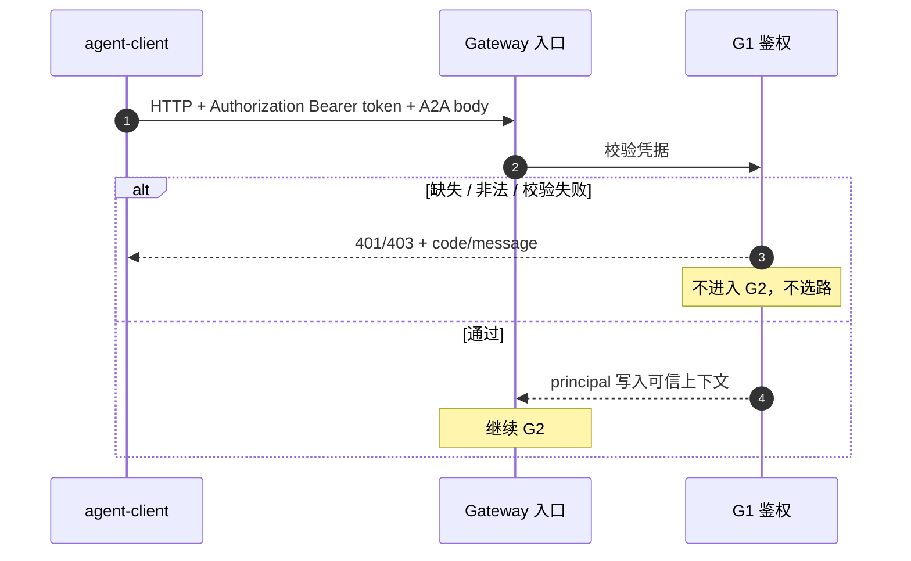
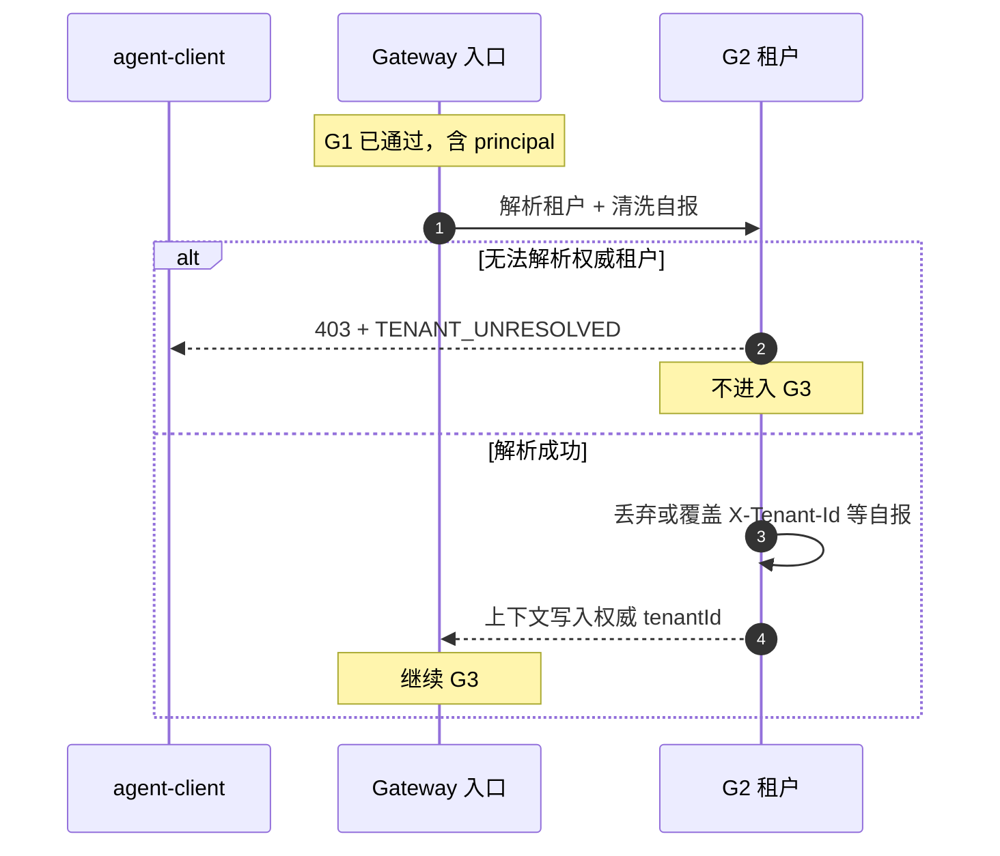
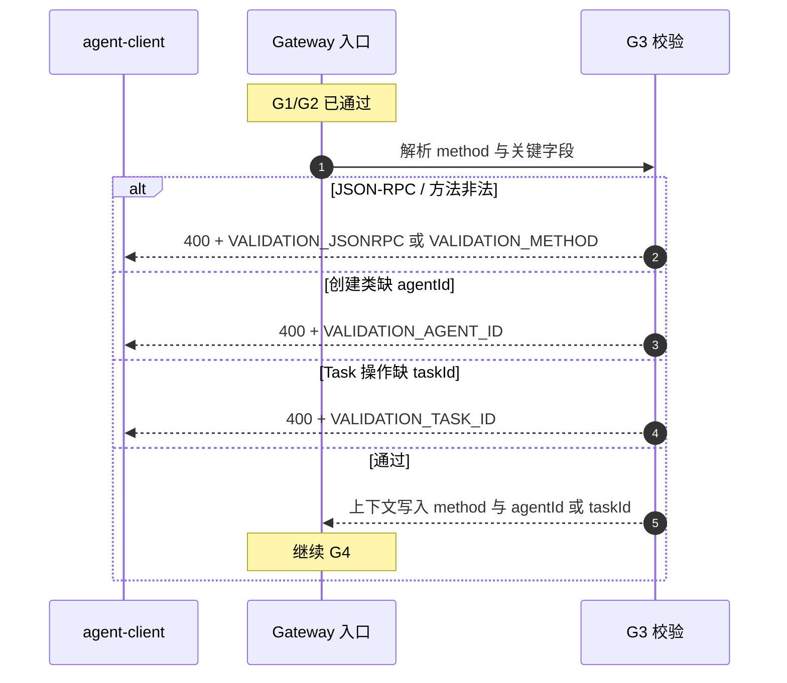
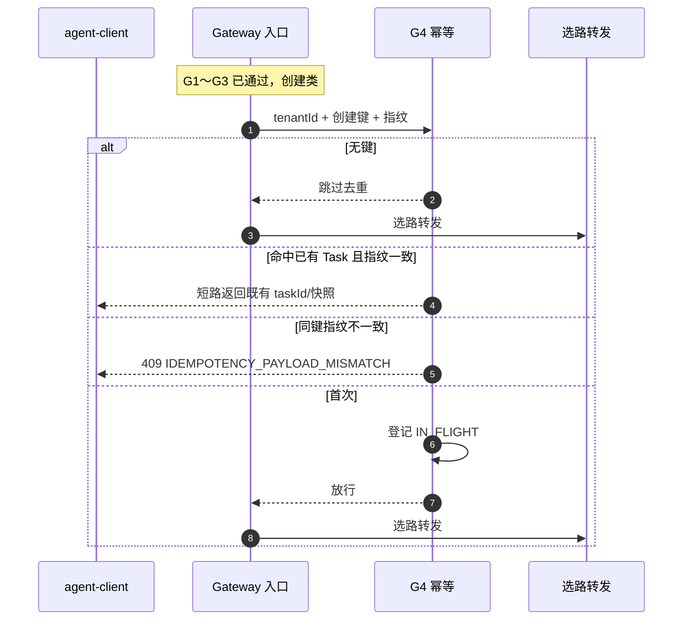
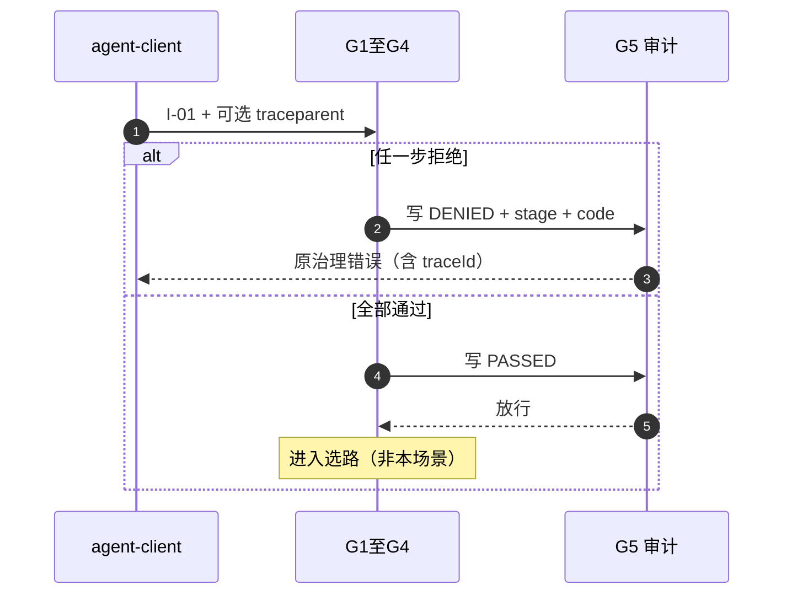
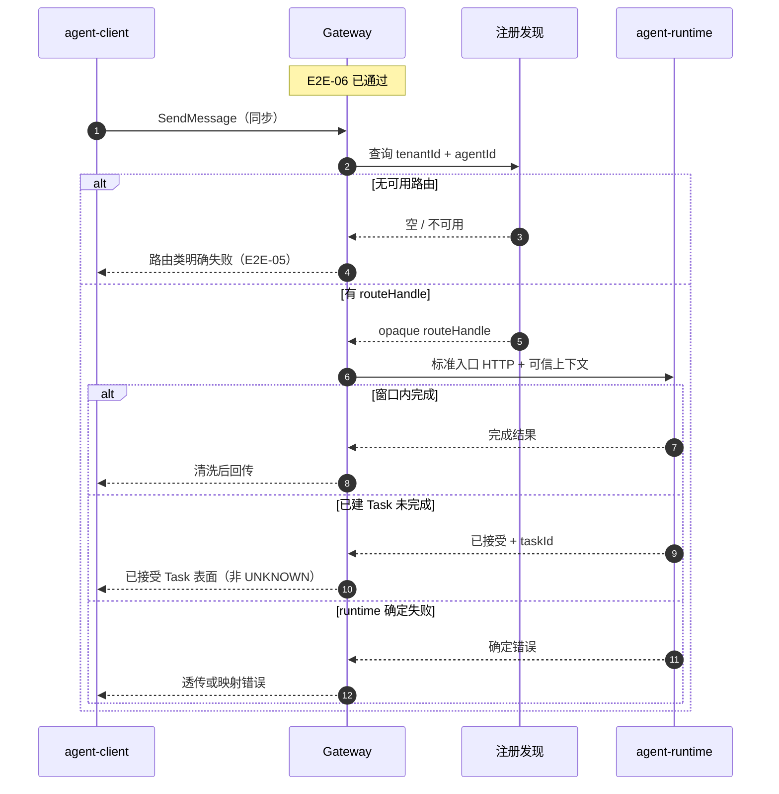
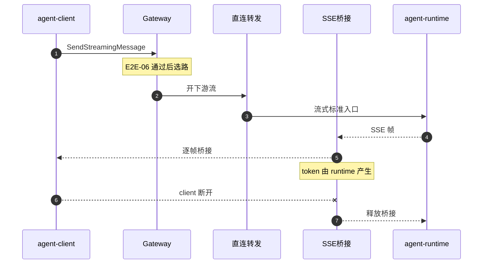

# FEAT-011 L2：客户端调用直连路由转发

本文是 **agent-gateway** 组件「客户端调用直连路由转发」的低层设计，说明责任边界、场景、与上下游交互、实现要点与验收。

姊妹文档：FEAT-012《客户端调用总线转发》。建议先读本文，再读 012。

---

## 0. 阅读说明

### 0.1 本文解决什么问题

业务应用通过 **agent-client** 调用智能体时，若直接配置或访问内部 **agent-runtime** 的物理地址，会使调用方与运行时部署位置、实例变化和网络拓扑强耦合：runtime 扩缩容、迁移或故障切换后，调用方可能被迫改配置；同时，鉴权、租户隔离与审计等入口治理也难以在一处统一落实。

因此，平台提供统一的 **Gateway** 入口。agent-client 只提交逻辑目标（例如 `agentId`），不感知、也不直连 runtime 物理地址。Gateway 完成约定的入口治理，再按逻辑目标向注册发现中心选路，最后通过 **HTTP/SSE** 将请求直接转发到目标 agent-runtime。

本文对应 **FEAT-011**，定义这条路径：

**入口治理 → 按逻辑目标选路 → HTTP/SSE 直连转发**（不经消息总线）。

在这条路径上，Gateway 负责接入、治理、选路与转发/桥接，不执行 Agent，也不拥有 Task。经消息总线入队与投影的路径由 **FEAT-012** 定义。

### 0.2 与需求文档的关系

| 层面 | 文档 |
|---|---|
| 对外行为与版本承诺 | `version-scope` 中的 FEAT-011 |
| 设计与实现（模块、接口、场景验收） | 本文 |

二者冲突时，对外行为以 version-scope 为准；模块拆分与实现细节以本文为准。

### 0.3 文档结构

| 章 | 内容 |
|---|---|
| §0 | 问题背景、术语 |
| §1 | 组件 Charter、场景总表 |
| §2 | 共享设计（统一入口、治理管道、包与配置） |
| §3 起 | 按场景展开（对齐 G 章详细度：要做什么 / 交互与约束 / 判断 / 接口 / 验收）；E2E-06 内拆 G1～G5，其余场景保持单一主路径 |
| 文末 | 待决问题、关联阅读 |

入口治理（E2E-06）在本文专章定义；FEAT-012 复用同一治理语义，并补充总线路径下「拒绝则不入队」等约束。

### 0.4 术语

| 术语 | 含义 |
|---|---|
| **Gateway / agent-gateway** | 客户端统一治理入口；不执行智能体业务逻辑。 |
| **直连转发** | 选路后经 HTTP/SSE 直接调用 runtime（本文主路径）。 |
| **总线转发** | 控制事件入消息总线，再经状态投影回传；见 FEAT-012。 |
| **agent-client** | 端侧调用方；只访问 Gateway。 |
| **agent-runtime** | 执行 Agent、拥有 Task 权威状态的服务。 |
| **RDC / 注册发现中心** | 按逻辑目标返回可路由引用；Gateway 不做注册上架主体。 |
| **routeHandle** | 不透明路由引用；不向 client 返回。 |
| **clientInvocationId** | client 侧弱关联标识，用于未获得 `taskId` 前的恢复；不能代替 `taskId`。 |
| **taskId** | runtime 创建 Task 后的正式句柄。 |
| **SSE 桥接** | 将 runtime 的 SSE 流转发给 client；Gateway 不生成、不缓存 token。 |
| **E2E-06** | 入口治理（通过 / 拒绝）。 |
| **E2E-01 / 02** | 同步 / 流式 · 直连。 |
| **E2E-05** | 选路失败。 |

---

## 1. Charter 与场景总表

### 1.1 使命

在「客户端统一协议、统一治理下调用存量与新智能体」的目标中，**agent-gateway** 在 FEAT-011 下的责任是：

> 作为 C/S 统一治理入口：完成已约定的入口治理，按逻辑目标向注册发现中心选路，再将调用 **直接转发** 到目标 agent-runtime 的标准服务入口；流式场景下桥接服务端 SSE——不执行智能体业务逻辑，不拥有 Task 权威状态，不做注册上架主体。

### 1.2 做范围内（In Scope）

| 编号 | 能力 | 对应场景 | 说明 |
|---|---|---|---|
| IN-1 | 同步直接路由转发 | E2E-01 | client 阻塞等待；Gateway HTTP 调用 runtime 后回传 |
| IN-2 | 流式直接路由转发（SSE 桥接） | E2E-02 | 与同步同一入口形态；token 由 runtime 产生 |
| IN-3 | 按逻辑目标选路 | E2E-01/02/05/07/08 | 依赖 RDC；对 client 隐藏内部地址 |
| IN-4 | 入口治理 | E2E-06 | 认证鉴权、租户解析与清洗、基础参数校验、幂等、审计 |
| IN-5 | 选路失败时明确失败 | E2E-05 | 不伪造成功投递 |
| IN-6 | 查询 / 取消 / 重订阅转发 | §7 | 基于 runtime 的 `taskId` |
| IN-7 | UNKNOWN 后同键恢复 | §7 | 未确认建 Task 且尚无 `taskId` 时 |
| IN-8 | 存量与新目标同一调用入口形态 | E2E-07 | 调用期统一；注册上架不归 Gateway |
| IN-9 | 端侧工具多轮透传 | E2E-08 | 透传意图与续跑请求；不在 Gateway 执行工具 |

### 1.3 明确不做（Out of Scope）

| 编号 | 不做 | 归属 |
|---|---|---|
| OUT-1 | 执行推理、工具、记忆、业务 Agent | runtime / 中间件 |
| OUT-2 | 写入 Task 存储或决定 Task 终态 | runtime |
| OUT-3 | 在 Gateway 内拉起 agent 实例 | runtime |
| OUT-4 | 维护注册目录 / 存量上架 | RDC + 服务提供方 |
| OUT-5 | 经消息总线入队或经总线传 token / 大正文 | FEAT-012 |
| OUT-6 | 绕过 runtime 标准入口的私有执行协议 | — |
| OUT-7 | 解析端侧工具业务语义并本地执行 | agent-client |
| OUT-8 | 智能体服务之间经总线的 A2A | 其他特性 |

边界约束：client 不旁路直连 runtime 物理地址；选路依赖 RDC；转发对齐 runtime 标准服务入口语义（FEAT-001）。

### 1.4 成功标准

| 编号 | 标准 |
|---|---|
| S1 | 同步直连：合法请求到达目标 runtime，并返回可消费结果或已接受 Task 表面 |
| S2 | 流式直连：完成 SSE 桥接；Gateway 不生成、不缓存 token；client 断开后释放桥接 |
| S3 | 无路由或治理拒绝时返回明确失败，且不暴露内部 endpoint / `routeHandle` |
| S4 | 入口治理覆盖 FEAT-011 已定义的鉴权、租户、校验、幂等与审计 |
| S5 | Gateway 不写 Task 库、不执行 Agent、不做注册上架 |

### 1.5 周边角色

```text
业务 / agent-client
        │  A2A 兼容请求（只访问 Gateway）
        v
   agent-gateway
        │
        │ ① 入口治理后选路（011 / 012 都要）
        v
   注册发现中心(RDC) ──► routeHandle
        │
        │ ② 再按路径投递
   ┌────┴────────────────────┐
   │                         │
   v                         v
 FEAT-011                  FEAT-012（另文）
 HTTP/SSE 直连             控制事件（含 routeHandle）
   │                         │
   │                         v
   │              Event Bus（治理中继）
   │                         │ 再投递
   └────────────┬────────────┘
                v
         agent-runtime（Task 主人）
                │
                │ 流式：点对点 A2A SSE（可由 Gateway 桥接）
                └──────────────────────► agent-client
```

| 角色 | 关系 |
|---|---|
| agent-client | 上游调用方；只访问 Gateway |
| RDC | 调用期选路：逻辑目标 → `routeHandle`。直连与总线在转发/入队前都要选路；总线信封携带 `routeHandle` |
| agent-runtime | 直连 HTTP/SSE 目标，或总线路径上的 Task 执行方；拥有 Task |
| Event Bus | FEAT-012/013 路径上的控制事件与投影中继（gateway↔bus↔runtime）；本特性（FEAT-011）不经过 |

### 1.6 能力要点

- 先完成入口治理，再选路与转发（§3）。
- 按明确逻辑目标（`agentId`）选路并转发。
- 统一 A2A 表面承接 `SendMessage` / `SendStreamingMessage` / `GetTask` / `CancelTask` / `SubscribeToTask`，按 runtime 标准入口语义转发。
- SSE 桥接不生成、不缓存 token。
- 查询与取消基于 `taskId`；`clientInvocationId` 不替代 `taskId`。
- 未确认是否建 Task 且尚无 `taskId` 时，允许同一 `clientInvocationId` + 幂等键重试；不新增按 invocation 查询 Task 的私有接口。
- 不向 client 暴露物理 endpoint、`routeHandle` 解析细节或内部实例地址。

### 1.7 场景总表

| 编号 | 名称 | 章节 | 说明 |
|---|---|---|---|
| E2E-06 | 入口治理（通过 / 拒绝） | §3 | 治理专章；主路径前置 |
| E2E-01 | 同步 · 直连 | §4 | 治理通过后进入 |
| E2E-02 | 流式 · 直连 | §5 | 治理通过后进入 |
| E2E-05 | 选路失败 | §6 | 治理通过后、无可用路由 |
| — | 查询 / 取消 / 重订阅 / UNKNOWN | §7 | 辅助能力 |
| E2E-07 / 08 | 统一入口 / 端侧工具 | §8 | 标注场景 |

阅读顺序建议：§1 → §3 → §4 / §5 → §6。

---

## 2. 共享设计

统一入口形态、治理管道在调用链中的位置、以及跨场景复用的包与配置，在本节省述；各场景细节见对应章节。

---

## 3. 场景：E2E-06 — 入口治理

Gateway 是客户端进入平台的治理入口。任意调用在选路与转发之前，须先完成本章定义的入口治理：未通过则停在门口；全部通过后进入选路与投递（E2E-01 / 02 或 FEAT-012）。

第一版功能从简，但下列子场景**均须具备**。能力对齐 FEAT-011「客户端入口治理」，入站与 agent-client（Feat-Func-001）约定一致。

### 3.1 责任切片

| 项 | 内容 |
|---|---|
| 目标 | 完成约定治理，产出可信上下文，或明确拒绝且不进入后续投递 |
| In | 下表 G1～G5 |
| Out | 选路与转发；限流 / WAF / 插件链 / 灰度（非本版默认范围） |
| 失败通则 | 治理层明确错误；不查 RDC、不调 runtime、不发总线事件；不伪装已建 Task 或 UNKNOWN |

### 3.2 治理子场景总表

同一 I-01 请求上按固定顺序执行；任一步失败即停。

| 编号 | 子场景 | V1 | 一句话 |
|---|---|---|---|
| **G1** | 认证鉴权 | 必须 | 确认「谁在调」；不过则拒绝 |
| **G2** | 租户解析与清洗 | 必须 | 从认证主体解析租户；不信 client 自报 |
| **G3** | 基础参数校验 | 必须 | 创建类至少校验 `agentId` 等关键参数 |
| **G4** | 创建幂等 | 必须 | 同租户 + 同创建键去重，避免重复创建副作用 |
| **G5** | 审计留痕 | 必须 | 记录通过 / 拒绝关键事实，不改业务语义 |

```text
agent-client
   → G1 鉴权 → G2 租户 → G3 校验 → G4 幂等 → G5 审计
        │ 任一步失败 → 治理错误返回（结束）
        └ 全部通过 → 可信上下文 → 选路 / 转发（非本场景）
```

**为何按此顺序（V1 管道约定）：**

原则是先确认「人是谁 / 属于哪」，再看「报文合不合法」，再做「可能改结果的业务卡点」，并保证全程可审计。

| 步骤 | 放在该位置的原因 |
|---|---|
| G1 鉴权最先 | 无合法身份不进入后续逻辑；没有 principal，租户也无法可靠解析。匿名请求不应先看到业务校验细节。 |
| G2 紧接 G1 | 权威 `tenantId` 来自认证主体与网关策略，不是 client body。幂等空间是「同租户 + 创建键」，必须先有租户。 |
| G3 在身份之后 | 参数校验（如缺 `agentId`）属契约问题；先身份后参数，便于区分 401/403 与 400，也避免未授权调用刷校验。 |
| G4 在校验之后 | 幂等针对已识别为合法创建的请求；先拦脏请求再查重，避免残缺键污染去重表，也避免非法请求误命中旧幂等结果。 |
| G5 覆盖整段管道 | 通过与拒绝都要留痕，且宜带上已解析的 principal、tenant、结果码。实现上可在每步失败时立即记一笔，成功时在管道末尾补记；概念上审计覆盖 G1～G4 全过程。 |

FEAT-011 要求须完成鉴权、租户、校验、幂等与审计，**未强制**五步绝对序号；上表为 Gateway 实现采用的管道顺序，便于安全边界、幂等键空间与对 client 的错误分层一致。

**与 agent-client 的关系（G1～G5 总览）：**  
下列子场景的实现主体是 Gateway；对 agent-client 主要是**契约约束**（入站必须满足的约定），不是「必须先合入某段 client 代码才能开发 Gateway」。约束的细节与前因后果见各子场景「对 agent-client 的约束」小节。

| 子场景 | 约束摘要 | 她不遵守时的典型后果 |
|---|---|---|
| G1 | 每次 I-01 带合法 `Authorization`；凭据不进 body | 401 + `AUTH_*`；调用停在门口 |
| G2 | 禁止自报权威租户（如 `X-Tenant-Id`） | 自报被清洗；权威仍以 Gateway 为准；无映射则 403 |
| G3 | 创建带可读 `agentId`；Task 操作带 `taskId`；方法合法 | 400 + `VALIDATION_*`；不进入选路 |
| G4 | 创建重试用同一创建键；同键正文一致；无键则勿盲目自动重试 | 可能重复建 Task；或 409 正文冲突；无键时 Gateway 不做创建去重 |
| G5 | 宜带 `traceparent`；勿把密钥写入会被审计的明文业务字段 | 审计关联困难；或敏感信息进审计存储（合规风险） |

---

### 3.3 G1 — 认证鉴权

#### 3.3.1 要做什么

确认调用方身份合法。第一版只做「有合法凭据才能进门」：凭据缺失、格式不对、校验失败 → **立即拒绝**，不进入 G2 及之后，也不选路。

通过后，在可信上下文中留下 **认证主体（principal）**，供 G2 解析租户使用。

#### 3.3.2 与 agent-client 的交互

| 角色 | 职责 |
|---|---|
| agent-client | 经 `CredentialProvider` 取得短期凭据，在每次 I-01 HTTP 请求上携带；不把凭据写入业务 JSON-RPC body |
| Gateway | 读取并校验凭据；失败返回治理层错误；成功解析出 principal |

对齐 Feat-Func-001：**G-3**（先鉴权）与 **G-7**（治理错误走 HTTP 层，不装成 A2A 成功 Task）。

#### 3.3.3 对 agent-client 的约束（契约）

本节约束属于**入站契约**，不是要求 agent-client 新增 A2A 业务字段。凭据走 **HTTP 头**；A2A JSON-RPC body 不承担认证。

**前因（为什么需要约束）**

1. Gateway 是平台统一治理入口：若允许无凭据或伪造凭据进入 G2～选路，租户隔离与审计失去根基。  
2. 鉴权必须在**连接/HTTP 层**完成，才能与「A2A 业务成功 / 已建 Task」错误面分离；SDK 才能稳定分支处理。  
3. 若把身份写进 JSON-RPC body，易被业务层误解析、日志误打印，且与「丢弃自报身份」模型冲突。

**约束（agent-client 必须做到）**

| # | 约束 | 说明 |
|---|---|---|
| C-G1-1 | 每一次 I-01 HTTP 请求（含创建、流式、GetTask、Cancel、Subscribe、续跑、重试）均携带 `Authorization` | 不能只在「第一次调用」带、后续省略 |
| C-G1-2 | V1 形态为 `Authorization: Bearer <token>`，`<token>` 非空 | 与协议草案一致；企业改 mTLS 等须双方另行冻结 |
| C-G1-3 | token 由 `CredentialProvider`（或等价）从可信来源获取，支持过期刷新后再发请求 | 过期 token 重试前应先刷新，否则会稳定收到 `AUTH_INVALID` |
| C-G1-4 | **禁止**把 access token / 密码写入 JSON-RPC `params`、`message.parts`、metadata | 鉴权不读取 body 身份字段 |
| C-G1-5 | **禁止**在日志、落盘状态、上报事件中输出完整 token | 可记 token 指纹 / `principalId`（若本地可知） |
| C-G1-6 | 收到治理层 401/403 时，按 **HTTP 错误**处理，不得解析为「已接受 Task」或触发基于 `taskId` 的成功路径 | 对齐 Feat-Func-001 G-7 |
| C-G1-7 | 生产 transport 必须真实发送该头；仅 InProcess fake 测试可另约定 | 否则联调必现 `AUTH_MISSING` |

**字段从哪来**

| 项 | 是否新造 A2A 字段 | agent-client 侧动作 |
|---|---|---|
| `Authorization` | 否（HTTP 标准头；协议草案已要求） | transport 设置；不是 JSON 里加键 |
| body 内 user/tenant 当身份 | 不采用 | 即使业务传入也不应指望 Gateway 采信 |

**后果（不遵守时）**

| 违规情形 | Gateway 行为 | agent-client 应表现 |
|---|---|---|
| 未带 `Authorization` | 401 + `AUTH_MISSING`；不进入 G2 | 调用失败；可提示未配置凭据 / CredentialProvider |
| 格式非 Bearer 或 token 空 | 401 + `AUTH_INVALID` | 检查 transport 组头逻辑 |
| token 过期、伪造、吊销 | 401 + `AUTH_INVALID` | 刷新凭据后重试；**不要**用同一坏 token 打满重试 |
| 有身份但无权限（若启用） | 403 + `AUTH_FORBIDDEN` | 向业务返回不可用 / 无权限，不进入 Task 投影成功态 |
| 把 401 当 A2A 成功体解析 | （Gateway 已正确）SDK 行为错误 | 属于 client 缺陷：须先看 HTTP status / 治理 error body |

**联调对齐清单（G1）**

- [ ] 生产 HTTP transport 已挂 `Authorization`  
- [ ] 401/403 的 `code` 枚举 SDK 可识别（至少 `AUTH_MISSING` / `AUTH_INVALID`）  
- [ ] 文档/示例中无「把 token 放进 message」的错误示范  

#### 3.3.4 接口（I-01）

**入站（client → Gateway）**

| 项 | V1 约定 |
|---|---|
| 通道 | 统一 A2A facade 的 HTTP 请求（`SendMessage` / `SendStreamingMessage` / `GetTask` / `CancelTask` / `SubscribeToTask` 等均适用） |
| 凭据头 | `Authorization`（必选） |
| 凭据形态 | `Bearer <token>`（V1 默认；企业 mTLS / 其它方案可后续扩展，保证「一种可校验凭据」即可） |
| Body | A2A JSON-RPC；**鉴权不依赖 body 内自报身份字段** |

**出站（Gateway → client，仅失败时由本子场景直接返回）**

| 项 | V1 约定 |
|---|---|
| 错误层 | **HTTP + 稳定 error body**（治理层）；不返回 JSON-RPC「已接受 Task」成功结果 |
| HTTP 状态 | 缺失 / 格式非法 / 校验失败 → **401**；已认证但无调用权限（若 V1 区分授权）→ **403** |
| error body（最小集） | `code`（稳定字符串）、`message`（可读说明）、可选 `traceId` |
| 建议 `code` | `AUTH_MISSING` / `AUTH_INVALID` / `AUTH_FORBIDDEN` |

禁止：鉴权失败时调用 RDC、runtime、总线；禁止返回 UNKNOWN 或伪造 Task。

#### 3.3.5 判断逻辑（字段与规则）

按顺序判断：

1. **是否存在 `Authorization` 头**  
   - 无 → 401 + `AUTH_MISSING`，结束。  
2. **值是否匹配 `Bearer <token>`（V1）**  
   - `Authorization` 为空、无 `Bearer ` 前缀、token 段为空 → 401 + `AUTH_INVALID`，结束。  
3. **校验 token**（实现可选一种，V1 须可测）  
   - 例：本地/配置的共享密钥校验、JWT 验签、或调用平台令牌服务。  
   - 过期、签名错误、吊销、未知主体 → 401 + `AUTH_INVALID`，结束。  
4. **（可选）授权**  
   - 身份有效但禁止访问 Gateway / 该租户能力 → 403 + `AUTH_FORBIDDEN`。  
5. **通过**  
   - 写入可信上下文：`principalId`（或等价主体标识）、凭证类型、校验时间；**不**在此步信任 `X-Tenant-Id` 或 body 内自报 tenant（交给 G2）。



#### 3.3.6 实现要点（V1 从简）

- 模块落点：`governance/auth`（或等价过滤器），挂在 facade 最前。  
- Token 校验器可替换（SPI），但对外错误码保持上表稳定。  
- 日志可记 `principalId` 与结果码；**禁止**打印完整 token。

#### 3.3.7 验收（G1）

| # | Given | When | Then |
|---|---|---|---|
| T-G1-1 | 无 `Authorization` | 任意 I-01 调用 | 401 + `AUTH_MISSING`；无 RDC / runtime / 总线调用 |
| T-G1-2 | `Authorization` 非 Bearer 或 token 空 | 任意调用 | 401 + `AUTH_INVALID`；无下游调用 |
| T-G1-3 | Bearer token 校验失败（过期/伪造） | 任意调用 | 401 + `AUTH_INVALID`；无下游调用 |
| T-G1-4 | 合法 Bearer token | 任意调用 | 进入 G2；上下文含 principal；响应尚未因 G1 失败 |
| T-G1-5 | 鉴权失败 | 调用 | 错误在 HTTP 治理层；A2A body 不得表现为已建 Task |

---

### 3.4 G2 — 租户解析与清洗

#### 3.4.1 要做什么

在 G1 已给出认证主体的前提下，确定本次调用的**权威租户** `tenantId`，写入可信上下文；**不采信** client 自报租户。

第一版从简，固定两条规则：

1. **权威来源**：仅从「认证主体 + 网关策略」解析租户。  
2. **清洗**：请求中出现的自报租户（header / body）一律丢弃或覆盖，不得进入下游。

解析不出权威租户 → **拒绝**（不进入 G3）。有自报但与权威不一致 → V1 **覆盖为权威值并继续**（不因「多带了自报 header」单独失败，避免 SDK 误带头时误伤）；若产品后续要求「冲突即 403」，可升级为硬拒绝，错误码预留。

#### 3.4.2 与 agent-client 的交互

| 角色 | 职责 |
|---|---|
| agent-client | **不自证租户**；SDK 配置里的 `tenantId` 仅用于本地日志 / 上下文，**不得**作为 wire 权威；按约定**禁止发送** `X-Tenant-Id`（Feat-Func-001 G-3；协议草案 B-14） |
| Gateway | 从 principal 解析权威 `tenantId`；若仍收到自报租户则清洗；向下游只注入权威值 |

client 不负责「算对租户」；算错自报也不应靠 client 纠正权威结果。

#### 3.4.3 对 agent-client 的约束（契约）

本节约束的核心是：**租户权威在 Gateway，不在 client。** 一般**不要求**她新增 A2A 字段；要求的是**不要发送/依赖自报租户**，并正确理解 403 语义。

**前因（为什么需要约束）**

1. FEAT-011 规定租户由认证主体与网关策略解析；runtime 只消费 Gateway 转发后的可信上下文。若允许 client 用 header/body 指定租户，即可伪造跨租户访问。  
2. 现网/历史实现中 runtime 可能仍识别 `X-Tenant-Id`；公开入口若放行 client 自报，会绕过 Gateway 清洗，形成双通道。  
3. SDK 配置里常有本地 `tenantId`（日志、多租户调试）。若不加约束，transport 容易「顺手」写成 `X-Tenant-Id`，与权威模型冲突。  
4. 业务方习惯「我传个租户你就按这个走」——必须在契约上明确：**传了也不算数**。

**约束（agent-client 必须做到）**

| # | 约束 | 说明 |
|---|---|---|
| C-G2-1 | **禁止**在 I-01 请求中发送 `X-Tenant-Id`（或等价「client 指定租户」头） | 对齐 Feat-Func-001 G-3、协议草案 B-14 |
| C-G2-2 | SDK 配置项 `tenantId`（若有）**仅用于本地**日志、指标、测试夹具；**不得**映射为 wire 权威 | 文档与 API 注释须写明「非 wire 权威」 |
| C-G2-3 | **禁止**要求业务调用方「为了调通 Gateway 而填写租户 header」 | 否则会培训错误用法 |
| C-G2-4 | 不得在 JSON-RPC `params` / `metadata` 中放置「以自报为准」的租户覆盖字段并文档化为必填 | 若历史包里有字段，Gateway 仍清洗；client 不得依赖其生效 |
| C-G2-5 | 收到 403 + `TENANT_UNRESOLVED` / `TENANT_FORBIDDEN` 时，按**身份/租户不可用**处理，而不是「再带一个 X-Tenant-Id 重试」 | 重试应换合法凭据或联系平台开通映射，而不是自报租户 |
| C-G2-6 | 多租户产品若需切换租户，应通过**换发/切换凭据**（不同 principal 或 token 中的租户声明），而不是改 header | 与 G1 凭据模型一致 |

**字段从哪来**

| 项 | 是否新造字段 | agent-client 侧动作 |
|---|---|---|
| 权威 `tenantId` | 否（Gateway 内部上下文；转发时由 Gateway 注入下游） | **不填写权威租户** |
| `X-Tenant-Id` | 否 | **不发送** |
| 本地配置 `tenantId` | SDK 自有，非 wire | 可保留，但与 wire 隔离 |

**后果（不遵守时）**

| 违规情形 | Gateway 行为（V1） | agent-client 应表现 |
|---|---|---|
| 误发 `X-Tenant-Id` 且与权威不同 | **丢弃/覆盖**，以权威继续（不因此单独 403） | 业务仍走权威租户；SDK 应告警「已忽略自报租户」，避免以为切换成功 |
| 误发且与权威相同 | 仍不采信自报；上下文只写权威解析结果 | 行为与「没带头」相同，不能当作「自报被接受」 |
| principal 无法映射租户（与是否带头无关） | 403 + `TENANT_UNRESOLVED` / `TENANT_FORBIDDEN` | 提示账号未绑定租户 / 无权限；**禁止**建议用户加 `X-Tenant-Id` 绕过 |
| 业务以为「传了租户就会进该租户」 | Gateway 不保证 | 产品文档须与契约一致，否则属使用错误 |

**联调对齐清单（G2）**

- [ ] SDK / 示例 / 集成测试中无 `X-Tenant-Id`  
- [ ] 本地 `tenantId` 配置说明含「非 wire 权威」  
- [ ] 403 租户类错误有独立文案，与 401 鉴权失败区分  
- [ ] 与 Gateway 确认：冲突自报 V1 为「清洗继续」而非「冲突 403」（若产品改硬拒绝，双方同步改文档）  

#### 3.4.4 接口（I-01）

**入站（与租户相关）**

| 项 | V1 约定 |
|---|---|
| 权威输入 | G1 产出的 `principalId`（及令牌内声明，若有） |
| 禁止作权威 | `X-Tenant-Id`；JSON-RPC / metadata 内 client 自填的 tenant / user 身份字段 |
| 可选观测 | `traceparent` 等与租户无关，原样传播策略见后续场景 |

**出站（仅本子场景失败时）**

| 项 | V1 约定 |
|---|---|
| 错误层 | HTTP + 稳定 error body（治理层） |
| HTTP 状态 | 无法解析权威租户 → **403** |
| 建议 `code` | `TENANT_UNRESOLVED`（无映射）；`TENANT_FORBIDDEN`（主体无权使用该租户，若策略区分） |
| 成功时 | 本子场景不单独回包；上下文增加权威 `tenantId` 后进入 G3 |

Gateway 转发到 runtime / 总线时（后续场景）：由 Gateway **注入**权威租户上下文；继续忽略任何残留自报。

#### 3.4.5 判断逻辑（字段与规则）

前置：G1 已通过，上下文含 `principalId`。

1. **解析权威租户**  
   - 输入：`principalId`、令牌 claims（若校验器已解析，如 `tenant` / `tid`）、网关侧主体→租户映射表或策略服务。  
   - 输出：唯一 `tenantId`（非空字符串）。  
   - 失败（无映射、多租户歧义且策略不允许默认、主体禁用）→ 403 + `TENANT_UNRESOLVED` 或 `TENANT_FORBIDDEN`，结束。  
2. **扫描并清洗自报**  
   - 若存在 `X-Tenant-Id`：记录审计「已丢弃自报」（可选），**删除或覆盖**该头，不以之替换权威值。  
   - 若 body / metadata 中存在与身份冲突的 tenant / user 声明：覆盖为权威上下文对应值，或剥离后仅保留业务字段（实现选一种，结果必须是下游只见权威租户）。  
3. **冲突策略（V1）**  
   - 自报存在且与权威不同：仍以权威为准并继续（清洗），不额外 403。  
   - 自报与权威相同：仍以权威写入上下文（不「信任自报」）。  
4. **通过**  
   - 可信上下文写入：`tenantId`（权威）、`principalId`（来自 G1）；进入 G3。



#### 3.4.6 实现要点（V1 从简）

- 模块落点：`governance/tenant`（在 auth 之后）。  
- 主体→租户映射：V1 可用配置表 / 令牌 claim；策略服务可替换。  
- 向 runtime 注入租户的具体头或信封字段在转发场景定义；本子场景保证**上下文里已是权威值**。  
- 日志可记 `tenantId`、是否丢弃自报；不记完整 token。

#### 3.4.7 验收（G2）

| # | Given | When | Then |
|---|---|---|---|
| T-G2-1 | G1 通过，principal 可映射到唯一租户 | 任意调用 | 进入 G3；上下文 `tenantId` 为权威值 |
| T-G2-2 | G1 通过，principal 无法映射租户 | 任意调用 | 403 + `TENANT_UNRESOLVED`（或 `TENANT_FORBIDDEN`）；无 RDC / runtime / 总线调用 |
| T-G2-3 | G1 通过，请求带 `X-Tenant-Id` 且与权威不同 | 创建类调用 | 仍以权威 `tenantId` 继续；自报不生效；可进入 G3（若其余通过） |
| T-G2-4 | G1 通过，请求带与权威相同的自报 tenant | 调用 | 上下文仍只认权威解析结果，不因「自报正确」而改信任模型 |
| T-G2-5 | G2 拒绝 | 调用 | HTTP 治理层错误；不得返回已建 Task / UNKNOWN |

---

### 3.5 G3 — 基础参数校验

#### 3.5.1 要做什么

在身份与租户已确定的前提下，拦住**明显不合法、后面必失败或无法选路**的请求。第一版从简，只做「能识别方法 + 关键键齐全」，不做完整 JSON Schema / 业务内容审核。

按方法分两类：

| 类别 | 方法（语义名） | V1 最少校验 |
|---|---|---|
| **创建类** | `SendMessage` / `SendStreamingMessage`，且**无**既有 `taskId`（首轮创建） | 方法在白名单；`agentId` 必有且非空 |
| **Task 操作类** | `GetTask` / `CancelTask` / `SubscribeToTask`；以及带既有 `taskId` 的续跑 `SendMessage` | 方法在白名单；`taskId` 必有且非空 |

校验失败 → **立即拒绝**，不进入 G4，不选路。  
「目标在 RDC 是否可路由」不属于本子场景（归 E2E-05）。

#### 3.5.2 与 agent-client 的交互

| 角色 | 职责 |
|---|---|
| agent-client | 按 A2A JSON-RPC 组包；创建时带逻辑目标 `agentId`（公共 API / transport 均需保证落到 Gateway 可读位置）；查询/取消/重订阅/续跑带 runtime `taskId`；创建宜带稳定创建键（供 G4，本子场景不强制） |
| Gateway | 解析方法与关键字段；失败返回治理/校验层错误；通过则把归一后的 `method`、`agentId` 或 `taskId` 写入可信上下文 |

对齐 Feat-Func-001：创建依赖 `agentId`（G-4 选路前置）；`clientInvocationId` **不得**替代 `taskId`。

#### 3.5.3 对 agent-client 的约束（契约）

本节约束混合两类字段：

- **A2A / JSON-RPC 已有**：`method`、`message.messageId`、`taskId` 等——要求**正确填写**，不是新造协议。  
- **须双方冻结落点的创建目标**：`agentId`——SDK API 层已有，但当前 client L2 创建 wire 示例未写明 Gateway 读取路径，属于**对齐项**（transport 必须写入约定位置）。

**前因（为什么需要约束）**

1. FEAT-011 创建类调用**必须**带逻辑目标才能选路；Gateway 若在 wire 上读不到 `agentId`，只能 400，无法进入 RDC。  
2. A2A 用「有无 `taskId`」区分创建与续跑；若续跑漏带 `taskId`，会被当成新创建，导致原 Task 挂起、重复建 Task（协议草案亦强调此风险）。  
3. 方法名若与白名单不一致（旧 REST 名、拼写别名），Gateway 无法路由到统一 facade 语义。  
4. `clientInvocationId` / 本地句柄若被误当成 `taskId` 去 Get/Cancel，会绕过 Task 权威模型。

**约束（agent-client 必须做到）**

| # | 约束 | 说明 |
|---|---|---|
| C-G3-1 | 创建类（无 `taskId` 的 `SendMessage` / `SendStreamingMessage`）必须在**双方冻结的 wire 路径**写入非空 `agentId` | 推荐候选：`params.metadata.agentId`（或联调表最终路径）；与 `InvocationRequest.agentId` 由 transport 映射 |
| C-G3-2 | 在冻结前，SDK **不得**假设「只设 API 的 agentId、不写 wire」仍能通过 G3 | 公共 API 有值但 transport 未写出 → 仍会 `VALIDATION_AGENT_ID` |
| C-G3-3 | `GetTask` / `CancelTask` / `SubscribeToTask` 必须带非空 `taskId`（`params.taskId` 或该方法约定位置） | 使用 runtime 返回的权威 ID |
| C-G3-4 | 续跑（工具结果 / 用户输入）的 `SendMessage` 必须带原 `message.taskId`；**禁止**用「再发一条无 taskId 的创建」代替续跑 | 漏带会被当成新创建 |
| C-G3-5 | **禁止**用 `clientInvocationId`、本地 invocation 句柄、`messageId` 代替 `taskId` 做 Get/Cancel/Subscribe | `messageId` 留给创建幂等（G4），不代替 Task 句柄 |
| C-G3-6 | `method` 使用白名单内名称（与 Gateway 冻结表一致，如 `SendMessage` 等） | 别名须双方登记，否则 `VALIDATION_METHOD` |
| C-G3-7 | body 必须是可解析的 JSON-RPC 2.0 对象 | 截断、非 JSON、缺 `method` → `VALIDATION_JSONRPC` |
| C-G3-8 | 收到 400 + `VALIDATION_*` 时，按**参数/契约错误**处理：修正组包后重发；不要当成鉴权失败去刷新 token，也不要当成「已建 Task」 | 与 401/403 分流 |

**字段从哪来（逐项）**

| 字段 | 来源 | agent-client 动作 |
|---|---|---|
| `jsonrpc` / `id` / `method` / `params` | JSON-RPC 2.0 + A2A 方法面 | 正确组包 |
| `message.messageId` | A2A 已有；client 生成 | 创建必填；G3 不因缺失失败（G4 使用） |
| `message.taskId` / `params.taskId` | A2A 已有；runtime 颁发 | 查询/取消/续跑正确回填 |
| `agentId` | FEAT 必填；**wire 落点待冻结** | API 已有 → transport **必须写出**到约定路径（对齐项，不是「再发明一个业务概念」） |
| `clientInvocationId` | FEAT 可带；client 协议有的方案用 `messageId` 兼责 | G3 不强制；不得替代 `taskId` |

**后果（不遵守时）**

| 违规情形 | Gateway 行为 | agent-client 应表现 |
|---|---|---|
| 创建未在约定路径写出 `agentId`（含仅 API 有值） | 400 + `VALIDATION_AGENT_ID`；不选路 | 检查 transport 映射；联调先对路径 |
| Get/Cancel/Subscribe 无 `taskId` | 400 + `VALIDATION_TASK_ID` | 修复调用链；勿对本地 ID 重试冒充 |
| 续跑漏 `taskId` | 可能被当成创建 → 缺 `agentId` 则 400；若误带 `agentId` 可能**静默新开 Task**（更危险） | SDK 应用类型区分 Create vs Resume，编译期/运行期防止漏带 |
| 方法名不在白名单 | 400 + `VALIDATION_METHOD` | 对齐方法名表；勿混用旧 HTTP 路径名当 JSON-RPC method |
| body 非法 JSON-RPC | 400 + `VALIDATION_JSONRPC` | 修复序列化 |
| 用 `messageId` 去 GetTask | 400 或缺 task 语义失败 | 教育调用方：Task 操作只用 `taskId` |

**联调对齐清单（G3）——须双方签字冻结**

- [ ] `agentId` 的 JSON Pointer / 路径（唯一读路径 + 是否允许兼容副路径）  
- [ ] 方法名字符串表（含是否接受别名）  
- [ ] 创建 vs 续跑判别：仅以「是否存在非空 taskId」为准（与本文一致）  
- [ ] 400 `VALIDATION_*` 与 SDK 错误类型映射  
- [ ] 集成测试：API 填了 `agentId` 时，抓包确认 wire 上可见  

#### 3.5.4 接口（I-01）

**入站**

| 项 | V1 约定 |
|---|---|
| Body | JSON-RPC 2.0：`jsonrpc` / `id` / `method` / `params` |
| 方法白名单 | `SendMessage`、`SendStreamingMessage`、`GetTask`、`CancelTask`、`SubscribeToTask`（名称以联调冻结为准；未知方法拒绝） |
| 创建类 `agentId` | **必填**；非空字符串。wire 位置映射假设：优先 `params.metadata.agentId` 或平台约定的等价字段；与 SDK `InvocationRequest.agentId` 对应，由 transport 写入 Gateway 可读处 |
| Task 操作类 `taskId` | **必填**；非空。来自 `params.taskId` 或 `params.message.taskId`（按方法约定读取） |
| 创建幂等键 / `clientInvocationId` | **本子场景不强制**；缺失不在 G3 失败（G4 / §7 处理） |

**区分创建 vs 续跑（同一 `SendMessage`）：**

- `params.message.taskId`（或等价）**为空** → 按**创建类**，要求 `agentId`。  
- **非空** → 按**续跑**，要求该 `taskId`，不再要求本次必须带 `agentId`（若带了可忽略或仅作校验一致性，V1 不强制一致检查）。

**出站（仅本子场景失败时）**

| 项 | V1 约定 |
|---|---|
| 错误层 | HTTP + 稳定 error body（治理/校验层，对齐 G-7 可识别） |
| HTTP 状态 | **400** |
| 建议 `code` | `VALIDATION_METHOD` / `VALIDATION_JSONRPC` / `VALIDATION_AGENT_ID` / `VALIDATION_TASK_ID` |
| 禁止 | 返回已建 Task 表面或 UNKNOWN；进入选路 / runtime / 总线 |

#### 3.5.5 判断逻辑（字段与规则）

前置：G1、G2 已通过。

1. **HTTP body 可解析为 JSON**  
   - 否 → 400 + `VALIDATION_JSONRPC`，结束。  
2. **JSON-RPC 骨架**  
   - 缺 `method`，或 `jsonrpc` 不是可接受的 `"2.0"` → 400 + `VALIDATION_JSONRPC`，结束。  
3. **方法白名单**  
   - `method` 不在白名单 → 400 + `VALIDATION_METHOD`，结束。  
4. **按方法分支**  
   - **GetTask / CancelTask / SubscribeToTask**  
     - 提取 `taskId`；缺失或空白 → 400 + `VALIDATION_TASK_ID`，结束。  
   - **SendMessage / SendStreamingMessage**  
     - 若存在非空 `taskId`（续跑）→ 校验通过（写入上下文 `taskId`），进入 G4（续跑是否参与创建幂等见 G4）。  
     - 否则（创建）→ 提取 `agentId`；缺失或空白 → 400 + `VALIDATION_AGENT_ID`，结束。  
5. **通过**  
   - 可信上下文补充：`method`、创建类则 `agentId`、Task 类/续跑则 `taskId`；进入 G4。



#### 3.5.6 实现要点（V1 从简）

- 模块落点：`governance/validate`（在 tenant 之后、idempotency 之前）。  
- `agentId` / `taskId` 的 JSON 路径做成可配置读取，避免和 A2A 字段微调绑死。  
- 不在本步查 RDC「agent 是否存在」——那是选路结果，不是参数校验。  
- 正文大小上限若做，可在本步用 413；V1 可不做，留给后续。

#### 3.5.7 验收（G3）

| # | Given | When | Then |
|---|---|---|---|
| T-G3-1 | G1/G2 通过，合法创建 + 非空 `agentId` | SendMessage / SendStreamingMessage | 进入 G4；上下文含 `agentId` |
| T-G3-2 | 创建类缺 `agentId` 或为空 | 创建调用 | 400 + `VALIDATION_AGENT_ID`；无选路 / runtime / 总线 |
| T-G3-3 | `method` 不在白名单 | 任意调用 | 400 + `VALIDATION_METHOD`；无下游调用 |
| T-G3-4 | body 非合法 JSON-RPC | 调用 | 400 + `VALIDATION_JSONRPC` |
| T-G3-5 | GetTask / CancelTask / SubscribeToTask 缺 `taskId` | 调用 | 400 + `VALIDATION_TASK_ID` |
| T-G3-6 | SendMessage 带非空 `taskId`（续跑） | 调用 | 不因缺 `agentId` 失败；可进入 G4 |
| T-G3-7 | G3 拒绝 | 调用 | HTTP 校验错误；不得返回已建 Task / UNKNOWN |

---

### 3.6 G4 — 创建幂等

#### 3.6.1 要做什么

对**创建类**调用（G3 已判定为无既有 `taskId` 的 `SendMessage` / `SendStreamingMessage`），在去重窗口内保证：同一权威租户下，同一**创建幂等键**不会因客户端重试而产生错误的第二次创建副作用。

第一版从简，固定语义：

| 情况 | Gateway 行为 |
|---|---|
| 带创建键，窗口内**首次** | 登记「进行中 / 已接受」记录后放行选路与转发；完成后（或已接受 Task 后）更新记录 |
| 带创建键，窗口内**命中且已有 Task / 等价成功结果** | **短路**：不再二次创建；向 client 返回既有 `taskId` / Task 快照或等价成功表面 |
| 带创建键，窗口内命中但记录为「进行中」且尚无 `taskId` | 按实现选择：等待短窗、返回与首次一致的进行中语义，或与 UNKNOWN 恢复衔接；**不得**再开第二条创建投递 |
| 带创建键，同键但**正文与首次不一致** | **409** + 稳定错误码；不覆盖原记录、不新开 Task |
| **未带**创建键 | **放行**（不在 G3/G4 失败）；Gateway **不做**创建去重；client 应关闭「UNKNOWN 自动同键重试」以免双建 |

**本子场景不做：** GetTask / Cancel / Subscribe 的去重；续跑（已有 `taskId`）的创建去重（续跑用自己的 `messageId` 作投递关联，不占用「创建幂等」语义）。  
**与 §7 UNKNOWN：** 恢复手段是「同一创建键 + 同一关联」重试原创建；G4 提供 Gateway 侧去重承诺。不新增私有 `ResolveInvocation`。

#### 3.6.2 与 agent-client 的交互

| 角色 | 职责 |
|---|---|
| agent-client | 创建时生成稳定创建键；UNKNOWN / 超时未拿到 `taskId` 时用**同一键**重发**同一正文**；无键能力时不自动重试创建 |
| Gateway | 以「权威 `tenantId` + 创建键」为去重键；命中则短路回放；冲突则 409 |

对齐 Feat-Func-001 G-6；协议草案：同 tenant + 同 `messageId` 去重，正文不一致 409。

#### 3.6.3 对 agent-client 的约束（契约）

**前因（为什么需要约束）**

1. A2A 本身**不定义**创建幂等；断网、超时、未收到首帧 Task 时，client 若换新键重发，会在 runtime 侧建成多个 Task。  
2. FEAT-011 要求 UNKNOWN 后可用同一 `clientInvocationId` + 同一 `idempotencyKey` 恢复；client 协议用 `messageId` 兼任创建键——名称不同，语义必须收束为**一个**稳定创建键。  
3. 去重表若只认键不校验正文，攻击者或 bug 可用同键提交不同 `agentId`/正文，造成错误回放。  
4. 无键时 Gateway 无法去重；若 SDK 仍自动重试，双建风险由 client 引入。

**约束（agent-client 必须做到）**

| # | 约束 | 说明 |
|---|---|---|
| C-G4-1 | 创建类请求应携带稳定**创建幂等键**（V1 默认读取 `params.message.messageId`） | A2A 已有字段；client 生成 UUID 等，**同一逻辑创建**全程复用 |
| C-G4-2 | FEAT 文档中的 `idempotencyKey` 与 wire 上的 `messageId`：**V1 映射为同一语义**（transport 可使二者相等，或只传 `messageId` 并由 Gateway 认该路径） | 冻结前不得各传各的、互不相关的两个键 |
| C-G4-3 | `clientInvocationId`：若仍单独传递，仅作弱关联；**不得**单独充当创建去重键（去重键 = 租户 + 创建幂等键）。协议若规定由 `messageId` 兼责，则不必再造第三键 | 与 FEAT「可带 clientInvocationId」兼容但不分裂幂等空间 |
| C-G4-4 | UNKNOWN / 超时且**尚未**获得 `taskId` 时：重试必须使用**同一创建键 + 与首次一致的创建正文**（至少 `agentId`、message 关键 parts 一致） | 换键 = 新创建；换正文 = 409 |
| C-G4-5 | **已获得 `taskId` 后**：禁止再对「该次创建」走创建幂等重试；后续用 GetTask / Subscribe / 带 `taskId` 的续跑 | 已有 Task 后再同键创建重试，应由 Gateway 短路回同一 Task，但 SDK 不应以此代替正常查询 |
| C-G4-6 | 未携带创建键时：**禁止** SDK 默认开启「失败自动再发一条创建」 | 可手动由业务决定；文档须写明双建风险 |
| C-G4-7 | 续跑消息使用**新的** `messageId`（每次续跑一条），且必须带 `taskId`；不得拿创建键当续跑键重复撞创建去重表语义 | 创建去重只作用于「无 taskId 的创建」 |
| C-G4-8 | 收到 409 + 正文冲突类错误时：视为**客户端 bug 或重放不一致**，修正后使用**新**创建键发起新调用，或停止重试 | 不要用同一键改正文死磕 |
| C-G4-9 | 收到短路回放的既有 Task 时：按**成功获得同一 taskId**处理，进入正常投影，不要当成新 Task 再刷一遍初始化 | 与 G-6「已建返回既有 Task」一致 |

**字段从哪来**

| 字段 | 来源 | agent-client 动作 |
|---|---|---|
| 创建幂等键 | V1：**`message.messageId`（A2A 已有）**；语义对齐 FEAT `idempotencyKey` | 创建时生成并在重试中复用 |
| `tenantId` | G2 权威上下文（Gateway 侧） | client 不参与去重键计算 |
| `clientInvocationId` | FEAT 可带 | 可选；不单独做去重键 |
| 去重窗口 | Gateway 配置（建议默认 24h，可调） | client 在窗口内同键重试才有效 |

**后果（不遵守时）**

| 违规情形 | Gateway 行为 | agent-client 应表现 |
|---|---|---|
| 超时后换新 `messageId` 再创建 | 视为新创建 → 可能第二个 Task | 业务出现重复任务；属 SDK/调用方错误 |
| 同键但改了 `agentId` 或正文 | 409 + `IDEMPOTENCY_PAYLOAD_MISMATCH`（建议码） | 停止用该键；排查组包 |
| 无键且自动重试创建 | Gateway 不去重 → 高概率双建 | 关闭自动重试或强制带键 |
| 已有 `taskId` 仍当「未知」狂重试创建 | 若同键：短路回同一 Task；若换键：双建 | 已有 taskId 走查询/订阅 |
| 把 GetTask 的重试当成创建幂等 | G4 不适用 | 分离重试策略 |

**联调对齐清单（G4）**

- [ ] 冻结：创建幂等键 wire 路径 = `message.messageId`（或最终路径）  
- [ ] 冻结：`idempotencyKey` 与 `messageId` 的相等/映射关系  
- [ ] 去重窗口时长与存储（单机内存 / 共享存储）对多实例 Gateway 的影响  
- [ ] 409 与短路回放的 SDK 分支  
- [ ] 集成测试：同键两次创建 → 同一 `taskId`；同键不同正文 → 409；无键双发 → 可观测双建风险（负例）  

#### 3.6.4 接口（I-01）

**入站（创建类）**

| 项 | V1 约定 |
|---|---|
| 作用范围 | 仅 G3 判定的**创建类**（无既有 `taskId`） |
| 创建幂等键 | 必读路径：`params.message.messageId`（映射假设，联调可改但须唯一） |
| 去重键 | `tenantId`（G2）+ 创建幂等键 |
| 宜带 | 与 FEAT 一致：有键才能安全自动恢复 |

**出站**

| 情况 | HTTP / 表面 |
|---|---|
| 首次放行 | 不在本步单独回包；继续选路，最终回创建成功 / 已接受 / UNKNOWN 等（后续场景） |
| 命中短路 | 200（或与成功创建相同的 HTTP 面）+ 既有 Task / `taskId` 表面；**不是**新 Task |
| 正文冲突 | **409** + `code`=`IDEMPOTENCY_PAYLOAD_MISMATCH`（建议）、`message`、可选 `traceId` |
| 无键 | 无 G4 错误；透传后续（无去重） |

#### 3.6.5 判断逻辑（字段与规则）

前置：G1～G3 通过；本请求为创建类；上下文含权威 `tenantId`、`agentId`。

1. **提取创建幂等键**  
   - 从约定路径读取；空白或缺失 → 跳过 G4 去重，直接进入 G5 → 选路（记审计「无幂等键」可选）。  
2. **查去重表**（键 = `tenantId` + 幂等键）  
   - **无记录** → 写入记录（状态=`IN_FLIGHT`）→ 放行后续；转发成功拿到 `taskId` 后更新为 `COMPLETED`/`ACCEPTED` 并保存指纹。  
   - **有记录且已有 taskId / 成功表面** → 校验请求指纹（见下）→ 通过则短路返回既有结果；不选路或不再二次创建投递。  
   - **有记录且 IN_FLIGHT** → 不二次投递；返回进行中语义或与首次相同的等待策略（实现选定，须可测、不双建）。  
3. **请求指纹（V1 最少）**  
   - 至少包含：`agentId` + 规范化后的创建正文摘要（如 message parts 的规范序列化哈希）。  
   - 与首次不一致 → 409 + `IDEMPOTENCY_PAYLOAD_MISMATCH`，结束。  
4. **通过（首次）**  
   - 进入 G5（审计）后选路。



#### 3.6.6 实现要点（V1 从简）

- 模块落点：`governance/idempotency`；存储须考虑 Gateway 多实例（V1 可单机 + 文档标明限制，生产应用共享存储）。  
- 窗口默认建议 24h（与协议草案一致），可配置。  
- 指纹算法与规范化规则写入实现说明，保证同正文同哈希。  
- 短路响应不得暴露内部 endpoint / `routeHandle`。  
- 续跑请求不走本表创建键冲突逻辑（G3 已分流）。

#### 3.6.7 验收（G4）

| # | Given | When | Then |
|---|---|---|---|
| T-G4-1 | G1～G3 通过，带创建键，首次创建 | SendMessage | 放行选路；去重表有记录 |
| T-G4-2 | 窗口内已有同租户同键且已有 taskId，正文相同 | 再次创建 | 短路返回同一 `taskId`；不二次调用 runtime 创建（或可观测为无第二 Task） |
| T-G4-3 | 同键但 `agentId` 或正文不同 | 再次创建 | 409 + `IDEMPOTENCY_PAYLOAD_MISMATCH`；原 Task 不变 |
| T-G4-4 | 无创建键 | 两次独立创建 | Gateway 不去重；不因此返回 400（双建风险由 client 承担） |
| T-G4-5 | 创建类 IN_FLIGHT 同键重入 | 重试 | 不产生第二个创建投递 |
| T-G4-6 | 带 taskId 的续跑 | SendMessage | 不按「创建幂等命中」误伤；不占用创建键短路错回 |

---

### 3.7 G5 — 审计留痕

#### 3.7.1 要做什么

为每次进入治理管道的 I-01 请求留下**可追溯记录**：谁、哪个租户、什么方法、治理结果如何，以及与后续选路/转发的关联线索。  
FEAT-011：Gateway 可以记录审计与 route trace，**不改变** Agent 业务语义。

第一版从简：

| 要求 | V1 |
|---|---|
| 覆盖范围 | **通过与拒绝都记**（G1～G4 任一步失败也要有拒绝审计） |
| 内容 | 最小字段集（见下）；不落完整 token、不落提示词全文 |
| 对外 API | **不**向 client 提供「查审计」的业务接口；审计供运维 / 安全 / 排障 |
| 与业务响应 | 审计失败**不得**改变已决定的成功/失败语义（V1：审计异步或旁路写入；写入失败打错误日志，不把已通过的调用改成 500，除非平台强制「审计同步且失败则拒绝」——默认不启用） |

管道关系：概念上 G5 覆盖整段治理；实现上推荐：

1. 请求进入时生成 / 承接 `auditId` / `traceId`；  
2. **每一步失败立即写拒绝审计**（含失败阶段与 `code`）；  
3. **全部通过后再写一条通过审计**（可含将进入选路的标记），然后放行选路。

#### 3.7.2 与 agent-client 的交互

| 角色 | 职责 |
|---|---|
| agent-client | 宜传递 W3C `traceparent`（及既有关联字段）；**不**依赖审计接口；错误响应中的 `traceId`（若有）可展示给排障 |
| Gateway | 写审计 / route trace；在治理错误 body 中可选回传 `traceId` 便于对账 |

G5 **几乎不增加**新的业务字段要求；约束以「可关联、不泄密」为主。

#### 3.7.3 对 agent-client 的约束（契约）

**前因（为什么需要约束）**

1. 排障与安全审计需要把 client 侧一次调用与 Gateway 治理记录对齐；无稳定 trace 时只能靠时间毛估。  
2. 若 SDK 把 Bearer token、密码、过度隐私正文打进会被镜像进日志的字段，审计存储会变成泄密面。  
3. Client 若实现「查 Gateway 审计」私有 API，会绕过运维通道并耦合内部存储。  
4. 业务误以为「没审计就不让过」——V1 默认审计不阻断已成功的治理结论，避免审计存储故障拖垮全站（策略可升级，须明示）。

**约束（agent-client 必须做到）**

| # | 约束 | 说明 |
|---|---|---|
| C-G5-1 | **宜**在每次 I-01 请求携带 `traceparent`（W3C Trace Context） | 协议草案已列为推荐/必选方向；缺失时 Gateway 自生成 `traceId`，但跨系统串联变弱 |
| C-G5-2 | 若携带 `traceparent`，格式须合法；非法时 Gateway 可忽略并自生成，**不**因此单独 400（V1） | 避免错误追踪头误伤主路径 |
| C-G5-3 | **禁止**要求或实现「面向业务的 Gateway 审计查询 API」作为调用闭环一部分 | 审计给运维/安全；业务只消费调用结果与错误 `traceId` |
| C-G5-4 | **禁止**将 access token、refresh token、密码写入 `message.parts`、metadata 或自定义头中的明文业务字段 | 与 C-G1-4 一致；审计可能记录方法级元数据，但不该含密钥 |
| C-G5-5 | 对治理错误响应：若 body 含 `traceId`，SDK 应保留到日志 / 错误对象中供用户提单 | 便于与 Gateway 审计对账 |
| C-G5-6 | 不得因「需要审计」而在 body 中重复塞入已由头传递的凭据或完整租户自报 | 审计字段由 Gateway 从可信上下文提取 |
| C-G5-7 | 本地 SDK 日志与 Gateway 审计是两套系统；client 本地可记 invocation 日志，但**不能替代** G5 | 排障时可两份对照 |

**字段从哪来**

| 字段 | 来源 | agent-client 动作 |
|---|---|---|
| `traceparent` | W3C 头；client 生成或从上游传入 | 宜设置 |
| `traceId`（错误回传） | Gateway 从 traceparent 提取或自生成 | 只读消费 |
| 审计存储中的 principal / tenant / method / code | Gateway 可信上下文与治理结果 | client **不写** |
| route trace（选路后） | 后续选路场景写入；本 G5 可只记「治理通过、待选路」 | client 不感知 |

**后果（不遵守时）**

| 违规情形 | Gateway 行为 | agent-client 应表现 |
|---|---|---|
| 不带 `traceparent` | 自生成 trace；治理仍按 G1～G4 进行 | 排障时难以与前端/BFF 日志对齐 |
| 非法 `traceparent` | V1 忽略并自生成；主路径不失败 | 修复组头 |
| 把 token 放进 parts | 若被审计/日志误采，造成泄密（Gateway 应尽量避免记 parts 全文） | 视为严重缺陷；立即整改 |
| 依赖审计查询 API 做业务 | 无此 API（V1） | 业务卡住；应改用 taskId / 错误码 |
| 丢弃错误中的 `traceId` | （无） | 用户无法提供对账线索 |

**联调对齐清单（G5）**

- [ ] client 是否默认注入 `traceparent`  
- [ ] 错误 body 是否统一含 `traceId`  
- [ ] 审计最小字段与保留周期（运维）  
- [ ] 确认 V1「审计失败不阻断已通过治理」（或产品升级为同步强制）  
- [ ] 抽样：拒绝（401）与通过两条审计均可按 `traceId` 查到  

#### 3.7.4 接口（对 client 可见部分）

G5 **无独立业务 API**。与 client 相关的仅有：

| 方向 | 项 | V1 约定 |
|---|---|---|
| 入 | `traceparent` | 宜带；合法则接入审计关联 |
| 出 | 治理错误 body 中的 `traceId` | 可选但推荐始终返回 |
| 出 | 成功响应 | 不强制回传审计 ID；业务以 A2A 结果为准 |

#### 3.7.5 最小审计字段集（Gateway 内部）

每条治理审计记录 V1 **至少**包含：

| 字段 | 说明 |
|---|---|
| `timestamp` | 事件时间（UTC） |
| `traceId` | 追踪标识 |
| `auditId` | 本条审计唯一 ID（可等于或派生自 trace） |
| `principalId` | G1 通过后有；G1 失败可为空或 `anonymous` |
| `tenantId` | G2 通过后有；更早失败可为空 |
| `method` | JSON-RPC method（能解析时） |
| `agentId` / `taskId` | 能解析时按请求类型选填 |
| `createIdempotencyKey` | 创建类且有键时 |
| `governanceStage` | 失败或最后完成的阶段：`AUTH` / `TENANT` / `VALIDATE` / `IDEMPOTENCY` / `AUDIT_PASS` |
| `result` | `DENIED` / `PASSED` |
| `errorCode` | 拒绝时的稳定 `code`（如 `AUTH_MISSING`）；通过可空 |
| `idempotencyOutcome` | 可选：`NONE` / `FIRST` / `REPLAY` / `CONFLICT` |
| `clientAddress` 等 | 可选；注意隐私与合规 |

**禁止写入审计的内容（V1）：** 完整 `Authorization` 头、原始 token、密码；默认不落 message parts 全文与工具参数正文（需要时仅摘要哈希）。

选路成功后的 route trace（`routeHandle` 选择原因、策略版本等）可在**选路模块**续写，并关联同一 `traceId`；不在 G5 重复定义选路细节。

#### 3.7.6 判断逻辑与流程

1. 请求进入治理管道 → 解析或生成 `traceId`，绑定请求上下文。  
2. G1～G4 任一步拒绝 → 写审计（`result=DENIED`，`governanceStage`=失败步，`errorCode`）→ 返回对应治理错误（已含可选 `traceId`）。  
3. G1～G4 均通过 → 写审计（`result=PASSED`，`governanceStage=AUDIT_PASS`）→ **E2E-06 治理结束**，进入选路 / 转发。  
4. 审计存储异常 → 按 V1 默认：记录本地错误日志，**不逆转**已得出的 DENIED/PASSED 业务结论（PASSED 仍放行选路）。



#### 3.7.7 实现要点（V1 从简）

- 模块落点：`governance/audit` 或 `obs/`；与业务线程解耦（异步队列更佳）。  
- 存储：文件 / DB / 日志平台任选，须可按 `traceId` 检索。  
- 与 G4 短路回放：同样写审计，`idempotencyOutcome=REPLAY`。  
- 保留周期与访问控制由运维策略规定，本文不展开。

#### 3.7.8 验收（G5）

| # | Given | When | Then |
|---|---|---|---|
| T-G5-1 | 任意导致 G1 拒绝的请求 | 调用 | 存在 DENIED 审计；`governanceStage=AUTH`；含 `errorCode`；响应可含 `traceId` |
| T-G5-2 | G2/G3/G4 拒绝 | 调用 | DENIED 审计阶段与 code 正确；无选路 |
| T-G5-3 | G1～G4 全部通过 | 创建类调用 | 存在 PASSED 审计；含 `tenantId`、`method`、`agentId`（若有）；可进入选路 |
| T-G5-4 | G4 短路回放 | 同键重放 | 审计可区分 REPLAY（或等价）；仍无第二 Task |
| T-G5-5 | 审计抽样 | 查存储 | 无完整 token；默认无 parts 全文 |
| T-G5-6 | 带合法 `traceparent` | 通过或拒绝 | 审计 `traceId` 与之关联（或可追溯映射） |

---

## 3.8 E2E-06 收束

当且仅当 **G1～G5 均按上节完成**（拒绝则已返回；通过则 PASSED 审计已记）后：

- **拒绝：** 流程结束；不查 RDC、不调 runtime、不发总线。  
- **通过：** 可信上下文至少含 `principalId`、`tenantId`、`method`，以及创建类 `agentId` 或 Task 类 `taskId` 等；交给 E2E-01 / 02 / 05 或 FEAT-012。

治理通过 **不等于** 投递成功，也 **不等于** 已创建 Task。

---


## 4. 场景：E2E-01 — 同步 · 直连

本场景是**单一主路径**（不拆 Gx 子场景）：在 E2E-06 治理已通过的前提下，按 `agentId` 选路，经 HTTP **直连**转发 `SendMessage` 到 agent-runtime 标准入口，并把阻塞等待窗口内的结果（或已接受 Task 表面）回给 agent-client。

不经消息总线（总线见 FEAT-012）；流式 SSE 见 E2E-02；选路失败专章见 E2E-05。

### 4.1 要做什么

| 项 | 内容 |
|---|---|
| 目标 | 同步阻塞调用：client 尽快拿到可消费结果，或「已接受 Task」的引用 / 快照 |
| In | 选路（RDC → opaque `routeHandle`）；HTTP 直连转发；回传与拓扑隐藏；阻塞窗口内的完成 / 已接受 / 确定失败 |
| Out | 入口治理细则（§3）；SSE 桥接（§5）；总线入队（FEAT-012）；执行 Agent / 写 Task 库；注册上架 |
| 成功可观察 | 请求到达目标 runtime；client 收到 A2A 兼容成功面；响应无 endpoint / `routeHandle` / 实例地址明文 |
| 失败可观察 | 无路由 → E2E-05；runtime 确定错误 → 透传或有限映射；已有 `taskId` 后不得报 UNKNOWN |

### 4.2 前置与边界

**前置（进入本场景正文前必须成立）：**

1. **E2E-06 已通过**（G1～G5）；可信上下文至少含 `principalId`、`tenantId`、`method=SendMessage`（或等价同步创建语义）、非空 `agentId`。  
2. 路径选择为**直连**（非总线）。V1 可配置固定 DIRECT。  
3. 本场景正文描述**创建类同步调用**；查询 / 取消 / UNKNOWN 细则见 §7（可复用选路与直连能力）。

**明确不做：**

- 不重复展开鉴权 / 租户 / 校验 / 幂等 / 审计（失败归 §3）。  
- 不在本场景写「无路由」的完整专章（归 E2E-05；下文仅保留分支出口）。  
- 不把阻塞等待做成第二套非 A2A 协议。

### 4.3 主路径阶段（单一场景内）

| 阶段 | 名称 | 做什么 |
|---|---|---|
| P1 | 选路 | 用权威 `tenantId` + `agentId` 查 RDC，得到 opaque `routeHandle`（及可选候选） |
| P2 | 解析与直连 | 在 Gateway 内解析 `routeHandle` 为可达地址；按 FEAT-001 语义 HTTP 转发 A2A 请求；注入可信租户上下文 |
| P3 | 阻塞等待与回传 | 在等待窗口内折叠 runtime 响应：完成结果 / 已接受 Task / 确定失败；清洗后经 I-01 回 client |

```text
E2E-06 通过
   → P1 选路（RDC）
        ├─ 无可用路由 → E2E-05（本场景结束）
        └─ 有 routeHandle
             → P2 HTTP 直连 runtime
             → P3 回传 client（无内部拓扑）
```



#### P1 — 选路

**输入：** 权威 `tenantId`、`agentId`（来自治理上下文）。  
**动作：**

1. 调用 RDC「已知目标路由查询」（对齐 FEAT-016 / Feat-Func-016：按 tenant + agentId，非面向 client 的候选发现）。  
2. 若无 ONLINE/可用实例或中心不可用且无可用降级信息 → **退出到 E2E-05**，不调 runtime。  
3. 若有多实例候选：按网关策略选一个（V1 可简：取第一个可用 / 随机 / 配置策略）；得到 opaque `routeHandle`。  
4. 记录 route trace（关联 E2E-06 的 `traceId`）：选择原因、策略版本等；**不**把 `routeHandle` 明文返回 client。

**判断要点：**

| 检查 | 失败时 |
|---|---|
| `agentId` 已在 G3 校验 | 不应在此再因缺字段失败 |
| RDC 返回空 / 不可见（反枚举下亦为空） | E2E-05：`route_not_found` 或等价 |
| RDC 超时 / 不可用 | E2E-05：`service_unavailable` 或等价（V1 可不做本地缓存降级） |

#### P2 — HTTP 直连转发

**输入：** `routeHandle`、已治理的 A2A JSON-RPC 请求、可信上下文。  
**动作：**

1. 仅在 Gateway 转发层解析 `routeHandle` → 物理 base URL（或内部地址）；解析结果**不得**进入 I-01 响应。  
2. 构造发往 runtime 的请求：保持 A2A `SendMessage` 语义与 FEAT-001 标准入口对齐；注入权威租户（及必要关联：trace、幂等键等）。  
3. **丢弃**任何仍残留的 client 自报租户头。  
4. 发起同步 HTTP 调用；应用超时（连接超时 / 读超时，可配置）。  
5. 不触发总线发布端口。

**判断要点：**

| 检查 | 失败时 |
|---|---|
| `routeHandle` 无法解析 / 已失效 | 明确错误；可触发一次重新选路或直接失败（V1 可直接失败，归路由类） |
| 连接失败、超时且**尚未**从 runtime 确认 taskId | 按 UNKNOWN 或超时语义处理（见 §7）；允许同键重试 |
| runtime 返回确定拒绝 / 失败 | 进入 P3 错误映射，不伪造成功 Task |

#### P3 — 阻塞等待与回传

**输入：** runtime HTTP 响应或错误。  
**动作：**

1. **完成响应：** 窗口内拿到一次性结果 → 清洗后回传 client。  
2. **已接受 Task：** 已获得 `taskId` 但最终结果未在窗口内返回 → 返回已接受 Task 引用 / 快照或等价 A2A 表面；**禁止**再标 UNKNOWN。  
3. **确定失败：** 透传或映射为可编程错误（稳定 code）；不伪造成功。  
4. **清洗：** 去掉内部 endpoint、`routeHandle`、实例 ID、registry 内部结构等。  
5. 更新 G4 去重表（若有创建键）：写入 `taskId` / 成功指纹，供短路回放。

**与 UNKNOWN 的边界：**

| 状态 | 是否允许 UNKNOWN |
|---|---|
| 从未确认 runtime 是否建 Task，且 client 无 taskId | 可以（§7） |
| Gateway 已持有 runtime `taskId` | **不可以** |

### 4.4 与 agent-client 的交互

| 角色 | 职责 |
|---|---|
| agent-client | 发起同步 `SendMessage`；携带 E2E-06 所需凭据与字段；阻塞等待或按 SDK 超时处理；将响应投影为 Accepted / Completed / Failed 等 |
| Gateway | 选路、直连、回传；对 client 隐藏拓扑；保持 A2A 成功/失败语义可映射 |

对齐 Feat-Func-001：G-1（不改写 Task 语义）、G-4（按 agentId 路由，由 Gateway 执行）、G-7（下游业务错误与治理 HTTP 错误分层——本场景成功路径多为 JSON-RPC 结果面）。

#### 4.4.1 对 agent-client 的约束（契约）

**前因**

1. 同步调用的业务结果在 A2A 结果面；若 SDK 把路由失败、治理失败与 Task 失败混成一种「本地异常」，排障困难。  
2. Client 不得缓存或展示 runtime URL / `routeHandle`，否则绕过统一入口。  
3. 已返回 `taskId` 后，应用查询/订阅继续，而不是把超时当成「从未创建」再换键创建。

**约束**

| # | 约束 | 说明 |
|---|---|---|
| C-01-1 | 同步创建使用 `SendMessage`（或双方冻结的同步方法名），并满足 E2E-06 入站约束 | 治理失败时不会进入本场景成功路径 |
| C-01-2 | **禁止**解析、存储或向业务暴露响应中的内部 endpoint / `routeHandle` | Gateway 应已剥离；SDK 亦不得依赖扩展字段里的拓扑 |
| C-01-3 | 成功拿到 `taskId` 后：后续状态以 GetTask / 事件投影为准；**禁止**再对该次逻辑创建换新创建键重发 | 避免双建；同键短路见 G4 |
| C-01-4 | 区分错误层：治理 401/403/400/409 vs 本场景路由失败 vs A2A/runtime 业务失败 | 路由失败无 Task；业务失败可能带 taskId |
| C-01-5 | 阻塞超时策略与 Gateway 等待窗口对齐或可由 SDK 配置；超时且无 taskId 时走 UNKNOWN 恢复（§7），而非静默丢弃 | 与 G4 同键重试配合 |
| C-01-6 | 不把「同步 API」理解成「一定在一个响应里跑完整个 Agent」 | 长任务合法返回已接受 Task |

**后果（不遵守时）**

| 违规 | 现象 |
|---|---|
| 展示/硬编码 runtime URL | 绕过治理与选路；扩缩容即失效 |
| 有 taskId 仍换键重创 | 重复 Task |
| 把 404 路由失败当 Task Failed 投影 | 状态机错误；无 taskId |

**联调清单**

- [ ] 成功响应抓包：无 endpoint / routeHandle  
- [ ] 已接受 Task：SDK 进入持有 taskId 的投影，而非 FAILED  
- [ ] 与 Gateway 阻塞超时、UNKNOWN 文案一致  

### 4.5 与 RDC / runtime 的交互

| 对端 | 边 | 本场景要点 |
|---|---|---|
| RDC | I-02 | 已知目标查询：`tenantId` + `agentId` → opaque `routeHandle`（系统路由视图）。对齐 Feat-Func-016；不向 client 做能力发现 |
| agent-runtime | I-03 | FEAT-001 标准入口；`SendMessage`；可信租户上下文；同步 HTTP。Gateway 不写 TaskStore |

**对 RDC 的依赖（契约向）：**

- 查询必须带权威租户，禁止跨租户 fallback。  
- 返回给 Gateway 的是可解析的 handle，不是给 client 的明文地址。  
- 空结果与「无权限」在反枚举下对 Gateway 可同为「无可用路由」（细节归 E2E-05 / 016）。

**对 runtime 的依赖（契约向）：**

- 接受标准 A2A 创建语义；返回完成、已接受或确定错误。  
- 以 Gateway 注入的租户为准，不采信 client 自报。

### 4.6 接口汇总

| 边 | 方向 | 入 | 出 | 禁止 |
|---|---|---|---|---|
| I-01 | client ↔ Gateway | `SendMessage` + 治理所需头/字段 | 完成结果 / 已接受 Task / 确定错误 /（出口）路由失败 | 暴露拓扑；有 taskId 时回 UNKNOWN |
| I-02 | Gateway → RDC | `tenantId`, `agentId` | `routeHandle`（及可选候选列表） | 把系统路由视图原样返回 client |
| I-03 | Gateway → runtime | A2A 请求 + 可信上下文 | A2A 响应 / 错误 | 私有非标准执行口 |

**建议错误码（本场景相关，治理码见 §3）：**

| code | 何时 |
|---|---|
| `ROUTE_NOT_FOUND` | 无可用路由（E2E-05） |
| `ROUTE_UNAVAILABLE` | RDC / 目标暂不可用 |
| `UPSTREAM_TIMEOUT` | 直连超时且未确认 taskId（可映射 UNKNOWN 语义） |
| `UPSTREAM_FAILED` | runtime 确定失败的映射前缀或透传 |

### 4.7 判断逻辑（端到端）

```text
handleSendMessage(req):
  1. 经 E2E-06；拒绝则返回治理错误
  2. 确认路径 = DIRECT
  3. route = RDC.resolve(tenantId, agentId)
     if empty -> return ROUTE_*          // E2E-05
  4. resp = DirectClient.sendMessage(route, a2aReq with trusted ctx)
  5. if resp has taskId and incomplete in window
       -> return AcceptedSurface(taskId)  // 禁止 UNKNOWN
  6. if resp definitive error -> map/pass-through error
  7. return sanitizeForClient(resp)
  8. 更新幂等表 / 审计 route trace（关联 traceId）
```

### 4.8 实现要点（V1 从简）

- 模块：`routing/`（RdcRouteClient）+ `direct/`（DirectRuntimeClient）+ 响应 `sanitize`。  
- SPI 示意：`resolve(tenantId, agentId) -> RouteHandle`；`sendMessage(handle, req) -> resp`。  
- 阻塞超时与连接池可配置；多实例选路策略可配置默认。  
- 直连路径断言：总线 publisher 不被调用（单测可锁）。  
- routeHandle 仅存于 Gateway 内存/短缓存，不写 client cookie。

### 4.9 验收

| # | Given | When | Then |
|---|---|---|---|
| T-01-1 | E2E-06 通过，RDC 有可用路由 | SendMessage | 请求到达 runtime；回传可消费结果或已接受 Task 表面 |
| T-01-2 | 同上，成功 | 查 I-01 响应 | 无 endpoint、`routeHandle`、实例地址明文 |
| T-01-3 | runtime 已返回 taskId，窗口内未完成 | 阻塞返回 | 已接受表面；**不是** UNKNOWN |
| T-01-4 | runtime 确定失败 | 转发返回 | 可编程确定错误；不伪造成功 Task |
| T-01-5 | RDC 无路由 | SendMessage | 走 E2E-05；无 runtime 调用 |
| T-01-6 | 直连路径 | 调用 | 总线发布端口未被调用 |
| T-01-7 | G4 已有同键 taskId | 同键再创建 | 短路或回到同一 taskId（与 §3.6 一致），不双建 |
| T-01-8 | 抓包 / 日志 | 成功调用 | 发往 runtime 的请求带权威租户，无 client 自报租户权威 |

---

## 5. 场景：E2E-02 — 流式 · 直连

client 需要边执行边观察输出。控制面与 E2E-01 相同（治理 → 选路 → 直连），差量在 **SSE 桥接**。

### 5.1 责任切片

| 项 | 内容 |
|---|---|
| 目标 | 在 client 连接存活期间桥接 runtime A2A SSE；不生成、不缓存 token |
| In | `SendStreamingMessage`；桥接；断开释放 |
| Out | 生成模型 token；把流式做成独立于 A2A Task 的第二套协议；经总线传 token |
| 成功可观察 | client 收到有序 SSE；token 源自 runtime；断开后桥接释放 |
| 失败可观察 | 建流前同 01/05/06；流中断对 client 可见；已有 `taskId` 时可查询或重订阅（§7） |

### 5.2 交互过程

**前置：** 同 E2E-01（含治理已通过），且目标支持 A2A SSE / streaming。

**步骤：**

1. client 经 I-01 建立流式调用（`SendStreamingMessage`）。  
2. 治理通过后选路（同 01）。  
3. Gateway 向 runtime 打开流式标准入口。  
4. Gateway 桥接 runtime → client 的 SSE 帧；不缓冲成整包后改写。  
5. 直至 Task 终态、中断、下游流错误，或 **client 断开**。  
6. client 断开时释放桥接，不在后台继续消费并缓存 token。



### 5.3 接口

| 边 | 方向 | 本场景要点 |
|---|---|---|
| I-01 | client ↔ Gateway | 同一 facade 上流式分支；SSE 帧保持 runtime 的 `event: jsonrpc` + 完整 JSON-RPC `data` 语义（对齐 Feat-Func-001 G-8） |
| I-02 | Gateway → RDC | 同 E2E-01 |
| I-06 / 流 | Gateway ↔ runtime | 点对点 SSE；Gateway 不生成 token |

禁止：定义第二套与 A2A Task 无关的 stream 协议；把 token 写入消息总线。

### 5.4 实现要点

- 复用 01 的治理与选路；桥接模块独立管理连接生命周期。  
- client 断开必须触发 `release`，停止为该连接服务。  
- 已有 `taskId` 后的断线恢复走 §7 `SubscribeToTask` 或查询，不隐式新建 Task。

### 5.5 验收

| # | Given | When | Then |
|---|---|---|---|
| T-02-1 | 治理通过且目标可流式 | SendStreamingMessage | 建立桥接；client 收到源自 runtime 的 SSE |
| T-02-2 | 桥接已建立 | client 断开 | 释放桥接；不后台缓存 token |
| T-02-3 | 已有 `taskId` | SubscribeToTask（§7） | 可重新桥接；找不到 Task 时不新建 |

---

## 6. 场景：E2E-05 — 选路失败

治理已通过，但 RDC 无法给出可用路由。对 client 表现为明确失败；不调用 runtime。

### 6.1 责任切片

| 项 | 内容 |
|---|---|
| 目标 | 无可用 `routeHandle` 时立即失败，不伪造成功投递 |
| In | 选路失败判定与对 client 的错误返回 |
| Out | 入口治理拒绝（归 E2E-06）；runtime 调用 |
| 与 E2E-06 | 06 是门卫拦住；05 是进门后找不到路 |

### 6.2 交互过程

1. E2E-06 已通过。  
2. Gateway 查询 RDC。  
3. 无可用路由 → 向 client 返回路由类明确失败。  
4. 不调用 runtime，不发总线控制事件。

### 6.3 接口

| 边 | 要点 |
|---|---|
| I-01 | 返回 `route_not_found` / `service_unavailable` 或等价可编程错误；无 Task 成功表面 |
| I-02 | 查询无候选或不可用 |
| I-03 | **不调用** |

### 6.4 实现要点

选路失败短路：禁止进入 `direct` / 总线发布。

### 6.5 验收

| # | Given | When | Then |
|---|---|---|---|
| T-05-1 | 治理通过且 RDC 无路由 | 创建类调用 | 明确失败；无 runtime 请求 |

---

## 7. 辅助能力：查询 / 取消 / 重订阅 / UNKNOWN

以下能力与 agent-client 共用同一 I-01 facade；调用前仍经 E2E-06。权威 Task 状态在 runtime。

### 7.1 GetTask（查询）

| 项 | 约定 |
|---|---|
| 前置 | client 已持有 runtime 颁发的 `taskId` |
| 步骤 | 治理通过 → 定位 Task owner → 按 FEAT-001 查询语义转发 → 回传 Task 快照 |
| 禁止 | 用 `clientInvocationId` 代替 `taskId` |
| 验收 T-Q-1 | 无 `taskId` 不得查到业务 Task；有 `taskId` 时返回快照或确定错误 |

### 7.2 CancelTask（取消）

| 项 | 约定 |
|---|---|
| 前置 | client 携带 `taskId` |
| 步骤 | 治理通过 → 定位 owner → 转发取消请求；是否取消成功由 runtime 决定 |
| 禁止 | Gateway 伪造 `canceled` |
| 验收 T-C-1 | 透传 runtime 结果；不支持时返回能力 / 不可取消类错误 |

### 7.3 SubscribeToTask（重订阅）

| 项 | 约定 |
|---|---|
| 前置 | client 携带 `taskId`，连接仍在 |
| 步骤 | 治理通过 → 定位 owner → 重新桥接该 Task 的 A2A SSE |
| 禁止 | 找不到 Task 时隐式新建 Task |
| 验收 T-S-1 | 可桥接则恢复 SSE；不可则确定错误 |

### 7.4 UNKNOWN 恢复

| 项 | 约定 |
|---|---|
| 何时 | Gateway 无法确认 runtime 是否已建 Task，且 client **尚未**获得 `taskId` |
| client 动作 | 使用**同一** `clientInvocationId` + **同一**创建幂等键重试原始创建类调用 |
| Gateway | 尽力复用或恢复；已建则返回同一 `taskId` / 快照；未建则按新投递或明确拒绝 |
| 禁止 | 新增私有 `ResolveInvocation` 一类按 invocation 查 Task 的接口；已有 `taskId` 后再报 UNKNOWN |
| 验收 T-U-1 | 同键重试不导致错误的多 Task 创建；无私有恢复查询接口 |

**人话：** 「请求结果不明、还不知道有没有建好任务」→ 告诉 client 未知，并允许用同一业务键再试。一旦已经拿到 `taskId`，就不能再说未知。

### 7.5 接口汇总（辅助）

| 能力 | I-01 方法语义 | 关键入参 | 对 client 的成功面 |
|---|---|---|---|
| 查询 | GetTask | `taskId` | Task 快照 |
| 取消 | CancelTask | `taskId` | 取消结果或快照 |
| 重订阅 | SubscribeToTask | `taskId` | SSE 桥接 |
| UNKNOWN 恢复 | 原创建方法重试 | 同 `clientInvocationId` + 同幂等键 | 同一 Task 或明确拒绝 / 新投递 |

---

## 8. 标注场景：E2E-07 / E2E-08

| 场景 | 约束 |
|---|---|
| E2E-07 统一入口形态 | 调用期走 E2E-01 或 02（或 FEAT-012 对应路径）；存量与新目标同一 facade；**注册 / 上架不经过 Gateway**；调用前仍过 E2E-06 |
| E2E-08 端侧工具透传 | 下行透传「需要端侧工具」类语义（如 `INPUT_REQUIRED` / `_interrupt`）；上行续跑仍走统一入口并过 E2E-06；工具在 **agent-client 本地**执行；Gateway **不解析业务工具语义、不执行工具**；SSE 帧不被改写以致 SDK 无法归一化 |

验收（标注）：

| # | Then |
|---|---|
| T-07-1 | 无 Gateway 注册 / 上架 API；调用与 01/02 同入口 |
| T-08-1 | 工具相关报文可透传；Gateway 侧无工具执行逻辑 |

---

## 9. 待决问题与工作假设

| 项 | 工作假设 |
|---|---|
| 创建幂等键 wire 字段名 | 见 §3.3 映射假设：同租户 + 稳定创建键；`idempotencyKey` 与 client `messageId` 对应关系联调固化 |
| 直连 / 总线路径切换 | 对 client 不感知；切换点不在本文展开（FEAT-012） |
| Cancel 上 wire | 保留 CancelTask 语义；与 runtime / client 能力对齐后验收 |

---

## 10. 关联阅读

| 文档 | 说明 |
|---|---|
| `version-scope/FEAT-011-client-invocation-route-forwarding.md` | 版本范围与对外行为 |
| agent-client Feat-Func-001（标准化调用） | 上游 I-01 wire 与对 Gateway 的 G-3/G-6/G-7/G-8 诉求 |
| FEAT-012 L2 | 总线转发路径 |
| FEAT-001（runtime 标准服务入口） | 直连转发应对齐的下游语义 |
