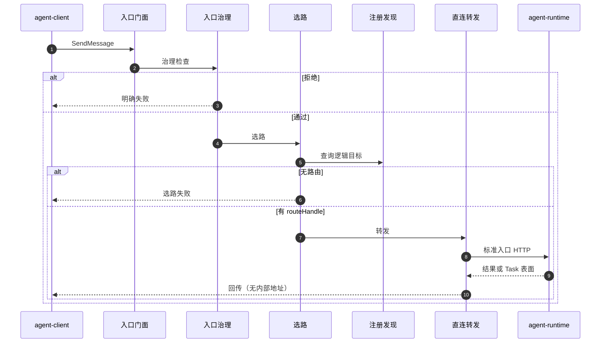
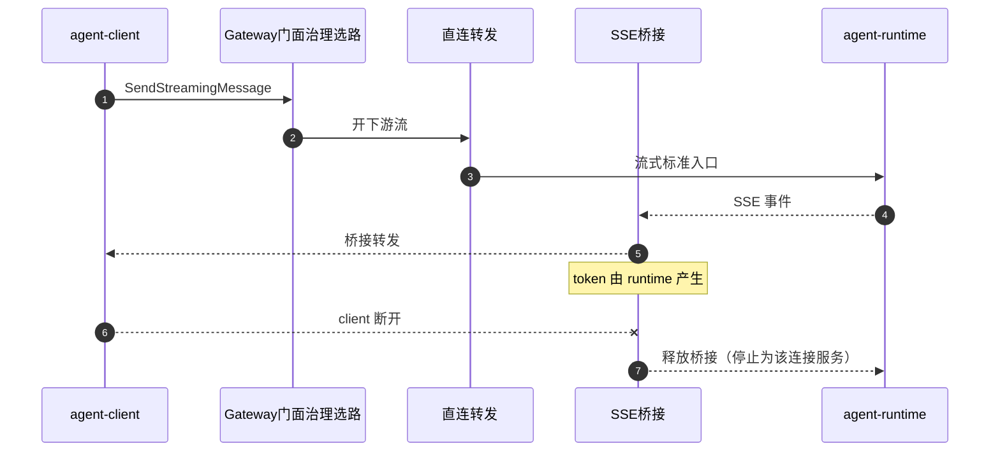

# FEAT-011 L2：客户端调用直连路由转发

本文是 **agent-gateway** 组件「直连路由转发」特性的低层设计说明，面向架构/开发/测试评审。读完本文应能回答：这个需求做什么、覆盖哪些场景、模块如何协作、与周边交什么接口、准备怎么实现与验收。

姊妹文档：[FEAT-012 总线转发](./feat-012-client-invocation-bus-forwarding.md)（经消息总线投递的另一条路径）。建议先读本文再读 012。

---

## 0. 给评审的阅读说明

### 0.1 本文解决什么问题

业务应用通过 **agent-client** 调用智能体时，不应也不应被允许直接填写内部某台机器的地址。平台需要一个统一入口：**做完约定的入口检查 → 按逻辑目标找到可路由位置 → 把调用转到真正的智能体服务（agent-runtime）**。

FEAT-011 定义的就是这条路径里的 **「直接 HTTP/SSE 转发」**（不经消息总线）。另一条「先发到消息总线再由 runtime 消费」见 FEAT-012。

### 0.2 和郭靖 version-scope 文档的关系

仓库里另有 `version-scope/FEAT-011-*.md`，写的是**对外黑盒要求**（必须/禁止做什么）。  
本文写的是 **Gateway 怎么设计与实现**。

| 若冲突 | 听谁 |
|---|---|
| 对外行为（client 看到什么、禁止暴露什么） | **version-scope** |
| 模块拆分、类/SPI、联调假设、包结构 | **本文** |

本文已把评审需要的黑盒要点写进 Charter / 场景 / 接口章，**不要求**评审先去读 version-scope 或任何附录。

### 0.3 本文结构

| 章 | 读完应知道 |
|---|---|
| 1 Charter | 责任边界与成功标准 |
| 2 场景 | 要覆盖哪些调用故事 |
| 3 4+1 | 模块、流程、包、部署假设 |
| 4 接口 | 每个场景和谁交什么 |
| 5 实现设计 | 准备怎么写代码（类/SPI/主路径） |
| 6 验收要点 | 怎么验 |
| 7 待决与假设 | 还没拍板什么、当前按什么假设往下做 |

### 0.4 术语表（人话）

| 术语 | 含义 |
|---|---|
| **Gateway / agent-gateway** | 客户端进入平台的统一治理入口组件。不跑智能体业务逻辑。 |
| **直连转发** | Gateway 选路后，用 HTTP（及需要时的 SSE）直接调用目标 runtime。本文主路径。 |
| **总线转发** | Gateway 把调用打成控制事件发到消息总线，再等状态投影；见 FEAT-012。 |
| **agent-client** | 端侧 SDK/调用方，封装 A2A 兼容请求，只访问 Gateway，不直连 runtime。 |
| **agent-runtime** | 真正执行 Agent、拥有 Task 状态的服务。Gateway 的转发目标。 |
| **RDC / 注册发现中心** | 根据逻辑目标（如 agentId）给出可路由引用的组件。Gateway 调用期查询它，**不做**注册上架主体。 |
| **Event Bus / 消息总线** | 发布订阅通道。011 **不使用**；012 使用。 |
| **Task** | 一次智能体调用在 runtime 侧的任务实体。权威状态只在 runtime；Gateway 不写 Task 库。 |
| **routeHandle** | 选路结果：受治理的**不透明**路由引用。可在 Gateway 内解析为可达地址，**禁止**返回给 client。 |
| **clientInvocationId** | client 生成的弱关联 ID，主要用于「还不知道有没有建成功 Task」时的重试恢复。**不能**代替 taskId。 |
| **taskId** | runtime 创建 Task 后的正式句柄。查询/取消/重订阅都必须用它。 |
| **SSE 桥接** | 流式场景下，Gateway 把 runtime 的 SSE 流转给 client；**不生成、不缓存**模型 token。 |
| **A2A** | Agent-to-Agent 风格的 JSON-RPC over HTTP + SSE 协议表面。Gateway 对 client 表现为兼容的服务端入口。 |
| **E2E-0x** | 端到端场景编号。01/02=同步/流式直连；05=选路失败；06=入口拒绝；07/08=标注场景（统一入口、端侧工具）。 |
| **FEAT-001** | runtime「标准智能体服务入口」要求。Gateway 直连时必须按它的语义转发，不能另搞私有执行口。 |

---

## 1. Charter（责任说明书）

### 1.1 使命

在「客户端统一协议、统一治理下调用存量与新智能体」的目标中，**agent-gateway** 在 FEAT-011 下的不可替代责任是：

> 作为 C/S 统一治理入口的一部分：完成已约定的入口治理，按逻辑目标向注册发现中心选路，再将调用 **直接转发** 到目标 agent-runtime 的标准服务入口；流式场景下桥接服务端 SSE——**不执行**智能体业务逻辑，**不拥有** Task 权威状态，**不做**注册上架主体。

### 1.2 做范围内（In Scope）

| 编号 | 能力 | 对应场景 | 说明 |
|---|---|---|---|
| IN-1 | 同步直接路由转发 | E2E-01 | client 阻塞等待；Gateway HTTP 调 runtime 后回传 |
| IN-2 | 流式直接路由转发（SSE 桥接） | E2E-02 | 同一入口形态；token 由 runtime 产生 |
| IN-3 | 按逻辑目标选路 | 01/02/05/07/08 | 依赖 RDC；对 client 隐藏内部地址 |
| IN-4 | 入口治理（仅需求已写明项） | E2E-06 | 如鉴权、租户、基础校验、幂等、审计——**未写明的不做** |
| IN-5 | 选路/治理失败时明确失败 | E2E-05/06 | 不伪造成功投递 |
| IN-6 | 查询 / 取消 / 重订阅转发 | 辅助 | 基于 runtime 的 taskId |
| IN-7 | UNKNOWN 后同键恢复 | 辅助 | 未确认建 Task 且尚无 taskId 时 |
| IN-8 | 存量与新目标同一调用入口形态 | E2E-07（标注） | 调用期；注册不归 Gateway |
| IN-9 | 端侧工具多轮透传（旁证） | E2E-08（标注） | 只转发，不执行工具；是否本版本必验见 §7 |

### 1.3 明确不做（Out of Scope）

| 编号 | 不做 | 原因 / 归属 |
|---|---|---|
| OUT-1 | 执行推理、工具、记忆、业务 Agent | 属于 runtime / 中间件 |
| OUT-2 | 写入 Task 存储或决定 Task 终态 | Task 权威在 runtime |
| OUT-3 | 在 Gateway 内「拉起 agent 实例」 | runtime |
| OUT-4 | 维护注册目录 / 存量上架 | RDC + 服务提供方 |
| OUT-5 | 经消息总线传 token / 大正文 | 总线路径见 012，且亦不允许 |
| OUT-6 | 绕过 runtime 标准入口的私有执行协议 | 破坏统一入口 |
| OUT-7 | 解析端侧工具业务语义并本地执行 | client 本地执行 |
| OUT-8 | 智能体服务之间经总线的 A2A（另一特性） | 非 011/012 主交付 |

### 1.4 成功标准（可观察）

| 编号 | 标准 |
|---|---|
| S1 | 同步直连：合法请求能到达目标 runtime 并返回可消费结果或已接受 Task 表面 |
| S2 | 流式直连：能桥接 SSE；Gateway 不生成、不缓存 token；client 断开后释放桥接 |
| S3 | 无路由或治理拒绝时返回明确失败，且不暴露内部 endpoint / routeHandle 明文 |
| S4 | 治理项仅覆盖需求已写明部分 |
| S5 | Gateway 不写 Task 库、不执行 Agent、不做注册上架 |

### 1.5 周边角色一览（给评审的地图）

```text
业务 / agent-client
        │  A2A 兼容请求（只认 Gateway 地址）
        v
   agent-gateway（本文）
        │ 选路查询          │ HTTP/SSE 直连
        v                   v
  注册发现中心(RDC)     agent-runtime（Task 主人）
```

| 角色 | 和 Gateway 的关系 |
|---|---|
| agent-client | 上游调用方；只访问 Gateway |
| RDC | 调用期选路真相；Gateway 查询「逻辑目标 → 不透明路由引用」 |
| agent-runtime | 直连与 SSE 桥接目标；拥有 Task |
| Event Bus | **本特性不经过** |
| 消息总线消费方（需求 FEAT-017） | 仅总线路径需要；见 FEAT-012 |

### 1.6 能力要点（黑盒摘要）

- **必须**按明确逻辑目标（需求写明为 agentId）选路并转发。  
- **必须**统一 A2A 表面承接 SendMessage / SendStreamingMessage / GetTask / CancelTask / SubscribeToTask，按 runtime 标准入口语义转发。  
- **必须** SSE 桥接且不生成/不缓存 token。  
- **必须**查询/取消基于 taskId；clientInvocationId 不得替代 taskId。  
- **必须**在未确认是否建 Task 且无 taskId 时允许用同一 clientInvocationId + 幂等键重试；不新增私有「按 invocation 查询」接口。  
- **禁止**向 client 暴露物理 endpoint、routeHandle 解析细节、内部实例地址。

---

## 2. 场景梳理

### 2.1 场景总表

| 场景 ID | 一句话 | 本特性主责？ | 成功时大致怎样 | 失败时大致怎样 |
|---|---|---|---|---|
| **E2E-01** | 同步 · 直连 | **是** | 治理→选路→HTTP 调 runtime→同步结果回 client | 治理拒绝 / 无路由 / 下游错误 |
| **E2E-02** | 流式 · 直连 | **是** | 同上，但开 SSE 并桥接 | 建流前同 01；流中断可观察 |
| **E2E-05** | 选路失败 | **是** | — | 明确失败；**不**调 runtime |
| **E2E-06** | 入口拒绝 | **是** | — | 明确失败；**不**选路、不调 runtime |
| E2E-07 | 新旧目标同一入口 | 标注 | 调用路径同 01/02；注册不经 Gateway | — |
| E2E-08 | 端侧工具多轮 | 标注 | 透传意图/续跑；工具在 client 执行 | 同底层路径 |
| E2E-03/04 | 经总线 | **否**（见 012） | — | — |

**深度场景**：01/02/05/06 —— 本版本设计与验收应写透。  
**标注场景**：07/08 —— 约束清楚即可；08 是否本版本必验见 §7。

### 2.2 与总线路径的关系

对业务方而言，理想情况是 **不感知**走了直连还是总线。  
「谁决定走 011 还是 012」尚未最终拍板（配置 / 策略 / 请求头等），见 §7。实现上预留路径选择口，**MVP 可配置为固定走直连**。

### 2.3 E2E-01 — 同步 · 直连

**业务背景：** client 发起一次阻塞调用，希望尽快拿到结果或「已接受任务」的引用。

**前置条件：**

1. 目标智能体已在注册发现侧可路由。  
2. client 能访问 Gateway，并携带逻辑目标（需求要求创建类调用带 agentId；字段细节若有争议见 §7）。  
3. 建议携带幂等键；可携带 clientInvocationId。

**步骤：**

1. client 向 Gateway 统一入口发送 SendMessage 语义请求。  
2. Gateway 做入口治理（鉴权、租户、基础校验、幂等等已写明项）。  
3. Gateway 向 RDC 查询得到 routeHandle（不透明）。  
4. Gateway 按 runtime 标准入口语义 HTTP 转发到目标。  
5. runtime 处理并返回；Gateway 将结果（或已接受 Task 表面）回给 client。  
6. 全程不向 client 返回内部地址或 routeHandle 明文。

**成功可观察：**

- client 收到可消费的同步结果，或已接受 Task 的引用/快照。  
- 响应中无内部 endpoint、实例、routeHandle 明文。  
- 若已拿到 taskId，**不得**再把该次调用标成「未知是否创建」。

**失败可观察：**

- 治理失败：认证/授权等错误，不进入选路。  
- 无可用路由：明确路由类失败，不调用 runtime。  
- 下游确定错误：透传或有限映射为可编程错误，不伪造成功 Task。

**Gateway 不做：** 不执行 Agent；不写 Task 库；不经消息总线。

### 2.4 E2E-02 — 流式 · 直连

**业务背景：** client 需要边执行边观察（SSE）。

**前置：** 同 E2E-01，且目标支持 A2A SSE / streaming。

**步骤：**

1～3 同 E2E-01（治理、选路）。  
4. Gateway 向 runtime 发起 SendStreamingMessage（或等价流式入口）。  
5. Gateway **桥接** runtime→client 的 SSE；token 内容由 runtime 产生。  
6. 直到 Task 终态、中断、下游流错误，或 **client 断开**。  
7. client 断开时，Gateway **释放**为该连接服务的桥接，不在后台继续消费并缓存 token。

**成功可观察：** 有序 SSE；Gateway 不生成/不缓存 token。  
**失败可观察：** 建流前同 01；流中断对 client 可见；若已有 taskId，允许后续查询或重订阅。

### 2.5 E2E-05 — 选路失败

**步骤：** 治理通过 → 查 RDC → **无可用路由** → 立即失败返回。  
**禁止：** 不调用 runtime；不假装已投递。

### 2.6 E2E-06 — 入口拒绝

**步骤：** 入口治理判定拒绝 → 立即失败返回。  
**禁止：** 不查 RDC；不调用 runtime。

### 2.7 辅助：查询 / 取消 / 重订阅 / UNKNOWN 恢复

| 能力 | 要点 |
|---|---|
| GetTask | client 必须带 runtime 的 taskId；Gateway 定位 Task 所有者并转发 |
| CancelTask | 同上；是否取消成功由 runtime 决定；Gateway 不伪造已取消 |
| SubscribeToTask | 基于 taskId 重新桥接 SSE；找不到 Task 时不隐式新建 |
| UNKNOWN 恢复 | 当 Gateway 无法确认 runtime 是否已建 Task，且 client 尚无 taskId 时，允许用**同一** clientInvocationId + **同一**幂等键重试原始创建类调用；**不**新增私有 ResolveInvocation 接口 |

**人话理解 UNKNOWN：**  
「我把请求发出去了（或发出去结果不明），暂时不知道对面有没有建好任务。」  
→ 告诉 client「未知」，并允许用同一业务键再试，避免乱建多个任务。  
一旦已经拿到 taskId，就**不能**再对这次调用说「未知」。

### 2.8 E2E-07 / E2E-08（标注）

| 场景 | 约束 |
|---|---|
| E2E-07 | 调用期路径 = 01 或 02；新旧目标同一入口形态；**注册/上架不经过 Gateway** |
| E2E-08 | 下行透传「需要端侧工具」类语义，上行续跑再走统一入口；工具在 **client 本地**执行；Gateway **不解析业务工具语义、不执行工具** |

---

## 3. 4+1 设计

> 模块名为实现期可调整的代号；**职责边界**不得漂出 §1。

### 3.1 场景视图（+1）

本特性验证轴：E2E-01、02、05、06；（标注）07、08。

### 3.2 逻辑视图

```text
                    agent-client
                         │
                         │ 统一 A2A 入口
                         v
              ┌──── agent-gateway ────┐
              │  入口门面 (M-FAC)      │
              │       │               │
              │  入口治理 (M-GOV)      │
              │       │               │
              │  选路客户端 (M-RTE) ───┼──► RDC
              │       │               │
              │  直连转发器 (M-DIR) ───┼──► agent-runtime（HTTP）
              │       │               │
              │  SSE 桥接器 (M-SSE) ◄──┼──► agent-runtime（SSE）
              │       │               │
              │  可观测 (M-OBS)        │
              └───────────────────────┘
```

| 模块代号 | 人话职责 |
|---|---|
| M-FAC 入口门面 | 对外接收 A2A 兼容请求，按方法分发到同步/流式/查询/取消等 |
| M-GOV 入口治理 | 只做需求已写明的鉴权、租户、校验、幂等、审计等；失败则拒绝 |
| M-RTE 选路客户端 | 问 RDC 要 routeHandle；失败则 E2E-05 |
| M-DIR 直连转发器 | 按标准入口语义 HTTP 转发；流式时打开下游流 |
| M-SSE SSE 桥接器 | 把下游 SSE 桥给 client；断开释放 |
| M-OBS 可观测 | 审计与路由轨迹；不改变业务语义 |
| （路径选择） | 决定走直连还是总线；MVP 可固定直连，详见 §5 / §7 |

**边界：** 框内不执行 Agent、不持 Task 权威、不做注册上架。

### 3.3 过程视图

#### E2E-01 同步直连



#### E2E-02 流式直连



#### E2E-05 / E2E-06

- **05：** 治理通过 → 选路失败 → 返回；序列在「查询 RDC」后结束，无 runtime 调用。  
- **06：** 治理拒绝 → 返回；序列在治理后结束，无 RDC、无 runtime。

### 3.4 开发视图（包结构假设）

```text
agent-gateway/
├── facade/        # 入口门面：JSON-RPC 解析与方法分发
├── governance/    # 入口治理
├── routing/       # 选路客户端 + RouteHandle
├── direct/        # 直连 HTTP / 开下游流
├── sse/           # SSE 桥接与释放
├── path/          # 直连 vs 总线路径选择
└── obs/           # 审计 / route trace
```

代码落点以仓库实际为准（常见为 `agent-solution/common/agent-gateway/**`）。上表是职责切片，类名可改。

### 3.5 物理视图（部署假设）

| 项 | 当前态度 |
|---|---|
| Gateway 是否独立进程 | 有协作方草稿主张独立进程；**平台尚未拍死**。实现按「可独立部署」设计，不写死必须与某组件同进程。 |
| 与 runtime 网络 | 必须能访问目标的标准 A2A HTTP/SSE |
| 与 RDC 网络 | 必须能完成选路查询 |
| 消息总线 / RocketMQ | **本特性不依赖** |

---

## 4. 接口设计

### 4.1 接口总表

| 边 | 对端 | 目的 | 同步/异步 | 数据所有权 |
|---|---|---|---|---|
| I-01 | agent-client ↔ Gateway | 统一 A2A 入口 | 同步或 SSE | 经治理后转发；不持 Task |
| I-02 | Gateway → RDC | 选路 | 偏同步 | 目录在 RDC |
| I-03 | Gateway → runtime | 直连投递 | HTTP 同步 | Task 在 runtime |
| I-06 | Gateway ↔ runtime | SSE 桥接 | 长连接 | 流在 runtime |
| I-07 | 多轮工具相关 | 透传 | 多轮请求 | Task 在 runtime |

本特性 **不使用** Gateway↔Event Bus 边（见 FEAT-012）。

### 4.2 按场景用到的边

| 场景 | 用到的边 |
|---|---|
| E2E-01 | I-01, I-02, I-03 |
| E2E-02 | I-01, I-02, I-03, I-06 |
| E2E-05 | I-01, I-02（失败） |
| E2E-06 | I-01（失败） |
| 查询/取消/重订阅 | I-01 + I-02/定位 + I-03 或 I-06 |
| E2E-08 | 同上 + I-07 透传 |

### 4.3 I-01 client ↔ Gateway（要点）

| 项 | 内容 |
|---|---|
| 方向 | client → Gateway（响应/SSE 返回） |
| 输入（创建类） | A2A 兼容；须逻辑目标（需求写 agentId）；应带幂等键；可带 clientInvocationId |
| 输出 | A2A 兼容响应、错误或 SSE |
| 约束 | **禁止**暴露 runtime endpoint、routeHandle 明文、内部实例、私有执行口 |
| 字段状态 | 目标标识等细节若与澄清记忆冲突，**暂定跟需求书面 agentId**，争议见 §7 |

### 4.4 I-02 Gateway → RDC（要点）

| 项 | 内容 |
|---|---|
| 语义 | 逻辑目标 → 不透明 routeHandle |
| 失败 | 无路由 → E2E-05 |
| 字段状态 | 新注册发现设计与旧设计文档尚未统一跟哪份；**实现必须通过可替换选路客户端**，不把某一版 JSON 写死进核心（见 §7） |

### 4.5 I-03 / I-06 Gateway → runtime（要点）

| 项 | 内容 |
|---|---|
| 语义 | 对齐 runtime **标准智能体服务入口**（FEAT-001）：`POST /a2a` 等；SendMessage / SendStreamingMessage / GetTask / CancelTask / SubscribeToTask |
| 流式 | SSE event 名 `jsonrpc`；data 为 JSON-RPC envelope；Gateway 只桥接 |
| 禁止 | 为 Gateway 另开一套私有执行协议 |
| 错误 | 非法 JSON / 未知方法等按 JSON-RPC 表面；Gateway 自身治理/选路错误不得伪装成「已成功建 Task」 |

### 4.6 行为承诺（必须 / 禁止 / 允许）

- **必须**先治理再选路再转发。  
- **必须**对 client 隐藏内部拓扑。  
- **必须**在已获得 taskId 后禁止再报 UNKNOWN。  
- **禁止**写 Task 库、执行 Agent、断开后缓存 token。  
- **允许** MVP 固定走直连路径。

---

## 5. 实现设计（详细实现）

### 5.1 模块到端口映射

| 模块 | 拟议端口 / 类职责 |
|---|---|
| M-FAC | 解析 JSON-RPC，按 method 分发 |
| M-GOV | `GovernanceFilter`：通过或拒绝 |
| M-RTE | `RdcRouteClient` + `RouteHandle` |
| M-DIR | `DirectRuntimeClient` |
| M-SSE | `SseBridge` |
| 路径 | `PathSelector`：DIRECT / BUS |

### 5.2 SPI（契约骨架）

```java
/** 选路：逻辑目标 → 不透明路由引用。 */
public interface RdcRouteClient {
    /** 无可用路由时抛出路由失败，对应 E2E-05 */
    RouteHandle resolve(RouteQuery query);
}

/** 不透明路由引用；禁止序列化给 client。 */
public interface RouteHandle {
    String opaqueId();
}

/** 直连：按标准入口语义转发。 */
public interface DirectRuntimeClient {
    A2aJsonRpcResponse sendMessage(RouteHandle route, A2aJsonRpcRequest req);
    DownstreamSseSource openStreaming(RouteHandle route, A2aJsonRpcRequest req);
    A2aJsonRpcResponse getTask(RouteHandle route, String taskId);
    A2aJsonRpcResponse cancelTask(RouteHandle route, String taskId);
    DownstreamSseSource subscribeToTask(RouteHandle route, String taskId);
}

/** SSE 桥接：client 存活期间转发；断开必须释放。 */
public interface SseBridge {
    void bridge(ClientSseSink client, DownstreamSseSource downstream);
    void release(BridgeSessionId id);
}

/** 直连 vs 总线。未拍板前可配置固定 DIRECT。 */
public interface PathSelector {
    enum InvocationPath { DIRECT, BUS }
    InvocationPath select(GatewayRequestContext ctx);
}
```

### 5.3 主路径伪流程（同步直连）

```text
handleSendMessage(req):
  1. ctx = FAC.parse(req)
  2. decision = GOV.check(ctx)
     if deny -> return governanceError  // E2E-06
  3. if PathSelector.select(ctx) != DIRECT -> 交给总线模块（FEAT-012）
  4. route = RTE.resolve(ctx.target)
     if not found -> return routeError   // E2E-05
  5. resp = DIR.sendMessage(route, ctx.a2aRequest)
  6. OBS.audit(ctx, route.opaqueId(), outcome)
  7. return sanitizeForClient(resp)      // 去掉内部地址
```

### 5.4 主路径伪流程（流式直连）

```text
handleSendStreaming(req, clientSink):
  1～4 同同步（治理、选路）
  5. downstream = DIR.openStreaming(route, ctx.a2aRequest)
  6. session = SSE.bridge(clientSink, downstream)
  7. on client disconnect -> SSE.release(session)
```

### 5.5 治理 / 选路 / 桥接细则

| 模块 | 实现要点 |
|---|---|
| 治理 | 只实现需求已写明项；未写明能力不要「顺手做网关全家桶」 |
| 选路 | 核心只依赖 `RdcRouteClient`；具体适配器可对接新/旧注册发现实现 |
| 桥接 | 禁止生成 token；禁止断开后继续拉流缓存；重订阅走 SubscribeToTask |

### 5.6 配置模型（占位）

```yaml
openjiuwen.gateway:
  path-mode: direct          # direct | bus | auto（auto 依赖路径切换拍板）
  routing:
    # 选路客户端由 SPI/Bean 注入；此处仅超时等
    connect-timeout: 3s
  direct:
    forward-timeout: 60s
    streaming-idle-timeout: 5m
  sse:
    release-on-client-disconnect: true
```

### 5.7 错误映射（实现提示）

| 场景 | Gateway 行为 | client 大致看到 |
|---|---|---|
| 认证/授权失败 | 治理拒绝 | 认证/授权错误 |
| 无可用路由 | 选路失败 | 路由不可用类错误 |
| 下游确定错误 | 透传或有限映射 | 可编程确定失败 |
| 未确认建 Task | 按策略返回未知 | UNKNOWN；可同键重试 |
| 已有 taskId 但阻塞未完成 | 不得 UNKNOWN | 已接受 Task / 快照 |
| 流中断 | 暴露流错误 | 可查询/重订阅（若有 taskId） |

精确错误码表可后补；底线是 **可区分、不泄露内部拓扑**。

### 5.8 与其它草稿代码的边界

仓库历史上存在已关闭、未合入的实验 PR，其中含 Gateway 相关草稿类。  
**本需求默认按本文模块与 SPI 新建实现**，不默认把那些草稿类当成既定归属。若要复用，需与相关负责人书面划清责任田后再引用。

### 5.9 建议开工顺序

1. 包结构 + 入口门面方法分发骨架  
2. 治理拒绝短路（E2E-06）  
3. 选路 SPI + 假实现/录制桩  
4. 直连同步转发  
5. SSE 桥接 + 断开释放  
6. 与 client 联调（字段随 §7 收敛）  

---

## 6. 验收要点

> 下列为评审与联调清单（Given-When-Then）。自动化脚本可另建，不在本文展开。

### 6.1 E2E-01（P0）

| # | Given | When | Then |
|---|---|---|---|
| T-01-1 | 目标可路由；治理通过 | SendMessage | 可消费结果或已接受 Task；无内部地址 |
| T-01-2 | 同左 | 下游确定错误 | 明确失败；无伪造成功 |
| T-01-3 | 已返回 taskId | 阻塞未完成 | **不得**再报 UNKNOWN |

### 6.2 E2E-02（P0）

| # | Given | When | Then |
|---|---|---|---|
| T-02-1 | 目标支持 SSE | SendStreamingMessage | 有序 SSE；内容来自 runtime |
| T-02-2 | 桥接已建立 | client 断开 | 释放桥接；不后台缓存 token |
| T-02-3 | 已有 taskId | SubscribeToTask | 重新桥接；找不到不新建 Task |

### 6.3 E2E-05 / 06（P0）

| # | Given | When | Then |
|---|---|---|---|
| T-05-1 | RDC 无路由 | 创建类调用 | 明确失败；无 runtime 请求 |
| T-06-1 | 鉴权失败（已写明项） | 任意调用 | 拒绝；无 RDC/runtime 调用 |

### 6.4 查询 / 取消 / UNKNOWN（P0）

| # | Then |
|---|---|
| T-Q-1 | GetTask 必须基于 taskId；clientInvocationId 不能替代 |
| T-C-1 | CancelTask 转发；不伪造 canceled |
| T-U-1 | UNKNOWN 后同 clientInvocationId+幂等键可恢复；无私有 ResolveInvocation |

### 6.5 标注（P1/P2）

| # | 场景 | Then |
|---|---|---|
| T-07-1 | E2E-07 | 同一 facade；Gateway 无注册 API |
| T-08-1 | E2E-08 | 工具透传；Gateway 不执行工具（是否必验见 §7） |

### 6.6 建议单测切片

- 治理拒绝时不调用选路/直连 mock  
- 选路失败时不调用直连 mock  
- client 取消时 `SseBridge.release` 被调用  
- 路径选择为直连时不触发总线发布端口  

---

## 7. 待决问题与工作假设

下列项**尚未与协作方最终书面冻结**。开发可以按「假设」往前做骨架，但联调/字段冻结前必须对齐。括号内为内部追踪编号，方便会议纪要。

| 人话问题 | 影响 | 建议找谁 | 当前工作假设 |
|---|---|---|---|
| 选路跟「新的注册发现设计」还是「旧文档/旧接口」？ | 选路响应字段 | 注册发现负责人 | 核心只依赖选路 SPI，适配器可换（Q-09） |
| client 逻辑目标字段是否就是 agentId？协议何时上库？ | facade 字段 | client 负责人 + 需求分析 | 暂按需求书面 agentId；用适配层容纳差异（Q-13） |
| 谁决定走直连还是总线？ | 运维与双路径 | 需求分析 / 架构 | MVP 配置固定 `direct`（Q-04） |
| 治理清单 730 要勾哪些？ | E2E-06 范围 | 需求分析 | 只做 version-scope 已写明项（Q-10） |
| UNKNOWN / 端侧工具是否本版本必验？ | 验收范围 | 测试 + 需求分析 | 01/02/05/06 必验；08 默认非必验直至拍板（Q-01/Q-12） |
| 选路失败错误码最终形态？ | 错误表 | 待定 | 先保证可区分、不泄拓扑（Q-08） |
| 实验 PR 里 Gateway 草稿是否复用？ | 重复实现风险 | 总线相关负责人 | **默认不复用**，要对齐再引（C6） |

### 7.1 显式非承诺

- 不在本文把消息总线拓扑、未合入协议字段写成「已既定」。  
- 不宣称「选路联调完成」，直到选路跟哪份文档有书面结论或暂定记录。

---

## 8. 关联阅读（可选）

| 文档 | 何时看 |
|---|---|
| [FEAT-012 L2](./feat-012-client-invocation-bus-forwarding.md) | 需要理解总线路径时 |
| 仓库 `version-scope/FEAT-011-*.md` | 需要核对黑盒原文时 |
| 仓库 `version-scope/FEAT-001-*.md` | 需要核对 runtime 标准入口原文时 |

状态：**draft** · 可供评审 · 可按 §5.9 开工骨架。
