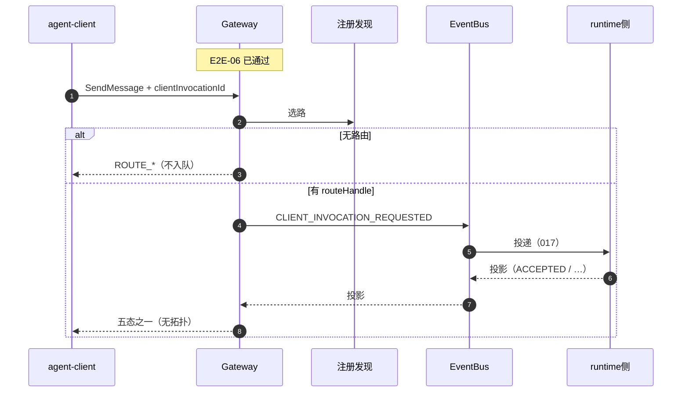
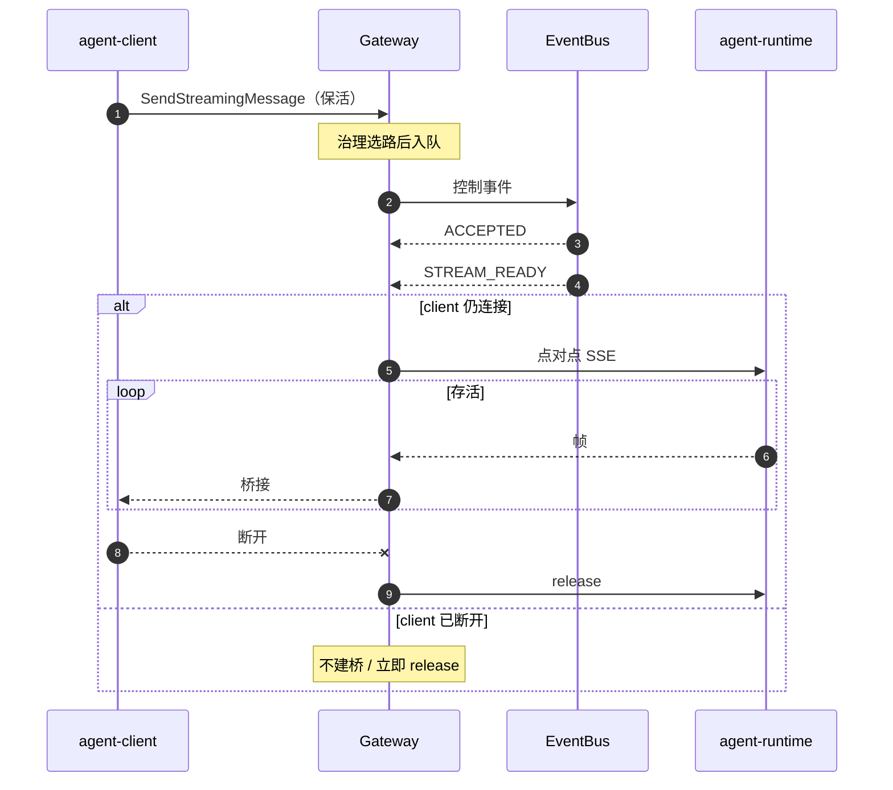

# FEAT-012 L2：客户端调用总线转发

本文是 **agent-gateway** 组件「客户端调用经消息总线转发」的低层设计。说明责任边界、场景、与 Bus / runtime 交互、实现要点与验收。

姊妹文档：[FEAT-011 直连路由转发](./feat-011-client-invocation-route-forwarding.md)。**先读 011**（统一入口、E2E-06 治理、SSE 桥接纪律），再读本文。本文只写与直连的**差量**：控制事件入队、投影等待、五态交付；流式在「流可订阅」后仍走点对点 SSE（**token 不进总线**）。

---

## 0. 阅读说明

### 0.1 本文解决什么问题

部分部署希望客户端调用先进入 **Event Bus**：Gateway 在治理与选路通过后，发布「请处理本次调用」的**控制事件**；runtime 侧（FEAT-017 等）消费后进入与标准入口等价的 Task 控制面，并回发**状态投影**；Gateway 在等待窗口内把投影折叠成对 client 可消费的同步结果。

若是流式：控制面仍走总线；在观察到「流可订阅」且 **client 连接仍在**时，Gateway 再与 runtime 建立 **点对点 SSE** 桥接。总线**不**承载 token、SSE 帧或大正文。

本文对应 **FEAT-012**。直接 HTTP/SSE 转发见 FEAT-011。

### 0.2 与需求文档的关系

| 层面 | 文档 |
|---|---|
| 对外行为与版本承诺 | `version-scope` 中的 FEAT-012（及其中引用） |
| 设计与实现（模块、场景验收） | 本文 |
| 入口治理细则（G1～G5） | **FEAT-011 §3**（本文不重复展开） |

冲突时：对外行为以 version-scope 为准；模块与实现细节以本文为准。

### 0.3 文档结构

| 章 | 内容 |
|---|---|
| §0 | 问题背景、术语、工作假设、关联文档 |
| §1 | 组件 Charter、场景总表 |
| §2 | **横向**共享：相对 011 的差量（总线模块、接口边、配置） |
| §3 | E2E-06 在总线路径上的附加约束（回链 011） |
| §4～§5 | E2E-03 / 04 主路径（同步 / 流式 · 总线） |
| §6 | E2E-05 选路失败（不入队） |
| §7 | 创建之后的操作与恢复（总线差量） |
| §8 | 标注场景 E2E-07 / 08 |

### 0.4 术语

与 [FEAT-011 §0.4](./feat-011-client-invocation-route-forwarding.md) 共用 Gateway / client / runtime / RDC / routeHandle / taskId / SSE / E2E-06 等。本文额外：

| 术语 | 含义 |
|---|---|
| **总线转发** | 治理选路后经 Event Bus 控制事件送达；同步靠投影折叠回传；流式靠 STREAM_READY 后点对点 SSE。 |
| **控制事件** | Gateway → Bus：创建 / 取消 / 查询 / 订阅流等意图。 |
| **投影事件** | Bus → Gateway（由 runtime 侧发布）：已接受、拒绝、失败、完成响应、流可订阅、等待输入、终态等。 |
| **五态** | 同步等待窗口内对 client 的折叠结果：完成响应 / 已接受任务 / 拒绝 / 失败 / 未知。 |
| **STREAM_READY** | 「流可订阅」投影；与「已接受 Task」可分离，不得混用。 |
| **payloadRef** | 大正文不进总线事件体，只放引用。 |
| **FEAT-017** | runtime 侧订阅消费与回投影的对端要求；**消费实现不在本特性交付范围**，联调依赖其对端就绪。 |

### 0.5 工作假设（联调前可改）

| 项 | 假设 |
|---|---|
| 入口与治理 | 与 011 同一 facade、同一 E2E-06；路径选择为 BUS（见 011 §2.5） |
| 事件名 | 下文使用工作名（如 `CLIENT_INVOCATION_REQUESTED`）；与 version-scope / 总线契约冻结后可改名，语义不变 |
| clientInvocationId | 总线创建类**必须**携带（窗口关联与 UNKNOWN 恢复） |
| FEAT-017 | 联调前假定对端能消费控制事件并回投影；本文不实现消费侧 |
| Broker 拓扑 | 不拍死唯一 MQ 方案；可配置 |
| 与 011 切换 | 对 client 不可见 |

### 0.6 关联文档

| 文档 | 说明 |
|---|---|
| [FEAT-011 L2](./feat-011-client-invocation-route-forwarding.md) | 统一入口、治理、SSE、直连对照 |
| `version-scope/FEAT-012-…` | 对外行为 |
| FEAT-017 / 总线 outbox 相关设计 | 消费与投递底座（对端） |
| agent-runtime Feat-Func-001 | 标准入口语义（消费侧应对齐） |

---

## 1. Charter 与场景总表

### 1.1 使命

> 在统一治理入口上，将客户端调用以 **经消息总线** 的方式送达目标服务：Gateway 完成治理与选路后发布控制事件，在等待窗口内消费状态投影并向 client 交付；流式在收到「流可订阅」且连接存活时，**点对点**桥接 runtime SSE——总线 **不**承载 token、SSE 帧或大正文。

### 1.2 做范围内（In Scope）

| 编号 | 能力 | 对应场景 | 说明 |
|---|---|---|---|
| IN-1 | 同步 · 经总线 | E2E-03 | 控制入队 + 投影 → 五态 |
| IN-2 | 流式 · 总线控制面 + SSE | E2E-04 | STREAM_READY 后桥接；token 不进 Bus |
| IN-3 | 入队前治理与选路 | 03/04/05/06 | 拒绝或无路由则**不入队** |
| IN-4 | 控制事件生产、投影消费 | 全文 | Gateway 侧 |
| IN-5 | 同步等待窗口五态 | E2E-03 | 完成 / 已接受 / 拒绝 / 失败 / 未知 |
| IN-6 | 取消等控制最终落到 runtime CancelTask | §7 | 不能只在总线侧「标取消」 |
| IN-7 | 与 011 同一 facade | 全体 | client 不感知路径 |

### 1.3 明确不做（Out of Scope）

| 编号 | 不做 | 归属 |
|---|---|---|
| OUT-1 | 执行 Agent / 写 Task 权威库 | runtime |
| OUT-2 | 总线传 token / SSE 帧 / 大对象正文 | 禁止 |
| OUT-3 | 实现 runtime 侧总线消费 | FEAT-017 |
| OUT-4 | 拍死唯一 Broker/进程拓扑 | 配置 / 平台 |
| OUT-5 | 注册上架主体 | RDC 等 |
| OUT-6 | 直连 HTTP 主路径 | FEAT-011 |

### 1.4 成功标准

| 编号 | 标准 |
|---|---|
| S1 | 同步经总线：窗口内得到五态之一；响应无 topic / worker / endpoint / routeHandle 明文 |
| S2 | 流式：控制面成功且 STREAM_READY 后桥接；总线侧无 token |
| S3 | 治理拒绝或选路失败时**不入队** |
| S4 | Gateway / Bus 不拥有 Task 权威终态；有 taskId 后不得报创建未知 |

### 1.5 周边角色

```text
agent-client
    │ I-01 A2A
    v
agent-gateway
    │ I-02 选路          │ I-04 控制 / 投影
    v                    v
   RDC              Event Bus
                         │
                         │ 消费（FEAT-017，非本模块实现）
                         v
                   agent-runtime
                         ^
                         │ I-06 流式：点对点 SSE（不经 Bus）
                         │
                   agent-gateway (SSE)
```

| 角色 | 关系 |
|---|---|
| Event Bus | 承载控制与投影；不承载 token |
| runtime + FEAT-017 | 消费控制、进 Task 控制面、发投影 |
| RDC | 入队前选路（同 011） |

### 1.6 能力要点

- 创建类须带 `clientInvocationId`；宜带创建幂等键（与 011 G4 一致）。  
- 须能发布创建类控制事件；A2A 大正文用 payload 或 **payloadRef**。  
- 同步窗口内须能交付五态；已有 `taskId` 禁止再报未知。  
- 流式须先 STREAM_READY 再桥接；已接受 ≠ 可桥接。  
- 取消控制事件须最终映射到持有 Task 的 CancelTask。

### 1.7 场景总表

| 编号 | 名称 | 章节 | 说明 |
|---|---|---|---|
| E2E-06 | 入口治理 | §3（+ 011 §3） | 拒绝则不入队 |
| E2E-03 | 同步 · 总线 | §4 | 本特性主路径 |
| E2E-04 | 流式 · 总线 | §5 | 控制面 + SSE |
| E2E-05 | 选路失败 | §6 | 不入队 |
| — | 创建后操作 / UNKNOWN | §7 | 总线差量 |
| E2E-07 / 08 | 标注 | §8 | 同 011 约束，路径选 03/04 |

阅读顺序：011 §3 → 本文 §2 → §3 → §4 / §5 → §6。

---

## 2. 共享设计（横向 · 相对 011 的差量）

统一入口、治理管道顺序、包中的 facade / governance / routing / sse / obs：**复用 FEAT-011 §2**。本章只固定总线路径增量。

### 2.1 调用链（总线）

```text
I-01 入站
  → E2E-06 治理（失败则停：不选路、不入队）
  → 路径选择 = BUS
  → 选路（失败 → E2E-05：不入队）
  → 发布控制事件（I-04）
  → 等待投影 → 五态回传（E2E-03）
     或 STREAM_READY → SSE 桥接（E2E-04）
```

| 规则 | 说明 |
|---|---|
| 拒绝不入队 | 治理失败禁止 `CLIENT_INVOCATION_REQUESTED` 等出站 |
| 无路由不入队 | 同 E2E-05 |
| token 不进 Bus | 流式只走 I-06 |
| 拓扑不对 client 可见 | 含 topic / 消费者组 / endpoint / routeHandle |

### 2.2 逻辑模块增量

在 011 包切片上增加：

```text
agent-gateway/
├── …（facade / governance / routing / sse / path / obs 同 011）
├── bus/
│   ├── control/     # 控制事件发布
│   ├── projection/  # 投影订阅与关联（clientInvocationId / taskId）
│   └── wait/        # 同步等待窗口与五态折叠
└── direct/          # 本路径主流程不走；owner 定位或回退时可选
```

| 模块 | 主责 | 不负责 |
|---|---|---|
| bus/control | 组装并发布控制事件 | 消费侧逻辑 |
| bus/projection | 接收投影、按关联键匹配等待中的调用 | 决定 Task 终态权威 |
| bus/wait | 窗口超时、五态折叠 | 执行 Agent |
| sse | STREAM_READY 后的桥接与 release | 经 Bus 传 token |

### 2.3 接口边总表

| 边 | 对端 | 目的 | 012 |
|---|---|---|---|
| I-01 | client ↔ Gateway | 统一 A2A | 使用（同 011） |
| I-02 | Gateway → RDC | 选路 | 使用（入队前） |
| I-03 | Gateway → runtime HTTP | 同步直连 | **主路径不用**；辅助定位可选 |
| **I-04** | Gateway ↔ Event Bus | 控制发布 / 投影接收 | **本特性主边** |
| I-05 | Bus → runtime 消费 | 投递控制事件 | 对端 FEAT-017；非本模块实现 |
| I-06 | Gateway ↔ runtime SSE | 流式桥接 | E2E-04 / 重订阅 |
| I-07 | 工具透传 | 多轮 | E2E-08 |

| 场景 | 主要用边 |
|---|---|
| E2E-06 拒绝 | 仅 I-01；无 I-04 |
| E2E-03 | I-01, I-02, I-04 |
| E2E-04 | I-01, I-02, I-04, I-06 |
| E2E-05 | I-01, I-02；无 I-04 |

### 2.4 配置模型（占位）

```yaml
openjiuwen.gateway:
  path-mode: bus             # 或由策略选择；client 不可见
  bus:
    publish-timeout: 3s
    sync-wait-window: 60s    # 五态等待
    projection-subscribe: …  # 实现期对齐
  sse:
    release-on-client-disconnect: true
```

### 2.5 部署假设

| 项 | 态度 |
|---|---|
| Gateway | 可独立部署；须能访问 RDC、Bus、（流式时）runtime SSE |
| Event Bus | 本特性运行依赖；拓扑可配置 |
| Task 权威 | 仍在 runtime |

---

## 3. 场景：E2E-06 — 入口治理（总线附加）

治理能力清单、G1～G5、对 client 约束：**整章以 [FEAT-011 §3](./feat-011-client-invocation-route-forwarding.md) 为准**。本节只补总线路径必须守住的差量。

### 3.1 要做什么（差量）

| 项 | 内容 |
|---|---|
| 目标 | 与 011 相同的入口治理；**拒绝时保证不入队** |
| 额外 In | 出站控制事件前的放行闸 |
| 额外 Out | 在治理失败时「先入队再丢弃」 |

### 3.2 附加约束

| 分支 | 总线路径 |
|---|---|
| 治理拒绝 | 不选路、不调 runtime、**不向 Bus 发布**创建类控制事件 |
| 治理通过 | 才允许选路；事件中的 tenant / 幂等键 / 关联 ID 来自可信上下文 |

### 3.3 验收（总线附加）

| # | Given | When | Then |
|---|---|---|---|
| T-06B-1 | 鉴权/租户等应拒绝 | 创建类调用 | 无 I-04 发布（探针/ mock 断言） |
| T-06B-2 | 治理通过 | 首次控制事件 | tenant 等与可信上下文一致 |

其余 T-G1～G5 见 011 §3。

---

## 4. 场景：E2E-03 — 同步 · 总线

本场景是**单一主路径**：E2E-06 已通过、路径为 BUS、选路成功后，发布创建控制事件，在等待窗口内根据投影向 client 交付**五态之一**。不经直连 HTTP 完成主投递；不经总线传 token。

### 4.1 要做什么

| 项 | 内容 |
|---|---|
| 目标 | client 阻塞等待，内部走总线，对外仍是同步结果面 |
| In | 选路、控制入队、投影关联、五态折叠、拓扑隐藏 |
| Out | 直连主路径（011）；总线传 token；Gateway 写 TaskStore |
| 成功可观察 | 五态之一；无内部拓扑；有 taskId 后非「未知」 |
| 失败可观察 | 选路失败 → §6；入队失败 → 明确错误；窗口内无接受/拒绝/失败 → 未知（可同键重试） |

### 4.2 前置与边界

1. E2E-06 已通过；`SendMessage`；非空 `agentId`；**非空 `clientInvocationId`**；宜带创建幂等键。  
2. 路径 = BUS；RDC 可给出 routeHandle。  
3. Bus 可用；联调依赖 runtime 侧消费与投影（FEAT-017）。  

**明确不做：** 不重复治理细则；不把五态做成第二套非 A2A 状态机对外协议（对 client 仍映射为可投影的 A2A / HTTP 错误分层）。

### 4.3 主路径阶段

| 阶段 | 名称 | 做什么 |
|---|---|---|
| P1 | 选路 | 同 011：tenant + agentId → routeHandle；失败 → E2E-05 |
| P2 | 入队 | 发布 `CLIENT_INVOCATION_REQUESTED`（工作名）：关联 ID、路由引用、payload/payloadRef、可信租户等 |
| P3 | 等投影 | 在 `sync-wait-window` 内按 `clientInvocationId`（及后续 taskId）匹配投影 |
| P4 | 五态交付 | 折叠为完成 / 已接受 / 拒绝 / 失败 / 未知；sanitize 后经 I-01 回传 |

```text
E2E-06 通过 → P1 选路
  ├─ 失败 → E2E-05（不入队）
  └─ 成功 → P2 发布控制事件
           → P3 等待投影
           → P4 五态回传 client
```



#### P1 — 选路

同 FEAT-011 E2E-01 P1 / E2E-05：空候选或中心不可用则失败，**不发布控制事件**。

#### P2 — 入队

| 检查 | 失败时 |
|---|---|
| Bus 发布失败 / 超时 | 明确错误（非五态「未知」的「已入队但无投影」）；可观测 |
| 事件体 | 禁止塞入大正文（用 payloadRef）；禁止带物理 endpoint 给 client 侧可见字段 |

#### P3 / P4 — 五态

| 观测态 | 含义 | 典型条件 |
|---|---|---|
| 完成响应 | 窗口内拿到一次性可消费结果 | 有接受且有完成/响应投影 |
| 已接受任务 | 已有 taskId，结果未在窗口内结束 | 有 ACCEPTED；无完整完成投影 |
| 拒绝 | 明确拒绝且未建 Task | 拒绝投影 |
| 失败 | 确定失败 | 失败投影 |
| 未知 | 无法确认是否建 Task | 窗口满仍无接受/拒绝/失败 |

**已持有 taskId 后禁止交付「未知」。** 未知时允许 client 同键再创建（§7 + G4）。

### 4.4 与 agent-client 的交互

| 角色 | 职责 |
|---|---|
| agent-client | 同步 API；携带 clientInvocationId；将五态映射为 Accepted / Completed / Failed / UNKNOWN 等 |
| Gateway | 入队、等投影、折叠、隐藏 Bus/拓扑 |

#### 对 agent-client 的约束

| # | 约束 |
|---|---|
| C-03-1 | 总线创建必须带稳定 `clientInvocationId` |
| C-03-2 | 区分治理/路由 HTTP 错误 vs 五态业务面 |
| C-03-3 | 有 taskId 后用 Get/Subscribe，不把超时当「未知创建」 |
| C-03-4 | 未知时同幂等键 + 同 clientInvocationId 重试（依赖 G4） |
| C-03-5 | 禁止依赖响应中的 topic / endpoint / routeHandle |

### 4.5 与 Bus / runtime 的交互

| 对端 | 要点 |
|---|---|
| Event Bus | I-04：控制出、投影入；关联键至少含 clientInvocationId |
| runtime（017） | 消费后进入与 FEAT-001 等价控制面；回投影；**实现不在本文** |
| RDC | 入队前选路 |

### 4.6 接口汇总

| 边 | 入 / 出 | 禁止 |
|---|---|---|
| I-01 | SendMessage + 治理字段 / 五态或错误 | 暴露 Bus 拓扑 |
| I-02 | 同 011 | — |
| I-04 | 控制事件 / 投影事件 | token、大正文正文 |

**控制 / 投影工作名（联调表可改）：**

| 方向 | 工作名 | 用途 |
|---|---|---|
| 控制 | `CLIENT_INVOCATION_REQUESTED` | 创建入队 |
| 投影 | `INVOCATION_ACCEPTED` | 已接受 + taskId |
| 投影 | `INVOCATION_REJECTED` / `FAILED` | 拒绝 / 失败 |
| 投影 | 完成/响应类 | 折叠「完成响应」 |
| 投影 | `INVOCATION_STREAM_READY` | 仅流式（§5） |

### 4.7 判断逻辑

```text
handleSendMessageBus(req):
  1. E2E-06；拒绝 → 治理错误（无 publish）
  2. path = BUS
  3. route = RDC.lookup(...)；empty → ROUTE_*（无 publish）
  4. publish CLIENT_INVOCATION_REQUESTED(ctx, route, payloadRef…)
  5. wait projections until window
  6. return foldFiveState(sanitize)
  7. 更新 G4（若有 taskId）
```

### 4.8 实现要点（V1）

- `bus/wait` 按 clientInvocationId 索引等待单元；接受后可兼索引 taskId。  
- 单测锁：治理失败 / 选路失败时 publisher **零调用**。  
- 窗口与发布超时可配置。

### 4.9 验收

| # | Given | When | Then |
|---|---|---|---|
| T-03-1 | 治理通过可路由，投影正常 | SendMessage | 五态之一；无拓扑 |
| T-03-2 | 有 taskId，窗口未完成 | 返回 | 已接受；非未知 |
| T-03-3 | 窗口内无接受/拒绝/失败 | 超时 | 未知；允许同键重试 |
| T-03-4 | 入队失败 | 发布错误 | 明确失败 |
| T-03-5 | 抓包 Bus | 成功调用 | 无 token / 无大正文明文（有 ref） |
| T-03-6 | 选路失败 | 调用 | 无控制事件（T-05） |

---

## 5. 场景：E2E-04 — 流式 · 总线

单一主路径：控制面同 E2E-03（治理 → 选路 → 入队 → 接受类投影），差量在 **STREAM_READY 之后点对点 SSE 桥接**。token 只走 I-06。

### 5.1 要做什么

| 项 | 内容 |
|---|---|
| 目标 | client 边收流；控制面走 Bus；数据面点对点 |
| In | 控制入队、STREAM_READY、桥接、断开 release |
| Out | 经 Bus 传 token；用「已接受」冒充可桥接；断开后后台灌缓存 |
| 成功可观察 | STREAM_READY 后有序 SSE；Bus 无 token；断开释放 |
| 失败可观察 | 建流前同 03/05/06；无 READY 不建桥；断连不建桥 |

### 5.2 相对 E2E-03 / E2E-02 的差量

| 点 | E2E-03 | E2E-04 | E2E-02（011） |
|---|---|---|---|
| 创建方法 | SendMessage | SendStreamingMessage | SendStreamingMessage |
| 送达 | 仅 Bus | Bus 控制 + SSE 数据 | 直连开流 |
| 可桥接信号 | — | STREAM_READY | 开流即桥接 |
| token | — | 仅 SSE | 仅 SSE |

### 5.3 主路径阶段

| 阶段 | 做什么 |
|---|---|
| P1～P2 | 同 03：选路、发布流式创建控制事件 |
| P3 | 至少观察到已接受（或等价）与 **STREAM_READY**（含 taskId、streamRef） |
| P4 | **仅当 client 连接仍在**：按引用打开 runtime SSE 并桥接（纪律同 011 E2E-02） |
| P5 | 终态 / 错误 / client 断开 → release |



**纪律：** 「已接受 Task」与「流可订阅」必须可分离；缺 STREAM_READY 不得开始桥接。

### 5.4 对 agent-client 的约束

| # | 约束 |
|---|---|
| C-04-1 | 流式创建带 clientInvocationId；满足 E2E-06 |
| C-04-2 | 按 SSE 帧消费；不假设 Bus 会推 token |
| C-04-3 | 有 taskId 后断线 → Subscribe/Get（§7），不换键重创 |
| C-04-4 | 断开即放弃本桥接；不期望 Gateway 补发缓存 |

### 5.5 接口

| 边 | 要点 |
|---|---|
| I-01 / I-04 | 控制面同 03 |
| I-06 | STREAM_READY 后桥接；release 同 011 |
| Bus | 无 token |

### 5.6 验收

| # | Given | When | Then |
|---|---|---|---|
| T-04-1 | 可路由且 READY | SendStreamingMessage | 桥接建立；帧来自 runtime |
| T-04-2 | 仅 ACCEPTED 无 READY | 等待 | 不建桥 |
| T-04-3 | READY 前 client 断开 | — | 不建桥或立即 release |
| T-04-4 | 桥接中断开 | — | release；Bus 侧无 token |
| T-04-5 | 抓包 Bus | 流式调用 | 无 token / SSE 帧 |

---

## 6. 场景：E2E-05 — 选路失败（不入队）

与 [FEAT-011 §6](./feat-011-client-invocation-route-forwarding.md) 同构：**治理已通过，无可用路由 → 明确失败**。总线路径额外硬约束：**不向 Event Bus 发布创建控制事件**。

### 6.1 要做什么

| 项 | 内容 |
|---|---|
| 目标 | 无 routeHandle 时立即失败，不伪造成功，**不入队** |
| 与 06 | 06 门卫拦住；05 进门后无路 |
| 与 03/04 | 03/04 的 P1 失败出口 |

### 6.2 交互与接口

同 011 E2E-05 的 F1/F2/F3 形态与 `ROUTE_*` 建议码；I-03 不调用；**I-04 不发布**。

### 6.3 对 agent-client

同 011 C-05-*：勿投影为 Task Failed；无 taskId。

### 6.4 验收

| # | Given | When | Then |
|---|---|---|---|
| T-05-1 | 空候选 / RDC 不可用 | 创建类 | `ROUTE_*`；无 runtime；**无控制事件** |
| T-05-2 | 失败响应 | 查 body | 无拓扑、无 taskId |
| T-05-3 | 对照治理失败 | 非法凭据 | E2E-06 码，非 `ROUTE_*`；亦无入队 |

---

## 7. 场景组：创建之后的操作与恢复（总线差量）

通则见 [FEAT-011 §7](./feat-011-client-invocation-route-forwarding.md)：有 taskId → Get / Cancel / Subscribe；无 taskId 且结果不明 → UNKNOWN 同键重试。本章只写**总线路径差量**。

### 7.1 Charter（差量）

| 项 | 内容 |
|---|---|
| GetTask | 可发查询类控制事件并等投影，或在可定位 owner 时直连查询（实现二选一，联调冻结）；对 client 仍是 GetTask |
| CancelTask | **必须**发取消控制事件，且对端映射到 runtime CancelTask；禁止只在 Bus 侧标记取消 |
| SubscribeToTask | 可发订阅控制；STREAM_READY（或等价）后桥接；找不到不新建 |
| UNKNOWN | 同 011：无 taskId + 窗口未知 → 同 clientInvocationId + 同幂等键再创建；G4 防双建 |

### 7.2 共用规则

1. 仍先过 E2E-06。  
2. 取消/查询控制事件带权威 tenant 与 taskId / 关联键。  
3. owner 粘滞：与 011 §7.2 相同工作假设；错 owner 不新建 Task。

### 7.3 验收（总线附加）

| # | Then |
|---|---|
| T-12-C-1 | Cancel 控制事件出站，且联调可见 runtime Cancel（或明确能力错误） |
| T-12-U-1 | 同步未知后同键再创建不双建 |
| T-12-S-1 | 重订阅不经 Bus 传 token |

---

## 8. 标注场景：E2E-07 / E2E-08

语义同 [FEAT-011 §8](./feat-011-client-invocation-route-forwarding.md)。调用期路径选 **E2E-03 或 E2E-04**（而非 01/02）。

| 场景 | 总线路径要点 |
|---|---|
| E2E-07 | 同一 facade；注册不上 Gateway；client 不感知 BUS |
| E2E-08 | 工具意图经投影或 SSE 透传；续跑带 taskId；Gateway 不执行工具；token 不进 Bus |

### 验收

| # | Then |
|---|---|
| T-07-1 | 无注册上架 API；03/04 与 01/02 同一入口形态 |
| T-08-1 | 工具相关可透传；Gateway 无工具执行；Bus 无 token |
