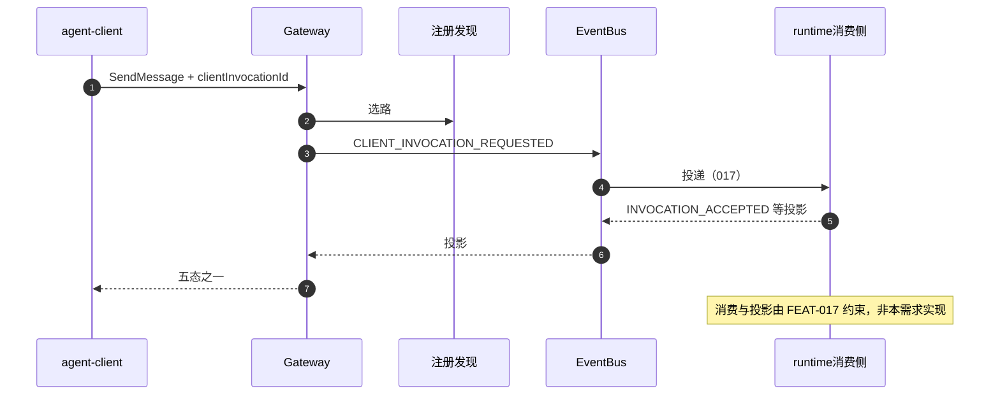
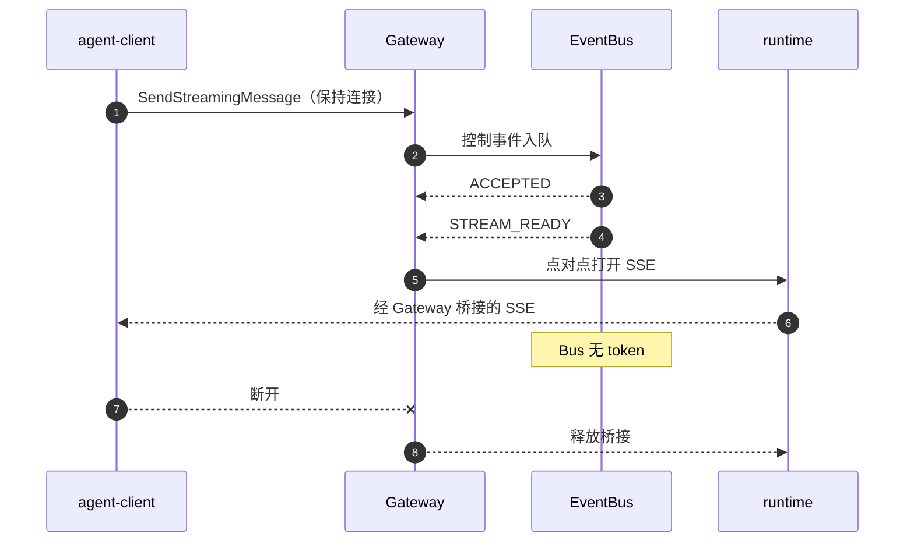

# FEAT-012 L2：客户端调用总线转发

本文是 **agent-gateway** 组件「经消息总线转发」特性的低层设计说明，面向架构/开发/测试评审。读完应能回答：总线路径做什么、场景怎么走、模块与流程如何设计、和 Bus/runtime 交什么、如何实现与验收。

姊妹文档：[FEAT-011 直连路由转发](./feat-011-client-invocation-route-forwarding.md)。**建议先读 011**（统一入口与 SSE 桥接纪律相同），再读本文（差别在「怎么送到 runtime」）。

---

## 0. 给评审的阅读说明

### 0.1 本文解决什么问题

有些部署希望客户端调用先进入 **消息总线（Event Bus）**：Gateway 发布「请处理这次调用」的控制事件，后端再投递到 agent-runtime；Gateway 在等待窗口内根据「状态投影事件」拼出给 client 的同步结果；若是流式，则在「流已可订阅」之后，仍然用 **点对点 SSE** 桥接 runtime（**token 不进总线**）。

FEAT-012 定义的就是这条路径。直接 HTTP 转发见 FEAT-011。

### 0.2 和 version-scope 的关系

| 若冲突 | 听谁 |
|---|---|
| 对外行为、事件名级黑盒要求 | **version-scope/FEAT-012**（及其中引用的相关特性） |
| 模块拆分、等待窗口实现、联调假设 | **本文** |

本文已内嵌评审所需的事件清单与五态说明，**不要求**先读附录或其它仓外材料。

### 0.3 本文结构

与 FEAT-011 相同：Charter → 场景 → 4+1 → 接口 → 实现设计 → 验收 → 待决。

### 0.4 术语表（人话）

除与 [FEAT-011 §0.4](./feat-011-client-invocation-route-forwarding.md) 相同的 Gateway / client / runtime / RDC / Task / routeHandle / SSE / A2A / E2E 外，本文额外使用：

| 术语 | 含义 |
|---|---|
| **总线转发** | 调用经 Event Bus 控制事件送达；Gateway 等投影后再回 client（同步），或等流就绪后 SSE 桥接（流式）。 |
| **控制事件** | Gateway → Bus：例如「客户端发起调用 / 取消 / 查询 / 订阅流」。 |
| **投影事件** | Bus → Gateway：例如「已接受并带 taskId / 拒绝 / 失败 / 一次性响应 / 流可订阅 / 等待输入 / 终态」。 |
| **五态（观测态）** | Gateway 在同步等待窗口内向 client 交付的折叠结果：完成响应、已接受任务、拒绝、失败、未知。 |
| **STREAM_READY / 流可订阅** | 表示可以开始点对点 SSE 桥接的投影；与「已接受 Task」分离。 |
| **FEAT-017** | runtime **侧**订阅消费总线事件并发布投影的要求。**消费实现不在本需求交付范围内**；但 012 联调依赖其对端行为就绪。 |
| **payloadRef** | 大载荷不放进总线正文，只放引用。 |
| **outbox/inbox** | 总线侧已有的投递持久化/去重底座思路；可复用纪律，**不能替代** Gateway 的等待窗口与五态组装。 |

---

## 1. Charter（责任说明书）

### 1.1 使命

> 在统一治理入口上，将客户端调用以 **经消息总线转发** 的方式送达目标服务：Gateway 完成治理与选路后发布控制事件，在等待窗口内消费状态投影并向 client 交付；流式场景在收到「流可订阅」后，**点对点**桥接 runtime SSE——消息总线 **不**承载 token、SSE 帧或大正文。

### 1.2 做范围内（In Scope）

| 编号 | 能力 | 对应场景 |
|---|---|---|
| IN-1 | 同步 · 经总线（控制 + 投影；无 token） | E2E-03 |
| IN-2 | 流式 · 总线控制面 + 流就绪后 SSE 桥接 | E2E-04 |
| IN-3 | 入队前仍要治理与选路 | 03/04/05/06 |
| IN-4 | 生产控制事件、消费投影事件 | 全文 |
| IN-5 | 同步等待窗口内的五态交付 | E2E-03 |
| IN-6 | 取消等控制事件最终落到 runtime CancelTask | 辅助 |
| IN-7 | 与 011 共用的统一 facade 形态 | 全体 |

### 1.3 明确不做（Out of Scope）

| 编号 | 不做 | 归属 |
|---|---|---|
| OUT-1 | 执行 Agent / 写 Task 库 | runtime |
| OUT-2 | 在总线里传 token / SSE 帧 / 大对象正文 | 禁止 |
| OUT-3 | 实现 runtime 侧「订阅消费总线」 | **FEAT-017**（对端） |
| OUT-4 | 拍死 RocketMQ 拓扑/进程拆分为唯一方案 | 见 §7；可配置 |
| OUT-5 | 服务间 A2A 经总线的另一套特性 | 非本交付 |
| OUT-6 | 注册上架主体 | RDC 等 |

### 1.4 成功标准（可观察）

| 编号 | 标准 |
|---|---|
| S1 | 同步经总线可用：窗口内得到五态之一，且响应无 topic/worker/endpoint |
| S2 | 流式经总线：控制面成功后，流可订阅投影触发 SSE 桥接；总线抓包无 token |
| S3 | 选路失败不入队；治理拒绝不选路不入队 |
| S4 | Gateway/Bus 不拥有 Task 权威终态 |

### 1.5 周边角色一览

```text
agent-client
    │ A2A（只认 Gateway）
    v
agent-gateway
    │ 选路                │ 控制事件 / 投影
    v                     v
   RDC              Event Bus
                          │
                          │ 消费（FEAT-017，非本需求实现）
                          v
                    agent-runtime
                          ^
                          │ 流式：点对点 SSE 桥接（不经 Bus）
                          │
                    agent-gateway (SSE)
```

| 角色 | 关系 |
|---|---|
| Event Bus | Gateway 发布控制事件、订阅/接收投影 |
| runtime + FEAT-017 | 消费控制事件、进标准 Task 控制面、发投影；**实现方不是本文作者职责** |
| RDC | 入队前选路仍然需要 |

### 1.6 能力要点（黑盒摘要）

- 创建类调用 **必须**带 client 生成的 clientInvocationId。  
- 必须发布 `CLIENT_INVOCATION_REQUESTED` 等控制事件；A2A 正文只作 payload 或 payloadRef。  
- 必须能在窗口内交付：完成响应 / 已接受任务 / 拒绝 / 失败 / 未知。  
- 流式必须通过「流可订阅」投影后再桥接 SSE；Bus 不承载 token。  
- 取消必须最终映射到 Task 所有者的 CancelTask，不能只在总线侧「标取消」。

---

## 2. 场景梳理

### 2.1 场景总表

| 场景 ID | 一句话 | 本特性主责？ | 成功 | 失败 |
|---|---|---|---|---|
| **E2E-03** | 同步 · 总线 | **是** | 入队→投影→五态回 client | 入队失败 / 窗口未知 / 05/06 |
| **E2E-04** | 流式 · 总线 | **是** | 控制面 + 流可订阅后 SSE | 同左；断连不建桥 |
| E2E-05 | 选路失败 | 是（出口同 011） | — | **不入队** |
| E2E-06 | 入口拒绝 | 是（出口同 011） | — | **不选路不入队** |
| E2E-01/02 | 直连 | **否**（见 011） | — | — |
| E2E-07/08 | 标注 | 同所选 03/04 路径 | 同 011 约束 | — |

### 2.2 同步/流式在总线路径上的位置

评审请注意：业务上的「同步调用」「流式调用」在总线路径下分别对应 **E2E-03** 与 **E2E-04**，不是「总线只能同步」。对 client 仍是同一套 A2A facade。

### 2.3 E2E-03 — 同步 · 总线

**业务背景：** client 发起阻塞调用；内部走总线，对 client 仍表现为同步等待结果。

**前置：**

1. Gateway、Event Bus 可用。  
2. client 携带 clientInvocationId、逻辑目标、建议幂等键。  
3. 目标可路由。  
4. runtime 侧具备消费总线事件并回投影的能力（FEAT-017；联调依赖）。

**步骤：**

1. client → Gateway：SendMessage。  
2. 治理；失败则 E2E-06。  
3. 选路；失败则 E2E-05（**不入队**）。  
4. Gateway 发布 `CLIENT_INVOCATION_REQUESTED`（含关联、路由引用、payload/payloadRef 等）。  
5. （对端）Bus 投递 → runtime 消费 → 进入与标准入口等价的 Task 控制面。  
6. runtime 发布投影（至少：接受/拒绝/失败；完成时还有响应投影等）。  
7. Gateway 在等待窗口内折叠为五态之一返回 client。

**成功可观察：** 五态之一；无内部拓扑；有 taskId 后不得再报未知。  
**失败可观察：** 入队失败立即明确失败；接受窗口内无接受/拒绝/失败投影 → 未知（可同键重试）。

### 2.4 E2E-04 — 流式 · 总线

**步骤（控制面同 03，差异如下）：**

1. client 维持 SSE 连接发起流式调用。  
2. 入队并至少观察到「已接受」或等价。  
3. 观察到 `INVOCATION_STREAM_READY`（流可订阅，带 taskId 与 streamRef）。  
4. **仅当 client 连接仍在**时，Gateway 按引用与 runtime 建立 A2A SSE 并桥接。  
5. token 只走点对点 SSE，**不进 Bus**。  
6. client 断开 → 释放桥接。

**关键纪律：** 「已接受 Task」与「流可订阅」必须可分离；不能用「已接受」冒充「可以开始桥接流」。

### 2.5 五态（人话）

| 观测态 | 人话 | 典型投影组合 |
|---|---|---|
| 完成响应 | 窗口内拿到一次性结果 | 先有接受，再有响应投影 |
| 已接受任务 | 已有 taskId，结果还没在窗口内出来 | 有接受，无完整响应 |
| 拒绝 | 明确拒绝且未建 Task | 拒绝投影 |
| 失败 | 确定失败 | 失败投影 |
| 未知 | 窗口内无法确认是否建了 Task | 无接受/拒绝/失败 |

**已拿到 taskId 后禁止再报「未知」。**

### 2.6 E2E-05 / E2E-06（复述，避免只写「见 011」）

- **选路失败：** 治理已通过，但 RDC 给不出路由 → 返回明确失败 → **不向 Bus 发调用事件**。  
- **入口拒绝：** 治理未通过 → 返回明确失败 → **不选路、不入队**。

细节与直连文档一致，只是失败发生在「入队」之前。

### 2.7 辅助：取消 / 等待输入 / 大载荷

| 能力 | 要点 |
|---|---|
| 取消 | Gateway 发取消控制事件；对端须映射到 runtime CancelTask |
| 等待输入投影 | Gateway 只把「需要输入」状态交给 client；接续状态机在 runtime |
| 大载荷 | 只用 payloadRef/artifactRef，不把大正文塞进总线事件 |

### 2.8 E2E-07 / E2E-08（标注）

调用期选 03 或 04；注册仍不经 Gateway；工具多轮仍只透传，不在 Gateway 执行。

---

## 3. 4+1 设计

### 3.1 场景视图（+1）

验证轴：E2E-03、04；（失败出口）05、06；（标注）07、08。

### 3.2 逻辑视图

```text
agent-client
    │
    v
┌──────────── agent-gateway ────────────┐
│ 入口门面 → 治理 → 选路                 │
│              │                        │
│         总线模块 (M-BUS)               │
│         · 控制事件发布                 │
│         · 投影等待 / 五态组装          │
│              │                        │
│         SSE 桥接 (M-SSE)              │
└───────┬───────────────┬───────────────┘
        │I-04           │I-06 点对点 SSE
        v               v
   Event Bus        agent-runtime
        │
        │I-05（FEAT-017 消费，非本模块实现）
        v
   agent-runtime
```

| 模块 | 人话职责 |
|---|---|
| M-FAC / M-GOV / M-RTE / M-OBS / M-SSE | 与 011 相同 |
| **M-BUS** | 发控制事件；等投影；折叠五态；通知「可桥接」后交给 M-SSE |
| M-DIR | 本路径主流程不走直连 HTTP；定位 Task 所有者时可能仍需能力（实现可选） |

### 3.3 过程视图

#### E2E-03



#### E2E-04



### 3.4 开发视图

在 011 包结构上增加：

```text
agent-gateway/
└── bus/
    ├── BusControlPublisher     # 控制事件出站
    ├── ProjectionListener      # 投影入站
    ├── InvocationWaitWindow    # 等待与超时
    ├── InvocationResponseAssembler  # 五态折叠
    └── EventTypeCatalog        # 事件名可配置
```

### 3.5 物理视图

| 项 | 态度 |
|---|---|
| Gateway 独立进程、Bus 与注册同进程、RocketMQ 两跳等 | 协作方草稿中有主张；**平台未拍死为唯一拓扑**。实现参数化，不写死。 |
| 与 Bus 的连接 | 必须能发布控制事件并接收投影 |
| SSE | 与 runtime 点对点可达 |

---

## 4. 接口设计

### 4.1 接口总表

| 边 | 对端 | 目的 | 同步/异步 | 所有权 |
|---|---|---|---|---|
| I-01 | client ↔ Gateway | 统一 facade（同 011；创建类必须带 clientInvocationId） | 同步或 SSE | 不持 Task |
| I-02 | Gateway → RDC | 入队前选路 | 偏同步 | 目录在 RDC |
| I-04 | Gateway ↔ Event Bus | 控制 / 投影 | 异步 + 入口等待 | 事件在 Bus |
| I-05 | Bus → runtime | 消费调用事件 | 异步 | Task 在 runtime（**对端 FEAT-017**） |
| I-06 | Gateway ↔ runtime | 流可订阅后的 SSE 桥接 | 长连接 | 流在 runtime |

### 4.2 按场景

| 场景 | 边 |
|---|---|
| E2E-03 | I-01, I-02, I-04,（间接 I-05） |
| E2E-04 | I-01, I-02, I-04, I-06,（间接 I-05） |
| E2E-05/06 | I-01 ± I-02；无 I-04 |

### 4.3 I-04 事件清单（默认名，可配置）

**Gateway 生产（控制）：**

| 事件名 | 用途 |
|---|---|
| `CLIENT_INVOCATION_REQUESTED` | 创建/推进类调用入队 |
| `CLIENT_INVOCATION_CANCEL_REQUESTED` | 取消请求 |
| `CLIENT_INVOCATION_QUERY_REQUESTED` | 查询（通常基于 taskId） |
| `CLIENT_STREAM_SUBSCRIBE_REQUESTED` | 重订阅流准备（基于 taskId） |

**Gateway 消费（投影）：**

| 事件名 | 用途 |
|---|---|
| `INVOCATION_ACCEPTED` | 已建/复用 Task；带 taskId |
| `INVOCATION_REJECTED` | 未建 Task 的拒绝 |
| `INVOCATION_FAILED` | 确定失败 |
| `INVOCATION_RESPONSE` | 窗口内一次性响应（须先有接受） |
| `INVOCATION_STREAM_READY` | 可桥接；带 taskId + streamRef；无 token |
| `INVOCATION_INPUT_REQUIRED` | 等待输入；Gateway 只交付 |
| `INVOCATION_TERMINAL` | 终态投影 |

信封中常见治理字段（租户、追踪、关联、幂等、截止、路由、payloadRef）由映射层承载；**本文不冻结某一版 JSON Schema**。字段以协作方事件契约拉通后为准，见 §7。

### 4.4 对端 FEAT-017：Gateway 期望的行为（联调用）

下列是 **期望 runtime 消费侧做到的事**（摘自平台对该特性的范围描述），便于联调对齐；**不是**说本仓库已实现：

1. 能消费上表控制事件，并进入与标准入口**等价**的 Task 控制面（不要求必须 HTTP 回环）。  
2. 建 Task 后发 `INVOCATION_ACCEPTED`（带 taskId）。  
3. 可订阅时发 `INVOCATION_STREAM_READY`（带 streamRef，非物理 URL，无 token）。  
4. 创建幂等：`tenantId + idempotencyKey` 不导致多 Task。  
5. 消费确认语义收敛到「已进入 Task 控制面」，不等待 Agent 跑完。

**联调检查清单：**

- [ ] 发 REQUESTED 后能收到 ACCEPTED 或 REJECTED/FAILED  
- [ ] 阻塞完成有 RESPONSE（且先有 ACCEPTED）  
- [ ] 流式有 STREAM_READY，且 Bus 无 token  
- [ ] 同幂等键重试不产生多 Task  
- [ ] CANCEL 落到 CancelTask  

未勾选齐前，不得宣称「总线路径端到端联调完成」。

### 4.5 行为承诺

- **必须** Bus 只走控制/投影/引用。  
- **必须** 入队前治理+选路。  
- **必须** 接受与流可订阅分离。  
- **必须** 取消落到 runtime。  
- **禁止** Gateway/Bus 拥有 Task 权威。  
- **允许** 事件名配置化；MVP 可先支持事件子集，但须在发布说明列出缺口。

---

## 5. 实现设计（详细实现）

### 5.1 模块到端口

| 模块 | 端口 |
|---|---|
| M-BUS | `BusControlPublisher`, `ProjectionSource`, `InvocationWaitWindow`, `InvocationResponseAssembler` |
| 复用 011 | `PathSelector`, `RdcRouteClient`, `SseBridge`, 治理与门面 |

### 5.2 SPI

```java
public interface BusControlPublisher {
    PublishAck publish(ClientInvocationControlEvent event);
}

public interface ProjectionSource {
    /** 等待与关联键匹配的投影，直到满足终态子集或超时 */
    Optional<InvocationProjection> await(CorrelationKey key, WaitPolicy policy);
}

public interface InvocationResponseAssembler {
    /** 投影序列 → 对 client 的五态 / A2A 表面 */
    ClientFacingResult assemble(ProjectionTrace trace);
}
```

### 5.3 同步总线主路径

```text
handleSendMessageOnBus(req):
  1. 治理；失败 -> E2E-06
  2. PathSelector == BUS
  3. route = 选路；失败 -> E2E-05（不 publish）
  4. publish CLIENT_INVOCATION_REQUESTED
  5. trace = await(接受窗口 + 响应窗口策略)
  6. result = assemble(trace)  // 五态
  7. return sanitizeForClient(result)
```

### 5.4 流式总线主路径

```text
handleSendStreamingOnBus(req, clientSink):
  1～4 同同步入队
  5. 等待 ACCEPTED（或拒绝/失败/未知）
  6. 等待 STREAM_READY
  7. if client 仍连接:
       SSE.bridge(clientSink, openByStreamRef(...))
     else:
       不建桥
  8. on disconnect -> release
```

### 5.5 等待窗口与未知

| 规则 | 说明 |
|---|---|
| 接受窗口无接受/拒绝/失败 | 返回未知 |
| 已有 taskId | 禁止未知；可为「已接受任务」 |
| 恢复 | 同 clientInvocationId + 幂等键重试创建类 |
| 窗口毫秒数 | 配置项；与对端拉通前用合理默认 |

### 5.6 配置模型（占位）

```yaml
openjiuwen.gateway:
  path-mode: bus
  bus:
    enabled: true
    event-names:
      requested: CLIENT_INVOCATION_REQUESTED
      # 其余可覆盖默认
    accept-wait: 30s
    response-wait: 60s
  sse:
    release-on-client-disconnect: true
```

### 5.7 错误与可观察

| 场景 | 行为 |
|---|---|
| 入队失败 | 明确失败 |
| 窗口无投影 | 未知；可同键重试 |
| 拒绝/失败投影 | 确定错误回 client |
| 流可订阅但 client 已断 | 不建桥 |
| 投影试图带大正文/token | fail-closed（拒绝或丢弃并记错误） |

### 5.8 与投递底座、实验草稿的关系

- **outbox/inbox 类底座：** 可借鉴租户隔离、去重、payloadRef、至少一次等纪律；**不能**代替本模块的等待窗口与五态组装。  
- **历史实验 PR 中的 Gateway 草稿：** 默认不视为本责任田既定实现；要对齐后再复用。

### 5.9 建议开工顺序

1. M-BUS 接口 + 内存假 Bus（单测五态）  
2. 事件名可配置 + envelope 映射（payloadRef）  
3. 接真实发布端  
4. 投影监听 + 等待窗口  
5. 流可订阅 → 复用 M-SSE  
6. 端到端联调（依赖 §4.4 清单）  

---

## 6. 验收要点

### 6.1 E2E-03（P0 · 依赖对端消费就绪）

| # | Given | When | Then |
|---|---|---|---|
| T-03-1 | Bus+消费侧可用；可路由 | SendMessage + clientInvocationId | 五态之一；无拓扑泄露 |
| T-03-2 | 窗口内完成 | 同上 | 完成响应；先有接受语义 |
| T-03-3 | 仅接受、无完整响应 | 窗口结束 | 已接受任务；不得未知 |
| T-03-4 | 无接受类投影 | 接受窗口结束 | 未知；同键可恢复 |
| T-03-5 | 入队失败 | 调用 | 明确失败 |

### 6.2 E2E-04（P0）

| # | Given | When | Then |
|---|---|---|---|
| T-04-1 | 接受 + 流可订阅 | 连接保持 | SSE 桥接；Bus 无 token |
| T-04-2 | 流可订阅前 client 断开 | — | 不建桥 / 释放 |
| T-04-3 | 接受与流可订阅 | 时序 | 可分离；不混用 |

### 6.3 其它（P1）

| # | Then |
|---|---|
| T-CX-1 | 取消最终到 CancelTask |
| T-IR-1 | 等待输入只交付，不推进 Task |
| T-PR-1 | 大载荷仅引用 |

### 6.4 失败出口（P0）

与 011 相同期望：选路失败不入队；治理拒绝不入队。

### 6.5 建议单测（无真实对端）

- 投影序列 → 五态（表驱动）  
- 超时 → 未知；已有 taskId → 禁止未知  
- 映射层拒绝把 token 写入 Bus 事件  
- 路径为 bus 时不走直连 SendMessage  

---

## 7. 待决问题与工作假设

| 人话问题 | 影响 | 建议找谁 | 当前工作假设 |
|---|---|---|---|
| runtime 总线消费（FEAT-017）何时有设计/实现？投影时序？ | **阻塞严谨联调** | runtime / 017 负责人 | 按 §4.4 期望行为做假投影单测；联调前必须书面暂定（Q-05） |
| 事件字段以哪份事件契约为准？何时合入？ | I-04 字段 | 总线事件负责人 | 事件名可配置；映射可演进（M5） |
| 选路跟新/旧哪份？ | 同 011 | 注册发现 | 选路 SPI（Q-09） |
| 谁决定直连 vs 总线？ | 双路径 | 需求分析 / 架构 | MVP 可配死 bus 或按环境（Q-04） |
| RocketMQ 两跳是否平台既定？ | 部署 | 架构 + 总线 | 不写死（Q-06） |
| 实验草稿是否复用？ | 重复实现 | 相关负责人 | 默认不复用（C6） |

### 7.1 工作假设（打标）

1. 默认事件名采用 §4.3 表。  
2. 假设对端最终会发接受/响应/流可订阅/失败等投影——**在联调完成前这是假设**。  
3. MVP 可暂缓部分控制事件（如查询/重订阅），须在说明中列出。

---

## 8. 关联阅读（可选）

| 文档 | 何时看 |
|---|---|
| [FEAT-011 L2](./feat-011-client-invocation-route-forwarding.md) | 统一入口、SSE、失败出口 |
| `version-scope/FEAT-012-*.md` | 黑盒原文核对 |
| `version-scope/FEAT-017-*.md` | 对端消费范围原文 |

状态：**draft** · 可写 M-BUS 骨架与单测 · **端到端联调完成**依赖 §4.4 / §7 中对端就绪项关闭。
