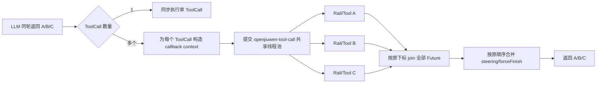
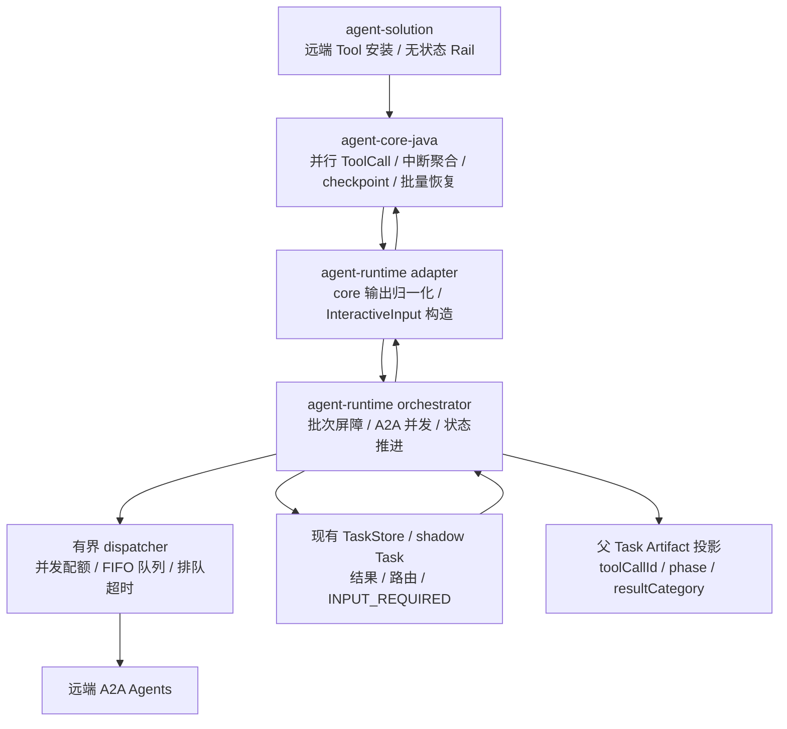
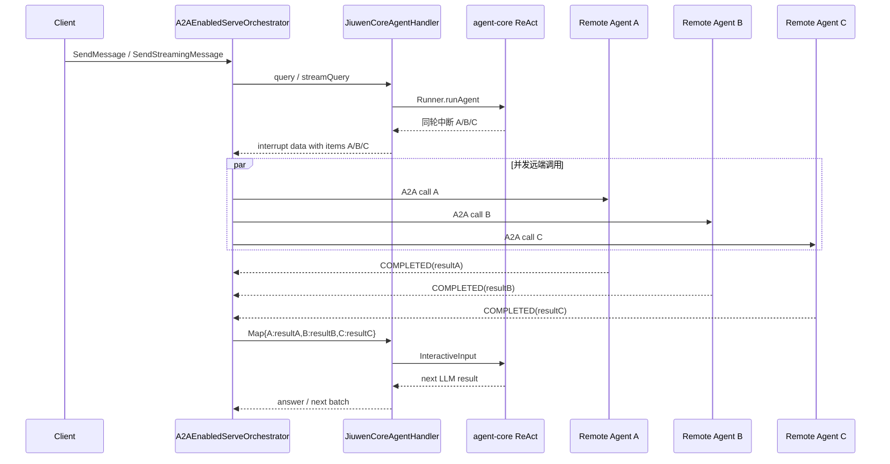

# 支持工具并行执行（agent runtime java）— 设计文档

> 特性编号：019
>
> 目标仓库：`agent-core-java`、`agent-runtime-java`、`agent-solution`
>
> 最后更新：2026-07-23
>
> 源码基线：`agent-core-java` 本地 `730` 分支（HEAD `69f39777`，叠加本地 `DeepAgent` checkpoint 顺序修复）、`agent-runtime-java` 本地 `develop` 分支（HEAD `5995e3b`，叠加本特性工作区实现）、`agent-solution` 本地 `common` 分支（HEAD `6cc6351`，叠加本特性工作区实现）。通用 ToolCall 并行能力由 core 提交 `0f8b96be` 引入。

---

## 1. 概述

### 1.1 特性定位

当 LLM 在同一轮返回多个互不依赖的 ToolCall 时，agent-core 将并行执行各 ToolCall 的 Rail 和工具逻辑。对于由 `RemoteA2aInterruptRail` 拦截的远端 Agent ToolCall，真正的 A2A 调用发生在 agent-runtime，而不是 core 的工具线程中。因此 runtime 必须识别同一轮产生的全部远端工具中断，将它们组织为一个批次，并发调用远端 Agent，等待批次达到可回灌状态后，一次性按 `toolCallId` 将完整结果集合回灌 core。

本文的 Runtime 改造范围只包括 runtime-proxy downstream-agent ToolCall 的远端 A2A 编排。文件、Shell、本地函数、普通 REST/MCP、浏览器、设备和代码执行等非 Agent 工具的并行不属于本特性；第 3 章对 Core 通用 ToolCall 并行的说明只是已落地源码基础，不把普通本地工具治理纳入 Feat-Func-019 的功能或验收范围。

改造前：

```text
同轮 ToolCall A/B/C
  -> runtime/adapter 只保留一个中断
  -> 只调用一个远端 Agent
  -> 用普通字符串恢复 core
  -> 多个 ToolCall 可能收到同一个结果，或其余中断丢失
```

改造后：

```text
同轮 ToolCall A/B/C
  -> adapter 在现有 interrupt data 中汇总同轮 items
  -> runtime 并发执行远端调用 A/B/C
  -> 每个结果按 toolCallId 归档
  -> 批次屏障等待所有成员达到本轮稳定状态
  -> 一次 InteractiveInput{A:resultA,B:resultB,C:resultC} 恢复 core
```

### 1.2 当前事实边界

当前三个仓库中的已知事实如下：

| 仓库 | 当前事实 | 与本特性的差距 |
|---|---|---|
| `agent-core-java` | `730` 分支的 `AbilityManager.execute()` 已在多 ToolCall 时使用 `OpenJiuwenExecutors` 并行执行，并按输入顺序汇总；每个 ToolCall 使用独立 `AgentCallbackContext` 和 `extra` 顶层副本，worker 会绑定并恢复 `SessionContextHolder`。ReAct 已聚合同轮多个 `ToolInterruptException`，非流式返回一个含完整 `state` 列表的 interrupt result，流式逐条输出全部 `__interaction__`，恢复支持 `InteractiveInput.userInputs` 按 `toolCallId` 映射。DeepAgent 复用同一个 ReAct/AbilityManager，并已在流式 task-loop 中先把 request-session 状态复制到 Runner 父 session，再关闭内部 emitter。 | 并行执行、中断聚合、批量恢复和 DeepAgent 父 checkpoint 屏障均已满足；跨轮 `toolCallId` 防重仍属于可选 DFX。 |
| `agent-runtime-java` | `JiuwenCoreAgentHandler` 已统一归一化流式/非流式多中断并构造批量 `InteractiveInput`；`RemoteInvocationBatchCoordinator` 已实现全局有界 FIFO 调度、独立排队超时、同父 Task 活动批次冲突拒绝、`_remote_batch` shadow 快照、定向续轮、结果屏障、成员投影和错误分类；A2A adapter/controller 已保留并校验 `TextPart.metadata.toolCallId`。 | 已满足本特性的 Runtime 功能边界；跨实例在途 Future 恢复和同 conversation 多父 Task 并发仍属于明确排除范围。 |
| `agent-solution` | `RemoteA2aToolInstaller` 可向 ReAct/DeepAgent 安装远端工具；`RemoteA2aInterruptRail` 保持逐 ToolCall 无共享可变状态，并已覆盖同一 Rail 实例并发中断隔离。 | 已满足本特性的 Solution 边界；批次聚合、并发调度和持久化仍只由 Runtime 承担。 |

本文将三个仓库中已落地并由测试覆盖的行为描述为当前事实；不在当前版本承诺范围内的能力继续按限制章节处理。

### 1.3 核心设计原则

1. **同轮批次是最小恢复单元** — core 只有在同轮全部中断 ToolCall 获得结果后才能进入下一轮 LLM 推理，runtime 不做单结果提前回灌。
2. **并发执行与有序关联分离** — 远端调用可以任意顺序完成，但结果始终按 `toolCallId` 关联，并按 core 原始 ToolCall 顺序形成诊断视图。
3. **runtime 拥有批次协调状态** — 已完成结果、待输入路由、远端 Task 引用和批次状态属于 runtime Task 编排状态；core checkpoint 仍归 core。
4. **流式与非流式语义一致** — 两种模式共享相同的中断批次、屏障、状态机和恢复载荷，仅对外输出载体不同。
5. **单成员统一处理** — 单 ToolCall 也必须携带真实 `toolCallId`，并被规范化为大小为 1 的 `_remote_batch`；只有一个 pending member 时允许普通文本恢复。
6. **成员失败相互隔离** — 单个远端调用失败或超时转为该 ToolCall 的错误结果，不影响同批其他成员；父 Task 是否最终失败由恢复后的本地 Agent 决定。
7. **有界并发而非无界 fan-out** — Runtime 在有限并发预算内启动远端调用，超额成员排队；排队容量不足或超时形成该成员的结构化失败。
8. **内部权威状态与外部投影分离** — shadow Task 保存完整成员路由和结果，父 Task Artifact 只投影脱敏的 `toolCallId`、目标、阶段和结果类别。

### 1.4 子特性全景

| 子特性 | 职责 | 关键抽象 | 状态 |
|---|---|---|---|
| core 同轮 ToolCall 并行 | 并行执行 Rail/工具、按原顺序汇总 | `AbilityManager`, `OpenJiuwenExecutors` | 已落地 |
| core 批量中断与 checkpoint | 汇总中断、保存上下文、恢复整批 ToolCall | `ToolInterruptionState`, `InteractiveInput` | 已落地并满足本特性依赖 |
| adapter 批量中断归一化 | 非流式/流式输出统一为现有 interrupt data 的批次 envelope | `JiuwenCoreAgentHandler` | 已落地 |
| runtime 远端并发编排 | 并发调用、结果隔离、批次屏障 | `RemoteInvocationBatchCoordinator` | 已落地 |
| runtime 有界调度 | 有限并发、FIFO 排队、队列容量和排队超时 | `RemoteInvocationBatchCoordinator` 内部 dispatcher | 已落地 |
| 批次状态持久化 | 复用现有 shadow Task metadata 保存成员结果、远端 Task 路由和待输入游标 | `TaskStore`, shadow Task | 已落地 |
| 父 Task 成员投影 | 按 `toolCallId` 把成员阶段和结果类别投影为 Artifact | `A2AAgentExecutor`, `ChunkMapper` | 已落地 |
| 批量结果回灌 | 在 handler 内构造按 `toolCallId` 映射的 `InteractiveInput` | `JiuwenCoreAgentHandler` | 已落地 |
| solution Rail 并行兼容 | 独立上下文中生成无共享可变状态的中断 | `RemoteA2aInterruptRail` | 已验证 |

---

## 2. 功能规格

### 2.1 能力清单

| 能力 | 目标状态 | 说明 |
|---|---|---|
| 同轮多中断完整保留 | 必须 | 不得只保留最后一个 `__interaction__`。 |
| 远端 Agent 并发调用 | 必须 | 同批互不依赖的远端调用并发开始。 |
| 受控并发预算 | 必须 | 同时运行数量不超过有限上限，超额成员进入有界 FIFO 队列，不无界创建远端调用。 |
| toolCallId 精确关联 | 必须 | 中断、远端状态、结果、用户输入和 core 回灌全程使用同一 `toolCallId`。 |
| 批次屏障 | 必须 | 全部成员达到稳定状态前不得恢复 core。 |
| 已完成结果保存 | 必须 | 先完成的 A 结果在 B/C 等待期间不得丢失、重复执行或提前回灌。 |
| 多 INPUT_REQUIRED 精确续轮 | 必须 | 父 Task 同时暴露全部 pending member；每段用户输入通过 `TextPart.metadata.toolCallId` 指定目标。 |
| 单次批量回灌 | 必须 | 全批完成后使用一个 `InteractiveInput` 恢复 core。 |
| 流式/非流式一致 | 必须 | 状态机、结果和恢复载荷一致；流式进度允许交错。 |
| 单成员支持 | 必须 | 单远端 Agent 使用大小为 1 的 `_remote_batch`；首次中断必须携带 `toolCallId`，单 pending 续轮允许普通文本。 |
| 后续轮次远端调用 | 必须 | 前一批次完成并恢复 core 后，LLM 新一轮产生的新批次允许继续执行。 |
| 超时治理 | 必须 | 成员超时形成独立错误结果并参与 all-settled 汇聚。 |
| 父 Task 多成员投影 | 必须 | `GetTask`/订阅可按 `toolCallId` 观察每个下游调用的目标、当前阶段和结果类别。 |
| 跨进程执行迁移 | 不承诺 | Redis 可保存快照，但当前事件队列和在途 Future 仍依赖实例亲和。 |

### 2.2 显式排除

| 排除项 | 原因 | 替代或边界 |
|---|---|---|
| runtime 推断 ToolCall 依赖图 | 同轮是否独立由 LLM/core 决定 | 有依赖的工具应由 LLM 放到后续轮次。 |
| runtime 修改 core 工具执行顺序 | core 拥有 Agent 内部执行语义 | runtime 只处理 core 返回的中断批次。 |
| 普通本地工具并行治理 | FEAT-019 明确排除，且 Runtime 不执行这些工具 | Core 通用并行只是源码背景；本设计只消费远端 Agent 代理中断。 |
| 显式批量委托 Tool/API | 模型仍生成多个单调用 ToolCall | 批次 envelope 只在 Core adapter 与 Runtime 内部存在。 |
| solution 保存批次状态 | solution 是装配和 Rail 扩展层 | 状态由 runtime store 管理。 |
| 把批次状态写入 core checkpoint | 会混淆状态所有权 | core checkpoint 保存 Agent 上下文；runtime store 保存远端编排状态。 |
| exactly-once 远端副作用保证 | A2A 对端能力和崩溃窗口不可由本地单方面消除 | 本特性不定义跨 A2A 幂等协议；有副作用的远端能力由远端入口自行提供重复保护。 |
| 分布式线程池或跨实例 Future 迁移 | 超出当前单实例事件执行模型 | 使用实例亲和；后续由独立恢复特性解决。 |
| 同一 conversation 多父 Task 同时执行 | Core Runner/checkpointer 当前按 conversationId 保存一个 Agent 状态，无法隔离并发父 Task 的 `ToolInterruptionState` | 当前版本不承诺该场景，调用方必须让不同父 Task 顺序执行；本特性不新增 conversation owner 锁、冲突错误或父 Task 级 Core session。 |

### 2.3 行为承诺

- **必须**：每个远端工具中断包含非空 `toolCallId`；缺失时批次按协议错误失败，禁止按工具名猜测关联。
- **必须**：同一 core 执行轮次产生的远端工具中断归入同一个 `batchId`。
- **必须**：远端批次的每个 item 都是 `context._interrupt_kind == "a2a_delegate"` 的下游 Agent 代理中断；同轮混入其他 kind 时整体拒绝，禁止静默过滤或误调远端。
- **必须**：同一父 Task 同时最多存在一个活动批次；批次完成后才允许创建下一批。
- **边界**：同一 conversation 的不同父 Task 必须顺序进入 Handler/Core；并发进入的行为不属于本特性承诺或验收范围。parentTaskId 分键只用于受支持顺序下的路由隔离和陈旧请求拒绝，不改变 Core session 仍按 conversationId 保存的事实。
- **必须**：runtime 只在全部成员可生成 core ToolMessage 结果时调用 core resume。
- **必须**：core resume 使用 `InteractiveInput.userInputs: Map<toolCallId,Object>`，禁止把普通字符串复制给全部中断工具。
- **必须**：批次存在 `INPUT_REQUIRED` 成员时，已完成/失败成员结果持久化，恢复时只继续待输入成员。
- **必须**：父 Task 的 `INPUT_REQUIRED` 消息继续沿用现有 `Message.metadata["_interrupt"]` 保存和续轮透传逻辑；客户端不接触 core checkpoint，也不接触远端 Task 引用。
- **禁止**：收到 A 的结果后对 core 做局部恢复，同时让 B/C 留在 runtime 等待。
- **禁止**：因一个成员失败而影响其他已运行成员。
- **允许**：流式模式下多个远端 Agent 的进度事件交错输出，但每个事件必须带 `batchId`、`toolCallId` 和公开目标字段 `target`。
- **必须**：coordinator 同时运行的远端调用不超过 `max-concurrency`；超额成员进入 FIFO 队列并处于 `QUEUED`，队列满或排队超时形成对应成员的结构化失败。
- **必须**：成员获得运行配额时投影 `RUNNING`；只有真正进入 coordinator FIFO 等待的成员投影 `QUEUED`；后续进入 `INPUT_REQUIRED/COMPLETED/FAILED/TIMED_OUT` 时通过父 Task Artifact 投影脱敏状态。`toolCallId` 由 coordinator 从成员上下文注入，不信任远端载荷。
- **必须**：多个成员同时 `INPUT_REQUIRED` 时，每个输入 `TextPart` 必须携带 `toolCallId`；一条 A2A Message 可以携带多个带标识的 TextPart，分别续接多个成员。
- **必须**：同一 A2A Message 的 TextPart 不得混用“带 `toolCallId`”和“不带 `toolCallId`”两种形态；adapter 在构造 `ServeRequest` 前整体拒绝并返回 `REMOTE_TOOL_INPUT_TARGET_MIXED`，不产生部分目标输入。
- **必须**：外部续轮只使用父 `taskId + toolCallId` 定位成员，不要求客户端传 `batchId`；runtime 保留内部 `batchId` 用于批次关联、投影归并和诊断。
- **必须**：同一活动批次内 `toolCallId` 唯一；coordinator 只在父 Task 当前活动批次中按 `toolCallId` 路由。跨批次或跨轮 ID 防重属于额外的重放防护 DFX，不是本特性的功能依赖。
- **禁止**：多个 pending member 时把无 `toolCallId` 的普通文本隐式广播给全部成员。
- **允许**：只有一个 pending member 时，无 `toolCallId` 的普通文本继续走原单成员兼容路径。

---

## 3. agent-core 工具并行与中断逻辑（源码核验）

### 3.1 源码基线与核验结论

本章以 `agent-core-java` 本地 `730` 分支 HEAD `69f39777` 及当前工作区为基线。其中通用 ToolCall 并行能力来自提交 `0f8b96be`，DeepAgent 流式 checkpoint 屏障按当前工作区实现核验。直接核对以下实现：

- `AbilityManager`、`OpenJiuwenExecutors`、`SessionContextHolder`。
- `ReActAgent`、`ToolInterruptionState`、`ToolCallInterruptRequest`、`InteractiveInput`。
- `AgentSessionApi`、`RunnerImpl` 的非流式/流式收尾顺序。
- `DeepAgent` 对 ReAct 的复用和 interaction stream 转发。

源码核验结论：

| 契约 | 结论 | 证据 |
|---|---|---|
| 多 ToolCall 并行且按输入顺序返回 | 已满足 | `AbilityManager.executeParallelToolCalls()` 为每项创建 Future，再按原列表下标依次 `joinToolExecution()`。 |
| 每 ToolCall Rail 临时状态隔离 | 已满足顶层隔离 | `buildToolCallbackContext()` 创建独立 context；`copyToolExtra()` 创建 `LinkedHashMap` 顶层副本、清理 `_skip_tool` 并为 `steering` 创建新列表。 |
| worker 中 Session 可见并可恢复 | 已满足 | `executePreparedToolCall()` 在 Rail/Tool 生命周期外层绑定 Session，并在 `finally` 恢复 worker 先前值。 |
| 同轮多中断聚合 | 源码已满足 | 每个 Future 将 `ToolInterruptException` 作为对应 `ToolExecutionEntry.result` 返回，ReAct 在全部 Future 汇合后统一收集。 |
| 非流式/流式完整暴露多中断 | 源码已满足 | 非流式返回一个含完整 `state` 列表的 map；流式为列表中每项写出一个 `__interaction__` chunk。 |
| 按 `toolCallId` 批量恢复 | 源码已满足 | `InteractiveInput.userInputs` 由 Rail 按当前 `toolCallId` 取值，未解决项会再次形成中断。 |
| DeepAgent 流式父 checkpoint 屏障 | 功能依赖，已满足 | DeepAgent 在关闭 request-session emitter 前先把状态复制到 Runner 父 session；Runner 包装 iterator 在向 Handler 返回 EOF 前同步提交父 checkpoint。 |
| 跨批次/跨轮 `toolCallId` 防重 | 可选 DFX | ReAct 透传模型生成的 `ToolCall.id`；本特性只要求同一活动批次内唯一。 |

跨批次/跨轮 `toolCallId` 防重不改变本章其他源码契约已经满足 Feat-019 功能依赖的结论。

### 3.2 ToolCall 并行执行

`AbilityManager.execute()` 对单 ToolCall 保留同步单调用路径；当数量大于 1 时，为每个 ToolCall 先构造独立 `AgentCallbackContext`，再通过 `OpenJiuwenExecutors.supplyToolCallAsync()` 提交任务，并使用 `withToolCallTimeout()` 包装 Future。父线程最后按原 ToolCall 下标依次 join，因此完成顺序可以是 C/A/B，返回列表仍为 A/B/C。



线程池当前实现边界如下：

- 线程名为 `openjiuwen-tool-call-*`，默认最大线程数为 `max(8, CPU * 2)`，使用 `SynchronousQueue` 和 `CallerRunsPolicy`。
- 系统属性 `openjiuwen.executor.tool-call.max-size`、`openjiuwen.executor.tool-call.keep-alive-seconds`、`openjiuwen.executor.tool-call.timeout-millis`，以及对应环境变量 `OPENJIUWEN_EXECUTOR_TOOL_CALL_MAX_SIZE`、`OPENJIUWEN_EXECUTOR_TOOL_CALL_KEEP_ALIVE_SECONDS`、`OPENJIUWEN_EXECUTOR_TOOL_CALL_TIMEOUT_MILLIS` 控制线程池与等待超时；默认工具超时为 0，即不启用。
- 线程池饱和时提交线程可能通过 `CallerRunsPolicy` 执行任务，因此“并行”受当前池容量约束，不承诺无限并发。
- `CompletableFuture.orTimeout()` 只使等待 Future 超时完成，不中断已经开始的底层工具任务。
- 单工具执行异常或 Future 异常会转换为该 ToolCall 的 `ToolMessage`，不会影响同轮其他 Future。

每个 ToolCall 的 `AgentCallbackContext` 是独立对象，`extra` 是顶层浅副本；`_skip_tool` 不跨工具传播，`steering` 使用独立列表，全部任务结束后按输入顺序合并，首个 `forceFinish` 请求回传父 context。`agent`、`config`、`session`、`context` 以及 `extra` 中其他嵌套业务对象仍按引用共享，不能把该实现描述为任意对象的深隔离。

`executePreparedToolCall()` 在进入 `railedExecuteSingleToolCall()` 前保存 worker 原 Session 并绑定本次 Session，覆盖 `BEFORE_TOOL_CALL`、实际工具执行、`AFTER_TOOL_CALL` 和异常处理的整个生命周期，最终在 `finally` 中恢复原值。

### 3.3 Rail 中断聚合

`RemoteA2aInterruptRail` 在 `BEFORE_TOOL_CALL` 为每个远端工具抛出独立 `ToolInterruptException`。`AbilityManager.executePreparedToolCall()` 捕获该异常，并把它作为对应 `ToolExecutionEntry.result` 返回；父线程仍会等待同轮全部 Future 并按输入顺序得到完整结果列表。

ReAct 随后由 `collectToolInterrupts()` 扫描列表，将所有中断构造成一个 `ToolInterruptionState`：

```text
ToolCall A -> ToolInterruptException(call-A)
ToolCall B -> ToolInterruptException(call-B)
ToolCall C -> ToolInterruptException(call-C)
                   |
                   v
ToolInterruptionState {
  iteration,
  originalQuery,
  interruptedTools: [A, B, C]
}
```

因此 A 先抛中断不会使 core 提前返回；A/B/C 的 Rail/Tool Future 全部离开运行态后，ReAct 才提交一次完整中断状态。该结论由当前实现直接保证。

### 3.4 core 对外中断形态

`commitInterrupt()` 为每个 `ToolInterruptEntry` 创建一个 `OutputSchema(type="__interaction__", index, payload)`。payload 是 `InteractionOutput`，其 `value` 为由 `ToolCallInterruptRequest.fromToolCall()` 补充了 `toolCallId/toolName` 的中断请求。非流式 ReAct 返回一个结果对象，结构等价于：

```json
{
  "result_type": "interrupt",
  "state": [
    {
      "type": "__interaction__",
      "index": 0,
      "payload": {
        "id": "call-A",
        "value": {
          "interruptId": "call-A",
          "message": "call-A interrupt",
          "toolCallId": "call-A",
          "toolName": "remote-agent-A"
        }
      }
    },
    {"type": "__interaction__", "index": 1, "payload": {"id": "call-B", "value": {"toolCallId": "call-B"}}},
    {"type": "__interaction__", "index": 2, "payload": {"id": "call-C", "value": {"toolCallId": "call-C"}}}
  ],
  "interrupt_ids": ["call-A", "call-B", "call-C"]
}
```

流式 ReAct 的 `writeStreamResult()` 会遍历同一个 `state` 列表，连续写出三个独立 `__interaction__` chunk，不会额外输出一个包含 list 的聚合 chunk。因此 `JiuwenCoreAgentHandler` 在本次 core 流结束前收齐所有 interrupt chunk，再形成一份 runtime 内部批次；orchestrator 的 `AtomicReference` 现在只接收 handler 已聚合的这一份 interrupt，不再面对 A/B/C 三条独立中断，也不会覆盖前序成员。

### 3.5 core checkpoint 保存时点

ToolCall Rail 中断不调用 `Checkpointer.interruptAgentExecute()`。当前 ReAct/Runner 的实际路径是：

```text
等待同轮全部 ToolCall Future 结束
  -> collectToolInterrupts()
  -> contextEngine.saveContexts(session, null)
  -> commitInterrupt(): session.updateState(__react_agent_interruption__)
  -> 形成非流式 result / 写出流式 interaction chunks
  -> AgentSessionApi.postRun()
  -> Checkpointer.postAgentExecute(session)
  -> 持久化完整 Session 快照
```

`ToolInterruptionState` 保存 iteration、originalQuery 以及按原顺序排列的 `ToolInterruptEntry`；entry 保留原 ToolCall 和 `InterruptRequest`，因此包括恢复所需的 `toolCallId`、工具名、arguments、message 和 context。ModelContext 已在提交中断前保存，其中包含 LLM 产生的 AssistantMessage 和原始 ToolCall。

并行 A/B/C 不会各自保存 checkpoint；`postRun()` 的 CAS 保护保证同一次 run 的 `postAgentExecute()` 最多执行一次。core checkpoint 不保存工具线程、Future、远端 A2A 结果或远端 Task ID；这些编排状态仍归 runtime shadow Task metadata。

### 3.6 流式 checkpoint 收尾时序

非流式 `Runner.runAgent()` 在 `agentSession.postRun()` 完成后才返回，因此非流式 interrupt 返回可以作为 checkpoint 已提交屏障。

`AgentSessionApi.postRun()` 自身的源码顺序是：

```text
streamEmitter.close()       # END_FRAME/EOF 对 consumer 可见
  -> postAgentExecute()     # 随后才提交持久化 checkpoint
```

单独消费某个 session 的 emitter 时，consumer 可能先看到 EOF，随后该 session 的 checkpoint 才提交。但 Runtime 使用 `Runner.runAgentStreaming()`；Runner 的包装 iterator 在向 Handler 返回 `hasNext() == false` 前同步执行父 `agentSession.postRun()`，因此父 checkpoint 提交完成后 Handler 才结束本轮聚合。

DeepAgent 流式 task-loop 另有一层 request-session。该工作线程必须先执行 `copySessionState(effectiveSession, parentSession)`，再调用 `effectiveSession.postRun()` 关闭内部 emitter。若顺序相反，Runner 会因 EOF 先保存仍为空的父 session；下一轮无法恢复 `ToolInterruptionState`，批量 `InteractiveInput` 会被当作普通用户输入，A/B/C 结果不能形成对应 ToolMessage。这是并行远端工具恢复的功能依赖，不是仅影响极端时序的 DFX 项。

本特性采用最小改动：仅调整 DeepAgent request-session 的状态复制与 emitter 关闭顺序；不改变 `AgentSessionApi.postRun()` 的公共语义，也不要求 Runtime 轮询 Core 私有状态。

### 3.7 core 恢复语义

Runtime 完整回灌使用 core 原生对象：

```java
InteractiveInput input = new InteractiveInput();
input.update("call-A", resultA);
input.update("call-B", resultB);
input.update("call-C", resultC);
```

ReAct 加载 `ToolInterruptionState` 后先清除活动中断标记，将恢复载荷写入 callback `extra["_resume_user_input"]`，再按保存顺序重新执行全部中断 ToolCall。`BaseInterruptRail.getUserInput()` 按当前 `toolCallId` 从 `InteractiveInput.userInputs` 取值；缺少对应值时得到 null，Rail 会再次中断该工具。全部成员解决后，ReAct 才把工具结果加入上下文并进入下一轮 LLM。

当前源码还保留普通 String 恢复兼容：单中断时包装到该 `toolCallId`；多中断时会把同一个 String 广播到所有中断 ID。该行为不适用于远端并行批次，Runtime 在多成员场景必须构造 `InteractiveInput`，不得走 String fallback。虽然 core 技术上允许部分 `InteractiveInput` 并让未解决项再次中断，Runtime 仍按本设计只做完整批次回灌，避免重复执行已解决成员和产生新的批次歧义。

### 3.8 DeepAgent 适用性

`DeepAgent` 内部持有并配置一个 `ReActAgent`，工具安装最终进入该 ReAct 的 `AbilityManager`，因此并行执行、中断聚合和恢复语义与直接使用 ReAct 一致。

流式 task-loop 中，DeepAgent 会把底层 ReAct 的每个 `OutputSchema` 写入外部流；`JiuwenCoreAgentHandler` 通过 `Runner.runAgentStreaming()` 逐条消费时能够看到全部 `__interaction__`。DeepAgent 的 `extractFinalStreamResult()` 只服务内部 task-loop 收尾，不作为 Runtime 的多中断来源；Runtime 始终聚合外部 interaction stream。DeepAgent 必须在内部 emitter 关闭前把包含完整 `ToolInterruptionState` 的 request-session 状态复制回 Runner 父 session，确保下一轮 `InteractiveInput` 进入 ReAct 恢复路径。

---

## 4. 总体架构

### 4.1 职责分层



| 层 | 负责 | 不负责 |
|---|---|---|
| core | 同轮 ToolCall 并行、Rail 生命周期、中断集合、Agent checkpoint、批量恢复 | 远端 A2A 调用和 runtime Task 状态 |
| runtime adapter | core 私有输出到中立批次的转换、完整 `InteractiveInput` 构造 | 远端调用并发和 Task 生命周期 |
| runtime orchestrator | 批次创建、并发调用、屏障、输入路由、恢复时机 | 解释 core checkpoint payload |
| runtime 有界 dispatcher | 控制活动调用数量、FIFO 排队、队列容量和排队超时 | 创建第二套远端调用线程池 |
| 现有 TaskStore / shadow Task | 在等待用户输入时保存批次协调快照 | 保存 Agent memory 或业务 checkpoint |
| 父 Task Artifact 投影 | 脱敏公开成员目标、阶段和结果类别，支持 GetTask/订阅 | 保存远端路由、结果正文或批次权威状态 |
| solution | Tool/Rail 安装和远端元数据声明 | 聚合、线程池、批次状态和 A2A 生命周期 |

### 4.2 方案比较与裁决

| 方案 | 描述 | 优点 | 问题 | 裁决 |
|---|---|---|---|---|
| runtime 批次屏障 | runtime 收齐同轮中断、并发调用、完整回灌 | 与 core 恢复模型一致；结果不串线；支持 INPUT_REQUIRED | 需要新增批次状态和测试 | 采用 |
| 异步有界 dispatcher | 不新增线程池，以活动计数和 FIFO 队列决定何时调用现有 A2A Client | 有明确容量、排队和超时语义 | coordinator 内增加少量状态机 | 采用 |
| 阻塞式 Semaphore | 提交线程调用 `acquire()` 后再发起远端调用 | 实现简单 | 排队超时和状态投影困难；可能长期阻塞 orchestrator 线程 | 拒绝 |
| 单结果即时回灌 | 每个远端结果到达就恢复一次 core | 首结果看似更快 | core 会对未完成 ToolCall 再次中断，不能推进 LLM；流式/非流式更复杂 | 拒绝 |
| runtime 保持串行 | 多个中断逐个调用远端 | 改动小 | 丢失性能目标，且当前单值结构仍可能覆盖中断 | 拒绝 |

---

## 5. 接口与数据模型（Logical View）

### 5.1 规范化中断批次

本特性不新增 `agent-service-spec` 公共 DTO，也不改变 `QueryResponse` / `QueryChunk` 的字段和构造器。为区分普通业务 chunk 与 Runtime 本地生成的成员投影，`QueryChunk` 增加内部语义常量 `TYPE_REMOTE_AGENT_PROGRESS = "remote_agent_progress"`；该常量不代表新的 A2A method、Task 状态、Artifact 类型或 JSON-RPC wire 类型。`JiuwenCoreAgentHandler` 继续使用现有 `_interrupt` / `QueryChunk.TYPE_INTERRUPT`，只是把 data 从单成员 map 扩展为内部批次 envelope：

```json
{
  "message": "interaction batch",
  "items": [
    {
      "index": 0,
      "toolCallId": "call-A",
      "toolName": "weather-agent",
      "message": "query weather",
      "context": {
        "_interrupt_kind": "a2a_delegate",
        "agentName": "weather-agent"
      }
    },
    {
      "index": 1,
      "toolCallId": "call-B",
      "toolName": "hotel-agent",
      "message": "query hotel",
      "context": {
        "_interrupt_kind": "a2a_delegate",
        "agentName": "hotel-agent"
      }
    }
  ]
}
```

约束：

- handler 只负责聚合 `message/items`，不生成 `batchId`。单成员保持原 map 形态；单成员或多成员远端中断进入 coordinator 后，统一由 coordinator 生成 UUID `batchId`。该 ID 随 shadow 快照保存，在批次生命周期内稳定，只用于 runtime 内部关联、投影归并和诊断。
- `index` 保存 core 原始顺序，只用于稳定展示、日志和测试；结果关联必须使用 `toolCallId`。
- 外层不新增 kind 字段；存在 `items` 列表即表示批次。每个 item 原样保留现有 `context._interrupt_kind`，例如 `a2a_delegate`。
- A2A orchestrator 在创建远端批次前校验所有 item 的 `context._interrupt_kind` 均为 `a2a_delegate`。同轮同时出现其他中断 kind 时返回 `CORE_INTERRUPT_KIND_MIXED_UNSUPPORTED`，不得静默过滤非 A2A 中断，也不得交给远端 coordinator。
- 单中断可继续使用单成员 map 载体，但远端中断必须包含真实 `toolCallId`；orchestrator 将其归一化为大小为 1 的批次。缺失时返回 `CORE_INTERRUPT_CORRELATION_MISSING`，不生成伪 ID。单个本地中断仍以原 map 形态转发。
- 多个中断无论远端或本地都会由 handler 生成 `message="interaction batch"` 的 `message/items` 聚合 envelope；handler 不解释 `_interrupt_kind`。A2A orchestrator 将全远端 envelope 交给 coordinator，将全本地 envelope 作为普通 interrupt 转发，并在远端与本地混合时整体拒绝。
- 批次 envelope 只在 handler 与 orchestrator 内部流转，不写入对外公共 SPI 类型定义。

### 5.2 远端调用批次状态

状态模型作为 `RemoteInvocationBatchCoordinator` 的内部 record/enum 实现，不拆成多个生产文件：

| 对象 | 关键字段 |
|---|---|
| Batch | `batchId`, `parentTaskId`, `request`, `observer`, `members`, `completion`, `resolved` |
| Member | `index`, `toolCallId`, `toolName`, `agentName`, `state`, `remoteTaskId`, `result`, `resultCategory`, `inputPrompt`, `projectionSeq`, `queuedAt`, `startedAt`, `completedAt` |
| Member state | `QUEUED`, `RUNNING`, `COMPLETED`, `INPUT_REQUIRED`, `FAILED`, `TIMED_OUT` |

`batchId` 是 runtime 内部诊断标识，不是客户端续轮参数。客户端使用父 A2A `taskId` 和每个输入 Part 的 `toolCallId`；coordinator 只允许它们命中该父 Task 当前 `_remote_batch` 中处于 `INPUT_REQUIRED` 的成员。

当前内存 `Batch` 不保存独立的 batch-state enum。coordinator 通过成员是否仍处于 `QUEUED/RUNNING`、是否存在 `INPUT_REQUIRED` 以及 `resolved` 标志即时判断屏障；只在写 shadow 快照时生成 `WAITING_INPUT` 或 `READY_TO_RESUME`。

`projectionSeq` 不是独立于投影 `sequence` 的第二套序号。它是 coordinator 为每次成员投影分配的递增序号，并随稳定批次快照保存，使成员从 shadow 恢复后继续递增；首次投影前为 0。投影提交异常会使当前活动批次失败收敛，不会以该次失败投影生成新的 shadow 快照。

#### 5.2.1 A2A Client 状态与结果契约

`A2ARemoteAgentClient` 统一暴露 coordinator 使用的结构化调用，不保留只返回字符串的旧调用入口，也不新增独立 DTO 文件：

```java
CompletableFuture<RemoteCallOutcome> callOutcome(
    RemoteCall call,
    QueryStreamObserver progressObserver,
    Consumer<String> remoteTaskIdObserver)
```

调用方式不由父请求的流式/非流式入口决定，也不放入 `RemoteCall`。`A2AAgentCardDiscovery` 把每个 `remote-agents[].streaming` 与 AgentCard、timeout 一起注册到 `RemoteAgentEntry`；`callOutcome()` 每次按 `RemoteCall.agentName` 读取对应 entry 并创建该模式的 SDK Client。`streaming=false` 为显式默认值并强制使用非流式 `SendMessage`；配置为 `true` 时表示优先使用流式，若 AgentCard 声明不支持 streaming，A2A SDK 自动降级为非流式调用。出站 `MessageSendConfiguration.returnImmediately` 显式设为 `false`，要求非流式或降级后的远端调用阻塞至终态/中断，而不是返回 `SUBMITTED/WORKING` 后由 Runtime 另建轮询器。首轮和续轮都以同一个 `agentName` 回查 registry，因此不需要在中断、成员状态或 shadow 快照中复制调用模式。

`remoteTaskIdObserver` 在 Artifact update、Task status、最终 Task 或最终 Message 携带 Task ID 时通知 coordinator，用于尽早把远端任务关联写入当前内存 Member；它不会因此单独写 shadow，中间远端状态也不复制成第二套内部 DTO。非流式 SDK 的 `sendMessage()` 是阻塞调用，`A2ARemoteAgentClient` 使用固定大小、有界队列的 `ThreadPoolExecutor` 提交该调用，使 `callOutcome()` 立即返回 Future，并在提交前对结果 Future 注册 endpoint timeout。生产配置下 executor 的线程数与队列容量都等于 Runtime `max-concurrency`，属于阻塞 I/O bulkhead；coordinator 自身仍只维护 `activeCount + FIFO`，不拥有工作线程。流式调用也经同一入口提交，以统一 classloader、超时和拒绝处理。`RemoteCallOutcome` 作为 `A2ARemoteAgentClient` 的内部 record 定义：

Client 同时处理标准 `TaskUpdateEvent`、`TaskEvent` 和直接最终 `MessageEvent`。Artifact update 只作为进度投影，不能单独把远端 Task 判为 `COMPLETED`；结果 Future 只由 interrupted/final Task status 或最终 Message 完成。Task 路径读取 SDK 已按 `artifactId + append/replace` 语义聚合的当前 Task，并汇总全部最终 Artifact；存在 AgentCore `type=answer` envelope 时以最终 answer 正文为业务结果，否则按 Artifact 顺序汇总。`COMPLETED` Task 没有 Artifact 正文时回退到最终 status message；父 Task 内部投影使用的 `_remote_invocation` Part 不进入回灌 Core 的业务结果。

SDK Client 缓存键使用本地 registry 的 `agentName + endpoint + streaming`，其中 endpoint 优先取 AgentCard 第一个 `supportedInterfaces[].url`，否则回退 `card.url`。因此远端 AgentCard 即使声明相同显示名称，只要本地配置名或 URL 不同也不会复用错误 Client；同一远端的流式与非流式 Client 也相互隔离。Runtime 关闭时先停止 I/O executor，再关闭并清空全部缓存 Client。

| 类型 | 字段 | 语义 |
|---|---|---|
| `RemoteCallOutcome` | `remoteTaskId`, `remoteState`, `resultCategory`, `result`, `inputPrompt` | Future 完成时返回结果性状态；不得把不同终态都折叠为空字符串。 |

状态映射至少区分 `COMPLETED`、`INPUT_REQUIRED`、`REJECTED`、远端业务失败、限流、协议错误和连接不可达；超时仍由 endpoint timeout 转为 `REMOTE_TIMEOUT`。`INPUT_REQUIRED` 和其他结果均通过 `RemoteCallOutcome` 返回，由 coordinator 统一处理，不再通过旧异常或字符串接口表达。

同批多个远端 ToolCall 不能共享父 `conversationId` 作为下游 A2A `contextId`，否则下游可能把 A/B/C 合并为同一会话并覆盖状态。coordinator 为每个成员确定性派生：

```text
remoteContextId = parentConversationId + ":" + batchId + ":" + toolCallId
```

续轮携带该成员的 `remoteTaskId`，并用同一组 `parentConversationId/batchId/toolCallId` 重新得到完全相同的 `remoteContextId`。`batchId` 用于隔离父会话中的不同执行轮次，不能只拼接可能跨轮复用的 `toolCallId`。单成员批次继续直接使用父 `conversationId`；父 conversationId 为空时才回退 parentTaskId，保持现有远端会话兼容。该值可由 shadow Task 的 contextId、`_remote_batch.batchId` 和 member `toolCallId` 确定性重建，不新增 `remoteContextId` 持久化字段。

每个成员的 `RemoteCall.metadata` 从已过滤的请求 metadata 创建独立副本。禁止把父 Task `_interrupt`、`runtime.parentTaskId`、`runtime.remoteToolInputs`、`runtime.remoteBatchId`、`runtime.remoteToolResults` 或其他成员的输入/结果发送给下游 Agent；`A2ARemoteAgentClient` 仅通过现有 `MessageSendParams.metadata` 传递这个成员级副本。

### 5.3 复用 shadow Task 保存状态

不新增 `RemoteInvocationBatchStore` SPI 或实现类。`RemoteInvocationBatchCoordinator` 直接复用构造器中已有的 A2A `TaskStore`。新批次使用父 Task ID 定位 shadow Task：

```text
shadow:<agentId>:<parentTaskId>
```

Runtime 只使用该 parentTaskId key 和 `_remote_batch` 结构，不读取 conversationId key 或顶层单成员字段。父 Task ID 进入 shadow key 后，同一 A2A context/conversation 下顺序执行的不同父 Task 及其陈旧请求不会互相覆盖；该分键不表示支持这些父 Task 同时进入 Core。

`parentTaskId(request)` 优先读取 adapter 从可信 `A2AMessageContext.taskId` 写入的 `runtime.parentTaskId`；只有该值缺失或为空时才防御性回退到 `ServeRequest.conversationId`。正常续轮必须携带父 A2A taskId，不能主动依赖 conversationId 回退来定位多个父 Task。

shadow Task 与真实父 Task 是 TaskStore 中两个不同 Task ID 的记录：

```text
真实父 Task: <A2A parentTaskId>
shadow Task: shadow:<agentId>:<parentTaskId>
```

二者的数据边界如下：

| Task | 顶层 `Task.metadata` | `TaskStatus.message.metadata` | Artifact | 面向对象 |
|---|---|---|---|---|
| 真实父 Task | 本特性不新增批次字段，保持既有 metadata | `"_interrupt"` 保存公开待输入提示和 `toolCallId` | 脱敏投影每个成员的 `toolCallId/target/phase/resultCategory` | A2A 客户端、GetTask、订阅、续轮消息 |
| shadow Task | `"_remote_batch"` 保存成员状态、完成结果和远端续轮路由 | 不作为批次权威状态使用 | 不使用 | runtime coordinator |

因此本文提到“父 Task 保存中断”时，准确位置是 `parentTask.status.message.metadata["_interrupt"]`，不是 `parentTask.metadata`；提到“Task metadata 保存批次”时，指的是 shadow Task 的 `Task.metadata["_remote_batch"]`。

shadow Task 的 `Task.metadata` 保存内部远端编排状态。新批次只写 `_remote_batch`，不把任一成员镜像到原顶层单成员字段：

```json
{
  "_remote_batch": {
    "batchId": "batch-uuid",
    "parentTaskId": "parent-task-001",
    "state": "WAITING_INPUT",
    "members": [
      {
        "index": 0,
        "toolCallId": "call-A",
        "toolName": "weather-agent",
        "agentName": "weather-agent",
        "state": "COMPLETED",
        "projectionSeq": 3,
        "result": "result-A"
      },
      {
        "index": 1,
        "toolCallId": "call-B",
        "toolName": "hotel-agent",
        "agentName": "hotel-agent",
        "state": "INPUT_REQUIRED",
        "projectionSeq": 2,
        "remoteTaskId": "remote-task-B",
        "inputPrompt": "Please provide city"
      },
      {
        "index": 2,
        "toolCallId": "call-C",
        "toolName": "flight-agent",
        "agentName": "flight-agent",
        "state": "INPUT_REQUIRED",
        "projectionSeq": 2,
        "remoteTaskId": "remote-task-C",
        "inputPrompt": "Please provide departure date"
      }
    ]
  }
}
```

数据共存规则：

- Runtime 只读写 `_remote_batch`；shadow 缺少该字段时视为没有可恢复的远端批次，不回退到其他结构。
- 单成员和多成员使用完全相同的 `_remote_batch.members[]`，不写顶层单成员镜像字段，也不引入结构版本字段。
- shadow A2A Task 的标准 `TaskStatus.state` 对 `WAITING_INPUT` 和 `READY_TO_RESUME` 两种 metadata 快照都保持 `TASK_STATE_INPUT_REQUIRED`；批次阶段只读取 `_remote_batch.state`，不得用 shadow Task 的标准状态区分两者。
- `members[].result` 保存已经完成但尚未回灌 core 的工具结果，例如 A 的 `result-A`。
- `members[].remoteTaskId/inputPrompt` 保存 B/C 的远端续轮路由；远端调用模式由 `members[].agentName` 回查当前 registry 配置，不在中断或 shadow 中保存。多成员的远端 `contextId` 由 shadow contextId、`batchId` 和 `toolCallId` 确定性重建，不重复保存。
- `parentTaskId + members[].toolCallId` 是外部输入到内部成员的关联键；`remoteTaskId` 只在 runtime 内部使用。
- Core Runner 正常返回后、解释下一阶段输出前删除当前批次 shadow Task；resume 抛错时保留快照供受控重试，避免结果丢失。若输出是新中断，新批次在当前 shadow 删除后按正常路径创建。

真实父 Task 的 `TaskStatus.message.metadata["_interrupt"]` 保持现有保存和复制机制：`A2AAgentExecutor` 保存 coordinator 最终发出的 interrupt map；下一次续轮只在父 Task 当前状态为 `INPUT_REQUIRED` 时，通过 `findStoredInterrupt()/interruptFrom()` 优先读取当前 status message，并原样写入 `ServeRequest.metadata`。只有当前 status message 本身不存在时才向后扫描最新 agent history message；当前 status message 存在但没有 `_interrupt` 时不得复用旧 history 标记。与当前单成员远端 INPUT_REQUIRED 一致，首次中断中的 `context` 已被 runtime 实时消费并拆入 shadow 路由，不再复制到父 Task；多 pending 场景只扩展公开的待输入项，不保存 A 的完成结果、远端 `remoteTaskId`、`agentName` 或 `streamMode`：

```json
{
  "_interrupt": {
    "message": "Multiple remote agents require input",
    "items": [
      {
        "toolCallId": "call-B",
        "toolName": "hotel-agent",
        "message": "Please provide city"
      },
      {
        "toolCallId": "call-C",
        "toolName": "flight-agent",
        "message": "Please provide departure date"
      }
    ]
  }
}
```

父 Task `_interrupt.items[]` 的公开字段约束：

- `toolCallId`：必填，客户端回答时写入对应 `TextPart.metadata.toolCallId`。
- `message`：必填，向用户展示该成员需要的输入。
- `toolName`：可选，仅用于界面展示和诊断，runtime 路由不得依赖它。
- 禁止放入 `agentName`、`remoteTaskId`、`streamMode`、已完成结果或首次 `InterruptRequest.context`。

这保持现有分工：shadow `Task.metadata` 是 orchestrator 内部权威状态；真实父 Task 的 `Message.metadata` 是面向客户端的 `INPUT_REQUIRED` 提示和续轮透传数据。输入目标以本次 A2A Message 的 `TextPart.metadata.toolCallId` 为准，不能根据 `_interrupt` 猜测；首次路由所需的 `items[].context` 只存在于 handler 到 coordinator 的内部批次。

续轮关联关系固定为：

```text
父 taskId + TextPart.metadata.toolCallId
  -> shadow:<agentId>:<parentTaskId>
  -> _remote_batch.members[toolCallId]
  -> agentName / remoteTaskId
  -> 恢复对应远端 Agent
```

各类数据的唯一归属如下：

| 数据 | 存放位置 | 是否持久化 | 用途与生命周期 |
|---|---|---|---|
| core 中断批次 envelope | 当前 `QueryResponse` / `QueryChunk.TYPE_INTERRUPT` data | 不持久化 | handler 到 orchestrator 的单次调用内传输，解析后进入 coordinator。 |
| 首次中断 context | 内部 envelope 的 `items[].context` | runtime 不持久化原 Map | coordinator 首次调用前只读取 `_interrupt_kind/agentName`，并把路由所需的 `agentName` 写入 member。 |
| 屏障前已完成结果 | coordinator 当前内存 Batch/Member | 汇合前不持久化 | 等待同批其他成员离开 `QUEUED/RUNNING`；批次汇合后先写 `WAITING_INPUT` 或 `READY_TO_RESUME` shadow，再向 orchestrator 返回 resolution。 |
| 活动批次索引 | coordinator 内存中的 `parentTaskId -> Batch` | 仅批次运行期间 | 用于拒绝同一父 Task 的第二个活动批次；等待输入后以 parentTaskId shadow 为准，不依赖内存索引。该索引不承担 conversation 并发准入控制，也不复用重复请求的 completion。 |
| Core resume claim | coordinator 内存中的 `parentTaskId -> batchId` | 仅本 Runtime 实例、Core resume 期间 | 防止同一 READY 快照被并发回灌两次；Core 异常时释放 claim 并保留 shadow，Core 正常返回后删除匹配 batchId 的 shadow 再释放 claim。该 claim 不提供跨实例互斥。 |
| shadow Task 标识 | `TaskStore`，key 为 `shadow:<agentId>:<parentTaskId>` | 随 TaskStore 实现 | 复用现有 TaskStore，只按父 Task ID 定位 `_remote_batch`。 |
| 完成结果 A/B/C | shadow `Task.metadata["_remote_batch"].members[].result` | `WAITING_INPUT` 和 `READY_TO_RESUME` 期间持久化 | 先完成的结果不回灌、不重跑；Core 正常返回后随 shadow Task 删除，Core 失败时保留，供后续使用同一结果集合重新执行 Core resume。 |
| 远端续轮路由 | shadow `_remote_batch.members[].remoteTaskId`，以及可重建 context 所需的 shadow contextId、`batchId`、member `toolCallId` | `remoteTaskId/batchId/toolCallId` 随等待快照持久化；派生值不单存 | 精确续接对应远端 Task；多成员 A2A `contextId` 为 `parentConversationId:batchId:toolCallId`，单成员继续使用父 conversationId。 |
| 外部目标输入 | 当前内部 `ServeRequest.metadata` 的 `runtime.parentTaskId`、`runtime.remoteToolInputs` | 不持久化 | adapter 保存父 taskId，并一次解析 TextPart 形成 `Map<toolCallId,text>`，coordinator 本轮消费。 |
| 出站成员 metadata | 每个 `RemoteCall.metadata` 的独立副本 | 不持久化 | 保留允许透传的非控制 metadata；不携带 `_interrupt`、批次输入、批次结果或父 Task 内部路由字段。 |
| 对外中断提示 | 真实父 Task `TaskStatus.message.metadata["_interrupt"]` | 随父 Task 状态 | 沿用现有 map 的保存和续轮复制，只含公开提示及 toolCallId，不保存已完成结果、首次 context 或远端路由。 |
| 成员状态投影 | 真实父 Task Artifact 的 TextPart metadata `"_remote_invocation"` | 随父 Task Artifact | 投影每个对外可观察的成员阶段及流式进度，字段为 `batchId/toolCallId/sequence/target/phase/resultCategory/latencyMs`；不作为 coordinator 恢复依据。 |
| core 中断上下文 | core checkpoint 中的 `ToolInterruptionState` | 由 core checkpointer 决定 | 保存原始 A/B/C ToolCall、`InterruptRequest.context` 和 Agent 上下文，不保存远端结果。 |
| 整批恢复载荷 | 当前内部 `ServeRequest.metadata["runtime.remoteToolResults"]` | 不持久化 | coordinator 从 shadow 快照构造，handler 消费后转为 `InteractiveInput`。 |

### 5.4 父 Task 多成员状态投影

shadow `_remote_batch` 是内部权威状态，父 Task Artifact 是只读、脱敏的客户端投影。coordinator 为每个成员包装独立 observer，在转发远端进度或成员状态变化时从本地 Member 注入关联字段，禁止从远端 payload 提取或信任 `toolCallId`。

流式和非流式入口的成员投影共用现有 `QueryChunk -> ChunkMapper -> A2AAgentExecutor.addArtifact()` 单 writer 路径。多个远端 Future/observer 可以并发回调 coordinator，但不得并发调用父 `QueryStreamObserver.onNext()`：coordinator 在成员状态临界区内分配 `sequence` 并把投影加入内部 FIFO，由唯一 drain owner 在临界区外按入队顺序调用父 observer。该串行 drain 不新增线程池，也不要求不同成员形成全局业务顺序，只保证父 Task emitter 不被多个成员同时写入；批次 Future 完成前必须等待已入队投影排空，防止最终 Artifact 或 Task 终态越过最后一条成员投影。

流式入口在串行父 observer 的 `onNext()` 中立即写入成员投影。非流式 `executeQuery()` 调用具体实现类的内部方法 `A2AEnabledServeOrchestrator.queryWithProgress(request, observer)`：orchestrator 仍调用 `AgentHandler.query()`，同步中断、远端批次等待和 Core resume 都沿用原 `QueryResponse` 循环；observer 只转发 `TYPE_REMOTE_AGENT_PROGRESS`，普通 LLM 输出和最终答案不经过 observer 聚合。`A2AAgentExecutor` 在同步调用返回后继续按原逻辑从 `QueryResponse` 处理 `_interrupt/content` 并执行一次 `requiresInput` 或 `complete/close + drain`。这样非流式入口保持 `Runner.runAgent()` 的执行语义，同时调用期间的 `GetTask` 仍可观察成员状态；`queryWithProgress` 只属于 A2A orchestrator 具体类，不修改公共 `ServeOrchestrator` SPI。

coordinator 产生的内部 chunk 使用 `QueryChunk.TYPE_REMOTE_AGENT_PROGRESS`。`content` 保存原远端业务进度或状态摘要，`projection` 只保存本地注入的脱敏关联信息：

```json
{
  "type": "remote_agent_progress",
  "data": {
    "content": "checking weather",
    "projection": {
      "batchId": "batch-uuid",
      "toolCallId": "call-A",
      "sequence": 2,
      "target": "weather-agent",
      "phase": "RUNNING",
      "resultCategory": null,
      "latencyMs": 1250
    }
  }
}
```

`ChunkMapper` 只对 `type == QueryChunk.TYPE_REMOTE_AGENT_PROGRESS` 执行该拆分：`content` 写入 TextPart 文本，`projection` 写入 `TextPart.metadata["_remote_invocation"]`。`A2ARemoteAgentClient` 转发远端 Artifact 时仍固定产生普通 `QueryChunk.TYPE_CHUNK`，不能从远端 payload 提取或透传该内部 type；只有 coordinator 可以生成成员投影 chunk。其他 QueryChunk 保持现有透明序列化行为。最终 Part metadata 等价于：

```json
{
  "_remote_invocation": {
    "kind": "remote_agent_invocation",
    "batchId": "batch-uuid",
    "toolCallId": "call-A",
    "sequence": 2,
    "target": "weather-agent",
    "phase": "RUNNING",
    "resultCategory": null,
    "latencyMs": 1250
  }
}
```

公开约束：

- `toolCallId` 是当前成员的外部稳定关联键；`batchId` 只用于投影历史和诊断，客户端续轮不传该字段。
- `sequence` 是同一 `batchId + toolCallId` 内从 1 开始严格递增的成员投影序号，由 coordinator 在单 writer 提交前生成。Artifact 采用 append 语义；`GetTask` 以最大 `sequence` 对应的记录作为该成员当前状态，不依赖不同成员事件的全局到达顺序。
- 获得配额后立即启动的成员首个投影为 `RUNNING`，只有实际进入全局 FIFO 的成员先投影 `QUEUED`；后续每个可观察终态或等待态至少投影一次，流式远端进度可在相同 phase 下追加并递增 `sequence`。
- `_remote_invocation` metadata 中的 `target` 使用可公开的远端 Agent 名称或 Tool 名称；该 metadata 不得暴露 URL、认证信息、arguments、结果正文、首次 context 或内部 `remoteTaskId`。TextPart 正文仍可承载已授权的远端业务进度，日志不得记录完整正文。
- `GetTask` 通过 Artifact 读取成员快照/事件，`SubscribeToTask` 接收相同状态变化；客户端按 `batchId + toolCallId` 归并历史并按 `sequence` 取当前值，结果归位仍只使用 `toolCallId`。
- Artifact 不是恢复依据。父 observer/emitter 在成员投影时抛出异常，coordinator 将该活动批次标记为 resolved，移除其排队成员并终止本地在途 Future，随后以原异常结束批次；已有等待输入 shadow 保持原快照，初始批次不会写出新的可恢复快照。该路径不新增专用错误类别，也不会继续远端调用或恢复 core。

### 5.5 core 恢复载荷

不新增 `CoreResumePayloadFactory` 文件或额外私有转换函数。`JiuwenCoreAgentHandler.buildInputs()` 直接识别内部 `ServeRequest.metadata["runtime.remoteToolResults"]`，复制为字符串 key 的结果 map，调用 `InteractiveInput.setUserInputs()` 后放入 `inputs["query"]`，并立即返回该 inputs，避免同时混入普通用户字符串。该字段只能由 coordinator 在校验当前 parentTaskId、batchId 和完整结果集合后注入；外部 A2A metadata 中的同名字段必须在 adapter 入口删除。该字段只是 orchestrator 到 handler 的单次调用内传输，不写入真实父 Task、shadow Task 或外部 A2A Message。恢复载荷必须是对象，不是普通用户消息：

```text
ServeRequest.metadata["runtime.remoteToolResults"]
  -> Map<toolCallId, result>
  -> JiuwenCoreAgentHandler.buildInputs()
  -> InteractiveInput
  -> Runner.runAgent(...)
```

对外 A2A Message 仍保持标准协议；`runtime.remoteToolResults` 和 `InteractiveInput` 只存在于 runtime orchestrator 到 core adapter 的内部边界，不能由客户端构造，也不能向下游 Remote Agent 透传。

---

## 6. 核心处理流程（Process View）

### 6.1 首轮中断与并发调用



执行规则：

1. `JiuwenCoreAgentHandler` 收齐 core 的全部中断后才返回一个 interrupt data：单中断保持 map；多中断统一聚合为 `message="interaction batch"` 的 `message/items` envelope，不生成 `batchId`，也不识别 A2A kind。
2. A2A orchestrator 仅把全部 item 均为 `a2a_delegate` 的批次交给 coordinator；全部为本地 kind 时作为普通 interrupt 转发，远端与本地混合时整体返回 `CORE_INTERRUPT_KIND_MIXED_UNSUPPORTED`。coordinator 校验 `toolCallId` 唯一、远端 Agent 可解析、当前不存在活动批次。
3. coordinator 把成员提交给内部有界 dispatcher；最多 `max-concurrency` 个成员进入 `RUNNING` 并调用 `A2ARemoteAgentClient.callOutcome()`。Client 按成员 `agentName` 查询 registry 后选择该远端 Agent 配置的调用模式，并把 SDK 调用提交到固定大小的有界 I/O executor；通过状态 observer 尽早保存远端 Task ID，通过结构化 outcome 获取终态类别。其余成员按原顺序进入 coordinator FIFO `QUEUED`；coordinator 不另建线程池。
4. 任一运行成员 Future 完成时释放一个活动配额并启动队首成员；队列满或排队超过 `queue-timeout` 的成员转为 `FAILED/REMOTE_OVERLOADED`。
5. 初始远端调用尚未全部稳定时，先完成结果保存在 coordinator 当前调用栈的内存 batch 中；当前架构本就不承诺在途 Future 或内存队列的跨重启恢复。
6. 每次成员状态转换都经父 Task 单 writer 路径投影 Artifact；投影不替代内存或 shadow 中的权威状态。
7. 批次屏障只在全部成员离开 `QUEUED/RUNNING` 后判定下一步。
8. 不存在 `INPUT_REQUIRED` 且全部成员已进入 `COMPLETED/FAILED/TIMED_OUT` 之一时，先保存 `READY_TO_RESUME` shadow，再形成完整结果 map 恢复 core；Core 正常返回或流式正常完成后删除 shadow，Core 失败时保留快照供重试。
9. 只要存在 `INPUT_REQUIRED`，就把包含已完成结果和全部待输入路由的快照一次写入现有 shadow Task metadata，再由父 Task 的现有 `_interrupt` 载荷暴露全部公开待输入项；首次中断的 context 不写入父 Task。

### 6.2 INPUT_REQUIRED 与已完成结果保存

示例：A 完成，B/C 需要用户输入。

```text
内存 accumulator
  A = COMPLETED(resultA)
  B = INPUT_REQUIRED(promptB, remoteTaskB)
  C = INPUT_REQUIRED(promptC, remoteTaskC)
          |
          v 一次写入现有 shadow Task.metadata
_remote_batch = WAITING_INPUT
members = [A(resultA), B(remoteTaskB), C(remoteTaskC)]
          |
          v
父 Task = INPUT_REQUIRED(promptB, promptC)
```

此时：

- A 不回灌 core，也不会重新调用远端。
- B/C 的 `remoteTaskId` 和 prompt 被保存；多成员 A2A context 使用 `parentConversationId:batchId:toolCallId`，续轮按存量批次和成员标识重建同一个值，不新增冗余 `remoteContextId` 字段。
- B/C 同时保持 `INPUT_REQUIRED`，不选择 active member；客户端可在下一条 A2A Message 中只回答其中一个，也可用多个带 `toolCallId` 的 TextPart 同时回答多个。
- core checkpoint 保存原始 A/B/C 中断；shadow `Task.metadata` 保存远端执行进度，二者通过 `toolCallId` 对齐。

父 Task status message 示例：

```json
{
  "role": "agent",
  "parts": [{"kind": "text", "text": "Multiple remote agents require input"}],
  "metadata": {
    "_interrupt": {
      "message": "Multiple remote agents require input",
      "items": [
        {
          "toolCallId": "call-B",
          "toolName": "hotel-agent",
          "message": "Which city?"
        },
        {
          "toolCallId": "call-C",
          "toolName": "flight-agent",
          "message": "Which departure date?"
        }
      ]
    }
  }
}
```

### 6.3 用户输入路由

外部续轮不传 `batchId`，而是使用 A2A Message 自带的父 `taskId` 和每个 `TextPart.metadata.toolCallId`。例如一次分别回答 B/C：

```json
{
  "message": {
    "taskId": "parent-task-001",
    "parts": [
      {
        "kind": "text",
        "text": "Beijing",
        "metadata": {"toolCallId": "call-B"}
      },
      {
        "kind": "text",
        "text": "2026-07-20",
        "metadata": {"toolCallId": "call-C"}
      }
    ]
  }
}
```

协议归一化只遍历一次 TextPart：

1. `A2aJsonRpcController` 已构造 `TextPart(text, metadata)`，把 Part metadata 完整传给 adapter。
2. `A2AProtocolAdapter` 对完全无 `toolCallId` 的普通消息继续按现有规则拼接为一个 query。
3. 全部 TextPart 都携带 `toolCallId` 时，adapter 按 `toolCallId` 分组；同一 ID 的多个 TextPart 按原顺序拼接，不同 ID 永不互相拼接。带标识和无标识 Part 混用时，adapter 立即抛出 `REMOTE_TOOL_INPUT_TARGET_MIXED`，不构造 `ServeRequest`，也不生成部分目标 map。
4. adapter 复制外部 params metadata 时，先删除保留控制键 `runtime.parentTaskId`、`runtime.remoteToolInputs`、`runtime.remoteBatchId`、`runtime.remoteToolResults`，再用 `A2AMessageContext.taskId` 写入内部 `runtime.parentTaskId`，并用本次 Part 解析结果写入 `runtime.remoteToolInputs: Map<toolCallId,text>`。外部同名字段不可信且不得生效；`runtime.remoteBatchId` 和 `runtime.remoteToolResults` 只能由 coordinator 在对应内部阶段生成。orchestrator 直接消费该内部 map，不再次解析 TextPart。
5. coordinator 用父 `taskId + toolCallId` 校验并查找 `_remote_batch.members[]`，再取得内部 `remoteTaskId` 发起对应远端续轮。
6. 一条请求命中多个成员时并发续轮；只命中 B 时 C 保持 `INPUT_REQUIRED`，不会被隐式广播或按顺序自动续接。初始批次按 core `index` 排序后提交；定向续轮的 selected member 按 `runtime.remoteToolInputs` 的插入顺序提交，即按输入 TextPart 中各 `toolCallId` 首次出现的顺序进入本轮调度，但结果关联和最终 member 诊断顺序仍由 `toolCallId` 与原始 `index` 决定。

兼容和错误规则：

- shadow 中只有一个 pending member 时，允许一个无 `toolCallId` 的普通文本恢复该唯一成员。
- shadow 中有多个 pending member 时，每个用于续轮的 TextPart 都必须有 `toolCallId`；不提供时拒绝请求。
- 同一 Message 混用带目标和无目标 TextPart 时，在进入 shadow/pending 数量判断前以 `REMOTE_TOOL_INPUT_TARGET_MIXED` 整体拒绝。
- `toolCallId` 不存在、属于其他父 Task，或对应成员不处于 `INPUT_REQUIRED` 时拒绝请求。
- 不支持 `applyToAll`，也不支持任何默认广播语义。
- `A2AAgentExecutor` 仅在父 Task 当前为 `INPUT_REQUIRED` 时用 `findStoredInterrupt()/interruptFrom()` 读取上一次保存的 `_interrupt` 并复制到本次 `ServeRequest.metadata`；非续轮请求会先删除客户端携带的同名字段。该数据不替代本次 TextPart 的目标标识。

### 6.4 批量回灌与下一轮

```text
Batch READY_TO_RESUME
  -> resultsByToolCallId = {
       call-A: resultA,
       call-B: resultB,
       call-C: resultC
     }
  -> JiuwenCoreAgentHandler.buildInputs() 创建 InteractiveInput
  -> JiuwenCoreAgentHandler 调用 Runner
  -> core 按 ToolInterruptionState 原顺序恢复 A/B/C
  -> 全部 ToolMessage 加入 ModelContext
  -> 下一轮 LLM
  -> Runner 正常返回
  -> 删除旧 batch 的 shadow Task
  -> 解释返回内容：最终答案或新一批中断
  -> 若为新中断，按正常批次创建路径生成新 batchId/shadow
```

“core resume 成功”只表示 `Runner.runAgent/runAgentStreaming` 正常完成本次调用，不取决于返回内容是最终答案还是新一批中断。调用 Core 期间旧 shadow 必须保留；Runner 正常返回后，orchestrator 必须先删除旧 shadow，再解析和处理返回内容，避免新旧批次共存。若 core resume 调用抛错，释放本实例 claim 但保留 `READY_TO_RESUME` shadow 快照，不删除 A/B/C 结果；后续仍使用该快照中的同一 `batchId` 和结果集合重新执行 Core resume，不重新调用已完成的远端成员。若 Core 已正常完成、仅 shadow 删除失败，则不得走 abort 语义或再次回灌：保留 claim 和 READY shadow 并上报清理错误；同一父 Task 的并发重复续轮命中已有 claim 时，coordinator 以内部 `REMOTE_BATCH_CORE_RESUME_IN_FLIGHT:<parentTaskId>` 信号拒绝第二个 owner，orchestrator 识别该信号后结束重复执行，由首个请求继续驱动父 Task，不把占用信号转换为父 Task `FAILED`。

若下一轮 LLM 再产生远端 ToolCall，这是一个新 `batchId`，受同样流程处理。原 L2-004 中“resume 后再次远端调用一律视为嵌套错误”的限制由本特性收窄为：同一活动批次未解决时禁止创建第二批；上一批已完成后的正常下一轮远端调用允许执行。

### 6.5 流式与非流式差异

| 项目 | 非流式 | 流式 |
|---|---|---|
| core 原始中断 | 一个 result，`state` 为 list | 多个 `__interaction__` chunk |
| handler 输出 | 一个 interrupt data batch envelope | 收齐流后输出一个 interrupt data batch envelope |
| 下游远端调用模式 | 与父入口无关；每个 `remote-agents[].streaming` 独立配置，默认 `false` | 与父入口无关；每个 `remote-agents[].streaming` 独立配置，默认 `false` |
| 成员状态投影 | `queryWithProgress()` 在同步等待期间仅旁路转发成员进度并写入父 Task Artifact，可通过 GetTask 查询；最终结果仍取原 `QueryResponse` | 作为 Artifact 事件交错输出并持久化，必须携带成员关联字段 |
| 远端业务进度正文 | 调用方不接收实时响应；执行期投影仍可通过 GetTask 查询 | 仅配置 `streaming=true` 且 AgentCard 支持流式的成员可交错输出远端进度；非流成员只投影本地状态和最终结果 |
| 批次屏障 | 相同 | 相同 |
| INPUT_REQUIRED | 一个 QueryResponse `_interrupt` | 一个 interrupt QueryChunk 后结束本次流 |
| core resume | 一个 `InteractiveInput` | 一个 `InteractiveInput` |

### 6.6 超时与背压

- 每成员沿用对应远端 Agent 的 endpoint timeout；超时成员形成 `REMOTE_TIMEOUT` 工具结果，不无限阻塞批次。
- dispatcher 使用 `activeCount + FIFO Deque<PendingInvocation>`，不阻塞式获取 Semaphore，也不新增线程池。Client 另有与 `max-concurrency` 对齐的固定大小有界 I/O executor，用于隔离可能阻塞的 SDK `sendMessage()`；endpoint timeout 在提交 SDK 调用前注册，从 coordinator 授予运行配额并进入 `callOutcome()` 时开始计算，不包含 coordinator FIFO 排队，但极端饱和时包含 Client executor 内部等待。`queue-timeout` 从进入 coordinator FIFO 开始计算。
- dispatcher 随单例 coordinator 在 Runtime 实例内共享；`max-concurrency` 约束所有父 Task 的远端调用总量，不为每个批次分别创建配额。FIFO 只保证按全局提交顺序推进，不承诺父 Task 之间的公平份额；当前版本不增加 per-parent 配额。
- `max-concurrency`、`max-queue-size` 和 `queue-timeout` 提供有限容量；队列满或排队超时形成 `REMOTE_OVERLOADED` 成员结果并参与 all-settled，不静默丢弃。
- 当前 `ServeOrchestrator` 调用形态是同步的；无论内部使用 `allOf`、逐个 `get` 还是其他 Future 组合方式，调用线程都要等待批次汇合后才能决定 `READY_TO_RESUME` 或 `WAITING_INPUT`。首版接受这一容量边界，但不得把实现写死为 `allOf().join()`；压测需记录等待线程数、最慢成员延迟和超时占比。

---

## 7. 模块与代码结构（Development View）

### 7.1 agent-runtime-java

Runtime 生产代码只新增一个内部 coordinator 文件，并修改十二个现有文件：

```text
service/
├── agent-service-spec/
│   └── .../dto/
│       └── QueryChunk.java                       # 修改：增加内部成员投影 type 常量
├── agent-service-adapters/
│   └── agent-service-adapters-agentcore/
│       └── .../agentfw/
│           └── JiuwenCoreAgentHandler.java     # 修改：收齐中断并构造 InteractiveInput
└── agent-service-app/
    └── .../
        ├── controller/a2a/
        │   ├── A2aJsonRpcController.java         # 修改：保留 TextPart metadata
        │   ├── A2AProtocolAdapter.java            # 修改：按 toolCallId 一次归一化输入
        │   ├── ChunkMapper.java                   # 修改：投影字段写入 TextPart metadata
        │   ├── A2AAgentExecutor.java              # 修改：流式/非流式共用事件管线并写父 Task Artifact
        │   └── client/
        │       ├── A2AAgentCardDiscovery.java     # 修改：注册每个远端 Agent 的调用模式
        │       ├── A2ARemoteAgentCardRegistry.java # 修改：保存每 Agent 的 streaming 配置
        │       └── A2ARemoteAgentClient.java      # 修改：按 registry 配置调用并返回结构化 outcome
        ├── config/A2AProperties.java              # 修改：有界调度和每 Agent streaming 配置
        ├── autoconfigure/A2AAutoConfiguration.java # 修改：把有界调度配置注入 orchestrator
        └── orchestrator/
            ├── A2AEnabledServeOrchestrator.java   # 修改：把批次委托给 coordinator
            └── RemoteInvocationBatchCoordinator.java # 新增：批次状态、有界 dispatcher、shadow metadata
```

测试侧只新增 `RemoteInvocationBatchCoordinatorTest`。Runtime 修改 `JiuwenCoreAgentHandlerTest`、`A2AProtocolAdapterTest`、`A2AAgentExecutorTest`、`A2ARemoteAgentClientClassLoaderTest`、`A2ARemoteAgentClientExtractTest`、`A2AEnabledServeOrchestratorTest`；solution 修改 `RemoteA2aInterruptRailTest`。DeepAgent 示例工程同步修改默认 prompt、`application.yml`、remote-versatile skill 和 README 三轮调用示例，用于真实模型 E2E 稳定触发“同轮每人一个远端 ToolCall”；`DeepAgentRuntimeApplicationTest` 只验证示例装配，不对 prompt 字面量做单元测试。上述内容不形成框架公共接口。`QueryChunk` 常量和投影 type 隔离由 coordinator/executor 测试覆盖，不新增独立 DTO 测试文件。Runtime 主链路生产代码新增 1 个、修改 12 个；没有为 batch DTO、member、store、resume factory 和 executor 分别新建生产文件。

一个新生产文件是当前最小且可维护的边界：现有 `A2AEnabledServeOrchestrator` 已同时承担流式/非流式入口、单远端调用、INPUT_REQUIRED 和 shadow Task 逻辑；批次成员状态转换、有界调度、并发汇合、多目标输入校验与快照序列化是一组独立且需要直接单测的职责。dispatcher 的计数和 FIFO 队列作为 coordinator 内部类型实现，不再拆生产文件。`QueryChunk` 只增加一个内部语义常量，不新增 DTO 或字段；Part metadata 保留、Artifact 投影和配置绑定只能在现有 spec/controller/mapper/executor/properties 上定点修改，因此生产代码仍只新增 coordinator 一个文件。

现有类的实际代码变更：

| 类 | 改造前问题 | 当前实现 |
|---|---|---|
| `QueryChunk` | 只有 `chunk/interrupt/error` 类型常量，普通业务 chunk 与本地成员投影无法可靠区分 | 增加 `TYPE_REMOTE_AGENT_PROGRESS` 常量；不改变字段、构造器或外部 A2A 协议。 |
| `A2aJsonRpcController` | `extractTextPart()` 使用 `new TextPart(text)`，丢弃输入 Part metadata | 解析并保留 TextPart metadata，使 `toolCallId` 到达 adapter。 |
| `A2AProtocolAdapter` | 把全部 TextPart 无条件拼成一个字符串，未把父 taskId 放入 ServeRequest，也未隔离外部伪造的内部控制 metadata | 普通消息保持拼接；目标续轮按 `toolCallId` 分组一次；先删除五个保留的 `runtime.*` 控制键，再写入内部 `runtime.parentTaskId/runtime.remoteToolInputs`。 |
| `ChunkMapper` | 非字符串 chunk 只序列化进 TextPart 正文，不能保存成员关联 metadata | 识别内部远端成员投影 envelope，正文保留业务进度，`_remote_invocation` 写入 TextPart metadata。 |
| `A2AAgentExecutor` | 流式路径可逐 chunk 写 Artifact，非流式 `executeQuery()` 只处理最终 `QueryResponse` | 继续作为父 Task 单 writer；非流式调用 A2A orchestrator 的 `queryWithProgress()`，observer 只把成员投影写入 Artifact，最终内容和中断仍取同步 `QueryResponse`，不聚合普通流式 chunk，而且只收尾一次。 |
| `A2AProperties` | 只有 endpoint timeout，没有 Runtime 远端调用并发预算和每 Agent 调用模式 | 新增 `remoteInvocation.maxConcurrency/maxQueueSize/queueTimeoutSeconds`，默认 `16/256/30`；`RemoteAgentProperties.streaming` 显式默认 `false`。 |
| `A2AAgentCardDiscovery` / `A2ARemoteAgentCardRegistry` | registry entry 只保存 card 和 timeout | discovery 注册 `remote-agents[].streaming`；entry 按 Agent 保存该值，旧三参数注册路径默认非流。 |
| `JiuwenCoreAgentHandler` | 非流式保留 `lastInterrupt`；流式逐条直接下发 | 作为通用 Core adapter，只按 `type == "__interaction__"` 识别原始 Core 输出：非流式遍历完整 `state`，流式在本轮 Core 流结束前收齐全部中断，两者统一构造一个 `interaction batch`；不识别 `a2a_delegate`，不执行远端/本地分类。每个 item 完整保留规范化中断 Map，`InteractionOutput -> ToolCallInterruptRequest` 继续位于原 `payload` 层，不重复提升内部字段；恢复时识别结果 map 并创建 `InteractiveInput`。不新增独立 collector 文件。 |
| `A2AEnabledServeOrchestrator` | `AtomicReference<QueryChunk>` 只保存一个中断；串行远端调用；一个 shadow member | 接收 handler 已聚合的单个 batch interrupt，负责 query/stream 生命周期、A2A kind 分类和混合类型拒绝；全远端批次委托 coordinator，全本地批次按普通 interrupt 转发；非流式 `query()` 使用 NOOP observer，A2A 父 Task 通过 `queryWithProgress()` 在保持 `AgentHandler.query()` 语义的同时旁路投影成员进度。 |
| `RemoteInvocationBatchCoordinator`（新增） | orchestrator 内没有多成员状态、屏障和受控并发边界 | 解析并校验远端 batch envelope；用内部有界 dispatcher 调用现有 client；串行投递父 observer并在批次完成前等待已入队投影排空；投影成员状态；复用 TaskStore 保存 shadow metadata；维护 parentTaskId 活动索引；按父 `taskId + toolCallId` 精确续轮，并为每个 RemoteCall 构造过滤后的成员级 metadata 和稳定隔离的下游 `contextId`。 |
| `A2ARemoteAgentClient` | 固定建立流式 Client，方法名也把调用方式写死；远端 Task ID、终态类别和结果需要作为一个调用结果交给 coordinator | 只保留带状态 observer 的 `callOutcome()` 和结构化 outcome；按 `RemoteAgentEntry.streaming` 创建/复用 SDK Client，默认非流；用有界 I/O executor 承载阻塞 SDK 调用并在提交前注册 timeout；Client 缓存按本地 agentName、endpoint、streaming 隔离；Task/Message 终态主导 Future 完成，Artifact 只投影进度；沿用 `MessageSendParams.metadata` 传递 coordinator 已过滤的成员级 metadata。 |

### 7.2 agent-solution

```text
common/agent-runtime-ext-java/
└── agent-service-adapters-agentcore-ext/
    └── .../external/
        ├── RemoteA2aInterruptRail.java   # 每 ToolCall 独立产生中断
        └── RemoteA2aToolInstaller.java   # 安装 Rail，不持有执行批次
```

solution 约束：

- `RemoteA2aInterruptRail.resolveInterrupt()` 不读写全局“当前 ToolCall”变量。
- `specsByToolName` 为构造后不可变 map。
- core 在收集中断时使用 `ToolCallInterruptRequest.fromToolCall()` 补充 `toolCallId/toolName`；远端调用输入继续来自 Rail 构造的 `InterruptRequest.message`。`ToolCallInterruptRequest` 本身不携带 arguments。
- resume 结果只由 core 根据 `toolCallId` 分发；Rail 不缓存远端结果。
- `RemoteA2aToolInstaller.install()` 的重复安装保护继续按 Agent 实例同步，不参与执行期并发。

上述实现已满足无共享可变执行状态的基础条件。`RemoteA2aInterruptRail` 只做一项必要生产修改：中断 context 仅保留 `agentName` 和 `_interrupt_kind=a2a_delegate`，删除 Runtime 已不再分支处理和持久化的模式标记；其余 solution 生产结构不变，并补充并发和多中断集成测试。

示例工程对 prompt、skill 和调用说明的调整只负责让真实模型在多人请求中稳定生成同一 assistant turn 的多个独立 ToolCall，并展示多轮定向输入；它们不参与 handler 聚合、coordinator 调度、shadow 持久化或 Core 恢复。

### 7.3 agent-core-java 依赖点

runtime/solution 不直接实现 core 线程池。以下类型和行为已在 core `730` 分支源码中核验，并已满足本特性的功能依赖：

```text
AbilityManager.execute()          # 多 ToolCall 并行，按原顺序返回
OpenJiuwenExecutors               # core 统一执行器
AgentCallbackContext              # 每 ToolCall 独立 extra 顶层 Map 和 Rail 临时状态
SessionContextHolder              # worker 入口绑定 Session，finally 恢复此前值
ToolInterruptionState             # 同轮中断集合
ToolCallInterruptRequest          # toolCallId/toolName
InterruptRequest.message          # 远端调用输入；原 arguments 由 Rail 转换
InteractiveInput                  # Map<toolCallId,result>
```

DeepAgent 流式 task-loop 在内部 emitter 关闭前把 request-session 状态复制回 Runner 父 session，是批量恢复的 Core 功能依赖。跨批次/跨轮 `toolCallId` 防重仍为 Core 可选 DFX 增强，不属于 Runtime/Solution 的落地前置条件。

本特性在 Core 生产代码中的定点修改只有：

```text
src/main/java/com/openjiuwen/harness/deep_agent/DeepAgent.java
  # 修改：先 copySessionState(effectiveSession, parentSession)，再 effectiveSession.postRun()
```

该修改修复 DeepAgent 异步流式 task-loop 的既有 checkpoint 竞态，单工具中断也可能触发；工具并行并不是触发条件，但本特性的多 `toolCallId` 跨轮恢复依赖该顺序保证。

---

## 8. 配置与存储（Physical View）

### 8.1 配置

在现有 A2A 配置下新增 Runtime 远端调用有界调度配置，并继续使用每个远端 Agent 的 timeout 和 streaming 配置控制实际调用：

```yaml
openjiuwen:
  service:
    a2a:
      remote-invocation:
        max-concurrency: 16
        max-queue-size: 256
        queue-timeout-seconds: 30
      remote-agents:
        - name: weather-agent
          url: http://weather-agent:18081
          timeout-seconds: 30
        - name: hotel-agent
          url: http://hotel-agent:18082
          timeout-seconds: 60
          streaming: true
```

配置语义：

- `max-concurrency`：单 Runtime 实例同时处于远端调用 `RUNNING` 的成员上限，默认 16，必须大于 0。
- `max-queue-size`：等待活动配额的成员上限，默认 256，必须大于等于 0；为 0 时超额成员直接形成 `REMOTE_OVERLOADED`。
- `queue-timeout-seconds`：成员从进入 `QUEUED` 到获得配额的最长时间，默认 30 秒，必须大于 0。
- endpoint `timeout-seconds` 从 coordinator 授予运行配额并提交 Client I/O 调用开始计算，不包含 coordinator FIFO 排队时间；它同时约束 Client executor 等待和阻塞的 SDK 调用。
- endpoint `streaming`：每个远端 Agent 独立配置，默认 `false`，即强制非流式调用；设为 `true` 时优先流式，若发现的 AgentCard 不支持 streaming，则由 A2A SDK 降级为非流式。该配置属于 Runtime registry，不进入 Rail interrupt、coordinator member 或 `_remote_batch`。

core `730` 源码中的 `openjiuwen.executor.tool-call.*` 只控制 core ToolCall/Rail 线程池，与 Runtime 远端调用预算互不替代。Runtime coordinator 的有界 dispatcher 决定何时调用 A2A Client；Client 的固定大小有界 I/O executor 只承载可能阻塞的 A2A SDK 调用。两者共用 `max-concurrency` 上限，前者负责业务排队语义，后者负责线程隔离，不形成第二套独立并发预算。

### 8.2 存储与部署

| 模式 | 批次状态位置 | 保证 |
|---|---|---|
| 默认 InMemory TaskStore | shadow Task metadata 位于宿主 JVM | 同进程等待/恢复；重启后不保证。 |
| Redis-backed TaskStore | 同一 shadow Task metadata 序列化到 Redis | 保存 WAITING_INPUT 快照和已完成结果；仍不恢复 Future、事件队列和 SSE 连接。 |

本特性不增加跨实例恢复承诺。一条续轮 Message 命中的多个 pending member 由同一个 coordinator 并发执行，并在汇合后一次更新 shadow Task；同一父 Task 仍保持实例亲和，不要求新增 CAS SPI。

---

## 9. 对外场景（Scenario View）

### 9.1 全部远端调用成功

```text
LLM -> A/B/C 三个远端 ToolCall
runtime -> 并发 A2A A/B/C
A/B/C -> COMPLETED
runtime -> 一次 InteractiveInput(A,B,C)
core -> 下一轮 LLM
parent Task -> COMPLETED 或继续执行
```

预期：总耗时接近最慢成员耗时，而不是三者之和；core 上下文中的 ToolMessage 与原 ToolCall 正确配对。

### 9.2 部分完成、部分需要输入

```text
A = COMPLETED
B = INPUT_REQUIRED
C = COMPLETED
  -> 保存 A/C 结果和 B remoteTaskId
  -> parent INPUT_REQUIRED
用户回答 B
  -> 只恢复远端 B
B = COMPLETED
  -> 一次回灌 A/B/C
```

预期：A/C 不重复调用，不提前进入 core 下一轮。

### 9.3 多个远端 Agent 同时需要输入

```text
A = COMPLETED(resultA)
B = INPUT_REQUIRED(promptB)
C = INPUT_REQUIRED(promptC)
  -> shadow 保存 A/B/C
  -> parent INPUT_REQUIRED(items=[B,C])
用户一条 A2A Message:
  TextPart(inputB, toolCallId=B)
  TextPart(inputC, toolCallId=C)
  -> 并发恢复远端 B/C
B = COMPLETED(resultB), C = COMPLETED(resultC)
  -> 一次回灌 A/B/C
```

预期：输入不串线；客户端不传 `batchId`；只回答 B 时 C 继续等待；无目标文本不会广播。

### 9.4 一个成员失败

```text
A = COMPLETED(resultA)
B = FAILED(REMOTE_UNAVAILABLE)
C = COMPLETED(resultC)
  -> InteractiveInput {
       A: resultA,
       B: structured error result,
       C: resultC
     }
```

预期：core/LLM 可以基于 B 的工具错误选择降级、重试或回答；runtime 不因 B 自动丢弃 A/C。

---

## 10. 错误处理

| 场景 | 触发条件 | runtime 行为 | 对外结果 |
|---|---|---|---|
| 中断缺少 toolCallId | core/adapter 数据不完整 | 拒绝创建批次，记录协议错误 | parent FAILED，`CORE_INTERRUPT_CORRELATION_MISSING` |
| 同一 envelope 内 toolCallId 重复 | 一个批次内出现两个同 ID 成员，无论内容是否一致 | 批次失败，不按成员内容猜测去重 | `CORE_INTERRUPT_CORRELATION_CONFLICT` |
| 同一父 Task 存在活动批次 | 前一批仍在运行时再次创建远端批次 | 不复用 completion，不覆盖当前批次 | parent FAILED，`REMOTE_BATCH_ALREADY_ACTIVE` |
| 同一父 Task 存在等待快照 | 前一批处于 `WAITING_INPUT` 或 `READY_TO_RESUME` 时再次创建远端批次 | 不复用 shadow resolution，不覆盖 `_remote_batch` | parent FAILED，`REMOTE_BATCH_ALREADY_PENDING` |
| 混合 interrupt kind | 同轮批次同时存在 A2A delegate 和其他中断 | 不创建远端批次，不过滤任何成员 | parent FAILED，`CORE_INTERRUPT_KIND_MIXED_UNSUPPORTED` |
| 并发队列已满 | `QUEUED` 数达到 `max-queue-size` | 该成员 `FAILED`，不发起远端调用 | 工具结果 `REMOTE_OVERLOADED` |
| 排队超时 | 等待配额超过 `queue-timeout-seconds` | 从 FIFO 移除，成员 `FAILED` | 工具结果 `REMOTE_OVERLOADED` |
| 远端不可达 | 连接失败/HTTP 5xx | 成员 `FAILED`，生成工具错误结果 | 其他成员继续 |
| 成员超时 | 超过 endpoint `timeout-seconds` | 成员 `TIMED_OUT` 并参与 all-settled | 工具结果 `REMOTE_TIMEOUT` |
| 远端拒绝 | 远端 Task 进入 REJECTED | 成员 `FAILED`，保留拒绝类别 | 工具结果 `REMOTE_REJECTED` |
| 远端限流 | HTTP 429 或协议等价状态 | 成员 `FAILED`，保留限流类别 | 工具结果 `REMOTE_RATE_LIMITED` |
| 远端协议错误 | JSON-RPC/A2A 响应不可解析或状态非法 | 成员 `FAILED`，保留协议类别 | 工具结果 `REMOTE_PROTOCOL_ERROR` |
| 多 pending 时输入缺少 toolCallId | 无法确定目标成员 | 不调用任何远端成员，不广播 | `REMOTE_TOOL_INPUT_TARGET_REQUIRED` |
| 同一 Message 混用带/不带 toolCallId 的 TextPart | adapter 无法形成无歧义目标输入 | 在构造 `ServeRequest` 前整体拒绝，不读取 shadow、不调用远端 | `REMOTE_TOOL_INPUT_TARGET_MIXED` |
| toolCallId 不在当前父 Task 批次 | 过期、伪造或串 Task 输入 | 拒绝该输入 | `REMOTE_TOOL_INPUT_TARGET_UNKNOWN` |
| toolCallId 对应成员不是 INPUT_REQUIRED | 重复或状态冲突 | 拒绝该输入，保留现有结果 | `REMOTE_TOOL_INPUT_STATE_CONFLICT` |
| 父 taskId 与 shadow parentTaskId 不匹配 | shadow 损坏或跨 Task 请求 | 拒绝整个续轮 | `REMOTE_BATCH_PARENT_MISMATCH` |
| 活动批次冲突 | 前一批未结束又产生新批 | 不覆盖 shadow Task | parent FAILED，`REMOTE_BATCH_ALREADY_ACTIVE` |
| READY 快照并发回灌 | 同一 parentTaskId 已存在本实例 Core resume claim | 第二个请求不调用 Core；orchestrator 识别内部占用信号并退出重复执行 | 首个请求继续驱动父 Task；不把 `REMOTE_BATCH_CORE_RESUME_IN_FLIGHT` 转为 parent FAILED |
| shadow Task 保存失败 | Redis/TaskStore 不可用 | 不暴露 READY/INPUT_REQUIRED，不恢复 core | parent FAILED 或保持 WORKING 后失败收敛 |
| 成员投影写入失败 | 父 observer/emitter 抛出异常 | 终止当前活动批次、移除其 queued member 并结束本地在途 Future；不恢复 core | parent FAILED；已有等待 shadow 保持原快照 |

成员错误回灌格式必须稳定且可被 LLM 识别，例如：

```json
{
  "ok": false,
  "code": "REMOTE_TIMEOUT",
  "message": "remote A2A stream timed out",
  "remoteAgentId": "hotel-agent"
}
```

稳定 `resultCategory` 至少包括：`REMOTE_REJECTED`、`REMOTE_TIMEOUT`、`REMOTE_RATE_LIMITED`、`REMOTE_PROTOCOL_ERROR`、`REMOTE_UNAVAILABLE`、`REMOTE_BUSINESS_FAILURE`、`REMOTE_OVERLOADED`。成员状态保持有限枚举，具体失败原因通过 `resultCategory` 和结构化工具结果表达。

---

## 11. 统一结构与协议边界

### 11.1 单成员处理

- 新产生的 `a2a_delegate` 中断必须携带真实 `toolCallId`；缺失时返回 `CORE_INTERRUPT_CORRELATION_MISSING`。
- adapter 接收到单个有效 core interrupt 时在内存中按大小为 1 的内部批次处理，并写入大小为 1 的 `_remote_batch`，不新增公共 DTO。
- 只有一个 pending member 时，runtime 允许客户端使用普通用户文本恢复；内部仍将该文本定向到唯一成员的真实 `toolCallId`。
- 外部 A2A 方法和 endpoint 不变。

### 11.2 唯一 shadow 结构

`RemoteInvocationBatchCoordinator` 只读写：

- key：`shadow:<agentId>:<parentTaskId>`；
- metadata：`_remote_batch`；
- 成员：`_remote_batch.members[]`。

Runtime 不读取其他 shadow key，不读取或写入顶层单成员镜像字段，也不引入结构版本字段或其他结构的读取分支。找不到上述结构时按没有可恢复批次处理；请求已携带定向输入却找不到对应父 Task shadow 时，当前实现返回 `REMOTE_BATCH_PARENT_MISMATCH`，避免把跨 Task 或陈旧输入当成新一轮普通请求。

### 11.3 中断 envelope 识别

内部批次格式：

```json
{
  "batchId": "batch-uuid",
  "items": [
    {
      "toolCallId": "call-A",
      "context": {
        "_interrupt_kind": "a2a_delegate"
      }
    }
  ]
}
```

不定义外层 kind 或 discriminator。handler 只把原始 `type == "__interaction__"` 的 Core 输出收集为中断，不能根据普通业务 Map 是否碰巧包含 `items` 猜测；仅在存在多个中断时生成 `message="interaction batch"` 的 `message/items`，且每个 item 完整保留原规范化 Map，包括顶层 `type` 和原嵌套 `payload`。handler 不读取 `_interrupt_kind`。A2A orchestrator 只把 `items` 中每项均为 `a2a_delegate` 的 envelope 交给 coordinator；存在部分而非全部远端成员时由 orchestrator 拒绝。单个远端 map 必须同时满足 `type == "__interaction__"`、真实非空 `toolCallId` 和 `context._interrupt_kind == "a2a_delegate"`，才归一化为大小为 1 的批次；单个本地 `ask_user` 保持原 map，多本地中断则以 `interaction batch` envelope 作为普通 interrupt 转发。标准 agent-core handler 不会产生空或非 map 的 `items`；coordinator 的 `CORE_INTERRUPT_BATCH_EMPTY/INVALID` 和 kind 校验是内部防御性校验，不是新增公共 wire schema。禁止把 list 截断为最后一个元素。

## 12. 测试与验收

### 12.1 agent-runtime-java 单元测试

| 测试项 | 验证点 |
|---|---|
| 非流式多中断转换 | `state` 中全部 interrupt 被保留。 |
| 流式多中断转换 | 三个 chunk 汇总一个 batch，不被 AtomicReference 覆盖。 |
| Part metadata 保留 | JSON-RPC 输入的 `TextPart.metadata.toolCallId` 不在 controller 中丢失。 |
| 普通文本输入 | 全部 Part 无 toolCallId 时仍按现有顺序拼成一个 query。 |
| 多目标输入归一化 | 不同 toolCallId 分别形成输入；同一 ID 的多个 Part 只在该组内按序拼接。 |
| 混合目标输入拒绝 | 同一 Message 混用带/不带 toolCallId 的 TextPart 时，adapter 抛出 `REMOTE_TOOL_INPUT_TARGET_MIXED`，不产生部分 `runtime.remoteToolInputs`。 |
| 内部 metadata 防伪造 | 外部 params metadata 中伪造的 `runtime.parentTaskId`、`runtime.remoteToolInputs`、`runtime.remoteBatchId`、`runtime.remoteToolResults` 均被删除；前两项由 adapter 重建，后两项只能由 coordinator 生成。 |
| 出站成员 metadata 隔离 | A/B/C 的 RemoteCall 各自只携带允许透传的 metadata，不包含 `_interrupt`、父 Task 内部路由、批次输入/结果或其他成员数据。 |
| 内部投影 type 隔离 | 只有 coordinator 产生 `TYPE_REMOTE_AGENT_PROGRESS`；远端 Artifact 即使包含同名字段也仍按普通 `TYPE_CHUNK` 处理，不能伪造父 Task 成员 metadata。 |
| 混合中断拒绝 | 同轮存在 `a2a_delegate` 和其他 interrupt kind 时整体返回 `CORE_INTERRUPT_KIND_MIXED_UNSUPPORTED`，不丢弃任一成员。 |
| 全本地多中断 | 同轮多个本地 `ask_user` 由 handler 聚合为 `interaction batch`，每项完整保留 `type/payload` 等原结构且不把 payload 内部字段重复提升到顶层；orchestrator 按普通 interrupt 转发，不创建远端批次。 |
| 单个本地中断 | 带 `toolCallId` 的单个 `ask_user` 仍原样返回，不因存在关联 ID 被误判为远端批次。 |
| 远端关联缺失 | 单个或批量 `a2a_delegate` 成员缺少真实 toolCallId 时返回 `CORE_INTERRUPT_CORRELATION_MISSING`，不生成伪 ID、不创建 shadow。 |
| 并发远端调用 | A/B/C 开始时间重叠。 |
| 远端 context 隔离 | A/B/C 的下游 A2A `contextId` 互不相同，格式包含父 conversationId、batchId 和各自 toolCallId；INPUT_REQUIRED 续轮继续使用各成员首次调用的同一值。 |
| 并发预算 | 批次大于 `max-concurrency` 时，任意时刻最多只有配置数量的成员处于 `RUNNING`。 |
| FIFO 排队 | 超额成员进入 `QUEUED` 并按原 ToolCall 顺序获得活动配额。 |
| 队列已满 | 超出 `max-queue-size` 的成员形成 `REMOTE_OVERLOADED`，不发起远端调用。 |
| 排队超时 | 超过 `queue-timeout-seconds` 的成员从队列移除并形成 `REMOTE_OVERLOADED`。 |
| 原顺序诊断 | 完成顺序 C/A/B，batch members 仍为 A/B/C。 |
| 完整结果 map | 每个 toolCallId 得到自己的结果。 |
| 单成员完成回归 | 大小为 1 的批次只发起一次远端调用、构造一个键的 `InteractiveInput` 并只恢复 Core 一次；无竞争时不进入队列。 |
| 部分 INPUT_REQUIRED | 完成结果和 pending 路由均持久化。 |
| 多目标同时续轮 | 一条 Message 中 B/C 两个目标输入分别且并发续接对应 remoteTaskId。 |
| 子集续轮 | 只提供 B 时仅续接 B，C 继续 INPUT_REQUIRED。 |
| 缺少目标 | 多 pending 时无 toolCallId 的输入被拒绝，不广播。 |
| 父 Task/目标校验 | taskId 或 toolCallId 不属于当前 shadow batch 时拒绝续轮。 |
| 单成员文本续轮 | 一个 pending member 时，普通文本被定向到该成员；多个 pending member 时必须带 toolCallId。 |
| 单成员失败回归 | 单远端失败、拒绝或超时形成该 toolCallId 的结构化错误结果，其他对外接口和最终父 Task 决策边界保持。 |
| 成员失败隔离 | B 失败不影响 A/C。 |
| 远端结果分类 | REJECTED/限流/协议错误/业务失败分别形成稳定 `resultCategory`。 |
| 超时 | 超时成员产生错误结果，批次不永久等待。 |
| parentTaskId 路由隔离 | 同一 conversation 的父 Task A 完成后再执行父 Task B；A 的陈旧输入不能命中 B 的 shadow/batch，coordinator 不依赖 active member 或成员顺序。 |
| shadow 唯一结构 | 只读写 parentTaskId key 下的 `_remote_batch`；缺少该结构时不回退到顶层单成员字段。 |
| 活动/等待批次冲突 | 同一父 Task 已有活动批次或 `_remote_batch` 快照时，第二个批次被明确拒绝且不覆盖已有状态；单个 envelope 内重复 toolCallId 直接拒绝。 |
| stale resume | 父 taskId 或 toolCallId 与当前批次不匹配时被拒绝。 |
| store 失败 | 不会在状态未持久化时恢复 core。 |
| 父 Task Artifact 投影 | 立即运行成员首个阶段为 `RUNNING`，实际排队成员先出现 `QUEUED`；后续状态和流式进度写出正确 `batchId/toolCallId/sequence/target/phase/resultCategory`；`_remote_invocation` metadata 不包含远端 URL、arguments、结果正文或 `remoteTaskId`，TextPart 正文可承载授权的远端业务进度。 |
| GetTask/订阅可见性 | 完成顺序 C/A/B 时，父 Task Artifact 和订阅事件仍能分别归并到 A/B/C；同成员按最大 `sequence` 得到当前阶段。 |
| 非流式执行期投影 | 阻塞调用尚未返回时，GetTask 已能观察成员 `QUEUED/RUNNING/INPUT_REQUIRED` 变化，最终业务响应仍只有一个。 |
| 非流式业务文本过滤 | `llm_usage` 等遥测 envelope 不进入最终业务 Artifact，明确业务文本仍按顺序聚合。 |
| READY 快照 | 全批终态后先保存 `READY_TO_RESUME`；Core 正常完成后删除，Core 报错时保留并可按原父 Task 使用同一结果集合重新执行 Core resume，不重新调用已完成的远端成员。 |
| observer 串行与收尾 | 多成员并发回调时父 observer 不发生并发 `onNext`；非流式路径只执行一次 `complete/close + drain`。 |

### 12.2 agent-solution 单元测试

| 测试项 | 验证点 |
|---|---|
| Rail 并发调用 | 同一 Rail 实例并发处理不同 ToolCall，无共享状态覆盖。 |
| 中断关联字段 | `toolCallId/toolName/remoteAgentId` 完整，`remoteInput` 或原 arguments 正确转换为 `InterruptRequest.message`。 |
| resume 分发 | A/B/C 各自读取对应 `InteractiveInput` 值；已完成成员的 Rail 以该结果走 `reject`，不重新形成远端委托。 |
| ReAct/DeepAgent 安装 | 两类 Agent 均安装远端 Tool，且重复安装幂等。 |

### 12.3 E2E 验收场景

必须覆盖流式和非流式两套入口：

1. 单个远端 Agent 正常完成：大小为 1 的批次只发起一次 A2A 调用，低负载下立即进入 `RUNNING`，使用一个键的 `InteractiveInput` 恢复 Core 一次，客户端最终响应保持原单调用语义。
2. 单个远端 Agent 返回 `INPUT_REQUIRED`：父 Task 沿用原 `_interrupt` 表面，用户发送不带 `toolCallId` 的普通文本即可续接唯一 pending member，远端完成后只恢复 Core 一次。
3. 单个远端 Agent 失败、拒绝或超时：runtime 按原 toolCallId 形成结构化错误结果并恢复 Core，父 Task 是否失败仍由恢复后的 Agent 决定。
4. 远端中断缺少 `toolCallId`：立即返回 `CORE_INTERRUPT_CORRELATION_MISSING`，不发起远端调用、不创建 shadow。
5. 三个远端 Agent 全部完成。
6. 一个完成、两个 INPUT_REQUIRED；用户在一条 Message 中用两个带 toolCallId 的 TextPart 分别完成 B/C，最后一次回灌三项结果。
7. 一个完成、两个 INPUT_REQUIRED；用户只回答 B，C 保持等待，后续再回答 C。
8. 一个超时、两个完成，core 获得完整三项结果。
9. 批次等待输入期间进程内继续执行，已完成成员不重跑。
10. Redis-backed TaskStore 下保存/加载 `_remote_batch` snapshot。
11. 前一批完成后，core 下一轮再次产生远端工具批次。
12. 批次成员数超过并发预算时验证有限并发、FIFO 排队和排队超时。
13. GetTask 与 SubscribeToTask 均可按 `batchId + toolCallId` 观察成员阶段和结果类别。
14. 同轮混合中断类型被整体拒绝，非 A2A 中断不丢失也不发起远端调用。
15. Core resume 返回新批次中断时，旧 shadow 已在解释返回内容前删除，新 shadow 随后按正常路径创建。
16. 同一 conversation 下两个父 Task 顺序执行：第一项完全结束后第二项才能进入 Core；两者的 shadow、投影和续轮路由不串线，第一项的陈旧输入不能命中第二项。

当前实现的 coordinator 状态日志包含 `parentTaskId`、`conversationId`、`batchId`、`toolCallId`、`remoteAgentId`、member state 和 latency；`resultCategory` 通过父 Task `_remote_invocation` 投影提供，`remoteTaskId` 保留在内存 Member/shadow 路由，并在续轮诊断中按需使用，不放入公开投影。E2E 应组合日志、父 Task Artifact 和 shadow/mock 关联验证这些事实，不要求把所有字段写在同一条日志中。禁止记录敏感 tool arguments 和完整结果正文。

---

## 13. L0/L1 对齐与架构裁决

### 13.1 状态所有权

本特性新增的 batch snapshot 是 runtime Task 生命周期的协调状态：

```text
Runtime owned
├── internal batchId / parentTaskId / member state
├── toolCallId correlation
├── completed remote result
├── remoteTaskId
├── INPUT_REQUIRED prompt route
└── resume claim / state

Core owned
├── ModelContext
├── ToolInterruptionState
├── Agent iteration
└── framework checkpoint
```

该划分符合 L0 的“单一生命周期 writer”和“中断受治理”：`A2AAgentExecutor`/runtime Task 控制面仍是父 Task 状态唯一 writer；core 不直接写 Task 状态，solution 不保存批次。

### 13.2 上层文档必要性审视

Feat-Func-019 不改变 L0 模块边界，也不新增 L1 公共 SPI/API。上层文档已经以 Task、TaskStore、INPUT_REQUIRED 和 Agent checkpoint 分离描述了该能力所需的稳定边界，因此不为一个 L2 内部批次实现扩写多份 L0/L1 场景。

| 文档 | 审视结论 | 是否修改 |
|---|---|---|
| L0 `boundaries.md` | runtime 已是 Task 生命周期 owner；`_remote_batch` 是既有 Task metadata 内的远端协调快照，不是 core checkpoint，也不形成通用跨实例执行游标。 | 否 |
| L0 `constraints.md` | 批次状态仍只有 runtime 控制面写入，用户续轮仍通过受治理的 INPUT_REQUIRED/恢复路径进入。 | 否 |
| L1 `logical.md` | 已明确 Task metadata/TaskStore 属于 runtime state，Agent checkpoint 属于框架；新增数据可直接落在该边界内。 | 否 |
| L1 `process.md` | 已定义 interrupt -> INPUT_REQUIRED -> 同一 Task 继续执行；按 toolCallId 精确续接 B/C 是该流程的内部多成员展开。 | 否 |
| L1 `physical.md` | 已定义 InMemory/Redis-backed TaskStore 保存 Task metadata，并明确事件队列、Future 和 SSE 不随之迁移。 | 否 |
| L1 `scenarios.md` | 已覆盖同一 Task 的人工输入中断与继续；并行远端工具属于 Feat-019 的专项验收场景。 | 否 |
| L2 `Feat-Func-004` | 原“仅单远端调用、resume 后禁止再次远端调用”与 019 直接冲突；本次文档变更已补充 019 的批次并发和批次完成后新一轮调用边界。 | 是，本次已完成最小修订 |

若未来因整体架构重写而需要在 L0/L1 增加该能力，正文应按 Feat-Func-019 已落地后的 active 能力描述，不使用“计划支持”“未来落地”等过渡措辞。

### 13.3 不修改的上层约束

- L0 的工具治理、幂等、审计、容量、背压和中断治理约束继续有效。
- agent-runtime 不接管业务 Agent checkpoint。
- Redis-backed TaskStore 不自动恢复事件队列、SSE 连接或在途 Future。
- agent-bus 仍负责跨实例/跨信任边界治理；本特性只处理一个 runtime 内的 outbound A2A 编排。

---

## 14. 限制、依赖与实现组成

### 14.1 当前限制

| 限制 | 影响 | 临时边界 |
|---|---|---|
| TaskStore 无通用原子 CAS | 多实例不能并发推进同一批次 | 保持 Task 实例亲和，单 coordinator 串行写。 |
| Core checkpoint 按 conversationId 保存 | 同一 conversation 多父 Task 同时执行会共享并覆盖 Agent 状态 | 当前不承诺并发父 Task，调用方必须顺序执行；本特性不新增准入锁或父 Task 级 Core session。 |
| 多 pending 输入必须带目标 | 只发送无标识文本的客户端无法选择目标成员 | 单 pending 可用普通文本；多 pending 客户端必须支持 `TextPart.metadata.toolCallId`。 |
| 首版无独立 batch timeout | 批次延迟受排队和最慢运行成员共同影响，同步调用线程等待汇合 | 排队由 `queue-timeout-seconds` 提供上界，运行由每成员 endpoint timeout 提供上界，并通过压测评估容量。 |
| exactly-once 不可单边保证 | 崩溃窗口可能重复远端副作用 | 本特性不自动重试，也不定义跨 A2A 幂等协议；有副作用的远端能力由远端入口自行提供重复保护。 |

### 14.2 Core 可选 DFX 优化

| 可优化项 | 当前源码边界 | 与 Feat-019 的关系 |
|---|---|---|
| 跨批次/跨轮 `toolCallId` 防重 | Core 直接使用模型生成的 `ToolCall.id`，不维护父 Task 生命周期已用 ID 集合。 | 本特性只要求同一活动批次内唯一，并且只路由当前 `_remote_batch`。生命周期级防重可作为额外的旧输入重放防护，但不是功能依赖。 |

### 14.3 实现组成

1. `JiuwenCoreAgentHandler` 负责流式/非流式多中断聚合和批量 resume payload，orchestrator 每轮只接收一个完整 batch interrupt。
2. runtime 使用一个内部 coordinator 复用现有 TaskStore/shadow Task，以 `activeCount + FIFO` 有界调度 A2A 调用，并维护 `parentTaskId` 对应的活动批次与恢复关联；同 conversation 多父 Task 并发保持为显式非承诺边界。
3. coordinator 串行投递父 observer；runtime 通过 `ChunkMapper/A2AAgentExecutor` 把成员状态按 `toolCallId` 投影到父 Task Artifact，非流式入口聚合普通 chunk 并只收尾一次。
4. runtime 保留 TextPart metadata，删除外部伪造的内部控制键，按父 `taskId + toolCallId` 精确推进一个或多个 INPUT_REQUIRED；coordinator 为每个下游调用构造过滤后的成员级 metadata；现有父 Task `_interrupt` 继续原样保存和续轮透传。
5. solution 的 Rail 保持逐 ToolCall 无共享执行状态，并只输出 `agentName` 与 `_interrupt_kind=a2a_delegate` 作为远端路由 context。
6. Core 的 DeepAgent 流式 task-loop 在关闭 request-session emitter 前完成父 session 状态复制，保证 Runtime 观察到 EOF 时父 checkpoint 已包含中断状态。
