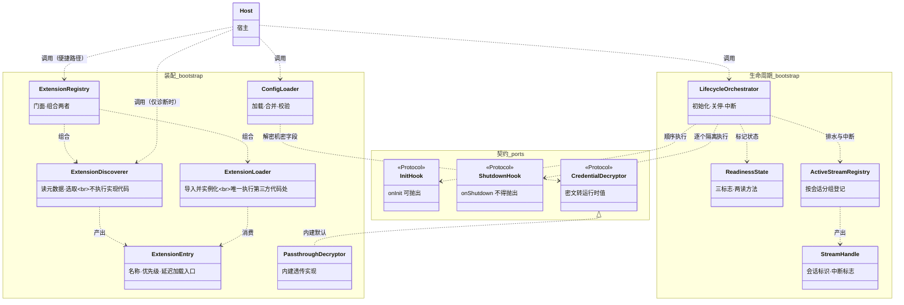
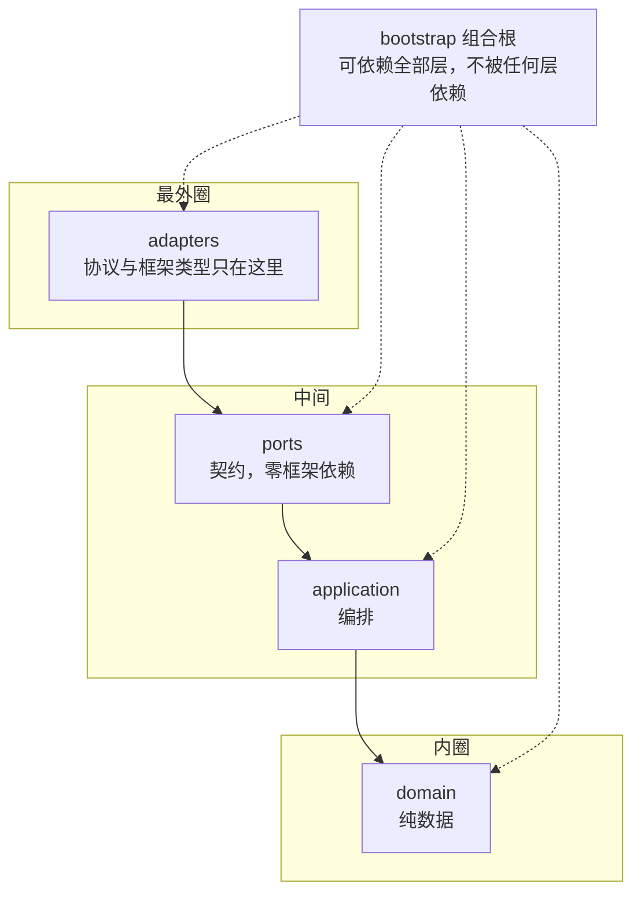
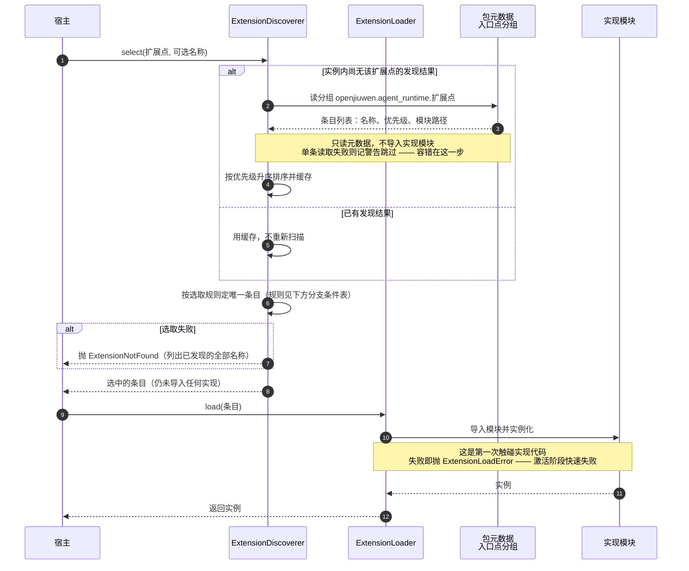
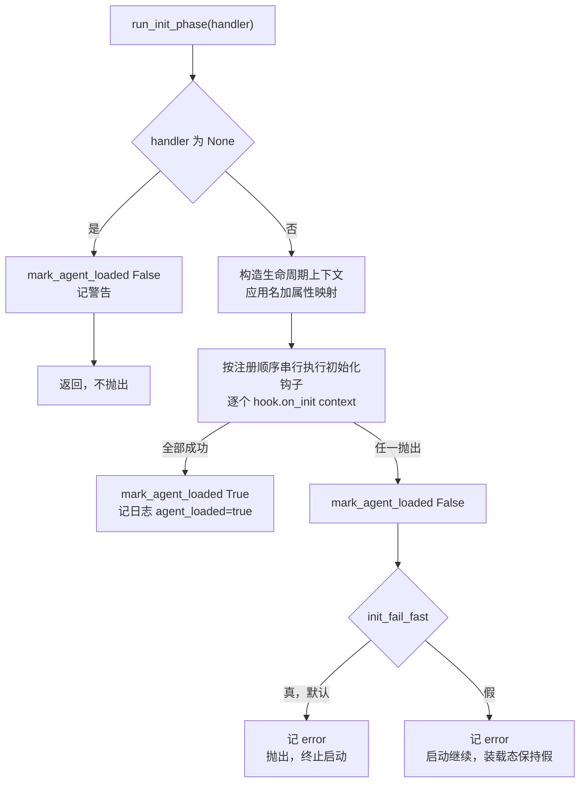
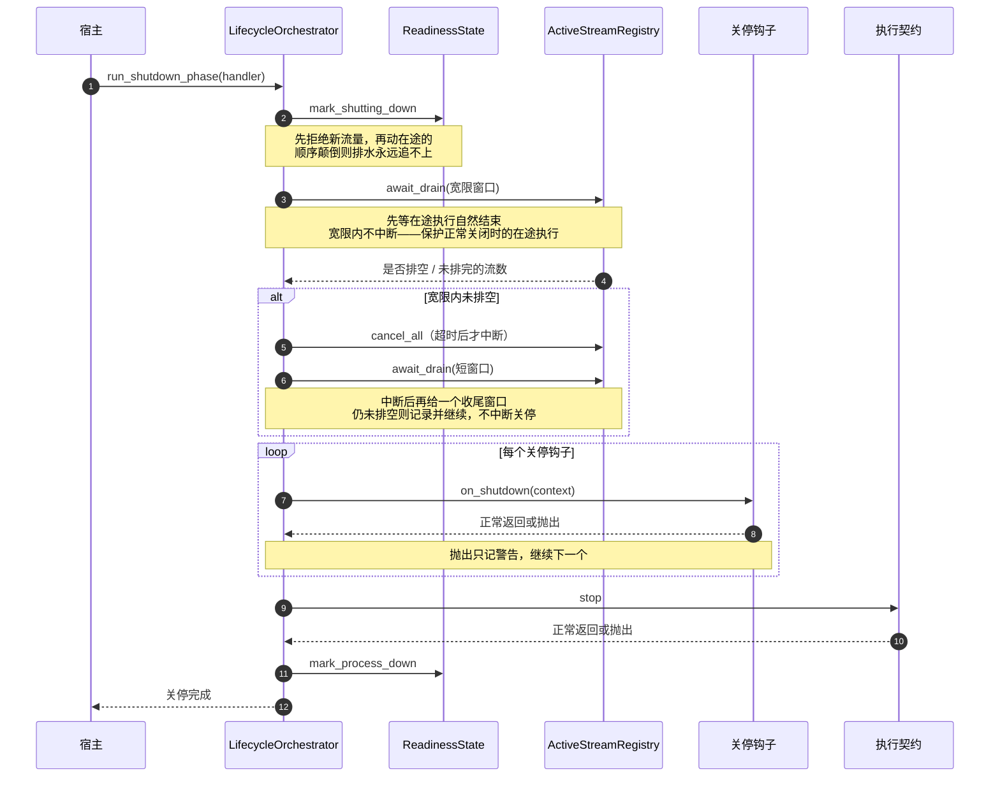
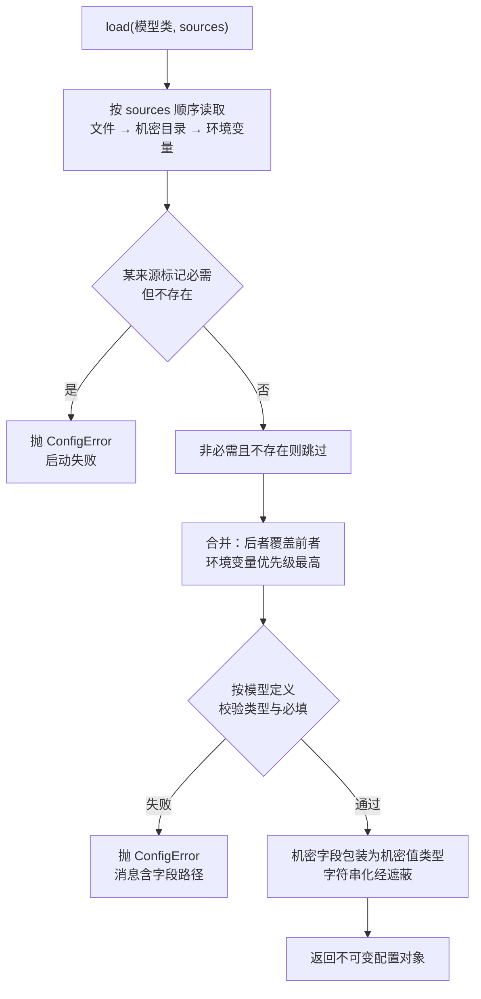
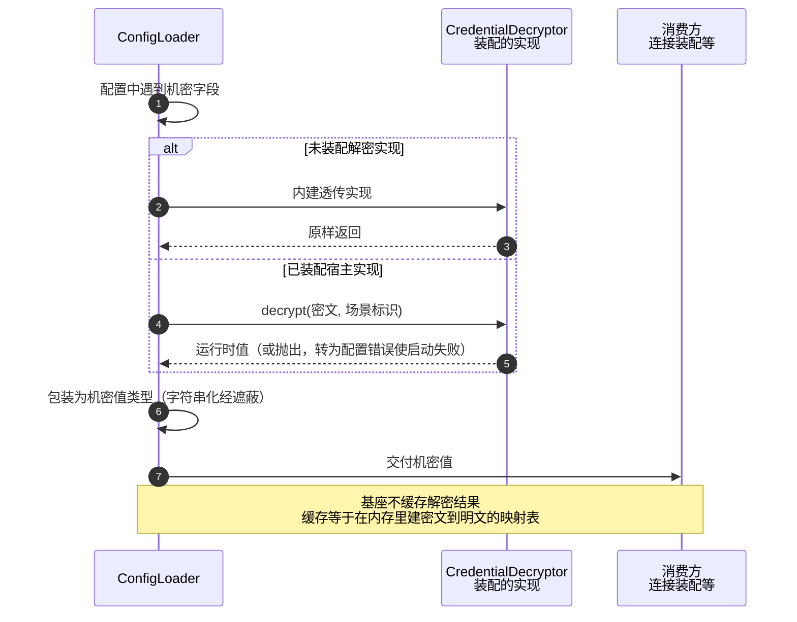

# Python 运行时框架基座 · L2 详细设计

## 1. 概述

### 1.1 特性定位

**角色**：本篇是 runtime 的**装配底座**——它不提供任何业务能力，只提供其余各篇赖以落地的四件机制：契约发现与选取、生命周期编排、配置绑定、凭据解密接缝。

**现状 → 目标**：对标实现运行在成熟应用框架之上，上述四件由框架提供，因此其特性规格无须描述它们。本语言没有等价的既成框架，四件必须自建。目标是**以最小、最不侵入的方式重建**，并成为其余各篇引用的共同机制来源，避免每篇各自发明一套装配方式。

**本篇为什么没有上位特性规格**：上位的 `version-scope/` 下无对应特性，上位 L2 目录下无同级详设——因为它对应的是上位实现里**由框架承担**的那部分，不是产品能力。本篇的依据因此是三处：项目裁定（基座选型七条结论）、总体设计的分层与命名权威、以及对标实现的既有形态。

**适用**：其余各篇凡涉及可替换实现、装配、启停、配置绑定、凭据处理，一律引用本篇机制。

**不适用**：本篇不定义业务能力，不引入对外可见面，不接管宿主的应用入口，也不提供日志与网络服务框架。

### 1.2 核心设计原则

1. **是库不是框架** — 宿主调用基座，基座**永不反向接管宿主**。理由：本 runtime 是嵌入宿主的 SDK（总体设计 §1 原则三「生态融入」）；基座若抢占应用入口或要求宿主按其方式组织代码，与「可嵌入」直接抵触。

   > **判别线**：**基座决定「一个阶段内部的顺序」，宿主决定「什么时候进入哪个阶段」。** 编排器规定了初始化钩子的执行次序与关停的六步顺序——那是阶段内部的事；但它不决定何时初始化、何时关停、中间跑什么，那些由宿主的调用时机决定。跨过这条线就是框架：若基座提供「跑起来」的入口、由它回调宿主的处理函数，控制权就反转了。
   >
   > 这条线也是三条禁区（§4.0 的 D7）的判据来源——它们各封住一种越线方式：按类型扫描注入让基座决定谁被创建、全局状态让基座跨调用持有控制权、强制继承让宿主的类型受基座支配。

2. **接缝之外不做包装** — 基座只在五个接缝位提供自研件，其余直接使用原生库。理由：包装层的演进滞后于被包装库，包装面越大，宿主被卡在旧能力上的面越大。

   > **接缝**（seam）指**能在不修改既有代码的前提下换掉一段行为的可替换点**——宿主在这里插入自己的实现，基座其余部分不必改动。可替换点有两种形态：**代码内的**（契约、装配、生命周期、配置四者，落为具体的类型与方法）与**分发上的**（打包约定，换一个适配包即换掉实现，不触碰任何代码）。本文沿用上位设计与基座选型结论中的这一用词，不另造名称。
   >
   > **定义写成「可替换点」而非「代码位置」，正是为了容纳后者**——打包约定不落代码，却是本设计里替换成本最低的一个接缝。
   >
   > **五个接缝位**：契约、装配、生命周期、配置、**打包约定**。前四者落为代码（§1.4 的对应关系），打包约定不落代码、是分发形态（§4.0 的 D5）。
   >
   > **接缝位与 §1.3 的子特性全景不是同一维度**：接缝位是**机制分类**，子特性全景是**本篇的交付物清单**。凭据解密在全景中单列，是因为它是一件要交付的东西；就机制而言它同时用了「契约」与「装配」两个接缝，不是第六个接缝。

3. **依赖防腐按风险不对称执行** — 高迭代风险的第三方库边界禁闭在单一模块内，低风险的标准库件不包装。理由：一刀切的防腐会为标准库件付出等同的包装成本，而它们的接口稳定性远高于我方的包装层。

4. **接入方式不得强制** — 契约用结构化子类型表达，宿主既可构造注入也可配置装配，**不要求继承或装饰器**。理由：强制继承会污染宿主的类型层次；强制装饰器会要求宿主在导入期就绑定基座。

5. **生命周期的失败行为按阶段分档** — 初始化失败可配置为终止启动或降级启动；关停失败一律不中断回收。理由：启动期失败还有机会拒绝流量，关停期失败若中断回收会造成资源泄漏，二者的正确处置方向相反。

### 1.3 子特性全景

| 子特性 | 职责 | 关键抽象 | 状态 |
|---|---|---|---|
| 契约层 | 可替换实现的类型面，零框架依赖 | 各扩展点的结构化子类型协议 | 已实现（随各特性的端口定义落地） |
| 扩展点发现 | 读包元数据、按名解析、按优先级选取——**不执行任何实现代码** | `ExtensionDiscoverer` | 计划中 |
| 扩展点加载 | 导入并实例化——**基座唯一执行第三方代码处** | `ExtensionLoader` | 计划中 |
| 生命周期编排 | 初始化阶段、关停阶段、活跃流排水 | `LifecycleOrchestrator` | 部分实现（排水与后进先出停止已有雏形，见 §13） |
| 就绪状态 | 表达本副本能否接活 | `ReadinessView` / `ReadinessState` | 计划中 |
| 在途流登记 | 登记在途流以支撑排水与定向中断 | `ActiveStreamRegistry` | 计划中 |
| 配置基座 | 声明式绑定、环境变量覆盖、机密值承载 | `ConfigLoader` | **已实现** |

> **凭据解密不在上表**——它是**基座承载的一个扩展点**，不是基座自己的一件功能。基座为它提供契约面与内建透传实现（§4.4），正如为存储、执行契约提供契约面一样；解密的**语义**归安全域，不归基座。把它与装配、生命周期、配置并列，会让人以为基座要为密钥体系负责。

> **就绪状态与在途流登记为何分成两件**：前者答「本副本能否接活」，后者答「在途有哪些流」——**两个问题，两套读者**。就绪状态的读者是运维探测与入口，在途流登记的读者只有关停流程。合并后，任何想查就绪的组件都会同时拿到中断在途流的能力。

### 1.4 术语与命名对齐

| 本文用名 | 含义 | 对标实现的对应物 | 一致性 |
|---|---|---|---|
| `CredentialDecryptor` | 凭据解密契约 | `openJiuwen/agent-runtime-java/service/agent-service-adapters/agent-service-adapters-common/src/main/java/com/openjiuwen/service/adapters/common/credential/CredentialDecryptor.java:15` | **名称一致** |
| `ActiveStreamRegistry` | 活跃流注册表 | `openJiuwen/agent-runtime-java/service/agent-service-app/src/main/java/com/openjiuwen/service/app/lifecycle/ActiveStreamRegistry.java` | **名称一致** |
| `ReadinessView` / `ReadinessState` | 就绪状态的只读视图与读写全集 | 对标为接口 `AgentReadiness`（两个读方法）+ 默认实现（含写方法）两件 | **同为两件**：只读视图对应其接口、读写全集对应其实现类；本语言用协议继承表达，语义等价（§2.3.1） |
| `LifecycleOrchestrator` | 生命周期编排器 | 同目录 `AgentLifecycleManager.java:16`、`:21`、`:28`（三方法接口） | **本地命名**：对标称管理器，本文称编排器；语义等价，方法一一对应 |
| `InitHook` / `ShutdownHook` | 初始化钩子 / 关停钩子 | `agent-service-spec/.../lifecycle/AgentInitHook.java:23`、`AgentShutdownHook.java:18` | **本地简称**：去掉 `Agent` 前缀（基座内无歧义），方法名一一对应 |
| `ExtensionRegistry` | 扩展点装配门面 | **无对应物**——对标由应用框架的容器承担 | 本语言特有，见 §4.1 |
| `ConfigLoader` | 配置加载入口 | **无对应物**——对标由应用框架的配置绑定承担 | 本语言特有，见 §4.3 |
| 接缝（seam） | 可在不改动该处代码的前提下替换行为的位置 | 上位设计与基座选型结论均用此词 | **沿用上位用词**；定义与五个接缝位见 §1.2 原则二 |

**领域对象名不在本篇定义**：本篇不涉及领域对象，只涉及基座自身的机制类型。凡引用领域对象名（如执行契约），一律以总体设计 §1 的命名权威为准，不新造。

---

## 2. 功能规格

### 2.1 能力清单

| # | 能力 | 事实要求（外部可观察行为） | 状态 |
|---|---|---|---|
| K1 | 契约以结构化子类型表达 | 实现方**不继承任何基类、不调用任何注册函数**，只要方法面匹配即可被装配 | 已实现 |
| K2 | 入口点发现 | 装配时能发现全部已安装且注册到约定分组的实现，并读出其名称与优先级 | **已实现** |
| K3 | 确定性选取 | 同一组已安装实现 + 同一配置 ⇒ **每次启动选中同一个实现**；选中结果出现在启动日志 | 计划中 |
| K4 | 装配双通道 | 宿主传入实例时用该实例；未传入时按配置构造；**两者同时给出时以传入的为准** | 部分实现 |
| K5 | 初始化阶段编排 | 启动时按注册顺序执行全部初始化钩子；任一钩子抛出时按配置决定终止启动或降级启动 | 计划中 |
| K6 | 关停阶段编排 | 关停时先拒绝新流量、再排空在途流、再执行关停钩子、最后停止执行契约；**任一关停钩子失败不影响其余钩子执行** | 部分实现 |
| K7 | 就绪状态可查询 | 外部可查询两个布尔：进程是否可用、执行契约是否已装载；**关停开始后两者均转为假** | 计划中 |
| K8 | 活跃流排水 | 关停时等待在途流结束，等待上限可配；超时未排空时记录并继续关停 | 部分实现 |
| K9 | 配置声明式绑定 | 支持嵌套结构、环境变量覆盖；非法值在启动时报出**字段路径** | **已实现** |
| K10 | 机密值不外泄 | 机密值的字符串化形式经遮蔽；支持从机密目录读取，使机密不必进入配置文件 | **已实现** |
| K11 | 凭据解密可替换 | 未装配解密实现时原样返回配置值；装配后由其接管，**消费方代码不变** | 计划中 |
| K12 | 失败策略分层 | 发现阶段：某实现导入失败被跳过且**不影响其余实现与启动**；激活阶段：被选中的实现构造失败则启动失败 | 计划中 |
| K13 | 适配件独立分发 | 缺少某适配件依赖时，错误信息**指明缺哪个包**，而非抛出原始导入错误 | 计划中 |

### 2.2 显式排除

| 排除项 | 原因 | 替代方案 |
|---|---|---|
| 控制反转与自动装配 | 基座是库不是框架；按类型扫描注入会反向接管宿主的对象图 | 构造注入 + 配置装配双通道（§4.1.2） |
| 基座持有全局状态 | 全局状态使同进程多套并存不可能，且让测试之间互相污染 | 全部组件实例化持有（§5） |
| 要求宿主以继承或装饰器接入 | 污染宿主类型层次；装饰器要求导入期绑定 | 结构化子类型契约（§4.0 第一条决策） |
| 运行期重新装配 | 动态换实现会使正在执行的调用横跨两套实现 | 配置变更经重启生效（§9.2） |
| 为标准库件提供包装层 | 包装层演进滞后于被包装库 | 由装配门面与生命周期编排器这两个本就要写的自研件间接消费（§4.0 第四条决策） |
| 日志框架与网络服务框架 | 二者均由宿主选择；基座接管会锁定宿主技术栈 | 基座只安装空日志处理器，输出由宿主掌控（§9.1） |
| 扩展点实现的来源与签名校验 | **遵从对标实现**：其装配路径无此类校验 | 部署方对安装到环境中的包负责（§10） |

### 2.3 接口契约

#### 2.3.1 API / SPI 声明

基座对宿主暴露**单一导入面**，四组导出。以下签名是实现者必须满足的契约。

**一 · 扩展点装配门面**

```python
class ExtensionDiscoverer:
    """**只读包元数据，不导入任何实现模块**。一个实例持有一份发现结果，同进程可多套并存。

    与加载器分开，是因为二者的信任级别不同：本类只读取声明，不执行第三方代码。
    """

    def __init__(self, *, group_prefix: str = "openjiuwen.agent_runtime") -> None: ...

    def discover(self, extension_point: str) -> list[ExtensionEntry]:
        """发现某扩展点下全部已安装实现。

        参数 extension_point：扩展点名，与入口点分组名拼接为 f"{group_prefix}.{extension_point}"。
        返回：按优先级升序排好的条目列表；未声明优先级者取默认值 100。
        实现者必须保证：单个条目导入失败时跳过该条并记录，**不影响其余条目**（§4.1.1 的延迟加载前提）。
        本方法可重复调用，结果由实例缓存；缓存后不再感知新装包（§4.1.2 的时机约定）。
        """

    def select(self, extension_point: str, *, name: str | None = None) -> ExtensionEntry:
        """选出唯一实现——**只做决策，不加载**（加载见 `ExtensionLoader`）。

        参数 name：非空时按名精确匹配；为空时取优先级最高者。
        返回：唯一条目。
        实现者必须保证：name 非空但未匹配到时抛出 ExtensionNotFound，**不回退到优先级选取**；
        零条目且该扩展点无内建默认时同样抛出。
        """


class ExtensionLoader:
    """**导入并实例化实现——这是基座唯一执行第三方代码的地方**。

    单独成件，使「谁能执行第三方代码」在类型层面可见（§10 的代码执行面）。
    """

    def load(self, entry: ExtensionEntry) -> object:
        """加载并实例化条目指向的实现。

        实现者必须保证：加载失败时抛出 ExtensionLoadError 并在消息中包含条目名与原始异常；
        **不得吞掉异常返回 None**——那会让调用方拿到一个看似成功的空值。
        """


class ExtensionRegistry:
    """门面：组合发现器与加载器，为宿主提供一步到位的便捷入口。

    **它不新增任何职责**——只是把「发现 → 选取 → 加载」三步串起来。
    需要单独使用其中一步的宿主（例如只想列出已安装实现做诊断），直接用发现器。
    """

    def __init__(self, discoverer: ExtensionDiscoverer, loader: ExtensionLoader) -> None: ...

    def resolve(self, extension_point: str, *, name: str | None = None) -> object:
        """选取并加载，返回可用实例。等价于 `select` 后接 `load`。

        实现者必须保证：本方法不吞掉任一步的异常——选取失败抛 ExtensionNotFound、
        加载失败抛 ExtensionLoadError，调用方据类型区分是「没找到」还是「装不上」。
        """
```

**二 · 生命周期编排器**

```python
class LifecycleOrchestrator:
    """初始化阶段、关停阶段、在途流中断。对标 AgentLifecycleManager 的三方法接口。"""

    def __init__(
        self,
        *,
        app_name: str,
        readiness: ReadinessState,
        stream_registry: ActiveStreamRegistry,
        init_hooks: Sequence[InitHook] = (),
        shutdown_hooks: Sequence[ShutdownHook] = (),
        shutdown_timeout_s: float = 30.0,
        init_fail_fast: bool = True,
    ) -> None: ...

    async def run_init_phase(self, handler: object | None) -> None:
        """执行初始化阶段。

        handler：本实例要托管的执行契约实现；为 None 时标记未装载并告警，**但不抛出**。
        实现者必须保证：钩子按注册顺序串行执行；任一钩子抛出时先标记未装载，
        再按 init_fail_fast 决定抛出（终止启动）或仅记录（降级启动）。
        本方法**不可并发调用，也不可重复调用**（§4.2.2）。
        """

    async def run_shutdown_phase(self, handler: object | None) -> None:
        """执行关停阶段，顺序固定为：标记关停中 → 排空在途流 → 关停钩子 → 停止执行契约 → 标记进程下线。

        实现者必须保证：**任一关停钩子或停止动作抛出时只记录、不中断后续步骤**；
        本方法**可重复调用且第二次为空操作**（§4.2.3）。
        """

    def interrupt(self, conversation_id: str) -> int:
        """中断某会话的全部在途流。返回被中断的流数量（可为 0）。

        实现者必须保证：本方法**可与流的正常结束并发发生**，对已结束的流为空操作。
        """
```

**三 · 就绪状态与活跃流注册表**

```python
class ReadinessView(Protocol):
    """只读视图。交给入口与探测方——它们只需要知道能否接活，不应有权改变它。"""

    def is_process_up(self) -> bool:
        """进程可用 = 进程未下线 且 未进入关停。"""

    def is_agent_loaded(self) -> bool:
        """执行契约已装载 = 已标记装载 且 未进入关停。"""


class ReadinessState(ReadinessView):
    """读写全集。**只交给生命周期编排器**，不向其他组件暴露。"""

    def mark_agent_loaded(self, loaded: bool) -> None: ...
    def mark_shutting_down(self) -> None:
        """置关停中；实现者必须保证此后两个读方法均返回 False。"""
    def mark_process_down(self) -> None: ...


class ActiveStreamRegistry:
    """按会话分组的在途流登记，用于关停排水与定向中断。"""

    def register(self, conversation_id: str) -> StreamHandle:
        """登记一条在途流，返回其句柄。实现者必须保证本方法可并发调用。"""

    def unregister(self, conversation_id: str, handle: StreamHandle) -> None:
        """注销。实现者必须保证：**对已注销的句柄重复调用是空操作**，不抛出。"""

    def cancel(self, conversation_id: str) -> int:
        """中断某会话的全部在途流，返回被置中断标志的流数。

        实现者必须保证：对已结束的流是空操作；本方法**可与流的正常结束并发发生**。
        """

    def cancel_all(self) -> int:
        """中断全部在途流，返回被置中断标志的流数。**仅在排水宽限耗尽后调用**（§4.2.1）。

        实现者必须保证：可重复调用，第二次对已中断的流是空操作。
        """

    def active_count(self) -> int: ...

    async def await_drain(self, timeout_s: float) -> bool:
        """等待全部在途流**收尾**（而非执行完）。返回是否在超时前排空。

        关停路径调用两次：第一次等宽限窗口（**不中断**），耗尽后 `cancel_all` 再等一个短窗口（§4.2.1）。
        实现者必须保证：**等待期间让出事件循环**——不得自旋（§4.2.2 的语言差异说明）。
        """
```

**四 · 配置基座与凭据解密**

```python
class ConfigLoader:
    """声明式配置绑定。本模块是第三方配置库的唯一接触点（§4.3.3）。"""

    def load(self, model: type[C], *, sources: Sequence[ConfigSource] = ()) -> C:
        """按模型定义加载配置。

        实现者必须保证：校验失败时抛出 ConfigError 并在消息中包含**字段路径**；
        环境变量覆盖文件值；机密值以专用类型承载，其字符串化形式经遮蔽。
        """


class CredentialDecryptor(Protocol):
    """凭据解密契约。内建实现为透传。"""

    def decrypt(self, ciphertext: str, *, scene: str = "") -> str:
        """把密文转为运行时值。

        参数 scene：解密场景标识，供宿主实现按场景选择密钥；内建透传实现忽略该参数。
            **取值集合对齐对标实现的场景分类**（见下表），不自行扩充；未列出的场景传空串。
        返回：运行时可直接使用的明文值。
        实现者必须保证：**入参为空字符串时返回空字符串**，不抛出——未配置凭据是合法状态。
        """
```

#### 2.3.2 数据类型

| 类型 | 关键字段 | 含义 | 约束 |
|---|---|---|---|
| `ExtensionEntry` | `name` | 入口点注册名 | 非空；同一扩展点内唯一；由适配件在包元数据中声明；缺失则该条目在发现阶段被跳过 |
| | `priority` | 选取优先级 | 整数，**数值小者优先**；可空，缺失时取 100；取值范围不限，建议 0–999 |
| | `extension_point` | 所属扩展点名 | 非空；由发现方填充，不取自包元数据 |
| | `loader` | 延迟加载入口 | 非空；由发现方填充；**调用前不导入实现模块**（§4.1.1 的延迟加载） |
| `StreamHandle` | `conversation_id` | 所属会话标识 | 非空；由注册方填充 |
| | `cancelled` | 是否已被请求中断 | 布尔，初值假；仅由编排器置真；消费侧只读 |
| `ConfigSource` | `kind` | 来源类型 | 取值：文件／环境变量／机密目录；非空 |
| | `location` | 来源位置 | 文件路径或目录路径；环境变量来源时为空 |
| | `required` | 缺失时是否失败 | 布尔，默认假；为真且来源不存在时启动失败 |
| `SecretValue` | `raw` | 机密原值 | 非空则为运行时值；**禁止直接记录**；其字符串化形式返回固定遮蔽串 |
| | `source_kind` | 取自哪类来源 | 用于诊断；可记录 |

**解密场景标识的取值**，对齐对标实现的常量类（`openJiuwen/agent-runtime-java/service/agent-service-adapters/agent-service-adapters-common/src/main/java/com/openjiuwen/service/adapters/common/credential/CredentialSceneType.java`）。本篇只列 runtime 侧会用到的，未列出的不自行扩充：

| 场景标识 | 用于 |
|---|---|
| 空串 | 调用方不区分凭据类型（对标的 `UNKNOWN`） |
| 存储口令 | 状态缓存的连接口令（对标的 `REDIS_PASSWORD`） |
| 远端调用令牌 | 出站远端调用的鉴权令牌（对标的 `REMOTE_AUTH_TOKEN`） |
| 传输层密钥库口令 | 入站传输层的密钥库与信任库口令（对标的 `TLS_KEYSTORE_PASSWORD`、`TLS_TRUSTSTORE_PASSWORD`） |

> **为什么不照搬整组常量**：对标的常量类还含模型接口密钥、记忆服务密钥、工具协议令牌、沙箱令牌等——那些凭据由兄弟模块持有，不经本 runtime 的配置面。列进来会让实现者以为基座要为它们负责。

#### 2.3.3 行为承诺

**必须**

- 同一组已安装实现 + 同一配置，**每次启动选中同一个实现**。
- 按名指定但未匹配到时**失败**，不回退到优先级选取。
- 初始化钩子**按注册顺序串行执行**。
- 关停顺序固定：标记关停中 → 排空 → 关停钩子 → 停止执行契约 → 标记进程下线。
- 关停阶段任一步骤失败**只记录、不中断后续步骤**。
- 关停开始后，就绪的两个读方法**均返回假**。
- 机密值的字符串化形式**不含原值**。
- 配置校验失败的错误消息**包含字段路径**。

**禁止**

- 基座持有模块级可变状态。
- 基座反向调用宿主（无回调注册、无入口接管）。
- 加载失败时吞掉异常返回空值。
- 排空等待期间自旋占用事件循环。
- 对已注销的流句柄重复注销时抛出。
- 运行期重新装配。

**允许**（实现者的自由度，不得当作契约违反）

- `discover` 的结果**可以缓存**在实例内，不要求每次调用都重新扫描。
- 优先级相同的多个条目，**其相对顺序未定义**——实现者可按任意稳定顺序排列；调用方不得依赖该顺序。
- 关停钩子**可以并发执行**（本设计不要求串行），只要各自的失败互不影响。
- 就绪状态的内部标志**可以用任意形式表达**（三个布尔、一个枚举、状态机），只要两个读方法的语义成立。
- 排空等待的**具体让出方式不限**（轮询间隔、条件变量、事件），只要不阻塞事件循环。
- `ExtensionEntry` **可以携带额外字段**（如包版本、注册路径）供诊断，调用方不得依赖其存在。

#### 2.3.4 消息队列声明

**本特性不涉及消息队列。** 基座只做进程内的装配与生命周期编排，不发布也不消费任何事件；跨进程的事件能力由对应特性承担，其接入方式经本篇的扩展点机制，但事件语义不在本篇范围。

---

## 3. 模块结构

### 3.1 包结构

```
agent_runtime/
  ports/                      # 契约层：各扩展点的结构化子类型协议，零框架依赖
    cache.py                  #   存储端口契约（属任务状态缓存特性，基座只负责其装配）
    handler.py                #   执行契约（属异构框架兼容特性，同上）
    remote.py                 #   远端调用端口契约（属远端通信特性，同上）
  bootstrap/                  # 组合根：基座自身的四件机制
    discovery.py              #   扩展点发现：读包元数据、按名解析、优先级选取（不导入实现）
    loading.py                #   扩展点加载：导入并实例化（基座唯一执行第三方代码处）
    registry.py               #   门面：组合发现与加载，提供一步到位的解析入口
    lifecycle.py              #   生命周期编排器：初始化阶段、关停阶段、在途流中断
    readiness.py              #   就绪状态：三个内部标志、两个对外读方法
    stream_registry.py        #   活跃流注册表：按会话分组登记，支撑排水与定向中断
    errors.py                 #   基座自身的异常类型：扩展点未找到、加载失败、配置错误
    config/                   #   配置基座（第三方配置库的唯一接触点，惰性导出）
      __init__.py             #     惰性导出：未访问配置名称时不导入该库
      loader.py               #     加载、合并、校验
      secret.py               #     机密值类型：遮蔽字符串化、机密目录读取
      credential.py           #     凭据解密契约与内建透传实现
    <各应用组装>.py            #   按配置或参数装配出可运行的应用（属各入口特性）
```

**不列入本篇的文件**：`ports/` 下三个契约文件的**内容**归各自特性，本篇只负责它们的发现与装配；`<各应用组装>.py` 的**内容**归各入口特性，本篇只提供其调用的机制。

### 3.2 类图与静态关系



**模式标注**：`ExtensionDiscoverer` 与 `ExtensionLoader` 各自**职责单一**（读声明 / 执行代码），`ExtensionRegistry` 是**门面**（组合两者，不新增职责）；`InitHook`／`ShutdownHook`／`CredentialDecryptor` 是**结构化子类型协议**（实现方无需继承）；`PassthroughDecryptor` 是**空对象**（内建默认实现，使「未配置解密」成为零配置路径）；`LifecycleOrchestrator` 是**编排器**（自身不持业务逻辑，只按固定顺序驱动其余组件）。

### 3.3 依赖方向与禁止依赖

**组合根挂载生命周期时的一条硬约束**：ASGI 框架的 lifespan 与 `on_event("startup")` **互斥**。组合根一旦把 runtime 的生命周期挂成 lifespan，宿主原先用 `on_event` 注册的启动逻辑就**再也不会执行，且不报任何错**——它只在运行期取到未初始化的资源时才暴露。

**故组合根必须提供初始化钩子入口**：宿主把启动逻辑作为钩子传入，由生命周期在处理器启动**之前**按序执行（处理器可能依赖钩子准备好的资源）。剥夺宿主的启动能力而不归还，是把一个框架细节变成使用方的陷阱。

> **实证**：给自定义入口的组合根补挂生命周期后，三个部署级验证服务用 `on_event` 注册执行单元的代码全部静默失效，容器往返在取用执行单元时报空引用。单测全绿——它们不经过启动路径。

**本模块可以依赖谁**：`bootstrap` 作为组合根可以导入任意层——它的职责就是把各层接到一起。`ports` 只能依赖标准库与 `domain`——契约的方法签名要用领域类型表达（执行上下文、结果块），只用原生类型会把语义丢在签名之外。这与总体设计 §1 的依赖方向一致：依赖从外向内，端口在领域之外。

**本模块绝不能依赖谁**：

| 禁止 | 理由 |
|---|---|
| `ports` 导入任何第三方库 | 契约层被三方库污染后，实现方要装该库才能实现契约 |
| `bootstrap/config/` 之外的任何模块导入配置库 | 防腐边界（§4.3.3）；破一处就等于全仓绑定该库的版本 |
| 任何层导入 `bootstrap` | 组合根被反向依赖即成隐式全局，与「不持全局状态」抵触 |
| 基座注册回调到宿主 | 反向调用会让基座接管宿主的控制流 |

**违反了会怎样**：

| 违反 | 能否被静态检查发现 | 发现不了靠什么兜住 |
|---|---|---|
| `ports` 导入三方库 | **能**——扫描 `ports/` 下的导入语句，白名单只含标准库与 `domain` | — |
| 配置库泄漏到 `config/` 之外 | **能**——扫描全仓导入该库的文件，白名单只含 `bootstrap/config/` | — |
| 某层导入 `bootstrap` | **能**——扫描各层导入，命中即红 | — |
| 基座反向调用宿主 | **不能**——回调可以经参数传入，静态扫不出 | 契约层面兜住：基座的公开方法**不接受任何可调用对象作为参数**（§2.3.1 全部签名可核）；新增签名时须过这一条 |

> 前三条有静态判据，第四条没有——所以它被写进了行为承诺的「禁止」档（§2.3.3），并在验收里以签名审计的形式落地（§12.1 的 V4）。**没有静态判据的约束必须换一种可核形式，不能只靠自觉。**

---

## 4. 核心设计

### 4.0 基座选型的七条决策

**本节是这七条在本仓的唯一权威定义**（裁定见 `DECISIONS-2026-07-28-领域模型与骨架设计.md:125`）。其余各篇引用编号时以本节为准。

| 编号 | 决策 | 对标的框架能力 | 理由 |
|---|---|---|---|
| **D1** | 契约层用**结构化子类型**（标注运行时可检查以获得存在性兜底，签名保真由静态检查承担） | 接口与服务发现契约 | 实现方无需继承、无需注册、无需导入基座基类即可接入 |
| **D2** | 发现与替换用**标准入口点** + 自研薄门面；分组名统一为 `openjiuwen.agent_runtime.<扩展点>`；支持按名解析与按优先级选取 | 组件扫描与条件装配 | 标准库只提供「读出全部注册项」，选取规则、分组约定、失败策略必须自研；归位为具名件的边际成本接近零 |
| **D3** | 装配与生命周期**零框架**：构造注入 + 「参数存在则用参数，否则用内建默认」双通道；异步资源栈做成对启停 | 依赖注入容器与容器管理的生命周期 | 双通道使宿主既可完全掌控装配，也可零代码只改配置 |
| **D4** | 配置绑定用**声明式配置库**，适配器选择用判别式联合按类型字段分派 | 配置属性绑定与条件装配 | 该库是全部依赖中迭代风险最高的一项，故边界禁闭（见 §4.3.3） |
| **D5** | 打包对标**启动器模型**：核心依赖极薄；适配件独立发布并各自注册入口点；可选依赖组作友好入口 | 启动器式依赖聚合 | 宿主只需一两种适配时，不应被迫安装全部第三方依赖 |
| **D6** | 失败策略**分层**：发现阶段容错跳过，激活阶段快速失败 | 条件装配的失败行为 | 已安装但未被选中的实现出问题不应阻止启动；被明确选中的实现失败若静默降级，会让部署方以为配置生效了 |
| **D7** | 交付形态是**薄内核**：D1–D6 粘合为 SDK 自带模块，单一导入面，随 SDK 版本化，不独立立项 | 框架角色本身 | 粘合逻辑必然存在；命名归位立契约的边际成本接近零，且给开发者单一认知锚点 |

**D7 的三条禁区**（一票否决项，基座演进不得触碰）：

1. **不做控制反转与自动装配**——不按类型扫描注入，不反向调用宿主入口。
2. **不持全局状态**——组件全部实例化持有，**同进程允许多套并存**。
3. **不要求宿主以继承或装饰器接入**——契约保持结构化子类型，构造注入通道永远可用。

**被否决的方案与理由**：

| 方案类别 | 代表 | 否决理由 |
|---|---|---|
| 配置框架型 | Hydra | 抢占宿主应用入口，与「不接管宿主」抵触 |
| 插件钩子型 | pluggy | 语义是广播式钩子而非单实现选取，且不支持异步 |
| 依赖注入容器型 | dishka、dependency-injector | 侵入性强，需宿主按其方式组织对象图 |
| 弱类型配置型 | Dynaconf | 类型能力不足，配置错误要到运行时才暴露 |
| 服务框架内置注入型 | FastAPI 的依赖注入 | 会把基座锁定到某个网络服务框架 |

**同类基础设施的共同做法**是本决策的旁证：跨包替换一律用入口点，同进程装配一律用构造注入，未见使用控制反转容器者。

### 4.1 扩展点装配

#### 4.1.1 关键处理流程

装配分三个阶段，**参与方有五个**——发现器与加载器分列两条泳道，正是为了让「哪一步才导入实现代码」一眼可见：发现器只与包元数据往来，加载器才触碰实现模块。这条分界决定了容错策略能否成立。



**两条注解是本节的设计要点**：发现阶段只读元数据，因此某个适配件缺依赖时它不会抛出；导入推迟到加载阶段，失败即快速失败。**若发现阶段就导入模块，容错与快速失败便无法分开**——这正是 D6 能够成立的结构前提。

**分支条件**

| 条件 | 走哪条路 |
|---|---|
| 配置按名指定 | 精确匹配；未命中即失败，不回退到优先级选取 |
| 未指定且发现 ≥ 1 条 | 取优先级数值最小者 |
| 未指定且发现 0 条，该扩展点有内建默认 | 用内建默认 |
| 未指定且发现 0 条，无内建默认 | 启动失败，错误指明缺哪个扩展点 |

**边界条件**

| 边界 | 处理 |
|---|---|
| 某条目的元数据缺名称 | 发现阶段跳过该条，记警告 |
| 某条目导入失败（缺依赖、版本不兼容） | **发现阶段跳过**（此时尚未导入实现模块，见下）；若该条目正是被选中者，则在 `load` 阶段失败 |
| 优先级字段非整数 | 该条目按缺省值 100 处理，记警告 |
| 多条目优先级相同 | 相对顺序未定义（§2.3.3「允许」档）；调用方不得依赖 |
| 同一扩展点被并发选取 | 见 §4.1.2 |

> **发现阶段为什么能容错**：`ExtensionEntry.loader` 是**延迟加载入口**——发现阶段只读包元数据（名称、优先级、模块路径），**不导入实现模块**。因此某个适配件缺依赖时，它在发现阶段不会抛出；只有被 `load` 真正加载时才暴露。这正是 D6「发现容错、激活快速失败」能够成立的前提。若发现阶段就导入模块，容错与快速失败就无法分开。

**状态转换表**

| 当前状态 | 事件 | 下一状态 | 附加行为 |
|---|---|---|---|
| 未发现 | 首次 `discover`／`select` | 已发现 | 记日志：分组名、条目数、各条名称与优先级 |
| 未发现 | 读取分组时整体失败 | 已发现（空） | 记警告；后续按「0 条」处理 |
| 已发现 | `select` 命中 | 已选取 | 记日志：选中名、选取依据（按名／按优先级／内建默认） |
| 已发现 | `select` 未命中 | 已发现（不变） | 抛 `ExtensionNotFound`，消息含已发现的全部名称 |
| 已选取 | `load` 成功 | 已加载 | 记日志：实现类型名 |
| 已选取 | `load` 失败 | 已选取（不变） | 抛 `ExtensionLoadError`，消息含条目名与原始异常 |

#### 4.1.2 并发与协程安全边界

**单写者假设**：`ExtensionDiscoverer` 实例的发现结果缓存**假设只在启动期写入一次**。该假设由**调用时机**保证，不由锁保证——装配发生在应用组装阶段，此时尚未接受任何流量。

| 方法 | 可否并发调用 | 说明 |
|---|---|---|
| `discover` | **否**（启动期单线程） | 并发首次调用可能重复扫描并互相覆盖缓存。**结果幂等**（同样的已安装包扫出同样的条目），故重复扫描不产生错误结果，只是浪费 |
| `select` | **是**（缓存建立后只读） | 缓存建立后是纯读；调用方若在运行期需要重新选取，读到的是启动期的快照 |
| `load` | **是** | 导入本身由解释器的导入锁保证同一模块只导入一次 |

**竞态窗口**：并发首次 `discover` 时，两个协程可能各自扫描并分别写入缓存。**窗口内的行为是「后写者覆盖」，两份结果内容相同**（同一组已安装包），故不产生可观察差异。**这是已知接受的残余风险**——为它加锁需要在纯启动期路径上引入同步原语，收益为零。

> **本设计不为「运行期动态装包」留窗口**：缓存建立后不再感知新装的包（§2.3.1 的时机约定）。这与「不做运行期重新装配」是同一条边界的两面。

**同进程多实例的隔离**：两个 `ExtensionDiscoverer` 实例各持自己的缓存，**互不可见**。这是 D7 禁区第二条「不持全局状态」的可判定形式，也使测试之间不互相污染（§12.1 的 V3）。

#### 4.1.3 幂等键与重试语义

**本子特性涉及一类标识**：`ExtensionEntry.name`（入口点注册名）。它是**选取键**，不是幂等键——它用于在一组条目中定位唯一条目，不用于去重或防止重复执行。

| 操作 | 重复调用的行为 | 理由 |
|---|---|---|
| `discover` | **幂等**：返回同一份缓存，不重新扫描 | 扫描结果由已安装包决定，重复扫描无新信息 |
| `select` | **幂等**：同一参数返回同一条目 | 纯读 |
| `load` | **非幂等但等价**：模块由解释器缓存，重复调用返回同一模块的新实例（若实现类可多次实例化） | 基座不缓存实例——**实例的生命周期归调用方**，基座缓存会制造隐式单例 |

**重试策略：无。** 加载失败不重试，理由是导入有副作用（模块级代码已部分执行），重试可能在半初始化状态上再执行一次。失败即抛出，由启动流程终止。

**重试不改变对外可观察状态**——因为没有重试。

---
### 4.2 生命周期编排

#### 4.2.1 关键处理流程

**初始化阶段**（对标 `openJiuwen/agent-runtime-java/service/agent-service-app/src/main/java/com/openjiuwen/service/app/lifecycle/InitPhaseExecutor.java:47`–`:82`）

**关停阶段**（对标同目录 `ShutdownPhaseExecutor.java:55`–`:94`，顺序固定不可调换）

**为什么顺序不可调换**：先标记再排水——若顺序颠倒，排水期间新流量仍能进入，排水永远追不上。先排水再跑关停钩子——关停钩子可能释放在途流依赖的资源（连接、客户端），提前释放会让正在收尾的流报错。

**排水先等待、超时才中断**，这一点决定了整段的语义：宽限窗口内**不打断任何在途执行**，让它们有机会正常完成、把完整响应交给客户端；只有宽限耗尽后才置中断标志，再给一个短窗口让它们收尾（走完 `finally`、注销句柄）。

**依据是上位的关停策略**：`architecture/L1-High-Level-Design/agent-runtime/physical.md:292` 写明「先进入排水阶段，**等待在途执行结束**；超时后才强停」，并在 `:301` 明确该策略的目的是「**保护正常关闭时的在途执行**」。

> **此处与对标实现的顺序不同，是刻意的。** 对标的排水方法（`openJiuwen/agent-runtime-java/service/agent-service-app/src/main/java/com/openjiuwen/service/app/lifecycle/ShutdownPhaseExecutor.java`）是「先中断全部 → 等待 → 未排空则再次中断」，即**入口即中断**。按既定裁定「行为遵从文档、形态遵从代码」：**顺序属行为语义，取上位文档**；`cancel_all` 与 `await_drain` 这两个方法名属形态，取对标代码。
>
> 两者的对外差别是实在的：入口即中断会让宽限期内本可正常完成的请求拿到中断，而上位策略明写要保护它们。

**就绪状态转换表**（对标同目录 `DefaultAgentReadiness.java:15`–`:44`）

| 当前状态 | 事件 | 下一状态 | `is_process_up()` | `is_agent_loaded()` |
|---|---|---|---|---|
| 初始（进程起） | — | 进程可用、未装载 | 真 | 假 |
| 进程可用、未装载 | `mark_agent_loaded(True)` | 进程可用、已装载 | 真 | 真 |
| 进程可用、已装载 | `mark_agent_loaded(False)` | 进程可用、未装载 | 真 | 假 |
| 任意 | `mark_shutting_down()` | 关停中 | **假** | **假** |
| 关停中 | `mark_process_down()` | 已下线 | 假 | 假 |

**两个读方法都是组合判定**：进程可用 = 进程未下线 **且** 未进入关停；已装载 = 已标记装载 **且** 未进入关停。**关停中必须让两者同时转假**——只转其一会让健康探测与就绪探测给出矛盾结论。

**分支条件**

| 条件 | 走哪条路 |
|---|---|
| 初始化时执行契约为空 | 标记未装载 + 警告，**启动继续**（不抛出） |
| 初始化钩子抛出 且 快速失败开关为真 | 标记未装载 + 抛出，**终止启动** |
| 初始化钩子抛出 且 快速失败开关为假 | 标记未装载 + 记录，**启动继续**，装载态保持假 |
| 排水在超时前完成 | 记日志，继续关停 |
| 宽限窗口内排空 | 无任何在途流被中断，关停继续 |
| 宽限窗口耗尽 | **此时才 `cancel_all`**，再等一个短窗口 |
| 短窗口后仍未排空 | 记录未排完的流数，继续关停（不因此中断） |
| 关停钩子抛出 | 记警告，**继续下一个钩子** |

**边界条件**

| 边界 | 处理 |
|---|---|
| 零个初始化钩子 | 正常路径，直接进入装载判定 |
| 排水开始时零在途流 | `await_drain` 立即返回真 |
| 关停期间仍有新流注册 | 不可能——`mark_shutting_down()` 已在第 1 步执行，入口据 `is_process_up()` 拒绝新流量 |
| 重复调用关停 | 第二次为空操作（§4.2.3） |
| 初始化与关停并发调用 | **未定义行为**，由调用约定禁止（§4.2.2） |
| 中断一个不存在的会话 | 返回 0，不抛出 |

#### 4.2.2 并发与协程安全边界

**单写者假设**：`LifecycleOrchestrator` 的两个阶段方法**假设由单一调用者串行驱动**（应用的启动与关停钩子）。该假设由**调用约定**保证——基座不加锁，因为加锁只会把「谁在乱调」这个真问题变成一次静默的等待。

| 方法 | 可否并发调用 | 保证方式 |
|---|---|---|
| `run_init_phase` | **否** | 调用约定；重复或并发调用是宿主的编排错误 |
| `run_shutdown_phase` | **否**（但可重复，见 §4.2.3） | 同上 |
| `interrupt` | **是** | 对同一会话并发中断等价于中断一次；对已结束的流是空操作 |
| `ReadinessState` 的读方法 | **是** | 见下 |
| `ReadinessState` 的标记方法 | **是** | 见下 |
| `ActiveStreamRegistry.register` / `unregister` | **是** | 见下 |

**就绪状态的可见性**：三个内部标志被**多协程读、少数点写**（初始化阶段写装载态，关停阶段写关停态）。本语言的单线程事件循环下，**协程之间不存在指令级交错**——一个协程对布尔的赋值不会被另一个协程看到中间态。因此：

- **不需要锁**，也不需要对标实现所用的可见性修饰（那是为多线程内存模型准备的）。
- **但组合读不是原子的**：`is_process_up()` 读两个标志，若在两次读之间发生了 `await`，标志可能已变。**故实现者必须保证读方法内部无 `await` 点**——两次读之间不让出事件循环，组合结果就是某一时刻的真实快照。
- **若宿主把基座跑在多线程执行器中**，上述保证不成立。本设计**不承诺多线程安全**，这一点写入行为承诺（§2.3.3 的「禁止」档由此推出：基座不做跨线程同步）。

**本设计假定的部署形态，须与部署方对齐**：

| 形态 | 保证是否成立 | 说明 |
|---|---|---|
| 单进程单事件循环 | **成立** | 本设计的基准形态 |
| **多进程多副本**（每进程一个事件循环） | **成立** | 各进程各持一套基座实例，互不可见——这正是「不持全局状态」的收益（§4.0 的 D7 禁区二） |
| 单进程 + 多线程执行器 | **不成立** | 就绪态与活跃流登记表会被多线程读写，而基座不加锁 |

**部署文档须写明采用哪一种**。常见的多工作进程部署属第二种、保证成立；把基座对象跨线程共享则属第三种，须由宿主自行加同步。

**活跃流注册表的并发**：`register` 与 `unregister` 由各条流自己调用，天然并发。实现者必须保证：

- 同一会话下的多条流各自持有独立句柄，互不影响。
- `unregister` 对已注销句柄是空操作——**流的正常结束与定向中断可能同时到达**，两条路径都会注销。

**排水等待必须让出事件循环**——这是与对标实现的**关键形态差异**：

| | 对标实现 | 本设计 |
|---|---|---|
| 排水等待 | 自旋（`ActiveStreamRegistry.java:91`–`:100`，`Thread.onSpinWait()`） | **让出事件循环**（轮询间隔或事件等待） |
| 为什么不同 | 其排水线程与在途流所在的工作线程是不同线程，自旋只占一个核 | 本语言的在途流与排水**在同一个事件循环上**；自旋不让出，正在收尾的流**永远得不到调度**——排水必然超时，且期间整个循环卡死 |

**这不是对标实现的缺陷**，是线程模型不同导致的形态不可照搬。**照搬会死锁**，故列为本篇的强制约束（§2.3.3「禁止」档：排空等待期间自旋占用事件循环）。

**竞态窗口**：`mark_shutting_down()` 与「入口正在检查 `is_process_up()` 并放行一条新流」之间存在窗口——检查通过后、注册前，关停开始。**窗口内的行为**：该流被注册进登记表，随后被排水等待覆盖；若排水超时，它可能被中断。**这是已知接受的残余风险**——消除它需要在入口的放行路径上加锁，代价是每次请求都过一次同步原语，而窗口宽度只有一次函数调用。

#### 4.2.3 幂等键与重试语义

**本子特性涉及一类标识**：会话标识（`conversation_id`）。它是**分组键**，用于把在途流按会话归组以支撑定向中断；**它不是幂等键**——基座不依据它去重，也不依据它防止重复执行。

| 操作 | 重复调用的行为 | 理由 |
|---|---|---|
| `run_init_phase` | **不保证幂等**，禁止重复调用 | 钩子的副作用由钩子作者定义，基座无从判断能否重放 |
| `run_shutdown_phase` | **幂等**：第二次为空操作 | 关停可能被信号与应用钩子同时触发；第二次若重跑排水与钩子，会在已释放的资源上再操作一次 |
| `run_shutdown_phase` **并发进入** | **第二个调用立即返回，不等待第一个完成** | 信号与应用钩子几乎同时触发是最常见的双触发场景。让第二个等待第一个完成会把调用方也拖住整个关停时长；而它等到的信息（「关停已完成」）对它无用——它本就只是想触发关停 |
| `interrupt(会话)` | **幂等**：对同一会话重复中断等价于一次 | 句柄的中断标志置真后再置真无差异 |
| `cancel_all()` | **幂等**：重复调用对已中断的流是空操作 | 同上；关停路径在宽限耗尽后调用一次，短窗口后不再调用 |
| `unregister(会话, 句柄)` | **幂等**：对已注销句柄是空操作 | 正常结束与定向中断两条路径都会注销 |
| `mark_*` 系列 | **幂等**：置同值无差异 | 标志赋值 |

**如何实现关停的幂等**：编排器持有一个「已关停」标志，`run_shutdown_phase` 入口即检查——**该标志与就绪状态的关停标志是两个东西**：前者防止编排器重跑，后者对外表达可用性。合并会导致「外部标记了关停中」被误判为「关停流程已跑过」。

**两个标志的置位顺序受约束，不可颠倒**：编排器的已关停标志必须**在进入关停流程时立即置位**（早于就绪状态的关停标记），理由是它防的是重入——若等到流程走完才置位，重入窗口就是整个关停时长。二者的关系因此是：

| 时点 | 编排器的已关停标志 | 就绪状态的关停中标志 | 外部观感 |
|---|---|---|---|
| 关停未开始 | 假 | 假 | 可接活 |
| 进入关停流程的第一步 | **真**（先置） | 真（紧随） | 不可接活 |
| 关停流程执行中 | 真 | 真 | 不可接活 |
| 关停完成 | 真 | 真（且进程已下线） | 不可接活 |

**不存在「其一为真、另一为假」的合法中间态**——若观察到，说明实现漏置了其中一个。

**重试策略：无。** 生命周期的两个阶段都不重试：

- 初始化失败不重试——钩子的副作用可能已部分发生，重试会在半初始化状态上再跑一次。失败即按快速失败开关决定终止或降级。
- 关停失败不重试——每一步失败已被隔离且记录，重试只会重复失败。

**重试不改变对外可观察状态**——因为没有重试。

### 4.3 配置绑定与防腐

#### 4.3.1 关键处理流程

**分支条件**

| 条件 | 走哪条路 |
|---|---|
| 来源标记必需且不存在 | 启动失败 |
| 来源非必需且不存在 | 跳过，不记为错误 |
| 同一字段在多个来源出现 | 按顺序覆盖，环境变量最终生效 |
| 字段类型不匹配 | 启动失败，错误含字段路径 |
| 必填字段缺失 | 同上 |

**边界条件**

| 边界 | 处理 |
|---|---|
| 无任何来源 | 全部字段取模型默认值；无默认值的必填字段触发校验失败 |
| 机密目录存在但为空 | 视为该来源无内容，跳过 |
| 环境变量值为空字符串 | **视为显式置空**，不等同于未设置——两者的区别在部署文档中写明 |
| 配置文件语法错误 | 启动失败，错误含文件路径与解析位置 |

#### 4.3.2 并发与协程安全边界

**配置加载只在启动期发生，产物不可变。**

| 方法 | 可否并发调用 | 说明 |
|---|---|---|
| `load` | **是**（纯函数） | 多次调用互不影响；但**没有并发调用的场景**，配置在组合根加载一次后传入各组件 |
| 配置对象的读取 | **是** | 不可变对象，无写者 |

**无竞态窗口**——不可变对象没有写路径。

**单写者假设不适用**：本子特性无可变状态。

#### 4.3.3 幂等键与重试语义

**本子特性不涉及任何标识**——配置加载不产生也不消费标识。

| 操作 | 重复调用的行为 |
|---|---|
| `load` | **幂等**：同样的来源与模型产出等价的配置对象 |

**重试策略：无。** 配置错误是确定性的，重试必然同样失败。

**防腐边界的落地方式**（D4 的具体实现）：

| 依赖 | 处置 | 可核形式 |
|---|---|---|
| 声明式配置库 | **只出现在 `bootstrap/config/` 内**，且经惰性导出——未访问配置名称时不导入 | 静态扫描：全仓导入该库的文件白名单只含该目录（§12.1 的 V5） |
| 契约层与结果模型 | **只用结构化子类型与领域类型**，不绑定该库 | 静态扫描 `ports/` 的导入白名单只含标准库与 `domain` |
| 线上传输类型 | 保持既有序列化形态 | 不在本篇范围，由各特性承担 |
| 标准库件（入口点读取、异步资源栈） | **不包装** | 由装配门面与生命周期编排器这两个本就要写的自研件间接消费 |

**为什么惰性导出**：宿主若完全用构造注入装配、不使用配置装配通道，就不该被迫安装该配置库。惰性导出使这条路径成立——`bootstrap/config/__init__.py` 在被访问到具体名称时才导入实现模块。

### 4.4 凭据解密

#### 4.4.1 关键处理流程

**为什么内建实现是透传而不是报错**：多数部署不加密凭据，配置里就是明文。若内建实现在遇到未加密值时报错，等于强制所有部署接入解密组件。**透传使「不加密」成为零配置路径**，加密则由宿主装配自己的实现。

**分支条件**

| 条件 | 走哪条路 |
|---|---|
| 未装配解密实现 | 用内建透传实现 |
| 已装配 | 用宿主实现；基座不校验其输出 |
| 密文为空字符串 | 返回空字符串，不进入解密逻辑 |

**边界条件**

| 边界 | 处理 |
|---|---|
| 解密实现抛出 | 向上传播为配置错误，**启动失败**——凭据解不开而继续启动，会在首次连接时才暴露 |
| 解密结果为空 | 视为合法（部署方可能有意置空）；由消费方判断是否必需 |
| 同一密文被多处消费 | 各自解密，基座**不缓存解密结果**（§4.4.3） |

#### 4.4.2 并发与协程安全边界

| 方法 | 可否并发调用 | 说明 |
|---|---|---|
| `decrypt` | **是** | 实现者必须保证可重入；基座可能在多处连接装配时并发调用 |

**单写者假设不适用**——解密是无状态转换。

**对宿主实现的要求**：若宿主实现内部持有密钥缓存或远程密钥服务连接，**其线程安全由宿主负责**——基座不为其加锁，也不串行化调用。该要求写入契约的「实现者必须保证」（§2.3.1）。

**无竞态窗口**——无共享可变状态。

#### 4.4.3 幂等键与重试语义

**本子特性不涉及任何标识。**

| 操作 | 重复调用的行为 |
|---|---|
| `decrypt` | **幂等**：同一密文与场景标识产出同一结果 |

**基座不缓存解密结果**：缓存会把明文留在进程内存中更久，且缓存键必然是密文本身——那等于在内存里建了一张密文到明文的映射表。**多解密几次的代价远低于此。**

**重试策略：无。** 解密失败是确定性的（密钥不对、格式不符），重试无意义。

---
## 5. 数据设计

**本特性不持有任何外置状态**——不写任何存储键，不产生任何持久化数据。理由：基座的职责是把组件接到一起并管理其生命周期，这些信息在进程消亡时一并失效，外置没有消费方。

**进程内运行态四项**，逐项说明：

| 项 | 持有者 | 谁写 | 何时写 | 多副本下 | 重启后 |
|---|---|---|---|---|---|
| 扩展点发现结果 | `ExtensionDiscoverer` 实例 | 发现器自身 | 启动期一次 | 各副本独立且相同（同一组已安装包） | 重新扫描，结果相同 |
| 就绪状态三标志 | `ReadinessState` 实例 | 生命周期编排器 | 初始化阶段与关停阶段 | 各副本独立——**这正是所需语义**，就绪是本副本的属性 | 回到初始（进程可用、未装载） |
| 活跃流登记表 | `ActiveStreamRegistry` 实例 | 各条在途流自己注册与注销 | 每条流的起止 | 各副本只登记本副本的在途流 | 丢失——但重启已使这些流终止，语义等价 |
| 已关停标志 | `LifecycleOrchestrator` 实例 | 编排器自身 | 关停阶段入口 | 各副本独立 | 回到初始 |

**为什么四项都不外置**：它们描述的都是**本进程此刻的运行态**，不是可被他人消费的事实。就绪状态外置后另一个副本读到也无从使用；活跃流登记表外置后另一副本无法中断本副本内存中的协程——外置只会制造「记录已写、无人执行」的假象。这与总体设计的实例亲和约束是同一条推理。

**写序要求：先标记关停、后排空在途流，不得颠倒。**

| 写序 | 若在两步之间有新流量到达 |
|---|---|
| **先标记后排水（本设计）** | 入口据就绪状态拒绝，登记表不再增长，排水可收敛 |
| 先排水后标记（**禁止**） | 排水期间新流量持续注册，**排水永远追不上**，只能等超时 |

该写序让失败只朝无害方向偏：标记成功而排水超时，结果是「拒绝新流量 + 部分在途流被中断」；反之则是「排水徒劳 + 超时后仍有大量在途流」。

**清理责任**：四项均随实例被回收而消失，**无显式清理动作**。活跃流登记表要求各条流在结束时注销自己——**未注销的句柄会让排水一直等到超时**，故注销必须写在流的 `finally` 路径上，这一点写入验收（§12.1 的 V7）。

**与全局数据架构的关系**：全局数据架构视图管辖的是外置状态的键面、过期与写序；**本特性不落任何外置数据，因此是全局的空切片**，不存在冲突。基座为其他特性提供的存储端口装配能力，其数据语义归那些特性。

---

## 6. 配置模型

### 6.1 完整配置示例

```yaml
runtime:
  # ── 扩展点装配 ──
  extensions:
    # 每个扩展点一个条目；键名即扩展点名，与入口点分组名拼接为
    # openjiuwen.agent_runtime.<扩展点名>
    handler:
      impl: ""            # 按名指定实现；留空则按优先级选取（数值小者优先）
    cache:
      impl: ""

  # ── 生命周期 ──
  lifecycle:
    init_fail_fast: true      # 初始化钩子抛出时：真=终止启动，假=降级启动（装载态保持假）
    shutdown_timeout_s: 30    # 关停排水的等待上限；超时则记录未排完的流数并继续关停

  # ── 凭据解密 ──
  credential:
    decryptor: ""             # 按名指定解密实现；留空则用内建透传实现

  # ── 配置来源（按顺序合并，后者覆盖前者）──
  config_sources:
    - kind: file
      location: "./runtime.yaml"
      required: false
    - kind: secret_dir        # 机密目录：每个文件名为字段名、内容为值
      location: "/run/secrets"
      required: false
    - kind: env               # 环境变量优先级最高
      required: false
```

### 6.2 配置属性表

| 属性路径 | 类型 | 默认值 | 必填 | 说明与默认值理由 |
|---|---|---|---|---|
| `runtime.extensions.<扩展点>.impl` | 字符串 | 空 | 否 | 按名指定实现。**留空时按优先级选取**；指定但未发现该名称**即启动失败，不回退**（§4.1.1）。**属性路径命名为本设计所定**——选型结论只规定「配置按名指定」，未规定路径形态 |
| `runtime.lifecycle.init_fail_fast` | 布尔 | `true` | 否 | 默认真**对齐对标实现**（`openJiuwen/agent-runtime-java/service/agent-service-app/src/main/java/com/openjiuwen/service/app/config/LifecycleProperties.java:21` 同名字段默认 `true`）。理由：初始化失败而静默启动，会让部署方以为服务正常，直到首个请求才发现装载态为假 |
| `runtime.lifecycle.shutdown_timeout_s` | 浮点 | `30` | 否 | **对齐对标实现**（同文件 `:19` 的关停超时默认 30000 毫秒）。单位由毫秒改为秒——本语言的等待接口以秒为单位，保留毫秒会在每处调用点做一次换算。**上位文档给的是另一个值**：`architecture/L1-High-Level-Design/agent-runtime/physical.md:292` 写「当前宽限时间为 10s」。两者不一致时按既定裁定取实现值（30 秒），差异登记于此——取更长的宽限与该策略「保护在途执行」的目的同向，不构成语义冲突 |
| `runtime.credential.decryptor` | 字符串 | 空 | 否 | 留空用内建透传实现（§4.4.1）。指定但未发现即启动失败 |
| `runtime.config_sources[].kind` | 枚举 | — | **是** | 取值：`file`／`secret_dir`／`env` |
| `runtime.config_sources[].location` | 字符串 | 空 | 条件 | `file` 与 `secret_dir` 时必填；`env` 时忽略 |
| `runtime.config_sources[].required` | 布尔 | `false` | 否 | 默认假：**多数部署不会配齐全部来源**，把缺失来源当错误会让最简部署跑不起来 |

### 6.3 配置对象

```python
@dataclass(frozen=True)
class ExtensionConfig:
    impl: str = ""

@dataclass(frozen=True)
class LifecycleConfig:
    init_fail_fast: bool = True
    shutdown_timeout_s: float = 30.0

@dataclass(frozen=True)
class CredentialConfig:
    decryptor: str = ""

@dataclass(frozen=True)
class RuntimeConfig:
    extensions: Mapping[str, ExtensionConfig] = field(default_factory=dict)
    lifecycle: LifecycleConfig = field(default_factory=LifecycleConfig)
    credential: CredentialConfig = field(default_factory=CredentialConfig)
    config_sources: Sequence[ConfigSource] = ()
```

**全部配置对象不可变**——冻结数据类。理由：配置在组合根加载一次后被传入各组件，若可变，某个组件改了它，其余组件读到的值取决于调用顺序。

**加载与校验时机**

| 校验项 | 时机 | 失败行为 |
|---|---|---|
| 来源存在性（`required=true` 者） | **启动时** | 启动失败，错误含来源类型与位置 |
| 字段类型与必填 | **启动时** | 启动失败，错误含**字段路径** |
| 关停超时为正数 | **启动时** | 启动失败 |
| 扩展点按名指定能否解析 | **启动时**（装配阶段） | 启动失败，错误列出已发现的全部名称 |
| 解密实现能否加载 | **启动时**（装配阶段） | 启动失败 |
| 配置文件语法 | **启动时** | 启动失败，错误含文件路径与解析位置 |

**全部校验都在启动时**——基座不提供任何延迟到首次使用才暴露的配置错误。理由：配置错误在启动时暴露的成本是一次启动失败，在运行期暴露的成本是一次线上故障。

---

## 7. 对外呈现与用户场景

### 7.1 外部接口

**基座不暴露任何网络端点。** 它面向两类使用者：

| 使用者 | 接口面 | 内容 |
|---|---|---|
| 宿主开发者 | 单一导入面的四组导出 | 装配门面、生命周期编排器、配置基座、凭据解密契约（§2.3.1） |
| 适配件开发者 | 入口点注册 + 契约实现 | 在包元数据中注册到 `openjiuwen.agent_runtime.<扩展点>` 分组，声明名称与优先级；实现对应契约的方法面（**无需继承**） |

**就绪态的两个消费方向，本篇只提供其一**：

| 方向 | 谁消费 | 本篇是否提供 |
|---|---|---|
| **对外暴露**——让部署编排器知道能否导流 | 运维探测端点 | **不提供**。基座不暴露网络端点（见本节首句）；只读视图 `ReadinessView` 交出去，端点由谁承载见 §13 |
| **对内保护**——调用到达时执行契约尚未装载 | 执行入口 | **不提供**。基座只标记状态；入口的失败形态归标准服务入口特性 |

> **对标实现的分工是同一形态**：就绪态由健康探测端点的两个布尔字段对外暴露（`openJiuwen/agent-runtime-java/service/agent-service-app/src/main/java/com/openjiuwen/service/app/controller/probe/HealthController.java`），业务入口的保护则是另一条路径——装配持有者在未装载时抛出。**两层保护不可互相替代**：编排器停止导流靠前者，已到达的调用靠后者。

### 7.2 可运行示例

**本基座的四件机制尚无验证物**（§13）。本节不点名任何测试用例——按交付纪律，不虚构验证物。以下给出**接口的使用形态**，供实现与评审对照；其可判定的通过条件在 §12。

**宿主侧装配**

```python
config = ConfigLoader().load(RuntimeConfig, sources=[
    ConfigSource(kind="file", location="./runtime.yaml"),
    ConfigSource(kind="env"),
])

registry = ExtensionRegistry(ExtensionDiscoverer(), ExtensionLoader())
handler = registry.resolve("handler", name=config.extensions["handler"].impl or None)

readiness = ReadinessState()
streams = ActiveStreamRegistry()
orchestrator = LifecycleOrchestrator(
    app_name="my-agent-service",
    readiness=readiness,
    stream_registry=streams,
    init_hooks=[...],
    shutdown_hooks=[...],
    shutdown_timeout_s=config.lifecycle.shutdown_timeout_s,
    init_fail_fast=config.lifecycle.init_fail_fast,
)

await orchestrator.run_init_phase(handler)
# ── 服务循环：入口据 readiness.is_agent_loaded() 决定是否接受流量 ──
await orchestrator.run_shutdown_phase(handler)
```

**适配件侧注册**（包元数据）

```toml
[project.entry-points."openjiuwen.agent_runtime.handler"]
my-handler = "my_package.handler:MyHandler"
```

**在途流的登记**（消费方必须写在 `finally` 路径上）

```python
handle = streams.register(conversation_id)
try:
    async for chunk in ...:
        if handle.cancelled:
            break
        yield chunk
finally:
    streams.unregister(conversation_id, handle)   # 未注销会让排水等到超时（§5）
```

### 7.3 端到端流程

**正常路径 · 一次完整的起停**

1. 宿主加载配置：按来源顺序合并，环境变量覆盖文件值，机密字段包装为机密值类型。
2. 宿主构造装配门面，对每个扩展点选取实现——按名或按优先级；选取结果与依据进启动日志。
3. 宿主构造就绪状态、活跃流登记表、生命周期编排器。
4. 调用初始化阶段：按注册顺序串行执行初始化钩子；全部成功后标记装载态为真。
5. 入口开始接受流量——每次请求前查 `is_agent_loaded()`。
6. 每条流开始时在登记表注册，结束时在 `finally` 注销。
7. 收到关停信号，调用关停阶段：标记关停中（新流量即刻被拒）→ 排空在途流 → 逐个执行关停钩子 → 停止执行契约 → 标记进程下线。
8. 进程退出，四项进程内运行态随之消失。

**失败路径 · 初始化钩子抛出**

1. 前三步同上。
2. 第 N 个初始化钩子抛出。
3. 编排器标记装载态为假。
4. 快速失败开关为真（默认）：记 error 并抛出，**启动终止**——入口从未开始接受流量。
5. 快速失败开关为假：记 error，**启动继续**，但装载态保持假。此时**流量由谁挡住，取决于就绪态被谁消费**——见 §7.1 的说明与 §13 登记的缺口。服务进程活着但不具备接活能力，便于运维介入排查。

**失败路径 · 关停排水超时**

1. 关停开始，标记关停中，新流量被拒。
2. 排水等待到达上限，仍有在途流未结束。
3. **记录未排完的流数**，继续关停——不因此中断。
4. 逐个执行关停钩子；其中一个抛出，记警告后继续下一个。
5. 停止执行契约；抛出则记警告。
6. 标记进程下线，关停完成。

> 第 3 步的取舍：**继续关停而不是无限等待**。无限等待会让一条卡死的流阻塞整个进程退出，而部署编排器最终会强杀——那比有序关停更糟。

---

## 8. 错误处理

| 错误场景 | 触发条件 | 系统行为 | 对外结果 |
|---|---|---|---|
| 扩展点条目元数据缺名称 | 适配件包元数据不完整 | 发现阶段**跳过该条**，记警告 | 不影响启动；该实现不可选 |
| 扩展点条目导入失败 | 缺依赖、版本不兼容 | 发现阶段**跳过该条**（尚未导入实现模块），记警告 | 不影响启动；若它正是被指定者，则在加载阶段失败 |
| 按名指定但未发现该名称 | 名称拼错或包未安装 | 抛 `ExtensionNotFound`，**不回退到优先级选取** | **启动失败**；错误列出已发现的全部名称 |
| 扩展点零条目且无内建默认 | 必需适配件未安装 | 抛 `ExtensionNotFound` | **启动失败**；错误指明缺哪个扩展点 |
| 被选中的实现加载失败 | 缺依赖或构造抛出 | 抛 `ExtensionLoadError`，**不吞异常返回空** | **启动失败**；错误含条目名与原始异常 |
| 执行契约为空 | 宿主未提供 | 标记装载态为假，记警告，**不抛出** | 启动继续；入口拒绝流量 |
| 初始化钩子抛出 · 快速失败为真 | 默认配置 | 标记装载态为假，记 error，抛出 | **启动失败** |
| 初始化钩子抛出 · 快速失败为假 | 显式配置 | 标记装载态为假，记 error | 启动继续；**入口拒绝流量** |
| 关停排水超时 | 在途流未在上限内结束 | **记录未排完的流数**，继续关停 | 关停完成；部分流被中断 |
| 关停钩子抛出 | 钩子实现有缺陷 | 记警告，**继续执行其余钩子** | 关停完成 |
| 停止执行契约时抛出 | 实现有缺陷 | 记警告，继续标记进程下线 | 关停完成 |
| 配置来源标记必需但不存在 | 部署缺文件或目录 | 抛 `ConfigError` | **启动失败**；错误含来源类型与位置 |
| 配置字段类型或必填校验失败 | 配置写错 | 抛 `ConfigError` | **启动失败**；错误含**字段路径** |
| 凭据解密抛出 | 密钥不对或格式不符 | 向上传播为配置错误 | **启动失败**——解不开而继续启动，会在首次连接时才暴露 |

**错误类型可程序化区分**：基座定义三个自有异常类型——扩展点未找到、扩展点加载失败、配置错误。调用方据类型判断处置方向（补装包／查依赖／改配置），**不必解析错误文本**。三者均携带结构化字段（扩展点名、条目名、字段路径），供上层组装诊断信息。

**降级策略：仅一处，且由配置显式开启。** 初始化失败时的降级启动（快速失败开关为假）是唯一的降级路径，其行为是**拒绝全部流量而非伪装正常**——服务进程活着只为便于运维介入。其余全部失败路径均不降级。

---

## 9. DFX 设计

### 9.1 可观测性埋点

| 打点 | 时机 | 携带字段 |
|---|---|---|
| 扩展点发现结果 | 启动，每扩展点一次 | 分组名、发现条目数、各条名称与优先级 |
| 发现阶段跳过某条 | 每次 | 被跳过的条目名、失败原因类别（**警告级**） |
| 扩展点选取结果 | 启动，每扩展点一次 | 分组名、选中名、选取依据（按名／按优先级／内建默认） |
| 初始化阶段开始 | 启动，一次 | 应用名、初始化钩子数量 |
| 初始化阶段结束 | 启动，一次 | 应用名、装载态结果、耗时 |
| 初始化钩子失败 | 每次 | 钩子类型名、异常类型、快速失败开关取值（**错误级**） |
| 关停阶段开始 | 关停，一次 | 应用名、**当前在途流数** |
| 排水结果 | 关停，一次 | 是否在上限内排空、**未排完的流数**、实际等待时长 |
| 关停钩子失败 | 每次 | 钩子类型名、异常类型（**警告级**） |
| 关停阶段结束 | 关停，一次 | 应用名、总耗时 |
| 定向中断 | 每次 | 会话标识、被中断的流数 |

**禁止入日志的内容**

| 禁止项 | 理由 |
|---|---|
| 机密值的原值 | 其字符串化形式已遮蔽，但**不得调用取值方法后再记录** |
| 配置文件的完整内容 | 可能含机密字段 |
| 解密后的运行时值 | 同上 |
| 初始化／关停钩子的入参与返回值 | 钩子由宿主实现，其数据内容不受基座控制 |

**发现阶段的跳过必须是警告级而非调试级**——它意味着某个已安装的适配件不可用，部署方需要知道；调试级在生产日志级别下会被过滤掉。

**基座只安装空日志处理器，不配置根日志器**——输出目的地、格式、级别全由宿主掌控。理由：基座是嵌入宿主的库，接管日志配置会覆盖宿主的既有设置。

### 9.2 可靠性

| 不做的事 | 性质 | 说明 |
|---|---|---|
| 不做运行期重新装配 | **本设计所定的能力上限**，选型结论未涉及 | 动态换实现会使正在执行的调用横跨两套实现。**后果是配置变更须重启生效**，部署文档须写明 |
| 不为标准库件提供包装层 | **刻意取舍** | 包装层演进滞后于被包装库（§4.0 的 D7 范围收敛） |
| 不持全局状态 | **章程禁区** | D7 三条永不做之一 |
| 不承诺多线程安全 | **本设计所定的边界**，选型结论未涉及 | 就绪状态的可见性保证建立在单线程事件循环上（§4.2.2）。宿主若把基座跑在多线程执行器中，该保证不成立 |
| 初始化与关停不重试 | **刻意取舍** | 钩子副作用可能已部分发生，重试会在半状态上再跑一次 |
| 不缓存解密结果 | **刻意取舍** | 缓存等于在内存里建密文到明文的映射表（§4.4.3） |
| 排水超时后不无限等待 | **刻意取舍** | 无限等待会让一条卡死的流阻塞进程退出，而编排器最终会强杀 |

**故障场景下的确定性行为**：基座的全部失败路径**要么快速失败、要么记录后继续**，无一处静默吞掉或伪造成功。唯一的降级路径（初始化失败后降级启动）由配置显式开启，且其行为是拒绝流量而非伪装正常（§8）。

### 9.3 容量与性能约束

| 约束 | 取值 | 出处 | 超限时的行为 |
|---|---|---|---|
| 关停排水等待上限 | 30 秒 | **对齐对标实现**（`openJiuwen/agent-runtime-java/service/agent-service-app/src/main/java/com/openjiuwen/service/app/config/LifecycleProperties.java:19` 为 30000 毫秒） | 记录未排完的流数，继续关停 |
| 扩展点条目数 | **不约束** | — | 发现与选取是启动期一次性动作，与条目数线性相关且量级极小 |
| 活跃流登记表容量 | **不约束** | — | 其上限由入口的并发控制决定，不在本篇 |

**基座不引入运行期开销**：发现与选取只在启动期执行；生命周期编排器在运行期只被两处触碰——流的注册与注销，二者是映射的插入与删除。**就绪状态的读取在每次请求前发生**，其代价是两个布尔的读取，无锁无分配。

---
## 10. 安全

**鉴权与租户边界**：**基座不承担鉴权**——它不暴露网络端点，没有可校验的调用者身份。请求侧的鉴权在入口特性完成，早于基座装配出的任何组件被调用。基座提供的生命周期与就绪状态**不参与鉴权决策**，只表达本副本能否接活。

**凭据处理**

| 环节 | 形态 |
|---|---|
| 来源 | 配置文件、机密目录、环境变量三者之一 |
| 传递形态 | 包装为机密值类型，其字符串化形式返回固定遮蔽串 |
| 解密 | 经可替换的解密契约；基座**不实现任何加密算法，也不规定密文格式** |
| 禁止落在哪 | 日志、异常消息、追踪属性、任何持久化位置 |

**异常消息也在禁止范围内**——凭据解密失败时，基座构造的错误只携带**字段路径与场景标识**，不携带密文或部分明文。理由：异常会随堆栈进入日志，与直接记录无异。

**租户隔离：不适用。** 基座不接触任何租户维度的数据——它管理的四项运行态（发现结果、就绪状态、活跃流登记、已关停标志）都是**副本级**而非租户级。**因此不存在跨租户回退的可能**：没有按租户分支的路径，也就没有分支走错的可能。租户隔离由承载租户数据的特性承担。

**不可信输入的处理**

| 输入 | 可信度 | 处置 |
|---|---|---|
| 配置文件与环境变量 | **可信**——由部署方提供，与进程同信任域 | 校验类型与必填，不做内容消毒 |
| 入口点元数据（名称、优先级） | **半可信**——由已安装的包提供 | 名称用于选取与日志，**不用于构造文件路径或执行命令**；优先级非整数时按缺省处理 |
| 会话标识（活跃流登记的分组键） | **不可信**——源自客户端请求 | **仅用作映射的键**，不参与任何路径拼接、命令构造或日志格式串；日志中作为结构化字段而非拼接进消息文本 |
| 宿主注入的钩子与解密实现 | **可信**——由宿主代码装配 | 不做沙箱隔离；其失败按 §8 处置 |

**入口点是代码执行面**：入口点机制会导入并执行注册方的代码。发现阶段的容错**不得掩盖导入副作用**——被跳过的条目可能已部分执行其模块级代码，故日志须记到警告级（§9.1）。

**不做扩展点实现的来源或签名校验**——**此项遵从对标实现**：其装配路径（`openJiuwen/agent-runtime-java/service/agent-service-app/src/main/java/com/openjiuwen/service/app/lifecycle/AgentHandlerHolder.java:18` 及其装配链）无来源校验、签名校验或权限检查。部署方对安装到环境中的包负责。

> 对标的扩展实现仓中另有签名校验代码，但其对象是**智能体卡片**、属注册与发现能力，**与扩展点包的来源无关**，不构成可参照的先例。

---

## 11. 兼容性与迁移

### 11.1 对外兼容约束

**基座不产生任何对外可见面**——不暴露端点、不定义线上格式、不影响任何报文。存量中亦无对应物（存量没有独立的装配底座）。**因此与存量逐字节一致的面：无。**

基座对**适配件开发者**承诺三样，改动即为破坏性变更：

| 承诺面 | 不可改 | 可加 |
|---|---|---|
| 契约的方法面 | 已有方法的名称与签名 | 新增带默认实现的方法 |
| 生命周期协议 | 初始化钩子可抛出、关停钩子不得抛出、二者的执行顺序语义 | 新增可选钩子类型 |
| 入口点分组名 | `openjiuwen.agent_runtime.<扩展点>` 的构成规则——**改名会使既有适配件不再被发现** | 新增扩展点分组 |

**配置面的兼容规则**：新增配置项须有默认值，且**默认行为与不配置时一致**；已有项的名称、类型、默认值语义不可改。理由：配置项的默认值一旦改变，未显式配置的部署会在升级后行为突变。

**相对存量的新增面**：基座整体是新增的——存量没有可替换的扩展点机制，其组件由代码直接构造。**该新增不破坏既有调用**，因为存量代码不会调用基座；两者在不同进程中运行（§11.2）。

### 11.2 与存量并存及切换

**键面与存储：不共享。** 基座不落任何外置数据（§5），因此不存在与存量共享键面或共用存储的问题。

**并存形态**：存量与本实现是两个独立进程，各自持有自己的组件实例与依赖。基座的四项运行态都是副本级，**两侧互不可见也互不影响**。

**切换粒度：随全局，本篇不另立。** 基座不承载任何会话或任务状态，因此对切流粒度没有额外约束——切流粒度由承载状态的特性与部署切流文档统一决定。

**未完结会话在切换时的处置**：不涉及基座——基座不知道会话的业务语义，只在关停时排空本副本的在途流。**切换时的正确做法是：先停止向该副本导流，再触发关停**，让排水在无新流量的情况下收敛。若先关停后停流，新流量会在标记关停中之后被拒，客户端看到的是拒绝而非平滑迁移。

---

## 12. 验收标准与测试用例

### 12.1 验收判据

逐条对应 §2.1 的能力项。

| # | 对应能力 | 判什么（可判定断言） | 期望值来源 | 怎样才会失败 |
|---|---|---|---|---|
| V1 | K1 契约结构化子类型 | 一个未继承任何基类、仅实现方法面的类可被装配并调用成功 | §2.3.1 的契约签名 | 造一个缺少任一方法的类，装配时未被拒绝即红 |
| V2 | K2、K3 发现与确定性选取 | 同一组已安装实现 + 同一配置，连续十次装配选中同一实现 | §4.1.1 的选取规则 | 十次中出现不同选中结果即红 |
| V3 | D7 禁区二 不持全局状态 | 同进程构造两个装配门面实例，各自发现结果互不可见；全仓静态扫描无模块级可变状态 | §4.0 的 D7 三条禁区 | 一个实例的缓存能被另一个读到，或扫出模块级可变状态即红 |
| V4 | 3.3 不反向调用宿主 | 基座全部公开方法的签名中**不含可调用对象参数** | §2.3.1 的全部签名 | 出现接受回调的公开方法即红 |
| V5 | D4 防腐边界 | 全仓导入配置库的文件白名单只含配置模块目录；`ports/` 的导入白名单只含标准库与 `domain` | §4.3.3 的防腐表 | 白名单外出现导入即红 |
| V6 | K5 初始化编排 | 三个钩子按注册顺序执行；第二个抛出时，第三个**未被执行**且装载态为假 | §4.2.1 的初始化流程 | 第三个被执行，或装载态为真即红 |
| V7 | K6、K8 关停编排与排水 | 关停顺序为「标记→排水→钩子→停契约→标记下线」；未注销的句柄使排水等满上限；第二个关停钩子抛出时第三个仍被执行 | §4.2.1 的关停流程 | 顺序不符、或钩子抛出后中断后续即红 |
| V8 | K7 就绪三态 | 标记关停中后，两个读方法**同时**返回假 | §4.2.1 的状态转换表 | 只有一个转假即红 |
| V9 | K9 配置校验 | 类型错误的配置使启动失败，且错误消息**含字段路径** | §4.3.1 的校验流程 | 启动成功、或错误消息无字段路径即红 |
| V10 | K10 机密不外泄 | 机密值的字符串化形式不含原值；日志调用点不出现取值方法 | §2.3.2 的机密值约束 | 字符串化含原值即红 |
| V11 | K11 解密可替换 | 未装配时原样返回；装配一个会改写值的替身后，消费方拿到改写后的值 | §4.4.1 的解密流程 | 装配后消费方仍拿到原值即红 |
| V12 | K12 失败分层 | 未被选中的实现导入失败时启动仍成功且有警告；被选中的实现加载失败时启动失败 | §4.0 的 D6 | 前者导致启动失败、或后者静默降级即红 |
| V13 | K4 装配双通道 | 同时给出实例与配置时，**以传入的实例为准** | §2.3.1 的双通道语义 | 用了配置构造的实例即红 |
| V14 | §4.2.2 排水不自旋 | 排水等待期间，另一协程能够被调度并完成其工作 | §4.2.2 的语言差异说明 | 另一协程在排水期间得不到调度即红 |
| V15 | §4.2.1 排水先等后断 | 注册一条会在宽限内自然结束的流——断言它**未被置中断标志**且正常完成；另注册一条不会结束的流，断言它在宽限耗尽后才被中断 | 上位关停策略（`physical.md:292`、`:301`） | 宽限内即中断在途流即红 |
| V17 | §2.3.1 代码执行面收口 | 静态断言：全仓导入实现模块的动作**只出现在加载器内**——发现器与门面均不导入 | §2.3.1 的两件分工 | 发现器中出现导入实现模块的调用即红 |
| V16 | §2.3.1 就绪读写分离 | 交给入口的是只读视图——静态断言入口层拿不到 `mark_*` 方法 | §2.3.1 的两个协议 | 入口层能调用标记方法即红 |

**期望值来源全部为本文的设计条文或对标实现的读数，不由被测代码推出。** V2、V3、V14 是不变量判据，须用多次或多实例断言，单次调用无法证伪。

### 12.2 测试用例与预期结果

| 用例 | 前置条件 | 操作 | 预期结果 | 验证物 |
|---|---|---|---|---|
| 鸭子类型接入 | 定义一个不继承任何基类、实现全部方法的类 | 注册到测试分组并装配 | 装配成功，调用返回预期值 | **待建**——基座四件机制均未实现（§13） |
| 缺方法即拒 | 同上但缺一个方法 | 装配 | 运行时检查拒绝，抛出明确错误 | **待建** |
| 选取确定性 | 装三个测试适配件，优先级 10／20／30 | 连续十次构造门面并选取 | 十次均选中优先级 10 者 | **待建** |
| 按名未命中不回退 | 同上，配置指定一个不存在的名称 | 启动 | 启动失败，错误列出三个已发现名称 | **待建** |
| 发现容错 | 三个适配件，其中一个缺依赖 | 装配另外两个之一 | 装配成功；日志含被跳过者的警告 | **待建** |
| 激活快速失败 | 同上，配置指定缺依赖的那个 | 启动 | 启动失败，错误含条目名与原始异常 | **待建** |
| 多实例隔离 | 同进程构造两个门面实例 | 各自发现后读缓存 | 两份缓存互不可见 | **待建** |
| 初始化顺序与中断 | 三个钩子，第二个抛出 | 跑初始化阶段 | 第三个未执行；装载态为假；快速失败为真时抛出 | **待建** |
| 降级启动 | 同上，快速失败配为假 | 跑初始化阶段 | 不抛出；装载态为假；就绪读方法返回假 | **待建** |
| 关停顺序 | 注册两个在途流、三个关停钩子 | 跑关停阶段 | 先标记关停中，再排水，再逐个钩子，最后标记下线 | **待建** |
| 关停钩子失败隔离 | 三个关停钩子，第二个抛出 | 跑关停阶段 | 第三个仍被执行；关停正常完成 | **待建** |
| 排水超时 | 注册一条不结束的流，超时设为极短 | 跑关停阶段 | 记录未排完流数为 1；关停继续完成 | **待建** |
| 排水让出循环 | 注册一条会在短延迟后结束的流 | 跑排水，同时启动另一协程 | 另一协程被调度并完成；排水在流结束后返回真 | **待建** |
| 就绪三态 | 已装载状态 | 调用标记关停中 | 两个读方法同时返回假 | **待建** |
| 注销幂等 | 注册一条流并注销 | 再次注销同一句柄 | 空操作，不抛出 | **待建** |
| 关停幂等 | 已跑过一次关停 | 再次调用关停 | 空操作，不重复执行钩子 | **待建** |
| 配置字段路径 | 配置中某嵌套字段类型错误 | 启动 | 启动失败，错误消息含该字段的完整路径 | **待建** |
| 机密遮蔽 | 配置一个机密字段 | 对其字符串化 | 返回固定遮蔽串，不含原值 | **待建** |
| 解密替换 | 装配一个会给值加前缀的解密替身 | 加载配置 | 消费方拿到带前缀的值 | **待建** |
| 防腐边界 | — | 静态扫描全仓导入 | 配置库仅出现在配置模块目录；`ports/` 仅导入标准库 | **待建** |

### 12.3 覆盖边界

| 验证形态 | 是否适用 | 由哪一层兜底 |
|---|---|---|
| 入口点发现的完整验证 | **部分适用**——纯单元层只能用替身覆盖选取规则 | 真实发现需在装有测试适配包的环境中进行，由集成层覆盖 |
| 多线程安全 | **不适用**——本设计不承诺（§9.2） | 无兜底；宿主若在多线程执行器中使用基座，风险自负，该边界写入部署文档 |
| 排水在真实负载下的收敛性 | **不适用**——单元层的流是替身 | 由部署级关停演练覆盖，单机测试不作数抵充 |
| 宿主实现的解密正确性 | **不适用**——基座不校验其输出 | 由宿主自己的测试覆盖 |
| 全局状态的静态判据 | 适用 | 静态扫描；**否定性要求无法用行为测试穷举** |

---

## 13. 限制与待补

| 限制 | 影响范围 | 是刻意取舍还是缺口 | 临时方案 | 该由谁做 |
|---|---|---|---|---|
| 装配门面 | — | **已实现** | 三件按信任级别分文件：发现器只读包元数据、加载器是唯一执行第三方代码处、门面串联二者。异常两类可区分（未找到／装不上） | 本特性 |
| 生命周期编排器 | 初始化钩子按注册顺序在处理器启动前执行；关停按排水、后进先出停止的固定顺序 | **已实现** | 无 | 本特性 |
| 就绪状态无副本级表达 | 活跃流登记表已实现，关停排水有登记依据；但就绪状态只到处理器级（健康探测），无副本级的对外可用性表达 | **缺口**（已收窄） | 关停排水可用；副本可用性由部署侧探针承担 | 本特性 |
| 配置基座 | — | **已实现** | 声明式绑定：文件→机密目录→环境变量三层合并（后者覆盖前者、嵌套逐层合并）、校验失败报出字段路径与实际值、机密字段包装为遮蔽类型。当前只依赖标准库，不引入配置库 | 本特性 |
| 解密器不在 runtime 内 | 配置对象已有解密后字段与口令载体归一，接缝在；但解密动作本身由装配方完成，runtime 不提供解密器实现 | **刻意取舍** | 装配方经自有解密能力填入已解密值 | 本特性 |
| 就绪态无对外网络端点 | 基座提供只读视图，但不暴露网络端点 | **宿主义务，非本 runtime 缺口** | **宿主·平台**（见宿主义务 H-LIFE-1B） | 宿主·平台（见宿主义务 H-LIFE-1B） |
| 不做运行期重新装配 | 配置变更须重启生效 | **刻意取舍**（§9.2） | 无 | 本特性 |
| 不承诺多线程安全 | 宿主在多线程执行器中使用基座时，就绪状态的可见性保证不成立 | **刻意取舍**（§4.2.2） | 宿主自行加同步，或保持单事件循环使用 | 本特性 |
| 不为标准库件提供包装层 | 宿主若需替换入口点读取或异步资源栈的实现，无扩展点可用 | **刻意取舍**（§4.0 的 D7） | 无——该需求不在基座范围 | 本特性 |
| 不做扩展点包的来源校验 | 恶意包若被安装到环境中，其模块级代码会在发现阶段执行 | **刻意取舍**（遵从对标实现，§10） | 由部署方的供应链管理承担 | 本特性 |

**三个配置项接线的六原则自检**：

| 原则 | 结论 | 事实 |
|---|---|---|
| 对外兼容 | **不涉及** | 三项都作用于启动与关停路径，零对外报文改动。`init_fail_fast` 影响「服务起不起得来」，不影响起来之后的任何响应 |
| 遵从上位 | **遵从** | 三项的语义取自本篇 §4.2.2 与 §9 配置属性表；「指定但未发现即启动失败」直接来自属性表原文，非我方新定 |
| 生态融入 | **遵从** | 解密器解析复用既有的扩展发现与加载件（`openJiuwen/agent-runtime-mvp/agent_runtime/bootstrap/discovery.py`、`loading.py`），未另造一套发现机制 |
| 绞杀者迁移 | **遵从** | 三项都有默认值，不配即维持既有行为：`init_fail_fast` 默认真（等同接线前的「异常直接冒泡」）、解密器默认透传 |
| 依赖倒置 | **遵从** | 配置基座按名解析实现，不依赖任何具体解密器；生命周期编排器只认「可等待的钩子」，不认钩子里做什么。零新增跨层调用 |
| 状态外置 | **遵从** | 零新增状态。三项都是装配期读取一次的配置值，运行期不可变 |

**基座四件已落地两件**：装配门面（发现／加载／门面三文件）与配置基座（加载、合并、校验）。生命周期编排器与活跃流登记表此前已随各特性实现。剩余三条缺口——就绪状态无副本级表达、就绪态无对外网络端点、解密器不在 runtime 内——其中前两条同属「就绪状态的对外可观测性」，第三条是刻意取舍。

落地遵从本章此前定的衔接顺序：先落基座、再改生存期钩子、最后改调用方获取实现的方式。**本轮只做了第一步**（只加不改），既有装配路径未动——现有工厂的「参数或内建默认」双通道形态与本设计一致，变的只是实现从哪里来。

**与既有入口装配的衔接顺序**（落地时按此，避免同一处改两次）：

| 衔接点 | 现状 | 基座落地后 | 既有实现是否要改 |
|---|---|---|---|
| 执行契约的获得方式 | 调用方直接构造后传入应用工厂 | 调用方**先经装配门面选出**，再传入同一个工厂 | **不改**——现有工厂的「参数 or 内建默认」双通道形态已与 D3 一致，变的只是调用方从哪里拿到实例 |
| 生命周期 | 应用工厂自挂一个生存期钩子，其中含排水与后进先出停止 | **由编排器统一承担**：初始化阶段、关停阶段、就绪态、活跃流排水 | **要改**——这是两者真正重叠处；现有钩子里还含两个不再成立的概念（本节表中第四行），改造时一并清理 |
| 配置 | 各处配置对象由装配方手工构造 | 由配置基座加载后传入 | **不改**——配置对象本身不变，变的是它从哪里来 |

**落地次序**：先落基座四件 → 再把生存期钩子改为调用编排器 → 最后把调用方获取实现的方式改为经装配门面。**只有第二步会动到既有实现**，前后两步都只加不改。

---

## 附录 A · 六条设计原则的符合性

| 原则 | 结论 | 落地方式 | 关键取舍 | 由该原则直接推出的设计决策 |
|---|---|---|---|---|
| **一 · 对外兼容** | **遵从** | 基座零对外可见面；存量无对应物，无兼容包袱（§11.1） | 对适配件开发者的三样承诺（契约方法面、生命周期协议、入口点分组名）改动即为破坏性变更 | **配置项的默认行为必须与不配置时一致**——否则未显式配置的部署会在升级后行为突变（§11.1） |
| **二 · 遵从上位** | **遵从** | 本篇无对应上位规格，依据是项目裁定、总体设计与对标实现（§1.1）；**契约名不自行定义**，以命名权威为准 | 凡对标实现有对应形态者一律遵从（关停超时取值、初始化失败开关、解密扩展点、不做来源校验）；无对应者显式标注为本设计所定 | **排水等待不照搬对标实现的自旋**——线程模型不同，照搬会死锁（§4.2.2）。这是遵从行为语义而非照抄实现形态 |
| **三 · 生态融入** | **遵从** | 只在五个接缝位提供自研件，其余直接用原生库；配置库边界禁闭并惰性导出（§4.3.3） | 防腐不对称：高风险依赖禁闭，标准库件直用 | **不做控制反转容器**——同类基础设施无一使用；配置框架型方案因抢占宿主入口被否决（§4.0） |
| **四 · 绞杀者迁移** | **遵从** | 基座是本实现独有机制，与存量在不同进程，互不可见（§11.2） | 切流粒度随全局，本篇不另立 | **切换时先停导流再触发关停**——顺序颠倒会让客户端看到拒绝而非平滑迁移（§11.2） |
| **五 · 依赖倒置** | **遵从** | 方向单一：适配件依赖基座，基座不依赖任何适配件；组合根可依赖各层但不被任何层依赖（§3.3） | 「基座不反向调用宿主」无静态判据，改用签名审计落地 | **公开方法不接受可调用对象参数**——这是把无静态判据的约束换成可核形式（§3.3、§12.1 的 V4） |
| **六 · 状态外置** | **遵从** | 基座**不持有任何外置状态**；四项进程内运行态逐项说明为何不外置（§5） | 四项都是副本级运行态，外置只会制造「记录已写、无人执行」的假象 | **同进程允许多套并存**——这是「不持全局状态」的可判定形式，也使测试不互相污染（§4.0 的 D7、§12.1 的 V3）；**关停写序先标记后排水**——顺序颠倒会让排水永远追不上（§5） |
