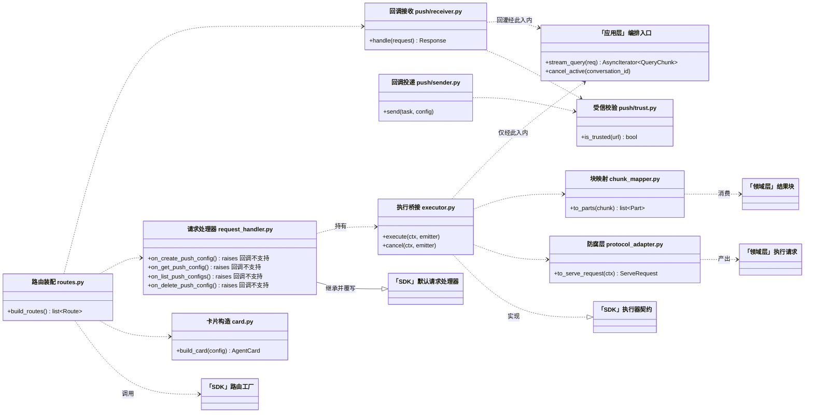
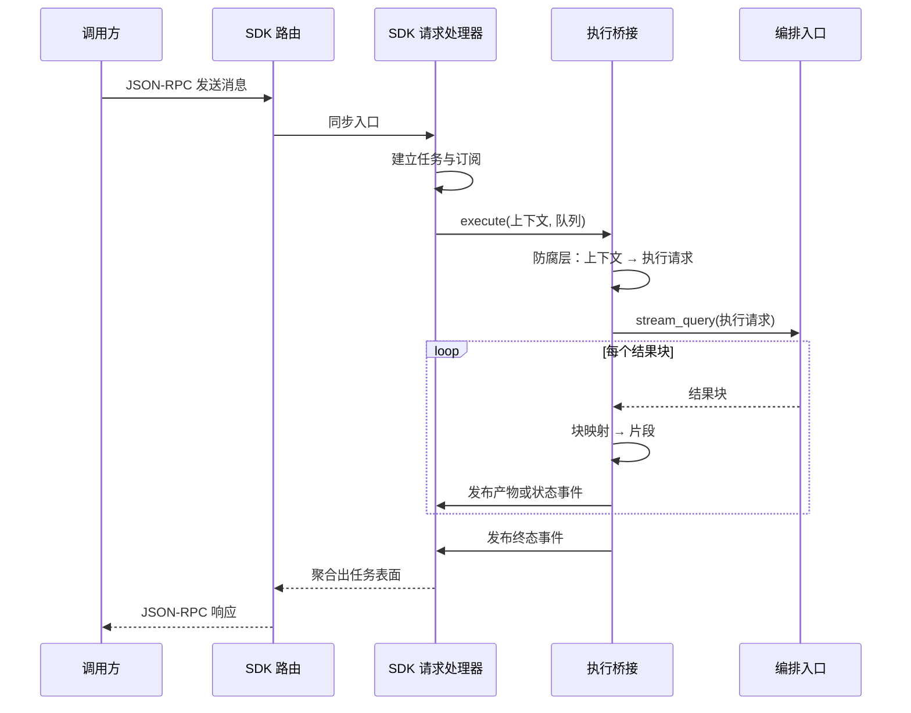

# 标准化智能体服务入口 · Python L2 详细设计

## 1. 概述

### 1.1 特性定位

runtime 作为**标准 Agent 服务端**被调用的进站入口：以 A2A JSON-RPC over HTTP 暴露可发现、可调用、可查询、可接收异步完成回调的服务面，以 Agent Card 作为能力发现入口。

**解决的问题**：普通客户端、其他 runtime、总线转发三类来源进入时，必须看到**同一套**服务面，而不是按调用来源拆出多套私有入口（`version-scope/FEAT-001-standardized-agent-service-entrypoint.md:16`、`:94-96`）。

**适用**：所有外部对本 runtime 的同步、流式、查询类调用，以及本 runtime 作为调用方时接收远端完成通知。
**不适用**：本 runtime 主动发起的远端调用与结果回灌（属远程编排特性）；总线事件投递路径（属总线订阅特性，但其消费后必须落回本特性定义的同一 Task 控制面）。

### 1.2 核心设计原则

- **协议对象不穿透** — A2A wire 类型只存在于进站适配层与桥接边界内，不进入执行请求、应用层与领域层。依据：`architecture/L1-High-Level-Design/agent-runtime/logical.md:278`（明写这几个内部类型与 handler 抽象不得依赖 A2A 协议对象）。
- **对外与存量逐字节一致优先于对齐上游 Java** — 二者冲突时以存量为准。依据：用户 2026-07-30 裁定「存量兼容是 must，存量不兼容其他都无意义」；本文 §11 逐条登记差异。
- **不重定义 wire** — 分发、队列、事件与状态查询由 a2a-sdk 承载，本特性只实现执行桥接与装配；wire 形态由 SDK 与 A2A 承载，本特性不另行定义。依据：`version-scope/FEAT-001-standardized-agent-service-entrypoint.md:128`（SSE data 必须是 JSON-RPC response envelope，result 承载 A2A SDK `StreamingEventKind`）、同文 `:53`（错误表面必须以 JSON-RPC error response 或流式传输错误表面返回）、同文 `:47`（不得为 callback 单独发明强制字段）。
- **新增面不得破坏既有面** — 相对存量的新增能力（完成回调、根路径发现端点）以"旧路径与旧行为原样保留"为前提。

### 1.3 子特性全景

| 子特性 | 职责 | 关键抽象 | 状态 |
|---|---|---|---|
| A2A JSON-RPC 入口 | 按方法分发同步与流式调用 | SDK 路由工厂 + 执行器桥接 | **已实现**（含无尾斜杠路径直接承载，§2.3.1.2） |
| Agent Card 发现 | 三条路径返回同一张卡片 | 卡片构造与配置绑定 | **已实现**（三条路径注册规格见 §2.3.1.1） |
| 执行桥接 | 协议上下文归一为框架无关执行请求；结果块投射回 Task 表面 | 执行器、协议适配、块映射 | **已实现**（含未处理异常兜底为固定文案，§10.5） |
| 完成回调投递 | 终态时向受信任调用方推送 | 配置存储 + 受信发送器 | **已实现** |
| 完成回调接收 | 固定入口接收远端通知并回灌 | 接收路由 + 鉴权 + 幂等去重 | 已实现 |

### 1.4 术语与命名对齐

本特性使用的领域对象与端口名称，与上位逻辑视图、特性规格、上游代码三方一致：执行请求、查询响应、结果块、Agent 处理器、流式观察契约、编排入口。方法名在 Python 侧采用本语言命名习惯，与上游驼峰式一一对应，行为语义等价——映射关系见总纲。

---

## 2. 功能规格

### 2.1 能力清单

| 能力 | 事实要求 | 权威出处 |
|---|---|---|
| Agent Card 发现 | 提供根路径的标准与兼容两条发现端点 | `FEAT-001:33`（MUST） |
| JSON-RPC 统一入口 | 单一入口按方法分发，不为每个方法开独立 URL | `FEAT-001:34`（MUST） |
| 三来源等价 | 普通客户端、其他 runtime、总线转发共享同一入口语义 | `FEAT-001:35-37`（MUST） |
| 流式调用 | 以事件流返回全流程，可观察状态、产物与终态 | `FEAT-001:38`（MUST） |
| 阻塞调用 | 与流式一致的输入；**携带回调配置时转为异步接受模式**，尽快返回任务表面而不等最终结果 | `FEAT-001:39`（MUST） |
| 异步查询 | 按任务标识查询快照 | `FEAT-001:40`（MUST） |
| 内联回调配置 | 只承诺创建调用时内联携带，不承诺为既有任务后置创建 | `FEAT-001:41`（MUST） |
| 回调接收入口 | 启用且授权策略就绪时，必须 host 固定接收入口 | `FEAT-001:43`（MUST） |
| 回调投递 | 具备向受信任固定入口推送完成结果的能力，可配置关闭 | `FEAT-001:44`（MUST） |
| 回调触发范围 | 仅结果性状态触发；中间态不得作为回调主路径 | `FEAT-001:45`（MUST） |
| 回调安全边界 | 接收方必须是受信任固定端点；**先校验授权再处理**，非法调用在进入状态存储或业务处理前拦截 | `FEAT-001:49`（MUST） |
| 能力声明真实 | 卡片能力声明必须反映当前承诺，关闭回调时不得声明为可用 | `FEAT-001:52`（MUST） |
| 错误表面 | 非法请求、未知方法、处理器异常映射为标准错误，尽量保留请求标识 | `FEAT-001:53`（MUST） |

### 2.2 显式排除

| 排除项 | 原因 | 替代 |
|---|---|---|
| 回调配置的五个独立增删改查方法 | `FEAT-001:42` 整组判定不在范围，调用须返回不支持（取与存量一致的那一种，见 §2.3.5） | 只支持创建调用时内联携带 |
| gRPC 北向传输 | `FEAT-001:56` 不在范围 | — |
| 普通客户端自报回调地址 | `FEAT-001:57` 不在范围；回调只面向受信任的 runtime 之间场景 | 客户端用事件流或查询 |
| 回调推送中间态与逐 token 流 | `FEAT-001:168-169` 不在范围 | 实时过程走事件流 |
| 经回调处理等待输入的交互续接 | `FEAT-001:170` 归中断特性 | 见用户交互中断详设 |
| 同实例多 Agent 路由 | `FEAT-001:165` 不在范围；一个实例只服务一个 Agent | 多实例部署或上层路由 |
| 主动发起的远端调用与结果回灌 | `FEAT-001:172` 归远程编排特性 | 见远程编排详设 |
| 为总线暴露私有执行入口 | `FEAT-001:173` 不在范围 | 总线消费后落回本入口的同一控制面 |

### 2.3 接口契约

#### 2.3.1 对外端点

| 端点 | 方法 | 说明 | 存量是否有 |
|---|---|---|---|
| `POST /a2a/` | JSON-RPC | 主入口，按方法分发 | **有**（兼容基线） |
| `POST /a2a` | JSON-RPC | 同上，**直接承载而非重定向** | 有，但存量为 307 重定向到带斜杠路径 |
| `GET /a2a/.well-known/agent-card.json` | HTTP GET | 卡片发现（子应用挂载前缀叠加所得） | **有**（兼容基线） |
| `GET /.well-known/agent-card.json` | HTTP GET | 卡片发现，根路径标准位置 | **无，本版新增** |
| `GET /.well-known/agent.json` | HTTP GET | 卡片发现，根路径兼容位置 | **无，本版新增** |
| `POST /a2a/push-notifications/callback` | HTTP POST | 完成回调接收入口 | **无，本版新增** |

**存量端点的实测出处**：`openJiuwen/agent-runtime/applications/a2a_service/app.py:546-549` 将卡片路由与 JSON-RPC 路由（`rpc_url="/"`）一并挂载到 `/a2a` 前缀；同文 `:9` 的端点清单注释与 `:554` 的启动日志一致。**存量未在根路径注册发现端点**。

**冻结出处**：端点 URL 形态 `{基址}/a2a/` 冻结于 `openJiuwen/agent-runtime/applications/a2a_service/tests/orchestrator/test_app_bootstrap_edges.py`（`test_log_format_and_agent_cards`）与 `openJiuwen/agent-runtime/applications/a2a_service/tests/framework_parallel/test_executor_constructor.py`（`test_remote_handler_builds_sub_agent_client_from_yaml_url_card`）；卡片发现路径冻结于 `openJiuwen/agent-runtime/applications/a2a_service/tests/orchestrator/remote/test_card_discovery.py`（`test_fetcher_requests_standard_well_known_path`）；主路径与别名返回等价卡片冻结于 `openJiuwen/agent-runtime/applications/a2a_service/tests/api/test_wellknown_card.py`（`test_wellknown_routes_serve_equivalent_card`）。

> **无尾斜杠路径必须直接承载，不能沿用重定向。** 权威 `FEAT-001:34` 与 `:65` 均为 MUST：runtime 必须通过 `POST /a2a` **和** `POST /a2a/` 承载 JSON-RPC 请求。上游为此专门定义了不带斜杠的路径常量，并在控制器上一次映射两条（`openJiuwen/agent-runtime-java/service/agent-service-spec/src/main/java/com/openjiuwen/service/spec/paths/A2AServicePaths.java:23`、同文 `:26`；`openJiuwen/agent-runtime-java/service/agent-service-app/src/main/java/com/openjiuwen/service/app/controller/a2a/A2aJsonRpcController.java:74`）。
>
> **存量的行为是 307 重定向**：按存量装配方式实测，`POST /a2a/` 得 200 直接承载，`POST /a2a` 得 307、`Location: /a2a/`，跟随后结果一致（307 保留请求方法与请求体）。故本版直接承载**不破坏任何存量客户端**——会跟随重定向的照常成功、少一次往返，不跟随的从失败变为成功。**属只增不减的新增面**，登记见 §11.1。

**为何三条卡片路径可以共存**：SDK 的卡片路由工厂只注册一条路由，路径由参数决定，默认值为根路径标准位置（`a2a-sdk 1.0.0 · server/routes/agent_card_routes.py:34`、`:49-55`，常量见 `a2a-sdk 1.0.0 · utils/constants.py:6`）。存量之所以只有前缀路径，是子应用挂载叠加的结果，**不是 SDK 限制**。故本版在根应用另注册两条、保留挂载那条，三条返回同一张卡片——既满足 `FEAT-001:33` 的强制项，又不动存量路径，且与上游 Java 的三条完全对齐（`architecture/L1-High-Level-Design/agent-runtime/api-appendix.md:40-45`）。

##### 2.3.1.1 三条卡片路径的注册规格

**卡片对象只构造一次，三条路径共享它。** 三条各自构造会产生三张可能不一致的卡片——
配置变更时改了一处漏两处，而对外表现是「同一个 Agent 在不同发现路径上声明了不同能力」，
调用方据此做的能力判断随它请求了哪条路径而变。`FEAT-001:64` 要求兼容端点
「返回与标准 card endpoint **等价**的 Agent Card 表面」，共享同一对象是满足该要求最直接的方式。

| 路径 | 注册方式 | 路由工厂的路径参数 |
|---|---|---|
| `/a2a/.well-known/agent-card.json` | 随 JSON-RPC 路由一并进入子应用，由挂载前缀叠加所得 | 取默认值 |
| `/.well-known/agent-card.json` | 在**根应用**上单独注册 | 显式传标准路径 |
| `/.well-known/agent.json` | 在**根应用**上单独注册 | 显式传兼容路径 |

**注册位置是根应用，不是子应用。** 子应用的路由会被挂载前缀叠加：在挂到 `/a2a` 的子应用里
注册 `/.well-known/agent-card.json`，实际暴露出来的是 `/a2a/.well-known/agent-card.json`，
与既有那条重复，而根路径仍然是 404。

**这一条会静默失效**：叠加后的路径本身合法、返回 200、判据若只断言「卡片可取」也会通过——
失败的表现是根路径 404，而没有任何东西指向注册位置写错了。

###### 装配形态与宿主义务

runtime 是嵌入宿主的 SDK，**它无法单方面保证根路径端点落在站点根上**——那取决于宿主
怎么装配本模块产出的应用。两种形态分别处置：

| 形态 | 本模块产出的应用位于 | 根路径两条端点 |
|---|---|---|
| 应用即站点根 | 站点根 | **由本模块注册**，落在站点根，满足 `FEAT-001:33` |
| 应用作为子应用挂载到前缀下 | 前缀下 | 本模块注册的两条被前缀叠加，**不在站点根**。须由宿主在其站点根应用上注册 |

**宿主义务**：采用第二种形态的宿主，必须自行在站点根注册这两条路径，并使其返回与本模块
同一张卡片。本模块导出卡片对象供其取用，不代宿主决定站点根的路由布局——那是宿主的地盘。

该义务须并入宿主义务清单。**不写明这一条的后果是**：宿主按第二种形态装配后，
根路径仍是 404，而本模块的判据全绿——两边都认为自己做对了。

##### 2.3.1.2 无尾斜杠路径的承载规格

**在根应用上另注册一条 JSON-RPC 路由，路径取挂载前缀本身，复用同一个请求处理器。**
复用而非另建：另建会产生两套任务存储与两套等待窗口，同一调用打两条路径会落到互不可见的
两份状态上。

**不能靠关闭尾斜杠重定向实现。** 实测关闭后无尾斜杠路径直接得 404——挂载点只匹配带斜杠的
形态，无尾斜杠那条本就没有路由，重定向只是在替它兜底。关掉兜底不等于补上路由，结果比
重定向更糟：307 至少能被跟随重定向的客户端消费，404 谁也消费不了。

**新路由与挂载点不冲突，注册顺序无关。** 挂载点的路径正则要求前缀之后必须有斜杠
（`^/a2a/(?P<path>.*)$`），无尾斜杠的路径本就不匹配它——两者匹配的是互斥的路径集合。
307 正是由此产生：路由表里没有任何一条匹配 `/a2a`，路由器发现加上斜杠能匹配，遂重定向。

**挂载前缀为空时不注册。** 那时本应用被宿主当作子应用挂到别处，无尾斜杠路径是什么由宿主的
挂载点决定，本模块无从知晓——与 §2.3.1.1 的站点根卡片端点是同一分工（见宿主义务 H-SERVE-8）。

判据两条：

| 判据 | 断言 |
|---|---|
| 无尾斜杠直接承载 | `POST /a2a` **不跟随重定向**时即得 200 与业务响应，而非 307 |
| 两条路径落到同一状态 | 对 `POST /a2a` 与 `POST /a2a/` 各发一次，两次响应的任务表面结构一致 |

**第一条必须显式禁止跟随重定向**——客户端默认跟随时 307 与 200 的最终结果相同，
判据会在缺陷存在时照样通过。

##### 2.3.1.3 卡片路径的判据规格

三条路径**逐条各一条判据，且必须在断言中写出完整路径**。

**不得只测其中一条然后声称覆盖了发现能力**：三条是三个独立端点，前缀不同即不同端点，
测了一条不能推出另外两条可达。

**判据的自述与断言必须指向同一条路径。** 二者不一致时判据仍绿，却制造出一条假的覆盖记录：
按描述核对的审计会判它已覆盖，而被声称的那条路径可能从未注册。本项目实证过一次——
卡片判据自述根路径、实际请求挂载前缀路径，该缺陷穿过设计核对、三态审计、全量判据、
对外兼容差分、部署级往返五道检查，最终由人工逐条请求对外端点时才发现。该形态现由
`openJiuwen/agent-runtime-mvp/tools/assertion_drift_guard.py` 在构建期拦截。

四条判据：

| 判据 | 断言 |
|---|---|
| 标准路径可取 | 请求 `/.well-known/agent-card.json` 得 200，响应体是一张卡片 |
| 兼容路径可取 | 请求 `/.well-known/agent.json` 得 200，响应体是一张卡片 |
| 挂载前缀路径可取 | 请求 `/a2a/.well-known/agent-card.json` 得 200，响应体是一张卡片 |
| 三条等价 | 三条响应体**逐字节相等** |

**第四条不可省**：前三条各自通过，只能证明三个端点都返回了卡片，不能证明它们返回的是
**同一张**。而 `FEAT-001:64` 要求的正是等价。

#### 2.3.2 方法面

**下界（必须支持）**：创建或推进消息、流式创建或推进消息、按标识查询任务。依据 `FEAT-001:65-68`。

**必须返回方法未找到或等价不支持表面**：回调配置的五个增删改查方法（`FEAT-001:69-70`、`:111`），以及任何未知方法（`FEAT-001:112`）。

**不冻结穷举清单**：权威下的是**否定面**约束（不支持者必须给出明确错误表面），未对支持面作封闭枚举。照抄成封闭清单会在 SDK 扩面时把合规实现判成越界。

**SDK 实际分派面（已实测）**：`a2a-sdk 1.0.0 · server/routes/jsonrpc_dispatcher.py:365`、`:369`、`:515-545` 共分派十一个方法——流式分支两个（流式发送消息、订阅任务），同步分支九个（发送消息、取消任务、查询任务、列举任务、获取扩展卡片，以及回调配置的创建、查询、列举、删除四个）。**SDK 的实际方法面显著宽于权威列出的三个**，存量复用同一分派器故继承了这个宽面。这是"不冻结穷举清单"这条判断的实证依据。

#### 2.3.2.1 回调配置方法组：必须主动拦截

**这一组存在 SDK 层面的耦合，装配取舍解决不了，必须在路由层主动处理。**

实测链条：

- `a2a-sdk 1.0.0 · server/request_handlers/default_request_handler_v2.py:343-344` — 处理器在**没有回调配置存储**时，对该组方法抛出「不支持」错误。
- 同文 `:215-224` — **内联回调配置的保存依赖同一个存储**：仅当存储存在、且请求配置中携带回调配置时才保存。
- `openJiuwen/agent-runtime/applications/a2a_service/app.py:529-533` — 存量只传执行器、任务存储、卡片，**未传回调配置存储**，故存量对外对该组方法返回**不支持**（不是方法未找到），且**内联配置在存量上不生效**。
  该组方法的对外错误码**无冻结断言**——存量测试未覆盖回调配置方法族，出处为本篇 §7.4 的真实往返实测报文。

耦合的后果：不传存储则该组方法自动符合排除项、但内联配置强制项落空；传存储则内联配置成立、但该组方法随之可用而违反排除项。

**还有一道更前置的闸门（后续查装配时实测补入）**：这四个方法**各自**都带一层能力位校验——卡片未声明回调能力时先行抛出「回调不支持」（`a2a-sdk 1.0.0 · server/request_handlers/default_request_handler_v2.py:334`、`:361`、`:412`、`:439`，分别对应创建、查询、列举、删除）。**存量的卡片只声明了流式能力**（`openJiuwen/agent-runtime/applications/a2a_service/app.py:195`、`:218`），故存量实际是被这道闸门拦下的，与"无存储"那条路径**返回同一个错误码**，前述结论不受影响。

**本版做法按回调能力开关分两态**：

| 态 | 是否传存储 | 卡片能力位 | 四方法的拦截 | 与存量的关系 |
|---|---|---|---|---|
| **回调关闭（默认）** | 不传 | 不声明回调能力 | **无需拦截**——能力位闸门自行拒为 -32003 | 与存量**逐字节一致** |
| 回调开启（须显式配置） | 传入 | 声明回调能力 | **必须拦截**：覆写请求处理器的该组四个方法，抛出「回调不支持」 | 卡片内容与存量不同，属配置驱动的显式选择 |

**默认取关闭态**，理由：卡片内容是对外契约面，存量卡片只声明流式能力；默认开启会让存量调用方拉到不同的卡片，破坏逐字节一致。`FEAT-001:44` 本就允许该能力可配置关闭，`FEAT-001:52` 要求的是"声明必须反映真实承诺"——关则不声明、开则声明，两态都满足。

**拦截落在请求处理器而非路由层**：该组四个方法在处理器上各有独立入口，而内联配置的保存在另一段共用逻辑里（`default_request_handler_v2.py:215-224`），覆写前者不影响后者。路由层拦截需要重复解析请求体与分派逻辑，无谓且易与 SDK 行为漂移。

**拦截后必须返回「不支持」而非「方法未找到」**——存量返回的是前者（依据上述实测链条），这属对外兼容面，错误码不同即破坏逐字节一致。权威 `FEAT-001:69-70` 允许「方法未找到**或等价的不支持表面**」，两者皆合规，故取与存量一致的那个。

**拦截必须按方法分别处理（已实测定稿）**：存量对这五个方法的返回码**并不统一**。

| 方法 | 存量的实际路径 | 对外错误码（**已实测**） |
|---|---|---|
| 创建、查询、列举、删除回调配置 | SDK 已分派 → 卡片未声明回调能力，能力位闸门抛出回调不支持 | **-32003** |
| 更新回调配置 | SDK **未分派** → 该方法名不在分派表内 | **-32601 方法未找到** |

依据：码值映射表见 `a2a-sdk 1.0.0 · utils/errors.py:132-146`；分派表见 `a2a-sdk 1.0.0 · server/routes/jsonrpc_dispatcher.py:515-545`（只含创建、查询、列举、删除四个，无更新）。**两格码值均由真实往返实测确证，报文见 §7.4。**

**故本版的拦截策略按上表分别返回，不得统一成一个码**——统一即破坏与存量的逐字节一致。

#### 2.3.3 流式帧形态

**正常帧**：只有 `data:` 行，承载 JSON-RPC 响应信封；**不带 `event:` 行**。

**错误帧**：附 `event: error` 行，且该行**在 `data:` 行之前**。

**错误的对外形态有两种，判据是「结果流是否已产出至少一个事件」**：

| 条件 | 对外形态 | 内容类型 | 错误消息中的中文 |
|---|---|---|---|
| 结果流**零事件**即失败 | **不是事件流**，是一个普通 JSON 错误响应，**一帧都没有** | `application/json` | **原文** |
| 结果流**已产出至少一个事件**后失败 | 事件流内追加一帧错误帧（带 `event: error` 行） | `text/event-stream` | **`\uXXXX` 转义序列** |

两种情形的码值都是 **-32603**。实测报文见 §7.2。

> **判据是事件数，不是时刻，也不是是否让出控制权。** 实测三组：零事件即抛得普通 JSON 错误；产出三个事件后**不让出控制权**立即抛，得到的仍是错误帧；产出一个事件后让出 50 毫秒再抛，同样是错误帧。**按"错误发生得早还是晚"写判据会随调度红绿；按"是否已产出事件"写则是确定的。**

> **两种形态的中文编码不同，兼容验收必须分开取期望值。** 普通 JSON 错误响应保留中文原文，SSE 错误帧内是 `\uXXXX` 转义序列——§12.3 要求该项按字节比对，用错形态即判红。

**实测出处**：真实往返（§7）。代码位置 `a2a-sdk 1.0.0 · server/routes/jsonrpc_dispatcher.py:577-582`、`:595-598`。存量复用同一 SDK 路由工厂（`applications/a2a_service/app.py:29`、`:546`），故对外形态相同。

**这与权威规格不符，是已裁定的显式偏离**：`FEAT-001:66`、`:127` 是 MUST，要求每帧使用 `event: jsonrpc`；上游 Java 实现符合（`A2aJsonRpcController.java:145`），Python 侧 SDK 与存量均不符合。裁定保持与存量一致，理由与处置见 §11.1。

#### 2.3.4 数据类型

三个内部执行类型都是**协议中立值对象**，落在领域层；A2A wire 类型不得进入（`architecture/L1-High-Level-Design/agent-runtime/logical.md:278`）。字段集合遵从 L1 逻辑视图；下表列的是**本特性实际使用的字段**，取值与默认值以上游 Java 代码为准。

**执行请求**（上游 `ServeRequest`）——七字段，实测出处 `openJiuwen/agent-runtime-java/service/agent-service-spec/src/main/java/com/openjiuwen/service/spec/dto/ServeRequest.java:22-34`

| 字段 | 类型 | 默认值 | 约束 |
|---|---|---|---|
| 会话标识 | 字符串 | 无 | 兼任会话范围；Task 与调用身份的关联键 |
| 消息列表 | 字典列表 | 空列表 | 置空值时归一为空列表（`:109-111`）；每条含角色与内容两个约定键（`:89-91`） |
| 用户标识 | 字符串 | 无 | — |
| 空间标识 | 字符串 | 无 | — |
| 租户标识 | 字符串 | 无 | — |
| 流式标记 | 布尔 | **真** | 注意默认为真；A2A 进站侧另行覆盖，见下 |
| 元数据 | 字典 | 空有序字典 | 承载中断续接等内部约定键 |

**流式标记在 A2A 进站侧的实际取值**：上游协议适配先置假（`openJiuwen/agent-runtime-java/service/agent-service-app/src/main/java/com/openjiuwen/service/app/controller/a2a/A2AProtocolAdapter.java:52`），再由执行器从调用上下文的流式状态键覆盖（`openJiuwen/agent-runtime-java/service/agent-service-app/src/main/java/com/openjiuwen/service/app/controller/a2a/A2AAgentExecutor.java:79-81`）。**故字段默认值真只在非 A2A 入口生效**，A2A 路径上该字段总是被显式赋值。

**一处上游文档与上游代码不一致**：逻辑视图把任务标识列为该请求的字段（`architecture/L1-High-Level-Design/agent-runtime/logical.md:42`），上游 Java 代码中**无此字段**（`openJiuwen/agent-runtime-java/service/agent-service-spec/src/main/java/com/openjiuwen/service/spec/dto/ServeRequest.java:22-34` 共七个字段）。

**该字段属逻辑视图定义的目标态，本特性不使用**——与总纲口径一致（任务标识等四项标为后续特性补齐）。**不据代码事实否定该字段的存在**：字段有无属「能力有无」，总纲 §0.2 的限定通则明确将其排除在「取实现值」的适用范围之外，一律以设计文档为准。

> SPI 附录写有「若本文档与代码或测试不一致，以代码和测试事实为准」（同目录 `spi-appendix.md:33`），但该句**主语是附录自身**，声明的是它与代码不一致时的处置，**不能用于裁定逻辑视图的内容**。

上游代码与逻辑视图的这处不一致已登记为待向上游反馈项。

**查询响应**（上游 `QueryResponse`）——两字段，实测出处 `openJiuwen/agent-runtime-java/service/agent-service-spec/src/main/java/com/openjiuwen/service/spec/dto/QueryResponse.java:21-25`

| 字段 | 类型 | 序列化名 | 约束 |
|---|---|---|---|
| 结果 | 任意 | `result` | 聚合后的助手输出 |
| 会话标识 | 字符串 | **`conversation_id`**（蛇形） | 与请求侧驼峰命名不同，序列化名由注解显式指定 |

**结果字段内的两个约定键**（桥接层据此投射 Task 表面，实测出处 `openJiuwen/agent-runtime-java/service/agent-service-app/src/main/java/com/openjiuwen/service/app/controller/a2a/A2AAgentExecutor.java:205-215`）：结果为字典且含中断键时投射为等待输入状态；含内容键时写为产物并推进到完成；两者皆无时直接完成。中断键的键名为 `_interrupt`，由框架适配器写入（`openJiuwen/agent-runtime-java/service/agent-service-adapters/agent-service-adapters-agentcore/src/main/java/com/openjiuwen/service/adapters/agentcore/agentfw/JiuwenCoreAgentHandler.java:361`）。

**结果块**（上游 `QueryChunk`）——两字段，实测出处 `openJiuwen/agent-runtime-java/service/agent-service-spec/src/main/java/com/openjiuwen/service/spec/dto/QueryChunk.java:17-30`

| 字段 | 类型 | 默认值 | 约束 |
|---|---|---|---|
| 类型 | 字符串 | `chunk` | **字符串常量而非枚举**，取值集合可扩展 |
| 数据 | 任意 | 无 | 为空时映射为空片段列表（`openJiuwen/agent-runtime-java/service/agent-service-app/src/main/java/com/openjiuwen/service/app/controller/a2a/ChunkMapper.java:36-38`） |

**类型常量共四个**：`chunk`（流式中间输出）、`interrupt`（中断信号）、`error`（错误）、**`remote_agent_output`**（远端智能体的业务输出，携带来源出处）。第四个由远端调用批量协调器产出（`openJiuwen/agent-runtime-java/service/agent-service-app/src/main/java/com/openjiuwen/service/app/orchestrator/RemoteInvocationBatchCoordinator.java:877`），在片段映射时被投射为带远端调用元数据的片段（`openJiuwen/agent-runtime-java/service/agent-service-app/src/main/java/com/openjiuwen/service/app/controller/a2a/ChunkMapper.java:40-45`）。

> **与总纲的一致性**：总纲 `L2-overview.md` 的取值集合含该项，并在同处挂了三条约束——状态语义与普通输出相同故结果到状态的映射表不增补、**对外投射形态须对齐存量而非照搬上游**、以及该项不得被误删。

#### 2.3.5 行为承诺

**必须**

| 编号 | 承诺 | 依据 |
|---|---|---|
| 必须-1 | 执行桥接**始终以事件流产出**；阻塞语义由 SDK 的同步入口聚合，不另设一条非流式执行路径 | Python SDK 的同步与流式两入口共用同一套建立与订阅逻辑（`a2a-sdk 1.0.0 · server/request_handlers/default_request_handler_v2.py:241-243`、`:310-312`），执行器拿不到"本次是否流式"的信号 |
| 必须-2 | 框架原生输出必须先转成查询响应或结果块，再进入 Task 状态语义 | `logical.md:239` |
| 必须-3 | 结果到状态的映射固定四条：普通输出保持执行中或写产物；完成推进到完成；错误推进到失败；中断推进到等待输入 | `logical.md:232-237` |
| 必须-4 | 中断必须进入等待输入语义，**不得伪装成完成** | `FEAT-001:144` |
| 必须-5 | 失败必须形成失败 Task 表面，并携带可供客户端程序化判断的错误信息 | `FEAT-001:143` |
| 必须-6 | 阻塞调用**携带内联回调配置时不得阻塞等待终态**，应返回已创建或已接受的 Task 表面 | `FEAT-001:135`；SDK 不自动实现此映射，见下 |
| 必须-7 | 回调只在结果性状态触发：完成必须通知结果，失败必须通知状态、错误码与原因 | `FEAT-001:119` |
| 必须-8 | 回调投递失败不得回滚或改变 Task 终态；重试须保持通知标识稳定 | `FEAT-001:122`、`:155` |
| 必须-9 | 回调接收先完成授权校验再处理载荷；未通过校验不得进入任务存储或业务处理 | `FEAT-001:123`、`:157` |
| 必须-10 | 流式调用在状态进入终态或中断态时必须关闭当前消息流 | `FEAT-001:130` |
| 必须-11 | 无已注册处理器时必须拒绝执行，错误语义须表达为不可执行 | `FEAT-001:154` |

**必须-1 与上游 Java 的形态差异（不构成对外契约差异）**：上游 Java 是**双执行路径**——按流式标记分流，流式走观察者回调、非流式走一次性聚合调用（`openJiuwen/agent-runtime-java/service/agent-service-app/src/main/java/com/openjiuwen/service/app/controller/a2a/A2AAgentExecutor.java:104-108`、`:122`、`:204`）。上游能这样做，是因为它的 JSON-RPC 控制器是自建的、可在调用上下文里塞入流式标记；Python 侧路由由 SDK 提供，不产生该标记。**故 Python 侧只能单路径。** 对外表面由 SDK 的同步入口聚合产出，与上游一致，不改变对外契约。

**必须-6 需本版显式实现**：SDK 的同步入口只在配置项 `return_immediately`（立即返回）为真、或事件已达终态与中断态时才结束等待（`a2a-sdk 1.0.0 · server/request_handlers/default_request_handler_v2.py:267-276`）；**它不会因为请求携带了回调配置就转为立即返回**。该配置项对应旧版协议的阻塞标记取反（`a2a-sdk 1.0.0 · compat/v0_3/conversions.py:323`、`:343`），默认阻塞。故本版须在进站侧把"携带内联回调配置"映射为"立即返回"。此映射**不影响存量调用方**——存量不支持内联回调配置，其调用方不会携带该参数。

**禁止**

| 编号 | 禁令 | 依据 |
|---|---|---|
| 禁止-1 | 处理器直接构造协议响应、Task 对象或流帧 | `spi-appendix.md:102`、`:193` |
| 禁止-2 | A2A 协议对象进入执行请求、查询响应、结果块与处理器抽象 | `logical.md:278` |
| 禁止-3 | 回调推送提交中、执行中、进度、产物更新等中间态，或逐 token 正文与流帧 | `FEAT-001:120`、`:168-169` |
| 禁止-4 | 向未受信任地址投递结果；须拒绝内联配置或拒绝投递 | `FEAT-001:156` |
| 禁止-5 | Task 状态与框架 checkpoint、业务执行态混写 | `logical.md:62` |
| 禁止-6 | 为总线暴露绕过 Task、流式与错误表面的私有执行接口 | `FEAT-001:173` |

**允许**

| 编号 | 允许 | 依据 |
|---|---|---|
| 允许-1 | 结果块类型集合可扩展——上游用字符串常量而非枚举，新增类型不破坏既有消费方 | `QueryChunk.java:17-28` |
| 允许-2 | 回调投递可按稳定通知标识重试 | `FEAT-001:122` |
| 允许-3 | 阻塞等待超过执行等待窗口时可返回当前 Task 快照；超过消费等待窗口须返回错误 | `FEAT-001:136` |
| 允许-4 | 卡片端点地址未配置时由请求地址推导 | `FEAT-001:102` |

#### 2.3.6 消息队列声明

**本特性不涉及消息队列。** 总线事件的消费属总线订阅特性；本特性只要求那条路径消费后落回同一 Task 控制面，不定义事件契约。

---

## 3. 模块结构

### 3.1 回调接收入口的落位前提

**回调接收入口必须本版自建路由。** SDK 的路由目录只提供卡片、JSON-RPC、REST 三类（`a2a-sdk 1.0.0 · server/routes/`），**没有回调接收路由**；SDK 内与回调相关的代码都在**发送侧与配置存储侧**（请求处理器、模型、分派器）。故 `FEAT-001:43` 要求的固定接收入口在 Python 侧无 SDK 支持，须自建。

落位判断：它是对外 HTTP 入口，承载协议对象与鉴权，**落在进站适配层**，与 JSON-RPC 桥接同层；其回灌动作经应用层入口进入，不直接触碰领域层。

### 3.2 包结构

总纲已定目标态目录骨架，本特性只在进站 A2A 子包内增量补充。**本特性不新增领域层与端口层文件**——它消费的执行请求、查询响应、结果块、处理器端口、编排入口均已由总纲定义。

```
agent_runtime/adapters/inbound/a2a/
  routes.py              路由装配：卡片三条路径 · JSON-RPC 主入口 · 回调接收入口
  card.py                Agent Card 构造：身份字段 · 支持接口 · 能力位
  request_handler.py     请求处理器：继承 SDK 默认处理器，覆写回调配置四方法
  executor.py            执行桥接：实现 SDK 的执行器契约，接到编排入口
  protocol_adapter.py    防腐层：协议请求上下文 → 执行请求
  chunk_mapper.py        结果块 → A2A 片段
  errors.py              **仅**自建路由的错误表面映射，见下方红线
  push/
    sender.py            回调投递：受信任端点校验 · 稳定通知标识 · 重试
    receiver.py          回调接收：鉴权前置 · 幂等去重 · 回灌
    trust.py             受信任接收方清单与校验
```

> **红线 · 错误映射不得越界**：`errors.py` **只**负责本版自建路由（回调接收入口）的错误表面——那条路由不经 SDK，SDK 不为它产出错误。**JSON-RPC 主入口的错误映射一律由 SDK 承担，本版不得插手、不得包装、不得改写**。存量正是完全依赖 SDK 的映射（§8 已实测其码值表），自建一层等于重新定义 wire，直接违背"对外兼容"与"不重定义 wire"两条。**此文件出现在 JSON-RPC 路径的调用链上即为设计违规。**
>
> **红线的边界须说清（否则与 §10.5 的裁定看似冲突）**：该红线管的是「**SDK 如何把错误映射成响应**」，不管「**我方向 SDK 抛什么错误**」。§10.5 要求未处理异常对外统一为固定文案，其实现是**在执行桥接内把非 A2A 异常转为携带固定文案的 A2A 错误再抛出**——SDK 收到的已是协议错误，映射规则分毫未动。**改"抛什么"合规，改"怎么映射"违规。** 上游 Java 亦是在控制器层做同一件事。

**逐文件的交付归属**（进站与出站的核心闭环加完成回调）：

| 文件 | 批次 |
|---|---|
| 路由装配、卡片构造、执行桥接、防腐层、块映射 | 本版 |
| 请求处理器（覆写四方法） | 本版，但**仅回调开启时才起作用**；默认关闭态不激活 |
| 回调投递、回调接收、受信校验、自建路由错误映射 | 本版 |

**两处刻意不在本特性内的文件**：

| 文件 | 位置与归属 | 本特性与它的关系 |
|---|---|---|
| 任务存储实现 | **位置遵从总纲，不改** | 本文只声明装配消费关系。其**存储语义、键面与过期策略由任务状态缓存特性定义**（总纲的公共端口表即把相关端口列在该特性名下），本文不定义、也不改总纲对该文件的归属标注 |
| 远端调用与批次协调 | 远程编排特性 | 出站方向，不在本特性范围（`FEAT-001:172`） |

### 3.3 类图与静态关系



**这张图要读出的三件事**：

1. **只有执行桥接与回调接收两处向内**，且都只经编排入口。适配层不得越过编排直连领域层或端口实现。
2. **防腐层是单向阀**：协议请求上下文进、执行请求出；反向不成立——领域对象不得携带协议类型回流。
3. **拦截以继承实现**，不新造一层分派。覆写只发生在回调配置那四个方法上，其余方法行为全部保持 SDK 原样——这是"不重定义 wire"原则的落地形态。

### 3.4 依赖方向与禁止依赖

遵从总纲已定的依赖方向（适配层 → 端口 → 应用层 → 领域层），本节只列**本特性独有的四条禁令**：

| 禁令 | 具体含义 | 违反的后果 |
|---|---|---|
| **A2A 类型止步于本子包** | 协议消息、片段、任务、事件、请求上下文等类型**不得**出现在本子包之外的任何 import | 协议版本升级会穿透到领域层，防腐层失效 |
| **不得绕过编排入口** | 执行桥接与回调接收**不得**直接持有处理器端口实例或领域服务 | 用例编排被架空，中断续接与取消等跨调用语义无处安放 |
| **不得在适配层解释业务语义** | 结果块的数据字段内容由框架适配器解释；本子包只做结构投射，不读取业务键判断走向 | 业务知识渗入协议层，异构框架换一个就破 |
| **回调投递不得改写任务状态** | 投递成功与否只影响通知状态，**不得**回写任务终态 | 违反 `FEAT-001:122`，通知故障会污染执行事实 |

### 3.5 装配依赖

| 依赖 | 提供方 | 本特性的要求 |
|---|---|---|
| 任务存储实例 | 任务状态缓存特性 | 须在请求处理器构造时传入 |
| 编排入口实例 | 应用层 | 执行桥接与回调接收共用同一实例 |
| 回调配置存储 | 本特性（回调开启时） | 与卡片能力位**同开同关**，见 §2.3.2.1 |

## 4. 核心设计

### 4.1 执行桥接的骨架

同步与流式两条链路**共用同一段执行桥接**，差别只在 SDK 的消费侧（依据见 §2.3.5 必须-1）。桥接实现 SDK 的执行器契约，签名与责任如下（实测出处 `a2a-sdk 1.0.0 · server/agent_execution/agent_executor.py:14-18`、`:69-73`）：

- `execute(请求上下文, 事件队列)` — 读上下文、向队列发布事件，执行完成或让出控制时返回
- `cancel(请求上下文, 事件队列)` — 收到取消请求时**以上下文标识为键**通知编排层停止执行，并向队列发布取消状态事件

**取消必须以上下文标识为键，不得以任务标识优先。**

请求上下文同时带任务标识与上下文标识，两者不是同一维度：编排层的在途流按**会话**分组登记，而上下文标识正是会话标识的来源。以任务标识为键会打到一个编排层根本没登记过的位置——**取消调用成功返回，执行照跑**，且这条链路的两端都不报错，只有端到端才看得出来。

对标的两条取消通道（标准协议入口的取消、生命周期中断）都用会话维度的键，无一用任务标识。

> **这条不是实现细节，是本层必须约束的接缝。** 本详设此前只写了「发布取消状态事件」而未规定键的来源，实现遂自行选择了任务标识优先——**详设没约束的地方，实现会替你做决定**。同一会话下若有多条在途流，取消的语义是停掉该会话正在跑的全部执行，这也只有会话维度的键能表达。

**SDK 对执行器的四条约束（同文档字符串实测）**：

| 约束 | 内容 | 对本设计的影响 |
|---|---|---|
| 单次执行保证 | 同一请求上下文的 `execute` **不会被并发调用** | 桥接内部无需为同一任务加锁，见 §4.8 |
| 异常兜底 | 未捕获异常由框架捕获并把任务转为错误态 | 桥接不必包住所有异常，但**须把可程序化判断的错误信息放进事件**，否则 `FEAT-001:143` 不满足 |
| 返回后禁止访问 | `execute` 返回或抛出后，**不得**再访问上下文与事件队列 | 禁止把队列引用交给后台协程延迟使用 |
| 终态自负 | 返回前**应当**发布终态或中断态的状态更新事件 | 五条链路的收束点都必须显式发终态事件 |

### 4.2 同步调用链路



**分支条件**

| 条件 | 行为 | 依据 |
|---|---|---|
| 请求携带内联回调配置 | **不等待终态**，在首个事件后即返回已接受的任务表面 | `FEAT-001:135`；须本版把该情形映射为立即返回，SDK 不自动做（§2.3.5 必须-6） |
| 结果块为中断类型 | 发布等待输入状态事件并收束本次执行 | `FEAT-001:144` |
| 结果块为错误类型 | 发布失败状态事件，携带结构化错误 | `FEAT-001:143` |
| 流正常结束 | 发布完成状态事件 | 成功由流正常结束表达，**不存在"完成"类型的结果块** |
| 无已注册处理器 | 拒绝执行，产出不可执行语义的错误 | `FEAT-001:154` |

**边界条件**：执行等待窗口超时可返回当前任务快照；消费等待窗口超时必须返回错误（`FEAT-001:136`）。两个窗口的取值属配置项，见 §6。

### 4.3 流式调用链路

与同步链路**共用上述全部步骤**，仅消费侧不同：SDK 的流式入口逐个产出事件而不聚合，每个事件包装为 JSON-RPC 响应信封后作为一帧发出。

**帧形态见 §2.3.3**（正常帧只有数据行、不带事件名，属已裁定的对权威偏离）。

**收束条件**：状态进入终态或中断态时必须关闭当前消息流（`FEAT-001:130`）。SDK 的终态集合为完成、已取消、失败、已拒绝四项；中断态集合为需要输入、需要授权两项（实测 `a2a-sdk 1.0.0 · server/agent_execution/active_task.py:48-57`）。

> **「需要授权」是 SDK 的收束条件之一，但本版不产出该状态。** L1 的 Task 状态表共七项、不含它（`architecture/L1-High-Level-Design/agent-runtime/logical.md:218-226`）——该表列的是 runtime **自身产出**的状态。该状态属 A2A 协议面，可能由**远端 Agent** 回传；上游读到远端为该态时归一为「需要输入」处理（`openJiuwen/agent-runtime-java/service/agent-service-app/src/main/java/com/openjiuwen/service/app/controller/a2a/client/A2ARemoteAgentClient.java:476`、`openJiuwen/agent-runtime-java/service/agent-service-app/src/main/java/com/openjiuwen/service/app/orchestrator/RemoteInvocationBatchCoordinator.java:571`），存量亦同（`openJiuwen/agent-runtime/applications/a2a_service/orchestrator/route/route_profiles.py:11`）。
> **相关冻结**：存量的状态转移校验**允许** `WORKING → 需要授权` 与 `需要授权 → WORKING` 两条边（`openJiuwen/agent-runtime/applications/a2a_service/tests/orchestrator/control/test_control_plane.py`（`test_legal_transitions_not_rejected`））。**允许一条边存在不等于 runtime 自身产出该态**——校验器放行的是远端回传后的落库，产出方仍是远端。本版沿用同一校验语义，故两条边须保持合法。
>
> **故此处引用 SDK 集合不构成对 L1 状态机的扩面**：本版的状态产出面仍是七项，远端状态的消费与归一属远端通信特性的范围。若将来本版需要**主动产出**该状态，须先对 L1 状态机提出扩面。

### 4.4 卡片发现链路

三条路径返回**同一张卡片对象**，无分支：根路径标准位置、根路径兼容位置、前缀下的存量位置（见 §2.3.1）。前两条在根应用注册，第三条由子应用挂载叠加产生。

**能力位的取值规则**（对外契约面，须严格执行）：

| 能力位 | 取值 | 依据 |
|---|---|---|
| 流式 | **恒为真** | 冻结于 `openJiuwen/agent-runtime/applications/a2a_service/tests/api/test_wellknown_card.py`（`test_default_card_matches_frozen_hardcoded_card` 断言默认卡片 `capabilities.streaming` 为真）；产生点见 `openJiuwen/agent-runtime/applications/a2a_service/app.py:195`、`:218`。且 SDK 的流式入口带能力位校验，为假则流式调用直接被拒 |
| 回调 | **随回调开关同步**，默认关闭故默认不声明 | `FEAT-001:52` 要求声明反映真实承诺；默认关闭以保持与存量卡片一致（§2.3.2.1） |

**端点地址**：配置了对外地址则用配置值，未配置则由请求地址推导（`FEAT-001:102`）。

### 4.5 回调投递链路

**本链路的实现必须自建，不能直接用 SDK 的默认发送器**——实测该默认实现有三处不满足权威强制项：

| 权威强制项 | SDK 默认实现的行为 | 实测出处 |
|---|---|---|
| 仅结果性状态触发，不通知中间态（`FEAT-001:45`、`:119-120`） | **无任何状态过滤**——收到任务、状态更新、产物更新中的任意一种即投递 | 触发条件 `a2a-sdk 1.0.0 · server/agent_execution/active_task.py:496-507`；事件类型别名涵盖上述三类 `a2a-sdk 1.0.0 · server/tasks/push_notification_sender.py:10` |
| 重试须保持通知标识稳定（`FEAT-001:122`） | 载荷中**无通知标识**，且失败后**不重试**，仅记日志 | `a2a-sdk 1.0.0 · server/tasks/base_push_notification_sender.py:43-60`、同文 `:64-92` |
| 接收方必须是受信任固定端点（`FEAT-001:49`、`:156`） | **不校验**，直接向配置中的地址发起请求 | 同文 `:70-78` |

**故本版发送器承担四件事**：终态过滤（放行完成与失败，已取消与已拒绝仅当明确产出时承载）、受信任端点校验（不通过则拒绝投递并留可观察记录）、稳定通知标识、失败重试。

**可直接沿用 SDK 的两处**：令牌以请求头 `X-A2A-Notification-Token` 传递、载荷取任务表面的标准结构（同文 `:70-78`）——沿用可减少与其他 A2A 实现的互通成本。

**但 SDK 载荷缺通知标识，必须补齐**。SDK 发的是标准流式响应结构（`MessageToDict(to_stream_response(event))`，同文 `:78`），其中**没有通知标识**；而 `FEAT-001:73` 要求每次回调必须携带稳定通知标识，上游接收侧更是把它列为必填、缺失即判请求非法。故本版投递侧的载荷与请求头对齐上游：

| 位置 | 内容 | 上游出处 |
|---|---|---|
| 请求头 | `X-A2A-Notification-Id: <通知标识>` | `openJiuwen/agent-runtime-java/service/agent-service-app/src/main/java/com/openjiuwen/service/app/controller/a2a/HttpPushNotificationSender.java:138` |
| 请求体 | `{"jsonrpc": "2.0", "result": <Task 表面>, "notificationId": <通知标识>}` | 同文 `:159` |

两处同时携带且必须一致——这与本版接收侧的取值规则（头优先、其次体、两者皆有则须一致，§10.2）互为镜像。**若只发 SDK 原样载荷，投递到 Java 实现的 runtime 会被判为缺通知标识而拒收。**

**这一结构同时满足以下两条强制项**：

| 强制项 | 如何满足 |
|---|---|
| `FEAT-001:46`（MUST）文本类完成结果必须在回调载荷中一次性返回 | `result` 承载完整 Task 表面，文本正文在其 artifacts 与状态消息中，调用方无需再走流式获取 |
| `FEAT-001:47`（MUST）大载荷必须沿用产物、文件与数据片段、元数据或任务查询引用，**不得为回调单独发明强制字段** | 载荷结构全部取自 A2A 标准类型，**零自定义结果字段**；通知标识不属结果内容，且由 `:73` 明确要求，不构成"发明" |

**投递失败的硬约束**：不得回滚或改变任务终态，只影响通知投递状态（`FEAT-001:122`、`:155`）。

**通知标识由派生取得，不需要持久化载体**。`FEAT-001:122` 要求「重试同一通知必须保持标识稳定」——本版与上游一致，标识取**任务标识与回调配置标识的摘要**（`openJiuwen/agent-runtime-java/service/agent-service-app/src/main/java/com/openjiuwen/service/app/controller/a2a/HttpPushNotificationSender.java:165-169`），是纯函数派生值：

| 维度 | 结果 |
|---|---|
| 进程重启 | 同一任务与配置**重算得同一标识**，稳定性天然成立 |
| 副本漂移 | 任一副本算出的标识相同，无需协调 |
| 投递记录（是否已成功投递）丢失 | 最坏后果是**重复投递同一通知**——接收侧按标识与报文摘要判重，同内容重投判为重复并幂等返回（§5.3.1），不产生第二个逻辑结果 |

**故投递侧不引入任何外置状态**：标识用可重算性替代存储，投递记录用接收侧幂等替代持久化。这比外置投递进度更简单，且不新增需治理的状态。

### 4.6 回调接收与回灌链路

本链路**全部为本版自建**（SDK 无接收侧支持，见 §3.1）。步骤顺序**不可调换**：

1. **鉴权** — 未通过即拒绝，**不得进入任务存储或业务处理**（`FEAT-001:123`、`:157`）
2. **受信来源校验** — 复用与投递侧同一份受信清单
3. **幂等去重** — 按通知标识判重，重复通知直接返回成功且不产生副作用
4. **关联本地绑定** — 由通知定位到本地父任务
5. **回灌** — 经编排入口进入，不直连领域层（§3.4 第二条禁令）

**顺序即安全边界**：把去重或关联提到鉴权之前，等于让未鉴权请求触达存储，直接违反上述强制项。

### 4.7 任务状态推进的触发点

上位运行视图给出五个触发点（`architecture/L1-High-Level-Design/agent-runtime/process.md:149-155`）。核对 Python SDK 的对应实现后，映射如下：

| 触发 | 状态 | Python 侧的落点 |
|---|---|---|
| 收到可执行消息并创建任务 | 已提交 | SDK 的请求处理器建立活跃任务时产生，桥接不介入 |
| 开始执行 | 执行中 | 桥接在进入编排前发布 |
| 需要人工输入 | 需要输入 | 中断类型的结果块经桥接映射 |
| 正常完成 | 完成 | 结果流正常结束后由桥接发布 |
| 执行失败 | 失败 | 错误类型的结果块或未捕获异常（后者由 SDK 兜底，见 §4.1） |

**一处形态差异**：上位视图描述的是发射器回调形式，Python 侧为向事件队列发布事件。**触发点与状态语义一一对应，无缺漏。**

### 4.8 影子任务的对外隔离

远程编排在批量调用场景会创建**影子任务**作为内部批次载体，键形态为 `shadow:<智能体标识>:<父任务标识>`。它与真实父任务落在同一个任务存储里——上游详设明写不新增批次存储接口，故无法靠换存储位置隔离。

上位对二者的边界划分见 `architecture/L2-Low-Level-Design/agent-runtime/Feat-Func-019-parallel-downstream-agent-tasks-generation-and-handoff.md` 的数据边界表：其「面向对象」一列把影子任务划归 runtime coordinator，**真实父任务才面向 A2A 客户端、按标识查询、订阅与续轮消息**。

#### 4.8.1 拦截点为何落在本特性

本特性是对外查询与订阅的入口，拦截只能在这里发生。而 JSON-RPC 的方法分发整个交给协议库的默认请求处理器，入站适配器内**没有拦截点**——因此隔离既不能在入站拦、也不能靠换存储位置，只剩「装配时注入两个视图」这一条路：

| 视图 | 交给谁 | 行为 |
|---|---|---|
| 对外视图 | 协议库的请求处理器 | 按标识读取与删除命中影子前缀时拒绝；列表结果剔除影子任务 |
| 原始存储 | 生命周期清扫、远端批次协调 | 不过滤——内部消费方必须读得到，否则批次协调无法工作 |

过滤发生在**读取之前**，以标识前缀判定。先读再拒等于已经泄漏了一次。

#### 4.8.2 拒绝的错误类型

映射协议库标准错误面的「不支持的操作」。另两个候选都被排除：

| 候选 | 排除理由 |
|---|---|
| 任务不存在 | **掩盖事实**——客户端会以为自己拼错了标识，转而排查调用方 |
| 拒绝访问 | 协议库标准错误面中无授权类类型；且该措辞隐含身份判断，而本 runtime 无授权模型——影子任务对**所有**客户端一律不可见，与调用方身份无关 |

命中过滤时记一条可诊断的服务端日志。

#### 4.8.3 覆盖范围与前置准备

本版对外受支持的方法只有发送消息、流式发送消息、按标识查询任务三个，其中只有查询按标识读存储。**列表方法本版对外不支持**，但过滤已一并实现——等到支持列表那天再补，中间那段窗口会整批泄漏。

**与上游的差异**：上游核心仓未落实这条边界（`openJiuwen/agent-runtime-java/service/agent-service-app/src/main/java/com/openjiuwen/service/app/orchestrator/RemoteInvocationBatchCoordinator.java` 定义了影子前缀并在内部使用，而对外 JSON-RPC 控制器目录下对该前缀零处理）。本实现落实它，依据是上游**设计**有明确要求——不属「上游未实现则不跟进」的情形。


### 4.9 并发与协程安全边界

**取消感知的处置**

上游流式观察契约的取消感知方法要求处理器轮询标志。实测 Python SDK 的取消机制**不是轮询**（`a2a-sdk 1.0.0 · server/agent_execution/active_task.py:654-700`）：

1. 加锁，若任务未结束且生产者协程存在
2. **取消运行执行器的异步任务**——取消异常在执行器内的等待点抛出
3. **再显式调用执行器的取消方法**，给它发布取消状态事件的机会
4. 阻塞直到消费侧处理完取消事件

**结论：异步迭代器形态下的等价物是取消异常的传播，语义等价且更强**——处理器不需要主动轮询，取消异常会在其等待点自动抛出，用清理块即可释放资源。**故这不是缺口，是形态差异。**

**但残留一处真实约束**：取消异常只能在**等待点**传播。处理器若存在长时间不让出的同步计算段，取消传不进去，该段会跑完。**故对处理器提出一条实现约束：长时间计算须周期性让出控制权**。这条须落进异构框架兼容特性的处理器实现指引，本文只登记来源。

**取消的两条路径必须都走通，缺一条即为失效**：

| 路径 | 谁负责 | 缺了会怎样 |
|---|---|---|
| SDK 侧取消运行执行器的异步任务 | SDK 自身，本层不干预 | — |
| 本层以上下文标识通知编排层停止消费并尽力通知底层 | **本层**（见 §4.1 的键约束） | 编排层的在途流不会被置位，SDK 取消了自己的任务但**底层执行仍在跑**，且远端调用不会被级联取消 |

第二条路径的「尽力通知底层」由异构框架兼容特性定义的中断通知契约承载——远端服务代理实现它即构成存量取消时的级联行为。本层只负责**用对的键把取消传下去**。

#### 4.8.1 进程内运行态在多副本与重启下的表现

**本特性依赖的进程内运行态**（不可外置，总体设计 §8「实例亲和限制」已定）：

| 运行态 | 归属 | 出处 |
|---|---|---|
| 活跃任务注册表 | SDK，进程内字典 | `a2a-sdk 1.0.0 · server/agent_execution/active_task_registry.py:34` |
| 事件队列与生产者协程 | SDK，随活跃任务创建 | 同文 `:49-66` |
| 取消句柄 | SDK，随活跃任务持有 | 同上 |
| 回调投递的重试进度 | 本版发送器，进程内 | §4.5 |

**受影响的对外方法**——以下三个方法的正确性依赖「请求落到正在执行该任务的那个副本」：

| 方法 | 依赖 | 亲和破坏时（落到非执行副本） |
|---|---|---|
| 取消任务 | 取消句柄 | 该副本无此任务的活跃对象，**无法作用于真正在跑的执行** |
| 订阅任务 | 事件队列 | 该副本无此任务的事件队列，订阅不到执行过程事件 |
| 流式发送消息 | 二者 | 新请求在本副本创建，**不受影响** |

**已确证的事实**：活跃任务注册表是进程内字典，副本间不共享；非执行副本上不存在该任务的活跃对象。**未确证的是确切对外表现**——错误码、是否静默成功、是否挂起，取决于共享存储中的任务状态与 SDK 内部等待，**单机探针覆盖不到，须部署级用例取值**（§12.4）。在取到实测值之前，本文不写具体码值。

**重启的表现**：在途任务的活跃对象、事件队列、取消句柄全部丢失；Task 快照留在共享存储、停在执行中状态且无终态推进者。**关停排水是唯一止损手段**（总体设计 §8.3）——排水期内等在途执行自然收束，跳过排水直接杀进程即制造执行中孤儿。

**缓解与残余风险**：亲和路由由平台承担、排水由 runtime 承担，二者都到位时上述场景不发生；**亲和破坏窗口（滚动重启迁移、脑裂）内的静默覆盖，总体设计 §8 已明写接受为 MVP 残余风险**。本特性不另设补偿机制——跨副本接管需要外置执行态，与「在途执行绑实例」的既定约束冲突。

**并发安全边界表**

| 对象 | 并发假设 | 竞态窗口与处置 |
|---|---|---|
| 执行桥接实例 | **同一请求上下文不会并发进入**（SDK 保证，见 §4.1） | 无需为单任务加锁；**但实例本身被多任务共享**，故不得持有任务级可变字段 |
| 事件队列引用 | 仅在执行方法生命周期内有效 | **禁止**交给后台协程延迟使用（SDK 明确禁止返回后访问） |
| 回调去重记录 | 多副本并发写 | 须外置且用原子写入语义判重，不得读后写；键面见 §5 |
| 受信清单 | 启动期加载、运行期只读 | 无竞态；热更新不在本版承诺内 |

### 4.10 幂等键与重试语义

**两个标识不得混用**：

| 标识 | 作用域 | 生成方 | 重试语义 |
|---|---|---|---|
| **通知标识** | 一次回调通知 | 本版投递侧生成 | 同一通知重试时**必须保持不变**（`FEAT-001:122`）；接收侧据此判重 |
| **任务标识** | 一个任务的完整生命周期 | SDK 生成或由请求携带 | **不是幂等键**——同一任务可有多次通知；用它判重会把第二次合法通知误判为重复 |

**投递侧重试**：仅对可重试失败（网络错误、可重试的响应状态）重试；受信校验不通过属拒绝，**不重试**。重试次数与间隔属配置项，见 §6。

**接收侧幂等**：按通知标识判重，重复通知返回成功且不产生副作用。**判重记录须外置**（状态外置原则），键面与过期策略见 §5。

## 5. 数据设计

### 5.1 本特性持有的状态

**本特性持有两类键、消费三类他属数据。** 持有的是回调配置与回调去重记录（下表）；消费而不定义的是任务快照、会话索引、影子任务，它们归任务状态缓存与远程编排两特性。本特性自身持有两类数据：

| 数据 | 键 | 写入时机 | 读取方 | 过期时间 |
|---|---|---|---|---|
| 回调配置 | **由协议库的配置存储持有，本模块不定义键面** | 创建调用内联携带时 | 投递侧 | 随所注入存储的实现 |
| 回调去重记录 | `a2a:push-notify:{通知标识}` | 回调接收侧判重时 | 同左 | 统一过期时间（判据锁前缀与存活期） |

**与存量的键面关系：本特性两类键为纯新增。** 断言的是**存量零回调相关键**，非"存量键模板共几类"——存量的启动锁、启动状态、心跳序号、请求缓存、会话到任务映射（`openJiuwen/agent-runtime/applications/a2a_service/app.py:223`、同文 `:227`、`openJiuwen/agent-runtime/applications/a2a_service/orchestrator/heartbeat_runtime.py:226`、`openJiuwen/agent-runtime/applications/a2a_service/common/constants.py:12`、`openJiuwen/agent-runtime/applications/a2a_service/orchestrator/state/task_state_manager.py:13`）、Task 快照（`openJiuwen/agent-runtime/applications/a2a_service/common/redis_task_store.py:22`）、限流与缓存旁路键，**无一以 `a2a:push-config:` 或 `a2a:push-notify:` 为前缀**。故本特性两类键不存在需逐字对齐的存量键面。

> 与之相对，**Task 快照键在两侧逐字节相同**（存量与本版同为 `a2a:task:{任务标识}`），其隔离依据不在本特性——见数据架构视图。本特性只消费不定义该键。

命名空间沿用数据架构视图已定的 runtime 前缀。

**过期与清理**：两类键一律走统一过期时间、写入即带过期，**不设主动清理**——靠过期自愈，与数据架构视图的既定口径一致。回调配置的寿命需覆盖任务的完整生命周期，统一过期时间远长于此，满足。

**写序**：回调配置的保存发生在活跃任务建立**之前**（SDK 实测顺序，`a2a-sdk 1.0.0 · server/request_handlers/default_request_handler_v2.py:215-224` 早于 `:226`）。该顺序的失败偏向是无害的——配置写失败则任务不建立，不会出现"任务已建但终态无处投递"的悬空态。**与数据架构视图"先辅助数据、后主体"的写序精神一致。**

### 5.2 回调配置存储的实现选择

SDK 自带两个实现：进程内存版与数据库版。**进程内存版不可用**——多副本部署下，接收调用的副本与产生终态的副本可能不同，投递侧会读不到配置，直接违背状态外置原则。数据库版引入 runtime 不应持有的存储依赖。

**故本版自建 Redis 实现**，落在进站 A2A 子包的回调子目录下，经统一的 Redis 客户端端口读写，不自持连接。

### 5.3 去重记录必须条件写入

**权威要求**：每次回调必须有稳定通知标识，接收方据此幂等去重，**重试同一通知不得生成多个逻辑结果**（`FEAT-001:73`）；场景表把"先鉴权、按通知标识幂等去重、再关联本地绑定"列为必经步骤（`FEAT-001:85`）。上游实现用的正是**条件写入**，且判为**三态**：以通知标识加报文摘要写入，未写过判 `CREATED`（处理并回灌）、同标识同摘要判 `DUPLICATE`（幂等返回成功、不重复处理）、同标识异摘要判 `CONFLICT`（返回冲突）（`openJiuwen/agent-runtime-java/service/agent-service-app/src/main/java/com/openjiuwen/service/app/controller/a2a/A2aPushNotificationCallbackStore.java:25-29` 枚举定义，`A2aPushNotificationCallbackController.java:96-107` 三态分支）。**去重键是通知标识与报文摘要的组合，不是通知标识单独。**

**问题**：我方 Redis 客户端端口的通用写入**只有"带过期写入"一种，没有条件写入语义**。用"存在性查询 + 带过期写入"两步实现判重是**读后写**——多副本并发收到同一通知时会双双判为未见过，导致重复回灌。而回灌会恢复等待中的执行链，**恢复是有副作用的、不天然幂等**，跑两遍即违反上述强制项。

**故靠"回灌动作自然幂等"绕开这一项不成立**，必须有条件写入。

#### 5.3.1 本版取三态，但不照搬上游的实现

**权威只要求两态**：`FEAT-001:73` 的措辞是「可据此幂等去重；重试同一通知不得生成多个逻辑结果」，`:85` 是「按 notification id 幂等去重」——**认出重复并跳过即满足**，不要求区分「同标识异报文」。三态中的冲突检测是上游的加强。

**本版仍取三态，依据是生态融入**：回调接收面的对端是另一个 runtime，可能是 Java 实现；上游对同标识异报文回 409，本版若只做两态则回 200，同一情形两侧响应语义不一致，属互操作面偏差。存量无回调能力，此处无对外兼容包袱，故由该原则决定。

**但实现不对齐上游。** 上游唯一实现是进程内哈希表且不设过期（`openJiuwen/agent-runtime-java/service/agent-service-app/src/main/java/com/openjiuwen/service/app/controller/a2a/InMemoryA2aPushNotificationCallbackStore.java:16-25`），有两处本版不能接受：

| 上游行为 | 后果 | 本版 |
|---|---|---|
| 去重表在进程内 | **多副本下去重失效**——同一通知打到不同副本会各自判为未见过，双双回灌 | 记录落 Redis，经统一客户端端口读写 |
| 记录不设过期 | 长期运行无限增长 | 走统一过期时间，写入即带过期 |

**三态如何用既有端口落地**：条件写入返回的是成功与否，不返回既存值，故分两步——

1. 以「通知标识 + 报文摘要」条件写入。**写入成功即 `CREATED`**，处理并回灌。
2. 写入失败说明该标识已存在，**读取既存摘要比对**：相同为 `DUPLICATE`（幂等返回成功、不重复回灌），不同为 `CONFLICT`（返回冲突）。

**第 2 步的二次读不构成读后写风险**：同一通知标识的摘要一经写入即不再变更，读到的必是终值；且判重的原子性已由第 1 步的条件写入保证，二次读只用于给已确定的"重复"分类，不参与竞争。**故不需要为三态扩展端口语义。**

> **上游的两处缺陷值得上抛**：进程内去重表在多副本部署下不成立，这与该特性自身「runtime 实例可水平扩展」的前提冲突。待本版落地验证后带实证一并提。

> **该端口语义已在总纲与数据架构视图中落定**：Redis 客户端端口提供"不存在才写入且带过期"的条件写入，**强制带过期、不提供无过期重载**，故"所有写入必带过期、无例外键"的结构性保证同样覆盖该方法。数据架构视图对它另有一条判据——**必须落地为单条原子命令，并以并发断言验证**。

## 6. 配置模型

### 6.1 卡片身份字段的来源分工

**权威定的是分工，且两个来源都不得留空**：`FEAT-001:50`（MUST）——「Agent Card 必须支持由运行时配置**与服务身份信息**生成；配置中未声明的字段必须有可解释的默认值」。

**上游的落地**：名称取**服务身份**——卡片构造处用的是应用身份而非 A2A 配置（`openJiuwen/agent-runtime-java/service/agent-service-app/src/main/java/com/openjiuwen/service/app/controller/a2a/AgentCardController.java:100`），该身份接口明确其值来自宿主的应用名（`openJiuwen/agent-runtime-java/service/agent-service-spec/src/main/java/com/openjiuwen/service/spec/lifecycle/AgentServiceIdentity.java:8-11`），宿主未配置时兜底为通用值而非失败（`openJiuwen/agent-runtime-java/service/agent-service-app/src/main/java/com/openjiuwen/service/app/config/DefaultAgentServiceIdentity.java:20`）。描述则取 A2A 配置项，带默认值（`openJiuwen/agent-runtime-java/service/agent-service-app/src/main/java/com/openjiuwen/service/app/config/A2AProperties.java:29`）。**名称不是 A2A 特性自己的配置项。**

**存量的落地**：名称、描述、版本三项硬编码在卡片构造处，名称为 `DPA Service`（产生点 `openJiuwen/agent-runtime/applications/a2a_service/app.py:272`），无配置项。

**冻结出处**：三项取值逐字冻结为常量并逐条断言——`openJiuwen/agent-runtime/applications/a2a_service/tests/api/test_wellknown_card.py` 定义 `FROZEN_DEFAULT_NAME`／`FROZEN_DEFAULT_DESCRIPTION`／`FROZEN_DEFAULT_VERSION`，由 `test_default_card_matches_frozen_hardcoded_card` 逐项比对。改动任一项即让该判据转红。

**本版对齐上游分工**：

| 字段 | 来源 | 未提供时 |
|---|---|---|
| 名称 | **服务身份端口**（宿主注入，与 §10.1 的鉴权扩展点同一分工模式） | 兜底为可解释的通用默认值，**不使启动失败** |
| 描述、版本 | A2A 配置项 | 通用默认值 |

**不把存量值写进 SDK**：`DPA Service` 是某个具体部署的身份，硬编码即把部署事实固化成 SDK 事实。**存量兼容由部署方把服务身份配成与存量一致的值达成**——身份是部署事实，不是 SDK 事实。该项是兼容验收的前提条件，见 §12.0。

### 6.2 配置项清单

**卡片身份与能力**

| 配置项 | 默认值 | 说明 |
|---|---|---|
| 名称 | **取自服务身份端口**，宿主未注入时兜底为通用值 | 不是 A2A 配置项，见 §6.1；存量兼容须由部署方把服务身份配成存量值（§12.0） |
| 描述 | 通用描述 | 上游有默认值，此处对齐其做法 |
| 版本 | `1.0.0` | 与存量一致 |
| 对外地址 | 空 | 空则由请求地址推导（`FEAT-001:102`） |
| 文档地址、图标地址 | 空 | 对齐上游 `api-appendix.md:156-157` |
| 提供方组织、提供方地址 | 空 | 对齐上游 `:163-164` |
| 默认输入模式、默认输出模式 | 文本两项 | 对齐上游 `:161-162` |
| 技能声明 | 空列表 | 对齐上游 `:166` |
| 流式能力 | **真** | 与存量一致；为假则流式调用被 SDK 直接拒绝 |
| 回调能力 | **假** | 与存量一致，且**随回调开关联动、不得单独配置**——见 §6.3 |
| 扩展卡片能力 | 假 | 对齐上游 `:160` |

**路径**

| 配置项 | 默认值 | 说明 |
|---|---|---|
| JSON-RPC 路径 | `/a2a` | 上游默认值与存量实际值一致，无分歧 |
| 回调接收路径 | `/a2a/push-notifications/callback` | 本版新增，与上游实现的路径对齐 |

**回调**

| 配置项 | 默认值 | 说明 |
|---|---|---|
| 回调能力开关 | **关闭** | 开启才装配配置存储、才声明卡片能力位 |
| 受信任接收方清单 | **空列表** | 空即无受信端点；开关开启但清单为空时，投递一律被拒 |
| 投递重试次数 | 有限次 | 仅对可重试失败生效；受信校验不通过不重试（§4.10「幂等键与重试语义」） |
| 投递重试间隔 | 退避 | — |

**等待窗口（本版自行实现）**

| 配置项 | 键 | 默认值 | 超时后的行为 |
|---|---|---|---|
| 执行等待窗口 | `runtime.a2a.execution_wait_s` | **300 秒** | 停止等待，返回**当前任务快照**（权威 `FEAT-001:136` 用「可以」，故取快照而非报错） |
| 消费等待窗口 | `runtime.a2a.consume_wait_s` | **600 秒** | **必须返回错误**（同条用「必须」），错误码取 SDK 的内部错误 |

**两个窗口的语义不同，不可合并为一个**：

| 窗口 | 计时对象 | 到时说明什么 |
|---|---|---|
| 执行等待 | 从受理到**智能体产出终态**的总时长 | 智能体还在跑，但调用方不该继续等——**任务本身有效**，故给快照 |
| 消费等待 | 从受理到**事件流被消费完**的总时长 | 事件已产出却消费不完（下游背压、消费方卡死）——**这是异常**，故报错 |

**默认值取 300／600 的依据**：执行窗口对齐上游远端调用超时的量级（`Feat-Func-004` 配置属性表的 300 秒）；消费窗口须**严格大于**执行窗口，否则消费永远先于执行超时、执行窗口形同虚设。二者的比例关系是约束，具体取值可由部署方按场景调整。

**SDK 的 0.5 秒不是等待窗口**。其事件消费者在单次出队上设了 0.5 秒超时
（`a2a-sdk 1.0.0 · server/events/event_consumer.py` 的 `EventConsumer._timeout`），
用途是让循环有机会检查生产者是否已抛异常；**超时后循环继续下一轮，无整体上限**
（同文 `consume_all` 的 `while True`）。故长执行仍会把连接一直挂住——
这正是本版须自行实现窗口的原因，**不是 SDK 完全没有超时机制**。

**落在哪一层**：窗口是**入站协议适配层**的职责——它约束的是「一次协议调用等多久」，
与智能体执行本身无关。实现为包在 SDK 请求处理器之外的一层，不改 SDK 内部结构
（§13 已登记「以继承方式耦合 SDK 内部结构」是既知风险，本项不得加深该耦合）。

**超时不取消执行**：窗口到时只停止等待、不停止智能体——任务在服务端继续跑，
调用方可用标准查询取回结果。取消执行会让「等太久」升级成「白跑一场」，
而权威给的处置是返回快照，快照的前提正是任务还活着。

> **实测依据**：SDK 的请求处理器与活跃任务实现中**零超时机制**（在 `a2a-sdk 1.0.0 · server/request_handlers/default_request_handler_v2.py` 与 `a2a-sdk 1.0.0 · server/agent_execution/active_task.py` 中检索超时相关代码，无命中）。其同步入口只在事件达终态、中断态或立即返回标记为真时结束等待。**故两个窗口若不由本版实现，权威 `FEAT-001:136` 落空，且长执行会把连接一直挂住。**

**等待窗口的六原则自检**（每条给事实，不写「均遵从」）：

| 原则 | 结论 | 事实 |
|---|---|---|
| 对外兼容 | **遵从** | 窗口是**新增的收敛行为**，不改任何既有响应形态：执行窗口返回的快照经协议库自己的查询路径产出、与标准查询同构；未超时的调用一字未变。存量无此机制，故不存在「与存量不一致」的面 |
| 遵从上位 | **遵从** | 两档处置的强度取自权威 `FEAT-001:136` 的「可以」与「必须」，非我方选择；默认值的比例约束（消费 > 执行）由该条的语义推出——消费先超时则执行档永不可达 |
| 生态融入 | **遵从** | 协议库类型只在取快照那一处出现（`GetTaskRequest`，取自其处理器自己的签名），且在 inbound adapter 内；窗口逻辑本身不含任何协议类型 |
| 绞杀者迁移 | **遵从** | 窗口值可配；配足够大即等价于不启用。装配点单一（`openJiuwen/agent-runtime-mvp/agent_runtime/bootstrap/a2a_app.py`），摘掉包装即完全回落 |
| 依赖倒置 | **遵从** | 包装件在 inbound adapter 层，只依赖协议库与被包装者；零新增跨层调用。**组合而非继承**——继承会把它绑死在协议库内部结构上，而那是 §13 已登记的既知风险 |
| 状态外置 | **遵从** | 零新增状态。窗口是两个配置值加一次计时，计时随请求结束消失；超时**不取消执行**，任务在服务端继续跑、其状态仍归任务存储 |

### 6.3 三项联动约束

1. **回调能力位不得单独配置**，必须随回调开关取值。理由：`FEAT-001:52` 要求声明反映真实承诺；允许单独配置就会出现"声明支持但实际关闭"或反之，两种都是虚假声明。
2. **回调开关开启但受信清单为空**：允许启动，但须在启动期记录告警——这是"开了却无处可投"的配置，多半是漏配。**不阻断启动的理由是失败方向安全**：清单为空时受信校验拒绝一切投递（§10.3），不会误投到未受信端点；而阻断启动会让一个仅影响可选能力的配置问题变成服务不可用。清单为启动期加载、运行期只读（§5.1），补配须重启生效。
3. **流式能力位不得配为假**——存量声明为真，改为假会使存量的流式调用全部被 SDK 拒绝。若将来确有关闭需求，属对外契约变更，须走设计。

## 7. 对外呈现与用户场景

### 7.1 报文的取得方式

本节所有报文均为**真实往返实测所得，无一字编造**。取得方式：用原生 a2a-sdk 按存量的同一装配方式（同一请求处理器、同一对路由工厂、同一挂载前缀，对齐 `openJiuwen/agent-runtime/applications/a2a_service/app.py:529-549`）起最小服务端，配一个只产一条文本产物即置完成态的执行器，经进程内传输发起真实 HTTP 往返并逐帧抓取。

**不依赖我方任何实现**，故抓到的形态纯由 SDK 决定——这正是本版对外呈现的形态。答案文本取自既有真实测试的数据，非杜撰。

> **一条前置门槛**：请求**必须携带协议版本请求头 `A2A-Version: 1.0`**。缺失时 SDK 判为 `0.3`，与期望的 `1.0` 主版本不符，**已路由到的方法返回 -32009**（`a2a-sdk 1.0.0 · utils/version_validator.py:68-78`，头名常量见 `a2a-sdk 1.0.0 · utils/constants.py:24`）。存量复用同一 SDK，故存量调用方必然已携带该头。**这是对外契约面的硬约束，兼容验收必须覆盖。**

> **门槛在方法路由之后，不是最前。** 未知方法在分派器按方法名路由的那一步即返回 **-32601 `Method not found`**（`a2a-sdk 1.0.0 · server/routes/jsonrpc_dispatcher.py:285-288`），与是否携带版本头无关。实测四组：缺头 + 已知方法得 -32009；缺头 + 未知方法得 -32601；带头 + 未知方法得 -32601。**写成「所有方法一律 -32009」会让含未知方法维度的用例判红。**

### 7.2 卡片发现

请求 `GET /a2a/.well-known/agent-card.json`，响应：

```json
{"name":"ProbeAgent","description":"wire 探针","supportedInterfaces":[{"url":"http://probe/a2a/","protocolBinding":"JSONRPC","protocolVersion":"1.0"}],"version":"1.0.0","capabilities":{"streaming":true}}
```

**三点形态事实**：字段名为驼峰式；**未设值的字段不出现在输出中**（能力位只有流式一项，因为只设了它）；接口地址原样回显配置值、带尾斜杠。

同一请求打根路径 `GET /.well-known/agent-card.json` 得 **HTTP 404**——证实存量在根路径无发现端点，本版新增那两条不与既有路径冲突。

### 7.3 同步与流式的完整往返

**同步发送消息** — 请求：

```json
{"jsonrpc":"2.0","id":"1","method":"SendMessage","params":{"message":{"role":"ROLE_USER","parts":[{"text":"查余额"}],"messageId":"m-1"}}}
```

响应：

```json
{"result":{"task":{"id":"d92f6f50-ed53-4d9e-ba2b-7d068004dcd6","contextId":"c5c70102-a6ca-4353-b4e0-c8408e78152d","status":{"state":"TASK_STATE_COMPLETED","timestamp":"2026-07-30T13:13:38.287790Z"},"artifacts":[{"artifactId":"248da9d8-7f56-4282-a510-cc5213f47c10","name":"answer","parts":[{"text":"余额为 6312.58 元"}]}]}},"id":"1","jsonrpc":"2.0"}
```

**结果外面包了一层任务键**；状态值是带前缀的全称枚举名；标识与时间戳均为运行期生成——**这三类字段在兼容比对中属结构比档，不参与逐字节比**——只比字段存在性、类型与格式，不比值。

**流式发送消息** — 响应头 `content-type: text/event-stream; charset=utf-8`，四帧，每帧后跟一个空行：

```
data: {"result": {"task": {"id": "ace71caa-...", "contextId": "a92b5f15-...", "status": {"state": "TASK_STATE_SUBMITTED"}}}, "id": "3", "jsonrpc": "2.0"}

data: {"result": {"statusUpdate": {"taskId": "ace71caa-...", "contextId": "a92b5f15-...", "status": {"state": "TASK_STATE_WORKING", "timestamp": "2026-07-30T13:13:38.289146Z"}}}, "id": "3", "jsonrpc": "2.0"}

data: {"result": {"artifactUpdate": {"taskId": "ace71caa-...", "contextId": "a92b5f15-...", "artifact": {"artifactId": "ba2e6828-...", "name": "answer", "parts": [{"text": "余额为 6312.58 元"}]}}}, "id": "3", "jsonrpc": "2.0"}

data: {"result": {"statusUpdate": {"taskId": "ace71caa-...", "contextId": "a92b5f15-...", "status": {"state": "TASK_STATE_COMPLETED", "timestamp": "2026-07-30T13:13:38.289186Z"}}}, "id": "3", "jsonrpc": "2.0"}
```

**四点形态事实**：

1. **帧只有数据行，无事件名行** — 实测确证 §2.3.3 与偏离一。
2. **帧序固定**：任务对象（已提交）→ 状态更新（执行中）→ 产物更新 → 状态更新（完成）。首帧承载的是完整任务对象，其后各帧是增量事件。
3. **同步与流式的中文编码不同**：同步响应输出原文，流式帧输出转义序列（`余额...`）。**这是对外可见的字节级差异**。
4. 每帧后有一个空行，是标准事件流的帧分隔。

> **第 3 点须进兼容比对规则**：若比对器把两侧 JSON 解析后再比，该差异会被抹掉；若按字节比，流式与同步须分别设期望值。**这类差异正是"逐字节一致"承诺里最容易漏判的一类**，已登记至 §12。

### 7.3.1 执行期异常的两种对外形态

**已产出至少一个事件后失败**——事件流末尾追加一帧，**事件名行在数据行之前**；**消息中的中文为 `\uXXXX` 转义序列**：

```
data: {"result": {"artifactUpdate": {...已产出的部分产物...}}, "id": "9", "jsonrpc": "2.0"}

event: error
data: {"error": {"code": -32603, "message": "handler \u5185\u90e8\u5f02\u5e38"}, "id": "9", "jsonrpc": "2.0"}

```

**零事件即失败**——**不是事件流**，内容类型为 `application/json`，一帧都没有；**消息中的中文为原文**：

```json
{"error":{"code":-32603,"message":"handler 内部异常"},"id":"9","jsonrpc":"2.0"}
```

> 两段样例的消息文本是同一个字符串 `handler 内部异常`，**字节形态不同**：SSE 帧走 `json.dumps` 默认转义，普通错误响应保留原文。按字节比对时取错形态即判红。

同步调用抛出时形态与后者相同。

> **两条必须记住的事实**：
>
> 1. **错误的对外形态随抛出时机分叉**，只测其中一种会漏掉另一种的全部形态。
> 2. **异常消息被原样透传到对外响应**——上例中 `handler 内部异常` 是执行器内部抛出的原始文本。若异常消息含堆栈、文件路径、连接串或凭据，**会直接泄露给调用方**。处置见 §10.5。

### 7.4 错误表面

| 场景 | 响应体 |
|---|---|
| 未知方法 | `{"error":{"code":-32601,"message":"Method not found"},"id":"4","jsonrpc":"2.0"}` |
| 更新回调配置 | 同上（该方法名不在分派表内） |
| 创建／查询／列举／删除回调配置 | `{"error":{"code":-32003,"message":"Push notifications are not supported by the agent"},"id":"5","jsonrpc":"2.0"}` |
| 非法 JSON | `{"error":{"code":-32700,"message":"Expecting property name enclosed in double quotes: line 1 column 2 (char 1)"},"id":null,"jsonrpc":"2.0"}` |
| 结构不匹配 | `{"error":{"code":-32600,"message":"Invalid Request","data":"Invalid request. Extra fields: {'foo'}, Missed fields: {'method', 'jsonrpc'}"},"id":null,"jsonrpc":"2.0"}` |

**两点形态事实**：请求标识无法解析时回显 `null`；解析类错误的消息文本**来自底层解析器、非 SDK 固定文案**，比对时属结构比档而非逐字节比档——否则换一个解析器版本判据就红。

## 8. 错误处理

**协议层错误**（无任务载体，直接返回 JSON-RPC 错误）：请求体非合法 JSON 返回解析错误；结构不匹配返回非法请求或内部错误；未知方法返回方法未找到；SDK 或处理器抛出的协议错误保留原错误码；其余未预期异常返回内部错误。错误响应尽量回显请求标识，无法解析出标识时可为空。依据：`api-appendix.md:99-107`、`process.md:185-191`。

**任务层失败**：已形成任务后的执行失败，由 SDK 与执行器投射为失败任务或内部错误。依据：`api-appendix.md:111`。

**A2A 专有错误码映射（已实测）**：`a2a-sdk 1.0.0 · utils/errors.py:132-146`

| 错误类型 | 码 |
|---|---|
| 任务未找到 | -32001 |
| 任务不可取消 | -32002 |
| 回调不支持 | -32003 |
| 操作不支持 | -32004 |
| 内容类型不支持 | -32005 |
| Agent 响应非法 | -32006 |
| 扩展卡片未配置 | -32007 |
| 需要扩展支持 | -32008 |

**错误表面全部经真实往返实测（2026-07-30）**，读数如下。实测方式与完整报文见 §7。

| 触发 | 码 | 消息 | HTTP 状态 |
|---|---|---|---|
| 未知方法 | **-32601** | `Method not found` | 200 |
| 更新回调配置（SDK 未分派该方法） | **-32601** | `Method not found` | 200 |
| 创建／查询／列举／删除回调配置（卡片未声明回调能力） | **-32003** | `Push notifications are not supported by the agent` | 200 |
| 非法 JSON | **-32700** | 解析器原始消息 | 200 |
| 合法 JSON 但结构不匹配 | **-32600** | `Invalid Request`，`data` 含缺失与多余字段清单 | 200 |
| **缺协议版本请求头** | **-32009** | `A2A version '0.3' is not supported by this handler. Expected version '1.0'.` | 200 |

**HTTP 状态码恒为 200**，错误一律在响应体内——JSON-RPC 惯例，本版沿用。

---

## 9. DFX 设计

### 9.1 可观测：埋点与关联字段

日志的门面、分层与脱敏基线由总纲的日志纪律统一规定，本节不重复，只补本特性的埋点清单。

**权威要求**：执行窗口内的日志、轨迹与上下文派生字段**必须能关联上下文、任务、Agent 三者**（`FEAT-001:158`）。

| 埋点 | 时机 | 必带关联字段 |
|---|---|---|
| 请求进入 | 分派后、执行前 | 上下文标识、任务标识、方法名、是否流式 |
| 执行开始 | 进入编排前 | 上下文标识、任务标识、Agent 名称 |
| 状态推进 | 每次发布状态更新事件 | 任务标识、目标状态 |
| 执行收束 | 终态或中断态 | 任务标识、终态值、耗时 |
| 协议层错误 | 映射为错误响应前 | 请求标识（可为空）、错误码 |
| 回调投递 | 每次尝试 | 任务标识、通知标识、目标地址、尝试序号、结果 |
| 回调接收 | 鉴权通过后 | 通知标识、关联到的父任务标识、判重结果 |

**两条纪律**：Agent 名称取自卡片配置，**不从请求中取**（请求侧不可信）；**回调令牌与目标地址的凭据部分不得入日志**——总纲脱敏基线已涵盖，此处点名是因为回调是本特性唯一携带外部凭据的路径。

### 9.2 可靠性

| 场景 | 行为 | 依据 |
|---|---|---|
| 回调投递失败 | **不得回滚或改变任务终态**；保留可观察的投递失败事实；按稳定通知标识重试 | `FEAT-001:122`、`:155` |
| 受信校验不通过 | 拒绝投递，**不重试**，留可观察记录 | `FEAT-001:156`；非暂态失败，重试无意义 |
| 处理器抛出未捕获异常 | 由 SDK 兜底转为错误态（§4.1），本版须确保错误信息可程序化判断 | `FEAT-001:143` |
| 回调接收方重复投递 | 按通知标识判重，重复直接返回成功且无副作用 | `FEAT-001:73` |
| 通知标识相同但载荷不同 | **报冲突，不当作重复吞掉** | 对齐上游做法（`openJiuwen/agent-runtime-java/.../InMemoryA2aPushNotificationCallbackStore.java:19-24` 区分新建、重复、冲突三态）；标识被复用属安全信号 |

**一条不做的**：投递失败不做死信堆积。理由——终态结果始终可由调用方按任务标识查询取回，回调只是**通知优化**而非唯一交付路径；堆积死信会引入一份需要治理的新状态。

### 9.3 容量约束

| 约束 | 取值与来源 |
|---|---|
| 事件队列容量 | 由 SDK 提供、有界，容量暴露为配置项（总纲已定，本特性不另设） |
| 流式长连接 | 每个流式调用占一条连接直至终态；连接数上限由宿主的服务器配置决定，**runtime 不自设** |
| 回调并发投递 | 受重试参数与投递并发度约束，见 §6.2 |

> **长连接的空闲超时归宿主**：反向代理默认空闲超时通常短于长任务执行时长，须由部署侧配置。该项已在宿主义务契约中登记，本文不重复定义。

## 10. 安全

### 10.1 鉴权：runtime 提供位置，宿主提供机制

**权威明确不固定认证授权协议**，只要求回调能力**必须具备授权校验位置**（`FEAT-001:174`）。上游实现与此一致——回调接收入口上挂宿主的授权注解，由宿主的授权体系判定（`openJiuwen/agent-runtime-java/service/agent-service-app/src/main/java/com/openjiuwen/service/app/controller/a2a/A2aPushNotificationCallbackController.java:62`）。

**本版沿用同一分工**：回调接收路由上暴露一个**鉴权扩展点**，默认实现拒绝一切请求（**默认拒绝而非默认放行**）；宿主注入自己的实现后方可通过。理由：这条路径接收的是外部 runtime 推来的执行结果，默认放行等于开放一个可写入口。

**本地自测如何越过默认拒绝**：默认拒绝在生产上是正确的安全默认，但它会让接收链路在开发环境完全不可达。测试装配须**显式注入一个具名的放行实现**——该实现只出现在测试装配路径中，不随生产包分发；**判据不得靠「默认实现恰好放行」而通过**，否则安全默认一旦被改回，判据不会变红。

### 10.2 回调接收的校验顺序

对齐上游实现的顺序（同文件 `:62-107`）：

| 步 | 校验 | 不通过的响应 |
|---|---|---|
| 1 | **鉴权** | 拒绝，**不得进入任何存储或业务处理** |
| 2 | 回调能力是否开启 | 未开启即拒（上游返回未实现语义） |
| 3 | 请求体是 JSON 对象 | 请求非法 |
| 4 | 通知标识存在；请求头与体内同时存在时必须一致 | 请求非法 |
| 5 | 体内含标准结果结构、且含任务对象 | 请求非法 |
| 6 | **条件写入判重**（载荷指纹一并写入） | 标识重复且指纹相同即幂等返回；**指纹不同则报冲突** |
| 7 | 关联本地绑定 | 未找到绑定 |
| 8 | 回灌 | — |

**第 1 步的位置是强制项**：`FEAT-001:123`、`:157` 明确要求"未通过校验的请求不得进入任务存储或业务处理"。把判重或关联提到鉴权之前即违规。

> **鉴权先于能力开关，因为它由方法级授权注解承载**——切面在方法体执行前拦截（同文件 `:62`），而能力开关是方法体的第一句（同文件 `:65-67`）。二者不可对调：能力未开启时若先返回未实现语义，等于向未鉴权的调用方泄露了该部署的能力配置。

**通知标识的来源**：请求头优先、其次请求体，两者都有则必须一致——对齐上游（同文件 `:75-85`）。**载荷指纹取请求体的摘要**，与通知标识一并写入去重记录（同文件 `:96`）。

### 10.3 受信任接收方

**投递侧**：目标地址必须在受信清单内，否则拒绝投递（`FEAT-001:49`、`:156`）。**不把普通客户端自报的地址当作事实能力**——回调只面向受信任的 runtime 之间场景（`FEAT-001:167`）。

**内联配置的处置**：创建调用内联携带的回调地址**同样要过受信校验**。不受信时按权威 `FEAT-001:156` 二选一——拒绝该内联配置、或接受配置但拒绝投递。**本版取前者**：在创建阶段即拒绝，使调用方立刻得知，而不是等到终态才静默丢弃。

### 10.4 租户

SDK 把租户作为一等概念承载在调用上下文与请求上下文中（`a2a-sdk 1.0.0 · server/context.py:24`、`a2a-sdk 1.0.0 · server/agent_execution/context.py:155-157`），默认空串。本版把它透传进执行请求的租户字段（§2.3.4），**不在本特性内做租户级鉴权**——鉴权归宿主（§10.1）。

### 10.5 异常消息不得透传

**实测事实**：Python SDK 把处理器抛出的异常，其消息文本**原样透传**到对外错误响应（§7.3.1）；存量的执行器捕获异常做清理后重新抛出（`openJiuwen/agent-runtime/applications/a2a_service/orchestrator/executor.py:297-300`），**故存量确实对外泄露内部异常消息**。

**上游 Java 不是这样做的**——它按异常类型二分（`openJiuwen/agent-runtime-java/service/agent-service-app/src/main/java/com/openjiuwen/service/app/controller/a2a/A2aJsonRpcController.java:110-116`）：

| 异常类型 | 上游做法 |
|---|---|
| A2A 协议错误 | **原样返回该错误对象**（含其消息）。这类是开发者刻意构造的，内容可控 |
| 其他未处理异常 | **固定文案 `Internal error`**，异常原文只进日志 |

这与权威的错误分层表一一对应（`architecture/L1-High-Level-Design/agent-runtime/process.md:185-191`：协议错误原码透传、其他未处理异常返回内部错误）。**注意该表只规定码值，未规定消息文本**——故固定文案不违反权威；`FEAT-001:143` 要的"可供客户端程序化判断"由**码值与结构**承担，不由文本承担。

**裁定：对齐上游，未处理异常对外统一为固定文案。**

| 异常类型 | 本版做法 |
|---|---|
| A2A 协议错误 | 原码原文透传（同上游、同存量） |
| 其他未处理异常 | **固定文案**，原文只进日志 |

**同时把异常消息文本写入比对规则的结构比档**——只比码值与结构、不比文本。比对档位的划定本就是"对兼容承诺的实质划定"，故这不是违反逐字节一致，而是**明确该文本从一开始就不在逐字节承诺范围内**。

**实现落点：在执行桥接内兜底，不在出口处改写。**

桥接捕获非 A2A 类型的异常，转为携带固定文案的 A2A 内部错误后再抛出；SDK 收到的已是协议错误，按其既有规则原样映射即可。**这样既达成目的，又不触碰 §3.2 那条"JSON-RPC 主入口的错误映射一律由 SDK 承担"的红线**——我方改的是"抛什么"，不是"SDK 怎么映射"。上游 Java 在控制器层做同一件事，语义等价。

> **这是一处存量的可疑行为经裁定后被修正的实例**。逐字节一致会把存量的错误行为一并复现，故撞到可疑的对外行为时按「先裁定再固化，不得默默固化、也不得自作主张修掉」处理：实测发现 → 摊出证据 → 裁定 → 落盘。

## 11. 兼容性与迁移

### 11.1 对外兼容约束

**与存量逐字节一致的面**：JSON-RPC 主入口（带尾斜杠路径）的分发语义、前缀下的卡片发现路径、**流式帧形态**、错误码。

**已裁定的对权威偏离（一条）**，完整依据见事实清单 `AUTHORITY-FACTS.md` 的「对权威的显式偏离」节：

**偏离一 · 流式帧不发事件名**。与存量一致，而与权威 `FEAT-001:66`／`:127` 的强制项不符。已由真实往返实测确证：帧为 `data: {...}` 加空行，无事件名行（§7）。**跨语言影响**：客户端若按上游 Java 的事件名过滤，打本版会一帧收不到——须在对外文档提示。

**相对存量的新增面（三项，均不破坏既有调用）**：创建调用时内联携带回调配置（存量调用方不携带该参数，走原阻塞聚合语义）；回调接收入口（新端点，存量无调用方指向它）；**按标识查询影子任务时拒绝**（见 §4.8「影子任务的对外隔离」）——存量的远程编排不产生影子任务，该标识在存量下不存在，故对存量调用方不可见、不构成行为变化；对本版调用方而言，它是一条新的拒绝规则而非原有能力的收紧。

> 卡片发现端点的两条根路径**属新增面，但不构成行为变化**：它们在存量均不存在，存量无调用方指向它们，切换前后对存量调用方均为 404 之外的路径——即新增可达端点，不改变任何既有路径的行为。规格见 §2.3.1.1。

**对存量既有行为的修正（两项）**——这一类与上面三类都不同：它改变的是存量**已有**调用方能观察到的行为，因此每一项都须在此单独列明，不得只散落在正文。

| 修正项 | 存量行为 | 本版行为 | 依据与影响 |
|---|---|---|---|
| 无尾斜杠路径直接承载 | `POST /a2a` 回 **307**，`Location: /a2a/` | 直接回 200 承载 | 权威 `FEAT-001:34`、`:65` 均为 MUST 要求两条路径都承载；上游一次映射两条路径。**响应码序列可观察地变化**（少一跳），但结果一致：跟随重定向的客户端照常成功，不跟随的从失败变成功 |
| 未处理异常的消息文本 | 原样透传处理器抛出的异常文本 | 统一为固定文案（§10.5） | 存量透传属可疑行为，经裁定修正。**若调用方在解析异常文本，本版会使其失效**——比对规则中该项列入结构比档 |

### 11.2 与存量并存及切换

**并存形态**：本版是与存量并存的独立工程，两者是两个不同的逻辑 runtime（总纲 §9）。

**键面隔离已核实**：本特性的两类键均为纯新增前缀，**存量零回调相关键**（§5.1），本特性不读写任何存量独有键。Task 快照键在两侧同名，其隔离依据见数据架构视图——本特性只消费不定义。

**切流粒度只能到会话级**——两个实现的键空间完全隔离，**同一会话的全生命周期必须固定在一侧**（总纲 §9、数据架构视图第 5 条裁定）。对本特性的直接含义：

| 场景 | 处置 |
|---|---|
| 会话在存量侧创建 | 该会话的后续查询、流式订阅、中断续接一律留在存量侧 |
| 会话在本版创建 | 同理留在本版 |
| 按任务标识跨侧查询 | **查不到**——任务快照在对侧的键空间里。这是隔离的必然结果，不是缺陷 |
| 回调接收 | 属本版新增能力，存量无对应入口，不存在跨侧问题 |

**一条须向交付侧告知的差异**（非本特性引入，但经本特性的对外面暴露）：存量启用数据库时以数据库为权威存储、Redis 为缓存，Redis 故障时仍可服务；本版只有 Redis 一层，Redis 故障即快速失败。该差异源自目标态的架构边界，已裁定不属对外兼容违背，但**切流方案须向交付侧明示**（数据架构视图已登记）。

### 11.3 总纲的对外兼容锁需补三条

总纲的对外兼容锁列出了本特性的契约边界，其错误码一项写的是 `-32700 / -32601 / -32603`，与实测一致。

但对照 §7 的实测报文，该清单**缺三条对外契约事实**：

1. **协议版本请求头门槛**：缺 `A2A-Version: 1.0` 时**已路由到的方法**返回 -32009；未知方法先在路由阶段得 -32601（§7.1）。该门槛覆盖面广，不入兼容锁则验收可能整批漏测。
2. **-32600 结构不匹配**与 **-32003 回调配置方法**两个码值未列入。
3. **同步与流式的中文编码差异**（§7.3）——属逐字节一致的实质内容。

**这笔账的触发条件与动作**：待本特性与任务状态缓存、异构框架兼容三篇同时定稿后，由改总纲的那一次动作**一并带上这三条**——它们都属对外兼容锁的补充，分次改会让总纲经历三次根设计变更。**触发条件是「三篇定稿」这一可判定事实，不是「有空的时候」。**

> **改总纲属根设计改动，本文只登记不改。** 建议在本特性全部详设完成、需重指子设计索引时一并报批处置。

**原"需实测补验"一条已完成**：总纲兼容锁写「含错误的帧附 `event: error`」——**已实跑确证成立**（§7.3.1）。但实测同时发现该表述**不完整**：错误的对外形态随抛出时机分叉，流开始前抛错时根本不产生事件流。**这也是总纲兼容锁待补的内容之一**，并入上述报批项。

---

## 12. 验收标准与测试用例

**五条通用验收规则**（跨特性共用，各特性详设的验收章一律遵从）：

1. **期望值取自在存量上真实跑出的输出**，不得用被测代码的同一套算法反推——否则判据永远同意代码。
2. **契约面矩阵驱动用例设计**，覆盖率仅作查漏工具；未覆盖分支逐条判断是否对外可见。
3. **比对分三档**：逐字节比（错误码、状态值、结构性字段名、固定文案）／结构比（生成标识、时间戳、异常与解析类错误的消息文本，只比存在性与类型）／忽略（耗时、内部诊断）。**这份档位划分本身就是对兼容承诺的实质划定**，须经评审，不得在测试代码里随手跳过。
4. **可回放与不可回放分开**：跨实例接续、重启恢复、并发竞态、超时断流回放不出来，须另立部署级端到端用例。
5. **存量的可疑行为先裁定再固化**，不得默默固化，也不得自作主张修掉。

本节在上述规则之上，补本特性专有的维度取值与判据。

### 12.0 兼容验收的前提条件

以下不是判据，而是**判据成立的前置装配要求**。任一项未满足，比对结果不作数——差异来自部署配置而非实现。

| 前提 | 要求 | 依据 |
|---|---|---|
| 服务身份 | 注入的服务身份须与存量卡片名称一致 | 名称取自服务身份而非 SDK 硬编码（§6.1）；不配则得兜底通用值，卡片必然不等 |
| 卡片描述与版本 | 配置项须填成与存量一致的值 | 同上，存量为硬编码、本版为配置项 |
| 回调能力开关 | 比对存量基线时须保持**关闭** | 开关联动卡片能力位，开启即改变卡片字节（§2.3.2.1） |

**这三项都是「部署事实」而非「SDK 事实」**：本版不把某个具体部署的身份写进通用实现，代价是兼容验收必须显式配齐。

### 12.1 契约面矩阵

| 维度 | 取值 |
|---|---|
| 端点 | JSON-RPC 主入口 · 卡片三条路径 · 回调接收入口 |
| 方法 | 发送消息 · 流式发送消息 · 按标识查询任务 · 回调配置五方法 · 未知方法 |
| 输入形态 | 合法 · 非法 JSON · 结构不匹配 · **缺协议版本请求头** · 携带内联回调配置 |
| 结果类型 | 完成 · 失败 · 中断（等待输入） · 无处理器拒绝 |
| 流式与否 | 同步 · 流式 |
| 回调开关 | 关闭（默认） · 开启 |

**组合裁剪原则**：回调开关关闭态必须**全维度覆盖**（那是与存量逐字节比对的基线）；开启态只覆盖回调相关维度（存量无对应面，无可比对象，判据取权威原文）。

### 12.2 逐条契约的判据映射

本表把各章确立的对外契约逐条对上判据。**每一条都有对应判据，无一条只靠抽样覆盖。**

| 契约条目 | 出处 | 判什么 | 期望值来源 |
|---|---|---|---|
| 六条端点可达性与路径 | §2.3.1 | 三条卡片路径返回同一张卡；主入口与回调入口可达 | 存量实跑（前缀路径）+ 权威 `FEAT-001:33`（根路径两条） |
| **无尾斜杠路径直接承载** | §2.3.1 | `POST /a2a` **不跟随重定向**时即得 200 与业务响应，非 307 | 权威 `FEAT-001:34`、`:65`（MUST）。**这条判据必须能失败**——沿用 SDK 默认装配即得 307 而红 |
| **协议版本请求头门槛** | §7.1 | 缺该头时**已路由到的方法**返回 -32009；**未知方法返回 -32601**（路由先于版本校验） | §7.1 的门槛实测四组 |
| 六类错误码 | §7.3 | 逐码比对 | §7.3 的实测报文（逐字节比档） |
| 解析类错误的消息文本 | §7.3 | **只比结构不比文本** | 实测（文本来自底层解析器，逐字节比会因版本变动误红） |
| 流式帧无事件名行 | §7.2 | 逐帧断言无 `event:` 行 | §7.2 的实测帧 |
| **流式错误帧的两种形态** | §7.3.1 | **零事件**即失败 → 普通 JSON 错误、非事件流、中文原文；**已产出至少一个事件**后失败 → 事件流末尾追加带事件名的错误帧、中文为 `\uXXXX` 转义。**两种都要测，且按事件计数构造而非按时刻** | §7.3.1 的两支实测报文三组 |
| 未处理异常的对外文案 | §10.5 | 断言对外**不含**处理器抛出的原始异常文本，且为固定文案 | 上游 Java 的固定文案形态。**这条判据必须能失败**——直接把异常抛给 SDK 即会红 |
| A2A 协议错误仍原文透传 | §10.5 | 断言协议错误的码与消息**未被改写** | 存量实测 + 上游做法 |
| 帧序 | §7.2 | 任务对象→执行中→产物→完成 | §7.2 的实测帧序 |
| **同步与流式的编码差异** | §7.2 | 同步输出原文、流式输出转义 | §7.3 的两段实测报文（两支**分别**设期望值） |
| 回调配置五方法的分别码值 | §2.3.2.1 | 四个 -32003、更新 -32601 | §7.3 的实测报文 |
| 卡片能力位默认值 | §6.2 | 流式为真、回调不声明 | 存量实跑（`app.py:195`、`:218`） |
| 卡片未设值字段不输出 | §7.1 | 断言输出中无空值字段 | §7.2 的实测卡片响应 |
| 内联回调配置转立即返回 | §2.3.5 必须-6 | 携带配置时不等终态 | 权威 `FEAT-001:135` |
| **存量继承的四个方法可达** | §2.3.2 | 取消任务、列举任务、订阅任务、获取扩展卡片**均不返回 -32601**；参数非法时为 -32602 | §7.3 的实测报文（与存量同一分派器）。**这条判据必须能失败**——若本版屏蔽任一方法，即由 -32602 变 -32601 而红 |
| 四个继承方法的完整响应 | §2.3.2 | 与存量同装配下逐字节比对响应体 | **回放覆盖不到**，须部署级用例（§12.4）——需真实处理器产出业务结果 |
| **回调文本结果一次性返回** | §4.5 | 回调载荷的 `result` 内含完整文本正文，调用方不需再走流式或查询取正文 | 权威 `FEAT-001:46`（MUST）、`:181` 明列为必测项 |
| **回调大载荷走标准引用** | §4.5 | 载荷中**无自定义结果字段**；文件与多模态结果以 A2A 标准产物、文件数据片段或元数据承载 | 权威 `FEAT-001:47`（MUST）、`:181` 明列为必测项。**这条判据必须能失败**——为回调新增任何结果字段即红 |
| **通知标识随投递携带** | §4.5 | 请求头 `X-A2A-Notification-Id` 与请求体 `notificationId` 同时存在且一致 | 权威 `FEAT-001:73`；上游接收侧缺失即判非法，跨实现互通的必要条件 |
| 回调仅结果性状态触发 | §4.5 | 中间态**不产生**投递 | 权威 `FEAT-001:45`、`:119-120`。**这条判据必须能失败**——直接用 SDK 默认发送器即会红 |
| 回调投递失败不改终态 | §9.2 | 投递失败后任务终态不变 | 权威 `FEAT-001:122` |
| 回调接收先鉴权后处理 | §10.2 | 鉴权失败时**存储零写入** | 权威 `FEAT-001:123`、`:157` |
| 回调幂等与冲突三态 | §9.2 | 重复幂等、指纹不同报冲突 | 权威 `FEAT-001:73` + 上游三态实现 |
| 两类键为纯新增前缀 | §5.1 | 存量代码中不出现 `a2a:push-config:` 与 `a2a:push-notify:` 两个前缀 | 对存量仓源码的前缀检索（可复现，不依赖任何转录夹具） |
| 键一律带过期 | §5.1 | 拦截全部写调用断言带过期 | 数据架构判据 §7.4（已扩到六类） |
| 条件写入原子 | §5.3 | 并发调用同一键，**有且仅有一个**成功 | 数据架构判据 §7.4 新增条 |

### 12.2.1 判据与现有验证物的映射

上表逐条对应到本仓已存在的用例。**取值三档**：已具名（点名到可直接运行的用例）／部分覆盖（点名并注明缺什么）／待建（通过条件已可判定、验证物未落）。

| 契约条目 | 验证物 |
|---|---|
| 六条端点可达性与路径 | **部分覆盖**：`openJiuwen/agent-runtime-mvp/agent_runtime/tests/test_a2a_northbound_wire_contract.py::test_agent_card_endpoint_serves_card`、`openJiuwen/agent-runtime-mvp/agent_runtime/tests/test_a2a_app.py::test_agent_card_served` 只验前缀下的卡片端点。缺根路径两条与回调入口的可达断言 |
| 无尾斜杠路径直接承载 | **已具名**：`openJiuwen/agent-runtime-mvp/agent_runtime/tests/test_a2a_northbound_wire_contract.py::test_no_trailing_slash_path_serves_directly`（禁跟随重定向后断言 200）、`::test_both_rpc_paths_reach_same_handler`（两条路径落到同一处理器） |
| 协议版本请求头门槛 | **已具名**：`openJiuwen/agent-runtime-mvp/agent_runtime/tests/test_a2a_wire_facts.py::test_missing_version_header_yields_32009_on_routed_method`、`::test_missing_version_header_still_yields_32601_on_unknown_method`、`::test_version_header_present_passes_the_gate` |
| 六类错误码 | **部分覆盖**：`openJiuwen/agent-runtime-mvp/agent_runtime/tests/test_a2a_northbound_wire_contract.py::test_malformed_json_yields_parse_error_32700`、同文件的 `test_unknown_method_yields_method_not_found_32601` 覆盖两码。缺其余四码 |
| 解析类错误的消息文本 | **部分覆盖**：`openJiuwen/agent-runtime-mvp/agent_runtime/tests/test_a2a_northbound_wire_contract.py::test_malformed_json_yields_parse_error_32700` 验了信封结构；缺「只比结构不比文本」的显式约束断言 |
| 流式帧无事件名行 | **已具名**：`openJiuwen/agent-runtime-mvp/agent_runtime/tests/test_a2a_northbound_wire_contract.py::test_streaming_frames_use_event_jsonrpc_and_carry_jsonrpc_body`——**该用例名与其断言相反**，其内容锁的正是「正常帧无 `event:` 行」，名称为订正前遗留 |
| 流式错误帧的两种形态 | **已具名**：`openJiuwen/agent-runtime-mvp/agent_runtime/tests/test_a2a_wire_facts.py::test_stream_error_shape_differs_by_throw_timing`——两支分别设期望值，构造时让出事件循环使首帧真正发出 |
| 未处理异常的对外文案 | **已具名**：`openJiuwen/agent-runtime-mvp/agent_runtime/tests/test_a2a_wire_facts.py::test_unhandled_exception_text_never_reaches_the_wire`（哨兵串不外泄、文案为固定值）、`::test_handler_raised_protocol_error_is_not_wrapped`（协议错误不被兜底包住） |
| A2A 协议错误仍原文透传 | **已具名**：`openJiuwen/agent-runtime-mvp/agent_runtime/tests/test_a2a_wire_facts.py::test_protocol_error_message_passes_through_verbatim`——断言协议库的定位信息未被改写 |
| 帧序 | **部分覆盖**：`openJiuwen/agent-runtime-mvp/agent_runtime/tests/test_a2a_executor.py::test_output_emits_artifact_then_completed_status` 验了产物到完成的次序；缺完整四段帧序断言 |
| 同步与流式的编码差异 | **已具名**：`openJiuwen/agent-runtime-mvp/agent_runtime/tests/test_a2a_wire_facts.py::test_sync_response_keeps_chinese_literal`（同步出原文）、`::test_streaming_response_escapes_chinese`（流式出转义） |
| 回调配置五方法的分别码值 | **部分覆盖**：`openJiuwen/agent-runtime-mvp/agent_runtime/tests/test_push_config_wire_dispatch.py::test_set_push_config_is_dispatched_not_method_not_found` 只覆盖设置一项。缺其余四项的码值断言 |
| 卡片能力位默认值 | **已具名**：`openJiuwen/agent-runtime-mvp/agent_runtime/tests/test_a2a_card.py::test_streaming_and_name_version`、`::test_push_notifications_false_when_not_configured`、`::test_push_notifications_requires_webhook_enabled` |
| 卡片未设值字段不输出 | **已具名**：`openJiuwen/agent-runtime-mvp/agent_runtime/tests/test_a2a_wire_facts.py::test_card_omits_unset_fields`——断言键集恰为四项，四个未设值字段均不出现 |
| 内联回调配置转立即返回 | **已具名**：`openJiuwen/agent-runtime-mvp/agent_runtime/tests/test_async_accept_mode.py::test_inline_callback_config_returns_without_waiting`（断言时长而非仅状态）、`::test_without_callback_config_stays_blocking`（反面：无配置仍阻塞）、`::test_explicit_immediate_flag_honored_without_callback_config` |
| 存量继承的四个方法可达 | **部分覆盖**：`openJiuwen/agent-runtime-mvp/agent_runtime/tests/test_a2a_northbound_wire_contract.py::test_three_methods_are_dispatched_not_method_not_found` 覆盖三个方法。缺第四个 |
| 四个继承方法的完整响应 | **须部署级**（§12.4 已列） |
| 回调文本结果一次性返回 | **已具名**：`openJiuwen/agent-runtime-mvp/agent_runtime/tests/test_async_accept_mode.py::test_callback_payload_carries_full_text_result`——断言回调载荷含完整终答正文 |
| 回调大载荷走标准引用 | **已具名**：`openJiuwen/agent-runtime-mvp/agent_runtime/tests/test_a2a_webhook.py::test_large_payload_uses_payload_ref` |
| 通知标识随投递携带 | **部分覆盖**：`openJiuwen/agent-runtime-mvp/agent_runtime/tests/test_a2a_webhook.py::test_terminal_state_posts_with_stable_id` 验了标识稳定；缺请求头与请求体两处同时存在且一致的断言 |
| 回调仅结果性状态触发 | **已具名**：`openJiuwen/agent-runtime-mvp/agent_runtime/tests/test_a2a_webhook.py::test_non_terminal_state_does_not_post`、同文件的 `test_no_config_no_post` |
| 回调投递失败不改终态 | **部分覆盖**：`openJiuwen/agent-runtime-mvp/agent_runtime/tests/test_a2a_webhook.py::test_delivery_failure_swallowed` 验了失败被吞；**缺终态不变的断言**——这正是该判据的实质 |
| 回调接收先鉴权后处理 | 已具名 `test_push_callback_receiver.py::test_rejected_callback_never_touches_storage`——断言鉴权未过时**存储零访问**，把「顺序即安全边界」机械化。投递侧的受信校验（`test_a2a_webhook.py` 的两条）是另一件事，二者不可互替 |
| 回调接收默认拒绝 | 已具名 `test_push_callback_receiver.py::test_missing_authorizer_denies_all`——未配鉴权扩展点时拒绝全部回调，不默认放行 |
| 回调幂等去重为单条原子命令 | 已具名 `test_push_callback_receiver.py::test_dedupe_uses_atomic_conditional_write`、`::test_duplicate_notification_is_absorbed_without_side_effect` |
| 重复通知返回成功而非错误 | 已具名 `test_push_callback_receiver.py::test_duplicate_returns_success_not_error`——返回错误会让投递方重试永不收敛 |
| 回调路由确实挂载 | 已具名 `test_push_callback_receiver.py::test_composition_root_mounts_callback_route_when_cache_injected`——防「有实现、无挂载」 |
| 回调幂等与冲突三态 | **已具名**：`openJiuwen/agent-runtime-mvp/agent_runtime/tests/test_push_key_surface.py::test_same_id_same_body_is_idempotent_duplicate`（同标识同报文幂等吸收）、`::test_same_id_different_body_is_conflict`（同标识异报文回 409）、`::test_digest_is_key_order_insensitive`（摘要与键序无关，防假冲突） |
| 两类键为纯新增前缀 | **已具名**：`openJiuwen/agent-runtime-mvp/agent_runtime/tests/test_push_key_surface.py::test_dedupe_prefix_is_owned_by_runtime_namespace`（前缀属 runtime 命名空间）、`::test_dedupe_prefix_absent_from_legacy_source`（存量源码零命中） |
| 键一律带过期 | **已具名**：`openJiuwen/agent-runtime-mvp/agent_runtime/tests/test_a2a_task_store.py::test_every_state_is_written_with_the_same_expiry`（七种任务状态逐一参数化，经真实存储读回过期时间，断言无例外键且取值相同）、`::test_default_expiry_is_seven_days`；回调判重键另见 `openJiuwen/agent-runtime-mvp/agent_runtime/tests/test_push_key_surface.py::test_every_write_carries_expiry` |

| 条件写入原子 | **已具名**：`openJiuwen/agent-runtime-mvp/agent_runtime/tests/test_push_key_surface.py::test_dedupe_uses_conditional_write_not_plain_set`（走条件写入）、`::test_concurrent_same_notification_accepted_once`（并发五次只回灌一次） |

**覆盖现状**：31 条判据中，已具名 22 条、部分覆盖 8 条、须部署级 1 条，**无待建项**。**数字须逐行点算得出，不得沿用旧值**——本节曾长期停留在补齐前的读数。

> **这份映射的用途是止损，不是记分**。它让实现者知道哪条判据可以直接跑、哪条要自己补——**在补齐之前，「已通过测试」不等于「契约已被验证」**。

### 12.3 三条判据设计要求

1. **回调状态过滤那条必须真能红**：判据要覆盖"中间态不产生投递"。若实现直接沿用 SDK 默认发送器，该判据**必须失败**——这是验证判据本身有效的锚点（SDK 默认实现无过滤，§4.5 已实测）。
2. **版本请求头那条要按方法全覆盖**，不得只测一个方法。理由：它是横切所有方法的前置门槛，只测一个无法证明其余方法同样被拦。
3. **编码差异那条必须按字节比**。若比对器先解析 JSON 再比对象，该差异会被静默抹掉——**这正是"逐字节一致"承诺里最容易漏判的一类**。

### 12.4 不可回放、须部署级端到端覆盖的场景

按通用规格第 3 条，以下场景回放覆盖不了，须另立部署级用例：

| 场景 | 为何回放不出 |
|---|---|
| 取消传播 | 依赖真实协程调度与等待点（§4.9「并发与协程安全边界」） |
| 多副本下的回调判重 | 依赖真实并发与共享存储 |
| 长执行触发等待窗口超时 | 依赖真实时间推进（§6.2） |
| 流式长连接的中途断开 | 依赖真实连接生命周期 |
| 四个继承方法的业务响应 | 需真实处理器产出结果；Mock 装配只能验到可达性与参数校验层 |

## 13. 限制与待补

| 项 | 影响 | 性质 | 该由谁做 |
|---|---|---|---|
| 流式帧不发事件名 | 跨语言客户端按事件名过滤时收不到帧 | **刻意取舍**（存量兼容优先） | 本特性 |
| 协议版本请求头是前置门槛，但在方法路由之后 | 缺 `A2A-Version: 1.0` 时已路由到的方法返回 -32009；未知方法先得 -32601 | **对外契约事实**（§7.1，实测四组），须进兼容验收覆盖面 | 本特性 |
| 同步与流式的中文编码不同 | 同步输出原文、流式输出转义序列，字节级差异 | **对外契约事实**（§7.3），比对规则须分别设期望值 | 本特性 |
| 任务快照写入时机与存量可能不同 | 按标识查询任务读到的快照新旧程度受影响，**对外可见** | **待兼容分析实测后裁定**，见 §3.5 | 本特性 |
| 请求处理器以继承方式耦合 SDK 内部结构 | SDK 升级若改动回调配置那四个入口的签名或调用链，本版即断 | **已知风险**。只在回调开启态才走该路径，默认态不受影响；换组合式包装需重复 SDK 分派逻辑，代价更高 | 本特性 |
| 卡片名称取自宿主注入的服务身份 | 宿主未注入时用通用兜底值，与存量的 `DPA Service` 不同 | **分工事实**（§6.1）：身份是部署事实。存量兼容依赖部署方把服务身份配成存量值，属兼容验收前提（§12.0） | 本特性 |
| 回调回灌的分派 | 接收入口的五步（鉴权、受信来源、幂等、关联、回灌）在本特性；**回灌后的分派不在本特性** | **远程编排特性**（已移交，见 `L2-Func-004b-task-driven-remote-agent-communication.md` §4.8） | 远程编排特性（已移交） |
| 鉴权扩展点默认拒绝一切请求 | 宿主未注入实现时回调接收全部被拒 | **本设计确定的取舍**（§10.1），权威未规定默认值，理由是默认放行等于开放可写入口 | 本特性 |
| 内联回调配置不受信时在创建阶段即拒绝 | 调用方立刻得知，而非终态时静默丢弃 | **在权威给的二选一中取前者**（§10.3） | 本特性 |
| 投递失败不做死信堆积 | 通知丢失后只能靠调用方查询取回 | **刻意不做**（§9.2）：回调是通知优化非唯一交付路径，堆积会引入新的需治理状态 | 本特性 |
| 上游回调去重表在进程内且不设过期 | 多副本部署下去重失效、记录无限增长；本版改用 Redis 并带过期，与上游实现不一致 | **待向上游反馈**（§5.3.1），本版落地验证后带实证提出 | 本特性 |
| 取消键的一致性 | — | **已实现**——标准协议面与自定义入口均以上下文标识调用编排层取消；两键不等导致取消零效果的缺陷已消除 | 本特性 |
| 自定义入口的取消端点 | — | **已实现**——直接调用编排层的真实方法而非属性探测；方法名写错即在调用时抛出，不退化为静默无操作 | 本特性 |
| 标准协议面续接锚点 | — | **已实现**——锚点随中断写入状态消息 metadata，续接时从 Task 找回；客户端同名键不采信。设计见 `L2-Func-002b-local-framework-adaptation.md` §13.1 的 O2 | 本特性 |

> **末尾三条已实现**：它们曾是「详设已明确规定、实现尚未跟上」的一类，三条同落在对外协议入口这一层，原计划随该层重建一并处置、不做增量修补。实际推进时发现它们各自独立、不必等重建，故已逐条落地并带判据。**保留在表内是为了让后来者看见这三条曾经的形态**——尤其「自定义入口的取消端点」那条：它此前有一个用替身盖住生产缺陷的判据，测试为绿而生产恒为空操作。假绿比缺口危险，因为缺口写在清单上、假绿写在通过率里。

---

## 附录 A · 六条设计原则符合性

本附录面向全文，逐条说明本设计如何落地总体设计 §1 确立的六条原则，以及为落地它们所做的关键取舍。

### A.1 对外兼容

**有遗留**。遗留两项，均登记于 §13：任务快照的写入时机与存量可能不同，其原文即标「对外可见」，待兼容分析实测后裁定；卡片名称取自宿主注入的服务身份，宿主未注入时的兜底值与存量不同，兼容依赖部署方把服务身份配成存量值，属兼容验收前提。

**落地方式**：所有对外契约以存量实测为准而非以权威文本为准，二者冲突时存量优先。端点路径、方法分派面、流式帧形态、六类错误码、卡片能力位默认值均经真实往返实测取值（§7）。

**关键取舍三项**：

| 取舍 | 内容 |
|---|---|
| 流式帧不发事件名 | 与权威强制项不符而与存量一致，登记为唯一一条显式偏离（§11.1） |
| 回调能力默认关闭 | 使卡片内容与存量逐位一致；开启是部署方的显式选择（§2.3.2.1、§6.2） |
| 未处理异常改用固定文案 | 存量透传异常原文属可疑行为，经裁定修正；异常消息文本相应划入比对规则的结构比档（§10.5） |

**新增面的处置原则**：三项新增能力（根路径卡片端点、内联回调配置、回调接收入口）均落在存量无调用方的路径上，不改变任何既有调用的行为。

### A.2 遵从上位

**有遗留**。遗留一项：流式帧不发事件名与权威强制项不符，取存量行为，已作为全文唯一一条显式偏离登记于 §11.1。

**落地方式**：能力清单逐条引特性规格原文；行为承诺按必须、禁止、允许三档给出并各带出处；数据类型逐字段对齐上游代码；状态推进触发点与上位运行视图逐条对应。

**与权威不一致处一律显式登记，不静默取舍**——全文仅一条显式偏离（§11.1）。

**卡片身份字段与上游同一分工**：名称取宿主注入的服务身份、描述与版本取 A2A 配置项，两者在未提供时均有可解释的兜底默认，落实 `FEAT-001:50`（§6.1）。

### A.3 生态融入

**遵从**。结论依据见下列三项；§13 的未闭合项不落在本原则的作用面上。

**落地方式**：A2A 协议类型全部隔离在进站适配子包内，不进入领域层、应用层与端口层（§3.4）；报文形态由 SDK 产出、不做改写；回调令牌请求头与载荷结构沿用标准形态，跨实现互通。

**领域概念对齐上游**：执行请求、查询响应、结果块三个内部类型的字段与取值集合与上游代码一致（§2.3.4）。

### A.4 绞杀者迁移

**遵从**。结论依据见下列三项；§13 的未闭合项不落在本原则的作用面上。

**落地方式**：五条链路同属本版，可作为一个用例切片整体验证。回调两条链路由单一开关控制，关闭即不激活、失败可回退。

**但该开关不是纯旁路开关**：它同时改变 Agent Card 的能力位，而卡片是三条发现路径共用的同一张、属对外契约面（§2.3.2.1）。故开关的影响面为「两条链路 + 卡片字节」，比对存量基线时须保持关闭——已登记为兼容验收前提（§12.0）。

**切流粒度到会话级**——两个实现的键空间完全隔离，同一会话的全生命周期固定在一侧；跨侧按标识查询查不到，是隔离的必然结果而非缺陷（§11.2）。

各文件的交付批次归属见 §3.2。

### A.5 依赖倒置

**遵从**。结论依据见下列三项；§13 的未闭合项不落在本原则的作用面上。

**落地方式**：适配层向内只经编排入口，不直连领域层或端口实现（§3.3 类图、§3.4 禁令）；防腐层是单向阀，协议上下文进、执行请求出，领域对象不携带协议类型回流；鉴权以扩展点暴露，宿主注入实现，runtime 不依赖任何具体授权体系（§10.1）。

**四条独有禁令**见 §3.4，每条附违反后果。

### A.6 状态外置

**遵从**。结论依据见下列三项；§13 的未闭合项不落在本原则的作用面上。

**落地方式**：本特性持有的两类数据（回调配置、回调去重记录）均外置，一律带过期、写入即带过期（§5.1）；执行桥接实例不得持有任务级可变字段（§4.8）。

**两项由该原则直接推出的设计决策**：

- SDK 自带的进程内存版回调配置存储**不可用**——多副本下投递侧读不到配置，故自建外置实现（§5.2）。
- 去重必须**原子判重**，读后写在多副本并发下会导致重复回灌，而回灌恢复执行链有副作用、不天然幂等（§5.3、§4.9）。

**一项刻意不做**：投递失败不做死信堆积——终态结果始终可由调用方按标识查询取回，回调只是通知优化而非唯一交付路径，堆积会引入一份需治理的新状态（§9.2）。
