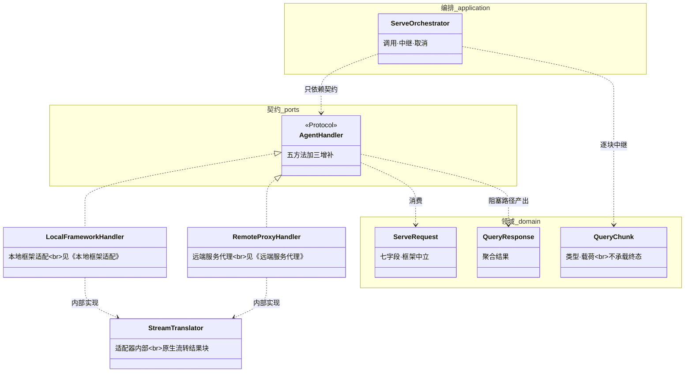
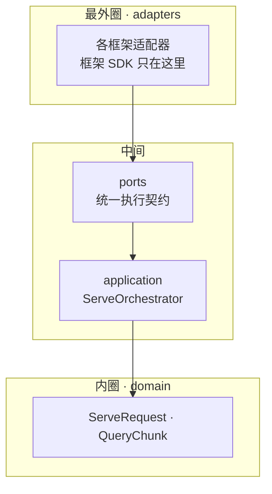
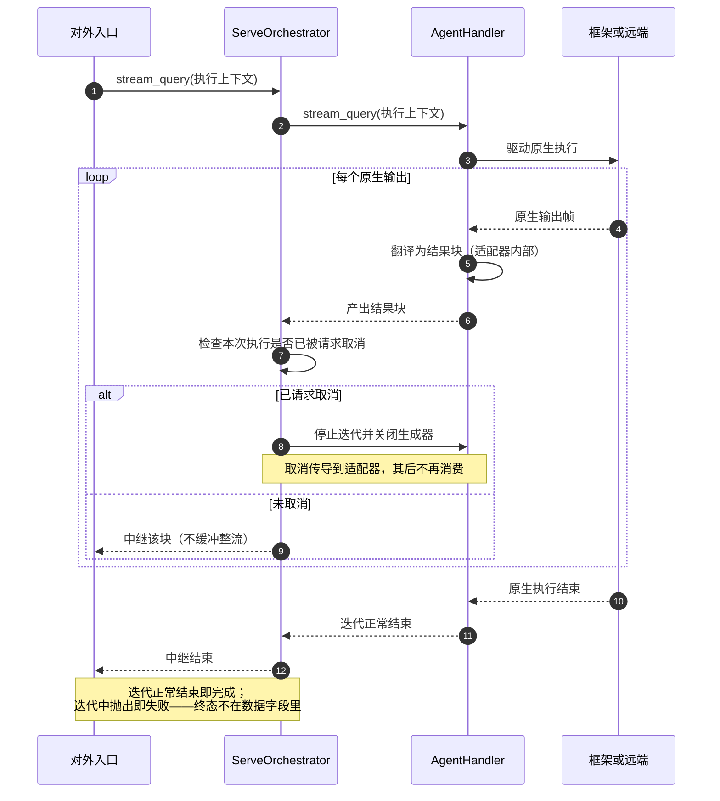
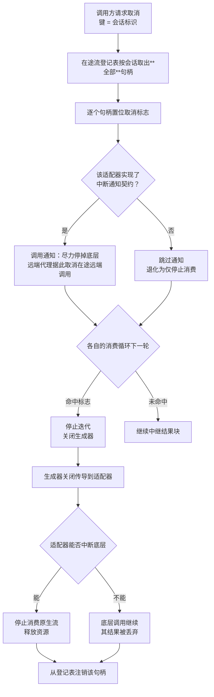
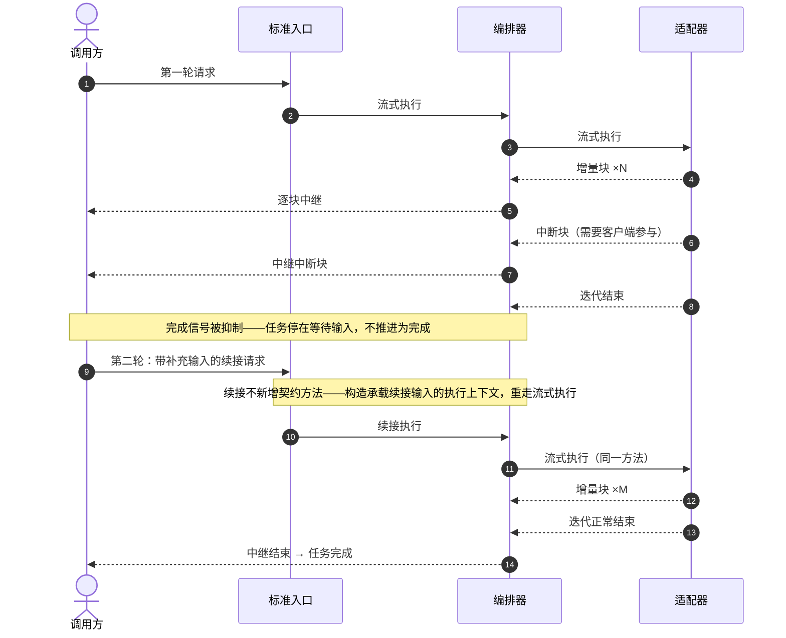

# 异构智能体框架兼容 · Python L2 详细设计 · 总览

## 1. 概述

### 1.1 特性定位

**角色**：本特性是 runtime 与各类 Agent 实现之间的**吸收层**——把不同框架在接口形态、执行模型、流式协议、错误表面与扩展机制上的差异，全部约束在适配器内部，向上只暴露一个统一的执行契约。

**现状 → 目标**：不同 Agent 实现的接口与流式协议互不相同，若让入口层直接对接，每接一个框架就要改一次入口。目标是让标准服务入口、任务生命周期、流式输出、错误、取消与租户上下文**都不依赖具体框架**——换框架只换适配器，入口层一行不改。

**适用**：把宿主已构建的本地 Agent 挂载到 runtime；把远端非标准协议的服务代理为一个 Agent。

**不适用**：本特性**不是新的对外协议层**（权威 `version-scope/FEAT-002-heterogeneous-agent-framework-compatibility.md:86`）——对外入口由标准服务入口特性承担，适配器不得暴露绕过它的私有端点（同文 `:149`）。标准协议的远端 Agent 调用也不在本特性，归远端通信特性（同文 `:45`）。

### 1.2 核心设计原则

1. **适配器吸收差异，不外泄框架状态机** — 框架内部的状态机、会话、节点、请求标识都不得直接暴露为对外任务状态。依据：权威 `:88` 明写不得把框架内部状态机暴露为对外任务状态机；`:89` 允许保留框架私有字段但**必须稳定映射**、不得覆盖 runtime 的事实字段。

2. **入口层零框架依赖** — 服务入口与任务存储只依赖框架中立的执行契约与结果模型。依据：权威 `:163`「A2A 层必须只依赖 `AgentHandler` / `QueryChunk` 等框架中立表面，不得导入私有类型」。

3. **状态归属不由适配器代理** — 适配器不读写、不配置、不治理框架的检查点与缓存，只传递 runtime 拥有的会话标识、任务上下文与生命周期信号。依据：权威 `:90`、`:150`。框架公开接口返回的运行态投影**可只读用于协议转换，但不得被适配器持久化为第二份恢复状态**。

4. **框架扩展机制自治** — 钩子、护栏、工具、技能、中间件、回调等机制由框架或 Agent 开发者自理，适配器只观察最终执行结果。依据：权威 `:91`、`:151`。

5. **终态由流的结束方式表达，不由数据字段声明** — 正常结束即完成，异常传播即失败。依据：权威 `:99`、`:100`——完成与失败**不在结果模型的数据字段中**，且 Agent **无法以数据方式主动声明失败**，只能依赖异常传播路径。

### 1.3 子特性全景

| 子特性 | 职责 | 关键抽象 | 状态 |
|---|---|---|---|
| 统一执行契约 | 所有适配器的唯一接入面 | `AgentHandler` | 已实现 |
| 执行上下文 | 框架中立的执行输入 | `ServeRequest` | 已实现 |
| 结果流归一 | 框架原生输出到统一结果流的翻译 | `QueryChunk` 三类型 | 已实现 |
| 执行编排 | 调用契约、逐块中继、取消传导 | `ServeOrchestrator` | 已实现 |
| 本地框架适配 | 把宿主构建的 Agent 挂到 runtime | 见 **L2-Func-002b《本地框架适配》** | 部分实现（见该篇） |
| 远端服务代理 | 把远端 REST/SSE 服务代理为 Agent | 见 **L2-Func-002b《远端服务代理》** | 已实现（见该篇：出站请求组装、响应行分帧、结果流归一、终态判定、结果提取五项均已实现） |

### 1.4 术语与命名对齐

| 本文用名 | 上位来源 | 对标实现 | 一致性 |
|---|---|---|---|
| `AgentHandler` | 权威 `:59` | `openJiuwen/agent-runtime-java/service/agent-service-spec/src/main/java/com/openjiuwen/service/spec/spi/AgentHandler.java:15` | **三方一致** |
| `ServeRequest` | 权威 `:60` | 同仓 `spec/dto` | **三方一致** |
| `QueryChunk` | 权威 `:61` | 同仓 `spec/dto` | **三方一致** |
| `ServeOrchestrator` | L1 逻辑视图 | 同仓 `spec/spi/ServeOrchestrator.java:15` | **三方一致** |
| 方法名 | — | 对标为驼峰式 | Python 用下划线式，一一对应、语义等价（总体设计 §1 的命名权威一节） |

**领域对象名不在本篇定义**：一律以总体设计 §1 的命名权威为准，不新造。

### 1.5 四份上位详设各自描述哪个仓

**这一节不可省**——上位的同级详设有四份，**分属不同的代码仓**，混用会得出相反的结论。

| 上位详设 | 自述目标模块 | 属哪个仓 | 是否对标基准 |
|---|---|---|---|
| 总览 | `agent-runtime/src/main/java/com/huawei/ascend/runtime/engine/` | **上游文档仓自有实现** | **否** |
| 本地框架适配 | 未声明；正文点名的执行适配基类在核心仓 | 核心仓 | **是** |
| 某 JVM 框架适配 | `common/agent-runtime-ext-java/agent-service-adapters/agent-service-adapters-agentscope` | 扩展仓 | **是** |
| 远端服务代理 | 同上目录下的远端代理模块 | 扩展仓 | **是** |

**因此本文的处置**：行为语义遵从权威规格与四份详设；**形态基准取对标的核心仓与扩展仓**，上游文档仓的自有实现作参考、不作准绳。

> **该自有实现与对标基准差异不小**：其执行入口命名不同，且含一整套轨迹能力——而权威 `:40` 明写轨迹接入为 OUT、当前版本零实现。若把它当基准，会把上位明确排除的能力当成要对齐的对象。

---

## 2. 功能规格

### 2.1 能力清单

逐条落地权威 `:33`–`:53` 的能力表。**权威的 MUST 一条不省**，不适用的显式标注并给出可核对的理由。

| # | 能力 | 级别 | 事实要求（外部可观察行为） | 权威 | 落点 |
|---|---|---|---|---|---|
| C1 | 统一执行契约 | MUST | 所有适配器经 `AgentHandler` 接入；入口层不出现任何具体框架类型 | `:33` | §2.3.1 |
| C2 | 统一结果流 | MUST | 输出经 `QueryChunk` 流承载，覆盖增量、中断、错误三类；终态由流的结束方式表达 | `:34` | §2.3.3、§4.2 |
| C3 | 框架中立执行上下文 | MUST | 以 `ServeRequest` 为执行输入，消费其七个字段 | `:35` | §2.3.2 |
| C4 | 单 Agent 执行模型 | MUST | 一个实例只承诺服务一个 Agent；**不得承诺按标识在同实例内路由多个** | `:36` | §4.4 |
| C5 | 协作式取消 | MUST | 无独立取消入口；取消**至少要阻止 runtime 继续消费本次执行结果** | `:38` | §2.3.4、§4.3 |
| C6 | 框架中立错误表面 | MUST | 原生异常、传输错误、未知结果一律映射为失败终态；原生错误码存在时应保留 | `:39` | §4.2 |
| C7 | 本地框架适配 | MUST | 托管宿主构建的本地 Agent，会话标识由 runtime 传入 | `:41` | **L2-Func-002b《本地框架适配》** |
| C8 | 远端服务代理 | MUST | 把远端 REST/SSE 服务代理为 Agent，完成双向转换 | `:46` | **L2-Func-002b《远端服务代理》** |
| C9 | 远端地址模板 | MUST | 支持会话标识与部署配置变量替换 | `:47` | **L2-Func-002b《远端服务代理》** |
| C10 | 远端请求头与元数据映射 | MUST | 支持配置头、允许列表内透传、结构化覆盖；**不得默认透传全部元数据** | `:48` | **L2-Func-002b《远端服务代理》** |
| C11 | 远端中断检测 | MUST | 远端流关闭但无明确终止事件时**不得误报完成** | `:50` | **L2-Func-002b《远端服务代理》** |
| C12 | 适配器健康与生命周期 | SHOULD | 应实现启动与停止；**持续健康探测由后续版本补齐** | `:37` | §2.3.1 |
| C13 | 远端结果提取 | SHOULD | 按配置的节点名与节点类型提取业务结果 | `:49` | **L2-Func-002b《远端服务代理》** |
| C14 | 某 JVM 框架的三条适配 | MUST | 本地实例包装、其暂停恢复三类语义 | `:42`、`:43`、`:44` | **不适用**，理由与举证见 §2.2 |

> C5 的「至少」是权威给的**下限**：能否立即中断底层调用由适配器能力与检查窗口决定，**不得夸大为强制中断**（权威 `:38`、`:152`）。

### 2.2 显式排除

| 排除项 | 原因 | 替代方案 |
|---|---|---|
| **某 JVM 框架的本地适配（C14 的三条 MUST）** | **语言绑定不可跨越**：该适配的对象是「宿主已构建的**本地**实例」，其接口以 JVM 响应式类型承载（权威 `:42`）。对标扩展仓确有完整产品模块（含七个主类），其代码导入该框架的 JVM 库类型与响应式库类型——**适配器与 Agent 必须在同一 JVM 进程内**。Python runtime 不在该进程内，无法包装其本地实例 | 权威 `:45`、`:51` 已指定：跨语言 Agent 经**远端服务代理**（L2-Func-002b《远端服务代理》）或**标准远端 Agent**（远端通信特性）接入 |
| 同实例多 Agent 路由 | 一个实例只服务一个 Agent | 多实例部署或上层网关路由（权威 `:148`） |
| 适配器私有对外端点 | 对外入口归标准服务入口特性 | 经标准入口调用（权威 `:149`） |
| 适配器代理框架检查点与缓存的读写治理 | 状态归属边界 | 只传递 runtime 拥有的标识与信号（权威 `:150`） |
| 适配器安装或编排框架的钩子、护栏、工具、技能 | 框架扩展机制自治 | 由框架或 Agent 开发者自理（权威 `:151`） |
| 强制中断已进入底层模型或远端服务的阻塞调用 | 协作式取消的固有限制 | 尽力通知 + 停止消费（权威 `:152`） |
| 框架中立轨迹接入 | 权威列为 OUT、当前版本零实现 | 由后续特性承接（权威 `:40`） |
| 以进程内方式接入非本语言 Agent | 权威列为 OUT | 远端服务代理或标准远端 Agent（权威 `:51`） |
| 把工具服务协议当作框架适配器 | 它是工具协议不是 Agent 框架 | 由框架或 Agent 开发者自治（权威 `:157`） |
| 用客户端门面替代远端服务代理 | 二者事实边界不同 | 各按其定位使用（权威 `:158`） |

> **C14 的登记方式是刻意的**：不静默省略、不降格叙述，而是**列出权威条目号 + 不适用的可核对理由 + 权威自己指定的替代路径**。省略会让后来者以为遗漏了三条 MUST。

### 2.3 接口契约

#### 2.3.1 API / SPI 声明

```python
# agent_runtime/ports/handler.py —— 所有适配器的唯一接入面
@runtime_checkable
class AgentHandler(Protocol):
    # —— 权威五方法（对齐对标 spec/spi/AgentHandler）——
    async def query(self, request: ServeRequest) -> QueryResponse:
        """阻塞执行，返回聚合结果。

        参数 request：框架中立的执行输入（§2.3.2）。
        返回：聚合后的查询响应。
        实现者必须保证：即使底层框架同步阻塞，也不得在此方法内直接返回框架原生对象——
        必须先经结果归一（§4.2）。
        """

    def stream_query(self, request: ServeRequest) -> AsyncIterator[QueryChunk]:
        """流式执行，逐块产出。

        返回：异步迭代器；**迭代正常结束表示完成，迭代中抛出表示失败**（§2.3.3）。
        实现者必须保证：消费方停止迭代或关闭生成器时，及时释放底层资源并停止消费原生流。
        """

    async def start(self) -> None:
        """启动底层执行后端。由生命周期编排器在初始化阶段调用一次。"""

    async def stop(self) -> None:
        """停止底层执行后端。由生命周期编排器在关停阶段调用一次；**抛出不得中断关停**。"""

    async def clear_session(self, conversation_id: str) -> None:
        """清理某会话在框架侧的状态。实现者必须保证：对不存在的会话是空操作，不抛出。"""

    # —— 本地增补三项（非权威；本语言的装配面需要，理由见下）——
    agent_id: str
    priority: int
    def is_healthy(self) -> bool:
        """启动阶段的就绪查询。**不承诺反映运行中的持续健康**（权威 `:37`）。"""
```

**权威五方法逐条对应**对标实现的 `query`、`streamQuery`、`start`、`stop`、`clearSession`，命名按本语言习惯转写、语义等价。

**一处形态本地化：流式执行不采用观察者回调。**

| 上位语义 | 本设计形态 |
|---|---|
| 逐个推送增量 | 逐个产出增量 |
| 控制信号「完成」 | 迭代**正常结束** |
| 控制信号「失败」 | 迭代中**抛出异常** |
| 观察者的取消标志轮询 | 消费侧**停止迭代**并关闭生成器 |

该形态是本语言的原生异步流机制；采用回调形态需额外的观察者对象与生命周期管理，而表达能力与迭代器等价。**终态语义不变**：完成与失败仍不在结果模型的数据字段中。

**三项本地增补的定位——非权威，但非随意**。权威 `:134` 明写当前版本「**无健康查询方法可供运行时查询**」，故这三项**不得按权威 MUST 判定**，只按本设计的本地契约判定：

| 增补项 | 为什么本语言需要 | 对标实现的对应机制 |
|---|---|---|
| `agent_id` | 装配经入口点发现，需要一个可寻址的标识 | 对标由容器按类型注入，无需标识 |
| `priority` | 发现到多个实现时的选取依据 | 对标经容器的单例提供者获取，**多实现行为未定义**（权威 `:78`） |
| `is_healthy` | 就绪检查需要一个查询点 | 对标是**独立的就绪检查类**（`openJiuwen/agent-runtime-java/service/agent-service-spec/src/main/java/com/openjiuwen/service/spec/lifecycle/AgentReadiness.java`），不在执行契约内 |

**三项明确不设**，各有依据：

| 不设 | 依据 |
|---|---|
| `resume`（续接入口） | 续接经构造承载续接输入的 `ServeRequest` 重走流式执行，**不新增契约方法** |
| `cancel`（取消入口） | 权威 `:38` 明写「Handler 无独立 `cancel()` 入口」 |
| 结果翻译件 | 原生流到统一结果流的翻译是适配器**内部实现**，进契约面会让契约间接依赖框架类型（§3.3） |

**一个独立的可选契约：中断通知。**

```python
# agent_runtime/ports/interrupt.py —— 与执行契约分开的可选契约
@runtime_checkable
class InterruptNotifiable(Protocol):
    """取消发生时接收通知，以便尽力停掉底层执行。

    参数 conversation_id：被取消的会话标识。
    参数 reason：取消原因，用于让实现方区分「调用方主动取消」与「进程关停」——
        后者可能需要更快放弃、不做重试。

    实现者必须保证：本方法**不得抛出**。取消路径上的异常会掩盖取消本身，
    而调用方已经收到取消成功的响应。实现方内部的失败自行吞掉并记日志。

    实现者必须保证：本方法**不阻塞**取消的返回。取消是尽力而为的信号，
    等待底层确认会把「协作式取消」变成「同步等待」。
    """
    async def on_interrupt(self, conversation_id: str, reason: InterruptReason) -> None: ...
```

**为什么它是独立契约而不是执行契约的第七个方法**：权威 `:38` 明写「Handler 无独立 `cancel()` 入口」，在执行契约上加取消方法直接违反。而权威 `:141` 又要求取消时「**尽力通知底层框架或远端请求**」——两条并存的唯一解法就是把通知放在**另一个契约**上，由适配器自愿实现。对标同样如此：它的中断通知是一个独立的可选钩子接口，不在执行契约里。

**谁实现它，实现了做什么**：

| 实现方 | 收到通知后做什么 |
|---|---|
| 本地框架适配器 | 尽力通知框架停止当前执行；框架不支持则空操作 |
| 远端服务代理 | **取消在途的远端调用**——这就是存量取消时的级联行为，不是新增能力 |
| 未实现该契约的适配器 | 无通知，退化为「仅停止消费」——仍满足权威 `:38` 的下限 |

**它不改变取消的承诺强度**。权威 `:38` 明确取消「至少要阻止 runtime 继续消费」，能否中断底层由适配器能力决定、`:169` 把强制取消列为 OUT。本契约提供的是**通知通道**，不是中断保证——实现方尽力而为，通知不到或底层不理都属预期内。

#### 2.3.2 数据类型

| 类型 | 关键字段 | 含义 | 约束 |
|---|---|---|---|
| `ServeRequest` | `conversation_id` | 会话标识，兼任会话范围 | 非空；由入口填充；**直接用作框架侧会话键**（权威 `:62`，风险见 §13） |
| | `tenant_id` | 租户标识 | 可空；由入口从鉴权结果填充，**不取自请求体**（§10） |
| | `user_id` | 用户标识 | 可空；同上 |
| | `space_id` | 空间标识 | 可空；同上 |
| | `messages` | 消息列表 | 可空；缺失时归一为空列表；每项含角色与内容两个字段 |
| | `stream` | 是否流式 | 默认**真**；进站侧按实际调用方式覆盖 |
| | `metadata` | 元数据映射 | 可空，缺失时为空映射；承载中断续接等内部约定键 |
| `QueryChunk` | `type` | 结果类型 | 非空；**封闭三值**（增量／中断／错误）；以字符串常量而非枚举承载（对齐对标形态）；默认为增量 |
| | `data` | 载荷 | 可空映射，缺失时为空映射；含义由类型决定；**不承载终态信息** |
| | （只读投影） | 从载荷派生的便利属性 | **不是字段**——是否终答、事件名、内容文本、远端委派载荷均由载荷派生，顶层字段恒为两个 |
| `QueryResponse` | `result` | 聚合结果 | 可空；由阻塞路径聚合产出 |
| | `conversation_id` | 会话标识 | 与请求一致 |

**当前版本不承载**任务标识、Agent 标识、独立状态键、记忆作用域四个字段——权威 `:35` 明写由后续特性补齐。

**载荷键按类型分三组，键名不可自拟**——它们是入口层重建对外报文的依据（§11.1），改一个名就重建不出等价报文：

| 结果类型 | 载荷键 | 类型 | 含义 | 缺省 |
|---|---|---|---|---|
| 增量 | `event_type` | 字符串 | Agent 的原生语义事件名（思考、工具开始、终答分片等），由适配器内部翻译件从框架原生流归一而来 | 必填 |
| | `content` | 字符串 | 该事件的文本内容 | 空串 |
| | `plugin` | 字符串 | 产生该事件的插件或工具名 | 空串 |
| | `data` | 映射 | 结构化附加数据 | 缺省不出现（**不是空映射**——出现空映射会被下游当作「有数据但为空」） |
| | `final` | 布尔 | **终答标记**。为真表示这是终答内容帧 | 缺省不出现 |
| 中断 | `content` | 字符串 | 向调用方展示的中断提示 | 空串 |
| | `interaction_id` | 字符串 | 框架侧的续跑锚点；续接时原样交回。**空串表示非锚点绑定的续接路径** | 空串 |
| | （远端委派载荷） | 结构体 | **不属本特性**——归远端通信特性；编排器据它把委派拦下自处理，不投影给调用方。纯用户交互中断时该键不出现 | 缺省不出现 |
| 错误 | `message` | 字符串 | 错误描述 | 必填 |
| | `code` | 字符串 | **框架或远端的原生错误码**，无则由适配器给稳定标识 | 空串 |
| | `kind` | 字符串 | 粗分类，供调用方决定是否重试 | 缺省不出现 |

**为什么给构造器而不是让实现者直接构造**：三组键各自成套，手工构造极易配错——把错误载荷装进增量类型的块，类型检查发现不了。**每类型一个构造器**，把类型与载荷绑定在一处。

**终答标记为何是载荷键而非顶层字段**：顶层字段集合是与对标一致的兼容锚（恰两个字段），加字段即破锚；而终答只是内容帧的一个属性，不改变它的类型。判定是否终答由**从载荷派生的只读投影**提供，调用方不直接读键。

#### 2.3.3 行为承诺

**必须**

- 所有适配器经统一执行契约接入；入口层不出现任何具体框架类型。
- 增量输出经增量块承载，可在一次执行中多次出现。
- 需要客户端参与时产出中断块，**其后完成信号被抑制**。
- 异常或不可恢复错误经错误块与异常传播表达失败。
- 正常完成由**迭代正常结束**表达，前置无中断块。
- 未知的原生结果类型**必须失败或被显式过滤**，不得以空完成掩盖。
- 取消**至少阻止 runtime 继续消费本次执行结果**。
- 适配器保留的框架私有字段**必须稳定映射**到 runtime 上下文或元数据。

**禁止**

- 把框架内部状态机直接暴露为对外任务状态机。
- 用完成表达「远端仍在等待输入」或「连接意外关闭但无终止事件」。
- 适配器读写、配置或治理框架的检查点与缓存。
- 适配器把框架公开接口返回的运行态投影**持久化为第二份恢复状态**。
- 适配器暴露绕过标准入口的私有端点。
- 在契约面暴露结果翻译件。

**允许**（实现者的自由度，不得当作契约违反）

- 适配器**可以缓存**框架实例、连接、客户端等自有资源，只要不缓存 runtime 拥有的状态。
- 增量块的**切分粒度未定义**——按 token、按段落、按框架原生边界均可；调用方不得依赖特定粒度。
- 结果模型**可以增加从载荷派生的只读投影**（是否终答、事件名等），因为它们不改变顶层字段集合。
- `clear_session` 的**清理深度由适配器决定**——清到框架会话、清到检查点、或仅清内存引用均可。
- 适配器**可以并发处理不同会话**的执行；本特性不要求串行。

**一处与对标的形态差异，必须登记**：对标的结果模型定义了**四个**类型常量，第四个是「远端 Agent 输出」（`openJiuwen/agent-runtime-java/service/agent-service-spec/src/main/java/com/openjiuwen/service/spec/dto/QueryChunk.java:23`）。而权威 `:34`、`:61` 只列三类。

本设计取**三类**，理由与承载方式：

| 问题 | 处置 |
|---|---|
| 遵从哪个 | 遵从权威的三类——第四类是远端通信特性的产物，把它放进本特性的结果模型会让本契约随那个特性变动 |
| 那远端委派怎么承载 | 作为**中断帧的载荷**：委派仍是中断类型，编排器据载荷分流、自行处理，不投影给调用方（`openJiuwen/agent-runtime-mvp/agent_runtime/domain/result.py:105-107`） |
| 会不会以后被迫加第四类 | 不会。载荷是映射，新增承载物只加载荷键，**顶层字段与类型集合都不变** |

**因此本设计有一条红线：不得新增第四种类型。** 增量、中断、错误三类之外的任何需求，一律走载荷键。该红线由禁止性测试锁定（§12）。

#### 2.3.4 消息队列声明

**本特性不涉及消息队列。** 适配器与框架之间是进程内的直接调用与异步迭代，不发布也不消费任何事件；跨进程的事件能力由对应特性承担，其接入方式经框架基座的扩展点机制，但事件语义不在本篇范围。

---
## 3. 模块结构

### 3.1 包结构

```
agent_runtime/
  ports/
    handler.py            # 统一执行契约：五方法 + 三增补，零框架依赖
  domain/
    context.py            # ServeRequest：框架中立执行输入
    result.py             # QueryChunk 与 QueryResponse：结果模型与三个类型常量
  application/
    serve.py              # ServeOrchestrator：调用契约、逐块中继、取消传导
  adapters/outbound/
    <本地框架目录>/        # 各框架适配器，见 L2-Func-002b《本地框架适配》
    <远端代理目录>/        # 远端服务代理，见 L2-Func-002b《远端服务代理》
```

**不列入本篇的文件**：两个适配器目录的**内容**归各自分册，本篇只定义它们必须实现的契约与必须遵守的归一语义。

### 3.2 类图与静态关系



**模式标注**：`AgentHandler` 是**结构化子类型协议**（实现方无需继承）；两个具体处理器是**适配器**；`StreamTranslator` 是适配器的**内部翻译件**，**不进契约面**；`ServeOrchestrator` 是**编排器**——自身不解释块的内容，只管流的生命周期。

### 3.3 依赖方向与禁止依赖



**本模块可以依赖谁**：适配器可依赖 `ports` 与 `domain`；编排器可依赖 `ports` 与 `domain`；`domain` 不依赖任何层。

**本模块绝不能依赖谁**：

| 禁止 | 理由 |
|---|---|
| 入口层导入任何框架私有类型 | 权威 `:163`；导入即把框架版本绑进入口 |
| `ports` 或 `domain` 导入框架 SDK | 契约与领域被框架污染后，换框架要改内层 |
| 结果翻译件出现在 `ports` | 它的输入是框架原生类型，进契约面即让契约间接依赖框架 |
| 编排器反向调用适配器的内部方法 | 编排器只应看到契约面 |

**违反了会怎样**：

| 违反 | 能否被静态检查发现 | 发现不了靠什么兜住 |
|---|---|---|
| 入口层导入框架类型 | **能**——扫描入口层导入，白名单只含契约与领域 | — |
| 契约层导入框架 SDK | **能**——扫描 `ports/` 与 `domain/` 的导入 | — |
| 翻译件进契约面 | **能**——断言 `ports` 的导出清单中无翻译件 | — |
| 适配器把框架运行态投影落盘 | **不能**——落盘动作可以经存储端口发生，静态看不出目的 | 契约层面兜住：适配器**不得持有存储端口**——它的构造参数中不出现存储契约（§12 的 V6） |

> 前三条有静态判据，第四条没有——所以它被写进行为承诺的「禁止」档（§2.3.3），并在验收里以构造参数审计的形式落地。**没有静态判据的约束必须换一种可核形式。**

---

## 4. 核心设计

### 4.1 执行编排

#### 4.1.1 关键处理流程



**编排器的两条路径共用同一条执行链**：

| 路径 | 做法 | 为什么 |
|---|---|---|
| 流式 | 直接中继契约产出的流 | — |
| 阻塞 | **排空同一条流**并返回完整序列，**不调用契约的阻塞方法** | 两条路径经过同一执行链，杜绝双实现漂移；否则阻塞路径的行为会随适配器各自的实现分叉 |

**编排器还承载另外两个特性的职责，本篇不描述**：远端委派的拦截与批次编排归远端通信特性；续接请求的构造归用户交互中断特性。**此处登记是因为读者会在同一个类里看到那些代码**——不写明会被误读为本特性的一部分。本篇只定义它对结果流的中继语义与取消语义。

**分支条件**

| 条件 | 走哪条路 |
|---|---|
| 结果块为增量类型 | 中继给入口，任务保持执行中 |
| 结果块为中断类型 | 中继给入口，**其后完成信号被抑制**（§4.2） |
| 结果块为错误类型 | 中继后异常传播，任务进入失败 |
| 本次执行已被请求取消 | 停止迭代并关闭生成器，不再中继 |
| 迭代正常结束且此前无中断块 | 任务进入完成 |
| 迭代中抛出 | 任务进入失败 |

**边界条件**

| 边界 | 处理 |
|---|---|
| 零结果块即结束 | 视为完成，产出空结果——**不是失败** |
| 首块即中断 | 完成信号被抑制；**不得当作协议错误**（标准服务入口特性已有对应判据） |
| 取消与正常结束并发到达 | 见 §4.1.2 |
| 适配器抛出非预期异常 | 异常向上传播，由入口映射为失败终态（权威 `:136`） |
| 未知的结果类型取值 | **透传给入口**，不拒绝（§2.3.3「允许」档） |

**状态转换表**

| 当前状态 | 事件 | 下一状态 | 附加行为 |
|---|---|---|---|
| 未开始 | 入口发起执行 | 执行中 | 登记在途流（见框架基座详设） |
| 执行中 | 产出增量块 | 执行中 | 中继，不改变状态 |
| 执行中 | 产出中断块 | 等待输入 | 中继；**置位「完成信号已抑制」** |
| 执行中 | 迭代正常结束 | 完成 | 注销在途流 |
| 等待输入 | 迭代正常结束 | **仍为等待输入** | 完成信号被抑制，不推进为完成 |
| 执行中／等待输入 | 迭代抛出 | 失败 | 注销在途流；异常向上传播 |
| 执行中／等待输入 | 请求取消 | 已取消 | 停止迭代、关闭生成器、注销在途流 |

#### 4.1.2 并发与协程安全边界

**单写者假设**：同一次执行的结果流**假设只有一个消费者**——即编排器自身。该假设由**调用约定**保证：编排器产出的迭代器不交给第三方共享。

| 对象／方法 | 可否并发调用 | 保证方式 |
|---|---|---|
| 同一次执行的迭代器 | **否** | 异步生成器本就不支持并发迭代；并发消费会得到未定义行为 |
| 不同会话的 `stream_query` | **是** | 各自独立的迭代器与适配器调用；适配器**可以并发处理不同会话**（§2.3.3「允许」档） |
| 同一会话的多次执行 | **是，但语义由上层约束** | 本特性不禁止；同一任务的单写者由标准入口的活跃任务机制保证 |
| 编排器的取消标记读写 | **是** | 单事件循环下布尔集合的增删无交错；跨线程不承诺（与框架基座同一边界） |

**竞态窗口**：取消请求与流的正常结束之间存在窗口——取消标记已置、而适配器恰好在此刻产出最后一块并结束迭代。**窗口内的行为**：编排器可能中继了最后一块后才发现已取消，也可能在中继前发现。**这是已知接受的残余风险**——两种结果对调用方都是合法的（取消本就不承诺精确到某一块），消除它需要在每块中继上加锁，代价远大于收益。

> **取消不承诺立即中断底层调用**（权威 `:152`）：适配器侧的生成器关闭会传导到框架，但框架是否响应、多快响应由其能力决定。**这不是窗口，是能力上限**，写在 §9.2。

#### 4.1.3 幂等键与重试语义

**本子特性涉及两类标识，语义不同、不得混用**：

| 标识 | 语义 | 是不是幂等键 |
|---|---|---|
| 会话标识 | **分组键**——把执行按会话归组，用于定向取消与框架侧会话延续 | **不是**。同一会话可发起多次执行，各自独立 |
| 适配器标识 | **选取键**——装配时定位唯一适配器 | **不是**。它只用于选取，不参与去重 |

**本特性不产生任何幂等键**——去重与重复提交的判定归标准服务入口特性（其任务标识与通知标识）与远端通信特性（其委托关联键）。**在本特性内造一个幂等键会与它们的判定重叠且不一致。**

| 操作 | 重复调用的行为 | 理由 |
|---|---|---|
| `stream_query` | **非幂等**：每次调用是一次新执行 | 执行有副作用（模型调用、工具调用），重放不等价 |
| `query` | **非幂等**：同上 | — |
| `start` / `stop` | **幂等**：由生命周期编排器保证只调一次；适配器实现应容忍重复 | 关停可能被双触发（见框架基座详设） |
| `clear_session` | **幂等**：对不存在的会话是空操作 | 清理动作重复执行无差异 |

**重试策略：本特性不重试。** 执行失败不由编排器重试——重试会重复已发生的副作用（模型调用、工具调用、远端写入）。是否重试由调用方按其业务语义决定。

**重试不改变对外可观察状态**——因为本特性不重试。

### 4.2 结果流归一

#### 4.2.1 关键处理流程

框架原生输出到统一结果流的翻译，由**各适配器内部**完成（翻译件不进契约面）。本节定义**所有适配器都必须遵守的映射规则**，规则来自权威 `:96`–`:102`。

| 框架原生情形 | 统一结果流 | 终态 |
|---|---|---|
| 增量输出（每生成一段即发一次） | 增量块，可多次出现 | 未决 |
| 需要客户端参与 | 中断块 | **完成信号被抑制** |
| 连接关闭但无终止事件 | 中断块或失败（见下注） | 不得为完成 |
| 异常或不可恢复错误 | 错误块 + 异常传播 | 失败 |
| 正常结束（此前无中断块） | 迭代正常结束 | 完成 |
| 未知的原生结果类型 | **失败或显式过滤** | 不得以空完成掩盖 |

**三条不可违反的边界**，每条对应一种真实的误报：

1. **完成不得用于表达「远端还在等输入」或「连接意外关闭但无终止事件」**（权威 `:101`）。两者都不是完成，误报会让调用方以为对话已结束。
2. **失败完全由异常驱动**（权威 `:100`）——Agent **无法以数据方式声明自己失败**。这意味着适配器若吞掉异常并返回正常结果，**失败就永久丢失**。
3. **未知原生类型不得静默丢弃**（权威 `:102`）。静默丢弃会产生「流正常结束但没有任何内容」的空完成。

> **断流的映射有一处上位内部不一致**：权威 `:50` 要求映射为中断，同文 `:140` 写「中断**或失败**」。该分歧只在远端代理场景实际发生，**处置与举证见 L2-Func-002b《远端服务代理》**；本篇不重复裁断。

#### 4.2.2 并发与协程安全边界

**翻译是无状态转换**：一个原生帧进、零或一个结果块出，不跨帧持有状态。

| 对象／方法 | 可否并发调用 | 说明 |
|---|---|---|
| 翻译件的单帧映射 | **是** | 无共享可变状态 |
| 翻译件的流式适配 | **否**（同一条流内） | 与其所属的迭代器同生命周期，不并发 |

**一处必须无状态的理由**：若翻译件跨帧持有状态（如「已见过终态帧」标志），同一实例被两条流复用时会互相污染。**故翻译件要么无状态、要么每条流一个实例**——本设计取前者，实例可安全复用。

**无竞态窗口**——无共享可变状态。

#### 4.2.3 幂等键与重试语义

**本子特性不涉及任何标识。**

| 操作 | 重复调用的行为 |
|---|---|
| 单帧映射 | **幂等**：同一原生帧产出等价结果块 |

**重试策略：无。** 翻译失败是确定性的（帧结构不符），重试必然同样失败——按 §4.2.1 的规则失败或过滤。

### 4.3 取消传导

#### 4.3.1 关键处理流程



**键与粒度**

| 项 | 取值 | 依据 |
|---|---|---|
| 取消的键 | **会话标识**（由服务入口的上下文标识而来） | 对标的两条取消通道——A2A 取消入口与生命周期中断——都用会话维度的键，无一用任务标识 |
| 登记粒度 | **每条流一个句柄**，按会话分组 | 对标的登记表是「会话 → 句柄集合」。粒度是解决正确性的关键：见下 |

> **为什么必须是句柄粒度，不能是「一个会话一个取消标记」**：同一会话有并发执行时，若只用一个标记，后启动的执行会在开始时清掉它，**前一个执行的取消被静默撤销**。句柄粒度下，取消置位的是当时存在的那些句柄，新注册的句柄是新对象、天然不受影响——正确性由数据结构保证，不靠时序小心。

**分支条件**

| 条件 | 走哪条路 |
|---|---|
| 会话下有多条在途流 | **全部**置位——取消的语义是「停掉这个会话正在跑的东西」 |
| 适配器实现了中断通知契约 | 调用通知，让它尽力停掉底层 |
| 适配器未实现该契约 | 跳过通知，仅停止消费——仍满足权威 `:38` 的下限 |
| 通知调用本身抛出 | **吞掉并记日志**，不影响取消返回——契约已要求实现方不抛，此处是兜底 |
| 取消标志置位时正在中继某块 | 该块可能已送达调用方（§4.1.2 的窗口） |
| 适配器能中断底层 | 停止消费原生流并释放资源 |
| 适配器不能中断底层 | 底层继续执行，**其结果被丢弃**——不再有消费者 |

**边界条件**

| 边界 | 处理 |
|---|---|
| 取消一个已结束的执行 | 空操作 |
| 取消一个不存在的会话 | 空操作，不抛出 |
| 同一执行被多次取消 | 幂等，等价于一次 |
| 取消时适配器卡在不可中断的同步计算 | 生成器关闭要等到下一个让出点才生效——**这是能力上限**（§9.2） |

**状态转换表**

| 当前状态 | 事件 | 下一状态 | 附加行为 |
|---|---|---|---|
| 执行中 | 请求取消 | 取消中 | 置标记；不立即动迭代器 |
| 取消中 | 消费循环下一轮 | 已取消 | 停止迭代、关闭生成器 |
| 取消中 | 迭代恰好正常结束 | 完成或等待输入 | **取消未生效**——这是接受的窗口（§4.1.2） |
| 已取消 | 再次请求取消 | 已取消 | 空操作 |

#### 4.3.2 并发与协程安全边界

**登记表的读写**：在途流登记表持有「会话标识 → 句柄集合」，由执行开始时登记、收尾时注销、取消时按会话取出全部句柄置位。单事件循环下映射与集合的增删无交错；**跨线程不承诺**（与框架基座同一边界）。

| 方法 | 可否并发调用 | 说明 |
|---|---|---|
| 登记 / 注销 | **是** | 各自只动自己的句柄；注销不影响同会话的兄弟句柄 |
| 按会话取消 | **是** | 对当时存在的句柄置位；置位本身幂等 |
| 消费循环读自己的句柄 | 与取消并发 | 见 §4.1.2 的窗口说明 |

**登记表不外置。** 句柄引用的是本进程内的执行，外置一份副本对其他副本没有意义。这一条是上位的硬约束（L1 物理视图明写不把流取消句柄迁入 Redis），不是本设计的取舍。跨副本的取消由宿主的实例亲和承接——同一会话的请求路由到同一副本，这已是宿主义务。

**竞态窗口**：已在 §4.1.2 登记（取消与正常结束的交叉），此处不重复。

#### 4.3.3 幂等键与重试语义

**涉及一类标识**：执行键（由会话标识派生）。它是**定位键**——用于找到要取消的那次执行，**不是幂等键**。

| 操作 | 重复调用的行为 | 理由 |
|---|---|---|
| 请求取消 | **幂等**：重复请求等价于一次 | 标记置位后再置位无差异 |

**重试策略：无。** 取消是尽力而为的信号，不重试；调用方若观察到未取消成功，应查询任务状态而非重发取消。

### 4.4 单 Agent 装配

#### 4.4.1 关键处理流程

权威 `:36` 定死：**一个 runtime 实例只承诺服务一个 Agent**；`:52`、`:148` 明确不承诺同实例内按标识路由多个；`:78` 记载对标实现在多实现注册时**行为未定义**（无检测、无选择逻辑、无告警）。

本设计的装配：经框架基座的扩展点机制发现全部实现，**按优先级选取一个**投入服务。

| 条件 | 走哪条路 |
|---|---|
| 发现一个实现 | 直接使用 |
| 发现多个实现 | 按优先级数值选取一个，**记录告警** |
| 配置按名指定 | 精确匹配；未命中即启动失败 |
| 发现零个 | 启动失败 |

**这不是同实例多 Agent 路由**——选取发生在启动时且只选一个，运行期不按请求路由。

> **相对对标实现是一处收敛而非扩张**：对标在多实现时行为未定义（权威 `:78`），本设计给出确定的选取规则并在发现多个时记录告警。**确定性优于未定义行为**，且不触碰「不承诺多 Agent 路由」这条边界——**选取一个**与**路由多个**是两回事。

#### 4.4.2 并发与协程安全边界

**装配在启动期完成，运行期只读。**

| 方法 | 可否并发调用 | 说明 |
|---|---|---|
| 装配（选取与加载） | **否**（启动期单线程） | 机制与保证见框架基座详设 |
| 运行期读取已装配的适配器 | **是** | 纯读，无写者 |

**无竞态窗口**——运行期无写路径。

#### 4.4.3 幂等键与重试语义

**涉及一类标识**：适配器标识。它是**选取键**，不是幂等键（§4.1.3 已说明）。

| 操作 | 重复调用的行为 |
|---|---|
| 装配 | **幂等**：同一组已安装实现与同一配置，每次选中同一个 |

**重试策略：无。** 装配失败即启动失败，不重试——理由见框架基座详设的失败分层。

---
## 5. 数据设计

**本特性不持有任何持久状态**——不写数据库、不写缓存、不落文件。理由：它是契约层与翻译层，执行结果逐块流向调用方，任务状态的存储归任务状态缓存特性，框架侧的会话与检查点归框架自治（权威 `:90`、`:150`）。

但「不持有持久状态」不等于「无状态可盘」。**盘点边界含进程内运行态**，逐项如下：

| 项 | 形态 | 写入方 | 生命周期 | 清理责任 |
|---|---|---|---|---|
| 已请求取消的执行键 | 进程内集合，元素为会话标识 | 编排器的取消入口 | 单次执行期间；执行结束即移除 | **编排器自身**，在流的收尾处无条件移除——异常路径同样移除 |
| 已装配的适配器引用 | 进程内单个引用 | 启动期装配 | 进程生命周期 | 进程退出即释放 |
| 适配器内部的框架实例与连接 | 进程内 | 各适配器 | 由适配器的启动与停止界定 | 各适配器在停止时释放（§4.1.3 的幂等要求） |

**过期时间与续期**：三项均无过期机制——前两项由生命周期界定，第三项由适配器自管。**不设过期是刻意的**：给进程内运行态加过期，等于引入一个与生命周期并行的第二套回收路径，两者不一致时会出现「已过期但仍在用」的引用。

**写序要求**：本特性无多键写入，无写序约束。取消标记的置位与移除是单键操作。

> **一处必须无条件执行的清理**：取消标记的移除必须在**流的收尾处**执行，且异常路径也要走到。**遗漏的后果是跨执行污染**——标记残留会让同一会话的下一次执行一启动就被判为已取消，且这个错误只在复用同一会话时显形，单次调用的测试永远抓不到。

**与全局数据架构的关系**：本节是全局数据架构视图的一个切片。全局视图已把盘点边界从「持久键」扩展到「进程内运行态」，本节的三项即按该边界盘出。冲突时以全局视图为准，并回头修全局。

---

## 6. 配置模型

### 6.1 完整配置示例

```yaml
agent-runtime:
  # 适配器选取——决定本实例服务哪一个 Agent 实现。
  # 一个实例只服务一个 Agent（权威 :36），此处选一个，不是配一组。
  adapter:
    # 按标识精确指定。留空则按优先级自动选取。
    # 部署中装了多个适配器包时，建议显式指定——自动选取虽有确定规则，
    # 但「装了什么」会随打包变化，显式指定才能让部署行为不随依赖漂移。
    name: ""
    # 发现到多个实现时，是否允许自动选取。设为 false 则多实现直接启动失败。
    # 默认允许，因为多数部署只装一个适配器包，直接失败会让正常场景变得脆弱。
    allow-auto-select: true
```

**本特性只有这一组配置**。适配器**自身**的配置（框架参数、远端地址、请求头映射等）归各分册，不在此处定义——把它们集中到这里会让本篇随每个新适配器变动。

### 6.2 配置属性表

| 属性路径 | 类型 | 默认值 | 必填 | 说明 |
|---|---|---|---|---|
| `agent-runtime.adapter.name` | 字符串 | 空 | 否 | 按标识精确选取。**默认空**——单适配器部署是常态，强制填写会让最常见的场景多一步配置 |
| `agent-runtime.adapter.allow-auto-select` | 布尔 | `true` | 否 | 多实现时是否自动选取。**默认真**——设为假会让「不小心多装了一个包」变成启动失败；而自动选取有确定规则且带告警，可观察 |

**两个默认值都偏向「让常见场景零配置」**，代价是多实现时依赖告警而非硬失败。**这是刻意取舍**：需要强约束的部署把 `allow-auto-select` 设为假即可，反过来（默认严格、让多数人去放宽）会把配置负担压在常见场景上。

### 6.3 配置对象与校验

```python
@dataclass(frozen=True)
class AdapterSelectionConfig:
    """适配器选取配置。不可变——装配后不得改，运行期改它不会重新装配。"""
    name: str = ""                     # 空表示不按名指定
    allow_auto_select: bool = True
```

**加载与校验时机**

| 时机 | 做什么 | 非法时的行为 |
|---|---|---|
| 进程启动，装配前 | 从配置源加载并构造配置对象 | 类型不符**启动即失败**——配置错误必须在启动期暴露 |
| 装配时，选取前 | 按名匹配已发现的实现 | 指定了名但未命中：**启动即失败**，错误消息列出全部已发现的标识 |
| 装配时，发现多个且未指定名 | 检查是否允许自动选取 | 不允许：**启动即失败**；允许：按优先级选一个并**记录告警** |
| 装配时，发现零个 | — | **启动即失败** |

**四种失败全部发生在启动期**，无一延迟到首次调用。理由：适配器是本实例的核心能力，缺了它服务无意义；延迟到首次调用会让实例通过就绪检查、进入流量后才失败。这与框架基座详设的失败分层一致——**发现阶段容错、激活阶段快速失败**，本特性的四种失败都在激活阶段。

---

## 7. 对外呈现与用户场景

### 7.1 用户视角的入口

**本特性不新增任何对外端点。** 调用方看到的仍是标准服务入口的端点；本特性的存在使得**换框架、换适配器对调用方完全不可见**。

对两类使用者的可见面不同：

| 使用者 | 看到什么 | 不该看到什么 |
|---|---|---|
| 调用方（发请求的一侧） | 标准入口的端点与报文 | 任何框架名、框架状态、适配器标识 |
| Agent 开发者（写适配器的一侧） | 统一执行契约的五方法与三增补，结果模型的三类型 | runtime 的任务状态机、存储端口 |

### 7.2 典型场景示例

**场景一 · 流式执行的逐块中继（正常路径）**

| 项 | 内容 |
|---|---|
| 前置条件 | 已装配一个适配器；调用方发起流式请求 |
| 操作 | 适配器依次产出两个增量块与一个终答块，随后迭代正常结束 |
| 预期结果 | 调用方**按原序**收到三块，随后收到流结束；**顺序与内容均不被编排器改写** |
| 事实来源 | `openJiuwen/agent-runtime-mvp/agent_runtime/tests/test_serve_orchestrator.py:49`（`test_stream_query_relays_handler_results_in_order`）——断言收到的序列与适配器产出的序列逐项相等 |

**场景二 · 阻塞路径排空同一条流**

| 项 | 内容 |
|---|---|
| 前置条件 | 同上；调用方发起阻塞请求 |
| 操作 | 适配器产出一个增量块与一个终答块后结束 |
| 预期结果 | 调用方一次性收到**完整序列**，与流式路径产出的序列相同 |
| 事实来源 | `openJiuwen/agent-runtime-mvp/agent_runtime/tests/test_serve_orchestrator.py:60`（`test_query_drains_stream_to_full_sequence`） |

**场景三 · 终答不被终止标记吞掉**

| 项 | 内容 |
|---|---|
| 前置条件 | 适配器产出终答内容 |
| 操作 | 构造终答块并检查其类型 |
| 预期结果 | 终答是**增量类型的内容块**（附终答标记），**不是**某种终态类型；完成仍由流的结束表达 |
| 事实来源 | `openJiuwen/agent-runtime-mvp/agent_runtime/tests/test_query_chunk_domain.py:65`（`test_final_answer_is_a_content_chunk_not_a_terminal_marker`）与 `:38`（`test_no_completed_type_exists`，禁止存在终态类型常量） |

> **这条判据由一次真实缺陷催生**：曾出现过用终止标记吞掉终答的实现——调用方收到流结束却没收到最后一句回答。**单元测试全绿也测不出它**，是部署级往返验证抓到的。

**场景四 · 取消后停止消费（中断路径）**

| 项 | 内容 |
|---|---|
| 前置条件 | 适配器将产出三个块；调用方在收到第一块后请求取消 |
| 操作 | 取到第一块 → 请求取消 → 继续迭代 |
| 预期结果 | 第一块正常收到；**其后为空**——不再中继任何块 |
| 事实来源 | `openJiuwen/agent-runtime-mvp/agent_runtime/tests/test_serve_orchestrator.py:70`（`test_cancel_active_stops_consumption_and_notifies_handler`） |

### 7.3 多轮交互的时间线



**这条时间线含一条正常路径（第二轮）与一条中断路径（第一轮）**。续接的完整语义归用户交互中断特性，此处只呈现它对本特性契约的影响：**不新增方法**。

---

## 8. 错误处理

| 错误场景 | 触发条件 | 系统行为 | 对外结果 |
|---|---|---|---|
| 框架原生异常 | 适配器调用框架时抛出 | 翻译为错误块并让异常传播；不吞 | 失败终态；**原生错误码存在时保留在错误块的码位** |
| 未知原生结果类型 | 框架产出适配器不认识的输出类型 | **失败或显式过滤**，二选一并在日志记明；不得静默跳过 | 失败终态，或该块不出现（其余块正常） |
| 适配器抛出非预期异常 | 适配器自身的缺陷 | 异常向上传播 | 失败终态 |
| 装配时发现零个实现 | 未安装任何适配器包 | **启动失败** | 服务不启动 |
| 装配时指定名未命中 | 配置的标识不存在 | **启动失败**，消息列出全部已发现标识 | 服务不启动 |
| 装配时多实现且不允许自动选取 | 装了多个适配器包 | **启动失败** | 服务不启动 |
| 停止时适配器抛出 | 适配器的停止逻辑有缺陷 | **隔离该异常，不中断关停** | 关停照常完成 |

**错误码必须可程序化区分**：错误块携带一个码位与一个类别位，调用方据此判断，**不依赖读取文本**。

| 位 | 取值来源 | 用途 |
|---|---|---|
| 码 | **框架或远端的原生错误码**（存在时原样保留）；无原生码时由适配器给一个稳定标识 | 调用方按码分支 |
| 类别 | 由适配器判定的粗分类 | 调用方按类别决定重试与否 |

**不保留原生码的后果**：调用方只能匹配错误文本，而文本会随框架版本、语言环境变化——**这是最脆弱的一种耦合**，且它在升级框架小版本时才断裂。

---

## 9. DFX 设计

### 9.1 日志与可观测

**打点位置**

| 点 | 时机 | 级别 |
|---|---|---|
| 适配器装配完成 | 启动期 | 信息 |
| 发现多个实现并自动选取 | 启动期 | **告警**——它意味着部署内容与预期可能不符 |
| 执行开始 | 每次调用 | 调试 |
| 执行结束 | 每次调用 | 信息，含耗时与产出块数 |
| 取消生效 | 取消传导后 | 信息 |
| 未知原生结果类型 | 遇到时 | **告警**——静默会掩盖框架升级引入的新类型 |
| 翻译或执行失败 | 失败时 | 错误，含原生错误码 |

**每个点必带的关联字段**：会话标识、租户标识、适配器标识、耗时。缺了它们，多租户环境下的日志无法归因到具体会话。

**禁止入日志**

| 禁止项 | 理由 |
|---|---|
| 消息内容与执行产出的正文 | 用户数据，含个人信息与业务机密 |
| 框架凭据、模型密钥、远端调用令牌 | 凭据泄露 |
| 原始提示词、工具的输入与输出 | 严格安全态势下不得作为追踪属性 |
| 元数据映射的完整内容 | 它承载调用方自定义键，内容不可预知 |

**可记的是形状不是内容**：块数、字节数、类型分布、耗时。**这条要在代码评审里当红线看**——把整个结果块打进日志是排障时最自然的动作，也是最常见的数据泄露路径。

### 9.2 韧性与降级

| 故障场景 | 确定性行为 | 是否降级 |
|---|---|---|
| 框架执行超时 | 由适配器按其超时配置处理，映射为失败 | 不降级 |
| 适配器不响应取消 | 停止消费其结果；**底层调用继续跑完并被丢弃** | 不降级——不伪造已取消状态 |
| 装配失败 | **启动失败**，快速失败 | 不降级 |
| 停止时适配器抛出 | 隔离并继续关停 | 不降级 |

**本特性明确不做的事，逐条标明性质**：

| 不做 | 性质 | 说明 |
|---|---|---|
| 执行失败自动重试 | **刻意取舍** | 重试会重复已发生的副作用（模型调用、工具调用、远端写入） |
| 强制中断已进入底层的阻塞调用 | **能力上限**，非取舍 | 权威 `:152` 明确列为限制；协作式取消的固有边界 |
| 多适配器熔断切换 | **刻意取舍** | 一个实例只服务一个 Agent，无备选可切 |
| 持续健康探测 | **缺口** | 权威 `:37` 列为 SHOULD 且**明写「由后续版本补齐」**、`:134` 记载对标当前版本亦无运行时健康查询——依据「上游未实现的不跟进」这条既定规则，**登记不跟进**。权威 SHOULD 的另一半（`start()`/`stop()` 生命周期）**已实现**（`openJiuwen/agent-runtime-mvp/agent_runtime/adapters/outbound/agentcore/handler.py`），由生命周期编排器在启停路径上调用。**「不跟进」这个判断本身已有判据守住**（`openJiuwen/agent-runtime-mvp/agent_runtime/tests/test_agentcore_handler.py`）：两条权威依据任一变化即转红，提醒重新评估而非继续搁置；两个变异全红。**二级验收不适用**——不实现即无行为可观察；已实现的那一半由现有部署级 E2E 的服务起停覆盖 |
| 框架中立轨迹接入 | **刻意取舍** | 权威 `:40` 列为不做 |

> **性质必须标清**：混在一起会让后来者以为「持续健康探测」也是有意不做的，从而永远不会有人去补。**它是缺口，只是当前不跟进。**

### 9.3 容量与超时

**本特性不引入新的容量约束，也不定义任何超时值。**

| 项 | 归属 |
|---|---|
| 单次执行的超时 | 各适配器按其框架或远端的特性定义（见分册） |
| 并发执行数 | 不限制——受实例的事件循环与框架自身能力约束 |
| 结果块的大小与数量 | 不限制——由框架产出决定 |
| 关停时的排水窗口 | 归框架基座特性 |

**不限制并发是刻意的**：本特性是契约层，在此加限流会与入口层的限流叠加成两道难以推理的闸门。**限流应当只有一处**，且在入口。

---
## 10. 安全设计

### 10.1 鉴权与租户边界

**本特性不执行鉴权**，也不做任何授权判断。鉴权由标准服务入口在**进入本特性之前**完成，租户、用户、空间三个标识由入口从鉴权结果填入执行上下文。

| 问题 | 答案 |
|---|---|
| 谁校验 | 标准服务入口 |
| 在哪一步 | 构造执行上下文**之前** |
| 失败时在哪一层拦截 | 入口层——**在进入状态存储与业务处理之前** |
| 本特性拿到的是什么 | 已校验过的身份标识，直接消费 |

**这个顺序不可调换**：若让适配器去校验，每个适配器都要实现一遍，且漏一个就是一个绕过点。

### 10.2 凭据处理

| 凭据 | 从哪来 | 以什么形态传递 | 禁止落在哪里 |
|---|---|---|---|
| 框架侧凭据（模型密钥等） | 适配器自身的配置 | 仅在适配器内部持有 | **不得**进入执行上下文、结果块、日志 |
| 远端调用凭据 | 远端代理的配置（见分册） | 仅在出站请求头 | 同上 |

**执行上下文与结果模型都不设凭据字段**——这是结构性防护：没有字段可放，就不会被顺手放进去。需要凭据的适配器从自己的配置取，不从请求里取。

### 10.3 租户隔离

**靠什么保证**：租户标识由入口从鉴权结果填入，适配器**只读不改**；框架侧的会话按会话标识隔离，而会话标识由 runtime 生成与传入。

**是否存在跨租户回退的可能**：存在一条需要防的路径——**若适配器把租户标识当作可选值、缺失时回退到某个默认租户**，就会形成跨租户读写。**本设计的处置是禁止任何默认回退**：租户标识缺失即缺失，适配器不得替它编一个值。

### 10.4 不可信输入

| 字段 | 性质 | 处置 |
|---|---|---|
| 元数据映射 | **调用方自声明**，内容不可预知 | **不得作为授权依据**；不得用其中的键覆盖身份标识 |
| 消息内容 | 调用方自声明 | 作为执行输入传给框架；不解释、不作为控制信号 |
| 租户、用户、空间标识 | **由入口从鉴权结果填充，不取自请求体** | 可信 |
| 会话标识 | 由 runtime 生成或校验 | 可信 |

**最容易失守的是元数据映射**：它是一个开放映射，很自然地会被用来传「一点额外信息」，而其中若混入身份类键并被下游当真，就是一个提权通道。**本特性的红线：元数据里的任何键都不得参与授权判断。**

---

## 11. 兼容性与迁移

### 11.1 与存量的一致面

**本特性不直接对外，但它产出的载荷决定了对外报文能否重建。** 这是它与存量之间唯一的、也是必须逐字节一致的耦合面。

| 面 | 要求 |
|---|---|
| 结果块的载荷键 | 内容块的载荷必须携带存量对外信封重建所需的四个键（事件名、内容、插件名、数据）；缺一个，入口层的报文投影就重建不出等价报文 |
| 事件名取值 | 必须使用存量已有的事件名取值集合；**新增取值会让存量调用方遇到不认识的事件** |
| 终答的表达 | 终答是内容块附终答标记，**不是**独立类型——存量对外表现即如此 |

**可加的、不可改的、不可变的**：

| 类别 | 内容 |
|---|---|
| **可加** | 载荷里的新键（存量调用方不读它，不受影响） |
| **不可改** | 已有四个载荷键的名称与取值语义 |
| **不可变** | 结果类型的三值集合；终答的表达方式；完成由流结束表达 |

**相对存量的新增面**：本特性对调用方**零新增对外面**——统一执行契约是内部 SPI，调用方不可见。它的新增只对 Agent 开发者可见（一个更窄、更稳定的接口）。

### 11.2 与存量并存与切换

| 问题 | 答案 |
|---|---|
| 键面是否共享 | **不共享**——本特性不持有任何持久键（§5） |
| 是否共用存储 | **不共用**——本特性不接触存储 |
| 切换粒度 | **实例级**。一个实例装一个适配器，切换即换实例的装配 |
| 为何是实例级 | 权威 `:36` 定死一个实例只服务一个 Agent。会话级或用例级切换需要实例内同时持有两套适配器，与该约束直接冲突 |
| 未完结会话如何处置 | **由入口层的排水机制承接**：关停时先等在途执行结束，超时才强停（见框架基座详设）。本特性不额外处理——它没有可迁移的状态 |

**实例级切换的代价**：不能按会话灰度。**这是权威约束的直接后果，不是本设计的选择**；需要灰度时在实例前分流，而非在实例内分流。

---

## 12. 验收标准与测试用例

### 12.1 验收判据

逐条对应第 2 章的能力清单。**每条给出判什么、期望值从哪来、怎样才会红。**

| # | 对应能力 | 判什么（可判定的断言） | 期望值来源 | 怎样才会红 |
|---|---|---|---|---|
| V1 | C1 统一执行契约 | 契约恰好含权威五方法与三项本地增补 | 权威 `:59` 与对标接口的方法面 | 少一个方法、或多出一个未登记的方法 |
| V2 | C1 | 契约**不含** 续接、取消、执行三个方法，也不含结果翻译件 | 权威 `:38`（无独立取消入口）与本设计 §2.3.1 | 任一被加回契约 |
| V3 | C1 入口零框架依赖 | 扫描入口层与契约层的导入，无任何框架 SDK | 依赖方向（§3.3） | 出现框架包的导入 |
| V4 | C2 三类型 | 结果类型常量恰好三个，且为字符串常量而非枚举 | 权威 `:34`、`:61`；对标 `QueryChunk.java` 的常量形态 | 出现第四个类型常量 |
| V5 | C2 无终态类型 | **不存在**任何表示完成、失败、已中断的类型常量 | 权威 `:99`、`:100`（终态不在数据字段中） | 出现任一终态类型常量 |
| V6 | C2 顶层两字段 | 结果模型的字段集合恰为类型与载荷两项 | 对标 `QueryChunk.java` 的字段面 | 顶层新增第三个字段 |
| V7 | C2 终答不被吞 | 终答是内容类型的块且带终答标记，其后由流结束表达完成 | 部署级往返验证的真实缺陷记录 | 终答被表达为独立类型，或完成时终答丢失 |
| V8 | C2 顺序保真 | 中继后的序列与适配器产出的序列**逐项相等** | 编排器的中继语义（§4.1.1） | 顺序变化、或有块被吞 |
| V9 | C2 阻塞路径同源 | 阻塞路径的产出与流式路径的产出序列相同 | §4.1.1 的两路径同源要求 | 两条路径产出不一致 |
| V10 | C5 取消 | 取消后不再中继任何块 | 权威 `:38`（至少阻止继续消费） | 取消后仍有块送达 |
| V11 | C5 取消不残留 | 执行结束后取消标记被移除（正常与异常路径均是） | §5 的清理责任 | 同一会话的下一次执行一启动即被判为已取消 |
| V12 | C6 错误码保留 | 框架原生错误码存在时，出现在错误块的码位 | 权威 `:39` | 原生码丢失，只剩文本 |
| V13 | C6 未知类型不静默 | 遇未知原生类型时失败或显式过滤，且留下告警 | 权威 `:102` | 静默跳过，产生空完成 |
| V14 | C4 单 Agent 装配 | 多实现时按优先级选一个并告警；指定名未命中即启动失败 | §4.4；权威 `:78`（对标此处行为未定义） | 多实现时随机选取，或未命中时静默回退 |
| V15 | C3 上下文字段 | 执行上下文含权威规定的七个字段，且不含凭据字段 | 权威 `:35`、`:60` | 缺字段，或出现凭据字段 |
| V16 | 依赖倒置 | 适配器的构造参数中**不出现存储契约** | §3.3 的第四条禁止 | 适配器持有存储端口 |

**期望值来源全部独立于被测代码**：权威原文的条目、对标实现的接口面、一次真实缺陷的记录。**没有一条是用被测代码的同一套算法推出来的**——那样判据会永远同意代码。

### 12.2 测试用例

| 用例 | 前置条件 | 操作 | 预期结果 | 验证物 |
|---|---|---|---|---|
| 契约五方法齐备 | — | 反射契约的方法面 | 五方法均在 | **已具名**：`openJiuwen/agent-runtime-mvp/agent_runtime/tests/test_agent_handler_spi.py:31` |
| 三项本地增补在位 | — | 反射契约的属性面 | 标识、优先级、就绪查询均在 | **已具名**：同文件 `:37` |
| 无续接方法 | — | 反射 | 不存在续接方法 | **已具名**：同文件 `:44` |
| 无取消方法 | — | 反射 | 不存在取消方法 | **已具名**：同文件 `:55` |
| 无执行方法 | — | 反射 | 不存在该方法 | **已具名**：同文件 `:60` |
| 翻译件不在契约面 | — | 反射契约层导出 | 不存在结果翻译件与流翻译端口 | **已具名**：同文件 `:49` |
| 类型常量为字符串非枚举 | — | 读常量并判类型 | 三值均为字符串 | **已具名**：`openJiuwen/agent-runtime-mvp/agent_runtime/tests/test_query_chunk_domain.py:24` |
| 顶层恰两字段 | — | 反射字段集合 | 恰为类型与载荷 | **已具名**：同文件 `:32` |
| 无终态类型常量 | — | 反射 | 四个终态类型常量均不存在 | **已具名**：同文件 `:38` |
| 默认类型为增量 | — | 构造空块 | 类型为增量 | **已具名**：同文件 `:44` |
| 载荷进载荷位 | — | 用三个构造器构造 | 载荷均在载荷位，顶层无新增 | **已具名**：同文件 `:49` |
| 终答是内容块非终态 | — | 构造终答块 | 类型为增量，带终答标记 | **已具名**：同文件 `:65` |
| 聚合响应为非流式表面 | — | 检查聚合响应结构 | 含结果与会话标识 | **已具名**：同文件 `:76` |
| 块不可变且载荷不共享 | — | 构造两块并改其一的载荷 | 互不影响 | **已具名**：同文件 `:84` |
| 中继保序 | 适配器将产出三块 | 流式执行 | 序列逐项相等 | **已具名**：`openJiuwen/agent-runtime-mvp/agent_runtime/tests/test_serve_orchestrator.py:49` |
| 阻塞路径排空同一流 | 适配器将产出两块 | 阻塞执行 | 得到完整序列 | **已具名**：同文件 `:60` |
| 取消后停止消费 | 适配器将产出三块 | 取一块后取消 | 其后为空 | **已具名**：同文件 `:70` |
| 消费方关闭即停流 | 适配器持有底层流 | 消费方关闭生成器 | 底层流被停止 | **已具名**：`openJiuwen/agent-runtime-mvp/agent_runtime/tests/test_agentcore_handler.py:107` |
| 入口层零框架依赖 | — | 扫描入口层与契约层的导入 | 无框架包 | **待建**：需一条导入白名单断言；判据已可判定（白名单＝契约与领域两个包） |
| 取消标记不残留 | 同一会话连续两次执行 | 第一次取消后发起第二次 | 第二次正常完整产出 | **待建**：需一条跨执行用例；判据已可判定 |
| 未知原生类型不静默 | 适配器收到未知类型 | 执行 | 失败或过滤，且有告警 | **待建**：需各适配器分别覆盖，本篇只定规则 |
| 多实现按优先级选取并告警 | 装两个适配器 | 启动 | 选中高优先级者且有告警 | **待建**：需装配级用例；判据已可判定 |
| 指定名未命中即启动失败 | 配置一个不存在的名 | 启动 | 启动失败，消息含全部已发现标识 | **待建**：同上 |
| 适配器不持有存储端口 | — | 审计各适配器的构造参数 | 参数中无存储契约 | **待建**：需一条构造参数断言 |
| 原生错误码保留 | 框架抛带码异常 | 执行 | 错误块的码位等于原生码 | **待建**：需各适配器分别覆盖 |

**统计**：已具名 18 条，待建 7 条。**待建项均已给出通过条件**，不是「以后再说」。

### 12.3 不适用的验证形态

| 形态 | 为什么不适用 | 由哪一层兜底 |
|---|---|---|
| 对外报文的逐字节比对 | 本特性不产出对外报文 | 标准服务入口特性的兼容验收 |
| 压力与容量测试 | 本特性不引入容量约束（§9.3） | 入口层的限流验收 |
| 持久化与重启恢复 | 本特性不持有持久状态（§5） | 任务状态缓存特性 |
| 跨进程的部署级往返 | 契约是进程内的 | 各适配器分册；远端代理必须做（见《远端服务代理》） |

---

## 13. 限制与待补

| 限制 | 影响范围 | 性质 | 临时方案 | 该由谁做 |
|---|---|---|---|---|
| 无持续健康探测 | 无法在运行期发现适配器已不可用 | **上游未实现·按既定纪律不跟进** | 权威 `:37` 明写该能力由后续版本补齐、`:134` 记载对标当前版本亦无。运行期不可用仍由执行失败暴露。判据守住该判断（改为声称已实现即转红）；二级验收不适用——不实现即无对外可观察行为 | 上游（本版待其落地后跟进） |
| 取消不保证中断底层调用 | 取消后底层可能继续跑完 | **能力上限** | 无——权威 `:152` 明确列为限制 | 本特性 |
| **帧内阻塞时置位标志不即刻生效** | 源流迟迟不产帧时，取消要等下一帧到达才被看见 | **能力上限，与对标同构** | 取消分两段：置位标志覆盖「两帧之间」，**取消消费任务**覆盖帧内阻塞。对标同形——其框架流消费循环同样每轮查标志（`openJiuwen/agent-runtime-java/service/agent-service-adapters/agent-service-adapters-agentcore/src/main/java/com/openjiuwen/service/adapters/agentcore/agentfw/JiuwenCoreAgentHandler.java` 的 `streamQuery`），远端调用侧靠取消任务打断。**曾试过在适配器内把取值放进独立任务以覆盖盲区，在本语言下与框架的上下文变量管理冲突、整条执行链失败**，已回退 | 本特性 |
| 取消与正常结束之间有窗口 | 极少数情况下最后一块仍被中继 | **刻意接受的残余风险** | 无——消除它的代价（逐块加锁）远大于收益 | 本特性 |
| 某 JVM 框架的本地适配不实现 | 该框架的 Agent 无法进程内接入 | **刻意取舍**（语言绑定不可跨越） | 经远端服务代理或标准远端 Agent 接入（权威 `:45`、`:51`） | 本特性 |
| 执行上下文缺四个字段 | 任务标识、Agent 标识、独立状态键、记忆作用域不可用 | **刻意取舍** | 权威 `:35` 明写由后续特性补齐 | 本特性 |
| 无框架中立轨迹接入 | 无法统一采集执行轨迹 | **刻意取舍** | 权威 `:40` 列为不做 | 本特性 |
| 断流映射的上位表述不一致 | 只影响远端代理场景 | **缺口**（上位内部不一致） | 处置在《远端服务代理》分册裁断，本篇不重复 | 本特性 |
| 多实现选取规则与对标不同 | 对标此处行为未定义 | **刻意收敛** | 本设计给确定规则并告警（§4.4） | 本特性 |
| 中断通知契约 | — | **已实现** | 契约面在 `ports/interrupt.py`，编排层在取消时调用，**远端服务代理已实现它**：叫停在途调用、关闭底层流、不产出完成信号也不误报为远端故障。本地框架适配尚未实现（见下） | 本特性 |
| 取消不保证框架侧真的停下 | 框架侧可能继续跑完当前执行 | **能力上限** | 无——权威 `:38` 的协作式语义、`:169` 把强制取消列为 OUT。本地侧的叫停已实现（中断通知契约），但**不调用框架的全局停止**：那个方法停的是整个 runner，会波及本进程其他会话 | 本特性 |
| 取消状态形态 | — | **已实现** | 在途流按会话分组持句柄集合，每条流各持独立句柄；后启动者清掉前者取消标记的缺陷已消除 | 本特性 |

**性质栏必须读**：十一条里四条是能力上限或上位约束（改不了），四条是刻意取舍（有理由），一条是上游未实现按纪律不跟进（持续健康探测），**一条待他篇裁断**（断流映射的上位不一致，处置在《远端服务代理》分册）。中断通知契约与取消状态形态本版均已实现。**本篇无待本版落地的真缺口**。

**「处置已定」与「等上位」的区别对排期是实质的**：取消链路那两条已经知道该怎么做（契约面与数据结构都在本文定死了），且本版均已实现；而持续健康探测那条连处置都没有（权威与对标都无），要先有上位才能谈落地——**不为它设计落地方案或排期**。

---

## 附录 A · 六原则符合性

### A.1 对外兼容

**遵从**。结论依据见下列三项；§13 的未闭合项不落在本原则的作用面上。

**落地方式**：本特性对调用方零新增对外面——统一执行契约是内部 SPI。它与存量的耦合面只有一处：**结果块的载荷必须携带存量对外信封重建所需的四个键**（§11.1），少一个键，入口层就重建不出等价报文。

**关键取舍**：把存量信封字段放在**载荷里**而不是提升为顶层字段。代价是入口层要做一次重建；收益是结果模型保持两字段、与对标一致，且新增承载物只加载荷键、不动顶层。

**由该原则直接推出的决策**：事件名取值集合不得新增；终答表达方式不得改变；结果类型三值不得增删。

### A.2 遵从上位

**遵从**。结论依据见下列三项；§13 的未闭合项不落在本原则的作用面上。

**落地方式**：能力清单逐条落地权威 `:33`–`:53`，**一条不省**；不适用的（某 JVM 框架的三条）显式登记条目号、理由与权威指定的替代路径（§2.2），而非静默省略。

**关键取舍**：对标实现的结果模型有四个类型常量，权威只列三类。**取权威的三类**，第四类的需求以载荷键承载（§2.3.3）。

**由该原则直接推出的决策**：不新增第四种结果类型（红线）；取消不设独立入口；执行上下文不提前补齐四个未定义字段。

### A.3 生态融入

**遵从**。结论依据见下列三项；§13 的未闭合项不落在本原则的作用面上。

**落地方式**：框架 SDK 只出现在最外圈的适配器内，契约层与领域层零框架依赖，且有静态判据（§3.3、V3）。流式形态采用本语言的原生异步迭代器而非观察者回调——**语义等价、形态本地化**（§2.3.1）。

**关键取舍**：不照搬对标的观察者模型。代价是与对标的形态不同，需在文档中逐项对应；收益是与本语言生态一致，无需额外的观察者生命周期管理。

**由该原则直接推出的决策**：完成表达为迭代正常结束；失败表达为迭代抛出；取消表达为消费侧停止迭代。

### A.4 绞杀者迁移

**遵从**。结论依据见下列三项；§13 的未闭合项不落在本原则的作用面上。

**落地方式**：切换粒度为**实例级**（§11.2）——一个实例装一个适配器，换适配器即换实例装配。不共享键面、不共用存储，故切换无数据迁移。

**关键取舍**：不能按会话灰度。**这是权威 `:36` 的直接后果**，不是本设计的选择；需要灰度时在实例前分流。

**由该原则直接推出的决策**：适配器不持有存储端口（V16）——若持有，实例级切换就会牵扯数据。

### A.5 依赖倒置

**遵从**。结论依据见下列三项；§13 的未闭合项不落在本原则的作用面上。

**落地方式**：编排器只依赖契约，不依赖任何具体适配器；适配器实现契约、依赖方向朝内（§3.2、§3.3）。四条禁止依赖中三条有静态判据，第四条（适配器落盘框架运行态）无静态判据，故改用构造参数审计兜底（§3.3、V16）。

**关键取舍**：把「无静态判据的约束换一种可核形式」当作硬要求，而不是写进文档了事。

**由该原则直接推出的决策**：结果翻译件不进契约面（否则契约间接依赖框架类型）；契约是结构化子类型协议，实现方无需继承。

### A.6 状态外置

**遵从**。结论依据见下列三项；§13 的未闭合项不落在本原则的作用面上。

**落地方式**：本特性**不持有任何持久状态**（§5）。盘点边界含进程内运行态，盘出三项：取消标记、已装配的适配器引用、适配器内部的框架资源。三项均由生命周期界定，不设过期。

**关键取舍**：不给进程内运行态加过期机制——避免形成与生命周期并行的第二套回收路径。

**由该原则直接推出的决策**：取消标记必须在流的收尾处无条件移除（异常路径同样走到），否则跨执行污染；适配器不得把框架运行态持久化为第二份恢复状态（权威 `:90`、`:150`）。
