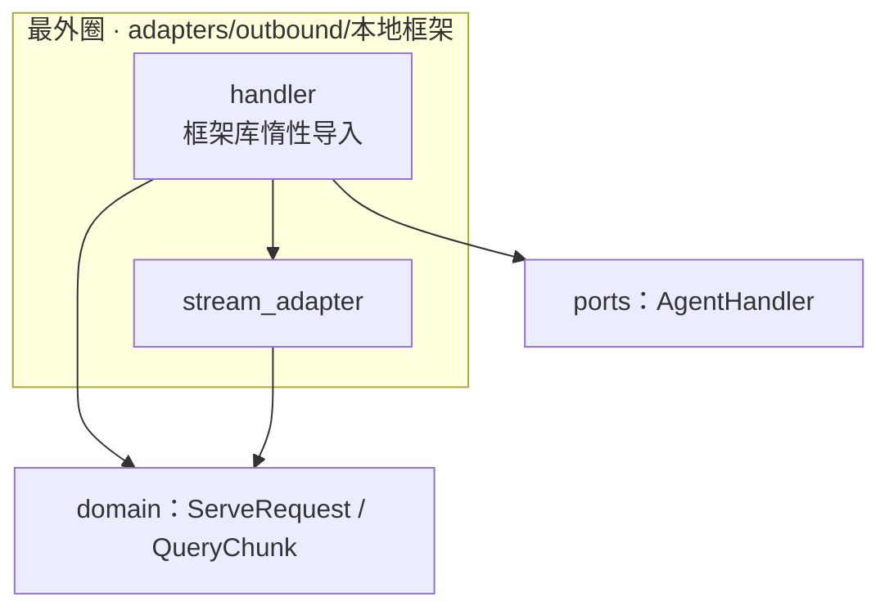
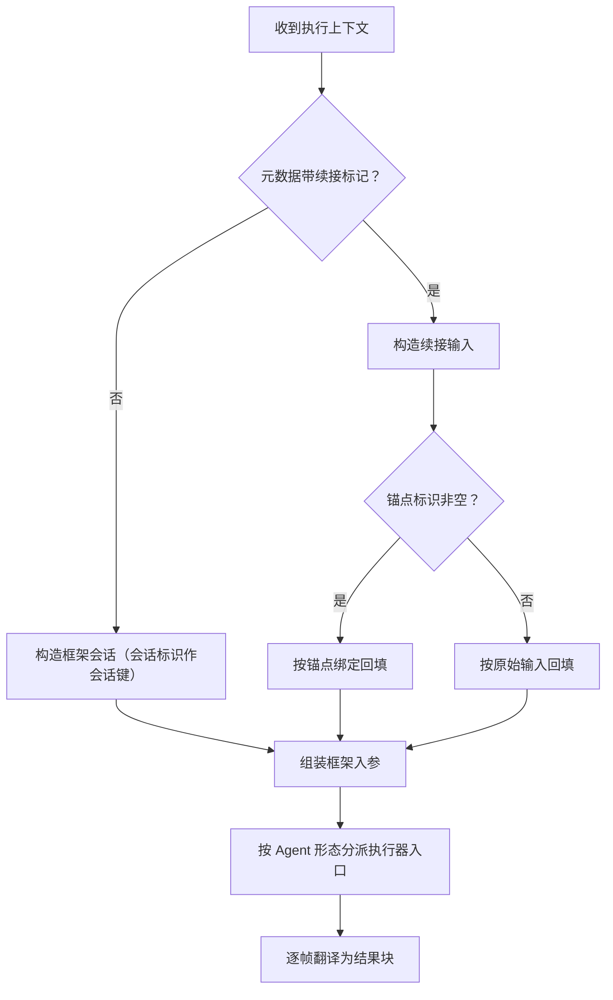
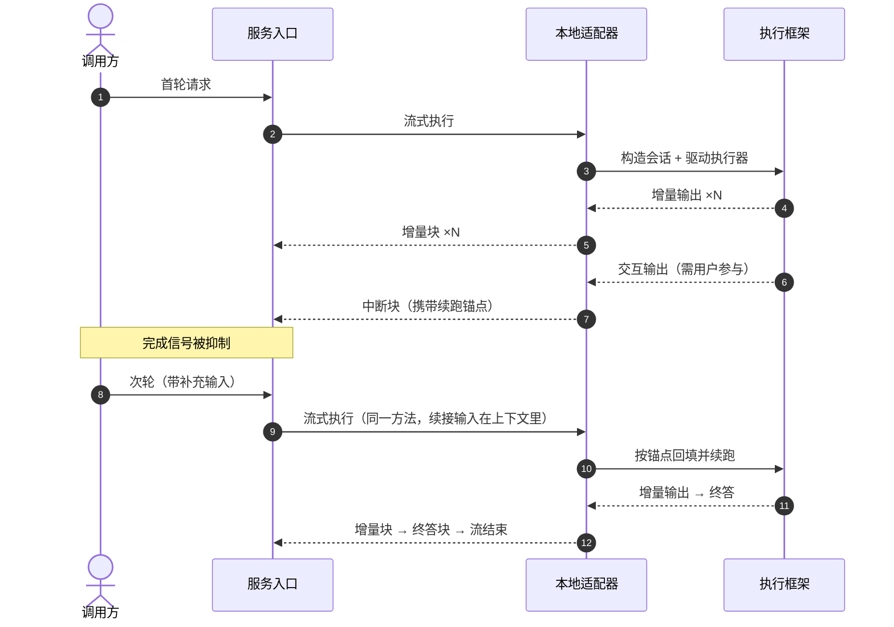

# 本地框架适配 · Python L2 详细设计

## 1. 概述

### 1.1 特性定位

**角色**：把宿主已在**同一进程内**构建好的 Agent 挂载到 runtime。与远端服务代理的分野只有一条：**执行发生在本进程内，不经过网络**。

**现状 → 目标**：执行框架有自己的接口形态、自己的流式协议、自己的会话与中断语义。目标是让这些差异止步于适配器，向上只暴露统一执行契约。

**适用**：宿主经执行器驱动的本地 Agent，含推理型、深度型与工作流型三种形态。

**不适用**：

| 不适用 | 归属与依据 |
|---|---|
| 跨语言的本地实例包装 | 语言绑定不可跨越；权威 `:45`、`:51` 指定改走远端代理 |
| 非标准协议的远端服务 | L2-Func-002b《远端服务代理》 |
| 标准 A2A 协议的远端 Agent | 远端通信特性 |
| 框架的钩子、护栏、工具、技能、中间件 | 权威 `:91`、`:151` 明令适配器不承诺、不安装、不编排、不治理 |

### 1.2 核心设计原则

1. **执行框架的类型止步于适配器** — 框架库的导入只出现在本包内，且惰性导入，使未安装该框架的部署不因导入失败而起不来。
2. **状态归属不代理** — 不读写、不配置、不治理框架的检查点与缓存；只传递 runtime 拥有的会话标识与生命周期信号（权威 `:90`、`:150`）。
3. **续接不新增契约方法** — 续接输入投影进执行上下文后重走流式执行，与对标同形。
4. **未知原生类型不静默丢弃** — 显式过滤并告警，或判为失败；空完成是被明令禁止的形态（权威 `:102`）。
5. **异常必须在适配器内被翻译为失败终态** — 不得让框架异常绕过标准的失败表面（权威 `:136`）。

### 1.3 子特性全景

| 子特性 | 职责 | 状态 |
|---|---|---|
| 执行上下文映射 | 把框架中立的执行输入映射为框架原生入参 | **部分实现**（见 §13） |
| 原生流翻译 | 框架原生输出到统一结果块 | 已实现 |
| 会话构造 | 用 runtime 的会话标识构造框架侧会话 | 已实现 |
| 中断与续接 | 中断锚点的产出与回填 | 已实现（A2A 路径有缺口，见 §13） |
| 生命周期 | 启动、停止、会话清理 | **已实现** |
| 异常拦截 | 框架异常翻译为失败终态，保留原生错误码 | **已实现** |

### 1.4 术语与命名对齐

| 本文用名 | 上位来源 | 对标实现 |
|---|---|---|
| 本地框架适配器 | 权威 `:41` | 单一适配器基类 |
| 执行器 | 权威 `:41`「可通过执行器执行的 Agent」 | 框架的执行入口对象 |
| 会话标识 | 权威 `:35`、`:62` | 直接作框架侧会话键 |
| 中断锚点 | 权威 `:44` 的续跑标识 | 框架的交互输出标识 |

### 1.5 一处结构性差异，必须先摆明

**权威 `:41` 的原文是「通过**一个**适配器托管可经执行器执行的 Agent（含推理型、深度型及实现了 Agent 接口的工作流型）」，`:63` 与上游详设进一步写明「不区分专用适配器入口」。**

**本实现当前是三个独立的适配器类**，分别对应三种 Agent 形态，且其中两个类的方法体逐字相同。

| 方 | 形态 |
|---|---|
| 权威规格 | 单一适配器，不区分子类型 |
| 对标核心实现 | **单一类**，子类型差异由框架执行器按方法签名分发 |
| 上游文档仓自有实现 | 三类分立（但该仓**非对标基准**，不构成先例） |
| **本实现** | **三类分立** |

**处置**：收敛为单一适配器类，内部按框架执行器的两条入口分派。**与对标的一处实现差异需登记**：本语言的执行器提供两个门面方法（Agent 执行与工作流执行），而对标靠反射统一分发——语义等价，形态不同。

---

## 2. 功能规格

### 2.1 能力清单

| # | 能力 | 级别 | 事实要求 | 权威 | 状态 |
|---|---|---|---|---|---|
| L1 | 本地 Agent 托管 | MUST | 经统一契约托管三种形态的本地 Agent | `FEAT-002:41` | 已实现（形态待收敛，§1.5） |
| L2 | 会话标识传递 | MUST | 用 runtime 传入的会话标识作框架会话来源 | `FEAT-002:41`、`FEAT-002:62` | 已实现 |
| L3 | 执行上下文消费 | MUST | 消费七个字段 | `FEAT-002:35` | **部分实现**，§13 |
| L4 | 输出归一 | MUST | 原生输出经统一结果块承载 | `FEAT-002:34`、`FEAT-002:41` | 已实现 |
| L5 | 协作式取消 | MUST | 至少阻止 runtime 继续消费本次结果 | `FEAT-002:38` | **有缺口**，§13 |
| L6 | 异常映射 | MUST | 框架异常映射为失败终态，不得绕过 | `FEAT-002:136` | **已实现** |
| L7 | 会话清理 | MUST | 提供会话清理入口 | `FEAT-002:59` | **已实现**（两步，§4.3） |
| L8 | 生命周期 | SHOULD | 实现启动与停止 | `FEAT-002:37` | **未接线**，§13 |

### 2.2 显式排除

| 排除项 | 依据 |
|---|---|
| 框架扩展机制的安装与编排 | 权威 `:91`、`:151` |
| 框架检查点与缓存的读写治理 | 权威 `:90`、`:150` |
| 框架内部状态机暴露为对外任务状态 | 权威 `:88` |
| 轨迹接入 | 权威 `:40` 列为不做。**跨文档核实**：对标核心仓与扩展仓全仓零命中，上游文档仓有一整套——后者非对标基准，故 `:40` 对本实现为真 |
| 持续健康探测 | 权威 `:37`、`:134` 记载对标当前版本亦无 |

### 2.3 接口契约

#### 2.3.1 API / SPI 声明

本适配器实现统一执行契约，**不新增任何 SPI 方法**。契约面见 L2-Func-002b §2.3.1。

```python
class LocalFrameworkHandler:
    """本地框架适配器。三种 Agent 形态由内部分派，对外只有一个类。"""

    def __init__(self, agent_or_workflow_id: str, runner: Any, *,
                 agent_id: str = "", priority: int = 100, envs: dict | None = None) -> None:
        """构造参数中**不含存储契约**（判据 V16）。

        envs：每请求传给框架的执行环境。对标用它传播租户与空间标识，
        使框架侧工具能看到这些上下文（见 §4.1）。
        """

    def stream_query(self, request: ServeRequest) -> AsyncIterator[QueryChunk]:
        """流式执行：构造框架会话与入参 → 驱动执行器 → 逐帧翻译。"""

    async def query(self, request: ServeRequest) -> QueryResponse:
        """阻塞执行：排空同一条流并聚合，与流式共用执行链。"""
```

**框架库的导入必须惰性**：放在方法体内而非模块顶层，使未安装该框架的部署仍能导入本包（只有真正调用时才失败）。

#### 2.3.2 数据类型

**入参映射**（执行上下文 → 框架原生入参）

| 执行上下文字段 | 映射去向 | 当前状态 |
|---|---|---|
| 查询文本 | 入参的查询键 | 已实现 |
| 会话标识 | 入参的会话键 **且** 框架会话的构造参数 | 已实现 |
| 用户标识 | 入参的用户键 | 已实现 |
| 消息列表 | 入参的消息键 | **未映射**，§13 |
| 空间标识 | 入参的空间键 | **未映射**，§13 |
| 租户标识 | **执行环境**（对标经此传播，使框架侧工具可见） | **未映射**，§13 |
| 元数据 | 内部约定键（续接标记等）由适配器解释，其余不透传给框架 | 已实现 |

**中断锚点**：框架的交互输出携带一个标识，中断块以它作续跑锚点；续接时原样交回。**空标识表示非锚点绑定的续接路径**，走原始输入回填。

#### 2.3.3 行为承诺

**必须**

- 框架原生的增量输出逐条产出为增量块。
- 需要用户参与时产出中断块，携带续跑锚点。
- 框架抛出的异常**在适配器内**被翻译为错误块并让异常传播。
- 未知的原生结果类型被**显式过滤并告警**，不静默跳过。
- 会话清理调用到框架侧的释放与上下文清理。
- 消费方关闭生成器时，底层原生流被停止消费。

**禁止**

- 框架库出现在模块顶层导入。
- 把框架内部状态机映射为对外任务状态。
- 读写框架的检查点与缓存。
- 为空的会话标识伪造一个默认会话（见 §13 的待裁项）。
- 在契约面暴露翻译件。

**允许**

- 增量块的切分粒度由框架决定，调用方不得依赖特定粒度。
- 适配器可缓存框架实例与执行器引用（那是适配器自有资源，不是 runtime 状态）。
- 不同会话可并发执行。

#### 2.3.4 消息队列声明

**本特性不涉及消息队列。** 与框架之间是进程内的直接调用与异步迭代。

---

## 3. 模块结构

### 3.1 包结构

```
agent_runtime/adapters/outbound/<本地框架目录>/
  __init__.py
  handler.py          # 统一执行契约的实现；框架库惰性导入于此
  stream_adapter.py   # 原生输出到统一结果块的翻译
  client_tool.py      # 见 §13 的归属待裁项
```

### 3.2 依赖方向与禁止依赖



| 禁止 | 能否静态发现 |
|---|---|
| 框架库出现在 domain / ports / application | **能** |
| 框架库出现在模块顶层（非惰性） | **能**——扫描顶层导入 |
| 翻译件进入契约面 | **能** |
| 适配器构造参数含存储契约 | **能**——签名审计 |

---

## 4. 核心设计

### 4.1 执行上下文映射

#### 4.1.1 关键处理流程



**入参组装的完整性要求**：执行上下文的七个字段中，权威 `:35` 要求全部被消费。对标把租户标识写入**执行环境**而非入参——其注释写明「执行环境必须对框架侧工具可见」。**本实现当前缺三项映射**（§13）。

**边界条件**

| 边界 | 处理 |
|---|---|
| 会话标识为空 | **待裁**（§13）——对标回落到一个全局默认会话，本实现不复刻 |
| 消息列表为空 | 查询文本为空串 |
| 续接标记结构不符 | 视为非续接，走正常执行 |

#### 4.1.2 并发与协程安全边界

| 对象 | 可否并发 |
|---|---|
| 适配器实例 | **是**——不同会话各自构造框架会话 |
| 同一条原生流的迭代 | **否** |
| 执行器引用 | **是**——纯读 |

**一处需要注意的框架侧约束**：对标实现用进程级标志保证执行器只启动一次，同进程内第二个适配器实例的启动会被静默跳过。在「一个实例只服务一个 Agent」的模型下影响有限，但**对多适配器按优先级选一的裁定是个反面参考**——若将来允许多实例共存，该形态会导致后者的注册不生效。

#### 4.1.3 幂等键与重试语义

**涉及一类标识**：会话标识。它是**分组键**（把执行归组到框架会话），不是幂等键。

| 操作 | 重复调用 |
|---|---|
| 流式执行 | **非幂等**——每次是一次新执行 |
| 会话构造 | **幂等**——同一标识得到同一框架会话 |

**不重试**：执行有副作用（模型调用、工具调用）。

### 4.2 原生流翻译

#### 4.2.1 关键处理流程

| 框架原生输出 | 统一结果流 |
|---|---|
| 增量输出 | 增量块 |
| 交互输出（需用户参与） | 中断块，携带续跑锚点 |
| 终答输出 | **终答内容块**（附终答标记），随后由流结束表达完成 |
| 异常 | 错误块 + 异常传播 |
| **未知类型** | **显式过滤 + 告警**，不静默跳过 |

**终答必须作为内容块投递**——「完成由流结束表达」说的是不存在完成类型的块，不是不发最终答案。两者混淆会让调用方收到流结束却没拿到最后一句回答。

**未知类型走「显式过滤 + 告警」两步，缺一不可**：过滤是因为把认不出的帧当内容投出去会污染对外流；告警是因为静默过滤让「框架产出了预期外形态」在运行期完全不可见，表现为结果莫名少了一段而无任何线索——后者正是权威 `:102` 明禁的静默跳过。

**告警只记结构不记内容**：帧类型与可见属性名足以定位是哪种帧被丢了，而载荷可能含业务文本或凭据，进日志即是泄漏面。

落地见 `openJiuwen/agent-runtime-mvp/agent_runtime/adapters/outbound/agentcore/stream_adapter.py` 的单帧映射方法（告警后返回空值，不落兜底透传）；判据见 `openJiuwen/agent-runtime-mvp/agent_runtime/tests/test_local_adapter_contract.py` 的未知帧过滤用例，它同时断言过滤生效、告警含帧类型、告警**不含**载荷。

#### 4.2.2 并发与协程安全边界

翻译是**无状态转换**：一帧进、零或一块出，不跨帧持有状态。故可并发、可复用实例。

#### 4.2.3 幂等键与重试语义

**不涉及标识，不重试**——翻译失败是确定性的。

### 4.3 生命周期与会话清理

#### 4.3.1 关键处理流程

| 方法 | 应做什么 | 当前状态 |
|---|---|---|
| 启动 | 委托框架执行器启动 | 实现了，但**组合根未调用**（§13） |
| 停止 | 委托框架执行器停止 | 已实现且已接线 |
| 会话清理 | **框架侧会话释放 + 上下文清理两步** | **已实现**（全程 duck-typed 调用，不 import 框架类型） |

**会话清理不是可选的**：对标做两件实事（执行器侧释放、上下文引擎按会话清理），存量做三层清理。**只有本实现不清**——而会话重置路径真的会调用它，即「重置会话」对框架侧是空操作。

#### 4.3.2 并发与协程安全边界

启动与停止由生命周期编排器串行调用，不并发。会话清理可并发（不同会话互不影响）。

#### 4.3.3 幂等键与重试语义

| 操作 | 重复调用 |
|---|---|
| 启动 / 停止 | **幂等**——实现应容忍重复调用 |
| 会话清理 | **幂等**——对不存在的会话是空操作，不抛出 |

**不重试**：生命周期失败应快速暴露，重试会掩盖装配问题。

---

## 5. 数据设计

**本特性不持有持久状态**。框架侧的会话与检查点归框架自治（权威 `:90`）。

**进程内运行态**：

| 项 | 生命周期 | 清理责任 |
|---|---|---|
| 框架执行器引用 | 进程生命周期 | 进程退出 |
| 框架会话对象 | 由框架管理 | **由会话清理触发框架侧释放**——已实现（`openJiuwen/agent-runtime-mvp/agent_runtime/adapters/outbound/agentcore/handler.py` 的 `clear_session` 第一步） |
| 单次执行的原生流 | 单次执行 | 消费方关闭生成器时释放 |

**与全局数据架构的关系**：本节是全局视图的切片，冲突时以全局为准。

---

## 6. 配置模型

### 6.1 完整配置示例

```yaml
runtime:
  extensions:
    handler:
      # 按名指定本地框架适配器；留空则按优先级选取。
      impl: ""
```

**本特性当前不引入独立的配置前缀**。权威 `:73` 记载本地适配是「继承基类 + 注册」的编程式挂载、零配置面；对标侧亦只有远端代理与技能中枢两个配置前缀。

### 6.2 配置属性表

| 属性 | 类型 | 默认 | 必填 | 说明 |
|---|---|---|---|---|
| `runtime.extensions.handler.impl` | 字符串 | 空 | 否 | 见框架基座详设 §6 |

**执行环境参数**：构造参数中的执行环境用于向框架传播租户与空间标识（对标的做法）。当前**无任何传入点**——这不是「参数多余」，而是**该通道未接线**（§13）。

### 6.3 配置对象与校验

本特性无独立配置对象。装配相关的校验见框架基座详设 §6.3。

---

## 7. 对外呈现与用户场景

### 7.1 用户视角的入口

**不新增对外端点**。调用方经服务入口调用，看不到框架的存在。

### 7.2 典型场景示例

**以下场景的数据来自实跑**，脚本见 `openJiuwen/agent-runtime-mvp/deploy-e2e/run.sh` 与 `openJiuwen/agent-runtime-mvp/deploy-e2e/run-questioner-llm.sh`。

**场景一 · 工作流型 Agent 端到端**

| 项 | 内容 |
|---|---|
| 前置条件 | 容器内装真实框架库，注册一个工作流 |
| 操作 | 经自定义 REST 入口发起非流式调用 |
| 预期结果 | 对外信封的答案字段含工作流输出 |
| 验证物 | **已具名**：`openJiuwen/agent-runtime-mvp/deploy-e2e/run.sh` |

**场景二 · 中断续接（真实模型）**

| 项 | 内容 |
|---|---|
| 操作 | 首轮触发缺字段中断；次轮以同一会话续接 |
| 预期结果 | 首轮产出中断帧；次轮续跑至完成 |
| 验证物 | **已具名**：`openJiuwen/agent-runtime-mvp/deploy-e2e/run-questioner-llm.sh`（需模型网关凭据） |

**场景三 · 消费方关闭即停流**

| 项 | 内容 |
|---|---|
| 操作 | 消费方在中途关闭生成器 |
| 预期结果 | 底层原生流被停止消费 |
| 验证物 | **已具名**：`openJiuwen/agent-runtime-mvp/agent_runtime/tests/test_agentcore_handler.py::test_consumer_aclose_stops_stream` |

### 7.3 多轮交互的时间线



---

## 8. 错误处理

| 错误场景 | 触发条件 | 应有行为 | 当前状态 |
|---|---|---|---|
| 框架执行抛异常 | 框架内部错误 | **适配器内拦截** → 错误块 + 异常传播 | **已实现**——执行链路的异常在适配器内翻译为失败终态并保留原生错误码（`openJiuwen/agent-runtime-mvp/agent_runtime/adapters/outbound/agentcore/handler.py`），取消与生成器关闭原样上抛、不当作故障。与本篇 §2 能力表、§11 判据表口径一致 |
| 框架创建失败 | 装配错误 | 映射为失败终态 | **未实现** |
| 未知原生类型 | 框架版本变更 | 显式过滤 + 告警 | **未实现**（当前兜底透传且无日志） |
| 会话标识为空 | 调用方未给 | **待裁**（§13） | 当前透传给框架 |
| 会话清理被调用 | 会话重置 | 框架侧释放 + 上下文清理 | **已实现**——两步俱全，单步失败不阻断另一步、不上抛（同文 `clear_session`） |

**错误码**：错误块**必须**保留框架原生错误码（权威 `:39` MUST）。**已实现**——异常翻译时按 `code`／`error_code`／`errno`／`status_code` 逐个取，取不到留空**而非编造**：空码位表达「框架没给码」，编一个会让调用方据此做错误分支。

对标的异常化同样丢码（只保留消息文本），但按既定裁定「行为遵从文档 · 形态遵从代码」——保留错误码是行为承诺而非形态，**遵从文档**。这会使本实现在这一点上比对标严格；与对标联调时若对方吐不出码，码位为空是可接受的降级，但本实现不得主动丢弃已拿到的码。

---

## 9. DFX 设计

### 9.1 日志与可观测

| 打点 | 级别 | 当前状态 |
|---|---|---|
| 执行开始 / 结束 | 调试 / 信息 | 未打 |
| 未知原生类型 | **告警** | **未打**——这是 §13 的整改项 |
| 中断产出 | 信息 | 未打 |
| 框架异常 | 错误 | 未打 |

**必带关联字段**：会话标识、租户标识、适配器标识、耗时。

**禁止入日志**：消息内容与执行产出的正文、模型密钥、原始提示词与工具输入输出、元数据的完整内容。

### 9.2 韧性与降级

| 故障 | 确定性行为 | 是否降级 |
|---|---|---|
| 框架执行超时 | 由框架自身超时机制处理 | 不降级 |
| 框架不响应取消 | 停止消费其结果，底层继续跑完并被丢弃 | 不降级——不伪造已取消 |

**不做的事**：执行失败不自动重试（副作用不可重放）；无熔断（一个实例只服务一个 Agent）。

### 9.3 容量与超时

**本特性不引入新的容量约束，不定义超时值**。执行时长由框架与模型决定；并发不限制。

---

## 10. 安全设计

### 10.1 鉴权与租户边界

**本适配器不执行鉴权**。租户、用户、空间三个标识由入口从鉴权结果填入，适配器**只读不改**。

### 10.2 凭据处理

框架侧凭据来自适配器自身配置，**不从请求里取**。执行上下文与结果模型都不设凭据字段。

### 10.3 租户隔离

**当前有一处实质缺口**：租户标识未被映射进框架入参或执行环境，框架侧**拿不到租户判别位**。对标至少把它写进入参与执行环境两处。**这条与 §13 的映射缺口是同一件事的两面**。

**禁止默认回退**：租户标识缺失即缺失，适配器不得替它编一个值。

### 10.4 不可信输入

| 字段 | 性质 | 处置 |
|---|---|---|
| 元数据 | **调用方自声明** | 其中的续接标记属 runtime 内部命名空间，**入口必须先剥离保留键再由 runtime 写入**；否则调用方可伪造续接、绕过任务状态门。对标的对应方法名即为「可信元数据」 |
| 消息内容 | 自声明 | 作执行输入传给框架，不解释为控制信号 |
| 租户等身份标识 | 由入口从鉴权结果填充 | 可信 |

---

## 11. 兼容性与迁移

### 11.1 与存量的一致面

| 面 | 要求 |
|---|---|
| 结果块的载荷键 | 内容块必须携带存量对外信封重建所需的四个键 |
| 事件名取值 | 使用存量已有的事件名集合 |
| 终答表达 | 终答是内容块附标记，不是独立类型 |

### 11.2 与存量并存与切换

| 问题 | 答案 |
|---|---|
| 键面 / 存储 | 不共享、不共用 |
| 切换粒度 | 实例级 |
| 未完结会话 | 由入口层排水机制承接 |

---

## 12. 验收标准与测试用例

### 12.1 验收判据

| # | 判什么 | 期望值来源 | 怎样才会红 |
|---|---|---|---|
| M1 | 三种 Agent 形态经**同一个适配器类**接入 | 权威 `:41`、`:63` | 出现按形态分立的多个契约实现类 |
| M2 | 框架库不出现在模块顶层导入 | §1.2 原则 1 | 顶层出现框架导入 |
| M3 | 执行上下文七个字段全部被消费 | 权威 `:35` | 任一字段未映射 |
| M4 | 租户标识到达框架侧（入参或执行环境） | 对标的两处写入 | 框架侧拿不到租户 |
| M5 | 框架异常在适配器内被翻译为失败终态 | 权威 `:136` | 异常穿透到入口之外 |
| M6 | 未知原生类型被显式过滤且有告警 | 权威 `:102` | 静默透传或静默丢弃 |
| M7 | 会话清理调用框架侧释放与上下文清理 | 对标的两步实现 | **已实现** |
| M8 | 启动被组合根调用 | §4.3 契约 | 无调用点 |
| M9 | 终答作为内容块投递 | 部署级验证抓到的真实缺陷 | 终答丢失 |
| M10 | 消费方关闭生成器即停止消费原生流 | 权威 `:38` | 底层继续被消费 |
| M11 | 构造参数不含存储契约 | 依赖倒置红线 | 出现存储端口 |
| M12 | 原生错误码保留在错误块码位 | 权威 `:39` | 码位为空 |

### 12.2 测试用例

| 用例 | 预期 | 验证物 |
|---|---|---|
| 三形态的流映射 | 各自驱动对应执行器入口并归一 | **已具名**：`openJiuwen/agent-runtime-mvp/agent_runtime/tests/test_agentcore_handler.py` 的三条形态用例 |
| 消费方关闭即停流 | 底层流被停止 | **已具名**：同文件 `::test_consumer_aclose_stops_stream` |
| 启动委托执行器 | 调用到框架启动 | **已具名**：同文件 `::test_start_delegates_to_runner` |
| 缺用户标识时不带该键 | 入参无该键 | **已具名**：同文件 `::test_missing_user_omits_user_id` |
| 续接路径 | 按锚点或原始输入回填 | **已具名**：`openJiuwen/agent-runtime-mvp/agent_runtime/tests/test_agentcore_resume.py` |
| 容器内驱动真实框架 | 端到端信封正确 | **已具名**：`openJiuwen/agent-runtime-mvp/deploy-e2e/run.sh` |
| 中断续接（真实模型） | 两轮闭环 | **已具名**：`openJiuwen/agent-runtime-mvp/deploy-e2e/run-questioner-llm.sh` |
| **单一适配器类** | 只有一个契约实现类 | **已具名**：`openJiuwen/agent-runtime-mvp/agent_runtime/tests/test_local_adapter_contract.py::test_three_legacy_names_resolve_to_one_class` |
| **七字段全映射** | 入参含全部字段 | **已具名**：`openJiuwen/agent-runtime-mvp/agent_runtime/tests/test_local_adapter_contract.py::test_all_four_identity_fields_reach_the_framework`、`::test_blank_identity_is_omitted_not_written_as_empty` |
| **租户到达框架侧** | 执行环境含租户 | **已具名**：`openJiuwen/agent-runtime-mvp/agent_runtime/tests/test_local_adapter_contract.py::test_all_four_identity_fields_reach_the_framework`——四项身份含租户逐一断言 |
| **异常被拦成失败终态** | 注入框架异常，观察终态 | 已具名 `test_framework_exception_translation.py::test_framework_exception_becomes_error_chunk_not_propagates` |
| **原生错误码保留** | 注入带码异常，检查错误块码位 | 已具名 `::test_native_code_on_code_attribute_is_preserved`、`::test_native_code_on_error_code_attribute_is_preserved` |
| **无码时留空不编造** | 注入无码异常 | 已具名 `::test_absent_code_yields_empty_not_fabricated` |
| **取消不被翻译为失败** | 注入取消 | 已具名 `::test_cancellation_is_not_translated_to_failure` |
| **未知类型过滤 + 告警** | 注入未知类型，断言日志与产出 | **已具名**：`openJiuwen/agent-runtime-mvp/agent_runtime/tests/test_local_adapter_contract.py::test_unknown_frame_is_filtered_with_a_structural_warning`——同时断言过滤生效、告警含帧类型、载荷不入日志 |
| **会话清理两步** | 断言框架侧释放被调用 | **已实现**：M7 |
| **启动被组合根调用** | 扫描调用点 | **已具名**：`openJiuwen/agent-runtime-mvp/agent_runtime/tests/test_local_adapter_contract.py::test_handler_start_is_wired_by_the_composition_root` |
| **原生码保留** | 注入带码异常 | **已具名**：`openJiuwen/agent-runtime-mvp/agent_runtime/tests/test_framework_exception_translation.py` 全组 |

**统计**：共 18 条，**已具名 17 条、无待建项**（余 1 条为部署级）。**数字须逐行点算得出，不得沿用旧值**——本行曾长期停留在补齐前的读数（称还有 8 条待建，而彼时表中一条待建也没有）。

### 12.3 不适用的验证形态

| 形态 | 理由 |
|---|---|
| 远端往返 | 执行在进程内 |
| 跨仓契约测试 | 与框架的绑定靠方法名与结构，当前由容器级 E2E 覆盖**工作流形态一条**；推理型与深度型两条**无真实框架覆盖**（§13） |

---

## 13. 限制与待补

### 13.1 五条已定结论

原列为待裁的五条已全部定案。**四条由既有依据唯一确定、一条经实测排除**，逐条给出结论与依据——写在这里是为了让后来者知道它们**为什么这么定**，而不是只看到结果。

| # | 结论 | 依据 |
|---|---|---|
| **O1** | 取消的键取**会话标识**；登记表按会话分组持**流句柄**；取消时对该会话下全部句柄置位，并经中断通知契约尽力通知底层；远端代理实现该契约即构成存量的级联取消；心跳不做 | 对标的两条取消通道均用会话维度的键；对标登记表是「会话→句柄集合」；权威 `:141` 原文含「或远端请求」；心跳由既定裁定「不进 runtime、落宿主义务」的推导直接覆盖——runtime 不产心跳则无心跳可释放 |
| **O2** | 锚点由 **runtime 自持并找回**，客户端带不带都能续接；客户端若带了同名键，**剥离不采信** | 权威 `FEAT-008:36`「不新增、不收紧客户端请求格式」与 `:37`「同 Task 的合法消息必须被视为续接」合起来只允许这一种形态；要求客户端带锚点即为收紧，直接违反 MUST。对标同样是从 Task 读回并剥离客户端同名键 |
| **O3** | **不复刻**对标的全局默认会话兜底；我方现状（空标识交由框架处理）正确，无需改动 | **实测排除**：框架对空会话标识**自生成唯一标识**，两次调用得到不同值，各请求天然独立。对标那个兜底会让所有无标识请求共享同一框架会话、上下文互相可见——**默认必然重合**，比权威 `:62` 自陈的「跨租户标识碰撞」严重一档，且上位全篇未登记该兜底。此处按「须遵从但可挑战」的纪律**如实提出**，我方不跟进 |
| **O4** | **保留**原生错误码 | 既定裁定「行为遵从文档 · 形态遵从代码」直接适用——保留错误码是**行为承诺**（权威 `:39` MUST），不是类名包结构那类形态。与对标的差异属对标未落地该 MUST，非本设计越界 |
| **O5** | 就绪查询**维持在执行契约面**，不推翻总览详设的既有取舍；本篇登记差异即可 | 按项目自定的缺陷分级，权威 `:134` 陈述的是**对标当前版本的能力限制、不是禁令**，够不上「把上游禁令写成许可」那一档；而定稿判据明写非阻塞项**登记即算处理完毕** |

> **O3 的挑战义务已履行**：对标那个兜底是一处实质缺陷，此处如实登记，供上游参考。我方不受影响，故不构成本版的风险项。

### 13.2 已知缺口与刻意取舍

| 限制 | 性质 | 说明 | 该由谁做 |
|---|---|---|---|
| 取消键已统一为会话标识 | **已实现** | 标准协议面与自定义入口均以会话标识调用编排层取消；两键不等导致取消零效果的缺陷已消除 | 本特性 |
| 中断通知契约 | **已实现** | 权威 `:141` 要求取消时尽力通知底层。在基类实现，三种智能体形态同时具备：置位取消事件让阻塞中的迭代立刻结束、原生流随之关闭。**不调用框架的全局停止**——那个方法不带参数、停的是整个 runner，会把本进程其他会话一起停掉。框架侧是否真的停下由框架决定（权威 `:38` 协作式语义） | 本特性 |
| 标准协议面续接锚点 | **已实现** | 按 §13.1 的 O2 落地：锚点随中断写入**状态消息的 metadata**（键 `_interrupt`，与对标同名同形），续接时从 Task 找回——先看当前状态消息、再从历史倒序找最近一条智能体消息（协议库在状态更新时把旧状态消息追加进历史，故多轮后仍可找回）。**客户端同名键不采信**：两条路径各有角色校验，非智能体角色一律视为无锚点。锚点缺失时降级为非绑定续接，不抛出 | 本特性 |
| 原生错误码保留 | **已实现** | 按四个常见属性逐个取；取不到留空而非编造 | 本特性 |
| 执行上下文身份传递 | **已实现（形态与对标不同，理由见右）** | 四项身份（会话、用户、空间、租户）写入**执行环境**：框架把它当作存在会话上的不透明字典，集成方组件可从中取用。空白值不写键——写空串等于断言「该身份为空」，而事实是调用方没提供。**执行入参只写本框架真读的键**（会话、用户、查询）：经查证本框架执行链路对空间标识零取用、租户标识只出现在与 agent 执行无关的模块，写进去是死键，会让人误以为身份已生效。对标把三者一并写进入参，因其对接的是另一语言实现的同名框架。**须写明本实现提供的是身份的可得性，不是隔离本身**——框架自身不用它们做隔离，隔离由取用方实施 | 本特性 |
| 框架异常拦截 | **已实现** | 执行链路的异常在适配器内翻译为失败终态并保留原生错误码；取消与生成器关闭原样上抛，不当作故障 | 本特性 |
| 未知原生类型的过滤与告警 | **已实现** | 无法识别的帧显式过滤、不以空终态掩盖，并留下告警：帧类型与可见属性名。**只记结构不记内容**——载荷可能含业务文本或凭据 | 本特性 |
| 会话清理 | **已实现** | 与对标同构的两步：释放框架会话 + 按会话清理上下文引擎。另有空标识守卫（空标识不对应任何会话，传下去会清到非预期位置）。单步失败不阻断另一步、不上抛——清理是收尾动作，调用方拿它的失败无处置可做；失败记日志供运维判断是否有资源滞留 | 本特性 |
| 启动已接线 | **已实现** | 生命周期编排在启动阶段按注册顺序调用处理器的启动方法 | 本特性 |
| 三类适配器已收敛为单类 | **已实现** | 一个通用适配器，执行入口按**框架的资源登记**择取（不按调用方声明）；三个旧名保留为别名，不打断既有调用方 | 本特性 |
| 推理型的真实框架端到端 | **已实现** | 真实框架 + 真实模型跑通通用智能体入口，抓出四处真实缺陷（入口择取当同步调用、会话不带卡片、取卡当同步调用、迭代跨任务破坏上下文）。深度型走同一入口，其路径已被覆盖，不再重复一次模型往返 | 本特性 |
| 与框架的绑定靠方法名与结构 | **接受的风险** | 上游改名即断；当前由容器级 E2E 覆盖一种形态 | 本特性 |
| 持续健康探测 | **刻意取舍** | 权威 `:37`／`:134` 记载对标亦无，按既定纪律不跟进 | 本特性 |
| 轨迹接入 | **刻意取舍** | 权威 `:40` 列为不做；跨文档核实见 §2.2 | 本特性 |

**性质栏必须读**：14 条里 **11 条已实现**，2 条是刻意取舍，1 条是接受的风险。**本篇当前无未闭合项**——原登记的未闭合项已在补齐过程中逐条消除，消除后从表中移出或改记为已实现。

**统计数字须与上表逐行点算得出，不得沿用旧值**。本节的统计曾与表格脱节：结语声称仍有四项未闭合，而彼时表中一条未闭合项也没有。读者据结语判断完成度，会得出与表格相反的结论。该形态现由 `openJiuwen/agent-runtime-mvp/tools/debt_ledger_guard.py` 在构建期拦截。

---

## 附录 A · 六原则符合性

### A.1 对外兼容

**遵从**。结论依据见下列三项；§13 的未闭合项不落在本原则的作用面上。

**落地**：结果块的载荷键与事件名取值沿用存量集合；终答作为内容块投递。

**关键取舍**：本篇对调用方零新增对外面。

**由该原则推出的决策**：终答表达方式不可改；事件名不新增取值。

**遗留**：O1 的取消链路涉及对外行为面，未裁定前不改。

### A.2 遵从上位

**遵从**。结论依据见下列三项；§13 的未闭合项不落在本原则的作用面上。

**落地**：能力表逐条落地并标注真实状态，**不把未实现的写成已实现**。不适用项给出条目号与跨文档核实结论（轨迹一条经三仓交叉核实）。

**关键取舍**：O4（对标丢码 vs 上位 MUST 保留码）**不自行选边**，升级裁定。

**由该原则推出的决策**：三类适配器收敛为单类；未知类型必须显式处置。

### A.3 生态融入

**遵从**。结论依据见下列三项；§13 的未闭合项不落在本原则的作用面上。

**落地**：框架库惰性导入且只在最外圈；异步生成器作为流式形态。

**由该原则推出的决策**：框架库不得出现在模块顶层——未装该框架的部署仍要能导入本包。

### A.4 绞杀者迁移

**遵从**。结论依据见下列三项；§13 的未闭合项不落在本原则的作用面上。

**落地**：切换粒度实例级；不共享键面与存储。

**无遗留**。会话清理两步俱全（框架侧释放与上下文清理），切换时框架侧会话随之释放。

### A.5 依赖倒置

**遵从**。结论依据见下列三项；§13 的未闭合项不落在本原则的作用面上。

**落地**：适配器实现契约、依赖方向朝内；翻译件不进契约面；构造参数不含存储契约。

**由该原则推出的决策**：翻译件与执行器引用都是适配器内部实现。

### A.6 状态外置

**遵从**。结论依据见下列三项；§13 的未闭合项不落在本原则的作用面上。

**落地**：零持久状态。进程内运行态三项（执行器引用、框架会话、单次原生流）。

**关键取舍**：框架会话由框架管理，**其释放由会话清理触发**——两步都做才算清干净：只释放会话而不清上下文，重置后的下一轮仍会看见旧对话；只清上下文而不释放会话，框架侧资源留到进程退出。

**由该原则推出的决策**：不缓存任何 runtime 状态；不读写框架检查点。
