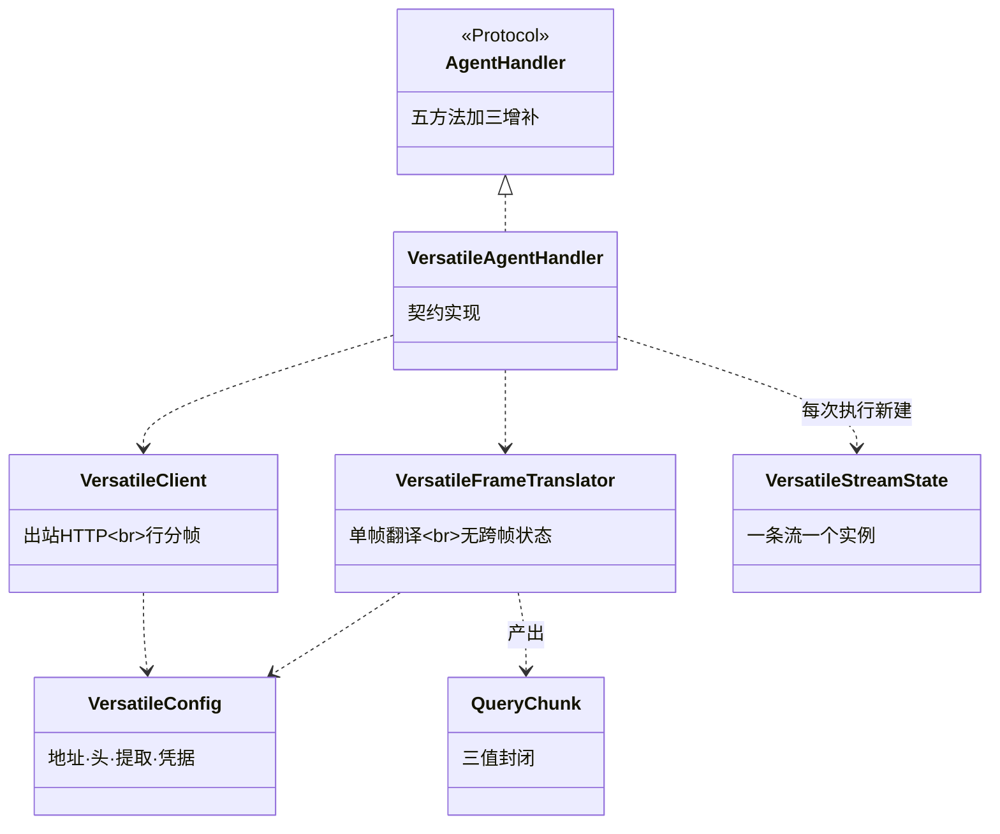
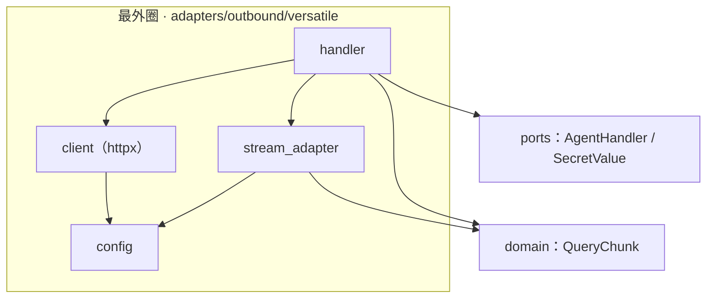
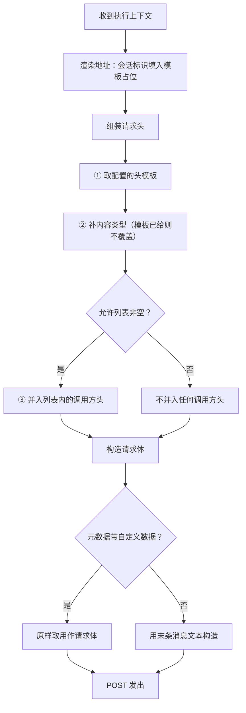
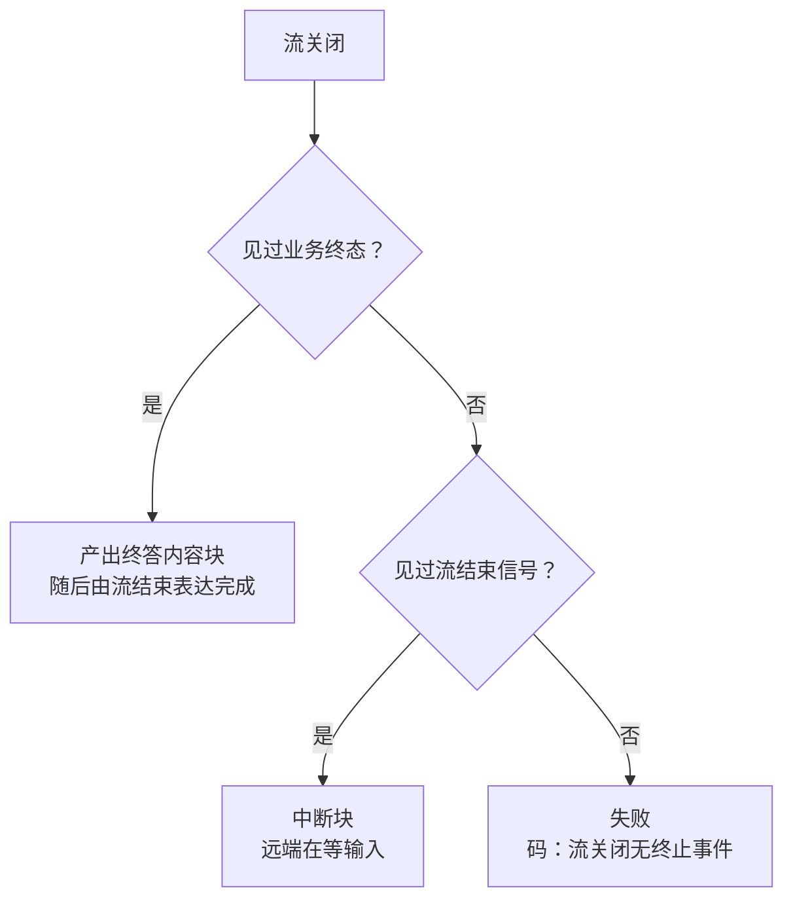
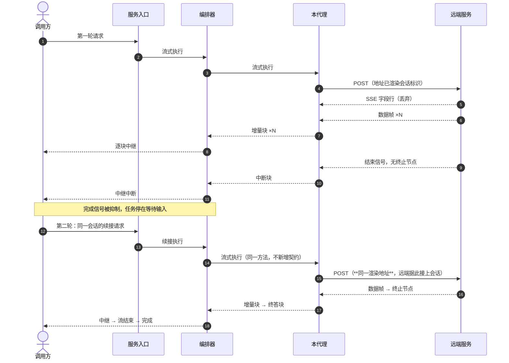

# Versatile 远端服务代理 · Python L2 详细设计

## 1. 概述

### 1.1 特性定位

**角色**：把一个**远端的、非标准协议的** Agent 服务代理成 runtime 眼里的一个普通 Agent。对上实现统一执行契约，与本地框架适配完全同形——服务入口层看不出背后是进程内的框架还是网络另一端的服务。

**现状 → 目标**：跨语言、跨进程的 Agent 若要接入，要么各写一套入口，要么让调用方直连远端。目标是让它们共用同一条执行链路，差异全部收敛在一个适配器内。

**适用**：远端以 HTTP 暴露、以行分帧流式返回的 Agent 服务。

**不适用**：

| 不适用 | 归属 |
|---|---|
| 标准 A2A 协议的远端 Agent | 远端通信特性（FEAT-004）——它走 A2A JSON-RPC，不是本篇的私有协议代理 |
| 同进程内的本地框架 Agent | L2-Func-002b《本地框架适配》 |
| 把工具服务协议当 Agent 框架接入 | 权威 `:157` 明确排除 |
| 用客户端门面替代本代理 | 权威 `:158`：二者事实边界不同 |

### 1.2 核心设计原则

1. **wire 形态以代码为准，不以文档措辞为准** — 四方文档分别称它「SSE」与「NDJSON」，两者都只说对一半。设计依据取四方**解析代码的共同读数**（§1.5）。
2. **声明面取存量、解析面取对标** — 打到远端的报文属南向对外 wire，取存量；入站解析语义两边本就同构，取对标的宽容形态。
3. **终态判定分两级** — 「流结束信号」与「业务终态」是两件不同的事，分开识别（§4.2）。这是消解上位内部分歧的支点。
4. **不持有任何 runtime 状态** — 不接触存储、不缓存会话、不落检查点；只把会话标识渲染进远端地址，让远端自己维持会话边界（权威 `:123`）。
5. **不默认透传调用方元数据** — 允许列表为空即一个都不透（权威 `:124` 红线）。

### 1.3 子特性全景

| 子特性 | 职责 | 状态 |
|---|---|---|
| 出站请求组装 | 地址模板渲染、请求头映射、请求体构造 | 已实现 |
| 响应行分帧 | 按行切分、`data:` 前缀可选剥离、非 JSON 行处置 | 已实现 |
| 结果流归一 | 远端原生帧到统一结果块的翻译 | 已实现 |
| 终态判定 | 完成／中断／失败三分，含断流细分 | 已实现 |
| 结果提取 | 按节点名与类型提取业务结果 | 已实现 |
| 意图路由 | 对标实现有、权威规格未登记 | **不实现**（§2.2） |

### 1.4 术语与命名对齐

| 本文用名 | 上位来源 | 对标实现 |
|---|---|---|
| 远端服务代理 | 权威 `:46`「Versatile REST 代理」 | `VersatileAgentHandler` |
| 地址模板 | 权威 `:47`「URL 模板」 | `urlTemplate` |
| 结果提取 | 权威 `:49` | `resultNodeName` / `resultExtractions` |
| 流结束信号 / 业务终态 | 本文引入的区分，用于消解 `:50` 与 `:140` 的分歧 | 对标以触发条件细分表达同一区分 |

### 1.5 wire 形态：四方对质的结论

**这一节是本篇的地基**，写在前面因为后续每一章都依赖它。

四方——上游同级详设、扩展仓对标实现、上游文档仓自有实现、存量——在**解析代码层面完全一致**：

```
HTTP POST + JSON 请求体
  → 响应按行分帧（一行一个完整 JSON）
  → data: 前缀可选剥离
```

它**不是纯 SSE**：不聚合事件块、不拼接多行 `data:`、空行不作事件边界、不解析 `event:`／`id:`／`retry:` 的协议语义。
它**也不是纯 NDJSON**：声明的媒体类型就是 `text/event-stream`，且实际报文带 `data:` 前缀。

准确的命名是 **「SSE 形态声明 + 宽容行分帧 JSON」**。

| 方 | 声明面 | 解析面 |
|---|---|---|
| 上游同级详设 | 只写「HTTP/SSE」，未规格化；其 TBD 条目自认待客户提供样例 | 提及 consumeLine 逐行 |
| 扩展仓对标（须遵从） | **代码不设任何默认头**，媒体类型协商下推到配置 | 逐行读、空行跳过、`data:` 剥离、非 JSON 行丢弃 |
| 上游自有实现（非基准） | 仅在无 Content-Type 时补 json，从不设 Accept | 逐行读；**另注入 `connection_closed` 伪帧**——真实 wire 上不存在，不引入 |
| 存量（兼容基线） | **唯一显式声明**：`Accept: application/json, text/event-stream` + `stream: "true"` | 逐行读、`data:` 可选剥离 |

**「NDJSON」一说无代码依据**——首方代码全库零 `application/x-ndjson` 命中，该词只出现在文档侧，属文档与代码漂移。

**本设计的取法**：声明面取存量（它是打到远端的实际报文，属兼容面；对标在此是"零默认值"、把决定让渡给配置，不构成相反要求），解析面取对标（与存量本就同构）。

---

## 2. 功能规格

### 2.1 能力清单

| # | 能力 | 级别 | 事实要求 | 权威 | 落点 |
|---|---|---|---|---|---|
| C1 | 远端服务代理 | MUST | 把远端 HTTP 服务代理为 runtime Agent，完成请求与响应的双向转换 | `:46` | §4.1 |
| C2 | 地址模板 | MUST | 支持会话标识占位替换，使 runtime 会话稳定映射到远端会话 | `:47`、`:123` | §4.1.1 |
| C3 | 请求头映射 | MUST | 支持配置头、允许列表内透传；**不得默认透传全部** | `:48`、`:124` | §4.1.1 |
| C4 | 中断检测 | MUST | 流关闭但无终止事件时**不得误报完成** | `:50`、`:101`、`:140` | §4.2 |
| C5 | 结果提取 | SHOULD | 按节点名与节点类型提取业务结果；**不得改变终态语义** | `:49`、`:127` | §4.3 |
| C6 | 结构化元数据覆盖 | MUST | 权威列为映射规则之一 | `:48` | **不实现**，见 §2.2 |

### 2.2 显式排除

| 排除项 | 理由 |
|---|---|
| **结构化元数据覆盖通道**（权威 `:48` 的 MUST 之一） | 对标实现**无此通道**——其配置面 13 个字段只有头模板与透传允许列表两条通路，主代码无第三条。按「权威代码中还未实现的不跟进、详设体检出来即可」不实现，此处如实登记 |
| 地址变量、查询参数、入站元数据键三项配置 | 权威 `:65` 列出，但对标实现全部零命中。同上处置 |
| 意图路由（意图集、意图到 Agent 的映射、歧义意图兜底） | 对标实现有，**权威规格未登记**。按 `:18`「实现里有但本文未声明的不构成对外承诺」不纳入 |
| 结果提取路径规则化 | 权威 `:49` 记「提取路径当前为硬编码」，对标已规则化。本版取硬编码兜底路径，规则化留待需要时再加 |
| 连接关闭伪帧注入 | 上游自有实现为简化终态判定所造，**真实 wire 上不存在**，四方中仅它有 |
| 远端出站体顶层的元数据字段 | 四方的出站体里都没有这个键；权威 `:48`／`:124` 讲的是元数据到**请求头**的映射。曾有实现在体顶层自造，属自造对外契约 |

### 2.3 接口契约

#### 2.3.1 API / SPI 声明

本适配器实现统一执行契约，不新增任何 SPI。

```python
class VersatileAgentHandler:
    """远端服务代理。实现 AgentHandler 的权威五方法与三项本地增补。"""

    def __init__(self, config: VersatileConfig, *, agent_id: str = "versatile",
                 priority: int = 100, client: VersatileClient | None = None) -> None:
        """构造参数中**不出现任何存储契约**——该约束由判据 V16 机械核验。
        client 可注入用于测试；生产走内建实现。
        """

    def is_healthy(self) -> bool:
        """启动阶段就绪查询：地址模板已配即为就绪。
        **不探远端**——把启动耦合到外部服务可用性会让远端抖动变成启动失败。
        """

    async def start(self) -> None:
        """空操作：连接按请求建立，远端可用性不作启动前提。"""

    async def stop(self) -> None:
        """空操作：无常驻资源，客户端随每次调用开闭。"""

    async def clear_session(self, conversation_id: str) -> None:
        """空操作：远端会话由远端自治（权威 :90 状态归属边界）。
        实现者必须保证不抛出——会话重置路径会无条件调用它。
        """

    def stream_query(self, request: ServeRequest) -> AsyncIterator[QueryChunk]:
        """流式执行。迭代正常结束＝完成；迭代中抛出＝失败；中断块后完成信号被抑制。"""

    async def query(self, request: ServeRequest) -> QueryResponse:
        """阻塞执行：排空同一条流并聚合，与流式路径共用执行链。"""
```

**适配器内部三件，均不进契约面**（进契约面会让契约间接依赖远端协议）：

| 内部件 | 职责 |
|---|---|
| `VersatileClient` | 出站 HTTP 与响应行分帧；`httpx` 绑定隔离于此 |
| `VersatileFrameTranslator` | 单帧翻译，**无跨帧状态** |
| `VersatileStreamState` | 一条流的翻译状态，**每条流一个实例**，不跨流复用 |

#### 2.3.2 数据类型

**出站请求体**

| 情形 | 体的构造 |
|---|---|
| 执行上下文的元数据带自定义数据字段 | **原样取用**该字段的内容作请求体（与存量出站体形态一致） |
| 不带 | 用最后一条消息的文本构造 `{"query": <文本>}` |

**体顶层不追加任何字段。**

**远端原生帧**（本适配器识别的键，其余键透传不解释）

| 键 | 类型 | 含义 | 缺失时 |
|---|---|---|---|
| `event` | 字符串 | 事件名。`exception` 表示远端报错，`end` 表示流结束信号 | 视为普通数据帧 |
| `node_type` | 字符串 | 节点类型。`End` 表示业务终态 | 视为中间节点 |
| `node_name` | 字符串 | 节点名，用于结果提取匹配 | 不参与提取 |
| `data` / `custom_rsp_data.data` / `text` | 字符串或对象 | 帧文本，按此优先级取 | 该帧不产出内容块 |
| `code` | 字符串 | 远端原生错误码，仅异常帧 | 空串 |

**出站结果块的载荷键**（增量帧）：事件名固定为 `versatile_chunk`，内容为帧文本，插件名取节点名。终答帧另附终答标记。

#### 2.3.3 行为承诺

**必须**

- 地址模板中的会话标识占位被渲染为实际会话标识。
- 出站头含存量声明的三项：内容类型、可接受类型、开流标志。
- 远端异常帧产出错误块**并让异常传播**——两者都要有。
- 原生错误码存在时保留在错误块的码位。
- 见到业务终态时，**终答作为内容块投递**，完成随后由流结束表达。
- 流关闭但无业务终态时，按 §4.2 的两分支判定，**绝不映射为完成**。

**禁止**

- 默认透传调用方的任意请求头。
- 在出站请求体顶层添加四方均无的字段。
- 聚合 SSE 事件块（空行作分隔、多行内容拼接）。
- 校验远端响应的媒体类型。
- 把结果提取失败反过来改判终态。
- 持有任何存储契约或缓存 runtime 状态。

**允许**

- 远端帧中未识别的键**原样忽略**，不视为错误——远端协议扩展不应打断本代理。
- 单行 JSON 解析失败时丢弃该行**并告警**，其余帧照常处理。
- 请求体的具体形状由调用方经元数据决定，本代理不校验其业务语义。

#### 2.3.4 消息队列声明

**本特性不涉及消息队列。** 与远端之间是同步的 HTTP 流式调用。

---

## 3. 模块结构

### 3.1 包结构

```
agent_runtime/adapters/outbound/versatile/
  __init__.py          # 对外导出：配置、处理器、远端错误
  config.py            # 配置模型、地址渲染、请求头组装
  client.py            # 出站 HTTP 与行分帧；httpx 绑定隔离于此
  stream_adapter.py    # 帧翻译、流状态、终态判定
  handler.py           # 统一执行契约的实现
```

### 3.2 类图与静态关系



**为什么翻译件与状态分开**：翻译件被复用（无跨帧状态），状态每条流一个。合成一个类会让两条并发流共享「是否见过终态」而互相污染。

### 3.3 依赖方向与禁止依赖



| 禁止 | 理由 | 能否静态发现 |
|---|---|---|
| `httpx` 出现在 domain / ports / application | 换传输库要改内层 | **能**——扫描导入 |
| 翻译件或客户端进入契约面 | 契约会间接依赖远端协议 | **能**——扫描导出清单 |
| 适配器构造参数含存储契约 | 状态归属边界 | **能**——签名审计（V16） |
| 适配器把远端响应落盘为恢复状态 | 同上 | **不能**——改用构造参数审计兜底 |

---
## 4. 核心设计

### 4.1 出站请求组装

#### 4.1.1 关键处理流程



**三个顺序不可调换的点**

| 点 | 顺序 | 调换的后果 |
|---|---|---|
| 内容类型的补齐 | 在模板之后、调用方头之前 | 放最前会被模板覆盖，放最后会覆盖模板的显式设置 |
| 允许列表的判空 | 在并入之前 | 先并入再过滤，一旦过滤逻辑有缺陷就变成全量透传 |
| 请求体的分支 | 元数据优先于消息文本 | 反过来会让显式给出的自定义体被文本覆盖 |

**边界条件**

| 边界 | 处理 |
|---|---|
| 地址模板未配 | **启动即失败**，错误消息含配置项全路径 |
| 模板不含占位 | 原样返回，不因缺占位而报错 |
| 会话标识为空 | 占位渲染为空串，不拒绝——远端可能允许匿名会话 |
| 消息列表为空 | 请求体的文本为空串，不构造缺字段的体 |

#### 4.1.2 并发与协程安全边界

| 对象 | 可否并发 | 说明 |
|---|---|---|
| 配置对象 | **是** | 不可变冻结数据类，纯读 |
| 客户端的 `stream` | **是**（不同会话） | 每次调用建立独立的 HTTP 连接与响应流 |
| 同一条响应流的迭代 | **否** | 异步生成器不支持并发迭代 |
| 流状态实例 | **否** | 每条流一个实例，本就不共享 |

**无竞态窗口**：适配器不持有跨请求的可变状态。

#### 4.1.3 幂等键与重试语义

**本子特性不产生任何标识**。会话标识是**分组键**（把执行归组到远端会话），不是幂等键。

| 操作 | 重复调用 | 理由 |
|---|---|---|
| 出站调用 | **非幂等** | 远端执行有副作用，重放不等价 |
| 地址渲染／请求头组装 | **幂等** | 纯函数 |

**重试策略：本层不重试。** 远端执行可能已产生副作用，传输失败与执行失败在 HTTP 层面不可区分。是否重试由调用方按业务语义决定。

### 4.2 终态判定

#### 4.2.1 关键处理流程

**这是本篇最需要精确的一节**，因为它裁断了一处上位内部不一致。

**分歧**：权威 `:50` 对「流关闭但未见终止事件」只许中断或等价语义；同文 `:140` 对**同一触发条件**许「中断**或失败**」；同篇 `:125` 的四分支表与 `:50` 一致。本篇内两票对一票，且全篇无第三处仲裁性表述。

**消解方式**：对标实现把它按**触发条件细分**成两支，两处许可域随之各得其所。本设计照此落地：



**两级信号必须分开识别**，这是整个判定的支点：

| 信号 | 帧特征 | 含义 |
|---|---|---|
| 业务终态 | 节点类型为终止节点 | 工作流真的走到终点 |
| 流结束信号 | 事件名为结束 | 远端不再发帧，但未必跑完 |

**只认业务终态**会把「等输入」误判成「连接断了」；**只认结束信号**会把「连接断了」误判成「等输入」。两者都错在同一处：把两个不同的事实压成一个判断。

**一条不可违反的红线**：三个分支中没有一个映射为完成，除非见过业务终态。这是 `:50` 与 `:140` 的唯一共识（`:101` 第三次重申）。

**另一条同样容易踩的**：见到业务终态时**必须投递终答内容块**。「完成由流结束表达」说的是不存在完成类型的块，**不是**不发最终答案。两者混为一谈会让调用方收到流结束却拿不到最后一句回答——本项目的部署级验证抓到过这个形态。

**状态转换表**

| 当前 | 事件 | 下一状态 | 附加行为 |
|---|---|---|---|
| 执行中 | 普通数据帧 | 执行中 | 产出增量块，累积文本 |
| 执行中 | 结果提取规则命中 | 执行中 | 记下业务结果，**不改变终态** |
| 执行中 | 异常帧 | 失败 | 产出错误块并抛出 |
| 执行中 | 结束信号帧 | 执行中 | 置结束信号标记，不产出块 |
| 执行中 | 业务终态帧 | 待完成 | 置两个标记，不产出块 |
| 待完成 | 流关闭 | 完成 | **产出终答内容块**，随后迭代结束 |
| 执行中（有结束信号） | 流关闭 | 等待输入 | 产出中断块 |
| 执行中（无任何信号） | 流关闭 | 失败 | 抛出，码为流关闭无终止事件 |

#### 4.2.2 并发与协程安全边界

**翻译件无跨帧状态**，可安全复用；**状态实例每条流一个**，本就不共享。

| 对象 | 可否并发 |
|---|---|
| 单帧翻译 | **是**——无共享可变状态 |
| 同一状态实例的读写 | **否**——与其所属的流同生命周期 |

**无竞态窗口。**

#### 4.2.3 幂等键与重试语义

**不涉及任何标识。** 单帧翻译是幂等的纯转换。**不重试**——翻译失败是确定性的（帧结构不符），重试必然同样失败。

### 4.3 结果提取

#### 4.3.1 关键处理流程

按配置的节点名与节点类型匹配帧，命中则取其文本作业务结果（权威 `:49`）。

| 条件 | 行为 |
|---|---|
| 未配节点名 | 不做提取，完成载荷取累积的全部增量文本 |
| 配了但全程未命中 | 同上——**不得因此改判终态**（`:127` 明文约束） |
| 命中多次 | 后者覆盖前者（远端可能多次修订答案） |

**提取与终态正交**：提取影响的只是完成时载荷的组装。把「提取不到」当成失败，会让一个正常完成的执行因为配置写错而报错。

**取文本的路径优先级**：自定义响应数据下的数据字段 → 数据字段 → 文本字段。权威 `:49` 记该路径「当前为硬编码」，对标已规则化；本版取兜底路径。

#### 4.3.2 并发与协程安全边界

纯读配置 + 写所属流的状态，**无跨流共享**。

#### 4.3.3 幂等键与重试语义

**不涉及标识，不重试。** 提取是纯函数。

---

## 5. 数据设计

**本特性不持有任何持久状态**——不写数据库、不写缓存、不落文件、不缓存会话。远端会话由远端自治（权威 `:90`、`:150`）。

**进程内运行态盘点**：

| 项 | 形态 | 生命周期 | 清理责任 |
|---|---|---|---|
| 流状态实例 | 进程内对象 | 单次执行 | 随执行结束被回收，无显式清理 |
| HTTP 客户端 | 进程内对象 | 单次执行 | 在流的收尾处**无条件关闭**，异常路径同样走到 |
| 配置对象 | 进程内不可变 | 进程生命周期 | 进程退出即释放 |

**客户端的关闭必须无条件**：遗漏会造成连接泄漏，而这类泄漏只在长时间高频调用后才显形，单次调用的测试永远抓不到。

**无键、无过期、无写序约束**——本特性不产生任何键。

**与全局数据架构的关系**：本节是全局视图的一个切片，盘点边界含进程内运行态。冲突时以全局为准。

---

## 6. 配置模型

### 6.1 完整配置示例

```yaml
openjiuwen:
  service:
    versatile:
      # 远端入口地址。支持 {conversation_id} 占位。必填。
      url-template: "https://versatile.internal/api/v1/workflow/{conversation_id}/run"

      # 单次调用的整体超时（秒）。默认 600 —— 与对标一致。
      # 远端工作流可能长时间运行，短超时会把正常长任务误判为失败。
      timeout-s: 600

      # 出站头模板。默认三项取自存量实际报文：
      #   Accept  同时声明两种类型，远端据此决定流式还是整包
      #   stream  非标准头，远端靠它开流，丢了拿不到流式响应
      # 内容类型在组装时补齐，此处给了则不覆盖。
      headers-template:
        Accept: "application/json, text/event-stream"
        stream: "true"

      # 调用方请求头的透传允许列表（小写比较）。
      # **空即转发全部**，与存量语义一致。要收窄就显式列出允许的头。
      forward-header-whitelist: []

      # 结果提取。node-name 为空表示不提取。
      result-extraction:
        node-name: "answer"
        node-type: "QA"

      # 是否校验远端 TLS 证书。默认**假**，与存量一致。
      # 这不是安全偏好，是对外兼容的直接后果——见 6.2 与 §13 的待收敛项。
      verify-tls: false

      # 遇非 JSON 行（event: / id: / retry:）是否丢弃。
      # 默认**假**——作为原始数据帧透传，与存量一致。
      drop-sse-field-lines: false
```

### 6.2 配置属性表

| 属性路径 | 类型 | 默认值 | 必填 | 说明与默认值理由 |
|---|---|---|---|---|
| `url-template` | 字符串 | 空 | **是** | 未配即启动失败。没有合理的默认地址 |
| `timeout-s` | 浮点 | `600` | 否 | 与对标一致。远端工作流长时运行是常态 |
| `headers-template` | 映射 | 三项见上 | 否 | 取存量实测值——它们是打到远端的实际报文，属兼容面 |
| `forward-header-whitelist` | 字符串列表 | **空** | 否 | **空即转发全部**，与存量语义一致（其判空分支是全量转发）。与权威 `:124`「不得默认透传所有调用方元数据」冲突，按根设计的冲突处置取兼容存量并登记（§11.3）。**代价**：本版无法表达「明确不透传任何头」——存量也没有这个能力 |
| `result-extraction.node-name` | 字符串 | 空 | 否 | 空表示不提取，完成载荷取累积文本 |
| `result-extraction.node-type` | 字符串 | `QA` | 否 | 权威 `:49` 指定的类型 |
| `verify-tls` | 布尔 | **`false`** | 否 | 与存量一致。**不按「安全缺口遵从对标」处置的理由**：对标那侧只设了协议版本就构建客户端，从未对证书校验做过选择——开启只是运行时默认值的结果，遵从一个没做过的选择不构成遵从。翻转此默认值须先在验证环境确认远端证书类型（§13 待收敛项） |
| `drop-sse-field-lines` | 布尔 | **`false`** | 否 | 非 JSON 行**作为原始数据帧透传**，与存量一致（其帧处理的默认分支对所有不匹配已知模式的行都返回原样承载该行的数据事件）。对标的行为相反（丢弃），按冲突处置取兼容存量并登记（§11.3） |

**三个默认值全部取存量**（透传允许列表、非 JSON 行处置、TLS 校验）。此前它们被写成「比存量更严」，方向是错的——对外兼容是六原则之首，而这三处的「更严」分别意味着：远端拿不到既有的头、前端收不到既有的帧、连不上自签证书的远端。**三者都没有补救路径，而放宽有。**

**TLS 校验不偏离**：它取存量的关闭。这条曾被我写成开启，理由是「方向从宽松改为安全」——那个理由不成立。对外兼容是六原则之首，而现网远端若使用自签或企业私有 CA，开启校验会让本实现**连不上而存量连得上**，那是集成方式的破坏。安全性的补救路径是配发 CA 或显式开启配置，连不上则没有补救路径。

**三个默认值取存量的六原则自检**：

| 原则 | 结论 | 事实 |
|---|---|---|
| 对外兼容 | **遵从** | 三项默认值逐项取存量：头透传全转发、TLS 校验关闭、SSE 字段行透传。**「更严」的方向已被推翻**——它分别意味着远端拿不到既有的头、连不上既有的远端、前端收不到既有的帧 |
| 遵从上位 | **有遗留** | 头透传的存量默认与权威 `:124` 的红线相悖；本版取存量并**保留配置项供部署方收紧**。该冲突已登记，未静默按权威改写 |
| 生态融入 | **遵从** | TLS 开关直接传给传输层客户端，本层不自造证书校验逻辑 |
| 绞杀者迁移 | **遵从** | 三项都可经配置逐项收紧，无需改代码；翻转任一项不影响其余两项 |
| 依赖倒置 | **遵从** | 配置对象在 adapter 层，传输客户端从它取值；零新增跨层调用 |
| 状态外置 | **遵从** | 零新增持久状态。留痕标志是连接级布尔量，随客户端实例消失——它记的是链路属性而非请求事件，故只记一次 |

> **关闭 TLS 校验是刻意选择，但必须是可见的选择**：不留痕等于运维无从知道这条链路
> 对中间人无防护。留痕由 `openJiuwen/agent-runtime-mvp/agent_runtime/tests/test_versatile_adapter.py` 的三条判据守住，
> 去掉日志即转红。

### 6.3 配置对象与校验

```python
@dataclass(frozen=True)
class VersatileConfig:
    url_template: str = ""
    timeout_s: float = 600.0
    headers_template: dict[str, str] = ...     # 默认三项
    forward_header_whitelist: frozenset[str] = frozenset()
    result_extraction: ResultExtraction = ...
    credential: SecretValue = ...              # 字符串化恒为掩码
    verify_tls: bool = True
    drop_sse_field_lines: bool = True

    def __post_init__(self) -> None:
        """归一化：凭据统一为掩码类型，允许列表统一小写。

        类型标注拦不住运行时传进来的裸字符串（配置加载器从 YAML 读出来的就是裸串），
        不归一则掩码类型退化为「调用方配合才生效」的约定，不是机制。
        """
```

| 时机 | 校验 | 非法时 |
|---|---|---|
| 构造时 | 凭据与允许列表归一化 | 不抛出，只归一 |
| 首次渲染地址 | 地址模板非空 | **抛出**，消息含配置项全路径 |
| 首次调用 | 无额外校验 | — |

**地址模板的校验为何在首次使用而非构造时**：构造时抛出会让「装配了但不打算用」的场景无法启动。就绪查询已经覆盖了这一点——地址未配则就绪查询返回假，编排器据此拒绝投入服务。

---
## 7. 对外呈现与用户场景

### 7.1 用户视角的入口

**本特性不新增任何对外端点。** 调用方看到的仍是标准服务入口与自定义 REST 入口的端点；本代理的存在使得「Agent 跑在本进程里」还是「跑在网络另一端」对调用方完全不可见。

| 使用者 | 看到什么 | 不该看到什么 |
|---|---|---|
| 调用方 | 与本地 Agent 完全相同的报文 | 远端地址、远端帧结构、远端错误的原始形态 |
| 部署方 | 配置前缀下的八项配置 | 适配器内部的分帧与翻译细节 |

### 7.2 典型场景示例

**以下四个场景的数据均来自实跑**，脚本见 `openJiuwen/agent-runtime-mvp/deploy-e2e/run-versatile.sh`，容器内经真 socket 往返，非手工编造。

**场景一 · 非流式调用，远端正常完成**

| 项 | 内容 |
|---|---|
| 前置条件 | 装配本适配器，地址模板指向远端；结果提取配为节点名 `answer`、类型 `QA` |
| 操作 | `POST /v1/{项目}/agents/{Agent}/conversations/{会话}`，体含查询文本，非流式 |
| 远端回帧 | SSE 字段行 ×2 → 空行 → `data:` 前缀的思考帧 → 空行 → 裸 JSON 的答案帧 → `data:` 前缀的终止节点帧 |
| 预期结果 | `{"success":true,"answer":"您的账户余额为 6312.58 元"}` |
| 验证物 | **已具名**：`openJiuwen/agent-runtime-mvp/deploy-e2e/run-versatile.sh` 的非流式三项断言 |

**场景二 · 流式调用，帧序与内容都保真**

| 项 | 内容 |
|---|---|
| 操作 | 同上，流式 |
| 预期结果 | 增量帧在前、终答帧在后；空行前后的两帧内容都到达；SSE 字段行**不出现**在对外流中 |
| 实测对外帧形态 | 信封含 `custom_rsp_data`，其中事件名为 `versatile_chunk`、内容为帧文本、插件名为节点名 |
| 验证物 | **已具名**：同脚本的流式三项断言 |

**场景三 · 远端流关闭但未跑完**

| 项 | 内容 |
|---|---|
| 操作 | 远端发出结束信号但无终止节点 |
| 预期结果 | 产出中断块，内容为等待输入提示；**不报完成** |
| 验证物 | **已具名**：`openJiuwen/agent-runtime-mvp/agent_runtime/tests/test_versatile_adapter.py` 的 `test_stream_end_without_terminal_is_interrupt_not_completed` |

**场景四 · 连接异常断开**

| 项 | 内容 |
|---|---|
| 操作 | 远端一帧未发即断，或发了内容但无任何终止信号 |
| 预期结果 | **失败**，错误码为流关闭无终止事件；不报中断（报中断会让调用方等一个永不到来的输入） |
| 验证物 | **已具名**：同文件的 `test_no_terminal_signal_at_all_is_failure`、`test_never_reports_completed_on_broken_stream` |

### 7.3 多轮交互的时间线



**会话连续性靠地址而非本地状态**（权威 `:123`）：两轮请求渲染出同一个远端地址，远端凭它接上会话。本代理不记任何东西。

---

## 8. 错误处理

| 错误场景 | 触发条件 | 系统行为 | 对外结果 |
|---|---|---|---|
| 远端返回异常帧 | 帧的事件名为异常 | 产出错误块**并抛出** | 失败终态；**原生错误码保留在码位** |
| 远端 HTTP 非 2xx | 状态码检查失败 | 抛出，包成传输错误 | 失败终态，码为传输错误 |
| 连接超时／被拒 | 传输层异常 | 同上 | 同上 |
| 流关闭无任何终止信号 | 见 §4.2 | 抛出 | 失败终态，码为流关闭无终止事件 |
| 单行 JSON 解析失败 | 远端协议变更或截断 | **丢弃该行并告警**，其余帧照常 | 不影响对外，但日志有痕 |
| 地址模板未配 | 配置缺失 | 抛出 | 就绪查询为假，编排器拒绝投入服务 |
| 会话清理被调用 | 会话重置 | **空操作** | 无 |

**错误码可程序化区分**：错误块带码位与类别位两项。

| 位 | 取值 |
|---|---|
| 码 | 远端原生错误码（存在时原样保留）；本层产生的用具名常量 |
| 类别 | `remote`（远端执行失败）／ `transport`（传输层失败） |

**类别为何要单列**：调用方对这两类的处置不同——远端执行失败重试无益（业务已拒绝），传输失败重试可能成功。只给码位会迫使调用方枚举所有远端码才能分类。

---

## 9. DFX 设计

### 9.1 日志与可观测

| 打点 | 时机 | 级别 |
|---|---|---|
| 出站调用开始 | 每次执行 | 调试 |
| 非 JSON 行被丢弃 | 遇到时 | 调试（量大，不升级） |
| JSON 解析失败 | 遇到时 | **告警**——它意味着远端协议可能变了 |
| 流结束无业务终态 | 判为中断时 | 信息 |
| 远端异常 | 遇到时 | 错误，含原生码 |
| 传输失败 | 遇到时 | 错误 |

**必带关联字段**：会话标识、租户标识、适配器标识、耗时。

**禁止入日志**

| 禁止项 | 理由 |
|---|---|
| 远端凭据 | 凭据泄露。已由掩码类型做机制保证——字符串化恒为掩码 |
| 出站请求头的完整内容 | 头里可能含透传进来的授权信息 |
| 远端帧的完整正文 | 用户数据 |
| 出站请求体 | 同上 |

**可记的是形状不是内容**：帧数、字节数、节点名、耗时。**把整帧打进日志是排障时最自然的动作，也是最常见的泄露路径**——评审时按红线看待。

### 9.2 韧性与降级

| 故障场景 | 确定性行为 | 是否降级 |
|---|---|---|
| 远端不可达 | 快速失败 | 不降级 |
| 远端超时 | 按配置超时后失败 | 不降级 |
| 远端返回半截流 | 按 §4.2 判为中断或失败 | 不降级——**不伪造完成** |
| 远端协议变更导致解析失败 | 丢弃坏行 + 告警；若因此无终态则失败 | 不降级 |

**明确不做的事，逐条标性质**：

| 不做 | 性质 |
|---|---|
| 传输失败自动重试 | **刻意取舍**——远端可能已产生副作用，HTTP 层区分不出「没发到」与「发到了但回不来」 |
| 熔断与降级到备用远端 | **刻意取舍**——一个实例只服务一个 Agent，无备选可切 |
| 远端健康探测 | **刻意取舍**——把启动与运行耦合到外部服务可用性 |
| 结果提取路径可配置化 | **已实现**——节点名与节点类型经配置给出（`openJiuwen/agent-runtime-mvp/agent_runtime/adapters/outbound/versatile/config.py` 的结果提取规则），节点名为空即不做提取、完成载荷取累积增量文本；无需改代码即可适配不同远端。与 §13 同项口径一致 |
| 结构化元数据覆盖通道 | **缺口**——权威列为 MUST，对标未实现，按既定纪律不跟进 |

### 9.3 容量与超时

| 项 | 取值 | 出处 |
|---|---|---|
| 单次调用超时 | 600 秒（可配） | 与对标默认一致 |
| 并发调用数 | **不限制** | 受事件循环与远端能力约束；限流只应有一处且在入口 |
| 单帧大小 | 不限制 | 由远端决定 |
| 连接池 | 不复用——每次调用建立独立客户端 | 见下 |

**不复用连接池是本版的取舍**：复用能省握手开销，但需要一个跨请求的常驻对象，而本适配器当前的设计前提是「不持有任何跨请求状态」。**若实测握手开销成为瓶颈，应先改设计前提再改实现**，不要偷偷加一个缓存。此项登记在 §13。

---

## 10. 安全设计

### 10.1 鉴权与租户边界

**本适配器不执行鉴权**。鉴权由服务入口在构造执行上下文**之前**完成，失败在入口层即被拦截，不会进入本适配器。

本适配器面向**远端**的凭据是另一回事：它来自适配器自身的配置，不来自调用方请求。

### 10.2 凭据处理

| 凭据 | 来源 | 传递形态 | 禁止落在哪 |
|---|---|---|---|
| 远端调用凭据 | 本适配器的配置 | 仅在出站请求头 | 日志、结果块、执行上下文、异常消息 |

**由类型做机制保证**：凭据字段的类型使其字符串化恒为掩码，取原值必须显式调用取值方法。这条不靠注释约束——注释挡不住 `f"{config}"`、异常回显、结构化日志序列化这三条路径。

**执行上下文与结果模型都不设凭据字段**，这是结构性防护：没有字段可放，就不会被顺手放进去。

### 10.3 传输安全

**默认不校验远端证书**，与存量一致。这是对外兼容原则的直接后果，不是安全上的偏好。

**必须写明它的代价**：未校验证书使本代理对中间人攻击无防护，而它传输的正是用户对话内容。因此本实现做两件事让这个选择**可见**而非静默：① 首次建连后记一条信息级日志，写明当前未校验且这是刻意的兼容选择；② 保留配置项，部署方确认远端证书可信后可随时开启。

**为什么不按「安全缺口遵从对标实现」处置**：对标那一侧只设了协议版本就构建客户端，**从未对证书校验做过选择**——开启只是运行时默认值的结果。遵从一个没做过的选择不构成遵从。

**收敛条件明确**：验证环境确认现网远端使用正规 CA 证书后，默认值应翻转为开启（§13）。

### 10.4 不可信输入

| 字段 | 性质 | 处置 |
|---|---|---|
| 调用方的元数据 | **自声明** | 只有允许列表内的键能进出站头；**默认一个都不透** |
| 元数据里的自定义数据 | 自声明 | 作请求体透传给远端，**不解释、不作控制信号** |
| 远端返回的帧 | **不可信** | 只按已知键解释；未知键忽略；不执行其中任何指令性内容 |
| 远端返回的错误消息 | 不可信 | 保留码位，**消息文本不直接对外透传**（可能含远端内部信息） |

**最容易失守的是透传允许列表**：把它配宽等于把调用方的任意头送到远端，其中可能包含本服务的内部授权信息。**允许列表应当只含明确需要的头，不应含通配。**

---

## 11. 兼容性与迁移

### 11.1 与存量的一致面

| 面 | 要求 | 本设计 |
|---|---|---|
| 出站地址渲染 | 会话标识填入模板占位 | **一致** |
| 出站头三项 | 内容类型、可接受类型、开流标志 | **一致**（取存量实测值） |
| 出站请求体 | 调用方自定义数据原样 | **一致**；且不在顶层添加任何字段 |
| 响应分帧 | 按行、`data:` 可选剥离、空行不作边界 | **一致** |
| 对外事件投影 | 经统一结果块的载荷键重建对外信封 | **一致** |

**三个默认值全部取存量**（§6.2 已裁定）：

| 项 | 存量 | 本设计 | 依据 |
|---|---|---|---|
| 调用方头透传 | 未配列表则转发全部 | **取存量** | 更严意味着远端拿不到既有的头，且无补救路径；收紧由部署方经配置显式做 |
| TLS 证书校验 | 关闭 | **取存量的关闭** | 更严意味着**连不上自签或企业私有 CA 的远端而存量连得上**——那是集成方式的破坏。安全性的补救路径是配发 CA 或显式开启配置，连不上则没有补救路径 |
| SSE 字段行 | 当数据帧透传给前端 | **取存量的透传** | 更严意味着前端收不到既有的帧 |

**「更严」在这三处都是错的方向**：对外兼容是六原则之首，而三处的更严分别意味着
远端拿不到既有的头、前端收不到既有的帧、连不上既有的远端。**三者都没有补救路径，而放宽有。**

**关闭 TLS 校验是刻意的兼容选择，但必须是可见的选择**：出站首次未校验时记一条信息级日志
（`{A}/adapters/outbound/versatile/client.py`），只记「已校验／未校验」这个布尔事实，
不记证书内容与凭据。不留痕的关闭等于运维无从知道这条链路对中间人无防护。

### 11.3 与上位冲突的登记

按根设计 §1.1，凡对外兼容与遵从上位冲突且无法兼得者，本版取兼容存量并**逐条登记**。登记须含五要素：双方依据、穷尽性判定、差异性质、是否触及领域语义、本版采取的行为。

**冲突一 · 调用方请求头的默认透传范围**

| 要素 | 内容 |
|---|---|
| 权威一方 | `FEAT-002:124`「Header 透传必须受允许列表或结构化元数据规则控制；**不得默认透传所有调用方 metadata**」——它规定的是**默认值** |
| 存量一方 | 其请求头组装的判空分支是全量转发：未配允许列表即转发调用方的全部头 |
| 穷尽性判定 | 四项逐条过：① 双方各有明确依据（权威原文 + 存量实测）✓；② 矛盾在**同一出口**（南向出站请求头）✓；③ 领域语义**无法同时承载**——默认值只能有一个，不存在「按出口分别投射」的余地 ✓；④ 本条即第 4 项要求的登记 |
| 差异性质 | **默认值层面**，不涉及能力有无——两侧都支持允许列表，分歧只在「未配时怎么办」 |
| 是否触及领域语义 | **否**。它停留在适配层的请求头组装，领域模型不参与 |
| 本版行为 | 取存量：空列表即转发全部。要收窄须显式列出允许的头 |

**冲突二 · 非 JSON 行的处置**

| 要素 | 内容 |
|---|---|
| 对标一方 | 其响应提取器对不以 `{`／`[` 开头且含 `:` 的行整体丢弃 |
| 存量一方 | 其帧处理的默认分支对所有不匹配已知模式的行，都返回一个原样承载该行的数据事件 |
| 穷尽性判定 | ① 双方有实测依据 ✓；② 同一出口（对外结果流）✓；③ 无法同时承载——一行要么投递要么不投递 ✓；④ 本条即登记 |
| 差异性质 | **投射形态层面** |
| 是否触及领域语义 | **否**。结果模型的三值不变，非 JSON 行只是被包装成增量块的一种载荷 |
| 本版行为 | 取存量：作为原始数据帧透传。**权威对此零规定**，故本条严格说不是「与上位冲突」而是「与对标实现差异」，一并登记以备量级评估 |

> **两条都停留在投射形态与默认值层面，不触及领域语义**——按根设计 §1.1 的硬边界，将来若要收敛，配置开关可收敛于适配层，无须评估独立版本。

### 11.2 与存量并存与切换

| 问题 | 答案 |
|---|---|
| 键面是否共享 | **不共享**——本特性不持有任何键 |
| 是否共用存储 | **不共用**——不接触存储 |
| 切换粒度 | **实例级**——换适配器即换实例装配 |
| 未完结会话如何处置 | 会话状态在远端，不在本代理。切换实例不影响远端会话；新实例用同一会话标识渲染出同一地址，远端照常接上 |

**这是本代理相对本地框架适配的一个结构性优势**：因为不持有状态，切换代价接近于零。

---

## 12. 验收标准与测试用例

### 12.1 验收判据

| # | 对应能力 | 判什么 | 期望值来源 | 怎样才会红 |
|---|---|---|---|---|
| W1 | C2 | 地址模板中的会话标识占位被渲染 | 权威 `:47` | 占位残留或渲染错值 |
| W2 | C1 | 出站头含存量声明的三项 | 存量默认头模板的实测值 | 缺任一项，尤其开流标志（丢了拿不到流式响应） |
| W3 | C3 | 允许列表为空时不透传任何调用方头 | 权威 `:124` 红线 | 出现调用方的头 |
| W4 | C3 | 允许列表非空时只透传列表内的 | 同上 | 列表外的头被透传 |
| W5 | C1 | 出站体顶层无四方均无的字段 | 四方出站体的共同读数 | 顶层出现自造字段 |
| W6 | C1 | 带 `data:` 前缀与裸 JSON 两种行都能解析 | 四方解析代码的共同读数 | 任一种解析不出 |
| W7 | C1 | 空行不作事件边界，不截断前后帧 | 同上 | 空行后的帧丢失 |
| W8 | C1 | SSE 字段行按配置丢弃 | 对标的丢弃逻辑 | 字段行进入结果块 |
| W9 | C1 | 坏行丢弃且不产生空完成 | 权威 `:102` | 坏行导致整流中断或空完成 |
| W10 | C4 | 见业务终态时投递终答内容块 | 部署级验证抓到的真实缺陷 | 终答丢失，只收到流结束 |
| W11 | C4 | 结束信号无业务终态 → 中断 | 权威 `:50`、`:125` | 报完成或报失败 |
| W12 | C4 | 无任何终止信号 → 失败 | 对标的细分方式；权威 `:140` 的许可域 | 报完成或报中断 |
| W13 | C4 | 任何断流情形都不报完成 | 权威 `:101` 红线 | 出现完成 |
| W14 | C1 | 远端异常帧产出错误块**且**抛出 | 权威 `:100` | 只发块不抛，或只抛不发块 |
| W15 | C1 | 原生错误码保留在码位 | 权威 `:39` | 码位为空 |
| W16 | C5 | 提取命中时取该帧文本作结果 | 权威 `:49` | 取错帧或取空 |
| W17 | C5 | 提取未命中不改变终态 | 权威 `:127` | 未命中导致失败 |
| W18 | — | 构造参数不含存储契约 | 依赖倒置红线 | 出现存储端口 |
| W19 | — | 凭据字符串化恒为掩码 | 判据 V10 | 任一路径出现原值 |
| W20 | — | 会话清理是空操作且不抛 | §2.3.1 契约 | 抛出异常 |

**期望值全部独立于被测代码**：权威条款、四方代码的共同读数、存量实测值、一次真实缺陷的记录。

### 12.2 测试用例

| 用例 | 前置 | 操作 | 预期 | 验证物 |
|---|---|---|---|---|
| `data:` 前缀剥离 | — | 喂带前缀的行 | 正常解析 | **已具名**：`openJiuwen/agent-runtime-mvp/agent_runtime/tests/test_versatile_adapter.py::test_data_prefix_is_stripped` |
| 裸 JSON 行 | — | 喂无前缀的行 | 正常解析 | **已具名**：同文件 `::test_bare_json_line_is_accepted` |
| 空行不作边界 | — | 帧间夹空行 | 前后帧都到 | **已具名**：`::test_blank_line_is_not_an_event_boundary` |
| SSE 字段行丢弃 | 默认配置 | 喂 `event:`／`id:`／`retry:` | 均不产出块 | **已具名**：`::test_sse_field_lines_dropped_by_default` |
| 坏行不致空完成 | — | 中间夹坏 JSON | 其余帧正常 | **已具名**：`::test_malformed_json_line_dropped_not_silently_completed` |
| 地址渲染 | — | 指定会话标识 | 占位被替换 | **已具名**：`::test_url_template_renders_conversation_id` |
| 出站头三项 | — | 发起调用 | 三项齐备 | **已具名**：`::test_outbound_headers_match_legacy_wire` |
| 默认不透传 | 允许列表空 | 带调用方头 | 一个不透 | **已具名**：`::test_caller_headers_not_forwarded_by_default` |
| 允许列表生效 | 列表含一项 | 带两个头 | 只透列表内的 | **已具名**：`::test_caller_headers_forwarded_only_within_allowlist` |
| 体无自造字段 | — | 发起调用 | 顶层无该键 | **已具名**：`::test_body_has_no_self_invented_metadata_key` |
| 自定义数据透传 | 元数据带该字段 | 发起调用 | 原样作体 | **已具名**：`::test_custom_data_passed_through_verbatim` |
| 完成不是块类型 | — | 正常跑完 | 全部为内容类型 | **已具名**：`::test_normal_completion_is_stream_end_not_a_chunk_type` |
| 终答被投递 | — | 正常跑完 | 恰一个终答块且在最后 | **已具名**：`::test_final_answer_is_delivered_as_content_chunk` |
| 异常帧 | — | 喂异常帧 | 错误块 + 抛出 + 码保留 | **已具名**：`::test_exception_event_raises_and_emits_error_chunk` |
| 结束信号无终态 | — | 喂结束信号 | 中断块且为最后一块 | **已具名**：`::test_stream_end_without_terminal_is_interrupt_not_completed` |
| 无任何终止信号 | — | 直接断流 | 失败，码正确 | **已具名**：`::test_no_terminal_signal_at_all_is_failure` |
| 空流不报完成 | — | 零帧 | 抛出 | **已具名**：`::test_never_reports_completed_on_broken_stream` |
| 提取命中 | 配提取规则 | 喂命中帧 | 结果为该帧文本 | **已具名**：`::test_result_extraction_matches_node_name_and_type` |
| 提取未命中 | 配不匹配的规则 | 正常跑完 | 仍正常完成 | **已具名**：`::test_extraction_miss_does_not_change_terminal_state` |
| 无存储端口 | — | 审计构造签名 | 无存储参数 | **已具名**：`::test_handler_holds_no_storage_port` |
| 凭据不泄露 | 配凭据 | 各路径字符串化 | 恒为掩码 | **已具名**：`::test_credential_never_stringifies_to_plaintext` |
| TLS 默认开启 | 默认配置 | 读配置 | 为真 | **已具名**：`::test_tls_verification_on_by_default` |
| 清理空操作 | — | 调用清理 | 不抛 | **已具名**：`::test_clear_session_is_noop_and_never_raises` |
| 就绪依赖地址 | 配／不配地址 | 查就绪 | 真／假 | **已具名**：`::test_is_healthy_requires_url_configured` |
| **容器级往返** | 容器内 mock 远端 | 非流式 + 流式各一次 | 六项断言全过 | **已具名**：`openJiuwen/agent-runtime-mvp/deploy-e2e/run-versatile.sh` |

**统计**：单测 24 条、部署级 6 项断言，全部已具名，无待建项。

### 12.3 不适用的验证形态

| 形态 | 为什么 | 由哪一层兜底 |
|---|---|---|
| 持久化与重启恢复 | 本特性不持有持久状态 | 无需兜底 |
| 存量逐字节报文比对 | 本特性不直接产出对外报文 | 服务入口特性的兼容验收 |
| 压力测试 | 本特性不引入容量约束 | 入口层限流验收 |
| 真实远端联调 | 无可用的生产远端与录制样本 | **见 §13**——这是当前最实质的验证缺口 |

---

## 13. 限制与待补

| 限制 | 影响范围 | 性质 | 临时方案 | 该由谁做 |
|---|---|---|---|---|
| **TLS 校验默认关闭** | 传输对中间人攻击无防护 | **待收敛**（非缺口，有明确收敛条件）——取存量默认以保对外兼容；开关可经配置翻转、首次未校验时记一次可见性日志。**三件声称均已有判据守住**（`openJiuwen/agent-runtime-mvp/agent_runtime/tests/test_versatile_adapter.py`）：默认关闭、配置真的传到传输层、留痕恰好一次且不含证书与凭据；三个变异全红 | **二级验收在本机不可达**：收敛条件是「验证环境确认远端使用正规 CA 后翻转为开启」，而正规 CA 证书需真实域名与公信 CA 签发、本机造不出；自签证书恰是该条件要排除的情形。**待部署方在验证环境确认远端证书后翻转**，翻转后须补一条真实远端的连通性验证 | 本特性 |
| 无真实远端与录制样本 | 所有验证基于 mock 与规格，未与真实远端对质 | **缺口** | 已有容器级 mock 往返覆盖 wire 契约；真实联调待远端可用 | 本特性 |
| 结构化元数据覆盖通道未实现 | 权威列为 MUST | **刻意取舍** | 对标亦未实现，按既定纪律不跟进，此处体检登记 | 本特性 |
| 结果提取规则已配置化 | 无 | **已实现** | 节点名与节点类型经配置给出，节点名为空即不做提取、完成载荷取累积增量文本；无需改代码即可适配不同远端 | 本特性 |
| 意图路由不实现 | 对标有该能力 | **刻意取舍** | 权威规格未登记，按 `:18` 不构成对外承诺 | 本特性 |
| 不复用连接 | 每次调用建立新连接 | **刻意取舍** | 复用需要跨请求常驻对象，与「不持有跨请求状态」的设计前提冲突；若成为瓶颈应先改前提 | 本特性 |
| 上游断流二义性 | 只影响本篇 | **已消解** | 按对标的触发条件细分落地，同时满足两处许可域（§4.2） | 本特性 |

**原登记的两条待裁项（SSE 字段行、调用方头透传）均已在实现层取存量行为并补上判据锁**，登记此前停留在旧状态。二者共同形状曾是「本设计比存量更严」——更严的方向被否，理由同 TLS 那条：对外兼容是六原则之首，而「前端收不到既有内容」「远端拿不到既有头」都没有补救路径。

**遗留一条出处问题**：调用方头「空名单即全转发」这一语义，本篇曾引「存量 `_build_headers` 用 `if whitelist:` 判空」为据，但存量仓内无此函数——`VersatileAdapter` 是外部服务（存量只经 `versatile_adapter_url` 作为客户端调它），其头合并实现不在存量仓。**当前实现的取值本身合理**（空配置解释为「未配置」而非「禁止」是配置语义的通例），但它**尚无存量事实源支撑**，须在真实联调时对现网核实。

**TLS 那条已收敛**：它曾与另两条并列为「比存量更严」，但那个方向是错的——对外兼容是六原则之首，而「连不上」没有补救路径。现已取存量默认，并留下明确的收敛条件（验证环境确认证书类型）。

---

## 附录 A · 六原则符合性

### A.1 对外兼容

**遵从**。结论依据见下列三项；§13 的未闭合项不落在本原则的作用面上。

**落地**：出站面（地址渲染、三项头、请求体形态、行分帧）与存量逐项一致；对外事件投影经统一结果块的载荷键重建，与既有信封对接（容器级 E2E 实测印证）。

**关键取舍**：三处默认值（头透传、TLS 校验、SSE 字段行）**全部取存量**（§6.2 裁定）。「比存量更严」的方向已被推翻——更严分别意味着远端拿不到既有的头、连不上既有的远端、前端收不到既有的帧，**三者都没有补救路径，而放宽有**。收紧由部署方经配置显式做。

**由该原则推出的决策**：出站体顶层不添加任何四方均无的字段；开流标志头不可省。

### A.2 遵从上位

**遵从**。结论依据见下列三项；§13 的未闭合项不落在本原则的作用面上。

**落地**：能力表逐条落地；不实现的显式登记条目号与理由（结构化元数据覆盖、地址变量等三项配置、意图路由）。

**关键取舍**：上位内部不一致（`:50` 对 `:140`）**不自行选边**，按对标的触发条件细分消解，使两处许可域各得其所。

**由该原则推出的决策**：终态三分；提取不改终态；不引入上游自有实现的伪帧注入。

### A.3 生态融入

**遵从**。结论依据见下列三项；§13 的未闭合项不落在本原则的作用面上。

**落地**：`httpx` 绑定隔离在最外圈，内层零导入（静态可查）。异步生成器作为流式形态，与本语言生态一致。

**关键取舍**：不引入连接池与常驻客户端，保持「无跨请求状态」。

**由该原则推出的决策**：客户端在流的收尾处无条件关闭。

### A.4 绞杀者迁移

**遵从**。结论依据见下列三项；§13 的未闭合项不落在本原则的作用面上。

**落地**：切换粒度实例级；因不持有状态，切换无数据迁移、可独立回滚。会话连续性由远端地址保证，切换实例不影响远端会话。

**由该原则推出的决策**：不缓存任何会话映射——缓存会让实例切换产生状态迁移问题。

### A.5 依赖倒置

**遵从**。结论依据见下列三项；§13 的未闭合项不落在本原则的作用面上。

**落地**：适配器实现契约、不被契约依赖；翻译件与客户端是内部实现，不进契约面。四条禁止依赖中三条有静态判据，第四条（落盘远端响应）改用构造参数审计兜底。

**由该原则推出的决策**：客户端可注入（测试替身），生产走内建实现。

### A.6 状态外置

**有遗留**。遗留一项：TLS 校验默认关闭的收敛条件是「验证环境确认远端使用正规 CA 后翻转」，该二级验收在本机不可达（正规 CA 证书需真实域名与公信 CA 签发），已登记于 §13。

**落地**：**零持久状态**。进程内运行态三项（流状态、HTTP 客户端、配置对象），前两项随单次执行生灭，第三项不可变。远端会话由远端自治。

**关键取舍**：不复用连接——复用需要常驻对象，会破坏「不持有跨请求状态」这条前提。

**由该原则推出的决策**：流状态每条流一个实例（跨流复用会互相污染「是否见过终态」）；HTTP 客户端在收尾处无条件关闭，异常路径同样走到。
