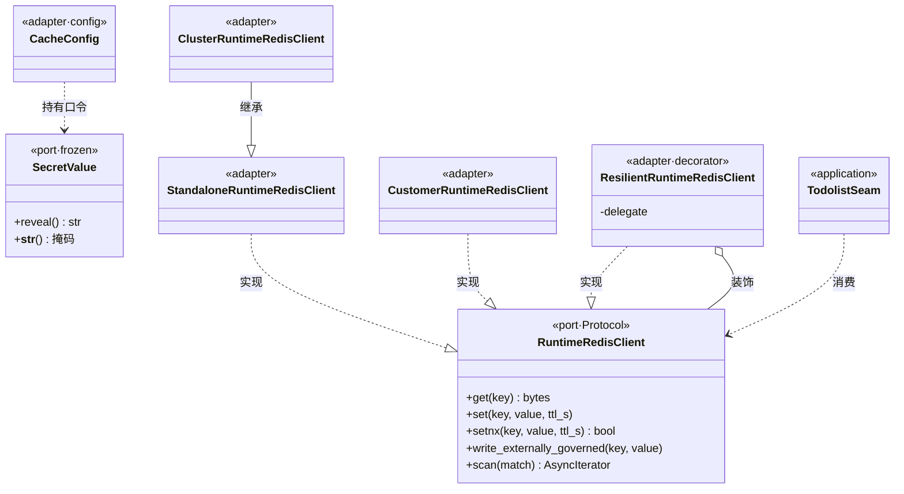
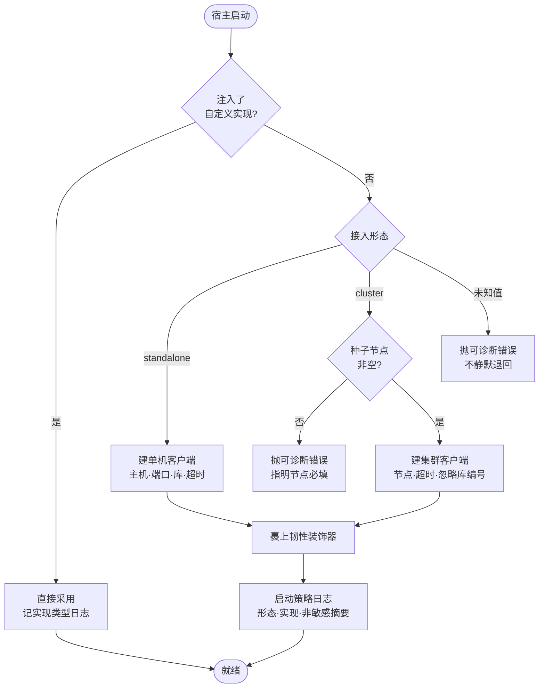
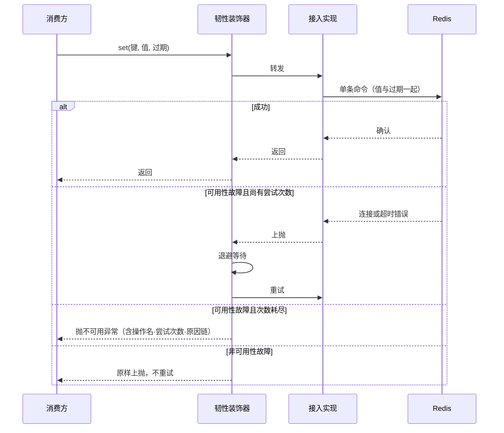
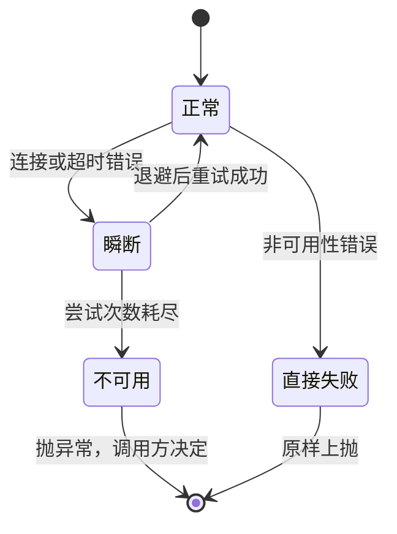
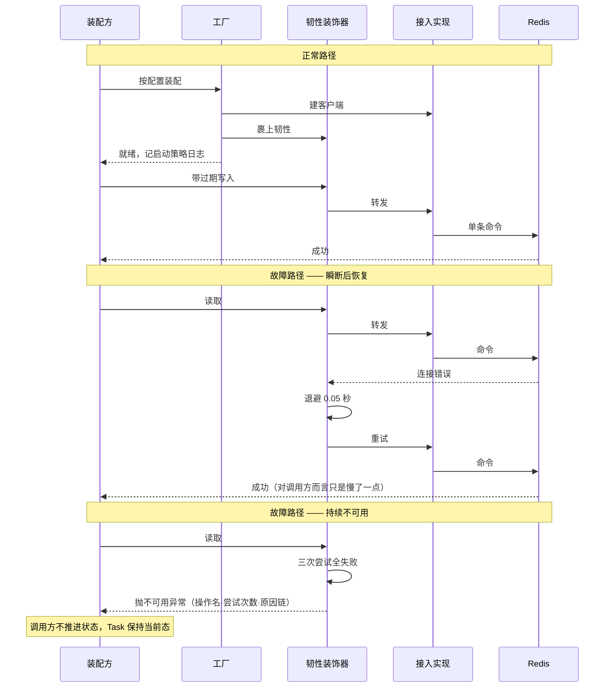

# L2-Func-003b 智能体任务状态缓存 · Python 详细设计

## 1. 概述

### 1.1 特性定位

**角色**：本特性把 runtime 对 Redis 的使用从具体客户端实现中解耦出来。它提供一个统一的操作端口，让所有需要 Redis 的运行时能力面向同一套命令编程；单机、集群、集成方自封装组件三种接入形态通过替换实现接入，业务代码一行不动。

**解决的问题**：现状是每个需要缓存的地方各自决定用哪个 Redis 客户端、怎么连、写不写过期，接入形态一变就要改业务代码；目标是把「怎么连、怎么写」收敛到一处，上层只知道「存字节、取字节」。

**适用场景**：需要把 Redis 资源纳入集成方的统一治理体系；需要在不同交付环境间切换 Redis 接入方式；需要让 Task 快照与框架状态持久化复用同一套接入策略。

**不适用场景**——三类看起来相关但不归本特性：

| 情形 | 为什么不属本特性 | 归谁 |
|---|---|---|
| 决定某个键存多久、什么时候写 | 本特性只做字节读写与过期施加，取值与时机由消费方定 | 各消费方的详设与数据架构视图 |
| Redis 服务本身的部署、扩容、备份、容灾、监控 | 上位规格 §5.2 显式列为不承诺项 | 部署与系统工程方案 |
| Redis 故障时切换到进程内存储 | 上位规格 §5.2 明写不承诺内存降级 | 无——本设计只失败，不伪造状态（§9.2） |

### 1.2 核心设计原则

**P1 · 统一端口，消费方不见具体客户端。**
上位规格 §2 能力表把「统一 Redis 操作接口」列为 MUST：不同接入形态对上层暴露的接口必须一致，切换接入方式不得要求业务代码变化。故所有消费方只依赖 `RuntimeRedisClient` 端口，不 import 任何 Redis 客户端库。

**P2 · 最小命令面，不承诺 Redis 全命令。**
上位规格 §5.1.2 明写「统一接口只承诺当前运行时需要的最小 Redis 命令面」，同文 §3 把具体方法面交给 L2 设计约束。故命令面按实际消费方需要确定，且**收窄是有依据的行为**，不是遗漏（三项收窄见 §2.3.1）。

**P3 · 通用写入一律带过期，无过期只留一个具名出口。**
上位规格 §6 是 MUST：「在默认配置下避免无 TTL 写入」。落地形态是把这条从调用方自律变成签名强制——通用写入的过期参数必填，无过期能力收敛到一个具名方法，且该方法只服务一个用途。

**P4 · 装配失败即失败，不静默退回。**
上位规格 §5.1.1 明写「当配置指定的 endpoint type 或适配实现无法装配时，系统应明确失败或给出可诊断错误，不应静默使用与配置不一致的数据源」。静默退回的危害不是当场报错，而是运行数月后才发现数据写在了错误的地方。

**P5 · 口令不入日志是机制，不是约定。**
上位规格 §2 把「密码日志脱敏」列为 MUST。靠「记得别打印」这种约定必然失守——配置对象会被整体记录、异常栈会带上参数、调试时有人加一行打印。故口令用专门的类型承载，其字符串化恒为掩码。

**P6 · 故障时只失败，不伪造。**
上位规格 §5.2 明写不承诺 fail-open、fail-close 或内存降级。runtime 对状态无本地真值，静默降级等于伪造状态——读失败若退化为「键不存在」，调用方会当成一个真实事实继续往下走。

### 1.3 子特性全景

| 子特性 | 职责 | 关键抽象 | 状态 |
|---|---|---|---|
| 统一操作端口 | 向消费方暴露 bytes 级读写、过期施加、删除、存在性、批量读取、扫描 | `RuntimeRedisClient` | 已实现 |
| 单机接入 | 原生单机 Redis 的端口实现 | `StandaloneRuntimeRedisClient` | 已实现 |
| 集群接入 | 原生集群 Redis 的端口实现，命令面与单机一致 | `ClusterRuntimeRedisClient` | 已实现 |
| 集成方封装接入 | 把集成方自封装组件桥接到同一端口 | `CustomerRuntimeRedisClient` | 已实现（内部不可复现，见 §12.3） |
| 装配与诊断 | 按配置选实现、口令解密、启动策略日志、失败可诊断 | `build_cache_store` | 已实现 |
| 故障韧性 | 有界重试、指数退避、持续不可用则快速失败 | `ResilientRuntimeRedisClient` | 已实现（本版多走一步，见 §13） |
| 口令脱敏 | 口令的字符串化恒为掩码 | `SecretValue` | 已实现 |
| Todolist 存储接缝 | 为框架侧的任务清单提供不带过期的存储通道 | `TodolistSeam` | 部分实现（上游未实现该能力，见 §13） |

### 1.4 术语与命名对齐

| 名称 | 三方一致性 | 说明 |
|---|---|---|
| `RuntimeRedisClient` | 上位规格、上游同级详设、上游实现三方同名 | 统一操作端口 |
| `StandaloneRuntimeRedisClient` | 与上游同级详设的包结构建议同名 | 单机实现 |
| `ClusterRuntimeRedisClient` | 同上 | 集群实现 |

**本地化命名**：方法名做了两处 Python 化，语义一一对应——

| 我方 | 上游 | 等价理由 |
|---|---|---|
| `delete` | `del` | `del` 是 Python 关键字，不能作方法名 |
| `scan` | `scanIter` | 我方返回异步迭代器，`Iter` 后缀在返回类型上已表达 |

**一处刻意不同名**：`write_externally_governed` 对应上游不带过期的 `set` 重载。不沿用 `set` 是因为端口上另有一个强制带过期的 `set`——同名重载在 Python 中无法表达，且**名字自带用途约束**比注释更可靠（§2.3.1）。

---

## 2. 功能规格

### 2.1 能力清单

逐条对准上位规格 §2 能力表。「事实要求」是外部可观察行为。

| 能力 | 级别 | 事实要求 | 状态 |
|---|---|---|---|
| 接入形态配置 | MUST | 配置可指定单机或集群；未配置时按单机处理，既有单机配置继续可用 | 已实现 |
| 单机接入 | MUST | 配置为单机时能完成读写 | 已实现 |
| 集群接入 | MUST | 配置为集群时以**同一端口**完成读写；路由与重定向由实现承接，调用方不感知 | 已实现 |
| 集成方封装扩展点 | MUST | 注入自定义实现即接管全部 Redis 操作，业务代码不改 | 已实现 |
| 统一操作接口 | MUST | 三种接入形态对上层暴露完全相同的方法面 | 已实现 |
| 启动策略日志 | MUST | 启动日志体现当前接入形态、实现类型与非敏感连接摘要 | 已实现 |
| 口令日志脱敏 | MUST | 口令、密文、令牌不出现在任何日志与异常信息中 | 已实现 |
| 配置切换 | MUST | 单机与集群间切换只改配置；默认与自定义实现间切换只换注入，均不改业务代码 | 已实现 |
| 状态缓存过期时间 | SHOULD | Task 快照与框架状态使用统一的可配置过期时间，默认 604800 秒 | 已实现 |
| 复用同一数据源 | SHOULD | Task 存储与框架状态持久化复用同一接入抽象 | 已实现 |
| 集成方模式内部不可复现说明 | MUST | 文档明确：集成方自封装组件不外传，内部只验证可适配能力与默认形态 | 已实现（§12.3） |
| 配置错误可诊断 | SHOULD | 接入形态未知、连接配置缺失时给出明确错误，不静默退回 | 已实现 |
| 资源生命周期 | SHOULD | 连接资源随应用生命周期初始化与释放 | **部分实现**（见 §13） |
| Todolist 自治持久化 | MUST | 框架侧经注入的存储对象自治读写，runtime 只提供连接、不解释内容 | **部分实现**（上游未实现，见 §13） |

### 2.2 显式排除

| 排除项 | 原因 | 替代方案 |
|---|---|---|
| Redis 全命令面 | 上位规格 §5.1.2 明写只承诺最小命令面；命令面越大，长期兼容负担越重 | 新消费方需要新命令时，先评估是否为运行时通用需求再扩端口 |
| 比较并写入 | 上游端口无该语义；在整值序列化的载体上做字节比较不成立（序列化非规范化会产生假失败）；且只覆盖 runtime 一层 | Task 推进的并发正确性由协议库单写者加部署实例亲和保证 |
| 单独设过期 | 原用于活跃态滑动续期，而续期已改由写入驱动、每次写入重设，**无消费方**。上游端口有该方法，本实现有意不跟进 | 需要续期就重写一次，过期时间随写入重设 |
| 运行中热切换数据源 | 上位规格 §5.2 明写不要求；配置变更经重启生效 | 重启 |
| 故障时自动降级到进程内存储 | 上位规格 §5.2 明写不承诺内存降级；降级等于伪造状态 | 只失败，不伪造（§9.2） |
| 多租户键命名空间 | 上位规格 §5.2 明写不承诺按租户生成命名空间 | 需要时由独立特性定义 |
| 跨逻辑 runtime 的自动键隔离 | 上位规格 §5.2 明写不承诺；本设计不基于任何 runtime 标识自动加前缀 | 由开发者与部署方承接（§5.5） |
| 多数据源同时路由 | 上位规格 §5.2 明写不要求按请求维度动态路由 | 单实例使用当前生效的接入形态 |
| 连接池参数精细调优 | 上位明写由后续版本补齐；本侧的池满行为是确定性失败，不构成「卡住」类风险 | 见 §9.3 的两侧差异说明 |
| 键格式与序列化格式的对外稳定性 | 上位规格 §5.1.3 明写属内部实现细节 | 运维与业务代码不得依赖具体格式 |

### 2.3 接口契约

#### 2.3.1 端口声明

```python
class RuntimeRedisClient(Protocol):
    """Redis 操作面，bytes 级端口。"""

    async def get(self, key: str) -> Optional[bytes]:
        """按键取值。键不存在返回 None。

        实现者必须保证：**故障时不得返回 None**——那等价于谎称「键不存在」，
        调用方会把它当成真实事实继续往下走。故障应抛出可诊断异常（§8）。
        """

    async def set(self, key: str, value: bytes, *, ttl_s: int) -> None:
        """带过期写入。

        参数 ttl_s：过期秒数，**必填**。这是「所有写入一律带过期」在端口层面成立的
            方式——可选参数拦不住任何人：省略一个默认参数不报错、类型检查不拦、
            评审看不出，而它写出的键永不过期。
        实现者必须保证：过期与值的写入是同一条命令，不得拆成写入加设过期两步。
        """

    async def setex(self, key: str, ttl_s: int, value: bytes) -> None:
        """带过期写入的位置参数形态，语义同 `set`。保留是为对齐上游同名方法。"""

    async def setnx(self, key: str, value: bytes, *, ttl_s: int) -> bool:
        """键不存在才写入，返回是否写入成功。

        参数 ttl_s：**必填**，理由同 `set`。
        实现者必须保证：判存在与写入必须由**单条原子命令**完成。拆成两步的后果是
            崩溃在两步之间会留下永不过期的键，使该资源的领取永久失败。
        用途：一次性领取类语义（幂等判重）。
        """

    async def delete(self, key: str) -> None:
        """删除键。键不存在不视为错误。"""

    async def exists(self, key: str) -> bool:
        """键是否存在。"""

    async def write_externally_governed(self, key: str, value: bytes) -> None:
        """具名的外部治理写入：**不带过期**，键的回收由外部统一管理。

        **仅供注入给框架侧的存储对象使用**。除该注入路径外任何调用都是违规——
        本方法是端口上唯一能写出永不过期键的入口。

        实现者必须保证：不得施加任何过期时间。
        """

    async def mget(self, keys: list[str]) -> list[Optional[bytes]]:
        """批量取值，返回与入参等长的列表，缺失位置为 None。"""

    def scan(self, match: str, *, count: int = 100) -> AsyncIterator[bytes]:
        """按模式扫描键，产出异步迭代器。

        实现者必须保证：**一旦开始产出键就不得重试**——重扫会重复已产出的键，
            比失败更糟。中途故障应抛出异常，由调用方决定是否整体重来。
        """
```

**命令面相对上游的三项收窄**，每项都有依据：

| 上游语义 | 本实现处置 | 依据 |
|---|---|---|
| 无过期写入（三个重载） | **不保留通用形态**，只保留一个具名的外部治理写入 | 上位规格 §6「默认配置下避免无 TTL 写入」是 MUST。通用路径不暴露无过期形态，使该 MUST 从结构上不可能被无意违反 |
| 不存在则写 | **采纳，并强制带过期**，签名比上游更严 | 上游该方法不带过期参数，照搬会写出永不过期的键 |
| 单独设过期 | **不提供** | 原用于活跃态滑动续期，而续期已改由写入驱动，**无消费方**。将来若出现真实消费方，扩端口是破坏性变更，须走设计 |

上位规格 §3 把「具体方法面由 L2 设计约束」，这三项收窄据此作出。

#### 2.3.2 数据类型

| 类型 | 关键字段 | 含义 | 约束 |
|---|---|---|---|
| `CacheConfig` | `endpoint_type` | 接入形态 | 取值 `standalone` 或 `cluster`；缺省 `standalone`；未知值装配失败 |
| `CacheConfig` | `standalone` | 单机连接配置 | 仅单机形态使用；集群形态忽略 |
| `CacheConfig` | `cluster` | 集群连接配置 | 仅集群形态使用；单机形态忽略 |
| `CacheConfig` | `retry` | 故障重试策略 | 由装配方给出；缺省值见 §6.2 |
| `StandaloneConfig` | `host` | 主机名 | 可空，空则用 `localhost`；由装配方填充 |
| `StandaloneConfig` | `port` | 端口 | 缺省 6379 |
| `StandaloneConfig` | `database` | 库编号 | 缺省 0。**仅单机形态生效**，集群形态忽略且不作为失败条件 |
| `StandaloneConfig` | `timeout_ms` | 连接与读写超时 | 缺省 3000 |
| `StandaloneConfig` | `decrypted_password` | 解密后的口令 | 类型是 `SecretValue` 而非字符串；缺省为空值；由装配方经解密接缝填充；构造时对裸字符串做归一 |
| `ClusterConfig` | `nodes` | 种子节点列表 | 形如 `主机:端口`；集群形态**必填且至少一个**，空则装配失败 |
| `ClusterConfig` | `timeout_ms` | 同上 | 缺省 3000 |
| `ClusterConfig` | `decrypted_password` | 同上 | 同上 |
| `SecretValue` | （无公开字段） | 口令载体 | 字符串化、格式化、表示形式**恒为掩码**；取原值须显式调用 `reveal()`；实例不可变 |
| `RetryPolicy` | `max_attempts` | 最大尝试次数 | 含首次；取值须大于 0 |
| `RetryPolicy` | `base_delay_s` | 退避基数 | 第 N 次失败后等待基数乘以 2 的 N 次方 |

**关于 `database` 的两条约束不可省**：单机形态它生效并传给客户端；集群形态它**不参与客户端创建、也不作为启动失败条件**。上位规格 §5.1.1 逐条写明了这两点，其中「不作为失败条件」尤其要紧——把它判为失败会让沿用单机配置切换到集群的部署无法启动。

#### 2.3.3 行为承诺

**必须**：

- 三种接入形态对上层暴露完全相同的方法面。
- 通用写入必须带过期；过期与值必须由同一条命令写入。
- 条件写入必须由单条原子命令完成。
- 装配失败必须抛出可诊断错误，不得静默退回其他数据源。
- 口令不得出现在任何日志、异常信息或对象的字符串表示中。
- 故障时必须抛出可区分的异常，不得返回看起来正常的值。

**禁止**：

- 禁止在端口上增加不带过期的通用写入方法。
- 禁止消费方 import 任何 Redis 客户端库。
- 禁止实现把扫描的中途失败重试为重新扫描。
- 禁止把集群形态下的非零库编号判为启动失败。

**允许**：

- 允许单机与集群使用不同的底层客户端，只要上层操作语义一致。
- 允许集成方封装的实现在其内部使用任意技术，只要满足端口语义。
- 允许注入的自定义实现自行决定其故障策略——本设计不为它代包韧性层（§4.1）。
- 允许扫描按实现的批次大小分批取键，调用方不感知批次边界。

#### 2.3.4 消息队列声明

**本特性不涉及消息队列。** 上位规格全篇零处提及总线、消息队列或事件订阅；本特性是同步的存储接入，命令面无异步投递语义。

---

## 3. 模块结构

### 3.1 包结构

```
agent_runtime/
  ports/
    cache.py                   RuntimeRedisClient 端口：九项命令的协议声明
    secret.py                  SecretValue：口令载体，字符串化恒为掩码
  adapters/outbound/cache_redis/
    factory.py                 装配：按配置选实现、建客户端、启动策略日志、失败可诊断
    standalone.py              单机实现
    cluster.py                 集群实现，继承单机（命令面一致，仅客户端类型不同）
    customer.py                集成方封装实现：把注入的组件桥接到端口
    resilient.py               故障韧性装饰器：有界重试、指数退避、快速失败
  application/
    todolist_seam.py           Todolist 存储接缝：走具名的外部治理写入
```

不列无关文件。消费本端口的模块（Task 存储、会话共享键等）不在本篇的包结构里——它们归各自的特性。

### 3.2 类图与静态关系



**模式标注**：`RuntimeRedisClient` 与 `SecretValue` 是**端口**；三个具体客户端是**适配器实现**；`ResilientRuntimeRedisClient` 是**装饰器**——它既实现端口又持有端口，故可套在任意实现之外；`build_cache_store` 是**工厂**；集群实现**继承**单机实现，因为命令面完全一致、差别只在底层客户端类型。

**为什么韧性是装饰器而不是写进每个实现**：写进实现意味着三份重复的重试逻辑，且集成方注入的实现拿不到它。装饰器形态使韧性与接入形态正交——原生实现一律裹上，注入的实现**不代包**（其故障策略归提供方）。

### 3.3 三个接入实现的差异

实现者最容易问的是「这三个到底差在哪、我要写几遍」。答案是：**命令面一份，差异只在三处**。

| | 单机 | 集群 | 集成方封装 |
|---|---|---|---|
| 命令面 | 九项 | **完全继承单机** | 九项，逐方法转发 |
| 底层对象 | 单机客户端 | 集群客户端 | 注入进来的组件 |
| 与单机的关系 | — | **继承**，只换底层客户端类型 | 无继承，独立实现 |
| 键的路由 | 单库直连 | 由底层客户端按槽位路由，**实现层不感知** | 由组件自行决定 |
| 库编号 | 生效 | **忽略**，且不作为失败条件 | 由组件决定 |
| 韧性 | 装配时裹上 | 装配时裹上 | **不裹**——其故障策略归提供方 |

**为什么集群用继承而不是复制**：两者的命令语义完全相同，差别只是底层客户端类型不同。复制一份意味着九个方法要改两处，且不会有任何东西提醒你漏改了哪个。继承使「命令面一致」成为结构事实，而不是靠两份代码保持同步。

**为什么集成方封装不继承**：它转发给一个外部对象，而不是操作某个 Redis 客户端。继承会带来一批用不上的字段与初始化逻辑。

**实现者需要写几遍**：单机写九个方法；集群写一个类声明（继承）加客户端类型；集成方封装写九个转发。**没有第四种**——若出现新的接入形态，先判断它能否继承单机，不能才独立实现。

### 3.4 依赖方向与禁止依赖

**可以依赖**（一律向内）：

- `adapters/outbound/cache_redis/` → `ports/cache.py`、`ports/secret.py`
- `application/todolist_seam.py` → `ports/cache.py`
- `ports/` → 无（最内层，只依赖标准库与 typing）

**绝对不能依赖**：

| 禁止 | 具体 |
|---|---|
| `ports/` 引入任何 Redis 客户端库 | `redis`、`redis.asyncio`、`redis.asyncio.cluster` 不得出现在端口层 |
| `application/` 与 `domain/` 引入 Redis 客户端库 | 同上。消费方只见端口 |
| `application/` 或 `domain/` 引用适配层类型 | 包括 `CacheConfig`、三个具体客户端、韧性装饰器 |
| 消费方绕过端口直连 | 不得从适配层导出原生客户端供上层使用 |
| 用裸 `Any` 承接适配层类型 | 那等于把依赖边删掉，图分析看不见 |

**违反了会怎样**：

- 前四类有 import 边，**依赖守门器可判**，且已开穷尽模式——新建的内层包若不在层级枚举中同样受管辖，不会漏网。
- 第五类图分析看不见，由分层守门的裸 `Any` 规则与字面量下沉规则兜住。这两条规则不可裁撤：撤掉后违规会向这两个方向迁移，那不是巧合，是「只有 import 边被看管」的必然结果。

---

## 4. 核心设计

### 4.1 装配

#### 4.1.1 关键处理流程



**分支条件**：

| 条件 | 路径 |
|---|---|
| 装配方注入了自定义实现 | 直接采用，**不裹韧性装饰器**——注入的实现其故障策略归提供方，代包会掩盖它自己的策略 |
| 接入形态为单机（含未配置） | 建单机客户端并裹韧性 |
| 接入形态为集群且种子节点非空 | 建集群客户端并裹韧性 |
| 接入形态为集群但种子节点为空 | 抛错，指明节点必填 |
| 接入形态为未知值 | 抛错，指明支持的取值 |

**边界条件**：

| 边界 | 处理 |
|---|---|
| 主机名为空 | 用 `localhost`，不视为错误——本地开发的常见形态 |
| 集群形态配了非零库编号 | **不参与客户端创建，也不作为失败条件**。上位规格 §5.1.1 明写这一点，判为失败会让沿用单机配置切换到集群的部署无法启动 |
| 口令未配置 | 传空值给客户端，由 Redis 侧决定是否拒绝——runtime 不代判「必须有口令」 |
| Redis 客户端库缺失 | 导入时失败，错误可诊断。**不退回进程内存储**——那与配置意图不符 |
| 装配方同时注入了实现与客户端 | 实现优先。两者都给意味着装配方的意图有歧义，取更外层的那个 |

**状态转换**：装配是一次性过程，无状态机。失败即抛出，不留半装配状态。

#### 4.1.2 并发与协程安全边界

**单写者假设**：装配在启动阶段完成，**假设由单一调用者串行驱动**。工厂本身不持有可变状态，每次调用独立产出一个客户端。

**可并发调用**：装配完成后的客户端可被任意协程并发调用——底层客户端库自身线程安全，连接池由它管理。

**不可并发**：装配过程本身。多个协程并发装配会建出多个客户端、多个连接池，而它们都指向同一个 Redis，属资源浪费而非正确性问题。

**竞态窗口**：无。装配无共享状态。

#### 4.1.3 幂等键与重试语义

**本子特性不涉及幂等键**——装配不是可重入的业务操作，它产出对象而不改变外部状态。

**重试策略**：装配**不重试**。连接失败在装配期暴露比在首次使用时暴露更好，重试只会推迟问题显形。首次使用时的故障由韧性层承接（§4.3）。

---

### 4.2 命令执行

#### 4.2.1 关键处理流程



**分支条件**：

| 条件 | 路径 |
|---|---|
| 连接类或超时类错误，且尝试次数未耗尽 | 退避后重试 |
| 连接类或超时类错误，且次数耗尽 | 抛不可用异常，**不降级** |
| 其他错误（如内存上限下写入被拒、命令用法错误） | **原样上抛，不重试**——它们不是瞬断，重试无益且会掩盖根因 |
| 扫描已开始产出键后遇故障 | **不重试**，直接抛出 |

**边界条件**：

| 边界 | 处理 |
|---|---|
| 最大尝试次数配为 1 | 即不重试，首次失败立刻抛出 |
| 退避时长超过上限 | 封顶在配置的最大退避 |
| Redis 客户端库缺失（裸环境） | 可重试错误类型退化为语言内建的连接与超时类型，功能不变 |
| 读取时故障 | 抛异常，**绝不返回空值**——空值等价于「键不存在」，是伪造事实 |

**状态转换**：

| 当前 | 事件 | 下一 | 附加行为 |
|---|---|---|---|
| 尝试中 | 可用性故障，次数未尽 | 退避中 | 记警告，含操作名与退避时长；**不记键名与值** |
| 退避中 | 等待结束 | 尝试中 | 尝试序号加一 |
| 尝试中 | 可用性故障，次数已尽 | 失败 | 记错误，抛不可用异常 |
| 尝试中 | 非可用性故障 | 失败 | 原样上抛，不记额外日志（避免重复记录） |
| 尝试中 | 成功 | 完成 | 无 |

#### 4.2.2 并发与协程安全边界

**单写者假设**：**本层不做任何单写者假设**。端口是无状态的字节读写，同一个键的并发写由 Redis 自身串行化。业务层面的「谁能写这个键」由各消费方保证，不在本特性范围。

**可并发调用**：全部方法。韧性装饰器不持有跨调用的可变状态——重试计数是每次调用的局部变量。

**不可并发**：无。

**竞态窗口**：**退避无随机抖动**，多副本在同一时刻恢复时存在惊群——所有副本同时结束退避、同时重连。当前的单写者加实例亲和使并发写者数量少，风险可接受；**若未来放开实例亲和，此处需加抖动**。这是已知接受的残余风险，登记在 §13。

#### 4.2.3 幂等键与重试语义

本特性涉及的标识分三类，**语义各不相同，不得混用**：

| 标识 | 类别 | 幂等语义 |
|---|---|---|
| Redis 键 | 寻址标识 | 不承担去重。同一个键的重复写入是覆盖，不是幂等——最后一次写入生效 |
| 条件写入的键 | **业务创建幂等键** | 承担去重。同一个键的第二次条件写入返回否，调用方据此判定「已被领取过」 |
| 操作名（重试日志里的） | 诊断标识 | 不参与任何判定，只用于定位 |

**重复到达的行为**：

| 操作 | 重复调用的结果 |
|---|---|
| 带过期写入 | **覆盖**，且过期时间重置 |
| 条件写入 | 第一次成功、后续失败。这正是它的用途 |
| 删除 | 幂等。删不存在的键不视为错误 |
| 读取、存在性、批量读取、扫描 | 无副作用，天然幂等 |

**重试策略与退避**：有界重试，退避为指数递增并封顶。**重试不改变对外可观察状态**——重试的是同一条命令，成功即等同一次成功；全部失败则抛异常，调用方看到的与从未执行一样（除非部分写入已生效，而单条命令不存在部分生效）。

---

### 4.3 故障处置

#### 4.3.1 关键处理流程

上位规格 §5.2 明写不承诺自动流量迁移、fail-open、fail-close 或内存降级。本设计据此只做一件事：**把故障如实抛出，附带足够诊断的上下文**。



**为什么不降级**：runtime 对状态无本地真值。若读失败退化为「键不存在」，调用方会当成真实事实继续——续接会认为任务不存在、查询会返回空结果，而数据其实还在。**伪造出来的正常比明确的失败难查得多**。

**分支条件**与**边界条件**同 §4.2.1，不重复。

**状态转换**：见上方状态图。

#### 4.3.2 并发与协程安全边界

同 §4.2.2。故障处置不引入新的并发面——每次调用独立判定、独立退避。

**竞态窗口**：惊群，同 §4.2.2。

#### 4.3.3 幂等键与重试语义

同 §4.2.3。此处补一条**重试与幂等的交互**：

条件写入在重试时**可能返回否**——第一次尝试实际已写入成功但响应丢失，重试时键已存在。调用方看到「未写入」，而实际上是自己写的。

**本设计不消除这个歧义**，因为消除它需要在值里嵌入调用方标识并回读比对，那超出最小命令面。消费方若对此敏感，应在值中自带标识并在拿到否之后回读确认——这条约束写进了端口该方法的实现者须知。

---

## 5. 数据设计

上位规格 §6 点名要求：L2 设计必须**分别**明确 Task 存储内部键、开发者定义的业务键、Todolist 存储键，以及不同逻辑 runtime 共用同一 Redis 时的键空间隔离责任，且**不得把多租户隔离与跨 runtime 隔离合并描述**。本章按这四类分列。

### 5.1 第一类 · Task 存储的内部键

| 项 | 内容 |
|---|---|
| 键格式 | `a2a:task:<任务标识>`；影子任务为 `a2a:task:shadow:<智能体标识>:<父任务标识>` |
| 值格式 | Task 的序列化字节，由协议库决定 |
| 写入方 | Task 存储适配器（归标准服务入口特性），经本端口的带过期写入 |
| 过期 | 统一过期时间，默认 604800 秒，**无例外键** |
| 本特性的角色 | 只提供写入通道与过期施加。键怎么取、值怎么序列化、存多久，都由消费方决定 |

**这类键是内部实现细节**，上位规格 §5.1.3 明写不作为外部稳定契约。运维与业务代码不得依赖具体格式。

### 5.2 第二类 · 开发者定义的业务键

| 项 | 内容 |
|---|---|
| 键格式 | **由开发者定义**，本设计不规定、不加前缀 |
| 写入方 | 使用本端口的宿主代码 |
| 过期 | 由开发者调用时给出——通用写入强制带过期，故这类键**也不会永不过期** |
| 本特性的角色 | 只提供通道 |

上位规格 §5.1.3 明写「SDK 不写死开发者业务 key 的前缀」。本设计不基于应用名或任何 runtime 标识自动加前缀。

### 5.3 第三类 · Todolist 存储键

| 项 | 内容 |
|---|---|
| 键格式 | `<部署方给定的前缀><任务标识>`，缺省前缀为 `runtime:todolist:` |
| 隔离粒度 | **任务级**——不得仅以租户、智能体或会话为隔离粒度 |
| 值格式 | 对 runtime 不透明的字节。runtime **不理解、不合并、不校验**其内容 |
| 写入方 | 框架侧经注入的存储对象自治读写；runtime 只提供连接 |
| 过期 | **不设**。经端口的具名外部治理写入，回收由外部 Redis 连接池配置或运维侧统一管理 |
| 本特性的角色 | 提供不带过期的写入通道 |

**「不设过期」是权威硬要求**：上位规格 §5.1.4 明写 Todolist 存储不自行设置过期、不调用带过期写入或单独设过期。这一条与本设计的「所有写入一律带过期」表面冲突，实为**管辖范围问题**——上位规格 §6 那条强制项的对象是 Task 快照与框架状态，**不含 Todolist**；Todolist 的键从一开始就不归本设计治理。

**这带来一个部署方必须知道的后果**：runtime 会向 Redis 写入一类**永不过期**的键。它们不会自己消失，容量规划必须把它们算进去。这一条要在部署交底时显式提示，不能只写在设计里（§11.2）。

### 5.4 第四类 · 跨逻辑 runtime 的键空间隔离

**这一节与多租户隔离是两件事，上位规格 §6 明令不得合并描述。**

| | 跨逻辑 runtime 隔离 | 多租户隔离 |
|---|---|---|
| 问题 | 两个独立的 runtime 宿主共用同一个 Redis 服务，键互相覆盖、扫描互相串扰 | 同一个 runtime 内，不同租户的数据要不要分开存 |
| 本设计的承诺 | **不自动隔离**。不基于应用名或任何 runtime 标识自动加前缀 | **不承诺**。不按租户生成键命名空间 |
| 责任方 | 开发者与部署方 | 需要时由独立特性定义 |
| 可用手段 | 独立的 Redis 端点、单机形态下的独立库编号、由集成方封装的实现统一加命名空间，或其他等价方式 | 不适用 |

**未隔离时会发生什么**（上位规格 §5.2 明写不承诺这些不发生）：Task 快照跨 runtime 覆盖、扫描返回别的 runtime 的键、运维无法归属某个键属于谁。

**同一个逻辑 runtime 的多个副本可以共享键空间**——那是水平扩展，不是隔离问题，两者不可混谈。

### 5.5 写序与清理责任

**本特性不产生多键写入，无写序约束。** 端口的每个方法都是单条命令；需要多键写序的消费方（如 Task 存储的索引与快照）在各自的详设里定序。

**清理责任**：

| 键类 | 谁清理 |
|---|---|
| Task 存储内部键、开发者业务键 | Redis 服务端的过期机制。runtime 侧**无清扫器、无周期任务** |
| Todolist 键 | **外部**——Redis 连接池配置或运维侧 |

### 5.6 与全局数据架构的关系

本章是数据架构视图的切片，与之一致：统一过期时间、无例外键、runtime 侧不设主动清扫、内存淘汰策略归部署方。

**一处需要对齐着读**：数据架构视图划定「无例外键」的管辖范围时，明确把 Todolist 排除在外。本章 §5.3 是那句话的落地形态——它不是给统一过期时间开例外，而是那些键从一开始就不归本设计治理。

---

## 6. 配置模型

### 6.1 完整配置示例

```yaml
cache:
  # 接入形态。取值 standalone 或 cluster；未配置时按 standalone 处理，
  # 使既有的单机配置无需改动即可继续启动。
  endpoint_type: standalone

  # 单机形态的连接参数。集群形态下本节整体忽略。
  standalone:
    host: 127.0.0.1
    port: 6379
    database: 0            # 仅单机形态生效
    timeout_ms: 3000
    # 口令由装配方经解密接缝填充，配置文件里放密文而非明文。
    encrypted_password: "${REDIS_PASSWORD_ENCRYPTED:}"

  # 集群形态的连接参数。单机形态下本节整体忽略。
  cluster:
    nodes:                 # 必填，至少一个；推荐多个以避免单点入口失效
      - 10.10.1.11:6379
      - 10.10.1.12:6379
      - 10.10.1.13:6379
    timeout_ms: 3000
    encrypted_password: "${REDIS_PASSWORD_ENCRYPTED:}"
    # 注意：集群形态不读 database。若沿用单机配置切换过来、
    # 且 database 为非零值，启动不失败，但该值不参与客户端创建。

  # 故障重试策略。见 §9.2 的确定性行为。
  retry:
    max_attempts: 3        # 含首次尝试；配为 1 即不重试
    base_delay_s: 0.05
    max_delay_s: 1.0
```

**切换到集群只改两处**：`endpoint_type` 与 `cluster.nodes`。业务代码、消费方、端口方法面全不变——这正是上位规格 §2「配置切换」那条 MUST 的可验证形态。

### 6.2 配置属性表

| 属性路径 | 类型 | 默认值 | 必填 | 说明 |
|---|---|---|---|---|
| `cache.endpoint_type` | 字符串 | `standalone` | 否 | 未配置按单机处理。未知值**装配失败**，不静默退回 |
| `cache.standalone.host` | 字符串 | `localhost` | 否 | 空值时用默认，不视为错误 |
| `cache.standalone.port` | 整数 | 6379 | 否 | Redis 默认端口 |
| `cache.standalone.database` | 整数 | 0 | 否 | 仅单机形态生效 |
| `cache.standalone.timeout_ms` | 整数 | 3000 | 否 | 与上游同级详设的默认值一致 |
| `cache.standalone.encrypted_password` | 字符串 | 空 | 否 | 密文。解密后以专用类型承载，字符串化恒为掩码 |
| `cache.cluster.nodes` | 字符串列表 | 空 | **集群形态必填** | 形如 `主机:端口`。为空时装配失败并指明该项必填 |
| `cache.cluster.timeout_ms` | 整数 | 3000 | 否 | 同单机 |
| `cache.cluster.encrypted_password` | 字符串 | 空 | 否 | 同单机 |
| `cache.retry.max_attempts` | 整数 | 3 | 否 | **默认值理由**：一次退避重试覆盖绝大多数瞬断，三次在延迟与成功率之间取平衡；配为 1 即关闭重试 |
| `cache.retry.base_delay_s` | 浮点 | 0.05 | 否 | **默认值理由**：小于典型的连接建立时间，使第一次重试几乎无感；退避按 2 的幂次递增 |
| `cache.retry.max_delay_s` | 浮点 | 1.0 | 否 | **默认值理由**：封顶避免退避把单次调用拖到秒级以上，那会传导为对外时延 |

**重试三项是本实现多走的一步**——上位规格与上游同级详设均未定义重试策略。默认值取自本实现的判断，等上游追认（§13）。

### 6.3 配置对象

三个不可变数据类：接入配置、单机连接配置、集群连接配置。口令字段的类型是专用的口令载体而非字符串。

**构造时做一次归一**：口令字段接受裸字符串或口令载体，构造后一律是载体类型。这一步不可省——类型标注拦不住运行时传进来的裸字符串（配置加载器最可能这么干），少了归一，脱敏就只是「调用方配合才生效」的约定，不是机制。

**加载与校验时机**：

| 检查 | 时机 | 非法值的行为 |
|---|---|---|
| 接入形态取值 | **装配期** | 抛出可诊断错误，指明支持的取值 |
| 集群种子节点非空 | **装配期** | 抛出可诊断错误，指明该项必填 |
| 连接可达性 | **首次使用时** | 由韧性层承接：有界重试后快速失败 |

**为什么可达性不在装配期校验**：装配期探测会让启动依赖 Redis 就绪，而部署顺序往往不保证这一点。首次使用时失败同样可诊断，且不阻塞启动。

---

## 7. 对外呈现与用户场景

### 7.1 外部接口

本特性**无对外接口**。它是运行时内部的存储接入层，客户端不感知其存在。

运维侧可感知的只有一处：**启动日志**。它体现当前生效的接入形态、实现类型与非敏感连接摘要，用于确认部署是否符合预期。

### 7.2 可运行示例

**场景一 · 单机形态启动**

前置条件：Redis 单机版已部署在 `127.0.0.1:6379`。

配置：`endpoint_type: standalone`，填 `host`、`port`、`database`、`timeout_ms`。

预期启动日志（字段来自实现的实际日志语句）：

```
RuntimeRedisClient 装配：endpoint_type=standalone 实现=StandaloneRuntimeRedisClient
host=127.0.0.1 port=6379 db=0 重试策略=3次/退避0.050s起
```

**口令不出现在这条日志里**——它连「已配置/未配置」都不打印，因为连这个布尔值也无排障价值。

**场景二 · 切换到集群**

只改两处：`endpoint_type: cluster`、填 `cluster.nodes`。业务代码不动。

预期启动日志：

```
RuntimeRedisClient 装配：endpoint_type=cluster 实现=ClusterRuntimeRedisClient
节点数=3 重试策略=3次/退避0.050s起
```

**节点摘要只记数量不记地址**——地址属部署拓扑，记进日志会随日志外流。

**场景三 · 接入形态配错**

配置：`endpoint_type: sentinel`（本版不支持）。

预期：**启动失败**，错误信息指明未知的接入形态取值。不静默退回单机，不静默退回进程内存储。

**字段值来源**：三个场景的日志字段与错误行为取自实现的实际日志语句与失败分支，非编造。

### 7.3 端到端流程



---

## 8. 错误处理

| 错误场景 | 触发条件 | 系统行为 | 对外结果 |
|---|---|---|---|
| 接入形态未知 | 配置为 `standalone`／`cluster` 之外的值 | 装配期抛出，记错误日志 | 启动失败，错误信息指明支持的取值 |
| 集群种子节点为空 | 形态为集群但未配节点 | 装配期抛出 | 启动失败，指明该项必填 |
| Redis 客户端库缺失 | 运行环境未安装对应库 | 导入失败 | 启动失败。**不退回进程内存储** |
| 连接瞬断 | 连接类或超时类错误，尝试次数未耗尽 | 退避后重试，记警告 | 调用方无感知，仅延迟增加 |
| 持续不可用 | 上述错误且尝试次数耗尽 | 记错误，抛不可用异常 | 调用方拿到**可区分的异常**，含操作名、尝试次数、底层原因链 |
| 内存上限下写入被拒 | Redis 内存达上限且淘汰策略为不淘汰 | **原样上抛，不重试** | 调用方拿到原始错误。重试无益且会掩盖根因 |
| 命令用法错误 | 参数类型或个数不符 | 原样上抛，不重试 | 同上 |
| 扫描中途故障 | 已产出部分键后连接断开 | **不重试**，直接抛出 | 调用方决定是否整体重来。重扫会重复已产出的键，比失败更糟 |
| 注入的实现自身故障 | 集成方封装组件内部异常 | **原样上抛**，不代包重试 | 其故障策略归提供方 |

**错误码的可区分性**：不可用异常是一个专用类型，调用方可据类型判定「这是 Redis 不可用」而非其他失败。异常携带操作名与尝试次数，使日志无需额外上下文即可定位。

**不构成错误的情形**——以下都必须正常放行：

- 删除不存在的键。
- 集群形态下配了非零库编号（**不得判为失败**）。
- 主机名为空（用默认值）。
- 口令未配置（由 Redis 侧决定是否拒绝）。

---

## 9. DFX 设计

### 9.1 可观测性埋点

| 埋点 | 时机 | 带哪些字段 |
|---|---|---|
| 装配策略 | 客户端建成时 | 接入形态、实现类型、非敏感连接摘要（单机记主机与端口与库编号；集群只记**节点数量**）、重试策略参数 |
| 注入实现被采用 | 装配方注入了自定义实现时 | **仅实现类型**。其连接参数不属 runtime，不记 |
| 装配失败 | 形态未知、节点为空 | 失败原因与支持的取值 |
| 瞬断重试 | 每次可重试失败后 | 操作名、第几次/共几次、错误类型、退避时长 |
| 持续不可用 | 尝试次数耗尽 | 操作名、总尝试次数 |

**禁止入日志**：

- **口令、密文、令牌、密钥、证书内容**。这条不靠自觉——口令以专用类型承载，其字符串化、格式化、表示形式恒为掩码，即使有人把整个配置对象记进日志也只会得到掩码。
- **键名与值**。键名可能含任务标识、会话标识等业务标识，值可能含任意业务内容。重试日志只记操作名，不记这两样。
- 集群的节点地址（属部署拓扑，只记数量）。

**连「口令已配置／未配置」这个布尔值也不打**：它无排障价值——运维要确认的是当前生效的接入形态与实现类型，不是有没有配口令；而任何与口令沾边的字段出现在日志里，都会诱导后来者往上加更多。这条由判据守着，加一个口令相关字段即转红（§12.2）。

### 9.2 可靠性

| 故障场景 | 确定性行为 |
|---|---|
| 瞬时连接失败或超时 | 有界重试，指数退避并封顶。恢复即继续，调用方只感知延迟增加 |
| 持续不可用 | **快速失败**，抛可诊断异常。**不降级、不伪造** |
| 读取失败 | 抛异常。**绝不返回空值**——空值等价于「键不存在」，是把故障伪造成事实 |
| 状态推进写入失败 | 异常上抛，调用方不推进状态，Task 保持当前态 |
| 内存上限下写入被拒 | 原样上抛，不重试。它不是瞬断，重试无益且掩盖根因 |
| 进程重启 | 连接重建。已写入的数据在 Redis 侧，不受影响 |

**「不做什么」的性质标注**：

| 不做的事 | 性质 |
|---|---|
| 不做故障时自动切换到进程内存储 | **刻意取舍**——上位规格 §5.2 明写不承诺内存降级；降级等于伪造状态 |
| 不做跨数据源自动迁移 | **刻意取舍**——同上 |
| 退避不加随机抖动 | **已知残余风险**——多副本同时恢复存在惊群。当前单写者加实例亲和使并发写者少，可接受；放开亲和时须补（§13） |
| 不做连接池参数调优 | **缺口**——见 §9.3 与 §13 |
| 连接资源显式释放 | **已实现**——实现件提供释放方法并逐层穿透韧性包装（`openJiuwen/agent-runtime-mvp/agent_runtime/adapters/outbound/cache_redis/standalone.py` 与 `resilient.py` 的 `aclose`）；两种关闭方法名都试，客户端库不提供关闭方法时静默跳过。与 §13 同项口径一致 |

### 9.3 容量与性能约束

本特性不引入新的容量约束，容量行为由客户端库承接。

**一处必须写明的两侧差异**：上位规格 §5.2 登记「等待上限未设、默认无限等待、上限硬编码不可配置」——那描述的是 **Java 侧连接池的属性**。本侧客户端库的行为不同，经实测确认：

| | 上位描述（Java 侧） | 本侧实测 |
|---|---|---|
| 池满时 | 无限期阻塞，不超时不报错 | **立刻抛错**，不阻塞 |
| 并发上限 | 硬编码，不可配置 | 客户端库的参数，**可配** |
| 是否另有阻塞型池 | — | 有，且**默认带超时**，也非无限等待 |
| 池满后的最终表现 | 调用方卡住，无错误信号 | 0.15 秒内以**存储不可用**告终，可诊断 |

**故上位那条限制在本侧不成立**。照抄一条不适用的描述会让排查时被误导方向——本侧池满是一个**会报错的确定性失败**，不是「卡住」。

其余容量约束：

| 约束 | 取值 | 出处 | 超限时的行为 |
|---|---|---|---|
| 连接池并发上限 | 客户端库的默认值（未显式配置） | 客户端库 | 池满时池侧**立刻抛「连接数过多」错误**，不阻塞、不排队。该错误**继承自客户端库的连接错误**，故落进韧性层的可重试类型：3 次尝试、退避 0.05 + 0.1 秒，耗尽后归为存储不可用。**总窗口 0.15 秒**——池由协程共享，池满多为瞬时状态，有界退避正好给其他协程让路 |
| 单次操作超时 | 3000 毫秒，可配 | 本设计的配置项 | 超时后按可重试故障处理 |
| 重试总耗时上限 | 约等于 `退避基数 × (2⁰+2¹+…)` 封顶后求和；默认三次约 0.15 秒 | 本设计的配置项 | 耗尽后快速失败 |

**前两条是缺口不是取舍**——上位规格把它们列在「显式边界与不承诺项」里，说明上游也认为这是当前版本的限制而非设计意图。登记在 §13。

**长时挂起的 Todolist 键会持续占用内存**：它们不带过期、不会自己消失。容量规划必须把它们算进去，回收由外部承接（§5.3）。

---

## 10. 安全

### 10.1 鉴权与租户边界

**谁校验**：宿主。本特性不做任何鉴权——它是内部存储接入层，不接收外部请求。

**在哪一步校验**：在请求进入 runtime 之前，由宿主的入站链路完成。本特性拿到的调用都已经过校验。

**失败时在哪一层拦截**：宿主层。请求不进入 runtime，自然也不触达本特性。

**Redis 侧的认证**：口令经配置传入客户端，由 Redis 服务端校验。runtime **不代判**「必须配口令」——是否要求认证是部署方的决定。

### 10.2 凭据处理

**从哪来**：配置文件里放密文，由装配方经解密接缝解密后填入配置对象。

**以什么形态传递**：**专用的口令载体类型**，不是字符串。它的字符串化、格式化、表示形式恒为掩码；取原值必须显式调用取值方法。

**为什么不是字符串加约定**：靠「记得别打印」必然失守，三条路径都会泄漏——数据类的默认表示形式会展开全部字段、异常栈会带上构造参数、调试时有人加一行打印。把不可打印做成类型的性质，这三条路径同时被堵。

**禁止落在哪里**：日志、异常信息、任何对象的字符串表示、诊断输出。**装配日志连「口令已配置/未配置」这个布尔值都不打**——它无排障价值，而任何与口令相关的字段出现在日志里都会诱导后来者加更多。

### 10.3 租户隔离

**靠什么保证**：**本特性不做租户隔离**。上位规格 §5.2 明写当前版本不承诺按租户生成键命名空间。

**是否存在跨租户回退的可能**：不适用——本特性不感知租户维度，键完全由消费方给出。租户隔离若有需要，由消费方在键里体现或由独立特性定义。

**与跨 runtime 隔离的区别**：见 §5.4。两者是不同的问题，上位规格明令不得合并描述。

### 10.4 不可信输入

| 字段 | 是否自声明 | 能否作为授权依据 |
|---|---|---|
| 键名 | 由消费方给出 | 不适用——本特性不做授权判定 |
| 值 | 由消费方给出，对本特性不透明 | 不适用。**本特性不解析值**，故不存在反序列化攻击面 |
| 配置中的连接参数 | 部署方给出 | 视为可信——它与 runtime 同属部署边界内 |
| 注入的自定义实现 | 装配方给出 | 视为可信。**本特性不校验其行为**，若它不满足端口语义，后果由提供方承担 |

**一处要写明的边界**：Todolist 的值对 runtime 不透明，runtime **不理解、不合并、不校验**其内容。这意味着框架侧写进去什么，runtime 就原样存什么——内容的正确性归框架，不归本特性。

---

## 11. 兼容性与迁移

### 11.1 对外兼容约束

**与存量逐字节一致的面**：**无**。本特性是内部存储接入层，对客户端不可见，不存在对外契约面。

**可加／不可改／不可变**：

| 类别 | 内容 |
|---|---|
| 可加 | 端口可增加新命令——但须先评估是否为运行时通用需求（§2.2） |
| **不可改** | 通用写入的过期参数不得改回可选。改回即失去「无过期写入不可能被无意产生」这条结构性保证 |
| **不可变** | 「装配失败即失败、不静默退回」这条行为。改成静默退回会让配置错误在数月后才显形 |

**相对存量的新增面与行为差异**：

| 差异 | 说明 | 为什么不破坏既有调用 |
|---|---|---|
| 存量无统一的 Redis 接入端口 | 存量各处直接用客户端库 | 本特性是新增的内部结构，不改变任何对外行为 |
| 集群接入 | 存量只有单机 | 新增能力，默认不启用 |

### 11.2 与存量并存及切换

**键面是否共享**：**取决于部署形态**。

| 形态 | 键面关系 | 后果 |
|---|---|---|
| 新部署独立 Redis | 不共享 | 无影响 |
| 复用存量 Redis | **共享键空间** | Task 存储的键面必须与存量逐字对齐，否则同一批会话一半由存量写、一半由本实现写，续接直接断 |

**是否共用存储**：复用存量 Redis 时共用。此时 §5.4 的跨 runtime 隔离约束适用——两个实现事实上就是两个逻辑 runtime。

**切换粒度**：**会话级**。理由是续接依赖同一会话的状态可见，粒度细于会话会让同一会话的两轮落到不同实现上。

**未完结会话在切换时的处置**：切换只对新建会话生效，已在途的会话继续由原实现服务至完结。

**部署交底必须包含的一条**：Todolist 的键**不带过期、不会自己消失**（§5.3）。容量规划要算上它们，回收由部署方或运维侧承接。这一条不能只写在设计里——它是 runtime 向 Redis 写入永不过期数据的唯一出口，部署方不知道就会在容量上被动。

---

## 12. 验收标准与测试用例

### 12.1 验收判据

**判据一 · 命令面恰好是收窄后的九项**
判什么：端口暴露的方法集合与收窄后的清单**完全相等**，多一个少一个都红。
期望值来源：上位规格 §3「具体方法面由 L2 设计约束」与总体设计 §4 的三项收窄条款——**不由实现推出**。
怎样才会失败：加回单独设过期即红；删掉具名外部治理写入也红。

**判据二 · 通用写入的过期参数必填**
判什么：端口与全部实现的通用写入方法，过期参数**无默认值、不可为空**。
期望值来源：上位规格 §6「默认配置下避免无 TTL 写入」这条 MUST。
怎样才会失败：把参数改回可选立刻红；只改某个实现而端口不动，同样红。

**判据三 · 具名方法是唯一的无过期出口**
判什么：端口的通用写入面不存在第二个可以不带过期的方法。
期望值来源：上位规格 §5.1.4 与总体设计 §4 的管辖范围划分。
怎样才会失败：新增一个不带过期的通用写入即红。

**判据四 · Todolist 不走通用写入**
判什么：接缝的写入调用落在具名方法上，不落在通用写入上。
期望值来源：上位规格 §5.1.4「不调用带过期写入或单独设过期」。
怎样才会失败：改回通用写入立刻红——假实现会在过期记录里留下痕迹。

**判据五 · 三种接入形态命令面一致**
判什么：单机、集群、集成方封装三种实现对同一组调用产生相同的可观察结果。
期望值来源：上位规格 §2「统一操作接口」这条 MUST。
怎样才会失败：任一实现遗漏某个方法或语义不一致即红。

**判据六 · 装配失败不静默退回**
判什么：接入形态未知时抛出，且**不返回任何可用对象**。
期望值来源：上位规格 §5.1.1 原文。
怎样才会失败：改成退回默认实现即红。

**判据七 · 故障时不伪造**
判什么：持续不可用时读取抛异常，**不返回空值**；写入失败时状态不推进。
期望值来源：上位规格 §5.2「不承诺 fail-open、fail-close 或内存降级」。
怎样才会失败：让读失败退化为返回空值即红。

**判据八 · 口令不入日志**
判什么：口令载体的字符串化、格式化、表示形式均为掩码；装配日志不含口令相关字段。
期望值来源：上位规格 §2「密码日志脱敏」这条 MUST 与 §5.1.5。
怎样才会失败：把口令字段改回普通字符串即红。

### 12.2 测试用例与预期结果

| 用例 | 前置条件 | 操作 | 预期结果 | 验证物 |
|---|---|---|---|---|
| 命令面为闭集 | — | 反射端口方法集 | 与收窄清单完全相等 | 已具名 `test_runtime_redis_client_port.py::test_command_surface_is_exactly_the_narrowed_set` |
| 不提供单独设过期 | — | 检查端口 | 该方法不存在 | 已具名 `test_runtime_redis_client_port.py::test_no_standalone_expire` |
| 不提供比较并写入 | — | 检查端口 | 该方法不存在 | 已具名 `test_runtime_redis_client_port.py::test_no_cas_on_port` |
| 端口写入方法过期必填 | — | 反射签名 | 无默认值、非可空 | 已具名 `test_expiry_is_mandatory_in_port.py::test_port_write_methods_require_ttl` |
| 全部实现过期必填 | — | 反射四个实现的签名 | 同上 | 已具名 `test_expiry_is_mandatory_in_port.py::test_all_implementations_require_ttl` |
| 具名方法是唯一无过期出口 | — | 扫描端口通用写入面 | 无第二个 | 已具名 `test_expiry_is_mandatory_in_port.py::test_named_governance_write_is_the_only_expiry_free_path` |
| 带过期写入落地 | 单机实现 | 写入后查过期 | 过期时间为正且不超过配置值 | 已具名 `test_cache_store.py::test_set_with_ttl_applies_expiry` |
| 具名写入不留过期 | 单机实现 | 经具名方法写入后查过期 | 返回「键存在但无过期」 | 已具名 `test_cache_store.py::test_externally_governed_write_leaves_no_expiry` |
| 条件写入只在缺失时成功 | 单机实现 | 连续两次条件写入同一键 | 第一次成功、第二次失败 | 已具名 `test_cache_store.py::test_setnx_writes_only_when_absent` |
| 装配拒绝未知形态 | — | 用未知形态装配 | 抛错，不返回对象 | 已具名 `test_cache_store.py::test_factory_rejects_unknown_endpoint_type` |
| 注入实现优先 | 同时给注入实现与配置 | 装配 | 采用注入的实现 | 已具名 `test_cache_customer.py::test_factory_store_injection_takes_precedence` |
| 集成方封装透传全命令 | 注入封装组件 | 逐方法调用 | 全部透传，语义一致 | 已具名 `test_cache_customer.py::test_passthrough_set_get_delete_exists`、`::test_passthrough_mget_and_scan`、`::test_passthrough_new_commands` |
| 瞬断在有界重试内恢复 | 注入前两次失败 | 写入 | 第三次成功，调用方无感 | 已具名 `test_redis_dfx_resilience.py::test_fi1_transient_failure_recovers_within_bounded_retry` |
| 退避指数递增且封顶 | 注入持续失败 | 观察退避序列 | 递增且不超过上限 | 已具名 `test_redis_dfx_resilience.py::test_fi1_backoff_is_exponential_and_bounded` |
| 重试次数可配 | 配为一次 | 触发失败 | 不重试，直接失败 | 已具名 `test_redis_dfx_resilience.py::test_fi1_retry_count_is_configurable` |
| 持续不可用可诊断失败 | 注入持续失败 | 任意操作 | 抛专用异常，含操作名与尝试次数 | 已具名 `test_redis_dfx_resilience.py::test_fi2_persistent_unavailable_fails_fast_with_diagnosable_error` |
| 读失败不伪造成空值 | 注入持续失败 | 读取 | 抛异常，**不返回空值** | 已具名 `test_redis_dfx_resilience.py::test_fi2_never_fakes_success_on_read` |
| 不静默退回进程内存储 | 注入持续失败 | 观察行为 | 无退回 | 已具名 `test_redis_dfx_resilience.py::test_fi2_no_silent_fallback_to_in_memory` |
| 写失败不推进状态 | 注入写失败 | 状态推进写入 | 状态保持原值 | 已具名 `test_redis_dfx_resilience.py::test_fi3_state_advance_write_failure_never_advances_state` |
| 韧性覆盖全端口面 | — | 逐方法经装饰器调用 | 全部被包装 | 已具名 `test_redis_dfx_resilience.py::test_wraps_full_port_surface_including_scan` |
| Todolist 键为任务级 | — | 写入后查键 | 键含任务标识 | 已具名 `test_todolist_seam.py::test_key_is_task_scoped_with_prefix` |
| Todolist 不走通用写入 | — | 写入 | 无过期被施加 | 已具名 `test_todolist_seam.py::test_write_does_not_go_through_general_path` |
| Todolist 真实语义下无过期 | 真实 Redis 语义 | 写入后查过期 | 返回「键存在但无过期」 | 已具名 `test_todolist_seam.py::test_roundtrip_on_real_redis_semantics` |
| 集群形态非零库编号不失败 | 集群配置且库编号非零 | 装配（不注入客户端，走真实建客户端路径） | 装配成功，该值不参与创建 | 已具名 `test_cache_store.py::test_cluster_ignores_database_and_does_not_fail` |
| 集群缺种子节点则失败 | 集群配置且节点为空 | 装配 | 抛错，信息指明该项必填 | 已具名 `test_cache_store.py::test_cluster_without_nodes_fails_with_diagnosable_error` |
| 口令载体恒为掩码 | 配置含口令 | 表示形式、字符串化、格式化、异常回显四条路径 | 四者均为掩码，不含原值 | 已具名 `test_secret_value.py::test_config_repr_has_no_plaintext`、`::test_config_fstring_has_no_plaintext`、`::test_traceback_has_no_plaintext` |
| 裸字符串口令被归一 | 配置传入裸字符串 | 构造后检查类型与表示 | 归一为口令载体，表示为掩码 | 已具名 `test_secret_value.py::test_raw_str_password_is_normalized_standalone`、`::test_raw_str_password_is_normalized_cluster` |
| 取值只有一个入口 | — | 检查取原值的路径 | 唯有显式取值方法 | 已具名 `test_secret_value.py::test_reveal_is_the_only_way_out` |
| 装配日志不含口令字段 | 配置含口令 | 装配并检查日志 | 无原值，且无「口令已配置」这类摘要；同时确认该记的字段确实记了 | 已具名 `test_secret_value.py::test_assembly_log_carries_no_password_field` |

### 12.3 覆盖边界

| 验证形态 | 是否适用 | 由哪一层兜底 |
|---|---|---|
| 集成方封装组件的真实联调 | **不适用**——集成方自封装组件因合规不外传，内部环境无法复现 | 内部只验证**可适配能力**：注入替身实现能被采用、默认实现让位、命令面透传一致。真实联调由具备组件访问权限的现场环境完成 |
| 真实集群的路由与重定向 | **不适用**于单机套件——需要真实多节点集群 | 无自动化兜底。命令面一致性由继承关系保证（集群实现继承单机实现），路由由底层客户端库承接 |
| 连接池耗尽 | **已覆盖**——判据以永远池满的替身驱动完整链路 | 钉住两层叠加的结果：池侧立刻抛错、韧性层有界重试 3 次后归为存储不可用，总等待 0.15 秒 |
| 跨 runtime 键空间串扰 | **不适用**——需要两个独立部署共用一个 Redis | 无自动化兜底。隔离责任在部署方（§5.4） |
| Redis 故障的确定性行为 | 适用，已覆盖 | 故障注入替身，见 §12.2 的六条 |

---

## 13. 限制与待补

| 限制 | 影响范围 | 刻意取舍还是缺口 | 临时方案 | 该由谁做 |
|---|---|---|---|---|
| 不承诺 Redis 全命令面 | 新消费方可能需要新命令 | **刻意取舍**——上位规格 §5.1.2 明写只承诺最小面 | 先评估是否为通用需求再扩端口 | 本特性 |
| 不提供单独设过期 | 与上游端口有一处方法面差异 | **刻意取舍**——无消费方；上游有该方法，本实现有意不跟进 | 需要续期就重写一次 | 本特性 |
| 不做故障时的存储降级 | Redis 不可用即服务不可用 | **刻意取舍**——上位规格 §5.2 明写不承诺；降级等于伪造状态 | Redis 可用性由部署与系统工程方案承接 | 本特性 |
| 不做多租户与跨 runtime 的自动键隔离 | 共用同一 Redis 时可能互相覆盖 | **刻意取舍**——上位规格 §5.2 明写不承诺 | 由开发者与部署方经独立端点、独立库编号或统一命名空间承接 | 本特性 |
| 连接池并发上限未显式配置 | 用客户端库默认值。池满时立刻报错而非阻塞，故不构成「卡住」类风险 | **刻意取舍**——上位明写连接池参数配置化由后续版本补齐，本侧抢先做会造成新的两侧分叉 | 需要限流时由部署侧承接 | 本特性 |
| 退避无随机抖动 | 多副本同时恢复时存在惊群 | **已知残余风险** | 当前单写者加实例亲和使并发写者少；放开亲和时须补抖动 | 本特性 |
| 连接资源显式释放 | — | **已实现** | 实现件提供释放方法并逐层穿透韧性包装；两种关闭方法名都试（客户端库不同版本用过不同名字）；失败不抛出——关停路径上的异常会掩盖真正的关停原因。**关停钩子接入待宿主完成**：释放能力已备，由宿主在其关停流程中调用 | 本特性 |
| Todolist 存储注入上游未实现 | 本接缝无上游形态可对标，其接口可能因上游落地而调整 | **缺口**（上游侧） | 本版按权威规格实现，标「等上游追认」。同类先例见数据架构视图的有界重试一条 | 本特性 |
| Todolist 的键不带过期 | runtime 向 Redis 写入一类永不过期的数据 | **刻意取舍**——上位规格 §5.1.4 明确要求，回收由外部治理 | 部署交底须显式提示，容量规划要算上（§11.2） | 本特性 |
| 重试策略上游未定义 | 三个重试参数的默认值无上游可对标 | **缺口**（上游侧） | 本实现多走一步，等上游追认 | 本特性 |

---

## 附录 A · 六原则符合性

**对外兼容**

**遵从**。结论依据见下列三项；§13 的未闭合项不落在本原则的作用面上。
落地方式：本特性是内部存储接入层，对客户端不可见，零对外契约面。复用存量 Redis 时，Task 存储的键面由消费方逐字对齐存量。
关键取舍：切换粒度定为会话级——细于会话会让同一会话的两轮落到不同实现，第二轮读不到第一轮写的状态。
由该原则直接推出的决策：「装配失败即失败、不静默退回」列为不可变行为——静默退回会让配置错误在数月后才显形，届时数据已写在错误的地方。

**遵从上位**

**有遗留**。遗留两项，均属上游侧：Todolist 存储注入与重试策略默认值在上游未实现，本版按权威规格实现并标「等上游追认」，登记于 §13。
落地方式：本篇每条设计结论均指向上位规格原文或上游同级详设；三项命令面收窄逐条给出依据；上游未实现的能力按常驻规则标注登记，不为其扩大设计。
关键取舍：Todolist 存储注入上游未实现，本版按权威规格实现并标「等上游追认」——这是用户 2026-08-05 的裁定，先例见数据架构视图的有界重试一条。
由该原则直接推出的决策：不跟进上游的单独设过期方法（无消费方）；采纳条件写入但强制带过期（上游签名不带，照搬会写出永不过期的键）。

**生态融入**

**遵从**。结论依据见下列三项；§13 的未闭合项不落在本原则的作用面上。
落地方式：Redis 客户端库的绑定完全隔离在出站适配层，端口与消费方不见任何客户端类型；集群实现继承单机实现，因为命令面一致、差别只在底层客户端。
关键取舍：韧性做成装饰器而非写进每个实现——装饰器使韧性与接入形态正交，且注入的实现**不代包**，其故障策略归提供方。
由该原则直接推出的决策：端口是 bytes 级而非对象仓储——按对象存取会把持久化形状固化进端口契约，换实现时要一起换。

**绞杀者迁移**

**遵从**。结论依据见下列三项；§13 的未闭合项不落在本原则的作用面上。
落地方式：切换粒度会话级，切换只对新建会话生效，在途会话继续由原实现服务至完结。
关键取舍：复用存量 Redis 时键面即共享寻址面，此时两个实现事实上是两个逻辑 runtime，跨 runtime 隔离约束适用。
由该原则直接推出的决策：不迁移在途会话的状态——迁移需要跨实现的格式互转层，该层只在切换期存在，其缺陷无处可测。

**依赖倒置**

**遵从**。结论依据见下列三项；§13 的未闭合项不落在本原则的作用面上。
落地方式：消费方只依赖端口协议；三个实现在出站适配层；配置对象与工厂同层；口令载体在端口层（因为端口的配置面要用它）。
关键取舍：韧性装饰器既实现端口又持有端口，故可套在任意实现之外——这是装饰器模式的代价与收益：多一层间接，换来韧性与接入形态解耦。
由该原则直接推出的决策：禁止从适配层导出原生客户端供上层使用；禁止用裸 `Any` 承接适配层类型——那等于把依赖边删掉，图分析看不见，由分层守门的裸 `Any` 规则兜住。

**状态外置**

**遵从**。结论依据见下列三项；§13 的未闭合项不落在本原则的作用面上。
落地方式：本特性自身**不持有任何状态**——端口无状态，实现只持有客户端引用，韧性装饰器的重试计数是每次调用的局部变量。
关键取舍：Todolist 的键不带过期，回收责任移交部署方。这是权威明确要求的让渡，代价是 runtime 会向 Redis 写入永不过期的数据。
由该原则直接推出的决策：通用写入的过期参数必填——把「所有写入带过期」从调用方自律变成签名强制；无过期能力收敛到一个具名出口，使其全部调用点可被静态审计。
