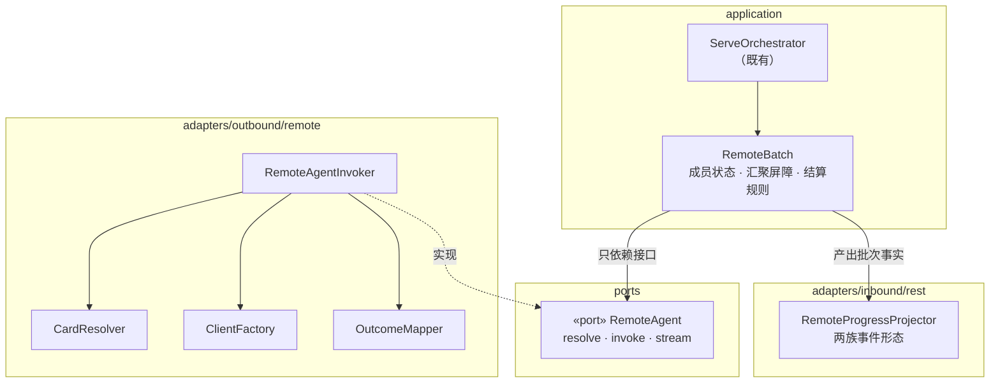
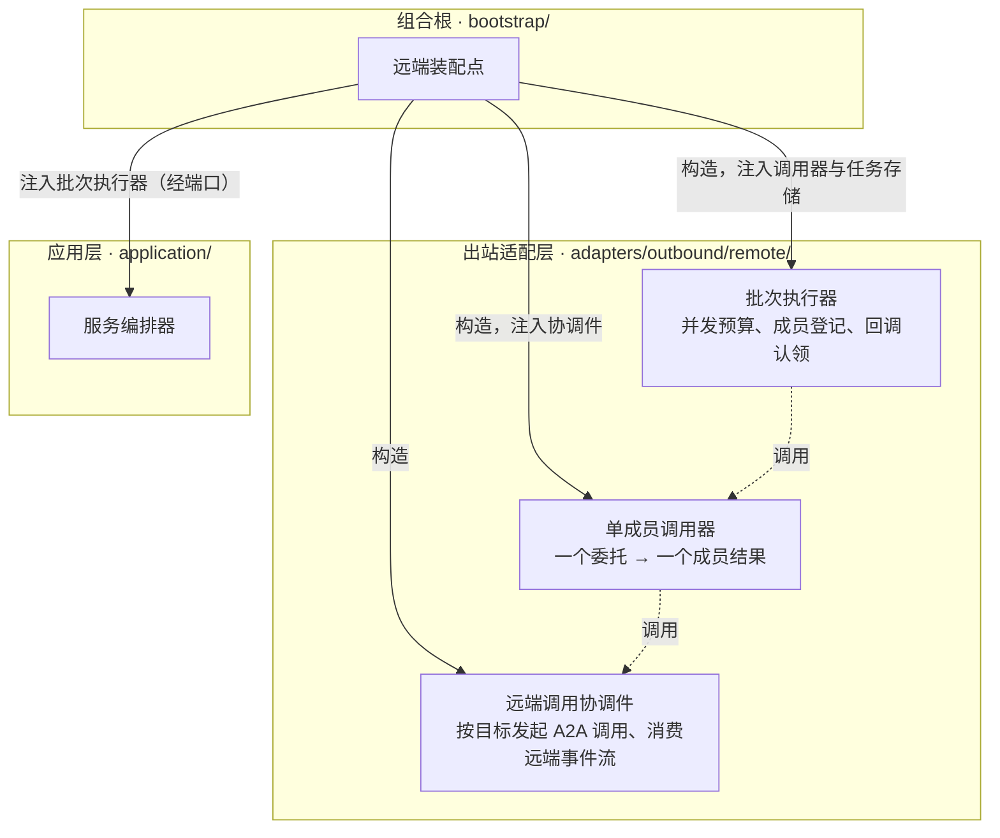
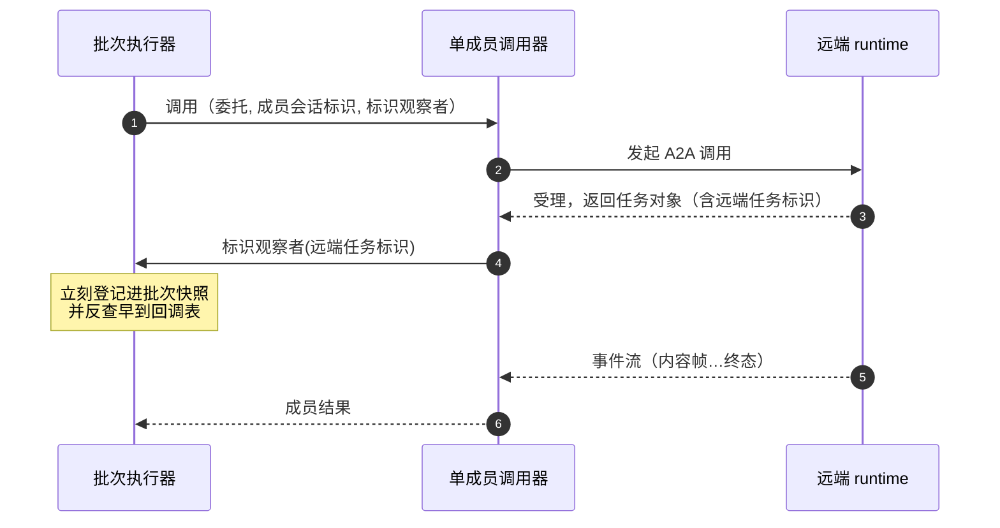
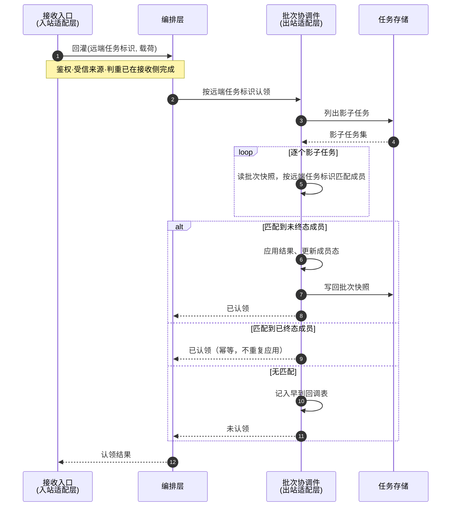

# 任务驱动的远程智能体通信 · Python L2 详细设计

## 1. 概述

### 1.1 特性定位

runtime 作为**调用方**代理父智能体对下游 A2A 智能体的调用：按配置接入下游智能体、把其能力暴露为父智能体可用的代理能力；接收同一轮推理产生的一个或多个下游调用委托，在受控并发预算内并行发起远程调用；全部到达结果性终态后按委托关联键回填结果，并**只恢复一次**父智能体。

**边界一句话**：本特性只管**代理与汇聚**。下游 Task 的生命周期、执行状态与结果主权归下游 runtime，本地只建立可观察关联——这条在 `version-scope/FEAT-004-task-driven-remote-agent-communication.md:129-135` 有五行专门约束，其中包括「本地关联不得被描述为当前 runtime 拥有远端 Task」。

**输入从哪来**：同轮多个委托由 agent-core 侧聚合成一个批量中断交给 runtime，见 `version-scope/FEAT-019-parallel-downstream-agent-tasks-generation-and-handoff.md:12-20`。模型看到的是多个**普通形态的单调用工具**，不是一个显式的批量工具——runtime 不要求智能体调用批量接口才能触发多个下游调用。

### 1.2 设计原则

前四条取自上游同级详设（`architecture/L2-Low-Level-Design/agent-runtime/Feat-Func-004-remote-agent-orchestration.md:37-42`），后四条由权威规格的强制项直接推出。

| 原则 | 内容 | 依据 |
|---|---|---|
| **配置驱动** | 远程端点通过配置静态接入，**不做动态网络发现** | 上游详设 `:39` |
| **A2A 原生** | 南向通信完全走 A2A JSON-RPC，与远端的实现语言和框架无关 | 同文 `:40` |
| **中断续接** | 远端要求输入时父任务挂起等待，输入到达后恢复执行 | 同文 `:41`；边界见 §1.3 |
| **故障隔离** | 某个远端不可用时从目录标记不可用，**不影响其他远端与本地智能体** | 同文 `:43` |
| **委托身份稳定** | 委托、远程调用、结果回填、父智能体恢复四环之间以委托关联键关联；**不得按完成顺序、工具名或目标智能体猜测** | `FEAT-004:34` |
| **全部落定再恢复** | 同批次全部到达结果性终态才回填并恢复，且**只恢复一次**；单项失败不得提前恢复，也不得吞掉其他成功结果 | 同文 `:35`、`:39` |
| **主权三分** | 父任务归本地、远端任务归下游、本地只有关联 | 同文 `:129-135` |
| **投射分出口** | 同一份下游调用事实，在回填父智能体、投影到父任务可观测面、写入诊断日志三个出口上形态不同；**投射规则属适配层，领域模型不为任一出口的形态让步** | 总体设计 §1.1 的推论 |

### 1.3 职责边界

本特性与相邻两个特性的边界，逐项来自权威的责任分界表（`version-scope/FEAT-019-parallel-downstream-agent-tasks-generation-and-handoff.md:152-163`）。

| 责任 | agent-core 侧（FEAT-019） | **本特性（runtime 侧）** |
|---|---|---|
| 下游工具可见性 | 消费已安装的代理工具定义 | **基于智能体卡片安装并暴露代理工具** |
| 多次工具调用的生成 | 保留同轮多个代理工具调用 | 不负责模型生成 |
| 批量中断信封 | 生成并暴露完整成员列表 | **接收并解释为远程调用批次** |
| 远程 A2A 调用 | 不执行 | **发起调用，下游受理后拥有远端任务** |
| 并发预算与调度 | 不拥有 | **拥有并行发起、排队、限流与超时** |
| 外部输入的续接 | 只要求按委托关联键接收回灌结果 | **拥有外部输入的路由与定位** |
| 任务生命周期状态 | 不写 runtime 任务状态 | **拥有父任务状态与投射** |
| 最终恢复 | 按映射恢复工具消息并继续推理一次 | **在可回填条件满足时构造映射并触发恢复** |

**「中断续接」这个词在两处指不同的层**，须分清否则会与用户交互中断特性抢职责：

| 层 | 问题 | 归属 |
|---|---|---|
| 客户端侧 | 父任务同时存在多个等待点时，客户端**看到什么、如何选择回应哪一个** | 用户交互中断特性 |
| runtime 侧 | 一条外部输入到达后，**路由到批次中的哪个成员** | **本特性** |

依据：权威把「`INPUT_REQUIRED` 的客户端呈现、续接、歧义处理和长时挂起语义」划归用户交互中断特性（`version-scope/FEAT-004-task-driven-remote-agent-communication.md:43`）；而责任分界表把「外部 A2A 输入**路由**和歧义处理」留在 runtime 侧——**路由**二字限定了它是入站定位问题，不是呈现问题。

### 1.4 子特性全景

上游同级详设划四个子特性（同文 `:44-53`），本版按同一划分组织，各自的落地章节如下。

| 子特性 | 职责 | 落地 |
|---|---|---|
| 远程智能体配置接入 | 配置 → 拉取智能体卡片 → 缓存目录 | §4.1 |
| 代理工具注入 | 远端技能 → 本地可调用的代理工具 | §4.2 |
| 远程调用通道 | 出站 A2A JSON-RPC 调用与远端结果映射 | §4.3 |
| 远程调用编排 | 批次建立、并发调度、汇聚结算、投射、回填与恢复 | §4.4–§4.7 |

### 1.5 术语与命名对齐

本特性**不新增领域对象**。结果块的远端输出取值已在总体设计登记；批次与成员是实现结构，不进领域层。

| 概念 | 含义 | 主体责任 |
|---|---|---|
| 父任务标识 | 客户端正在观察与控制的那个任务 | 本地 runtime |
| 委托关联键 | 父智能体一次下游调用委托的稳定身份，回填与恢复的关联键 | **agent-core 生成，runtime 消费** |
| 本地关联标识 | 父任务下某个下游调用的本地可观察关联 | 本地 runtime |
| 远端任务标识 | 下游 runtime 受理并执行的实际远端任务 | **下游 runtime**——本地只能关联与代理 |
| 批次 | 同一父任务、同一轮推理产生的全部委托构成的恢复单元 | 本地 runtime |
| 成员 | 批次中的单个委托及其调用状态 | 本地 runtime |
| 追踪标识 | 用于诊断、审计与跨 runtime 关联 | 调用链各方；**不得替代委托关联键做结果归位** |

四类标识的责任划分见 `version-scope/FEAT-004-task-driven-remote-agent-communication.md:62-72`。命名在 Python 侧按本语言习惯本地化，语义与上位逐项对应。

## 2. 功能规格

### 2.1 能力清单

权威 11 条强制项与其落地位置。

| 能力 | 落地 | 权威 |
|---|---|---|
| 远程智能体静态接入，获取其可调用能力 | §4.1 | `FEAT-004:31` |
| 单个下游调用代理，结果返回后恢复父任务 | §4.3 | `FEAT-004:32` |
| 批量委托消费，保持每个委托的独立身份 | §4.4 | `FEAT-004:33` |
| 受控并发预算内并行发起 | §4.5 | `FEAT-004:34` |
| all-settled 汇聚：全部结果性终态才回填 | §4.6 | `FEAT-004:35` |
| 按委托关联键关联结果，不得按顺序或名称猜测 | §4.6 | `FEAT-004:36` |
| 父任务可观察下游调用的关联状态 | §4.7 | `FEAT-004:37` |
| 远端标识内部关联，用于续轮路由与诊断 | §5.2 | `FEAT-004:38` |
| 结果与错误并存，作结构化结果回填 | §4.6 | `FEAT-004:39` |
| 父任务单次恢复 | §4.6 | `FEAT-004:40` |
| 超时治理，超时项作结果性失败参与汇聚 | §4.5 | `FEAT-004:41` |

**另有一条能力经跨特性划分归入本特性**，不在上表的 11 条之内：

| 能力 | 落地 | 权威 |
|---|---|---|
| 异步回调回灌：远端主动投递终态时的认领与分派 | §4.8 | `version-scope/FEAT-001-standardized-agent-service-entrypoint.md` 的非目标表（outbound 远程 Agent 编排一行）（结果回灌由远程编排特性承接）、`FEAT-001:85`（场景要求「附着回本地上下文并恢复等待中的执行链或 Task」）|

**为什么它不在 11 条里**：本特性的上位规格定义的是黑盒行为，**不指定结果如何到达**（`version-scope/FEAT-004-task-driven-remote-agent-communication.md` §1（特性定位，自述定义黑盒行为））；而回调这条入口由标准服务入口特性定义其接收侧，其分派侧经 `:172` 划归本特性。把它混进上表会让读者以为本特性的上位多了一条强制项。

### 2.2 显式排除

| 排除项 | 依据 | 归属 |
|---|---|---|
| `INPUT_REQUIRED` 的**客户端呈现与选择** | `version-scope/FEAT-004-task-driven-remote-agent-communication.md:43` | 用户交互中断特性 |
| 本地普通工具的并行（文件、Shell、本地函数、普通 REST/MCP 等） | 同文 `:44` | 不在本特性主线 |
| 显式批量委托接口 | 同文 `:45` | 同轮多个单委托由上游批量委托特性承接 |
| 依赖图、条件分支、循环、工作流 DAG 编排 | 同文 `:46` | 有严格前后依赖者由父智能体分轮生成 |
| 新增 A2A method、新增 Task 状态 | 同文 `:50`、`:149` | 复用标准入口与标准状态 |

> **排除的是「呈现」不是「路由」**：外部输入到达后路由到批次中哪个成员，属本特性（§1.3）。二者边界见该节的两层表。

### 2.3 接口契约

本特性**不新增任何面向客户端的接口**。契约面有三处，均非新 method。

#### 2.3.1 南向出站：对下游 runtime 的 A2A 调用

**传输**：a2a-sdk 标准客户端，JSON-RPC 绑定，协议版本 1.0。

**端点只有一种形态**：目标地址直接取自调用规格
（`openJiuwen/agent-runtime/applications/a2a_service/orchestrator/handlers/remote_agent_handler.py` 的 `_run_one_sub_agent`，
读 `sub_agent_url` 或 `url`）。**存量无端点类型概念，无网关拼装**——
查证覆盖当前存量、存量提交历史与上游两仓，三处均无。

下表保留原始出处以备核对：

| 端点类型 | 目标 URL | 存量出处 |
|---|---|---|
| `direct`（默认） | 规格中的下游地址 | `openJiuwen/agent-runtime/applications/a2a_service/orchestrator/handlers/remote_agent_handler.py:941-944` |
| `gateway` | `{网关基址}/a2a/{卡片名}` | 同文 `:934-939` |

**会话上下文由谁读**：出向调用件本身**不读存储**——它是传输件，读存储会让它同时承担
「取数」与「送出」两件事，其输出也就不再由入参唯一决定。会话上下文由**调用编排件**
在发起前经共享会话读取件取好，作为参数传入。

**取不到时发空结构，不阻断调用**：五个字段各取空值（前四项空对象或空串、
`sub_task_path` 仍为本次真实路径）。存量在缓存缺失时同样照常发起（§2.3.1 缺键行为），
在本层阻断会把「上下文没写上」升级成「调用失败」。

**卡片来源与回退**——权威要求获取下游可调用能力，存量则不拉取卡片：

| 情形 | 本版行为 |
|---|---|
| 卡片可拉取 | 拉取并按其**真实能力**决定传输方式 |
| 卡片不可得或拉取失败 | **回退为自造最小卡片**：JSON-RPC 绑定、目标 URL、协议版本 1.0、假设支持流式；**不阻断调用** |

回退形态对齐存量（`openJiuwen/agent-runtime/applications/a2a_service/orchestrator/handlers/remote_agent_handler.py:823-836`）。**该回退是必需的**：卡片的流式能力位直接决定客户端走流式还是轮询（`a2a-sdk 1.0.0 · client/base_client.py:70`），若无回退则远端不提供卡片时调用直接失败，而存量此时可正常工作。

> **回退只作用于调用期，不作用于注入期。** 工具注入的准入由技能声明决定，卡片解析失败则不注入（§4.2）；本节的回退处置的是**已注入工具在后续调用时**卡片不可得的情形。上游对注入期有明文规定（`architecture/L2-Low-Level-Design/agent-runtime/Feat-Func-004-remote-agent-orchestration.md:269`），对调用期未规定，本版补该分支。

**出站消息体是两个片段，不是一个。** 这是南向 wire 的一部分，属兼容面：

| 片段 | 内容 | 存量出处 |
|---|---|---|
| 第一个 | 文本，承载调用输入 | `openJiuwen/agent-runtime/applications/a2a_service/orchestrator/handlers/remote_agent_handler.py:1093` |
| 第二个 | 数据，键 `session_context` | 同文 `:1073-1081` |

`session_context` **五个字段**，构造点在
`openJiuwen/agent-runtime/applications/a2a_service/orchestrator/handlers/remote_agent_handler.py`（`_drive_sub_agent`）
（出向唯一一处），冻结断言见
`openJiuwen/agent-runtime/applications/a2a_service/tests/framework_parallel/test_executor_context_and_route.py`
（`test_extract_request_info_reads_sub_task_path`）与
`openJiuwen/agent-runtime/applications/a2a_service/tests/framework_parallel/test_drive_sub_agent.py`
（`test_sub_agent_request_inherits_body_and_uses_safe_context_id`）：

| 字段 | 来源 |
|---|---|
| `headers`、`params`、`trace_id`、`body` | 取自会话缓存的上游原始请求 |
| **`sub_task_path`** | 本次调用的层级路径——**下游据此算自己的调用深度**（`openJiuwen/agent-runtime/applications/a2a_service/orchestrator/handlers/remote_agent_handler.py:507-508`），是多级链路收敛的唯一依据 |
| `session_id` | 可观测会话标识，无则取会话标识 |
| `traceparent` | 当前追踪上下文 |

**消息的其余三项**（同属兼容面）：

| 项 | 取值 | 存量出处 |
|---|---|---|
| 角色 | 用户角色 | `openJiuwen/agent-runtime/applications/a2a_service/orchestrator/handlers/remote_agent_handler.py:1088` |
| 首发任务标识 | **空串**（非空即视为续轮） | 同文 `:1090` |
| 会话标识 | `{会话标识}-sub-{实体标识}`，每个下游实体一条独立会话 | 同文 `:1091` |

存量测试锁死了会话标识形态，且**额外断言其不含冒号**（`openJiuwen/agent-runtime/applications/a2a_service/tests/framework_parallel/test_drive_sub_agent.py:96-99`）——该约束防的是把父会话标识直传下去。

> **`session_context` 的内容源是存量的会话请求缓存键**。根设计已为此开具名**读写**例外（总体设计 §3.2）——四条边界：写入语义对齐存量、限定用途、限定键、写入点限入站适配层。写侧见 §2.3.1.1。

**缺键时的行为**：该键读不到时取空对象兜底，四个字段为空，**调用照常发起、不阻断**（存量同样如此，`openJiuwen/agent-runtime/applications/a2a_service/orchestrator/handlers/remote_agent_handler.py:1060`）。

> **缺键在本版接管写侧后只剩两种成因**：会话的首轮尚未落库（并发极窄窗口），或该键已过生存期而本轮是续轮。两者都不是错误，兜底行为不变。

#### 2.3.1.1 写侧：入站时记下上游原始请求

该键的写者原本全在存量的入站分发与执行器中。本版接管后，**两个入站入口各写一处**，
使纯本版部署下该键有写者——不接管则南向四字段恒空，下游拿不到上游原始请求，
而那是对外可观察的。

**五字段与取值方式**，逐项对齐存量：

| 字段 | 取值 | 存量出处 |
|---|---|---|
| `headers` | 入站请求头全量 | `openJiuwen/agent-runtime/applications/a2a_service/common/logger.py` 的 `request_headers`（`dict(request.headers)`） |
| `params` | URL 查询参数 | `openJiuwen/agent-runtime/applications/a2a_service/api/dispatch.py` 的 `_extract_query_params`（`dict(request.query_params)`） |
| `body` | 请求体 | 同文分发函数（`await request.json()`） |
| `trace_id` | 本次生成的追踪标识 | 同文（`str(uuid.uuid4())`） |
| **`agent_id`** | 路径参数中的智能体标识 | 同文（`str(path_params.get("agent_id") or "")`） |

**字段集必须相等而非包含**：存量有一处消费点专读 `agent_id`
（`openJiuwen/agent-runtime/applications/a2a_service/orchestrator/handlers/remote_agent_handler.py` 的续轮恢复路径）。
少写这一项，就把「本版读不到」的单向缺口换成「存量读不到」的反向缺口。

**两个入口的取值来源不同**：

| 入口 | 取值来源 | 存量对应 |
|---|---|---|
| 自定义 REST 入口 | 从 HTTP 请求现取（头、查询参数、体、路径参数） | 分发函数 |
| 标准服务入口 | 从入站报文的数据片段取 `session_context`，**报文无该片段即不写** | 执行器的 `_init_session_context_if_needed` |

标准服务入口这条的含义是：**它只搬运，不现造**。上游 runtime 在南向报文里带了会话上下文，
本版把它落到键上供自己的南向复用；报文没带（最外层直连 A2A）则本轮无上下文可记，不写。
这与存量同构——存量在报文无该片段时同样直接返回。

**生存期 1800 秒**，两个存量写入点取值相同。**不为已存在的键续期**：存量读到后不做任何续期动作，
续期会让长会话的上下文永不过期，与存量的回收节奏分叉。

**写入用 `SETNX`，读到即不写**。存量是先读、判空、再写三步，非原子；两个写者并发时有覆盖窗口。
混部期是**两个进程**并发，比存量自身多副本并发更容易撞上。`SETNX` 消除该窗口——
**这是本版比存量更严的一处，已在根设计登记**（总体设计 §3.2）。差异对外不可观察：
两侧字段取值方式逐项相同（上表），被覆盖的值与覆盖它的值同源同形态。

**写入失败不阻断本次请求**。该键承载的是「供后续南向复用的上下文」，不是本轮执行的输入；
写不上的后果是后续南向拿到空上下文，而那已有兜底路径（上一节）。为它中断一次正常执行，
是把一个可降级的问题升级成不可用。

#### 2.3.2 北向投影：父任务可观测面的进度事件

**这是对外兼容面，字段逐字锁定。**

**取事实的层次必须分清。** 这个事件在存量内部经过两次形变，两处形态都真实存在，
但只有后者是对外承诺：

| 形态 | 在哪产生 | 是不是对外契约 |
|---|---|---|
| 进队列的中间事件 `{"type": "sub_task", "data": {…}}` | `openJiuwen/agent-runtime/applications/a2a_service/orchestrator/handlers/remote_agent_handler.py`（`_emit_sub_task`） | **否**——它只活到通道投影之前 |
| 通道投影后的对外信封 | `openJiuwen/agent-runtime/applications/a2a_service/common/response_wrapper.py`（`wrap_sub_task_event`） | **是**，并已冻结 |

冻结出处：`openJiuwen/agent-runtime/applications/a2a_service/tests/regression_baseline/frozen_facts.py`（`SUB_TASK_EVENT_FIELDS`、
`SUB_TASK_CUSTOM_RSP_DATA_FIELDS`、`SUB_TASK_EVENT_TYPE`）与
`openJiuwen/agent-runtime/applications/a2a_service/tests/regression_baseline/comparator.py`（`check_sub_task_event`）。

**对外信封 —— 外层七字段，与智能体事件同构**（冻结清单直接复用 `AGENT_EVENT_FIELDS`）：
`success`（恒真）、`agent_id`、`conversation_id`、`output`（恒空串）、`error`（恒空串）、
`execution_time`、`custom_rsp_data`。

**`custom_rsp_data` 四键，顺序即输出顺序**：`event`（恒 `"sub_task"`）、`sub_task_path`、
`node_kind`、`data`。

**内层 `data` 按二维规则分三派**（`openJiuwen/agent-runtime/applications/a2a_service/channels/mobile_bank_channel.py`（`_extract_inner_meta`）
判定，`openJiuwen/agent-runtime/applications/a2a_service/common/response_wrapper.py`（`_render_inner_custom_rsp_data`）渲染）。判定顺序不可调换：

| 序 | 条件 | 派 | 内层 `data` 的形态 |
|---|---|---|---|
| 1 | `node_kind` 为 `workflow` **且**内层 `event` 不是 `node_start`／`node_end` | `workflow` | 工作流事件的 `custom_rsp_data`，两字段 `event`、`data`（冻结于 `WORKFLOW_CUSTOM_RSP_DATA_FIELDS`） |
| 2 | 内层 `event` 是 `node_start` 或 `node_end` | `lifecycle` | **原样透传，不做任何包装** |
| 3 | 其余 | `agent` | 智能体事件的 `custom_rsp_data`，六字段 `data`、`event`、`content`、`createdTime`、`latency`、`plugin`，`display` 仅在显式传入时追加（冻结于 `AGENT_CUSTOM_RSP_DATA_FIELDS`、`AGENT_OPTIONAL_DISPLAY_FIELD`） |

**生命周期帧不按 `node_kind` 分族。** 第 2 条不看 `node_kind`——工作流族与智能体族的
`node_start`／`node_end` 走的是同一条渲染路径，都是原样透传。二者的差异只在两处：
外层 `node_kind` 字段的取值，以及产生方塞进 `data` 的内容。

**三派均经真实往返实测确证**（按冻结基线同款装配
`openJiuwen/agent-runtime/applications/a2a_service/tests/regression_baseline/test_pipeline_snapshot.py`（`_serialize`）的序列化入口投喂，
读数为对外信封原文）：

| 投喂帧 | 实测内层 `data` 键序 | 落哪一派 |
|---|---|---|
| `node_kind`=`workflow`、内层 `event`=`node_end` | `elapsed_ms`、`result`、`event`、`status` | **`lifecycle`**——`node_kind` 为 `workflow` 也不进 workflow 派，第 2 条优先 |
| `node_kind`=`workflow`、内层 `event`=`message` | `event`、`data` | `workflow` |
| `node_kind`=`agent`、内层 `type`=`think_chunk` | `data`、`event`、`content`、`createdTime`、`latency`、`plugin` | `agent` |

> **「原样透传」不等于逐字节不变，且两层的顺序性质根本不同。**
>
> **内层 `data` 的键序由协议层决定，不是任何实现的承诺。** A2A 的数据片段以 protobuf 的
> `Struct` 承载，其 `fields` 是 `map<string, Value>`——protobuf 的 map **在规范层面就不保证
> 字段顺序**，Python 实现下的迭代顺序由字符串哈希决定。实测确证：同一输入在同一进程内
> 键序稳定，而**换一个哈希种子就换一个顺序**（三个种子得到三种不同顺序）；存量的部署镜像
> 未固定 `PYTHONHASHSEED`，故**存量服务每重启一次，同一事件的内层键序就变一次**。
>
> **推论：消费方必然容忍内层键序随机**——否则存量在生产上早已按重启频率间歇失败。
> 这不是我方的取舍，是协议性质加存量运行事实共同决定的：**任何 A2A 实现（含上游 Java）
> 都无法保证这个顺序**。同理，`elapsed_ms` 由整数 `12` 变为浮点 `12.0` 也是 `Struct`
> 的数值统一表示所致，与渲染逻辑无关。
>
> **故内层 `data` 的兼容判据是键集合与值语义，锁键序与字面类型即为对一个不存在的契约
> 施加约束**——那会让兼容验收在存量无缺陷时判红，且拿存量输出当期望值时会自己判自己红。
>
> **外层信封与 `custom_rsp_data` 四键不同**：它们由存量代码构造为 Python 字典后
> 直接序列化出流，不经 protobuf map，插入顺序稳定，**仍逐字锁定**。

**生命周期载荷的内容**（产生方构造，经 `lifecycle` 派原样透传，故内容即对外形态）。
**这张表的出处只有产生点，没有冻结断言**——存量冻结了信封与三派的渲染规则，未逐条冻结
生命周期载荷的字段集。故本表效力弱于上述冻结项，`elapsed_ms` 这类差异属待与产生方对质的项（§13）：

| 外层 `node_kind` | 事件 | `data` 内容 | 产生点 |
|---|---|---|---|
| `workflow` | `node_start` | `event`、`intent` | `openJiuwen/agent-runtime/applications/a2a_service/orchestrator/handlers/remote_agent_handler.py:685-686` |
| | `node_end` · 成功 | `event`、`status`=`done`、`result`、**`elapsed_ms`** | 同文 `:766-767` |
| | `node_end` · 失败 | `event`、`status`=`failed`、`error`、`elapsed_ms` | 同文 `:753-754`、`:796-797` |
| | `node_end` · 超时 | `event`、`status`=`timeout`、`error`、`elapsed_ms` | 同文 `:781-782` |
| | `node_end` · 取消（**启动前**） | `event`、`status`=`cancelled`、`error`——**无 `elapsed_ms`** | 同文 `:701-702` |
| | `node_end` · 取消（**执行后**） | `event`、`status`=`cancelled`、`error`、**`elapsed_ms`** | 同文 `:735-740` |
| `agent` | `node_start` | `event`、`entity_name` | 同文 `:951-952` |
| | `node_end` · 成功 | `event`、`status`=`done`、**`content`** | 同文 `:1018-1020` |
| | `node_end` · 取消 | `event`、`status`=`cancelled`、**`reason`** | 同文 `:1005-1007` |
| | `node_end` · 超时 | `event`、`status`=`timeout`、`error` | 同文 `:1032-1034` |
| | `node_end` · 失败 | `event`、`status`=`failed`、`error` | 同文 `:1046-1048` |

**第三类帧：远端输出的透传帧。** 远端执行过程中的输出**同样经上述三层信封**，只是内层不是生命周期结构而是远端产出的原帧：

| 情形 | 外层 `node_kind` | 外层 `sub_task_path` | 内层 | 存量出处 |
|---|---|---|---|---|
| 远端产出普通输出帧 | 固定 `"agent"` | 本地路径 | 原帧直接作为内层数据 | `openJiuwen/agent-runtime/applications/a2a_service/orchestrator/handlers/remote_agent_handler.py:1156` |
| **远端产出的也是 `sub_task` 帧**（多级链路） | 取**远端给的** `node_kind`，无则 `"agent"` | 取**远端给的** `sub_task_path`，无则本地路径 | 取远端帧的 `data` | 同文 `:1148-1154` |

第二行是**多级链路的路径树构造规则**：远端的层级信息原样上抛，使客户端看到的是一棵完整的调用树，而非本地这一层的平铺。

**层级路径的合成**：父路径追加本层标识——工作流族追加工作流标识、智能体族追加实体标识（同文 `:678`、`:946`）。该路径同时是调用深度的计算依据（§6.3.1）。

内层帧的**取值**由远端产出内容决定，本版只透传不重构；但**外层信封的三个字段是本版组装的**，属兼容锁范围。

**三处必须逐字对齐的差异**，取错即客户端解析不到：

1. 智能体族成功用 **`content`**，工作流族用 **`result`**
2. 智能体族取消用 **`reason`**，工作流族用 **`error`**
3. **智能体族全程无 `elapsed_ms`**；工作流族**除启动前取消外**都有——同一个 `cancelled` 状态在两条路径上字段集不同（见上表两行）

> 第 3 条是**字段缺失**类差异。比对规则若只校验"存在的字段是否一致"，会漏掉"本不该有的字段被多加了"——验收判据须显式覆盖缺失（§12）。

#### 2.3.3 回填面：向父智能体交付结果

按委托关联键回填，成功项交付结果内容、失败项交付结构化失败。**该面不对客户端可见**，形态属 runtime 与 agent-core 之间的内部契约。

三个契约面的形态互不相同——**同一份下游调用事实分三路投射**，这是 §1.2 最后一条原则的直接落地，投射规则归适配层，详见 §4.7。
## 3. 模块结构

### 3.1 包结构

总体设计已把 `adapters/outbound/remote/` 划归本特性，并裁定**远端批次的状态模型属编排组件内部实现、不拆为领域结构**。本特性在此前提下增量补充以下文件。

```
agent_runtime/
  application/
    remote_batch.py            批次结算规则：屏障判定、待定成员筛选、回灌组装（纯判定，无 I/O）
  ports/
    remote_batch.py            批次执行器端口：一批委托进、一批成员结果出
  domain/remote/
    delegation.py              委派与成员结果的领域结构（含跳过原因、耗时、层级路径合成）
  adapters/outbound/remote/
      batch_runner.py            端口实现：并发预算、成员派发、成员会话标识派生、批次跨轮快照、
                                 异步回调的认领与早到留存（§4.8）
      member_caller.py           单成员调用器：一个委托 → 一个成员结果；拿到远端标识即回传（§3.4.2）
      coordinator.py             远端调用协调件：按目标发起调用、消费远端事件流、级联取消
      client.py                  a2a-sdk 客户端封装：事件流消费、远端任务标识捕获
      card_resolver.py           卡片拉取与回退（拉取失败时自造最小卡片）
      directory.py               目标目录：可用性登记与降级
      config.py                  远端接入配置：端点、超时、并发、元数据转发白名单
      remote_tool.py             远端能力到代理工具的投影
      tools.py                   代理工具的注入与生命周期
      delegation_rail.py         委派轨：从结果流识别远端委派
  adapters/inbound/rest/
    remote_progress.py         批次事实 → 存量形态的进度事件（两族字段集）
  adapters/inbound/a2a/
    （复用既有帧投射，本特性不增量）
    bootstrap/
      remote_wiring.py           远端控制面装配：构造协调件、调用器、批次执行器并注入编排层（§3.4.1）
```

**异步回调的分派归编排层，入站适配层只调用不实现**（§4.8）。接收入口位于入站适配层，它经编排入口把载荷交进来；编排层再委托批次协调件认领。适配层**不得**直接调批次协调件——那会让入站适配层依赖出站适配层，违反依赖倒置：适配层之间应经端口而非互相直连。

**批次协调组件落 `adapters/outbound/remote/`，结算规则留 `application/`。** 切分依据是碰不碰外部世界：协调组件要发起远端调用、读写影子任务快照、管理批次的跨轮生命周期，这些都要与外部打交道；而屏障是否达成、哪些成员待定、回灌怎么组装是纯判定，不碰 I/O，属用例编排规则。

两者都**不进 `domain/`**——批次状态是编排过程的中间态，不是权威领域对象，总体设计的领域层边界裁定已明确这一点。但「不进 domain」推不出「进 application」：这是两个问题，前者由领域层边界裁定，后者由总体设计的包结构规定（`outbound/remote/` 一行含批次协调），该文的领域层边界表已就落位单列一行裁定。

**「不拆成多个生产文件」这条约束的适用范围**：它出自上游批量委托特性的详设（`architecture/L2-Low-Level-Design/agent-runtime/Feat-Func-019-parallel-downstream-agent-tasks-generation-and-handoff.md:424`），指的是**状态模型不拆**——批次与成员的状态作为协调器的内部结构存在，不各自成为独立的公共类型。

本版遵从该约束的**实质**：`remote_batch.py` 内的批次与成员状态是该模块的内部结构，不进 `domain/`、不成为公共端口类型——依据是 §3.3 的依赖方向总述「内层不得反向依赖外层」。

**但文件数不受其约束**：该约束防的是状态模型外溢成公共类型，不是限制物理文件数。本版按洋葱分层的需要划分文件——领域内聚与协议隔离是我方既定原则，与该约束不冲突。

### 3.2 类图与静态关系



| 组件 | 职责 | 不做什么 |
|---|---|---|
| `RemoteBatch` | 持有成员状态、判定汇聚是否完成、决定何时触发单次恢复 | **不发起 I/O**、不认识 a2a-sdk 类型、不产出 wire 形态 |
| `RemoteAgent`（端口） | 声明「解析目标、发起调用、消费结果流」三件事的契约 | 不含任何协议或库类型 |
| `RemoteAgentInvoker` | 端口实现：按端点类型解析目标、构造客户端、发起调用、消费远端事件流 | 不决定批次何时结算 |
| `CardResolver` | 拉取远端卡片；失败时回退为自造最小卡片 | 不缓存业务状态 |
| `OutcomeMapper` | 远端事件与终态 → 成员结果、结果类别、错误分类 | 不写存储 |
| `RemoteProgressProjector` | 批次事实 → 存量形态的进度事件（两族字段集，§2.3.2） | 不参与调度决策 |

### 3.3 依赖方向与禁止依赖

依赖只能从外向内，本特性新增的跨层调用如下。

| 调用 | 方向 | 允许 |
|---|---|---|
| `ServeOrchestrator` → `RemoteBatchRunner`（端口） | application → ports | ✓ 依赖接口 |
| `ServeOrchestrator` → 结算规则 | application 内 | ✓ |
| `BatchRunner` → `RemoteAgent`（端口） | adapters → ports | ✓ 依赖接口 |
| `BatchRunner` → 任务存储 | adapters 内 | ✓ 直接复用注入的存储，**不新增存储 SPI** |
| `RemoteAgentInvoker` → `RemoteAgent` | adapters 实现 ports | ✓ 由外向内 |
| 结算规则 → 任何 adapters 类型 | **application → adapters** | ✗ **禁止**——依赖守门器已开穷尽模式，会实际阻断 |

**批次事实到进度事件的投射不由批次协调组件直接调用。** 批次只产出结构化的批次事实（成员状态变化、结果类别、耗时），投射由入站适配层在消费该事实时完成。理由有二：

理由是**一份事实多个出口**：同一次成员状态变化，要投射成存量形态的进度事件（面向定制 REST 客户端）、标准 A2A 帧（面向协议客户端）、以及诊断日志。若在 application 里投射，等于让内层为某一个出口的形态服务——这正是 §1.2「投射分出口」原则要挡的。
> 原先此处还有一条理由「application 直接调 adapters 违反由外向内」。批次协调组件移入 adapters 后该理由不再适用——两者同层。**约束本身保留**，因为多出口那条理由独立成立；但它的性质从分层禁令降为设计取舍，故此处如实改写，不再以分层名义要求它。

| 禁止项 | 理由 |
|---|---|
| a2a-sdk 类型出现在 `application/` 或 `domain/` | Python 生态绑定隔离在 adapters（总体设计 §7） |
| 结算规则持有 HTTP 客户端、卡片对象、任务存储或事件队列引用 | 纯判定组件，可脱离 I/O 单测 |
| 批次协调组件把 Task、卡片或客户端类型泄漏进端口签名 | 端口是 application 与 adapters 的接触面，泄漏即等于把协议对象带进内核 |
| 批次状态模型进入 `domain/` | 总体设计的领域层边界裁定 |
| 远端标识出现在北向投影字段中 | 权威约束，见 §5.2 与 §11 |

### 3.4 装配与接线

前三节定了有哪些件、它们之间允许什么方向的依赖。本节定**谁把它们连起来**——
不定这一层，各件都在仓里而生产上没人构造它们。

#### 3.4.1 构造链

装配发生在组合根（`bootstrap/`）。**它是唯一可以同时认识各层的地方**：
它按配置构造具体实现、把它们注入到只认识端口的上层。这不违反依赖方向——
组合根在洋葱最外层，向内认识一切正是它的职责。



**编排器经端口接收批次执行器，不自行构造它。** 这与对标的形态不同——对标由编排器
在构造时 `new` 出批次协调器（`openJiuwen/agent-runtime-java/service/agent-service-app/src/main/java/com/openjiuwen/service/app/orchestrator/A2AEnabledServeOrchestrator.java`
的构造器）。差异的理由是装配机制不同：对标有框架容器负责注入调用器 Bean，
编排器 `new` 协调器时容器已把依赖备齐；本侧无容器，若编排器自行构造，
它就必须认识出站适配层的具体类型——那是 application 依赖 adapters，§3.3 已列为禁止。

#### 3.4.2 单成员调用器：一件必须补的实现

批次执行器的构造参数 `caller` 此前无生产实现。它的职责是**把一次委托翻译成一个成员结果**：

| 输入 | 输出 |
|---|---|
| 一个委托、该成员应使用的远端会话标识 | 一个成员结果（结果类别、内容、错误码、远端标识） |

**它不是远端调用协调件的别名**：协调件产出的是结果块流（面向流式消费），
而批次要的是一个落定的成员结果。中间的翻译——消费流、判定远端终态、
归类为九个结果类别之一——正是本件的内容。

对标同位是一个 SPI（`openJiuwen/agent-runtime-java/service/agent-service-app/src/main/java/com/openjiuwen/service/app/controller/a2a/client/RemoteAgentCaller.java`），
有两个实现：直连基线与网关路由。**本版只做直连一种**，网关路由的形态已由 §6.1
「目标来源有两种」在配置层容纳，不需要第二个调用器实现。

#### 3.4.3 成员登记的时机：拿到标识的那一刻

**不是调用结束后。** 远端在受理时就分配任务标识，而调用可能持续很久——
等结束再登记，这段窗口内到达的回调全部落进早到表，虽不丢失但绕了一圈。

对标为此在调用器契约上开了第三个参数：一个**标识观察者**，
「一拿到远端任务标识就通知，供批次协调器落盘供续接」
（同上文件 `RemoteAgentCaller` 的方法面注释）。本版取同一形态。



**登记动作落在适配层**：观察者的实现是批次执行器的方法（`register_member`），
调用者是单成员调用器——二者同在出站适配层。**不得把它上浮到编排层**：
那会让应用层知道批次快照的存在，而快照是适配层的实现结构（§3.3）。

#### 3.4.4 任务存储用原始存储，不用过滤视图

批次执行器注入的任务存储**必须是未经对外视图包装的原始存储**。

对外视图按标识前缀拒绝一切影子任务读取（机制定义在
`L2-Func-001b-standardized-agent-service-entrypoint.md` 的影子任务隔离一节）。
批次快照正是以影子任务为载体——包成视图后**一条快照也读不到**，
批次标识无法跨轮保持、回调无法认领，而两者都不会报错，只表现为续接失败与回调丢失。

**装配时的判据**：给批次执行器的存储与给协议库请求处理器的存储**不是同一个对象**——
前者原始、后者带过滤。两处传了同一个，必错其一。

#### 3.4.5 未装配时的行为

批次执行器未注入时，编排器收到远端委派**报可见错误**，不静默吞掉：
没配却收到委派是装配错误，吞掉会让智能体永远等不到结果（该行为已在 §4.4 定，此处不重复）。

**回调接收侧同理**：编排层未提供回灌方法时，接收入口记录并放弃
（`L2-Func-001b-standardized-agent-service-entrypoint.md` §4.6）。两处的共同形态是
**装配缺失暴露为可诊断的失败，而不是看起来正常的空操作**。

## 4. 核心设计

### 4.1 配置接入与卡片解析

**目标解析分两步**：先按端点类型定出目标 URL，再解析卡片。

| 步 | 动作 | 失败处置 |
|---|---|---|
| 1 | 按端点类型定目标：`direct` 取规格中的地址；`gateway` 拼 `{网关基址}/a2a/{卡片名}`（§2.3.1） | 地址缺失 → 该成员判失败，类别 `REMOTE_UNAVAILABLE` |
| 2 | 拉取远端卡片，按其真实能力决定传输方式 | **拉取失败不阻断**——回退为自造最小卡片（JSON-RPC 绑定、目标 URL、协议版本 1.0、假设流式） |
| 3 | 按目标构造并缓存客户端 | 构造失败 → 同步骤 1 |

**卡片不刷新**：初次解析成功后不再重拉，对齐上游行为承诺。**故远端能力变更需重启生效**——这是上游自认限制之一，本版继承。

**故障隔离**：某个目标不可达只影响其自身成员，同批次其他成员与本地执行不受影响（§1.2 第四条原则）。

### 4.2 代理工具注入

下游智能体的可调用能力经卡片解析后暴露为父智能体可用的代理工具。**工具定义的字段来源由本特性负责**，委托的生成归 agent-core（§1.3 责任分界第一行）。

**工具的三个字段有确定来源**，对齐扩展仓实现（`openJiuwen/agent-solution/common/agent-runtime-ext-java/agent-service-adapters/agent-service-adapters-agentcore-ext/src/main/java/com/openjiuwen/service/adapters/agentcore/ext/external/RemoteA2aToolInstaller.java:113-145`）：

| 字段 | 来源 | 兜底 |
|---|---|---|
| 工具名 | 远程智能体名；名称为空即跳过注入 | 无 |
| 描述 | 优先取卡片的技能描述集合 | 其次取卡片描述；再无则用「委派给远程智能体 X」句式 |
| 输入模式 | 固定：对象类型，含必填字符串字段承载发往远端的用户消息文本，允许附加属性（`openJiuwen/agent-solution/common/agent-runtime-ext-java/agent-service-adapters/agent-service-adapters-agentcore-ext/src/main/java/com/openjiuwen/service/adapters/agentcore/ext/external/RemoteA2aToolInstaller.java:30-37`） | 无 |

**两条注入期准入规则**（缺一即不注入，该智能体对 LLM 不可见）：

| 规则 | 依据 |
|---|---|
| 卡片解析失败 → 不注入 | 上游 `architecture/L2-Low-Level-Design/agent-runtime/Feat-Func-004-remote-agent-orchestration.md:269` 错误表：URL 保持待定、不注入工具、本地智能体正常启动；扩展仓 `openJiuwen/agent-solution/common/agent-runtime-ext-java/agent-service-adapters/agent-service-adapters-agentcore-ext/src/main/java/com/openjiuwen/service/adapters/agentcore/ext/external/RemoteA2aToolInstaller.java:115-118` 卡片为空即跳过 |
| 卡片无技能声明 → 不注入 | 见下 |

**无技能声明的卡片不注入工具——这是硬约束，不是可选优化。** 上游同级详设在文档开头以警示形式写明：卡片的技能字段为空或不存在时不生成工具规格，**该智能体对 LLM 不可见**（`architecture/L2-Low-Level-Design/agent-runtime/Feat-Func-004-remote-agent-orchestration.md:17-20`，同文 `:64` 重申）；扩展仓的实现与之一致（`openJiuwen/agent-solution/common/agent-runtime-ext-java/agent-service-adapters/agent-service-adapters-agentcore-ext/src/main/java/com/openjiuwen/service/adapters/agentcore/ext/external/RemoteA2aToolInstaller.java:118-121`，无技能即跳过并记日志）。

**故 §4.1 的卡片回退分支不能推出「工具仍可用」**：回退卡片自造、不含任何技能声明，按上述约束该目标**不会被注入为工具**，父智能体根本看不到它。回退保证的是**已注入工具的调用不因卡片拉取失败而中断**，不是"拉不到卡片也能新注入工具"。二者须分清——前者是调用期的容错，后者是注入期的准入。

### 4.3 单委托链路

```
父智能体产生一个委托
  → 解析目标与卡片（§4.1）
  → 发起 A2A 调用，消费远端结果流
  → 远端事件按 §4.6 映射为成员结果
  → 单成员批次汇聚即完成 → 回填并恢复父任务
```

单委托是批次的退化情形，**不走单独的代码路径**——避免两条链路的行为漂移。

### 4.4 批次建立

同一父任务、同一轮推理产生的全部委托构成一个批次。每个成员持有的字段对齐上游（`openJiuwen/agent-runtime-java/service/agent-service-app/src/main/java/com/openjiuwen/service/app/orchestrator/RemoteInvocationBatch.java:46-81`）：

| 字段 | 用途 |
|---|---|
| 序号、委托关联键、工具名、目标智能体名 | 身份与归位 |
| **调用输入** | 发起调用与续轮重发都需要 |
| 状态 | 排队／运行／完成／要求输入／失败／超时**六态对齐上游**（`openJiuwen/agent-runtime-java/service/agent-service-app/src/main/java/com/openjiuwen/service/app/orchestrator/RemoteInvocationBatch.java:41-43`）；**本版另增待发起一态**，承载超限进跳过清单的成员（§4.5） |
| **远端任务标识** | 续轮路由（§4.6）与诊断；存放位置见 §5.2 |
| 结果、结果类别 | 结算与回填 |
| **输入提示** | 要求输入时的对外中断投影字段 |
| **错误消息** | 失败结果结构的 `error` 正文（§8.2） |
| 时刻戳（入队、起始、完成） | 耗时计算与可观测 |

**一个父任务同时只能有一个活跃批次**：新批次到达时若已有活跃批次，拒绝建立。依据上游实现（`openJiuwen/agent-runtime-java/service/agent-service-app/src/main/java/com/openjiuwen/service/app/orchestrator/RemoteInvocationCoordinatorState.java:51-57`，按父任务标识索引，已存在即拒绝）。

**多成员批次为每个成员派生独立的远端会话标识**，形如「父会话标识 + 批次标识 + 委托关联键」三段拼接，分隔符为下划线。**单成员批次不派生**，原样使用父会话标识。

| 情形 | 成员使用的会话标识 | 理由 |
|---|---|---|
| 成员数为 1 | 父会话标识本身 | 单调用与非批次调用在远端应落在同一会话里。派生会凭空制造一个只用一次的远端会话，让远端侧会话数随调用数增长，且与非批次路径行为不一致 |
| 成员数大于 1 | `{父会话标识}_{批次标识}_{委托关联键}` | 同一父会话的多个成员若共用一个远端会话，会在远端侧互相串扰 |

**批次标识必须跨轮保持**：有成员处于要求输入时父任务挂起等客户端补充，续轮到达后要用**同一个**批次标识重新派生各成员的远端会话标识。每轮重新生成会让派生结果改变，远端会话对不上。故批次标识首轮生成即存入影子任务快照，续轮先取回、取不到才新生成——存放位置见 §5.1。

**单成员批次跳过快照读写**：它不派生会话标识，批次标识对它没有可观察后果，为它读写一次影子任务是纯开销。

**为什么必须三段而非两段**：委托关联键由模型生成，不保证跨轮唯一。只拼父会话标识与委托关联键时，同一父会话的两轮批次可能派生出相同的成员会话标识，两轮的成员落进同一个远端会话。批次标识把轮次隔开。

**分隔符不得用冒号**，这是对外可观察的约束：冒号是 Redis 键面与多处标识的分隔符，会话标识里含冒号会让下游按段切分时错位。该规则与其分隔符取值对齐上游 `openJiuwen/agent-runtime-java/service/agent-service-app/src/main/java/com/openjiuwen/service/app/orchestrator/RemoteInvocationBatchCoordinator.java` 的同名派生方法，其配套测试对派生结果断言不含冒号。

**委托关联键是唯一的结果归位依据**。禁止按完成顺序、工具名或目标智能体匹配结果——权威 `version-scope/FEAT-004-task-driven-remote-agent-communication.md:36` 明列这三种禁止方式。

### 4.5 并发调度与超时

**三级降级**，逐级判定：

| 条件 | 结果 | 成员状态 |
|---|---|---|
| 批次已结算 | 忽略，不重复处理 | 不变 |
| 活跃数 < 并发上限 | 立即发起 | `RUNNING`，记起始时刻 |
| 队列长度 < 队列上限 | 排队等待 | `QUEUED`，记入队时刻 |
| 队列已满 | **进跳过清单**，不发起、不产生生命周期事件 | 保持 `PENDING`，跳过原因 `concurrency_limit` |

依据上游实现（`openJiuwen/agent-runtime-java/service/agent-service-app/src/main/java/com/openjiuwen/service/app/orchestrator/RemoteInvocationCoordinatorState.java:85-104`）。**两个上限是两道闸**：并发上限管同时在途数、队列上限管待发起数，权威 `version-scope/FEAT-004-task-driven-remote-agent-communication.md:126` 要求「并发预算不足时可以排队部分调用，但不得丢弃委托或静默改写结果」——排队正是为满足该条。

**跳过态算稳定态，屏障不等它。** 跳过项已有终局交代——它不会再被发起，
也就不存在「等它变成什么」的问题。若把它算作未稳定，一个从未发起的成员会把整个批次挂住，
父任务永远等不到恢复。

**它也不是失败**：没发起过就没有失败可言。判成失败会让父智能体以为远端调用出了错，
而实际是本地没发起——二者的后续处置完全不同（失败可重试，跳过要先解除超限）。

**排队超时**同样判 `REMOTE_OVERLOADED`，与队列满区分在错误文案（`openJiuwen/agent-runtime-java/service/agent-service-app/src/main/java/com/openjiuwen/service/app/orchestrator/RemoteInvocationCoordinatorState.java:109` 对 `:101`）。

**调用超时**判 `REMOTE_TIMEOUT`，作为该成员的结果性失败参与汇聚，**不导致批次提前结算**（权威 `version-scope/FEAT-004-task-driven-remote-agent-communication.md:41`）。

**默认取值**：

| 项 | 默认 | 出处 |
|---|---|---|
| 并发上限 | 16 | 上游配置 |
| 队列上限 | 256 | 同上 |
| 排队超时 | 30 秒 | 同上 |
| 调用超时 | 300 秒 | **上游同级详设的配置属性表**（`architecture/L2-Low-Level-Design/agent-runtime/Feat-Func-004-remote-agent-orchestration.md:299`）。注意上游核心仓的 `openJiuwen/agent-runtime-java/service/agent-service-app/src/main/java/com/openjiuwen/service/app/config/A2AProperties.java:55` 是**阻塞等待窗口**、非下游调用超时，二者恰同为 300 易混 |

**存量有两层上限、两种超限策略，且都不丢弃委托**：

| 层 | 超限处置 | 对外表现 | 存量出处 |
|---|---|---|---|
| 工作流级 | **全部拒绝，一个不发起** | 每项判失败，错误含 `limit exceeded` | `openJiuwen/agent-runtime/applications/a2a_service/tests/framework_parallel/test_workflows.py:32-67` |
| 子智能体级 | 发起前 N，**其余进跳过清单** | 跳过项带 `reason: "concurrency_limit"` | `openJiuwen/agent-runtime/applications/a2a_service/orchestrator/handlers/remote_agent_handler.py:519-527` |

两者都给每个委托明确交代，与权威「不得丢弃委托」不冲突，**本版全部保留**。

**排队是本版新增的一层**，位于"发起"与"进跳过清单"之间：并发已满但队列未满时排队等待。**两种出队归宿不同**：

| 情形 | 归宿 | 理由 |
|---|---|---|
| **队列已满**（未能入队） | **进跳过清单**，不发起、不产事件 | 存量对超限项就是这个形态，回落存量 |
| **排队超时**（已入队但等待超时） | 判失败，类别 `REMOTE_OVERLOADED` | **存量无排队概念、无对应形态可回落**；该成员已被本版接纳过，须给结果性交代 |

这一点与上游不同，须说明。上游在队列满时判成员失败、类别 `REMOTE_OVERLOADED`（`openJiuwen/agent-runtime-java/service/agent-service-app/src/main/java/com/openjiuwen/service/app/orchestrator/RemoteInvocationCoordinatorState.java:101`），会产出一个带结果的成员与相应的生命周期帧；而**存量对超限项根本不发起、不产任何事件、不进结果集**（`openJiuwen/agent-runtime/applications/a2a_service/orchestrator/handlers/remote_agent_handler.py:519-527`，测试断言只有前 N 个实体有帧：`openJiuwen/agent-runtime/applications/a2a_service/tests/framework_parallel/test_dispatch.py:36-49`）。按对外兼容原则取存量形态。

**故 `REMOTE_OVERLOADED` 在本版只由排队超时产生**，不由队列满产生——后者回落存量的跳过清单形态。上游两种情形都判该类别、仅错误文案不同（`openJiuwen/agent-runtime-java/service/agent-service-app/src/main/java/com/openjiuwen/service/app/orchestrator/RemoteInvocationCoordinatorState.java:101` 对 `:109`），本版在队列满这一情形上与上游不同，理由是对外兼容优先。

**队列上限配 0 时排队层整体关闭**：无成员进入排队，故排队超时不会发生，超限项全部走跳过清单——此时本版与存量行为一致（§12.0 前提）。

### 4.6 汇聚结算与回填恢复

**「汇聚完成」与「可回填恢复」是两个判定，不可合并。**

| 判定 | 条件 | 出处 |
|---|---|---|
| **汇聚完成** | 无成员处于排队或运行中——要求输入的成员**算已落定** | `openJiuwen/agent-runtime-java/service/agent-service-app/src/main/java/com/openjiuwen/service/app/orchestrator/RemoteInvocationCoordinatorState.java:167-174` |
| **可回填恢复** | 无成员处于要求输入 | `openJiuwen/agent-runtime-java/service/agent-service-app/src/main/java/com/openjiuwen/service/app/orchestrator/RemoteInvocationBatchMapper.java:202-213` |

成功、失败、拒绝、超时均是结果性终态（权威 `version-scope/FEAT-004-task-driven-remote-agent-communication.md:139`）；**要求输入不是终态，但它也不占用并发、不阻止汇聚**。

**有成员要求输入时的处置**（对齐上游 `openJiuwen/agent-runtime-java/service/agent-service-app/src/main/java/com/openjiuwen/service/app/orchestrator/RemoteInvocationBatchMapper.java:202-207`）：

1. 批次判为**已汇聚但不可回填**——结果集为空，**不回填父智能体、不触发恢复**
2. 改出**对外中断投影**：仅含委托关联键、工具名、提示消息三个字段（同文 `:243-261`）；单个待输入时消息取该成员的提示，多个时用统一提示
3. 批次状态落**等待输入**，其余成员的已有结果**保留在批次快照中**，等续轮输入到达后一并回填

**续轮输入的路由属本特性**（§1.3）：输入携带委托关联键，定位到对应成员、重置其状态并**携带原远端任务标识**重新发起；该关联键不在成员集内时返回定位失败。客户端如何呈现多个等待点、如何选择回应哪一个，归用户交互中断特性。

**故「单次恢复」的准确表述是**：一个批次在其**可回填**的那一次汇聚上只触发一次恢复；中途因等待输入而暂不回填的，不计入。

**结果类别共九个，分两条来源**——依据上游实现（`openJiuwen/agent-runtime-java/service/agent-service-app/src/main/java/com/openjiuwen/service/app/orchestrator/RemoteInvocationBatchMapper.java:109-148` 异常路径、同文 `:277-289` 状态路径）：

| 来源 | 类别 | 触发 |
|---|---|---|
| 异常 | `REMOTE_TIMEOUT` | 调用超时 |
| | `REMOTE_OVERLOADED` | **仅排队超时**（队列满走跳过清单，§4.5） |
| | `REMOTE_RATE_LIMITED` | 远端限流 |
| | `REMOTE_PROTOCOL_ERROR` | 协议失败，或远端未返回结果 |
| | `REMOTE_UNAVAILABLE` | 其余异常（兜底） |
| 远端终态 | `COMPLETED` | 远端完成 |
| | `INPUT_REQUIRED` | 远端要求输入（含要求授权，归一） |
| | `REMOTE_REJECTED` | 远端拒绝 |
| | `REMOTE_BUSINESS_FAILURE` | 远端业务失败 |

**单次恢复**：批次汇聚完成后只触发一次父智能体恢复。**部分失败不导致提前恢复，也不吞掉成功结果**——成功项与失败项各按其委托关联键回填（权威 `version-scope/FEAT-004-task-driven-remote-agent-communication.md:35`、`:38`、`:39`）。

**父任务终态不由远端决定**：远端完成只代表该成员的调用结束，父任务的最终状态由父智能体恢复后的推理结果决定——答复则完成，再次中断则继续等待。依据上游同级详设的结束条件。

### 4.7 投影与三个出口

同一份成员状态变化，投射到三个出口，**形态互不相同**：

| 出口 | 形态 | 位置 |
|---|---|---|
| 父智能体回填 | 结果内容或结构化失败，按委托关联键归位 | application 产出，经端口交付 |
| 父任务可观测面 | 存量形态的进度事件，两族字段集（§2.3.2） | **入站适配层**投射 |
| 诊断日志 | 完整字段，含远端标识 | 适配层输出，不进对外面 |

**投射由适配层完成，application 只产出批次事实**——§3.3 已将 application 直接调用投射器列为禁止依赖。三个出口的字段集差异是这条设计的存在理由：回填面不需要耗时、可观测面不能有远端标识、诊断面两者都要。

### 4.8 异步回调回灌

前七节描述的是**同步等待**路径：runtime 发起远端调用后持有在途请求，结果随响应返回。
远端 runtime 亦可按 A2A 推送通知契约，在自己完成后**主动向本 runtime 的固定端点投递终态**——
那是同一目的地（回填并恢复父智能体）的**另一条入口**。

本节只描述这条入口进来之后的分派。**它始于「已鉴权、已判重」之后**：鉴权、受信来源校验、
按通知标识判重三步归标准服务入口特性，见 `L2-Func-001b-standardized-agent-service-entrypoint.md` §4.6。

上位对此的划分：`version-scope/FEAT-001-standardized-agent-service-entrypoint.md` 的非目标表（outbound 远程 Agent 编排一行）
把结果回灌划给远程编排特性；同文 `:85` 要求「将结果附着回本地上下文并恢复等待中的执行链或 Task」。
`version-scope/FEAT-004-task-driven-remote-agent-communication.md` §1（特性定位，自述定义黑盒行为） 自述本特性
定义的是**黑盒行为**，通篇不指定结果如何到达——故两条入口都是它的落地形态，不是二选一。

#### 4.8.1 分派的判据是批次快照，不是父任务状态

**这一条决定了整节的形状**，故先立：

| 候选判据 | 排除或采纳 |
|---|---|
| 父任务的状态 | **排除**——父任务处于「执行中」时无法区分它在等哪一个远端调用；同一父任务可同时有多个批次 |
| 独立的回调绑定表 | **排除**——批次快照里已有远端任务标识，另建一张表就是把同一事实存两处，两处必然漂移 |
| **影子任务里的批次快照** | **采纳**——远端任务标识在**远端受理的那一刻**写入成员记录（登记时机见 §3.4.3），它就是天然的绑定关系 |

对标同此：`openJiuwen/agent-runtime-java/service/agent-service-app/src/main/java/com/openjiuwen/service/app/orchestrator/RemoteInvocationBatchCoordinator.java` 的 `recoverCallback`
的 `recoverCallback` 遍历任务存储取影子任务，按批次元数据匹配。

**分派链路**：



#### 4.8.2 四种到达情形

**顺序即优先级**：先判成员是否存在，再判其状态，最后才归入早到。

| 情形 | 判据 | 处置 | 对外表现 |
|---|---|---|---|
| **匹配到未终态成员** | 批次快照中有该远端任务标识，成员非结果性终态 | 应用结果、推进成员态、写回快照；触发结算判定（§4.6） | 已认领 |
| **匹配到已终态成员** | 同上，但成员已处结果性终态 | **空操作**——不重复应用，不重复触发结算 | 已认领 |
| **无匹配（早到）** | 全部影子任务的批次快照中均无该远端任务标识 | 记入**早到回调表**，等批次登记后认领 | 未认领 |
| **载荷无远端任务标识** | 载荷中取不到任务标识 | 直接判未认领，**不记入早到表**——无标识者永远无法被认领，记它只会让表增长 | 未认领 |

**「早到」这一情形不可省。** 远端受理调用后立即执行完毕并投递回调，可能早于本地把批次快照写回存储。
漏掉它会把一个**正常的回调**判成绑定不存在，结果永久丢失——而这类丢失不产生任何错误信号，
只表现为父智能体一直等不到那个成员的结果，直到调用超时。

对标同样保留了这一情形（同上文件的 `rememberEarlyCallback`）。

**批次登记时须反向查表**：新批次写入快照后，用其成员的远端任务标识回查早到表，
命中即立刻应用并从表中摘除。不做这一步，早到表就只进不出。

#### 4.8.3 四类标识各司其职，不可混用

| 标识 | 由谁生成 | 幂等语义 | 用在哪 |
|---|---|---|---|
| **通知标识** | 投递方（远端 runtime） | 同一通知重复投递只处置一次 | 接收侧判重，见 `L2-Func-001b-standardized-agent-service-entrypoint.md` §4.6 第三步 |
| **远端任务标识** | 远端 runtime 受理调用时 | 定位到唯一成员 | 本节分派的匹配键 |
| **委托关联键** | agent-core 生成（§1.5） | 结果归位到父智能体的哪一次调用 | 回填时的归位键（§4.6） |
| **批次标识** | 本 runtime 建批次时 | 区分同一父任务的多个批次 | 影子任务标识的组成部分 |

**混用的后果各不相同，故必须分开**：拿通知标识做分派会漏掉同一远端任务的重投；
拿委托关联键做分派会在同一父任务有多个批次时打到错误的批次；
拿远端任务标识做接收侧判重则会把远端的两次不同通知（如先中断后完成）误判为重复。

#### 4.8.4 并发与竞态

**单写者假设落在影子任务上**：一个批次的快照只由持有该批次的那个执行链路写。
异步回调打破了这个假设——它来自另一条链路。

| 问题 | 处置 |
|---|---|
| 谁可以并发进入 | 回灌入口**可并发**；同一批次的两个回调可同时到达 |
| 快照互相覆盖 | 读改写序列必须在**同一批次粒度**上串行。落地形态见 §5.1 的并发说明 |
| 与同步等待并发 | 同一成员可能同时被同步响应与异步回调推进——**先到者胜，后到者按「已终态成员」空操作** |
| 竞态窗口 | 读快照与写回之间。窗口内两条链路可能都读到未终态、都尝试应用 |

**该窗口是已知接受的残余风险**，理由与根设计一致：Task 推进的并发正确性靠单写者加部署实例亲和
（`L2-overview.md` §9（并发正确性模型）），亲和成立时两条链路在同一实例内，由事件循环天然串行；
亲和破坏窗口内可能重复应用一次结果——而结果应用是**幂等赋值**（写入同一成员的同一结果），
重复应用不改变最终态。

**这与「重复触发恢复」是两件事**：恢复只在结算判定通过时触发一次（§4.6 的单次恢复），
成员态重复赋值不会让结算判定二次通过。

#### 4.8.5 投递方重试

回调投递方按其自身策略重试。本侧**不感知也不约束**投递方的重试次数与退避——
那是投递方的事，本侧只保证**重复到达不产生额外副作用**：

- 接收侧按通知标识判重，重投的同一通知在第一步就被拦下
- 通知标识不同但内容相同的两次投递（投递方重新生成了标识），落到本节按「已终态成员」空操作

**故重试不改变对外可观察状态。**

## 5. 数据设计

### 5.1 本特性持有的状态

数据架构视图已定影子任务的键面与载体形态，本特性**不新增任何 Redis 使用方**——批次状态复用影子任务这一个 Task 载体，自动继承统一过期时间。

| 数据 | 归属层 | 载体 | 多副本 | 重启 |
|---|---|---|---|---|
| 批次快照（成员、结果、路由） | **可外置** | 影子任务的 `metadata`，键 `a2a:task:shadow:{智能体标识}:{父任务标识}` | 共享可见 | 保留 |
| **批次状态**（等待输入／可恢复） | **可外置** | 同上快照内，两值之一 | 共享可见 | 保留 |
| **批次标识** | **可外置** | 同上快照内，字段 `batch_id` | 共享可见 | 保留 |
| **续轮路由字段**（各成员的远端任务标识与提示） | **可外置** | 同上快照的成员条目内 | 共享可见 | 保留 |
| **早到回调表**（远端任务标识 → 载荷） | **进程内** | 批次协调件内存 | 各副本独立 | 丢失 |
| 活跃批次索引（父任务 → 批次） | **进程内** | 编排组件内存 | 各副本独立 | 丢失 |
| 等待队列 | **进程内** | 编排组件内存 | 各副本独立 | 丢失 |
| （无全局并发计数器） | — | **本版按每次派发截断，不持有跨会话计数**（§6.4.1） | — | — |
| 成员时刻戳（起始、入队） | **进程内** | 成员对象 | 随批次 | 丢失 |
| 出站客户端缓存 | **进程内** | 按目标缓存 | 各副本独立 | 丢失，可重建 |
| 卡片解析结果 | **进程内** | 按目标缓存 | 各副本独立 | 丢失，可重建 |

**早到回调表为何不外置**：上游 `architecture/L1-High-Level-Design/agent-runtime/physical.md` §4.2（TaskStore／QueueManager／EventBus 归属） 明写「FEAT-003 不把流取消句柄、临时连接表或**其他进程内运行态**迁入 Redis」；我方根设计 `L2-overview.md` §9（实例亲和限制） 把「事件队列、流取消句柄、临时连接表」列为进程内运行态、不得外置。早到回调表承载的是**一个尚未被认领的远端结果**，与在途执行绑同一实例，属该类。

**代价须写明**：多副本下早到回调只在收到它的那个副本可认领。该副本若在批次登记前重启，回调丢失，该成员将等到调用超时才落定。缓解靠部署侧实例亲和——与在途执行的亲和要求同源，不是本节新增的部署约束（§13）。

**容量与逐出**：表按远端任务标识去重，单条载荷为一份远端终态。**须设条数上限并按写入顺序逐出最旧者**——无上限时，永不被认领的早到回调（例如远端投递了一个本地从未发起的调用）会只进不出。逐出即丢弃，不重试、不告警升级：被逐出的回调本就无对应批次，保留它没有消费方。

**并发写序**：批次快照的读改写序列须在**同一批次粒度**上串行（§4.8.4）。批次粒度足够——不同批次的快照是不同的影子任务，互不干扰；而更粗的粒度（如全局锁）会让并发的远端调用互相阻塞。

**判据是「丢了会不会错」而非「丢了会不会慢」**：后四类丢失只导致重建或重复计数，前两类丢失会导致批次无人推进——故批次快照必须外置，其余留在进程内。

### 5.2 远端标识的可见性：体检登记

权威要求该标识**既用于续轮路由与诊断、又不面向客户端暴露**（`version-scope/FEAT-004-task-driven-remote-agent-communication.md:38`、`:156`）。

**四方实测：三个实现无一落实该约束。**

| 方 | 远端标识放在哪 | 客户端可见 | 出处 |
|---|---|---|---|
| 权威规格 | 要求不面向客户端暴露 | — | 同上 |
| 上游自有实现 | **父任务 metadata** 五键：远程智能体标识、远端任务标识、远端上下文标识、委托关联键、本地会话标识 | **是** | `spring-ai-ascend/agent-runtime/src/main/java/com/huawei/ascend/runtime/engine/a2a/A2aParentTaskProjector.java:57-72` |
| 上游核心仓 | 影子任务 metadata；其列举接口不过滤影子前缀 | **是** | `openJiuwen/agent-runtime-java/service/agent-service-app/src/main/java/com/openjiuwen/service/app/orchestrator/RemoteInvocationBatchMapper.java:181`、`openJiuwen/agent-runtime-java/service/agent-service-app/src/main/java/com/openjiuwen/service/app/controller/a2a/RedisTaskStore.java:116-131` |
| 存量 | **父任务 metadata** 三键 | **是** | `openJiuwen/agent-runtime/applications/a2a_service/orchestrator/state/task_state_manager.py:98-110`、同文 `:112-123` |

**本版随实现，不跟进该约束**——按既定裁定，权威规格要求而权威代码尚未实现的能力不跟进，在此登记即可。

**不跟进的理由不是省事**：跟进意味着本版成为唯一隐藏该标识的实现，而续轮路由、跨实现诊断、运维排障都依赖它可读。在生态内三方都可读的前提下单方隐藏，会使本版在混合部署中无法与其他实现互相诊断。

**本版的存放位置取存量**：父任务 metadata，键名见 §5.3。理由是对外兼容——存量客户端已在读这些键。

### 5.3 存量的父任务元数据键面

存量把下游任务标识写进**父任务**的 `metadata`，客户端标准查询必然读到：

| 键 | 内容 | 存量出处 |
|---|---|---|
| `sub_tasks` | 下游任务标识列表 | `openJiuwen/agent-runtime/applications/a2a_service/orchestrator/state/task_state_manager.py:112-123` |
| `remote_task_id` | 远端任务标识 | 同文 `:104` |
| **`workflow_id`** | 下游工作流标识 | 同文 `:105` |

**这与权威「不面向客户端暴露」直接冲突**，且冲突发生在同一出口（标准查询返回的父任务 `metadata`），分层投射解不开。处置与登记见 §11。

### 5.4 不新增的东西

| 项 | 理由 |
|---|---|
| 批次存储接口 | 复用已有 TaskStore，遵从上游批量委托特性详设「不新增批次存储 SPI 或实现类，直接复用构造器中已有的 TaskStore」（`architecture/L2-Low-Level-Design/agent-runtime/Feat-Func-019-parallel-downstream-agent-tasks-generation-and-handoff.md:475`） |
| 新的 Redis 键前缀 | 影子任务沿用 Task 键前缀加影子段，数据架构已登记 |
| 领域层的批次结构 | 总体设计的领域层边界裁定：批次状态模型属编排组件内部 |
| 独立的过期策略 | 影子任务是 Task，自动继承统一过期时间 |
## 6. 配置模型

### 6.1 目标来源有两种，须同时容纳

| 来源 | 形态 | 谁在用 |
|---|---|---|
| **静态配置** | 启动期声明远程智能体清单：名称、地址、超时 | 上游做法 |
| **运行时规格** | 每次调用由委托规格给出：实体标识、端点类型、地址或网关基址、卡片名 | **存量做法**（§2.3.1） |

**本版两者都支持**：规格中给出地址时以规格为准，未给出时按名称查静态配置。理由是存量的调用目标随委托动态给出，只支持静态配置会使存量场景整体不可用。

### 6.2 配置项清单

| 配置项 | 默认值 | 说明 |
|---|---|---|
| 远程智能体清单 | 空 | 每项含名称、地址、超时秒数 |
| **子智能体级并发上限** | **3** | **每次派发的截断位置**，非全局在途计数——见 §6.4.1；超出且队列满则进跳过清单 |
| 队列上限 | 256 | 等待发起的委托数；**满则进跳过清单**（不判失败，§4.5） |
| 排队超时（秒） | 30 | 排队等待超过即判 `REMOTE_OVERLOADED` |
| 调用超时（秒） | **1800** | 单次下游调用的整体超时，判 `REMOTE_TIMEOUT` |
| 卡片拉取超时（秒） | 10 | 拉取失败按 §4.1 回退，不阻断调用 |
| **最大调用深度** | **3** | 下游智能体再发起下游调用的层数上限；超限则跳过该委托并记入跳过清单 |
| **出站流读超时** | **关闭** | 见 §6.6——**不可取默认值** |
| **工作流级并行上限** | 取存量值 | 同一父智能体同时并行的工作流数；**超限全部拒绝**，每项判失败 |

### 6.3 三处默认值取存量而非上游

| 配置项 | 存量 | 上游 | **本版** | 理由 |
|---|---|---|---|---|
| 并发上限 | **3** | 16 | **3** | 对外兼容优先。并发度改变完成时序与下游压力，属可观察行为 |
| 调用超时 | **1800** | 300 | **1800** | 相差六倍。取 300 会使存量的长执行下游调用被提前判超时——**这是交付结果的改变，不是性能差异** |
| 队列上限、排队超时 | 无对应项 | 256 / 30 | 256 / 30 | 存量无排队机制（截断处理，§4.5），无存量值可对齐，取上游 |

存量出处：`openJiuwen/agent-runtime/applications/a2a_service/config.py:77`（并发上限，注释「全局并发子 Agent 上限」）、`openJiuwen/agent-runtime/applications/a2a_service/orchestrator/executor.py:140-141`（并发上限与调用超时的按处理器覆盖，默认 3 与 1800）。

**两项的取证强度不同**：调用超时 1800 有冻结（`openJiuwen/agent-runtime/applications/a2a_service/tests/framework_parallel/_helpers.py` 的 `make_executor` 以该值构造）；**并发上限 3 无冻结**——存量测试只断言「截断后保留前 N」这一行为，N 由用例显式传入，默认值本身无断言。改动并发上限不会让存量回归转红，须在兼容验收时人工确认。

**这两项若取上游值，兼容验收会红**——前者改变事件到达节奏，后者直接截断长执行。

### 6.3.1 调用深度上限与跳过清单

存量支持**多层**下游调用，以深度上限收敛（默认 3，`openJiuwen/agent-runtime/applications/a2a_service/orchestrator/handlers/remote_agent_handler.py:230`）。超限时不发起该委托、不产生生命周期事件，而是记入跳过清单，每项带跳过原因（同文 `:508-513`、`:549`）。

**跳过清单是对外可见结构**，与结果集并列返回。回填给父智能体的级联结构共**三键**（`openJiuwen/agent-runtime/applications/a2a_service/orchestrator/handlers/remote_agent_handler.py:538-551`）：

| 键 | 内容 |
|---|---|
| `sub_agent_results` | 已发起委托的结果集 |
| `skipped_entities` | 跳过项，每项带实体标识、实体名与跳过原因 |
| **`concurrency_limit`** | **回显当时生效的并发上限值** |

**三键的取证强度不一**：`sub_agent_results` 冻结于 `openJiuwen/agent-runtime/applications/a2a_service/tests/framework_parallel/test_dispatch.py`（`test_dispatch_respects_max_call_depth_without_emitting_nodes`、`test_sub_agent_dispatch_resumes_with_cancelled_cascade`），工作流路径的对应键 `workflow_results` 冻结于 `openJiuwen/agent-runtime/applications/a2a_service/tests/framework_parallel/test_workflows.py`（`test_multi_delegate_over_limit_rejects_all_without_running`、`test_multi_delegate_within_limit_aggregates`）；**第三键 `concurrency_limit` 无任何冻结断言**，出处仅为产生点。

第三键易漏——按 §12.3「字段集相等」的比对要求，少一个键即红。**但存量回归网发现不了它的缺失**，须在兼容验收时人工确认。本版保留该机制与三键形态。

> 上游自认限制写「仅单层远程调用，不支持链式」——**存量此处强于上游**：它支持多层且有明确的收敛机制。兼容要求保留，不得按上游收窄为单层。

#### 6.3.1.1 深度值从哪来：入站读、南向累加

深度**不是**运行时自己维护的计数器，而是**每一跳从入站报文里读出来的**。
两端各有一半职责，缺任一半深度都恒定不变、收敛永不触发。

| 端 | 做什么 | 存量对应 |
|---|---|---|
| **入站** | 从消息的数据片段取 `session_context.sub_task_path`，**其长度即本节点的当前深度** | `openJiuwen/agent-runtime/applications/a2a_service/orchestrator/executor.py` 的 `_extract_request_info` |
| **南向** | 发出时把**父路径与本次目标标识拼接**后写进 `session_context.sub_task_path` | 同仓 `orchestrator/handlers/remote_agent_handler.py` 的 `_run_one_sub_agent`（`path = 父路径 + [本次标识]`） |

**判定式取存量的边界**：`当前深度 + 1 > 上限` 时整批跳过
（同文 `_handle_multi_delegate`）。等价于 `当前深度 >= 上限`——
根节点深度 0、上限 3 时，第 4 跳被拒，即最多三层下游。

**南向不累加会让收敛在整条链路上失效**，而不只是本节点失效：
下游拿到的路径长度恒为 1，它算出的深度永远是 1，于是**每一跳都以为自己是第一跳**。
这个失效不报错——链路照常跑，只是再也不收敛，直到栈或超时把它拦下来。

**入站取不到时按深度 0 处理，不阻断**：路径缺失既可能是纯本版部署（无人写入，
§13 已登记），也可能是首跳（本来就没有父路径）。两者都不该让调用失败——
按 0 处理的后果是「这一跳被当成首跳」，比拒绝服务轻。

**路径元素取被调方的标识**：存量智能体族追加实体标识、工作流族追加工作流标识（§2.3.2）。
本版的委派以智能体标识为目标身份，故追加智能体标识——语义位置相同（都是「被调的那一个」）。

### 6.4 并发上限的语义：单副本内，不是集群总量

并发计数是**进程内状态**（§5.1），各副本独立。故：

> **单副本内的实际在途 = 并发会话数 × 配置值**（每个会话各自截断前 N）
>
> **集群实际在途 = 副本数 × 并发会话数 × 配置值**

配置值语义是「单副本内的预算」。运维按集群总量理解会低估下游压力——**部署文档须写明**。

不改成集群总量的理由：跨副本并发预算需外置计数与分布式协调，而在途执行本就绑实例（总体设计的实例亲和约束），跨副本协调与该约束不相容。

### 6.4.1 计数口径：每次派发截断，不是全局在途计数

存量与上游的口径不同，**本版取存量口径**：

| | 口径 | 后果 |
|---|---|---|
| **存量（本版取此）** | 每次派发按位置截断 `valid_specs[:上限]`，**无信号量、无跨会话在途计数**（`openJiuwen/agent-runtime/applications/a2a_service/orchestrator/handlers/remote_agent_handler.py:519-527`，全文件零 `Semaphore`） | 两个并发会话各自取前 N，互不影响 |
| 上游 | 协调器实例内**跨父任务共享**的在途计数（`openJiuwen/agent-runtime-java/service/agent-service-app/src/main/java/com/openjiuwen/service/app/orchestrator/RemoteInvocationCoordinatorState.java:39`） | 某成员是否被发起取决于**其他会话**当时的在途量 |

**取存量口径的理由不只是兼容，还有可归因性**：全局计数下，同一输入的比对结果会随其他会话的并发量变化，兼容验收无法归因。

### 6.5 按处理器覆盖

存量支持按处理器覆盖并发上限与调用超时（`openJiuwen/agent-runtime/applications/a2a_service/orchestrator/executor.py:116`，以关键字参数收集）。**本版保留该能力**：全局配置给默认值，处理器装配时可覆盖。

不保留会使存量中按处理器调优的部署在迁移后行为改变——覆盖值失效、全部回落到全局默认。
### 6.6 出站流读超时必须关闭

存量的出站客户端**显式关闭了流读超时**，连接与写超时仍保留（`openJiuwen/agent-runtime/applications/a2a_service/app.py:551-553`）。

**理由是实战成因，不是保守**：子智能体进入并行工作流阶段时，事件流会出现超过五秒的空档，默认的流读超时会**误杀正在正常执行的子智能体**（同文 `:548-550` 注释）。整体时长由调用超时兜底（§6.2），不靠传输层限制。

**照搬 HTTP 客户端的默认配置即踩此坑**：默认流读超时通常为数秒，而下游的长思考、批量执行都会超过它。本版沿用存量策略——**关闭流读超时，超时治理放在调用层**。

## 7. 对外呈现与用户场景

**本章全部场景取自存量的真实测试断言**，非构造。每条给出测试文件与行号，可复现。

### 7.1 多委托并行汇聚

父智能体一轮产生两个委托，两者独立完成后一次性聚合。

| 事实 | 断言 | 出处 |
|---|---|---|
| 结果按委托标识归位，不按完成顺序 | 结果集的标识集合等于委托的标识集合 | `openJiuwen/agent-runtime/applications/a2a_service/tests/framework_parallel/test_workflows.py:68-104` |
| 全部成功时每项状态为完成 | 所有结果项状态为 `done` | 同文 `:103` |

### 7.2 超限的两种处置

| 层 | 场景 | 断言 | 出处 |
|---|---|---|---|
| 工作流级 | 上限 3、给 4 个 | **一个都不发起**；4 项结果全部失败，错误含 `limit exceeded` | `openJiuwen/agent-runtime/applications/a2a_service/tests/framework_parallel/test_workflows.py:32-67` |
| 子智能体级 | 上限 3、给多个 | 发起前三个，其余进跳过清单 | `openJiuwen/agent-runtime/applications/a2a_service/tests/framework_parallel/test_dispatch.py:36-49` |

### 7.3 单个委托失败不影响其他

| 事实 | 断言 | 出处 |
|---|---|---|
| 某工作流失败被隔离，其余照常 | 失败项独立成结果，不中断批次 | `openJiuwen/agent-runtime/applications/a2a_service/tests/framework_parallel/test_workflows.py:133-149` |
| 远端返回失败态不得静默判成功 | 失败状态抛出而非静默完成 | `openJiuwen/agent-runtime/applications/a2a_service/tests/framework_parallel/test_drive_sub_agent.py:115-129` |
| 无远端结果视为失败 | 未返回终态结果即判失败 | `openJiuwen/agent-runtime/applications/a2a_service/tests/framework_parallel/test_workflows.py:150-170` |

### 7.4 断流重连

网络断开时**重订阅回捞，不直接判失败**——这是存量的既有行为。

| 事实 | 断言 | 出处 |
|---|---|---|
| 断开后重订阅一次并拿到完成结果 | 重订阅调用次数为 1，**该次退避 2 秒**，返回完成内容与下游任务标识 | `openJiuwen/agent-runtime/applications/a2a_service/tests/framework_parallel/test_drive_sub_agent.py:143-167` |
| 重订阅不被支持时回落到按标识查询 | 回落到查询接口取结果 | 同文 `:130-142` |
| 重订阅耗尽后回落查询 | 重订阅 **3** 次、退避序列 **`[2, 4, 8]`**，耗尽后查询一次 | 同文 `:168-199` |
| 查询也为空才重新抛出 | 两条回落路径都无结果时才失败 | 同文 `:200-227`、`:228-235` |

**三级降级顺序**：重订阅（至多三次）→ 按标识查询 → 抛出。任何一级拿到结果即返回，**不提前判失败**。

**「拿到结果」的判定是产出了至少一个结果块**，不是「这一级没抛异常」。
订阅可能正常建立、正常结束，却一个事件都没给——远端任务在退避的这段时间里已经跑完，
而订阅返回的是**订阅时刻之后**的事件，之前推送过的不再重发（§7.4.4 的另一面）。
把这种零产出的正常结束当作成功，调用方拿到的是空结果，而终态查询本来能取回完整答案。

**这条只有真实往返能发现**：进程内判据里的订阅替身总会产出内容，
「正常结束」与「拿到结果」在替身下永远同时成立，两者的区别显不出来。
部署级 E2E 实测读数为终答空串，正是这一处。

#### 7.4.1 重试的对象是订阅，不是发起

断流后**不重新发起调用**，只重订阅已受理的远端任务
（存量 `openJiuwen/agent-runtime/applications/a2a_service/orchestrator/handlers/remote_agent_handler.py`
的 `_drive_sub_agent`：首轮 `send_message`，此后一律 `subscribe`）。

**重新发起会让远端执行两遍**。远端已经受理并在跑，再发一次请求它无从知道这是同一次调用的续接，
只能当新调用受理——于是同一份工作跑两遍，两份结果都回来，而调用方看到的是重复内容。
订阅是「接着看已经在跑的那个」，语义上正是断流要恢复的东西。

#### 7.4.2 无远端标识时不降级，直接抛出

尚未拿到远端任务标识就断流的，**直接判失败**
（存量同文 `_drive_sub_agent` 的 `if not child_task_id: raise` 分支）。此时远端是否受理过这次调用是未知的：没有标识可订阅、可查询，
任何恢复动作都只能靠重发，而重发就是上一节排除的那条路。

#### 7.4.3 退避是指数序列，不是固定值

第 n 次重订阅前退避 `2ⁿ` 秒——`[2, 4, 8]`（存量同文 `_drive_sub_agent` 的 `2 ** retry_count`，冻结断言见上表第三行）。**固定 2 秒会在远端持续不可用时形成密集重试**，
把一次网络抖动放大成对远端的压力。

**流内成功即重置计数**：重订阅后只要收到任何一个事件，重试计数归零
（存量同文 `_drive_sub_agent` 流内的 `retry_count = 0`）——那说明连接已恢复，此后再断是新的一次中断，
不该继承上一次的退避档位。

**重置使「有进展的重连」不受三次上限约束**。上限约束的是**连续无进展**的重订阅：
连断三次、一个事件都没收到，才判定远端确实拿不到了。若每次重订阅都能收到事件、
只是随后又断，那不是「重试失败」而是「连接反复抖动但任务仍在推进」——
存量对这种情形持续重连（`while True` 配合每事件重置，同文 `_drive_sub_agent`），本版取存量。

**这条必须显式写明，因为它决定循环会不会终止**：把重置读成「只重置退避档位、不重置次数」，
同一段代码就变成至多三次；读成存量那样，则有进展就一直重连。两种读法在正常路径上
表现相同，只在「反复抖动」这一种情形下分道扬镳——而那恰是断流降级要处理的主场景。

#### 7.4.4 已产出的结果块不重发

断流前已经送到调用方的内容，重连后不再送一遍。重发会让调用方看到重复内容，
而它无从分辨那是远端真的重复产出，还是本地重连的副作用。

**这条由订阅语义保证，不靠本地去重**：订阅返回的是远端**自订阅时刻起**的后续事件，
已经推送过的事件不在其中。故本层不做块级去重、不记已产出内容的指纹——
一旦本地去重，就要回答「内容相同的两个块是远端真重复还是重连副作用」，
而那个问题在本层无解。上一节排除「重新发起」也正是为此：只有重发才会撞上这个无解问题。

**代价是可能丢失断点处的部分内容**：远端在断流瞬间产出、尚未送达的那一段，
订阅未必从该处续上。二者相权取不重发——重复内容会污染调用方的展示与解析，
而缺一小段在流式语义下可由后续内容补足。

### 7.5 生命周期事件序列

单个子智能体从开始到完成的真实帧序（`openJiuwen/agent-runtime/applications/a2a_service/tests/framework_parallel/test_dispatch.py:94-113`）：

```
{"event": "node_start", "entity_name": "Entity A"}
{"type": "think_chunk", "content": "analyzing"}      ← 透传帧，非生命周期帧
{"event": "node_end", "status": "done", "content": "entity A answer"}
```

结果结构同时含下游任务标识（`child_task_id`），**该字段属内部关联，不进对外投影**（§5.2）。

### 7.6 调用深度收敛

超过最大调用深度时**不发起、不产生生命周期事件**，只记入跳过清单：

| 事实 | 断言 | 出处 |
|---|---|---|
| 超深度时无任何节点事件 | 事件集合为空 | `openJiuwen/agent-runtime/applications/a2a_service/tests/framework_parallel/test_dispatch.py:52-82` |
| 结果集为空、跳过清单带原因 | 跳过项原因为最大调用深度 | 同文 `:76-82` |
## 8. 错误处理

### 8.1 失败不上升为父任务失败

**只有四种情形使父任务进入失败表面**（权威 `version-scope/FEAT-004-task-driven-remote-agent-communication.md:142`）：runtime 无法完成委托执行、无法保持必要关联、无法恢复父任务，或父智能体恢复后判定整体失败。

**下游调用失败不属其中任何一种**——它是该成员的结果性终态，作为结构化失败回填父智能体，由父智能体决定后续推理。这是 all-settled 的直接推论：批次照常汇聚、父任务照常恢复。

### 8.2 结果类别到对外表现的映射

九个结果类别（§4.6）在两族结果结构上的落法不同，**字段集与事件族同源**：

| 族 | 失败结果结构 | 存量出处 |
|---|---|---|
| 工作流 | `workflow_id`、`status`、`result`（为空）、`error`、`elapsed_ms` | `openJiuwen/agent-runtime/applications/a2a_service/orchestrator/handlers/remote_agent_handler.py:446-452` |
| 子智能体 | `entity_id`、`status`、`content`（为空串）、`error`、`child_task_id` | `openJiuwen/agent-runtime/applications/a2a_service/orchestrator/handlers/remote_agent_handler.py:540-546` |

**两族的差异与 §2.3.2 事件族一致**：工作流用 `result` 与 `elapsed_ms`，子智能体用 `content` 与 `child_task_id`。**成功与失败共用同一结构**，失败时结果字段为空而非缺失——比对时须区分「空值」与「字段不存在」。

#### 8.2.0 成员结果内容取终答，不拼增量

一个成员的结果内容**取远端的终答文本**，不是把流里所有带内容的帧拼起来。

存量即如此（`openJiuwen/agent-runtime/applications/a2a_service/orchestrator/handlers/remote_agent_handler.py`
的 `_drive_sub_agent`：`content` 只在收到完成终态时赋值，过程中的 artifact 帧
经 `_emit_sub_task` 上抛北向，**不进结果内容**）。

**拼接会让内容重复一遍**：本版的终答帧既作 artifact 出流、又随完成终态上线
（§2.3.2；这是为修「终答只作 artifact 时被 A2A 客户端丢失」而刻意做的双写）。
消费侧若把两者都计入，同一段文本出现两次，而调用方无从分辨那是远端真说了两遍
还是本地拼重了。

**远端未给终答时回落为增量拼接**：那说明流以别的方式结束（终态无文本），
此时增量是唯一可得的内容——回落取它比交空手好。两条路径的分界是**有没有终答帧**，
不是内容像不像完整答案。

> 这条只有跨进程往返能发现：进程内判据构造的替身流通常只产一种帧，
> 双写造成的重复显不出来。部署级 E2E 实测读数为同一段 JSON 连出两遍。

### 8.2.1 耗时字段的计量语义

工作流族的结果结构含 `elapsed_ms`，子智能体族没有（§8.2）。该字段的计量规则：

| 情形 | 取值 | 依据 |
|---|---|---|
| 该成员**真正发起过调用** | 从发起到结果落定的毫秒数，**取自单调时钟** | 存量 `openJiuwen/agent-runtime/applications/a2a_service/orchestrator/handlers/remote_agent_handler.py`（`_run_one_workflow`） |
| 该成员**未发起**（超限跳过、深度收敛） | **恒 0**，不是缺失、也不是空 | 同文（`_handle_multi_delegate`）——存量对未执行项给 0 |

**必须用单调时钟，不得用墙上时钟**：墙上时钟受系统对时影响，跨对时的一次调用可能算出
负值或异常大的值。耗时是「经过了多久」，那正是单调时钟回答的问题。

**未发起给 0 而非缺失**：字段缺失会让按字段集相等比对的调用方判不通过；
给空值则类型不符（该位是整数）。**0 表达的是「没跑过，所以没耗时」**，
与「跑了但很快」在语义上不同，但存量选择了同一个表示——本版取存量。

**由谁计量**：批次执行器持有每个成员的发起时刻，在结果落定时算出并传给结果投射件。
**投射件自己不计时**——它是纯转换，一旦读时钟就不再是「同一输入必得同一输出」，
差分验证随之失效（§8.2 投射件的纯函数约束）。

### 8.3 错误分类的两条来源

| 来源 | 判定依据 | 类别 |
|---|---|---|
| 异常 | 异常类型与内容 | 超时、过载、限流、协议错误、不可达 |
| 远端终态 | 远端返回的任务状态 | 完成、需要输入、远端拒绝、远端业务失败 |

分类实现对齐上游（`openJiuwen/agent-runtime-java/service/agent-service-app/src/main/java/com/openjiuwen/service/app/orchestrator/RemoteInvocationBatchMapper.java:109-148`、同文 `:277-289`）。**兜底类别是不可达**——无法归入前四类的异常一律归此，不新造类别。

### 8.4 断流不是失败

网络断开后按 §7.4 的三级降级处理：重订阅（至多三次，指数退避）→ 按标识查询 → 抛出。**只有三级全部无果才判失败**，此时类别为协议错误。**降级一律不重新发起**（§7.4.1）——重发会让远端把同一份工作跑两遍。

**不得在第一级失败即判定**——存量的既有行为是重连回捞，直接判失败会把可恢复的中断变成不可恢复的失败结果，属对外行为回退。

### 8.5 取消的传播

父任务取消时，同批次在途成员一并取消，各成员结果为取消态。存量在工作流族与子智能体族分别有取消路径（`openJiuwen/agent-runtime/applications/a2a_service/orchestrator/handlers/remote_agent_handler.py:702`、`openJiuwen/agent-runtime/applications/a2a_service/orchestrator/handlers/remote_agent_handler.py:991`），字段分别为 `error` 与 `reason`（§2.3.2）。

**取消不产生失败类别**——它是独立的终态，不归入九个结果类别中的任何一个。

**级联由什么承载**：本特性**不自建取消通道**。父任务取消时，服务入口以上下文标识通知编排层，编排层按会话取出全部在途流句柄置位，并对实现了**中断通知契约**（定义见异构框架兼容特性的契约面）的适配器发出通知。**远端服务代理实现该契约，收到通知即取消在途的远端调用**——这就是本节所说的级联。

这样安排的两个理由：

| 理由 | 说明 |
|---|---|
| 权威把它写在同一条里 | 上位对取消的要求是「停止消费**并尽力通知底层框架或远端请求**」——「或远端请求」就在原文里，级联与通知本就是一件事，不该有两套机制 |
| 存量也是一处触发 | 存量在取消时于同一个方法内既标记取消态又级联取消远端子任务，不是两条独立链路 |

**能力上限须写明**：远端是否真的停下由远端决定。本层发出的是取消信号，不是停止保证——与本地框架适配面对的是同一条边界（上位明确协作式取消不得夸大为强制中断）。
### 8.6 回调认领失败不是错误

**认领不到的回调返回「未认领」，不返回错误。** 三种到达情形里只有「无匹配」与「载荷无远端任务标识」走这条路（§4.8.2），二者都不代表本 runtime 出了故障：

| 情形 | 为什么不是错误 |
|---|---|
| 回调早于批次登记 | 时序问题，载荷已留存待认领，属预期内 |
| 载荷无远端任务标识 | 投递方的载荷不合本侧预期，是**投递方**的问题 |
| 批次已被清理 | 父任务已终结或超出留存期，回调来晚了 |

**对外表现由接收侧决定**，本节只产出「已认领／未认领」这个布尔事实——接收入口据它选响应码，见 `L2-Func-001b-standardized-agent-service-entrypoint.md` §4.6。把响应码的选择放进本节，等于让编排层知道 HTTP 语义，那是入站适配层的事。

**未认领必须留下可诊断日志**：含远端任务标识与判定分支。回调丢失是不产生错误信号的失效，日志是唯一线索。

## 9. DFX 设计

### 9.1 可观测：埋点与关联字段

权威列出七项应记内容（`version-scope/FEAT-004-task-driven-remote-agent-communication.md:42`）。落地如下。

| 字段 | 记录位置 | 说明 |
|---|---|---|
| 父任务标识 | 每条记录 | 批次内全部记录的关联主键 |
| 下游目标 | 成员级 | 目标智能体名或工具名 |
| 委托关联键 | 成员级 | 结果归位的稳定身份 |
| 状态变化 | 成员级 | 发起、排队、运行、终态 |
| 耗时 | 成员级 | 由起始与入队时刻推出（§5.1） |
| 结果类别 | 成员级 | 九类之一（§4.6） |
| 错误原因 | 失败成员 | 异常消息或远端失败描述 |

**远端任务标识只进日志与内部关联，不进任何对外投影**（同文 `:42` 末句、`:156`）。日志属诊断出口，与父任务可观测面是两个出口——§4.7 的三出口划分在此落地。

**脱敏遵从轨迹可观测特性**：不得暴露原始思维链；透传帧的内容由远端产出，本版不解析、不重构、不记录其正文，只记条数与时刻。

### 9.2 可靠性

| 场景 | 处置 | 依据 |
|---|---|---|
| 远端不可达 | 该成员判失败，类别为不可达；**同批次其他成员不受影响** | 故障隔离原则（§1.2） |
| 网络断流 | 三级降级：重订阅（至多三次、退避 `[2, 4, 8]`）→ 按标识查询 → 抛出；**尚无远端标识时直接判失败** | §7.4，存量既有行为 |
| 卡片拉取失败 | 回退自造最小卡片，**不阻断调用** | §4.1 |
| 副本重启 | 批次快照在影子任务中保留；**但在途调用丢失、无人接管** | §5.1 与下条 |

**重启后的批次在本版不会自动恢复**。批次快照留在影子任务里，但在途调用的协程、连接、并发计数、等待队列都是进程内状态，重启即丢。该批次将停在未结算状态，直到影子任务随统一过期时间回收。

**丢的是活的连接，不是状态**——这一点须说准。批次快照已按 §5.1 外置，其中含每个成员的远端任务标识；**仅凭它就足以重建批次并继续推进**，不需要接管原副本的协程。上游即以此实现了恢复：列举影子任务、按远端标识匹配成员、从快照重建批次、应用结果后回存（`openJiuwen/agent-runtime-java/service/agent-service-app/src/main/java/com/openjiuwen/service/app/orchestrator/RemoteInvocationBatchCoordinator.java:206-247`），整条路径由**入站回调驱动**，与实例亲和约束并不冲突。

**故本版不做恢复是范围取舍，不是能力不可得**：它需要一条入站回调通道与相应的恢复入口，而回调通道属标准服务入口特性、本版的远端调用未采用推送回调。**待该通道就绪后可补**，见 §13。

**当前的缓解手段是关停排水**——排水期内等在途批次自然结算；非计划内崩溃则接受该批次失败。

### 9.3 容量约束

| 约束 | 取值 | 说明 |
|---|---|---|
| **每次派发的截断位置** | 子智能体级并发上限（默认 3） | **非在途总量上限**——见下 |
| 等待队列长度 | 256 | 满则进跳过清单；**排队超时才判过载** |
| 同一父任务的活跃批次 | **1** | 已有活跃批次时拒绝新批次（§4.4） |
| 调用深度 | 3 | 超限进跳过清单（§6.3.1） |

**该配置不是在途总量的上限。** 本版取存量口径——每次派发按位置截断前 N（§6.4.1），**不持有跨会话的在途计数**（存量全文件零信号量，`openJiuwen/agent-runtime/applications/a2a_service/orchestrator/handlers/remote_agent_handler.py:519-534`）。故：

> **集群实际在途 = 副本数 × 并发会话数 × 配置值**

**并发会话数不受本配置约束**，它由入站流量决定。这意味着：

| 误解 | 后果 |
|---|---|
| 把该值当集群总并发 | **低估至少一个数量级**——漏掉副本数与会话数两个乘子 |
| 把该值当单副本在途上限 | 仍低估——漏掉会话数乘子 |

**下游承载力的估算须以并发会话数为基准**，而非以本配置为基准。扩副本、流量增长都会等比放大下游压力，**扩容前须确认下游承载力**；若需要硬上限，只能在下游侧或部署侧限流，runtime 不提供。
## 10. 安全

### 10.1 本特性不承担出站安全

**权威对本特性无任何出站安全要求**——全文唯一的安全相关条目是把「工具安全分级」**排除**出本特性主线（`version-scope/FEAT-004-task-driven-remote-agent-communication.md:170`）。

上游的出站安全是**横切能力**而非本特性职责：传输层安全由全局配置绑定（`openJiuwen/agent-runtime-java/service/agent-service-adapters/agent-service-adapters-common/src/main/java/com/openjiuwen/service/adapters/common/security/GlobalTlsProperties.java:16`，作用于所有出站调用），装配在通用适配层（同目录 `autoconfigure/ExternalSecurityAutoConfiguration.java:25`）。

**本版沿用同一归属**：出站的**传输层**安全、证书校验由宿主与通用出站设施提供。**在本特性内加一层受信任目标校验属加码**——权威未要求、上游核心仓未实现、扩展仓未实现、存量未实现，**四方一致**。

> 扩展仓（`openJiuwen/agent-solution/common/agent-runtime-ext-java`）唯一命中「受信任」关键词的是总线事件消费侧的信封字段完备性校验（租户、源服务、目标服务、关联标识、消息标识、事件类型六项非空），属总线事件订阅特性，与远端调用的目标校验无关。

**但调用凭据不在让渡范围内，见 §10.1.1。**

### 10.1.1 调用凭据经会话上下文透传

**存量没有独立的凭据注入机制。** 查证覆盖当前存量、存量提交历史、上游核心仓与扩展仓，
三处均无网关端点拼法与凭据注入代码；`orchestrator` 下出现的 `cust-token` 字样只在注释里，
说明的是「下游收不到这些头」这个既往问题。

**凭据的真实路径是请求头透传**：上游请求头 → 会话缓存 → 南向数据片段的 `headers` 字段
→ 下游。该路径由 §2.3.1 的报文体那一项承载，无需另设注入机制。

下表保留原始记录以备核对：

| 项 | 来源 | 存量出处 |
|---|---|---|
| 用户标识 | 从会话缓存的上游请求头提取，兼容四种大小写写法 | `openJiuwen/agent-runtime/applications/a2a_service/orchestrator/handlers/remote_agent_handler.py:1096-1113` |
| 调用令牌 | 取自委托规格 | 同文 `:1113` |
| 注入位置 | 客户端调用上下文的请求头 | 同文 `:1116-1120` |

**仅 `gateway` 端点类型需要**。存量代码在取不到用户标识时明写告警「网关可能返回 401」（同文 `:1112`）——**这两项凭据随委托而变，通用出站设施提供的是静态传输层配置，承载不了**。


### 10.2 远端标识的泄漏面

这是本特性**唯一**的实质安全面：远端任务标识若进入客户端可见投影，等于向调用方暴露下游 runtime 的内部路由信息。

| 出口 | 是否含远端标识 | 处置 |
|---|---|---|
| 父任务可观测面 | **含**（随实现） | 存量键名保留，见 §5.3；权威要求不含，四方无一落实，登记见 §5.2 |
| 影子任务（内部载体） | 含 | **对外访问拒绝**——装配带过滤的存储视图。**机制定义在标准服务入口详设 `L2-Func-001b-standardized-agent-service-entrypoint.md` §4.8「影子任务的对外隔离」**（拦截点在对外查询入口，属该特性职责）；数据边界的判据见 `L2-data-architecture-view.md` §7.3 |
| 回填父智能体 | **含**下游任务标识 | 存量结果项带该字段（§7.5），属内部契约面 |
| 诊断日志 | 含 | 日志属内部出口，遵从脱敏要求（§9.1） |

**本节不构成本版的独有约束**：该约束在生态内三方均未落实（§5.2 四方实测），本版随实现、不单方隐藏。**真正的安全边界在部署侧**——父任务的可读性由宿主的鉴权决定，runtime 不在其上另加一层。

### 10.3 存量的父任务元数据是已知泄漏面

存量把下游任务标识写进父任务元数据的两个键，客户端标准查询必然读到（§5.3）。**这与本章 §10.2 的约束正面冲突**，处置与登记见 §11——本节只记录其为已知泄漏面，不在此裁决。

### 10.4 不做的事

| 项 | 理由 |
|---|---|
| 受信任目标清单 | 权威未要求，上游与存量均未实现；出站安全属横切能力 |
| 静态传输层凭据（证书、全局令牌） | 归宿主与通用出站设施。**按调用变化的凭据不在此列**，见 §10.1.1 |
| 下游返回内容的安全过滤 | 权威把工具安全分级排除出本特性 |
| 远端标识的加密或混淆 | 隔离靠访问控制而非编码，混淆会破坏内部路由的可诊断性 |
## 11. 兼容性与迁移

### 11.1 与存量逐字节一致的面

**「锁在哪」回答的是冻结出处**——存量把该形态固化下来的地方，不是本文档的章节号。
本文档的章节只是详述位置，不构成锁。**未冻结项照实标注**：它们没有回归网，改动不会自动
转红，兼容验收时须逐项人工比对。

**本表是迁移约束，不是达成现状。** 「本版实现状态」一列记录当前实际。
逐项归属（哪些属本版承接的批量中断路径、哪些属存量继续走的工作流事件路径）见 §11.5，
未闭合项登记于 §13。**本表任一项在其对应用例迁移之前，不构成本版的兼容承诺**——
已实现不等于已切流，二者是两件事。

> **本表与 §13 的分工**：本表是「本版与存量的差异面」，§13 是「本版的未闭合项」。
> 二者有交集但不等价——同一事实在两处的含义不同。以工作流级委派为例：在本表里它是
> **差异事实**（本版没有这个入口），在 §13 里它是**处置状态**（按 §11.5 的切流粒度裁定，
> 不在本版范围）。故两表不合并。
>
> **同步责任**：任一处的实现状态发生变化时，两处一并改。**只改一处会让两个视图给出相反的完成度判断**，
> 而读者无从判断以哪一处为准。

| 面 | 内容 | 冻结出处 | 本版实现状态 | 详见 |
|---|---|---|---|---|
| 南向端点形态 | 直连与网关两种，网关拼 `{网关基址}/a2a/{卡片名}` | **未冻结** | **已对齐**——存量无端点类型概念、直取规格 URL，本版同（`openJiuwen/agent-runtime-mvp/agent_runtime/adapters/outbound/remote/coordinator.py` 取目录项地址） | §2.3.1   |
| **南向报文体** | 两个片段；`session_context` **五字段**（`headers`、`params`、`trace_id`、`body`、`sub_task_path`）；会话标识派生 `{会话标识}-sub-{实体标识}` | `openJiuwen/agent-runtime/applications/a2a_service/tests/framework_parallel/test_executor_context_and_route.py`（`test_extract_request_info_reads_sub_task_path`、`_context_with_session`） | **已实现**——文本片段 + 数据片段五字段（`openJiuwen/agent-runtime-mvp/agent_runtime/adapters/outbound/remote/client.py` 的 `_build_request`），差分见 `openJiuwen/agent-runtime-mvp/agent_runtime/tests/test_differential_southbound.py` | §2.3.1   |
| 北向生命周期帧 | 外层七字段信封 + `custom_rsp_data` 四键 + 内层三派渲染规则 | `openJiuwen/agent-runtime/applications/a2a_service/tests/regression_baseline/frozen_facts.py`（`SUB_TASK_EVENT_FIELDS` 等）；`openJiuwen/agent-runtime/applications/a2a_service/tests/regression_baseline/comparator.py`（`check_sub_task_event`） | **已实现**——`openJiuwen/agent-runtime-mvp/agent_runtime/adapters/inbound/rest/projection.py` 的 `to_sub_task_envelope`，通道层在兜底前分派，差分见 `openJiuwen/agent-runtime-mvp/agent_runtime/tests/test_differential_envelopes.py` | §2.3.2   |
| 北向生命周期**载荷** | 四种结束状态、`elapsed_ms` 的三处有无差异 | **未冻结**——信封与分派已锁，载荷字段集未逐条冻结 | **已实现**——生命周期派原样透传，四条三派用例覆盖含二维判定优先级 | §2.3.2   |
| 北向透传帧 | 远端输出直接带 `type` 透传，不重构 | 同「北向生命周期帧」（走 `agent`／`lifecycle` 派） | **已实现**——同子任务信封，走智能体派或生命周期派 | §2.3.2   |
| 失败结果结构 | 两族字段集，失败时结果字段为空值而非缺失 | `openJiuwen/agent-runtime/applications/a2a_service/tests/framework_parallel/test_dispatch.py`（`test_no_sub_agent_client_degrades_to_failed`、`test_run_sub_agent_done_emits_lifecycle_and_captures_child_id`） | **行为不同**——我方结果结构为 `tool_call_id`／`outcome`／`content`／`error_code`（`openJiuwen/agent-runtime-mvp/agent_runtime/adapters/outbound/remote/member_caller.py` 的 `_to_outcome`），字段名与分族方式均不同于存量两族 | §8.2  |
| 超限处置 · 工作流级 | 全拒绝，错误含 `limit exceeded` | `openJiuwen/agent-runtime/applications/a2a_service/tests/framework_parallel/test_workflows.py`（`test_multi_delegate_over_limit_rejects_all_without_running`） | **范围外**——§11.5 定的切流粒度是工作流事件路径由存量继续走，本版不承接该入口。**这不是缺口**：缺口指本版该做而未做，本项是本版按裁定不做 | §4.5  |
| 超限处置 · 子智能体级 | 进跳过清单，原因 `concurrency_limit` | **部分冻结**——`openJiuwen/agent-runtime/applications/a2a_service/tests/framework_parallel/test_dispatch.py`（`test_concurrency_truncation_keeps_first_n`）只断言前 N 个被发起，**原因值未冻结** | **已对齐，投射件未接线**——`openJiuwen/agent-runtime-mvp/agent_runtime/adapters/outbound/remote/batch_runner.py` 的 `run_batch` 已按三级判定截断（并发预算加队列上限之外的成员进跳过清单，原因值 `concurrency_limit`；队列层默认关闭即完全回落存量的截断形态）；跳过项的对外投射件 `openJiuwen/agent-runtime-mvp/agent_runtime/adapters/outbound/remote/result_projection.py` 的 `to_skipped_entry` 已具备，但与失败结果结构同属**已建未接入回灌路径**的挂账项 | §4.5  |
| 调用深度收敛 | 上限 3，超限进跳过清单，原因 `max_call_depth` | `openJiuwen/agent-runtime/applications/a2a_service/tests/framework_parallel/test_dispatch.py`（`test_dispatch_respects_max_call_depth_without_emitting_nodes`） | **已接通**——四段链路齐备：入站从会话上下文读出层级路径、编排层按其长度传深度并把路径写进委派、判定按存量边界「达限即拒」、南向按「父路径加本次目标」累加（§6.3.1.1） | §6.3.1  |
| 断流三级降级 | 重订阅（至多三次、退避 `[2, 4, 8]`）→ 按标识查询 → 抛出 | `openJiuwen/agent-runtime/applications/a2a_service/tests/framework_parallel/test_drive_sub_agent.py`（`test_resubscribe_unsupported_falls_back_to_tasks_get`、`test_network_disconnect_resubscribes_and_returns_completed`） | **已实现且已接线**——三级降级落在 `openJiuwen/agent-runtime-mvp/agent_runtime/adapters/outbound/remote/resilient_stream.py` 的 `stream_with_fallback`，由 `openJiuwen/agent-runtime-mvp/agent_runtime/adapters/outbound/remote/coordinator.py` 的 `RemoteCallCoordinator.call` 接入；订阅与终态查询由 `openJiuwen/agent-runtime-mvp/agent_runtime/adapters/outbound/remote/client.py` 的 `subscribe` 与 `fetch_final` 承载 | §7.4  |
| 默认值 · 调用超时 | 1800 秒 | `openJiuwen/agent-runtime/applications/a2a_service/tests/framework_parallel/_helpers.py`（`make_executor` 以该值构造） | **已对齐**——1800 秒（`openJiuwen/agent-runtime-mvp/agent_runtime/adapters/outbound/remote/config.py`），由 `openJiuwen/agent-runtime-mvp/agent_runtime/tests/test_remote_defaults_locked.py` 锁住 | §6.3   |
| 默认值 · 并发上限 | 3 | **未冻结**——存量测试不断言默认值，N 由用例显式传入 | **已对齐**——3（`openJiuwen/agent-runtime-mvp/agent_runtime/bootstrap/remote_wiring.py`、`openJiuwen/agent-runtime-mvp/agent_runtime/adapters/outbound/remote/batch_runner.py`），同上锁住 | §6.3   |

### 11.2 相对存量的新增面（不破坏既有调用）

| 新增 | 说明 |
|---|---|
| 排队层 | 位于发起与跳过之间。**队列上限配 0 时行为与存量一致**：超限项直接进跳过清单、不发起、不产事件（§4.5）。排队只影响"是否多等一会儿再发起"，不改变超限项的对外形态 |
| 卡片拉取 | 存量从不拉取；本版拉取失败即回退存量形态，**不阻断调用**（§4.1） |
| 影子任务 | 存量无此机制。**本版是否引入取决于批次状态的载体选择**（§5.1）；引入则其可见性随上游核心仓，不另加隔离（§5.2） |

### 11.3 对存量既有行为的修正

**本章无此类。** 存量的两层超限策略均给每个委托明确交代（工作流级判失败、子智能体级进跳过清单），不构成对权威「不得丢弃委托」的违反，故本版全部保留、无需修正（§4.5）。

### 11.4 与权威冲突并取兼容存量的项

按总体设计 §1.1 登记。**每条均已完成四项前置判定。**

#### 原冲突一 · 父任务元数据中的下游任务标识 —— **不作为冲突登记**

该项曾按冲突处置。**四方实测后改为体检登记**（§5.2）：权威要求远端标识不面向客户端暴露，而上游自有实现、上游核心仓、存量**三方均未落实**。按既定裁定，权威代码未实现的能力本版不跟进。

**不构成冲突的理由**：冲突登记的前提是「本版为兼容存量而偏离权威」，即本版做了一个与权威相悖的选择。此处本版没有做选择——**它随的是整个生态的既有实现**，权威那条约束在本特性域内从未被任何实现兑现。把它记为冲突，会让读者以为本版独自偏离，而实际是该约束尚未落地。

**处置**：登记于 §5.2 四方对照表，并列入 §13 可向上游反馈项。

#### 冲突二 · 阻塞等待无上限

| 项 | 内容 |
|---|---|
| **权威侧依据** | 阻塞等待不能无限挂起；超过执行等待窗口可返回快照，超过消费等待窗口须返回错误（`version-scope/FEAT-001-standardized-agent-service-entrypoint.md:136`，MUST） |
| **存量侧依据** | 存量与 SDK 均零超时机制，阻塞至终态 |
| **同一出口** | 是——同步调用的响应时机 |
| **领域语义可否同时承载** | 否。同一次调用不能既有窗口又无窗口 |
| **差异性质** | 取值（窗口时长） |
| **是否触及领域语义** | **否**——窗口是适配层的等待策略 |
| **本版行为** | **取兼容存量**：不设窗口。该项属标准服务入口特性的等待语义，本特性的调用超时（1800 秒）是**下游调用级**超时，与之不同层 |

#### 原冲突三 · 南向报文体依赖存量的会话缓存键 —— **已裁定，不再是冲突**

该项由**具名读写例外**消解：本实现读写会话请求缓存键，写侧承担纯本版部署下该键的唯一写者职责。例外的四条边界见总体设计 §3.2。

根设计已据此修订（总体设计 §3.2、数据架构视图 §5、§7.5）：本实现除会话请求缓存键外**不碰**任何存量键；该键**读写**皆开例外——读供组装南向出站请求（报文体片段与网关调用凭据），写供纯本版部署时承担该键的唯一写者职责，写入点限入站适配层、用 `SETNX`、字段集与生存期对齐存量。**无退出条件**：存量下线后该键即本实现自己的入站会话上下文。

**本特性的落地**：组装南向第二个片段时读该键取其四个字段（§2.3.1），经既有缓存端口读取，不落本地存储、不产生新状态。

**本节现仅登记冲突二一条**，且它不触及领域语义——按 §1.1 的硬边界，配置开关可收敛于适配层，不需要评估独立版本。

> 冲突二与原冲突一的性质不同，故一个仍登记、一个改体检：**阻塞等待窗口在本版是可选做的**（SDK 无内建机制，做与不做都是本版的选择），本版选不做以兼容存量，这是真实的取舍；而远端标识的可见性**本版没有选择空间**——三方实现都可读，单方隐藏会破坏跨实现诊断。前者是取舍，后者是随大流。

### 11.5 与存量并存及切换

| 维度 | 处置 |
|---|---|
| 键面隔离 | 影子任务键含智能体标识段，两侧配不同标识即天然隔离（§5.1） |
| 进程内状态 | 六类中五类在进程内，两侧各自持有、互不干扰 |
| 切流粒度 | 按委托来源切——存量走工作流事件、本版走批量中断，两条输入路径可独立切换 |
| 回滚 | 本版停止接收新批次即可；在途批次随影子任务过期回收，不残留 |
## 12. 验收标准与测试用例

沿用五条通用验收规则（见标准接入入口设计第 12 章）。本章只补本特性专有的维度、判据与前提。

### 12.0 兼容验收的前提条件

不是判据，是判据成立的前置装配要求。任一项未满足，比对结果不作数。

| 前提 | 要求 |
|---|---|
| 子智能体级并发上限 | 配为存量值 **3**，否则事件到达节奏不可比 |
| 调用超时 | 配为存量值 **1800 秒**，否则长执行下游调用被提前判超时 |
| 工作流级并行上限 | 配为存量值 |
| 排队层 | 队列上限配 **0**（关闭）。此时超限项直接进跳过清单，与存量一致；**若不配 0，排队会推迟部分成员的发起时刻**，帧到达节奏不可比 |
| 最大调用深度 | 配为存量值 **3** |

### 12.1 契约面矩阵

| 维度 | 取值 |
|---|---|
| 委托数 | 单个 · 多个 |
| 端点类型 | 直连 · 网关 |
| 结果组合 | 全成功 · 部分失败 · 全失败 |
| 超限层 | 工作流级 · 子智能体级 · 未超限 |
| 远端终态 | 完成 · 拒绝 · 业务失败 · 要求输入 |
| 异常路径 | 超时 · 过载 · 限流 · 协议错误 · 不可达 |
| 断流 | 重订阅成功 · 重订阅不支持 · 重试耗尽 · 全无果 |
| 卡片 | 拉取成功 · 拉取失败回退 |
| **南向报文体** | 有会话缓存 · 缓存缺失（四字段为空） |
| 调用深度 | 未超限 · 超限 |
| **结果到达路径** | 同步响应 · 异步回调 · 两者并发 |
| **回调到达时机** | 批次登记后 · 批次登记前（早到）· 批次已结算 |

### 12.2 逐条契约的判据映射

| 契约条目 | 出处 | 判什么 | 期望值来源 |
|---|---|---|---|
| **南向报文体两片段** | §2.3.1 | 出站消息含文本与数据两片段，数据片段键为 `session_context` 且含**五字段**（`headers`、`params`、`trace_id`、`body`、`sub_task_path`） | 冻结断言 `openJiuwen/agent-runtime/applications/a2a_service/tests/framework_parallel/test_executor_context_and_route.py`（`test_extract_request_info_reads_sub_task_path`）；产生点见 `openJiuwen/agent-runtime/applications/a2a_service/orchestrator/handlers/remote_agent_handler.py:1093`、`:1073-1081` |
| **会话标识派生规则** | §2.3.1 | 形如 `{会话标识}-sub-{实体标识}`，且**不含冒号** | 存量测试断言（`openJiuwen/agent-runtime/applications/a2a_service/tests/framework_parallel/test_drive_sub_agent.py:96-99`）。**这条判据必须能失败**——用父会话标识直传即红 |
| **批次成员会话标识派生** | §4.4 | 多成员批次派生 `{父会话标识}_{批次标识}_{委托关联键}`；单成员批次原样用父会话标识；派生结果**不含冒号** | 上游同名派生方法及其配套测试的不含冒号断言。**这条判据必须能失败**——分隔符改回冒号即红、单成员也派生即红、拆掉调用处接线即红 |
| **批次标识跨轮保持** | §4.4、§5.1 | 多成员批次两轮派生出相同的成员会话标识；单成员批次不读写快照；影子任务标识带影子前缀 | 上游批次标识由随机标识生成、续轮从影子任务读回。**这条判据必须能失败**——去掉读快照那步即红、去掉单成员短路即红、影子前缀写错即红 |
| 结果按关联键归位 | §4.4 | 乱序完成时结果仍与委托一一对应 | `openJiuwen/agent-runtime/applications/a2a_service/tests/framework_parallel/test_workflows.py:68-104` |
| 工作流级超限全拒绝 | §4.5 | **一个都不发起**；每项判失败且错误含 `limit exceeded` | `openJiuwen/agent-runtime/applications/a2a_service/tests/framework_parallel/test_workflows.py:32-67` |
| 子智能体级超限进跳过清单 | §4.5 | 发起前 N，其余跳过项原因为 `concurrency_limit` | 前半句冻结于 `openJiuwen/agent-runtime/applications/a2a_service/tests/framework_parallel/test_dispatch.py:36-49`（断言前三个被发起）；**原因值 `concurrency_limit` 无冻结断言**，须人工比对 |
| 深度超限不发事件 | §6.3.1 | 事件集合为空、跳过原因为 `max_call_depth` | `openJiuwen/agent-runtime/applications/a2a_service/tests/framework_parallel/test_dispatch.py:52-82` |
| 断流三级降级 | §7.4 | 重订阅一次、退避 2 秒、返回完成结果；耗尽时重订阅三次、退避 `[2, 4, 8]`、查询一次；**零产出的正常结束不算拿到结果**（§7.4，真实环境实测项） | `openJiuwen/agent-runtime/applications/a2a_service/tests/framework_parallel/test_drive_sub_agent.py:143-167` |
| 远端失败不静默判成功 | §8.1 | 远端失败态抛出而非静默完成 | `openJiuwen/agent-runtime/applications/a2a_service/tests/framework_parallel/test_drive_sub_agent.py:115-129` |
| 内层三派的分派与渲染 | §2.3.2 | 生命周期帧走原样透传派（`node_kind` 不参与）；工作流派两字段；智能体派六字段。**比对内层 `data` 用键集合与值语义，不比键序与字面类型**——键序由 protobuf `Struct` 的 map 语义决定，协议层不保证（§2.3.2 实测：换哈希种子即换顺序） | 真实往返实测（§2.3.2 实测表）+ 冻结清单 `openJiuwen/agent-runtime/applications/a2a_service/tests/regression_baseline/frozen_facts.py`（`SUB_TASK_CUSTOM_RSP_DATA_FIELDS` 等） |
| 生命周期载荷的字段集 | §2.3.2 | 智能体族用 `content`／`reason`、无 `elapsed_ms`；工作流族用 `result`／`error`、有 `elapsed_ms` | **仅有产生点、无冻结断言**——该项无回归网可依，须人工逐字段比对 |
| 失败结果字段为空值 | §8.2 | 失败时结果字段**存在且为空**，非缺失 | 冻结断言 `openJiuwen/agent-runtime/applications/a2a_service/tests/framework_parallel/test_dispatch.py`（`test_no_sub_agent_client_degrades_to_failed` 失败态、`test_run_sub_agent_done_emits_lifecycle_and_captures_child_id` 成功态含 `content`／`child_task_id`） |
| 父任务元数据的键面 | §5.3 | 标准查询返回的父任务元数据**含**存量三键，键名逐字一致 | **仅有产生点、无冻结断言**（`openJiuwen/agent-runtime/applications/a2a_service/orchestrator/state/task_state_manager.py:98-123`）——存量测试未断言该三键。**这条判据必须能失败**——隐藏或改名任一键即红 |
| 父任务不因单项失败而失败 | §8.1 | 部分失败时父任务照常恢复 | 权威 all-settled |
| 单次恢复 | §4.6 | 批次汇聚后只触发一次恢复 | 权威 |
| 异步回调按批次快照认领 | §4.8.1 | 载荷携远端任务标识时，对应成员被推进且批次快照写回 | 对标 `openJiuwen/agent-runtime-java/service/agent-service-app/src/main/java/com/openjiuwen/service/app/orchestrator/RemoteInvocationBatchCoordinator.java` 的 `recoverCallback` 的分派规则 |
| 已终态成员的重复回调为空操作 | §4.8.2 | 同一回调二次到达时成员态与结算判定均不变 | 本设计的幂等要求；**不由被测代码推出**——期望值是「二次调用前后快照逐字节相同」 |
| 早到回调被留存并在登记后认领 | §4.8.2 | 回调先于批次到达时不丢弃；批次登记后该成员直接落定 | 对标同文件的 `rememberEarlyCallback` 与批次登记时的反查 |
| 无远端任务标识的载荷不入早到表 | §4.8.2 | 判未认领且早到表条数不变 | 本设计：无标识者永不可认领，留存只会让表增长 |
| 四类标识不混用 | §4.8.3 | 以通知标识／委托关联键做分派键时应匹配不到 | 本设计的标识职责表；判据以**错误的键**驱动，验证它确实打不中 |
| 早到表满时逐出最旧者 | §5.1 | 超过上限后最早写入的条目不再可认领，表长稳定在上限 | 本设计的容量约束 |
| 装配后批次执行器可用 | §3.4.1 | 装配点产出的编排器持有非空的批次执行器 | 本设计的构造链 |
| 批次存储用原始存储 | §3.4.4 | 给批次执行器的存储与给协议库的**不是同一对象**，且前者能读到影子任务 | 本设计：包成过滤视图后一条快照也读不到，而两者都不报错 |
| 拿到标识即登记 | §3.4.3 | 调用器收到远端受理后、终态到达前，成员已在快照里 | 对标 `RemoteAgentCaller` 的标识观察者形态 |

### 12.3 两条比对完整性要求

普通的逐字段比对会漏掉两类差异，判据须显式覆盖：

| 类型 | 漏法 | 要求 |
|---|---|---|
| **字段缺失** | 只校验"存在的字段是否一致"，则我方**多加**一个字段（如给智能体族补 `elapsed_ms`）会静默通过 | 比对须校验字段集**相等**，非包含 |
| **空值与不存在** | 失败时结果字段应**存在且为空**；若我方省略该字段，按"值不同"比对会漏 | 须区分「键存在但值为空」与「键不存在」 |

### 12.4 不可回放、须部署级覆盖的场景

| 场景 | 为何回放不出 |
|---|---|
| 并发上限的真实生效 | 依赖真实协程调度与时序 |
| 排队超时 | 依赖真实时间推进 |
| 断流重连 | 依赖真实连接生命周期与网络中断 |
| 多副本下的并发计数 | 依赖真实多实例部署（§9.3） |
| 重启后批次不恢复 | 依赖真实进程重启（§9.2） |
| 网关端点的真实路由 | 依赖真实网关部署 |
| **异步回调的真实往返** | 依赖远端**主动投递**：路由、请求头、载荷层级、响应码全在进程外，替身喂的是自造载荷。**已建部署级覆盖**（`openJiuwen/agent-runtime-mvp/deploy-e2e/run-callback.sh`），它在首次运行时即抓出一处真实缺陷——接收器少读一层载荷，回灌静默不发生 |
| 多副本下早到回调的可认领性 | 依赖真实多实例部署。**当前无覆盖**：单进程 E2E 验不到跨副本，由部署侧实例亲和兜底（§13）|
## 13. 限制与待补

| 项 | 影响 | 性质 | 该由谁做 |
|---|---|---|---|
| 装配链已接通 | — | **已实现**——单成员调用器与装配点齐备（§3.4）；远端受理即登记成员，异步回调可端到端认领 | 本特性 |
| 装配点已接入 | — | **已实现**——标准入口的装配函数新增批次执行器参数，注入即自动接上回调回灌方法；未注入时不接（接一个恒返回假的方法会让「装配缺失」看起来像「认领不到」）| 本特性 |
| **早到回调只在收到它的副本可认领** | 多副本下，早到回调落在 A 副本而批次建在 B 副本时无法认领，该成员等到调用超时才落定 | **遵从根设计的既定处置**——`L2-overview.md` §9（实例亲和限制） 把「事件队列、流取消句柄、临时连接表」列为进程内运行态、不得外置，依据上游 `architecture/L1-High-Level-Design/agent-runtime/physical.md` §4.2（TaskStore／QueueManager／EventBus 归属）「不把流取消句柄、临时连接表或其他进程内运行态迁入 Redis」。缓解靠部署侧实例亲和，与在途执行的亲和要求同源，非本节新增的部署约束 | 本特性 |
| **早到回调表满时静默逐出** | 被逐出的回调即使其批次随后登记也无法认领 | **刻意取舍**：被逐出者本就无对应批次（远端投递了本地从未发起的调用），保留它没有消费方；逐出记日志，不告警升级 | 本特性 |
| 重启后在途批次不恢复 | 批次停在未结算，直到影子任务随统一过期回收 | **范围取舍，非能力不可得**（§9.2）：批次快照已外置、足以重建，上游即以入站回调驱动恢复；本版未采用推送回调通道，故暂不做。**待该通道就绪可补**。当前缓解为关停排水 | 本特性 |
| 并发上限是**每次派发的截断位置**，非在途总量上限 | 集群实际在途 = 副本数 × 并发会话数 × 配置值；会话数不受该配置约束 | **配置语义**（§6.4.1、§9.3），部署文档须写明；需硬上限只能在下游侧或部署侧限流 | 本特性 |
| 卡片初次解析后不刷新 | 远端能力变更需重启生效 | **继承上游行为承诺**（§4.1） | 本特性 |
| 上游同级详设的目标模块在其自有仓 | 该详设描述的七个类位于其自述的目标模块（`architecture/L2-Low-Level-Design/agent-runtime/Feat-Func-004-remote-agent-orchestration.md:16`），**与其代码一致、不存在脱节**；对标我方设计时须用核心仓，二者是两套代码 | **已澄清**，非缺陷。团队对标时先读文档自述的目标模块路径 | 本特性 |
| 权威「远端标识不面向客户端暴露」四方无一落实 | 上游自有实现放父任务元数据、上游核心仓放影子任务且列举不过滤、存量放父任务元数据 | **体检登记**（§5.2）：按既定裁定，权威代码未实现项本版不跟进；**可向上游反馈该约束与实现的普遍背离** | 本特性 |
| 「歧义处理」在两份权威中指不同层 | 一处指客户端呈现（归用户交互中断特性）、一处指入站路由（归本特性） | **待向上游反馈**：措辞可优化，本版已在 §1.3 写清两层边界 | 本特性 |
| 两条与权威冲突项 | 父任务元数据含下游任务标识、阻塞等待无上限 | **已登记**（§11.4），本版取兼容存量，均不触及领域语义 | 本特性 |
| **失败结果结构：投射件已建、未接入回灌路径** | 两族结构与级联三键的投射件 `openJiuwen/agent-runtime-mvp/agent_runtime/adapters/outbound/remote/result_projection.py` 已具备并有差分判据；但回灌仍走 `openJiuwen/agent-runtime-mvp/agent_runtime/application/remote_batch.py` 的 `RemoteBatchSettlement.build_backfill` → `MemberOutcome.to_backfill_value` 的**纯文本**，投射件在生产代码零调用 | **已裁定 · 挂账不接线**；回灌面**不是 wire 对外面**——存量的 `cascade_result` 是其内部传给执行器的参数，不经协议出口，故「对外兼容」推不出必须对齐；而接线会实质改变智能体在工具返回位看到的内容（纯文本 → 结构化 JSON）。裁定为**暂不接线**：投射件与其差分判据保留，作为后续若决定接线的现成件；本版回灌仍走 `MemberOutcome.to_backfill_value` 的纯文本。**不以「进程内判据已绿」充抵闭合**——该项在本版属未闭合的已知差异 | 本特性 |
| **跳过项投射：投射件已建、未接入回灌路径** | 跳过清单项的投射件 `openJiuwen/agent-runtime-mvp/agent_runtime/adapters/outbound/remote/result_projection.py` 的 `to_skipped_entry` 已具备（实体标识、实体名、原因三项）；批次执行器已按三级判定产出跳过成员并带 `concurrency_limit` 原因值（`openJiuwen/agent-runtime-mvp/agent_runtime/adapters/outbound/remote/batch_runner.py` 的 `run_batch`），但回灌路径不消费该投射件 | **与失败结果结构同一挂账**——二者共用同一条回灌路径，接线与否是同一个范围决策，见上一行的裁定 | 本特性 |
| **工作流级委派入口不承接** | 存量工作流级超限全拒绝（错误含 `limit exceeded`）；本版无工作流级委派入口 | **范围外**——§11.5 定的切流粒度是工作流事件路径由存量继续走，本版不承接该入口。**这不是缺口**：缺口指本版该做而未做，本项是本版按裁定不做。与 §11.1 存量对照表同行的口径一致 | 存量（本版不承接） |

---

## 附录 A · 六条设计原则符合性

> **本附录面向全文**。逐轮改动的自检落在 §13 的登记与本节各条的事实清单里；
> 结论与清单矛盾时以清单为准。

### A.1 对外兼容

**遵从**。本特性的对外面（南向报文体、北向信封与内层三派、失败结果结构、超限与深度收敛处置、断流降级）逐项对齐存量，判据的期望值取自存量冻结断言或真实往返实测。§13 的未闭合项中，失败结果结构的投射件接线经裁定挂账、不以进程内判据充抵闭合；远端标识暴露一项四方（含存量）一致，本版与存量同形。
**§4.8 异步回调回灌不改变任何对外契约**：存量无回调接收侧（只有投递侧发送件，且能力位默认关闭、卡片不得声明该能力），故本节无既有行为可破坏。父任务的对外可观测面仍由 §4.7 的投射决定——回调只是让成员更早落定，不改变客户端看到的形态。


**逐字节一致面共十二项**（§11.1），按有无冻结出处分两组：

**八项有冻结**：南向报文体、北向生命周期帧、北向透传帧、失败结果结构、
超限处置·工作流级、调用深度收敛、断流三级降级、默认值·调用超时。

**一项部分冻结**：超限处置·子智能体级——「发起前 N」有断言，原因值 `concurrency_limit` 无。

**三项无冻结**：南向端点形态、北向生命周期载荷、默认值·并发上限。

后四项没有完整回归网——改动不会自动转红，兼容验收时须逐项人工比对。

**三处最易失守的点**，均已逐字锁定：

1. 智能体族用 `content`／`reason`、工作流族用 `result`／`error`——语义相同、字段名不同，归纳即丢
2. 智能体族全程无 `elapsed_ms`——**字段缺失**类差异，普通比对查不出
3. 失败时结果字段**存在且为空**，非缺失——须区分空值与不存在

**两处默认值取存量而非上游**：并发上限 3（上游 16）、调用超时 1800 秒（上游 300）。后者相差六倍，取上游值会使存量能完成的长任务被判超时——**这是交付结果的改变**。

### A.2 遵从上位

**遵从**。能力清单逐条落地上位规格的强制项；与权威不一致处一律显式登记（§11.4 两条、§5.2 一条体检登记），不静默取舍。
**由本原则推出的一条落位决策**：异步回调的分派归本特性，依据 `version-scope/FEAT-001-standardized-agent-service-entrypoint.md` 的非目标表（outbound 远程 Agent 编排一行）「结果回灌由远程编排特性承接」。**该判断经原文核对**：本特性上位 `version-scope/FEAT-004-task-driven-remote-agent-communication.md` §1（特性定位，自述定义黑盒行为）自述定义黑盒行为、不指定结果如何到达，故异步回调不是「上位未定义因而不做」，而是上位把到达方式留给实现。


**11 条 MUST 与 4 条 OUT 逐条落地**（§2.1、§2.2），无遗漏或降格。

**非直接来自权威的结论共三条，均已标明**：

| 结论 | 性质 |
|---|---|
| 卡片拉取失败时回退自造最小卡片，**用于已注入工具的调用容错** | 上游对**注入期**有明文规定（`architecture/L2-Low-Level-Design/agent-runtime/Feat-Func-004-remote-agent-orchestration.md:269` 错误表：卡片初次解析失败则 URL 保持待定、**不注入工具**，本地智能体正常启动），本版遵从；对**调用期**（工具已注入、后续解析失败）未规定，回退属补该分支。二者分层见 §4.2 |
| 排队层 | 权威允许「可以排队部分调用」，本版据此新增 |
| 「投射分出口」原则 | 总体设计冲突登记规则的推论 |

**采纳上游同级详设的行为语义**：四条设计原则、行为承诺、结果映射、中断续接流程、结束条件、配置项、自认限制。**其实现形态（类名、包结构）描述的是它自有仓的实现**，我方按洋葱分层自行组织，非因其失效。

### A.3 生态融入

**遵从**。协议类型（A2A、protobuf）全部隔离在适配层，领域层与编排层零协议类型；断流降级件的入参是三个可调用与一个取值函数，不含任何协议类型。
**§4.8 不引入新的协议类型**：回调载荷的解析在接收侧（入站适配层）完成，本节只消费已归一的远端任务标识与终态。


**南向完全走标准 A2A**：a2a-sdk 标准客户端、JSON-RPC 绑定、协议版本 1.0，与上游「A2A 原生」原则一致。网关端点只改 URL 路由，不改 wire 协议本身。

**九个结果类别名逐字对齐上游**，跨实现诊断可互认；兜底策略相同（无法归类归为不可达），不新造类别。

**协议类型的分层归属**：a2a-sdk 类型隔离在 `adapters/outbound/remote/` 四个文件，`application/` 与 `domain/` 零协议类型——已列为禁止项（§3.3）。

### A.4 绞杀者迁移

**遵从**。远端委托执行为一个可独立切流的用例；写侧接管未注入存储件即不写、深度为 0 时行为与接通前一致，两项均可按部署逐步启用并独立回滚。
**§4.8 可独立开关**：编排层未提供回灌方法时，接收侧记录并放弃（`L2-Func-001b-standardized-agent-service-entrypoint.md` §4.6）。这使回调能力的启停不牵动既有的同步等待路径。


**切分按四个子特性**（§1.4），各自对应独立文件，可分别验证。

**切流期的四维隔离**（§11.5）：影子任务键含智能体标识段天然隔离、五类进程内状态两侧各自持有、切流按委托来源粒度、回滚只需停止接收新批次。

**新增面可关闭**：排队层的队列上限配 0 后，超限项的对外形态与存量一致（进跳过清单、不发起、不产事件）——这条在 §12.0 成为可执行的验收前提。**新增面若不可关闭，就不是"不破坏既有调用"而是"改变了既有行为"。**

### A.5 依赖倒置

**遵从**。跨层调用方向一律由外向内；会话上下文的键常量定义在领域层而非适配层（定义在适配层会让应用层反向依赖适配层），由判据锁住；`arch_guard` 通过。
**§4.8 新增的调用链方向同样由外向内**：入站适配层→编排层→批次组件。**显式禁止一条**：入站适配层不得直接调批次组件——那会让入站适配层依赖出站适配层，违反依赖倒置：适配层之间应经端口而非互相直连。**本条是本篇自立的约束，根设计未就同层依赖设禁令**。


**新增三条跨层调用，方向全部由外向内**：编排器→批次组件（层内）、批次组件→远端端口（依赖接口）、调用器→实现该端口。

**显式禁止一条反向调用**：批次组件不得直接调用进度投射器（application→adapters）。理由不只是方向——**同一次成员状态变化要投射成三种形态**，在 application 里投射等于让内层为其中一个出口服务。上游只有一个出口故内联投射无碍，我方有三个，**出口数量的差异决定了架构差异**。

### A.6 状态外置

**遵从**。批次快照外置于影子任务、会话上下文外置于共享键；层级路径不驻留任何一侧（每跳读出、用完传给下一跳）；进程内只保留单次调用栈内的局部量。多副本写竞争由 `SETNX` 在存储侧收敛。
**由本原则推出的一条状态归属决策**：早到回调表**不外置**，归进程内运行态。依据上游`architecture/L1-High-Level-Design/agent-runtime/physical.md` §4.2（TaskStore／QueueManager／EventBus 归属）「不把流取消句柄、临时连接表或其他进程内运行态迁入 Redis」，与我方根设计 `L2-overview.md` §9（实例亲和限制） 对该类状态的列举一致。

**关键取舍**：它承载的是「一个尚未被认领的远端结果」，与在途执行绑同一实例。外置它需要一份带过期的共享存储，而那会把一个进程内的时序补偿升格为跨副本的分布式状态——代价远大于收益，因为在途执行本就要求实例亲和。代价（多副本下只在收到它的副本可认领）已在 §13 登记。


**六类状态逐条定归属**（§5.1），判据是「丢了会不会**错**」而非「重要不重要」：

| 判定 | 状态 |
|---|---|
| 必须外置 | 批次快照——丢失则批次无人推进，父任务永远等不到恢复 |
| 留进程内 | 活跃批次索引、并发计数与队列、成员时刻戳、客户端缓存、卡片缓存——丢失只导致重建或重复计数 |

**本特性不新增任何 Redis 使用方**：批次状态复用影子任务这一个 Task 载体，自动继承统一过期时间，不新增键前缀、不新增存储接口、不新增过期策略。

**远端标识的可见性：随实现，不单方隐藏。** 权威要求它既用于续轮路由、又不面向客户端暴露，而**三个实现无一落实后半句**（§5.2 四方实测）。按「权威代码未实现项不跟进」的裁定，本版随实现——存放于父任务元数据，键名取存量（§5.3）。**影子任务出口是唯一例外**：本版若引入影子任务，其对外可见性按数据架构视图的既定隔离处置，理由是该载体为本版新增、存量无对应面，不存在"随谁"的问题。
