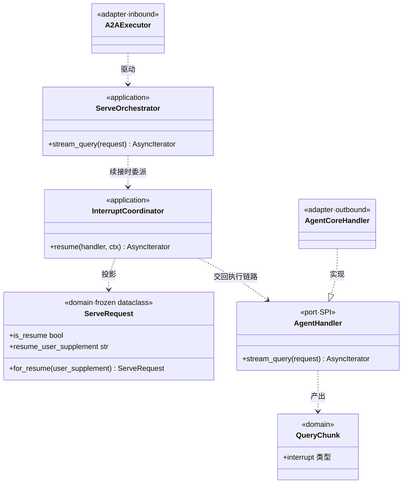
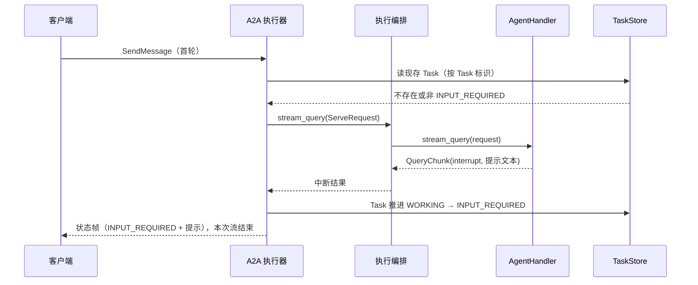
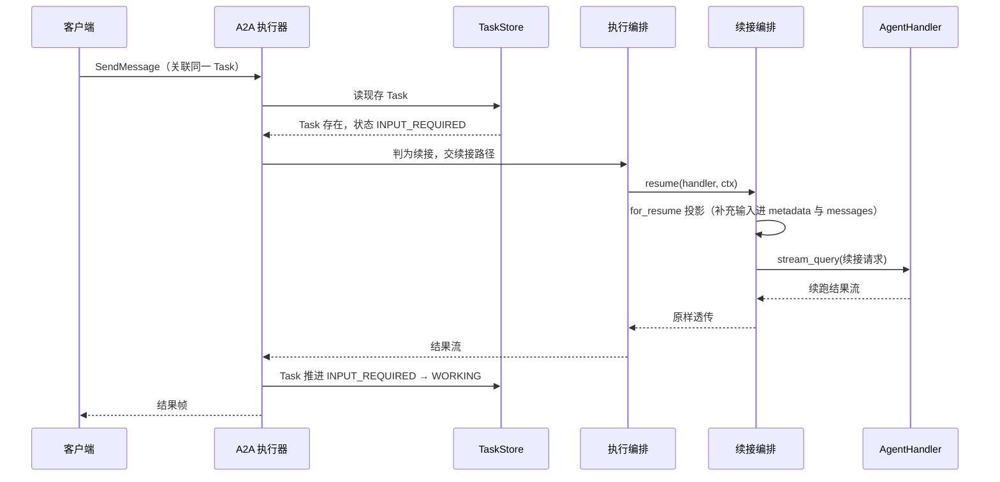
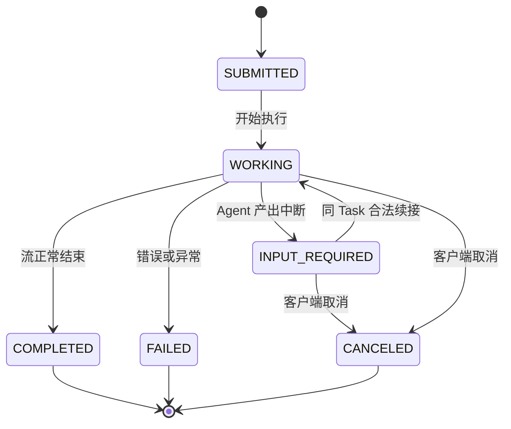
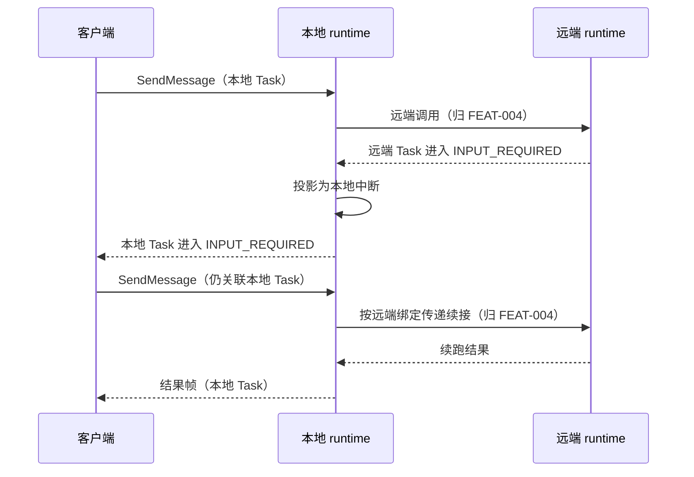
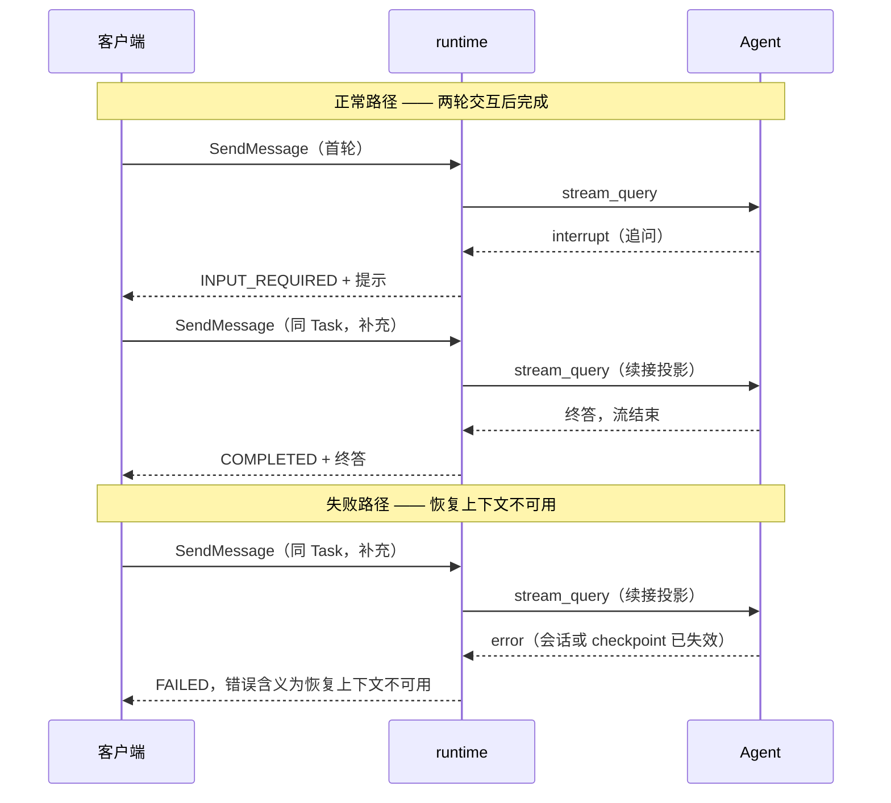

# L2-Func-008b 运行时用户交互式任务中断与请求响应 · Python 详细设计

## 1. 概述

### 1.1 特性定位

**角色**：本特性定义 runtime 观察到「交互式中断」后的 Task 状态推进、客户端可见行为与续接语义——即 Agent 执行到一半需要客户端补充输入时，runtime 怎么把这个等待点暴露出去，以及客户端回话后怎么把执行接回去。

**解决的问题**：Agent 执行过程中可能需要客户端参与（补充材料、确认授权、回答追问）。现状是客户端必须理解具体 Agent 框架的中断表示、checkpoint 结构或远端 runtime 细节才能续接；目标是客户端只面对标准 A2A 表面——观察 Task 进入 `INPUT_REQUIRED`，用同一个 Task 发一条标准 `SendMessage` 就能续接，框架细节一概不外露。

**适用场景**：Agent 需要客户端侧（人或集成了客户端的业务应用）提供后续输入、决策或材料，且该输入无法由 Agent 自行推导。

**不适用场景**——三类看起来像中断但不是：

| 情形 | 为什么不属本特性 | 应走什么 |
|---|---|---|
| 等待应由上游 Agent 自行处理（如内部重试、自查、换工具） | 上位规格明写这不是交互式中断（`FEAT-008` §1 特性定位末段） | 按任务失败、异常终止或下一轮新任务处理 |
| 端侧工具调用等待客户端执行结果 | 载体虽同为中断，但其请求／结果契约归端侧工具特性 | FEAT-009，本版排除 |
| 远端 Agent 的调用、绑定、重试、取消传播 | 归远端通信特性 | FEAT-004；本特性只要求远端等待点在**本地 Task 表面**呈现为一致的 `INPUT_REQUIRED` |

### 1.2 核心设计原则

**P1 · runtime 不持有等待点存储 — 持久化恢复不属本特性。**
上位规格 §6「对下游设计与实现的约束」明写「不得在 FEAT-008 的名义下承诺 Task 状态缓存、冷热转换、持久化存储、跨实例或重启恢复」，其 §2 能力表「当前实例内恢复」一条把 MUST 的范围限定在「当前 runtime 实例拥有 Task、等待点绑定和恢复上下文的期间」，跨实例与重启明确让渡给任务状态缓存特性。故本特性不新建任何等待点键。

**P2 · 可续接性的判据是 Task 状态，不是独立的等待点记录。**
Task 快照本就由任务状态缓存特性持久化（`L2-Func-003b` 承接），其状态字段 `INPUT_REQUIRED` 已经完整表达「这个 Task 在等客户端」。再建一份等待点记录，等于把同一事实存两处——两处必然漂移，而漂移时无法判定谁是真的。

**P3 · 锚点的语义归 `AgentHandler`，runtime 不解释它。**
runtime 不理解框架的 checkpoint 结构与续跑点语义，故锚点在 runtime 侧是**不透明字符串**：原样存、原样取、零解释。**但 runtime 必须持有它**——上位规格 §2 能力表「当前实例内恢复」明写「在当前 runtime 实例**拥有 Task、等待点绑定和恢复上下文**的期间，合法续接消息必须能够恢复到正确执行链路」；同表「标准服务入口复用」与「同 Task 续接」两条合起来又排除了「要求客户端携带锚点」这一形态（要求携带即为收紧请求格式，而不带锚点的同 Task 消息仍必须被视为续接）。

上位规格 §3.2 把「runtime 如何恢复 handler 执行」划给 FEAT-002，那是**范围归属、不是能力禁令**——它回答的是这件事由哪个特性定义，不是 runtime 不得实现它。落地形态见 `L2-Func-002b-local-framework-adaptation.md` §13.1 的 O2，本特性遵从该形态。

**P4 · 单等待点推进一次靠 Task 状态机守卫，不靠领取键。**
上位规格 §2 能力表「单等待点推进」的前置是「在 FEAT-001 入口、任务状态缓存和远端编排的既有幂等机制排除重复提交后」——即该保证建立在既有机制之上，本特性不新建幂等设施。落地形态是状态机转移守卫：`INPUT_REQUIRED` 的合法后继只有 `WORKING` 与终态，第一条续接消息推进后 Task 已不在 `INPUT_REQUIRED`，第二条按其到达时的状态由对应特性处理。

**P5 · 业务语义判断不进 runtime。**
上位规格 §5.3 明写 runtime 不应校验「文本是否回答了问题」「审批是否通过业务规则」。runtime 只判协议合法性、Task 可达性与状态可续接性三件事实。

### 1.3 子特性全景

| 子特性 | 职责 | 关键抽象 | 状态 |
|---|---|---|---|
| 本地交互式中断建立 | 把 handler 归一出的中断结果推进为 Task `INPUT_REQUIRED`，并经标准表面暴露提示 | `QueryChunk`（`interrupt` 类型） | 已实现 |
| 同 Task 续接 | 把同一 Task 的合法 A2A 消息投影为续接请求，重走 `stream_query` | `ServeRequest.for_resume` | 已实现 |
| 多轮交互 | 同一 Task 顺序发生多轮 `WORKING → INPUT_REQUIRED → WORKING` | Task 状态机 | 已实现 |
| 远端中断投影 | 远端 Task 的 `INPUT_REQUIRED` 投影到本地 Task | 远端中断轨（FEAT-004 承接） | 部分实现（投影链路已通；废弃件与验证缺口见 §13） |
| 等待期间查询与订阅 | `GetTask` 与订阅在挂起期间可观察 | FEAT-001 标准表面 | 已实现 |
| 失败语义 | 五类运行时失败映射为可区分的错误 | 错误码表（§8） | 部分实现（错误码收敛见 §13） |

### 1.4 术语与命名对齐

| 名称 | 三方一致性 | 说明 |
|---|---|---|
| `INPUT_REQUIRED` | 上位规格、A2A 协议、上游实现三方同名 | Task 状态值，非终态 |
| `ServeRequest` | 权威领域对象；上位设计 L1 逻辑视图与上游 `spec/dto/ServeRequest` 同名 | 框架中立执行输入，权威 7 字段 |
| `QueryChunk` | 权威领域对象，三方同名 | 归一执行结果；中断经其 `interrupt` 类型表达 |
| `AgentHandler` | 权威 SPI，三方同名 | 执行入口 `stream_query` |

**本地化命名**：`stream_query` 对应上游 `streamQuery`，`for_resume` 对应上游续接请求构造。仅命名风格转换（驼峰转下划线），语义一一对应。

**不新造名字**：本特性不引入「等待点实体」「恢复凭据」一类新领域对象——上位规格 §6 明禁在本特性名义下新增 SPI 与存储接口，而新造领域对象是新增存储接口的前置动作。

---

## 2. 功能规格

### 2.1 能力清单

逐条对准上位规格 §2 能力表。「事实要求」是外部可观察行为。

| 能力 | 级别 | 事实要求 | 状态 |
|---|---|---|---|
| 本地交互式中断处理 | MUST | handler 产出中断结果后，同一 Task 的 `GetTask` 返回 `INPUT_REQUIRED`，且状态消息中含 Agent 给出的提示文本 | 已实现 |
| 远端交互式中断投影 | MUST | 远端 Task 进入 `INPUT_REQUIRED` 时，**本地** Task 的 `GetTask` 同样返回 `INPUT_REQUIRED`；客户端不接触远端 Task 标识 | 部分实现（见 §13） |
| 标准服务入口复用 | MUST | 续接使用 `SendMessage`，请求格式与首轮完全一致——不新增字段、不新增 method、不收紧校验 | 已实现 |
| 同 Task 续接 | MUST | Task 处于 `INPUT_REQUIRED` 时，同一 Task 的合法消息使 Task 离开 `INPUT_REQUIRED` 并恢复执行；runtime 不因内容「不像回答」而拒绝 | 已实现 |
| 非同 Task 隔离 | MUST | 不关联该 Task 的消息不影响其状态；旧 Task 仍停在 `INPUT_REQUIRED` | 已实现 |
| 业务语义归属智能体 | MUST | 续接内容是否满足期待由 Agent 判断；Agent 可继续、可再次中断、可失败 | 已实现 |
| 单等待点推进 | MUST | 同一次 `INPUT_REQUIRED` 只被一条合法续接推进一次；后续消息按到达时的 Task 状态处理 | 已实现 |
| 多轮交互 | MUST | 同一 Task 顺序支持多轮 `WORKING → INPUT_REQUIRED → WORKING` | 已实现 |
| 长时挂起 | MUST | `INPUT_REQUIRED` 是非终态；本特性不设交互等待超时、不定义自动过期失败 | 已实现 |
| 等待期间查询与订阅 | MUST | 挂起期间 `GetTask` 可观察当前状态与后续变化 | 已实现 |
| 当前实例内恢复 | MUST | 当前实例拥有 Task 与恢复上下文期间，合法续接恢复到正确执行链路 | 已实现 |
| 明确运行时失败 | MUST | 五类运行时事实映射为可程序化区分的错误（§8） | 部分实现（见 §13） |
| 可观测与审计 | SHOULD | 记录中断建立、状态变化、续接、恢复、再次中断、取消与失败（§9.1） | 部分实现（见 §13） |

### 2.2 显式排除

| 排除项 | 原因 | 替代方案 |
|---|---|---|
| 新增 A2A endpoint、method、专用响应 DataPart、表单 schema、审批协议 | 上位规格 §6 明禁在本特性名义下新增客户端可见 wire 契约 | 需要时先进入 FEAT-001 或新服务入口特性 |
| 新增或修改 `AgentHandler`、`QueryChunk`、adapter 续接输入等 SPI | 上位规格 §6 明禁；SPI 归 FEAT-002 | 续接复用 `ServeRequest` 投影，重走 `stream_query` |
| 等待点持久化、跨实例恢复、重启恢复 | 上位规格 §6 明禁在本特性名义下承诺持久化存储 | 归任务状态缓存特性（`L2-Func-003b`）；Task 快照本就持久化 |
| 交互等待 TTL 与自动过期失败 | 上位规格 §5.4 明写不设 TTL、不定义自动过期 | Task 快照的统一过期时间归任务状态缓存特性，非本特性的等待超时 |
| 远端 Task 绑定、远端续接、重试、幂等、取消传播 | 上位规格 §6 明禁在本特性名义下重定义 | 归 FEAT-004 |
| 业务语义校验（回答是否正确、审批是否通过、授权是否有效） | 上位规格 §5.3 划归智能体 | Agent 判断后再次中断、失败或继续 |
| 端侧工具的请求与结果契约 | 归 FEAT-009，本版排除 | 本版不交付 |

### 2.3 接口契约

#### 2.3.1 API / SPI 声明

**本特性不拥有独立 API 或 SPI 定义权**（上位规格 §3 首句）。以下是本特性**引用**的既有契约，以及本特性在 application 层的编排方法。

**引用的既有入口**（归 FEAT-001，本特性不改）：

| 入口 | 本特性的使用语义 |
|---|---|
| `SendMessage` | Task 处于 `INPUT_REQUIRED` 且请求关联同一 Task／context 时，该消息即续接输入 |
| `SendStreamingMessage` | 执行进入 `INPUT_REQUIRED` 时按中断流语义推送状态并结束本次发送流 |
| `GetTask` | 返回当前状态；`INPUT_REQUIRED` 时可观察等待状态与提示 |

**引用的既有 SPI**（归 FEAT-002，本特性不改）：

```python
def stream_query(self, request: ServeRequest) -> AsyncIterator[QueryChunk]:
    """执行一次 Agent 调用，产出归一结果流。

    参数 request：框架中立执行输入。当 `request.is_resume` 为真时，本次是续接调用——
        实现者须从 `request.resume_user_supplement` 取客户端补充输入。锚点绑定型中断另从
        `request.resume_recovery_point_id` 取锚点——**该值由 runtime 从 Task 找回并传入**，
        不要求客户端携带；为空时按非绑定形态处理，用自身会话与 checkpoint 定位续跑点。
    返回：`QueryChunk` 异步迭代器。需要客户端参与时产出 `interrupt` 类型的 chunk，
        随后结束本次流；不得阻塞等待客户端。

    实现者必须保证：
      - 收到续接请求时不重新执行已完成的步骤（幂等由框架的 checkpoint 承担）；
      - 中断 chunk 携带给客户端的提示文本；
      - 判定续接输入不满足业务期待时，产出新的中断、失败结果或继续执行，
        **不得**要求 runtime 代为拒绝。
    """
```

**本特性在 application 层的编排方法**：

```python
async def resume(
    self, handler: AgentHandler, ctx: ServeRequest
) -> AsyncIterator[QueryChunk]:
    """把一条同 Task 的合法消息投影为续接请求，交回执行链路。

    参数 handler：目标 Agent 的执行入口。
    参数 ctx：去协议化后的当前请求。其最后一条消息的内容即客户端补充输入。
    返回：handler 续跑产出的归一结果流，原样透传。

    实现者必须保证：
      - 不读写任何等待点存储——可续接性已由调用方按 Task 状态判定；
      - 不校验补充输入的业务语义；
      - 投影只经 `ServeRequest.for_resume`，不新增 SPI 方法。
    """
```

#### 2.3.2 数据类型

本特性不新增领域类型。下表是本特性**使用**的既有类型中与续接相关的字段。

| 类型 | 关键字段 | 含义 | 约束 |
|---|---|---|---|
| `ServeRequest` | `metadata["_resume"]` | 续接标记，值为含补充输入的映射 | 可空（空=首轮调用）；由 application 层的续接投影填充；缺失时 adapter 走首轮路径 |
| `ServeRequest` | `metadata["_resume"]["user_supplement"]` | 客户端本轮补充的文本 | 可为空串（客户端可提交空内容，runtime 不拒绝——业务判断归 Agent）；由续接投影从最后一条消息取；缺失时按空串处理 |
| `ServeRequest` | `messages` | 消息序列；续接时在末尾追加一条 `{role: "user", content: 补充输入}` | 非空补充输入才追加——空串追加会在会话里留下空轮次；由续接投影填充 |
| `QueryChunk` | `interrupt` 类型 | Agent 需要客户端参与的归一表达 | 由 handler／adapter 填充；runtime 只识别类型、不解释载荷 |
| `Task` | `status.state` | Task 状态；`INPUT_REQUIRED` 表示等待客户端 | 由 A2A 协议库按状态机推进；本特性不直写 |

**`recovery_point_id` 的归属**：该字段是框架续跑锚点（交互标识或 checkpoint 键）。本特性**不产生、不解释**它——它由 adapter 在 `stream_query` 内部与框架交互时产生，runtime 侧只当作不透明字符串。

**但本特性自持并找回它**：中断建立时随状态消息的 metadata 落在 Task 上（键 `_interrupt`），续接时从 Task 找回——先看当前状态消息、再从历史倒序找最近一条智能体消息。**客户端携带的同名键不采信**：两条查找路径各有角色校验，非智能体角色一律视为无锚点。依据与形态见 `L2-Func-002b-local-framework-adaptation.md` §13.1 的 O2；对标同键名同结构。

锚点缺失时降级为非绑定续接、不抛出——非绑定型中断本就没有锚点。续接投影的该参数同时服务于 FEAT-004 的批次回灌。

#### 2.3.3 行为承诺

**必须**：

- Task 处于 `INPUT_REQUIRED` 时，同一 Task 的合法 A2A 消息必须被当作续接输入交回执行链路。
- 续接后 Task 必须离开 `INPUT_REQUIRED`；Agent 再次中断时必须重新进入 `INPUT_REQUIRED`。
- 不关联该 Task 的消息必须不影响其状态。
- 五类运行时失败必须映射为可程序化区分的错误（§8）。
- 挂起期间 `GetTask` 必须可观察。

**禁止**：

- 禁止因续接内容的业务语义拒绝续接。
- 禁止新增客户端可见的 wire 契约（端点、method、Part 类型、表单结构）。
- 禁止新增或修改 `AgentHandler`、`QueryChunk`、adapter 续接输入等 SPI。
- 禁止建立等待点存储、承诺跨实例或重启恢复。
- 禁止为交互等待设置超时或自动过期失败。

**允许**：

- 允许实现者在 adapter 内部使用框架原生的中断与续跑机制（如交互标识、checkpoint 键）——这是框架细节，不构成对外契约。
- 允许同一 Task 发生任意多轮中断—续接。
- 允许客户端提交空内容或与提示无关的内容作为续接输入——是否有效由 Agent 判断。
- 允许挂起期间对该 Task 取消；取消后按终态处理后续续接。
- 允许 Task 快照按任务状态缓存特性的统一过期时间回收；该回收不是本特性的等待超时（区别见 §9.3）。

#### 2.3.4 消息队列声明

**本特性不涉及消息队列。** 上位规格全篇零处提及总线、消息队列或事件订阅；续接入口是标准 A2A `SendMessage`（上位规格 §5.2 首条），是同步请求而非异步投递。总线事件订阅属另一特性，且本版排除。

---

## 3. 模块结构

### 3.1 包结构

```
agent_runtime/
  domain/
    context.py                 ServeRequest：续接投影 for_resume 与 is_resume 等只读派生
  application/
    interrupt.py               InterruptCoordinator：续接编排（投影 + 交回执行链路）
    serve.py                   ServeOrchestrator：执行编排，识别中断结果并驱动状态推进
  adapters/inbound/a2a/
    executor.py                A2A 执行器：中断结果推进 Task 至 INPUT_REQUIRED；续接路由
    protocol_adapter.py        去协议化：A2A 消息转 ServeRequest
  adapters/outbound/agentcore/
    handler.py                 agent-core adapter：识别续接标记，译为框架原生续接输入
  ports/
    handler.py                 AgentHandler SPI 声明（归 FEAT-002，本特性只引用）
```

不列无关文件。本特性**不新增文件**——所有职责落在既有模块上。

### 3.2 类图与静态关系



模式标注：`AgentHandler` 是**端口**（SPI），`AgentCoreHandler` 是其**适配器实现**；`InterruptCoordinator` 与 `ServeOrchestrator` 是 application 层编排，不含框架类型；`ServeRequest` 与 `QueryChunk` 是 domain 层不可变数据类。

### 3.3 依赖方向与禁止依赖

**可以依赖**（一律向内）：

- adapters → application → domain／ports
- application → domain、ports
- domain → 无（最内层，只依赖标准库）

**绝对不能依赖**：

| 禁止 | 具体 |
|---|---|
| domain 与 application 引入协议对象 | `a2a.types.a2a_pb2` 的 `Task`／`Message`／`TaskStatus` 等一律不得出现在 `domain/` 与 `application/` |
| domain 与 application 引入框架对象 | agent-core 的 `InteractiveInput`、checkpoint 类型等只能出现在 outbound adapter 内 |
| domain 依赖 ports 之外的任何外部设施 | 存储客户端、事件循环调度设施不得进入 domain |
| 内层通过裸 `Any` 绕过分层 | 用 `Any` 承接外层类型等于把依赖边删掉，图分析看不见 |

**违反了会怎样**：

- 前两类有 import 边，**构建期分层守门可判**（`openJiuwen/agent-runtime-mvp/tools/arch_guard.py` 的 import 规则）。
- 第三类同上。
- 第四类**图分析看不见**——`arch_guard` 另有裸 `Any` 规则与字面量下沉规则兜住；这两条规则不可裁撤，撤掉后违规会向这两个方向迁移。

---

## 4. 核心设计

### 4.1 本地交互式中断的建立

#### 4.1.1 关键处理流程



**分支条件**：

| 条件 | 路径 |
|---|---|
| handler 产出 `interrupt` 类型 chunk | Task 推进 `INPUT_REQUIRED`，结束本次流 |
| handler 流正常结束且未产出终态 chunk | Task 推进 `COMPLETED`——完成的判据是流正常结束，归一契约无独立的完成帧类型 |
| handler 产出 `error` 类型 chunk | Task 推进 `FAILED` |
| handler 抛出异常 | Task 推进 `FAILED`，错误含义为执行失败 |

**边界条件**：

| 边界 | 处理 |
|---|---|
| 空输入（客户端消息无文本内容） | 照常交给 handler——业务判断归 Agent（原则 P5）；runtime 不拦 |
| 中断 chunk 无提示文本 | 照常推进 `INPUT_REQUIRED`，状态消息为空。提示文本是 Agent 的职责，缺失不构成 runtime 失败 |
| 流式发送期间客户端断开 | 不改变 Task 状态推进——状态由服务端权威推进，与订阅者是否在线无关 |
| 关停宽限期内进入中断 | 中断照常落盘；关停排水等待在途执行收束（归 FEAT-000 生命周期） |
| 同一 Task 并发到达两条首轮消息 | 由 A2A 协议库的单写者约束串行化，见 §4.1.2 |

**状态转换**：

| 当前状态 | 事件 | 下一状态 | 附加行为 |
|---|---|---|---|
| `SUBMITTED` | handler 开始执行 | `WORKING` | — |
| `WORKING` | handler 产出中断 | `INPUT_REQUIRED` | 状态消息带提示文本；结束本次发送流 |
| `WORKING` | handler 流正常结束 | `COMPLETED` | 终答上线 |
| `WORKING` | handler 产出错误或抛异常 | `FAILED` | 错误信息上线 |
| 任一非终态 | 客户端取消 | `CANCELED` | 当前等待点失效 |

#### 4.1.2 并发与协程安全边界

**单写者假设**：Task 快照的写入者在同一时刻只有一个——由 A2A 协议库的单写者约束（同一 Task 的请求处理串行）加部署侧的实例亲和（同一会话／Task 的请求路由到同一副本）共同保证。runtime 侧**不做比较并写入**，对齐上游实现；理由是 Task 载体是整值序列化的，在其上做比较并写入既不正确（整值比较会把无关字段的差异算作冲突）又只覆盖 runtime 一层。

**可并发调用**：不同 Task 的执行完全并发——`ServeRequest` 每请求独立、不共享可变状态。

**不可并发**：同一 Task 的状态推进。破坏实例亲和（如负载均衡未按会话粘滞）时该假设失效。

**竞态窗口**：实例亲和失效时，两个副本可能同时推进同一 Task 的状态，后写者覆盖先写者。**这是已知接受的残余风险**——消除它需要跨副本的比较并写入或租约，而两者都被上位设计排除（不做比较并写入、不建租约）。缓解手段是部署侧的实例亲和，它是宿主义务而非 runtime 能力。

#### 4.1.3 幂等键与重试语义

本子特性涉及的标识分三类，**语义各不相同，不得混用**：

| 标识 | 类别 | 幂等语义 |
|---|---|---|
| Task 标识 | 业务创建幂等键 | 同一 Task 标识的多次请求指向同一 Task；创建由 FEAT-001 入口按 A2A 语义判定 |
| context 标识（会话） | 调用关联标识 | 关联同一会话的多个 Task；**不承担去重**——同一 context 下可以有多个并存 Task |
| 框架侧的交互标识／checkpoint 键 | 框架内部锚点 | **语义**归 adapter 与框架：runtime 不产生、不解释其内容。**承载**归 runtime：随状态消息 metadata 落在 Task 上、续接时找回（P3、§2.3.2） |

**重复到达的行为**：同一 Task 的重复首轮消息由 FEAT-001 入口按 A2A 语义处理（复用既有 Task 而非新建）。本特性不新建去重设施——上位规格 §2「单等待点推进」明写该保证建立在既有幂等机制之上。

**重试策略**：本子特性不发起重试。handler 执行失败即映射为 `FAILED`，是否重试由客户端决定。重试不改变对外可观察状态——重试是一次新的 `SendMessage`，按其到达时的 Task 状态处理。

---

### 4.2 同 Task 续接

#### 4.2.1 关键处理流程



**关键点**：可续接性的判据是**现存 Task 的状态**，不是任何独立的等待点记录。runtime 在整条续接路径上**不读写任何等待点存储**——这落实原则 P1 与 P2，也与上游实现一致（其续接入口对客户端交互续接直接返回当前请求，不查存储）。

**分支条件**：

| 现存 Task 状态 | 路径 |
|---|---|
| `INPUT_REQUIRED` | 判为续接，走续接投影 |
| `WORKING` | 非续接。按 FEAT-001 对该状态的消息处理语义执行 |
| 终态（`COMPLETED`／`FAILED`／`CANCELED`／`REJECTED`） | 非续接。按终态 Task 的消息处理语义执行（§8 状态冲突） |
| Task 不存在 | 按 FEAT-001 创建新 Task，走首轮路径 |

**边界条件**：

| 边界 | 处理 |
|---|---|
| 续接内容为空串 | 照常交给 handler；`messages` **不追加**空轮次，`user_supplement` 为空串。是否有效由 Agent 判断 |
| 续接内容与提示无关 | 照常交给 handler——禁止业务语义拒绝（原则 P5） |
| 续接期间 handler 再次中断 | Task 重新推进 `INPUT_REQUIRED`，进入下一轮（§4.3） |
| 续接期间 Task 被取消 | 取消推进 `CANCELED`；在途续跑由关停排水或取消传播收束 |
| 两条续接消息并发到达 | 由单写者约束串行；第二条到达时 Task 已离开 `INPUT_REQUIRED`，落入上表的 `WORKING` 或终态分支 |
| 恢复上下文不可用（框架侧会话或 checkpoint 已失效） | handler 产出错误结果，映射为「恢复上下文不可用」（§8） |

**状态转换**：

| 当前状态 | 事件 | 下一状态 | 附加行为 |
|---|---|---|---|
| `INPUT_REQUIRED` | 同 Task 合法续接消息 | `WORKING` | 补充输入投影进续接请求，交回执行链路 |
| `INPUT_REQUIRED` | 非同 Task 消息 | `INPUT_REQUIRED`（不变） | 新消息按 FEAT-001 创建或推进另一 Task |
| `INPUT_REQUIRED` | 客户端取消 | `CANCELED` | 等待点失效；后续续接按终态处理 |
| `WORKING`（续接后） | handler 再次中断 | `INPUT_REQUIRED` | 进入下一轮 |

#### 4.2.2 并发与协程安全边界

**单写者假设**：同 §4.1.2——Task 状态的推进由协议库单写者加实例亲和保证。续接编排自身**无可变状态**：它不持有等待点缓存、不维护实例内注册表，每次调用只做一次纯投影再委派。故它没有需要保护的临界区。

**可并发调用**：不同 Task 的续接完全并发。

**不可并发**：同一 Task 的续接——但这不需要续接编排自己加锁，串行化由上游的单写者约束提供。

**竞态窗口**：同一 Task 的两条续接消息在**实例亲和失效**时可能分落两个副本，各自读到 `INPUT_REQUIRED` 后都判为续接，导致 handler 被续跑两次。**这是已知接受的残余风险**，与 §4.1.2 同源同因（都源自不做比较并写入的裁定），缓解手段同为部署侧实例亲和。

**为什么不用删除领取键消除它**：删除领取键（写一个键、删除即领取）看似能挡住第二条，实际不能——它自身在跨副本下同样存在读—删之间的窗口，除非配合原子条件写入；而那等于在 runtime 侧重建一套被上位设计排除的并发设施，且只覆盖 runtime 一层（框架侧的续跑仍可能重入）。用一层挡不住的机制换取「已经防住了」的错觉，比明确登记残余风险更危险。

#### 4.2.3 幂等键与重试语义

**「单等待点推进一次」的落地机制**是 Task 状态机转移守卫，不是去重键：

- `INPUT_REQUIRED` 的合法后继只有 `WORKING` 与四个终态；
- 第一条合法续接消息把 Task 推进到 `WORKING`；
- 第二条到达时 Task 已不在 `INPUT_REQUIRED`，按其到达时的状态由 FEAT-001 或对应特性处理——这正是上位规格 §5.2 末条写的处置。

标识的三类划分同 §4.1.3。此处补一条：

| 标识 | 类别 | 幂等语义 |
|---|---|---|
| 续接标记 `metadata["_resume"]` | 路径选择标记，**不是幂等键** | 只告诉 adapter「本次是续接」；不参与去重，不得当作续接标识使用 |

**重复到达的行为**：**复用**——第二条续接消息不被拒绝，也不重复推进等待点，而是按当时的 Task 状态走常规路径（多为追加消息或状态冲突）。

**重试策略**：续接编排不发起重试。handler 续跑失败即映射为失败结果；客户端重试是一次新的 `SendMessage`，按到达时的 Task 状态处理。重试**改变**对外可观察状态——Task 可能已从 `INPUT_REQUIRED` 变为 `WORKING` 或终态，客户端须按返回的状态判断，不能假定重试幂等。

---

### 4.3 多轮交互

#### 4.3.1 关键处理流程

多轮是 §4.1 与 §4.2 的顺序重复，不引入新机制。轮次边界由 Agent 决定：每次续跑结束时若再次产出中断 chunk，即开启下一轮。



**分支条件**：每轮续跑结束时——产出中断则回到 `INPUT_REQUIRED`（继续下一轮），正常结束则 `COMPLETED`，出错则 `FAILED`。

**边界条件**：

| 边界 | 处理 |
|---|---|
| 轮次数上限 | **runtime 不设上限**——上位规格未定义轮次约束，设了就是本特性擅自加码。轮次由 Agent 的业务逻辑收敛 |
| 单 Task 快照随轮次累积增长 | 已知限制，登记在数据架构视图；本特性不截断 `messages`——截断会静默丢失会话内容 |
| 某一轮的补充输入为空 | 同 §4.2.1 边界表 |

**状态转换**：见上方状态图；每轮的转移条目与 §4.1、§4.2 的状态表逐条相同，不重复列出。

#### 4.3.2 并发与协程安全边界

同 §4.2.2。多轮不引入新的并发面——每一轮内部都是一次完整的「续接→续跑→状态推进」，轮与轮之间由 Task 状态串行隔开：上一轮未推进到 `INPUT_REQUIRED` 之前，下一轮的续接消息不会被判为续接。

**竞态窗口**：无新增。

#### 4.3.3 幂等键与重试语义

**轮次没有独立标识**——本特性不为「第几轮」引入编号。理由：轮次编号一旦对外可见就成了 wire 契约的一部分，而上位规格 §6 明禁在本特性名义下新增客户端可见结构；对内则无消费方，Task 状态已足以判定当前是否在等待。

**重复到达的行为**与**重试策略**同 §4.2.3。

---

### 4.4 远端中断投影

#### 4.4.1 关键处理流程



**职责边界**：本特性只要求「远端等待点在本地 Task 表面呈现为一致的 `INPUT_REQUIRED`」。远端 Agent 的发现、调用、Task 绑定、续接传递、重试、幂等、取消传播与结果回灌**全部归 FEAT-004**，上位规格 §6 明禁在本特性名义下重定义。

**分支条件**：

| 条件 | 路径 |
|---|---|
| 远端产出需要客户端参与的等待 | 投影为本地 `INPUT_REQUIRED`，客户端面向本地 Task |
| 远端产出的等待应由上游 Agent 自行处理 | 不属交互式中断，按远端调用失败或继续执行处理 |
| 远端续接经受控重试仍失败 | 本地 Task 进入失败表面（归 FEAT-004 的失败语义） |

**边界条件**：

| 边界 | 处理 |
|---|---|
| 客户端不得接触远端 Task 标识 | 远端 Task 标识不出现在本地 Task 的对外表面；影子任务对外隔离（归 FEAT-004 与总体设计的对外兼容锁） |
| 远端不可达 | 归 FEAT-004 的远端不可用语义，不映射为本特性的中断 |
| 本地与远端的生命周期所有权 | 各自拥有各自的 Task；本地取消不自动终止远端 Task（取消传播归 FEAT-004） |

**状态转换**：本地 Task 的转换与 §4.1／§4.2 完全相同——这正是本子特性的目的：**远端来源对客户端不可见**。

#### 4.4.2 并发与协程安全边界

**单写者假设**：本地 Task 的写入者同 §4.1.2。远端 Task 的写入者是远端 runtime，与本地无共享写入面。

**可并发调用**：同一本地 Task 对多个远端的调用可以并发（批次场景，归 FEAT-004）。

**不可并发**：本地 Task 的状态推进——多个远端并发返回中断时，投影必须串行，否则会产生多次 `INPUT_REQUIRED` 推进。批次场景下的屏障与单次回灌由 FEAT-004 的批次协调承担。

**竞态窗口**：远端返回中断与本地取消同时发生时，二者的先后由单写者串行决定；后到者按状态机守卫被拒（终态不可再转移）。这是**确定性行为**，不是残余风险。

#### 4.4.3 幂等键与重试语义

| 标识 | 类别 | 幂等语义 |
|---|---|---|
| 远端 Task 绑定 | 调用关联标识 | 归 FEAT-004；本特性不产生、不解释 |
| 本地 Task 标识 | 业务创建幂等键 | 同 §4.1.3 |

**重复到达的行为**：远端重复投递同一中断时，第二次到达时本地 Task 已在 `INPUT_REQUIRED`，状态机守卫使其成为无效转移（`INPUT_REQUIRED → INPUT_REQUIRED` 不在合法后继集内），不产生重复的对外状态帧。

**重试策略**：远端续接的重试与退避归 FEAT-004。重试**不改变**本地 Task 的对外可观察状态——重试期间本地 Task 保持 `INPUT_REQUIRED`；只有重试彻底失败才推进失败表面。

---

## 5. 数据设计

**本特性不新建任何键。** 这不是「不涉及」，而是一条经查证的设计结论——上位规格 §6 明禁在本特性名义下承诺持久化存储、跨实例或重启恢复；上游实现的续接入口对客户端交互续接直接把当前请求交回执行链路，不查任何存储；我方总体设计的领域对象归属表把「等待点与等待截止」判为不建，恢复责任归 `AgentHandler` 自身的会话与 checkpoint。三方一致。

### 5.1 本特性使用的键

| 键 | 键格式 | 值格式 | 写入方 | 归属 |
|---|---|---|---|---|
| Task 快照 | `a2a:task:<Task 标识>` | Task 的 protobuf 序列化字节 | A2A 协议库经 TaskStore | **任务状态缓存特性**（`L2-Func-003b`），非本特性 |

本特性**读**这个键（判定可续接性），**不写**它——Task 状态的推进由协议库按状态机执行。

### 5.2 过期时间与续期

Task 快照的过期时间归任务状态缓存特性：统一 604800 秒（7 天），所有状态无例外，续期由写入驱动（每次状态推进重置）。

**这不是本特性的等待超时。** 二者的区别必须写清，否则会被误读为「本特性设了 7 天的交互等待上限」：

| | 本特性不设的「交互等待 TTL」 | 任务状态缓存的统一过期时间 |
|---|---|---|
| 语义 | 等待超时后主动判定失败 | 快照的存活期 |
| 到期行为 | 会推进一个失败终态 | 键消失，`GetTask` 返回不存在 |
| 归属 | 上位规格 §5.4 明写不设 | 任务状态缓存特性 |
| 续期 | 不适用 | 每次写入重置 |

**长时挂起的实际可恢复窗口**因此是 604800 秒（自最后一次状态写入起算），相对存量的会话存活期默认 1800 秒是超集。上位规格 §5.4 说「长时等待可以持续十天、半个月或更久；其可恢复性取决于任务状态缓存、持久化、冷热转换、框架 checkpoint 和部署治理能力」——即窗口长度本就是由任务状态缓存与部署治理决定的量，不由本特性承诺。需要更长窗口时调整任务状态缓存的配置，不改本特性。

### 5.3 写序要求

**本特性不产生多键写入，无写序约束。** 单次续接只触发一次 Task 状态写入（由协议库执行）。

### 5.4 清理责任

Task 快照的清理由 Redis 服务端的过期机制承接；runtime 侧无清扫器、无周期任务。本特性不产生需要清理的数据。

### 5.5 与全局数据架构的关系

本节是数据架构视图的切片，与之一致：统一过期时间无例外键、runtime 侧不设主动清扫、内存淘汰策略归部署方。本特性不引入例外，故不构成对全局的偏离。

---

## 6. 配置模型

### 6.1 完整配置示例

```yaml
# 本特性零配置项。以下是本特性行为**实际受其影响**的既有配置，
# 列在此处是为了让读者知道该去哪里调——不是本特性新增的配置块。

cache:
  # Task 快照的统一过期时间，决定长时挂起的实际可恢复窗口（§5.2）。
  # 归任务状态缓存特性；本特性不定义、不覆盖。
  ttl_s: 604800
```

### 6.2 配置属性表

| 属性路径 | 类型 | 默认值 | 必填 | 说明 |
|---|---|---|---|---|
| （本特性无自有配置项） | — | — | — | 见下方理由 |

**为什么零配置**：本特性可配置的候选只有两个——交互等待超时与等待点存储位置。前者被上位规格 §5.4 明确排除（不设 TTL、不定义自动过期），后者被 §6 明确排除（不承诺持久化存储）。两个候选都被排除后，本特性没有剩余的可配置面。

**引用配置的默认值理由**：`cache.ttl_s` 默认 604800 秒取自任务状态缓存特性，其理由（对齐上游同名默认值、对存量 1800 秒是超集）记在该特性的详设与数据架构视图，本篇不重复。

### 6.3 配置对象

本特性不引入配置类。加载与校验时机、非法值的失败行为均随其所属特性——`cache.ttl_s` 在装配期解析，非法值在装配期即失败（不到首次使用才暴露）。

---

## 7. 对外呈现与用户场景

### 7.1 外部接口

用户视角只有三个既有入口，本特性不新增：

| 入口 | 用户看到什么 |
|---|---|
| `POST /a2a`（`SendMessage`） | 首轮提问与后续续接用同一个入口、同一种请求格式 |
| `POST /a2a`（`SendStreamingMessage`） | 流式过程中收到状态帧，Task 进入等待时本次流结束 |
| `POST /a2a`（`GetTask`） | 查询当前状态；等待中返回 `INPUT_REQUIRED` 与提示 |

### 7.2 可运行示例

**前置条件**：部署级端到端探针 `openJiuwen/agent-runtime-mvp/deploy-e2e/run-questioner-llm.sh` 的场景——一个会向用户追问的 Agent，容器内真实 socket、真实协议库。

**第一轮**：客户端提交任务，Agent 判断信息不足，产生中断。

- 客户端发送：`SendMessage`，文本内容为一次需要补充信息的请求。
- 服务端返回：Task 状态 `INPUT_REQUIRED`，状态消息含 Agent 的追问文本。
- 客户端可观察：`GetTask` 返回同一 Task 标识、状态 `INPUT_REQUIRED`。

**第二轮**：客户端补充信息，Agent 续跑至完成。

- 客户端发送：`SendMessage`，**关联同一 Task 标识**，文本内容为补充信息。
- 服务端返回：Task 状态推进 `WORKING`，随后产出终答并推进 `COMPLETED`。
- 客户端可观察：`GetTask` 返回 `COMPLETED` 与终答。

**字段值来源**：本示例的字段与状态取值来自上述探针脚本的实际断言，未编造。该探针依赖外部模型服务，不在常规门禁中运行（见 §12.3）。

### 7.3 端到端流程



---

## 8. 错误处理

| 错误场景 | 触发条件 | 系统行为 | 对外结果 |
|---|---|---|---|
| Task 不存在或不可访问 | 续接消息关联的 Task 标识在存储中不存在（从未创建，或快照已过期回收） | 不进入执行链路；按 FEAT-001 的访问与错误表面处理 | 标准错误，含义为 Task 不存在。**与「存在但不可续接」可程序化区分** |
| Task 不处于可续接状态 | 现存 Task 状态为 `WORKING` 或终态 | 不判为续接；按 FEAT-001 对该状态的消息处理语义执行 | 状态冲突，或按该状态的追加语义处理——取决于 FEAT-001 的定义，本特性不覆盖 |
| 请求不符合标准入口格式 | 请求体不是合法 JSON-RPC，或结构不匹配 | 在协议层拦截，不进入本特性 | 协议层标准错误码（非法 JSON、结构不匹配、方法不存在），归 FEAT-001 |
| 恢复上下文不可用 | handler 续跑时发现自身会话或 checkpoint 已失效 | Task 推进失败表面 | 标准失败，错误含义为**恢复上下文不可用** |
| 本地执行恢复失败 | handler 续跑过程中抛出异常或产出错误结果 | Task 推进失败表面 | 标准失败，错误含义为**恢复执行失败**。与上一条区分：上一条是「接不上」，本条是「接上了但跑挂了」 |
| 远端续接失败 | 远端经受控重试仍无法续接 | 按 FEAT-004 的远端调用失败语义回灌本地 Task | 标准失败，错误含义为远端调用失败 |

**错误码的可区分性**：上表六类必须能被调用方程序化判别，不能只靠文案。前三类由 FEAT-001 的错误表面承担（已实测的协议层错误码）；后三类由归一结果的错误码字段承担。**当前实现的错误码收敛程度不足以完全区分后三类**，登记在 §13。

**不构成错误的情形**——以下都必须正常放行，登记在此是因为它们看起来像该报错：

- 续接内容与提示无关或为空：业务判断归 Agent（原则 P5）。
- 同一 Task 的第二条续接消息：按到达时的状态处理，不是错误。
- 挂起超过任何时长：本特性不设等待超时。

---

## 9. DFX 设计

### 9.1 可观测性埋点

| 埋点 | 时机 | 关联字段 |
|---|---|---|
| 中断建立 | Task 推进 `INPUT_REQUIRED` | 租户、调用方、用户、Task 标识、context 标识、请求标识、追踪标识、本轮耗时 |
| 状态变化 | 每次 Task 状态推进 | 同上，另加前后状态 |
| 客户端续接 | 判为续接、进入执行链路前 | 同上，另加轮次序号（仅日志内，不对外） |
| 恢复开始／恢复结果 | 交回 handler 时／handler 流结束时 | 同上，另加结果类型（完成／再次中断／失败） |
| 再次中断 | 续跑后再次产出中断 | 同上 |
| 取消 | Task 推进 `CANCELED` | 同上 |
| 失败 | Task 推进 `FAILED` | 同上，另加错误含义 |

**禁止入日志**：

- 客户端补充输入的**原始内容**——它可能是审批意见、授权材料、个人信息。日志只记「有无补充输入」与长度，不记内容。
- Agent 的提示文本原文——同理，可能含业务敏感的追问内容。
- 凭据、密钥、令牌。
- 严格安全态势下，原始提示词与工具输入输出不得作为追踪属性记录。

具体脱敏规则遵从轨迹与可观测特性（DFX-001），本特性不自定义脱敏策略。

### 9.2 可靠性

| 故障场景 | 确定性行为 |
|---|---|
| Redis 不可用（读 Task 快照失败） | 有界重试后快速失败，不降级、不伪造状态。**不返回「Task 不存在」**——那会让客户端误以为任务已消失而重新发起，实际上任务还在 |
| handler 续跑中抛异常 | Task 推进失败表面，错误含义为恢复执行失败；不重试（重试语义归客户端） |
| 远端不可达 | 归 FEAT-004；本地 Task 保持当前状态直至远端失败语义回灌 |
| 进程重启 | 进行中的执行丢失。Task 快照仍在，客户端可查询到 `INPUT_REQUIRED`；能否续跑取决于 handler 的会话与 checkpoint 是否跨重启存活——**这不是本特性的承诺**（上位规格 §2 把 MUST 限定在当前实例内） |

**「不做什么」的性质标注**：

| 不做的事 | 性质 |
|---|---|
| 不设交互等待超时 | **刻意取舍**——上位规格 §5.4 明确排除 |
| 不持久化等待点、不承诺跨实例与重启恢复 | **刻意取舍**——上位规格 §6 明确排除，归任务状态缓存特性 |
| 不做跨副本的续接互斥 | **刻意取舍**——不做比较并写入是既定裁定；残余风险已登记（§4.2.2） |
| 错误码尚未完全区分后三类失败 | **缺口**——见 §13 |

### 9.3 容量与性能约束

本特性**不引入新的容量约束**，但长时挂起会持续占用两样东西，须写明上限由谁承接：

| 占用 | 上限由谁承接 | 超限行为 |
|---|---|---|
| Task 快照的存储空间 | 任务状态缓存特性的统一过期时间（604800 秒）与部署侧容量规划 | 部署侧内存达上限后按淘汰策略处理；淘汰策略归部署方，宿主义务含容量监控条目 |
| 单 Task 快照随轮次累积增长 | 无上限——本特性不截断消息序列 | 已知限制，登记在数据架构视图；截断会静默丢失会话内容，比增长更坏 |
| 框架侧的会话与 checkpoint | `AgentHandler` 实现与其框架 | 归 FEAT-002 与框架，runtime 不代管 |

**runtime 侧不占用进程内资源**：挂起期间 runtime 不持有该 Task 的任何进程内注册表、定时器或等待协程——执行链路在中断时已经结束，续接是一次全新的调用。这是原则 P1 与 P3 的直接结果，也是本特性「零容量约束」成立的原因。

---

## 10. 安全

### 10.1 鉴权与租户边界

**谁校验**：宿主。runtime 无授权模型——它不知道租户的权限模型，也不持有身份源。

**在哪一步校验**：在请求进入 runtime 之前，由宿主的入站链路完成。runtime 收到的 `ServeRequest` 中的租户、用户、调用方字段是**已经过校验的事实**，不是待校验的声明。

**失败时在哪一层拦截**：在宿主层拦截，请求不进入 runtime。这一点对本特性尤其要紧——续接会**恢复一段已经在执行的业务链路**，若鉴权放到状态读取之后，攻击者已经能通过错误类型的差异探测某个 Task 标识是否存在（存在但无权 vs 不存在，两者若返回不同错误即构成信息泄露）。故校验必须在触达 Task 存储之前。

### 10.2 凭据处理

**从哪来**：本特性不接收凭据。客户端的补充输入是业务内容，不是凭据。

**以什么形态传递**：不适用。

**禁止落在哪里**：客户端补充输入可能**包含**凭据（用户在追问中粘贴了令牌），故它禁止入日志原文（§9.1）。这是本特性凭据处理的全部内容——不主动接收凭据，但要假设输入里可能有。

### 10.3 租户隔离

**靠什么保证**：Task 标识的不可猜测性加宿主的鉴权。runtime 侧**不做**跨租户校验——它不校验「这个 Task 是不是这个租户的」。

**是否存在跨租户回退的可能**：存在一条，须如实登记——框架会话标识当前直接用 context 标识（会话标识），若两个租户使用了相同的 context 标识，框架侧的会话可能碰撞。这是已登记的既有缺陷，正确修法是独立派生会话标识，上游未立项。本特性不引入新的跨租户面，但也不消除这一条。

### 10.4 不可信输入

| 字段 | 是否自声明 | 能否作为授权依据 |
|---|---|---|
| 客户端补充输入的文本内容 | 是 | **否**——它是业务内容，runtime 不解释 |
| 请求携带的租户、用户、调用方 | 由宿主校验后填入 | 是（宿主已校验）；runtime 直接信任，不二次校验也不二次解释 |
| 远端返回的中断载荷 | 是 | **否**——远端是外部系统，其载荷只用于投影为本地中断，不参与任何判定 |
| Task 标识 | 客户端提供 | 仅作寻址，不作授权依据——鉴权在宿主层已完成 |

---

## 11. 兼容性与迁移

### 11.1 对外兼容约束

**与存量逐字节一致的面**：

| 面 | 一致性要求 |
|---|---|
| 续接请求格式 | 与首轮完全相同的 `SendMessage` 请求体；不新增字段、不新增 method |
| `INPUT_REQUIRED` 的状态帧形态 | 状态值、消息结构、流的结束时机与存量一致 |
| 中断时的流结束语义 | 进入等待即结束本次发送流，不挂起连接 |

**可加／不可改／不可变**：

| 类别 | 内容 |
|---|---|
| 可加 | Task 的 `metadata` 可加内部关联字段（客户端不解释） |
| **不可改** | `INPUT_REQUIRED` 的状态值拼写、状态帧的字段名与嵌套结构 |
| **不可变** | 「同 Task 消息即续接」这条判定规则——改成需要显式标记就破坏了存量客户端 |

**相对存量的新增面与行为差异**：

| 差异 | 说明 | 为什么不破坏既有调用 |
|---|---|---|
| 挂起态的存活窗口从 1800 秒延长到 604800 秒 | 归任务状态缓存特性的统一过期时间 | **超集**——存量能续接的场景本实现全能续接，反之不然 |
| 无 | 本特性自身不新增任何对外面 | — |

### 11.2 与存量并存及切换

**键面是否共享**：本特性不写任何键，故不产生共享面。Task 快照的键面归任务状态缓存特性，其与存量的隔离约束记在该特性——但对本特性有直接后果：**键面若不一致，续接直接断**。同一批会话中一半由存量写、一半由新实现写时，两边各写各的快照，客户端续接会落到一份不含该等待点的快照上。故切换粒度不能细于会话。

**切换粒度**：**会话级**。理由即上一段——续接依赖同一 Task 的状态可见，而 Task 归属会话；把粒度切得比会话更细（如按请求轮转）会让同一会话的两轮落到不同实现上，第二轮读不到第一轮写的状态。

**未完结会话在切换时的处置**：切换只对**新建会话**生效。已处于 `INPUT_REQUIRED` 的存量会话继续由存量服务直至完结、取消或过期回收——不迁移在途等待点。迁移它需要两边的快照格式互转，而快照是 protobuf 整值序列化，跨实现互转会引入一个只在切换期存在的转换层，其缺陷无处可测。

---

## 12. 验收标准与测试用例

### 12.1 验收判据

逐条对应 §2.1 的能力项。

**判据一 · 本地交互式中断处理**
判什么：handler 产出 `interrupt` 类型 chunk 后，Task 状态帧为 `INPUT_REQUIRED`。
期望值来源：上位规格 §2 能力表「本地交互式中断处理」MUST 原文，以及 A2A 协议的状态值定义——**不由实现推出**。
怎样才会失败：把中断结果映射为 `COMPLETED` 或 `FAILED` 即转红。

**判据二 · 同 Task 续接**
判什么：Task 处于 `INPUT_REQUIRED` 时，同一 Task 的消息被路由到续接路径而非新建执行。
期望值来源：上位规格 §2「同 Task 续接」MUST 与 §5.2 续接语义原文。
怎样才会失败：把路由判据从 Task 状态改成别的（如改看某个标记字段），或让 `INPUT_REQUIRED` 的 Task 也走首轮路径，即转红。

**判据三 · 非同 Task 隔离**
判什么：不关联该 Task 的消息不改变其状态；无现存 Task 时走首轮路径。
期望值来源：上位规格 §2「非同 Task 隔离」MUST 原文。
怎样才会失败：让任意消息都能推进最近一个挂起 Task 即转红。

**判据四 · 单等待点推进一次**
判什么：`INPUT_REQUIRED` 不能直接再次转为 `INPUT_REQUIRED`；第一条续接推进后，第二条按当时状态处理。
期望值来源：上位规格 §2「单等待点推进」MUST 与 §5.2 末条原文，以及 A2A 状态机的合法转移集。
怎样才会失败：把 `INPUT_REQUIRED → INPUT_REQUIRED` 加进合法转移集即转红。

**判据五 · 多轮交互**
判什么：同一 Task 能顺序完成 `WORKING → INPUT_REQUIRED → WORKING` 的往返，且可重复。
期望值来源：上位规格 §2「多轮交互」MUST 原文。
怎样才会失败：把 `INPUT_REQUIRED → WORKING` 从合法转移集移除即转红。

**判据六 · 业务语义不拒绝**
判什么：续接内容与提示无关或为空时，仍然进入执行链路。
期望值来源：上位规格 §5.3 与场景表「同 Task 发送业务语义不匹配的续接消息」原文。
怎样才会失败：在 runtime 侧加任何内容校验即转红。

**判据七 · 中断的 wire 形态**
判什么：首帧即中断时，对外是正常的状态帧而非协议错误，且落 `INPUT_REQUIRED`。
期望值来源：真实往返抓取——容器内真实 socket、真实协议库，形态由协议库决定而非我方代码。
怎样才会失败：把中断映射为协议层错误响应即转红。

**判据八 · runtime 不持有等待点存储**
判什么：整条中断—续接路径上，runtime 侧对 Redis 的写入次数为零（Task 快照写入由协议库执行，不计在本特性）。
期望值来源：上位规格 §6「不得承诺持久化存储」原文与我方总体设计的领域对象归属表——**不由实现推出**。
怎样才会失败：任何一处新增等待点键的写入即转红。这条判据是原则 P1 的守门，由三条判据分层守——行为层（走一遍续接断言零写入）、依赖层（构造签名不得出现存储端口）、结构层（等待点实体不得复活）。**只有行为层是不够的**：新增写入可能落在行为判据没走到的分支上（失败路径、远端投影路径）；而依赖绕不过去——要写存储就得先拿到存储。三条均经变异验证：注入变异即红、还原即绿。

### 12.2 测试用例与预期结果

| 用例 | 前置条件 | 操作 | 预期结果 | 验证物 |
|---|---|---|---|---|
| 中断落 `INPUT_REQUIRED` | handler 产出 interrupt chunk | 执行一次调用 | 状态帧为 `INPUT_REQUIRED` | 已具名 `test_a2a_executor.py::test_interrupt_emits_input_required_status` |
| 挂起 Task 路由到续接 | 现存 Task 状态 `INPUT_REQUIRED` | 同 Task 发消息 | 走续接路径 | 已具名 `test_a2a_executor.py::test_input_required_task_routes_to_resume` |
| 非挂起 Task 不走续接 | 现存 Task 状态非 `INPUT_REQUIRED` | 同 Task 发消息 | 走常规执行路径 | 已具名 `test_a2a_executor.py::test_non_input_required_task_routes_to_execute` |
| 无现存 Task 走首轮 | Task 不存在 | 发消息 | 走常规执行路径 | 已具名 `test_a2a_executor.py::test_no_current_task_routes_to_execute` |
| 挂起—续接往返合法 | — | 状态机转移判定 | `WORKING ↔ INPUT_REQUIRED` 往返合法 | 已具名 `test_task_state_machine.py::test_suspend_and_resume_round_trip_legal` |
| 不可直接再次挂起 | — | 状态机转移判定 | `INPUT_REQUIRED → INPUT_REQUIRED` 非法 | 已具名 `test_task_state_machine.py::test_input_required_cannot_directly_resuspend` |
| 终态不可转出 | — | 状态机转移判定 | 四个终态均不可再转移 | 已具名 `test_task_state_machine.py::test_terminal_cannot_transition_out` |
| 续接投影译为框架输入 | 续接请求带补充输入 | adapter 处理 | 译为框架原生续接输入 | 已具名 `test_agentcore_resume.py::test_resume_builds_raw_interactive_input_and_session` |
| 续接后产出终答 | 续接请求 | adapter 续跑 | 终答经 adapter 流出 | 已具名 `test_agentcore_resume.py::test_resume_completed_output_flows_through_adapter` |
| 首帧中断不报协议错 | 首帧即中断 | 真实往返 | 正常状态帧，非协议错误 | 已具名 `test_first_frame_interrupt_wire.py::test_first_frame_interrupt_does_not_return_protocol_error` |
| 首帧中断落挂起态 | 首帧即中断 | 真实往返 | 落 `INPUT_REQUIRED` | 已具名 `test_first_frame_interrupt_wire.py::test_first_frame_interrupt_lands_input_required` |
| 续接内容为空仍放行 | Task 挂起 | 提交空内容续接 | 进入执行链路，不报错 | 已具名 `test_no_waiting_point_storage.py::test_empty_supplement_is_still_forwarded` |
| runtime 零等待点写入 | 完整中断—续接往返 | 统计 runtime 侧对存储的写入 | 零等待点键写入 | 已具名 `test_no_waiting_point_storage.py::test_resume_path_writes_nothing_to_storage` |
| 续接编排无存储依赖 | — | 检查构造签名 | 无 cache／redis／store 参数 | 已具名 `test_no_waiting_point_storage.py::test_serve_orchestrator_does_not_depend_on_cache_port` |
| 等待点实体不复活 | — | 检查等待点包内文件 | 无等待点实体模块 | 已具名 `test_no_waiting_point_storage.py::test_no_waiting_point_module_remains` |
| 端到端两轮追问 | 真实模型服务可达 | 首轮提问 → 追问 → 补充 → 完成 | 两轮往返成功 | 已具名 `openJiuwen/agent-runtime-mvp/deploy-e2e/run-questioner-llm.sh`（依赖外部模型服务，不在常规门禁） |

### 12.3 覆盖边界

| 验证形态 | 是否适用 | 由哪一层兜底 |
|---|---|---|
| 跨副本的续接竞态 | **不适用**于单机测试——竞态需要两个副本与失效的实例亲和，单机套件构造不出真实的路由分裂 | 无自动化兜底。该竞态是已登记的残余风险（§4.2.2），缓解手段是部署侧实例亲和，属宿主义务 |
| 跨重启的续接 | **不适用**——本特性的 MUST 只到当前实例内 | 归任务状态缓存特性；其跨重启能力由该特性验证 |
| 真实模型的多轮追问 | 适用但**不进常规门禁** | 部署级探针，依赖外部模型服务；常规门禁用确定性替身覆盖同一路径 |
| wire 契约 | 适用，且**单元测试不作数** | 部署级端到端（容器 + 真实 socket + 真实协议库）。单元套件全绿也测不到 wire 契约缺陷——已有实证 |

---

## 13. 限制与待补

| 限制 | 影响范围 | 刻意取舍还是缺口 | 临时方案 | 该由谁做 |
|---|---|---|---|---|
| 不设交互等待超时 | 挂起 Task 的存活由任务状态缓存的统一过期时间决定 | **刻意取舍**——上位规格 §5.4 明确排除 | 需要更短窗口时调任务状态缓存的配置 | 本特性 |
| 不承诺跨实例与重启恢复 | 实例迁移或重启后能否续跑取决于框架会话与 checkpoint | **刻意取舍**——上位规格 §6 明确排除 | 归任务状态缓存特性 | 本特性 |
| 跨副本续接竞态未消除 | 实例亲和失效时可能重复续跑 | **刻意取舍**（残余风险）——消除它需要被排除的比较并写入或租约 | 部署侧实例亲和，属宿主义务 | 本特性 |
| 错误码未完全区分「恢复上下文不可用」「恢复执行失败」「远端续接失败」 | 调用方难以程序化区分三类失败，只能读文案 | **缺口** | 暂按文案区分；收敛错误码需与 FEAT-001 的错误表面一并处理 | 本特性 |
| 上位规格七处把远端编排职责标为 FEAT-005 | 阅读上位规格时的编号困惑 | **缺口**（上位规格的编号错误，非本实现） | 本篇按 FEAT-004 写。依据：FEAT-005 是「启动态智能体中间件请求代理」，与远端编排无关；FEAT-004 是「任务驱动的远程智能体通信」；上位规格自身的关联文档列表列的正是 FEAT-004 | 本特性 |
| 框架会话标识直接用 context 标识 | 两租户使用相同 context 标识时框架侧会话可能碰撞 | **归异构框架兼容特性**（适配器如何构造框架会话），本特性只做登记 | **异构框架兼容特性**（适配器如何构造框架会话） | 异构框架兼容特性 |

---

## 附录 A · 六原则符合性

**对外兼容**

**遵从**。结论依据见下列三项；§13 的未闭合项不落在本原则的作用面上。
落地方式：续接复用首轮的 `SendMessage`，请求格式、状态帧形态、流结束时机与存量逐字节一致；本特性零新增对外面。
关键取舍：挂起窗口从存量的 1800 秒延长到 604800 秒——是**超集**，存量能续接的场景本实现全能续接。
由该原则直接推出的决策：「同 Task 消息即续接」这条判定规则列为**不可变**（§11.1）——改成需要显式标记会破坏存量客户端。

**遵从上位**

**遵从**。结论依据见下列三项；§13 的未闭合项不落在本原则的作用面上。
落地方式：本篇每条设计结论都指向上位规格原文，五条核心设计原则逐条给出出处。
关键取舍：上位规格七处的特性编号错误按 FEAT-004 处理并登记（§13），不擅自按错误编号写。
由该原则直接推出的决策：不建等待点存储（§6 明禁承诺持久化）、不设交互等待超时（§5.4 明确排除）、不新增任何 SPI 与 wire 契约（§6 两条明禁）。

**生态融入**

**遵从**。结论依据见下列三项；§13 的未闭合项不落在本原则的作用面上。
落地方式：Task 状态推进交给 A2A 协议库执行，runtime 不直写状态；框架的中断与续跑机制留在 adapter 内，用框架自己的方式（会话与 checkpoint）而非另造一套。
关键取舍：不为「轮次」引入编号——框架与协议都没有这个概念，造一个只会多一处需要同步的事实。
由该原则直接推出的决策：恢复锚点的**语义**归 `AgentHandler`（原则 P3）——runtime 不产生、不解释框架侧的交互标识，只把它当作不透明字符串承载与找回。承载它是上位 §2「当前实例内恢复」的 MUST 要求，与「不解释」并行不悖。

**绞杀者迁移**

**遵从**。结论依据见下列三项；§13 的未闭合项不落在本原则的作用面上。
落地方式：切换粒度定为会话级，切换只对新建会话生效，未完结的挂起会话继续由存量服务至完结。
关键取舍：不迁移在途等待点——迁移需要跨实现的快照互转层，该层只在切换期存在，其缺陷无处可测。
由该原则直接推出的决策：切换粒度不得细于会话（§11.2）——细于会话会让同一会话的两轮落到不同实现，第二轮读不到第一轮的状态。

**依赖倒置**

**遵从**。结论依据见下列三项；§13 的未闭合项不落在本原则的作用面上。
落地方式：application 层的续接编排只依赖 `AgentHandler` 端口与 domain 数据类，不见协议对象与框架对象；协议库与框架分别隔离在 inbound 与 outbound adapter。
关键取舍：续接投影放在 domain 的 `ServeRequest` 上（只读派生），而非放在 adapter——投影是框架中立的语义，放 adapter 会让每个 adapter 各写一份。
由该原则直接推出的决策：禁止用裸 `Any` 承接外层类型（§3.3）——那等于把依赖边删掉，静态检查看不见。

**状态外置**

**遵从**。结论依据见下列三项；§13 的未闭合项不落在本原则的作用面上。
落地方式：本特性**不引入任何状态**——挂起期间 runtime 不持有进程内注册表、定时器或等待协程；唯一相关的状态是 Task 快照，归任务状态缓存特性，存 Redis、由协议库单写者写入、多副本下靠实例亲和、重启后由统一过期时间回收。
关键取舍：不建等待点存储，即使那样能让「可续接性」的判定更直接——同一事实存两处必然漂移。
由该原则直接推出的决策：可续接性的判据取 Task 状态（原则 P2），执行链路在中断时即结束、续接是一次全新调用（§9.3「runtime 侧不占用进程内资源」）。

---
