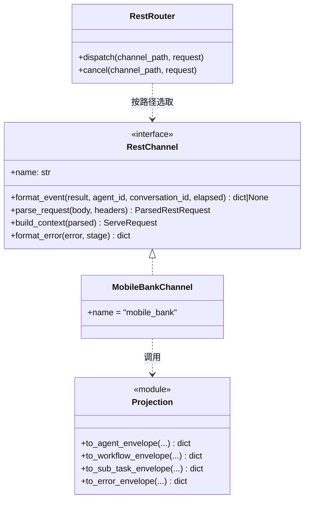
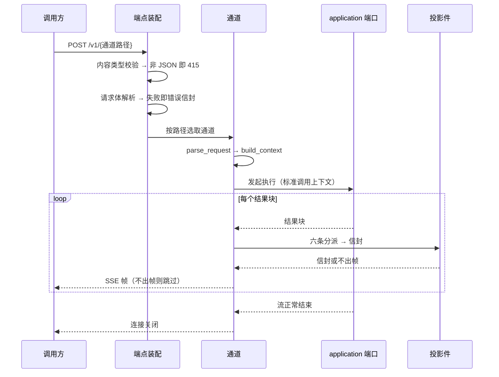
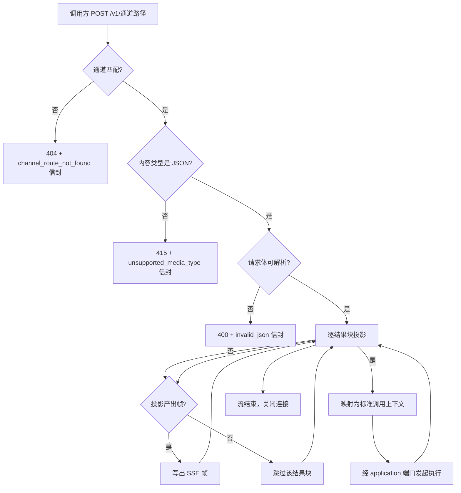

# 自定义 REST API 智能体服务入口

## 1. 概述

### 1.1 特性定位

本特性描述 runtime 在标准 A2A 服务入口之外，以自定义 REST 形态对外提供智能体调用的那一层：
调用方用普通 HTTP 与 JSON 请求体发起调用，以同步 JSON 或流式 SSE 取回结果。

**本版的范围是兼容子集，不是上位规格的完整能力。** 上位规格 `FEAT-022` 要求 runtime 提供
**用户可扩展**的请求映射与响应投影能力（用户自定义 path pattern、自定义映射规则）；
本版只承接**存量已有的那一个入口**，把它的对外行为逐字复刻，不交付可配置扩展能力。
二者的分界见 §2.2。

**为什么这一层必须存在**：存量对外暴露的主体就是这个 REST 入口——调用方看到的每一帧、
每一个错误信封，都由它产出。对外兼容原则要求「整个子系统的输入输出在存量场景中逐字节一致」，
而这个入口正是那个「输出」的出口。它不做，对外兼容无从谈起。

**它不是什么**：不是外部网关或 BFF 的实现方案，不替代 A2A JSON-RPC 的系统间标准协议
（上位规格 §1）。其他 runtime 调用本 runtime、以及总线投递到 runtime 的路径，
仍以标准 A2A 服务入口为准。

### 1.2 核心设计原则

| 原则 | 在本特性的落地 |
|---|---|
| **对外兼容** | 存量那一个入口的 URL、请求字段、响应信封、SSE 帧形态、错误信封逐字复刻；差分验证以存量实现为 oracle，期望值由存量运行时算出 |
| **遵从上位** | 遵从上位规格的语义归一要求（执行、Task 生命周期、状态、错误、租户上下文归一到标准入口）；分层遵从上游同级详设与其对标实现的职责划分 |
| **生态融入** | HTTP 与 SSE 的协议类型只出现在 inbound adapter 层，不进入 application 与 domain |
| **绞杀者迁移** | 该入口可独立开关：不装配即完全回落到存量，装配即由本版承接，两侧不共享进程内状态 |
| **依赖倒置** | inbound adapter 依赖 application 暴露的端口，反向不成立；投影件不感知执行与状态语义 |
| **状态外置** | 本特性自身零运行期状态；会话与任务状态归任务状态缓存特性 |

### 1.3 子特性全景

| 子特性 | 覆盖内容 | 本版状态 |
|---|---|---|
| **S1 入口与路由** | 主分发端点、取消端点的路径形态与分发语义 | 承接 |
| **S2 请求映射** | HTTP 请求体到标准调用上下文的映射 | 承接（固定映射，不可配置） |
| **S3 响应投影** | 24 种事件类型到对外信封的投影、四种信封形态 | 承接 |
| **S4 错误投影** | 执行前 4xx 与执行中错误的对外信封 | 承接 |
| **S5 流式传输** | SSE 帧形态、帧序、连接生命周期 | 承接 |
| **S6 可配置扩展点** | 用户自定义 path pattern 与映射规则 | **不承接**（§2.2） |

### 1.4 术语与命名对齐

| 上位／上游用语 | 本篇用语 | 说明 |
|---|---|---|
| Custom REST entrypoint | 自定义 REST 入口 | 同一对象 |
| Protocol Adapter | 协议适配件 | 上游对标实现中承担请求映射与响应投影的扩展点 |
| Response projection | 响应投影 | 结果到对外信封的转换 |
| Envelope | 信封 | 对外报文的外层结构 |
| SSE transport | 流式传输件 | 承担 SSE 连接生命周期 |

**存量的通道概念**：存量把「一组投影规则」称为通道，按路径段选取。本版沿用该结构，
但只实现存量已有的那一个通道，不提供通道注册扩展点。

## 2. 功能规格

### 2.1 能力清单

| 能力 | 级别 | 事实要求 |
|---|---|---|
| 同步消息调用 | MUST | 一次 HTTP 请求对应一次消息提交，以 JSON 响应返回结果或错误投影 |
| 流式消息调用 | MUST | 以 SSE 返回执行过程，帧形态与存量逐字一致 |
| 响应投影 | MUST | 24 种事件类型各自投影为对外信封，字段集与键序与存量一致 |
| 错误投影 | MUST | 执行前的内容类型／JSON 解析错误、执行中的错误，各自的信封与状态码与存量一致 |
| 取消 | MUST | 取消端点映射到标准取消语义，响应体与存量一致 |
| 语义归一 | MUST | 执行、Task 生命周期、状态、错误、超时、取消边界归一到标准入口，不定义独立状态机 |
| 单智能体边界 | MUST | 路径中的业务字段只作上下文，不作同实例内多智能体路由依据 |

### 2.2 显式排除

| 排除项 | 原因 | 替代方案 |
|---|---|---|
| **用户可配置的 path pattern** | 本版范围为兼容存量已有入口，不交付上位规格的可扩展能力 | 需要时按上位规格 `FEAT-022` 单独立项 |
| **请求映射与响应投影的可扩展接口** | 同上 | 同上 |
| 异步提交与轮询 | 上位规格列为 MAY，存量无此形态 | 不交付 |
| Task 查询的 REST 形态 | 上位规格列为 SHOULD，存量无此端点 | 标准入口的查询能力 |
| 独立于标准 Task 的状态机 | 上位规格明禁 | 状态一律归标准 Task 语义 |
| 提交后主动回调 | 上位规格明禁在本特性下新增 | 流式返回或标准查询 |
| 链路追踪与审计 | 上位规格列为不在范围 | 相关字段作普通 metadata 透传 |

### 2.3 接口契约

#### 2.3.1 对外端点

| 端点 | 方法 | 响应形态 | 冻结出处 | 产生点 |
|---|---|---|---|---|
| `/v1/{通道路径}` | POST | 流式 SSE 或同步 JSON，按请求决定 | **无专门冻结**——存量测试未覆盖主分发端点的路由行为 | `applications/a2a_service/api/dispatch.py`（`dispatch`） |
| `/v1/{通道路径}/cancel` | POST | JSON，固定体 `{"status": "cancel_requested"}` | `applications/a2a_service/tests/regression_baseline/frozen_facts.py`（`CANCEL_RESPONSE`）；路由行为冻结于 `applications/a2a_service/tests/framework_parallel/test_cancel_route.py`（`test_cancel_route_uses_channel_path_params`） | 同文（`cancel_task`） |

**通道路径是多段业务路径的整体**，含斜杠（存量声明为 `{channel_path:path}`）。
冻结测试中的真实形态为 `proj-1/agents/agent-1/conversations/conv-1` 与
`proj-1/agents/agent-1/tasks/task-1`——即项目、智能体、会话或任务多段拼接。

**这些业务段只作上下文，不作路由依据**：上位规格明写路径中的业务字段不得触发同实例内
多智能体路由（§2.1 单智能体边界）。存量按整段匹配通道，段内的业务语义由通道自行解释。

未匹配到通道时返回 404 加 `channel_route_not_found` 信封。

**路径完全落在路由之外时不同**：那是框架的默认 404（响应体为 `detail` 单键），
不是本特性的错误信封。**不得接管**——接管即扩大了本特性的对外面。

#### 2.3.2 响应信封的四种形态

存量有四种信封构造，**外层字段集与键序均已冻结**：

| 信封 | 外层字段 | 内层 `custom_rsp_data` | 冻结出处 |
|---|---|---|---|
| 智能体事件 | 7 字段：`success`、`agent_id`、`conversation_id`、`output`、`error`、`execution_time`、`custom_rsp_data` | 6 字段：`data`、`event`、`content`、`createdTime`、`latency`、`plugin`；`display` 仅显式传入时追加于末 | `applications/a2a_service/tests/regression_baseline/frozen_facts.py`（`AGENT_EVENT_FIELDS`、`AGENT_CUSTOM_RSP_DATA_FIELDS`、`AGENT_OPTIONAL_DISPLAY_FIELD`） |
| 工作流事件 | 5 字段：无 `output`、`error`、`error_code` | 2 字段：`event`、`data` | 同文（`WORKFLOW_EVENT_FIELDS`、`WORKFLOW_CUSTOM_RSP_DATA_FIELDS`） |
| 子任务事件 | 与智能体事件同构（7 字段） | 4 键：`event`（恒 `sub_task`）、`sub_task_path`、`node_kind`、`data` | 同文（`SUB_TASK_EVENT_FIELDS`、`SUB_TASK_CUSTOM_RSP_DATA_FIELDS`、`SUB_TASK_EVENT_TYPE`）；比对谓词见 `applications/a2a_service/tests/regression_baseline/comparator.py`（`check_sub_task_event`） |
| 错误信封 | 6 字段：`success`、`agent_id`、`conversation_id`、`execution_time`、`error_code`、`error_msg`；**无 `custom_rsp_data`** | 不适用 | 同文（`ERROR_ENVELOPE_FIELDS`） |

**条件字段两条**，比对时须双向判定（该出现时必须有、不该出现时必须无）：

- `display` —— 仅在显式传入非空时追加，位置在 `plugin` 之后
- `error_code` —— 仅对 `planning_execution_process` 事件追加于 `custom_rsp_data` 之后，
  且**值必须为空串**（`frozen_facts.py` 的 `EVENTS_WITH_ERROR_CODE`；比对规则见 `comparator.py`）

#### 2.3.3 事件类型全集与字段

存量对外事件共 **24 种**，模型定义见 `applications/a2a_service/tests/integration/events.py` 的事件注册表。
各自字段如下，**投影时这些字段进入信封的哪一位由投影规则决定**（§4）：

| 事件类型 | 模型字段 | 取证强度 |
|---|---|---|
| `conversation_start` | `type`、`content` | 其他测试有断言 |
| `conversation_end` | `type`、`content` | 其他测试有断言 |
| `think_start` | `type`、`content`、`display` | 其他测试有断言 |
| `think_chunk` | `type`、`content`、`display` | 其他测试有断言 |
| `think_end` | `type`、`content`、`display` | 其他测试有断言 |
| `todolist_start` | `type`、`content` | 其他测试有断言 |
| `todolist_item` | `type`、`id`、`title`、`status`、`content` | 其他测试有断言 |
| `todolist_end` | `type`、`count`、`content` | 其他测试有断言 |
| `todo_start` | `type`、`id`、`title`、`content` | 其他测试有断言 |
| `todo_status` | `type`、`id`、`status`、`content` | 其他测试有断言 |
| `todo_end` | `type`、`id`、`status`、`content` | 其他测试有断言 |
| `tool_start` | `type`、`content`、`plugin`、`args` | **回归基线冻结** |
| `tool_status` | `type`、`plugin`、`content`、`progress` | 其他测试有断言 |
| `tool_end` | `type`、`content`、`plugin`、`data` | 其他测试有断言 |
| `planning_execution_process` | `type`、`content` | **回归基线冻结**（独有空串 `error_code`） |
| `interrupt_start` | `type`、`interrupt_id`、`content`、`context` | **回归基线冻结** |
| `interrupt_end` | `type`、`interrupt_id`、`content` | 其他测试有断言 |
| `final_answer_start` | `type`、`content` | 其他测试有断言 |
| `summary` | `type`、`content` | 其他测试有断言 |
| `final_answer_chunk` | `type`、`content` | **回归基线冻结** |
| `final_answer_end` | `type`、`content` | 其他测试有断言 |
| `sub_task` | `type`、`sub_task_path`、`node_kind`、`data` | **回归基线冻结** |
| `thought` | `type`、`content` | **回归基线冻结** |
| `answer` | `type`、`content`、`final` | 其他测试有断言 |

**取证强度分两档**：回归基线冻结的 6 种有专门快照守护，改动即转红；其余 18 种在集成测试与
并行框架测试中有断言，但无专门冻结基线。**两档都不足以替代差分验证**——差分的期望值由存量
实现运行时算出，是比任何断言都强的事实源（§12）。

#### 2.3.4 HTTP 错误面

存量分发模块的错误出口**已逐一枚举**，共六类 HTTP 错误加一类限流：

| 情形 | 状态码 | `error` 位 | `message` 位 | 动态部分 |
|---|---|---|---|---|
| 通道不存在（分发与取消两端点各一处） | 404 | `channel_route_not_found` | `no channel route matched: <路径>` | **含请求路径** |
| 内容类型非 JSON | 415 | `unsupported_media_type` | 请求数据格式需为 application/json | 无 |
| 请求体非合法 JSON | 400 | `invalid_json` | 请求 body 非合法 JSON 格式：<解析错误> | **含解析错误文本** |
| 请求体非 JSON 对象 | 400 | `invalid_body` | 请求 body 必须是 JSON 对象（dict） | 无 |
| 请求解析失败 | 400 | `invalid_request` | <异常文本> | **整体即异常文本** |
| 限流 | 429 | 不适用 | 不适用 | 见下 |

**前五类的响应体是三字段结构** `{"success": false, "error": <slug>, "message": <文案>}`——
**不是信封**，无 `agent_id`、无 `custom_rsp_data`。产生点见
`applications/a2a_service/api/dispatch.py`（`dispatch` 与 `cancel_task` 的各错误出口）。

**限流走的是错误信封**（六字段，见 §2.3.2），`error_code` 为 `100001`、
`error_msg` 为「系统超负载，请在稍后重试」，冻结于
`applications/a2a_service/tests/regression_baseline/frozen_facts.py`（`ERROR_CODE_RATE_LIMIT`、`ERROR_MSG_RATE_LIMIT`）。
**它与前五类不同构**——限流发生在已进入业务处理之后，有会话身份可填；
前五类发生在身份确立之前，只有三字段。

**动态部分影响差分构造**：含动态内容的三类，比对时须让两侧的动态输入一致
（同一路径、同一异常对象），否则比的是文案模板之外的东西。

## 3. 模块结构

### 3.1 包结构

```
agent_runtime/adapters/inbound/rest/
    __init__.py
    channel.py          通道抽象：请求映射与响应投影的一组规则
    mobile_bank.py      存量那一个通道的实现（本版唯一实现）
    projection.py       信封构造：四种信封的字段与键序
    router.py           端点装配：主分发与取消端点
```

**投影件与通道分开的理由**：信封的字段集与键序是**全局契约**（四种信封对所有通道一致），
而事件到信封各位的映射是**通道自己的规则**。二者混在一起时，加一个通道就可能改动信封形态。

### 3.2 类图与静态关系



### 3.3 依赖方向与禁止依赖

| 方向 | 允许 | 说明 |
|---|---|---|
| inbound adapter → application 端口 | **是** | 通过端口发起执行，不直接调 domain 服务 |
| inbound adapter → domain 数据类型 | **是** | 读取结果块的字段用于投影 |
| application → inbound adapter | **否** | 反向依赖即破坏洋葱方向 |
| 投影件 → 执行／状态语义 | **否** | 投影件只做结构转换，不判断执行成败、不写状态 |
| 通道实现 → 其他通道 | **否** | 通道之间零耦合 |

**HTTP 与 SSE 的类型只出现在本层**：`Request`、`JSONResponse`、`StreamingResponse` 等
不得出现在 application 与 domain。

## 4. 核心设计

### 4.1 响应投影：六条分派

存量的投影规则是一条**顺序敏感的分派链**（`applications/a2a_service/channels/mobile_bank_channel.py`
的 `format_event`）。顺序不可调换——前一条命中即返回，后面的分支看不到该事件。

| 序 | 条件 | 产出 | 说明 |
|---|---|---|---|
| 1 | 无 `type`，或 `data` 非字典 | **不出帧** | 记过滤日志；结构不合规的事件不投出去 |
| 2 | `type` 为 `versatile_proxy` | 工作流信封 | 内层 `event` 缺失时**也不出帧** |
| 3 | `type` 为 `completed` | **不出帧** | 完成不产帧，终态由 Task 状态承载 |
| 4 | `type` 为 `failed` 或 `input_required` | 智能体信封，事件名归一为 `interrupt_start` | `success` 取「非 failed」；`error` 仅 `failed` 承载；`content` 取 `content`，无则取 `error` |
| 5 | `type` 为 `sub_task` | 子任务信封 | 内层三派渲染见 `L2-Func-004b` §2.3.2 |
| 6 | 其余全部 | 智能体信封 | 见下 |

**第 6 条覆盖 24 种对外事件中的 23 种**（除 `sub_task`）。前五条命中的四个事件名
（`versatile_proxy`、`completed`、`failed`、`input_required`）**不在对外事件注册表内**——
它们来自远端代理与任务状态，不是智能体产出的事件。

### 4.2 兜底分支的字段搬运规则

第 6 条的规则决定了 23 种事件各自的字段落到信封哪一位：

| 步 | 动作 | 结果 |
|---|---|---|
| 1 | 从 `data` 弹出 `content`，缺省空串 | 进信封的 `content` 位 |
| 2 | 从 `data` 弹出 `plugin`，缺省空串 | 进信封的 `plugin` 位 |
| 3 | 若剩余载荷中还有 `data` 键且为字典，**用它整体替换载荷** | 支持事件自带嵌套载荷 |
| 4 | 剩余载荷整体 | 进信封的 `data` 位 |

**第 3 步是易漏点**：事件自带 `data` 嵌套时，外层的其余字段**被整体丢弃**，
不是与内层合并。例如 `tool_end` 带 `data` 时，其 `type` 之外的同级字段不会进信封。

**事件类型原样进 `event` 位**，不做改名——第 4 条的 `interrupt_start` 归一是唯一例外。

### 4.3 请求映射：HTTP 到标准调用上下文

存量的请求形态（`applications/a2a_service/api/dispatch.py` 模块文档）：路径为
`POST /v1/{项目标识}/agents/{智能体标识}/conversations/{会话标识}`，请求体形如

```json
{"input": {"query": "用户自然语言输入"},
 "conversation_id": "会话唯一标识",
 "custom_data": {"inputs": {"query": "..."}}}
```

**字段提取规则**，每项都有取值顺序，顺序不可调换：

| 目标 | 取值顺序 | 缺省 |
|---|---|---|
| 会话标识 | 路径参数 `conversation_id` → 路径参数 `conv_id` → 请求体 `conversation_id` | **缺失即拒绝**，不生成 |
| 智能体标识 | 路径参数 `agent_id` → 请求体 `agent_id` | **缺失即拒绝** |
| 查询内容 | 请求体 `input.query` → 请求体 `custom_data.inputs.query` | 空串 |
| 追踪标识 | 请求体的 `trace_id`／`traceid`／`x-trace-id`／`x-request-id` → 同名请求头（大小写各试一次） | 空串 |
| 用户标识 | 请求头 `x-user-id` → 请求头 `cust-userid` | 空串 |
| 是否流式 | 请求体 `stream` | **默认真**——不传即流式 |

**两个标识缺失即拒绝，不生成兜底值**：自动生成会让两次无标识的调用落到不同会话，
而调用方以为是同一个；拒绝是可观察的失败，生成是静默的错误。

**查询内容取空串不拒绝**：存量允许空查询（由执行链路决定如何处置），
在本层拒绝会改变对外行为。

**是否流式默认真**：这一条是对外行为——不传 `stream` 时存量走流式，
改成默认同步会让既有调用方拿到完全不同的响应形态。

**身份与追踪只透传不解释**：本层不校验其有效性、不落盘，按 §10 作为调用上下文传下去。

**去协议化的边界**：会话标识映射为标准调用上下文的会话，追踪标识进 metadata，
**是否流式不进领域上下文**——它是入向路由控制，领域不感知调用方要不要流式。

### 4.4 关键处理流程



### 4.5 并发与协程安全边界

| 对象 | 并发性质 | 约束 |
|---|---|---|
| 通道实现 | **无状态**，可被并发调用 | 不得持有请求级字段；所有上下文经参数传入 |
| 投影件 | 纯函数 | 输入相同则输出相同，不读外部状态 |
| 端点装配 | 每请求一条协程 | 单个连接的帧序由该协程串行保证 |

**单个连接内帧序严格有序**：投影不改变顺序，一个结果块产出至多一帧。
跨连接无顺序保证，也不需要——每个连接对应独立的一次调用。

### 4.6 幂等与重试语义

本层**不实现重试**。HTTP 请求的重试由调用方决定；同一请求重发即发起一次新调用，
产生新的 Task。**投影本身天然幂等**（纯函数），重复投影同一结果块得到相同信封。

**不做请求去重**：存量无此机制，加入即改变对外行为（同一请求重发两次，存量执行两次）。

## 5. 数据设计

### 5.1 本特性的状态盘点

| 数据 | 存哪 | 谁写 | 多副本下 | 重启后 |
|---|---|---|---|---|
| 通道注册表 | 进程内，装配期一次性构建 | 装配代码 | 各副本各自持有，内容相同 | 随进程重建 |
| 请求级上下文 | 协程栈 | 每次请求 | 无跨副本语义 | 随请求结束消失 |

**本特性零持久状态。** 会话与任务状态归任务状态缓存特性；本层只做结构转换，
转换过程不读写任何存储。

**这一条是设计约束而非现状描述**：投影件一旦读存储，就同时具备了「转换」与「查询」两种职责，
其输出将不再是输入的纯函数——差分验证也就不再成立（同一输入可能因存储状态不同而产出不同信封）。

### 5.2 与存量共享的键面

**本特性不引入任何共享键。** 存量在该入口上使用的会话键由任务状态缓存特性承接，
键面与值格式的兼容约束见该特性的键面章节与数据架构视图。

## 6. 配置模型

### 6.1 完整配置示例

```yaml
runtime:
  rest:
    enabled: true          # 不启用即完全回落存量，装配期不注册任何端点
    prefix: "/v1"          # 端点前缀，对齐存量
    channel: "mobile_bank" # 本版唯一通道
```

### 6.2 配置属性表

| 属性 | 类型 | 默认 | 对外影响 | 说明 |
|---|---|---|---|---|
| `runtime.rest.enabled` | 布尔 | `false` | 决定端点是否存在 | 默认关闭：装配后才承接，保证绞杀者可回滚 |
| `runtime.rest.prefix` | 字符串 | `/v1` | **改动即破坏对外兼容** | 与存量一致，非必要不改 |
| `runtime.rest.channel` | 字符串 | `mobile_bank` | 决定投影规则 | 本版唯一取值 |

**默认关闭的理由**：本入口一旦装配即对外提供服务，与存量并存时须由部署方显式选择
由哪一侧承接。默认开启会让两侧同时可达，切流边界不清。

### 6.3 配置对象

配置以冻结数据类承载，装配期读取一次，运行期不可变——运行期可变的配置会让
「同一输入产出同一信封」这条不再成立。

## 7. 对外呈现与用户场景

### 7.1 外部接口

| 接口 | 请求 | 响应 |
|---|---|---|
| `POST /v1/{通道路径}` | JSON 体，含查询内容与业务字段 | 流式 SSE（每帧一个信封）或同步 JSON |
| `POST /v1/{通道路径}/cancel` | JSON 体，含任务标识 | `{"status": "cancel_requested"}` |

### 7.2 流式帧的对外形态

| 项 | 形态 |
|---|---|
| 媒体类型 | `text/event-stream` |
| 帧格式 | `data: <信封 JSON>` 后接两个换行；**只有 `data:` 行，无 `event:` 行** |
| 序列化 | 中文不转义（`ensure_ascii=False`）——转义即改变字节 |
| 帧序 | 一个结果块产出至多一帧；投影返回「不出帧」时该结果块不产生任何帧 |
| 流结束 | **流自然结束即结束，不发哨兵帧** |

冻结出处：`applications/a2a_service/tests/regression_baseline/comparator.py` 的标准 SSE 帧谓词。

> **关于 `data: [DONE]` 哨兵帧：存量的文档写了，代码从来没发过。**
> 存量分发模块的文档段与一处注释都写着以 `data: [DONE]` 收尾，但其流生成函数
> **无任何该帧的产出点**——按提交历史检索该字面量，全历史仅一次命中，且那次提交只增加了
> 这两行文档、未改任何产出逻辑。
>
> **本版按代码事实办：不发哨兵帧。** 照文档实现会多发一帧，对按帧计数或按流结束判定的
> 调用方即是行为改变。这一条是「文档与代码冲突时以对外可观察行为为准」的实例——
> 存量的文档不是对外契约，它发出去的字节才是。

### 7.3 端到端流程

**判定顺序是通道匹配在最前**，其后才是内容类型与请求体——顺序反过来会让调用方
在路径写错时先看到内容类型错误，据此去改内容类型，而真正的问题是路径不对。
该顺序经双侧往返实测确证（`openJiuwen/agent-runtime-mvp/agent_runtime/tests/test_differential_http_roundtrip.py`）。



## 8. 错误处理

### 8.1 错误的两个阶段

**执行前与执行中的错误走不同的出口，这是对外可观察的差异**：

| 阶段 | 出口 | 形态 |
|---|---|---|
| **执行前**（内容类型、请求体解析、通道查找） | HTTP 状态码 + JSON 体 | 三字段 `{success, error, message}`，非信封结构 |
| **执行中**（执行链路抛出） | SSE 帧或同步 JSON | 智能体信封，事件名归一为 `interrupt_start`，`success` 为假 |

**分界点是「响应是否已开始」**：流式响应一旦开始，就无法再改 HTTP 状态码，
错误只能以帧的形式送出。这条决定了同一个异常在不同时机下的对外形态完全不同。

### 8.2 执行中错误的归一

按投影分派第 4 条：`failed` 与 `input_required` 都归一为 `interrupt_start` 事件名，
差别在 `success` 与 `error` 两位——

| 来源 | `success` | `error` | `content` |
|---|---|---|---|
| `failed` | `false` | 承载错误文本 | 取 `content`，无则取 `error` |
| `input_required` | `true` | 空串 | 取 `content`，无则取 `error` |

**事件名归一是存量的既定行为**，不是本版的设计选择。改成各自独立的事件名会破坏兼容。

## 9. DFX 设计

### 9.1 可观测性埋点

| 事件 | 级别 | 记什么 | 不记什么 |
|---|---|---|---|
| 投影过滤 | 警告 | 事件类型名、通道名、会话标识、过滤原因 | **不记载荷内容**——事件载荷可能含业务文本或凭据 |
| 请求受理 | 信息 | 通道路径、内容类型 | 不记请求体 |
| 执行前错误 | 警告 | 错误分类、状态码 | 不记原始请求体 |

**投影过滤必须留痕**：静默过滤会让「产出了预期外的事件形态」在运行期完全不可见——
表现为结果莫名少一段，而没有任何线索指向投影层。

### 9.2 可靠性

| 情形 | 处置 |
|---|---|
| 单个结果块投影失败 | **不中断整条流**——记警告并跳过该块；一个畸形事件不该让整次调用失败 |
| 连接被调用方断开 | 停止投影与写出，释放上游执行的消费；不视为执行失败 |
| 执行链路抛出 | 按 §8.1 分阶段处置 |

### 9.3 容量与性能约束

投影是纯函数、无外部调用，单帧开销与载荷大小线性相关。**本层不设背压**：
背压归执行链路与传输层，本层加缓冲会改变帧的到达节奏，属对外可观察行为。

## 10. 安全

| 面 | 处置 |
|---|---|
| 请求体大小 | 由传输层与部署方限制，本层不另设阈值（另设即改变对外行为） |
| 载荷进日志 | **禁止**——见 §9.1 |
| 身份与凭据 | 从请求头读取后作为调用上下文透传，本层不解释、不校验、不落盘 |
| 错误文案 | 执行前错误的文案与存量逐字一致，**不追加内部信息**（栈、内部路径、组件名） |

**错误文案不得携带内部信息**：存量的文案是固定的中文提示，追加内部细节既破坏兼容，
也是一处信息泄漏面。

## 11. 兼容性与迁移

### 11.1 对外兼容约束

本特性的**全部产出都是对外面**。兼容基准与验证方式见 `COMPAT-SURFACE-INVENTORY.md`，
本节只列约束：

| 约束 | 内容 |
|---|---|
| 端点路径 | 前缀与路径形态逐字一致 |
| 信封字段集与键序 | 四种信封均按冻结清单，键序即序列化输出顺序 |
| 条件字段 | `display` 与 `error_code` 的出现规则双向判定 |
| 事件名 | 原样进 `event` 位；`failed`／`input_required` 归一为 `interrupt_start` 是唯一例外 |
| 不出帧的三种情形 | 结构不合规、`completed`、工作流事件内层 `event` 缺失 |
| 执行前错误 | 状态码与三字段体逐字一致 |

### 11.2 与存量并存及切换

| 维度 | 处置 |
|---|---|
| 切流粒度 | 按部署实例切——两侧各自装配，同一路径不同时对外 |
| 进程内状态 | 本特性零状态，两侧无共享，切换无残留 |
| 回滚 | 配置关闭即完全回落存量，无需清理 |

## 12. 验收标准与测试用例

### 12.1 验收判据

**唯一判据是差分验证全绿**：把同一批输入同时喂给存量实现（作为 oracle）与本版实现，
**逐字节比对序列化结果**。

| 判据 | 要求 |
|---|---|
| **期望值来源** | 由存量实现运行时算出，**禁止手写字面量**——手写即变成断言拟合，存量漂移时判据不会发现 |
| **比对方式** | 序列化后的字符串相等，含字段顺序；不得先解析再比对象（那会抹掉键序差异） |
| **输入集完备性** | 覆盖 `COMPAT-SURFACE-INVENTORY.md` 的每一项，**覆盖率即验收进度** |
| **判据能失败** | 每条经变异验证：改本版实现即转红 |

### 12.2 测试用例与预期结果

| 用例族 | 输入 | 预期 |
|---|---|---|
| 事件投影 · 24 种 | 每种事件一条典型输入（字段取自模型定义，见 §2.3.3） | 与存量投影逐字节一致 |
| 条件字段 · `display` | 同一事件分别传与不传 `display` | 传则末位追加、不传则无该键 |
| 条件字段 · `error_code` | `planning_execution_process` 与另一事件 | 前者有空串 `error_code`、后者无 |
| 不出帧 · 三种 | 无 `type`、`completed`、工作流内层 `event` 缺失 | 两侧均不产帧 |
| 兜底搬运 · 嵌套载荷 | 事件自带 `data` 嵌套且同级另有字段 | 两侧同样丢弃同级字段 |
| 错误归一 | `failed` 与 `input_required` | 事件名均为 `interrupt_start`，`success`／`error` 按 §8.2 |
| 执行前错误 · 4 类 | 非 JSON 内容类型、非法请求体、通道不存在、限流 | 状态码与三字段体逐字一致 |
| 端点形态 | 两个端点的路径与响应 | 与存量一致 |

### 12.3 覆盖边界

**不做的**：不验证执行链路本身的正确性（归各执行特性）、不验证存量的行为是否合理
（存量是兼容基线，其行为的合理性不在本篇裁量范围）。

**读到存量行为可疑时**：如实登记并提请裁定，**不得自行判定为缺陷而绕开**。

## 13. 限制与待补

| 项 | 影响 | 性质 | 该由谁做 |
|---|---|---|---|
| 可配置扩展点不交付 | 用户无法自定义 path 与映射规则 | **范围取舍**（§2.2），非能力不可得 | 需要时另立项 |

## 附录 A · 六条设计原则符合性

### A.1 对外兼容

**遵从**。本特性的全部产出都是对外面，兼容约束逐条列于 §11.1，验证方式为差分全绿（§12.1）。
**当前状态是已达成**：事件类型全集 24 种逐种逐字节比对且带覆盖锁（注册表增删而用例未跟上即转红），
四种信封（智能体事件、工作流事件、错误、子任务）全部实现，HTTP 错误面改为从存量分发模块解析出口后逐条比对、
带「存量有而本版无即转红」的盘尽锁。三项原登记缺口均已闭环，见 §13。
本篇的价值在于把兼容面变成可度量、可失败的判据——达成与否由判据说了算，不由本节的措辞说了算。

### A.2 遵从上位

**遵从**。上位规格的能力清单见 §2.1，显式排除见 §2.2；本版按裁定只取兼容子集，
不交付可配置扩展能力，该收窄已在 §1.1 与 §2.2 两处写明。
语义归一（执行、Task 生命周期、状态、错误、租户上下文归标准入口）为上位 MUST，本篇全盘接受。

### A.3 生态融入

**遵从**。HTTP 与 SSE 的协议类型只出现在 inbound adapter 层（§3.3），
不进入 application 与 domain。投影件不引入任何协议类型，输入是领域结果块、输出是字典。

### A.4 绞杀者迁移

**遵从**。本特性对应「REST 入口」这一个用例，可独立开关（§6.2 默认关闭）、
独立回滚（§11.2 配置关闭即回落，零残留）。两侧不共享进程内状态。

### A.5 依赖倒置

**遵从**。跨层调用只有一个方向：inbound adapter → application 端口（§3.3）。
投影件不感知执行与状态语义，不读存储（§5.1）——后者同时保证了投影是纯函数，
这是差分验证成立的前提。

### A.6 状态外置

**遵从**。本特性零持久状态（§5.1）；进程内只有装配期构建的通道注册表与请求级上下文，
前者各副本内容相同、随进程重建，后者随请求结束消失。会话与任务状态归任务状态缓存特性。
