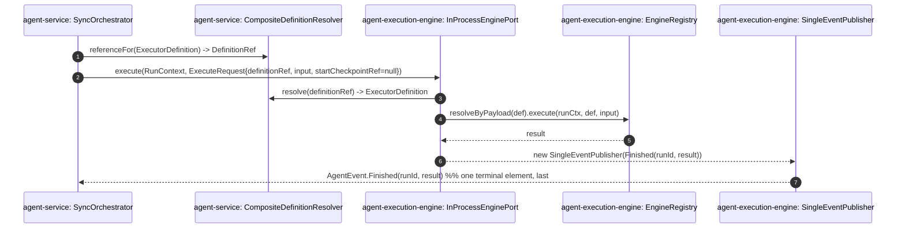
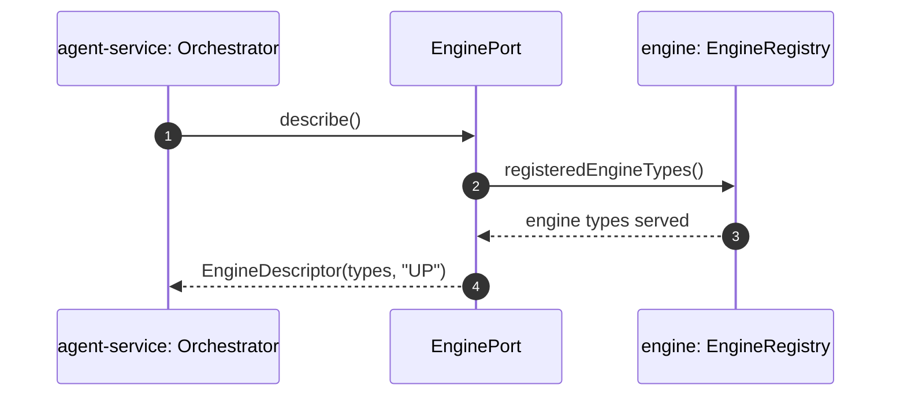

# EnginePort Boundary — Scenarios

> Runtime call sequences across the boundary are L2 detail (they name method
> hops, stream elements, and checkpoint tokens). They are homed here, not at L1.
> Each `(participant)` is a type whose home is fixed in [`development.md`](development.md);
> nothing is invented in this view.

## E1 — Cold execute, in-process (Form 2/3), happy path



Red lines: `execute` returns a `Flow.Publisher<AgentEvent>` emitting exactly one
terminal element; in-process the `ExecutionContext` IS the `RunContext` subtype so
tenant / session are available without crossing the boundary.

## E2 — Suspend over the wire (Form 1) + resume

```mermaid
sequenceDiagram
    autonumber
    participant Svc as agent-service: SyncOrchestrator
    participant Port as EnginePort (RpcEnginePort / A2aEnginePort)
    participant RR as agent-service: Run row + token index
    participant CP as engine: Checkpointer

    Svc->>Port: execute(ExecutionContext, ExecuteRequest{startCheckpointRef=null, traceparent=T})
    Port->>CP: persist engine state -> engineStateRef (opaque token)
    Port-->>Svc: AgentEvent.InterruptRequest(runId, token, reason, correlationHandle)   %% terminal — suspended, not thrown
    Svc->>RR: persist token against durable Run row (status=SUSPENDED)

    Note over Svc,RR: ... suspend reason resolved out-of-band ...

    Svc->>Port: execute(ExecutionContext, ExecuteRequest{startCheckpointRef=token, traceparent=T})
    Note over Svc,Port: resume is a FRESH execute, same traceparent;<br/>engine re-resolves DefinitionRef against its own registry
    Port->>CP: load engineStateRef -> continue leg
    Port-->>Svc: AgentEvent.Finished(runId, result)   %% may suspend again instead
```

Red lines: suspension is a returned `InterruptRequest` terminal event, never a
throw across the boundary; resume is a fresh `execute` with `startCheckpointRef`
set and the suspending leg's `traceparent` re-asserted; the Service owns the
durable Run row + token index, the engine owns the opaque checkpoint bytes.

## E3 — Cross-transport conformance (the TCK)

The in-process and over-the-wire realizations must be **semantically identical**.
`EnginePortConformanceTck` (in `agent-service`) is the abstract conformance kit; a
transport passes only if it satisfies the same execute / suspend / resume /
describe assertions. `NestedDualModeIT` exercises the nested-run path.

```mermaid
sequenceDiagram
    autonumber
    participant TCK as EnginePortConformanceTck (abstract)
    participant InP as subject: InProcessEnginePort
    participant Net as subject: RpcEnginePort / A2aEnginePort

    TCK->>InP: execute(...) — assert one terminal AgentEvent of the expected kind
    TCK->>InP: suspend then resume(startCheckpointRef) — assert continuation
    TCK->>Net: execute(...) — SAME assertions (serialize / round-trip via transport mocks)
    TCK->>Net: suspend then resume(startCheckpointRef) — SAME assertions
    Note over TCK: A transport ships only when its conformance subclass is green;<br/>networked transports must match the frozen in-process semantics.
```

The cross-transport TCK is the gate that lets ADR-0158 claim "one contract, three
transports" structurally rather than aspirationally: the networked transports
ship only after the contract is frozen and the TCK proves semantic identity.

## E4 — describe / health



`describe()` is the discovery surface the Service uses to register / route engines;
it carries no tenant / session, like every other operation on the port.

## Cross-references

- Participant homes (which module each type lives in): [`development.md`](development.md).
- Suspend/resume + error-as-terminal-event mechanics: [`process.md`](process.md).
- Per-form deployment topology: [`physical.md`](physical.md).
- Wire shape mirrored by the networked transports:
  [`docs/contracts/engine-port.v1.yaml`](../../../../docs/contracts/engine-port.v1.yaml).
