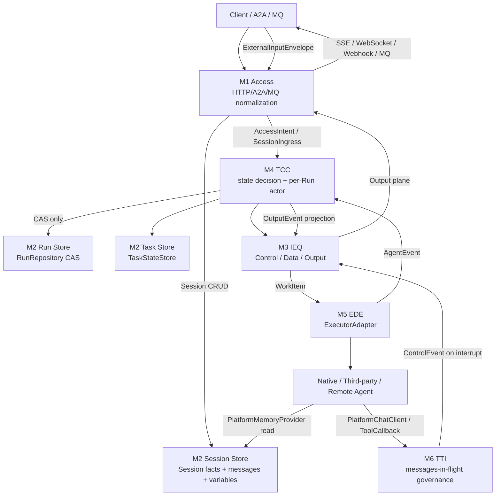
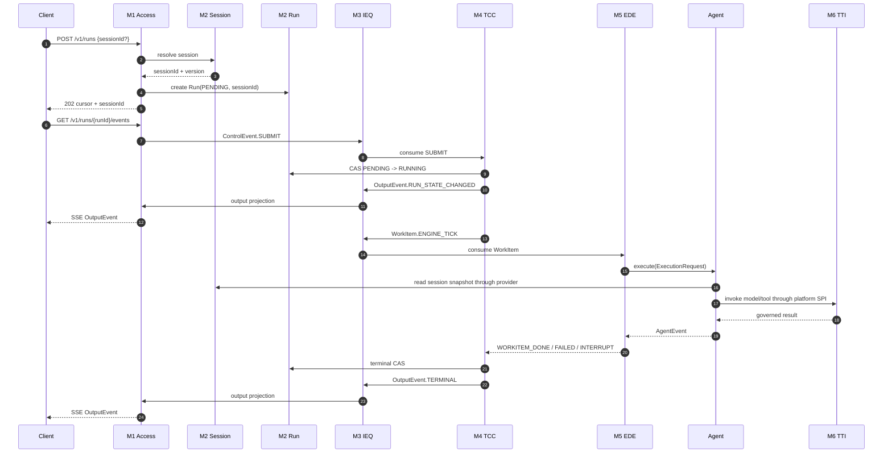

# AgentService 接口契约澄清与落地提议

> 日期：2026-05-28
>
> 范围：结合 2026-05-27 / 2026-05-28 的 review、PR #93 合入后的 ADR-0155、以及 `architecture/docs/L1/agent-service/` canonical L1 文档，明确 `agent-service` 的对外接口、内部模块接口、SPI、数据契约、未实现接口与 Wave 落地顺序。
>
> 非范围：本文不修改 Java 代码，不升级 design_only 契约为 shipped，不替代 ADR-0155 与 L1 canonical 文档；本文是后续 L2/impl-mode wave 的接口边界输入。

## 1. D-1：根因与最强解释

### 1.1 根因

近期 review 暴露的核心问题不是“缺少接口数量”，而是接口边界仍在不同权威面之间漂移：

- L1 早期文档把 Layer 2 命名为 Session & Task Manager，容易让实现把 Session / Task / Run 合成一个大 StateStore。
- 0528 自审已经修正 M6 prompt 构造越界，确认 AgentService 管上下文事实源，Agent 管 prompt 表达，M6 只做 messages-in-flight 治理。
- PR #93 将 ADR-0155 合入 canonical L1，新增 14 个 design_only schema 与 5 个 design_only SPI，但多数仍只是占位接口或 YAML 契约。
- 0527 L1 审计指出 RunEvent、Layer 3 queue、Task DFA、idempotency completion/replay、S2C tenant 字段、Session durable store 等仍未闭环。

因此，当前最危险的漂移不是“没有 Session 接口”，而是：

1. 把 Session 当成 Run/Task 生命周期容器；
2. 把 M6 当成 prompt builder；
3. 把 design_only schema 当成 runtime_enforced；
4. 把公开 HTTP API、内部模块事件、Java SPI 混成一个接口层次。

### 1.2 最强解释

用户要求“明确 service 内部各个接口、service 对外接口定义”，最强解释是：

1. 以 PR #93 后的 canonical L1 为准，列清楚每类接口的所有权、调用方向和当前状态。
2. 对外接口只暴露 platform-stable API，不暴露第三方框架类型、provider thread id、内部 queue event、RunEvent Java 细节。
3. 内部接口按 L1 六个模块分层：M1 Access、M2 STM、M3 IEQ、M4 TCC、M5 EDE、M6 TTI。
4. Session 是上下文事实源，不拥有 Task/Run 状态机。
5. design_only 接口必须显式标注，不允许在后续文档或代码中写成已交付。

## 2. 权威面裁定

| 层级 | 当前权威面 | 本文使用方式 |
|---|---|---|
| enforceable rules | `CLAUDE.md` + `docs/governance/contracts/architecture-design.md` | 决定文档写法、SPI/TCK/DFX、tenant/RLS/CAS、Control/Data/Output 三平面、cursor flow 等红线。 |
| architecture root | `architecture/workspace.dsl` + `architecture/README.md` | 后续落地必须同步 DSL/function-point，不在本文直接编辑。 |
| fact layer | `architecture/facts/generated/*.json` + ADR-0154 | 对代码、contract、test、runtime 行为的事实判断优先读 generated facts；本文只做设计澄清，不直接编辑 generated 文件。 |
| L1 module design | `architecture/docs/L1/agent-service/*` | 本文接口边界的直接基线。 |
| accepted decision | ADR-0155 + ADR-0156 | 本文吸收 ADR-0155 的 6 个边界逆转，并补入 ADR-0156 的 ProductClaim / IAM / Audit / Cost 横切约束。 |
| runtime contract | `docs/contracts/contract-catalog.md` + `docs/contracts/*.yaml` | 区分 HTTP API、SPI、YAML domain contract 的 status。 |
| product traceability | `product/claims.yaml` + `product_claim:` fields | 后续新增 contract / feature / ADR / rule 必须绑定 PC-NNN 或显式 governance sentinel。 |
| review evidence | 0527/0528 review docs | 用来识别漂移、缺口、开源对标和 Wave 规划。 |

### 2.1 2026-05-28 远端刷新后的影响结论

本地仓库已从 `origin/main` 快进到 `5df8c63`，新增两批与本文相关的变化：

| 远端变化 | 对接口设计的影响 |
|---|---|
| PR #94 引入 ADR-0154 fact layer，并在 AGENTS/architecture reading path 中要求先读 `architecture/facts/generated/*.json`。 | 本文里的“代码现状”必须视为设计审阅结论；后续实现 wave 不能再只引用 prose，应引用 `contract-op/createrun`、`code-symbol/...RunController`、`code-symbol/...Session` 等 fact id。 |
| PR #94 / #95 引入 ADR-0156 ProductClaim，并将 G-16/G-17/G-18/G-20 提升为 blocking。 | 后续新增 `session.v1.yaml`、`session-message.v1.yaml`、Session CRUD feature、TCK 或 rule 时，必须带 `product_claim:` 或合法 sentinel；否则 CI 会阻塞。 |
| 新增 `audit-trail.v1.yaml`。 | Run admission、Run status transition、tool call、model invocation、sandbox violation、identity propagation 都需要可审计出口。Session CRUD 不应直接成为 RunEvent，但必须能产生 audit-side record 或被审计链引用。 |
| 新增 `iam-bridge.v1.yaml`。 | M1 Access 的 tenant/auth 边界从“X-Tenant-Id + JWT cross-check”扩展为“OIDC delegated user identity + downstream User-Context-Token propagation”。所有对外 Session API 都必须复用同一 admission filter。 |
| 新增 `cost-governance.v1.yaml`。 | M6/ModelGateway 前后必须预留 budget check / spend record hook；`PlatformChatClient`、`InterceptRequest`、`GovernedMessages` 等接口需要携带足够的 tenant/agent/user/correlation 信息用于成本归因。 |
| 新增 `docs/competitive/` 开源对比 corpus。 | 之前依赖单篇 open-source comparison 的结论应降级为 review evidence；后续方案应引用竞争库中的具体项目文档，避免重复检索造成口径漂移。 |

因此，本次刷新不推翻原接口边界，反而强化三条红线：

1. Session 仍只做 conversation facts / metadata，不吞并 Run/Task 状态。
2. M1/M4/M6 的接口必须携带或解析 identity、tenant、agent、correlation 上下文，否则无法满足 IAM/Audit/Cost。
3. 后续任何“接口已实现”声明必须由 fact layer、contract catalog、TCK/IT 三方共同证明。

### 2.2 M1~M6 命名说明

本文中的 `M1`~`M6` 是 `agent-service` 内部的六个责任面编号，`M` 表示 module / mechanism。它不是 Maven module 编号，也不是全仓库 L0/L1/L2 架构层级。使用 M 编号的目的，是在同一个 `agent-service` 内部清楚说明“谁生产接口、谁消费接口、谁不能越界”。

| 编号 | 名称 | 一句话职责 | 不能做 |
|---|---|---|---|
| M1 | Access Layer | 对外入口、协议归一化、tenant/auth/idempotency/trace、cursor 和 stream 投影。 | 不拥有 Run/Task/Session 状态，不直接调用 executor/model/tool。 |
| M2 | Session State Boundary | 当前 L2 提议只裁定 Session：session header、messages、variables、projection anchors、Run-Session binding。 | 不重新设计 RunRepository / TaskStateStore，不把 RunStatus 或 TaskState 写入 Session。 |
| M3 | Internal Event Queue | Service 内部 Control / Data / Output 三平面搬运。 | 不拥有业务状态，不把 Output projection 当成 RunEvent 本体。 |
| M4 | Task-Centric Control | 唯一状态决策者；消费控制事件，执行 Run CAS，仲裁 cancel/resume/interrupt/race。 | 不拼 prompt，不直接调 provider SDK，不绕过 M2 CAS。 |
| M5 | Engine Dispatch & Execution | 适配 native / third-party / remote agent，统一 ExecutorAdapter / ExecutionRequest / AgentEvent。 | 不直接治理模型/工具资源，不写 Run/Task/Session 状态。 |
| M6 | Translation & Tool-Intercept | 模型、工具、memory、retrieval、client-hosted skill、interrupt 的资源访问治理切面。 | 不构造 prompt，不拥有 Session facts，不拦截 remote agent 进程内部调用。 |

命名上的关键边界：

- M1~M6 是 `agent-service` 的内部责任面，不应写成独立部署单元。
- M2 在 L1 canonical 中仍处在 “Session & Task Manager” 所属层，但本文只细化 Session State 子域。
- M3 的三平面是 Control / Data / Output；heartbeat/rhythm 若存在，只能是调度或观测实现细节。
- M6 类似 API Gateway：治理已经形成的 messages / tool request / retrieval request，不替 Agent 构造 prompt。

## 3. 总体决议

### 3.1 ACCEPT

| 决议 | 说明 |
|---|---|
| `POST /v1/runs` 是当前唯一 shipped 运行入口。 | 返回 202 + cursor，符合 Cursor Flow；不直接暴露 engine/provider 类型。 |
| Session 与 Run/Task 分离。 | 本文的 L2 接口重点是 Session State；Run 是执行状态源，Task 是协议可见控制态，二者只作为相邻子域被引用，不在本文重新设计。 |
| Session 可由 client 传入 `sessionId` 继续，也可省略并由服务创建后返回。 | 这与 LangGraph thread/checkpoint、Google ADK session、Semantic Kernel AgentThread、Dify conversation 的通用模式一致，但本项目的 `sessionId` 是平台内部 id，不引入 `externalSessionId`。 |
| Session 对话与 metadata 需要对外 CRUD。 | 供 context manager、compaction tool、debug/replay 工具使用。 |
| M6 不构造 prompt。 | Agent 读取 STM-04 facts 后自行组装 messages；M6 只治理已经构造好的 messages。 |
| M4 是状态迁移唯一决策者。 | M6/M5/M1 只能产生 `ControlEvent` 或 `AgentEvent`，不能直接写 STM-03。 |
| M3 需要三平面接口。 | Service 内部平面裁定为 Control / Data / Output；不把 heartbeat/rhythm 作为业务平面。deadline、retry、liveness 属于控制命令或观测指标，不是独立队列轨。 |
| IAM/Audit/Cost 是横切 contract，不是新的业务状态层。 | 它们通过 M1 admission、M4 after-CAS、M6 before/after model hook、M5 tool/model boundary 接入；不改变 Run/Task/Session 的所有权。 |
| Service 需要对外输入流与输出流。 | 输入流承载 client 后续输入、HITL 回复、client-hosted skill response；输出流承载状态、token、tool result、input_required、terminal 等 client-visible projection。 |

### 3.2 MODIFY

| 既有说法 | 修正后说法 |
|---|---|
| Layer 2 = Session & Task Manager，可以自然承载所有状态。 | L1 canonical 仍把 Layer 2 命名为 Session & Task Manager，并保留 Run/Task/Session 三个相邻子域；但当前 L2 提议只裁定 Session State。Session Store 不重新定义 RunRepository/TaskStateStore，只通过 binding/projection 引用它们。 |
| `ContextProjector` 负责给模型拼 prompt。 | `ContextProjector`/`PlatformMemoryProvider` 只提供上下文读取或投影；prompt 表达由 Agent 或第三方 framework 自己决定。 |
| supplied `sessionId` missing 时可以自动创建同名 session。 | 不建议。省略 `sessionId` 才自动创建；显式传入但不存在应返回 `404 not_found`，避免 typo 与跨租户探测歧义。 |
| queue event 与 domain event 可用一个泛型事件表示。 | 必须拆：`RunEvent` 是聚合事实，`ControlEvent`/`WorkItem` 是内部队列 envelope，SSE/MQ/push 是对外投影。 |
| `control/data/rhythm` 是 service 内部三轨。 | 修正为 `control/data/output`。`rhythm` 可以作为调度器内部 tick 或 observability signal 存在，但不进入业务队列 plane。 |
| SPI 占位接口出现即可视为接口已实现。 | design_only SPI 只是接口占位；必须有 carrier、TCK、实现、DFX、catalog 4-way parity 后才能升级。 |
| L1 prose 可以直接作为实现事实。 | ADR-0154 后，代码/contract/test/runtime 的事实判断必须先看 `architecture/facts/generated/`；prose 只承载意图、取舍和设计 rationale。 |

### 3.3 REJECT

| 拒绝项 | 原因 |
|---|---|
| `externalSessionId` 双 id 方案。 | 增加 lookup、幂等、跨租户绑定和审计复杂度；当前无必要。 |
| Session 内嵌 `RunStatus` / `Task.A2aState`。 | 违反 Run / Task / Session 正交分离。 |
| M1 Controller 直接调用 ModelGateway / ExecutorAdapter。 | 破坏 Access Layer 只做入口与投影的边界。 |
| M5/M6 直接调用 `RunRepository.updateIfNotTerminal`。 | 破坏 M4 唯一状态决策者。 |
| 远端 Agent 内部 model/tool/memory 调用经本地 M6 拦截。 | 远端进程自治；本地只能审计 A2A outbound/inbound 边界。 |
| provider thread id 作为平台 Session truth。 | 第三方 thread 只是 adapter binding，不是平台会话事实源。 |
| heartbeat/rhythm 作为 service 业务内部一级平面。 | 业务控制面只需要 Control/Data/Output；心跳若存在，应归入 observability 或 scheduler implementation，不能污染业务接口模型。 |

## 4. 对外接口定义

### 4.1 当前 shipped HTTP API

| API | 状态 | 当前契约 | 必须保持的边界 |
|---|---|---|---|
| `GET /v1/health` | shipped | 健康检查，无 tenant/idempotency 要求。 | 不承载业务状态。 |
| `GET /actuator/health` | shipped | Spring actuator health。 | 运维面。 |
| `GET /actuator/prometheus` | shipped | Prometheus metrics。 | 高基数标签禁用。 |
| `POST /v1/runs` | shipped | 创建 Run，返回 202 + TaskCursor。 | Access 只准入、创建、派发；不等待 Agent 完成。 |
| `GET /v1/runs/{runId}` | shipped | tenant-scoped 查询 Run。 | 跨租户与不存在统一 `404 not_found`。 |
| `POST /v1/runs/{runId}/cancel` | shipped | tenant-scoped cancel，CAS 后返回当前状态。 | 只能经 `RunRepository.updateIfNotTerminal`。 |

所有非 health 对外 API 的共同前置条件需要随 ADR-0156 收紧：

- 必须复用 `iam-bridge.v1.yaml` 的 JWT/OIDC 校验、`X-Tenant-Id` 与 token tenant claim cross-check。
- mutating API 必须保留 idempotency 语义，并在后续 completion/replay wave 中记录 response snapshot。
- 进入 Run / model / tool / downstream-call 边界的动作必须能关联 audit evidence；不能把审计作为可选日志。
- 模型调用相关路径必须能关联 budget/spend 信息；否则无法实现 `cost-governance.v1.yaml` 的 before/after hook。

### 4.2 建议新增 Session HTTP API

这些接口属于 L2 Session State 后续 wave；当前不应写成 shipped。

| API | 目的 | 初始优先级 | 关键契约 |
|---|---|---:|---|
| `POST /v1/sessions` | 显式创建 Session。 | P0 | 返回 `sessionId`、`revision`、`createdAt`。 |
| `GET /v1/sessions/{sessionId}` | 读取 Session header。 | P0 | tenant-scoped；跨租户 `404`。 |
| `PATCH /v1/sessions/{sessionId}` | 更新 title/metadata/status。 | P1 | revision guarded；只改 Session 元数据。 |
| `DELETE /v1/sessions/{sessionId}` | tombstone Session。 | P1 | 默认软删除；物理 purge 是 retention/admin。 |
| `GET /v1/sessions/{sessionId}/messages` | 分页读取对话历史。 | P0 | cursor/limit；默认隐藏 tombstone。 |
| `POST /v1/sessions/{sessionId}/messages` | append 对话消息。 | P0 | 单调 sequence；append-only；revision guarded。 |
| `GET /v1/sessions/{sessionId}/messages/{messageId}` | 读取单条消息。 | P1 | tenant/session 双 scope。 |
| `PATCH /v1/sessions/{sessionId}/messages/{messageId}` | 改 metadata/visibility。 | P1 | 不直接改原始事实内容，除非是 redaction。 |
| `DELETE /v1/sessions/{sessionId}/messages/{messageId}` | tombstone/redact message。 | P1 | 不硬删审计事实。 |
| `GET /v1/sessions/{sessionId}/variables` | 读取 Session variables。 | P0 | 用于 context tool / compact tool。 |
| `PUT /v1/sessions/{sessionId}/variables/{name}` | upsert variable。 | P0 | schema-aware JSON；revision 或 per-variable CAS。 |
| `POST /v1/sessions/{sessionId}/projection-anchors` | 写入 compaction/projection anchor。 | P1 | 必须包含 `sourceRevision` 与 policy。 |

### 4.3 `POST /v1/runs` 与 Session 的外部形态

建议将 `POST /v1/runs` 请求扩展为：

```json
{
  "capabilityName": "weather-agent",
  "sessionId": "optional-platform-session-id",
  "input": {
    "text": "明天天气怎么样"
  },
  "metadata": {
    "clientId": "web",
    "userId": "u-123"
  }
}
```

响应扩展为：

```json
{
  "runId": "uuid",
  "taskId": "optional-task-id",
  "sessionId": "generated-or-existing-session-id",
  "cursorUrl": "http://host/v1/runs/{runId}",
  "status": "PENDING"
}
```

约束：

- `sessionId` 省略：创建新 Session 并返回。
- `sessionId` 存在且属于当前 tenant：绑定 Run。
- `sessionId` 存在但找不到：`404 not_found`。
- `sessionId` 属于其他 tenant：同样 `404 not_found`。
- 不引入 `externalSessionId`。

错误码裁定：

- `404 not_found`：显式传入的 `sessionId` 在当前 tenant 下不存在，或属于其他 tenant。此处不使用 409，避免暴露存在性差异，也避免把 typo 自动解释成可冲突资源。
- `409 conflict`：只用于资源存在但请求语义冲突，例如 idempotency body drift、revision conflict、projection sourceRevision drift。

### 4.4 建议新增对外输入流 / 输出流 API

这些接口属于 design_only。它们的目标不是把内部 `ControlEvent`、`WorkItem` 或 `RunEvent` 直接暴露出去，而是在 Access Layer 做稳定投影。

| API | 方向 | 目的 | 初始优先级 | 关键契约 |
|---|---|---|---:|---|
| `POST /v1/runs/{runId}/inputs` | Client -> Service | 向正在等待输入的 Run 追加用户输入、HITL 决策、client-hosted skill response 或 resume payload。 | P0 | tenant-scoped；idempotency required；转成 `ExternalInputEnvelope` 后进入 M1/M4，不直接写 Run。 |
| `GET /v1/runs/{runId}/events` | Service -> Client | Run 级 SSE 输出流。 | P0 | 输出 `OutputEvent` projection；不泄漏内部 queue offset、provider token id、Java sealed type。 |
| `GET /v1/sessions/{sessionId}/events` | Service -> Client | Session 级聚合输出流，跨多个 Run。 | P1 | 适合 Chat UI / console；必须按 tenant/session scope 过滤。 |
| `POST /v1/runs/{runId}/subscriptions` | Client -> Service | 注册 webhook / push / MQ 回调订阅。 | P1 | 输出流的异步投递绑定；回调失败进入 Output DLQ，不影响 Run CAS。 |
| `DELETE /v1/runs/{runId}/subscriptions/{subscriptionId}` | Client -> Service | 取消输出订阅。 | P1 | 只影响输出投影，不取消 Run。 |

建议对外流类型：

```text
ExternalInputEnvelope
  tenantId
  runId
  sessionId?
  inputId
  inputKind: USER_MESSAGE | HITL_DECISION | CLIENT_TOOL_RESULT | RESUME_PAYLOAD
  idempotencyKey
  payloadRef | payload
  userContext
  createdAt

OutputEvent
  tenantId
  runId
  sessionId?
  sequence
  eventKind: RUN_STATE_CHANGED | MESSAGE_DELTA | TOKEN_DELTA | TOOL_RESULT |
             INPUT_REQUIRED | ERROR | TERMINAL
  payloadRef | payload
  traceId
  occurredAt
```

红线：

- 对外输出流是 projection，不是 `RunEvent` 本体；`RunEvent` 仍是内部聚合事实。
- 对外输入流只产生 command/envelope；状态迁移仍由 M4 决策。
- SSE/WebSocket/Webhook/MQ 是 transport choice；`OutputEvent` 是稳定语义契约。
- 输出流断开不取消 Run；取消必须走 `POST /v1/runs/{runId}/cancel`。

## 5. 内部模块接口定义

### 5.1 M1 Access Layer

| 接口/契约 | 状态 | 生产者 | 消费者 | 说明 |
|---|---|---|---|---|
| `AccessIntent` | design_only | M1 | M4 | A2A/MQ/HTTP 归一化后的内部请求。 |
| `RunCursorResponse` | shipped | M1 | Client | 当前 HTTP cursor response。 |
| `RunResponse` | shipped | M1 | Client | Run 状态投影。 |
| `IdempotencyStore` | shipped/internal | M1 filters | M1/M4 terminal hook future | 当前 claim-only；completion/replay 未闭环。 |
| `SessionIngressCommand` | proposed | M1 | M2 SessionResolver | 建议新增，避免 Controller 直接碰 Session store。 |

M1 不得直接调用：

- `ExecutorAdapter`
- `PlatformChatClient`
- `RuntimeMiddleware`
- `ModelGateway`
- `TaskStateStore.compareAndUpdate`

### 5.2 M2 Session State Boundary

本节只裁定 Session State 子域。RunRepository / TaskStateStore 是 L1 Layer 2 的相邻子域或已存在依赖，本文只列出调用边界和禁止项，不把它们纳入 Session L2 的实现范围。

| 子接口 | 状态 | Java/Schema 现状 | 应补齐 |
|---|---|---|---|
| `ContextProjector` | implemented_unverified | `service.session.spi.ContextProjector`。 | 对齐 ADR-0155：从 prompt builder 降级为 read/projection；不要承担 M6 构造 prompt。 |
| `SessionStore` | missing/proposed | 无正式 SPI。 | Session header CRUD + revision CAS。 |
| `SessionMessageStore` | missing/proposed | 无正式 SPI。 | message append/list/tombstone。 |
| `SessionVariableStore` | missing/proposed | 无正式 SPI。 | variable upsert/list/delete。 |
| `SessionProjectionAnchorStore` | missing/proposed | 无正式 SPI。 | compaction anchor。 |
| `RunSessionBindingStore` | missing/proposed | 无正式 SPI。 | 只保存 Run 与 Session 的引用关系，不让 Session 拥有 RunStatus。 |
| `RunRepository` | shipped / sibling | `service.runtime.runs.spi.RunRepository` + in-memory impl。 | Session L2 不实现它；M4/TCC 继续经 CAS 写 Run。 |
| `TaskStateStore` | implemented_unverified / sibling | `service.task.spi.TaskStateStore` + in-memory impl。 | Session L2 不实现它；Task 状态不写入 Session。 |
| `ConfigSnapshotStore` | design_only | `config-snapshot-ref.v1.yaml`。 | immutable config snapshot/ref storage。 |
| `CorrelationRecordStore` | design_only | `correlation-record.v1.yaml`。 | local child / remote handle union + CAS fill。 |
| `ResponseSnapshotStore` | design_only | STM-08 in feature doc。 | TCC terminal hook writes; M1 only reads。 |

M2 的关键红线：

- Session State 不重新设计 Run/Task；Run/Task/Session 是相邻子域，不合并成泛型 `StateStore`。
- Session store 不拥有 RunStatus / TaskState。
- Run 状态除 create 以外必须走 CAS。
- durable backend 必须 tenant-first + RLS。

### 5.3 M3 Internal Event Queue

| 接口/契约 | 状态 | 用途 | 应补齐 |
|---|---|---|---|
| `ControlEvent` | design_only | SUBMIT/CANCEL/RESUME/CALLBACK/INTERRUPT_REGISTERED/RESUME_ACCEPTED 等。 | Java carrier + control producer/consumer。 |
| `WorkItem` | design_only | ENGINE_STEP/RESUME_STEP/TOOL_INVOKE/MODEL_INVOKE 等 data work。 | Java carrier + data worker。 |
| `OutputEvent` | missing/proposed | StateChanged/token_delta/message_delta/tool_result/input_required/terminal 等对外投影。 | 与 RunEvent/SSE/MQ/Webhook 投影分层。 |
| `ExternalInputEnvelope` | missing/proposed | client 后续输入、HITL 决策、client-hosted skill response、resume payload。 | M1 验证后转入 Control/Data，不直接写状态。 |
| `ServiceQueueProducer` | missing/proposed | 发送到 control/data/output 三平面。 | 必须显式 channel，不允许 generic publish。 |
| `ServiceQueueConsumer` | missing/proposed | 注册 typed handler。 | 避免 M4 巨大 switch。 |
| `QueueLeaseStore` | missing/proposed | lease/ack/retry。 | durable slow path 必需。 |
| `DeadLetterSink` | missing/proposed | DLQ。 | 记录 original correlation + reason。 |
| `OutputStreamPublisher` | missing/proposed | 将 Output plane 投影到 SSE/WebSocket/Webhook/MQ。 | Access Layer 拥有 transport；M3 只交付语义事件。 |
| `OutputSubscriptionStore` | missing/proposed | 维护 client subscription 与投递偏移。 | 不得影响 Run 状态；失败进 Output DLQ。 |

M3 不拥有业务状态，只运输命令、work item、输出投影。三平面裁定如下：

| 平面 | 典型载荷 | 消费者 | 不变量 |
|---|---|---|---|
| Control | submit/cancel/resume/interrupt/callback/deadline timeout | M4 TCC | 可抢占 Data；不能被 token/tool payload 洪峰阻塞。 |
| Data | engine step、tool invoke、model invoke、resume step、大 payload ref | M5/M6 workers | 承载执行工作，不对外暴露。 |
| Output | run state projection、message/token delta、tool result、input_required、terminal | M1 output stream facade / client | 只做 client-visible projection，不作为状态事实源。 |

Heartbeat/rhythm 不作为业务平面：deadline 可以表现为 ControlEvent，worker liveness 应进入 observability metrics，scheduler tick 是实现细节。

### 5.4 M4 Task-Centric Control

| 接口/契约 | 状态 | 用途 |
|---|---|---|
| `RunLifecycleService` | missing/proposed | 包装所有 Run CAS、reason code、after-CAS event publish。 |
| `DualTrackRouter` | future SPI | Fast/Slow path 选择。 |
| `RunDecisionActor` | proposed | per-runId 串行化状态决策。 |
| `ResumeDispatcher` | proposed | callback/resume/deadline 后重新进入执行。 |
| `RuntimeMiddlewareBridge` | proposed | M4 独占 RuntimeMiddleware dispatch。 |
| `CancelRaceArbiter` | proposed | `CANCEL_RACE_RESOLVED_AS_COMPLETED/CANCELLED` 判定。 |

M4 可以调用：

- `RunRepository.updateIfNotTerminal`
- `TaskStateStore`
- `SessionStore`/`SessionMessageStore` 的只读或受控写入接口
- `ServiceQueueProducer`
- M5 dispatch facade

M4 不得：

- 直接拼 prompt
- 直接调用 provider SDK
- 绕过 M2 CAS 写 Run

### 5.5 M5 Engine Dispatch & Execution

| 接口/契约 | 状态 | 用途 |
|---|---|---|
| `ExecutorAdapter` | design_only placeholder | Native / third-party / remote agent 执行统一入口。 |
| `InjectionMode` | design_only enum | `NATIVE_DI` / `THIRD_PARTY_BRIDGE` / `EVENT_RELAY` / `NONE`。 |
| `ExecutionRequest` | design_only schema | Adapter execute input。 |
| `AgentEvent` | design_only schema | Adapter output stream。 |
| `EngineResultNormalizer` | proposed | 将 adapter/vendor 结果转成平台 AgentEvent/ControlEvent。 |
| `AgentCardProvider` | proposed pull API | M1 AL-10 pull，不允许 M5 push M1。 |

M5 的关键约束：

- Native/third-party in-process agent 通过 DI/bridge 使用 M6 平台 SPI。
- Remote agent 内部资源调用不被本地 M6 拦截；只在 A2A 边界审计。
- M5 接收 `RESUME_TICK` 后，在 adapter 接管成功时发 `ControlEvent.RESUME_ACCEPTED`。

### 5.6 M6 Translation & Tool-Intercept

| 接口/契约 | 状态 | 用途 |
|---|---|---|
| `PlatformChatClient` | design_only SPI | Agent 调用模型的平台代理入口。 |
| `PlatformToolCallback` | design_only SPI | 工具调用治理入口。 |
| `PlatformMemoryProvider` | design_only SPI | 读取 STM-04 session snapshot。 |
| `PlatformRetriever` | design_only SPI | RAG/retrieval 治理入口。 |
| `InterceptRequest` | design_only schema | MODEL/TOOL/MEMORY/RAG/CLIENT_HOSTED_SKILL/INTERRUPT 统一入口。 |
| `GovernedMessages` | design_only schema | M6 治理后的 messages，不是 BuiltPrompt。 |
| `ToolResult` | design_only schema | 工具结果归一化。 |
| `InterruptRegistration` | design_only schema | HITL interrupt registration，通过 `ControlEvent.payloadRef` 传给 M4。 |

M6 明确不做：

- 不构造 prompt；
- 不拥有 Session facts；
- 不写 Run/Task 状态；
- 不拦截 remote agent 进程内部 model/tool/memory 调用；
- 不把第三方 SDK 类型泄漏到 M4/M2/M1。

## 6. Session 子域接口最终裁定

### 6.1 Session 的职责

Session 只负责：

- `sessionId`
- tenant-scoped 会话身份
- conversation messages
- variables / metadata
- context projection cursor/version
- compaction/projection anchor
- 与 Run 的引用关系

Session 不负责：

- RunStatus
- Task A2aState
- checkpoint compute snapshot
- queue lease
- provider thread truth
- prompt assembly

### 6.2 Session Java SPI 建议

以下接口是 proposed，落地时必须按 Rule R-D 补 module metadata、DFX、catalog、TCK。

```java
package com.huawei.ascend.service.session.spi;

public interface SessionStore {
    Session create(String tenantId, SessionCreateCommand command);

    Optional<Session> findById(String tenantId, String sessionId);

    Page<Session> list(String tenantId, SessionListQuery query);

    Optional<Session> compareAndUpdate(
            String tenantId,
            String sessionId,
            long expectedRevision,
            UnaryOperator<Session> mutation);

    Optional<Session> archive(String tenantId, String sessionId, long expectedRevision);

    Optional<Session> tombstone(String tenantId, String sessionId, long expectedRevision);
}
```

```java
package com.huawei.ascend.service.session.spi;

public interface SessionMessageStore {
    SessionMessage append(String tenantId, String sessionId, AppendSessionMessageCommand command);

    Page<SessionMessage> list(String tenantId, String sessionId, SessionMessageQuery query);

    Optional<SessionMessage> findById(String tenantId, String sessionId, String messageId);

    Optional<SessionMessage> compareAndUpdate(
            String tenantId,
            String sessionId,
            String messageId,
            long expectedRevision,
            UnaryOperator<SessionMessage> mutation);

    Optional<SessionMessage> tombstone(
            String tenantId,
            String sessionId,
            String messageId,
            long expectedRevision);
}
```

```java
package com.huawei.ascend.service.session.spi;

public interface SessionVariableStore {
    Optional<SessionVariable> findByName(String tenantId, String sessionId, String name);

    Page<SessionVariable> list(String tenantId, String sessionId, SessionVariableQuery query);

    SessionVariable upsert(String tenantId, String sessionId, UpsertSessionVariableCommand command);

    Optional<SessionVariable> delete(
            String tenantId,
            String sessionId,
            String name,
            long expectedRevision);
}
```

```java
package com.huawei.ascend.service.session.spi;

public interface SessionProjectionAnchorStore {
    SessionProjectionAnchor record(
            String tenantId,
            String sessionId,
            RecordProjectionAnchorCommand command);

    Optional<SessionProjectionAnchor> findById(
            String tenantId,
            String sessionId,
            String projectionId);

    Page<SessionProjectionAnchor> list(
            String tenantId,
            String sessionId,
            ProjectionAnchorQuery query);
}
```

### 6.3 SessionResolver 建议

```java
package com.huawei.ascend.service.session;

public interface SessionResolver {
    SessionResolution resolveForRunIntake(
            String tenantId,
            Optional<String> sessionId,
            SessionCreateCommand createWhenMissingCommand);
}
```

| 输入 | 行为 |
|---|---|
| `sessionId` 省略 | 创建新 Session，返回 generated id。 |
| `sessionId` 存在且 found | 返回 existing Session。 |
| `sessionId` 存在但 not found | 返回 `404 not_found`。 |
| foreign tenant | 返回 `404 not_found`。 |
| archived/deleted | 返回状态化错误，不创建替代 Session。 |

## 7. 数据契约清单

### 7.1 当前已有 YAML contract

| Contract | 当前状态 | 本文裁定 |
|---|---|---|
| `access-intent.v1.yaml` | design_only | M1 -> M4 内部入口，不是 public HTTP body。 |
| `control-event.v1.yaml` | design_only | M3 control envelope，M4 消费。 |
| `work-item.v1.yaml` | design_only | M3 data envelope，M5 消费。 |
| `execution-request.v1.yaml` | design_only | M5 adapter input。 |
| `agent-event.v1.yaml` | design_only | M5 adapter output，不等于 `RunEvent`。 |
| `governed-messages.v1.yaml` | design_only | M6 output，替代 BuiltPrompt。 |
| `intercept-request.v1.yaml` | design_only | M6 unified intercept entry。 |
| `session-snapshot.v1.yaml` | design_only | `PlatformMemoryProvider` read projection。 |
| `correlation-record.v1.yaml` | design_only | cross-run / remote handle union。 |
| `config-snapshot-ref.v1.yaml` | design_only | Run 创建时配置快照引用。 |
| `error-class.v1.yaml` | design_only | 平台统一错误分类。 |
| `checkpoint-record.v1.yaml` | design_only | recoverable boundary，不属于 Session facts。 |
| `audit-trail.v1.yaml` | design_only | 横切审计记录；由 M1 admission、M4 after-CAS、M5/M6 tool/model boundary 触发，不是 public business event。 |
| `iam-bridge.v1.yaml` | design_only | M1 admission 与 downstream delegated identity propagation；所有 Session/Run public API 都要复用。 |
| `cost-governance.v1.yaml` | design_only | M6 before/after model hook 的 token budget 与 spend attribution；要求模型接口保留 tenant/agent/user/correlation。 |

### 7.2 应新增或拆出的 contract

| Contract | 目的 | 触发 Wave |
|---|---|---|
| `session.v1.yaml` | Session header：id/title/status/metadata/revision。 | Session L2 W1 |
| `session-message.v1.yaml` | Message role/content/sequence/visibility/revision。 | Session L2 W1 |
| `session-variable.v1.yaml` | Session variable schema-aware JSON。 | Session L2 W1 |
| `session-projection-anchor.v1.yaml` | compaction/projection lineage。 | Session L2 W2 |
| `run-session-binding.v1.yaml` | Run 引用 Session 的 relation record。 | Session L2 W1 |
| `queue-event-envelope.v1.yaml` | M3 transport envelope，区别于 RunEvent。 | IEQ W1 |
| `run-lifecycle-command.v1.yaml` | M4 状态决策命令。 | TCC W1 |
| `external-input-envelope.v1.yaml` | Client 后续输入、HITL 回复、client-hosted skill response、resume payload 的稳定输入流契约。 | External Stream W1 |
| `output-event.v1.yaml` | 对外输出流事件投影，区别于内部 `RunEvent` 与 queue envelope。 | External Stream W1 |
| `output-subscription.v1.yaml` | webhook/push/MQ 订阅、offset、重试、DLQ 绑定。 | External Stream W2 |

新增 contract 的 frontmatter 必须带 `product_claim:`。建议初始映射如下：

| Contract | 建议 ProductClaim | 原因 |
|---|---|---|
| `session.v1.yaml` | `PC-005` | Session facts 与 memory/context lifecycle 绑定。 |
| `session-message.v1.yaml` | `PC-005` | 对话历史是 memory/context 的核心事实。 |
| `session-variable.v1.yaml` | `PC-005` | compact/context tool 需要稳定变量面。 |
| `session-projection-anchor.v1.yaml` | `PC-005` | compaction/projection lineage 属于 memory governance。 |
| `run-session-binding.v1.yaml` | `PC-001|PC-005` | Run execution 与 Session context 的绑定桥。 |
| `queue-event-envelope.v1.yaml` | `PC-003` | 生产级控制面、可观测与恢复能力。 |
| `run-lifecycle-command.v1.yaml` | `PC-003` | Run 状态治理、取消/恢复/暂停控制。 |
| `external-input-envelope.v1.yaml` | `PC-003|PC-004` | 生产级异步交互与 agent/client-hosted capability 输入。 |
| `output-event.v1.yaml` | `PC-003|PC-004` | 客户端可观测输出、streaming、tool/result/input_required 投影。 |
| `output-subscription.v1.yaml` | `PC-003|PC-004` | webhook/push/MQ 可靠投递与恢复。 |

## 8. 代码现状与缺口

| 缺口 ID | 当前证据 | 风险 | 建议 |
|---|---|---|---|
| IF-GAP-001 | `PlatformMemoryProvider.readSnapshot(...)` 返回 `Object`。 | design_only SPI 过宽，无法编译期保护 `session-snapshot.v1.yaml`。 | W1 增加 typed carrier `SessionSnapshot`。 |
| IF-GAP-002 | 无 `SessionStore` / message CRUD store。 | Session 仍只是 record + projector，不能支撑对外 CRUD。 | L2 Session W1 实现 in-memory + TCK。 |
| IF-GAP-003 | `ContextProjector` 文档仍有 prompt/projection 混合遗留。 | 与 ADR-0155 v1.2 “M6 不拼 prompt”冲突。 | 更新 javadoc/docs，使其只读 facts/projection。 |
| IF-GAP-004 | `Task.A2aState` 无 validator。 | Task 控制态可能成为半成品状态机。 | 增 `TaskStateMachine` 或标明 design_only。 |
| IF-GAP-005 | RunEvent Java sealed hierarchy 未落地。 | queue/event/audit 只能停留在 schema。 | 优先实现 `RunEvent` + variants。 |
| IF-GAP-006 | Layer 3 无 `service.queue/` code home。 | Control/Data/Output 无法 runtime enforced。 | 先 in-memory queue TCK，再 durable backend。 |
| IF-GAP-007 | idempotency completion/replay 未闭环。 | `COMPLETED/FAILED` 与 response snapshot 易被误认为已交付。 | 由 M4 terminal hook 写 response snapshot。 |
| IF-GAP-008 | `S2cCallbackEnvelope` tenant 字段争议。 | catalog 与 Java 字段可能继续漂移。 | 要么增 in-band tenantId，要么统一改成 wrapper/binding 解析。 |
| IF-GAP-009 | M5/M6 新 SPI 均 design_only。 | 接口存在但无 carrier/TCK/impl。 | 每个 SPI 独立 Wave：typed carrier -> reference impl -> TCK -> catalog status。 |
| IF-GAP-010 | `audit-trail.v1.yaml` 已 design_only，但 Java `AuditTrailEmitter` 未落地。 | 后续 RunEvent/Session CRUD/Tool/Model 边界容易只写业务事件而漏审计事件。 | 在 M4 after-CAS、M1 admission、M6 before/after model、M5 tool boundary 设计统一 audit side-effect。 |
| IF-GAP-011 | `iam-bridge.v1.yaml` 已 design_only，但当前接口文档未把 delegated user identity 纳入 public API 前置条件。 | Session CRUD 若绕过同一 filter，会破坏身份归因和跨租户隔离。 | Session HTTP facade 与 Run HTTP facade 共享 admission/security filter，不单独实现 tenant/auth。 |
| IF-GAP-012 | `cost-governance.v1.yaml` 已 design_only，但 M6 SPI 尚未要求 cost attribution 字段。 | 预算检查和 spend log 无法可靠归因到 tenant/agent/user/run。 | `PlatformChatClient` / `InterceptRequest` / `GovernedMessages` 补齐 attribution context。 |
| IF-GAP-013 | fact layer 已成为事实权威，但本文仍是 prose review。 | 后续实现者可能只引用本文而忽略 generated facts。 | 每个 impl wave 的设计必须列出 fact ids、contract ids、test refs，并运行对应 `./mvnw -pl agent-service -am verify` 与 gate。 |
| IF-GAP-014 | 对外输入/输出流尚无正式 contract。 | HITL、SSE、webhook、client-hosted skill response 容易各自发明 payload。 | 增加 `external-input-envelope.v1.yaml`、`output-event.v1.yaml`、`output-subscription.v1.yaml`。 |
| IF-GAP-015 | L1 canonical 旧文档仍有 `rhythm` 语汇。 | 实现者可能误以为 service 业务内部有 heartbeat plane。 | 后续 canonical wave 将 L1 的 rhythm 语汇收敛为 Control/Data/Output；scheduler tick 留在实现细节或 observability。 |

## 9. 4+1 视图

### 9.1 Scenarios

| 场景 | 对外 API | 内部接口 | 不变量 |
|---|---|---|---|
| 新会话发起 Run | `POST /v1/runs` 无 `sessionId` | M1 -> `SessionResolver` -> `RunRepository.save` | 返回 cursor + generated `sessionId`；不直接执行模型。 |
| 继续会话发起 Run | `POST /v1/runs` 带 `sessionId` | `SessionStore.findById` + Run binding | missing/foreign session = `404`。 |
| 追加用户消息 | `POST /v1/sessions/{id}/messages` | `SessionMessageStore.append` | append-only sequence；revision guard。 |
| HITL interrupt | internal M6 interrupt | `InterruptRegistration` -> `ControlEvent.INTERRUPT_REGISTERED` -> M4 | M6 不写 STM-03。 |
| 客户端后续输入 | `POST /v1/runs/{id}/inputs` | `ExternalInputEnvelope` -> M1 validation -> `ControlEvent`/`WorkItem` | 输入流不直接写 Run/Task；幂等键必需。 |
| 订阅输出流 | `GET /v1/runs/{id}/events` | Output plane -> `OutputStreamPublisher` -> SSE/WebSocket/Webhook | 输出流断开不取消 Run；输出事件不是 RunEvent 本体。 |
| resume callback | future callback API/MQ | `ControlEvent.CALLBACK` -> M4 -> `WorkItem.RESUME_TICK` -> M5 | M5 接管后发 `RESUME_ACCEPTED`。 |
| 模型调用 | in-process agent SPI | `PlatformMemoryProvider` read -> Agent builds messages -> `PlatformChatClient` -> M6 | M6 只治理 messages。 |

### 9.2 Logical



### 9.3 Process



### 9.4 Development

```text
agent-service/src/main/java/com/huawei/ascend/service/
  platform/web/runs/                  # shipped M1 Run HTTP facade
  platform/web/sessions/              # proposed M1 Session HTTP facade
  platform/idempotency/               # M1 idempotency claim/completion/replay
  runtime/runs/                       # M2 Run aggregate
  runtime/runs/spi/                   # M2 RunRepository
  task/                               # M2 Task aggregate
  task/spi/                           # M2 TaskStateStore
  session/                            # M2 Session aggregate + facade
  session/spi/                        # M2/M6 shared session projection SPI
  queue/                              # proposed M3 internal event queue
  orchestrator/                       # proposed M4 TCC home
  runtime/executor/spi/               # M5 ExecutorAdapter design_only
  runtime/intercept/spi/              # M6 platform resource SPIs design_only
  integration/springai/               # provider/framework adapters
```

### 9.5 Physical

| 资源 | 当前 | 目标 |
|---|---|---|
| Run store | in-memory shipped | JDBC/RLS durable + TCK。 |
| Task store | in-memory implemented_unverified | JDBC/RLS + DFA validator。 |
| Session store | missing | `sessions` / `session_messages` / `session_variables` / anchors，全部 RLS。 |
| Queue | design_only | control/data/output 三平面物理隔离；无 rhythm 业务平面。 |
| External stream | design_only | input API + output SSE/WebSocket/Webhook/MQ projection；transport 与语义契约分离。 |
| Idempotency | claim-only | completion/replay + terminal response snapshot。 |
| M5/M6 SPI | interface placeholders | typed carriers + reference impl + TCK。 |

## 10. Wave 落地计划

| Wave | 名称 | 目标 | 产物 | 退出条件 |
|---|---|---|---|---|
| W0 | 接口红线冻结 | 将本文边界写入 review/issue，避免继续漂移。 | 本文档。 | `rg` 能找到所有关键接口名与拒绝项。 |
| W0.5 | Fact/ProductClaim 对齐 | 将后续待新增接口映射到 fact layer、contract catalog 与 ProductClaim。 | contract/frontmatter checklist + fact-id evidence 表。 | 新增 YAML/ADR/feature 不触发 G-16/G-17/G-18/G-20。 |
| W1 | Session State L2 | SessionStore/message/variable/anchor + HTTP CRUD design。 | L2 proposal + schema + in-memory TCK。 | Session 不含 RunStatus/TaskState；`POST /v1/runs` session resolve 语义明确。 |
| W2 | RunEvent spine | Java sealed RunEvent + variants。 | `runtime/evolution` carriers + tests。 | gate 不再 vacuous；每个 terminal/suspend/resume 有 typed event。 |
| W3 | M3 queue + external stream | Control/Data/Output envelopes + in-memory queue + output stream facade。 | `service.queue/` + `OutputEvent` + `ExternalInputEnvelope` + stream routing tests。 | control 不被 data flood 阻塞；输出断开不取消 Run；DLQ/retry 可测。 |
| W4 | TCC facade | RunLifecycleService + per-Run actor + resume/cancel race。 | `orchestrator/` 最小闭环。 | M4 是唯一状态决策者，M5/M6 无 STM-03 写路。 |
| W5 | M5/M6 SPI runtime | ExecutorAdapter + Platform* SPIs typed 化。 | typed carriers + reference adapters。 | Native/third-party/remote 三形态接入策略可测。 |
| W6 | durable posture | JDBC/RLS stores + idempotency completion/replay。 | Postgres IT + RLS migrations。 | tenant leak / duplicate create / response replay 有 IT。 |
| W7 | IAM/Audit/Cost 横切闭环 | 补齐 `IamBridge`、`AuditTrailEmitter`、`TokenBudgetStore`/`SpendLogStore` 与 hook wiring。 | admission filter、audit emitter、budget hooks、ArchUnit no-bypass tests。 | Run/Session/model/tool/downstream-call 边界都有身份、审计、成本归因证据。 |

## 11. 验证建议

本文作为 review 文档，建议的只读验证：

```bash
git diff --check -- docs/logs/reviews/2026-05-28-agent-service-interface-contract-clarification.cn.md
rg -n "SessionStore|SessionMessageStore|PlatformMemoryProvider|AccessIntent|ControlEvent|ExecutorAdapter|M6 不构造 prompt|externalSessionId|RunEvent|service.queue|ADR-0154|ADR-0156|audit-trail|iam-bridge|cost-governance|ProductClaim|ExternalInputEnvelope|OutputEvent|OutputStreamPublisher|control/data/output" docs/logs/reviews/2026-05-28-agent-service-interface-contract-clarification.cn.md
```

后续实现 wave 的强制验证：

| 类别 | 验证 |
|---|---|
| Session | `SessionStoreContractTest`、`SessionMessageStoreContractTest`、RLS IT。 |
| Run | `RunRepositoryContractTest`、save mutation ArchUnit。 |
| Task | `TaskStateMachineTest`、`TaskStateStoreContractTest`。 |
| Queue | routing/lease/retry/DLQ/backpressure tests。 |
| External stream | output disconnect does not cancel Run、input idempotency、SSE/WebSocket/Webhook projection contract tests。 |
| SPI | Rule R-D 4-way parity + TCK。 |
| HTTP | OpenAPI snapshot + contract IT。 |

## 12. 总结

AgentService 的接口应当分成四层看：

1. **对外 API**：`/v1/runs` 已 shipped；Session CRUD 应作为 L2 Session State 后续新增，不能暴露第三方 runtime 类型。
2. **内部模块契约**：`AccessIntent`、`ControlEvent`、`WorkItem`、`ExecutionRequest`、`InterceptRequest` 等是模块间 contract，不是 public API。
3. **Java SPI**：`RunRepository` 已 shipped；`TaskStateStore`/`ContextProjector` implemented_unverified；`ExecutorAdapter`/`Platform*` 仍 design_only。
4. **状态事实源**：Run/Task/Session 必须拆开，Session 只管 conversation facts 与 metadata。

后续最重要的不是继续增加接口名，而是让接口进入可验证闭环：typed carrier、TCK、reference implementation、RLS/tenant isolation、event after-CAS、contract catalog parity。只有这些闭环完成，service 才会从“架构接口已经列出来”变成“平台控制面真正可运行”。
