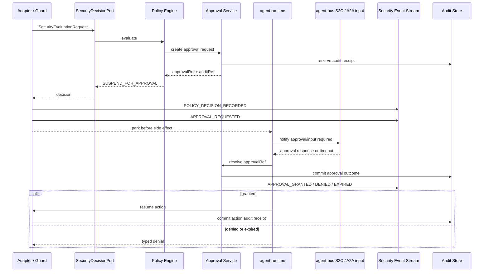

# Agent 审批与审计事件 L2 Proposal

> **日期：** 2026-06-13
> **状态：** Draft
> **上级文档：** `2026-06-13-agent-security-decision-chain-proposal.cn.md`
> **影响范围：** 审批挂起、安全事件流、审计回执，以及运行时恢复行为。

## 0. 最新 main 对齐与不适合项（2026-06-18）

按 `origin/main@61fae167` 重新校准后，本 proposal 仍适合保留，但需要避免把样例、传输态和持久化职责混成一层：

| 原设计点 | 是否仍适合 | 修改后的约束 |
|---|---|---|
| 将 A2A `INPUT_REQUIRED` 用作审批挂起形态 | 部分适合 | 只能作为 A2A 可见投影；审批事实仍由 `security-approval.v1.yaml` 的 `approvalRef`、状态机、过期时间和审计回执决定；链式 remote A2A 时必须绑定到具体 leg |
| 默认 runtime 拥有 durable approval/audit store | 不适合 | `agent-runtime` 仍是 library/adapter surface；durable store 应由 host application 或 `agent-service` 通过 port 提供 |
| `audit-trail.v1.yaml` 可直接作为已执行契约 | 需收窄 | contract catalog 当前仍将 audit trail 标为 design-only；本 proposal 只能提出扩展和落地顺序，不能声称已 shipped |
| 使用 `financial` 下审批/审计代码作为通用实现 | 不适合 | `financial` 是 regulated business action 样例验证面，可验证 R5/dual-control 语义，但不能替代平台 `security-approval` / `audit-trail` |
| 持久化 raw prompt/tool/API/A2A/sandbox payload | 不适合 | 只能默认保存 hash、脱敏摘要或 artifact ref；受控原文必须走独立 regulated evidence store |

最新 main 已有 A2A metadata proposal、bounded remote continuation、S2C callback transport，以及 `financial` 样例轨道；这些都应作为审批/审计的输入或验证面，而不是审批 truth 本身。

### 0.1 2026-06-18 main delta：per-leg approval/audit correlation

`origin/main@61fae167` 后，一个 parent task 可以包含多个 remote A2A leg。审批与审计不能只绑定 parent task，否则无法 replay 哪一段 remote invocation 被批准、拒绝、取消或超过 `max-legs`：

- `approvalRef` / `auditRef` 应关联 `remoteInvocationChainId`、`remoteLegIndex`、`toolCallId`、`remoteTaskId`、`remoteContextId`；
- `REMOTE_INVOCATION_LIMIT_EXCEEDED` 应产生 security event 和 audit receipt，而不是普通 remote failure；
- 多次 `INPUT_REQUIRED` 只表示不同 continuation 投影；每次恢复前仍要重新校验 policy version、chain budget 和审批有效性。

## 1. 背景

安全决策链不能只有 `allow` / `deny` 两种结果。高风险能力调用经常需要进入第三种状态：先暂停动作，等待人审或系统审批；审批通过后继续执行，审批拒绝或超时则返回有类型的拒绝结果。

本提案定义 `SUSPEND_FOR_APPROVAL`、安全决策事件、审计回执之间的关系，使本仓可以把“安全意识”落成一条可执行、可追溯、可审计的运行时链路。

设计必须遵守当前代码仓约束：

- `TrajectoryEvent` 是运行轨迹遥测事件，当前 v2 事件类型集合是封闭的；
- `agent-bus` 已经拥有 S2C callback primitives；
- `agent-runtime` 负责 A2A 执行、A2A metadata / bounded remote continuation 和 agent 框架 adapter；
- `agent-service` 可以承载服务化审批状态和持久化审计实现；
- `financial` 目录中的 approval/audit rail 只能作为 regulated business action 样例；
- 不重新引入已经退役的 `agent-middleware` 作为运行时强依赖。

## 2. 范围

本提案定位为：

- `affects_level: L2`
- `affects_view: development`

本提案定义：

- `security-approval.v1.yaml`；
- `security-decision-event.v1.yaml`；
- 审批请求如何创建、恢复、过期、取消和审计；
- 安全事件如何与轨迹事件并行存在，而不是替代轨迹事件；
- 高风险副作用执行前，审计回执如何作为前置义务。

本提案不定义：

- `SecurityEvaluationRequest` / `SecurityDecision` 的核心字段，这部分归安全决策契约 L2；
- capability permission YAML，这部分归权限策略 L2；
- 审批 UI 页面或 timeline 产品界面；
- 具体数据库表结构，只定义必须满足的持久化语义。

## 3. 根因 / 最强解释（Root Cause / Strongest Interpretation, Rule D-1）

1. **Observed failure / motivation：** 上级安全决策链可以返回 `SUSPEND_FOR_APPROVAL`，但如果没有审批与审计契约，runtime 不知道如何暂停、恢复、过期、取消，也无法证明动作是否在授权后执行。
2. **Execution path：** policy decision 返回 `SUSPEND_FOR_APPROVAL`，runtime 在副作用前暂停动作，approval service 记录审批状态，操作者审批或超时，runtime 根据审批结果恢复或拒绝动作，security event 与 audit receipt 记录全过程。
3. **Root cause：** 当前 `TrajectoryEvent` 是运行遥测，不是审批状态机；`audit-trail.v1.yaml` 仍是设计态契约，尚未提供可执行的审批与回执语义。
4. **Evidence：** 当前 `TrajectoryEvent.Kind` 主要覆盖 run/model/tool/reasoning/error/progress；contract catalog 将 `audit-trail.v1.yaml` 标为 design-only；`agent-bus` 已拥有 S2C callback transport，可承载审批通知；A2A remote path 已使用 `INPUT_REQUIRED` / continuation 与 request metadata；`financial` 仅提供领域样例轨道。

## 4. 设计方案

### 4.1 不复用 `TrajectoryEvent` 承载审批语义

本提案不建议直接扩展 `TrajectoryEvent.Kind` 来承载审批、安全策略和审计事件，而是新增一条并行的安全事件流：

```text
TrajectoryEvent
  -> 运行轨迹、span、adapter 进度、工具执行过程

SecurityDecisionEvent
  -> policy decision、approval、audit、redaction、fallback、sandbox/security outcome
```

两类事件通过以下字段关联：

- `tenantId`
- `sessionId`
- `taskId`
- `traceId`
- `spanId`
- `securityEvaluationRequestId`
- `decisionId`
- `auditRef`

这样可以避免破坏当前 trajectory enum 和 OTel sink，同时又能重建完整的会话安全时间线。

### 4.2 新增契约：`security-decision-event.v1.yaml`

安全决策事件用于记录“安全决策链发生了什么”，但不直接承载敏感 payload。

事件类型：

```text
POLICY_DECISION_RECORDED
APPROVAL_REQUESTED
APPROVAL_GRANTED
APPROVAL_DENIED
APPROVAL_EXPIRED
APPROVAL_CANCELLED
AUDIT_RECEIPT_RESERVED
AUDIT_RECEIPT_COMMITTED
REDACTION_APPLIED
SANDBOX_ROUTE_DECIDED
EGRESS_DECISION_RECORDED
MEMORY_ACCESS_DECISION_RECORDED
FALLBACK_DECISION_RECORDED
POLICY_ENGINE_DEGRADED
```

最小字段：

```yaml
schemaVersion: security-decision-event/v1
eventId: sec_evt_01
eventKind: POLICY_DECISION_RECORDED
tsEpochMillis: 1780000000000
tenantId: tenant-a
sessionId: session-a
taskId: task-a
agentId: agent-a
traceId: trace-a
spanId: span-a
decisionId: dec-a
securityEvaluationRequestId: sec_eval_req-a
policyId: policy-a
policyVersion: "2026-06-13.1"
decisionType: SUSPEND_FOR_APPROVAL
approvalRef: approval-a
auditRef: audit-a
payloadRef: payload_ref://security-event/sec_evt_01
redactionSummary:
  secretCount: 0
  piiCount: 1
```

规则：

- 不在事件内联写入 raw prompt、raw capability arguments、tool args、file payload、API body、credential、PII；
- 大 payload 和敏感内容只能通过 `payloadRef` 引用，且 `payloadRef` 默认指向脱敏后的 artifact，不指向 raw interaction；
- 如确需保留受控原文，必须走独立 regulated evidence store、break-glass 权限、短 TTL、访问审计和加密，不作为 security event / audit receipt 的默认行为；
- runtime 能分配序号的场景，应保证同一 task 内事件单调有序；
- 对消费者而言，安全事件流是 append-only。

### 4.3 新增契约：`security-approval.v1.yaml`

审批对象用于记录一个待审批动作的生命周期。

```yaml
schemaVersion: security-approval/v1
approvalRef: approval_01
decisionId: dec_01
securityEvaluationRequestId: sec_eval_req_01
tenantId: tenant-a
sessionId: session-a
taskId: task-a
agentId: agent-a
status: REQUESTED
requestedAction:
  actionType: BUSINESS_ACTION
  capabilityKind: BUSINESS_ACTION
  targetName: payment.transfer
  requestedScope:
    businessAction: payment.transfer
    maxAmount: "policy-defined"
riskTier: R5_BUSINESS_CRITICAL
policyId: payment-transfer-prod
policyProfile: regulated_prod
profileRule: r5.regulated_approval
reasonCode: REGULATED_APPROVAL_REQUIRED
requestedAt: "2026-06-13T10:00:00Z"
expiresAt: "2026-06-13T10:15:00Z"
approver:
  role: regulated-operator
result:
  status: null
  decidedAt: null
  reason: null
auditRef: audit_01
```

审批状态：

```text
REQUESTED
GRANTED
DENIED
EXPIRED
CANCELLED
SUPERSEDED
```

状态含义：

| 状态 | 含义 | runtime 行为 |
|---|---|---|
| `REQUESTED` | 已创建审批请求，等待结果 | 挂起动作，不执行副作用 |
| `GRANTED` | 审批通过 | 重新校验策略后恢复动作 |
| `DENIED` | 审批拒绝 | 返回 typed denial |
| `EXPIRED` | 审批超时 | 拒绝动作并记录过期事件 |
| `CANCELLED` | 任务或会话取消 | 取消审批，清理挂起状态 |
| `SUPERSEDED` | 被新策略或新请求替代 | 拒绝旧请求，只允许新请求继续 |

### 4.4 运行时审批流程



关键原则：

- 审批通过之前，不得执行目标副作用；
- 审批请求展示给用户或操作者前，应先完成必要的 audit reserve；
- 审批通过后，runtime 需要在恢复动作前做一次轻量 re-evaluate，防止策略版本变化；
- 审批结果、恢复动作结果、审计提交结果都必须发出安全事件。

### 4.5 与当前 runtime surface 的映射

| 当前 surface | 本提案中的用途 |
|---|---|
| `agent-runtime.engine.spi.AgentRuntimeHandler` | handler wrapper 或 adapter 在副作用前返回 parked/typed failure state；被 guard 的 lifecycle/cancel 操作发出 runtime-control security event |
| `agent-runtime.common.RuntimeMessage` | 审批提示、展示摘要和审计 hash 的来源对象；进入事件前必须脱敏 |
| `agent-runtime.engine.a2a` | 将 approval-required 状态映射为 A2A `INPUT_REQUIRED` / parked task 风格行为 |
| `agent-bus.spi.s2c.S2cCallbackTransport` | 作为审批提示的可选服务端到客户端通知通道 |
| host application / `agent-service` | runtime 作为 library 不默认持久化；宿主或服务化层保存 approval record、audit receipt、redacted artifact |
| `financial` approval / audit sample | regulated R5 business action 的测试 fixture；不作为通用审批服务或审计存储 |
| `TrajectoryEvent` | 保留为运行遥测，只携带 correlation 信息 |
| `SecurityDecisionEvent` | 新增安全事件流，记录策略、审批、审计和降级结果 |

### 4.6 与 AgentScope / OpenJiuwen / A2A 的暂停恢复关系

审批和审计状态应由本仓拥有。AgentScope、OpenJiuwen 和 A2A 可能提供 interruption、input-required、callback 等机制，但这些机制只能作为交互承载方式，不能成为审批事实本身。

| 框架 / 路径 | 原生暂停恢复形态 | 本仓应拥有的行为 |
|---|---|---|
| OpenJiuwen tool callback / interrupt | 可通过 tool callback 或 interrupt-like result 暴露中断 | 高风险动作必须在副作用前被本仓挂起；`approvalRef` / `auditRef` 由本仓创建 |
| OpenJiuwen remote tool path | 远程工具可能暴露 interrupt 或 remote invocation metadata | outbound A2A approval 仍按 `taskId` / `toolCallId` / `decisionId` 关联 |
| AgentScope local/harness adapter | `AgentScopeEvent.interrupted(...)` 和 stream event 可表达中断 | adapter 仅在本仓 security decision 要求时映射为 approval 或 typed denial |
| AgentScope remote runtime client | 外部 runtime 可能只暴露 stream event，不支持本仓审批语义 | 若需要审批，本仓必须在调用远程 runtime 前暂停；不能等远程 runtime 事后通知 |
| A2A remote invocation | 远程 task 可返回 `INPUT_REQUIRED` 并后续继续，`REMOTE_RESUME` 后也可触发下一段 bounded remote leg | 本仓审批可映射为 A2A input-required，但审批结果仍以 `security-approval.v1.yaml` 为准；审批必须绑定具体 chain leg |
| A2A northbound task | 外部客户端看到 `TASK_STATE_INPUT_REQUIRED` 或 parked task snapshot | 这只是传输/产品态；审批状态机、过期、拒绝、恢复由本仓 approval record 决定 |
| financial regulated rail | 领域侧可能已经有敏感动作审批与审计 | 只能作为 R5/dual-control 样例；平台审批 record 必须仍能独立 replay |
| SDK Java/HTTP tool mapper | 无原生 HITL，但调用过程由本仓 adapter 控制 | 最适合在副作用前挂起，并在审批通过后恢复 |

约束：

- 如果安全决策要求审批，动作不得先委托给框架执行；
- 如果某框架只能在动作开始后中断，则该路径不能用于 R4/R5 高风险前置审批，除非增加 wrapper、proxy 或 sandbox 控制点；
- 框架取消与本仓审批取消应关联但不能等同；
- 框架的 input-required 状态不是 audit receipt。
- A2A `INPUT_REQUIRED`、`SendMessage` 聚合快照、SSE event、push callback 都不能成为审批事实，只能携带 `approvalRef` / `decisionId` / `remoteInvocationChainId` / `remoteLegIndex` 的可见状态。

#### 最小代理下的审批边界

HITL 的职责是确认“代理边界内的一次高风险动作是否可以继续”，不是让用户临时扩大 agent 的代理范围。否则系统会退化为“最小权限 + 频繁问人”，带来确认疲劳和过度授权。

规则：

- 审批请求必须携带 `delegationEnvelopeRef`、`requestedScope`、`policyProfile`、`riskTier` 和 `profileRule`；
- 越过 `DelegationEnvelope` 的请求应直接拒绝或进入策略变更流程，不创建普通 HITL 审批；
- “always allow / remember my choice” 只能生成带 scope、expiresAt、actor、reason 的候选 grant，且必须重新经过 policy validation；
- AgentScope / OpenJiuwen / JiuwenSwarm 的 interruption、input-required、approval override 只能作为交互通道或 evidence，不能成为本仓审批事实；
- 审批通过后恢复执行前必须重新校验 policy version 与 envelope，防止等待期间策略变化。

### 4.7 审批执行规则

| 场景 | 必须行为 |
|---|---|
| `strict_allowlist` 下 capability 不在白名单 | 直接拒绝，不创建 HITL 请求 |
| `review_unknown` 下 capability 不在白名单 | posture 允许时创建 HITL 审批 |
| `scoped_allowlist` 命中白名单但 scope 越界 | 直接拒绝，不让用户审批越权 |
| `least_agency_scoped` 命中白名单但超出 `DelegationEnvelope` | 直接拒绝或进入策略变更，不创建普通 HITL |
| `regulated_prod` 的 R3/R4/R5 动作 | 按 profile rule 要求审批和审计 |
| 需要审批但 approval service 未配置 | research/prod 拒绝；dev 可走本地 console/test harness |
| 审批超时 | 拒绝动作，发出 `APPROVAL_EXPIRED`，提交审计结果 |
| 等待审批时 task 被取消 | 取消审批，发出 `APPROVAL_CANCELLED`，best-effort 取消下游动作 |
| 审批过期后又收到通过 | 作为 stale approval 拒绝；如策略允许，创建新审批 |
| 相同 idempotency key 重试 | 返回已有 unresolved approval 或最终结果 |
| 等待期间 policy version 变化 | 恢复前重新评估；新策略更严格时拒绝 |

### 4.8 审计回执规则

审计回执和安全事件不是同一件事：

```text
security event = 可观察的安全决策时间线
audit receipt  = 高风险决策/动作已被持久记录的合规证据
```

规则：

- research/prod 中的 R4/R5 动作必须在副作用前获得 `auditRef`；
- audit reservation 应发生在审批请求展示前；
- approval outcome 和 action outcome 都要 commit 到 audit；
- 如果副作用执行后 audit commit 失败，runtime 必须发出 emergency failure metric，并写入本地 append-only recovery record；
- 如果副作用执行前 audit reserve 失败，动作不得执行。

#### 交互内容脱敏与留存规则

审计要证明“做过什么决策、基于什么范围、谁批准、结果如何”，不应默认留存完整交互内容。用户输入、模型输出、tool args、tool result、文件片段、API request/response、MCP resource、A2A message、sandbox stdout/stderr 都可能包含 PII、凭证、业务秘密或受监管数据，必须先分类和脱敏，才能进入可持久化日志或审计检索面。

推荐落盘链路：

```text
raw interaction
  -> data classification / secret scan / PII scan
  -> redactedPreview + redactionSummary + originalHash
  -> SecurityDecisionEvent / AuditReceipt
  -> optional redacted payload artifact referenced by payloadRef
```

字段约束：

| 字段 | 可否持久化 | 说明 |
|---|---|---|
| `redactedPreview` | 可以 | 只放脱敏摘要、结构化字段、截断后的低敏文本 |
| `originalHash` / `inputHash` | 可以 | 用于 replay 证明，不反推出原文 |
| `redactionSummary` | 可以 | 记录 secret/PII/credential/regulated 命中数量和规则版本 |
| `payloadRef` | 可以 | 仅指向脱敏 artifact；访问需要 tenant/session/task scope 和 audit |
| raw prompt / raw model output | 默认不可以 | 需要 regulated evidence store 和 break-glass |
| raw tool args/result、file/API/MCP/A2A body、sandbox output | 默认不可以 | 只能存 hash、脱敏摘要或受控 artifact ref |

降级规则：

- 需要审计的 R3+ 动作，如果脱敏器不可用且交互内容需要留存，则 research/prod 必须 suspend 或 deny；
- 低风险动作可丢弃 payload，仅记录 `REDACTION_UNAVAILABLE` security event、hash 和 metric；
- 脱敏规则版本、policy version、scanner version 必须进入 audit metadata；
- 审批界面展示给人的内容也必须使用同一份 `redactedPreview`，不能为了“让人看清楚”绕过脱敏；
- payload artifact 的 retention 不应长于审计合规要求，过期后保留 hash、decision、approval、audit receipt。

### 4.9 降级行为

| 故障 | dev | research | prod |
|---|---|---|---|
| approval service 不可用 | 低风险可本地询问；高风险拒绝 | suspend 或拒绝 | 拒绝 |
| audit reserve 不可用 | R0-R1 可警告 | R3+ 拒绝 | 需要审计的 R2+ 拒绝 |
| redaction pipeline 不可用 | 低风险丢弃 payload 并记录 metric | 需要留存交互内容的 R3+ suspend/deny | 需要审计的 R2+ suspend/deny |
| security event sink 不可用 | 本地 buffer | buffer + metric；audit 也不可用时拒绝高风险 | buffer + alert；无 audit receipt 时拒绝 |
| S2C callback 不可用 | typed denial 或 local prompt | 有替代审批通道才 suspend | 无合规替代通道则拒绝 |
| stale approval | 拒绝 | 拒绝 | 拒绝 |

### 4.10 会话安全时间线重建

一个会话的安全时间线由四类数据拼接：

- `TrajectoryEvent`：运行调用树和适配器进度；
- `SecurityDecisionEvent`：策略、审批、fallback、安全降级；
- audit receipt：合规级证据；
- payload refs：脱敏后的细节检索引用。

本提案不要求立即实现 DB/UI。由于 `agent-runtime` 当前定位为 library，持久化 store、retention、加密、备份和 break-glass 访问应由 host application 或 `agent-service` 提供；runtime 只负责发出结构化事件、调用 port、携带 refs。后续 MCP replay 或可视化界面可以按照现有架构规则读取这些引用。

### 4.11 与安全决策契约 L2 的关系

`SecurityDecision` 应携带以下引用：

- `securityEvaluationRequestId`
- `decisionId`
- `approvalRef`
- `auditRef`
- `obligations`
- `expiresAt`

安全决策契约 L2 负责定义这些字段如何由 policy engine 生成；本提案负责定义这些引用返回 runtime 后如何被执行、恢复和审计。

### 4.12 与权限策略 L2 的关系

Capability policy 可以为 tool、file、API、MCP、A2A、sandbox、memory、model、business action 产生 `mode=ask` 或 `mode=approval`。本提案定义这些模式如何变成 runtime 中的挂起动作。

```text
capability-permissions.yaml activeProfile=review_unknown or regulated_prod
  -> SecurityDecision(type=SUSPEND_FOR_APPROVAL)
  -> ApprovalRequest(status=REQUESTED)
  -> action resumes only after GRANTED
```

## 5. 替代方案

| 替代方案 | 不采用原因 |
|---|---|
| 直接把审批事件加到 `TrajectoryEvent.Kind` | 会破坏当前封闭 enum 和 OTel 假设；并行安全事件流更清晰 |
| 只把审批写进日志 | 日志不是状态机，不能安全恢复 task |
| 让各框架 adapter 自己实现审批 | 会导致 OpenJiuwen、AgentScope、API/MCP、file、sandbox、memory、A2A 语义不一致 |
| 先执行动作再请求审批 | 违反高风险副作用前置控制原则 |
| 在 UI 完成前拒绝所有需要审批的动作 | 过于保守；早期可由 S2C、A2A、local harness 覆盖 |

## 6. 验证计划

- [ ] `SecurityApprovalSchemaTest`：校验必填字段、状态转换和过期逻辑。
- [ ] `SecurityDecisionEventSchemaTest`：校验事件类型和脱敏规则。
- [ ] `AuditRedactionBeforePersistTest`：交互内容进入 security event / audit 前必须先生成 `redactedPreview`、`redactionSummary` 和 hash。
- [ ] `RawInteractionPayloadDeniedTest`：raw prompt、tool args/result、API body、MCP resource、sandbox output 不得直接进入 audit/security event。
- [ ] `RedactionFailureFailClosedTest`：research/prod 中需要审计且需要留存交互内容的动作，在脱敏不可用时 suspend 或 deny。
- [ ] `PayloadRefAccessControlTest`：`payloadRef` 只能指向脱敏 artifact，并按 tenant/session/task scope 访问。
- [ ] `ApprovalProfileBehaviorTest`：验证 `strict_allowlist` 拒绝未知能力、`review_unknown` 创建 HITL、`scoped_allowlist` 拒绝 scope 越界、`least_agency_scoped` 阻断 envelope 越界、`regulated_prod` 要求审批和审计。
- [ ] `ApprovalBeforeSideEffectTest`：审批通过前不执行副作用能力。
- [ ] `ApprovalForApiMcpA2aTest`：需要审批的 API、MCP、A2A 调用都在网络调用前挂起。
- [ ] `ApprovalForFileAndSandboxTest`：需要审批的文件写入和沙箱执行都在副作用前挂起。
- [ ] `FrameworkApprovalBoundaryTest`：OpenJiuwen、AgentScope、A2A、SDK 路径不能把框架 interruption/input-required 当成本仓审批事实。
- [ ] `OpaqueFrameworkApprovalDenyTest`：无法前置挂起的 R4/R5 框架内部副作用在 research/prod 被拒绝。
- [ ] `ApprovalCannotExpandDelegationEnvelopeTest`：超出 `DelegationEnvelope` 的请求不会创建普通 HITL，审批通过也不能扩大代理边界。
- [ ] `FrameworkAlwaysAllowImportTest`：框架 always-allow/approval override 只能导入为有 scope 和 expiry 的候选 grant，且必须经过本仓策略验证。
- [ ] `ApprovalExpiryTest`：过期审批不能恢复动作。
- [ ] `AuditReserveBeforeActionTest`：R4/R5 动作在 audit reserve 失败时不得执行。
- [ ] `AuditCommitRecoveryTest`：动作后 audit commit 失败会产生 recovery record 和 alert。
- [ ] `A2aApprovalInputRequiredTest`：需要审批的决策可映射为 A2A 可见的 parked/input-required 状态。
- [ ] `A2aInputRequiredNotApprovalTruthTest`：A2A `INPUT_REQUIRED`、SSE、push callback 只携带审批引用，不能替代 approval record。
- [ ] `A2aRemoteChainApprovalAuditTest`：同一个 parent task 内多个 remote leg 的 approval/audit refs 必须按 chain id、leg index、toolCallId、remote task/context 关联。
- [ ] `FinancialRailIsFixtureTest`：`financial` 领域审批/审计样例可以验证 R5 语义，但不能作为平台 approval/audit truth。
- [ ] `RuntimeLibraryNoDurableAuditStoreTest`：`agent-runtime` 不默认落 durable audit store，必须通过 host/service port 或测试 harness 注入。
- [ ] `RuntimeControlAuditEventTest`：被 guard 的 start/stop/health/cancel 操作发出 runtime-control security event，且在具备 redaction/policy refs 前不能创建 durable audit record。
- [ ] `S2cApprovalCallbackTest`：配置后可通过 S2C callback transport 发送审批请求。
- [ ] `SecurityTimelineJoinTest`：trajectory + security events + audit refs 可以重建同一个 task timeline。

## 7. 落地节奏

- **Wave 1：** 将 security event 和 approval schema 作为 design-only contract 加入 contract catalog。
- **Wave 2：** 实现 dev/research 可用的 in-memory approval service 和 JSONL security event sink。
- **Wave 3：** 接入 A2A/S2C 的审批挂起和恢复流程。
- **Wave 4：** 在 `agent-service` 增加持久化 audit reservation / commit 实现。

冻结影响：

- `audit-trail.v1.yaml` 可能需要扩展 decision receipt 章节；
- contract catalog 在本契约落地时应列入 `security-approval.v1.yaml` 和 `security-decision-event.v1.yaml`。

## 8. 自审

| 问题 | 严重度 | 状态 | 缓解方式 |
|---|---|---|---|
| 审批状态可能需要超出当前 runtime 生命周期的持久化 task parking | P1 | open | 先支持 in-memory/dev，再服务化持久化 |
| A2A input-required 映射需要代码验证 | P1 | open | 标记 runtime-enforced 前增加集成测试 |
| financial 样例容易被误读为平台审批实现 | P1 | open | 在 contract catalog / proposal 中标注 fixture-only，平台 truth 仍是 `security-approval` 与 audit receipt |
| 审计存储后端不在本提案内定义 | P2 | open | 本提案定义 receipt 语义；存储作为实现 wave |

## 依据

- 上级文档：`2026-06-13-agent-security-decision-chain-proposal.cn.md`。
- ADR-0074：S2C callback contract。
- ADR-0156：audit trail design authority。
- 当前 runtime 结构：`agent-runtime` 负责执行与 adapter，`agent-service` 负责服务化 policy 和 durable state，`agent-bus` 负责 S2C/engine contracts。
