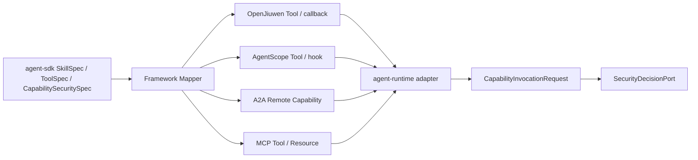

# Agent 能力权限策略 L2 Proposal

> **日期:** 2026-06-13
> **状态:** Draft
> **父 proposal:** `2026-06-13-agent-security-decision-chain-proposal.cn.md`
> **影响范围:** 能力权限声明、白名单底座、scope policy、profile 预设、runtime enforcement handoff。

## 0. 最新 main 对齐与不适合项（2026-06-18）

按 `origin/main@61fae167` 重新校准后，本 proposal 的“能力权限策略”方向仍适合，但有几处原设计需要收窄：

| 原设计点 | 是否仍适合 | 修改后的约束 |
|---|---|---|
| 把 `agent-sdk` 作为直接落地模块 | 部分适合 | `agent-sdk/` 已在代码树中出现，但 root reactor 仍未列入它；Wave 1 只能把它当候选 schema/spec 落点，纳入 shipped enforcement 前必须同步 root POM、module metadata、generated facts 与 contract catalog |
| 只覆盖 tool/file/API/MCP/A2A/sandbox/memory | 需扩展 | 最新 main 有 `collaboration` 的 `Coordinator` / `A2aWorker` 与 `financial` 样例；策略语言应预留 worker delegation 与 business approval 范围，但这些目录当前只作为验证样例，不是平台强制依赖 |
| `MEMORY` 仅用 tenant/session/read/write 描述 | 需增强 | `a2a-shared-memory` 已引入共享记忆语义，memory scope 必须表达 owner/principal、poison check、retention、idempotency 与 cross-agent visibility |
| A2A remote 只校验 remoteAgentId/skill/timeout | 不足 | A2A metadata proposal 与 bounded chained remote invocation path 要求策略检查 metadata trust source、`remoteInput` 命名空间、remote task/context/tool correlation、chain depth、per-leg capability 和 `max-legs` |
| 使用 financial approval rail 作为平台实现 | 不适合 | `financial` 下的审批/审计代码只能作为 regulated business action 的样例验证面，不能替代通用 `security-approval` / `audit-trail` 契约 |

因此，修改后的落地顺序是：先落 contract schema 与 runtime/service 评估路径；`agent-sdk`、`collaboration`、`financial` 等新目录只有在纳入 root reactor 与事实抽取后，才可被声明为 shipped platform surface。

### 0.1 2026-06-18 main delta：A2A remote scope becomes chain scope

`origin/main@61fae167` 允许 `REMOTE_RESUME` 后继续发起下一段 remote A2A invocation，并由 `agent-runtime.remote-invocation.max-legs` 限制循环。权限策略不能把 `A2A_REMOTE_AGENT` 视为一次性 endpoint grant，而应按 bounded chain 评估：

- allowlist 命中 remote agent 只是必要条件；每个 leg 的 remote agent、skill/capability、message class 和 metadata trust source 都要命中 scope；
- `maxRemoteLegs` / chain budget 必须由 policy 显式上限约束，runtime config 只能作为技术保护，不能扩大 policy；
- `REMOTE_INVOCATION_LIMIT_EXCEEDED` 是 policy/audit 可见的拒绝原因，不应被普通 remote tool error 混淆。

## 1. 背景

父 proposal 定义整体安全链路：安全红线 -> capability 风险声明 -> 权限策略 -> `SecurityDecisionPort` -> runtime guard -> trajectory/security-event/audit。本 L2 只负责权限策略部分。

权限不能只覆盖 tool call。Agent runtime 中的高风险动作可能来自工具、文件读写、HTTP/API、MCP、A2A remote agent、sandbox、memory、model 或业务动作。它们本质上都是 capability invocation，只是资源类型不同。

当前 main 分支已有：

- `agent-sdk` 的 `SkillSpec` 与 `ToolSpec` 代码树，但尚未进入 root reactor；
- `agent-runtime` 的 OpenJiuwen、AgentScope、remote A2A adapter、A2A metadata proposal 与 trajectory emission；
- `agent-service` 作为 serviceization facade；
- `a2a-shared-memory`、`collaboration`、`financial` 等新目录，可作为权限策略样例与未来接入点；
- 没有活跃的 `agent-middleware` reactor module。

因此，本设计优先扩展当前 `agent-runtime` / `agent-service` seam，并把 `agent-sdk` 作为候选 spec seam，不依赖已退役的 `agent-middleware` hook chain。

## 2. 范围声明

主范围：

- `affects_level: L2`
- `affects_view: development`

本 proposal 定义：

- 部署者可读的 `docs/governance/capability-permissions.yaml`；
- schema contract `docs/contracts/capability-permission-policy.v1.yaml`；
- default deny + allowlist 的保底机制；
- tool、file、API、MCP、A2A、sandbox、memory、model、business action 的 scope permission；
- `CapabilitySecuritySpec`、`SkillSecuritySpec`、`ToolSecuritySpec`；
- `CapabilityInvocationRequest`；
- OpenJiuwen、AgentScope、SDK tools、remote A2A、file/API/MCP、memory、sandbox 路径如何附加权限元数据。

本 proposal 不定义：

- 最终 `SecurityDecisionPort` schema，由安全决策契约 L2 负责；
- 审批持久化与审计存储，由审批审计 L2 负责；
- sandbox provider API；
- 新 runtime 框架或 `agent-middleware`。

## 3. 根因 / 最强解释（Root Cause / Strongest Interpretation, Rule D-1）

1. **Observed failure / motivation:** 高风险能力可通过 tool、file、API、MCP、A2A、sandbox、memory、business adapter 发起，但没有统一的部署者可读权限矩阵。
2. **Execution path:** host / service 加载 policy，framework adapter 映射到 OpenJiuwen、AgentScope、A2A remote、memory 或业务能力，`agent-runtime` 随后执行、路由或委托能力；`agent-sdk` 若被纳入 reactor，可承载 skill/tool/capability spec。
3. **Root cause:** `SkillSpec` / `ToolSpec` / remote capability descriptor 未绑定风险语义，runtime 只能靠名称或实现细节推断风险。
4. **Evidence:** `SkillSpec.java` 当前只有 `name/path/skillFile`；`ToolSpec.java` 当前只有 `name/description/inputSchema/ref`；root reactor 当前活跃模块仍是 `agent-runtime`、`agent-service`、`agent-bus`、BoM；remote A2A path 已使用 request metadata、`remoteInput`、remote task/context/tool correlation。

## 4. 设计方案

### 4.1 设计原则

权限不是一个简单的 allow flag，而是分层决策：

```text
default deny
  -> allowlisted capability
  -> scoped permission
  -> runtime SecurityDecision
  -> obligations: redact / ask / approve / sandbox / audit / rate-limit
```

allowlist 回答“这个能力是否可被考虑”。scope policy 回答“在什么租户、会话、数据、路径、endpoint、动作、posture 下可运行”。runtime decision 回答“这一次具体调用能否现在运行”。

### 4.2 CapabilityKind 能力类型

| CapabilityKind | 示例 | 典型风险 |
|---|---|---|
| `TOOL` | Java tool、HTTP tool、framework-native tool | 取决于副作用 |
| `FILE` | file read/write/list/delete | 本地泄露或变更 |
| `API` | HTTP/gRPC 外部 API | egress、SSRF、外部副作用 |
| `MCP` | MCP server tool/resource/prompt | 间接工具与数据访问 |
| `A2A_NORTHBOUND` | Agent Card、SendMessage、SendStreamingMessage、GetTask、ListTasks、CancelTask、SubscribeToTask、push config | 外部访问、任务可见性、取消/订阅、push callback egress |
| `A2A_REMOTE_AGENT` | A2A remote agent capability、remote task/context/tool correlation | 跨 agent 信任、租户传播、metadata spoofing、远端续问混淆 |
| `WORKER_DELEGATION` | `collaboration` 的 coordinator/worker/subtask 分派 | 子任务越权、worker registry spoofing、跨 agent scope 扩大 |
| `RUNTIME_CONTROL` | runtime/handler surface 上的 `start`、`stop`、`isHealthy`、`cancel(taskId)` | 可用性操纵、跨 task 中断、健康信息暴露 |
| `SANDBOX` | sandbox acquire/execute/file transfer | 代码执行与隔离 |
| `MEMORY` | `MemoryProvider`、A2A shared memory read/write/retrieval | 数据泄露、memory poisoning、cross-agent visibility 泄漏 |
| `AGENT_STATE` | framework checkpointer、Redis/InMemory state、release | 会话状态泄露、跨租户串话、恢复污染 |
| `MODEL` | model invocation/fallback | 数据暴露与策略绕过 |
| `BUSINESS_ACTION` | payment、approval、customer export、production change | 受监管副作用 |

### 4.3 新增 `capability-permissions.yaml`

```yaml
schemaVersion: capability-permission-policy/v1
posture: research
activeProfile: review_unknown
defaultMode: deny

profiles:
  strict_allowlist:
    description: only explicitly allowlisted capabilities can run
    missingFromAllowlist: deny
    matchedAllowlist: allow
    unknownRisk: deny

  review_unknown:
    description: allow scoped whitelist, send unknown capability to HITL
    missingFromAllowlist: ask
    matchedAllowlist: evaluate_scope
    unknownRisk: ask
    approval:
      channel: hitl
      timeout: 15m
      timeoutAction: deny

  scoped_allowlist:
    description: whitelist is required but every invocation still checks scope
    missingFromAllowlist: deny
    matchedAllowlist: evaluate_scope
    scopeViolation: deny

  regulated_prod:
    description: regulated production posture
    missingFromAllowlist: deny
    matchedAllowlist: evaluate_scope
    r3Plus: approval
    r4Plus: sandbox_and_approval
    r5: regulated_approval
    auditRequired: true

allowlist:
  - capabilityKind: TOOL
    capability: web.search
  - capabilityKind: FILE
    capability: workspace.read
  - capabilityKind: MCP
    capability: mcp.docs.search
  - capabilityKind: A2A_REMOTE_AGENT
    capability: quote-agent.ask

tiers:
  R0_PURE_REASONING:
    defaultMode: allow
  R1_LOCAL_READ:
    defaultMode: allow
  R2_NETWORK_READ:
    defaultMode: ask
  R3_STATE_WRITE:
    defaultMode: ask
  R4_CODE_OR_SYSTEM_EXEC:
    defaultMode: sandbox
  R5_BUSINESS_CRITICAL:
    defaultMode: approval

capabilities:
  - selector:
      capabilityKind: API
      capability: web.search
      methods: ["GET"]
      hosts: ["example.com"]
    riskTier: R2_NETWORK_READ
    mode: ask
    scope:
      egress:
        allowHosts: ["example.com"]
        denyHosts: ["169.254.169.254", "localhost"]
      payload:
        maxBytes: 65536
        forbidDataClasses: ["credential"]
    audit:
      required: true

  - selector:
      capabilityKind: FILE
      capability: workspace.write
    riskTier: R3_STATE_WRITE
    mode: ask
    scope:
      filesystem:
        roots: ["workspace://project"]
        denyGlobs: ["**/.ssh/**", "**/.env", "**/secrets/**"]
        maxBytes: 1048576
      actions: ["read", "write"]
    audit:
      required: true

  - selector:
      capabilityKind: MCP
      capability: mcp.docs.search
      serverId: docs-mcp
      toolNames: ["search", "fetch"]
    riskTier: R2_NETWORK_READ
    mode: ask
    scope:
      mcp:
        allowDynamicToolDiscovery: false
        allowedResourceSchemes: ["docs://"]
        maxResultBytes: 262144

  - selector:
      capabilityKind: A2A_REMOTE_AGENT
      capability: quote-agent.ask
      remoteAgentId: quote-agent
    riskTier: R2_NETWORK_READ
    mode: ask
    scope:
      a2a:
        allowedSkills: ["quote"]
        requireTenantPropagation: true
        metadataTrustSources: ["trusted-ingress", "host-validated"]
        requireRemoteCorrelation: true
        maxRemoteLegs: 3
        perLegCapabilityAllowlist: ["quote-agent.ask", "risk-agent.score"]
        maxTimeoutMs: 30000

  - selector:
      capabilityKind: WORKER_DELEGATION
      capability: coordinator.assign
      workerRole: document-review
    riskTier: R3_STATE_WRITE
    mode: ask
    scope:
      workerDelegation:
        allowedWorkerRoles: ["document-review"]
        requireTaskToken: true
        maxFanout: 3

  - selector:
      capabilityKind: SANDBOX
      capability: code.execute
    riskTier: R4_CODE_OR_SYSTEM_EXEC
    mode: sandbox
    sandboxProfile: restricted-code
    approval:
      required: true
    audit:
      required: true

  - selector:
      capabilityKind: BUSINESS_ACTION
      capability: payment.transfer
    riskTier: R5_BUSINESS_CRITICAL
    mode: approval
    approval:
      required: true
      approverRole: regulated-operator
    audit:
      required: true
```

该文件是 desired-state。只有当 policy engine 加载并连接到 `SecurityDecisionPort` 后，才形成 runtime enforcement。

### 4.4 Permission Profiles / Policy Presets 权限预设

profile 是部署者选择的默认行为预设，定义未命中具体规则前如何处理。

| Profile | 场景 | 不在白名单 | 命中白名单 | 未知风险 |
|---|---|---|---|---|
| `strict_allowlist` | 生产系统，宁可不可用也不漂移 | deny | allow 或继续检查 rule-specific scope | deny |
| `review_unknown` | research / evaluation | ask / HITL | evaluate scope | ask / HITL |
| `scoped_allowlist` | 企业默认 | deny | 每次 evaluate scope | deny 或按 posture ask |
| `least_agency_scoped` | 业务已定义合理代理范围的 agent 应用 | deny 或按 posture ask | allowlist + scope + delegation envelope 全部通过才 allow | deny 或要求策略变更 |
| `regulated_prod` | 金融/监管副作用 | deny | evaluate scope + approval/audit obligations | deny |

例子：

- “白名单通过，不在白名单拒绝” = `strict_allowlist`。
- “白名单 + scope 通过，不在白名单走 HITL” = `review_unknown`。
- “白名单只是必要条件，file/API/MCP/A2A scope 每次检查” = `scoped_allowlist`。
- “开发/部署时确定合理代理范围，超过范围再拒绝或 HITL” = `least_agency_scoped`。
- “R3+ 审批，R4+ sandbox + 审批，R5 regulated approval” = `regulated_prod`。

profile 不能覆盖红线。如果 profile 写 allow，但命中 redline 或 tenant deny，仍拒绝。

#### DelegationEnvelope 最小代理边界

最小代理需要在权限白名单之上增加 `DelegationEnvelope`。它不是工具清单，而是“这个 agent 在当前业务场景下被允许代理到哪里”的边界。

```yaml
delegationEnvelopes:
  claim_assistant_default:
    allowedTasks: ["claim_intake", "document_check", "status_query"]
    allowedCapabilityKinds: ["TOOL", "FILE", "API", "MCP", "A2A_NORTHBOUND", "A2A_REMOTE_AGENT", "AGENT_STATE"]
    dataClasses: ["PUBLIC", "INTERNAL", "CUSTOMER_METADATA"]
    fileRoots: ["workspace/claims/${tenantId}/${sessionId}"]
    apiHosts: ["claims.internal.example.com"]
    mcpServers: ["claims-readonly-mcp"]
    remoteAgents: ["ocr-agent", "policy-lookup-agent"]
    maxRiskTier: "R3_STATE_WRITE"
    budget:
      maxToolCallsPerTask: 30
      maxExternalCallsPerTask: 10
    timeWindow: "PT2H"
    unknownAction: "deny"
```

执行规则：

- allowlist 命中只表示“能力可被考虑”，不等于 agent 可自主代理；
- `least_agency_scoped` 下，`requestedScope` 必须是 `DelegationEnvelope` 的子集；
- 不在 envelope 内的能力、文件、API、MCP、A2A、sandbox profile 或业务阈值，即使命中框架本地 allow，也不能执行；
- HITL 审批只能批准 envelope 内的单次动作；扩大 envelope 应走策略变更、审计和版本化流程；
- 框架侧 “always allow” 只能被导入为候选 grant，必须带 scope、expiresAt、actor、reason，且不得超过 envelope。

### 4.5 PermissionMode 权限模式

| Mode | 含义 | Runtime 期望 |
|---|---|---|
| `allow` | 无需交互审批即可运行 | R2+ 仍记录 security event |
| `ask` | 首次或每次调用前询问用户/操作员 | 无 cached grant 时转审批流程 |
| `deny` | 阻断 | 执行前返回 typed denial |
| `sandbox` | 必须走 sandbox | 除显式 dev override 外，不允许 local fallback |
| `approval` | 需要受控审批 | 副作用前必须有 approval/audit refs |
| `redact_and_allow` | 执行前脱敏 | 记录 redaction summary，不记录原始敏感内容 |

### 4.6 Allowlist 之上的权限维度

| 维度 | 示例 | 目的 |
|---|---|---|
| resource scope | file roots、API hosts、MCP server、A2A remote agent、sandbox profile | 防止过宽授权 |
| action scope | read/write/execute/delete/invoke/list/connect | 区分观察与变更 |
| parameter constraints | max payload、deny globs、allowed methods、denied headers、redacted fields | 阻断危险参数形态 |
| risk axes | `riskTier`、`dataClass`、`sideEffect`、`egressScope`、`trustTier` | 避免一维风险评分 |
| identity scope | tenant/user/agent/session/task | 防止全局永久授权 |
| time scope | `expiresAt`、session-only、one-shot grant | 防止 stale permission |
| budget scope | rate limit、max calls、timeout、concurrency、cost budget | 防滥用和成本失控 |
| fallback scope | security-equivalent only | 防止 fallback 降低安全 |

### 4.7 Risk Axes 风险轴

| Axis | 示例值 | 作用 |
|---|---|---|
| `riskTier` | R0-R5 | 粗粒度动作风险 |
| `dataClass` | public/internal/tenant/pii/credential/regulated | 只读 PII 也可能高风险 |
| `sideEffect` | none/local_write/network_write/financial/production | 区分观察和变更 |
| `egressScope` | none/allowlist/internet/private_network | 防止 SSRF 和租户泄漏 |
| `trustTier` | vetted/reviewed/untrusted | 管理第三方能力默认值 |
| `sandboxRequired` | true/false/profile | 对齐 sandbox proposal |

### 4.8 Agent SDK 声明

当前：

```java
public record SkillSpec(String name, Path path, Path skillFile) {}

public record ToolSpec(
        String name,
        String description,
        Map<String, Object> inputSchema,
        ToolRef ref) {}
```

建议：

```java
public record CapabilitySecuritySpec(
        String schemaVersion,
        CapabilityKind capabilityKind,
        String capability,
        RiskTier riskTier,
        TrustTier trustTier,
        Set<DataClass> dataClasses,
        SideEffect sideEffect,
        EgressScope egressScope,
        CapabilityScope scope,
        boolean auditRequired,
        boolean approvalRequired,
        String sandboxProfile) {
}

public record SkillSecuritySpec(
        String schemaVersion,
        RiskTier defaultRiskTier,
        TrustTier trustTier,
        Set<CapabilitySecuritySpec> declaredCapabilities,
        boolean auditRequired) {
}

public record ToolSecuritySpec(
        String schemaVersion,
        CapabilitySecuritySpec capability,
        Map<String, Object> parameterPolicy) {
}
```

兼容规则：

- 保留旧 constructor 或 builder 默认值；
- 缺安全声明视为 `UNKNOWN`，不视为安全；
- dev 可对未知低风险 ask/warn；research/prod 对未知 R2+ 和所有未知副作用能力 deny。

### 4.9 CapabilityInvocationRequest 能力调用请求

```java
public record CapabilityInvocationRequest(
        String schemaVersion,
        String tenantId,
        String userId,
        String sessionId,
        String taskId,
        String agentId,
        CapabilityKind capabilityKind,
        String capability,
        String resourceRef,
        String action,
        RiskTier riskTier,
        Set<DataClass> dataClasses,
        SideEffect sideEffect,
        EgressScope egressScope,
        CapabilityScope requestedScope,
        Object redactedArgsPreview,
        String argsHash,
        String traceId,
        String spanId,
        String idempotencyKey) {
}
```

它不是最终决策，而是 capability-specific 输入，后续转成通用 `SecurityEvaluationRequest`。

### 4.10 Capability Scope 权限范围

| Scope | 必要字段 |
|---|---|
| `FileScope` | roots、allow/deny globs、max bytes、read/write/delete/list |
| `ApiScope` | allowed hosts、methods、paths、headers、timeout、payload limits |
| `McpScope` | server id、tool names、resource schemes、dynamic discovery flag、result limit |
| `A2aNorthboundScope` | methods、agent card visibility、task read/list/cancel/subscribe、push callback hosts、includeArtifacts |
| `A2aScope` | remote agent id、allowed skills/capabilities、tenant propagation、metadata trust source、remote task/context/tool correlation、remote invocation chain id、leg index、max remote legs、per-leg capability allowlist、timeout |
| `WorkerDelegationScope` | coordinator id、worker role、task token、fanout、subtask budget、allowed result classes |
| `RuntimeControlScope` | lifecycle methods、own-task cancel scope、admin-only start/stop、health detail visibility |
| `SandboxScope` | sandbox profile、network profile、filesystem transfer limits |
| `MemoryScope` | memory kind、owner/principal、tenant/session bounds、cross-agent visibility、read/write、retention、idempotency、poison checks |
| `AgentStateScope` | checkpointer kind、tenant/session key pattern、read/write/release、retention、cleanup policy |
| `ModelScope` | model id/provider、prompt data class、fallback equivalence |
| `BusinessScope` | action name、regulated role、dual-control、amount/threshold |

### 4.11 当前模块落点

| 模块 | 变更 | 边界 |
|---|---|---|
| `agent-sdk` | 候选 security spec、YAML parser、capability invocation request builder | 纳入 root reactor 前不得宣称 shipped enforcement；不依赖 `agent-service` |
| `agent-runtime` | adapter 暴露 tool/file/API/MCP/A2A/memory/sandbox/model 时消费 capability metadata | 不直接依赖 policy 实现 |
| `agent-service` | 加载 policy、tenant posture、approval cache、budget state；提供 policy evaluation | 可依赖 config/storage |
| `agent-bus` | 基础 policy 不新增依赖；approval callback 走审批 L2 | 保持中立 |
| `a2a-shared-memory` | shared-memory policy fixtures 与 memory ownership/poison 测试面 | 不能替代 `MemoryProvider` shipped SPI |
| `collaboration` / `financial` | worker delegation / regulated business action 样例验证面 | 不作为平台 policy engine 或通用 approval 实现 |
| BoM | 必要时 pin parser dependencies | 无 runtime 行为 |

### 4.12 Framework Adapter 挂接点



规则：

- OpenJiuwen 工具保留原生表示，但映射时必须保留 `capabilityKind`、`capability`、`resourceRef`、`action`、security spec。
- AgentScope wrapper 同理，不要求 AgentScope 理解本仓 policy language。
- A2A remote tool 视为 `A2A_REMOTE_AGENT` + capability label，不绕过权限策略。
- A2A metadata 必须作为 trust-scoped evidence 导入；`remoteInput`、task id、context id、toolCallId、chain id、leg index 需要命名空间化，不能与本地审批/sandbox/user input 混淆。
- `agent-runtime.remote-invocation.max-legs` 是 runtime 保护上限；policy 中的 `maxRemoteLegs` 可以更严格，不能更宽松地扩大 runtime 上限。
- collaboration worker delegation 只有在其模块被纳入治理面后才作为 `WORKER_DELEGATION` enforcement；此前只作为策略样例与测试 fixture。
- MCP dynamic discovery 默认拒绝，除非 policy 显式允许 server 和 discovered tool/resource class。
- tool 内部 file/API 访问若 runtime 可观测，应创建独立 FILE/API request；不可观测则必须在 enclosing tool 中预声明。

框架关系审视：

| 集成类型 | OpenJiuwen / AgentScope 角色 | 本仓角色 | 结果 |
|---|---|---|---|
| Wrapped SDK capability | 框架接收本仓 SDK mapper 生成的 callable | 映射/调用前 enforce | 最强、优先 |
| Native pre-action callback/hook | 框架在副作用前暴露回调 | 转成 `CapabilityInvocationRequest` 并可阻断 | 可接受 |
| Native post-action callback only | 框架只在执行后发事件 | 只能 telemetry/audit | R3+ 需 wrapper/proxy/pre-declaration |
| Opaque framework-internal side effect | 框架内部执行 file/API/MCP/sandbox/business | 无法信任为受治理 | deny、sandbox 或要求 proxy/wrapper |

AgentScope / OpenJiuwen / JiuwenSwarm 偏最小权限的能力并不阻止本仓实现最小代理，前提是 adapter 不把框架 allow 当作最终授权。正确关系是：

- 框架 permission engine 是下层二次防线；
- 本仓 `capability-permissions.yaml` 与 `DelegationEnvelope` 是 primary policy；
- 框架 bypass、permission disabled、approval override、post-action-only callback 都要在 research/prod 视为“不足以证明可治理”；
- 如果框架内部能力不可观测，必须改为本仓 wrapper/proxy 入口，或限定到 sandbox 并按 enclosing capability 预声明风险。

### 4.13 默认行为矩阵

| Posture | 缺声明 | 缺 policy row | R4/R5 无 sandbox/approval |
|---|---|---|---|
| dev | R0-R1 ask/warn；未知副作用 deny | ask | deny unless explicit dev override |
| research | unknown R2+ deny | deny or ask by profile | deny or suspend |
| prod | deny | deny | deny |

### 4.14 Contract Schema 归属

`docs/contracts/capability-permission-policy.v1.yaml` 负责：

- enum：`CapabilityKind`、`RiskTier`、`TrustTier`、`DataClass`、`SideEffect`、`EgressScope`、`PermissionMode`；
- profile schema：`strict_allowlist`、`review_unknown`、`scoped_allowlist`、`least_agency_scoped`、`regulated_prod` 与自定义 profile；
- selector grammar：`capabilityKind`、`capability`、`serverId`、`remoteAgentId`、`workerRole`、`host`、`path`、`filesystemRoot`、`sandboxProfile`、`agentId`、`tenantScope`；
- scope objects：`FileScope`、`ApiScope`、`McpScope`、`A2aNorthboundScope`、`A2aScope`、`WorkerDelegationScope`、`RuntimeControlScope`、`SandboxScope`、`MemoryScope`、`AgentStateScope`、`ModelScope`、`BusinessScope`；
- merge order：redlines > tenant deny > explicit capability policy > risk-tier default > posture default；
- validation failures：未知 enum、非法 host/path pattern、`mode=allow` + `R5_BUSINESS_CRITICAL` 等不可能组合。

### 4.15 故障处理

| Failure | Required result |
|---|---|
| policy file parse 失败 | policy engine unavailable；高风险能力 deny |
| capability 不在 allowlist | deny，除非显式 dev-only fixture |
| capability 声明缺失 | classify unknown；由 posture/profile 决定 |
| policy 与 redline 冲突 | redline wins；emit validation error |
| sandbox requested but unavailable | deny 或 suspend；不自动 local fallback |
| API/MCP/A2A endpoint 不在 scope | 网络调用前 deny |
| file path 逃逸 allowed root | 文件操作前 deny |
| audit required but unavailable | research/prod 阻断 side-effect action |

## 5. 替代方案

| Alternative | Why rejected |
|---|---|
| 只做 tool-only permission policy | 漏掉 file、API、MCP、A2A、sandbox、memory、model、business-action 风险 |
| 把 allowlist 写进 `AGENTS.md` | 不够机器可读，不能按 tenant/session enforcement |
| 只在 OpenJiuwen / AgentScope adapter 内写权限逻辑 | 跨框架行为不一致 |
| 所有 capability 都走 sandbox | 成本太高，也解决不了 credential、egress、memory、business approval |
| policy engine 只靠名称推断风险 | 脆弱且不可审计 |
| 新增 `agent-middleware` module | 与当前 main 结构冲突 |

## 6. 验证计划

- [ ] `CapabilityPermissionPolicyParserTest`: YAML 可加载，未知 mode/enum 拒绝。
- [ ] `PermissionProfileParserTest`: 验证 built-in/custom profile、timeout、timeout action。
- [ ] `PermissionProfileBehaviorTest`: strict allowlist 拒绝 missing capability，review_unknown 进入 HITL，scoped_allowlist 拒绝 scope violation，least_agency_scoped 校验 envelope，regulated_prod 添加 approval/audit。
- [ ] `DelegationEnvelopeParserTest`: envelope 的 task、scope、budget、timeWindow、unknownAction 可解析且未知字段 fail closed。
- [ ] `DelegationEnvelopeSubsetTest`: requested FILE/API/MCP/A2A/sandbox/state/business scope 必须是 envelope 子集。
- [ ] `CapabilityAllowlistDefaultDenyTest`: 非白名单能力执行前 deny。
- [ ] `CapabilityPermissionMergeOrderTest`: redlines > tenant deny > capability policy > tier default。
- [ ] `CapabilityInvocationRequestBuilderTest`: 稳定 `argsHash` 与 redacted preview。
- [ ] `FilePermissionScopeTest`: path traversal、deny globs、oversized writes 被拒。
- [ ] `ApiPermissionScopeTest`: denied host/method/private-network 被阻断。
- [ ] `McpPermissionScopeTest`: 未授权 MCP server/tool/resource 与 dynamic discovery 被拒。
- [ ] `A2aNorthboundPermissionScopeTest`: 未授权 Agent Card、task read/list/cancel/subscribe、push config、includeArtifacts 被拒。
- [ ] `A2aPermissionScopeTest`: 未授权 remote agent/capability 被拒，并要求 tenant propagation。
- [ ] `A2aMetadataTrustScopeTest`: remote metadata、`remoteInput`、remote task/context/tool correlation 缺失或不可信时 fail closed。
- [ ] `A2aRemoteChainScopeTest`: chained remote A2A 每个 leg 都必须命中 remote agent、capability、metadata trust 和 `maxRemoteLegs` scope，超过上限返回 typed denial。
- [ ] `WorkerDelegationScopeTest`: coordinator/worker/subtask 分派必须命中 worker role、task token、fanout 与 budget scope。
- [ ] `SharedMemoryOwnershipScopeTest`: shared memory read/write 必须命中 owner/principal、tenant/session、idempotency 与 poison policy。
- [ ] `PushCallbackEgressPolicyTest`: push callback URL 必须命中 egress allowlist，私网/未知 host 被拒。
- [ ] `RuntimeControlPermissionScopeTest`: lifecycle start/stop 需要 admin scope，health detail 遵守可见性策略，task cancel 只能作用于授权 tenant/session/task scope。
- [ ] `AgentStatePermissionScopeTest`: InMemory/Redis/OpenJiuwen checkpointer 访问必须命中 tenant/session key scope，`release` 只清理授权范围。
- [ ] `OpenJiuwenCapabilityMetadataTest`: 映射后的 OpenJiuwen tool 保留 capability metadata。
- [ ] `AgentScopeCapabilityMetadataTest`: AgentScope 映射保留同样元数据。
- [ ] `FrameworkBypassCannotExpandAgencyTest`: AgentScope bypass、OpenJiuwen permission disabled、JiuwenSwarm approval override 不能绕过 envelope。
- [ ] `ApprovalCannotExpandEnvelopeTest`: HITL 只能批准 envelope 内动作，不能临时扩大代理范围。
- [ ] ArchUnit: `agent-sdk` 不依赖 `agent-service`。

## 7. 落地节奏

- **Wave 1:** 增加 contract schema、built-in profiles、示例 `capability-permissions.yaml`。
- **Wave 2:** 增加 `CapabilitySecuritySpec` / `SkillSecuritySpec` / `ToolSecuritySpec`，保持 constructor 兼容。
- **Wave 3:** 在 SDK 与 runtime adapter 中创建 request。
- **Wave 4:** 通过 `SecurityDecisionPort` enforce posture/profile defaults。

Freeze impact:

- 不改变 L0 原则。
- `capability-permission-policy.v1.yaml` 落地时更新 contract catalog。

## 8. 自审

| Finding | Severity | Status | Mitigation |
|---|---|---|---|
| capability policy 范围可能超过 v1 实现能力 | P1 | open | 按 kind 标注 contract-defined / runtime-loaded / runtime-enforced |
| `SkillSpec` / `ToolSpec` constructor 扩展风险 | P1 | open | 增加 secondary constructors 或 builders |
| 部分框架原生动作元数据不足 | P1 | open | unknown + high-risk deny |
| policy schema 可能过大 | P2 | open | core mandatory，advanced scope optional |
| `agent-sdk`、`collaboration`、`financial` 还不是 root reactor shipped surface | P1 | open | proposal 中只称候选 seam / 样例验证面；纳入 shipped 前同步 POM、facts、contract catalog |

## 依据

- 父 proposal：`2026-06-13-agent-security-decision-chain-proposal.cn.md`。
- L0 当前模块事实：活跃模块为 `agent-runtime`、`agent-service`、`agent-bus`、BoM；历史 `agent-middleware` 不是目标模块。
- Contract catalog：当前 `agent-runtime` SPI surface 为 `AgentRuntimeHandler`、`StreamAdapter`、`AgentCardProvider`、`MemoryProvider`。
