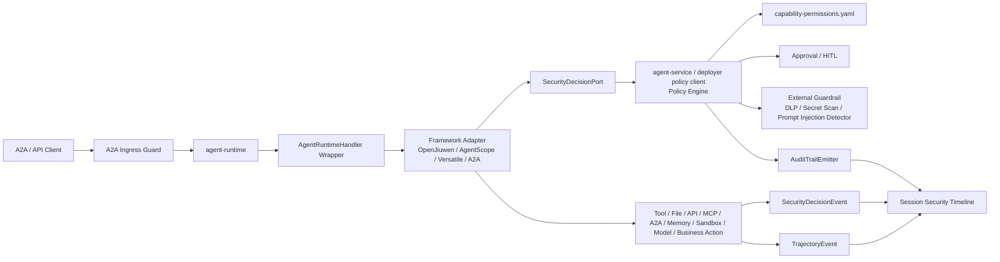
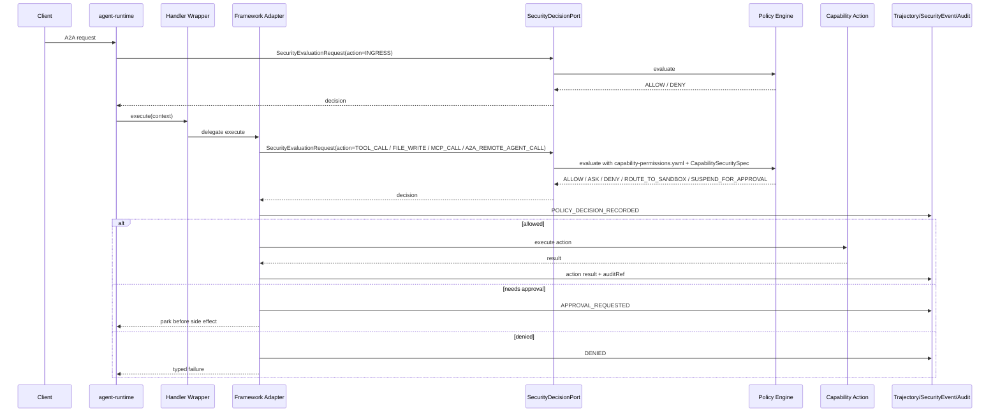

# Agent 安全决策链 Proposal

> **日期:** 2026-06-13
> **状态:** Draft
> **影响范围:** 跨模块运行时安全决策、能力权限治理、审批、安全事件、轨迹与审计。
> **输入分析:** `docs/reports/2026-06-13-agent-security-design-recommendations.zh.md`
> **设计边界:** 本 proposal 不重写 `agent-runtime`、`AgentRuntimeHandler`、OpenJiuwen、AgentScope 或 sandbox 设计，只定义安全决策如何嵌入当前代码仓架构。

## 0. 最新 main 对齐与不适合项（2026-06-18）

本轮按 `origin/main` 的 `61fae167`（merge PR #301，bounded chained remote A2A after `REMOTE_RESUME`）重新校准。当前 root reactor 仍只声明 `spring-ai-ascend-dependencies`、`agent-bus`、`agent-runtime`、`agent-service` 四个 Maven 模块；同时仓库已新增但未纳入 root reactor 的 `agent-sdk/`、`a2a-shared-memory/`、`a2a-shared-memory-memopt/`、`collaboration/`、`financial/` 目录。因此本 proposal 的落地边界需要调整：

| 原判断 / 落点 | 最新 main 状态 | 调整结论 |
|---|---|---|
| 将 `graphmemory-starter-security-guard` 作为落点 | L0/contract catalog 仍把 graphmemory starter 归为 retired/reserved sidecar，主线没有该 starter 模块 | 不适合继续作为主落点；memory 安全优先落到 `MemoryProvider` 与 `a2a-shared-memory` 的 shared/experience store guard |
| 把 `agent-sdk` 当作已治理主路径 | `agent-sdk/` 存在代码和 POM，但 root reactor 未聚合，且没有 `module-metadata.yaml` | 可作为候选 SDK seam；进入 runtime-enforced 前必须先决定是否纳入 root reactor/模块治理 |
| 把 `collaboration`、`financial` 视为平台强制路径 | 两者已在 main 出现，但更像示例/行业工作区，不在 root reactor | 不作为安全决策链的强制平台依赖，只作为策略 fixtures 与行业化验证样本 |
| 只覆盖单次 `A2A_REMOTE_AGENT` | 最新 main 已有 request-level A2A metadata contract proposal、`remoteInput` 约定、remote stream timeout/cancel 处理，并已允许 `REMOTE_RESUME` 后继续发起 bounded chained remote A2A legs | 需要显式治理 A2A metadata、tenant propagation、toolCallId/remote task correlation、chain depth、`max-legs` 和 fallback 等价性 |
| 直接扩展 `TrajectoryEvent` 作为安全事实 | contract catalog 仍声明 trajectory 是遥测；`audit-trail.v1.yaml` 仍是 design-only | 保持并行 `SecurityDecisionEvent` / audit receipt，不把安全事实塞进 trajectory |

不适合继续按原样推进的部分：

- 不再使用虚拟落点 `agent-service-security-policy`、`agent-security-control-plane-events`、`graphmemory-starter-security-guard`；改为显式 contract 文件、`agent-runtime` port、`agent-service` policy façade、`a2a-shared-memory`/`collaboration`/`financial` 的可选验证路径。
- 不把 `agent-sdk`、`a2a-shared-memory`、`collaboration`、`financial` 写成“已纳入治理主路径”的事实；它们在 proposal 中只能是候选集成点或示例验证面，除非后续 commit 同步 root POM、module metadata、architecture facts 和 contract catalog。
- 不声明本仓能深度控制远端 A2A/Versatile 内部 tool/sandbox；本仓只能在 outbound 前做 endpoint/capability/metadata/tenant/fallback policy，并把远端 sandbox claim 当 evidence，除非有认证 receipt。

### 0.1 2026-06-18 main delta：bounded chained remote A2A

`origin/main@61fae167` 后，remote A2A 不再是“一次 remote call + 一次 local resume”的固定形态。`A2aRemoteInvocationOrchestrator` 会在同一个 parent task 内串行执行多个 remote leg，并通过 `agent-runtime.remote-invocation.max-legs` 限制循环；超过限制时父任务返回 `REMOTE_INVOCATION_LIMIT_EXCEEDED`。安全链路因此必须把 `A2A_REMOTE_AGENT` 从单次能力调用升级为 bounded chain：

- 每个 remote leg 都要有 `remoteInvocationChainId`、`remoteLegIndex`、`toolCallId`、remote task/context、tenant/session/task refs 和 metadata trust source；
- `max-legs` 是安全 budget，不只是可靠性配置；policy 不能允许模型通过连续 remote resume 绕过单次 allowlist；
- cancel、timeout、fallback 和 approval/audit 必须按 leg 记录，同时能回放整个 parent task 的 chain。

## 1. 背景

当前仓库已经有较强的安全意识：L0/L1 治理、ADR、contract catalog、DFX evidence、skill capacity、sandbox policy、AI risk control map、trajectory event、masking、audit-trail contract 等。但问题是，这些安全意识还没有形成一条统一、可执行、可审计的运行时决策链。

目标安全模型：

```text
安全红线
  -> skill/tool/capability 风险声明
  -> capability 权限策略
  -> SecurityDecisionPort
  -> adapter/tool/file/API/MCP/A2A/memory/sandbox/model guard
  -> trajectory + security event + audit
  -> 可回放的会话级安全时间线
```

本 proposal 把报告层建议转成模块级、接口级的总体设计。

## 2. 范围声明

主范围：

- `affects_level: L1`
- `affects_view: [logical, development, process, scenarios]`

本 proposal 定义：

- 仓库级 agent 安全红线文档；
- 部署者可读的 capability 权限策略文件；
- capability 权限与安全决策的契约词汇；
- `agent-sdk` 的 skill/tool/capability 风险声明模型；
- `agent-runtime` 的安全决策 outbound port；
- OpenJiuwen、AgentScope、A2A remote invocation、通用工具、文件、API、MCP、memory、model、sandbox action 的 guard 放置位置；
- paired security decision event 与 audit receipt；
- fail-closed posture 行为；
- 验证与红队测试覆盖。

本 proposal 不定义：

- 新 runtime 框架；
- 新 sandbox provider API；
- 替代已有 sandbox proposal；
- 重新引入已退役的 `HookDispatcher`；
- 具体外部 DLP / content-safety vendor 集成；
- 会话安全时间线 UI。

## 3. 根因 / 最强解释（Root Cause / Strongest Interpretation, Rule D-1）

1. **Observed failure / motivation:** 仓库内已有多处安全设计诉求，但高风险 tool/model/memory/sandbox/file/API/MCP/A2A/business action 尚未统一经过一条可执行、可审计的决策链。
2. **Execution path:** `A2aJsonRpcController -> AgentRuntimeHandler.execute(context) -> framework adapter / tool executor / file/API/MCP adapter / memory adapter / sandbox gateway / remote A2A outbound port -> trajectory/audit`。
3. **Root cause:** 安全红线、权限、风险分级、审批、审计、轨迹目前分散在不同文档和局部实现中，没有一个统一的 runtime decision contract 与强制入口。
4. **Evidence:** 最新 `origin/main` 中 `RuntimeComponents` 仍只携带 `AgentRuntimeHandler`；contract catalog 声明 shipped `agent-runtime` SPI surface 是 `AgentRuntimeHandler`、`AgentCardProvider`、`MemoryProvider`、`StreamAdapter`；`audit-trail.v1.yaml` 仍是 design-only；root reactor 仍是 `agent-runtime`、`agent-service`、`agent-bus` 和 BoM。`agent-sdk/`、`a2a-shared-memory/`、`collaboration/`、`financial/` 已存在代码目录，但不是 root reactor 模块，不能在本 proposal 中被写成已治理主路径事实。

## 4. 设计方案

### 4.1 设计主张

本仓应拥有跨框架的安全策略、权限决策、审批、审计、fallback 等语义；AgentScope、OpenJiuwen、JiuwenSwarm 类框架保留自己的原生执行模型。

```text
spring-ai-ascend 负责:
  policy、redline、risk tier、permission decision、approval、audit、trace、fail-closed

AgentScope / OpenJiuwen / JiuwenSwarm 类框架提供:
  原生 tool/model/memory hook、event stream、callback、workspace/sandbox adapter、执行语义
```

简化为一句话：

> 框架负责执行，平台负责判断能不能执行。

框架关系审视：

| 能力集成类型 | 当前代码仓 / 框架关系 | 合理边界 |
|---|---|---|
| 已声明并被包装的能力 | `agent-sdk` 解析 Java/HTTP tool 并映射到 OpenJiuwen/AgentScope；runtime 可在交给框架前包装 | 最强控制点；框架拿到 callable 前创建 `CapabilityInvocationRequest` |
| 可观测的框架原生 callback | OpenJiuwen trajectory rail 已可观测 model/tool callback；AgentScope 类 hook/wrapper 可暴露类似点 | 适合 telemetry 和 policy check；只有 pre-action 且可阻断时才能用于强制拦截 |
| opaque 框架内部能力 | 框架内部直接执行 file/API/MCP/sandbox/business action，且无本仓 wrapper 或 pre-action hook | 高风险不可接受；必须 wrapper/proxy、预声明、sandbox、HITL 或 deny |

因此，OpenJiuwen / AgentScope 不承担仓库级统一安全策略。它们提供执行与信号，本仓负责 allowlist profile、scope permission、approval、audit、fallback equivalence 与 fail-closed。

#### 最小代理与最小权限的关系

本设计目标是最小代理，而不只是最小权限。最小权限回答“某个工具、文件、API、MCP、A2A、sandbox 能不能被访问”；最小代理还要回答“在当前角色、任务、会话、租户、数据范围、预算和时间窗内，agent 被允许自主代理到什么程度”。因此，AgentScope / OpenJiuwen / JiuwenSwarm 类框架中的 allow / ask / deny、permission mode、approval override 或 sandbox isolation 只能作为下层权限和执行信号，不能替代本仓的代理边界。

| 框架能力形态 | 对最小代理的影响 | 本仓预设要求 |
|---|---|---|
| AgentScope `PermissionMode` / `PermissionBehavior` | 可作为工具级最小权限信号，但 `BYPASS`、`DONT_ASK`、持久 allow 不能自动扩大代理范围 | research/prod 中必须先通过本仓 `SecurityDecisionPort` 与 `DelegationEnvelope` |
| OpenJiuwen / JiuwenSwarm allow / ask / deny 与 permission scene hook | 可作为交互承载、二次防线或 evidence | 本仓策略仍是 primary decision；框架 permission disabled 时，本仓仍 fail closed |
| 框架级 “always allow” / approval override | 容易形成确认疲劳后的过度授权 | 只能导入为有 scope、expiresAt、budget、actor 的候选 grant，且不能超过代理边界 |
| 框架 sandbox / jiuwenbox / remote runtime | 提供隔离与执行环境 | sandbox 不是授权；仍需能力、scope、审批、审计和 fallback 等价检查 |
| opaque framework-internal side effect | 本仓无法判断是否越过代理边界 | R3+ 在 research/prod 默认 deny，除非 wrapper/proxy/pre-declaration/sandbox 控制点补齐 |

### 4.2 逻辑架构



### 4.3 待开发模块 / Artefact

| Module / artefact | 责任 | 目标状态 |
|---|---|---|
| `docs/trustworthy/agent-safety-redlines.md` | 租户、凭据、外部副作用、本地副作用、prompt/tool injection、fallback、memory、自演进等安全红线 | governance authority |
| `docs/governance/capability-permissions.yaml` | 工具、文件、API、MCP、A2A、sandbox、memory、model、业务动作的 allowlist + scope + ask/deny/sandbox/approval 策略 | schema-defined，then runtime-loaded |
| `docs/contracts/capability-permission-policy.v1.yaml` | `CapabilityInvocationRequest`、`CapabilityKind`、`PermissionMode`、`RiskTier`、scope 对象等契约 | contract-defined |
| `docs/contracts/security-decision.v1.yaml` | `SecurityEvaluationRequest`、`SecurityDecision`、decision profile、obligation、policy hash 等契约 | contract-defined |
| `agent-sdk` security spec | `CapabilitySecuritySpec` / `SkillSecuritySpec` / `ToolSecuritySpec` | runtime-loaded + tests |
| `agent-sdk` capability invocation request builder | 构造 `CapabilityInvocationRequest`，再交给 `SecurityEvaluationRequest` | runtime-loaded + tests |
| `agent-runtime` `SecurityDecisionPort` | 中立 outbound port，不依赖 `agent-service` 实现类 | runtime-enforced + ArchUnit purity test |
| `agent-runtime` handler wrapper | 在 `AgentRuntimeHandler.start/stop/isHealthy/cancel/execute` 周围加 lifecycle 与 run-level guard | runtime-enforced + adapter tests |
| A2A northbound guard | 在 Agent Card、`SendMessage`、`SendStreamingMessage`、`GetTask`、`ListTasks`、`CancelTask`、`SubscribeToTask`、push config 入口做 admission 与 capability 决策 | runtime-enforced + A2A protocol tests |
| A2A metadata / chain guard | 校验 request-level metadata、tenant propagation、remoteInput、toolCallId/remote task correlation、remote leg index、max-legs 与 fallback 等价 | runtime-enforced + A2A metadata/chain tests |
| OpenJiuwen security rail | 将 OpenJiuwen 原生 model/tool callback 映射到 security evaluation request 与 evidence | pre-action 可阻断时 enforce，否则 telemetry/audit only |
| AgentScope security wrapper | 将 AgentScope event/harness/client 调用映射到统一决策模型 | implemented when path is governed |
| A2A remote outbound guard | 装饰 remote invocation outbound port，校验 endpoint/capability/tenant/audit | runtime-enforced + negative tests |
| memory guard | 保护 `MemoryProvider` 以及 `a2a-shared-memory` shared/experience store 的 data-scope、poison/write policy、ownership 与 idempotency | runtime-enforced + memory tests |
| agent-state guard | 保护 OpenJiuwen/InMemory/Redis checkpointer 的 read/write/release 与 tenant/session key scope | runtime-enforced + state adapter/provider tests |
| `agent-service` policy engine | 加载红线、capability permissions、tenant posture、approval state，返回决策 | serviceized policy + policy tests |
| audit emitter | 写入高风险 decision receipt 与 action outcome | dev sink，then durable append-only sink |
| session security timeline | 按 tenant/session/task/trace 重建安全决策链 | initial JSONL/query endpoint, UI optional |

### 4.4 安全红线权威文档

新增：

```text
docs/trustworthy/agent-safety-redlines.md
```

最小红线族：

| Redline | 含义 |
|---|---|
| 租户和身份不能由 client/model/tool 自称 | tenant/user/role 必须来自可信 ingress 或已验证上下文 |
| 凭据不能明文离开进程 | token/key/password/env/credential 不得进入模型、工具输出、trajectory 明文 |
| 外部副作用必须授权 | email、payment、order、approval、生产系统写入必须经过 policy decision |
| 本地高风险副作用分级治理 | shell、file write、process、network、browser、container、system config 需要风险分级 |
| 不可信上下文不能改策略 | prompt、网页、文件内容、tool output 不能改变 system prompt、permissions、release/audit verdict |
| fallback 不能降低安全 | model/tool/sandbox/provider/framework fallback 必须保持等价策略与审计 |
| memory 写入受治理 | 长期 memory 需要 source、tenant、classification、retention、poison check、audit |
| 自演进受约束 | skill 创建/演进默认 deny/ask，不能扩张自己的权限 |

`AGENTS.md` 只引用该权威文档，不承载完整红线正文。

### 4.5 Capability 权限治理

新增：

```text
docs/governance/capability-permissions.yaml
```

这是部署者配置 default deny、allowlist、scope permission、ask、sandbox、approval、budget、audit 的主要位置。

Capability 覆盖：

| Capability kind | 示例 |
|---|---|
| `TOOL` | Java tool、HTTP tool、OpenJiuwen / AgentScope native tool |
| `FILE` | file read/write/list/delete |
| `API` | HTTP/gRPC external API |
| `MCP` | MCP server tool/resource/prompt |
| `A2A_REMOTE_AGENT` | A2A 暴露的 remote agent capability |
| `SANDBOX` | sandbox acquire/execute/file transfer |
| `MEMORY` | memory read/write/retrieval |
| `MODEL` | model invocation / model fallback |
| `BUSINESS_ACTION` | payment、approval、customer export、production mutation |

白名单是最低安全基线，不是完整决策。命中白名单后还要继续检查 scope、风险、profile、approval、audit、budget 和 fallback。

```yaml
schemaVersion: capability-permission-policy/v1
activeProfile: review_unknown
defaultMode: deny

profiles:
  strict_allowlist:
    missingFromAllowlist: deny
    matchedAllowlist: allow
    unknownRisk: deny

  review_unknown:
    missingFromAllowlist: ask
    matchedAllowlist: evaluate_scope
    unknownRisk: ask
    approval:
      channel: hitl
      timeout: 15m
      timeoutAction: deny

  scoped_allowlist:
    missingFromAllowlist: deny
    matchedAllowlist: evaluate_scope
    scopeViolation: deny

  regulated_prod:
    missingFromAllowlist: deny
    matchedAllowlist: evaluate_scope
    r3Plus: approval
    r4Plus: sandbox_and_approval
    r5: regulated_approval

postures:
  dev:
    activeProfile: review_unknown
    defaultMode: ask
  research:
    activeProfile: review_unknown
    defaultMode: ask
  prod:
    activeProfile: strict_allowlist
    defaultMode: deny
```

典型 profile：

| Profile | 含义 |
|---|---|
| `strict_allowlist` | 白名单通过，不在白名单拒绝 |
| `review_unknown` | 白名单 + scope 通过；不在白名单进入 HITL |
| `scoped_allowlist` | 白名单只是必要条件，每次仍检查 scope |
| `least_agency_scoped` | 开发/部署时预设 `DelegationEnvelope`；白名单和 scope 通过后，还要在任务、数据、预算、时间窗、远端 agent 范围内 |
| `regulated_prod` | R3+ 审批，R4+ sandbox + 审批，R5 regulated approval |

### 4.6 Skill / Tool / Capability 风险声明

SDK 层增加安全声明，不把所有字段塞进原 `SkillSpec`：

```java
public record CapabilitySecuritySpec(
        CapabilityKind capabilityKind,
        String capability,
        RiskTier riskTier,
        Set<DataClass> dataClasses,
        SideEffect sideEffect,
        EgressScope egressScope,
        CapabilityScope scope,
        boolean requiresApproval,
        boolean sandboxRequired,
        boolean auditRequired,
        String schemaVersion) {
}

public record SkillSecuritySpec(
        String skillId,
        Set<CapabilitySecuritySpec> declaredCapabilities,
        String provenanceRef,
        String schemaVersion) {
}
```

风险分级：

| Tier | 含义 | prod 默认行为 |
|---|---|---|
| `R0_READ_ONLY_LOCAL` | 本地只读，无 egress，无写入 | allow |
| `R1_CONTEXT_READ` | session/memory/context 读取 | allow + 必要 audit |
| `R2_NETWORK_READ` | 网络读取、web fetch、只读 MCP | allowlist 或 ask |
| `R3_STATE_WRITE` | memory/file/state 写入 | approval required |
| `R4_CODE_OR_SYSTEM_EXEC` | shell/code/process/browser/container | sandbox + approval |
| `R5_BUSINESS_CRITICAL` | payment、approval、生产变更、客户导出 | regulated approval only |

### 4.7 SecurityDecisionPort

定义中立 runtime outbound port：

```java
public interface SecurityDecisionPort {
    SecurityDecision evaluate(SecurityEvaluationRequest request);
}
```

边界规则：

- `agent-runtime` 可以定义并调用 port；
- `agent-service` 或部署者提供的 policy client 可以实现 port；
- `agent-runtime` 不依赖 `agent-service` 实现类；
- 策略不可用时，高风险 fail closed。

`SecurityEvaluationRequest` 最小结构：

```java
public record SecurityEvaluationRequest(
        String securityEvaluationRequestId,
        String tenantId,
        String userId,
        String sessionId,
        String taskId,
        String agentId,
        ActionType actionType,
        String target,
        RiskTier riskTier,
        Set<String> requestedCapabilities,
        Object redactedPreview,
        String inputHash,
        String traceId,
        String parentSpanId,
        String schemaVersion) {
}
```

`securityEvaluationRequestId` 只标识一次提交给安全决策链的输入对象，不能被理解成 NLU 分类结果、agent task、调用链 trace 或幂等键。

`ActionType`：

```text
INGRESS
A2A_AGENT_CARD_READ
A2A_TASK_SEND
A2A_TASK_STREAM
A2A_TASK_READ
A2A_TASK_LIST
A2A_TASK_CANCEL
A2A_TASK_SUBSCRIBE
A2A_PUSH_CONFIG
RUNTIME_START
RUNTIME_STOP
RUNTIME_HEALTH_READ
RUNTIME_TASK_CANCEL
MODEL_CALL
TOOL_CALL
API_CALL
MCP_CALL
MEMORY_READ
MEMORY_WRITE
STATE_READ
STATE_WRITE
STATE_RELEASE
SANDBOX_ACQUIRE
SANDBOX_EXEC
A2A_REMOTE_AGENT_CALL
EXTERNAL_EGRESS
FILE_READ
FILE_WRITE
FILE_LIST
FILE_DELETE
CODE_EXEC
BUSINESS_ACTION
FALLBACK
```

### 4.8 Guard 放置位置

| Guard point | Module | 决策范围 |
|---|---|---|
| A2A northbound guard | `agent-runtime.boot` / `runtime.engine.a2a` | Agent Card、task send/stream/get/list/cancel/subscribe、push config、tenant header trust mode、posture |
| Handler lifecycle guard | `agent-runtime.engine.spi` adjacent package | `RUNTIME_START` / `RUNTIME_STOP` / `RUNTIME_HEALTH_READ` / `RUNTIME_TASK_CANCEL`，以及 `execute` 周围的 run-level guard |
| OpenJiuwen rail | `runtime.engine.openjiuwen` | model/tool callback security 与 trajectory mapping |
| AgentScope wrapper | `runtime.engine.agentscope` | permission/harness/runtime-client security mapping |
| Tool executor guard | `agent-sdk` | SDK tool invocation、egress、file、process、HTTP |
| File/API/MCP guard | SDK/runtime adapter | scoped capability policy |
| Memory guard | `MemoryProvider` / memory adapter | memory read/write policy、retention、poisoning checks |
| Agent-state guard | framework checkpointer adapter | checkpoint read/write/release、tenant/session key scope |
| Sandbox guard | sandbox gateway/provider path | sandbox acquire/execute/release decision 与 fail-closed |
| Remote A2A guard | `runtime.engine.a2a` outbound decorator | endpoint policy、capability label、tenant、audit |
| Trajectory/security event sink guard | runtime sink/exporter | masking 与 decision event emission |

### 4.9 Runtime 决策时序



### 4.10 Security Event 与 Audit

不要直接扩展 `TrajectoryEvent.Kind` 作为安全决策真相源。建议使用 paired `SecurityDecisionEvent`：

```text
POLICY_DECISION_RECORDED
APPROVAL_REQUESTED
APPROVAL_GRANTED
APPROVAL_DENIED
REDACTION_APPLIED
SANDBOX_ROUTE_DECIDED
EGRESS_DECISION_RECORDED
MEMORY_ACCESS_DECISION_RECORDED
FALLBACK_DECISION_RECORDED
```

Telemetry 和 audit 必须分离：

- trajectory / OTel：调试与会话时间线；
- security event：安全决策链；
- audit trail：合规级证据与高风险 decision receipt。

### 4.11 Fail-Closed Policy

| Failure | dev | research | prod |
|---|---|---|---|
| policy engine unavailable | warn + deny high-risk | deny high-risk | deny high-risk |
| skill/capability 无安全声明 | ask | deny if R2+ unknown | deny |
| capability 不在 allowlist / policy | ask | deny or ask by profile | deny |
| sandbox unavailable for R4/R5 | explicit dev fallback only | deny or suspend | deny |
| approval timeout | ask again / deny | suspend or deny | deny or suspend per regulated workflow |
| audit unavailable | low-risk warn | deny high-risk side effect | deny if audit required |
| fallback 不安全等价 | deny | deny | deny |

### 4.12 与 Sandbox Proposal 的关系

本 proposal 比 sandbox 更上游：

- sandbox 是 R4/R5 等高风险动作的一种执行策略；
- security decision chain 决定 allow、deny、ask、route to sandbox 或 suspend for approval；
- sandbox proposal 定义 lease/provider/pool/execution 细节；
- 本 proposal 定义为什么选择 sandbox、谁批准、如何记录审计。

## 5. 替代方案

| Alternative | Why rejected |
|---|---|
| 把安全规则都写进 `AGENTS.md` | `AGENTS.md` 应保持薄 wrapper，不适合作为机器可执行安全策略 |
| 让每个框架自己管理安全 | OpenJiuwen、AgentScope、remote A2A、SDK tool 会产生不一致 policy/audit/fallback |
| 重新引入全局 `HookDispatcher` | 当前主线已退役该设计，不能围绕旧架构重建 |
| 把 sandbox 当作唯一安全机制 | sandbox 不能解决 credential、tenant spoofing、memory poison、approval、audit |
| 只靠代码白名单 | 部署者和 reviewer 需要可读、可 diff 的治理配置 |
| sandbox 失败后自动 local fallback | prod/untrusted/high-risk 场景不安全 |
| 只用日志记录安全决策 | 日志不足以支撑 replay、合规和会话安全时间线 |

## 6. 验证计划

### 6.1 单元测试

| Test | Expected proof |
|---|---|
| `SkillSecuritySpecValidationTest` | 缺少 risk tier、schemaVersion、audit requirement 或非法 egress 时失败 |
| `CapabilityPermissionPolicyParserTest` | `capability-permissions.yaml` 可稳定加载并拒绝未知 mode/kind/scope |
| `PermissionProfileBehaviorTest` | `strict_allowlist`、`review_unknown`、`scoped_allowlist`、`least_agency_scoped`、`regulated_prod` 对 missing/matched allowlist 行为不同 |
| `LeastAgencyEnvelopeTest` | 已在白名单内的框架工具，若越过 task/session/data/API/MCP/A2A/budget 边界仍被拒绝 |
| `FrameworkLeastPrivilegeCannotBypassEnvelopeTest` | AgentScope/OpenJiuwen/JiuwenSwarm 原生 allow 或 bypass 不能覆盖本仓最小代理策略 |
| `RiskTierPolicyMatrixTest` | dev/research/prod 行为符合 R0-R5 matrix |
| `SecurityDecisionPortContractTest` | 决策类型可序列化，携带 policy/audit refs |
| `TenantHeaderTrustModeTest` | research/prod 下无可信 tenant source 时 fail closed |
| `RuntimeHandlerLifecycleGuardTest` | `start`、`stop`、`isHealthy`、`cancel` 映射为 runtime control actions，且不绕过安全状态与审计事件 |

### 6.2 集成测试

| Test | Scenario | Expected result |
|---|---|---|
| `HighRiskCapabilityWithoutSpecIT` | R4/R5 capability 缺 `CapabilitySecuritySpec` | prod 执行前拒绝 |
| `A2aNorthboundSecurityGuardIT` | 外部调用 Agent Card、send/stream/get/list/cancel/subscribe/push config | 按 tenant、capability、scope、push callback egress 决策 |
| `ApiAllowlistEgressIT` | API call 指向非 allowlisted host | deny with `EGRESS_DECISION` |
| `FileScopePolicyIT` | file write 逃逸 workspace root | deny before file operation |
| `McpScopePolicyIT` | MCP server 暴露未授权 dynamic tool | deny before MCP invocation |
| `BashSandboxDecisionIT` | shell execution requested | routed to sandbox or suspended for approval |
| `SandboxUnavailableNoLocalFallbackIT` | R4/R5 sandbox unavailable | prod fail closed |
| `RemoteAgentPolicyIT` | remote A2A endpoint 缺 allowed capability label | remote invocation denied |
| `SessionSecurityTimelineIT` | 一次完整 run 含 model/tool/security events | taskId 可重建 policy decisions 与 action refs |

### 6.3 红队语料

将 `docs/trustworthy/ai-risk-control-map.md` 的风险场景转成可执行 fixtures：

- prompt 要求忽略 tenant 或 policy；
- web/tool 内容要求 exfiltrate credentials；
- tool result 冒充 system prompt；
- model 建议 destructive shell 或 production config write；
- sandbox outage 要求 local fallback；
- repeated high-risk capability calls 试图耗尽 capacity；
- malicious tool output 试图污染 long-term memory。

### 6.4 Gate 与架构校验

- `bash gate/check_architecture_sync.sh` 在接受架构更新后通过。
- Contract schemas validate。
- ArchUnit 保证 `agent-runtime` 不 import `agent-service` implementation classes。
- 新测试证明所有 high-risk capability path 都调用 `SecurityDecisionPort`。
- 生成的 architecture facts 只由 deterministic extractor 刷新。

## 7. 落地节奏

### S0：安全权威与词汇表

- Add `docs/trustworthy/agent-safety-redlines.md`.
- Add `docs/governance/capability-permissions.yaml`.
- Add `docs/contracts/capability-permission-policy.v1.yaml`.
- Add `docs/contracts/security-decision.v1.yaml`.
- Add profiles: `strict_allowlist`, `review_unknown`, `scoped_allowlist`, `least_agency_scoped`, `regulated_prod`.
- Reference safety authority from `AGENTS.md`, without copying redline body.

### S1：最小运行时安全决策链

- Add `CapabilitySecuritySpec` and `SkillSecuritySpec`.
- Add `SecurityDecisionPort`.
- Add handler wrapper and capability guard.
- Emit `POLICY_DECISION_RECORDED` security event.
- Fail closed in prod for unknown high-risk capabilities.

### S2：框架 Adapter 集成

- OpenJiuwen rail maps model/tool callbacks to security evaluation requests where pre-action blocking is possible.
- AgentScope adapter maps harness/runtime-client events to security evaluation requests.
- Remote A2A outbound decorator applies endpoint-level policy.
- Memory guard protects memory read/write.
- File/API/MCP guards apply scoped capability policy.

### S3：审批与审计

- Add approval state model and `SUSPEND_FOR_APPROVAL`.
- Add minimal `AuditTrailEmitter` for high-risk decision receipts.
- Add session security timeline reconstruction.

### S4：外部检测与红队 Gate

- Add optional external guard ports for DLP / prompt injection / secret scan.
- Promote red-team fixtures to CI/security regression suite.
- Add fallback-equivalence and sandbox-unavailable negative tests.

## 8. 自审

| Finding | Severity | Status | Mitigation |
|---|---|---|---|
| `SecurityDecisionPort` 的准确包位置仍需 package-level review | P1 | open | 保持 port 中立，并加 ArchUnit dependency purity test |
| capability-permissions schema 需要 gate validation | P2 | open | 落地时增加 parser unit test 和 schema validation gate |
| 外部框架 opaque side effect 不能完全治理 | P1 | open | research/prod 下要求 wrapper/proxy/pre-declaration/sandbox/deny |
| 审批状态持久化超出最小 runtime 能力 | P2 | open | dev/research 先 in-memory，prod 走 serviceized durable state |

## 依据

- `docs/reports/2026-06-13-agent-security-design-recommendations.zh.md` — 输入分析与框架对比。
- `architecture/docs/L0/ARCHITECTURE.md` — 当前模块结构与安全约束。
- `docs/contracts/contract-catalog.md` — 当前 contract 权威。
- `agent-runtime/src/main/java/com/huawei/ascend/runtime/engine/spi/AgentRuntimeHandler.java` — 当前框架中立 runtime SPI。
- `agent-runtime/src/main/java/com/huawei/ascend/runtime/engine/spi/TrajectoryEvent.java` — 当前 trajectory event contract。
