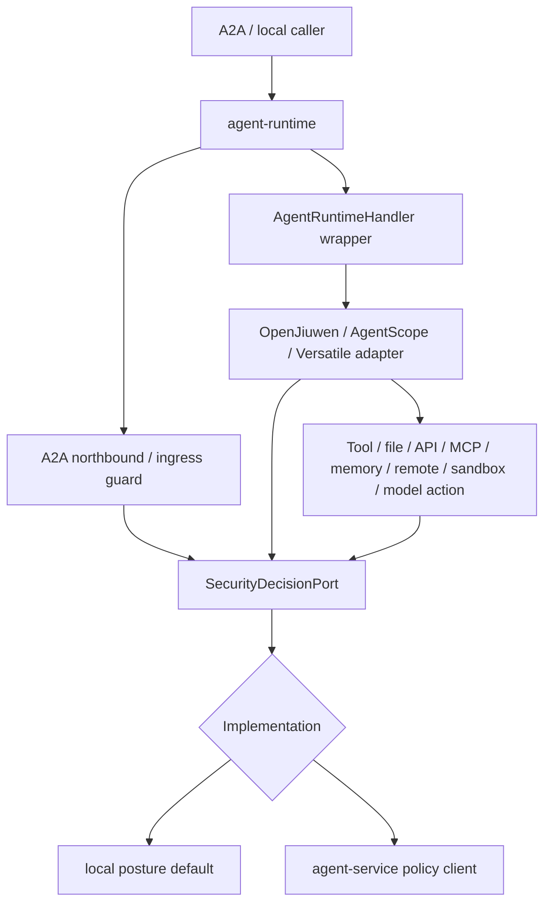

# Agent 安全决策契约 L2 Proposal

> **日期:** 2026-06-13
> **状态:** Draft
> **父 proposal:** `2026-06-13-agent-security-decision-chain-proposal.cn.md`
> **影响范围:** 中立安全决策契约，以及 runtime 到 policy engine 的边界。

## 0. 最新 main 对齐与不适合项（2026-06-18）

按 `origin/main@61fae167` 重新校准后，本 L2 契约仍然成立，但不能按原文假设“security decision contract 已接近落地”。最新 main 的事实是：

- `RuntimeComponents` 仍是 `public record RuntimeComponents(AgentRuntimeHandler handler)`，`RuntimeApp.create(handler)` 仍只装配单 handler。
- contract catalog 中 `agent-runtime` shipped SPI surface 仍是 `AgentRuntimeHandler`、`AgentCardProvider`、`MemoryProvider`、`StreamAdapter`；没有 `SecurityDecisionPort`。
- 仓库没有 `docs/contracts/security-decision.v1.yaml`、`capability-permission-policy.v1.yaml`、`security-approval.v1.yaml`、`security-decision-event.v1.yaml`。
- 最新 main 已新增 A2A metadata contract proposal，且 remote invocation 已使用 request metadata、`remoteInput`、remote task/context/tool correlation。
- `REMOTE_RESUME` 后可以继续发起 bounded chained remote A2A invocation；`agent-runtime.remote-invocation.max-legs` 默认 5，范围 clamp 到 1..100，超过时返回 `REMOTE_INVOCATION_LIMIT_EXCEEDED`。
- `agent-sdk/` 已存在，但未进入 root reactor，不能作为 security contract 的强制落地前提。

因此本 proposal 的调整结论：

| 原设计点 | 是否仍适合 | 修改后的约束 |
|---|---|---|
| 直接扩展 `RuntimeComponents` 增加 `SecurityDecisionPort` | 部分适合 | 可以作为 Wave 2，但 Wave 1 应先落 YAML/record 与 no-op fail-closed adapter；不能让现有 `RuntimeApp.create(handler)` 的兼容路径默认放行高风险 |
| `SecurityDecisionPort.localDefault(Posture.DEV)` | 需收窄 | 只能允许 R0/R1 dev 场景；R2+ unknown 必须 ask/deny，R4/R5 deny，不能成为“开发环境全放行” |
| 只用自由字符串 target | 不适合 | 最新 A2A metadata 与 bounded remote continuation 要求结构化 target，必须包含 `CapabilityTarget`、metadata trust source、remote task/context/tool ids、chain id、leg index 和 max legs |
| 忽略 root reactor 之外目录 | 不适合 | `agent-sdk`、shared memory、collaboration、financial 可作为 contract fixtures，但 runtime-enforced 主路径仍先落 `agent-runtime`/`agent-service`/`agent-bus` |

## 1. 背景

父 proposal 需要一个统一的可执行决策点，覆盖 tool、file、API、MCP、A2A remote agent、memory、sandbox、model、egress 与 business action。本 L2 定义这个决策契约。

设计必须匹配当前 main：

- `agent-runtime` 是 framework-neutral runtime SDK，核心是 `AgentRuntimeHandler` 与 adapter；
- `agent-service` 是 serviceization facade，可承载 enterprise policy implementation；
- `agent-bus` 承载 bus/S2C/engine 中立契约；
- `agent-sdk/`、`a2a-shared-memory/`、`collaboration/`、`financial/` 已在代码树出现，但未在 root reactor 中声明为主构建模块；提案引用它们时必须标注为候选集成点或验证样本；
- request-level A2A metadata 已成为最新 main 的活跃设计点，security request/decision 必须显式携带 metadata trust、tenant propagation 和 remote correlation；
- bounded chained remote A2A 已成为最新 main 的活跃 runtime 行为，security request/decision 必须显式携带 chain id、leg index、max legs 与 per-leg outcome；
- 历史 `agent-middleware` 不是活跃 reactor module，不能作为依赖目标。

### 0.1 2026-06-18 main delta：remote chain fields

`origin/main@61fae167` 让同一个 parent task 在 `REMOTE_RESUME` 后继续发起下一段 remote A2A 调用。契约层不能只记录“当前 remote agent”，还要能回放整条 bounded chain：

- `remoteInvocationChainId`：同一 parent task 内 remote A2A chain 的稳定 id；
- `remoteLegIndex`：当前 leg 的 0-based 或 1-based 序号，schema 必须固定一种；
- `maxRemoteLegs`：来自 runtime config / policy 的上限；
- `previousRemoteTaskId` / `previousToolCallId`：可选证据，用于证明本 leg 是由哪次 remote result/resume 触发；
- `REMOTE_INVOCATION_LIMIT_EXCEEDED` 必须映射为 typed deny/fail decision，不能被普通 tool failure 吞掉。

## 2. 范围声明

主范围：

- `affects_level: L2`
- `affects_view: development`

本 proposal 定义：

- `docs/contracts/security-decision.v1.yaml`；
- 窄口径 `SecurityDecisionPort`；
- `SecurityEvaluationRequest`、`SecurityDecision` 和相关 enum；
- `agent-runtime` 如何调用 policy 而不依赖 `agent-service` 实现类；
- versioning、idempotency、profile traceability。

本 proposal 不定义：

- capability policy YAML 细节，由能力权限 L2 负责；
- approval persistence 与 audit event storage，由审批审计 L2 负责；
- sandbox provider API；
- framework-specific business logic。

## 3. 根因 / 最强解释（Root Cause / Strongest Interpretation, Rule D-1）

1. **Observed failure / motivation:** 安全组件需要一个统一 runtime decision vocabulary，而不是每个 tool、file、API、MCP、A2A 或框架各自一套。
2. **Execution path:** adapter 或 runtime guard 观察到高风险动作，构造 decision request，收到 allow/deny/ask/sandbox/approval 决策，并在副作用前执行。
3. **Root cause:** 仓库已有 governance 与 audit contract，但缺少带 idempotency、policy version、obligation、profile、runtime boundary 的版本化决策契约。
4. **Evidence:** 当前 `RuntimeComponents` 只有 `AgentRuntimeHandler`；`TrajectoryEvent.Kind` 是 telemetry enum，不是 security decision truth；contract catalog 当前只列出四个 `agent-runtime` shipped SPI surface；`docs/contracts/security-decision.v1.yaml` 尚不存在；remote A2A path 已有 request metadata、`remoteInput`、remote task/context/tool correlation。

## 4. 设计方案

### 4.1 边界原则

`agent-runtime` 可以定义并消费中立 outbound decision port，但不能 import `agent-service` policy engine 实现类。

```text
agent-runtime guard / adapter
  -> SecurityDecisionPort
  -> in-process 或 remote implementation
  -> agent-service 或部署者提供的 policy engine
```

不引入 `agent-middleware` 依赖。

### 4.2 Port 实现形态

| 形态 | 描述 | 使用场景 |
|---|---|---|
| In-process port implementation | runtime 组装时注入 `SecurityDecisionPort` 实现 | embedded deployment、tests |
| Remote policy client | runtime 注入一个通过 HTTP/gRPC/internal transport 调用 `agent-service` 的 port 实现 | serviceized deployment |
| Local posture default | dev 下的小型本地实现，允许 R0/R1，拒绝高风险 | demo、offline examples |

port 一致，变化的是实现。

### 4.3 Runtime Assembly 装配

当前：

```java
public record RuntimeComponents(AgentRuntimeHandler handler) {}
```

建议：

```java
public record RuntimeComponents(
        AgentRuntimeHandler handler,
        SecurityDecisionPort securityDecisionPort) {
}
```

兼容方式：

```java
public RuntimeComponents(AgentRuntimeHandler handler) {
    this(handler, SecurityDecisionPort.localDefault(Posture.DEV));
}
```

按最新 main，本段是 Wave 2 目标而不是 Wave 1 前提。Wave 1 应先增加 contract schema、Java record 与 handler wrapper 适配器；handler-only 兼容路径只能使用 fail-closed / dev-scoped 默认值，不能让 `SecurityDecisionPort.localDefault(Posture.DEV)` 在 R2+ 或 remote A2A metadata 不可信时默认放行。

`RuntimeApp` 可扩展：

```java
RuntimeApp.create(handler)
    .withSecurityDecisionPort(port)
    .run(host);
```

默认实现不能静默允许未知高风险动作：

- dev 可允许 R0/R1；
- R2+ 按 posture ask 或 deny；
- R4/R5 默认 deny，除非显式 dev override。

### 4.4 Port Interface 接口

若接受为 shipped SPI，应加入 `agent-runtime.engine.spi` 并更新 `docs/contracts/contract-catalog.md`。

```java
public interface SecurityDecisionPort {
    SecurityDecision evaluate(SecurityEvaluationRequest request);
}
```

v1 使用同步 evaluate，是为了匹配当前 `AgentRuntimeHandler.execute()` 的 stream-based 同步边界。remote implementation 必须内部设置 timeout，超时返回 `DENY` 或 `SUSPEND_FOR_APPROVAL`，不能无限阻塞。

### 4.5 SecurityEvaluationRequest 安全评估请求

最小契约：

```java
public record SecurityEvaluationRequest(
        String schemaVersion,
        String securityEvaluationRequestId,
        String idempotencyKey,
        String tenantId,
        String userId,
        String sessionId,
        String taskId,
        String agentId,
        String sourceSurface,
        String posture,
        String policyProfile,
        String delegationEnvelopeRef,
        String metadataTrustSource,
        String remoteInvocationChainId,
        Integer remoteLegIndex,
        Integer maxRemoteLegs,
        String traceId,
        String spanId,
        ActionType actionType,
        CapabilityTarget target,
        RiskTier riskTier,
        Set<DataClass> dataClasses,
        SideEffect sideEffect,
        EgressScope egressScope,
        Set<String> requestedCapabilities,
        PermissionScope requestedScope,
        Object redactedPreview,
        String inputHash,
        Map<String, Object> requestMetadata,
        Map<String, Object> attributes) {
}
```

必要属性：

- `securityEvaluationRequestId` 唯一标识一次安全评估请求；它不是 NLU 分类结果，也不是 agent task ID；
- `idempotencyKey` 用于重试去重；
- `traceId` / `spanId` 负责调用链关联，`decisionId` 负责标识策略结果，`securityEvaluationRequestId` 只负责标识提交给安全决策链的输入对象；
- `sourceSurface` 标识请求来自 `A2A_NORTHBOUND`、`HANDLER_WRAPPER`、`HANDLER_LIFECYCLE`、`FRAMEWORK_ADAPTER`、`MEMORY_ADAPTER`、`STATE_ADAPTER`、`A2A_REMOTE_OUTBOUND` 等 runtime surface；
- `target` 是结构化对象，不是自由字符串；
- `posture` 与 `policyProfile` 让 default 行为显式可审计；
- `delegationEnvelopeRef` 指向本次最小代理边界，不表达 NLU 分类结果；R2+ research/prod 请求缺少该字段时应按 profile fail closed；
- `metadataTrustSource` 记录 metadata 来自本仓可信入口、host application、remote A2A、Versatile header/body 转换还是 framework-native event；remote metadata 只能作为 evidence，不能直接升级权限；
- `remoteInvocationChainId` / `remoteLegIndex` / `maxRemoteLegs` 只在 remote A2A chain 中必填；research/prod 中缺失或超过 policy 上限时 fail closed；
- `policyProfile` 同时表达部署者选择的代理自主预设，例如 `strict_allowlist`、`review_unknown`、`least_agency_scoped`、`regulated_prod`；
- `requestedScope` 描述本次请求的文件路径/API host/MCP tool/A2A remote agent/sandbox profile/memory kind/model id/business threshold；
- `redactedPreview` 不得含 raw secret、raw prompt、raw tool payload；
- `inputHash` 用于 replay 证据，避免存储敏感 payload；
- `requestMetadata` 只存允许审计的 metadata 摘要、hash 或 ref；A2A `remoteInput`、task/context/tool correlation 必须命名空间化，不能与审批、sandbox 或用户原始输入混用。

### 4.6 CapabilityTarget 能力目标

```java
public record CapabilityTarget(
        CapabilityKind kind,
        String capability,
        String name,
        String ref,
        String provider,
        String endpoint,
        String remoteTaskId,
        String remoteContextId,
        String toolCallId,
        String remoteInvocationChainId,
        Integer remoteLegIndex,
        Map<String, String> labels) {
}
```

示例：

| CapabilityKind | Example |
|---|---|
| `TOOL` | `name=web.search`, `ref=http://...` |
| `FILE` | `capability=workspace.write`, `ref=workspace://project/file.md` |
| `API` | `capability=web.search`, `endpoint=https://api.trusted.example.com/search` |
| `MCP` | `capability=mcp.docs.search`, `provider=docs-mcp`, `name=search` |
| `A2A_NORTHBOUND` | `capability=a2a.task.cancel`, `endpoint=/a2a`, `name=CancelTask` |
| `RUNTIME_CONTROL` | `operation=cancel`, `runtimeId=runtime-1`, `taskId=task-123` |
| `AGENT_STATE` | `capability=checkpoint.write`, `provider=redis`, `ref=state://tenant/session` |
| `MEMORY` | `name=tenant-memory`, `ref=memory://tenant/session` |
| `SANDBOX` | `name=restricted-code`, `provider=e2b` |
| `A2A_REMOTE_AGENT` | `name=quote-agent`, `endpoint=a2a://...`, `remoteTaskId=...`, `toolCallId=...`, `remoteInvocationChainId=...`, `remoteLegIndex=...` |
| `MODEL` | `name=gpt-4.1`, `provider=model-provider` |
| `BUSINESS_ACTION` | `name=payment.transfer` |

### 4.7 SecurityDecision 安全决策

```java
public record SecurityDecision(
        String schemaVersion,
        String decisionId,
        String securityEvaluationRequestId,
        DecisionType type,
        String policyId,
        String policyVersion,
        String policyHash,
        String policyProfile,
        String delegationEnvelopeRef,
        String profileRule,
        String reasonCode,
        String humanReason,
        Instant expiresAt,
        List<DecisionObligation> obligations,
        String approvalRef,
        String auditRef,
        String evidenceRef,
        String sandboxProfile,
        Map<String, Object> attributes) {
}
```

必要属性：

- `decisionId` 不可变，并写入 audit/security-event；
- `securityEvaluationRequestId` 必须回指产生该决策的安全评估请求；
- `policyVersion` 与 `policyHash` 保证 replay 可判定；
- `policyProfile`、`delegationEnvelopeRef` 与 `profileRule` 记录本次决策来自 strict allowlist、scoped allowlist、least agency envelope、HITL-for-unknown 或 regulated prod；
- `expiresAt` 防止过期审批变成永久授权；
- `obligations` 描述 runtime 必须执行的附加动作，如 redact、route-to-sandbox、emit-audit、require-approval；
- research/prod 高风险副作用前必须有 `auditRef`；
- `SUSPEND_FOR_APPROVAL` 必须有 `approvalRef`。

### 4.8 DecisionType 决策类型

```text
ALLOW
DENY
ASK
REDACT_AND_ALLOW
ROUTE_TO_SANDBOX
SUSPEND_FOR_APPROVAL
```

| Type | Enforcement |
|---|---|
| `ALLOW` | 执行动作，R2+ 记录 security event |
| `DENY` | 不执行，返回 typed failure |
| `ASK` | 有交互路径时转 approval request，否则按 posture deny |
| `REDACT_AND_ALLOW` | 先执行 redaction obligation，再执行 |
| `ROUTE_TO_SANDBOX` | 走 sandbox path；除 dev 显式允许外不 local fallback |
| `SUSPEND_FOR_APPROVAL` | action 未执行，任务进入审批等待 |

### 4.9 ActionType 动作类型

```text
INGRESS
A2A_AGENT_CARD_READ
A2A_TASK_SEND
A2A_TASK_STREAM
A2A_TASK_READ
A2A_TASK_LIST
A2A_TASK_CANCEL
A2A_TASK_SUBSCRIBE
A2A_PUSH_CONFIG
RUNTIME_START
RUNTIME_STOP
RUNTIME_HEALTH_READ
RUNTIME_TASK_CANCEL
MODEL_CALL
TOOL_CALL
API_CALL
MCP_CALL
MEMORY_READ
MEMORY_WRITE
STATE_READ
STATE_WRITE
STATE_RELEASE
SANDBOX_ACQUIRE
SANDBOX_EXEC
A2A_REMOTE_AGENT_CALL
EXTERNAL_EGRESS
FILE_READ
FILE_WRITE
FILE_LIST
FILE_DELETE
CODE_EXEC
BUSINESS_ACTION
FALLBACK
```

`FALLBACK` 必须显式建模，防止 sandbox/provider/model/tool 失败后静默降低安全。

### 4.10 当前 Runtime Enforcement Points 执行点



port 可在这些点调用：

- A2A northbound admission：Agent Card、SendMessage、SendStreamingMessage、GetTask、ListTasks、CancelTask、SubscribeToTask、push config；
- handler lifecycle wrapper：`start`、`stop`、`isHealthy`、`cancel(taskId)`；
- framework tool callback；
- file read/write/list/delete；
- API / MCP invocation；
- remote A2A invocation；
- model call / model fallback；
- memory read/write；
- agent state checkpoint read/write/release；
- sandbox acquire/execute/release；
- fallback attempts。

### 4.11 Framework Adapter 契约边界

`SecurityEvaluationRequest` / `SecurityDecision` 由本仓拥有，不由 AgentScope、OpenJiuwen 或其他 agent 框架拥有。框架 adapter 只负责把原生信号翻译成 `SecurityEvaluationRequest`，不重定义 `RiskTier`、`CapabilityKind`、profile、approval 或 audit 语义。

| Framework / path | 框架提供 | adapter 映射 | Enforcement expectation |
|---|---|---|---|
| OpenJiuwen SDK tools from `agent-sdk` | native `Tool` / callback / rail events | `TOOL_CALL`、capability name、args hash、redacted preview、trace/span | 尽量在 callable 交给 OpenJiuwen 前 enforce |
| OpenJiuwen trajectory rail callback | `beforeToolCall`、`afterToolCall`、`onToolException` | security evidence；如果支持 pre-action blocking，可做 decision check | post-action callback 不能授权高风险动作 |
| AgentScope local/harness adapter | `AgentScopeInvocation`、`AgentScopeEvent`、stream events | model/tool/message capability target、session/task correlation | opaque 高风险操作前必须 wrapper guard |
| AgentScope remote runtime client | 外部 runtime 的 HTTP/SSE event stream | endpoint target、remote runtime identity、timeout、tenant/session refs | runtime client call 是 `API_CALL` / remote framework call，必须 scoped |
| A2A remote invocation | `RemoteInvocation`、remote agent id、tool name、task state | `A2A_REMOTE_AGENT_CALL`、remote capability、tenant propagation、toolCallId | outbound 前 guard；input-required continuation 保持 correlation |
| SDK Java/HTTP tool mapper | local Java method 或 HTTP execution handle | `TOOL_CALL` 以及可观测的 `FILE` / `API` sub-capability | 最强 enforcement point，高风险优先走这里 |

规则：

- 框架提供 pre-action hook 时，adapter 可在那里阻断；
- 框架只有 post-action event 时，只能作为 telemetry/audit evidence，R3+ 副作用需要 wrapper/proxy/sandbox/deny；
- 框架内部 opaque file/API/MCP/sandbox/business action 在 research/prod 下不得直接允许；
- 框架 fallback 表示为 `ActionType.FALLBACK`，必须重新决策，不能降低隔离。
- AgentScope / OpenJiuwen / JiuwenSwarm 的本地 allow / ask / deny 只可作为 `attributes.frameworkPermission` 或 evidence；不能替代 `SecurityDecision`；
- 框架 bypass、permission disabled、approval override、always allow 必须显式进入 `attributes.frameworkPermissionMode`，并在 research/prod 中触发 envelope 校验或 fail closed；
- `requestedScope` 必须和 `delegationEnvelopeRef` 对应的代理边界做子集判断，HITL 审批不得把越界请求改成 allow。

### 4.12 与 Capability Permission L2 的关系

Capability permission policy 产出 allowlist、scope 与 invocation input，本契约将其转成通用决策：

```text
CapabilityInvocationRequest
  -> SecurityEvaluationRequest(actionType=TOOL_CALL / FILE_WRITE / API_CALL / MCP_CALL / A2A_REMOTE_AGENT_CALL / ...)
  -> SecurityDecision
```

### 4.13 与 Approval/Audit L2 的关系

本契约只携带 `approvalRef`、`auditRef` 与 obligations。审批审计 L2 负责：

- approval state machine；
- audit receipt durability；
- security-event stream；
- A2A/S2C suspend/resume 映射。

### 4.14 版本化

规则：

- request 和 decision 都带 `schemaVersion`；
- breaking change 创建 `security-decision.v2.yaml`；
- research/prod 下未知 enum fail closed；
- 旧 port 可忽略新增 optional attributes，但不能忽略新的 required obligations；
- `policyHash` 基于 effective merged policy，而非单个 YAML 文件。

### 4.15 故障处理

| Failure | Required decision |
|---|---|
| policy implementation timeout | R2+ deny；只允许显式 low-risk dev path |
| invalid request | deny |
| 缺 tenant/session/task correlation | deny，除 local dev R0 |
| 缺 policy version/hash | deny high-risk |
| obligation 无法执行 | deny |
| remote policy service unavailable | 使用 configured degraded policy；R4/R5 绝不 local fallback |

## 5. 替代方案

| Alternative | Why rejected |
|---|---|
| policy engine 直接放进 `agent-runtime` | 会把 runtime SDK 绑定到 enterprise policy storage/approval state |
| 让 `agent-service` 调 runtime internals | 破坏 runtime 所有权，也不利于 embedded runtime |
| 复用 `TrajectoryEvent` 做 decision contract | trajectory 是 telemetry，decision 需要 idempotency、policy hash、obligation、expiry |
| v1 做 async port | 当前 handler 边界是同步 stream，timeout-bound sync port 更适合 W1/W2 |
| 使用已退役 `HookDispatcher` | 当前主线已退役 hook dispatcher 和 `agent-middleware` |

## 6. 验证计划

- [ ] `SecurityDecisionContractSerdeTest`: 所有 decision type 可序列化/反序列化。
- [ ] `SecurityDecisionRequiredFieldsTest`: 缺 `decisionId`、`policyVersion`、`policyHash` 或 `securityEvaluationRequestId` 失败。
- [ ] `SecurityDecisionProfileTraceabilityTest`: decision 携带 posture、policy profile、profile rule。
- [ ] `DelegationEnvelopeRefRequiredTest`: R2+ research/prod 请求缺少 `delegationEnvelopeRef` 或引用无效时 fail closed。
- [ ] `DelegationEnvelopeSubsetDecisionTest`: `requestedScope` 超出 envelope 时，即使框架本地 allow 也返回 deny。
- [ ] `SecurityDecisionTimeoutPolicyTest`: remote implementation timeout 对 R2+ fail closed。
- [ ] `CapabilityTargetScopeTest`: FILE/API/MCP/A2A/SANDBOX target 使用结构化 scope。
- [ ] `RuntimeMessageSecurityEvaluationMappingTest`: `RuntimeMessage` / `AgentExecutionContext` 派生的请求带 `sourceSurface`、hash、trace、tenant/session/task refs。
- [ ] `A2aNorthboundActionTypeMappingTest`: Agent Card、send/stream/get/list/cancel/subscribe、push config 映射为对应 `ActionType`。
- [ ] `RuntimeControlActionTypeMappingTest`: `AgentRuntimeHandler.start/stop/isHealthy/cancel` 映射为 runtime control action type，不能绕过 tenant/task/admin scope。
- [ ] `AgentStateActionTypeMappingTest`: InMemory/Redis/OpenJiuwen checkpointer read/write/release 映射为 state action。
- [ ] `FrameworkAdapterSecurityEvaluationRequestMappingTest`: OpenJiuwen、AgentScope、A2A、SDK tool path 映射到统一 `SecurityEvaluationRequest`。
- [ ] `FrameworkPermissionEvidenceMappingTest`: AgentScope/OpenJiuwen/JiuwenSwarm allow/ask/deny/bypass/disabled/override 被映射为 evidence，不成为最终决策。
- [ ] `OpaqueFrameworkSideEffectDenyTest`: framework-internal opaque R3+ action 无 wrapper/proxy/declaration 时 research/prod deny。
- [ ] `RuntimeComponentsSecurityPortCompatibilityTest`: 旧 handler-only runtime assembly 仍可使用安全默认值。
- [ ] `RuntimeSecurityDecisionPortArchTest`: `agent-runtime` 不 import `agent-service` implementation packages。
- [ ] `FallbackDecisionTest`: fallback 产生 `ActionType.FALLBACK` 且不能降低隔离。
- [ ] `SecurityDecisionContractCatalogTest`: security decision contract 进入 contract catalog。

## 7. 落地节奏

- **Wave 1:** 增加 YAML contract 与本地 model records，状态 design-only。
- **Wave 2:** 增加 `SecurityDecisionPort` 与 safe local default。
- **Wave 3:** 连接 runtime assembly 与第一个 guard point。
- **Wave 4:** 连接 `agent-service` policy implementation。

Freeze impact:

- port 成为 shipped 后必须更新 contract catalog。
- 不需要 L0 module split。

## 8. 自审

| Finding | Severity | Status | Mitigation |
|---|---|---|---|
| 增加 `SecurityDecisionPort` 会改变 runtime SPI count | P1 | open | 落地时更新 contract catalog 与 ArchUnit |
| remote policy timeout 可能影响可用性 | P1 | open | posture defaults 与清晰指标 |
| sync decision port 未来可能需要 async | P2 | open | v1 保持 sync，v2 可加 async adapter |

## 依据

- 父 proposal：`2026-06-13-agent-security-decision-chain-proposal.cn.md`。
- 当前 main 结构：`agent-runtime` 拥有 framework-neutral runtime execution；`agent-service` 拥有 serviceization；`agent-bus` 拥有 bus/S2C 中立契约。
- Contract catalog：若该 port 接受为 shipped，必须显式修订 runtime SPI surface。
