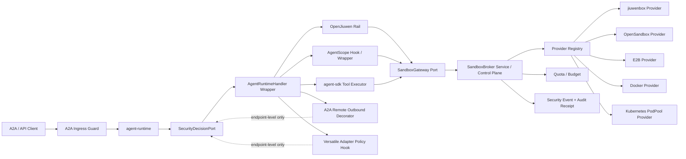

# Agent Runtime Sandbox Governance L2 Proposal 中文说明

> **日期:** 2026-06-14  
> **基线:** `origin/main` 的 `61fae167`，并结合四份安全决策链相关 proposal。  
> **范围:** sandbox 治理、broker/provider 边界、runtime adapter 接入点、韧性等级和验证计划。  
> **非目标:** 不重新设计 `agent-runtime`、`AgentRuntimeHandler`、OpenJiuwen、AgentScope、A2A 或 Versatile，只在当前仓库结构下设计 sandbox 相关能力。

## 0. 最新 main 对齐与不适合项（2026-06-18）

按 `origin/main@61fae167` 重新校准后，本 sandbox governance 方向仍适合，但必须把若干原设计从“当前能力”改成“待落地能力”：

| 原设计点 | 是否仍适合 | 修改后的约束 |
|---|---|---|
| `SandboxGateway` 已可作为 runtime port 接入 | 需收窄 | 最新 main 没有 `SandboxGateway`、`sandbox-gateway.v1.yaml`、`sandbox-provider.v1.yaml`、`sandbox-event.v1.yaml`；Wave 0/1 才能新增这些 design-only / dev-only contract |
| 通过 `agent-sdk` tool executor 做主要落点 | 部分适合 | `agent-sdk/` 已存在但未进入 root reactor；可作为候选 tool spec seam，不能作为 shipped sandbox enforcement 前提 |
| remote A2A / Versatile 远端运行可视作 sandbox | 不适合 | 只能做 endpoint-level policy 与 certified evidence；远端内部 sandbox claim 默认不是本地隔离证明；bounded chained remote legs 也不改变这一边界 |
| sandbox 同时治理 memory/shared-memory | 需分边界 | `a2a-shared-memory` 是 memory governance / evidence 面；sandbox 只引用 memory artifact/ref 与 taint 结果，不替代 `MemoryProvider` 或 shared-memory ownership policy |
| 用 collaboration / financial 证明平台 sandbox 已覆盖 | 不适合 | `collaboration`、`financial` 只能作为 worker delegation 与 regulated business action 的场景 fixture，用于验证策略联动 |

新增 A2A metadata contract proposal 与 bounded chained remote A2A 后，sandbox acquire/execute 必须携带 metadata trust source、remote task/context/tool correlation、remote invocation chain id、leg index、tenant/session/task refs，并与 approval、audit、memory evidence 分开命名空间。

### 0.1 2026-06-18 main delta：remote A2A is bounded chained, not single-layer

`origin/main@61fae167` 已允许 `REMOTE_RESUME` 后继续发起 remote A2A invocation，并通过 `agent-runtime.remote-invocation.max-legs` 控制链长。本文中所有 remote A2A sandbox 判断因此改为：

- remote A2A 是 bounded chained legs，不再按“当前是单层调用”描述；
- sandbox 只能在每个 outbound leg 前做 endpoint/capability/tenant/metadata/chain budget policy，不能控制远端内部 tool；
- 若远端声称已 sandbox，只能作为 certified evidence；没有认证 receipt 时不能抵消本地 sandbox/approval/audit 义务；
- `max-legs` 超限应投射为 typed security/sandbox event，而不是普通 workflow failure。

## 1. 摘要

当前主线正在形成一个特点：`agent-runtime` 统一接入外部 Agent / 工作流 / 工具能力，但具体执行仍由下层框架或外部系统完成：

- OpenJiuwen 和 AgentScope 保留各自原生执行模型。
- A2A 是 runtime 唯一北向协议；阻塞、SSE、异步 task 查询只是 A2A method 的不同使用方式。
- A2A remote agent 通过 Agent Card 发现，并被 runtime 暴露成可调用 tool spec。
- 远程 Agent 编排由静态 YAML / Agent Card / runtime remote invocation metadata 驱动；当前 main 支持 bounded chained remote legs，调用方 tool 安装主要面向 OpenJiuwen 路径。
- Versatile Adapter 把 A2A message text 和 metadata 转成 REST/SSE 工作流调用。
- 当前 middleware services 主要是 memory/state 抽象；sandbox 不能变成泛化 middleware shortcut，而应是受治理的执行能力路径。
- `INPUT_REQUIRED` 现在可能表示远程 A2A 续问、Versatile workflow 续问，未来也可能表示安全审批暂停。

因此 sandbox 集成必须顺着这个架构走：sandbox 是被治理的能力路径，不是新的 agent runtime 框架，也不是塞进 `agent-runtime` 的某个 provider SDK。

目标链路是：

```text
trusted ingress / AgentExecutionContext
  -> SecurityDecisionPort
  -> agent-runtime 内的 SandboxGateway port
  -> agent-service 或部署侧控制面的 SandboxBroker
  -> SandboxProvider plugin
  -> jiuwenbox / OpenSandbox / E2B / Docker / Kubernetes pool
```

相对旧版 sandbox proposal，本版最重要的变化是：sandbox 不只是隔离执行环境，它必须成为安全决策链的一部分：

- `SecurityDecisionPort` 决定是否必须进 sandbox、是否禁止、是否需要审批、是否直接拒绝。
- `capability-permissions.yaml` 约束 sandbox profile、provider class、网络、文件传输和 fallback。
- 审批/审计契约决定 sandbox 执行什么时候要暂停、脱敏、审计或拒绝。
- A2A remote tool 和 Versatile workflow 不能因为“在远端运行”就被当成已经完成本地 deep sandbox。

## 2. 当前代码仓对齐

| 当前主线能力 | 对 sandbox 的含义 |
|---|---|
| A2A protocol design | 不新增第二套 sandbox 北向协议。sandbox 状态通过现有 A2A task/result/error 语义呈现。 |
| `AgentRuntimeHandler` | 保持窄 handler 契约。sandbox 通过 wrapper/adapter 和 `SandboxGateway` 接入，不改 handler 语义。 |
| `start/stop/cancel(taskId)` | wrapper 可以打开/关闭 gateway 资源，并把 cancel 映射成 sandbox execution cancel。 |
| 单 Handler 路由 | 当前 runtime 每个部署选择一个 handler。sandbox policy 应绑定到 runtime 部署/handler，而不是隐藏实现多 Agent router。 |
| `agent-runtime` module metadata | runtime 只定义 port 和中立 DTO，不依赖 `agent-service` 或具体 provider SDK。 |
| Middleware services design | Memory/state 保持 middleware SPI；sandbox 因为涉及隔离、provider health、quota、audit，应走独立 gateway/broker 路径。 |
| OpenJiuwen adapter | 优先使用 OpenJiuwen-local rail/hook，在 tool/code/file/network 前拦截。 |
| AgentScope adapter family | 使用 AgentScope-native SDK/Harness hook 或 adapter wrapper；没有 pre-action hook 时只能做 whole-run gate。当前远程 tool 调用方能力不能等同 OpenJiuwen。 |
| A2A remote agent invocation | 装饰 `RemoteAgentInvocationService` / `A2aRemoteAgentOutboundAdapter`；按 bounded chained legs 校验 endpoint、capability、tenant、metadata、chain budget；不能宣称控制远端内部 tool。 |
| A2A metadata proposal | sandbox request 需携带 metadata trust source、`remoteInput` 命名空间和 remote task/context/tool correlation；不可信 metadata 只能作为 evidence。 |
| Remote Agent Card tool catalog | 远端 card/skill 只是元数据，生成 tool 前需要 catalog admission。静态 YAML、card cache、timeout、cancel、bounded `max-legs` 等仍由远程编排层负责。 |
| Versatile Adapter | REST/SSE 前要校验 endpoint、header、query、input、result extraction；不宣称控制远端 workflow 内部。 |
| `agent-sdk` 代码树 | 可作为未来 SDK tool sandbox guard seam；纳入 root reactor 前不能作为 shipped runtime enforcement。 |
| `a2a-shared-memory` | shared-memory artifact、owner、poison check 可作为 sandbox taint/evidence 输入；sandbox 不拥有 memory truth。 |
| `collaboration` / `financial` | worker delegation / regulated business action 场景 fixture；用于验证 sandbox + approval + audit 联动，不作为平台 sandbox 模块。 |
| `TrajectoryEvent` | 运行观测，不是安全决策或审计事实；安全事件和审计 receipt 走独立 ref。 |

## 3. 根因 / 最强解释（Rule D-1）

1. **观察到的问题 / 动机:** 高风险 tool/code/file/network 执行可能来自本地框架 tool、SDK tool、A2A remote tool、Versatile workflow，但这些路径还没有统一的 sandbox 治理、provider、审计边界。
2. **执行路径:** `A2aJsonRpcController -> A2aAgentExecutor -> AgentRuntimeHandler wrapper / OpenJiuwen rail / AgentScope hook / SDK tool executor / A2A outbound decorator / Versatile adapter -> SecurityDecisionPort -> SandboxGateway -> SandboxBroker -> SandboxProvider`。
3. **根因:** 旧版 proposal 主要把 sandbox 当 runtime middleware；最新主线要求 sandbox 成为安全决策链控制下的能力，必须处理租户可信、远端工具目录准入、Versatile metadata/body 规则、审批和审计脱敏。
4. **证据:** 当前主线已有刷新后的 L2 runtime 文档、A2A-only 北向入口、单 handler 部署说明、tenant 只传播不认证、远程 Agent 静态 YAML/card cache、OpenJiuwen remote tool installation、Versatile text-as-body、metadata/header forwarding、result extraction、`connection_closed -> INPUT_REQUIRED`，以及四份安全 proposal 中的权限、决策、审批、审计契约；但还没有 `SandboxGateway` 或 sandbox contract 文件。

## 4. 设计原则

1. **Runtime 拥有 port，不拥有 provider。** `agent-runtime` 定义 `SandboxGateway` 和中立 DTO，provider client 放在 `agent-service`、部署基础设施或可选 provider module。
2. **先安全决策，再 sandbox。** sandbox acquire/execute 必须携带 `decisionId`、`securityEvaluationRequestId`、`delegationEnvelopeRef`、`auditRef` 等决策上下文。
3. **Sandbox 不是授权。** sandbox 降低执行风险，但不能替代租户认证、能力权限、审批和审计。
4. **不伪造 deep sandbox。** 远程 A2A、Versatile、远程 AgentScope、外部 LangGraph 类 runtime 只能做 endpoint-level policy，除非返回经过认证的远端 sandbox receipt。
5. **research/prod fail closed。** local fallback 只能在 dev、低风险、显式配置、并带 `no-real-isolation` 审计标记时使用。
6. **Provider 能力必须显式声明。** jiuwenbox、OpenSandbox、E2B、Docker、K8s pool 的隔离、生命周期、文件、流、网络、snapshot 能力不同，broker 路由必须依据 capability。
7. **审计记录 ref，不记录原始 payload。** stdout/stderr、文件、API body、tool args、result snippet 等只保留脱敏摘要、hash 或 artifact ref。
8. **尊重现有 L2 特性边界。** A2A 协议、异构框架适配、远程编排、memory/state middleware、trajectory observability、Versatile 映射保持原职责；sandbox 只增加治理路径和必要 hook。

## 5. 逻辑架构



核心边界：

- runtime adapter 只能通过 `SandboxGateway` 请求 sandbox。
- broker 负责路由、策略复核、quota、重试、failover、pool 选择和 provider health。
- provider plugin 负责具体 API 映射和 capability 报告。
- 安全事件和审计 receipt 由 broker/service 产生，runtime 只携带引用。

## 6. Sandbox 作用面

| 作用面 | sandbox 行为 | 边界 |
|---|---|---|
| Whole-run handler wrapper | `execute` 前 acquire workspace lease，终态 release，cancel 时取消 execution | 适合粗粒度隔离，不代表 tool-level enforcement |
| OpenJiuwen local rail | 在 tool/code/file/network 前拦截并映射为 sandbox execution | 只有 pre-action 且 blocking 的 rail 才能强制执行 |
| AgentScope local hook | 使用 SDK/Harness hook 或 adapter wrapper 处理高风险调用 | post-action hook 不能声称 R4/R5 enforcement；不能假设具备 OpenJiuwen remote-tool 语义 |
| agent-sdk tool executor | 包装 `http:` 和后续高风险 tool，做安全决策和可选 sandbox execution | 网络/文件/进程调用不能绕过策略 |
| A2A remote outbound | 做 endpoint/capability/tenant/fallback/chain-budget policy，必要时要求 certified remote sandbox evidence | 不控制远端内部 tool；尊重静态 YAML、timeout、cancel、bounded `max-legs` 等远程编排行为 |
| Remote Agent Card catalog | 生成 tool 前先做 catalog admission | card skill 是 prompt/tool 元数据，不是信任；当前主线调用方安装主要面向 OpenJiuwen |
| Versatile workflow | 校验 URL template、query、header、input、result extraction、timeout、continuation namespace | 不 sandbox 远端 workflow 内部执行 |

## 7. Runtime Port Contract

### 7.1 SandboxGateway

```java
public interface SandboxGateway {
    CompletionStage<SandboxLease> acquire(SandboxAcquireRequest request);
    CompletionStage<SandboxExecution> execute(SandboxExecutionRequest request);
    Flow.Publisher<SandboxExecutionEvent> stream(SandboxExecutionRef executionRef);
    CompletionStage<SandboxFileRef> putFile(SandboxFilePutRequest request);
    CompletionStage<SandboxFileRef> getFile(SandboxFileGetRequest request);
    CompletionStage<SandboxCancelResult> cancel(SandboxExecutionRef executionRef, SandboxCancelReason reason);
    CompletionStage<SandboxReleaseResult> release(SandboxLeaseRef leaseRef, SandboxReleaseReason reason);
}
```

运行规则：

- 所有调用带 deadline 和 idempotency key。
- provider SDK 类型不能穿透到 runtime。
- 阻塞式 provider 操作隐藏在 broker/provider 侧。
- runtime 只把 sandbox result 转成框架原生 output、`INPUT_REQUIRED` 或 typed failure。

### 7.2 SandboxAcquireRequest

必填核心字段：

```yaml
schemaVersion: sandbox-gateway/v1
requestId: sbx_req_01
idempotencyKey: tenant/session/task/action/hash
tenantId: tenant-a
userId: user-a
sessionId: session-a
taskId: task-a
agentId: agent-a
sourceSurface: openjiuwen_rail | agentscope_hook | sdk_tool | a2a_outbound | versatile_adapter | handler_wrapper
capabilityKind: SANDBOX
actionType: SANDBOX_ACQUIRE | SANDBOX_EXEC
securityDecisionRef:
  decisionId: decision_01
  securityEvaluationRequestId: sec_eval_01
  delegationEnvelopeRef: delegation_01
riskTier: R0_PURE_REASONING | R1_LOCAL_READ | R2_NETWORK_READ | R3_STATE_WRITE | R4_CODE_OR_SYSTEM_EXEC | R5_BUSINESS_CRITICAL
trustTier: trusted | reviewed | untrusted
dataClass: public | internal | customer | credential | regulated
sandboxPurpose: code_exec | tool_exec | file_transform | browser | remote_certified | workspace
```

策略和提示字段：

```yaml
templateRef: python-3.11-tools
resourceClass: small | medium | large | gpu
networkProfile: none | allowlist | internet | private_network
filesystemProfile: read_only | workspace_rw | artifact_only
providerPreference: jiuwenbox | opensandbox | e2b | docker | k8s
latencyClass: interactive | batch | background
coldStartPolicy: warm_only | allow_warm | allow_cold
fallbackPolicy: deny | retry_same_provider | new_sandbox_same_provider | certified_equivalent_provider | dev_local_only
approvalRef: approval_01
auditRef: audit_01
redactedPreviewRef: payload_ref://...
```

Provider 可以忽略自己不支持的 hint，但 broker 不能忽略必填策略字段。

## 8. Broker 与 Provider Contract

### 8.1 SandboxBroker API

Broker 负责：

- 校验 tenant/user/session/task 的可信上下文；
- 复核 policy version 和 sandbox scope；
- provider 分配前 reserve quota；
- 按 capability、health、cost、latency、profile 路由 provider；
- 创建或租用 sandbox；
- 流式输出 execution event；
- 发出 security event 和 audit ref；
- release、quarantine 或 destroy 资源。

建议 REST 形态：

```http
POST /sandbox/v1/leases
POST /sandbox/v1/executions
GET  /sandbox/v1/executions/{executionId}/events
POST /sandbox/v1/executions/{executionId}:cancel
PUT  /sandbox/v1/leases/{leaseId}/files/{path}
GET  /sandbox/v1/leases/{leaseId}/files/{path}
POST /sandbox/v1/leases/{leaseId}:release
GET  /sandbox/v1/providers/{providerId}/health
GET  /sandbox/v1/pools
```

dev 可使用 in-process `SandboxGateway`。research/prod 建议使用 out-of-process broker 或清晰隔离的 service component。

### 8.2 Provider SPI

```java
public interface SandboxProvider {
    SandboxProviderDescriptor descriptor();
    CompletionStage<SandboxProvisionResult> provision(SandboxProvisionRequest request);
    CompletionStage<SandboxExecutionResult> execute(SandboxProviderExecutionRequest request);
    Flow.Publisher<SandboxExecutionEvent> stream(SandboxProviderExecutionRef executionRef);
    CompletionStage<SandboxTransferResult> transfer(SandboxTransferRequest request);
    CompletionStage<SandboxCancelResult> cancel(SandboxProviderExecutionRef executionRef);
    CompletionStage<SandboxReleaseResult> release(SandboxProviderLeaseRef leaseRef);
    CompletionStage<SandboxDestroyResult> destroy(SandboxProviderLeaseRef leaseRef);
    SandboxProviderHealthSnapshot healthSnapshot();
}
```

Provider descriptor 示例：

```yaml
providerId: opensandbox-prod
apiVersion: provider/opensandbox/v1
isolation: process | container | microvm | k8s_runtimeclass
supports:
  exec: true
  streaming: true
  files: true
  snapshot: true
  networkPolicy: true
  warmPool: true
  cancel: true
  quotaSignals: true
certification:
  level: none | internal-reviewed | certified-equivalent
  profiles: ["restricted-code", "regulated-no-network"]
  expiresAt: 2026-12-31
```

## 9. Provider 适配

| Provider | 最适合场景 | Adapter 必须说明 |
|---|---|---|
| jiuwenbox | 本地/OpenJiuwen 生态、dev/research、低成本 container execution | 映射 lifecycle/exec/file/stream；不能声称 HA 或 microVM 隔离 |
| OpenSandbox | 云化控制面、异步 lifecycle、metrics、snapshot、egress policy | 映射 lifecycle service、execd、file/artifact、metrics、egress、snapshot |
| E2B | 托管式 microVM 风格 agent code execution | SDK/API 包装放 runtime 外；标明 SaaS 成本、API key、数据驻留、网络限制 |
| Docker | 本地开发和受控 research | prod 默认禁用；说明 Docker socket 风险；不能标成 microVM |
| Kubernetes PodPool | warm pool、namespace policy、RuntimeClass、ResourceQuota、NetworkPolicy | 实现 pool template、lazy materialization、HPA/KEDA metrics、cleanup、quarantine |

开源借鉴规则：

- 可以借鉴 jiuwenbox、OpenSandbox、E2B、OpenClaw/Codex 类 sandbox 机制、Docker/Kubernetes client 的 API 思路；
- 如果复制代码或做 API-compatible 行为，必须记录来源、版本、license 和差异；
- provider-specific 语义必须留在 provider SPI 后面。

## 10. 与安全决策链的关系

| 安全对象 | sandbox 用法 |
|---|---|
| `SecurityEvaluationRequest` | 计划高风险动作时先创建 |
| `SecurityDecision` | 返回 `ALLOW`、`DENY`、`ROUTE_TO_SANDBOX`、`SUSPEND_FOR_APPROVAL` 或 obligation |
| `CapabilityKind.SANDBOX` | 描述 sandbox acquire/execute/file-transfer capability |
| `SandboxScope` | 约束 provider、network、filesystem transfer、template、isolation、resource class |
| `REQUIRE_AUDIT_RECEIPT` | R4/R5 执行前必须先 reserve audit |
| `SecurityDecisionEvent` | 记录 route、degradation、approval、redaction、sandbox outcome |
| `DelegationEnvelope` | 防止 HITL 或 sandbox 选择扩大最小代理范围 |

规则：

- sandbox 不能绕过被拒绝的 capability policy；
- local fallback 不能由框架 adapter 自行决定；
- provider failover 必须 policy-equivalent 或 regulated 场景下 certified-equivalent；
- A2A/Versatile 返回的远端 sandbox 证明默认只是 evidence，除非经过认证并在 scope 内。

## 11. 租户与可信前提

P0 tenant/auth issue 是 prod sandbox 正确性的前置条件。

| 模式 | tenant 来源 | sandbox 行为 |
|---|---|---|
| `single-tenant-dev` | 允许配置默认 tenant | fake/local provider 可用，但审计标记 `no-real-isolation` |
| `trusted-gateway` | 网关认证并 strip/re-inject tenant header | broker 只接受 trusted transport context 中的 tenant |
| `authenticated` | 验证 token/claims 后映射 tenant/user/role | 多租户 research/prod 必须使用 |

research/prod acquire sandbox 时，如果 tenant/user/session/task 不可信，必须 fail closed。lease、artifact ref、payload ref、quota reservation、provider resource 都必须 tenant-scoped。

当前 A2A 设计会传播 `X-Tenant-Id`，但不认证它。因此：

- 没有可信入口的独立 runtime 只能声称 `single-tenant-dev` sandbox 行为；
- research/prod 部署必须从可信网关或已验证 claims 获得 tenant/user/session/task 身份；
- 即使 framework adapter、Agent Card、Versatile metadata 或模型输出提供了另一个 tenant 值，broker 也必须拒绝不匹配的 tenant context。

## 12. Continuation 与 `INPUT_REQUIRED`

Sandbox 长任务或等待输入不能和远端续问、安全审批混淆。

| 等待状态 | namespace | resume 权威 |
|---|---|---|
| sandbox execution waiting | `sandbox.waitingTarget=execution` | `executionId`、`leaseId`、broker state |
| remote A2A continuation | `runtime.waitingTarget=remote_agent` | remote task/context/tool metadata |
| Versatile workflow continuation | `runtime.waitingTarget=versatile_workflow` | workflow/conversation metadata |
| security approval | `security.waitingTarget=approval` | `approvalRef`、`decisionId`、approval record |

resume 请求如果 namespace 缺失、只来自 model/tool output、过期或与 broker state 不匹配，必须拒绝。

Sandbox continuation 通过现有 A2A task 语义投射，不新增北向端点。runtime 可以返回 `INPUT_REQUIRED`、`FAILED` 或 typed sandbox-unavailable error，但 resume 权威必须保存在 broker/task state 中，不能依赖模型可见文本或不可信 metadata。

## 13. 韧性与产品组合

| Profile | 产品形态 | 可靠性预期 | 成本 |
|---|---|---|---|
| `SBX-0 dev-fake` | 无真实隔离，fake/local process provider | 只用于单测和本地开发 | 最低 |
| `SBX-1 local-container` | jiuwenbox 或 Docker local provider | 单节点，best-effort cleanup | 低 |
| `SBX-2 managed-pool` | OpenSandbox/E2B/K8s 单区域 pool | health check、warm pool、retry/new sandbox | 中 |
| `SBX-3 enterprise-ha` | 多 provider 或多可用区 managed pool | circuit breaker、等价 provider failover、audit recovery | 高 |
| `SBX-4 regulated-strict` | 只用 certified provider，严格 egress，无 local fallback | policy/audit/provider 不确定就 fail closed | 最高 |

部署者选择 profile。runtime adapter 不单独降级可靠性或安全性。

## 14. 故障、重试与 fallback

| 故障 | Broker 行为 | Runtime/framework 结果 |
|---|---|---|
| provider health degraded before lease | 路由到合规 provider 或排队 | framework 不自行决策 |
| acquire timeout | 依据 idempotency retry 或路由等价 provider | typed sandbox unavailable |
| execution process crash | 判断 retryability；只对幂等命令可 new sandbox replay | typed retryable/non-retryable failure |
| container/pod lost | quarantine lease，尽量保留 artifact ref | 带 auditRef 的 typed failure |
| R4/R5 audit reserve unavailable | 执行前拒绝 | high-risk side effect blocked |
| redaction unavailable 且要求 payload retention | 按 profile suspend 或 deny | 不持久化 raw payload |
| research/prod 请求 local fallback | deny | `LOCAL_FALLBACK_FORBIDDEN` |

local fallback 仅在同时满足以下条件时允许：

- posture 是 `dev`；
- 风险为 R0/R1；
- 无 credential/customer/regulated data；
- 不写临时 workspace 外文件；
- 不访问 private network，不做 privileged execution；
- `allow-local-fallback=true`；
- audit 标记 `no-real-isolation`。

## 15. 性能与时延

优化手段：

- 基于 `PoolTemplate` 的 warm pool；
- provider 支持时使用 snapshot/resume；
- gateway 与 broker 连接复用；
- execution event streaming，减少 polling；
- artifact ref 替代大 payload inline transfer；
- 根据计划 tool/capability graph 做 prewarm hint；
- 在 taint/reset policy 允许时，有限复用 session lease；
- 长任务使用 execution ref。

示例字段：

```yaml
latencyClass: interactive | batch | background
prewarmHint: none | likely | required
maxAcquireLatencyMs: 800
maxFirstOutputLatencyMs: 1500
```

安全优先于时延。tenant、trust tier、template、data class、network profile、taint policy 不兼容时，不能复用 warm sandbox。

## 16. Kubernetes Pool Model

Kubernetes 属于 provider/control-plane，不是 runtime 依赖。

```yaml
poolTemplateId: tenant-trust-template
tenantScope: tenant | shared-dev | dedicated-regulated
trustTier: trusted | reviewed | untrusted
templateRef: python-3.11-tools
runtimeClass: kata | gvisor | runc
resourceClass: small
networkProfile: none | allowlist
minWarm: 2
maxWarm: 20
scaleMetric: queueDepth + acquireLatency + warmDeficit
```

K8s 映射：

- Namespace 或 labels 标识 tenant/scope；
- RuntimeClass 做隔离；
- NetworkPolicy 做 egress；
- ResourceQuota / LimitRange 做资源限制；
- Pod security admission 控制 privilege；
- TTL/cleanup controller 清理 stale sandbox；
- KEDA/HPA 基于 warm deficit 和 queue depth 扩缩容；
- quarantine label 标记失败或 tainted pod。

Pool 必须 lazy materialization，不能为所有 tenant/trust/template/network/resource 组合提前创建笛卡尔积。

## 17. 数据驻留与审计

安全/审计事件记录：

- tenant/session/task/agent id；
- decision/audit/approval ref；
- provider id 和 capability descriptor；
- lease/execution id；
- hash 和 redaction summary；
- artifact ref 和 retention policy；
- failure code 和 fallback decision。

默认不记录：

- raw prompt；
- raw tool args/result；
- raw file content；
- raw API/MCP/A2A payload；
- sandbox stdout/stderr；
- secret、cookie、token、env value。

如果 regulated workflow 必须保留 raw evidence，应进入独立加密 evidence store，具备 tenant/session/task ACL、短 TTL、break-glass audit 和删除策略。

## 18. 配置示例

```yaml
agent-runtime:
  sandbox:
    enabled: true
    posture: research
    trust:
      source: trusted-gateway        # single-tenant-dev | trusted-gateway | authenticated
      failClosedProfiles: [research, prod]
    gateway:
      mode: remote-broker
      endpoint: https://sandbox-broker.internal
      timeout: 2s
    default-profile: SBX-2
    local-fallback:
      enabled: false

agent-service:
  sandbox:
    broker:
      providers:
        - id: opensandbox-prod
          kind: opensandbox
          profile: SBX-2
        - id: k8s-kata-pool
          kind: k8s-pool
          profile: SBX-3
      retry:
        acquireAttempts: 2
        providerFailover: certified-equivalent
      quota:
        reservationTtl: 30s
      audit:
        requireReserveBeforeR4: true
```

## 19. 待开发模块

| 模块 / artefact | 职责 |
|---|---|
| `SandboxGateway` port | runtime 侧中立 sandbox contract |
| `SandboxHandlerWrapper` | whole-run acquire/release/cancel wrapper |
| `SandboxTenantTrustContextResolver` | 把可信入口/runtime identity 映射成 broker 可信的 tenant/user/session/task context |
| `SandboxA2aTaskProjector` | 把 sandbox wait/fail/cancel 状态映射到现有 A2A task 语义 |
| `OpenJiuwenSandboxRail` | OpenJiuwen 本地 pre-action 拦截 |
| `AgentScopeSandboxHook` | AgentScope SDK/Harness sandbox hook 或 wrapper |
| `SdkToolSandboxGuard` | 保护 `http:` 和后续高风险 SDK tools |
| `A2aRemoteSandboxPolicyDecorator` | endpoint-level sandbox policy 和 certified evidence |
| `VersatileSandboxPolicyHook` | endpoint/header/query/input/result-extraction policy hook |
| `SandboxBrokerService` | lease、routing、quota、health、audit、retry、failover |
| `SandboxProvider` SPI | provider 抽象 |
| `sandbox-provider-jiuwenbox` | jiuwenbox adapter |
| `sandbox-provider-opensandbox` | OpenSandbox adapter |
| `sandbox-provider-e2b` | E2B adapter |
| `sandbox-provider-docker` | dev/local Docker adapter，必须显式标记风险 |
| `sandbox-provider-k8s-pool` | Kubernetes warm pool adapter |
| `sandbox-gateway.v1.yaml` | request/response contract |
| `sandbox-provider.v1.yaml` | provider descriptor 和 health contract |
| `sandbox-event.v1.yaml` | sandbox security/control-plane event contract |

## 20. 验证计划

Contract tests：

- `SandboxGatewaySchemaTest`: 校验 v1 request/response 必填字段。
- `SandboxProviderDescriptorTest`: provider capability 不能夸大 isolation。
- `SandboxDecisionRefRequiredTest`: research/prod acquire 必须带 security decision refs。
- `SandboxA2aMetadataTrustTest`: sandbox acquire/execute 缺 metadata trust source、remote task/context/tool correlation、chain id、leg index 或 tenant/session/task refs 时 fail closed。
- `SandboxA2aRemoteChainBudgetTest`: chained remote A2A 超出 policy/runtime max legs 时返回 typed security/sandbox event，不能自动 local fallback。
- `SandboxTenantTrustFailClosedTest`: tenant 不可信时阻断 acquire。
- `SandboxA2aProjectionContractTest`: sandbox waiting/failure/cancel 状态映射为合法 A2A task state，不新增北向协议。

Runtime tests：

- `SandboxHandlerWrapperLifecycleTest`: start/stop/cancel 代理和资源释放。
- `OpenJiuwenSandboxRailPreActionTest`: 高风险 tool 执行前被阻断。
- `AgentScopeSandboxHookCoverageTest`: post-action-only hook 不能声称 R4/R5 enforcement。
- `SingleHandlerSandboxPolicyTest`: sandbox policy 绑定到当前 runtime handler/deployment，不隐藏实现多 handler router。
- `SdkToolSandboxGuardTest`: HTTP/file/process tool 被 route 或 deny。
- `A2aRemoteSandboxEvidenceTest`: 远端 sandbox claim 默认只是 evidence。
- `SharedMemorySandboxEvidenceBoundaryTest`: shared-memory owner/poison/artifact ref 可作为 sandbox evidence，但 sandbox 不直接修改 memory truth。
- `RemoteToolStaticCatalogPolicyTest`: 静态 YAML/card-cache 远程 tool 暴露前必须经过 catalog admission。
- `VersatileSandboxPolicyHookTest`: REST 前校验 header/query/input/result extraction。
- `InputRequiredNamespaceSandboxTest`: sandbox wait state 不能 resume remote 或 approval state。

Broker/provider tests：

- `SandboxQuotaReservationLifecycleTest`: reserve、commit、release、expiry、rollback。
- `SandboxProviderFailoverTest`: provider crash 只能切到等价 provider。
- `SandboxLocalFallbackPolicyTest`: prod local fallback 被拒绝。
- `SandboxK8sPoolScaleTest`: queue depth 和 warm deficit 驱动 desired warm count。
- `SandboxAuditRedactionTest`: stdout/stderr/file/API payload 脱敏或 ref 化。

E2E tests：

- dev fake provider；
- jiuwenbox/OpenJiuwen 高风险 tool；
- OpenSandbox 或 K8s pool execution；
- A2A parent 调 remote agent，且远端内部 sandbox 不被当成本地证明；
- Versatile workflow 调用，带 scoped metadata 和 redacted audit。

## 21. Rollout

1. **Wave 0:** 增加 contract 和 schema，不改变 runtime 行为。
2. **Wave 1:** 增加 `SandboxGateway` 和 fake/local dev implementation，默认 fail-closed posture。
3. **Wave 2:** 接入 `SecurityDecisionPort`，实现 SDK/OpenJiuwen local guard。
4. **Wave 3:** 增加 broker service、quota、audit refs、provider SPI 和一个真实 provider。
5. **Wave 4:** 增加 OpenSandbox/E2B/K8s provider、warm pool、health、failover、event contracts。
6. **Wave 5:** 增加 certified-equivalent provider conformance、regulated profile、redaction/evidence store。

## 22. 替代方案

| 替代方案 | 不采纳原因 |
|---|---|
| 在 `agent-runtime` 直接引入 E2B/OpenSandbox/jiuwenbox SDK | 破坏 runtime 中立性和模块依赖方向 |
| 每个框架自己调用自己的 sandbox | policy、quota、audit、fallback、tenant 行为不一致 |
| 把远端 runtime sandbox claim 当充分证明 | 远端 claim 不可本地强制，除非认证且在 scope 内 |
| 把 sandbox 当唯一安全控制 | 无法解决 tenant spoofing、审批、secret、memory poisoning、audit |
| prod sandbox 故障时允许 local fallback | 破坏 fail-closed 和最小代理边界 |

## 23. 自审

| 风险 | 严重度 | 缓解 |
|---|---|---|
| provider 类型覆盖过多 | P1 | runtime contract 保持小，provider 细节留在 SPI 和 conformance tests 后面 |
| remote A2A/Versatile 被误认为 deep sandbox | P0 | 明确 endpoint-only boundary 和 certified evidence rule |
| sandbox 增加时延 | P1 | warm pool、snapshot、streaming、artifact ref，但不降级安全 |
| provider capability 夸大 | P1 | provider descriptor tests 和 certified-equivalence gate |
| audit 泄漏交互数据 | P0 | redaction-before-persist、hash、ref、regulated evidence store |
| 最新 main 尚未落 `SandboxGateway` / sandbox contracts | P1 | Wave 0 先落 design-only schema 与 catalog；Wave 1 才接 dev-only port，不能在本文中声明已 shipped |

## Authority

- 最新主线 runtime 形态：`origin/main` at `61fae167`。
- 四份安全决策链 proposal 定义 policy、decision、approval、audit 和 least-agency 边界。
- 早期 sandbox proposal 是背景资料；本文是当前 L2 sandbox governance proposal。
