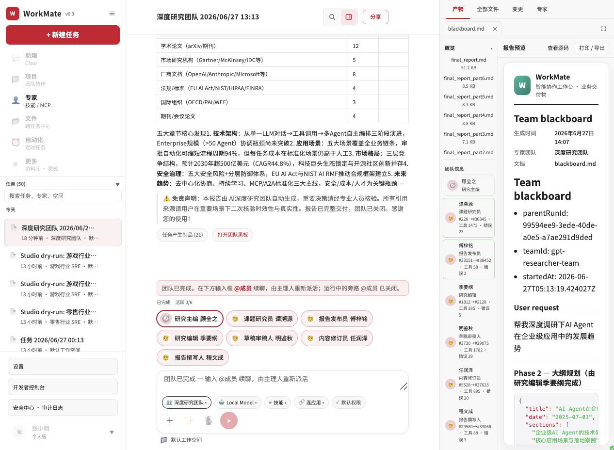
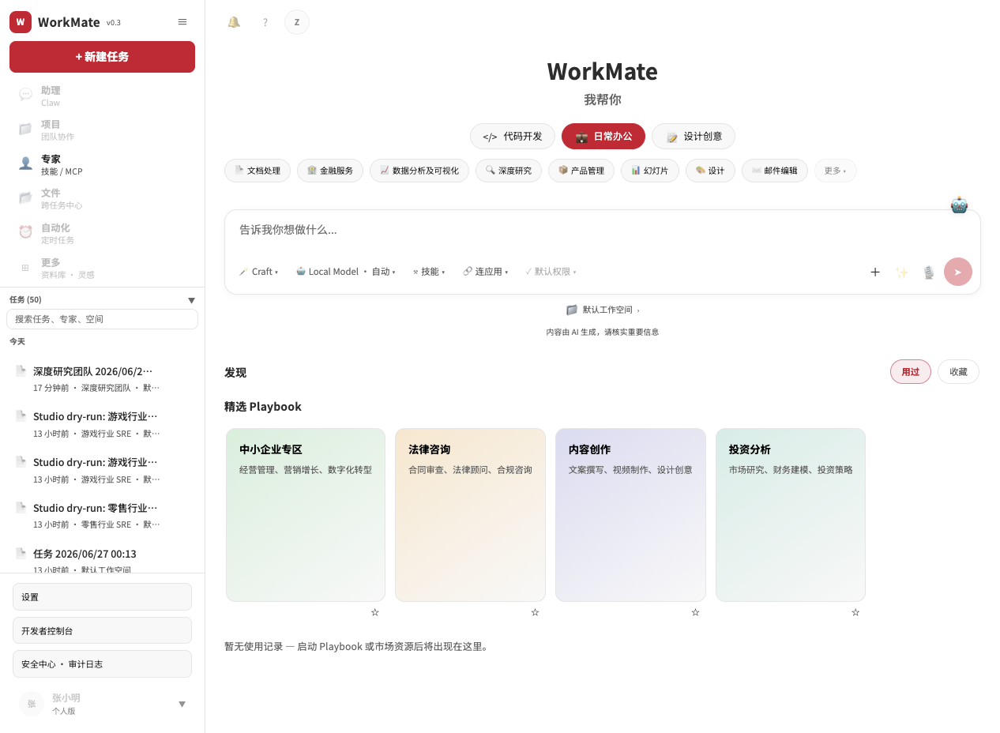
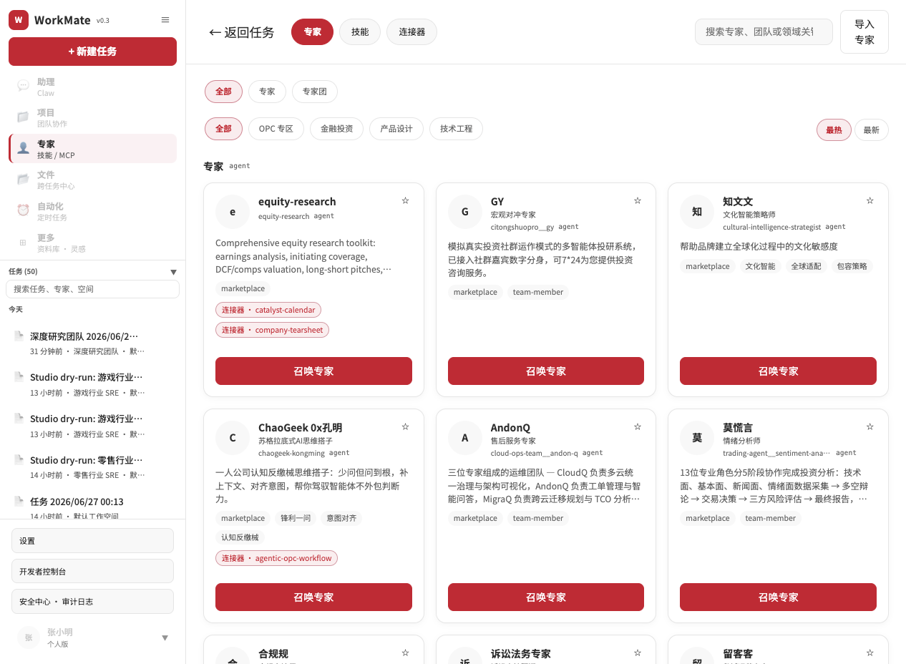
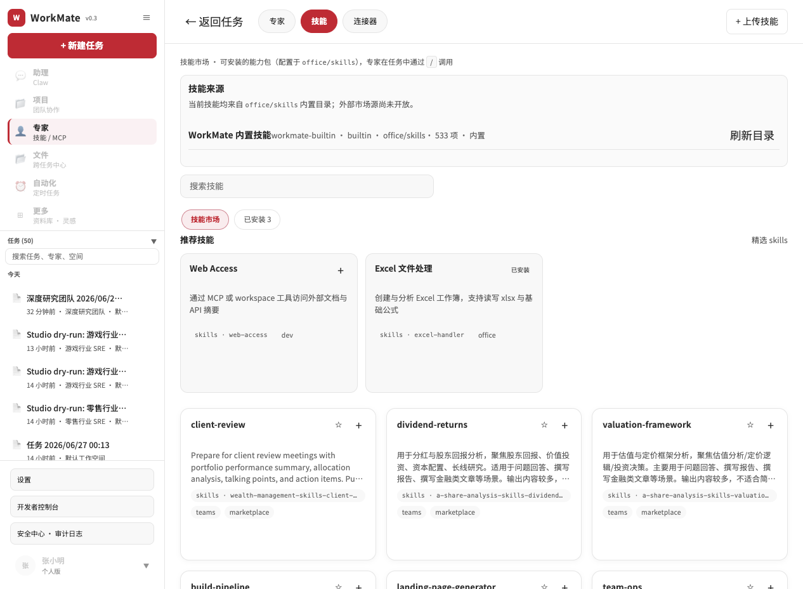

# WorkMate Workbench

[English](./README.md) | **中文**

基于 `spring-ai-ascend` 构建的多智能体协作工作台示例：Spring Boot 控制面 + React UI +
文件化配置层（`office/`，承载专家、技能、Playbook 与专家团）。

## 功能

- **会话与 Agent 循环** —— 创建任务，通过 SSE 流式展示 Agent 的推理、工具调用与产出。
- **人机协同（HITL）** —— 高危工具调用（如 shell `rm`）在执行前挂起等待审批。
- **专家团** —— 多成员编排，支持多种协作拓扑；统一以 `run_events` 单一事件源投影到 UI。
- **Developer Studio** —— 通过草稿层热重载编辑专家、技能、Playbook 与团队，无需重启。
- **MCP 网关** —— 接入 Model Context Protocol 服务（stdio 或 streamable HTTP）。
- **审计账本** —— 仅追加的 `run_events`，对敏感字段做脱敏。

## 截图

多智能体研究团队产出报告 —— 左侧实时成员、中间报告、右侧团队黑板与产物：



工作台首页 —— 选一个分类，或直接描述你的任务：



能力市场 —— 召唤现成的专家/专家团，安装技能：

| 专家与专家团市场 | 技能市场 |
|------------------|----------|
|  |  |

## 架构

```
workmate-api/      Spring Boot 控制面（会话、Agent 循环、HITL、SSE、MCP、Studio、审计）
workmate-ui/       React + Vite 单页应用（对话、市场、Studio、设置）
workmate-desktop/  可选 Electron 壳，打包 UI
office/            文件化配置：专家/技能/Playbook/欢迎页 + 精选示例
member-runtimes/   可选的按成员部署的 agent-runtime 模板（A2A）
docker/            Postgres 的 docker-compose
scripts/           本地开发（dev.sh/run-local.sh/dev-ui.sh）与 smoke 脚本
documentation/     发布文档（快速开始、架构、配置）
Makefile           常用任务：make dev / db / api / ui / test / build
```

后端内嵌 ascend `agent-runtime`；UI 通过 REST + SSE 与其通信（开发态 Vite 代理 `/api`）。
配置在启动时从 `office/` 读取，可经 Studio 热重载。

详见 [documentation/architecture.md](./documentation/architecture.md)。

## 快速开始

前置：JDK 21、Node.js 20+、Docker（用于 Postgres）、`make`。

```bash
make setup           # 从模板生成 workmate-api/.env.local
#  → 编辑 workmate-api/.env.local，填入 WORKMATE_LLM_API_KEY
make dev             # 一条命令拉起 Postgres + API(:8080) + UI(:5174)
```

然后打开 http://localhost:5174。`Ctrl-C` 停止 API 与 UI；`make stop` 停止 Postgres。

运行 `make` 查看所有目标。想用多个终端？先 `make db`，再分别 `make api` 和 `make ui`。

完整步骤见 [documentation/getting-started.md](./documentation/getting-started.md)。

## 配置

所有密钥（LLM key、MCP key、webhook secret）都通过本地、被 gitignore 的
`workmate-api/.env.local` 提供；仓库中不含任何真实密钥。高危能力与 provider 端点均可配置，
默认值安全/中性。详见 [documentation/configuration.md](./documentation/configuration.md)。

**若部署到非 localhost 环境**，请先阅读
[documentation/open-source-release.zh-CN.md](./documentation/open-source-release.zh-CN.md) — 本应用
**无 API 鉴权**，需配合 `production` profile 与网络边界使用。

开箱即用：默认模型目录包含 `deepseek-chat`（默认）、`gpt-4o-mini`、`local-model`，用户在
会话中自行选择；填入对应 key 即可启用。

## 测试

```bash
make test     # 后端（Maven）+ 前端（Vitest）
```

## 文档

- [快速开始](./documentation/getting-started.md)
- [架构](./documentation/architecture.md)
- [配置](./documentation/configuration.md)
- [测试](./documentation/testing.md)
- [开源发布说明（中文）](./documentation/open-source-release.zh-CN.md) — 发布范围、安全边界、维护者核对清单
- [开源发布说明（English）](./documentation/open-source-release.md)
- [Release Notes](./documentation/release-notes.md)

## 许可证

见仓库根目录的许可证条款。
