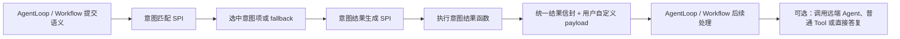

# Agent 与 Workflow 意图匹配及结果生成

## 1. 特性定位

本特性为 Agent 和 Workflow 提供统一的意图处理套件，并将套件内部流程拆分为三个可替换 SPI：

1. **初始化 SPI**：把 Agent Card Skill 和用户自定义配置初始化为可匹配意图项；每个意图项由“匹配描述 + 意图结果函数”组成。
2. **意图匹配 SPI**：使用初始化后的意图项对上游提交的语义进行候选排序和选择。
3. **意图结果生成 SPI**：匹配成功或选中 fallback 后，执行对应的意图结果函数，得到本次意图匹配的最终结果。

这里的“执行意图结果函数”不等于“执行用户意图”。意图结果函数只负责生成或转换意图匹配结果，不调用下游 Agent、不调用普通业务 Tool / API、不创建或推进 Task，也不产生其他业务副作用。真正的下游 Agent 调用、普通 Tool 调用或直接答复，发生在结构化意图结果返回 AgentLoop / Workflow 之后。

意图结果函数是开发者扩展意图返回内容的关键机制。开发者可以为一句自定义意图描述配置一个结果函数；该意图命中后，结果生成 SPI 调用此函数，并把函数返回值放入统一结果信封的用户自定义 payload。框架不限定 payload 必须表达 Agent、Tool或固定业务对象。

Agent Card 是初始化 SPI 支持的标准能力描述资产来源，不是 Tool / Node 运行时的意图匹配请求。默认初始化把每条 Agent Card Skill 建立为意图项，并为其关联默认意图结果函数；该函数返回 Agent Card、Skill 和稳定远端目标标识，使 AgentLoop 或 Workflow 后续能够调用对应远端 Agent。用户自定义意图项则由开发者提供描述和意图结果函数。两类意图项使用相同匹配 SPI 与结果生成 SPI。

fallback 是正常未匹配后的独立结果路径，不加入候选匹配。配置 fallback 时，结果生成 SPI执行其意图结果函数；未配置时返回“意图未匹配”。fallback结果同样只生成结果，不执行下游业务动作。



## 2. 当前版本能力要求

### 2.1 初始化 SPI

| 能力 | 要求级别 | 需求描述 |
|---|---|---|
| 初始化 SPI | MUST | 意图套件必须提供可替换的初始化 SPI。SPI 在 Agent 或 Workflow 初始化阶段接收 Agent Card及其初始化上下文、用户自定义 `kwargs`，返回可匹配意图项及可选 fallback 配置。 |
| 统一意图项 | MUST | 每个可匹配意图项必须包含匹配所需的描述信息和一个意图结果函数。意图项来源不得改变后续匹配和结果生成流程。 |
| 默认 Agent Card 初始化 | MUST | 默认初始化必须将 Agent Card 中每条 Skill 建立为独立意图项。每个意图项保留对应 Agent Card、Skill和初始化上下文，并关联返回这些信息的默认意图结果函数。 |
| 远端目标上下文 | MUST | runtime 提供 Agent Card 时，初始化上下文必须包含对应的稳定远端目标标识；同一 Agent Card 的所有 Skill 共享该标识，使默认结果能够关联到正确的远端 Agent 工具。 |
| 默认自定义意图项初始化 | MUST | 默认初始化必须支持从 `kwargs` 读取开发者提供的 `description` 和意图结果函数，并将其建立为意图项的匹配描述和结果生成逻辑。 |
| 用户自定义结果 | MUST | 开发者可以完全定义自定义意图结果函数返回的 payload 内容。Agent 专用自然语言 payload 可以通过使用说明供 LLM 理解；面向 Workflow 或其他程序化消费者的 payload 必须声明稳定类型、版本和 schema 或等价消费契约。具体声明格式由 L2 设计定义。 |
| fallback 配置 | MUST | 初始化必须支持配置 fallback 意图项或 fallback 意图结果函数。fallback 不加入可匹配意图项，只在正常未匹配后进入结果生成流程。 |
| 自定义初始化 | MUST | 开发者必须能够替换默认初始化 SPI，自行解释 Agent Card、对应初始化上下文和 `kwargs`，但输出必须满足统一意图项、意图结果函数和 fallback 语义。 |
| 意图描述固定 | MUST | 初始化完成后，本次意图套件使用的 Agent Card Skill描述和用户自定义 `description` 不支持动态更新。需要变更时必须重新初始化意图套件。 |
| `kwargs` 生命周期 | MUST | 初始化 SPI 的 `kwargs` 在 Agent 或 Workflow 初始化时由开发者提供，并作为本次意图套件的初始化配置保存；它不等同于 Agent loop 调用工具时框架传入的 `kwargs`。 |

### 2.2 输入归一化与意图匹配 SPI

| 能力 | 要求级别 | 需求描述 |
|---|---|---|
| 统一结构化输入 | MUST | Agent 意图 Tool 和 Workflow 意图组件必须将调用输入适配为统一的结构化匹配请求，而不是只向匹配 SPI传递一个缺少来源信息的字符串。 |
| Agent 输入组装 | MUST | Agent 场景由 LLM 或上游 Agent 提供本次主匹配语义和显式业务事实；意图 Tool 入口适配器补充当前可获得且已授权的执行上下文，并组装统一结构化匹配请求。 |
| Workflow 输入组装 | MUST | Workflow 场景由流程变量映射提供主匹配语义、显式业务事实和允许使用的上下文；意图组件入口适配器补充当前执行上下文，并组装与 Agent 场景语义一致的结构化匹配请求。 |
| 框架事实注入 | MUST | tenant、conversation、Task、trace 等框架治理与关联事实必须由 Tool / Node 入口适配器从可信执行上下文注入，不要求 LLM 或 Workflow 业务节点生成，也不得被同名非可信业务输入覆盖。 |
| 当前主匹配语义 | MUST | 结构化请求必须包含本次需要匹配的主语义。该语义可以是用户本轮自然语言输入，也可以是 DeepAgent、ReAct Agent 或 Workflow 已整理出的明确子任务描述。 |
| 原始输入保留 | MUST | 当主语义来自澄清、子任务拆解或上游改写时，请求必须在可获得且已授权的范围内保留原始用户输入或其引用，供匹配证据、纠偏和可观测关联使用。 |
| 可选匹配事实 | MUST | 结构化请求必须允许携带上游已确认槽位、有限上下文摘要、上下文引用、执行约束以及 runtime提供的身份、conversation、Task、trace等有限运行态事实；未提供的可选事实不得由020自行假定。 |
| 确定性语义归一化 | MUST | 意图 Tool / 组件必须使用明确、确定性的规则整理主语义、原始输入、已确认槽位和授权上下文，形成统一匹配输入，并保留实际采用事实的来源。默认归一化能力不得强制依赖一次额外 LLM 调用；具体字段优先级和冲突算法由 L2 设计定义。 |
| 输入使用边界 | MUST | conversation、历史摘要和运行状态只有在上游或 runtime 通过既定契约显式提供时才能参与匹配；020不得自行读取未授权的完整会话、Memory内部状态或Task存储。 |
| 匹配事实使用边界 | MUST | 主匹配语义是默认匹配依据；可选槽位和上下文事实只有在匹配器声明支持时才参与匹配。tenant、Task、trace 等治理关联信息默认不参与语义打分，不得将全部结构化字段无差别拼接为长文本。 |
| 意图匹配 SPI | MUST | 意图套件必须提供可替换的意图匹配 SPI。SPI使用经过归一化的匹配输入和初始化后的可匹配意图项完成选择。 |
| 统一匹配 | MUST | 意图匹配 SPI 不区分意图项来自 Agent Card还是用户自定义配置，所有可匹配意图项使用同一匹配流程。 |
| 默认匹配方式 | MUST | 默认实现必须使用 Reranker 对全部可匹配意图项进行排序，并对排序首项执行匹配阈值判断。只有首项达到初始化时配置的匹配阈值才能被选择，否则得到未匹配结果。 |
| 匹配阈值 | MUST | 初始化结果中存在可匹配意图项时，默认匹配实现的匹配阈值必须在初始化时配置；未配置有效阈值时初始化失败，不得在执行阶段无条件选择排序首项。 |
| 无可匹配项 | MUST | 初始化结果中没有可匹配意图项时，不得调用 Reranker；意图匹配必须直接得到未匹配结果，并按 fallback配置继续处理。 |
| 调用结果生成 SPI | MUST | 选择出意图项后，意图匹配 SPI必须调用意图结果生成 SPI，由后者执行选中项的意图结果函数并返回统一结果。匹配 SPI不得绕过结果生成 SPI直接构造用户 payload。 |
| fallback 处理 | MUST | 没有选择出意图项且配置了 fallback时，意图匹配 SPI必须进入 fallback路径并调用意图结果生成 SPI。 |
| 默认未匹配 | MUST | 没有选择出意图项且未配置 fallback时，必须返回“意图未匹配”的统一结果。 |
| 单次匹配 | MUST | 一次意图匹配最多选择一个意图项，不在意图套件内部拆分和匹配多个子任务。 |
| 匹配失败 | MUST | 意图匹配 SPI执行失败时必须返回明确失败结果，不得执行任何意图结果函数、改选其他意图项或进入 fallback。 |
| 业务无副作用 | MUST | 匹配 SPI只选择意图项和组织结果生成流程，不调用下游 Agent、普通业务Tool / API，也不创建或推进 Task。 |

### 2.3 意图结果生成 SPI

| 能力 | 要求级别 | 需求描述 |
|---|---|---|
| 意图结果生成 SPI | MUST | 意图套件必须提供可替换的意图结果生成 SPI。SPI 接收本次结构化匹配上下文、选中的意图项或 fallback 配置以及初始化时保存的用户自定义 `kwargs`，执行对应意图结果函数并返回统一结果。结构化输入不得在匹配完成后退化为仅包含一句话的参数。 |
| 统一结果生成 | MUST | Agent Card Skill意图项、用户自定义意图项和 fallback都必须通过同一个意图结果生成 SPI，不得各自建立独立结果生成接口。 |
| 默认 Agent Card 结果函数 | MUST | Agent Card Skill意图项的默认结果函数必须返回对应 Agent Card、Skill和稳定远端目标标识，使 LLM或Workflow能在结果返回后调用 runtime注入的对应远端 Agent工具。该函数不发起远端调用。 |
| 用户自定义结果函数 | MUST | 用户自定义意图项和 fallback的结果函数由开发者提供；函数返回值作为统一结果信封中的用户自定义 payload，框架不限定其业务结构。 |
| 统一外层结果信封 | MUST | 意图套件面向 Tool / Node 上游的输出必须使用稳定的外层结果信封。意图结果生成 SPI 使用该信封封装匹配成功或 fallback 的用户 payload；输入、初始化或匹配阶段的失败也必须由入口适配层映射为同一信封的失败结果。具体类型和字段名由 L2 设计定义。 |
| payload透明传递 | MUST | 除默认 Agent Card结果所需的框架集成信息外，框架不得擅自解释、改写或执行用户自定义 payload。Agent开发者或Workflow开发者负责定义其消费方式。 |
| payload消费契约 | MUST | Agent 专用自然语言 payload 可以通过提示词或等价使用说明消费；Workflow 或其他程序化消费者使用的 payload 必须具有稳定类型、版本和 schema 或等价契约，使下游能够确定性识别和映射。具体表达方式由 L2 设计定义。 |
| 结果函数行为边界 | MUST | 意图结果函数只允许生成、转换或封装本次意图结果，不得调用下游 Agent、普通业务Tool / API、外部业务动作，不得创建或推进 Task，也不得修改业务状态。 |
| 同步回调边界 | MUST | 意图结果函数是意图 Tool或Workflow意图组件内部执行的同步、不可中断回调。它必须在本次调用内返回结果或失败，不得产生用户交互中断或建立独立续接流程。 |
| 结果返回 | MUST | 意图结果生成 SPI的统一结果必须返回意图匹配 SPI，再由意图匹配 SPI原样返回上游。 |
| 结果生成失败 | MUST | 意图结果函数或结果封装失败时必须返回明确失败结果，不得执行其他意图结果函数、改选其他意图项或进入 fallback。 |

统一外层结果信封至少表达以下信息：

| 信息 | 要求 | 说明 |
|---|---|---|
| 结果状态 | MUST | 至少区分匹配成功、使用 fallback、未匹配和处理失败。 |
| 选中意图引用 | 条件必需 | 匹配成功时关联选中的意图项；fallback时关联 fallback配置。 |
| `payload` | MAY | 意图结果函数返回的用户自定义内容，可以是文本、结构化对象、下一步处理建议或其他开发者定义结果。 |
| payload消费说明 | 条件必需 | Agent 专用自然语言 payload 可以提供提示词或等价使用说明；Workflow 或其他程序化消费者使用的 payload 必须提供稳定类型、版本和 schema 或等价契约。 |
| 匹配元数据 | MAY | Reranker分数、阈值判断、请求、trace等关联信息；具体受限字段由L2设计定义。 |
| 失败阶段 | 条件必需 | 处理失败时必须能够区分输入无效、初始化失败、匹配失败和结果生成失败等阶段；具体失败码和异常映射由 L2 设计定义。 |

### 2.4 提示词

| 能力 | 要求级别 | 需求描述 |
|---|---|---|
| Agent默认提示词 | MUST | 意图套件必须为 Agent提供默认提示词，使 LLM能识别需要进行意图匹配的场景，并调用意图 Tool。 |
| 用户覆盖 | MUST | 开发者必须能够在初始化意图套件时提供自定义提示词，完整覆盖默认提示词。 |
| Agent Card结果提示 | MUST | 默认提示词必须说明：意图结果 payload包含 Agent Card、Skill和稳定远端目标标识时，LLM应调用 runtime注入的对应远端 Agent工具，由FEAT-004完成代理调用。 |
| 自定义结果提示 | MUST | 对用户自定义 payload，开发者必须能够通过自定义提示词或等价配置说明其含义和后续处理方式；框架不得假定该 payload一定对应下游Agent、普通Tool或直接答复。 |
| 远端中断提示 | MUST | 远端 Agent调用需要用户输入时按FEAT-008返回和续接中断。 |
| 意图跳变提示 | MUST | 本次意图已经匹配并进入后续 Agent loop后，下游执行在用户交互续接后返回意图跳变语义，且上下文中携带最新用户意图时，LLM应再次调用意图 Tool并传入该意图。 |
| Workflow不适用 | MUST | 提示词注入能力仅用于Agent场景，对Workflow意图组件不生效。Workflow按流程输入直接调用意图匹配SPI，并显式消费结果信封和payload。 |

### 2.5 未匹配与 fallback

| 能力 | 要求级别 | 需求描述 |
|---|---|---|
| fallback独立路径 | MUST | fallback不参与Reranker或自定义匹配，只在意图匹配SPI正常得到未匹配结果后进入意图结果生成SPI。 |
| fallback结果函数 | MUST | fallback可以配置意图结果函数；该函数仅生成或转换fallback payload，不执行下游业务动作。 |
| 未配置fallback | MUST | 未配置fallback时，正常未匹配必须返回“意图未匹配”的统一结果信封，不执行任何结果函数或下游动作。 |
| fallback触发边界 | MUST | 初始化失败、意图匹配SPI执行失败或意图结果生成失败不得触发fallback。 |

### 2.6 Agent场景

| 能力 | 要求级别 | 需求描述 |
|---|---|---|
| 意图Tool | MUST | 意图套件必须能够作为LLM可调用的Tool加入Agent，并接收LLM提交的用户请求或子任务。 |
| DeepAgent支持 | MUST | DeepAgent必须能够使用意图Tool，并与已有普通Tool、runtime注入的远端Agent工具和任务处理流程配合。 |
| ReAct Agent支持 | MUST | ReAct Agent必须能够使用同一意图能力，不要求提供另一套匹配逻辑。 |
| 调用入口 | MUST | Agent意图Tool必须调用意图匹配SPI；匹配SPI调用意图结果生成SPI并执行选中项的意图结果函数，最终把统一结果信封返回LLM。 |
| 结果函数边界 | MUST | Agent意图Tool内部执行意图结果函数只用于得到payload，不得在该函数中执行payload所描述的下游业务动作。 |
| Agent Card结果 | MUST | 默认Agent Card payload必须使LLM能准确调用runtime注入的对应远端Agent工具，并使调用进入FEAT-004路径。 |
| 自定义结果 | MUST | LLM根据开发者定义的payload契约和提示词决定后续行为，可以调用下一个普通Tool、调用其他已暴露能力或直接答复用户。 |
| 控制权返回 | MUST | 意图Tool返回统一结果信封后，控制权交回LLM；后续动作与本次意图结果函数执行是两个独立步骤。 |
| 正常结束 | MUST | 后续Agent或普通Tool正常完成后，LLM根据执行结果完成本轮答复，不自动重新执行意图匹配。 |
| 意图跳变后重新匹配 | MUST | 后续执行在用户交互续接后返回明确意图跳变语义，且上下文中存在最新用户意图时，LLM必须按生效提示词重新调用意图Tool。 |

### 2.7 Workflow场景

| 能力 | 要求级别 | 需求描述 |
|---|---|---|
| 独立Workflow意图组件 | MUST | 必须提供面向Workflow的意图组件，不使用Agent意图Tool代替Workflow组件。 |
| 调用入口 | MUST | Workflow意图组件必须调用意图匹配SPI；匹配SPI调用意图结果生成SPI并执行选中项的意图结果函数，最终把统一结果信封交给后续节点。 |
| 结果函数边界 | MUST | Workflow意图组件内部执行意图结果函数只用于得到payload，不得在该函数中执行payload所描述的下游业务动作。 |
| Agent Card结果 | MUST | 默认Agent Card payload必须能够被后续远端Agent调用节点消费并进入FEAT-004路径。 |
| 自定义结果 | MUST | 用户自定义payload必须原样交给后续节点；Workflow开发者根据声明的payload契约配置分支、普通Tool调用、直接输出或其他业务处理。 |
| 未匹配结果 | MUST | 未配置fallback且没有匹配到意图项时，Workflow意图组件必须将统一未匹配结果交给后续节点。 |
| 场景差异 | MUST | Agent与Workflow可以使用不同的输入输出适配和流程控制方式，但必须遵守相同的初始化、匹配、结果函数执行、统一外层信封和fallback语义。 |

## 3. 接口与入口要求

| 入口 | 输入 | 输出 |
|---|---|---|
| 初始化SPI | Agent Card及其初始化上下文、用户自定义`kwargs` | 可匹配意图项和可选fallback配置；每项关联匹配描述和意图结果函数。 |
| Agent提示词配置 | 可选用户自定义提示词 | 仅对Agent生效；未配置时使用默认提示词，已配置时使用用户提示词覆盖默认提示词。 |
| 意图匹配SPI | 经过归一化的结构化匹配输入、初始化后的意图项 | 调用意图结果生成SPI后返回统一结果信封、未匹配结果或失败结果。 |
| 意图结果生成SPI | 本次结构化匹配上下文、选中意图项或fallback配置、初始化时保存的`kwargs` | 执行对应意图结果函数后产生的统一结果信封。 |
| 意图结果函数 | 本次结构化匹配上下文、当前意图项或fallback上下文、允许使用的初始化配置 | 用户自定义payload；只生成或转换结果，不执行下游业务动作。 |
| Agent意图Tool | LLM提交的用户请求或子任务 | 返回给LLM的统一结果信封。 |
| Workflow意图组件 | Workflow通过流程变量映射提供的主匹配语义、显式业务事实和授权上下文 | 交给后续节点的统一结果信封。 |

具体接口类型、字段名、payload承载方式和schema声明方式由L2设计定义，但不得改变“三个SPI、结果函数无业务副作用、payload由用户定义”的外部语义。

### 3.1 输入组装与输出消费责任

| 场景 | 业务输入来源 | 入口适配职责 | 输出形态 | 下游消费方式 |
|---|---|---|---|---|
| Agent 意图 Tool | LLM 或上游 Agent 提供主匹配语义和显式业务事实 | 从可信执行上下文补充允许使用的原始输入、conversation、Task、trace 等事实，组装统一结构化匹配请求 | 标准 Tool Result 承载统一结果信封和用户 payload | LLM 根据结果状态、默认提示词或开发者提供的 payload 使用说明决定后续调用或答复 |
| Workflow 意图组件 | Workflow 开发者通过流程变量映射提供主匹配语义、显式业务事实和授权上下文 | 从当前执行上下文补充可信关联事实，组装与 Agent 场景语义一致的结构化匹配请求 | Workflow Node 的结构化输出承载统一结果信封和用户 payload | 后续节点先根据结果状态分支，再依据 payload 的类型、版本和 schema 或等价契约进行确定性映射和处理 |

Tool schema、Node端口、统一请求和结果对象的具体字段、payload schema格式及序列化方式由L2设计定义。本特性只规定上述信息来源、组装责任、输出语义和消费责任。

## 4. 场景与用户旅程

### 4.1 默认方式初始化意图套件

1. 开发者向初始化SPI提供一个或多个Agent Card及其初始化上下文，并通过`kwargs`提供若干组自定义`description + intent result function`。
2. 默认初始化SPI将每条Agent Card Skill转换为意图项，并关联返回Agent Card、Skill和稳定远端目标标识的默认结果函数。
3. 默认初始化SPI将每组自定义描述和结果函数转换为用户自定义意图项。
4. 开发者可以配置fallback意图项或fallback结果函数；fallback被单独保存，不加入可匹配意图项。
5. 存在可匹配意图项时，开发者为默认匹配实现配置匹配阈值；未提供有效阈值时初始化失败。
6. Agent意图套件选择默认提示词或开发者提供的覆盖提示词；Workflow不使用该提示词。
7. 初始化结果提供给意图匹配SPI使用；描述、结果函数或初始化配置发生变化时需要重新初始化。

### 4.2 自定义一句话并生成意图结果

1. 开发者配置`description = "查询账户余额"`，并提供一个意图结果函数。
2. 用户输入“帮我查一下余额”；Agent Tool或Workflow Node入口适配器把主匹配语义、显式业务事实和可信执行上下文组装为统一结构化匹配请求。
3. 020完成确定性归一化，意图匹配SPI选中“查询账户余额”意图项，并调用意图结果生成SPI。
4. 意图结果生成SPI把本次结构化匹配上下文交给开发者提供的结果函数；该函数可以返回开发者定义的payload，例如`{intent: "query_balance", nextTool: "query-balance-api"}`。
5. 结果生成SPI把该payload放入统一结果信封并返回上游。结果函数本身不调用`query-balance-api`。
6. AgentLoop或Workflow根据开发者定义的payload契约决定后续处理。

### 4.3 DeepAgent / ReAct Agent匹配并调用远端Agent

1. LLM将用户请求或已经生成的子任务传给意图Tool；Tool入口适配器补充可信执行上下文并组装统一结构化匹配请求。
2. 意图匹配SPI选中由某个Agent Card Skill初始化出的意图项，并调用意图结果生成SPI。
3. 默认Agent Card结果函数返回对应Agent Card、Skill和稳定远端目标标识，结果生成SPI将其封装为统一结果信封。
4. 意图Tool把结果信封返回LLM；结果函数不调用远端Agent。
5. LLM根据payload调用runtime注入的对应远端Agent工具，该调用由FEAT-004完成远端代理。
6. 远端调用正常完成时，FEAT-004将结果交回主体Agent；需要用户输入时按FEAT-008返回和续接中断。

### 4.4 Agent根据自定义结果调用普通Tool

1. 开发者已经把`query-balance-api`装配为主体Agent可调用的普通Tool，并通过自定义提示词说明相关payload的消费方式。
2. 意图套件按4.2节得到包含`nextTool = "query-balance-api"`的用户自定义payload。
3. 意图Tool把统一结果信封返回LLM，控制权回到Agent loop。
4. LLM根据payload调用主体Agent已经装配的`query-balance-api` Tool。
5. 普通Tool结果返回Agent，LLM完成本轮答复。Runtime继续管理主体Task，但意图结果函数和普通Tool调用是两个不同步骤。

### 4.5 Workflow消费用户自定义结果

1. Workflow通过流程变量映射向意图组件提供主匹配语义和显式业务事实；Node入口适配器补充可信执行上下文并组装统一结构化匹配请求，意图匹配SPI选中用户自定义意图项。
2. 意图结果生成SPI执行对应结果函数，并把用户自定义payload放入统一结果信封。
3. Workflow意图组件将结果信封原样交给后续节点。
4. 后续节点根据Workflow开发者配置的payload契约进入普通Tool节点、远端Agent调用节点、直接输出节点或其他业务分支。

### 4.6 未匹配与fallback

1. 意图匹配SPI正常完成但未选择出意图项。
2. 已配置fallback时，意图匹配SPI调用意图结果生成SPI，执行fallback结果函数并返回统一fallback结果；结果函数不执行下游业务动作。
3. 未配置fallback时，返回“意图未匹配”的统一结果信封。
4. 初始化、匹配或结果生成失败时返回失败，不进入fallback，也不执行其他结果函数。

### 4.7 用户交互后的意图跳变

1. Agent已经完成本次意图匹配，并根据结果进入后续Agent或普通Tool执行阶段。
2. 后续执行需要用户补充输入，并通过对应执行机制进入用户交互等待。
3. 用户续接输入表达新的意图，后续执行返回明确意图跳变语义，Agent上下文同时保留最新用户意图。
4. LLM根据生效提示词再次调用意图Tool，并以最新用户意图执行新的匹配和结果生成。
5. Workflow不使用该提示词机制；是否重新经过意图组件由Workflow显式流程定义。

## 5. 行为语义与边界

### 5.1 固定处理主线

```text
初始化 SPI
  -> 形成“匹配描述 + 意图结果函数”
  -> Agent Tool / Workflow Node入口适配器组装结构化匹配请求
  -> 输入归一化
  -> 意图匹配 SPI选择意图项或fallback
  -> 意图结果生成 SPI携带结构化匹配上下文执行对应结果函数
  -> 统一外层结果信封封装用户自定义payload
  -> 返回AgentLoop / Workflow
  -> 上游自行决定后续业务动作
```

- 默认意图匹配先由Reranker对全部意图项排序，再通过初始化时配置的匹配阈值决定命中或未匹配；没有可匹配项时直接按未匹配处理。
- Agent Card Skill与用户自定义配置使用同一意图项抽象、意图匹配SPI和意图结果生成SPI。
- 每个可匹配意图项都必须关联一个意图结果函数；该函数负责结果生成，不负责用户意图执行。
- fallback也可以关联意图结果函数，但不属于可匹配意图项，只在正常未匹配后执行。
- 意图套件不负责把一段输入自动拆分成多个子任务；DeepAgent或业务流程可以先生成子任务，再分别进行匹配。
- 当前版本不支持动态更新意图描述。Agent Card Skill描述或用户自定义`description`变化时，必须重新初始化意图套件。
- 初始化SPI的`kwargs`属于Agent或Workflow初始化配置；Agent loop调用意图Tool时框架传入的`kwargs`不得覆盖该配置。

### 5.2 两种“执行”的边界

| 行为 | 是否属于020 | 是否属于下游意图执行 | Runtime Task语义 |
|---|---|---|---|
| 执行意图结果函数 | 是 | 否；只生成或转换payload | 不创建、不推进Task，也不建立独立等待点 |
| 根据Agent Card payload调用远端Agent | 否；发生在020返回之后 | 是 | 由FEAT-004和runtime管理远端调用、Task关联及结果回填 |
| 根据自定义payload调用普通Tool / API | 否；发生在020返回之后 | 是 | 使用主体Agent / Workflow既有Tool执行机制，不因020命中自动建立远端Agent子Task |
| 根据payload直接答复用户 | 否；由AgentLoop或Workflow决定 | 是上游后续处理 | 使用主体Task的正常输出语义 |

### 5.3 意图结果函数与payload边界

- 文档和接口应优先使用“意图结果函数”或`intent result function`命名。若实现暂时保留`tool func`名称，必须明确它不是下游业务Tool，避免与普通Tool执行混淆。
- 意图结果函数可以根据本次结构化匹配上下文、选中意图上下文和初始化配置生成文本或结构化payload；匹配后的结果生成阶段不得丢弃已经进入匹配请求的有效结构化事实。
- 用户自定义payload由开发者定义；框架只保证统一外层结果信封、匹配状态和必要关联信息。
- Agent 专用自然语言 payload 可以通过提示词或等价使用说明消费；Workflow 消费或需要稳定程序解析的 payload 必须提供稳定类型、版本和 schema 或等价契约。
- 意图结果函数不得通过网络、MCP、本地业务函数或其他方式执行下游业务动作；违反该约束的自定义实现不属于020承诺的兼容行为。
- 意图结果函数不得产生用户交互中断。需要交互的下游Agent或普通Tool必须在020返回后的真实执行阶段按对应契约处理。

### 5.4 后续执行边界

- 默认Agent Card结果函数返回标准远端Agent关联信息，AgentLoop或Workflow据此进入FEAT-004远端调用路径。
- 用户自定义结果函数可以返回用于提示下一步处理的payload，但实际普通Tool调用必须由主体Agent的标准Tool机制或Workflow后续Tool节点完成。
- runtime负责远端Agent调用和主体Task生命周期，不解释用户自定义payload，也不把每个普通Tool调用自动建模为远端Agent子Task。
- 020不负责注册、发现或治理用户自定义普通Tool。当前普通Tool由开发者静态装配到主体Agent或Workflow执行环境。

## 6. 需求归属与验收要求

- 本特性的Agent意图Tool、Workflow意图组件、初始化SPI、意图匹配SPI、意图结果生成SPI和默认实现由`agent-solution/common/agent-core-ext-java`提供。
- runtime向意图套件提供Agent Card、Skill和稳定远端目标标识；远端Agent接入、代理调用、Task关联和正常结果回填遵守FEAT-004。
- 用户交互中断的客户端呈现、续接和Task状态语义遵守FEAT-008；020只在重新匹配时消费上游提交的最新语义。
- 必须验证三个SPI可以分别被替换，并保持“初始化意图项、匹配选择、结果函数执行”三段职责。
- 必须验证默认初始化能够处理多个Agent Card、一个Agent Card的多条Skill以及多组用户自定义`description + intent result function`。
- 必须验证Agent Card Skill和用户自定义意图项使用同一个意图匹配SPI和意图结果生成SPI。
- 必须验证匹配SPI选择意图项后，把本次结构化匹配上下文传给意图结果生成SPI，并由结果生成SPI准确调用被选中项的意图结果函数；结构化事实不得退化为仅包含一句话的参数。
- 必须验证用户自定义结果函数的返回值被放入统一外层结果信封，并在不解释payload业务内容的前提下原样返回上游。
- 必须验证统一外层结果信封能够区分匹配成功、fallback、未匹配和失败，并正确关联选中意图或fallback。
- 必须验证统一外层结果信封在处理失败时能够区分输入无效、初始化失败、匹配失败和结果生成失败等阶段；具体失败码和异常映射由L2设计验证。
- 必须验证意图结果函数只生成或转换结果，不调用远端Agent、普通业务Tool / API，不修改业务状态，不创建或推进Task，也不产生用户交互中断。
- 必须验证默认Agent Card结果函数返回正确的Agent Card、Skill和稳定远端目标标识，但不直接调用远端Agent。
- 必须验证AgentLoop收到默认Agent Card payload后能够调用runtime注入的正确远端Agent工具并进入FEAT-004路径。
- 必须验证Agent专用自然语言payload能够按开发者提示词或等价使用说明被消费；Workflow或其他程序化消费者使用的payload能够按开发者声明的稳定类型、版本和schema或等价契约被后续节点确定性消费。
- 必须验证包含`query-balance-api`等下一步Tool建议的payload由AgentLoop或Workflow后续执行路径消费，结果函数本身不调用该Tool。
- 必须验证fallback不参与匹配，仅在正常未匹配后调用其结果函数；初始化失败、匹配失败和结果生成失败均不会触发fallback。
- 必须验证默认匹配只有在排序首项达到配置阈值时才命中，低于阈值以及没有可匹配项时均进入fallback或默认未匹配路径。
- 必须验证Agent Tool和Workflow组件能够按各自输入来源组装统一结构化请求，可信runtime关联事实由入口适配器注入且不可被非可信业务输入覆盖，并按确定性规则归一化主语义、原始输入、已确认槽位和授权上下文；默认归一化不依赖额外LLM调用。
- 必须验证默认匹配以主匹配语义为依据，只有匹配器声明支持时才使用可选槽位和上下文事实；tenant、Task、trace等治理关联信息默认不参与语义打分，结构化字段不会被无差别拼接为长文本。
- 必须验证默认提示词和用户覆盖提示词能够指导LLM调用意图Tool、消费Agent Card默认payload和用户自定义payload；提示词注入对Workflow不生效。
- 必须验证下游Agent和普通Tool正常完成后不重新执行意图；Agent在用户交互续接后收到明确意图跳变语义时，使用最新用户意图重新调用意图Tool。
- 必须验证初始化完成后不能动态更新Agent Card Skill描述或用户自定义`description`，重新初始化后新描述才生效。
- 必须验证初始化`kwargs`在Agent或Workflow初始化时固定，并且不被Agent loop的工具调用`kwargs`覆盖。

## 7. 关联文档

- `version-scope/FEAT-008-user-interaction-interrupt-and-response.md`
- `version-scope/FEAT-004-task-driven-remote-agent-communication.md`
- `architecture/L2-Low-Level-Design/agent-core/Feat-Func-020-agent-intent-recognition-and-downstream-task-matching.md`
